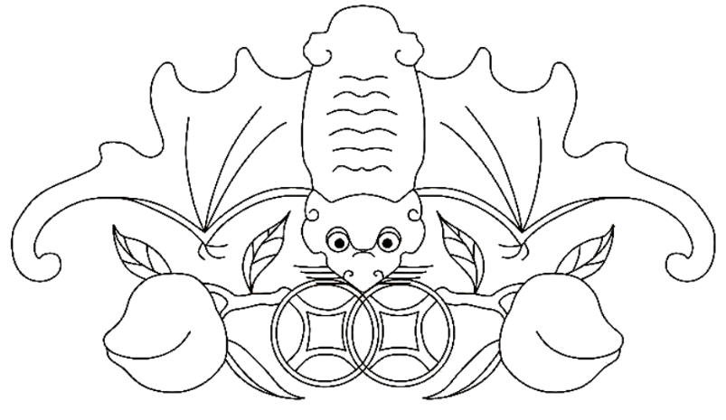
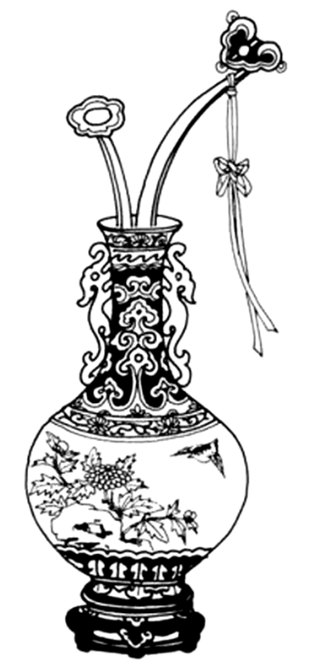
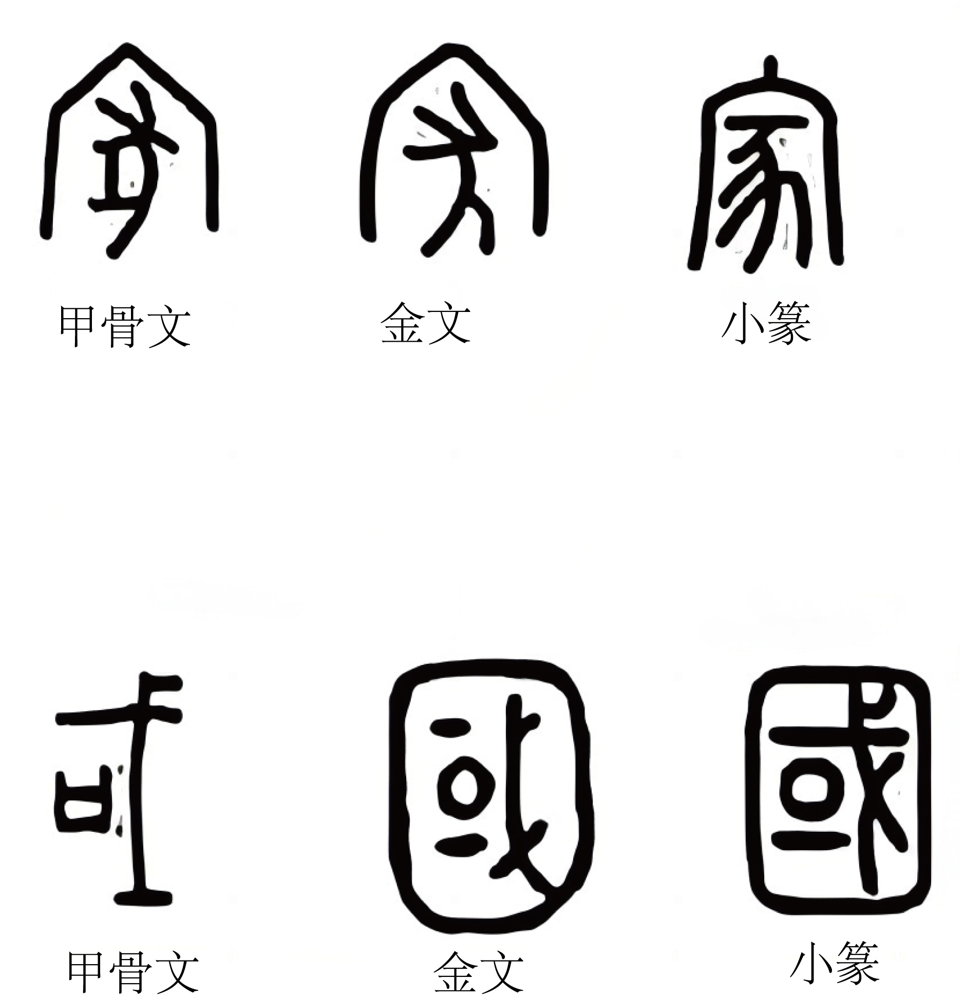
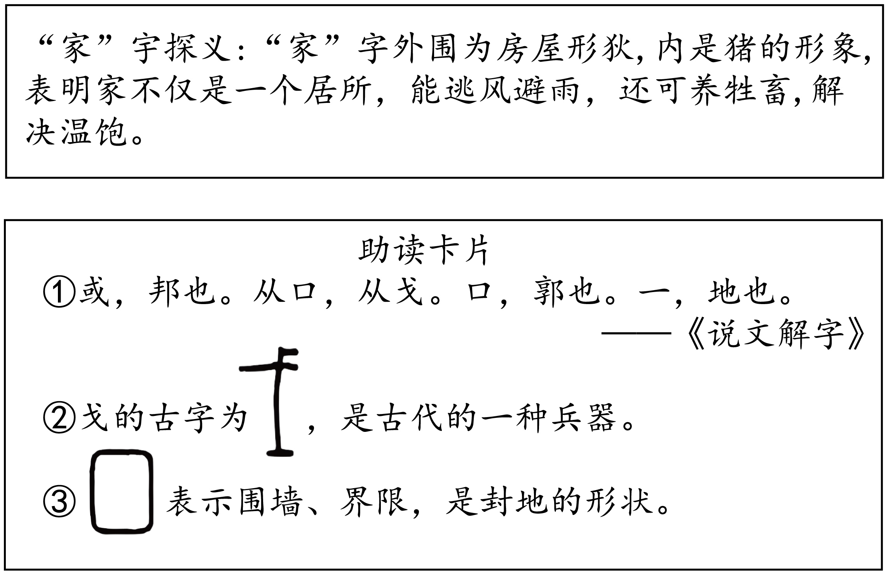

# 🌊 青岛中考语文分项专项练习 —— 01_基础积累与运用(模拟)

> 📌 **收录说明**：本练习全量收录自青岛市模拟试卷中该考点的所有试题、背景材料与详细解析（共收录 35 套试卷切片）。

---

### 📌 试题来源与标定卡片：山东省青岛市 • 2019年中考模拟

> - **来源试卷**：2019山东青岛语文试卷+答案+解析(word整理版)
> - **考试年份**：2019年
> - **所属模块**：01_基础积累与运用

| 232019年青岛市初中学业水平考试 (满分:120分　考试时间:120分钟) |
| --- |

一、积累及运用(20分)

1.下列各句中,加点字的注音和字形全都正确的一项是(3分)(　　)

A.绿茵茵的草地,踩在上面软软的,空气里弥(ní)漫着青草味儿,置身其中,我们仿佛回到了童年。

B.展览馆里,一只泥塑小猪半蹲在地上,眼珠瞥向一侧,嘴角露出狡黠(jié)的微笑,显得俏皮又灵动。

C.优秀的传统并不是静止不动的历史沉淀物,而是亘(ɡèn)古绵延的长流,这是不言而喻的。

D.北京世园会5G体验馆里,高清投影投射的画面上,老人笑脸上的褶(zhě)皱清晰可见,给人极大的视觉震憾。

2.下列各句中,加点成语使用不恰当的一项是(3分)(　　)

A.儿童剧《芝麻开门》剧情抑扬顿挫,台词诙谐幽默,受到现场观众的热烈称赞。

B.春天的公园,阳光明媚,草长莺飞,我们一家人徜徉其中,尽享美景。

C.在海军建军70周年阅兵式上,人民海军挥戈闯大洋,砺剑海天间,民族自豪感在我们心中油然而生。

D.先进文化理念是科技创新的思想源泉,科技创新推动文化产业转型升级,文化和科技是相辅相成的。

3.下列各句中,没有语病的一项是(3分)(　　)

A.原创节目能否获得市场成功和良好反响,关键是能从观众观看愿望中寻找契合点。

B.前不久,“中国品牌日”活动在上海举行,向全世界展示了中国产品的魅力。

C.面对停车难的问题,多管齐下的治理方式,让青岛的停车现状大为提升。

D.在大数据、人工智能等技术实现后,可以捕捉到用户心情、体温的变化,为用户提供更加个性化的服务。

4.根据提示默写诗文。(6分)

①《论语·学而》中曾子认为每天都要多次自我反省,其中“<u>　　　　　　　　</u>?”一句,是反省和朋友交往是不是能做到诚实守信。

②《次北固山下》中,“<u>　　　　　　</u>”一句,写出了春天潮水涨满后,江水浩渺,江面似乎与岸齐平的开阔景象。

③《左迁至蓝关示侄孙湘》中“<u>　　　　　　　　　</u>,肯将衰朽惜残年”两句,直接表明诗人心志:尽管自己已是衰朽残年,仍要为国家除去弊事。

④《酬乐天扬州初逢席上见赠》中表现出诗人豁达乐观胸怀的两句是“沉舟侧畔千帆过,<u>　　　　　　　　　</u>”。

⑤周敦颐在《爱莲说》中表达了“独爱莲”的情感,原因之一是莲“<u>　　　　　　　　</u>”,即莲虽经清水洗涤但不显得妖艳。

⑥《破阵子·为陈同甫赋壮词以寄之》中“马作的卢飞快,<u>　　　　　　　</u>”两句,描写了激烈的战斗场面,战马飞驰,弓弦雷鸣,万箭齐发。

阅读下面材料,完成5—6题。(5分)

近日,在某地铁站附近十字路口,市民过马路闯红灯,交警按规定处罚,责其现场观看交通安全宣传片。当地交警还对处罚方式进行了创新:违规者如果赶时间,可以选择发微信朋友圈,说明自己因闯红灯受处罚,只要集齐20个“赞”就可被放行。

这种“集‘赞’放行”的做法,引发了网友的激烈讨论。

赞成方:赞成。通过发朋友圈“自曝家丑”,不仅惩戒了本人,而且①<u>　　　　　　　　</u>,让大家以后都不闯红灯,比单纯处罚一个人效果更好。

反对方:反对。②<u> </u>

5.在①处补齐赞成方的理由,使上下文语意连贯。(2分)

答:<u> </u>

<u> </u>

6.在②处从不同角度为反对方补写理由。要求:语言简明,理由充分,言之成理。(3分)

答:<u> </u>

<u> </u>

<u> </u>

============================================================

### 📌 试题来源与标定卡片：山东省青岛市 • 2020年中考模拟

> - **来源试卷**：2020山东青岛语文试卷+答案+解析(word整理版)
> - **考试年份**：2020年
> - **所属模块**：01_基础积累与运用

| 232020年青岛市初中学业水平考试 (满分:120分　考试时间:120分钟) |
| --- |

一、积累与运用(19分)

1.下列各句中,加点字的读音正确的一项是(2分)	(　　)

A.赵州桥结构匀称(chèng),和四周景色配合得十分和谐。

B.杨家埠年画乡土气息浓郁,画风粗犷(kuàng)朴实。

C.水藻真绿,把终年贮(zhù)蓄的绿色全拿出来了。

D.“劳动创造幸福”,这箴(jiān)言值得我们铭记在心。

2.在下面文段横线处填入汉字,全都正确的一项是(2分)	(　　)

冰雪融化,草木萌发,燕子<u>　</u><u>①</u><u>　</u>然归来。不久,布谷鸟也来了。于是转入炎热的夏季,这是植物孕育果实的时期。到了秋天,果实成熟,植物的叶子渐渐变黄,在秋风中<u>　</u><u>②</u><u>　</u>地落下来。北雁南飞,活跃在田间草际的昆虫也都<u>　</u><u>③</u><u>　</u>声匿迹。

A.①偏　②籁籁　③销	B.①翩　②簌簌　③销

C.①偏　②簌簌　③消	D.①翩　②籁籁　③消

3.下列各句中,加点成语使用不恰当的一项是(2分)	(　　)

A.北京颐和园既有皇家园林之气派,又有江南园林之灵秀,设计别具匠心。

B.班长提出举行“为梦想加油”主题活动的建议,同学们随声附和,表示赞同。

C.自媒体时代,一些人通过博眼球的标题哗众取宠,我们要抵制这种现象。

D.几代“治沙人”面对重重困难,团结一致,锲而不舍,把千年沙漠变成了绿洲。

4.下列各句中,没有语病的一项是(2分)	(　　)

A.脱贫攻坚任务完成后,我国会有将近1亿左右贫困人口脱贫,提前实现减贫目标。

B.疫情期间,群众防控意识和卫生习惯大幅增强,为做好疫情防控工作打下了坚实基础。

C.加快推行“绿色乡村”建设,加强农村居住环境整治,是能否构建乡村发展新格局的重要条件。

D.我们欣赏文艺作品,不仅要理解文字表层含义,更要透过文字进入作品意境,体验阅读的快乐。

5.请在横线处补写诗文,完成古诗文积累卡。(6分)

| 古诗文积累卡 | 古诗文积累卡 |
| --- | --- |
| 博闻强识 | ①蒹葭苍苍,　　　　　。	(《诗经·蒹葭》)  ②　　　　　　,而无车马喧。	[陶渊明《饮酒(其五)》]  ③　　　　　　　　,化作春泥更护花。	[龚自珍《己亥杂诗(其五)》] |
| 修身明志 | 朋友想用字画装饰书房,可以推荐: ④斯是陋室,　　　　　。	(刘禹锡《陋室铭》) |
| 修身明志 | 中国人是有气节的!文天祥在《过零丁洋》中写道: ⑤　　　　　　　　?　　　　　　　　。 |

6.阅读下面文段,完成(1)(2)两题。(5分)	(　　)

不会引用诗句,不会使用修辞手法,表情达意只会用网络流行语……这是目前一些年轻人使用语言的现状。

①大部分网络流行语活泼有趣,结构简单;然而这种语言也存在明显不足,就是缺乏对细节的描摹,忽略人的细致感受。

②类似的例子还有很多。这些词语偶尔用用倒还可以,但使用频率太高,便可能是思维懒惰的征兆了。

③这一现状,与网络语言的流行密切相关。

④比如,面对大好春光只说个“赞”,就意味着省略了对春暖花开的细致感受;在键盘上随手敲出一串“哈哈哈”,就意味着放弃了对喜悦的贴切表达。

语言不只是表情达意的工具,还是思维的具体呈现。我们选择了<u>　</u><u>A</u><u>　</u>,也就等于选择了简单的表情达意的工具和<u>　</u><u>B</u><u>　</u>,如果都变得越来越简单,就应该警惕起来了。

(摘编自江丹《除了“哈哈哈”,我们还能说点什么》)

(1)调整①到④的顺序,使其成为语意连贯的文段。(3分)

答:<u> </u>

<u> </u>

(2)在A、B两处分别补写恰当的文字,使文段语意完整。(2分)

答:<u> </u>

<u> </u>

============================================================

### 📌 试题来源与标定卡片：山东省青岛市市南区 • 2021年中考二模

> - **来源试卷**：2021年山东省青岛市市南区中考二模语文试题（解析版）
> - **考试年份**：2021年
> - **所属模块**：01_基础积累与运用

<b>2020-2021学年度第二学期阶段性学业水平质量检测（二）</b>

<b>语文试题</b>

<b>（考试时间：120分钟：满分：120分）</b>

<b>说明：</b>

<b>本试题共三道大题，含23道小题。1一6小题为“积累及运用”，7-22小题为“阅 读"，23小题为"写作”。</b>

<b>一、积累及运用（19分）</b>

1. 下列各句中，加点字的注音正确的一顼是（   ）

A. 漫天大雪封住了他们的眼睛，使他们每走一步都忧心忡忡（zhǒng），因为一旦偏离方向，错过了贮（chǔ）藏点，无异于直接走向死亡。

B. 如果一只主红雀对着暖流歌唱起春天来，却发现自己搞错了，它还可以纠（jiū）正自己的错误，继续保持它在冬季的缄（xián）默。

C. 莎莉文老师想让我懂得“杯”。是“杯”，“水”是“水”，而我却把两者混（hún）为一谈。直到她将我的一只手放在喷水口下，突然间，我恍（huǎng）然大悟。

D. 我在朦胧（méng）（lóng）中，眼前展开一片海边碧绿的沙地来，上面深蓝色的天空 中挂着一轮金黄的圆月。

【答案】D

【解析】

【详解】考查字音。

A.忧心忡忡（zhǒng）——chōng，贮（chǔ）藏点——zhù；

B.缄（xián）默——jiān；

C.混（hún）为一谈——hùn；

故选D。

2. 下列各句中，加点字的字形正确的一项是（   ）

A. 朱光潜给青年的每一封书信都旁征搏引、阐发深刻，闪现着理性的光芒。相信读完此书，你在人生路途上会“有些力量”。

B. 国家公祭日之长鸣警钟振聋发馈，那些装睡梦游的罪恶灵魂无处循形。

C. 画家要深入全面地认识对象，必须身临其境，长期观察，做到胸有成竹，才能把握对象的精神实质，赋予对象以生命。

D. 在李公朴同志被害之后，警报叠起，形势紧张，明知凶多吉少，而闻一多先生大无畏 地站在群众大会上，大骂特务，慷慨淋漓。

【答案】C

【解析】

【详解】考查字形辨析。

A.旁征搏引——旁征博引；

B.振聋发馈——振聋发聩，循形——遁形；

D.叠起——迭起；

故选C。

3. 下列各句中，加点成语使用恰当的一项是（   ）

A. 中华的饮食文化源远流长，饭桌上那一盘盘脍炙人口的美食，蕴藏着日常饮食生活的美和意趣。

B. 在好朋友的眼中，她是一个彬彬有礼的人，脸上总带着微笑，和她相处起来格外舒服。

C. 有些人沉溺于网络的虚拟世界，并孜孜不倦，不但不利于个体的健康发展，而且会成为一种日益严重的社会问题。

D. 野外地质勘查工作者一意孤行，风餐露宿，潜心研究，用汗水和热情表达着对地质工作的热爱与坚守。

【答案】B

【解析】

【详解】考查成语运用。

A.脍炙人口：比喻好的诗文为人们赞美和传诵。不能直接形容美食，用错对象；

B.彬彬有礼：形容文雅有礼貌的样子。正确；

C.孜孜不倦：指工作或学习勤奋刻苦不知疲倦。不能形容沉迷于网络，色彩不当；

D.一意孤行：不接受别人的劝告，顽固地按照自己的主观想法去做。不能形容野外地质勘查工作者努力工作，色彩不当；

故选B。

作的热爱与坚守。

4. 下列各句中，没有语病

一项是（   ）

A. 电视剧《绝密使命》讲述了 20世纪30年代审央红色交通线上的隐秘故事，讴歌了我党地下交通线无名英雄们坚守信仰、勇于献身的精神。

B. 青岛智慧城市血液网的投运，将解决用血医院和血站之间信息不共享的痛点问题，加大城市血液安全和管理水平。

C. 湖北大学举办了首届“国际中文日”活动，不仅传承中华经典，弘扬礼仪之邦的精神， 而且展现了中国传统文化的极致之美。

D. 通过唐代王贞白的诗句“读书不觉春已深，一寸光阴一寸金”，让我们领略了古代学子们孜孜不倦、惜时如金的治学精神。

【答案】A

【解析】

【详解】考查病句修改。

B.搭配不当，“加大城市血液安全和管理水平”应改为“保障了城市血液安全，提高了管理水平”；

C.语序不当，将“传承中华经典，弘扬礼仪之邦的精神”与“展现了中国传统文化的极致之美”互换位置；

D.成分残缺，去掉“通过”或“让”；

故选A。

5. 请在横线处补写诗文。

①陶渊明的《饮酒》（其五）一诗中，南山优美的风景与诗人采菊时闲适自得的心境相合，表现出一种悠然自得意趣的诗句是：____________ ，______________ 。

②杜甫在《春望》一诗中，以“____________ ，______________”两句赋予花、鸟、人的情态，以乐景写哀景，表达了感时恨别之情。

③白居易的《卖炭翁》一诗中，“____________ ，______________。”描写了天气的寒冷，身上只穿着单衣的卖炭翁却巴望着更冷一些，写出了卖炭翁处境的艰难和矛盾的 心理。

④刘禹锡《酬乐天扬州初逢席上见赠》一诗中，“____________ ，______________。”借自然景物的变化，表达了新生事物必将取代旧事物的人生哲理，表现了作者的乐观精神。

⑤王湾的《次北固山下》中，描写一轮红日从海上冉冉升起，旧年还未过去，江面的春天已经悄然而至的诗句是：____________，____________<u>。</u>

⑥王勃在《送杜少府之任蜀州》中，用“____________ ，______________ ”来劝勉朋友离别时 不要哭泣。青春年少，当奋发有为，表明诗人豁达的情怀。

【答案】    ①. 采菊东篱下    ②. 悠然见南山    ③. 感时花溅泪    ④. 恨别鸟惊心    ⑤. 可怜身上衣正单    ⑥. 心忧炭贱愿天寒    ⑦. 沉舟侧畔千帆过    ⑧. 病树前头万木春    ⑨. 海日生残夜    ⑩. 江春入旧年    ⑪. 无为在歧路    ⑫. 儿女共沾巾

【解析】

【详解】本题考查名句名篇默写。默写题作答时，一是要透彻理解诗文的内容；二是要认真审题，找出符合题意的诗文句子，三是答题内容要准确，做到不添字、不漏字、不写错字。注意：篱、溅、炭贱、畔、生。

<b>语言运用（4分）</b>

6. 在中华文明悠久的历史中，爱国主义精神一直是中华民族得以凝聚、生存和发展的 强大动力。作为当代中学生，应该心系家国天下。为此，学校组织各班开展爱国主题日 活动。请按要求，将本班活动任务补充完整。

（1）【任务一】开展主题活动一一根据提示，将活动内容补充完整，填写在下面横线上。

（一）激发心志：爱国人物故事会。

（二）A：___________ B：_________________

（三）启发心智：爱国名言展示会。

（2）【任务二】撰写活动文稿——请仿照划线句子，补写一个句子，使文意更丰富。

孟子曰：“人有恒言，皆曰：‘天下家国’。”个人与国家的命运息息相关。爱国， 是我们的本能。<u>关心祖国的命运，为之奋斗为之牺牲；赞美祖国的山河，为之描画为之歌咏；热爱祖国的语言文字，为之沉醉为之感动；C</u>_________________……这些都是爱国情怀的表现。

【答案】（1）    ①. A.陶冶心灵    ②. B.爱国诗词朗诵会  （活动标题与内容相符即可）

（2）C.歌颂祖国的发展，为之振奋为之自豪。（言之成理即可）

【解析】

【小问1详解】

考查活动设计，开放类试题，与已有活动格式相同，适合学生开展，主题鲜明即可。如：书写热情：爱国故事征文比赛。

【小问2详解】

考查仿写，开放类试题，与画线句格式相同，语义相关即可。如：描绘祖国的蓝图，为之激越为之昂扬。

============================================================

### 📌 试题来源与标定卡片：山东省青岛市崂山区 • 2022年中考一模

> - **来源试卷**：2022年山东省青岛市崂山区中考一模语文试题（解析版）
> - **考试年份**：2022年
> - **所属模块**：01_基础积累与运用

<b>2022年山东省青岛市崂山区中考一模九年级</b>

<b>语文试题</b>

<b>（考试时间：120分钟；满分：120分）</b>

<b>本试题共三道大题，含24道小题。所有题目均在答题卡上作答，在试题上作答无效。</b>

<b>一、积累与运用【本题满分20分】</b>

1. 下列各句，加点字

读音全都正确的一项是（   ）

站在半山腰曲折迂回的小路上，我被眼前这四面群山簇拥的村落深深地震撼了。古村所呈现出的那份神秘，那份静谧自然，那份不染纤尘、不可亵渎的美丽，一霎时，让我的内心静了下来。

A. xū  mì   qiān   shà

B. yū  mì   xiān   shà

C. yū   bì   qiān   chà

D. xū   bì   xiān   shà

【答案】B

【解析】

【详解】迂回（yū huí）：回旋；环绕；

静谧（jìng mì）：安静；形容静寂无声或恬静的模样；

纤尘（xiān chén）：细小的灰尘；

一霎时（yí shà shí）：很短的时间；

故选B。

2. 下列各项中，加点字有误的一项是（   ）

A. 人们通过网上献花、掌上观展等“云”缅怀的方式表达对英雄们的景仰与深切怀念。

B. 春日的轻盈、夏日的浪漫，青岛的海岸线宛然一幅画，快来一起领略这最美海岸线吧！

C. 镇上很多人都能讲出这所学校的辉煌历史，那些故事总能与一些如雷惯耳的大学名字联系起来。

D. 这里有雕梁画栋，古色古香

王爷府，游客们可以在这里感受浓浓的蒙古族风情。

【答案】C

【解析】

【详解】本题考查字形辨析。

C．如雷惯耳——如雷贯耳；

故选C。

3. 下列各句，加点词语使用不恰当的一项是（   ）

A. 这位大数学家尽管已是耄耋之年，依然勤耕不辍，发表了多篇具有重要意义的论文。

B. 这个县依托食用菌产业优势，吸纳当地在家赋闲的农村妇女进厂上班，实现家门口就业增收。

C. 美国白宫说辞与疫情报告大相径庭，美国媒体说政府未向民众传递真实信息。

D. 初春时节油菜花开，游客在花海边骑行，感受春天的气息，真的让人有如沐春风之感。

【答案】D

【解析】

【详解】本题考查词语使用。

A.不辍：不止；不绝。此处形容写作勤奋，不停创作，使用正确；

B.赋闲：没有职业在家闲着。此处形容没有职业的农村妇女，使用正确；

C.大相径庭：表示彼此相差很远或矛盾很大。此处形容美国白宫说辞与疫情报告彼此相差很远，使用正确；

D.如沐春风：比喻同品德高尚且有学识的人相处并受到熏陶，犹言和高人相处。比喻得到教益或感化，就像受到春风的吹拂一般。此处形容感受春天的气息，使用不当；

故选D。

4. 下列各句，没有语病的一项是（   ）

A. “双减”政策不仅能减轻学生过重的作业负担，还为学生的全面发展撑起一片天。

B. 当前，实体书店面临着生存困境，能否实现逆袭关键在于探索出适合未来的发展模式。

C. 春天的崂山，漫山遍野的樱桃花开了，花开十里，香气漫山，真是一个旅游的好季节啊。

D. 学校实施“校园足球计划”，旨在普及足球运动，进一步提高青少年足球运动的水平为目的。

【答案】A

【解析】

【详解】本题考查病句辨析。

B．两面对一面；删去“能否”；

C．搭配不当；将“好季节”改为“好地方”；

D．句式杂糅；删去“为目的”；

故选A。

5. 根据提示，填写名句。

（1）念天地之悠悠，__________ 。（陈子昂《登幽州台歌》）

（2）黄发垂髫，__________。（陶渊明《桃花源记》）

（3）《送杜少府之任蜀州》中诗人用两人处境相同、感情一致来宽慰朋友的诗句是__________，__________。

（4）苏轼在《水调歌头》中用“__________，__________”一句，写自己乘月舞蹈，表达对人间的热爱。

【答案】    ①. 独怆然而涕下    ②. 并怡然自乐    ③. 与君离别意    ④. 同是宦游人    ⑤. 起舞弄清影    ⑥. 何似在人间

【解析】

【详解】本题考查名句名篇默写。默写题作答时，一要透彻理解诗文内容；二要认真审题，找出符合题意的诗文句子；三是答题内容要准确，做到不添字、不漏字、不写错字。

本题中注意“怆、涕、怡、宦、清、似”等字的正确书写。

6. 阅读下面一则新闻，回答问题。

①2022年北京冬奥会上，挪威以16金8银13铜的成绩，位列金牌榜和奖牌榜第一位。挪威参加冬奥会的运动员不足百人，整体实力给人留下深刻印象。_________。据估算，挪威全国有1万余家体育俱乐部，为儿童接受体育运动启蒙和全民广泛参与冰雪运动提供了良好的设施条件。

②挪威的儿童和青少年体育教育不设置奖牌，也禁止给未满13岁的孩子排名打分。挪威冬奥代表团团长托尔•奥弗莱博对此表示说：“孩子们运动的目的不在于竞争和取胜。”

（1）将下列句子依次填入横线处，使之上下文句意衔接。（只填序号）

①更为重要的是，挪威人有爱好体育运动的传统。

②其国土超过1/3位于北极圈内。

④很多地方一年中更是近一半时间是冬天。

③挪威具备开展冰雪运动得天独厚的自然条件。

⑤很多人童年的快乐来自于冰天雪地中的尽情玩耍，父母往往是孩子的第一任教练。

（2）现实生活中有些人认为参加体育运动的目的就是为了获奖牌、拿名次。请结合第2段中的内容，写一段议论性的文字，辩证分析这种看法。要求：观点明确，表达充分。

【答案】（1）③②④①⑤

（2）要求：观点明确，有辩证分析，有条理。

【解析】

【小问1详解】

本题考查排序。

根据前文“挪威参加冬奥会的运动员不足百人，整体实力给人留下深刻印象”和选项，可知，横线处谈的是挪威的做法。③句讲挪威的自然条件，是开展冰雪运动的前提，应排第一位；②句承③句谈的是地理优势，应排第二位；④句承地理位置谈气候条件，应排第三位；①句谈比地理优势更重要的条件是“挪威人有爱好体育运动的传统”，应排第四位；⑤句谈儿童冰雪运动的情况，与下文联系紧密，应排第五位。因此排序为：③②④①⑤。

【小问2详解】

本题考查看法。根据第2段“挪威的儿童和青少年体育教育不设置奖牌，也禁止给未满13岁的孩子排名打分。挪威冬奥代表团团长托尔•奥弗莱博对此表示说：‘孩子们运动的目的不在于竞争和取胜。’”的内容，辩证分析表达自己的看法即可。

示例：我觉得运动的目的不在于竞争和取胜是正确的，并且在儿童和青少年体育教育不设置奖牌，也禁止给未满13岁的孩子排名打分的做法也有可取之处，但设置奖牌（或拿奖牌）也是为了激发人们对运动的兴趣，不能一刀切。

============================================================

### 📌 试题来源与标定卡片：山东省青岛市市北区 • 2022年中考一模

> - **来源试卷**：2022年山东省青岛市市北区中考一模语文试题（解析版）
> - **考试年份**：2022年
> - **所属模块**：01_基础积累与运用

<b>2021-2022学年度第二学期阶段性质量检测</b>

<b>九年级语文试题</b>

<b>（考试时间：120分钟   满分：120分）</b>

<b>一、积累与运用（14分）</b>

<b>2022年2月20日，北京冬奥会圆满落幕。学校组织了“无与伦比的冬奥会”展示活动，你所在的小组负责完成一期主题为“北京冬典，意义非凡”的公众号推文。</b>

1. “公众号第一板块”是同学们对冬奥开落式文化价值的閘释。2月4日，立春，冬奥开幕式上，二十四节气倒计时将中华文化的瑰丽与智慧展现得淋lí____尽致，饱含冬去春来的诗意。“黄河之水”倾污而下，五环“破冰而出”，“迎客松”烟火绚烂绽放……chà___那间点亮了人们的记忆。当来自世界各地的代表团入场，19首世界名曲响彻“鸟巢、震hàn____人心。开幕式的各个元素满载着中国人的浪漫底色，zhānɡ____显着华夏民族的博大胸怀，为疫情肆虐的世界带来了宝贵的力量与希望。

（1）同学们要为这则材料录制音频，加点字拼音拿不准，请你选出正确的一项（   ）

A. ɡuī    xuàn    zài    nüè	B. méi    càn     zài    niè

C. méi    càn     zǎi    nüè	D. ɡuī    xuàn    zǎi    nüè

（2）小雅同学整理文稿，有几个字的书写拿不准，请你根据拼音选择正确字形（   ）

A. 离     霎     憾     章	B. 漓     刹     撼     彰

C. 漓     刹     憾     章	D. 离     霎     撼     彰

【答案】（1）A    （2）B

【解析】

【小问1详解】

本题考查字音。

瑰丽：拼音guī lì，形容外貌异常美丽，可与玫瑰相媲美。

绚烂：拼音xuàn làn，光彩鲜明耀眼。

满载：拼音mǎn zài，运输工具装满了东西或装足了规定的吨数。

肆虐：拼音sì nüè，任意残杀或迫害；起破坏作用。

故选A。

【小问2详解】

本题考查字形。

淋漓尽致：形容文章、谈话表达得十分透彻，充分。也形容暴露得彻底。漓，读作lí。

刹那：极短暂的时间；瞬间。刹，读作chà。

震撼：震动；摇撼。撼，读作hàn。

彰显：分明而确定地表现。显著；明显。彰，读作zhānɡ。

故选B。

2. “公众号第二板块〞，同学们搜集了开幕式关于雪花背后的故事，整理的材料在语序上存在问题。请你选出排序正确的一项（   ）

①他们把从中国传统图形中提炼出的文化元素，与中国结图案和吉祥纹样等巧妙结合，赋予了雪花以简洁利落的线条和精致有张力的轮廊，空灵而又浪漫。②一片雪花代表一个国家，来自世界各国的雪花汇聚到一起，形成一朵人类共同的雪花，寓意团结友爱的精神，体现出“一起向未来”的情怀。③这些信息都蕴含在巧妙的设计细节之中。④但是谁能想到这朵雪花的设计竟然易稿300多次。⑤开幕式中那朵硕大的雪花，给每个观众都留下了深刻的印象。⑥设计师不断突破自己，把对中国美学的理解融入一片片雪花当中。

A. ②⑥①③⑤④	B. ⑤④⑥①②③

C. ⑥①④②③⑤	D. ⑤⑥①④②③

【答案】B

【解析】

【详解】本题考查句子排序。

第⑤句引出中心话题“开幕式中那朵硕大的雪花”；第④句“这朵雪花的设计”承接第⑤句的“那朵硕大的雪花”；第⑥句说明设计师在设计这朵雪花时曾易稿300多次，最终取得突破，因此，第⑥句应在第④句后；第①句是对第⑥句“中国美学”的具体说明，所以第①句应放在第⑥句后；第②句阐述雪花的寓意，应放在第①句后；第③句“这些信息”是指雪花的寓意，所以第③句应放在第②句后。因此正确顺序为：⑤④⑥①②③

故选B。

3. “公众号第三板块”文字介绍部分，有一项加点词语使用不怡当，请选择（   ）

在冬奥比赛中，运动员们的拼搏努力，给同学们留下了深刻的印象。17岁的中国小将苏翊鸣，在单板滑雪男子大跳台的决赛中夺金封神，国人津津乐道。隋文静、韩聪以其无与伦比的表演四梦花滑赛场，为他们15年的职业生涯西上圆满句号。

短道速滑比赛，武大靖在体力不支的情况下随机应变，奋力助队友车冠，凸显团队精神。自由式滑雪女子空中技巧决赛中，“老格” 徐梦桃夺得金牌，终于得以耀武扬威。

A. 津津乐道	B. 无与伦比

C. 随机应变	D. 耀武扬威

【答案】D

【解析】

【详解】本题考查词语辨析。

A.津津乐道：很有兴趣地说个不停。使用正确；

B.无与伦比：意思是指事物非常完美，没有能够与它相比的同类的东西。使用正确；

C.随机应变：随着情况的变化灵活机动地应付，形容临事能妥善变通处置。使用正确；

D.耀武扬威：炫耀武力，显示威风。这里形容徐梦桃夺得金牌，贬词褒用，感情色彩不对；

故选D。

4. 在“公众号的第四板块”，小布同学写的文字在衣达上有多处语病。请你选出画线句不需要修改的一项（   ）

北京冬奥会申办成功以来，中国冰雪运动“南展西扩东进”，为全民健身带未了新的动力。<u>A</u><u>.</u><u>超过3亿多人参与了冰雪运动。B.活力四射的运动场上，中国有些冰雪项目在两年多时间里实现了世界先进水平，C.不但如此，冬奥会还为中国经流发展，科技进步注入活力，为了兑现“科技冬奥”中国攻克一批关键核心技术，示范一批前沿引领技术。D.氢能出行、无人驾驶、智能机器人等新技术，既对中国经济社会高质量发展发挥了积极作用，也服务了北京冬奥会。</u>

A. A	B. B	C. C	D. D

【答案】C

【解析】

【详解】本题考查病句辨析。

A.语意重复，“超过”或“多”删去其一；

B.搭配不当，“实现”改为“达到”；

D.语序不当，改为：既服务了北京冬奥会，也对中国经济社会高质量发展发挥了积极作用；

故选C。

5. 小组决定给公众号的四个板块各起一个名字。请根据示例，补写第二至四板块的名称。

| 版块 | 名称 |
| --- | --- |
| 第一板块 | 冬奥开幕*文化与智慧之美 |
| 第二板块 |  |
| 第三板块 |  |
| 第四板块 |  |

【答案】①冬奥雪花·设计与情怀之美；②冬奥比赛·拼搏与努力之美；③冬奥运动·活力与科技之美（不限于此，不要求句式等一致）

【解析】

【详解】本题考查活动设计。根据公众号的主题“北京冬典，意义非凡”的提示和冬奥会圆满落幕的相关知识，围绕冬奥的相关内容设计三个板块即可。形式上参照示例，采用“冬奥（项目）+某某之美”。

示例：

（1）冬奥奖牌·文化与视觉之美；

（2）冬奥运动·喜庆与绿色之美；

（3）冬奥闭幕·激情与穿越之美。

============================================================

### 📌 试题来源与标定卡片：山东省青岛市市北区 • 2022年中考二模

> - **来源试卷**：2022年山东省青岛市市北区中考二模语文试题（解析版）
> - **考试年份**：2022年
> - **所属模块**：01_基础积累与运用

<b>2021—2022学年度第二学期阶段质量检测九年级语文</b>

<b>（考试时间：120分钟；满分：120分）</b>

<b>本试题共三道大题，含24道小题。1-5小题为“积累与运用”；6-23小题为“阅读”；24小题为“写作”。所有题目均在答题卡上作答，在试题上作答无效。其中，选择题要求用2B铅笔正确涂写在“客观题答题区”。</b>

<b>一、积累与运用（15分）</b>

亲爱的同学们：

初夏是收获的时节，你们将离开熟悉的母校，迈入人生的新征程。为此，我们设计了一次语文综合性学习活动。请你参与其中，完成下列任务。

【校园打卡一：百花园】

1. 学校百花园的美景吸引了许多同学。下面是某位同学写的一个小片段，请你阅读并完成任务。

初夏的爬山虎，与秋日截然不同，烟霞般的红tuì去了，变换成这一片碧玉似的绿，像把终年贮蓄的绿色全拿出来了。微风吹起，一把把小扇子随风起舞，于是那绿流动起来，真让人目xuàn神迷。绕架垂条密，浮阴入夏清。鲜yán明媚的校园之夏，承载着春的希望，酝酿着秋的殷实。漫步其中，一种情愫在心头潜滋暗长。

（1）文段中拼音所对应的字形全都正确的一项是（     ）

A.褪  炫  研   B.退  眩  妍

C.褪  眩  妍   D.退  炫  研

（2）文段中加点字的读音全都正确的一项是（     ）

A.chǔ  yīn  qián    B.zhù  yīn  qián

C.chǔ  yān  qiǎn    D.zhù  yān  qiǎn

【校园打卡二：心愿墙】

2. 心愿墙上贴满了同学们的心愿贴纸，其中出现了一个用错成语的句子，请你找出来。

还记得经典诵读大赛时，全班同学抑扬顿挫的吟诵，赢得了评委和观众们的阵阵掌声；还记得敬爱的老师们或在教学设计上另辟蹊径，或在课堂形式上自出心裁，带领同学们遨游知识的海洋；还记得我们肃立于栩栩如生的孔子塑像前宣誓，立志不负先哲，凝浩然正气，做时代新人。岁月匆匆，我愿将这些难忘的浮光掠影永存心间，作为我人生旅途中宝贵的行囊。

A. 抑扬顿挫	B. 自出心裁	C. 栩栩如生	D. 浮光掠影

【校园打卡三：宣传栏】

3. 学校宣传栏制作了一期“师生心语”采访报道，其中有语病的一项是（   ）

A. 形式多样的社团活动不仅丰富了“双减”后学生的校园生活，更为学生的健康成长奠定了基础。

B. 经典之所以成为经典，在于它独到的艺术表现形式，以及它丰富而深刻的思想内涵。

C. 我最爱香气四溢的食堂，美味的饭菜驱走身体内最后一丝寒意，使一上午学习的劳累顿时烟消云散。

D. 优异成绩的获得，必须经过刻苦勤奋的学习而取得，学到了什么，取决于做了什么。

【校园打卡四：图书馆】

4. 喜欢阅读的同学打卡学校图书馆，他们热心帮助图书馆老师张贴对联。三副对联都只完成了一半，请你来选出另一半。下列最恰当的一项是（   ）

（1）笔下日月长  <u>           </u>

（2）<u>           </u>  书林须漫步

（3）须读古今书  <u>           </u>

A. （1）胸中藏华章  （2）学海要遨游  （3）欲知中外事

B. （1）胸中藏华章  （2）乾坤任纵横  （3）纵览天下事

C. （1）书中天地大  （2）学海要遨游  （3）欲知中外事

D. （1）书中天地大  （2）乾坤任纵横  （3）纵览天下事

5. 请结合校园打卡的过程及感受，为此次综合实践活动拟写一个主题名称，并说明理由。

【答案】1.     ①. C    ②. B    2. D    3. D    4. C

5. 名称示例1：寻美校园，追忆时光

名称示例2：校园回眸，依依惜别

理由说明：合乎题意即可。

【解析】

【1题详解】

（1）文考查字形。

褪去，tuì qù，脱掉(衣服等)。

目眩神迷，mù xuàn shén mí，所见情景令人惊异。

鲜妍，xiān yán，光彩美艳的样子。

故选C。

（2）考查字音。

贮蓄，zhù xù，储存，积聚。

殷实，yīn shí，富裕、充实。

潜滋暗长，qián zī àn zhǎng，意思是暗暗地不知不觉地生长。

故选B。

【2题详解】

考查成语运用。

A.抑扬顿挫：形容声音高低起伏，和谐而有节奏。正确；

B.自出心裁：出于自己的创造。指不抄袭、模仿别人。正确；

C.栩栩如生：形容艺术形象非常生动逼真，像活的一样。正确；

D.浮光掠影：像水面的光和掠过的影子一样，一晃就消逝，形容印象不深刻。 又指文章言论的肤浅,无真知实学。不能形容记忆中的某些画面，望文生义；

故选D。

【3题详解】

考查修改病句。

D．“优异成绩的获得，必须经过刻苦勤奋的学习而取得”句式杂糅，去掉“而取得”。

故选D。

【4题详解】

考查对联。

第一空：“日月长”是主谓短语，“藏华章”是动宾短语，“天地大”是主谓短语。应用“书中天地大”；

第二空：“书林”是偏正式名词，“学海”是偏正式名词，“乾坤”是并列式名词，应用“学海要遨游”；

第三空：“古今”是并列式名词，“中外”是并列式名词，“天下”是偏正式名词。应用“欲知中外事”；

故选C。

【5题详解】

考查拟写主题，开放类试题，结全自己校园打卡的过程及感受，言之成理即可。如：最美校园，最美青春。理由：我们在初中的校园里经过了三年的时光，这三年时光有我们的拼搏与奋斗，我们的欢乐与泪水，是我们最美的青春记录。以此为题，即表达了对校园的赞美，也表达对青春的歌颂。

============================================================

### 📌 试题来源与标定卡片：山东省青岛市市南区 • 2022年中考一模

> - **来源试卷**：2022年山东省青岛市市南区中考一模语文试题（解析版）
> - **考试年份**：2022年
> - **所属模块**：01_基础积累与运用

<b>2021-2022学年度第二学期阶段性学业水平质量检测</b>

<b>九年级语文试题</b>

<b>（考试时间：120分钟；满分：120分）</b>

<b>说明：</b>

<b>1</b><b>.</b><b>本试题共三道大题，含24道小题。1—7小题“积累与运用”，8—23小题 “阅读”， 24小题“写作”。</b>

<b>2</b><b>.</b><b>所有题目均在答题卡上作答，在试题上作答无效。</b>

<b>一、积累与运用【本题满分20分】</b>

1. 下列各句中，加点字的注音完全正确的一项是（   ）

A. 一座草顶、竹篾（niè）泥墙的小屋出现在梨树林边。

B. 《清明上河图》采用兼工带写的手法，线条遒劲（jìn），笔法灵动。

C. 那轻，那娉（pīng）婷，你是，鲜妍，百花的冠冕你戴着。

D. 三妹怂（cǒng）恿着她去舅舅家拿了一只浑身黄色的小猫来。

【答案】C

【解析】

【详解】本题考查字音。

A.竹篾（niè）—— miè；

B.遒劲（jìn）——jìng；

D.怂（cǒng）恿——sǒng；

故选C。

2. 下列各句中，加点字的字形完全正确的一项是（   ）

A. 祖父好，在路上轻易不谈渥旋的事情，倒是一路谈着进京赶考的掌故。

B. 雪花火炬、折柳寄情等精彩环节让北京冬奥会开闭幕式高潮叠起。

C. 让那些看不起民众的人去赞美那直挺秀崎的楠木吧，我要高声赞美白杨树。

D. 融雪处裸露出大山黧黑的骨骼，有如刀削一般，富有雕塑感。

【答案】D

【解析】

【详解】本题考查字形。

A.渥旋——斡旋；

B.叠起——迭起；

C.秀崎——秀颀；

故选D。

3. 下列句子中加点的词语使用不恰当的一项（   ）

A. 

了这一刻，面对技术封锁，多少人殚精竭虑，青丝变白发，却无怨无悔。

B. 人们有的坐火车，有的驾车，参差不齐地赶来等待这位大师的接见。

C. 闻先生的书桌凌乱不堪，他却并不在意，他正向古代典籍钻探，兀兀穷年，沥尽心血。

D. 过去见一位作者外出写生，两个礼拜就画了一百多张，这当然只能浮光掠影。

【答案】B

【解析】

【详解】本题考查词语运用。

A.殚精竭虑：使尽了精力，费尽了心思。本句用来形容人们费尽精力攻克技术难关，使用恰当；

B.参差不齐：形容水平不一或很不整齐。本句用来形容人们用不同的方式赶来，使用不恰当；

C.兀兀穷年：用心劳苦地一年到头这样做。本句用来形容闻先生长年辛苦工作，使用恰当；

D.浮光掠影：意思是像水面的光和掠过的影子一样，一晃就消逝。比喻观察不细致或印象很不深刻。也比喻世事稍纵即逝，不可捉摸。本句用来形容一位作者作画时不细致，使用正确；

故选B。

4. 下面句子没有语病的一项是（   ）

A. 落实粮食安全责任的首要任务是：能否稳定粮食播种面积。

B. 小说中那种激情四射雄辩滔滔的精神让他沉醉，他觉得自己太缺少激情了。

C. 在发明文字以前，保存智慧不但靠记忆；文字发明以后，而且使用了书籍。

D. 丰富多彩的节日习俗，激发了文人们的灵感，他们由此创作了无数名篇佳作。

【答案】D

【解析】

【详解】本题考查病句辨析。

A.一面对两面，应删掉“能否”；

B.搭配不当，“精神”可改为“语言魅力”；

C.关联词语运用不当，可删掉“不但”，把“而且”改为“则”；

故选D。

5. 根据提示默写诗文

①刘禹锡在《酬乐天扬州初逢席上见赠》中“_________________________，__________________________。”一句，表现出诗人面对世事的变迁和仕宦的升沉的豁达襟怀。

②岑参《白雪歌送武判官归京》“_____________________________，_____________________________。”一句中，以春花喻冬雪，给萧条寒冷的边塞平添无限温暖与希望。

③杜甫《春望》一诗中，表达安史之乱时，消息隔绝、久盼家人音讯不至时迫切心情的句子是：“_____________________________，_____________________________。”

④晏殊在《浣溪沙·一曲新词酒一杯》中既感慨繁华易尽，又表达旧识重来的欣喜的诗句是：“_____________________________，_____________________________。”

⑤辛弃疾在《南乡子·登京口北固亭有怀》中赞扬孙权年少有为，不畏强敌，并战而胜之的句子是：“_____________________________，_____________________________。”

⑥《虽有嘉肴》中，说明学习和教学之后能够让人发现自身不足和困惑的句子是：是故_____________________________，_____________________________。

【答案】    ①. 沉舟侧畔千帆过    ②. 病树前头万木春    ③. 忽如一夜春风来    ④. 千树万树梨花开    ⑤. 烽火连三月    ⑥. 家书抵万金    ⑦. 无可奈何花落去    ⑧. 似曾相识燕归来    ⑨. 年少万兜鍪    ⑩. 坐断东南战未休    ⑪. 学然后知不足    ⑫. 教然后知困

【解析】

【详解】本题考查名句名篇默写。注意易错字词：畔、梨、烽、抵、曾、兜、鍪、断。

6. 汉字是一种由图形演变而来的表意文字。下图是对古体“德”字的每一部分的解释。请根据下图，解释“德”的含义。（20字以内）

【答案】向着正确的方向（方向正确的前进 、瞄准正确的方向）行走，按照本心去做事情（不忘初心）。

【解析】

【详解】本题考查汉字分析。

根据图中对古体“德”字的每一部分的解释，把各部分的意义合成一句通顺的话，不要超过规定字数即可。

如：有正确的目标、正确的方向，按照本心做人处世。

7. 阅读下面一段文字，完成文后问题。

①同时也为中国特色社会主义建设提供了不可或缺的文化土壤。②这股热潮的出现反映出我们对中华优秀传统文化的传承与发展，展示了国人的文化自信。③中华优秀传统文化是我们的精神命脉，为民族的发展和壮大提供了丰厚的精神滋养。④2021年《唐宫夜宴》爆火之后，2022年《只此青绿》又惊艳亮相，兴起了一股国风热潮。

由此可见，__________________

（1）上面一段文字中①②③④句的正确语序应该为（   ）

A. ④②③①	B. ④①②③	C. ③④①②	D. ③①②④

（2）请在文段横线处补充一句话，作为这段文字的论点。（20字以内）

【答案】（1）A    （2）我们应该继承和发扬中华优秀传统文化。

【解析】

【小问1详解】

本题考查句子的衔接与排序。

阅读语段内容可知，本段文字先由文艺节目引出议论话题“国风热潮”，然后承接“热潮”写出其作用，即传承发展了“中国优秀传统文化”、展现了“国人的文化自信”，最后诠释“中华优秀传统文化”的内涵，用“是……同时也……”的句式展开叙述。正确的排列顺序应是：④②③①。

故选A。

【小问2详解】

本题考查概括中心论点。

本段文字由社会现象引出论题，然后论证“中国传统文化”的作用，最后可以提出呼吁作为论点，如“我们应该继承和发扬中华优秀传统文化”。注意字数限制。

============================================================

### 📌 试题来源与标定卡片：山东省青岛市市南区 • 2022年中考二模

> - **来源试卷**：2022年山东省青岛市市南区中考二模语文试题（解析版）
> - **考试年份**：2022年
> - **所属模块**：01_基础积累与运用

<b>2021-22022学年度第二学期阶段性学业水平质量检测</b>

<b>九年级语文试题</b>

<b>一、积累与运用【本题满分20分】</b>

1. 下列各句中，加点字的注音完全正确的一项是（   ）

A. 水藻真绿，把终年贮（chǔ）蓄的绿全拿出来了。

B. 这两幅画倒

铢两悉称（chèng），很难分出谁优谁劣来。

C. 其时进来的是一个黑瘦的先生，八字须，戴着眼镜，挟（jiā）着一叠大大小小的书。

D. 大家都去找这小猫，想给它以一顿惩（chéng）戒。

【答案】D

【解析】

【详解】本题考查常见易误读字。

A．贮（chǔ）蓄——zhù；

B．铢两悉称（chèng）——chèn；

C．挟（jiā）着——xié；

故选D。

2. 下列各句中，加点字的字形完全正确的一项是（   ）

A. 每当我夜间疲倦，正想偷懒时，仰面灯光中瞥见他黑瘦的面貌，似乎正要说出抑扬顿措的话来。

B. 叶圣陶先生重视语文，努力追求完美，并且以身作则，鞠躬尽瘁。

C. 闻一多先生在作为革命家的方面，情况就迥乎不同，而且一返既往了。

D. 我们要规划自己的职业生涯，使事业和人生呈现缤纷和谐、相德益彰的局面。

【答案】B

【解析】

【详解】本题考查字形。

A．抑扬顿措——抑扬顿挫；

C．一返既往——一反既往；

D．相德益彰——相得益彰；

故选B。

3. 下列句子中加点的词语使用不恰当的一项（   ）

A. 他们的燃料已经告罄，而温度计却指在零下40摄氏度。

B. 小李为人热情，无论遇见谁，都要拉着对方强聒不舍，大家都很喜欢和他聊天。

C. 重要的书必须常常反复阅读，每读一次都会觉得开卷有益。

D. 带着这么一张脸，不管从事什么职业，穿什么服饰，在什么地方，都不会有一种鹤立鸡群、引人注目的可能。

【答案】B

【解析】

【详解】考查成语运用。

A.告罄：指财物用完或货物售完。正确；

B.强聒不舍：形容别人不愿意听，还絮絮叨叨说个不停。与后面的“大家都很喜欢和他聊天”矛盾；

C.开卷有益：读书总有益处。常用以勉励人们勤奋好学，多读书就会受益。正确；

D.鹤立鸡群：像鹤站在鸡群中一样，比喻一个人的仪表或才能在周围一群人里显得很突出。正确；

故选B。

4. 下面句子没有语病的一项是（   ）

A. 同学们要在初中生活里不断成长、不断思考，提高担当。

B. 政策支持力度的大小，营商环境的好坏，是青岛市经济是否快速发展的主要因素。

C. “95后”外科学博士研究生潘文锋参与了外事志愿服务50余天、近500多个小时。

D. 为防止“带疫上岗”行为不再出现，近期上海开展全市范围的配送寄递人员防疫管理专项行动。

【答案】B

【解析】

【详解】本题考查病句的修改。注意病句一般有搭配不当、语序不当、成分残缺或赘余、结构混乱、不合逻辑、表意不明等类型。

A．成分残缺，应在句末加上“意识”；

C．不合逻辑，应将“50余天、近500多个小时”改为“50余天，工作时长近500小时”；

D．否定不当，删去“不”；

故选B。

5. 根据提示默写诗文

①《十五从军征》中老兵来到家中，见到庭院里生长着野生的谷物菜蔬，满目破败荒凉的景象的句子是：____________________，____________________。

②《观沧海》中描写大海水波荡漾，山岛高耸挺立的句子是：____________________，____________________。

③《行路难》中“____________________，____________________”两句，借用两个典故表达了作者渴望回到君王身边。

④李商隐《无题》中以浅显通俗的比喻，巧妙自然的双关写出对爱情至死不渝的句子是：____________________，____________________。

⑤《北冥有鱼》中描绘鲲鹏奋飞时激起的水花达三千里，奋飞直上数万里高空，依然有所凭借的句子是：鹏之徙于南冥也，水击三千里，____________________，____________________。

⑥《出师表》中诸葛亮劝刘禅赏罚标准要一致的句子是：____________________，____________________。

【答案】    ①. 中庭生旅谷    ②. 井上生旅葵    ③. 水何澹澹    ④. 山岛竦峙    ⑤. 闲来垂钓碧溪上    ⑥. 忽复乘舟梦日边    ⑦. 春蚕到死丝方尽    ⑧. 蜡炬成灰泪始干    ⑨. 抟扶摇而上者九万里    ⑩. 去以六月息者也    ⑪. 陟罚臧否    ⑫. 不宜异同

【解析】

【详解】考查名篇背诵，注意：旅、澹澹、竦峙、蜡炬、抟、陟、臧否。

6. 请仿照画波浪线的部分，在横线处补写两个句子，使之与上文语意连贯。

开春两件事：种树和读书。种树，舒展筋骨，愉悦身心；读书，涵养性情，修持内心。种树是为了绿化大好河山；读书是为了培育精神绿洲。<u>不种树，容易形成童山荒漠，如画的大地也因枯燥而单调</u>；不读书，____________________，____________________。种万棵树，可江山多娇，分外妖娆；读万卷书，可腹有诗书，不逊风骚！

【答案】    ①. 示例：容易形成文化沙漠    ②. 姣好的面容亦因缺少气质而减分

【解析】

【详解】考查仿写，开放类试题，与前句格式相同，语义相关，围绕着不读书的后果来拟写即可。如：不读书，容易形容精神废园，健全的身体因缺少灵魂而颓废。

7. 阅读下面一段文字，完成文后问题。

张明在学校的演讲比赛中夺得冠军。颁奖仪式后，他接受了校记者团的采访，当一位记者问道：“演讲时，如果出现情绪紧张和表达生硬的情况，你会采用什么方法解决呢？”以下是张明同学的回答：

<u>这种问题还用问？谁还不是常常遇到。</u>当你出现情绪紧张时，你可以______；如果______。当你发现自己的语言很生硬，你可以______；当然还可以根据演讲内容，______；另外，______。总之，当演讲时出现你事先没有设想到的情况时，有很多方法可以运用，大可不必紧张。

（1）请将句子序号按照正确的顺序填到横线处。

①做深呼吸，放松心情，环视全场，调整好自己的状态。

②协调处理语调和节奏，并辅以合适的肢体语言。

③用恰当的修辞。比如：比喻可使语音生动，排比、对偶可以增强节奏感……这些修辞方法都可使语言生动。

④再紧张也要彬彬有礼，不失身份。

⑤忘词了，可以放慢语速努力回忆，也可以用自圆其说等方式，将演讲顺利进行下去。

（2）划线句表达不够得体，请在下面横线处修改。

______________________________________________________

【答案】（1）①⑤③②④

（2）这种问题在演讲中经常会遇到，但也有调整的方法。

【解析】

【小问1详解】

考查语句衔接。

第一空：“做深呼吸，放松心情，环视全场”是缓解情绪紧张的有效方法。故填①。

第二空：“如果”表示假设，假设在演讲中可能会遇到的情况，故填⑤。

第三空：“用恰当的修辞”是解决语言生硬的办法，故填③。

第四空：根据演讲内容，可以配以适当的手势和动作，调整语调和节奏，故填②。

第五空：“再紧张也要彬彬有礼，不失身份”是对演讲者的基本要求。无论多么紧张，都要做到这一点。故填④。

【小问2详解】

考查语言表达。

画线句“这种问题还用问？谁还不是常常遇到”语气过于生硬，不得体。可改为：这种情况在演讲中经常会遇到。联系后面讲到的调整情绪的方法，可再加一句“但也有调整的方法”。

============================================================

### 📌 试题来源与标定卡片：山东省青岛市平度市 • 2022年中考二模

> - **来源试卷**：2022年山东省青岛市平度市中考二模语文试题（解析版）
> - **考试年份**：2022年
> - **所属模块**：01_基础积累与运用

<b>2021-2022学年第二学期教学质量阶段性检测九年级语文</b>

<b>（考试时间：120分钟；满分：120分）</b>

<b>本试题共三道大题，含23道小题。所有题目均在答题卡上作答，在试题上作答无效。其中，选择题在答题卡相应位置涂写；笔答题部分必须用0.5毫米字笔在相应位置作答。</b>

<b>一、积累与运用（21分）</b>

阅读下面材料，按要求完成下面小题。

汉字是世界上最具造型感的文字，而软笔书写更让它散发出变 <u>   ①   </u> 无穷的魅力。中国人使用一支有弹性的笔，锲而不舍地追求书法的线条美，创造出五彩斑斓的书法艺术。秦代李斯的铁画银钩，东晋王羲之的秀美飘 <u>   ②   </u>，唐代柳公权的刚劲有力，明代徐渭的扭曲盘结……不同时代名家 <u>   ③   </u> 出，掀起了书法艺术的一个又一个高潮。如今随着书法教育的普及，我们期待这支笔焕发新的生机，带来新的风格流变。

1. 依次给语段中加点的字注音，全都正确的一项是（   ）

A. qì  lán  jìn	B. qiè  lǎn  jìn

C. qì  lǎn  jìng	D. qiè  lán  jìng

2. 依次在语段横线处填入汉字，全都正确的一项是（   ）

A. ①幻②溢③倍	B. ①换②逸③倍

C. ①幻②逸③辈	D. ①换②溢③辈

【答案】1. D    2. C

【解析】

【1题详解】

本题考查易错字音辨析。

锲而不舍：读音是qiè ér bù shě，锲：读qiè，雕刻的意思，锲而不舍意思是不停地雕刻。比喻有恒心，有毅力。

五彩斑斓：读音是wǔ cǎi bān lán，意思是指多种颜色错杂而繁多耀眼，形容颜色多，色彩错杂灿烂且耀眼。

刚劲有力：读音gāng jìng yǒu lì，形容刚强而有力气。

故选D。

【2题详解】

本题考查易错字形的识记。

①变幻无穷：变化多种多样，没有穷尽。极言变化之多；

②秀美飘逸：形容文学作品风格清新洒脱，意境高远；

③名家辈出：形容有才能的人不断地大量涌现；

故选C。

3. 下列句子中，加点词语使用不恰当的一项是（   ）

A. 这一段山路十分难走，大家便相互搀扶着前行，不到中午就循序渐进了很多。

B. 很多人通过《三国演义》这本小说来了解三国历史，并在茶余饭后津津乐道。

C. 北雁南飞，活跃在田间草际的昆虫也都销声匿迹，到处呈现一片衰草连天的景象。

D. 在富人面前唯唯诺诺，在穷人面前趾高气扬，这样的为人作派令人所不齿。

【答案】A

【解析】

【详解】本题考查成语的理解和正确使用。

A.循序渐进：按照一定的步骤逐渐深入或提高学习和工作，本句中指大家互相搀扶走完了很多山路，与原句语境不符；

B.津津乐道：津津：兴趣浓厚的样子；乐道：喜欢谈讲。很有兴趣地说个不停。本句指人们很有兴趣的谈论《三国演义》，与语境相符；

C.销声匿迹：不再公开讲话，不再出头露面，形容隐藏起来不出声不露面。本句指秋天的时候昆虫们隐藏起来不出声不露面，与语境相符；

D.趾高气扬：走路时脚抬得高高的，神气十足。形容骄傲自满，得意忘形的样子。本句指有的人在穷人面前骄傲自满，得意忘形，态度傲慢，与语境相符；

故选A。

4. 下面各项，没有语病的一项是（   ）

A. 能否熟练规范地书写汉字，是《语文课程标准》对学生汉字书写的基本要求。

B. 中国坚持走和平发展道路，是对几千年来中华民族热爱和平的文化传统的继承和发扬。

C. 樊锦诗奉献大漠近40年，打造“数字敦煌”等重要文物研究和保护。

D. 通过汇总统计、调查登记和数据分析等一系列工作，国家统计局公布了第七次全国人口普查的主要数据。

【答案】B

【解析】

【详解】本题考查病句的辨析。

A.搭配不当，两面对一面，可删去“能否”；

C.成分残缺，缺宾语，在句末加上“工程”；

D.语序不当，将“汇总统计、调查登记和数据分析”改为“调查登记、汇总统计和数据分析”。

故选B。

5. 依次填入下面语段横线处的句子，排序正确的一项是(    )

哲学，一门深奥晦涩的学科；儿童，一个直接简单的群体。这两者似乎风牛不相及。<u>        </u>。<u>      </u>。<u>        </u>。<u>       </u>。<u>      </u>。也因此，不少思想家认为:儿童天生就是哲学家。

①不少大人都对哲学退避三舍，小孩子就更没办法学。

②而对世界充满好奇心、爱提问的儿童无时无刻不表现出一种“爱智慧”的天性。

③因此，不少人初听到“儿童哲学”这个名词时，都觉得不可思议。

④从这个意义上来说，和大多教对世界司空见惯、冷漠麻木的成人相比，儿童离哲学要近得多。

⑤实际上，哲学的本义是“爱智慧”，就是对智慧的热爱与追求。

A. ③①⑤②④	B. ⑤②③①④	C. ⑤④②①③	D. ③①②⑤④

【答案】A

【解析】

【详解】根据空格前提示现象“哲学”与“儿童”

关系“风马牛不相及”，接着说出结果：③因此，不少人初听到“儿童哲学”这个名词时，都觉得不可思议。然后论述：①不少大人都对哲学退避三舍，小孩子就更没办法学。解释说明：⑤实际上，哲学的本义是“爱智慧”，就是对智慧的热爱与追求。②而对世界充满好奇心、爱提问的儿童无时无刻不表现出一种“爱智慧”的天性。④句紧承②句，最后得出：儿童天生就是哲学家。故顺序为： A. ③①⑤②④。

6. 读下面的语段，将空缺处的古诗文原句书写在横线上。

爱国，是诗文常见的主题。诗人们歌咏祖国大好河山，表达对国家命运的牵挂，抒发个人报国之志。“造化钟神秀，<u>①</u>_________”，杜甫描绘泰山雄姿赞美壮丽河山。“<u>②</u>_____________，化作春泥更护花”，龚自珍以落花自喻，表达心系国家的一腔深情。“了却君王天下事，<u>③</u>____________”，抒发辛弃疾力图收复失地的壮志。“<u>④</u>___________，__________”，范仲淹借助古仁人的忧乐观表达自己的政治抱负……爱国情怀成为这些诗歌最感动人、最振奋人心的旋律。

【答案】    ①. 阴阳割昏晓    ②. 落红不是无情物    ③. 赢得生前身后名    ④. 先天下之忧而忧    ⑤. 后天下之乐而乐

【解析】

【详解】考查名篇背诵，注意：割、昏晓、赢、忧。

7. 学校学生会准备成立一个志愿者服务团队，发扬奉献、友爱、互助、进步的志愿者精神，旨在服务社会，提升自我。请你按照要求完成以下任务。

（1）请你为这个团队取一个简洁而富有创意、含蓄深刻的名字，并简单说明命名的理由。

团队命名：①______命名理由：②______

（2）学生会为了发动更多的同学加入志愿者的队伍，成立一个演讲团。近期准备进行一次以“让我们一起行动起来”为题的演讲活动。请你拟写一个演讲稿的简短开头。（80字以内。）

【答案】（1）    ①. ①示例：春雨；    ②. ②我们的团队像春雨一样，虽然细小、无声无息，带去的是春天般的温暖和情意。

（2）示例：一首歌这样唱道：只要人人都献出一点爱，世界就会变成美好的人间。是的，我们是祖国的未来，我们理所当然有所担当，扶危济困，服务社会；提升自我，报效国家。

【解析】

【小问1详解】

考查拟名能力。开放类试题，言之成理即可。如：拟名为“同舟”，理由：出自成语“同舟共济”，寓意着团队的所有人会给那些需要帮助的人施以援手，同舟共济，共度难关。

【小问2详解】

考查拟写演讲稿开头。开放类试题，围绕着“让我们一起行动起来”的主题，言之成理即可。如：送人玫瑰，手有余香。如果我们每个人在他人需要帮助的时候都能伸出手来，世界将变得无比美好。作为新时代的青年，应有所担当，乐于奉献，为社会主义和谐社会的建立贡献自己的力量。

============================================================

### 📌 试题来源与标定卡片：山东省青岛市李沧区 • 2022年中考二模

> - **来源试卷**：2022年山东省青岛市李沧区中考二模语文试题（解析版）
> - **考试年份**：2022年
> - **所属模块**：01_基础积累与运用

<b>语文试题</b>

<b>（考试时间：</b><b>120</b><b>分钟；满分：</b><b>120</b><b>分）</b>

<b>本试题共五道大题，</b><b>25</b><b>道小题。所有题目均在</b><b>答题卡</b><b>上作答，在试题上作答无效。其中，选择题部分必须用</b><b>2</b><b>B铅笔在答题卡相应位置涂写；笔答题部分必须用</b><b>0.5</b><b>毫米黑色签字笔在相应位置作答。</b>

<b>一、积累与运用（</b><b>12</b><b>分）</b>

<b>2022</b><b>年</b><b>3</b><b>月</b><b>3</b><b>日，《感动中国</b><b>2021</b><b>年度人物颁奖盛典》在央视播出。班级开展以“传递正能量”为主题的综合性学习活动，请你完成以下几项任务。</b>

<b>任务一：</b>

下面是主持人写的结束语，请你帮他校对字音字形。

“宁拙毋巧、宁朴毋华”的百岁爱国科学家杨振宁，“互为手足、相濡以沫”脱贫致富奔小康的残疾夫妇张顺东、李国秀，“心无旁<u>①</u>、志在冲天”开创我国自主研制歼击机先河的歼－8总设计师顾诵芬，不惧万难、长途<u>②</u>涉真实记录我国扶贫攻坚“无穷之路”的香港媒体人陈贝儿，历经磨难、初心不改的“中国核潜艇之父”彭士禄，让五星红旗一次次闪耀浩<u>③</u>苍穹的中国航天人群体……他们带给我们的是感动，更是奋进的力量！

1. 加点字读音正确的一项是（   ）

A. 宁拙毋巧（zhuó）        相濡以沫（rǔ）        核潜艇（qián）

B. 宁拙毋巧（zhuó）        相濡以沫（rú）        核潜艇（qiǎn）

C. 宁拙毋巧（zhuō）        相濡以沫（rú）        核潜艇（qián）

D. 宁拙毋巧（zhuō）        相濡以沫（rǔ）        核潜艇（qiǎn）

2. 横线处依次填入汉字全都正确的一项是（   ）

A. ①骛        ②拔        ③翰	B. ①鹜        ②拔        ③瀚

C. ①鹜        ②跋        ③翰	D. ①骛        ②跋        ③瀚

【答案】1. C    2. D

【解析】

【1题详解】

考查对字音的辨析。

宁拙毋巧：宁可装成愚蠢的样子，也不要投机取巧。“拙”读作zhuō；

相濡以沫：意思是泉水干了，鱼吐沫互相润湿。比喻一同在困难的处境里，用微薄的力量互相帮助。“濡”读作rú；

核潜艇：是核动力潜艇的简称，是以核反应炉为动力来源的潜艇。“潜”读作qián；

故选C。

【2题详解】

考查对字形的辨析书写。

心无旁骛：意思是心中没有另外的追求。形容心思集中，专心致志。①处填“骛”；

长途跋涉：指远距离的翻山渡水，形容路途遥远，行路辛苦。②处填“跋”；

浩瀚：本意为水势浩大的样子，引申为广大、繁多之意。③处填“瀚”。

故选D

<b>任务二：</b>

3. 下面是几位同学写的观后感，请你帮他们推敲用词。

甲：江梦南从小听力受损，但她跨过了人生中一道道看似不可逾越的山峰。

乙：陈贝儿用纪录片见证中国脱贫攻坚奇迹，改变了某些外国人的刻板印象。

丙：苏炳添超越年龄，跑出了巅峰速度，他追逐梦想的精神值得我们见异思迁。

丁：中国航天人勇攀高峰，自立自强，把梦想化作现实，中国航天必将行稳致远。

加点词语使用不恰当的一项是（   ）

A. 逾越	B. 刻板	C. 见异思迁	D. 行稳致远

【答案】C

【解析】

【详解】本题考查词语、成语运用。

A．逾越：跨越，超越。使用正确；

B．刻板：比喻呆板没有变化。使用正确；

C．见异思迁：看到别的事物就想改变原来的主意；指主意不坚定，喜爱不专一；含贬义。在此形容苏炳添值得我们学习，不合语境，使用有误；

D．行稳致远：走得稳能够实现远大目标。使用正确；

故选C。

<b>任务三：“‘感动中国’评选意义”环节，小文同学准备汇报下列内容，请帮他解决相关问题。</b>

4. 下面的划线句子中，没有语病的一项是（   ）

《感动中国》是央视倾情打造的一档精神品牌节目，在长达20年的时间里，A.<u>它发挥</u><u>“</u><u>以人民为中心</u><u>”</u><u>的创作理念，每年都会评选出十位具有年度新闻性的人物</u>。B.<u>当选人物虽然来自不同的阶层与岗位，但他们所拥有的精神同样震撼人心</u>。C.<u>《感动中国》堪称是传递中国力量、讲述中国故事、弘扬中国精神的最佳窗口</u>。D.<u>通过这一电视节目，可以使我们感受到爱与良善、正义与风骨</u>！

A. A	B. B	C. C	D. D

【答案】B

【解析】

【详解】本题考查病句辨析。

A．搭配不当，将“发挥”改为“发扬”；

C．语序不当，将“传递中国力量”与“讲述中国故事”互换位置；

D．成分残缺，删去“通过”或“可以使”；

故选B。

5. 在下面的横线处补写一句话，使语段前后连贯、句式工整。

他们遭遇的苦难，非常人所能承受。但，那从残缺柔弱的身躯里所迸发出来的能量，______________，不停地拍打着我们柔软的内心，令人震撼；那从坚毅不屈的眸子里射出的目光，恰似电闪雷鸣，刹那间劈开我们抑郁的思绪，催人奋进。在感动中，我们萌发了向上的力量。

【答案】示例：犹如惊涛骇浪

【解析】

【详解】考查补写句子能力。补写是一个综合性很强的考点，补写的句子内容来源于文本，要从上下文的有关材料中去提炼和概括；补写句子或引领下文，或总结上文，或与上下文衔接连贯（过渡）；既要内容上符合语言环境，也要句式上符合语言特征。

联系“那从残缺柔弱的身躯里所迸发出来的能量……不停地拍打着我们柔软的内心，令人震撼”的内容，由“不停地拍打着”可以联想到海浪，据此可补写为：好像汹涌波涛。

6. 下面这个新闻片段，记者要传达给读者的主要信息是什么？请简要概括。（30字以内）

2022年3月3日晚，《感动中国2021年度人物颁奖盛典》在CCTV综合频道黄金时间推出。

据统计，节目首播当晚，观众达5700万，央视新媒体同步在线观看4280.3万人次，这表明观众第一时间跨媒体收看的总规模，达到了令人惊喜的9980.3万。一档年度特别节目的首播，一举赢得线上线下近1个亿的观众观看量，这不仅在《感动中国》创办二十年的历史上绝无仅有，而且在总台单期特别节目的播出中，也实属罕见。

【答案】示例：《感动中国2021年度人物颁奖盛典》首播观看量创新高。

【解析】

【详解】本题考查学生的提炼与概括。根据题干要求，提炼的观点需体现记者意向，注意字数限制。

结合“《感动中国2021年度人物颁奖盛典》在CCTV综合频道黄金时间推出”“节目首播当晚，观众达5700万，央视新媒体同步在线观看4380.3万人次……达到了令人惊喜的9980.3万”“一举赢得线上线下近1个亿的观众观看量”，据此可知，记者所要传达给我们的主要信息是：《感动中国2021年度人物颁奖盛典》首播观看量创新高。

============================================================

### 📌 试题来源与标定卡片：山东省青岛市黄岛区 • 2022年中考二模

> - **来源试卷**：2022年山东省青岛市黄岛区中考二模语文试题（解析版）
> - **考试年份**：2022年
> - **所属模块**：01_基础积累与运用

<b>2021–2022学年第二学期教学质量阶段性检测</b>

<b>九年级语文</b>

<b>（考试时间：120分钟；满分：120分）</b>

<b>一、积累与运用（20分）</b>

阅读下面材料，按要求完成下面小题。

汉字是世界上最具造型感的文字，而软笔书写更让它散发出变 <u>   ①   </u> 无穷的魅力。中国人使用一支有弹性的笔，锲而不舍地追求书法的线条美，创造出五彩斑斓的书法艺术。秦代李斯的铁画银钩，东晋王羲之的秀美飘 <u>   ②   </u>，唐代柳公权的刚劲有力，明代徐渭的扭曲盘结……不同时代名家 <u>   ③   </u> 出，掀起了书法艺术的一个又一个高潮。如今随着书法教育的普及，我们期待这支笔焕发新的生机，带来新的风格流变。

1. 依次给语段中加点的字注音，全都正确的一项是（   ）

A. qì  lán  jìn	B. qiè  lǎn  jìn

C. qì  lǎn  jìng	D. qiè  lán  jìng

2. 依次在语段横线处填入汉字，全都正确的一项是（   ）

A. ①幻②溢③倍	B. ①换②逸③倍

C. ①幻②逸③辈	D. ①换②溢③辈

【答案】1. D    2. C

【解析】

【1题详解】

本题考查易错字音辨析。

锲而不舍：读音是qiè ér bù shě，锲：读qiè，雕刻的意思，锲而不舍意思是不停地雕刻。比喻有恒心，有毅力。

五彩斑斓：读音是wǔ cǎi bān lán，意思是指多种颜色错杂而繁多耀眼，形容颜色多，色彩错杂灿烂且耀眼。

刚劲有力：读音gāng jìng yǒu lì，形容刚强而有力气。

故选D。

【2题详解】

本题考查易错字形的识记。

①变幻无穷：变化多种多样，没有穷尽。极言变化之多；

②秀美飘逸：形容文学作品风格清新洒脱，意境高远；

③名家辈出：形容有才能的人不断地大量涌现；

故选C。

3. 下列句子中，加点词语使用不恰当的一项是（   ）

A. 这一段山路十分难走，大家便相互搀扶着前行，不到中午就循序渐进了很多。

B. 很多人通过《三国演义》这本小说来了解三国历史，并在茶余饭后津津乐道。

C. 北雁南飞，活跃在田间草际的昆虫也都销声匿迹，到处呈现一片衰草连天的景象。

D. 在富人面前唯唯诺诺，在穷人面前趾高气扬，这样的为人作派令人所不齿。

【答案】A

【解析】

【详解】本题考查成语的理解和正确使用。

A.循序渐进：按照一定的步骤逐渐深入或提高学习和工作，本句中指大家互相搀扶走完了很多山路，与原句语境不符；

B.津津乐道：津津：兴趣浓厚的样子；乐道：喜欢谈讲。很有兴趣地说个不停。本句指人们很有兴趣的谈论《三国演义》，与语境相符；

C.销声匿迹：不再公开讲话，不再出头露面，形容隐藏起来不出声不露面。本句指秋天的时候昆虫们隐藏起来不出声不露面，与语境相符；

D.趾高气扬：走路时脚抬得高高的，神气十足。形容骄傲自满，得意忘形的样子。本句指有的人在穷人面前骄傲自满，得意忘形，态度傲慢，与语境相符；

故选A。

4. 下面各项，没有语病的一项是（   ）

A. 能否熟练规范地书写汉字，是《语文课程标准》对学生汉字书写的基本要求。

B. 中国坚持走和平发展道路，是对几千年来中华民族热爱和平的文化传统的继承和发扬。

C. 樊锦诗奉献大漠近40年，打造“数字敦煌”等重要文物研究和保护。

D. 通过汇总统计、调查登记和数据分析等一系列工作，国家统计局公布了第七次全国人口普查的主要数据。

【答案】B

【解析】

【详解】本题考查病句的辨析。

A.搭配不当，两面对一面，可删去“能否”；

C.成分残缺，缺宾语，在句末加上“工程”；

D.语序不当，将“汇总统计、调查登记和数据分析”改为“调查登记、汇总统计和数据分析”。

故选B。

5. 吟诵古诗文名篇，感受历代志士仁人的风范。读下面的语段，将空缺处的古诗文原句书写在横线上。

爱国，是诗文常见的主题。诗人们歌咏祖国大好河山，表达对国家命运的牵挂，抒发个人报国之志。“造化钟神秀，①______”，杜甫描绘泰山雄姿赞美壮丽河山。“②______，化作春泥更护花”，龚自珍以落花自喻，表达心系国家的一腔深情。“③______，______”陆游《十一月四日风雨大作（其二）》中借写风雨梦境抒发报国之志。“④______？______”，文天祥《过零丁洋》中直抒胸臆表达视死如归的坚定信念。爱国情怀成为这些诗歌最感动人、最振奋人心的旋律。

【答案】    ①. 阴阳割昏晓    ②. 落红不是无情物    ③. 夜阑卧听风吹雨    ④. 铁马冰河入梦来    ⑤. 人生自古谁无死    ⑥. 留取丹心照汗青

【解析】

【详解】默写题作答时，一是要透彻理解诗文的内容；二是要认真审题，找出符合题意的诗文句子；三是答题内容要准确，做到不多字，不少字，不写错字。本题中注意“割、晓、阑、卧、入、汗、青”等字要正确书写。

6. 学校学生会准备成立一个志愿者服务团队，发扬奉献、友爱、互助、进步的志愿者精神，旨在服务社会，提升自我。请你按照要求完成以下任务。

（1）请你为这个团队取一个简洁而富有创意、含蓄深刻的名字，并简单说明命名的理由。

团队命名：①______命名理由：②______

（2）学生会为了发动更多的同学加入志愿者的队伍，成立一个演讲团。近期准备进行一次以“让我们一起行动起来”为题的演讲活动。请你拟写一个演讲稿的简短开头。（80字以内。）

【答案】（1）    ①. ①示例：春雨；    ②. ②我们

团队像春雨一样，虽然细小、无声无息，带去的是春天般的温暖和情意。

（2）示例：一首歌这样唱道：只要人人都献出一点爱，世界就会变成美好的人间。是的，我们是祖国的未来，我们理所当然有所担当，扶危济困，服务社会；提升自我，报效国家。

【解析】

【小问1详解】

考查拟名能力。开放类试题，言之成理即可。如：拟名为“同舟”，理由：出自成语“同舟共济”，寓意着团队的所有人会给那些需要帮助的人施以援手，同舟共济，共度难关。

【小问2详解】

考查拟写演讲稿开头。开放类试题，围绕着“让我们一起行动起来”的主题，言之成理即可。如：送人玫瑰，手有余香。如果我们每个人在他人需要帮助的时候都能伸出手来，世界将变得无比美好。作为新时代的青年，应有所担当，乐于奉献，为社会主义和谐社会的建立贡献自己的力量。

============================================================

### 📌 试题来源与标定卡片：山东省青岛市即墨市 • 2023年中考一模

> - **来源试卷**：2023年山东省青岛市即墨市中考一模语文试题（解析版）
> - **考试年份**：2023年
> - **所属模块**：01_基础积累与运用

<b>2022—2023年度第二学期学业水平诊断性测试</b>

<b>九年级语文试题</b>

<b>（考试时间：120分钟；满分：120分）</b>

<b>说明：本试题共三道大题，含23道小题。1—6小题为“积累与运用”，7—22小题为“阅读”，23小题为“写作”。所有题目均在</b><b>答题卡</b><b>上作答，在试题上作答无效。</b>

<b>一、积累与运用（17分）</b>

1. 下列各句中，加点字的注音正确的一项是（   ）

A. 这腰鼓，使冰冷的空气立即变得燥热了，使恬（tián）静的阳光立即变得飞溅了。

B. 不少的人对工作不负责任，拈（zhōn）轻怕重；把重担子推给人家。

C. 剧院里坐满了人，观众对这场演出翘（qiào）首以待。

D. 通过文字这道桥梁，读者能够了解作者的心情，和作者的心情相契（qiè）合。

【答案】A

【解析】

【详解】本题考查汉字的正确读音。

B

拈（zhōn）轻怕重——niān ；

C.翘（qiào）首——qiáo；

D.契（qiè）合——qì；

故选A。

2. 在下列各句中的横线处依次填入汉字，全都正确的一项是（   ）

（1）树林里有一条路荒草<u>  ①    </u>，十分幽寂，却显得更诱人，更美丽。

（2）苏州园里的门和窗，图案设计和雕<u>   ②    </u>琢磨功火都是工艺美术的上品。

（3）2022年12月18日，历时近一个月的卡塔尔世界杯足球赛落下了<u>   ③    </u>幕。

A. ①凄凄②楼③帷	B. ①萋萋②楼③维

C. ①凄凄②镂③维	D. ①萋萋②镂③帷

【答案】D

【解析】

【详解】考查字形的识记。

第一空，凄凄：形容寒凉或形容悲伤凄凉。萋萋：草木茂盛的样子。结合“荒草”的内容和语境，应选择“萋萋”；

第二空，雕镂：雕刻，刻镂；

第三空，帷幕：悬挂起来用于遮挡舞台的大块布、绸、丝绒等；

故选D。

3. 下列各句中，加点成语使用不恰当的一项是（   ）

A. 这篇小说把非洲风景描写得形象逼真，读完使人有身临其境的感觉

B. 在这次学术研讨会上，王老师高谈阔论，积极发表自己的见解。

C. 这篇通讯展现了志愿军可歌可泣的英雄事迹，只有打动人心的力滑。

D. 春天，青岛中山公园的楼花开放了，灿若云霞，美不胜收

【答案】B

【解析】

【详解】本题考查成语的使用。

A.身临其境：亲自到了那个环境。此处形容小说把非洲风景描写得形象逼真，让人有亲自到了那个环境的感觉，使用正确；

B.高谈阔论：漫无边际地大发议论（多含贬义）。此处形容王老师高在学术研讨会上发言，使用不当；

C.可歌可泣：值得歌颂，使人感动得流泪，指悲壮的事迹使人非常感动。此处形容志愿军的英雄事迹使人非常感动，使用正确；

D.美不胜收：美好的东西很多，一时看不过来。此处形容青岛中山公园的春景美好一时看不过来，使用正确；

故选B。

4. 下列各句中没有语病的一项是（   ）

A. 随着乡村振兴战略的深入实施，使越来越多的年轻人选择回乡发展。

B. 一项调查结果显示，大约50%左右的人有“手机依赖症”，总想使用手机。

C. 为了优化出行环境，交通运输部门加快了沿海道路改造的速度和规模。

D. 这所学校举办的经典诵读活动，极大地丰富了同学们的校园文化生活。

【答案】D

【解析】

【详解】考查病句辨析。

A.成分残缺，删去“使”；

B.语意重复，删去“大约”或“左右”；

C.词语搭配不当，可删去“和规模”；

故选D。

5. 从句式的角度，填入下面横线上的句了，最恰的一顶是（   ）

①老师看到有的同学用完水后没关水龙头，痛心地说道：“这样浪费，太不该了，<u>                 </u>”

②围棋比赛中，在最后的关头，他发挥失误，输给了对乎。他难过地跟教练说道：“很遗憾，因为失误，<u>            。 </u>”

A. ①难道你不知道水资源很宝贵吗？        ②他打败了我。

B. ①难道你不知道水资源很宝贵吗？        ②我被他打败了。

C. ①你知道水资源是很宝贵的。            ②他打败了我。

D. ①你知道是水资源很宝贵的。            ②我被他打败了。

【答案】B

【解析】

【详解】本题考查补写。要求从句式的角度选择恰当的句子。

根据①句“痛心地说”语境可知语气应很强烈，结合选项看“难道你不知道水资源很宝贵吗？”是反问句，语气强烈，“你知道水资源是很宝贵的”是陈述句，语气平和，可知应选“难道你不知道水资源很宝贵吗？”。排除CD；

根据②句“他发挥失误，输给了对乎。他难过地跟教练说道”语境可知，这是他在陈述自己的情况，应使用主动句“我”怎样，结合选项“他打败了我”陈述对象是“他”，而不是“我”，与语境不符；“我被他打败了”是被动句，但陈述的是“我”，因此使用“我被他打败了”；排除A；

故选B。

6. 根据提示默写。

（1）___________________，切问而近思，仁在其中矣。（《论语》）

（2）塞下秋来风景异，____________________。（范仲淹《渔家傲·秋思》）

（3）月下飞天镜，___________________。（李白《渡荆门送别》）

（4）鸡声茅店月，_________________。（温庭筠《商山早行》）

（5）在《过零丁洋》中，表现文天祥忠贞为国、视死如归的决心的诗句是：____________？___________。

【答案】    ①. 博学而笃志    ②. 衡阳雁去无留意    ③. 云生结海楼    ④. 人迹板桥霜    ⑤. 人生自古谁无死    ⑥. 留取丹心照汗青

【解析】

【详解】考查对名篇名句和古诗文的识记理解。默写题作答时，一要透彻理解诗文的内容，二要认真审题，找出符合题意的诗文句子，三答题内容要准确，做到不添字，不漏字，不错字。本题中应注意“笃、衡、雁、海、迹、霜”这几个字的写法。

============================================================

### 📌 试题来源与标定卡片：山东省青岛市市北区 • 2023年中考一模

> - **来源试卷**：2023年山东省青岛市市北区中考一模语文试题（解析版）
> - **考试年份**：2023年
> - **所属模块**：01_基础积累与运用

<b>九年级语文质量调研</b>

<b>（满分：120分；时间：120分钟）</b>

<b>本试题共三道大题，含25道小题。其中，第1—7小题为“积累及运用”；第8—24小题为“阅读”；第25小题为“写作”。所有题目均在答题卡上作答，在试题上作答无效。其中，选择题要求用2B铅笔正确涂写在“客观题答题区”。</b>

<b>一、积累与运用【本题满分20分】</b>

<b>建筑是书写在大地上的文字，是凝固的历史。某学校组织了“探寻建筑之美，争做大国栋梁”的实践活动，请你一起参与。</b>

<b>【活动一·经典建筑书华夏】</b>

中国传统建筑形式繁多，汇聚成中华民族一张张独特

文化名片。下面是同学们总结的四则材料。

［材料1］故宫，是中国古代宫廷建筑的最高典范。它（jīn bì huī huáng）<u>   A   </u>，气势磅礴，极为壮观！它的美不仅在规划、布局、造型、着色中，更在高低错落、疏密协调、宽窄相间、光影变幻里，也植根在博大深厚的文化血脉里。

［材料2］苏州古典园林文化意蕴深厚。设计者们［甲］，以中国山水花鸟的情趣，寓唐诗宋词的意境，在有限的空间内布局亭台轩榭，（diǎn zhuì）<u>   B   </u>假山池沼，（zhēn zhuó）<u>   C   </u>门窗雕镂，以不拘一格的艺术手法，达到“虽由人作，宛若天开”的艺术境地。

［材料3］“满窑里围得不透风，脑畔上还响着脚步声。”窑洞是黄土高原上特有的传统民居建筑。劳动人民创造性地利用黄土高原沟壑纵横的地形特点，或傍山而建、或平地而箍、或凿洞而居，［乙］，顺势而为。无需冗杂的雕琢和文饰，窑洞沉淀着粗拙质朴的黄土地最深层的厚重与大气。

［材料4］依山而起的重重房屋，顺水而去的蜿蜒老街。丽江古城的建筑就这样依止于自然，美丽了自然。外拙内秀的瓦屋楼房，精美吉祥的雕花木格门，远离尘世喧嚣，那使人（jìng mì）<u>   D   </u>、怀想、动情的古城是［丙］的“世外桃源”。

1. 小语同学在试读时，给文中加点的四个字标注了读音，不正确的一项是（   ）

A. 雕镂（lòu）	B. 冗（rǒng）杂	C. 粗拙（zhuó）	D. 喧嚣（xiāo）

2. 小文同学整理文字时，对四个词的写法拿不准。请你帮她选出有错别字的一项（   ）

A. 金璧辉煌	B. 点缀	C. 斟酌	D. 静谧

3. 文中甲乙丙三处，依次填入的成语最恰当的一项是（   ）

A. 处心积虑  随机应变  当之无愧	B. 殚精竭虑  随机应变  名副其实

C. 处心积虑  因地制宜  当之无愧	D. 殚精竭虑  因地制宜  名副其实

4. 你所在的小组阅读了以上四则材料，欣赏了中国传统建筑的不同的形式，做了如下探究：

小文：这四种建筑形式分布在我国的华北、华东、西北、西南地区。幅员辽阔的祖国大地上，有着形式不一、各具情态的传统建筑。

小语：故宫和苏州园林，一个是皇家宫殿，一个是私人园林，在功用上不同，因此风格也不同。

小言：陕北窑洞和丽江古城虽都是民居，但因为地貌不同、地域不同，也有着各自的鲜明特征。

我：我发现这些建筑在不同中也有着相同之处，______________________________（要求：请将发言补充完整，可就其中两种建筑形式探究，也可找出四种建筑形式的共同之处）

【答案】1. C    2. A    3. D

4. 示例一故宫和苏州园林都有浓厚的文化内涵；示例二陕北窑洞和丽江古城都是建筑与自然的结合；示例三四种建筑形式都体现了劳动人民的智慧。

（不限于以上答案，找出共同之处，合理即可）

【解析】

【1题详解】

本题考查易误读常见字。

A．雕镂，diāo lòu，指雕刻，也比喻刻意修饰文辞；

B．冗杂，rǒng zá，形容（事情）繁杂，缺乏统一协调；

C．粗拙，cū zhuō，指粗疏拙劣，不精美；

D．喧嚣，xuān xiāo，指声音大而嘈杂、吵闹之意；吵闹、喧哗；

故选C。

【2题详解】

本题考查常见易错字。

A．金璧辉煌——金碧辉煌；

故选A。

【3题详解】

本题考查成语的运用。

甲处，处心积虑：千方百计地盘算（多含贬义）。殚精竭虑：用尽精力，费尽心思。句中形容设计师们为苏州园林的文化意蕴设计费尽心力，应用“殚精竭虑”；

乙处，因地制宜：根据不同环境的实际情况制定相应的妥善办法。随机应变：随着情况的变化灵活机动地应付，形容临事能妥善变通处置（含褒义）。句中形容人们在修建窑洞时，随着不同环境选用不同的形式，应用“因地制宜”；

丙处，当之无愧：担得起某种荣誉或某个职务，无须感到惭愧。名副其实：名声或名称与实际完全一致。句中形容丽江古城被称为“世外桃源”的名号与实际环境一致，应用“名副其实”；

故选D。

【4题详解】

本题考查材料内容的理解。开放性试题，根据小文、小语、小言三人的话可知三人都是从这四种建筑的不同点的角度进行分析，联系题干“我发现这些建筑在不同中也有着相同之处”可知，应结合材料分析四种建筑之间的相同点，补充答案即可。

联系材料1中“也植根在博大深厚的文化血脉里”及材料2中“苏州古典园林文化意蕴深厚”可知，故宫和苏州园林都有浓厚的文化内涵；联系材料3“劳动人民创造性地利用黄土高原沟壑纵横的地形特点，或傍山而建、或平地而箍、或凿洞而居”及材料4中“江古城的建筑就这样依止于自然，美丽了自然”可知，陕北窑洞和丽江古城都是建筑与自然的结合；同时阅读四则材料可知，这四种建筑都体现了劳动人民丰富的智慧；故宫体现了古代宫廷建筑的典范，苏州园林代表了古典园林的艺术境地，窑洞沉淀了黄土高原的厚重与大气，丽江古城体现了“世外桃源”般的风格特质，因而这四种建筑都代表了各自的地域风格特点。

示例：这四种建筑都承载了各自的地域风貌，是当地的典型建筑。

<b>【活动二·雕梁画栋寓吉祥】</b>

5. 你所在的小组对建筑物的装饰图案很感兴趣，整理了以下文字。

匠人们运用雕刻、彩绘等方式，把吉祥图案融入建筑装饰，表现出对美好生活的向往与追求。这些图案多用谐音梗，如“花瓶中插麦穗”谐音“岁岁平安”，“公鸡配鸡冠花”谐音“官上加官”。蝙蝠的形象在古建筑中随处可见，因为“蝙蝠”谐音“福”。象征也是常用手法，如“龙”一般代表“皇权”，“牡丹加寿桃”寓意“富贵长寿”……多种形象组合在一起，可以综合表现出更多内涵，为古建筑增添了无限魅力。

姐姐结婚时，小语妈妈送给她一副装饰图（见图一），并说道：“‘喜鹊’谐音‘喜’，‘铜钱’谐音‘前’，眼前见喜，祝你新婚快乐！”恰逢爷爷八十大寿，小语想模仿妈妈，送一副装饰图给爷爷，并说几句吉祥话。请你帮她完成。（可从ABC三幅图中任选一幅）

A.

B.

C.

选择图案______，吉祥话：________________________________________________。

【答案】    ①. 选择图案A，吉祥话：“蝙蝠”谐音“福”，“铜钱”谐音“前”，“寿桃”象征“长寿”，幸福长寿，都在眼前，祝您生日快乐！    ②. 选择图案C，吉祥话：“花瓶中插如意”谐音“平安如意”，祝您岁岁平安，年年如意，生日快乐！（2条寓意都写出得满分）选择图案B不得分。

【解析】

【详解】本题考查图文转换及表达应用。解答此题，注意先分析题干所给示例，先选择合适的图片，再就所选图片中元素的谐音寓意，再送上生日祝福语即可。

A图中元素：蝙蝠、圆形方孔铜钱、寿桃。其中蝙蝠的谐音为“遍福”，铜钱的谐音为“前”，寿桃在中国传统文化中象征着“长寿”，故可选择A图作为装饰图；

B图中元素：龙、祥云、龙珠，整幅图构成“二龙戏珠”的画面。这三个元素的谐音与生日祝福联系不大，且在中国传统文化中“二龙戏珠”常用来表现对太阳的崇拜或是对生命转承不息的认识，与祝寿无关，不可作为备选；

C图中元素：花瓶、如意。其中花瓶谐音为“平安”，如意又象征着吉祥如意，这两个元素与祝福都有联系，可以作为赠送的装饰图。

示例：选择图A，“蝙蝠”谐音“遍福”，“铜钱”谐音“前”，“寿桃”寓意“长寿”。爷爷，我祝您福气满前路，长寿与天齐。生日快乐！

<b>【活动三·亭台楼阁见情思】</b>

6. 同学们还发现“亭台楼阁”见证了很多文人骚客及其笔下人物的情思，便整理了下表。请你帮他们补充完整。

| 诗文 | 建筑 | 古诗 | 情思 |
| --- | --- | --- | --- |
| 《醉翁亭记》 欧阳修 | 醉翁亭 | 野芳发而幽香，①_______。 | 欣赏美景、寄情山林的快乐 |
| 《浣溪沙》 晏殊 | 院中亭台 | 一曲新词酒一杯，去年天气旧亭台，②_______？ | 时光流逝、岁月悠悠的感慨 |
| 《雁门太守行》 李贺 | 黄金台 | ③_______，④_______。 | 忠君爱国、报效朝廷的壮志 |
| 《黄鹤楼》 崔颢 | 黄鹤楼 | ⑤______？烟波江上使人愁。 | 漂泊异地、思念故园的惆怅 |
| 《木兰诗》 北朝民歌 | 东阁西阁 | ⑥______，对镜帖花黄。 | 家人团聚、恢复身份的欣喜 |

【答案】    ①. 佳木秀而繁阴    ②. 夕阳西下几时回    ③. 报君黄金台上意    ④. 提携玉龙为君死    ⑤. 日暮乡关何处是    ⑥. 当窗理云鬓

【解析】

【详解】本题考查名句名篇默写。默写题作答时，一是要透彻理解诗文的内容；二是要认真审题，找出符合题意的诗文句子；三是答题内容要准确，做到不添字，不漏字，不写错别字。本题中注意“阴”“携”“鬓”等字的书写。

<b>【活动四·科学技术谱新篇】</b>

7. 小文同学在撰写关于中国古建筑与现代科技相融合的发言稿时，老师指出文中有多处语病，下列句子不需要修改的一项是（   ）

A. 科技手段虽然不能解决古建筑保护方面的所有问题，但却是古建筑得到合理保护、延年益寿的重要支撑。

B. “微钻阻力仪”只需在木头上打几个小孔，就可以检测到木头内部是否出现了空心，进而对其进行修缮。

C. 通过“三维激光扫描、VR全景拍摄和BIM逆向建模”等技术，把古建筑保护变成了一件科技感爆棚的事。

D. 采用科学手段对古建筑进行保护，既关乎世界文化的发展，也关乎我国文化的传承，功在当代，利在千秋。

【答案】A

【解析】

【详解】考查病句辨析。

B.两面对一面，可在“进而”后加上“决定是否”；

C.成分残缺，删去“通过”；

D.语序不当，将“世界文化的发展”与“我国文化的传承”交换位置；

故选A。

============================================================

### 📌 试题来源与标定卡片：山东省青岛市市南区 • 2023年中考二模

> - **来源试卷**：2023年山东省青岛市市南区中考二模语文试题（解析版）
> - **考试年份**：2023年
> - **所属模块**：01_基础积累与运用

<b>2023年山东省青岛市市南区九年级二模语文试题</b>

<b>【寄语】</b>

时光飞逝。三年前，初入校门，我们满脸青葱的稚气，满眼对未来的憧憬；历经三年的磨砺与锤练，我们充满坚定的信念和展翅翱翔的渴望。

在知识的海洋里，我们力学笃行；在家人的呵护下，我们茁壮成长。在气贯长虹的青春岁月里，我们澎湃着昂扬的斗志，奔涌着无限的力量……让我们将这美好的记忆，镶嵌在青春纪念册中。

1. 以上是小文写的毕业寄语。字形不正确的一项是（   ）

A. 磨砺	B. 气贯长虹	C. 翱翔	D. 锤练

2. 文中加点字注音不正确的一项是（   ）

A. 憧（chóng）憬	B. 笃（dǔ）行	C. 澎湃（pài）	D. 镶嵌（qiàn）

【答案】1. D    2. A

【解析】

【1题详解】

本题考查字形。

D.锤练——锤炼：是指从生活的观察，素材的积累到整个作品形成的全过程。

故选D。

【2题详解】

本题考查字音。

A.憧（chóng）憬——憧憬：chōng jǐng，对某种事物的期待与向往。

故选A。

<b>【风景这边独好】</b>

下面是小文写的一段校园生活感悟。请认真阅读，完成下面小题。

漫步在美丽的校园，往事历历在目。忘不了，教室里，老师的谆谆教导，同学们心无旁骛；忘不了，运动场上同学们欢呼呐喊，奋力争先……虽然要说再见了，但校园的风景永远入木三分地画在我心中。

风景这边独好，优良的校风与学风让我受益终身。<u>①学校能否引导学生崇德向善，关乎我们的人生道路能否走得长远。②老师们不仅有良好的教学水平，还有着无私的爱心。③伴随着我们的成长，使老师们对教育也有了更高的追求。④作为新时代接班人的我们，也应担负起“为中华之崛起而读书”的重任。</u>

3. 上面文段中加点词语使用不正确的一项是（   ）

A. 历历在目	B. 谆谆教导	C. 心无旁骛	D. 入木三分

4. 上面文段中划线句子有语病的一项是（   ）

A. ①	B. ②	C. ③	D. ④

5. 为感谢师恩，小文给老师们定制了一副对联。你认为最恰当的下联是（   ）

上联：“万里春风催桃李”

A. 一腔热血育新人	B. 一度春风千树绿

C. 丹心笑看向阳花	D. 鸿鹄千里展大志

6. 下面是小文写给老师的临别赠言。请你仿照示例，再写一句，表达对老师的感谢。

示例：老师，您是灯塔，我是航船，感谢您用自己的生命之光，照亮了我人生的旅途！

【答案】3. D    4. C    5. A

6. 示例：老师，您是太阳，我是小草，感谢您的自己的光明，照耀了我的成长之路。

【解析】

【3题详解】

本题考查词语运用。

A.历历在目：指远方的景物看得清清楚楚，或过去的事情清清楚楚地重现在眼前。符合语境，使用正确；

B.谆谆教导：恳切、耐心地教导。符合语境，使用正确；

C.心无旁骛：心思没有另外的追求，形容心思集中，专心致志。符合语境，使用正确；

D.入木三分：原形容书法的笔力极为强劲，现比喻见解、议论、分析、刻画很深刻。不能形容“校园的风景”在心中的感觉；

故选D。

【4题详解】

本题考查病句。

第③句缺少主语。应删去“伴随着”或者“使”；

故选C。

【5题详解】

本题考查对联知识。

对联写作上要做到词性相同、结构一致；平仄对应、音韵协调；内容相关、意境完美。

上联结构为：“4字偏正短语+1字动词+2字名词”。4个选项的结构为：

A.4字偏正短语+1字动词+2字名词；

B.4字偏正短语+3字偏正短语；

C.2字名词+2字动词+3字偏正短语；

D.2字名词+2字数量词+1字动词+2字名词；

故选A。

可知下联为“一腔热血育新人”；

故选A。

【6题详解】

本题考查临别赠言拟写。

结合例句分析可知，所拟写的赠言运用比喻的修辞、表达对老师的感激之情即可。

示例：老师，您是严冬中地炭火，是酷暑下的遮荫伞，湍流中的踏脚石，是雾海里的航标灯——老师啊，您言传身教，育人有方，甘为人梯，令人难忘！

<b>【少年正是读书时】</b>

7. “腹有诗书气自华”，请根据提示将诗句补充完整。

诵读诗文可以开拓我们的视野。跟随王维，我们领略了“大漠孤烟直，①_______”的壮美大漠；跟随张养浩，我们感受了“②_______ ③_______，山河表里潼关路”的险峻潼关；惊叹于辛弃疾笔下“马作的卢飞快，④__________”的沙场气势……读诗文更能滋养我们的精神世界。“⑤_________，坐断东南战未休”的诗句激发着我们青春的豪情；《礼记》“⑥_________，⑦________：知困，然后能自强也。”时刻警醒我们：要努力提高自己。

【答案】    ①. 长河落日圆    ②. 峰峦如聚    ③. 波涛如怒    ④. 弓如霹雳弦惊    ⑤. 年少万兜鍪    ⑥. 知不足    ⑦. 然后能自反也

【解析】

【详解】本题考查默写古诗文。默写题作答时，一是要透彻理解诗文的内容；二是要认真审题，找出符合题意的诗文句子；三是答题内容要准确，做到不添字、不漏字、不写错字。“峰峦、霹雳、兜鍪、反”等字词容易写错。

8. 下列对诗句的理解不正确的一项是（   ）

送杜少府之任蜀州

唐王勃

城阙辅三秦，风烟望五津。

与君离别意，同是宦游人。

海内存知己，天涯若比邻。

无为在歧路，儿女共沾巾。

芙蓉楼送辛渐

唐王昌龄

寒雨连江夜入吴，平明送客楚山孤。

洛阳亲友如相问，一片冰心在玉壶。

A. “城阙辅三秦，风烟望五津”写诗人站在长安城上，回想起和杜少府同在三秦、五津的日子，依依不舍。

B. “海内存知己，天涯若比邻”写出友谊不受时间的限制和空间的阻隔，抒发了作者面对离别的乐观豁达。

C. “寒雨连江夜入吴，平明送客楚山孤”中用“寒雨”“孤山”烘托出诗人与友人离别时的凄寒孤寂之情。

D. “洛阳亲友如相问，一片冰心在玉壶”以冰心玉壶自喻，表现了作者志虑高洁，不受功名利禄的玷污。

【答案】A

【解析】

【详解】本题考查诗句赏析。

A.“城阙辅三秦，风烟望五津”的意思是“三秦之地守护着长安，透过迷茫的烟雾遥望蜀地”，诗人站在京城郊外，看到雄伟的长安城为辽阔的三秦之地所拱卫，向远处眺望，在风烟迷蒙的地方便是四川的“五津”，点出杜少府要赴任的处所，故“写诗人站在长安城上，回想起和杜少府同在三秦、五津的日子，依依不舍”错误；

故选A。

9. 下列诗歌理解不正确的一项是（   ）

A. 《闻王昌龄左迁龙标遥有此寄》以杨花落尽和子规啼叫来渲染思念友人的哀伤之情。

B. 苏轼“酒酣胸胆尚开张。鬓微霜，又何妨！”表达了诗人不惧年老力衰，喝酒之后敞开衣襟的豪迈。

C. 《无题》首联连用两个“难”字，写出了分别的人再次重逢是困难重重，伤感中表达了对重逢的期待。

D. 《白雪歌送武判官归京》“山回路转不见君，雪上空留马行处”一句表现了将士们对战友的惜别之情。

【答案】C

【解析】

【详解】考查诗歌内容理解辨析。

C.“相见时难别亦难，东风无力百花残”大意为：相见很难，离别更难，何况在这东风无力、百花凋谢的暮春时节。两个“难”字连用使相见无期的离别之痛，显得格外深沉和缠绵，没有期待。与选项中“伤感中表达了对重逢的期待”表述不相符。

故选C。

============================================================

### 📌 试题来源与标定卡片：山东省青岛市平度市 • 2023年中考一模

> - **来源试卷**：2023年山东省青岛市平度市中考一模语文试题（解析版）
> - **考试年份**：2023年
> - **所属模块**：01_基础积累与运用

<b>2022-2023学年度第二学期阶段性教学质量检测题</b>

<b>九年级语文</b>

<b>（考试时间：120分钟；满分：120分）</b>

<b>本试题共三道大题，24道小题。所有题目均在答题卡上作答，在试题上作答无效。其中，选择题部分必须用2B铅笔在答题卡相应位置涂写；笔答题部分必须用0.5毫米熙色签字笔在相应位置作答。</b>

<b>一、积累及运用（17分）</b>

在世界读书日来临之际，班级举行“书香伴我行”综合性学习活动。请你完成相关活动任务。

【活动一：撰写主持词】

下面是小语同学写的主持词部分内容，请你校对。

月色静谧，文学的诗意悄然入梦：去西北边陲感受<u>浩翰无垠</u>的大漠，去江南水乡倾听泠泠作响的小溪，用心抚摸青石上<u>携刻</u>的诗文，轻轻拾起竹林月色中遗失的文坛<u style="text-decoration: wavy;">掌故</u>，沿着数千年中华文脉，<u>前行不绰</u>。与书籍同行，开拓广阔视野；与经典同行，打好人生底色。让我们从阅读中汲取人生的营养，在<u>广茂</u>的书籍天地里矗立自己的精神大厦！

1. 小语在试读时，给文中加点的字标注了读音，不正确的一项是（   ）

A. 谧（mì）	B. 悄（qiǎo）	C. 汲（jí）	D. 矗（zhù）

2. 小语同学检查文段时，发现画横线的词语有错别字，并进行了修改。她的修改仍然不正确的一项是（   ）

A. “浩翰无垠”改为“浩瀚无垠”

B. “携刻”改为“镌刻”

C. “前行不绰”改为“前行不缀”

D. “广茂”改为“广袤”

3. 与文中画波浪线词语“掌故”意思最接近的是一项是（   ）

A. 故事	B. 文采	C. 古籍	D. 名家

【答案】1. D    2. C    3. A

【解析】

【1题详解】

本题考查辨析字音的能力。

静谧（mì）：形容静寂无声或忧愁的模样。

悄然（qiǎo）：形容寂静无声。

汲取（jí）：吸取；吸收。

矗立（zhù）—— 矗立（chù）：高耸直立。

故选D。

【2题详解】

本题考查辨析正确字形的能力。

C.依据“沿着数千年中华文脉”可知，“前行不缀”应改为“勤学不辍”。“勤学不辍”意思是勤奋学习而不放弃。

故选C。

【3题详解】

本题考查近义词辨析能力。“掌故”的意思是关于历史人物、典章制度等的逸闻轶事。

A.故事的意思是：真实的或虚构的用作讲述对象的事情，有连贯性，富吸引力，能感染人；

B.文采：华丽的色彩，多指文章用词精美；

C.古籍：古代典籍。泛指古书；

D.名家：指有专长的著名人物；

依据“轻轻拾起竹林月色中遗失的文坛掌故”可知，与“故事”语意相近；

故选A。

<b>【活动二：读书交流会】</b>

4. 下面是小文同学摘录的部分句子，其中有语病的一项是（   ）

A. 诵读古代优秀诗歌，可以让我们的心灵得到滋润和净化，情感变得丰富。

B. 在经典文化的浸润下，使学校逐渐营造了善思善行、求实求是的好风气。

C. 十年来，我国重大创新成果竞相涌现，科技创新的体系化能力不断增强。

D. 各国只有风雨同舟、团结合作，才能书写构建人类命运共同体的新篇章。

【答案】B

【解析】

【详解】考查病句的辨析。

B.成分残缺缺主语。应删去“在……下”或“使”；

故选B。

5. 下面是小青同学积累的文学、文化知识，其中不正确的一项是（   ）

A. 王安石，北宋政治家、文学家、思想家，“唐宋八大家”之一。

B. 《诗经》是我国最早的一部诗歌总集，分为风、雅、颂三个部分。

C. 《资治通鉴》是北宋司马光主持编纂的一部编年体通史。

D. 《论语》，儒家经典著作，与《大学》《尚书》《孟子》合称为“四书”。

【答案】D

【解析】

【详解】本题考查对文学常识的识记。

D.有误。《尚书》不属于“四书”，应该改为《中庸》。

6. 下面是同学们读书交流发言稿的部分内容，请你根据提示补充完整。

抒爱国之情，表爱国之志。读《茅屋为秋风所破歌》，我们从“______，______，风雨不动安如山”的疾呼中，感受到杜甫忧国忧民的真挚情感﹔读《过零丁洋》，我们从“_______，_______”中感受到文天祥宁死不屈的爱国忠心；读《岳阳楼记》，我们从“_____，______”中感受到范仲淹吃苦在前，享乐在后的济世情怀。

【答案】    ①. 安得广厦千万间    ②. 大庇天下寒士俱欢颜    ③. 人生自古谁无死    ④. 留取丹心照汗青    ⑤. 先天下之忧而忧    ⑥. 后天下之乐而乐

【解析】

【详解】本题考查名句名篇默写。

默写题作答时，一是要透彻理解诗文的内容；二是要认真审题，找出符合题意的诗文句子；三是答题内容要准确，做到不添字，不漏字，不写错别字。本题中注意“厦、庇、俱、汗”等字词的书写。

============================================================

### 📌 试题来源与标定卡片：山东省青岛市李沧区 • 2023年中考二模

> - **来源试卷**：2023年山东省青岛市李沧区中考二模语文试题（解析版）
> - **考试年份**：2023年
> - **所属模块**：01_基础积累与运用

<b>九年级语文阶段性检测</b>

<b>（考试时间：120分钟；满分：120分）</b>

<b>本试题共三道大题，24道小题。所有题目均在</b><b>答题卡</b><b>上作答，在试题上作答无效。其中，选择题部分必须用2B铅笔在答题卡相应位置涂写；笔答题部分必须用0.5毫米黑色签字笔在相应位置作答。 </b>

<b>一、积累与运用（21分）</b>

<b>班级举行“文化自信”综合性学习活动，请你完成下面的任务。</b>

<b>任务一：</b>

在“中国智慧”活动环节，小语同学整理了下面的资料，请你帮他校对。

草木的荣华凋零、鸟兽的迁徙蛰藏、雨露霜雪的四时变化，这些气象和物候直接地反映了大自然的盛衰荣枯、季节轮回。上古先民，仰观天文，以中天斗柄旋转指向，顺应四时之变，以此推察万物生息终始之道。历代的踵事增华，又附益以各种风俗，终于演变成为今天我们耳熟能祥的二十四节气。

【A】<u>从人类非物质文化遗产到老百姓的居家日常，凝结着中国人民的勤劳。</u>二十四节气具有深邃的文化内涵、悠久的历史积淀。【B】<u>它能够为构建人类命运共同体提供人与自然和谐共生的中国智慧。</u>【C】<u>二十四节气通过与各地生产生活实践相结合，不断丰富自身样貌，</u>焕发<u>出活泼的生命力。</u>【D】<u>直到今天，它无论对于农业生产，还是人们的日常生活仍然具有重要的指导作用。</u>

1. 下列加点字的注音，不正确的一项是（   ）

A. 迁徙（xĭ）	B. 盛衰（shuāi）	C. 顺应（yīng）	D. 积淀（diàn）

2. 文中加点词语的字形，不正确的一项是（   ）

A. 凋零	B. 耳熟能祥	C. 深邃	D. 焕发

3. 文中画横线的各句，有语病的一项是（   ）

A. 【A】	B. 【B】	C. 【C】	D. 【D】

【答案】1. C    2. B    3. A

【解析】

【1题详解】

本题考查字音。

C.顺应（yīng）——yìng；

故选C。

【2题详解】

本题考查字形。

B.耳熟能祥——耳熟能详；

故选B。

【3题详解】

本题考查病句辨析及修改。

A.第一处语病：“从人类非物质文化遗产到老百姓的居家日常”语序不当，改为：从老百姓的居家日常到人类非物质文化遗产；第二处语病：缺少主语，可以在“凝结”前面加上“二十四节气”。

故选A。

任务二：在“创新发展”活动环节，小文同学搜集到了下面的材料，请你帮他审订。

从长久滋养的角度考虑，一种人文涵养方式应该受到更多关注，这就是音乐，尤其是古典音乐教育对创新素质的培养激发。

________________________艺术手法讲究洗练，追求理想地表达情感，有别于流行音乐。正因为体现着更高的理想、视角和愿景，古典音乐教育一直与创新能力培育息息相关。

学习古典音乐能够助力开发智力，还可以增强人的创新思维。在近代，许多科学家和学者不仅在其学科领域取得了重大成就，而且在音乐方面的造诣也达到了一定的境界。中外这样的例子屈指可数。

4. 上面文段中加点的词语，使用不恰当的一项是（   ）

A. 滋养	B. 息息相关	C. 造诣	D. 屈指可数

5. 依次填入上面语段横线处的语句，语意最连贯的一项是（   ）

①以今天人类共通的视野来看，古典音乐应该是历经岁月考验、久盛不衰、为人民所长久喜爱的音乐。

②“古典音乐”的一般释义，是指从中世纪至今在欧洲传统文化背景下创作的音乐。

③这个解释是狭义的，中国也有大量丰富的古典音乐，包括中国戏曲、中国民乐、中国民歌等。

④什么是古典音乐？

A. ①③④②	B. ①③②④	C. ④②③①	D. ④②①③

【答案】4. D    5. C

【解析】

【4题详解】

本题考查词语的理解和应用。

A.滋养：养育，培养。用来形容音乐可以培养一个人的素质，符合语境，使用正确；

B.息息相关：彼此呼吸都相互关联，形容关系非常密切。用来形容古典音乐教育和创新能力培育的关系很密切，符合语境，使用正确；

C.造诣：学问、技艺等所达到的程度。用来形容音乐达到的程度，符合语境，使用正确；

D.屈指可数：扳着手指就可以数清楚，形容数量稀少。与前文的“许多科学家和学者”意思矛盾，不符合语境，使用不正确。

故选D。

【5题详解】

本题考查语句的衔接与排序。

结合第①段“尤其是古典音乐教育对创新素质的培养激发”可知，第①段末尾引出说明对象——古典音乐。那么接下来第②段内容就要具体阐述“古典音乐”。首先运用疑问句的方式，向读者提问，可以吸引读者的兴趣，即“什么是古典音乐”，故排在第一处的应是④；接下来对“古典音乐”的含义进行解释，结合②“‘古典音乐’的一般释义”和③“这个解释是狭义的”可知，③是对②的进一步解释，故正确的语序是②③；最后，①句中“以今天人类共通的视野来看”可知，对古典音乐的范围进一步扩大，进行总结，可放在最后，故正确的语序是④②③①；

故选C。

6. 下面是小语同学“诗润人生”演讲稿的部分内容，请根据提示补充完整。

我们徜徉于诗文的海洋，一起欣赏 “野芳发而幽香，①______”的春夏之美，品味“瀚海阑千百丈冰，②______”的冬雪之奇，观赏“朝晖夕阴，③______”的洞庭之胜，领略“④______，波涛如怒”的潼关之险，体味李白《行路难》中人生失意后“⑤______，直挂云帆济沧海”的乐观自信，领悟刘禹锡《酬乐天扬州初逢席上见赠》中仕宦沉浮时“⑥______，病树前头万木春”的豁达开朗。

【答案】    ①. 佳木秀而繁阴    ②. 愁云惨淡万里凝    ③. 气象万千    ④. 峰峦如聚    ⑤. 长风破浪会有时    ⑥. 沉舟侧畔千帆过

【解析】

【详解】考查名篇背诵，注意：繁阴、惨淡、峦、畔。

7. 板报栏内要设一个“传统节日”专栏，请从春节、清明节、端午节、中秋节中任选一个，用上诗词名句，为其撰写一两句节日解说词，让同学们了解节日时间，知晓其文化内涵。

【答案】示例：我们对于杜牧

名句“清明时节雨纷纷，路上行人欲断魂”耳熟能详。同学们，你们知道吗？清明节气交节时间一般在公历4月4日至6日之间变动，并不固定在某一天，但以4月5日最常见。它是一个富有特色的节日，它既有祭奠先人的悲情泪，又有踏青游玩的欢笑声；清明还凝结着中华民族敬天尊祖、看重血脉、讲究孝道的民族精神。

【解析】

【详解】本题考查语言表达能力，开放类试题，从春节、清明节、端午节、中秋节中任选一个，注意用上诗词名句，介绍节日时间和节日的文化内涵，根据自己的知识积累解说即可。注意语言简洁，要有文采。

示例一：王安石曾歌咏道：“爆竹声中一岁除，春风送暖入屠苏。”描述的就是我们中华民族最隆重的传统佳节——春节。春节起源于殷商时期年头岁尾的祭神祭祖活动，是中国最盛大最热闹、最重要的一个古老传统节日。春节一般指正月初一，是新年的第一天，又叫阴历年，俗称“过年”，但在民间，传统意义上的春节是指从腊月二十三祭灶一直到正月十九。在春节期间，中国的汉族和一些少数民族都要举行各种活动以示庆祝。这些活动均以拜神祭祖、除旧布新、迎喜接福、祈求丰年为主要内容。春节的活动丰富多彩多姿，带有浓郁的各民族特色。

示例二：“但愿人长久，千里共婵娟”，每当吟诵起苏轼的这句诗，就想到了我们中华民族的传统节日——中秋节。中秋节是在农历八月十五，它是一个富有特色的节日，它既有亲人团圆的笑声，又有赏月的惬意，一轮中秋明月往往能勾起身在异乡的人的无限乡愁，寄托思念故乡、思念亲人、祈盼团圆幸福之情。

示例三：轻轻吟诵起苏轼的“彩线轻缠红玉臂，小符斜挂绿云鬟。佳人相见一千年”，就不由想到了中华民族四大传统节日之一——端午节。端午节是每年的农历五月初五。作为纪念屈原伍子胥等历史人物的节日，这一天人们通过食粽子、龙舟竞渡等习俗，来纪念屈原等人，祈福辟邪。

============================================================

### 📌 试题来源与标定卡片：山东省青岛市西海岸新区 • 2023年中考二模

> - **来源试卷**：2023年山东省青岛市西海岸新区中考二模语文试题（解析版）
> - **考试年份**：2023年
> - **所属模块**：01_基础积累与运用

<b>2022—2023学年度第二学期阶段性教学质量检测题九年级语文</b>

<b>一、积累与运用（21分）</b>

阅读下面的文字，按要求完成小题。

草木的荣华凋零、鸟兽的迁徙蛰藏、雨露霜雪的四时变化，这些气象和物候直接地反映了大自然的盛衰枯荣、季节轮回。上古先民，仰观天文，以中天斗柄旋转指向，顺应四时之变，以此推察万物生息终始之道。历代的踵事增华，又附益以各种风俗，终于演变成为今天我们耳熟能祥的二十四节气。

【A】<u>从人类非物质文化遗产到老百姓的居家日常，凝结着中华文化的博大精深。</u>二十四节气具有深邃的文化内涵、悠久的历史积淀。【B】<u>它能够为构建人类命运共同体提供人与自然和谐共生的中国智慧。</u>【C】<u>二十四节气通过与各地生产生活实践相结合，不断丰富自身样貌，</u>焕<u>发出活泼的生命力。</u>【D】<u>直到今天，它无论对于农业生产，还是人们的日常生活仍然具有重要的指导作用。</u>

1. 下列加点字，注音不正确的一项（   ）

A. 迁徙（xǐ）	B. 盛衰（shuāi）	C. 踵事（zhěng）	D. 积淀（diàn）

2. 文中加点词语

字形不正确的一项（   ）

A. 凋零	B. 耳熟能祥	C. 深邃	D. 焕发

3. 文中画线的各句，有语病的一项是（   ）

A. 

A】	B. 【B】	C. 【C】	D. 【D】

【答案】1. C    2. B    3. A

【解析】

【1题详解】

考查字音。

C．踵事（zhěng）——zhǒng。故选C。

【2题详解】

考查字形。

B．耳熟能祥——耳熟能详；故选B。

【3题详解】

考查病句修改。

A．“从人类非物质文化遗产到老百姓的居家日常”语序不当，改为：从老百姓的居家日常到人类非物质文化遗产。“凝结着中华文化的博大精深”语序不当，改为：凝结着博大精深的中华文化。成分残缺，在“凝结”前加“都”。故选A。

4. 下列各句中，加点词语使用不正确的一项是（   ）

A. 船舱鼓鼓的，又像一个忍俊不禁的笑容，就要绽开似的。

B. 国产飞机C919的设计别具匠心，用高效空气过滤系统为乘客提供高品质空气。

C. 如今不少孩子过早接触手机、平板电脑等电子产品，其热衷程度令人叹为观止。

D. 北京冬奥会开幕式上，二十四节气倒计时将中华文化的瑰丽与智慧展现得淋漓尽致。

【答案】C

【解析】

【详解】考查成语运用。

A.忍俊不禁：忍不住要发笑。正确；

B.别具匠心：具有与众不同的巧妙的构思。正确；

C.叹为观止：赞叹看到的事物好到了极点。不能形容孩子痴迷于电子产品，色彩不当；

D.淋漓尽致：形容文章或说话表达得非常充分、透彻。也可形容非常痛快。正确；

故选C。

5. 依次填入下面一段文字横线处的语句，衔接最恰当的一组是（   ）

近年来，一系列公益事件的发生，引发了全民对“正能量”的关注和讨论。“正能量”是一种健康乐观、积极向上的动力和情感。<u>       </u>，<u>  </u>____。<u>      </u>，<u>_  </u>___。只有多创造多传递“正能量”，这辆列车才能安全地驶向远方。

①每个人的身上有“正能量”，自然也有“负能量”

②才能增加人体的正能量

③“负能量”如同劣质的汽油，会对社会这辆疾驰的列车造成严重的伤害

④一个人只有减少不该有的欲望，保持心态的平和，喜乐地生活

A. ①③④②	B. ④①②③	C. ①②③④	D. ④②①③

【答案】D

【解析】

【分析】

【详解】综观语段，这是一段围绕“正能量”的议论性语段，横线前的“‘正能量’是一种健康乐观、积极向上的动力和情感”指出“正能量”的内涵，接着④②句分析如何拥有“正能量”，根据关联词“只有……才能”可确定排序为④②；①是过渡句，承接前面的“正能量”，引出③的“负能量”。综上分析，正确排序为④②①③。

故选D。

<b>班级要举行“爱我中华”综合性学习活动，请你参与并完成以下任务。</b>

6. 下面是小语同学“诗润人生”演讲稿的部分内容，请根据提示补充完整。

我们徜徉于诗文的海洋，一起欣赏 “野芳发而幽香，①______”的春夏之美，品味“瀚海阑千百丈冰，②______”的冬雪之奇，观赏“朝晖夕阴，③______”的洞庭之胜，领略“④______，波涛如怒”的潼关之险，体味李白《行路难》中人生失意后“⑤______，直挂云帆济沧海”的乐观自信，领悟刘禹锡《酬乐天扬州初逢席上见赠》中仕宦沉浮时“⑥______，病树前头万木春”的豁达开朗。

【答案】    ①. 佳木秀而繁阴    ②. 愁云惨淡万里凝    ③. 气象万千    ④. 峰峦如聚    ⑤. 长风破浪会有时    ⑥. 沉舟侧畔千帆过

【解析】

【详解】考查名篇背诵，注意：繁阴、惨淡、峦、畔。

7. 活动组委会要设置展板，宣传传统节日。请从春节、元宵节、端午节、中秋节中任选一个，参照示例为其撰写一两句节日解说词，传达其文化内涵。

示例：清明节是一个富有特色的节日，它既有祭奠先人的悲情泪，又有踏青游玩的欢笑声；清明节还凝结着中华民族敬天尊祖、看重血脉、讲究孝道的民族精神。

【答案】示例：中秋节是一个象征着团圆的节日，一轮中秋明月往往能勾起身在异乡的人的无限乡愁。／端午节作为纪念屈原、伍子胥等历史人物的节日，这一天人们通过食粽、龙舟竞渡等习俗，来纪念屈原等人、祈福辟邪。

【解析】

【详解】考查传统文化，开放类试题，从春节、元宵节、端午节、中秋节中任选一个，根据自己的知识积累解说即可。如：春节是中华民族最隆重的传统佳节。春节起源于殷商时期年头岁尾的祭神祭祖活动，是中国最盛大、最热闹、最重要的一个古老传统节日。在春节期间，中国的汉族和一些少数民族都要举行各种活动以示庆祝。 这些活动均以祭祀祖神、祭奠祖先、除旧布新、迎禧接福、祈求丰年为主要内容。春节的活动丰富多彩多姿，带有浓郁的各民族特色。

============================================================

### 📌 试题来源与标定卡片：山东省青岛市 • 2024年中考二模

> - **来源试卷**：2024年山东省青岛市中考二模语文试题（解析版）
> - **考试年份**：2024年
> - **所属模块**：01_基础积累与运用

<b>山东省青岛市2024中考语文</b>

<b>二调模拟试卷</b>

<b>考试时间：120分钟；满分：120分</b>

<b>注意事项:</b>

<b>1.答题前,考生务必用0.5毫米黑色签字笔将自己的姓名、生号和座号填写在答题卡和试卷规定的位置上。</b>

<b>2.选择题每小题选出答案后,用2B铅笔把答题卡上对应题目的答案标号涂:如雷改动,用橡皮擦干净后,再选涂其他答标号。答案写在试卷上无效。</b>

<b>3.非选择题必须用0.5毫米黑色签字笔作答,答案必须写在答题卡各题目指定区域内相应的位置,不能写在试卷上;如改动,先划掉原来的答案,然后再写上新的答案;不能使用涂改液、胶带纸、修正带。不按以上要求作答的答案无效。</b>

<b>一、积累与运用（31分）</b>

1. 阅读下面语段，完成后面题目。

初中语文课本为我们打开一扇文学之门，开启一段学习之旅。旅途中，学习神话故事，我们认识了让这个世界生气péng（    ）勃起来的女娲。学习白求恩精神，我们知道了对工作不能（A）；徜徉动物世界，我们见识了研究动物行为科学家的（B）；遥望piāo miǎo（    ）的天上街市，我们插上了想象的翅膀；学习童话，我们见识了滑稽可笑的人物；吟诵“夜阑卧听风吹雨”，我们读到了诗人的爱国热情……

语文学习的天地非常广阔。我们既可以探访历史，______________；又可以走进自然，______________；还可以体察亲情，______________；更可以了解社会，______________。

语文之旅，让人欣喜，让人着迷。<u>通过语文学习不仅是培养我们的生命意识，更落地于知识的习得，使我们拥有强大的精神世界来抵御人生无处不在的暗礁激流。</u>同学们，相约读书写作，奔赴诗意的语文之旅，尽情畅游语文世界吧！

（1）给加点字注音或根据拼音写汉字。

péng（      ）勃  徜（      ）徉  piāo miǎo（      ）

（2）在文段A、B处填入词语，最恰当的一项是（    ）

A

 瞻前顾后  怪诞不经	B. 拈轻怕重  荒谬绝伦

C. 拈轻怕重  怪诞不经	D. 瞻前顾后  荒谬绝伦

（3）文中画横线的句子有语病，下列修改最恰当的一项是（    ）

A. 语文学习不仅是培养我们的生命意识，而且落地于知识的习得，使我们拥有强大的精神世界来抵御人生无处不在的暗礁激流。

B. 通过语文学习不仅是知识的习得，而且落地于培养我们的生命意识，使我们拥有强大的精神世界来抵御人生无处不在的暗礁激流。

C. 语文学习不仅是知识的习得，更落地于培养我们的生命意识，使我们拥有强大的精神世界来抵御人生无处不在的暗礁激流。

D. 语文学习不仅是培养我们的生命意识，更落地于知识的习得，使我们拥有强大的精神世界来抵御人生无处不在的暗礁激流。

【答案】（1）    ①. 蓬    ②. cháng    ③. 缥缈    （2）C    （3）C

【解析】

【小问1详解】

本题考查给汉字注音和根据拼音写汉字的能力。

péng勃——蓬勃：繁荣，旺盛。

徜徉（cháng）：指闲游或安闲自得地步行。

piāo miǎo——缥缈：隐隐约约、若有若无的样子。

【小问2详解】

本题考查近义成语辨析能力。

A空：“瞻前顾后”指看看前面再看看后面，形容做事以前考虑周密谨慎，也形容顾虑太多，犹豫不决。“拈轻怕重”指接受工作时挑拣轻松的，害怕繁重的。我们对于工作的态度，不能挑拣轻松的，害怕繁重的，故应填“拈轻怕重”；

B空：“怪诞不经”意思是指言语奇怪荒唐，不合常理。“荒谬绝伦”形容荒唐、错误到了极点。为了实地观察，研究动物行为科学家的行为往往是奇怪荒唐的，故应填“怪诞不经”；

故选C。

【小问3详解】

本题考查辨析病句能力。依据“通过语文学习不仅是培养我们的生命意识，更落地于知识的习得，使我们拥有强大的精神世界来抵御人生无处不在的暗礁激流”可知，句子缺少主语部分。所以，应将“通过”一词删去。再依据逻辑关系可知，先是“知识的习得”，然后才能“培养我们的生命意识”。

故选C。

2. 下列短语与“热烈欢迎”结构类型相同的一组是（    ）

A. 耀武扬威     惊心动魄     雄伟壮丽     天涯海角

B. 干得很好     漂亮极了     放松下来     热得难受

C. 热爱祖国     孙权劝学     安排任务     大家唱歌

D. 好奇地问     她的眼睛     生日礼物     更加坚强

【答案】D

【解析】

【详解】本题考查短语类型。首先明确：“热烈欢迎”为偏正短语。

A.均为并列短语；

B.均为补充短语；

C.“热爱祖国”“安排任务”是动宾短语，“孙权劝学”“大家唱歌”是主谓短语；

D.均为偏正短语；

故选D。

3. 下列语法知识判断正确的一项是（    ）

A. “假如生活欺骗了你，不要悲伤”和“只有孔乙己到店，才可以笑几声”都是假设复句。

B. “我们是选择得过且过生活呢，还是选择拼搏奋斗的人生？我相信每一位有志青年都能正确选择。”此句中加点的“我们”“选择”“青年”的词性分别是代词、动词和名词。

C. “整本书阅读”“主要原因”“欢快地奔跑”——三个短语类型不相同。

D. “他要忠实地去履行这一最冷酷无情的职责”这个句子的主干是“他忠实职责”

【答案】B

【解析】

【详解】本题考查词性、短语、句子成分和复句。

A.“只有孔乙己到店，才可以笑几声”是条件复句；

C.“整本书阅读”“主要原因”“欢快地奔跑”都是偏正短语；

D.这个句子的主干是“他履行职责”；

故选B。

4. 下列句子中，标点符号使用正确的一项是(  )

A. 近半年来，梅葆玖、陈忠实、杨绛……等大师的离去，无不使我们每个人心中充满了悲痛之情。

B. “都到齐了吗？同学们。”老师说，“到齐了我们就可以出发了。”

C. “莫等闲，白了少年头，空悲切”，岳飞的这句词激励着我们青少年学生珍惜时光，努力学习，奋发有为。

D. 十三、四岁的胡适沿着崎岖艰险的小路走进上海，飘到美国，回到北京，他博览群书，学贯中西，成为国人敬仰的国学大师。

【答案】C

【解析】

【详解】A.“……”和“等”重复，删去省略号；

B.倒装句，“都到齐了吗”后面用逗号，“同学们”后用问号；

D.三四之间

顿号删去。

故选C。

<b>【品文学之美】</b>

5. 请运用积累的知识，回答以下各题。

然而大家都对我说……他对弟兄的忠诚是尽人皆知的。自从当红军总司令以来，他的衣、食、住都同士兵一样，共尝士兵们的艰苦，早年往往赤脚走路，有一个冬季专吃南瓜过活，另一个冬季专吃牦牛过活，从不诉苦，难得生病，度量很大，万事采用民主方式，永远忠于自己所信仰的主义。

……

“我认为他的基本特点就是天性极端温和，”当别人请他年轻强壮的妻子康克清述说她的丈夫时，她说道，“其次，他对一切大小事情都十分负责。再次，他喜欢跟一般战斗员共同生活，跟他们时常谈话。”

（1）语段中描述的人是谁？根据文段内容分析作者是如何塑造这个人物形象的。

（2）他是一个怎样的人？请结合原著中其他具体事例简要说明。

【答案】（1）朱德；①斯诺在文中的内容都是客观的报道：直接引用朱德的妻子康克清对朱德的评价，不进行任何加工，如天性极端温和；直接记述部下对朱德的描述，如生活和穿着都跟普通士兵一样，同甘共苦。

②斯诺同时也对朱德进行了独立的评价，在他看来，朱德不是圣人，是深受穷人爱戴的人，为中国人权自由而斗争的人，他对朱德进行了高度评价。

（2）具有民主意识，他和战士们同吃住，共衣食，和战士们一起品尝生活的艰辛；平易近人，他和士兵们谈话，并把马借给疲劳的兄弟。为人勤快，帮助农民种地，搬运谷物。吃苦耐劳，他不需要任何特殊事务，只要大量辣椒就得了。

【解析】

【小问1详解】

本题考查人物形象的理解以及塑造人物的手法。

============================================================

### 📌 试题来源与标定卡片：山东省青岛市即墨区 • 2024年中考一模

> - **来源试卷**：2024年山东省青岛市即墨区中考一模语文试题（解析版）
> - **考试年份**：2024年
> - **所属模块**：01_基础积累与运用

<b>2024</b><b>年山东省青岛市即墨区中考一模语文试题</b>

阅读文字，回答问题。

看到《坛鸟岁时记》这本书，我以为“坛鸟”是一种奇特的鸟。翻开书的序言，我才恍（huǎng）然大悟。原来，“坛鸟”是指栖（qī）息在北京天坛公园的各种鸟。天坛是一个点缀（zhuì）着古树名木、散发着人文气息的古建筑群落。丰富的植被为鸟类提供了足够的食物，为它们留下了理想的<u>迁徙</u>停歇、<u>繁殖</u>和越冬之地。在<u>宣嚣</u>的城市中，说天坛是鸟儿的天堂实在不为过。《坛鸟岁时记》是集体观鸟的成果，其中收录的图片和数十段鸟鸣录音是观鸟人长年在天坛公园蹲点拍摄、录制所得。它更像一部纯粹（suì）的科普读物，详细记录了观鸟爱好者的观鸟过程，以及对鸟儿的习性等问题的探讨。

1. 文段中标注的四个字的读音，不正确的一项是（   ）

A. 恍（huǎng）	B. 栖（qī）	C. 缀（zhuì）	D. 粹（suì）

2. 文段中四个画线词语，书写不正确的一项是（   ）

A. 迁徙	B. 繁殖	C. 宣嚣	D. 拍摄

【答案】1. D    2. C

【解析】

【1题详解】

本题考查字音。

D.纯粹（suì）——cuì；

故选D。

【2题详解】

本题考查字形。

C.宣嚣——喧嚣：声音大而嘈杂。

故选C。

3. 下列句子中，加点成语使用不恰当的一项是（   ）

A. 开幕式精彩的表演展示了杭州这座历史名城的魅力，让人叹为观止。

B. 北宋文学家欧阳修附庸风雅，用传神的语言来描绘滁州秀丽的山水。

C. 凭借巧妙的构思、深刻的主题，这部小说当之无愧获得年度文学奖。

D. 影片将音乐与画面完美融合，二者相得益彰，给观众带来美的享受。

【答案】B

【解析】

【详解】本题考查成语理解和运用。

A.叹为观止：用来赞叹所见的事物尽善尽美，好到了极点。句中指开幕式精彩的表演令人赞叹，符合语境，使用正确；

B.附庸风雅：指缺少文化修养

人为装点门面结交文人，参加文化活动，硬装出一副斯文儒雅的样子。本句用来形容文学家欧阳修，褒贬失当，使用错误；

C.当之无愧：完全当得起，没有惭愧和不足的地方。意思是接受某种荣誉或称号等是完全够条件的。句中指这部好小说被评为年度文学奖是应该的，符合语境，使用正确；

D.相得益彰：相互帮助、互相补充，更能显出好处。句中指影片将音乐和画面很好地结合在一起，符合语境，使用正确；

故选B。

4. 下面句子有语病的一项是（   ）

A. 汉字起源甚早，经过数千年的演变，形成了丰富的字体。

B. 在博物馆开展的体验活动中，参与者感受到了文物的魅力。

C. 为培养旅游品牌，当地开通海上巴士，举办特色旅游活动。

D. 人工智能在全球范围内兴起，正在改变人们的生活方式。

【答案】C

【解析】

【详解】本题考查病句辨析及修改。

C.搭配不当，“培养”与“品牌”不搭配，应将“培养”换成“打造”；

故选C。

5. 依次在横线处填入句子，衔接最恰当的一项是（   ）

留白，是中国画的一种布局。它既是一种艺术的美，又是一种人生的智慧。中国画中常常留出大大小小的、各式各样的空白，显示出丰富而美妙的意境。__________。__________。__________。__________。

①只有卸下自己身上过重的负担，将压力释放，才能享受生活中的诗意。

②人们在生活中的时间和精力都是有限的，过重的负荷会让人疲惫不堪。

③在匆忙繁杂的世界里，我们也需要凡事留有余地，需要给生活留白。

④在美妙的意境中，人们不仅能感受到艺术的美，而且还能感悟到人生的哲理，

A. ③②①④	B. ②①④③	C. ④③①②	D. ④③②①

【答案】D

【解析】

【详解】本题考查语句的衔接和排序。

仔细阅读材料，“留白”是中心话题。④句“在美妙的意境中……”，承接前一句末的“丰富而美妙的意境”，排在第一句；

③句转折，由艺术到人生，是过渡句，说明了人们“需要给生活留白”的道理，排在第二句；

②句和①句则是对“给生活留白”的原因和意义进行小结，②句是第三句，①句是第四句，因此正确排序为：④③②①；

故选D。

6. 请在横线处填写相应的古诗文名句，完成积累卡片。

| 主题 | 古诗文名句 | 出处 |
| --- | --- | --- |
| 自然美景 | （1）____________________，山岛竦峙。 （2）高峰入云，____________________。 | 曹操《观沧海》 陶弘景《答谢中书书》 |
| 思乡怀人 | （3）夕阳西下，____________________。 （4）____________________，却话巴山夜雨时。 | 马致远《天净沙·秋思》 李商隐《夜雨寄北》 |
| 哲思理趣 | （5）沉舟侧畔千帆过，____________________。 （6）____________________，柳暗花明又一村。 | 刘禹锡《酬乐天扬州初逢席上见赠》 陆游《游山西村》 |

【答案】    ①. 水何澹澹    ②. 清流见底    ③. 断肠人在天涯    ④. 何当共剪西窗烛    ⑤. 病树前头万木春    ⑥. 山重水复疑无路

【解析】

【详解】本题考查名句默写。默写题作答时，一是要透彻理解诗文的内容；二是要认真审题，找出符合题意的诗文句子；三是答题内容要准确，做到不添字、不漏字、不写错字。本题中的“何、澹、涯、烛、病、疑”等字词容易写错。

7. 阅读诗歌，回答问题。

使至塞上

【唐】王维

单车欲问边，属国过居延。

征蓬出汉塞，归雁入胡天。

大漠孤烟直，长河落日圆。

萧关逢候骑，都护在燕然。

下列对诗歌的理解，不正确的一项是（   ）

A. “单车欲问边”，诗人轻车简从出使边疆，想要慰问那里的将士。

B. “归雁入胡天”，诗人以“归雁”自比，表达漂泊无定的内心感受。

C. “大漠孤烟直，长河落日圆”，这两句描绘奇美壮丽的边寒风光。

D. 尾联“候骑”，指等候在此的士兵，表现边塞将士对诗人的欢迎。

【答案】D

【解析】

【详解】本题考查诗歌内容理解。

D.有误，“候骑”是指负责侦查守卫的骑兵，尾联的意思是说，诗人到了边塞，却没有遇到将官，侦察兵告诉使臣：首将正在燕然前线。“逢”是“相逢”的意思，并非刻意等候；

故选D。

8. 下列对诗句的理解，不正确的一项是（   ）

A. “乡书何处达？归雁洛阳边”（王湾《次北固山下》），诗人希望北归的大雁捎一封家书到洛阳，思乡之情溢于言表。

B. “晴川历历汉阳树，芳草萋萋鹦鹉洲”（崔顾《黄鹤楼》），诗人登高远眺，汉阳平野的树木清晰可见，鹦鹉洲上衰草一片。

C. “满面尘灰烟火色，两鬓苍苍十指黑”（白居易《卖炭翁》），两鬓斑白与十指漆黑形成对比，足见卖炭翁年高与劳苦，让人为之心酸。

D. “长风破浪会有时，直挂云帆济沧海”（李白《行路难（其一）》），表现诗人摆脱苦闷，相信理想终会实现的乐观与自信。

【答案】B

【解析】

【详解】本题考查词句的理解和赏析。

B.根据诗句中“萋萋”二字可知，意思是草木茂盛的样子。“衰草一片”的说法有误；

故选B。

============================================================

### 📌 试题来源与标定卡片：山东省青岛市城阳区 • 2024年中考一模

> - **来源试卷**：2024年山东省青岛市城阳区中考一模语文试题（解析版）
> - **考试年份**：2024年
> - **所属模块**：01_基础积累与运用

<b>2024年山东省青岛市城阳区中考一模语文试题</b>

<b>班级将举行“身边的文化遗产”成果展示活动。</b>

<b>【任务一：完善展板资料】</b>

邵氏木雕创作一般选用质地细密坚韧rěn,不易变形的树种为材料。雕刻手法有图雕、浮雕、深雕、镂1òu雕等。第四代传承人邵绪东不mò守成规，他有着入木三分的雕刻技艺和奇妙的创chuàng意，使每件作品都形神兼备，意境深远。

张氏面塑创立于上个世纪50年代初，其风格粗guǎng而又不失精致。第三代传承人张世建从事面塑传承与推广已近二十年，他擅长仙佛人物及动物的塑造，其面塑作品色彩绚xuàn画、栩栩如生，深得民众喜爱，

1. 请根据拼音，正确书写材料中的汉字。

mò①_____守                        粗guǎng②_____

2. 文段中标注的四个字的读音，不正确的一项是（   ）

A. 韧rěn	B. 镂lòu	C. 创chuàng	D. 绚xuàn

3. 文段中加点词语，使用不恰当的一项是（   ）

A. 入木三分	B. 意境	C. 擅长	D. 栩栩如生

【答案】1.     ①. 墨    ②. 犷    2. A    3. A

【解析】

【1题详解】

本题考查看拼音写汉字。

墨（mò）守：固执拘泥，不会变通；

粗犷（guǎng）：一指粗鲁强横，二指粗率豪放。

【2题详解】

本题考查字音辨析。

A

坚韧rěn—— rèn；

故选A。

【3题详解】

本题考查词语辨析

A.入木三分：形容书法笔力刚劲有力，也比喻对文章或事物见解深刻、透彻。不可以用来形容雕刻技艺，不符合语境；

B.意境：指文艺作品中描绘的生活图景与所表现的思想情感融为一体而形成的艺术境界。符合语境；

C.擅长：是指在某方面有特长;指对某些东西比较了解,做起来比较得心应手。在文中指他在仙佛人物及动物的塑造上得心应手，符合语境；

D.栩栩如生：形容生动逼真,就像活的一样,多指文学、艺术形象塑造得生动传神。可以用来形容面塑作品，符合语境；

故选A。

<b>【任务二：修改展板序言】</b>

4. 下面是小语撰写的展板序言。语段中画横线的四个句子，有语病的一项是（   ）

【A】<u>我国是历史悠久的文明古国</u>。【B】<u>在漫长的岁月中，创造了丰富多彩、弥足珍贵的文化遗产</u>。【C】<u>我国文化遗产体现着中华民族的生命力和创造力，是各民族智慧的结晶</u>。【D】<u>作为青少年，正确地理解和保护文化遗产是我们的责任</u>。愿此展板成为一座桥梁，连接过去与未来，让我们在保护中传承，在传承中创新，共同守护这份宝贵的财富。

【答案】B

【解析】

【详解】本题考查辨析已修改病句能力。

B.成分残缺，依据“在漫长的岁月中，创造了丰富多彩、弥足珍贵的文化遗产”可知，本句缺少主语，可将“在……中”这一介词短语删去。

故选B。

<b>【任务三：设计活动标语】</b>

5. 请你为本次成果展示活动设计一条标语。（20字以内）

【答案】保护文化遗产，传承中华文明    继承文化遗产，彰显人文价值     传承祖国文化遗产，保护民族精神家园

【解析】

【详解】本题考查拟写标语的能力。要求围绕活动主题“保护身边的文化遗产”拟写即可，可体现保护文化遗产的意义、做法等，可采用对偶、比喻等修辞手法。

示例1：遗产不容忘怀，文化成就未来。

示例2：保护文化遗产，启迪现代文明。

6. 下面是小文的古诗积累卡，请根据提示，帮他补充完整。

| 出处 | 诗句 | 主题词 |
| --- | --- | --- |
| 杜甫《望岳》 | ①____________________，②____________________。 | 乐观自信 |
| 李商隐《无题》 | ③____________________，④____________________。 | 无私奉献 |
| 文天祥《过零丁洋》 | ⑤____________________？⑥____________________。 | 舍生取义 |

小文在批注李商隐《无题》的主题词时，联想到了龚自珍《己亥杂诗(其五)》中的“⑦____________________，⑧____________________”与之有着异曲同工之妙。

【答案】    ①. 会当凌绝顶    ②. 一览众山小    ③. 春蚕到死丝方尽    ④. 蜡炬成灰泪始干    ⑤. 人生自古谁无死    ⑥. 留取丹心照汗青    ⑦. 落红不是无情物    ⑧. 化作春泥更护花

【解析】

【详解】本题考查名篇背诵。课文原句填空作答时，一是要深刻理解诗文内容；二是要认真审题找出符合题意的诗文的语句；三是作答内容要准确，做到不加字、不少字、不写错字。注意易错字词：凌、览、蚕、蜡炬、汗青、落、作。

7. 下列关于文学、文化常识的表述，不正确的一项是（   ）

A. 古人称谓有谦称和尊称的区别。如“尊君”是尊称对方的父亲，“家君”是谦称自己的父亲

B. 在古代文化中，常用“社稷”指代家乡，“桑梓”指代国家，“庙堂”指代朝廷。

C. 《诗经》是我国第一部诗歌总集，记录了从西周到春秋时期的诗歌305篇。

D. “始乱”指七八岁，“加冠”表示年已二十，“而立”指三十岁，“不惑”指四十岁。

【答案】B

【解析】

【详解】本题考查文学文化常识识记。

B.在古代文化中，常用“社稷”指代国家，“桑梓”指代家乡；

故选B。

8. 阅读诗歌，回答问题。

酬乐天扬州初逢席上见赠

【唐】刘禹锡

巴山楚水凄凉地，二十三年弃置身。

怀旧空吟闻笛赋，到乡翻似烂柯人。

沉舟侧畔千帆过，病树前头万木春。

今日听君歌一曲，暂凭杯酒长精神。

下列对刘禹锡《酬乐天扬州初逢席上见赠》的理解，不正确的一项是（   ）

A. “巴山楚水凄凉地”中“巴山楚水”代指贬谪之地，“凄凉地”写出了诗人无尽的艰辛。

B. “怀旧空吟闻笛赋”运用典故，从“怀旧空吟”中读出了诗人对故乡亲人的思念之情。

C. “病树前头万木春”,描绘出万木争春，富有生机的景象，尽显慷慨激昂的气概。

D. “暂凭杯酒长精神”中“长精神”表现了诗人意志不衰，乐观向上的精神。

【答案】B

【解析】

【详解】本题考查诗歌内容理解。

B.有误，此句借向秀吟《思旧赋》怀念嵇康的典故，表达了诗人对受害的战友王叔文等人的悼念。此项“对故乡亲人的思念之情”理解有误。

故选B。

9. 下列对诗歌的理解，不正确的一项是（   ）

A. 曹操的《观沧海》借大海的形象，表现出诗人昂扬奋发的精神和博大的胸襟。

B. 王安石的《登飞来峰》表达了诗人登上千寻塔看到美景而悠闲自得的心情。

C. 白居易的《卖炭翁》揭露了“宫市”的掠夺本质，表达了诗人对劳动人民的深切同情。

D. 苏轼的《江城子·密州出猎》表达了诗人想要报效国家、关怀国家命运的爱国之情。

【答案】B

【解析】

【详解】本题考查诗歌的理解。

B.王安石的《登飞来峰》第一句中写峰上古塔之高，写出自己的立足点之高，第二句巧妙地虚写出在高塔上看到的旭日东升的辉煌景象，表现了诗人朝气蓬勃，对前途充满信心。诗的后两句承接前两句写景议论抒情，使诗歌既有生动的形象又有深刻的哲理。古人常有浮云蔽日、邪臣蔽贤的忧虑，而诗人却加上“不畏”二字。表现了诗人在政治上高瞻远瞩，不畏奸邪的勇气和决心；“表达了诗人登上千寻塔看到美景而悠闲自得的心情”有误；

故选B。

============================================================

### 📌 试题来源与标定卡片：山东省青岛市崂山区 • 2024年中考一模

> - **来源试卷**：2024年山东省青岛市崂山区中考一模语文试题（解析版）
> - **考试年份**：2024年
> - **所属模块**：01_基础积累与运用

<b>2024年山东省青岛市崂山区中考一模</b>

<b>语文试题</b>

<b>（考试时间:120分钟;满分:120分）</b>

<b>本试题共三道大题，含24道小题。所有题目均在答题纸上作答，在试题上作答无效。</b>

<b>一、积累与运用 （19分）</b>

请阅读文段内容，完成下面小题。

中国历史上不乏关于文士目不（kuī）园、刻苦攻读的励志故事，甚至有人从中总结出了许多关于勤奋好学的成语、典故，譬如囊萤映雪、凿壁偷光等故事<u>家喻户晓</u>。中国国家博物馆藏宋代《雪窗读书图》描绘的就是文人在雪天里不畏严寒、苦读不（chuò）的状态。这幅画虽非名家手笔，但笔力遒劲，处处显现出画家的构思<u>栩栩如生</u>：选取巉岩绝壁为前景，并以崖上巨柏为荫（bì），突显士人隐居读书、<u>心无旁骛</u>的情状；以绕堂而生的丛竹，烘托士人坦荡如砥的情操。整幅画作笔墨技法（xián）熟，山石、松竹的画法抑扬顿挫，近景之细致与远景之概括形成对比，营造出高邈苍茫的意境，俯仰生姿，让人<u>叹为观止</u>。

1. 下列各项中加点字注音有误的是 （    ）

A. 譬pì如	B. 遒劲jìn	C. 坦荡如砥dǐ	D. 高邈miǎo

2. 文段拼音处依次应填写的汉字有误的是 （    ）

A. 窥	B. 辍	C. 敝	D. 娴

3. 文中画线成语运用不恰当的是 （    ）

A. 家喻户晓	B. 栩栩如生	C. 心无旁骛	D. 叹为观止

【答案】1. B    2. C    3. B

【解析】

【1题详解】

本题考查汉字字音。

B.遒劲（jìn）——jìng；

故选B。

【2题详解】

本题考查汉字字形。

C.荫敝——荫蔽；

故选C

【3题详解】

本题考查成语使用。

A.家喻户晓：家家户户都知道，形容人所共知。在此形容“许多人都知道这些勤奋好学的故事”，符合语境，使用正确；

B.栩栩如生：比喻画作、雕塑中的艺术形象等生动逼真，就像活的一样。在此形容“这幅画显现出画家的构思”，不符合语境，使用不正确；

C.心无旁骛：心思没有另外的追求，形容心思集中，专心致志。在此形容“士人隐居专心读书的情形”，符合语境，使用正确；

D.叹为观止：指赞美所见到的事物好到了极点。在此形容“整幅画作让人感觉画得很好”，符合语境，使用正确；

故选B。

4. 下列句子中，有语病的是（    ）

A. 让书本里的知识“活起来”，让知识走进生活，就能极大激发孩子们爱科学、学科学、用科学。

B. 课间体育锻炼，不仅可以让学生增强体质、磨练意志，还能为学生创造更多交流的机会。

C. 释放乡村文化的内在魅力，既需要在深入挖掘、强化保护上下功夫，也需要在创造性转化、创新性发展上做文章。

D. 我国科研人员用智慧和勇气战胜了各种难以想象的困难，谱写了中国航天事业的壮丽诗篇。

【答案】A

【解析】

【详解】本题考查病句辨析及修改。

A.成分残缺，缺少宾语中心语，应在句末加上“的兴趣”；

故选A。

5. 根据提示填写名句。

①一切景语皆情语。“①_______________，闻道龙标过五溪”，这是李白在《闻王昌龄左迁龙标遥有此寄》中渲染的离别氛围；杜甫在《茅屋为秋风所破歌》中的“床头屋漏无干处，②______________”，描绘了秋雨肆虐下茅屋的凄凉；杜甫登临泰山，“荡胸生曾云，③____________”，写出了心情的激荡和眼界的空阔；柳宗元《小石潭记》中的“潭中鱼可百许头，④______________”，写出小石潭水的无比清澈；崔颢在《黄鹤楼》中⑤“___________，_____________”一句写自己登楼远眺看到阳光下草木繁盛、生机盎然的景象。

【答案】    ①. 杨花落尽子规啼    ②. 雨脚如麻未断绝    ③. 决眦入归鸟    ④. 皆若空游无所依    ⑤. 晴川历历汉阳树    ⑥. 芳草萋萋鹦鹉洲

【解析】

【详解】本题考查古诗文名句默写。默写题作答时，一是要透彻理解诗文的内容；二是要认真审题，找出符合题意的诗文句子；三是答题内容要准确，做到不添字、不漏字、不写错字。本题中“啼、断绝、决眦、历、萋”等字词易写错。

6. 下面是一则关于低碳生活方面的公益广告。请向班级同学介绍该公益广告的构图要素及寓意。（介绍时注意要素齐全，语言简明得体）

【答案】示例：该图案由人、自行车和绿叶组成，表现出一个人在一片树叶形状的路上骑自行车的欢快场景。寓意：提倡绿色出行，实现低碳环保。意思对即可。

【解析】

【详解】本题考查图文转换。解答此类题目时，首先要通读题干，抓住主要信息，明确答案要求；然后找出图中所含的信息，并对其进行比较；最后依据题干要求，规范作答。

从图片中我们可以看出，该图案由人、自行车和绿叶组成，一个人正在骑着一辆自行车，表情愉悦欢快，自行车所行驶的道路呈现为绿叶的形状。这则广告的主要寓意在于提倡环保低碳的出行方式，通过骑自行车来减少碳排放，实现环保目标。同时，绿叶也象征着绿色环保的理念，提醒人们要保护环境，珍爱自然。因此，这则广告的构图和寓意都非常符合低碳环保的主题。在向班级同学介绍时，可以这样说：“这则低碳生活公益广告非常有创意。图案由人、自行车和绿叶组成，描绘了一个人在绿叶形状的路上骑自行车的场景。这幅画面不仅让人感受到骑行的快乐，更重要的是，它传递了绿色出行、低碳环保的深刻寓意。让我们一起行动起来，选择环保的出行方式，为保护地球贡献一份力量吧！”根据以上分析作答即可。

============================================================

### 📌 试题来源与标定卡片：山东省青岛市市北区 • 2024年中考一模

> - **来源试卷**：2024年山东省青岛市市北区中考一模语文试题（解析版）
> - **考试年份**：2024年
> - **所属模块**：01_基础积累与运用

<b>九年级语文质量调研</b>

<b>(考试时间: 120 分钟; 满分: 120 分)</b>

<b>所有题目均在答题卡上作答，在试题上作答无效。其中，选择题要求用2B铅笔正确涂写在“客观题答题区”。</b>

<b>一、积累及运用(20分)</b>

阅读下列文段，完成小题。

“春雨惊春清谷天，夏满芒夏暑相连，秋处露秋寒霜降，冬雪雪冬小大寒”，这首二十四节气歌可谓家喻户晓。

二十四节气周而复始，不动声色。表面看是农事<u>谚语</u>的注解，实则蕴含着人生的<u>要决</u>。理解了自然节气，再内观自己，我们会发现人生亦如节气。节气不仅是我们的居家日常，也是我们翘(qiào) 首而盼的诗与远方。

理解了节气，我们也就能安然接纳任何境况中的自己，在<u>喧嚣</u>世界寻一处安放内心的静谧(mì) 之所。每个节气的名字，都耐人咀嚼(jué) ，比如“四立”，“立”即开始，当立则立，不可<u>踌躇</u>；比如“二分”，“分”即平分，当分则分，不可独占；比如小满之后则无大满，因为“花未全开月未圆，人生最美是小满”，人生忌大满，小满才是最佳境界，这大概是我们根深蒂固的思想观念；再如“露、霜、雪”促使万物络绎不绝地进化更新……品读这些蕴藏智慧的节气，我们的生命会骤(zhòu) 然清澈明朗。

行走在节气里，你会发现：你的血脉更加蓬勃，你的气节更加昂扬，因为我们的民族，我们的中华文化被节气披上了一身灿烂的霞光，历久弥新。

1. 文段中标注的四个字的读音，不正确的一项是（   ）

A. 翘首（qiào）	B. 静谧（mì）	C. 咀嚼（jué）	D. 骤然（zhòu）

2. 文段中四个画横线词语，书写不正确的一项是（   ）

A. 谚语	B. 要决	C. 喧嚣	D. 踌躇

3. 文段中加点词语，使用不恰当的一项是（   ）

A. 家喻户晓	B. 周而复始	C. 根深蒂固	D. 络绎不绝

4. 下列关于节气的表述，有语病的一项是（   ）

A. 二十四节气不仅是一种时间体系，更是中华优秀传统文化的典型代表。

B. 我国各地区丰富多彩的节气民俗活动，满足了人们身心健康和生活品质。

C. 北京冬奥会开幕式通过“二十四节气倒计时”，将中国气韵传递给了全世界。

D. 我们青少年要善于利用身边的各种资源，加强对节气文化的保护和传承。

【答案】1. A    2. B    3. D    4. B

【解析】

【1题详解】

本题考查字音辨析。

A.翘首：拼音qiáo shǒu，指抬起头来眺望远处；形容盼望之切；

B.静谧：拼音为jìng mì，意思是安静	。形容静寂无声或恬静的模样；

C.咀嚼：拼音jǔ jué，意思是含在嘴里细细嚼以使烂，比喻反复体会、玩味；

D.骤然：拼音zhò urán，意思是突然；忽然。

故选A。

【2题详解】

本题考查字形辨析。

A.谚语：民间流传的简练通俗而富有意义的语句；

B.要诀：关键的窍门。要决——要诀；

C.喧嚣：声音杂乱，不清静；

D.踌躇：犹豫不决。

故选B。

【3题详解】

本题考查成语辨析。

A.家喻户晓：意思是家家户户都知道。形容人所共知。使用正确；

B.周而复始：意思是转了一圈又一圈，不断循环。使用正确；

C.根深蒂固：比喻基础稳固，不容易动摇。使用正确；

D.络绎不绝：络绎：前后相连、连续不断的样子。形容行人、车马、船只等来往频繁，连续不断，文中用来形容“露、霜、雪”不贴切，错误。

故选D。

【4题详解】

本题考查病句辨析。

B.“满足了……”后面没有宾语，属于成分残缺，应补充为“满足了人们身心健康和生活品质的要求。”

故选B。

5. 学校宣传栏增设了“二十四节气”专栏。请结合以下资料，以“芒种”的口吻，写一段介绍语（要求：使用第一人称，60字以内）。

| 小贴士 芒种，是二十四节气之第九个节气，夏季的第三个节气，干支历午月的起始。斗指丙，太阳黄经达 75°于每年公历6月5-7日到来。“芒种”含义是“有芒之谷类作物可种，过此即失效”。这个时节气温显著升高、雨量充沛、空气湿度大，适宜晚稻等谷类作物种植。农事耕种以“芒种”这节气为界，过此之后种植成活率就越来越低。 |
| --- |

【答案】我是芒种，在二十四节气中排行第九，是夏季的第三个节气。在我的时节里，气温会显著升高、雨量充沛、空气湿度大，所以适宜晚稻等谷类作物种植哦！

【解析】

【详解】本题考查材料信息的提炼与概括。

依题意要求，以“芒种”的口吻写一段介绍语。题中小贴士材料“芒种，是二十四节气之第九个节气，夏季的第三个节气，干支历午月的起始。斗指丙，太阳黄经达75°于每年公历6月5-7日到来。‘芒种’含义是‘有芒之谷类作物可种，过此即失效’。这个时节气温显著升高、雨量充沛、空气湿度大，适宜晚稻等谷类作物种植。农事耕种以‘芒种’这节气为界，过此之后种植成活率就越来越低。”已告知了我们芒种的概念、时间和特点。作为自我介绍，我们应当在最短的时间里让别人了解我们是谁、有什么特点。因此，我们可以从材料中提取出芒种的相关特性进行概括，“在二十四节气中排行第九，是夏季的第三个节气”表述了芒种在二十四节气中的排行特性；“气温会显著升高、雨量充沛、空气湿度大，所以适宜晚稻等谷类作物种植”写出了芒种最突出的特点。

示例：我是芒种，在二十四节气中排行第九，是夏季的第三个节气。在我的时节里，气温会显著升高、雨量充沛、空气湿度大，所以适宜晚稻等谷类作物种植哦！

6. 同学们准备在宣传栏中加入关于“芒种”的警句给人以启迪，你会选择下面哪一条? 请说明理由。

A.风吹穗色盈，蝉鸣夏始忙。         B.忙而不茫，丰盈的不只是谷仓。

【答案】示例：选A ，提示人们在芒种时节要及时劳作，也启示我们把握时光。

【解析】

【详解】本题考查语言表达。开放试题，言之有理即可。

示例：选B，这句话不仅提示人们在芒种时节要及时劳作，还提醒人们在忙碌中不要迷茫，要用奋斗充盈人生。

7. 根据提示，补全表格中所缺的内容。

| 季节 | 诗文原句 | 作者及出处 | 情感 |
| --- | --- | --- | --- |
| 春 | 几处早莺争暖树，①___________。 | 白居易《钱塘湖春行》 | ②______ |
| 夏 | 野芳发而幽香，③____________。 | 欧阳修《醉翁亭记》 | 山水之乐 |
| 秋 | ④________，小桥流水人家，古道西风瘦马。 | 马致远《天净沙·秋思》 | 羁旅之思 |
| 冬 | 山回路转不见君，⑤_____________。 | 岑参《白雪歌送武判官归京》 | 依依不舍 |
| 四季周而复始，时序交替， 蕴含着自然理趣，阐释着人生哲理， 也常常寄寓着人们的情感……不禁让人联想到王湾《次北固山下》中的诗句“⑥_______，江春入旧年”。 | 四季周而复始，时序交替， 蕴含着自然理趣，阐释着人生哲理， 也常常寄寓着人们的情感……不禁让人联想到王湾《次北固山下》中的诗句“⑥_______，江春入旧年”。 | 四季周而复始，时序交替， 蕴含着自然理趣，阐释着人生哲理， 也常常寄寓着人们的情感……不禁让人联想到王湾《次北固山下》中的诗句“⑥_______，江春入旧年”。 | 四季周而复始，时序交替， 蕴含着自然理趣，阐释着人生哲理， 也常常寄寓着人们的情感……不禁让人联想到王湾《次北固山下》中的诗句“⑥_______，江春入旧年”。 |

【答案】    ①. 谁家新燕啄春泥    ②. 踏春之喜    ③. 佳木秀而繁阴    ④. 枯藤老树昏鸦    ⑤. 雪上空留马行处    ⑥. 海日生残夜

【解析】

【详解】本题考查默写。注意易错字词：啄、繁阴、藤、鸦、残。第②空，“几处早莺争暖树，谁家新燕啄春泥”意为：几只早出的黄莺争相飞往向阳的树木，谁家新飞来的燕子忙着筑巢衔泥。此句写仰视所见禽鸟，莺在歌，燕在舞，显示出春天的勃勃生机，勾画出莺歌的此呼彼应和诗人左右寻声的情态，表现出诗人细腻的心理活动，抒发诗人对早春美景的喜爱和赞美之情，因此可用“踏春之喜”概括。

============================================================

### 📌 试题来源与标定卡片：山东省青岛市市南区 • 2024年中考一模

> - **来源试卷**：2024年山东省青岛市市南区中考一模语文试题（解析版）
> - **考试年份**：2024年
> - **所属模块**：01_基础积累与运用

<b>2023-2024学年度第二学期阶段性学业水平质量检测</b>

<b>九年级语文试题</b>

<b>（本试题满分：120分  考试时间：120分钟）</b>

<b>同学们，这是一段关于中华文明的研学之旅，祝你旅途顺利，收获满满！</b>

<b>一、探汉字之美，觅文化基因</b>

伴着沁人心脾的墨奇，汉字承载着中华民族的智慧，展现出无尽的韵味。汉字如诗，方正内liǎn中寓无限具情；汉字如乐，横平竖直间奏华头乐章；汉字如图，间架结构里绘斑lán画卷。笔墨纸砚中，华夏文明<u> ①  </u>，千载文脉<u>  ② </u>。<u>汉字虽然历经千年，但却见证了中华民族发展壮大的历史，展现了中华文化的精深与厚重。</u>

1. 阅读上面语段，根据拼音正确书写汉字。

内（liǎn）_________   斑（lán<u>）</u>_______

2. 上面语段中加点字注音全部正确的一项是（   ）

A. 沁qìng人心脾  承载zǎi    千载zài	B. 沁qìn人心脾   承载zài  千载zǎi

C. 沁qìn人心脾   承载zǎi    千载zài	D. 沁qìng人心脾  承载zài  千载zǎi

3. 上面语段中①②处依次填入成语恰当

一项是（   ）

A. 川流不息   络绎不绝	B. 源远流长   络绎不绝

C. 源远流长   绵延不绝	D. 川流不息   绵延不绝

4. 上面语段中划线句子有语病，下列修改建议正确的一项是（   ）

A. 去掉“虽然”“但却”。

B. 将“但却”去掉，改为“但是”。

C. 将“但却”改为“但我们却”。

D. 将“见证”与“展现”互换位置。

【答案】1.     ①. 敛    ②. 斓    2. B    3. C    4. A

【解析】

1题详解】

本题考查字形。

内敛，nèi liǎn，（性格、思想感情等）深沉，不外露。

斑斓，bān lán，颜色灿烂丰富。

【2题详解】

本题考查字音。

沁人心脾，qìn rén xīn pí，原指芳香凉爽的空气、饮料或花香使人感到舒适。形容诗歌和文章优美动人，给人清新爽朗的感觉。

承载，chéng zài，托着物体承受它的重量。

千载，qiān zǎi，比喻年代久远。

故选B。

【3题详解】

本题考查词义辨析。

川流不息：指事物像水流一样连续不断。

源远流长：意思是河流的源头很远，水流很长。常比喻历史悠久，根底深厚。

①处写华夏文明，用“源远流长”。

络绎不绝，形容行人、车马、船只等来往频繁，连续不断。

绵延不绝，连续不断，一直延续，形容相同的自然景观一个接一个不间断地出现。

②处写千载文脉，用“绵延不绝”。

故选C。

【4题详解】

本题考查病句。

关联词语使用不当，此句不是转折复句，去掉“虽然”“但却”。故选A。

5. 根据助读提示，完成汉字探义

（1）“国”字探义：_________

（2）仿照前两句，将下列语段补充完整。

汉字有情：当我们写下“山”，我们写下的是巍峨与坚实；当我们写下“海”，我们写下的是澎湃与浩瀚：当我们写下“母亲”，<u>①</u>_______；当我们写下“国家”，<u>②</u>________。

【答案】（1）示例：“国”字外面是围墙的形状，里面是兵器、土地的形象，表明国家不仅是一块封地，更是我们拿起武器要守卫的家园。

（2）    ①. 示例：我们写下的是坚忍与奉献    ②. 示例：我们写下的是责任与担当

【解析】

【小问1详解】

本题考查图文转换。

根据图片和助读卡片可知，“国”字的外围的“口”代表着围墙和界限，里面的“口”和“一”则是土地的形状，里面的“戈”则代表着兵器。据此我们可以分析出“国”字的意思。

示例：这个字最初是“或”，它的古字形由“戈”和“口”组成。其中，“戈”代表武器，而“口”则模拟了城池的形状，表示疆界。这样的组合蕴含了保卫疆土、维护国家安全的深层含义，体现了古代人们对于国家疆域的重视和对于和平安宁的渴望。

小问2详解】

本题考查仿写句子。

根据“当我们写下‘山’，我们写下的是巍峨与坚实；当我们写下‘海’，我们写下的是澎湃与浩瀚”可知，句子后面的形容词应于前面对应，据此仿写即可，答案不唯一。

示例：①我们写下的是温暖与慈爱     ②我们写下的是尊严与力量

<b>二、读诗词文赋，悟民族精神</b>

6. 请根据你的积累，将下面卡片补充完整。

| 主题 | 名句 | 批注 | 批注方法 |
| --- | --- | --- | --- |
| 自然美 | 几处早莺争暖树，____②____，佳木秀而繁阴。 | 抓住“争”“秀”等自然景物的特征，表现了鸟儿的欢快，绿树的繁茂，抒发了对自然万物的赞美之情。 | 赏析式批注 |
| 报国志 | ③___，西北望，射天狼。报君黄金台上意，④____。 | 运用典故，含蓄地抒发报效国家的一腔豪情。 | 感受式批注 |
| 离别意 | 海内存知己，⑤____。⑥____，却话巴山夜雨时。 | 四海之内皆有知己，夜雨之后终会相见——真情千山万水也难以阻熙。 | 感受式批注 |
| ⑦___ | 日暮乡关何处是？烟波江上使人愁 | ⑧______ | 赏析式批注 |

【答案】    ①. 谁家新燕啄春泥    ②. 野芳发而幽香    ③. 会挽雕弓如满月    ④. 提携玉龙为君死    ⑤. 天涯若比邻    ⑥. 何当共剪西窗烛    ⑦. 故乡情    ⑧. 暮色渐起，哪里是我的家乡？江面烟波渺渺，让人忧愁。运用设问，形象地表现出诗人立于黄鹤楼上，远眺故乡却不得见的无限怅惘，更能引发人们思乡的共鸣。或：日暮之下，极目远眺，只看到江面上烟雾笼罩。用暮色苍茫、烟波浩淼的景象渲染了迷茫苍凉的氛围，衬托了诗人思乡的愁绪。

【解析】

【详解】①——⑥考查古诗文名句默写，注意“燕、啄、芳、幽、雕、携、君、涯、邻、剪、烛”等字的正确书写。

⑦本题考查主题。

由“日暮乡关何处是？烟波江上使人愁”，夕阳西下的时候，哪里是我的归宿呢，烟波浩渺的江水令人发愁。由此可知，抒发了作者漂泊在外思念家乡的感情。结合其它主题提示，“自然美”“报国志”“离别意”均为三字词语，所以可以拟写主题为：家乡情、故乡情等。

⑧本题考查诗句赏析。

“日暮乡关何处是，烟波江上使人愁”出自唐代诗人崔颢的《黄鹤楼》。这两句诗描绘了诗人日暮时分站在黄鹤楼上，眺望江面，思乡之情油然而生。“日暮”指的是太阳落山的时候，这个时间段往往给人一种寂寥、落寞的感觉。而“乡关何处是”则直接表达了诗人的思乡之情，他在异地他乡，不知道家乡的方向在哪里。这种迷茫、无助的情感，通过简洁明了的语句得以充分表达。接着，诗人通过“烟波江上使人愁”进一步描绘了自己的心情。这里的“烟波”指的是江面上的雾气和水波，它们在日暮时分的映照下，显得朦胧而深远。这种景象不仅加深了诗人的孤独感，也引发了他对家乡的思念之情。而“使人愁”则直接表达了这种情感对诗人的影响，他因为思乡而感到忧愁、苦闷。他站在黄鹤楼上，俯瞰着江面上的烟波浩渺，感受着日暮时分的孤独和寂寥，心中不禁涌起一股对家乡的思念之情。

============================================================

### 📌 试题来源与标定卡片：山东省青岛市莱西市 • 2024年中考一模

> - **来源试卷**：2024年山东省青岛市莱西市（五四制）中考一模语文试题（解析版）
> - **考试年份**：2024年
> - **所属模块**：01_基础积累与运用

<b>2024年初中学业水平考试一模检测</b>

<b>语文试题</b>

<b>一、积累与运用（17分）</b>

<b>为培养家国情怀，传承优秀传统文化，班级开展“我的春晚”综合性学习活动。下面是同学们围绕活动搜集整理的内容，请你修改完善。</b>

<b>【活动一】多彩彰显东方浪漫</b>

阅读文段，完成下面小题。

龙腾天下、文脉一心。今年总台春晚的节目编创、视觉呈现、服装设计等深度融合中华优秀传统文化意象。千年中华<u>瑰宝</u>借力先进媒体技术，古韵再生新意。泱泱中华，历史何其悠久，五千年传统文化<u style="text-decoration: wavy;">美不胜收</u>。

五彩纹样<u>灿若云霞</u>，绘出锦绣中华。中国传统纹样创演秀《年锦》选取汉、唐、宋、明四个朝代富有代表性的纹样，通过歌曲+虚拟合成技术，织出一幅跨越千载的纹样变迁图卷，<u style="text-decoration: wavy;">美轮美奂</u>。舞蹈《锦鲤》融合人工智能等技术，舞者以飞天之姿化身水中锦鲤，点波流金，令人<u style="text-decoration: wavy;">叹为观止</u>。舞剧《咏春》选段配以剪影的舞台呈现效果，以“舞”演“武”，动静皆宜，<u style="text-decoration: wavy;">行云流水</u>。

戏曲节目《百花争艳》中，老少中青群英会，<u>演译</u>百万金戈铁马、千年恋爱传奇，国家级非物质文化遗产潮剧首次在总台春晚舞台绽放华彩。杂技《跃龙门》结合<u>竞技</u>体育项目“蹦床”和杂技“浪桥飞人”，表现出奋勇向前、更上层楼的干劲闯劲。陕西西安分会场全民齐诵诗词歌赋，恢宏大气的《山河诗长安》令人诗情澎湃、畅怀无限；多民族载歌载舞、共贺新春，新疆喀什分会场的《舞乐新疆》节奏欢快气氛热烈，展现石榴籽一样紧紧抱在一起的各民族一家亲。

1. 文段中加点字的注音，不正确的一项是（   ）

A. 泱泱（yàng）	B. 闯劲（chuǎng）

C. 载歌载舞（zài）	D. 气氛（fēn）

2. 文段中画横线的词语，书写不正确的一项是（   ）

A. 瑰宝	B. 灿若云霞	C. 演译	D. 竞技

3. 文段中画波浪线的词语，使用不恰当的一项是（   ）

A. 美不胜收	B. 美轮美奂	C. 叹为观止	D. 行云流水

【答案】1. A    2. C    3. B

【解析】

【1题详解】

本题考查字音。

A.泱泱（yàng）——yāng，指水流的声音很大；形容深远广大的样子。

故选A。

【2题详解】

本题考查字形。

C.演译——演绎，推演铺陈。

故选C。

【3题详解】

本题考查词语辨析和运用。

A.美不胜收：美好的东西很多，一时看不过来。此处形容中国五千年传统文化的丰富和美丽，使用恰当；

B.美轮美奂：形容新屋高大美观，通常用于建筑或装饰布置，而此处用来形容纹样秀的表演，使用对象错误；

C.叹为观止：赞美看到的事物好到了极点。此处形容舞蹈《锦鲤》的表演效果，表达对其高超技艺的赞美，使用恰当；

D.行云流水：形容文章书法自然流畅，不受拘束，也形容动作灵活，如行云流水般。此处形容舞剧《咏春》的表演，动作流畅自然，使用恰当；

故选B。

<b>【活动二】团圆成就千古梦想</b>

4. 下面语段中画线的四个句子，有语病的一项是（   ）

团圆，是春晚永恒

主题。阖家团聚是中国人的梦想。A.<u>无论身在何地，每逢春节，人们都会尽最大努力回家与家人团圆。</u>B.<u>每当看到春运回家路上的人们，我都会被深深地感动。</u>C.<u>还有哪一个节日能够有如此强大的凝聚力？从这一点上来说。</u>D.<u>年是抚慰人们乡愁的最温暖的地方。</u>

A. A	B. B	C. C	D. D

【答案】D

【解析】

【详解】本题考查病句辨析。

D.“年”与“地方”搭配不当，可将“地方”改为“节日”；

故选D。

<b>【活动三】诗歌吟出诗意人生</b>

5. 春晚节目《山河诗长安》中，千人齐诵《将进酒》的场景震撼全网，这个节目将长安城中的浪漫具象化，激发无数中华儿女的自豪感。让我们也跟随诗人的脚步，去体味诗意人生。①“________，________”（杜甫《茅屋为秋风所破歌》）是我们祈愿世间贫寒士人“住有所居，安居乐业”的伟大情怀；②“________，_________”（李白《行路难》）是我们面对人生磨难，畅想未来的坚定信念；③“_______，________”（周敦颐《爱莲说》）是我们追求的不与世俗同流合污的莲花一般的高洁品质。

【答案】    ①. 安得广厦千万间    ②. 大庇天下寒士俱欢颜    ③. 长风破浪会有时    ④. 直挂云帆济沧海    ⑤. 出淤泥而不染    ⑥. 濯清涟而不妖

【解析】

【详解】本题考查学生背诵和默写名篇名句的能力。

本题易错字：厦、庇、俱、济、淤、濯、涟。

<b>【活动四】歌曲唱出人间亲情</b>

6. 春晚中，歌手黄渤一曲《拼音》唱出了爸爸陪伴孩子们的成长之路，唱出了父爱如山，父爱无言，也唱出了儿女们的反哺之心。歌曲最后黄渤转身牵住屏幕中父亲高大背影的手的画面令无数人泪目。

（1）看了上面这幅漫画，你从中读出了怎样的寓意？

（2）父爱如山，大爱无言。即将毕业的你，此时此刻最想对你的父亲说些什么？请简要说说。

【答案】（1）示例1：孩子无论年龄多大，在父亲眼中永远是个孩子，父爱如山。

示例2：父亲在孩子眼中永远是那么高大，他永远是我们心中的榜样，永远值得我们敬仰。

（2）语言通顺，言之有情即可。

【解析】

【小问1详解】

本题考查图文转换。

画面中是一位高大的父亲牵着幼小的孩子的手，孩子抬头仰望着高大的父亲，父亲低头注视着年幼的孩子。从画面的对视中看，站在孩子的角度，父亲在孩子眼中永远是那么高大，永远是孩子心中的榜样，永远值得孩子敬仰；从父亲的角度来看，孩子不管多大， 在父亲眼中永远都是小孩，永远对孩子充满浓浓的爱意，足见父爱的伟大。据此分析即可。

【小问2详解】

本题考查语言表达。围绕“父爱”的主题展开，表达对父亲的感激，言之有理即可。

示例：让时光慢些吧，让岁月在您的脸上少留一些足迹。我把您的教诲镌刻在心间，把您的恩情牢记在心里。一直以来您从未给予过我太多的压力，而是用无微不至的关爱鼓励着我。是您在背后的支持，让我度过的艰苦的冲刺阶段，谢谢您，爸爸！

============================================================

### 📌 试题来源与标定卡片：山东省青岛市 • 2025年中考二模

> - **来源试卷**：2025年山东省青岛市中考二模语文试题（解析版）
> - **考试年份**：2025年
> - **所属模块**：01_基础积累与运用

<b>2025年青岛市初中学业水平考试</b>

<b>语文模拟试题(二)</b>

<b>(考试时间：120分钟满分：120分)</b>

<b>说明：</b>

<b>1、本试题共三道大题，含23道小题。1~6小题为“积累与运用”,7~22小题为“阅读”,23小题为“写作”。</b>

<b>2、所有题目均在答题卡上作答，在试题上作答无效。</b>

<b>一、积累与运用(18分)</b>

以下文段是小华撰写的演讲稿片段，其中有需要帮助理解、完善和推敲的地方，请你完成。

中华民族络绎不绝的历史和博大精深的文明，是我们的自信之基、力量之源。

华夏文明，具有强大的凝聚力、延续力和<u>融和</u>力。站在中国历史文脉的开端，回顾奔流不息的历史长河，我们可以看到蹈海踏浪而来的文明记忆。为了寻找民族发展的那片<u>绿洲</u>，曾有人在黑夜里，擎(qín)起天地间的第一簇(cù)火种；曾有人在<u>漫天</u>星斗下，隔着山川湖海遥望；曾有人在寂静的黎明前，拨开混沌朦胧(lóng)的迷雾。

人聚成邑，邑聚为国。悠悠古国在大江大河之间初铸辉煌，自九州之中，酿(niàng)就四方众望、人心所向的风潮。经夏商周而立秦汉，生长在世界东方的古代中国文明，跋涉数千年岁月而来，穿梭在生死枯荣的古文明之林间，历风尘霜雪而初心未改。<u>中华民族最终开辟了不同于世界其他文明体的发展道路，制造出伟大辉煌的中华文明。</u>

“千年文明传华夏，<u>     </u>。”承先人志，问初始心。让我们在这片祖先们曾守护过的天下，齐心协力，去往那光明<u>绚丽</u>的前方。

1. 语段中加点字的读音，不正确的一项是（   ）

A. 擎（qín）	B. 簇（cù）	C. 胧（lóng）	D. 酿（niàng）

2. 语段中画横线的词语，书写不正确的一项是（   ）

A. 融和	B. 绿洲	C. 漫天	D. 绚丽

3. 语段中加点的词语，使用不恰当的一项是（   ）

A. 络绎不绝	B. 奔流不息	C. 人心所向	D. 齐心协力

4. 语段中画线的句子有语病，病因分析及修改意见都正确的一项是（   ）

中华民族最终开辟了不同于世界其他文明体的发展道路，制造出伟大辉煌的中华文明。

A. 此句语序不当，要将“最终”移至句首处。

B. 此句有歧义，需把“世界”放在“其他”后。

C. 此句搭配不当，应将“制造”改为“创造”。

D. 此句用词不当，“辉煌”一词应换成“雄壮”。

5. 请你根据文段横线处前面的上联，选择词语对出下联，使演讲稿内容连贯。

初心  流水  志不改  万古  映乾坤  历经  铸辉煌

上联：千年文明传华夏  下联：<u>                </u>

【答案】1. A    2. A    3. A    4. C

5. 万古初心映乾坤

【解析】

【1题详解】

本题考查字音。

A.擎（qín）——qíng；

故选A。

2题详解】

本题考查字形。

A.融和——融合；

故选A。

【3题详解】

本题考查词语运用。

A.络绎不绝：形容接连不断。多指路上行人、车马或河道上船只。本句用来形容中华民族历史源远流长，对象误用，使用不恰当；

B.奔流不息：水流奔腾而不停止。也形容运动着的事物永不停息。本句用来形容历史长河永不停息，使用恰当；

C.人心所向：指人民群众所拥护的，向往的。本句用来形容九州人民共同的向往，使用恰当；

D.齐心协力：同心合力。众人一心，共同努力。本句用来形容人们团结一致，使用恰当；

故选A。

【4题详解】

本题考查病句辨析与修改。

提取句子的主干为：中华民族开辟道路，制造文明。由此可知，第二个句子的谓语“制造”和宾语“文明”不搭配，故可将“制造”改为“创造”。

故选C。

【5题详解】

本题考查对联。

根据上联中“千年”，是表示时间的词语，下联可用“万古”来对。

上联“文明”是关于人类文化的，下联可用表示人的“初心”来对。

上联中“传华夏”是动词+名词，下联可用同样结构的“映乾坤”来对。“志不改”是主谓结构，“铸辉煌”是名词+形容词，都不恰当。

故下联为：万古初心映乾坤。

6. 漫步诗文长廊，你会发现美无处不在。请将下列诗文补充完整。

赏中国诗词，品生活之美。我们吟“晴川历历汉阳树，①_________”（崔颢《黄鹤楼》），诵“忽如一夜春风来，②_______”（岑参《白雪歌送武判官归京》），欣赏自然美景；我们咏③______，天涯若比邻”（王勃《送杜少府之任蜀州》），诵“夕阳西下，④_______（马致远《天净沙·秋思》），感受离别思乡之情；吟“长风破浪会有时，⑤______”[李白《行路难（其一）》]，让我们看到了诗人的乐观旷达；诵“⑥________，处江湖之远则忧其君”（范仲淹《岳阳楼记》），让我们体会到作者的忧国忧民。

【答案】    ①. 芳草萋萋鹦鹉洲    ②. 千树万树梨花开    ③. 海内存知己    ④. 断肠人在天涯    ⑤. 直挂云帆济沧海    ⑥. 居庙堂之高则忧其民

【解析】

【详解】本题考查名句默写。默写题作答时，一是要透彻理解诗文的内容；二是要认真审题，找出符合题意的诗文句子；三是答题内容要准确，做到不添字、不漏字、不写错字。本题中的“萋、鹦鹉洲、涯、济、沧、庙堂”等字词容易写错。

============================================================

### 📌 试题来源与标定卡片：山东省青岛市即墨区 • 2025年中考一模

> - **来源试卷**：2025年山东省青岛市即墨区中考一模语文试题（解析版）
> - **考试年份**：2025年
> - **所属模块**：01_基础积累与运用

<b>2024</b><b>—</b><b>2025</b><b>学年度第二学期学业水平诊断性测试</b>

<b>即墨九年级语文试题</b>

<b>（考试时间：</b><b>120</b><b>分钟；满分：</b><b>120</b><b>分）</b>

<b>说明：本试题共三道大题，含</b><b>23</b><b>道小题。</b><b>1</b><b>—</b><b>6</b><b>题为“积累与运用”；</b><b>7</b><b>—</b><b>22</b><b>题为“阅读”；</b><b>23</b><b>题为“写作”。所有题目均在</b><b>答题卡</b><b>上作答，在试题上作答无效。</b>

<b>一、积累与运用【本题满分</b><b>18</b><b>分】</b>

我的家乡濒（bīn）临大海。那里风景如画，<u>美不盛收</u>。那片丰饶（ráo）的土地，哺（fǔ）育代代乡民；那群勤劳的乡民，<u>开垦</u>片片沃土。他们仰望<u>星辰</u>，心怀梦想；他们不折不挠（náo），坚守故土。每当想起家乡，心中便涌起<u>挚爱</u>；每当念及故里，胸中便满溢眷恋。

1. 文段中加点字的读音，不正确的一项是（   ）

A. 濒（bīn）	B. 饶（ráo）	C. 哺（fǔ）	D. 挠（náo）

2. 文段中四个画线词语，书写不正确的一项是（   ）

A. 美不盛收	B. 开垦	C. 星辰	D. 挚爱

【答案】1. C    2. A

【解析】

【1题详解】

本题考查字音。

C.哺（fǔ）——bǔ；

故选C。

【2题详解】

本题考查字形。

A.美不盛收——美不胜收：美好的东西太多，一时接受不完（看不过来）；

故选A。

3. 下面文段中，加点成语使用不恰当的一项是（   ）

走在即墨这片古老而充满活力的土地上，一种自豪感油然而生。这里有独特的景观。马山巍峨耸立，令人见异思迁，感叹大自然的鬼斧神工。古城仿佛一位神采奕奕的老人，用砖石诉说着往昔的辉煌与沧桑。田横岛碧海蓝天间，英雄的故事激励后人锲而不舍地追求理想与自由。

A. 油然而生	B. 见异思迁	C. 神采奕奕	D. 锲而不舍

【答案】B

【解析】

【详解】本题考查成语运用。

A.油然而生：自然地产生（某种思想感情）。句中形容走在即墨的土地上，自豪感自然而然地产生，使用正确；

B.见异思迁：看见别的事物就想改变原来的主意。指意志不坚定，喜爱不专一。此处用来形容人们看到马山巍峨耸立的感受，不合语境。可用“流连忘返”等词；

C.神采奕奕：形容精神旺盛，容光焕发。此处将古城比作一位精神饱满的老人，生动形象地写出了古城虽历经沧桑但依然充满韵味，使用正确；

D.锲而不舍：比喻有恒心有毅力。此处突出了人们追求目标的坚定决心，使用正确；

故选B。

4. 下面文段中画线的句子，有语病的一项是（   ）

A.<u>作为即墨文化的一张闪亮的名片，即墨老酒有着悠久的历史</u>。B.<u>它以醇厚的口感和浓郁的香气而闻名，是中国黄酒中的珍品。</u>C.<u>即墨老酒品质优良，靠的是独特的酿造工艺和优质的原料造就的</u>。D.<u>柳腔是即墨地方戏曲的瑰宝，展现即墨人民的生活情感与艺术智慧</u>。此外，田横祭海节等文化遗产，也彰显了即墨深厚的历史底蕴和独特的地域风情。

A. 作为即墨文化的一张闪亮的名片，即墨老酒有着悠久的历史。

B. 它以醇厚

口感和浓郁的香气而闻名，是中国黄酒中的珍品。

C. 即墨老酒品质优良，靠的是独特的酿造工艺和优质的原料造就的。

D. 柳腔是即墨地方戏曲的瑰宝，展现即墨人民的生活情感与艺术智慧。

【答案】C

【解析】

【详解】本题考查病句辨析。

C.“即墨老酒品质优良，靠的是独特的酿造工艺和优质的原料造就的”这句话句式杂糅，“靠的是……”和“是……造就的”两种句式杂糅在一起，可删去“靠的”或“造就的”；

故选C。

5. 请仿照画波浪线的部分，在横线处补写一个句子，使之与上下文构成语意连贯的排比句。

故乡生活的点点滴滴都让我难忘。

<u style="text-decoration: wavy;">灶台上升起的缕缕炊烟，裹着晚饭温热的香气；</u>

________________________________________；

夏夜中闪烁的点点萤光，照亮儿时酣甜的梦乡。

无论走多远，故乡始终是心底最温暖的印记。

【答案】示例：青石板上的斑驳刻痕，刻满祖辈赤足行走的印记。

【解析】

【详解】本题考查句子仿写续写。

内容方面，需围绕“故乡生活

点点滴滴”展开，选取具有故乡特色的事物，如故乡的自然景物、建筑、民俗物件等，体现对故乡的难忘之情，与上下文“灶台”“炊烟”“萤光”等故乡元素相呼应。所写事物要能与后文形成合理关联，像原句中“炊烟”与“晚饭香气”关联，“萤光”与“梦乡”关联，新写句子也要体现事物与其所承载内容的紧密联系。格式方面，采用“偏正短语（故乡特色事物）+逗号+动宾短语（该事物引发的相关联想）”的句式结构，保持与前后句一致。

示例：老井中泛起的圈圈涟漪，映着乡亲辛勤劳作的身影。

6. 根据提示默写。

古诗文中有迷人的风光。“大漠孤烟直，（1）___________”勾勒边塞的辽阔与壮美；“（2）__________，江入大荒流”展现长江的奔流与平原的辽阔；“几处早莺争暖树，（3）________”描摹生机盎然的江南春景。

古诗文中亦有赤诚的情怀。“落红不是无情物，（4）__________”传递出无私奉献的精神；“（5）_________，后天下之乐而乐”，抒发以天下为己任的博大胸怀；“（6）________？留取丹心照汗青”则彰显为国献身的坚定信念。

【答案】    ①. 长河落日圆    ②. 山随平野尽    ③. 谁家新燕啄春泥    ④. 化作春泥更护花    ⑤. 先天下之忧而忧    ⑥. 人生自古谁无死

【解析】

【详解】本题考查名句默写。默写题作答时，一是要透彻理解诗文的内容；二是要认真审题，找出符合题意的诗文句子；三是答题内容要准确，做到不添字、不漏字、不写错字。本题中的“尽、啄”等字词容易写错。

============================================================

### 📌 试题来源与标定卡片：山东省青岛市即墨区 • 2025年中考二模

> - **来源试卷**：2025年山东省青岛市即墨区中考二模语文试题（解析版）
> - **考试年份**：2025年
> - **所属模块**：01_基础积累与运用

<b>2024—2025</b><b>学年度第二学期九年级第二次诊断性测试语文试题</b>

<b>（考试时间：</b><b>120</b><b>分钟满分：</b><b>120</b><b>分）</b>

<b>1.</b><b>考试为闭卷考试，考生必须独立答卷，不得参阅任何参考资料。</b>

<b>2.</b><b>考生必须将选择题答案涂在答题卡上相应的位置，将笔答题的答案写到答题卡指定的位置内，否则不得分。交卷只交答题卡。</b>

<b>一、基础知识及运用（</b><b>20</b><b>分）</b>

<b>某班开展以“身边的文化遗产</b><b>——</b><b>沱江船工号子”为主题的综合性学习活动，请你积极参与。</b>

以前，内江盛产的甘蔗全靠水路运输，沱江两库许多人以拉纤（qiàn）为生。拉纤地段大多不是<u>坦荡如坻</u>的广袤（mào）原野，而是<u>道阻且跻</u>的急流险滩。江水喧腾，激起一个又一个漩（xuán）涡。一旦配合不好，纤夫们就有被卷入江水丧命的危险。为避免悲剧发生，<u>朔流而上</u>的船工们需要齐心协力，抖擞（shù）精神。他们跟着领唱人的节奏，踩着节拍，吼出“嘿哟、嗨哟”的<u>振耳欲聋</u>的吆喝声。后来，这些吆喝声逐渐发展成调，沱江船工号子就这样产生了。

1. 上述材料中加点字注音有误的一项是（   ）

A

 拉纤（qiàn）	B. 广袤（mào）	C. 漩涡（xuán）	D. 抖擞（shù）

2. 上述材料中画线词语书写正确的一项是（   ）

A. 坦荡如坻	B. 道阻且跻	C. 朔流而上	D. 振耳欲聋

【答案】1. D    2. B

【解析】

【1题详解】

本题考查字音。

D.抖擞（shù）——sǒu；

故选D。

【2题详解】

本题考查字形。

A.坦荡如坻——坦荡如砥；

C.朔流而上——溯流而上；

D.振耳欲聋——震耳欲聋；

故选B。

3. 下列句中加点词语使用有误的一项是（   ）

A. 内江历史悠久、人文荟萃，川流不息的沱江水孕育了丰富的非物质文化遗产，沱江船工号子就是其中之一。

B. 内江市第十一届大千龙舟经贸文化节的开场节目《甜都号子》引爆全场，表演者极富力量的舞姿与节奏鲜明的音乐相得益彰。

C. 已被列为省级非物质文化遗产的沱江船工号子面临着寻找下一代传承人的难题，老艺术家们对此忧心忡忡。

D. 沱江船工号子所彰显的不折不挠的精神，激励着一代又一代的甜城儿女奋楫争先，砥砺前行。

【答案】A

【解析】

【详解】本题考查词语运用。

A.川流不息：形容行人、车马很多，像水流一样连续不断。本句中用来形容沱江水，对象误用，使用错误；

B.相得益彰：意思是两个人或两件事物互相配合，使双方的能力和作用更能显示出来。本句中用来形容表演者的舞姿和音乐配合得当，使用正确；

C.忧心忡忡：形容心事重重，非常忧愁、担心。本句用来形容老艺术家们对艺术面临缺少传承人的担忧，使用正确；

D.不折不挠：在压力和困难面前不屈服，‌表现出顽强的精神。‌本句用来形容沱江船工号子所彰显的顽强精神，使用正确；

故选A。

4. 下列句子有语病的一项是（   ）

①沱江船工号子是船工们在拉纤中即兴创作的号子，一般没有固定的唱词。②他们大多以滩名、地名和眼前的风景为内容，唱出心中的愿望。③旋律来源于民歌、山歌和川剧高腔等音乐元素为融合，具有鲜明的地方特色。④其主要演唱方式是一领众和，行腔自由灵活，不受约束。

A. 第①句	B. 第②句	C. 第③句	D. 第④句

【答案】C

【解析】

【详解】本题考查病句辨析。

C.第③句“旋律来源于民歌、山歌和川剧高腔等音乐元素为融合”句式杂糅，既使用了“来源于”又包含了“为融合”的表述，使得句子结构混乱。应去掉“为融合”，改为“旋律来源于民歌、山歌和川剧高腔等音乐元素”；

故选C。

5. 在下列材料横线处填入句子，最恰当的一项是（   ）

沱江船工号子是船工在船过急流险滩时所唱。冲滩前所唱的前奏歌为打河号子，声音由轻到重，热烈但不激烈，______；冲滩开始所唱的是倒板号子，音调忽然变得紧张激烈，______；船只艰难缓慢行驶时，唱的是数板号子，船工高亢绵长的声音中蕴含着无尽的力量，______；船驶过汹涌的河滩后，唱的是舒缓轻快的号子，______。

①像两军交战前的鼓声    ②像宛转悠扬的笛声

③像军中吹奏的号角声    ④像由远及近的马蹄声

A. ④②①③	B. ②①③④	C. ③①②④	D. ④①③②

【答案】D

【解析】

【详解】本题考查句子衔接。

阅读所给文字，描述了沱江船工号子的不同情境和对应的情感色彩。需要填入的四个句子分别描述了打河号子、倒板号子、数板号子和舒缓轻快号子的特点。接下来，进行解释和推理：

第一个空：打河号子是冲滩前的前奏歌，声音由轻到重，热烈但不激烈。这里需要一个既能体现“热烈”又能表现“不激烈”的比喻。选项④“像由远及近的马蹄声”既有逐渐增强的效果，又不过于激烈，符合这一情境。

第二个空：倒板号子是冲滩开始时所唱，音调紧张激烈。这里需要一个能体现紧张激烈气氛的比喻。选项①“像两军交战前的鼓声”正好能体现这种紧张对峙、一触即发的氛围。

第三个空：数板号子是在船只艰难缓慢行驶时唱的，声音高亢绵长，蕴含力量。这里需要一个能体现力量感和持久性的比喻。选项③“像军中吹奏的号角声”既能表现力量，又能体现持久和坚定的感觉。

第四个空：舒缓轻快的号子是船驶过汹涌河滩后所唱，情感上应该是轻松愉快的。选项②“像宛转悠扬的笛声”正好能体现这种轻松愉悦的氛围。

综合以上分析，句子的正确顺序应该是：④①③②。这个选项准确地捕捉了每个情境下船工号子的特点和情感色彩，使得整个描述连贯且富有感染力。

故选D。

6. 九年级一班开展“低碳生活伴我行”的综合实践活动，请你完成下面的任务。

（1）小美为这次活动设计了海报，请你用简洁的语言为海报加上宣传语。

宣传语：

（2）林业部门倡导广大市民参与“云种树”公益行动，小云在绿色家园小区做了问卷调查，下图是她总结出的数据表，请你分析图表数据并写出结论

| 近年来，“云种树”成为一种新型的低碳公益活动，人们通过步行、骑行、网络购票、线上缴费等网上生活方式在某一网络平台搜集绿色能量，种下虚拟的树，网络平台就以种树人的名义，替你去沙漠种一棵真实的树。 |
| --- |

结论：

【答案】（1）示例：低碳出行，为你点赞。（绿色生活，低碳出行，你真行！倡导绿色环保，坚持低碳出行。骑酷炫单车，提倡低碳生活。低碳生活始于足下，绿色出行靠大家。）

（2）结论：据调查，近五年来，绿色家园小区有半数以上业主参与了“云种树”活动，有少部分业主表示了解而没参与，还有极少数业主表示完全不了解“云种树”。

【解析】

【小问1详解】

本题考查宣传标语的拟写。解答此题，要紧扣活动的目的，并且抓住海报中“绿色生活”“树”“自行车”“大拇指”能关键元素进行拟写。宣传标语要力求简洁有力，通俗易懂，避免晦涩的词汇和语句。

示例：绿色生活伴我行，低碳出行我践行！

【小问2详解】

本题考查图表分析。

结合题干中“林业部门倡导广大市民参与“云种树”公益行动，小云在绿色家园小区做了问卷调查”，根据图标可知，绿色家园小区有28%的业主参加“云种树”活动五年；有41%的业主参加了三年；19%的业主知道“云种树”活动，但没有参与；还有12%的业主对“云种树”活动完全不了解。

故得出结论：据调查，近五年来，绿色家园小区参与“云种树”公益行动的业主比例较高，有半数以上业主参与了活动，有少部分业主表示了解但没参与，还有极少部分业主表示完全不了解“云种树”。

7. 漫步诗文长廊，将诗文积累补充完整。

古诗文具有深刻的文学内涵和独特的审美魅力，如唐诗中岑参描绘的“①_______，千树万树梨花开 ”带给我们（塞外雪后异景）的瑰丽奇景；如王湾的“海日生残夜，②________”让我们领悟到新旧交替的自然理趣；如三国时期诸葛亮对后主“亲小人，远贤臣，③______________”的劝勉，让我们看到诸葛亮这位老臣的耿耿忠心；如苏轼《定风波》“ 竹杖芒鞋轻胜马，谁怕？④_______”以竹杖芒鞋的洒脱，传递出面对风雨泰然处之的豁达；陆游《十一月四日风雨大作（其二）》“⑤ _____ ， 铁马冰河入梦来 ”将梦境与现实交织，展现了诗人虽年老体衰却仍渴望为国戍边的赤诚之心， 杜甫在《望岳》中以“ ⑥_________，一览众山小”展现登临绝顶、俯瞰一切的雄心与气概，激励无数少年勇攀人生高峰。因此，我们要多读古诗文。

【答案】    ①. 忽如一夜春风来    ②. 江春入旧年    ③. 此后汉所以倾颓也    ④. 一蓑烟雨任平生    ⑤. 夜阑卧听风吹雨    ⑥. 会当凌绝顶

【解析】

【详解】本题考查名句默写。

默写题作答时，一是要透彻理解诗文的内容；二是要认真审题，找出符合题意的诗文句子；三是答题内容要准确，做到不添字、不漏字、不写错字。本题中的“入、倾、颓、蓑、阑、凌、绝”等字词容易写错。

============================================================

### 📌 试题来源与标定卡片：山东省青岛市城阳区 • 2025年中考一模

> - **来源试卷**：2025年山东省青岛市城阳区中考一模语文试题（解析版）
> - **考试年份**：2025年
> - **所属模块**：01_基础积累与运用

<b>二○二五年初中学业水平模拟检测</b>

<b>语文试题</b>

<b>（考试时间：</b><b>120</b><b>分钟；满分：</b><b>120</b><b>分）</b>

<b>说明：本试题共三道大题，含</b><b>24</b><b>道小题。</b><b>1</b><b>—</b><b>7</b><b>小题为“积累与运用”，</b><b>8</b><b>—</b><b>23</b><b>小题为“阅读”，</b><b>24</b><b>小题为“写作”。所有题目均在答题纸上作答，在试题上作答无效。其中，选择题要求用</b><b>2</b><b>B铅笔正确涂写在“客观题答题区”。</b>

<b>一、积累与运用（</b><b>20</b><b>分）</b>

<b>九年级一班举行“大地的赞歌”诗歌朗诵会活动。</b>

下面是本次活动的开场白，请完成小题。

今天，我们欢聚一堂，共同拉开这次诗歌朗诵会的<u>维幕</u>。诗歌，是生活的凝练，是情感的寄托，是灵魂的栖息地。<u style="text-decoration: wavy;">它如一盏明灯，照亮我们前行的道路；似一泓清泉，润泽我们干涸的心灵</u>；________________。<u>苍茫</u>大地焕发着无限的生机，<u>孕育</u>着无尽的诗意。古往今来，多少诗人孜孜不倦地用他们的笔墨描绘大地的壮丽与柔情。这大地的赞歌，如同绽（zhàn）开在我们心中的鲜妍（yán）花朵，<u>濡养</u>着我们的精神世界。

朗诵，是表达诗歌情感的不二法门。它让我们沉醉（zuì）在诗歌的海洋，汲（xī）取诗歌的精华，在哗众取宠的同时，真正感受诗歌的无穷魅力。今天，让我们以抑扬顿挫之声吟咏诗章，在韵律中感受大地的风姿，于诗行间感悟人生的美好。

1. 文段中加点字的读音，不正确的一项是（   ）

A. 绽（zhàn）	B. 妍（yán）	C. 醉（zuì）	D. 汲（xī）

2. 文段中画横线的词语，书写不正确的一项是（   ）

A. 维幕	B. 苍茫	C. 孕育	D. 濡养

3. 文段中加点的词语，使用不恰当的一项是（   ）

A. 孜孜不倦	B. 不二法门	C. 哗众取宠	D. 抑扬顿挫

4. 请仿照文段中画波浪线的句子，在横线处将开场白补充完整。

【答案】1. D    2. A    3. C

4. 若一阵微风，抚慰我们疲惫的身躯/似一片花海，装点我们平淡的生活/似一首乐章，奏响我们内心的旋律。

【解析】

【1题详解】

本题考查字音。

D.汲（xī）取——汲（jí）取；

故选D。

【2题详解】

本题考查字形。

A.维幕——帷幕；

故选A。

【3题详解】

本题考查成语运用。

A.指工作或学习勤奋不知疲倦，用来形容诗人创作恰当；

B.指独一无二的门径，说朗诵是表达诗歌情感的独特方式合适；

C.以浮夸的言行迎合群众，骗取群众的信赖和支持，是贬义词。句中表达朗诵诗歌的语境，褒贬不当；

D.形容声音高低起伏，和谐而有节奏，句中形容朗诵声音恰当；

故选C。

【4题详解】

本题考查语句仿写。围绕“诗歌”，按照“它如（似）+数量词+名词，动词+我们+形容词+名词”，运用比喻的修辞手法，表达诗歌对我们的积极作用。按照此句式和修辞进行仿写即可。

示例：似一抹暖阳，温暖我们冰冷的心房；如一阵细雨，滋润我们荒芜的心田；像一颗星辰，指引我们迷失的方向；似一缕月光，慰藉我们孤寂的灵魂。

5. 下面是本次活动的结束语，请你帮主持人将诗句补充完整。

诗句中丰富的颜色给生活涂上了绚丽的色彩：“忽如一夜春风来，①________”（岑参《白雪歌送武判官归京》）的洁白；“②________，③________”（刘禹锡《陋室铭》）的青绿；“两岸石壁，④________”（陶弘景《答谢中书书》）的斑斓；还有“⑤________，⑥________，盖竹柏影也”（苏轼《记承天寺夜游》）的澄澈……愿未来的日子里，我们既能在诗句中收藏色彩，更能在步履间守护这份绚丽。

【答案】    ①. 千树万树梨花开    ②. 苔痕上阶绿    ③. 草色入帘青    ④. 五色交辉    ⑤. 庭下如积水空明    ⑥. 水中藻、荇交横

【解析】

【详解】本题考查名句默写。默写题作答时，一是要透彻理解诗文的内容；二是要认真审题，找出符合题意的诗文句子；三是答题内容要准确，做到不添字、不漏字、不写错字。本题中的“苔痕、荇”等字词容易写错。

6. 小语在参加本次朗诵会后写下了自己的感悟，下列语句中有语病的一项是（   ）

A. 诗是心灵触动的音符，是情感流动的旋律。

B. 唐代是中国诗歌史上出现很多著名的诗人，诗体完备，名家辈出。

C. 读艾青的《我爱这土地》，我真切感受到诗人对祖国真挚的爱。

D. 朗诵通过有声语言的传播，赋予整个作品以生命。

【答案】B

【解析】

【详解】本题考查病句。

B.这是主宾搭配不当的病句，应在“史上”后面补充“的黄金时代”，将“出现很多著名的诗人”删掉；

故选B。

7. 在朗诵比赛中，小文没有获奖，内心很沮丧。请你从下面诗句中任选一句安慰一下小文。

A.长风破浪会有时，直挂云帆济沧海。    B.择其善者而从之，其不善者而改之。

【答案】示例一：小文，我们在生活中难免会遭受挫折，一时的不如意在所难免。请相信“长风破浪会有时，直挂云帆济沧海”，要像李白一样，乐观自信地去面对， 积极开朗地去迎接，让生活多一点微笑，多一点阳光，让生命变得丰富多彩。

示例二：小文，这次比赛你虽然没有获奖，但我们可以用孔子的话来共勉：“择其善者而从之，其不善者而改之。”多观察其他优秀选手的表现，学习他们的长处，反思自己可以改进的地方，下次一定能做得更好。相信通过不断学习和改进，你一定会越来越出色！

【解析】

【详解】本题考查语言运用。

要求引用给出的一句诗文，安慰朗诵比赛没有获奖的小文。

如果选择“长风破浪会有时，直挂云帆济沧海”，可从尽管现在遇到挫折（未获奖），但只要保持信心和努力，未来一定会有实现理想、大展宏图的机会这方面来安慰对方。如果选择“择其善者而从之，其不善者而改之”，可从向他人优点学习并改进自身缺点，将失利转化为学习契机的角度来安慰对方。

任选其一，结合比赛的情境，语言委婉，符合诗文内涵，合理即可。

示例一：小文，这次比赛你没有获奖，我也觉得非常遗憾。但是李白说“长风破浪会有时，直挂云帆济沧海”，这次比赛只是人生中的一个小浪花。你的努力终会迎来破浪前行的一天！

示例二：小文，这次比赛你虽然没有获奖，但“择其善者而从之，其不善者而改之”。我们可以从优秀选手身上学习长处，同时反思自己的不足，下次一定会更好！每一次经历都是成长的机会，你的努力终会开花结果。

============================================================

### 📌 试题来源与标定卡片：山东省青岛市 • 2025年中考二模

> - **来源试卷**：2025年山东省青岛市崂山中考二模语文试题（解析版）
> - **考试年份**：2025年
> - **所属模块**：01_基础积累与运用

<b>九年级语文试题</b>

<b>（考试时间：120分钟；满分：120分）</b>

<b>本试题共三道大题，含24道小题。所有题目均在答题纸上作答，在试题上作答无效。</b>

<b>一、语言积累与运用（19分）</b>

4月23日，我们迎来了第30个世界读书日。在漫长的时光长河中，书籍婉如一座伫立不倒的明亮灯塔，以其亘古不变的智慧光芒，照亮了人类文明前行的漫漫航程；于纷扰尘世里，它又化身为心灵得以澄澈栖息的温暖港湾，用一个个灵动十足、<u>不落窠臼</u>的文字砖瓦，精心构筑起独属于我们的精神世界。轻轻翻开书页，每一段落、每一篇章<u>如雷贯耳</u>，都似有思想的火花在热烈跃动，读来振聋发聩。那些优美的词章，如潺潺溪流，在流转之间悄然铺就一条通往智慧殿堂的幽径，有时让人<u>茅塞顿开</u>。值此充满意义的世界读书日，让我们以书藉为舟，以文字为楫，有古人“<u>目不窥园</u>”的精神，在浩瀚无垠的文海中破浪前行，奋力追寻真理的璀璨浪花，让思想挣脱禁锢，在字里行间自由地翱翔。

1. 下列各项中，加点字读音有误的一项是（   ）

A. 伫（zhù）立	B. 亘（gèng）古不变	C. 澄（chéng）澈	D. 悄（qiǎo）然

2. 下列各项中，字形有误的一项是（   ）

A. 婉如	B. 振聋发聩	C. 浩瀚	D. 禁锢

3. 文段中画线成语使用有误的一项是（   ）

A. 不落窠臼	B. 如雷贯耳	C. 茅塞顿开	D. 目不窥园

【答案】1. B    2. A    3. B

【解析】

【1题详解】

本题考查字音。

B.亘（gèng）古不变——gèn；

故选B。

【2题详解】

本题考查字形。

A.婉如——宛如，意思是正像；好像。

【3题详解】

本题考查成语运用。

A.不落窠臼：意为不落俗套，有独创风格（多用于形容文章或艺术作品）。这里形容书籍中的文字不落俗套，符合语境；

B.如雷贯耳：意思是响亮得像雷声传进耳朵里。形容人的名声大。这里形容文章名声很大，使用对象有误；

C.茅塞顿开：原义是一下子打开了堵塞心窍的茅草；比喻突然间思路畅通，明白了事情的奥妙，解开了心中的疑难。这里形容优美的词章能让人突然间思路畅通，符合语境；

D.目不窥园：形容学习专心致志，十分刻苦。这里形容古人读书专心致志，符合语境。

故选B

4. 下面是小语同学阅读海明威的小说《老人与海》的读后感，请找出其中没有语病的一项（   ）

A<u>这部不朽经典以简洁却震撼人心的笔触，讲述了老渔夫圣地亚哥在茫茫大海上，独自与大马林鱼及鲨鱼展开殊死搏斗。</u>书中，B<u>圣地亚哥展现出的坚韧不拔、永不言败的精神，如同一把火炬，照亮了人类在困境中奋勇抗争的道路</u>。C<u>通过海明威独特的</u><u>“</u><u>冰山理论</u><u>”</u><u>，使得文字背后蕴含着无尽的深意，让读者在简洁的语句中，感受到汹涌澎湃的情感与深刻的哲理</u>。D<u>在阅读过程中，我们仿佛能听见海浪的咆哮和老人坚毅的眼神</u>，与他一同经历这场惊心动魄的冒险。

A. A	B. B	C. C	D. D

【答案】B

【解析】

【详解】本题考查病句辨析及修改。

A.成分残缺，在“搏斗”后加“的故事”；

C.成分残缺，删去“通过”或“使得”；

D.搭配不当，将“和老人坚毅的眼神”改为“并看到老人坚毅的眼神”；

故选B。

5. 世界读书日来临之际，某图书馆写给读者一封邀请信，以激发读者阅读热情。

请根据上下文，补写横线上的句子。

你需要阅读，需要图书馆：

要知天下事  须读古今书

——（1）______

一日不读书  胸臆无佳想

——人的思想，需要阅读来激发；

书卷多情似故人  晨昏忧乐每相亲

——人的心灵，需要阅读来抚慰；

人之能为人  因腹有诗书

——（2）______。

【答案】    ①. 人的视野，需要阅读来开阔；    ②. 人的气质，需要阅读来涵养。

【解析】

【详解】本题考查续写仿写。

作答此题，首先分析已有句式结构。前两句引用诗句后，分别以“人的XX，需要阅读来XX”的句式总结诗句内涵。如“一日不读书  胸臆无佳想”对应“人的思想，需要阅读来激发”，“书卷多情似故人”对应“人的心灵，需要阅读来抚慰”。其次，理解诗句核心含义。“要知天下事，须读古今书”强调阅读能拓展知识面、开阔眼界，故应围绕“视野开阔”补写。“人之能为人 因腹有诗书”强调书籍对人的素养、气质的塑造作用，故应围绕“气质涵养”补写。此外，保持句式与用词一致性。动词“激发”“抚慰”均为双音节词，且与“思想”“心灵”搭配贴切，新句动词需匹配“视野”“气质”，如“开阔”“涵养”。

示例：（1）人的眼界，需要阅读来拓宽；（2）人的品格，需要阅读来培育。

6. 根据提示填写名句。

古人读书讲求“苦读”，宋濂在《送东阳马生序》中说：“天大寒，砚冰坚，（1）______，______。”读书也是古人实现经世济民、报效国家的重要途径，文天祥在《过零丁洋》里这样回忆他由科举入仕、四处征战的经历：“（2）______，______。”在诗人的笔下，我们感到更多还是他们的家国情怀，如杜甫在《春望》中的“（3）______，家书抵万金”，辛弃疾在《破阵子·为陈同甫赋壮词以寄之》中的“了却君王天下事，（4）_______”。

【答案】    ①. 手指不可屈伸    ②. 弗之怠    ③. 辛苦遭逢起一经    ④. 干戈寥落四周星。    ⑤. 烽火连三月    ⑥. 赢得生前身后名

【解析】

【详解】本题考查名句默写

默写题作答时，一是要透彻理解诗文的内容；二是要认真审题，找出符合题意的诗文句子；三是答题内容要准确，做到不添字、不漏字、不写错字。本题中的“屈伸、怠、寥落、赢、生前身后”等字词容易写错。

============================================================

### 📌 试题来源与标定卡片：山东省青岛市市北区 • 2025年中考一模

> - **来源试卷**：2025年山东省青岛市市北区中考一模语文试题（解析版）
> - **考试年份**：2025年
> - **所属模块**：01_基础积累与运用

<b>市北九年级语文质量调研</b>

<b>（考试时间：</b><b>120</b><b>分钟  满分：</b><b>120</b><b>分）</b>

<b>本试题共四道大题，含</b><b>22</b><b>道小题。所有题目均在答题卡上作答，在试题上作答无效。其中，选择题要求用</b><b>2</b><b>B铅笔正确涂写在“客观题答题区”。</b>

<b>一、积累及运用（</b><b>25</b><b>分）</b>

<b>班级准备开展以“追寻”为主题的班会，请你参与并完成下列任务。</b>

<b>（一）审校主持词（</b><b>12</b><b>分）</b>

阅读下面段，完成文后小题。

[文段]

亲爱的同学们，生命的琴弦需要“追寻”来拨动。像<u>候鸟</u>奔赴暖春，像飞蛾扑向烈火，我们总得为某片星光启程——或许是<u>斑谰</u>的诗篇，或许是绯红的黎明。这些炽热的向往，在时光里贮蓄成冲破<u>禁锢</u>的力量，在迷茫中幻化为奔赴期待的清响。若人生无所追寻，那黄昏只是白昼的<u>灰烬</u>，心跳只是遗憾的泪痕。生命最美的姿态，是向着远方摇曳的烛光伸出手掌。

1. 文段中加点字的读音，正确的一项是（   ）

A. fēi       chì       zhù       yè

B. fěi       chì       chù       yì

C. fēi       zhì       chù       yè

D. fěi       zhì       zhù       yì

2. 文段中画横线词语，书写不正确的一项是（   ）

A. 候鸟	B. 斑谰	C. 禁锢	D. 灰烬

【答案】1. A    2. B

【解析】

【1题详解】

本题考查字音。

绯红（fēi hóng）：意思是鲜红、通红。

炽热（chì rè）：指温度极高，极热；也可形容感情热烈。

贮蓄（zhù xù）：意为储存，积聚。

摇曳（yáo yè）：形容东西在风中轻轻摆动的样子。

故选A。

【2题详解】

本题考查字形。

B.斑谰——斑斓：形容色彩灿烂绚丽的样子；

故选B。

[文段]

星河璀璨，当逐光而行。有人追寻家国无恙，如岳飞将军金戈铁马，以热血捍卫江山社稷；①______________，②______________，③______________；有人追寻桃李芬芳，如张桂梅校长诲人不倦，用知识改变学子命运；有人追寻璞玉成璧，如饺子导演精益求精，让红绫点燃国漫苍穹。看窗外，天空中流云逐风，湖面上浮光掠影……正值美好春光，我们当怀鸿鹄之志，与时代脉搏同频共振。

3. 文段中的加点成语，使用不恰当的一项是（   ）

A. 金戈铁马	B. 诲人不倦	C. 精益求精	D. 浮光掠影

4. 根据语境，在文段的横线上补写所缺语句，使上下文衔接自然

【答案】3. D    4. 示例：有人追寻大爱无疆，如特蕾莎修女无私奉献，用慈悲温暖世间疾苦；有人追寻星河远航，如南仁东先生矢志不渝，令天眼窥探宇宙洪荒。

【解析】

【3题详解】

本题考查词语运用。

A.金戈铁马：形容战士持枪驰马的雄姿。此处用来形容岳飞将军征战沙场，以热血捍卫江山社稷的形象，使用恰当；

B.诲人不倦：指教导人特别耐心，从不厌倦。此处形容张桂梅校长致力于教育事业，耐心教导学生，使用恰当；

C.精益求精：意为好了还求更好。此处形容饺子导演在创作国漫时追求高品质，不断打磨作品，使用恰当；

D.浮光掠影：指水面上的反光，一掠而过的影子，比喻对事物观察不细致，印象不深。文段中“浮光掠影”用来形容湖面上的光影，属于望文生义，使用不恰当；

故选D。

【4题详解】

本题考查补写。

需在横线处补写语句，使上下文衔接自然，这意味着补写内容既要在语义上与前后文连贯，又要在句式结构上保持一致，形成排比句式的节奏感。

文段围绕“追寻”展开，列举不同人追寻的目标及事迹，如岳飞追寻家国无恙、张桂梅追寻桃李芬芳、饺子追寻璞玉成璧，补写内容也要体现人物的追寻目标与具体行动，且符合积极向上的价值观。

参考已有句子“有人追寻……，如……，用/以……”的结构，先点明追寻的目标，再举例说明人物，最后阐述人物实现目标的方式或成果。

示例：有人追寻禾下乘凉，如袁隆平院士躬耕阡陌，以杂交稻泽被苍生。

5. [文段]

【A】追梦的少年啊，不要困于方寸天地，你的眼眸要像晨露般折射时代的微光。【B】你的双脚要踏在知识的土壤上，将梦想的距离一步步丈量。【C】若风雨骤至，你要如青松，无时无刻都挺立着钢铁般的脊梁。【D】以视野为帆，以行动为桨，步履不停的你终会于岁月枝头轻嗅成功的芬芳。

文段中的句子，有语病的一项是（   ）

A. 【Α】	B. 【B】	C. 【C】	D. 【D】

【答案】C

【解析】

【详解】本题考查病句辨析。

C.否定不当，“无时无刻”意为没有时刻，一般与“不”搭配使用，表示“时时刻刻都”的意思。在“无时无刻”后加上“不”，删除“都”；

故选C。

<b>（二）专题讨论（</b><b>7</b><b>分）</b>

============================================================

### 📌 试题来源与标定卡片：山东省青岛市市北区 • 2025年中考二模

> - **来源试卷**：2025年山东省青岛市市北区中考二模语文试题 （解析版）
> - **考试年份**：2025年
> - **所属模块**：01_基础积累与运用

<b>九年级语文质量调研</b>

<b>（考试时间：</b><b>120</b><b>分钟</b><b>  </b><b>满分：</b><b>120</b><b>分）</b>

<b>本试题共三道大题，含</b><b>23</b><b>道小题。所有题目均在答题卡上作答，在试题上作答无效。其中，选择题要求用</b><b>2B</b><b>铅笔正确涂写在“客观题答题区”。</b>

<b>一、积累与运用（</b><b>13</b><b>分）</b>

班级开展以“传统游戏”为主题的班会。下面是小语同学制作的分享单，阅读后完成小题。

| 名称 | 介绍 | 图示 |
| --- | --- | --- |
| 斗草 | 斗草分文斗与武斗。参与者采集各色花草，文斗以对仗花草名（jué）胜负，如《红楼梦》中香菱以“夫妻蕙”对“并蒂莲”；武斗用草茎互勾拉扯较量韧性，不断者胜。人们在游戏中能放松身心，也能亲近自然，增长知识。 |  |
| 木射 | 木射使用十五根木柱，十根涂红漆，刻有“仁、义、礼”等儒家道德规范；五根涂黑漆，刻有“傲、慢、贪”等负面词汇。参与者用木球（miáo）准木柱滚射，击倒红柱加分，击倒黑柱扣分，以总分定胜负。木射在强身健体的同时，也对青少年进行价值观的熏陶。 |  |
| 推枣磨 | 将一颗鲜枣横向切开，削去上半部分果肉，露出枣核尖。取一根细竹（miè），两端各固定一颗枣，然后将其放置在枣核尖上，由两人轮流推动，以旋转时间或圈数定胜负。参与者在推枣磨的过程中锻炼了动手能力，并且培养了耐心与专注力。 |  |
| 九连环 | 将九个环从框架上解下，每次只能移动一个，需341步才能完成。参与者要戒骄戒（zào），不折不挠，在反复尝试中调整策略。这一游戏不仅能使参与者头脑更聪颖，而且他们通过步数规律感知数列等数学概念。 |  |
| [总结] 这些看似简单的游戏，实则是古人智慧的结晶，将生存技能、社交礼仪与精神追求融入娱中。或亲子相伴，借游戏享【A】天伦之乐；或呼朋唤友，在游戏中【B】哗众取宠……乐无穷也！有益身心健康的游戏【C】多多益善，其魅力【D】不言而喻；不健康的游戏则如饮鸩止渴，在短暂的欢愉后徒留精神荒漠。 | [总结] 这些看似简单的游戏，实则是古人智慧的结晶，将生存技能、社交礼仪与精神追求融入娱中。或亲子相伴，借游戏享【A】天伦之乐；或呼朋唤友，在游戏中【B】哗众取宠……乐无穷也！有益身心健康的游戏【C】多多益善，其魅力【D】不言而喻；不健康的游戏则如饮鸩止渴，在短暂的欢愉后徒留精神荒漠。 | [总结] 这些看似简单的游戏，实则是古人智慧的结晶，将生存技能、社交礼仪与精神追求融入娱中。或亲子相伴，借游戏享【A】天伦之乐；或呼朋唤友，在游戏中【B】哗众取宠……乐无穷也！有益身心健康的游戏【C】多多益善，其魅力【D】不言而喻；不健康的游戏则如饮鸩止渴，在短暂的欢愉后徒留精神荒漠。 |

1. 小语不确定文中四个加点字的读音，请帮他选出正确的一项（   ）

A. tì  táo  ráo  yínɡ	B. dì  tāo  náo  yínɡ

C. tì  tāo  ráo  yǐnɡ	D. dì  táo  náo  yǐnɡ

2. 小语不确定括号中四个字的写法，请帮他选出正确的一项 （  ）

A. 抉  描  茂  躁	B. 决  瞄  篾  燥

C. 决  瞄  篾  躁	D. 抉  瞄  蔑  燥

3. “总结”部分画横线的四个成语中有一项使用不恰当，请帮他选出来（   ）

A. 天伦之乐	B. 哗众取宠	C. 多多益善	D. 不言而喻

4. 对“九连环”的介绍中，画“<u style="text-decoration: wavy;">    </u>”的句子有语病，修改最恰当的一项是（   ）

A. 去掉“他们”

B. 在“他们”后面加上“能”

C. “而且”与“他们”交换位置

D. “而且”后面加上“能帮助”

5. 向同学们推荐一种不需要借助电子设备并且有益身心健康的游戏。要求：写出游戏名称，仿照表格中的内容简要介绍，不用画图，120字以内。

【答案】1. D    2. C    3. B    4. D

5. 示例1：捉迷藏是一项多人游戏。一名玩家为寻找者，其余玩家为躲藏者。寻找者闭眼数数，其他玩家躲藏。寻找者数完数后开始寻找，找到所有躲藏者则获得胜利。捉迷藏能锻炼玩家的观察能力与创造力，而且培养他们遵守规则、耐心等待和团队协作的能力。

示例2：羽毛球：两人（或4人）手持网状长柄球拍，击打用羽毛等材料做成的球。球需过网，不过网则扣分；飞出场地也扣分。如果对方不能接住球，则对方扣分。打羽毛球能增强心肺功能，提升反应与协调性，也能促进社交。

【解析】

【1题详解】

本题考查字音。

并蒂莲：bìng dì lián，指两朵荷花共长在同一花茎上，常比喻恩爱的夫妻，也象征着吉祥、喜庆。

熏陶：xūn táo，长期接触好的人或事物受到好的影响。

不折不挠：bù zhé bù náo，在压力和困难面前不屈服，顽强。

聪颖：cōng yǐng，聪明敏锐。

故选D。

【2题详解】

本题考查字形。

决胜负：jué shèng fù，决定胜利或失败的结果。

瞄准：miáo zhǔn，为使子弹、炮弹、箭矢等击中目标而调整枪口、炮口、弓等的方位和高低；也比喻对准（某事物）。

竹篾：zhú miè，劈成条的竹片。

戒骄戒躁：jiè jiāo jiè zào ，警惕并防止产生骄傲和急躁情绪。

故选C。

【3题详解】

本题考查成语辨析。

A.天伦之乐：指家庭亲人之间团聚的欢乐，用于形容亲子相伴时的快乐，使用恰当；

B.哗众取宠：意思是以浮夸的言行迎合群众，骗取群众的信赖和支持，是贬义词。而文中描述呼朋唤友玩游戏的情境，是积极正面的氛围，该词使用在此处感情色彩不当；

C.多多益善：指越多越好，形容有益身心健康的游戏希望越多越好，使用恰当；

D.不言而喻：不用说话就能明白，形容道理很明显，用于说明游戏魅力很明显，使用恰当；

故选B。

【4题详解】

本题考查病句辨析。

画线语句，前后主语不一致（中途易辙），前句主语是“游戏”，后句突然转为“他们”，可在“而且”后面加上“能帮助”。

故选D。

【5题详解】

本题考查活动推荐。开放性试题，必须选不用电子设备的，比如传统游戏跳房子、丢沙包、翻花绳等，要适合学生玩，道具简单。仿照表格中的内容简要介绍，包括：游戏规则简介+游戏意义。

示例：跳房子：在地面画出连串方格（房子），玩家单脚或双脚跳进跳出，按顺序踢石子或瓦片到指定格子。过程中脚不能压线、踩线，石子踢错格则轮换。跳房子能锻炼下肢力量、平衡感与肢体协调性，还能培养规则意识，在跳跃中释放活力，享受传统游戏的乐趣。

============================================================

### 📌 试题来源与标定卡片：山东省青岛市市南区 • 2025年中考二模

> - **来源试卷**：2025年山东省青岛市市南区青岛大学附属中学中考二模语文试题（解析版）
> - **考试年份**：2025年
> - **所属模块**：01_基础积累与运用

<b>2025</b><b>年山东省青岛大学附中中考语文二模试卷</b>

<b>一、积累及运用（</b><b>18</b><b>分）</b>

1. 阅读回答问题

青年者，国家之魂。①<u style="text-decoration: wavy;">青年理想远大、信念坚定。是一个国家、一个民族</u>无坚不摧<u style="text-decoration: wavy;">的前进动力。</u>心中有魂，脚下有根。在百余年的栉（zhì）风沐雨中，<u>          </u>出无数如陈延年、陈乔年、邓中夏等胸怀报国理想的青年，他们寻求救国救民之真理，用短暂而又绚丽的生命告诉世界，<u>          </u>是中国青年强烈的爱国担当。

承鸿鹄（hú）之志，踏追梦之路。争做有理想、敢担当的新时代好青年，是国家对青年一代的殷切<u>          </u>，也为青年一代的成长指明了努力方向。②<u style="text-decoration: wavy;">在中国现代化的新征程上，新时代青年是人才强国战略的人力资本支撑，是新发展模式的创新主力军</u>，是推进文化强国建设的<u>          </u>。

③<u style="text-decoration: wavy;">中国现代化是广大青年积极参与，无数青年科技工作者从</u><u style="text-decoration: wavy;">“</u><u style="text-decoration: wavy;">后备军</u><u style="text-decoration: wavy;">”</u>跻<u style="text-decoration: wavy;">（</u><u style="text-decoration: wavy;">qī</u><u style="text-decoration: wavy;">）身</u><u style="text-decoration: wavy;">“</u><u style="text-decoration: wavy;">主力军</u><u style="text-decoration: wavy;">”</u>。比如，④<u style="text-decoration: wavy;">国家重点研发计划参研人员中，</u><u style="text-decoration: wavy;">45</u><u style="text-decoration: wavy;">岁以下占比</u><u style="text-decoration: wavy;">80</u><u style="text-decoration: wavy;">%以上</u>；北斗导航、探月探火等重大战略科技任务的许多项目团队平均年龄都在30多岁……青年科技工作者用拼搏成就梦想，在中国现代化的道路上施展报负，淬（cuì）炼“一代更比一代强”的亮色，为建设科技强国贡献青春力量。

（1）文中加点字注音不正确的一项是（   ）

A. 栉（zhì）	B. 鹄（hú）	C. 跻（qī）	D. 淬（cuì）

（2）文中加点词语有错别字的一项是  （   ）

A. 无坚不摧	B. 绚丽	C. 殷切	D. 施展报负

（3）文中横线上应填入的词语，最恰当的一项是（   ）

A. 呈现    以身殉职    等待    践行者

B. 涌现    以身许国    期待    践行者

C. 呈现    以身许国    期待    协调者

D. 涌现    以身殉职    等待    协调者

（4）上面语段中画波浪线的四个句子，有语病的一项是（   ）

A. ①	B. ②	C. ③	D. ④

【答案】（1）C    （2）D    （3）B    （4）C

【解析】

【小问1详解】

本题考查字音

C.跻身：jī shēn，使自己上升到（某种行列、位置等）。

故选C。

【小问2详解】

本题考查字形。

D.施展报负——施展抱负，发挥、运用自己的远大志向和理想；

故选D。

【小问3详解】

本题考查词语理解与运用。

第一空，“涌现”指大量出现，“呈现”指显出，多用于景象、状态。“涌现”符合语境中出现“无数青年”的表述。

第二空，“以身许国”强调把自身献给国家，符合青年爱国担当的主题；“以身殉职”侧重为职责牺牲，语境更侧重主动奉献而非特定职责。所以用“以身许国”符合青年的爱国担当的语境。

第三空，“期待”指期望、等待。“等待”仅指不行动地等候。本句用“期待”能体现国家对青年的殷切期望。

第四空，“践行者”指实行、实践的人，与“推进文化强国建设”搭配恰当；“协调者”侧重调和关系，与语境不符。

故选B。

【小问4详解】

本题考查病句辨析及修改。

C.③句病因是成分残缺，缺少宾语中心语，应在“积极参与”后加“的事业”，改为“中国现代化是广大青年积极参与的事业”，使句子结构完整；

故选C。

2. 学校组织浮山研学活动，请你参加并完成下面小题。

（1）下图圆形图标中央，需要添加一个主题字。请你从“研”“学”二字中选择其一，并结合下面的字义说明理由。

| 研：字义：谓以石磨物曰研也。《说文解字注》 | 学：字义：学，觉悟也。《说文解字注》 |
| --- | --- |

（2）在这次研学活动中还将举办“感受春天活力，探索浮山之美”的美术实践活动。这一活动为期半天，学校相关组织者提出三点要求：①突出美术学科的特色；②自由活动时间充足；③举止文明，安全第一。下面有的环节设置不太合理，请你根据要求找出一处不合理环节，写出修改建议并简要说明理由。

环节一：

【听春】在大草坪听《从美学角度欣赏春天的浮山》讲座，时长2小时。

环节二：

【绘春】在大草坪举行有关“春天”的绘画比赛，画下美好的春天。

环节三：

【留春】在登浮山途中采下最美的花朵做成书签，留住多彩的春天。

【答案】（1）示例一：选“研”：“研”有研磨、深入探究之意（《说文解字注》：“以石磨物曰研”），契合研学活动对浮山自然、人文等方面细致探究的特点。

示例二：选“学”：“学”意为觉悟、获取知识（《说文解字注》：“学，觉悟也”），强调在浮山实践中学习成长、收获新感悟。

（2）不合理环节：环节三[留春]采摘花朵制作书签。

修改建议：用画笔或相机记录春天景象。

理由：采摘花朵破坏生态，违背“举止文明”要求；改用艺术方式记录，既符合美术学科特色，又能保护自然。

【解析】

【小问1详解】

本题考查字词含义。

如果选择“研”字：从《说文解字注》中“谓以石磨物曰研也”可知，“研”有深入探究、研磨事物的意思。研学活动强调学生通过实践对事物进行深入的研究和探索，就如同用石磨研磨东西一样，对浮山的自然、人文等方面进行细致地探究，所以“研”字能很好地体现研学活动深入探究的特点。

如果选择“学”字：根据《说文解字注》“学，觉悟也”，“学”侧重于通过各种经历获得知识、实现自我觉悟和成长。在浮山研学活动中，学生可以在浮山的自然环境和实践活动中学习到书本以外的知识，获得新的感悟和觉悟，“学”字突出了在活动中学习成长的意义。

【小问2详解】

本题考查活动设计。

不合理环节：环节三【留春】在春浮山途中采下最美的花朵做成书签，留住多彩的春天。

修改建议：改为在浮山途中用画笔或相机记录下最美的春天景象。

理由：采摘花朵既不符合“举止文明，安全第一”的要求，破坏了浮山的自然生态环境，也不符合美术学科特色中对美的尊重和保护。用画笔或相机记录春天，既能突出美术学科特色，又能保证自由活动时间，同时做到举止文明，保护自然环境。

3. 学校举办“完善自我，发展自我”的主题演讲活动。请在横线上填写相应的句子，补全小冀同学的演讲稿。

“完善自我，发展自我”是人生的永恒课题。我们当有“俗子胸襟谁识我？①_________________”的气概，自我砥砺。即使“②_________________，将登太行雪满山”，也要迎难而上。面对人生莫测的变数时，我们应有苏轼所言“人有悲欢离合，③_________________，此事古难全”的豁达与乐观，接纳不完美，笑看风云起；也需有王安石所云“④_________________，自缘身在最高层”的气魄与远见，不被困境所阻。时光流转中，我们不必有“无可奈何花落去，⑤_________________”的惆怅与感慨，要珍惜当下，在完善自我的征程上如鲲鹏一样“水击三千里，⑥_________________”，逐浪勇向前，追梦敢争先。

【答案】    ①. 英雄末路当磨折    ②. 欲渡黄河冰塞川    ③. 月有阴晴圆缺    ④. 不畏浮云遮望眼    ⑤. 似曾相识燕归来    ⑥. 抟扶摇而上者九万里

【解析】

【详解】本题考查名句默写。默写题作答时，一是要透彻理解诗文的内容；二是要认真审题，找出符合题意的诗文句子；三是答题内容要准确，做到不添字、不漏字、不写错字。本题中的“磨折、塞、畏、燕、抟、扶摇”等字词容易写错。

============================================================

### 📌 试题来源与标定卡片：山东省青岛市李沧区 • 2025年中考二模

> - **来源试卷**：2025年山东省青岛市李沧区中考二模语文试题（解析版）
> - **考试年份**：2025年
> - **所属模块**：01_基础积累与运用

<b>九年级语文试题</b>

<b>（考试时间：</b><b>120</b><b>分钟；满分：</b><b>120</b><b>分）</b>

<b>本试题共三道大题、</b><b>23</b><b>道小题。所有题目均在答题卡上作答，在试题上作答无效。其中，选择题部分必须用</b><b>2B</b><b>铅笔在答题卡相应位置涂写；笔答题部分必须用</b><b>0.5</b><b>毫米黑色签字笔在答题卡相应位置作答。</b>

<b>一、积累与运用（</b><b>24</b><b>分）</b>

<b>班级开展以“走近</b><b>AI</b><b>”为主题的综合性学习活动，请你完成相关任务。</b>

<b>【活动一社会调查】</b>

AI+教育

DeepSeek的“出圈”让“AI+教育”迅速融入青少年的学习生活。许多中小学<u style="text-decoration: wavy;">因地制宜</u>构建多元化“AI+”场景，积极拥抱这一<u>趋势</u>：有的借助AI开展英语对话教学，有的利用AI呈现化学实验过程，有的指导学生进行AI创意绘画……______。有了AI这个学习“好搭子”，学生们的学习取得了<u style="text-decoration: wavy;">事倍功半</u>的效果。

AI+文旅

青岛海上环游浮山湾航线借助AI给游客带来全新体验。游客们登上游船，戴上特制的AI眼镜，刹那间，碧波<u>荡漾</u>的海面与虚拟画面<u>交相晖映</u>。这套系统将<u style="text-decoration: wavy;">美不胜收</u>的海滨风光与<u style="text-decoration: wavy;">栩栩如生</u>的AI场景<u>融为一体</u>，引得游人时而屏息凝视，时而连声赞叹。

1. 文段中加点的字，注音不正确的一项是（   ）

A. 拥（yōng）抱	B. 刹（shà）那间	C. 虚（xū）拟	D. 屏（bǐng）息

2. 文段中画横线的词语，书写不正确的一项是（   ）

A. 趋势	B. 荡漾	C. 交相晖映	D. 融为一体

3. 文段中画波浪线的词语，使用不正确的一项是（   ）

A. 因地制宜	B. 事倍功半	C. 美不胜收	D. 栩栩如生

4. 下面填入文段画横线处的句子，没有语病且语意恰当的一项是（   ）

A. 不仅这些寓教于乐的学习活动激发了学生的求知热情，而且提升了学习效率。

B. 这些寓教于乐的学习活动激发了学生的求知热情，学习效率也得到了完善。

C. 通过这些寓教于乐的学习活动，让学生在提升学习效率的同时，又激发了求知热情。

D. 这些寓教于乐的学习活动在激发学生求知热情的同时，也提升了学习效率。

【答案】1. B    2. C    3. B    4. D

【解析】

【1题详解】

本题考查字音。

B.刹（shà）那间——（chà）；

故选B。

【2题详解】

本题考查字形。

C.交相晖映——交相辉映。

故选C。

【3题详解】

本题考查词语的使用和辨析能力。

A.因地制宜：指根据当地的实际情况，制定适当的措施。根据语境“构建多元化‘AI+’场景，积极拥抱这一趋势”可知，这里指许多中小学根据当地的实际情况，制定有关的措施。符合语境，使用正确；

B.事倍功半：形容做事的方法费力大，收效小。根据语境可知，AI帮助学生学习费力小而收效大，应用“事半功倍”。不符合语境，使用错误；

C.美不胜收：美好的东西很多，一时看不过来。根据语境“海滨风光”可知，此处应描述的是海滨的风光很美，一时间让人看不过来。符合语境，使用正确；

D.栩栩如生：形容非常逼真，就像活的一样。根据语境可知，此处描述的是AI场景很逼真，就像活的一样。符合语境，使用正确。

故选B。

【4题详解】

本题考查病句的修改和辨析能力。

A.关联词语使用不当，应将“而且”改为“还”；

B.搭配不当，应将“完善”改为“提高”；

C.成分残缺，应删去“通过”或者“使”；

故选D

<b>【活动二实践探索】</b>

5. 小组用AI制作具有青岛特色的明信片。请你仿照图一示例，为图二设计一段编写指令。

| 编写指令 | AI生成的明信片 |
| --- | --- |
| 画面采用海中平视陆地视角。主体是青岛代表性雕塑。五月的风，雕塑前面是一艘前进的帆船，背景是高楼大厦。右上角用黑体题写“五月的风”。 |  |
| ______ |  |

【答案】示例：画面采用高空俯视视角。主体是青岛栈桥，栈桥延伸至海中，回澜阁矗立其上，周围是翻飞舞动的海鸥，背景是茫茫大海。右下方用宋体题写“栈桥鸥景”。

【解析】

【详解】本题考查图文转换。

观察画面元素：明确图二主体是青岛栈桥，背景是大海，还有海鸥这一元素，右下方有文字“栈桥鸥景”。

确定指令要点：需仿照示例，从视角、主体、背景、文字等方面编写指令。要清晰描述画面呈现方式，突出青岛特色元素。

示例：画面采用高空俯视栈桥视角。主体

青岛标志性建筑栈桥，栈桥上有行人，海面飞翔着成群海鸥，背景是辽阔大海。右下方用楷体题写“栈桥鸥景”。

6. 各具特色的明信片制成后，同学们建议在背面题上古诗文。请根据提示，将诗文补充完整。

小麦岛公园，初春时节，花草欣欣向荣：“乱花渐欲迷人眼，（1）______”（白居易《钱塘湖春行》）；汇泉湾畔，凭栏远眺，秋风中海面波涛翻涌：“（2）______，洪波涌起”（曹操《观沧海》）；崂山巨峰，眺望云海奇峰，追名逐利之心顿消：“（3）______，望峰息心”（吴均《与朱元思书》）；闻一多故居，虽然简朴却见大师风骨：“斯是陋室，（4）______”（刘禹锡《陋室铭》）；奥帆中心，壮阔海面上，帆船竞发，让人对未来生活充满信心：“（5）______，______”（李白《行路难》）。

【答案】    ①. 浅草才能没马蹄    ②. 秋风萧瑟    ③. 鸢飞戾天者    ④. 惟吾德馨    ⑤. 长风破浪会有时    ⑥. 直挂云帆济沧海

【解析】

【详解】本题考查名句名篇默写。默写题作答时，一是要透彻理解诗文的内容；二是要认真审题，找出符合题意的诗文句子，三是答题内容要准确，做到不添字、不漏字、不写错字。“蹄、萧、鸢、惟、德馨、济”等字容易写错。

<b>【活动三辨别分析】</b>

============================================================

### 📌 试题来源与标定卡片：山东省青岛市黄岛区 • 2025年中考一模

> - **来源试卷**：2025年山东省青岛市黄岛区中考一模语文试题（解析版）
> - **考试年份**：2025年
> - **所属模块**：01_基础积累与运用

<b>2024-2025</b><b>学年度第二学期阶段性学业水平检测九年级语文</b>

<b>（考试时间：</b><b>120</b><b>分钟；满分：</b><b>120</b><b>分）</b>

<b>本试题共三道大题，</b><b>23</b><b>道小题。所有题目均在</b><b>答题卡</b><b>上作答，在试题上作答无效。其中，选择题部分必须用</b><b>2B</b><b>铅笔在答题卡相应位置涂写；笔答题部分必须用</b><b>0.5</b><b>毫米黑色签字笔在答题卡相应位置作答。</b>

<b>一、积累与运用（</b><b>24</b><b>分）</b>

路名，是城市变迁的见证。德国占领青岛时，“威廉街”“柏林街”等满带殖民色彩的路名相继出现；日本取代德国后，又冒出“舞鹤町”之类的路名。而当列强被赶出了中国，（焕）然一新的“太平路”等路名，即出现在街口。

路名，是城市发展的晴雨表。透过路名，可见根深（缔）固的时代烙印。中山路等街巷往往（铭）刻着民国的印记；而香港路等，则如改革开放的春芽，在柏油路面生长出新时代的年轮。

_______________。许多城市的“和平路”“幸福路”，承载着大众对美好生活的憧憬。青岛将“阴岛路”改为“红岛路”，周围居民无不为之欢呼，只因“红”字更契合人们心理预期。

路名，是城市文化的注脚。路名，（折）射出历史人文与地域文化，值得我们细细品味。

1. 文段中加点的字，注音不正确的一项是（   ）

A. 烙（luò）印	B. 承载（zài）	C. 憧（chōng）憬	D. 契（qì）合

2. 文段中括号内的字形，书写不正确的一项是（   ）

A. 焕	B. 缔	C. 铭	D. 折

3. 根据上下文，在横线处补写一句话，使整段文字语意连贯，结构完整。

【答案】1. A    2. B

3. 路名，是城市理想的寄托。

【解析】

【1题详解】

本题考查字音的识记。

A.烙（luò）印——lào；

故选A。

【2题详解】

本题考查字形的识记。

根深（缔）固——根深蒂固；

故选B。

【3题详解】

本题考查补写句子。

文段采用“总—分”结构，首段以“太平路”引出话题，中间三段分别从时代烙印、情感寄托、文化注脚三个维度展开。结合第②段“路名，是城市发展的晴雨表”，第④段“路名，是城市文化的注脚”可知，横线处补充的句子应当与此两句在句子形式上保持一致，即“路名，是……的……”；

观察“和平路”“幸福路”等命名规律，发现其本质是“城市管理者通过路名表达对美好生活的期许” 对比“阴岛路”改“红岛路”案例，印证路名承载着“集体情感认同”。因此可拟写为：路名，是城市情感的寄托。

<b>【活动二</b><b> </b><b>文化传承】</b>

①青岛的非遗文化丰富多彩，令人叹为观止。据统计，青岛现有各级非遗项目926项，其中，国家级16项，省级85项，市级207项。<u style="text-decoration: wavy;">胶州秧歌、茂腔、螳螂拳、胶东剪纸、刘氏泥塑</u>等项目，独具匠心，魅力非凡，如璀璨明珠，镶嵌在城市各处。

②<u>这些非遗项目不仅是历史文脉的传承载体，青岛而且是构筑文化自信的中流砥柱。</u>

③近年来，青岛推陈出新，让非遗迸发活力。柳腔剧团利用互联网平台开展线上展演和互动教学，让这一传统戏曲剧种重获新生。胶东非遗博物馆运用VR技术打造数字展馆，让千年文化遗产突破时空界限，令参观者设身处地。

4. 文段中加点的词语，使用不正确的一项是（   ）

A. 叹为观止	B. 魅力	C. 镶嵌	D. 设身处地

5. 文段中画横线的句子有语病，请写出修改后的句子。

6. 学校举办“非遗文化传承周”活动，需要从第①段画波浪线的非遗项目中选择一个，策划两项创意活动。请参照示例，完成活动策划（不得重复文中和示例中的已有活动）。

| 【示例】项目选择：胶东剪纸 活动策划：①开发剪纸元素表情包②设计可折叠剪纸灯饰 |
| --- |

【答案】4. D    5. 这些非遗项目不仅是历史文脉的传承载体，而且是青岛构筑文化自信的中流砥柱。

6. 项目选择：刘氏泥塑

创意活动：①开展“泥塑盲捏挑战赛”；②组织泥塑创意组装展示。

【解析】

【4题详解】

本题考查词语运用。

A.叹为观止：形容看到的事物好到了极点，尽善尽美，无以复加。句中用来形容对青岛非遗文化的丰富性感到非常赞叹，使用正确；

B.魅力：很能吸引人的力量。句中用来形容胶州秧歌、茂腔、螳螂拳等项目的吸引力，使用正确；

C.镶嵌：把一物体嵌入另一物体内。句中用来比喻这些项目如璀璨明珠般点缀在城市各处，形象生动，使用正确；

D.设身处地：原意是设想自己处在别人

那种境地，指替别人的处境着想。句中用来形容参观者通过VR技术体验非遗文化，使用错误，应该为“身临其境”；

故选D。

【5题详解】

本题考查病句修改。

原句“这些非遗项目不仅是历史文脉的传承载体，青岛而且是构筑文化自信的中流砥柱”存在语序不当的问题，“青岛”不应在“而且”前，应将“青岛”移至“不仅”前，使句子主语和关联词位置正确。

【6题详解】

本题考查活动设计。

首先要从给定的非遗项目中选择一个，然后围绕该项目的特点进行创意活动策划。活动要具有创新性和可行性，能体现对非遗项目的传承与推广。以“胶州秧歌”为例，可以从表演形式创新、文化传播方式创新等角度思考。

示例：项目选择：胶州秧歌

创意活动：①举办胶州秧歌快闪活动，在城市广场等公共场所进行即兴表演，吸引市民关注。②开发胶州秧歌主题的手机游戏，玩家通过模仿秧歌动作过关升级，增加对秧歌的了解和兴趣。

============================================================

### 📌 试题来源与标定卡片：山东省青岛市即墨区 • 2025年中考二模

> - **来源试卷**：山东省青岛市即墨区中考二模语文试题（解析版）
> - **考试年份**：2025年
> - **所属模块**：01_基础积累与运用

<b>2022—2023学年度第二学期学业水平诊断性测试九年级语文试题</b>

<b>（考试时间：120分钟；满分：120分）</b>

<b>说明：本试题共三道大题，含23道小题。1—6题为“积累与运用”；7-22题为“阅读”；23题为“写作”。所有题目均在答题卡上作答，在试题上作答无效</b>

<b>一、积累与运用【本题满分17分】</b>

1. 下面各句中，加点字读音正确的一项是（   ）

A. 立春过后，大地复苏，冰雪融化，草木萌（míng）发，各种花次第开放

B. 闻一多先生的演讲，动人心，鼓壮志，气冲斗（dòu）牛，声震天地。

C. 设计者生平多阅历，胸中有丘壑（hè），才能给游览者呈现一副完美的图画。

D. 黄河是母亲河，我们民族的伟大精神，在她的哺（fu）育下发扬滋长。

【答案】C

【解析】

【详解】本题考查字音。

A.萌（míng）——méng；

B.斗（dòu）——dǒu；

D.哺（fu）——bǔ；

故选C。

2. 下列各句中，加点词语书写正确的一项是（   ）

A. 我们从干校回来，载客三轮都取谛了，老王只好把他那辆三轮改成运货的平板三轮。

B. 我没想到她病成那样，看着三轮车远去，也绝没有想到那竟是永远的决别。

C. 现在，只有一人能搭救何满子，他望眼欲川，期待着这颗救命星的出现。

D. 广袤无边的大草原上，湖泊星罗棋布，看上去就像是草海里的一颗颗珍珠。

【答案】D

【解析】

【详解】本题考查字形。

A.取谛——取缔；

B.决别——诀别；

C.望眼欲川——望眼欲穿；

故选D。

3. 下列语段中，加点成语使用不恰当的一项是（   ）

科技展览会上，一些首次亮相的产品受到关注，人们赞叹它们那巧妙绝伦的设计。这些产品凝聚着科技工作者的心血，科技工作者殚精竭虑，对技术精益求精研发的产品才会哗众取宠，好评如湖

A. 巧妙绝伦	B. 殚精竭虑	C. 精益求精	D. 哗众取宠

【答案】D

【解析】

【详解】本题考查词语运用。

A.巧妙绝伦：指精巧奇妙到了极点，在同类事物中没有能与之相比的。正确；

B.殚精竭虑：形容用尽心思。正确；

C.精益求精：比喻已经很好还求更好。正确；

D.哗众取宠：用言论行动迎合众人，以博得好感或拥护。不合“对技术精益求精研发的产品”的语境；

故选D。

4. 下列各句中，有语病的一项是（   ）

A. 新加坡比赛取得冠军后，孙颖莎将于5月份参加在南非德班举行的世乒赛。

B. 为了弘扬传统文化，电视台推出多个文化类节目，这些节目受到观众喜爱。

C. 中国航天员太空授课，演示科学实验，激发了青少年探索宇宙、探索未知。

D. 春暖花开时节，马山公园又恢复以往的热闹，每天接待游客1000人左右。

【答案】C

【解析】

【详解】本题考查病句。

C.成分残缺。句末加“的热情”。

故选C。

5. 下面关于文学常识的表述，不正确的一项是（   ）

A. 《变色龙》的作者是俄国作家契诃夫，其代表作有《项链》《羊脂球》等，

B. 古时男子二十岁举行加冠仪式，表示已成人。后人常用“冠”或“加冠”表示年已二十

C. 《诗经》是我国最早的诗歌总集，又称《诗》或《诗三百》，

D. 司马迁，西汉历史学家。他所撰写的《史记》，全书共130篇。

【答案】A

【解析】

【详解】本题考查文学常识。

A.《项链》《羊脂球》是法国作家莫泊桑的小说。

故选A。

6. 根据提示默写。

（1） ____________<u>，</u> 千里共婵娟， （苏轼《水调歌头》）

（2）山重水复疑无路， ___________  （陆游《游山西村》）

（3） _____________，恨别鸟惊心。 （杜甫《春望》）

（4）鹏之徒于南冥也，水击三千里， _________________<u>，</u>去以六月息者也。 （《北冥有鱼》）

（5）乡书何处达？ ___________ 。（王湾《次北固山下》）

（6）毕业临别，同学们用《送杜少府之任蜀州》中的诗句“___________，___________ ”表达虽远犹近之意。

【答案】    ①. 但愿人长久    ②. 柳暗花明又一村    ③. 感时花溅泪    ④. 抟扶摇而上者九万里    ⑤. 归雁洛阳边    ⑥. 海内存知己    ⑦. 天涯若比邻

【解析】

【详解】本题考查古诗文默写。默写题作答时，一是要透彻理解诗文的内容；二是要认真审题，找出符合题意的诗文句子；三是答题内容要准确，做到不添字、不漏字、不写错字。本题中的“柳、溅、扶摇、雁”等字词容易写错。

============================================================

