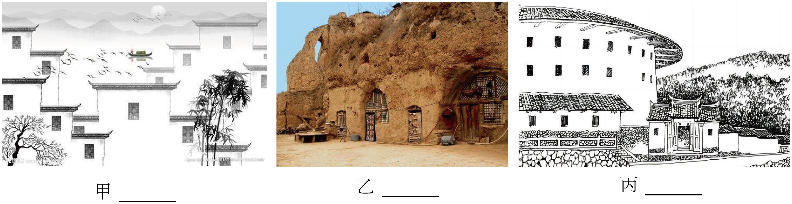

# 🌊 青岛中考语文分项专项练习 —— 02_名著阅读(模拟)

> 📌 **收录说明**：本练习全量收录自青岛市模拟试卷中该考点的所有试题、背景材料与详细解析（共收录 35 套试卷切片）。

---

### 📌 试题来源与标定卡片：山东省青岛市 • 2019年中考模拟

> - **来源试卷**：2019山东青岛语文试卷+答案+解析(word整理版)
> - **考试年份**：2019年
> - **所属模块**：02_名著阅读

二、阅读(50分)

(一)诗词理解(6分)

阅读下面两首诗,完成7—8题。

送杜少府之任蜀州

王 勃

城阙辅三秦,风烟望五津。

与君离别意,同是宦游人。

海内存知己,天涯若比邻。

无为在歧路,儿女共沾巾。

峨眉山月歌

李 白

峨眉山月半轮秋,

影入平羌江水流。

夜发清溪向三峡,

思君不见下渝州。

7.下列对诗句的理解,不正确的一项是(3分)(　　)

A.“与君离别意,同是宦游人”意为“今天我与你分别,内心忧伤,无论是在京城的我,还是即将远赴蜀州的你,都是远离故土、在异乡为官的人”。

B.“海内存知己,天涯若比邻”意为“我们是心心相连的朋友,即使远在天涯海角,也如同比邻而居”。

C.“无为在歧路,儿女共沾巾”意为“在分别的路口,我虽想挽留你,却无能为力,只能默默无语,泪下沾巾”。

D.“峨眉山月半轮秋,影入平羌江水流”意为“船行平羌江上,半轮秋月高悬在峨眉山头,明月倒映在江水中,伴诗人远行”。

8.下列对两首诗的内容与情感的理解,不正确的一项是(3分)(　　)

A.《送杜少府之任蜀州》首联描写友人即将离京赴任蜀州,诗人遥望蜀地,视线却为风烟所遮,心头萌生淡淡的伤感。

B.《峨眉山月歌》描写了诗人乘船顺江而下所见之景,“峨眉山月”与诗人千里相随,触发了诗人对友人的思念之情。

C.《峨眉山月歌》后两句叙写诗人江上行船的旅程,表现了诗人离友人越远就越加思念的情感。

D.《送杜少府之任蜀州》和《峨眉山月歌》皆为离别而作,两首诗均充满了离愁别绪和难以释怀的悲戚之情。

(二)名著阅读(5分)

某位同学在阅读《骆驼祥子》的过程中做了文段批注和整本书的读书卡片,请仔细阅读,完成9—10题。

9.下面是这位同学做的文段批注,有误的一项是(2分)(　　)

10.下面是这位同学做的整本书的读书卡片,表述有误的一项是(3分)(　　)

读书卡片

作　品:《骆驼祥子》

作　者:老舍,原名舒庆春,被誉为“人民艺术家”。

主要情节:

A.祥子经过多年积攒,买上了一辆属于自己的新车,可是不久却被匪兵连人带车劫走。

B.祥子从匪兵处逃走,继续攒钱买车,车还没买上,钱又被孙侦探敲诈去了。

C.祥子与虎妞结婚后,用她的私房钱买下一辆车,虎妞因难产死去,祥子又只得卖掉车子料理丧事。

D.命运的三起三落打消了祥子买车的念头,他重新投奔刘四爷,老老实实赁车挣钱。

9.C　本题考查对名著内容的理解能力。此处是祥子为买车筹划怎样省钱、攒钱,并不是“吝啬,贪婪,爱占小便宜”。

10.D　本题考查对名著情节内容的识记能力。“他重新投奔刘四爷,老老实实赁车挣钱”错误,祥子在接连遭受生活的打击后,并没有重新投奔刘四爷,而是开始丧失对生活的所有希望和信心,不再像从前一样以拉车为骄傲,变得厌恶拉车,厌恶劳作。被生活捉弄的祥子开始游戏生活,吃喝嫖赌。为了喝酒,祥子到处骗钱,堕落为“城市垃圾”。最后,靠给人办红白喜事、做杂工维持生计。

11.B　本题考查对文言实词的理解能力。谤:公开批评、指责别人的过失。

12.A　本题考查对文言虚词的理解辨析。“以”在例句和A项中都是介词,按照。B项,介词,因为。C项,介词,用,拿。D项,连词,表承接关系。

13.B　由“……,……也”的句式可知例句是判断句。A项是宾语前置句,B项是判断句,C项是状语后置句,D项是省略句。故选B项。

14.D　本题考查对文章内容的理解能力。“上至皇帝,下至群臣,都认为魏征……才干超过诸葛亮”错误,由原文“岑文本曰:‘亮才兼将相,非征可比。’帝曰:‘征蹈履仁义……虽亮无以抗。’”等信息可以看出群臣并不都认为魏征才干超过诸葛亮。

15.

答案　(1)(金属)经过冶炼锻造成为武器(器具、工具),人们就把它们当宝贝一样看待。

(2)皇上曾经询问所有大臣:“魏征和诸葛亮比,哪个更贤能?”

解析　本题考查文言语句的翻译能力。翻译文言语句要根据“信”“达”“雅”的原则,逐字逐词进行翻译。(1)句中要注意“宝”的翻译,此词在这里是名词作动词,意思是“以……为宝”;(2)句中要注意“尝”“孰”的翻译。

[参考译文]

魏征,字玄成,是魏州曲城人,有远大的志向,通晓经典书籍和方术。

贞观十年,任侍中。当时尚书省有些久拖不决的案件,(太宗)下诏让魏征审理。魏征凭原则照实处理案件,人人都心悦诚服。因多病提出辞职。太宗(不答应,)说:“你难道没见过金属如果只是在矿中,有什么宝贵的呢?(金属)经过冶炼锻造成为武器(器具、工具),人们就把它们当宝贝一样看待。我把自己比作金属,把爱卿你当作好的工匠来磨砺我。你虽然有病,还没有到衰老(的地步),怎能让你(就这样辞职)过安适的日子呢?”

当时上密封奏章谏言的人很多,有的(谏言内容)与事实不符,唐太宗很厌恶。魏征(对太宗)说:“古代有人立谤木,(让人在上面写谏言,)想要了解自己的过失。密封的奏章,应该是谤木的传承。皇上您应该任由他们畅所欲言,来使自己的得失更加明显。如果对方说的对,那么就对朝廷有益处;如果不对,也对政务没有什么坏处。”太宗(听完)很高兴,就都奖励了上密封奏章谏言的那些人。

太宗设宴招待众位大臣,说:“贞观之前,跟随我平定天下,是房玄龄的功劳;贞观之后,提出忠正的意见,纠正我的过失,那就只有魏征了。”亲自解下佩刀来赐给二人。太宗曾经询问大臣们:“魏征和诸葛亮相比,哪个更贤能?”岑文本说:“诸葛亮兼有将相的才华,不是魏征可以相比的。”太宗说:“魏征履行仁义之道,来辅佐我,想使我成为尧、舜那样的君主,即使是诸葛亮也没有办法(和他)匹敌。”

16.D　本题考查对文章内容的理解能力。“石墨烯在全球的产业规模已经超过1000亿美元”错误,原文是“业内预计未来5至10年……会超过1000亿美元”,并非已经超过,D项把未然说成已然。

17.D　本题考查对文章写作特点的分析能力。由第②段第2句可知,石墨烯之所以被称为“黑金”,是因为它是“目前已知的最薄、强度最高、导电导热性能最强的新型纳米材料”,它并不是一种贵金属,与黄金的物理性质并不相同。

18.

答案　凸显了石墨烯目前已知的最薄的纳米材料特点。用铅笔划过的例子是因为铅笔是我们日常学习中最常用的物品,人们对它非常熟悉,用它的划痕来再次说明石墨烯的薄,更易让人理解,更易让人想象,甚至更会让人惊叹石墨烯的神秘。

解析　第②段介绍了石墨烯是什么,指出了它“最薄、强度最高、导电导热性能最强”的特点。画线语句使用了列数字的说明方法,说明了石墨烯“最薄”的特点。而铅笔是生活中的常见物品,用它来说明石墨烯“最薄”的特点,显得通俗易懂,更便于读者理解。

19.

答案　①用画粉画线的绝活;②做得一手漂亮盘扣的绝活;③“两不记”的绝活;④裁剪与案板结合的绝活。

解析　本题考查对文章内容的梳理概括能力。“在我的记忆深处,父亲有些绝活儿”这句话是文章的第③自然段,这段起领起下文的作用,从第④自然段开始介绍父亲的绝活儿,第⑨自然段则开始写父亲怎样外出给人做衣,所以第④—⑧自然段的内容是写父亲的绝活儿。结合第④自然段“裁布料用画粉”、第⑤自然段“他最得意的是做得一手漂亮盘扣”、第⑥自然段“父亲有‘两不记’”、第⑧自然段“我揣测这种‘停顿’绝不是率性而为,一定是有讲究的,应该是父亲为后来的缝纫制作留下的暗记”等语句,即可得出答案。

20.

答案　第②自然段在结构上有承上启下的过渡作用。在内容上,它是全文作者叙事的线索和总纲,使文章叙事清晰,主旨鲜明突出。

解析　本题考查分析文中段落作用的能力。第①自然段总起全文,介绍了父亲的身份是裁缝,行走乡间为人缝制衣裳。第②自然段写父亲拜师学裁缝的经历,从第③自然段开始写父亲作为裁缝的绝活儿。由此可见,第②自然段起到了承上启下的作用。再从内容方面分析第②自然段在叙事和主旨上的作用。

21.

答案　(1)该句使用动作描写,详尽展示了父亲用画粉画线的完美过程。一举手、一投足中将父亲的高超技艺勾画得栩栩如生,给人如在眼前的立体感;而且言语间也透露出对父亲的敬仰和骄傲。

(2)这句使用比喻修辞,把父亲的裁剪比作农夫的耕地,既贴切生动,又充满乡村的泥土气息。同时也是对两种劳动的赞美和歌颂。

解析　本题考查对文章语言的赏析能力。赏析文章语言,首先要确定赏析的角度。(1)写父亲用画粉画线时的动作,所以应从动作描写的角度入手分析,通过“捏”“拉”“压”“拈”“弹”等动词,表现了父亲用画粉画线的技术之娴熟;(2)从“像”这一关键词可看出使用了比喻的修辞手法,所以应从比喻的修辞手法的角度进行赏析。结合内容进行分析后,再组织语言作答即可。

22.

答案　不可以。

原标题充满诗情画意,又照应和突出了文章主题。作者不光记叙父亲“一针一线”的绝活,更通过父亲的手艺表达了父亲不仅技艺高超,而且人格高尚。他的劳动不仅是劳动,更关乎亲情、乡情、对美好生活的向往之情。

解析　本题考查赏析文章标题作用的能力。文章的原标题既通过“针”“线”暗指了父亲的身份和文章的主要内容,又通过“关情”表达了文章的主旨,而且这种命题形式与古诗句相似,富有文采。而标题“一位行走乡间的裁缝”则仅仅交代了文章的主要人物,无论在内容还是形式上都比原标题逊色不少。

23.(1)[写作指导]　这是一道半命题作文题。提示语中已经给出了选材范围——友谊、亲情、过往、未来……考生可以从生活中选择这几个方面的典型事例,在叙述的过程中要先交代清楚约定对象是谁,再写约定的具体内容以及做出这个约定的原因和结果。最后“以小见大”,将主题升华到友情、亲情等上。在具体写作过程中,首先要把标题补充完整,然后运用合适的叙述手法进行写作,可以采用顺叙、插叙等方式。约定的对象可以是人,也可以是物,但不论是哪一种,都要写出约定对象的价值,因为只有有价值的东西才值得镌刻。

[例文]

镌刻在书架上的约定

搬来梯子,小心翼翼地将他从书架的最高处取下,我用手轻轻拂去他身上的灰尘,发现他已悄然泛黄。但没关系,因为我还记得我们之间的约定。

他还会记得那年他和我的约定吗?

五年前,他悄然来到我的身边。黄棕色的外表,有着一种莫名的吸引力,我抑制不住自己的好奇心,便把他翻开静静阅读。

旅游,是我非常喜欢的,对我来说也是一件快乐的事,可为什么这个作者却要把他写成苦旅呢?没有华丽的辞藻,文章的深度却丝毫不减,我静静地听他娓娓道来,感受到了那深邃苍凉的历史和他对中华大地深深的依恋。

其实,十岁的我已经能够理解字面上的意思,可是总感觉他还表达了什么深刻的意义,而我却未能领悟。

十岁的我便和他有了一个约定,既然十岁的我无法理解,那么五年之后再来看你,五年的阅历应该可以将你完全读懂了吧。

搁置了五年,现在我再次将他拾起。

和五年前一样,最喜欢的还是《道士塔》。不过,五年前的我只是觉得作者写的是一些我看不懂的历史。当我再次读起他,才发现这是作者对民族屈辱历史的感叹,对愚昧的中国道士乃至一切卖国者的批判,对中国古代灿烂文化被毁的悲哀,以及对王圆箓这个“敦煌石窟的罪人”的痛苦反思。现在,我完全融入这不曾了解过的历史之中,不由得与作者一起恨、一起悲叹。

在我看过的书中,很少有作者能把自己的游记和所游地区的历史联系得如此恰到好处。这一文化之旅领着我踏遍祖国的大江南北,让我领略着大自然的美好风光,深思着中国文化的发展历程。

感谢五年前的那个约定,让我再次读他、了解他,倘若当年我没读懂就草草了事,或许就一直不懂作者所要表达的真谛吧!

他,就是《文化苦旅》。

“几位记者在报纸上说我写书写得轻松潇洒,其实完全不是如此。那是一种很给自己过不去的劳累活,一提笔就感觉到年岁徒增。不管是春温秋肃,还是大喜悦大悲愤,最后总得要闭一闭眼睛,平一平心跳,回归于历史的冷漠,理性的严峻。”这是余秋雨教授为《文化苦旅》所写自序中的一段话。

我深知对于一本书的尊敬就是要懂得作者想表达的意思,而不是看完之后什么都不思考就过去了。这难忘的约定,教会我的不仅仅是这一本书的道理,更是怎样领会文学作品的真谛。

[点评]　本文选材贴近生活,构思新颖,结构严谨,语言简洁质朴。作者开篇设置悬念,并不直截了当地交代约定的对象是谁,而是以“他”代指,给人一种“犹抱琵琶半遮面”之感,引人入胜。随着叙述的展开,作者才渐渐地揭开其神秘的面纱——《文化苦旅》,并把他当作自己的挚友甚至人生导师,运用对比的手法将自己对他前后不同的理解表达出来。这种变化不仅是知识的积累,更是对文学作品真谛的领悟,深化了文章主题。

(2)[写作指导]　对于材料作文题,首先要理解材料表达的中心思想,围绕中心思想来立意、构思。本题的材料只简单陈述了童话大王郑渊洁坦诚回答自己“不知道”的经历,并且题目中给出了“世界那么大,知识那么多,谁都不可能全知道”的结论,从而指出“说‘不知道’体现了一种态度、一种品质、一种精神、一种胸怀……”由此可见,文章可围绕“知之为知之,不知为不知”展开,可结合自己的经历和感悟进行选材,体现敢于说不知道、不自欺欺人的做人道理。

文章既可以借助有说服力的论据写成观点明确、论证有力的议论文;也可以借助生活中与“勇于承认自己不知道”或“不懂装懂带来的尴尬”相关的真实经历,写成内容充实、主题突出的记叙文,表达自己从中得到的感悟。当然,写成哲理散文也不失为一种选择,注意需兼顾情、理、文的表达。

[例文]

勇敢地说“不知道”

央视《东方之子》栏目曾对诺贝尔物理学奖获得者丁肇中进行过一次专访。在访谈过程中,丁教授却说了多个“不知道”,当记者问及丁教授的多个“不知道”时,丁教授回答说:“是不知道的,你不能说知道,知道就是知道,不知道就是不知道。”

这不禁让人联想到了孔子曾经说过的一句话:“知之为知之,不知为不知,是知也。”

反之,不懂装懂则是不明智的。

在日本,曾经有一个叫清藏的人。一天,他和朋友们在草丛中发现了一只白兔,一个朋友说:“看,这儿有一只兔子死了。”清藏听朋友这么说,立刻捂住鼻子说:“怪不得我闻到一股臭味。”话音未落,兔子突然跑开了,他的朋友非常吃惊:“原来它是在睡午觉!”清藏立即说:“怪不得我刚才看见它耳朵在动,我心里还正觉得奇怪呢!”

后来,日本人就把那些不懂装懂,随声附和的人称为“清藏的白兔”。

可见,不懂装懂不仅是不明智的行为,有时还会成为别人的笑柄。

在科学上,我们需要有严谨的态度,“差之毫厘,谬以千里”。当你对着别人“猜”出某一个不知对错的言论时,你或许意识不到将来某一天这一“猜”所带来的后果,但如果他人依照你的言论去尝试,有可能与成功擦肩而过。

在学习上,我们更不能这样。记得在小学六年级时,有一次老师讲解完一道题后说:“会了这道题的同学请举手,不会的同学下课后到我的办公室来,我再给你们讲一遍。”我环顾四周,发现周围的人都举起了手,我犹疑着,最终还是将手举了起来,尽管这道题我并不会做。

过了几天,老师发下了单元测试卷,我惊奇地发现那道题竟然出现在测试卷上。我慌忙将其他的题写好,以便节约时间来思考它,但直到考试结束的铃声响起,那道题的答案处仍是空白!

我庆幸,这只是一次小考,但我也知道了我要改正的是什么。

我想,无论在学业上还是生活中,我们都要“知之为知之,不知为不知”。这,或许是我们成功路上的一辆车,助我们走得更远更快……

[点评]　文章从央视《东方之子》对丁肇中的采访写起,联想到孔子的名言“知之为知之,不知为不知”,所选取的素材切合主题。进而又从反面出发,写“清藏的白兔”,点明“不知道”所体现的态度。并且根据作文题目的要求“结合自己的经历”,又举了自己在学习上因没有做到“知之为知之,不知为不知”而后悔的例子。段与段之间衔接紧密,一气呵成,语言平实,且选取的素材多样,足见其知识面之广,最后结尾用富含哲理的语言升华了中心,突出了主题。

|  |
| --- |

============================================================

### 📌 试题来源与标定卡片：山东省青岛市 • 2020年中考模拟

> - **来源试卷**：2020山东青岛语文试卷+答案+解析(word整理版)
> - **考试年份**：2020年
> - **所属模块**：02_名著阅读

二、阅读(51分)

(一)诗词阅读(6分)

7.阅读下面这首唐诗,理解不正确的一项是(3分)	(　　)

白雪歌送武判官归京

岑 参

北风卷地白草折,胡天八月即飞雪。

忽如一夜春风来,千树万树梨花开。

散入珠帘湿罗幕,狐裘不暖锦衾薄。

将军角弓不得控,都护铁衣冷难着。

瀚海阑干百丈冰,愁云惨淡万里凝。

中军置酒饮归客,胡琴琵琶与羌笛。

纷纷暮雪下辕门,风掣红旗冻不翻。

轮台东门送君去,去时雪满天山路。

山回路转不见君,雪上空留马行处。

A.“忽如一夜春风来,千树万树梨花开”,表达了诗人对边塞奇异壮美风光的喜爱之情。

B.“湿罗幕”“锦衾薄”“角弓不得控”“铁衣冷难着”,写出了天气的寒冷和军营将士的艰苦生活。

C.“纷纷暮雪下辕门,风掣红旗冻不翻”,大雪纷纷,天寒地冻,表现诗人身处恶劣环境的痛苦与悲伤。

D.“山回路转不见君,雪上空留马行处”,峰回路转,武判官的身影已消失不见,诗人依然深情目送。

8.下列对诗句的理解,不正确的一项是(3分)	(　　)

A.“安得广厦千万间,大庇天下寒士俱欢颜”(《茅屋为秋风所破歌》),写诗人盼望眼前出现千万间广厦来庇护天下寒士,表达了忧国忧民之情。

B.“沉舟侧畔千帆过,病树前头万木春”(《酬乐天扬州初逢席上见赠》),诗人以“沉舟”和“病树”自比,虽流露出惆怅之情,但依然乐观进取。

C.“何当共剪西窗烛,却话巴山夜雨时”(《夜雨寄北》),写诗人出行在外,思归而不得归,只能独自剪烛西窗,在巴山的夜雨中思念家乡。

D.“会挽雕弓如满月,西北望,射天狼”(《江城子·密州出猎》),勾勒出挽弓劲射的英雄形象,表达了词人希望为国御敌立功的壮志。

(二)名著阅读(6分)

9.下列对名著内容的理解,不正确的一项是(2分)	(　　)

A.《海底两万里》中,海底世界的奇幻美妙,潜水艇的强大功能,都显示了作者凡尔纳的非凡想象力。

B.法布尔所著的《昆虫记》,真实地记录了昆虫的生活,表达了对生命的关爱和对自然万物的赞美之情。

C.《儒林外史》中,胡屠户看不起女婿范进,范进中举后,他又说范进是文曲星下凡,对范进毕恭毕敬。

D.《五猖会》中,“父亲”严厉而尽责,他能站在儿童的角度考虑问题,对孩子的兴趣爱好给予支持。

10.阅读名著,可以从中汲取积极向上的精神力量。请从《西游记》《简·爱》中任选一个人物,按照示例完成表格。(4分)

| 示例 | 人物 | 积极向上的精神品质 | 名著中的相关内容 |
| --- | --- | --- | --- |
| 示例 | 保尔·柯察金 | 意志坚强 | 他不向命运屈服,带病坚持写作, 克服种种困难,最终完成著作。 |
|  |  |  |  |

10.

答案　(示例1)简·爱　坚韧不拔　她刚刚摆脱舅妈的虐待,就被送到寄宿学校读书,经常挨饿受冻,罚站挨打,可她却凭借顽强的毅力在这种艰苦的条件下生活了多年。

(示例2)孙悟空　敢于反抗　孙悟空大闹天宫。

解析　回答此题,要注意两点:一是题目中要求填的必须是人物身上具有的“积极向上”的精神品质;二是相关内容必须能够表现所填写的精神品质。此外,还要注意人名不可写错。

11.A　辍:停止。

12.D　例句和D项中“于”都是“在”的意思,A项中“于”意为“对于”,B项中“于”意为“比”,C项中“于”意为“对、向”。

13.A　断句要以理解句意为基础,画波浪线句子的意思是“有人把纸给他,他不问多少,拿到手里就开始写”,据此句意可断句。

14.B　张友正搬离旧居,与染工为邻,不是因为染坊里有染过的绢,而是为了跟别人借将要染成黑色的白绢来练习书法。

15.

答案　他的性格刚直,担心被名声所连累,很少和人交往,所以知道他书法成就的人少。

解析　翻译文言语句要做到信、达、雅,重点词语解释正确。此句要注意“恐”“累”“故”的意思。

[参考译文]

张友正从小学习书法,常住在一间小阁楼上,闭门不管其他事,连续练习了三十年也不停止。他有一所别馆,价值三百万钱,他全卖了来买纸写字。他的书法笔迹清高简约,有晋宋时期人的风味。他原来的家在甜水巷,有一天他忽然弃之离开,在水柜街租了一间小屋,和染工们成为邻居。大家都感到奇怪,有人问他这么做的原因。张友正回答说:“我不过想要借他们的白绢学写字罢了。”(他)和染工约定好:所有想要染成黑色的绢,先借给他,二丈给二百金的酬劳。就像这样每天写好几丈白绢,不曾停笔。有人把纸给他,他不问多少,拿到手里就开始写,一直到写完才停止。

张友正一向与苏子瞻交好。元祐末年,苏子瞻从扬州被召还,张友正就准备了宴席招待他。苏子瞻到后,就将长案相对摆放,上面都摆着好笔、好墨、三百张纸,却把菜肴放在旁边。苏子瞻看到这种情形,大笑。就座后,两人每喝一遍酒,就铺开纸写字。一两个小童负责磨墨,几乎供应不上。酒喝完了,纸也写完了,都自认为比平日里写得好。

张友正没有做过官。他的性格刚直,担心被名声所连累,很少和人交往,所以知道他书法成就的人少。

16.C　由材料三“以文人艺术中国水墨画为例,由于诸多新水墨画不加审辨地抛弃了传统,事实上,传统水墨画的内在精神在这些新水墨画中已经荡然无存”可知,“不加审辨地抛弃了传统”是“诸多新水墨画”,而非“文人艺术中国水墨画”。

17.D　由材料二“将‘非遗’引入潮流,让‘非遗’走进大众有了可能”可知,选项中“让‘非遗’走进了大众”表述不准确,材料中只是说“有了可能”。

18.

答案　(示例)在胶州大秧歌中加入流行元素;胶州大秧歌的表演形式、动作特点、角色扮演、音乐唱词和服饰道具等要结合社会热点事件,贴近现实;可以组织秧歌迷见面会,组织意见征集会,以此来扩大秧歌的影响力;将胶州秧歌表演或比赛的视频上传网络,为胶州秧歌制作宣传片、纪录片,以扩大其文化影响力;要在传承中创新;等等。

解析　此题为开放性题目,答案不唯一,启示应从所给材料中得来。材料一主要介绍非物质文化遗产的概念及价值,材料二以郎佳子彧为例介绍了“95后”“非遗”传承人,材料三介绍传承与创新应注意的问题。从三则材料的内容来看,材料二中郎佳子彧将流行元素融入面塑作品的做法、借助影像方式传播面塑作品的做法可以作为正面例子,得到正面启发,材料三中新水墨画抛弃传统的现象可以作为反面例子,而秦淮灯彩传承人的话也可以作为正面例子,得到正面启发。

19.

答案　①“树”给城市增添生机和轻灵的亮色;②“树”抚慰需要帮助的人们,消融了人的紧张疲惫;③“树”是人们情感的寄托,弥合了人与世界的裂痕;④“树”带给人们力量与希望,使人变得坚强。

解析　本题考查提取概括文章内容及中心思想的能力。文章第②段写“树”在大城,激活了城市,给城市增添了轻灵的亮色。第④⑤段写到了“树”在某一瞬间给人们带来抚慰,能够消除疲惫并帮助需要帮助的人们。第⑥段写到“树”承载着人们的情感,弥合人与世界的裂痕。第⑦—⑩段通过写自己生病在医院里看到一棵树,写了树给人带来了生命的力量,让人充满希望,乐观坚强。

20.

答案　放在第③段开头最合适。第②段写了树能够给大城增添一抹轻灵的亮色;第③段写“在大城,似乎人与树各有各的存在,各有各的活法,互不相干”。两段间有转折关系,“然而在大城,树是很容易被忽略的”这句话可以连接②③两段,使得段意衔接更加自然流畅,符合逻辑,因此应该放在第③段的开头。

解析　本题考查学生对文章写作逻辑顺序的整体把握。“然而在大城,树是很容易被忽略的”这句话中“然而”一词有转折之意,说明前文所讲内容应为“树”在大城给人们带来的好处,后文则应该是写大城中人与树之间互不相干的活法,从而表现“树”被忽略。所以,通读全文可知这句话应是连接②③段的过渡句,放在第③段开头最合适。

21.

答案　修辞角度:运用了比喻的修辞手法,将树比作卫兵,生动形象地写出树对城市坚定的守护;将树摇动时发出的声音比作波浪般的乐声,生动形象地写出了树随风摇动时声音的灵动美好,表现了树使城市更有生机,表达了作者对树的喜爱与赞美之情。

解析　本题要求自选角度赏析句子。这句话句式整齐,两个分句均运用了比喻的修辞手法,考生可以从修辞的角度去赏析。赏析时应注意点明具体角度,然后根据比喻修辞的答题方法写清将……比作……,生动形象地写出……,流露出作者……的感情。

22.

答案　这棵树所蕴含的向上生长的力量让“我”心态变好,得以提前出院。从此以后,这棵树曾带给“我”的生命的力量就转化为“我”自身的力量,扎根在“我”心中,伴随着“我”成长,这棵树成了“我”生命中的参天大树。

解析　本题考查考生理解句子含意的能力。“从此这棵树便在我心里扎下了根,潜滋暗长,成为我生命中的参天大树”中“从此”一词应该解释清楚,即“我”生病痊愈后;“树便在我心里扎下了根”说明这棵树给“我”带来的生命的力量已转化为“我”自身积极向上的力量,这种无形的精神力量在心中生长,成了“我”人生中的参天大树。

23.

答案　(示例)我联想到了环卫工人。环卫工人默默地付出,为我们创造更好的生活环境,我们常会忽略他们,但他们为我们的城市做出了巨大的贡献,已经是我们生活中不可或缺的一部分。

解析　此题考查学生对文章主旨的理解能力。答题时应在理解作者思想感情的基础上,开拓思维,联想生活中像树一样的人。文末这句话意在说明,我们身边的“树”与我们或远或近,但却切实存在于我们身边,为我们及城市贡献着自己的力量。如环卫工人等,他们和树一样默默付出,为我们改善生活环境,为社会做着贡献,是我们生活中不可或缺的一部分。本题就是让学生答出像树一样的人以及这类人的特点、作用、地位及我们对他们的认识。

24.(1)[写作指导]　首先,必须要明确本篇作文的写作目的——引导学生关注生活,增强责任意识。其次,要明确以“重返校园以后”为题目的作文,写作重点是写“重返校园以后”的见闻感受。最后,还要明确中考作文命题的两个重要主旨:关注社会,表达自我。因此,在选材时要注意弘扬社会正能量,选取积极正面的事例行文。行文过程中要特别注意以下几点:注意梳理材料,化大为小,找准适合自己的切入点,写出真情实感,深化主题。

[例文]

重返校园以后

阳春三月,春光融融。寂静的校园里,小草早已萌发,花儿也露出了微笑,仿佛在期盼着校园里能早日盛开孩子们的笑脸。

可新冠病毒肺炎疫情全面暴发,让开学时间一再推迟。每天,看着新闻中一个又一个患者进入医院,然后一个又一个医院人满为患,不久,整个武汉乃至整个国家都陷入了困境。因此,即使春天到了,花儿开了,学生们依然只能在家通过网络学习。然而在学习中,我们并没有忘记关注疫情的发展:每天查看疫情防控新闻,被来自全国各地的逆行者感动。向抗疫英雄们致敬也成了我们的必修课。我们无时无刻不期盼着疫情结束,期盼大家都能平安归来,也期盼着我们重返校园的那一天早些到来。

终于在全国人民和医疗专家的共同努力下,我们取得了一个又一个胜利,终于能够重返校园了!

跟随风的脚步,我们缓缓向前,来到了校园。一切还是那么熟悉,操场上那亮眼的跑道,教室里那五颜六色的板报,以及正在盛开的红彤彤的三角梅都还是原来的样子。但一切又似乎和以前不一样了,老师那熟悉而又令人舒心的面孔蒙上了一层口罩,只露出一双明亮的眼睛;曾经的我们习惯聚在一起谈天说地,走廊的各个角落都充满了我们的欢声笑语,但是现在的走廊里,同学们时刻保持着距离,走廊上悄无声息,连蝴蝶飞过的声音都清晰可辨。

以往到了中午,我们都三五成群地去打饭,现在我们在食堂一个个都变成了“格子侠”,每位同学都要隔一米距离!虽然这一切都发生了改变,但我们终于回到了学校,回到了魂牵梦萦的教室,见到了朝思暮想的老师和同学。

不知不觉,三年的初中生活马上就要接近尾声了,重返校园后,我们并没有自暴自弃,也没有安于现状,大家学习的劲头儿反而更足了。课堂上,求知若渴的同学们全神贯注地盯着黑板,仔细听老师讲解;下课后,也总有三五个戴着口罩的学生热切地讨论着令人难解的数学题,疫情并没有消磨大家的斗志,反而让我们重新认识到了时间的可贵、生命的价值!

重返校园后,只有重新开始奋斗,我们才能找到生存的价值,而祖国的明天才能更加美好!

[点评]　这篇文章语言优美,行文流畅,重点写了“重返校园以后”的相关场景,运用了许多细节描写。先写疫情期间的所见所闻,与重返校园以后形成对比,更能突出主题。最后,文章聚焦于大家返校后的表现,写出了疫情后大家崭新的精神面貌和顽强不屈的精神,突出了同学们在苦难中的顽强意志和深刻感悟。

(2)[写作指导]　此题属于材料作文题。通读材料可知,青春充满色彩,充满活力。青春是我们生命历程中最为宝贵的财富。写作时,我们可以针对自己对青春的理解谈感受、发议论。我们可以写议论性文章,写出自己的感受与思考,并借助我们的文学积淀,用富有说服力的事例及语言来写出自己对青春的理解。另外,我们也可以写记叙性文章,叙写自己成长中的经历,从而抒发自己在青春时期的成长与收获、快乐与幸福。学生写作中应该写出自己对青春的真切感受与认识,从而打动读者,获得情感共鸣。

[例文]

我们的青春

青春,流露着浓浓的诗情画意;青春,散发出淡淡的香气。青春是生命之晨,是黎明,是朝阳,要珍惜自己的青春,不要轻言放弃,要让青春绽放出不一样的光彩。

奥斯特洛夫斯基曾说过这么一段话:“生活赋予我们一种巨大的和无限高贵的礼品,这就是青春:充满着力量,充满着期待、志愿,充满着求知和斗争的志向,充满着希望、信心的青春。”每个人都要珍惜青春,因为青春逝去就不再回来了,等到后悔的时候,已经无法挽回。

青春是短暂的,同时也是最美好的。正如北宋文学家欧阳修所说:“羡子年少正得路,有如扶桑初日升。”许许多多的革命先辈在青春时就已立大志、做大事了。少年时期,周恩来就立志“为中华之崛起而读书”;青年时期的毛泽东,就在湖南第一师范学校大展宏图,书写自己的远大抱负……革命先辈用他们的青春为祖国抛头颅、洒热血,为我们创造了良好的条件,而作为新时代中学生的我们,只在幸福年代接过建设者的任务,贡献自己的微薄之力,又有什么理由蹉跎岁月呢?

人人都知道:迷人的彩虹出自大雨的洗礼,丰硕的果实来自辛勤的耕耘。朋友,今天我们正处在优胜劣汰、竞争激烈的时代,前有师长掌舵,后有父母加油,可谓“天时地利人和”俱有。我们必须像海绵吸水一样,在学习上永不知足。让我们好好地把握住青春,学那穿云破雾的海燕去搏击八方的风雨;学那高大挺拔的青松去经霜傲雪。只有如此,才能在你的青春史上谱下无怨无悔的乐章。不要怕输,青春是永远不服输的,只要你肯努力,梦想终会实现。

让我们放飞自己的梦想,舞动自己的青春吧!

[点评]　本文是一篇议论性较强的文章。文章逻辑严密,论述语言简洁利落,道理论证、举例论证贴切有力,既展现了自己的语文素养和文学积淀,又在行文论述中层层递进;既写出了青春时期我们应该有梦想,抓住时机努力奋斗,又写出了正值青春的我们应拥抱时代,挑起时代重担,谱写中国新华章。文章紧扣中心,结尾主旨升华,收束有力,值得我们学习。

|  |
| --- |

============================================================

### 📌 试题来源与标定卡片：山东省青岛市市南区 • 2021年中考二模

> - **来源试卷**：2021年山东省青岛市市南区中考二模语文试题（解析版）
> - **考试年份**：2021年
> - **所属模块**：02_名著阅读

<b>二、阅读（51分）</b>

<b>（一）诗词理解（6分）</b>

7. 下列对诗句的理解，不正确的一项是（   ）

A. 王绩《野望》一诗中，“树树皆秋色，山山唯落晖”，描写秋天山林之静景，勾勒了一幅秋之晚景图，给人一种恬淡、悠闲之感，进一步渲染了作者的通达、愉悦的心绪。

B. 岑参的《白雪歌送武判官归京》一诗中，“山回路转不见君，雪上空留马行处”表达了诗人对朋友的依依不舍及朋友离去后的无限惆怅之情。

C. 《蒹葭》中，“白露为霜”到“白露末晞”再到“白露未己”的变化，暗示了时光的流逝和追求者的深情执着，也写出了“伊人”的踪迹飘忽，难以寻觅。

D. 李白的《渡荆门送别》一诗中，“仍怜故乡水，万里送行舟”写故乡水送我到楚地还不忍分别的情义，含蓄地抒发了思乡之情，与开头两句写诗人离蜀远游的诗意遥相呼应。

【答案】A

【解析】

【详解】考查诗句理解。

A．“树树皆秋色，山山唯落晖”两句写远景，给我们勾勒了一幅秋之晚景图，看似安静开阔的景象，却给人一种荒凉落暮之感，渲染了作者孤寂苦闷的心绪。故选A。

8. 下列对诗句的理解，不正确的一项是（   ）

A. 陈子昂的《登幽州台歌》中，“念天地之悠悠，独怆然而涕下”描绘了诗人寂寞地独自登台远望，瞬间感到天地无穷，人生有限。

B. “千嶂里，长烟落日孤城闭”，一句点明了战事吃紧、戒备森严的特殊背景，坐落在 崇山峻岭间的孤城，当夕阳西下时，便紧紧地关闭了城门。

C. “日月之行，若出其中。星汉灿烂，若出其里”，描写了曹操登上碣石山时，看到的大海吞吐日月星辰的宏伟气象，描写了作者的主观感受，豪迈之气顿时展现出来。

D. 韩愈的《晚春》以拟人化的手法，从花草树木的角度写对春天的留恋，表达出诗人对 春天大好风光的珍惜赞美之情。

【答案】C

【解析】

【详解】考查诗句赏析。

C．根据句中的两个“若”字可知，这两句诗中描写的景象是作者的想象，并不是登上碣石山时亲眼所见。

故选C。

<b>（二）名著阅读（6分）</b>

9. 下面对名著内容的理解，不正确的一项是（   ）

A. 《昆虫记》中，法布尔生动地描写了昆虫的生活习性：螳郷善于利用“心理战术”制服敌人；切叶蜂能够不凭借任何工具，精确“裁剪”树叶。

B. 鲁迅在《二十四孝图》中，记叙了 “老莱娱亲”和“郭巨埋儿”两件事，揭露了古书中所颂扬的孝道的虚伪和残忍。

C. 《骆驼祥子》中，祥子最大的梦想是拥有一辆自己的洋车，虽然他的希望一次又一次的破灭了，但直到小说结尾，他也没有放弃自己的理想，顽强地与命运抗争着。

D. 夏洛蒂•勃朗特的《简•爱》中，女主人公是一位性格坚强，独立自主，积极进取的女性，她在各种磨难中不断追求自由与尊严，最终获得了幸福生活。

【答案】C

【解析】

【详解】此题考查名著内容理解。

C.有误，《骆驼祥子》中，祥子的希望一次又一次地破灭了，最后他对生活失去了信心，终于完全堕落，变成了一具行尸走肉。此项“直到小说结尾，他也没有放弃自己的理想，顽强地与命运抗争着”有误；

故选C。

10. 下面是《红星照耀中国》《钢铁是怎样炼成的》的读书卡片，请按照示例完成表格

人物名著中

相关内容性格特点

| 人物 | 名著中的相关内容 | 性格特点 |
| --- | --- | --- |
| ① | 第一次见面，用英语跟斯诺打招呼。为斯诺规划 采访行程。陪着斯诺在乡间散步。 | 平易近人，细心热情。 |
| 朱德 | 他的生活和穿着都和普通士兵一样，同甘共苦，早期常常赤脚走路，整整一个冬天以南瓜充饥，另外一个冬天则以牦牛肉当饭，从来不叫苦，很少生病。 | ② |
| 保尔•柯察金 | 1927年，他几乎完全瘫痪了，接着又双目失明。在极端困难的条件下，他开始了创作。邮局弄丢手稿后，他悲痛欲绝，后来在达雅等人的鼓励下，又重新燃起了希望之火，最终完成了作品。 | ③ |
| ④ | 他为了躲避搜捕，来到保尔的家住了八天，给保尔讲了关于革命、工人阶级和阶级斗争的许多道理，培养保尔的革命热情。 | 对革命充满热情 |

【答案】①周恩来  ②平易近人，吃苦耐劳  ③意志顽强、不畏挫折  ④朱赫来（人物性格特点写出一点即可得分）

【解析】

【详解】本题考查名著阅读。

（1）结合“第一次见面，用英语跟斯诺打招呼。为斯诺规划 采访行程。陪着斯诺在乡间散步”可知，这是《红星照耀中国》中的周恩来。

周恩来形象有：温和文雅，初遇斯诺时热情友好地用英语接待；他忠心耿耿，对民族解放事业矢志不渝；鞠躬尽瘁，北代时，周恩来奉命去上海准备起义，他到上海时毫无起义经验，唯一的武器是他的革命决心和坚定的马克思主义理论知识；吃苦耐劳，为了保住小小的苏维埃，周恩来在南方进行了多年的艰苦斗争，甚至没有盐吃，不得不用人的铁的意志代替；热爱生命，当周恩来陪斯诺走在回到百家坪的路上时，他就像神气活现的走在他身边的红小鬼一样，显得轻松愉快，充满了对生命的热爱。

（2）结合“他的生活和穿着都和普通士兵一样，同甘共苦”可知，朱德和普通士兵一样，对待普通士兵也非常好，看出他平易近人；结合“早期常常赤脚走路，整整一个冬天以南瓜充饥，另外一个冬天则以牦牛肉当饭，从来不叫苦”可知，朱德耐得住辛苦，看出他吃苦耐劳。

（3）结合“1927年，他几乎完全瘫痪了，接着又双目失明。在极端困难的条件下，他开始了创作。邮局弄丢手稿后，他悲痛欲绝，后来在达雅等人的鼓励下，又重新燃起了希望之火，最终完成了作品”可知，面对身体的痛苦，面对失去手稿的挫折，保尔没有放弃，没有屈服，而是不断燃起希望之火，尽自己的力量来为革命做贡献，看出他意志顽强，不畏挫折。

（4）结合“他为了躲避搜捕，来到保尔的家住了八天，给保尔讲了关于革命、工人阶级和阶级斗争的许多道理，培养保尔的革命热情”可知，这是《钢铁是怎样炼成的》中的朱赫来，朱赫来是一个老布尔什维克，他身体宽大而结实，平时不苟言笑，言语简单明了，但生动易懂。他喜欢聪明的孩子，善于循循善诱，把深刻的道理用浅显的言语表达出来，在和保尔一起生活的时间里给他讲了许多革命道理，传授了许多革命知识，对保尔思想的成长起到了决定性的作用。

============================================================

### 📌 试题来源与标定卡片：山东省青岛市崂山区 • 2022年中考一模

> - **来源试卷**：2022年山东省青岛市崂山区中考一模语文试题（解析版）
> - **考试年份**：2022年
> - **所属模块**：02_名著阅读

<b>二、阅读（50分）</b>

<b>（一）名著阅读（6分）</b>

7. 下列对名著的有关表述，不正确的一项是（   ）

A. 《骆驼祥子》中的刘四爷因嫌弃祥子是个拉车的，并怀疑祥子是因贪图他的钱财而娶虎妞，所以在寿诞之日与虎妞争吵到闹翻。

B. 《西游记》中，孙悟空在三打白骨精后，因猪八戒挑唆而被师父赶走，后来为救唐僧，沙僧巧用激将法把他请回。

C. 《红星照耀中国》真实地勾勒出了中国共产党人和工农红军的英雄群像——从政治领袖毛泽东、周恩来等，到军事将领刘志丹等，个个栩栩如生，真实感人。

D. 《儒林外史》塑造了如王冕、杜少卿等少数淡泊名利、恪守道德的贤者，寄托了作者对理想社会的追求。

【答案】B

【解析】

【详解】本题考查名著内容识记。

B.《西游记》中，孙悟空在三打白骨精后，因猪八戒挑唆而被师父赶走，后来为救唐僧，猪八戒巧用激将法把他请回；

故选B。

8. 线上学习期间，班级召开“我看名著中的人物”阅读讨论会，请你也积极发表自己的观点。

（1）经过讨论，大家都一致认为《海底两万里》中的尼摩船长是一个英雄，请结合一个情节说说你的理由。

我认为尼摩船长是一个英雄，理由是：_______

（2）同学们对《骆驼祥子》中的祥子产生了分歧，有同学觉得他的悲剧命运是值同情的，还有同学认为他性格中有值得批判的一面。你赞同哪个观点？请结合具体情节来说说你的看法。

【答案】（1）勇气过人，并且拥有无私奉献精神。在鲨鱼即将把那个可怜的采珠人拦腰咬断的时候，他突然举起匕首，于那鲨鱼展开了搏斗。在将采珠人救醒之后他更是慷慨解囊，把小袋珍珠送给采珠人。

（2）值得同情：祥子老实淳朴、勤劳好强，为改变自己的命运不断奋斗，他的悲剧是旧社会对劳动者的无情压榨和摧残的结果，所以说是值得同情的。

值得批判：祥子是一个软弱盲目、倔强保守的农民形象，他幻想凭个人的努力去改变自己的命运，最终自暴自弃，这也是他成为个人主义末路鬼的重要原因。

【解析】

【小问1详解】

本题考查人物形象分析。结合尼摩船长的英勇事迹分析即可。

示例：尼摩船长临危不惧、不怕牺牲，是一个英雄。当船在南极海底遇险时，尼摩船长奋不顾身，亲自下海修船，在即将死亡前，船长面不改色，宁愿自己危险也不愿同伴有事，幸好最终脱险。

【小问2详解】

本题考查学生的思辨能力。答题时，观点要明确，言之有理即可。

示例一：我认为祥子值得同情，他自尊好强，吃苦耐劳，凭自己的力气挣饭吃，他最大的梦想是有一辆属于自己的洋车，为此经历了三起三落，最终祥子失去了生活的信心，彻底地堕落，成为行尸走肉，他的悲剧是黑暗的社会造成的，所以值得同情的。

示例二：我认为祥子不值得同情，他自私狭隘、倔强保守，在经历人生的三起三落，特别是小福子死后，他对生活失去了信心，开始自暴自弃，最后堕落成“城市垃圾”，所以不值得同情的。

<b>（二）诗词阅读（6分）</b>

9. 下列对《十五从军征》的理解，不正确的一项是（   ）

十五从军征

十五从军征，八十始得归。

道逢乡里人：家中有阿谁？

遥看是君家，松柏冢累累。

兔从狗窦入，雉从梁上飞。

中庭生旅谷，井上生旅葵。

舂谷持作饭，采葵持作羹。

羹饭一时熟，不知贻阿谁！

出门东向看，泪落沾我衣。

A. “十五从军征，八十始得归”一句中，“八十”与“十五”相对照，写出老翁从军时间之长，可见兵役繁重。

B. “遥看是君家，松柏冢累累”，这是“乡里人”所说的话，言下之意就是：你的家中已无他人了。

C. “中庭生旅谷，井上生旅葵”写井边、中庭随意生长着葵菜和种植的谷物，写出了小院中虽然无人但富有生机的场景。

D. 全诗不仅仅表现了老翁一人的不幸，而且表现了全体人民的不幸和社会的凋敝、时代的动乱。

【答案】C

【解析】

【详解】C.“中庭生旅谷，井上生旅葵”写中庭、井边随意生长的谷物和葵菜，突出人去屋空，人亡园荒的哀景，更令人伤心。本项说法错误；

故选C。

10. 下列对诗句的理解，正确的一项是（   ）

A. “日暮乡关何处是？烟波江上使人愁。”（《黄鹤楼》）“日暮”“烟波”之景烘托诗人的归思，抒发了诗人漂泊异乡的伤感和思乡之情。

B. “年少万兜鍪，坐断东南战未休。”（辛弃疾《南乡子·登京口北固亭怀古》）作者回忆了自己青年时代在东南为国征战的场景。

C. “白头搔更短，浑欲不胜簪。”（《春望》）这句通过细节描写表达出了诗人在国家战乱之时不受重用、报国无门的苦闷。

D. “伤心秦汉经行处，宫阙万间都做了土。”（《山坡羊·潼关怀古》）这句写作者看到雄伟的宫殿化作尘土，昔日繁华不在了，不禁为之伤感。

【答案】A

【解析】

【详解】B.“年少万兜整，坐断东南战未休”两句，词人热情赞叹三国时的孙权，写他年少得志，意气风发，不畏强敌。本项说法错误；

C.“白头搔更短，浑欲不胜簪”，意思是：愁绪缠绕，搔头思考，白发越搔越短，简直要不能插簪了。诗人因烽火连月，家信不至，国愁家忧齐上心头，内忧外患纠缠难解，才不知不觉搔首徘徊。借助诗人衰老的形象，表现了诗人心系国事，不禁伤时忧国的情怀，思亲之切，感叹自身命途多舛的悲伤。本项说法错误；

D.“伤心秦汉经行处，宫阙万间都做了土”意思是：途经秦汉旧地，引出伤感无数，万间宫殿早已化作了尘土。描写了秦汉两代，都已成为历史的陈迹。秦皇汉武曾苦心营造的无数殿堂楼阁，万千水榭庭台，而今都已灰飞烟灭，化为尘土。表现出作者对朝代的更替、百姓的疾苦所发出的感叹之情。本项说法错误；

故选A。

============================================================

### 📌 试题来源与标定卡片：山东省青岛市市北区 • 2022年中考一模

> - **来源试卷**：2022年山东省青岛市市北区中考一模语文试题（解析版）
> - **考试年份**：2022年
> - **所属模块**：02_名著阅读

<b>二、阅读（56分）</b>

<b>（一）名著阅读（6分）</b>

6. 近年来，穿越类作品颇受追捧，假如名著中的人物也能穿越到北京冬奥会，根据你的理解，下列评论不恰当的一项是（   ）

A. 《西游记》中的沙僧勤劳稳重，并且任劳任怨，适合在冬奥会中担任志愿者。

B. 《水浒传》中神行太保戴宗医术高明、人称“当世华佗”适合做急救医生。

C. 《钢铁是怎样炼成的》中革命者朱赫来，领导力强，适合从事一些组织工作。

D. 《傅雷家书》中的钢琴家傅聪艺术造很高，适合从事冬奥会音乐方面工作，

【答案】B

【解析】

【详解】本题考查名著内容理解识记。

B.“神行太保戴宗”表述不当，《水浒传》中医术高明的是安道全；

故选B。

7. 作家莫言说，体育运动，实际上就是一种挑战。挑战自我，挑战极端，在挑战当中，在惊险当中，创造美。在我们初中课本要求的必读名著中，哪位主人公曾直面挑战井并创造美好呢？请任选一篇，完成下面的表格。

| 书名 | 主人公 | 完成挑战并创造美好的事迹 |
| --- | --- | --- |
|  |  |  |

【答案】如《钢铁是怎样炼成的》中的保尔柯察金；《简·爱》中的简·爱；《西游记》中的唐僧、孙悟空；等等。要点：“直面”“完成挑战”“创造美好”。

示例1：《钢铁是怎样炼成的》  保尔•柯察金  保尔出身贫苦的工人家庭，后来参加革命，成长为坚强勇敢的革命战士，历经多次伤病，最后在全身瘫痪、双目失明的情况下完成小说《暴风雨所诞生的》。

示例2：《西游记》  孙悟空  保护唐僧西天取经，历经九九八十一难，从一个不受束缚的石猴成长为普度众生的斗战胜佛。

【解析】

【详解】本题考查名著人物和相关情节的把握。从初中课本要求的必读名著中，选择一篇，结合主人公和他（她）的事迹完成表格即可。

示例1：《简·爱》  简·爱  一个性格坚强，朴实，刚柔并济，独立自主，积极进取的女性。她出身卑微，相貌平凡，但她并不以此自卑。她蔑视权贵的骄横，嘲笑他们的愚笨，显示出自立自强的人格和美好的理想。她有顽强的生命力，从不向命运低头，最后有了自己所向往的美好生活。

示例2：《西游记》  唐僧  拥有一颗勇往直前，永不放弃的求佛真心，凭借坚强的意志和执着追求的精神一路西行，不为财色迷惑，不为死亡征服。历经九九八十一难终成正果，后被封为“旃檀功德佛”。

<b>（二）古诗文阅读（12分）</b>

8. “冬去冰须泮，春来草自生”。草，广义指茎秆比较柔软的植物。古诗文中草字旁的汉字内蕴丰富，表达出不同的情韵。请补写下面表格中空缺的内容。

| 《说文》 “艹”百卉也，从二屮，凡艸之属，皆从艸。 | 字 | 古诗文名句 | 出处 | 寄托的情感 |
| --- | --- | --- | --- | --- |
| 《说文》 “艹”百卉也，从二屮，凡艸之属，皆从艸。 | 蓬 | ________，_______。 | 《使至塞上》王维 | 感叹身世飘零，诉说孤寂之情 |
| 《说文》 “艹”百卉也，从二屮，凡艸之属，皆从艸。 | 茅 | __________，高者挂罥长林梢，下者飘转沉塘坳。 | 《茅屋为秋风所破歌》杜甫 | 对大风破屋的焦灼和无奈 |
| 《说文》 “艹”百卉也，从二屮，凡艸之属，皆从艸。 | 藤 | ________。 | 《天净沙·秋思》马致远 | 羁旅行人的孤苦、惆怅 |
| 《说文》 “艹”百卉也，从二屮，凡艸之属，皆从艸。 | 萍 | ________，_______。 | 《过零丁洋》文天祥 | _______。 |
| 《说文》 “艹”百卉也，从二屮，凡艸之属，皆从艸。 | 藻，荇 | ________，_______。盖竹柏影也。 | 《记承天寺夜游》苏轼 | 被贬谪后的漂浮、失意之感 |

【答案】    ①. 征蓬出汉塞    ②. 归雁入胡天    ③. 茅飞渡江洒江郊    ④. 枯藤老树昏鸦    ⑤. 山河破碎风飘絮    ⑥. 身世浮沉雨打萍    ⑦. 国破家亡后的自叹、痛苦    ⑧. 庭下如积水空明    ⑨. 水中藻、荇交横

【解析】

【详解】本题考查名句名篇默写。注意易错字词：蓬、雁、茅、渡、藤、鸦、絮、萍、庭、藻、荇。第⑦空，《过零丁洋》中“山河破碎风飘絮，身世浮沉雨打萍”意为：大宋的江山支离破碎，像那被风吹散的柳絮；自己的一生时起时沉，如同水中雨打的浮萍。表达了诗人国破家亡后的自叹、痛苦。

9. 下列对诗词的理解，不正确的一项是（   ）

A. “北风卷地白草折，胡天八月印飞雪。”（《白雪歌送武判官归京》岑参）一般情况下，草是矮小柔软的，风吹是倒而不折的，这里却“折”了，表明气候干燥寒冷，草已枯得发脆。

B. “莫笑农家腊酒浑，丰年留客足鸡豚。”（《游山西村》陆游）农家酒味虽薄，而待客情意却十分深厚，表达了农家款待客人尽其所有的盛情，道出诗人对农村淳朴民风的赞赏。

C. “城阙辅三秦，风烟望五津。”（《送杜少府之任蜀州》王勃）诗人站在京城郊外，远看朋友要去的五津正风烟弥漫。这悲怆凄凉的氛围，为后文写离愁别绪奠定了感情基调，

D. “翩翩两骑来是谁？黄衣使者白衫儿。”（《卖炭翁》白居易）“翩翩”本是用以形容英俊潇洒之态，在这里却含有讽刺、挖苦的意味，揭露了两个太监趾高气扬，目中无人的嘴脸。

【答案】C

【解析】

【详解】本题考查诗句理解。

C.理解不正确。“城阙辅三秦，风烟望五津”意思是：三秦之地护卫着巍巍长安，透过那风云烟雾遥望着蜀川。描画出送别地与友人出发地

形势和风貌，创造出雄浑壮阔的气象，使人有一种天空寥廓、意境高远的感受，为全诗锁定了豪壮的感情基调。而非“这悲怆凄凉的氛围，为后文写离愁别绪奠定了感情基调”。

故选C。

============================================================

### 📌 试题来源与标定卡片：山东省青岛市市北区 • 2022年中考二模

> - **来源试卷**：2022年山东省青岛市市北区中考二模语文试题（解析版）
> - **考试年份**：2022年
> - **所属模块**：02_名著阅读

<b>二、阅读（55分）</b>

<b>（一）名著阅读（6分）</b>

6. 班级开展了一期名著读书报告会，同学们打算整合多部名著进行交流。以下是同学们上交的部分素材，你认为不恰当的一项是（   ）

A. 《简·爱》中，简·爱在罗切斯特经历火灾失去财富与健康后回到他的身边，表现简爱执着、勇敢的形象。

B. 《西游记》中，师徒四人取经途中遇到的很多妖怪都与天上各路神仙有千丝万缕的联系，讽刺了上层统治阶级的黑暗腐朽。

C. 《钢铁是怎样炼成的》中保尔自杀的情节，表现了他的懦弱，一定程度上削弱了他的英雄形象。

D. 《骆驼祥子》中小福子被迫自杀，祥子开始对生活失去信心，是祥子走向堕落的重要因素。

【答案】C

【解析】

【详解】考查名著内容。

C．“一定程度上削弱了他

英雄形象”有误，保尔自杀的情节，让保尔的英雄形象更加有血有肉，真实可信。

故选C。

7. 在读书报告会中，有同学提出，《西游记》的西行之路是孙悟空的修心成长之路，自由散漫的顽猴最终成长为有担当的斗士。请你在初中必读名著中寻找一个类似的人物，结合具体情节说说人物是如何获得成长的。

【答案】示例一：《钢铁是怎样炼成的》里面的保尔最初是一个单枪匹马作战的青年，后来他认识并收留掩护朱赫来，逐渐开始了解布尔什维克党，营救朱赫来导致自己坐牢，出狱后成为一名真正的骑兵战士。最终他明白了单枪匹马去斗争是不能改变现状的，只有把旧社会推翻才能获得真的解放。
示例二：简·爱不堪忍受舅妈一家人的虐待，很想要激烈报复。后来在洛伍德学校她遇到了海伦，两人成为朋友。在海伦的影响下，简·爱变得宽容，性格更加坚强，也更加注重自我成长。

【解析】

【详解】考查名著阅读能力。题目要求结合具体情节说明人物是如何获得成长的，这既考查情节也考查人物。

比如《钢铁是怎样炼成的》里面的保尔的成长经历共有四个阶段，其中第二阶段是革命意识初步萌发，走上革命道路阶段。他从彼得留拉匪兵的手中解救了朱赫来，被维克多出卖，关进监狱。在监狱里被殴打，受尽折磨，即将被处死，后来匪徒在接受“大头目”的检阅时，错放了保尔。在救朱赫来之前，保尔就是一个热血青年，单枪匹马作战；救了朱赫来之后他开始接触并了解布尔什维克党，这让他的思想认识有了飞跃；出狱后他真正成长为一名革命战士，认识到了只有推翻专制社会才能使人民获得解放。

如《简·爱》中的简·爱。简·爱在出生不久便父母双亡，舅舅收养了她，但不久舅舅也亡故了。舅妈一直视简·爱为一家人的沉重负担，并极其讨厌她的一举一动。于是，在舅妈家度过的童年时期，简·爱遭受了巨大的磨难。因此她有很强的报复心理；后来她被送到了洛伍德义塾，遇到了海伦，在海伦的影响在，简·爱的性格更加坚强，心胸也变得宽广起来，她逐渐开始成长。

<b>（二）古诗文阅读（12分）</b>

8. 年少时背的诗文，悄悄在我们心里生根发芽。等到某一天，在那触景生情的一瞬间，这些古诗文就带着数千年的墨香穿越而来，请根据提示填空。

①立春之后，万物开始复苏，到处洋溢着初春的气息。不仅有“______________，______________”的莺歌燕舞的景象，还有孩子们“忙趁东风放纸鸢”的欢歌笑语的场面。（白居易《钱塘湖春行》）

②青岛中山公园的樱花盛会，花香四溢。微风吹过的“樱花雨”，不禁让人想到陶渊明的佳句：“夹岸数百步，中无杂树，______________，______________。”（《桃花源记》）

③读诗，也是读人生际遇。“______________，西北望，射天狼。”（苏轼《江城子》）读出了人生的豪迈。“四面歌残终破楚，______________”（秋瑾《满江红》）读出了人生的困境。“安得广厦千万间，______________”（杜甫《茅屋为秋风所破歌》）读出了人生的担当！

【答案】    ①. 几处早莺争暖树    ②. 谁家新燕啄春泥    ③. 芳草鲜美    ④. 落英缤纷    ⑤. 会挽雕弓如满月    ⑥. 八年风味徒思浙    ⑦. 大庇天下寒士俱欢颜

【解析】

【详解】本题考查名句名篇默写。默写题作答时，一是要透彻理解诗文的内容；二是要认真审题，找出符合题意的诗文句子，三是答题内容要准确，做到不添字、不漏字、不写错字。注意：莺、啄、缤纷、雕、庇。

9. 下列对诗词的理解，不正确的一项是（   ）

A. 《闻王昌龄左迁龙标遥有此寄》中“我寄愁心与明月，随君直到夜郎西”两句，抒发诗人因怀才不遇而生的愁心，给诗中意象涂上浪漫的色彩。

B. “箫鼓追随春社近，衣冠简朴古风存”（《游山西村》）既写出春社欢快，又表现民风的淳朴，描摹出一幅农村风俗画卷。

C. 《山坡羊·潼关怀古》层层深入，由写景而怀古，“兴，百姓苦；亡，百姓苦”充分表达出作者对百姓疾苦深切的同情与关怀。

D. 崔颢的《黄鹤楼》中，诗人登楼赏景，因景生情。全诗以“愁”字作结，烟波升腾，江面凄迷，惹动了漂泊异乡之人的满怀愁绪。

【答案】A

【解析】

【详解】本题考查诗歌鉴赏。

A.《闻王昌龄左迁龙标遥有此寄》一诗是李白得知好友王昌龄被贬时所作的；“我寄愁心与明月，随君直到夜郎西”意思是：我把我忧愁的心思寄托给明月，希望能随着风一直陪着你到夜郎以西。诗人与友人即将分隔两地，月却处处可以见到，所以诗人将自己的愁心寄与明月。将“月”赋予人的情感，运用了拟人的修辞手法，想象新奇，风格浪漫；友人被贬地处偏远的的龙标，诗人的“愁”既有对友人被贬的同情，又有对友人远赴贬谪之地的担忧、牵挂、怀念，更有一层忧愁与无奈；“抒发诗人因怀才不遇而生的愁心”分析有误；

故选A。

10. 在诗歌分类梳理的过程中，同学们发现很多诗句具有异曲同工之妙。请从下面两组诗句中任选一组，结合诗句的内容和情感简要分析。

（1）“海日生残夜，江春入旧年”（王湾《次北固山下》）；“沉舟侧畔千帆过，病树前头万木春”（刘禹锡《酬乐天扬州初逢席上见赠》）

（2）“孤帆远影碧空尽，唯见长江天际流”（李白《黄鹤楼送孟浩然之广陵》）；“山回路转不见君，雪上空留马行处”（岑参《白雪歌送武判官归京》）

【答案】（1）“海日生残夜，江春入旧年”是指夜还未消尽，红日已从海上升起。江上春早，旧年未过新春已来。“沉舟侧畔千帆过，病树前头万木春”是指沉舟侧畔，有千帆竞过。病树前头，有万木争春。两者都蕴含新事物必将取代旧事物

哲理，都给人以积极、乐观、向上的力量。

（2）“孤帆远影碧空尽，唯见长江天际流”是指友人的孤船帆影消失在碧空尽头，只看见长江向天际奔流。“山回路转不见君，雪上空留马行处”是指山路迂回曲折已看不见友人，雪上只留下一行马蹄印迹。两者所写内容相似，都在写送别朋友；表达的情感相似，都表现出对朋友的依依惜别之情；表达情感的方式相似，都不直接抒发情感，而是借助凝望离别之地的眼前景物来表达。

【解析】

【小问1详解】

考查诗句赏析。

“海日生残夜，江春入旧年”：当残夜还未消退之时，一轮红日已从海上升起；当旧年尚未逝去，江上已呈露春意。“日生残夜”、“春入旧年”，都表示时序的交替，而且是那样匆匆不可待，这怎不叫身在“客路”的诗人顿生思乡之情呢？作者把“日”与“春”作为新生的美好事物的象征，并且用“生”字“入”字使之拟人化，赋予它们以人的意志和情思。作者无意说理，却在描写景物、节令之中，蕴含着一种自然的理趣：新事物必将取代旧事物，难人以积极向上的力量。

“沉舟侧畔千帆过，病树前头万木春”：翻覆的船只旁仍有千千万万的帆船经过；枯萎树木的前面也有万千林木欣欣向荣。刘禹锡以沉舟、病树比喻自己，固然感到惆怅，却又相当达观。沉舟侧畔，有千帆竞发；病树前头，正万木皆春。他劝慰白居易不必为自己的寂寞、蹉跎而忧伤，对世事的变迁和仕宦的升沉，表现出豁达的襟怀。这两句诗形象生动，至今仍常常被人引用，并赋予它以新的意义，说明新事物必将取代旧事物。

故这一组诗句的共同点是都借眼前的景物，表现人生的哲理，表达自己的积极乐观的人生态度。

【小问2详解】

考查诗句赏析。

“孤帆远影碧空尽，唯见长江天际流”：李白一直把朋友送上船，船已经扬帆而去，而他还在江边目送远去的风帆。李白的目光望着帆影，一直看到帆影逐渐模糊，消失在碧空的尽头，可见目送时间之长。帆影已经消逝了，然而李白还在翘首凝望，这才注意到一江春水，在浩浩荡荡地流向远远的水天交接之处。

“山回路转不见君，雪上空留马行处”：山路曲折已不见你的身影，雪地上只留下一行马蹄印迹。　送客送到路口，这是轮台东门。尽管依依不舍，毕竟是分手的时候了。诗人心想：大雪封山，路可怎么走啊！路转峰回，行人消失在雪地里，诗人还在深情地目送。

可见，这组诗句的共同点是，所写的内容相似，都是在写送别友人。表达的情感相似，都表达了对友人的依依惜别之情。表达情感的方式相似，都没有直接抒情，而聚集于作者对友人远去方向的凝望来表达对友人的不舍之情，收到了言有尽而意无穷的效果。

============================================================

### 📌 试题来源与标定卡片：山东省青岛市市南区 • 2022年中考一模

> - **来源试卷**：2022年山东省青岛市市南区中考一模语文试题（解析版）
> - **考试年份**：2022年
> - **所属模块**：02_名著阅读

<b>二、阅读【本题满分50分】</b>

<b>（一）诗文阅读（6分）</b>

8. 下列选项中，对诗词理解有误的一项是（   ）

A. 马致远《天净沙·秋思》中“夕阳西下，断肠人在天涯”，渲染了悲凉的气氛，抒发了一个飘零天涯的游子强烈的思乡之情。

B. 王安石的《登飞来峰》借登峰表现诗人变法革新的政治理想、远大抱负以及大无畏的精神。

C. 李白《行路难》中“长风破浪会有时，直挂云帆济沧海”，表达了诗人准备冲破一切阻力去施展自己抱负的豪迈气概和乐观精神。

D. 杜牧在《赤壁》一诗中，将赤壁之战的胜利归功于周瑜的足智多谋，感慨自身才智不够。

【答案】D

【解析】

【详解】本题考查诗词理解。

D.理解错误。根据“东风不与周郎便，铜雀春深锁二乔”，可知作者把赤壁之战成功的关键归功于“东风”，假使这次东风不给周郎以方便，那么，胜败双方就要易位，历史形势将完全改观。作者借史事以吐其胸中抑郁不平之气；

故选D。

9. 下列选项中，对诗词理解有误的一项是（   ）

A. 《送杜少府之任蜀州》中“城阙辅三秦，风烟望五津”一句，一个“望”字将视线从京城移向巴山蜀水，既充满深情厚意，又意境全开。

B. 苏轼《江城子·密州出猎》中“持节云中，何日遣冯唐”一句，作者以魏尚自喻，表达作者企盼朝廷重用，给他机会去建功立业的愿望。

C. 《诗经·蒹葭》中“蒹葭萋萋，白露未晞”写出了蒹葭凋零，结满露珠的样子，营造出凄清惆怅的氛围。

D. 《钱塘湖春行》“几处早莺争暖树，谁家新燕啄春泥”描绘了生机勃勃的初春，表现了诗人对钱塘湖美景的喜爱之情。

【答案】C

【解析】

【详解】本题考查诗词理解。

C.“蒹葭萋萋，白露未晞”意思是：那茂盛的蒹葭啊，叶子上还结清了晶莹的露珠。萋萋：茂盛的样子。因此本项中“蒹葭凋零”理解错误；

故选C。

<b>（二）名著阅读（6分）</b>

10. 文学作品中，人物的命运往往跌宕起伏，充满转机与变化。请从以下人物中任选一个，结合具体情节，说说其人生中的一个重要转折点，以及这个转折点对人物的影响。

鲁迅（《朝花夕拾》）      孙悟空（《西游记》）      保尔（《钢铁是怎样炼成的》）

【答案】孙悟空大闹天宫之后被如来佛祖压在了五行山下唐僧西天取经按照佛祖旨意，将其四方大石的六字金贴，解救出了孙悟空，从此孙悟空跟随唐僧西天取经，开始了修炼之旅。

【解析】

【详解】本题考查名著阅读与理解。

根据题目要求，选取自己熟悉的文学作品作答。作答时要注意结合名著内容，回忆这些人物一生中重要的事情与转折点，选取一个重要的转折点展开叙述，并结合自己的感受叙述这个转折点对该人物的影响。

示例1：鲁迅在日本留学期间，刻苦攻读，经历了放电影（幻灯片）事件后，认识到学医救不了中国人，要唤醒国人麻木的灵魂，必须改变民众的思想。从此他毅然弃医从文，走上了用笔来唤醒沉睡的人民的革命道路。

示例2：保尔人生中的一个重要转折点是他与朱赫莱的相遇。红军解放了谢别托夫卡镇，但很快就撤走了，只留下老布尔什维克朱赫莱在镇上做地下工作。朱赫莱在保尔家里住了几天，给保尔讲了关于革命、工人阶级和阶级斗争的许多道理。这一转折点对保尔的影响是朱赫莱的启发和教育培养了保尔朴素的革命热情，为他今后走上革命道路埋下了一颗种子。

11. 下列对名著内容的理解不正确的一项是（    ）

A. 美国记者埃德加·斯诺于1936年穿越重重封锁，深入保安，创作了纪实作品《红星照耀中国》，分析和探究了“红色中国”产生、发展的原因。

B. 反对殖民压迫是《海底两万里》这部小说的重要主题，主人公尼摩船长是一位英勇顽强，反对一切压迫和殖民主义的战士。

C. 吴敬梓的《儒林外史》由众多故事连缀而成，作者通过对贯穿全文的中心人物范进的描写，表明了自己否定功名富贵的基本立场。

D. 20世纪30年代，艾青的诗歌创作达到了一个高峰，“土地” 和“太阳”是这一时期诗歌中的主要意象。

【答案】C

【解析】

【详解】本题考查名著文化常识。

C.“作者通过对贯穿全文的中心人物范进的描写”理解不正确。《儒林外史》是一部以知识分子为主要描写对象的长篇小说，由众多故事连缀而成，没有贯穿全文的中心人物。

故选C。

============================================================

### 📌 试题来源与标定卡片：山东省青岛市市南区 • 2022年中考二模

> - **来源试卷**：2022年山东省青岛市市南区中考二模语文试题（解析版）
> - **考试年份**：2022年
> - **所属模块**：02_名著阅读

<b>二、阅读【本题满分50分】</b>

<b>（一）诗文阅读（6分）</b>

8. 对《满江红》这首词的理解，不正确的一项是（   ）

满江红

秋瑾

小住京华，早又是中秋佳节。为篱下黄花开遍，秋容如拭。四面歌残终破楚，八年风味徒思浙。苦将侬强派作蛾眉，殊未屑！  身不得，男儿列；心却比，男儿烈！算平生肝胆，因人常热，俗子胸襟谁识我？英雄末路当磨折。莽红尘何处觅知音，青衫湿！

A. “身不得，男儿列；心却比，男儿烈”，运用短句，节奏明快，格调高昂，豪迈雄健，将身不能为男儿，心却不让须眉的豪气表达得淋漓尽致。

B. “为篱下黄花开遍，秋容如拭”，描写的是篱笆之下的菊花争相盛开，秋天的景色十分明丽，以外在自然景观的清秀明丽反衬作者内心的沉重失落和苦闷忧伤之情。

C. “四面歌残终破楚，八年风味徒思浙”作者用“四面楚歌”的典故喻指国破，又反思八年婚姻的“风味”，暗指自己终于得到了帮助，表现了作者内心的轻松、愉悦。

D. “莽红尘何处觅知音？青衫湿！“青衫湿”出自白居易的《琵琶行》。这句写出了作者知音难觅的苦闷忧愁。

【答案】C

【解析】

【详解】本题考查词句赏析。

C．“四面歌残终破楚，八年风味徒思浙”作者化用了汉军破楚的典故来比喻自己终于冲破家庭牢笼的束缚，也喻指当时中国被列强进逼，前途危殆的处境；又反思八年婚姻的“风味”，表现了作者内心的轻松、愉悦。选项中“暗指自己终于得到了帮助，表现了作者内心的轻松、愉悦”表述有误；

故选C。

9. 下列选项中，对诗词理解有误的一项是（   ）

A. 《山坡羊·潼关怀古》中，“山河表里潼关路”突出写潼关一带地势险要的险要。这里是历代兵家必争之地，多少次关系着兴亡的战斗在这里展开。

B. 《关雎》中“求之不得，寤寐思服。悠哉悠哉，辗转反侧”，生动地写出了君子追求淑女，求而不得后翻来覆去、夜不能寐的状态和对淑女忧思想念的情况。

C. 《闻王昌龄左迁龙标遥有此寄》中“杨花落尽子规啼，闻道龙标过五溪”意思是柳絮飘尽布谷鸟开始鸣叫，我听说你要被贬为龙标尉，被贬之地偏远，要经过五溪。

D. “前不见古人，后不见来者。”这句古人与来者是指那些与自己一样怀才不遇的文人，作者推己及人，表达了虽郁郁不得志但仍昂扬乐观的心情。

【答案】D

【解析】

【详解】考查诗词理解。

D．“前不见古人，后不见来者”这里的古人指的是古代那些能够礼贤下士的贤明君王。意思是像燕昭王那样前代的贤君既不复可见，后来的贤明之主也来不及见到，自己真是生不逢时。诗人看不见前古贤人，古人也没来得及看见诗人；诗人看不见未来英杰，未来英杰同样看不见诗人，诗人所能看见以及能看见诗人的，只有眼前这个时代。这首诗以慷慨悲凉的调子，表现了诗人失意的境遇和寂寞苦闷的情怀。

故选D。

<b>（二）名著阅读（6分）</b>

10. 下列关于名著的整本书阅读理解，正确的一项是（   ）

A. 散文集《朝花夕拾》中，《五猖会》《父亲的病》《琐记》《藤野先生》《范爱农》五篇记述了鲁迅从学习医学到弃医从文的坎坷求学路。

B. 《西游记》中，孙悟空初为石猴，活泼好动、机灵可爱；花果山自称“齐天大圣”后，便表现出有情有义、忠诚不贰的特点；西天取经途中，则又表现出桀骜不驯、蔑视权威的特点。

C. 革命小说《钢铁是怎样炼成

》中，主人公保尔先后经历工地上的磨练、文学创作过程的艰辛、战场上的搏杀，始终具有坚定不移的信念，钢铁般的意志，崇高的自我献身精神。

D. 《艾青诗选》通过中心意象“土地”“太阳”，表达诗人对中国乡村和家国民族命运的深切关注；对光明、温暖及美好事物的不懈追求。

【答案】D

【解析】

【详解】考查名著阅读。

A.《朝花夕拾》中记述了鲁迅从学习医学到弃医从文的坎坷求学路的是《琐记》《藤野先生》《范爱农》三篇文章，《父亲的病》这篇文章中的事情是鲁迅学医原因的起始，而《五猖会》与求学路无关；

B.“花果山自称‘齐天大圣’后，便表现出有情有义、忠诚不贰的特点；西天取经途中，则又表现出桀骜不驯、蔑视权威的特点”表述错误。孙悟空去东海抢金箍棒、去地府毁生死簿、大闹天宫等可见他在花果山的时候是桀骜不驯、蔑视权威的；而在西天取经途中，他始终保护师傅，保护整个取经团队，可见他有情有义，忠贞不贰；

C.“主人公保尔先后经历工地上的磨练、文学创作过程的艰辛、战场上的搏杀”顺序错误，应为：主人公保尔先后经历工地上的磨炼、战场上的搏杀、文学创作过程的艰辛；

故选D。

11. 《红星照耀中国》中，斯诺采访了众多共产党领袖和红军将领。请从下列人物中任选其一，结合具体内容（家庭环境、成长经历等）说说他们成为共产党人的原因。

毛泽东    周恩来    朱德

【答案】毛泽东于生在湖南省湘潭县韶山冲一个贫农家庭，他在师范学校的最后一年去了北大，经人介绍做了北大图书馆的助理员，在那里，他参加了哲学会和新闻学会，他对政治的兴趣继续增长，思想越来越激进。1921年5月，到上海出席共产党成立大会。1921年10月，在湖南组织了共产党的第一个省支部。

周恩来是大官僚家庭的儿子，一九一九年，周恩来作为学生运动领袖，遭到逮捕，在天津关了一年监牢。获释后，他去了法国，在巴黎帮助组织中国共产党，成了创建人。

朱德，农民出身，生于四川，后来被过继给伯父作为长子。受人影响，有革命倾向，1909年进讲武堂不到几个星期就加入孙中山的同盟会。在四川谢绝了师长的位置，决定寻找共产党，1922年10月，终于在德国柏林找到并加入中国共产党。

【解析】

【详解】本题考查名著人物的分析。结合名著中对人物成为共产党原因的介绍进行分析及可。

毛泽东：出身于一个贫农家庭，1914-1918年，他在湖南第一师范学校求学。毕业前夕和蔡和森等组织革命团体新民学会。最后一年去了北京大学，结识了李大钊等人，后来经李大钊介绍，担任北大图书馆管理员。在那里，他参加了哲学会和新闻学会，接触到了《共产党宣言》等书籍，使他的思想产生了很大变化，对政治的兴趣继续增长，思想越来越激进。后来，毛泽东在1921年5月，到上海出席共产党成立大会。1921年10月，在湖南组织了共产党的第一个省支部。

周恩来：他出身于大官僚家庭，1917年在天津南开学校毕业后赴日本求学，开始接触马克思主义。回国后进入南开大学，在五四运动中成为天津学生界的领导人，并与运动中的其他活动分子共同组织进步团体觉悟社，在领导天津学生爱国运动中被捕，他在狱中宣讲马克思主义。出狱后赴法国勤工俭学，1921年加入中国共产党八个发起组之一的巴黎共产主义小组，确立了共产主义的信仰，成为中国共产党创建人之一。

朱德：出身于四川一个佃农家庭，由于朱德的伯父朱世连没有子嗣，朱德过继给伯父，具有远见的养父送他进私塾读书，受私塾先生席聘三影响，朱德不仅熟读古籍，还广泛阅读新书，开阔了眼界，萌发出朴素的爱国主义思想，开始关心国家前途和民族命运。后经席聘三先生的劝说，家人同意朱德去顺庆府官立中学堂求学，这是他接受“读书不忘救国”进步思想的开端。在这里，朱德经常和同学们到张澜家讨论反对旧制度、拯救国家等问题，有了革命的倾向。1909年，朱德进讲武堂没有几个星期，就在孙中山民主革命思想的影响下，参加了同盟会。1922年，他毅然抛弃高官厚禄，斩断过去的旧生活，谢绝了师长的位置，踏上寻找新革命的道路。他先在上海见到了陈独秀，后又远赴马克思的故乡德国，寻找革命真理。在德国，经张申府、周恩来介绍，朱德加入中国共产党。

<b>（三）（12分）</b>

============================================================

### 📌 试题来源与标定卡片：山东省青岛市平度市 • 2022年中考二模

> - **来源试卷**：2022年山东省青岛市平度市中考二模语文试题（解析版）
> - **考试年份**：2022年
> - **所属模块**：02_名著阅读

<b>二、阅读（49分）</b>

<b>（一）诗词阅读（6分）</b>

8. 对《雁门太守行》这首诗的理解，不正确的一项是（   ）

A. “黑云压城城欲摧，甲光向日金鳞开。”渲染战前敌军压境，“我”军英勇应战的危急、紧张气氛。

B. “角声满天秋色里，塞上燕脂凝夜紫。”写出了惨烈悲壮的战地景象；秋色中，号角声震天动地；将士的血迹在寒夜中凝为紫色。

C. “半卷红旗临易水，霜重鼓寒声不起。”敌军半夜突袭“我”军，已到易水，此时天寒霜降，“我”军红旗半卷，战士无力击鼓，斗志难振。

D. “报君黄金台上意，提携玉龙为君死。”引用典故，表达了将士们奋战沙场、报效朝廷的决心。

【答案】C

【解析】

<b>（二）名著阅读（6分）</b>

10. 环境是人物活动的土壤，请你完成下表。

| 名著 | 环境 | 作用 |
| --- | --- | --- |
| 《钢铁是怎样炼成的》 | “在离车站不远的地方，立着一座石头房子的骨架。里面一切可以搬动或拆卸的东西，都被匪帮抢走了，炉灶的铁门变成了大黑窟窿，门窗变成了张口的大洞。从破屋顶的窟窿里看得见椽子。唯一残留的东西就是四间房子里的水泥地面。” | 这段文字描写保尔头部受伤康复后看到的被敌人破坏的伐木场。破败的景象，不仅推动情节发展，也表现了保尔对敌人的憎恨，烘托了保尔等共青团员顽强不屈的斗争精神。 |
| 《骆驼祥子》 | “大杂院里有七八户人家，多数的都住着一间房；一间房里有的住着老少七八口。这些人有的拉车，有的作小买卖，有的当巡警，有的当仆人。各人有各人的事，谁也没个空闲，连小孩子们也都提着小筐，早晨去打粥，下午去拾煤核。只有那顶小的孩子才把屁股冻得通红的在院里玩耍或打架。” | _____ |

【答案】这是祥子和虎妞婚后生活的大杂院，环境破败杂乱。展现了底层劳动人们艰难的生活状态，预示着祥子的艰难生存，很难实现自己的人生理想。

【解析】

【分析】

【详解】本题考查学生赏析小说中的环境的作用的能力。

所给语段描写的是《骆驼祥子》中的社会环境，这一场景是祥子和虎妞婚后生活的大杂院。“大杂院里有七八户人家，多数的都住着一间房；一间房里有的住着老少七八口”，可见祥子和虎妞生活在一个破败、杂乱的环境中；“一间房里有的住着老少七八口”“有的拉车，有的作小买卖，有的当巡警，有的当仆人”“连小孩子们也都提着小筐，早晨去打粥，下午去拾煤核”“那顶小的孩子才把屁股冻得通红”展现底层劳动人们艰难的生活状态，这就预示着祥子的生存也是非常艰难的。如此贫穷和艰难的生存状态，暗示了祥子很难实现自己的人生理想。

11. “反抗”是一个人成长的重要因素，请任选下列一部名著，结合具体情节进行分析。

A.《朝花夕拾》    B.《红星照耀中国》    C.《简·爱》

【答案】示例1：我选《朝花夕拾》。鲁迅反抗“反对白话文”的正人君子之流和扼杀国人精神的封建礼教和孝道，用笔做武器，成为中国革命的斗士和先驱。（其他内容如：在绍兴，鲁迅反抗扼杀儿童天性的教育，以衍太太之流的“流言蜚语”，来到南京读书，成为追求新学的学生；在南京反抗“乌烟瘴气”新式学校，来到日本学医，为救中国人病弱的躯体而奋发努力；在日本反抗清朝留学生的不学无术，日本人对中国人的歧视，以及中国人的麻木不仁，弃医从文，以疗治国人的精神）。

示例2：我选《红星照耀中国》。在江西，毛泽东反抗汪精卫反革命政权，领导了秋收起义，坚定了革命方向，成长为革命意志坚定的共产党领袖。（其他内容如：在湖南，毛泽东反抗父亲的专制，捍卫了自己学习看书的权利；在北京，毛泽东反抗军阀的反动统治，参加报社运动，锻炼了发动和领导群众运动的能力）。

示例3：我选《简·爱》。在盖茨海德，简·爱反抗无理虐待、殴打她的表哥和无情对待她的舅妈，成为一个敢于向不公待遇说“不”的人，为成为兼具理智和情感、温柔自信与坚毅勇敢的女性做了铺垫。（其他如：在洛伍德学校，简·爱反抗的是校长的污蔑，在海伦和谭波尔小姐的帮助下，简·爱变得宽容；在桑菲尔德庄园，简·爱反抗的是罗切斯特要求她做自己的情妇，简·爱在情感和理智之间选择了理智，离开桑菲尔德庄园，成长为独立和理智的人；在沼泽居，简·爱反抗的是要求牺牲自己的情感而奉献给宗教的圣约翰；在芬丁，简·爱反抗世俗对罗切斯特外形和经历的歧视与之成婚等）。

【解析】

分析】

【详解】本题考查学生理解和分析名著中情节的能力。

考生要先从所给的三步名著中任选一部自己最熟悉的，答题时，要表明说出自己选择的名著，如“我选《朝花夕拾》”，然后结合其情节，分析其中“反抗”精神的表现。

如果选择《朝花夕拾》，可以举其中《从百草园到三味书屋》一文中鲁迅反抗扼杀儿童天性的教育的事情。

如果选择《红星照耀中国》，可以举毛泽东在湖南，反抗父亲的专制，捍卫了自己学习看书的权利的例子。

如果选择《简·爱》，可以举简·爱反抗罗切斯特要求她做情妇，简·爱离开桑菲尔德庄园，成长为独立和理智的人的事情。

考生也可以举其他情节，只要是体现人物反抗精神的都可以。

============================================================

### 📌 试题来源与标定卡片：山东省青岛市李沧区 • 2022年中考二模

> - **来源试卷**：2022年山东省青岛市李沧区中考二模语文试题（解析版）
> - **考试年份**：2022年
> - **所属模块**：02_名著阅读

<b>二、古诗文阅读（</b><b>24</b><b>分）</b>

<b>（一）名句积累</b>

7. 根据提示，将下列句子补写完整。

脍炙人口的诗文名句为生活赋能。李白《行路难》中的①“___________________，___________________”让人于困境中产生信心与力量；王安石《登飞来峰》中的②“___________________，___________________”启发人们要有高瞻远瞩的思想境界；刘禹锡《陋室铭》中的③“___________________，___________________”提醒人们应该重视品德修养，轻视物质享受。

【答案】    ①. 长风破浪会有时    ②. 直挂云帆济沧海    ③. 不畏浮云遮望眼    ④. 自缘身在最高层    ⑤. 斯是陋室    ⑥. 惟吾德馨

【解析】

【详解】作答本题时应注意易错字“长、直、帆、济、沧、畏、遮、自、缘、斯、陋、惟、馨”的正确书写。

<b>三、名著阅读（</b><b>7</b><b>分）</b>

15. 下列对名著相关内容的表述，不正确的一项是（   ）

A. 《海底两万里》中的《价值千万的珍珠》一节，尼摩船长带领阿龙纳斯三人来到印度洋的珠母沙，见识了洞穴里一只孕育着价值千万的珍珠的珠母。

B. 《朝花夕拾》中的《二十四孝图》主要表达了作者对古人至孝至顺的敬佩，倡导今人学习“卧冰求鲤”“老莱娱亲”“郭巨埋儿”中的孝道精神。

C. 《艾青诗选》中诗人深入现实的血肉和民族深重的苦难，同时，他又从人们心中唤起含泪的爱和希望，“土地”“太阳”是早期诗歌的主要意象。

D. 《骆驼祥子》中虎妞的死，有她个人的原因，贪吃，缺乏运动，胎儿过大；有愚昧的原因，请大仙，耽误了接生；有贫困的原因，没钱去医院。

【答案】B

【解析】

【详解】本题考查名著内容分析。

B.《二十四孝图》是一部讲述中国古代二十四孝故事的书籍。内容主要是宣传封建社会的“孝道”。鲁迅先生根据童年读《二十四孝图》的体会，着重描述了他在读“老莱娱亲”、“郭巨埋儿”的过程中产生的强烈的反感，生动地揭露了封建孝道的虚伪与残忍，对封建复古主义的反叛行为进行了严厉的批评。

故选B。

16. 《红星照耀中国》中的共产党领袖，青少年时代就有与众不同之处，表现出潜在的领袖气质。请简要分析以下两位领袖人物的以上特点。

（1）毛泽东                    （2）彭德怀

【答案】答案要点：须是青少年时代，陈述与分析一致；不能张冠李戴。

【解析】

【详解】本题考查理解概括能力。

示例：毛泽东。青年毛泽东参与领导了“驱张运动”。1919年11月，因北洋军阀张敬尧督湘期间祸湘乱湘，而且镇压湖南的五四运动，民愤很大，毛泽东等发起了声势浩大的“驱张运动”。他们一面在湖南发动学生罢课、教师罢教、工人罢工、商人罢市，一面派代表分赴北京、上海、广州等地揭露张敬尧的罪行，争取全国舆论支持。毛泽东是赴京请愿代表团的重要成员，进京开展舆论斗争，组织千余群众示威请愿。他们还利用军阀之间的矛盾，游说分驻衡阳和郴州的吴佩孚和谭延闿驱张。经过半年多斗争，驱张运动取得胜利。通过驱张运动，青年毛泽东已成长为小有名气的政治活动家。

示例2：毛泽东。谭延闿被一个叫作赵恒惕的军阀赶出湖南，赵利用“湖南独立”运动来达到他自己的目的。他假装拥护这个运动，主张中国联省自治。可是他一旦当权，就大力镇压民主运动了。我们的团体曾经要求实行男女平权和代议制政府，一般地赞成资产阶级民主纲领。我们在自己办的报纸《新湖南》上公开鼓吹进行这些改革。我们领导了一次对省议会的冲击，因为大多数议员都是军阀指派的地主豪绅。这次斗争的结果，我们把省议会里张挂的胡说八道和歌功颂德的对联匾额都扯了下来。冲击省议会这件事被看成湖南的一件大事，吓慌了统治者。

示例3：彭德怀。1915年，湖南发生大饥荒，彭德怀因愤怒于大地主的为富不仁，带领农民攻打了那个大地主的家，把地主的存粮都运走了。彭德怀把贫苦农民的利益放在了第一位，体现了他少有大志，敢作敢为的个性。

示例4：彭德怀。1917年，18岁当了排长的彭德怀，参加了推翻当时统治该省的一个姓胡的督军的密谋，体现了他具有一定的组织和领导才能。

据此概括即可。

<b>四、现代文阅读（</b><b>27</b><b>分）</b>

<b>（一）（</b><b>9</b><b>分）</b>

阅读下面的文字，完成下面小题。

近日，“种子安全”问题成为新闻热点，班刊编辑部确定本期班刊“科技前沿”板块的主题为“小种子，大格局”，负责此板块的编辑同学准备选用以下几则材料。

材料一

①随着中国种业市场的放开，丰富的种子资源持续吸引着大量外资种子企业涌入。外资集团通过合作或者自建机构等方式，来“公平”地分享中国的研究以及开发中国野生种质资源的机会，造成了中国优质种质资源的流失。而且外资企业具备良好的研究环境，结合中国优质的种质资源，更容易开发出更为先进的成果，以此申请专利，就会造成中国“原产侵权”的被动局面。

②部分科研人员只重视容易取得成果的研究，因此低水平的重复式研究较多，少有创新型研究的突破，使得中国种子产业缺少应用型研究和创新性突破。

③种子产业中就业员工的工资水平、科研环境都很难达到其他新兴领域的水平，使得种子产业育种人才严重缺失，从而限制了种子产业的发展。

④农业种子的使用主体大部分是农民，他们存在文化水平有限、经济收入不稳定、信息资源较少等多方面问题，从而在种子的使用过程中产生诸多问题，使得种植过程、种植水平受限，种子产业的发展举步维艰。

材料二

①2022年3月赴京参加“两会”之前，全国人大代表张兆安还在深入调研，不断完善手中这份关乎“种子安全”的提案。

②种子安全，关键在于农业研发能力的提升。为此，张兆安提出：要通过资金、技术等支持，加快培养壮大农业科技人才队伍，培养一批稳定的、专门从事种子研发的高端人才和领衔人才。

③“乡村振兴”是张兆安提案中的高频词。关于乡村振兴，张兆安建议：要完善和发展“公司＋基地＋农户”等各种模式的农业合作经济组织；各级政府理应支持农村合作经济组织的发展，形成风险共担、利益共享、共同发展的农村新型集体经济实体。

④张兆安还提出：必须加快保护种质资源；国家在进一步梳理我国种质资源基础上，加大对优势种质资源的保护力度；加大力度保护已经育成的新品种，保证种业市场的良性竞争。

材料三

原始种植业，农作物品种改良的方式主要是籽种选优、对自然突变产生的优良基因优胜劣汰更新品种。遗传学创立后，植物品种培育，是采用人工杂交的方法，实现遗传基因的改良和农作物品种的更新换代。

上述传统的育种方法具有周期长、选育效率低等缺点，以基因组学、生物信息学和合成生物学等前沿学科为基础的生物技术育种则开辟了育种新途径，具有周期短、效率高等优点，对推动农业生产的健康发展具有十分重要的作用。

组织培养育种是利用原生质体、胚、花药及部分器官等组织及器官进行培养，结合杂交技术进行的一种生物技术育种方式，这种方式可以取得一些理想的具备目标性能的品种，很大程度上拓展了育种的方式。

诱变育种是通过诱变因素如化学物质、胁迫处理、射线等诱导基因突变，获得具有一定特性的植物品种的生物技术育种方式。

转基因育种是以重组DNA技术为核心，将优质、高产、抗逆及抗病虫等功能基因导入受体植株中，获得品质更好、营养价值更高、抗逆境及抗病虫害能力更强的新品种。

材料四

从事航天育种研发的神舟绿鹏公司董事长介绍说，航天育种是航天技术、生物技术、农业育种技术集成创新的新技术手段。它利用卫星和飞船等航天器将植物种子带上太空，再利用其特有的太空环境条件使种子产生各种基因变异。一般来说，上过太空的种子除了抗病性增强，还容易出现两个变异特点，一个是早熟性状比较明显，比如水稻能提前成熟20～30天，这就为水稻在寒冷地区的生存提供了条件。第二个特点是果型变大，这是因为太空环境改变了种子决定果型大小的基因。得益于我国航天科技的长足发展，我国的航天育种技术已经走在世界前列。神舟绿鹏公司已培育出太空香蕉、太空树莓、太空草莓等，抗病、早熟、优质、高产的太空香蕉已在广东、海南、福建等地大面积推广。

17. 下面是编辑同学选用这些文段的理由，其中与选文内容不相符的一项是（   ）

A. “材料一”从研发和使用的角度剖析了困扰我国种业发展的诸多问题，本则材料，可以让同学们认识到我国的种业发展形势严峻。

B. “材料二”列举全国人大代表张兆安有关“种子安全”的三条建议，表明“种子安全”问题已引起我国高度关注，并有望得到解决。

C. “材料三”介绍我国运用的多种育种方法及其所取得的成就，本则材料，可以让同学们了解我国育种技术的发展，产生自豪感。

D. “材料四”介绍航天育种的技术原理和优势以及神舟绿鹏公司的主要成果，本则材料，可以让同学们对航天育种技术获得立体印象。

18. 有的同学质疑，“材料四”中的航天育种如此先进，为什么在“材料三”中没有提及？编辑同学这样解答：航天育种技术属于“材料三”中介绍的（   ）

A. 传统育种技术	B. 诱变育种技术

C. 组织培养育种技术	D. 转基因育种技术

19. “材料二”中张兆安的三条建议，是分别针对那些现实问题提出的？请根据“材料一”，按建议的顺序简要概括。

【答案】17. C    18. B

19. （1）由于工资水平与科研环境的差距，种子产业育种人才严重缺失。

（2）农民文化水平有限、经济收入不稳定、信息资源较少等多方面问题，使得种子的使用过程产生诸多问题，影响种子产业的发展。

（3）外资集团分享中国的研究以及开发中国野生种质资源的机会，往往造成了中国优质种质资源的流失。

【解析】

【17题详解】

本题考查理解材料内容。

C.根据材料三首段“原始种植业，农作物品种改良的方式主要是籽种选优、对自然突变产生的优良基因优胜劣汰更新品种”可知，本段说明了原始种植业的方式；

根据材料三第二段“上述传统的育种方法具有周期长、选育效率低等缺点，以基因组学、生物信息学和合成生物学等前沿学科为基础的生物技术育种则开辟了育种新途径……对推动农业生产的健康发展具有十分重要的作用”可知，本段说明了原始种植业的缺点以及生物技术育种的优势；

根据材料三第三段“组织培养育种是利用原生质体、胚、花药及部分器官等组织及器官进行培养……很大程度上拓展了育种的方式”可知，本段介绍了组织培养育种的原理和优点；

根据材料三第四段“诱变育种是通过诱变因素如化学物质、胁迫处理、射线等诱导基因突变，获得具有一定特性的植物品种的生物技术育种方式”可知，本段介绍了诱变育种的原理；

根据材料三结尾段“转基因育种是以重组DNA技术为核心，将优质、高产、抗逆及抗病虫等功能基因导入受体植株中，获得品质更好、营养价值更高、抗逆境及抗病虫害能力更强的新品种”可知，本段介绍了转基因育种的原理；

整个“材料三”都在介绍我国运用的多种育种方法，通过说明这些育种方法，让学生了解到我国育种技术的发展，能够激发学生的自豪感和努力学习的进取心。本项“介绍我国运用的多种育种方法及其所取得的成就”表述错误；

故选C。

【18题详解】

本题考查分析材料内容。

根据材料四中“从事航天育种研发的神舟绿鹏公司董事长介绍说，航天育种是航天技术、生物技术、农业育种技术集成创新的新技术手段。它利用卫星和飞船等航天器将植物种子带上太空，再利用其特有的太空环境条件使种子产生各种基因变异”可知，航天育种是利用航天器将种子带到太空，通过太空中特有的环境使种子基因变异，这种原理和材料三中第四段“诱变育种是通过诱变因素如化学物质、胁迫处理、射线等诱导基因突变，获得具有一定特性的植物品种的生物技术育种方式”所提到的诱变育种的原理一致，航天育种属于诱变育种的一种，所以没有在“材料三”中提及；

故选B。

【19题详解】

本题考查理解材料内容。

根据材料二中第②段“种子安全，关键在于农业研发能力的提升。为此，张兆安提出：要通过资金、技术等支持，加快培养壮大农业科技人才队伍，培养一批稳定的、专门从事种子研发的高端人才和领衔人才”可知，张兆安提出的第一条建议是“要通过资金、技术等支持，加快培养壮大农业科技人才队伍，培养一批稳定的、专门从事种子研发的高端人才和领衔人才”。第一条建议意在培养技术人才，对应材料一中第③段“种子产业中就业员工的工资水平、科研环境都很难达到其他新兴领域的水平，使得种子产业育种人才严重缺失，从而限制了种子产业的发展”，结合这两部分可以概括出，由于工资水平与科研环境的差距，种子产业育种人才严重缺失；

根据材料二中第③段“‘乡村振兴’是张兆安提案中的高频词。关于乡村振兴，张兆安建议：要完善和发展‘公司＋基地＋农户’等各种模式的农业合作经济组织；各级政府理应支持农村合作经济组织的发展，形成风险共担、利益共享、共同发展的农村新型集体经济实体”可知，张兆安提出的第二条建议是“要完善和发展‘公司＋基地＋农户’等各种模式的农业合作经济组织；各级政府理应支持农村合作经济组织的发展，形成风险共担、利益共享、共同发展的农村新型集体经济实体”。第二条建议意在加强公司、基地和农户间的紧密联系，使三者形成经济共同体，对应材料一中第④段“农业种子的使用主体大部分是农民，他们存在文化水平有限、经济收入不稳定、信息资源较少等多方面问题，从而在种子的使用过程中产生诸多问题，使得种植过程、种植水平受限，种子产业的发展举步维艰”，结合这两部分可以概括出，农民文化水平有限、经济收入不稳定、信息资源较少等多方面问题，使得种子的使用过程产生诸多问题，影响种子产业的发展；

根据材料二第④段“张兆安还提出：必须加快保护种质资源；国家在进一步梳理我国种质资源基础上，加大对优势种质资源

保护力度；加大力度保护已经育成的新品种，保证种业市场的良性竞争”可知，张兆安提出的第二条建议是“必须加快保护种质资源；国家在进一步梳理我国种质资源基础上，加大对优势种质资源的保护力度；加大力度保护已经育成的新品种，保证种业市场的良性竞争”。第三条建议意在在国家层面加强保护力度，对应材料一中第①段“外资集团通过合作或者自建机构等方式，来“公平”地分享中国的研究以及开发中国野生种质资源的机会，造成了中国优质种质资源的流失”，结合这两部分可以概括出，外资集团分享中国的研究以及开发中国野生种质资源的机会，往往造成了中国优质种质资源的流失。

<b>（二）（</b><b>18</b><b>分）</b>

阅读下面的作品，完成下面小题。

椴树花开

尚书华

①在长白山区，每当仲夏时节，碧绿如海的天然混交林间，会飘来一团团洁白的“云朵”。那“云朵”形态各异，连绵成片。从空中望去，宛如绿海中涌起的一簇簇浪花。

②“椴树花开哟一片片白/养蜂的哥哥进山来/肩挑蜂箱颤悠悠/踏香寻蜜云天外……”<u>歌声从远方山巅一座瞭望塔中飞出，携着缕缕芬芳，在浩瀚林海中悠悠飞翔</u>。唱歌的人是护林员老逄。几十年了，每到此时他就唱这首歌，像是在传递一种信号：椴树花开了。

③老逄的工作岗位就在山巅上那座高高的防火瞭望塔上。起初，他觉得这项工作特别有意思。可时间一久，他才发现完全不是这么回事，枯燥寂寞让人难忍。这时他才明白，场里那些跟他年龄相仿的年轻人，为什么不愿来这个岗位。

④就在老逄来当护林员的第二年，也是在椴树花开的时节，一天下班往家走的路上，他看见一对夫妻在小火车道旁忙着搬运放置蜂箱。

⑤简单交谈后得知，他们是从江苏来的，为了赶椴树花季。

⑥老逄上下班都从这里路过，每天都跟他们聊上几句。日子久了，便成了朋友。得知那男的姓佟，夫妻俩有一个儿子，在老家让奶奶带着。

⑦老逄常从家里带点自产的蔬菜送给他们。他们也会把舍不得吃的家乡土特产送给老逄。一来二去，彼此的交往越来越深。

⑧老逄问老佟：“南方一年四季，什么时候都有花开，你为啥非要千里迢迢跑到东北来，赶这茬椴树花呢？”

⑨老佟说：“因为长白山的椴树蜜稀少，珍贵，营养价值高，值钱。”

⑩“可江苏到这几千公里，火车汽车倒来倒去，收入够得上折腾吗？”

⑪“够得上。不然，我们就不来了。”

⑫那些年，老佟夫妇像候鸟一样如期而来。来时给老逄捎些稀罕的土特产；返时老逄送他们些自己采的蘑菇、松子。

⑬自从有了这样的朋友，老逄越发感到自己的工作很有意义。他常常想，老佟每年都能从这里采走几百斤椴树蜜。这些蜜卖掉后，赚的钱可以踏踏实实养家糊口。吃到蜜的人，也一定会对其上好品质大为赞赏。进而想，这里仅仅产出蜂蜜吗？林间的动物、林下的草药等等，哪一样不是珍贵的宝贝？他突然认识到，他所保护的这片山林，是一个天然的大宝库。

⑭可是，随着天然林的不断砍伐减少，老佟夫妇有些年没来了。问其原因，说是椴树少了。树少花就少，花少蜜就少，不够折腾了。这让老逄很难过。不只是因为老朋友不能如期见面，更为椴树的逐年减少而焦虑。

⑮后来，有好消息传来。国家实施天然林保护工程，次生林迅速成长，椴树渐渐又繁茂起来。<u>每逢仲夏，盛开的椴树花又如同朵朵白云，在苍翠的绿海间随风飘荡</u>。

⑯在老逄临退休的前三年，还是在椴树花开的时节，老佟回来了。这次他没带媳妇，是儿子开着拉蜂箱的卡车陪他来的。老佟告诉老逄，他们父子俩一路上从南到北，油菜花、桃花、枣花、杏花、梨花，追春光，赶花期，到这里是最后一站。老逄说，这回好了，儿子开着车，哪里有花蜜就在哪里停下来，采够了再换个地方。老佟说，是啊，现在去哪儿找蜜都方便了。

⑰老逄退休时，老佟对他说，只要有椴树开花，我就会再来。来看你，看你曾经保护过的这片山林，咱老哥俩一同去采集最纯最好的椴树蜜……

⑱老佟在返程途中，不断与儿子说着这里的变与不变。

（选编自《人民日报》2022年04月18日第20版）

20. 文章写了两次椴树花开时节，老佟外出找蜜的两种不同方式。请分别简要概括。

21. 根据要求，赏析文中画横线句子的表达效果。

（1）歌声从远方山巅一座瞭望塔中飞出，携着缕缕芬芳，在浩瀚林海中悠悠飞翔。（表现了老逄怎样的心情？）

（2）每逢仲夏，盛开的椴树花又如同朵朵白云，在苍翠的绿海间随风飘荡。（在上下文中有何作用？）

22. 文中的护林员老逄有哪些特点？请就其中一个特点，结合文章内容简要分析。

23. 第⑰段中的“最纯最好”寄托着人物怎样的期望？联系上下文进行推测。

24. 文章结尾，“老佟在返程途中，不断与儿子说着这里的变与不变。”联系全文，以老佟的口吻描写出他对儿子所说“这里变与不变”的内容。

【答案】20. 以前，夫妻俩外出找蜜，儿子在老家让奶奶带着；火车汽车倒来倒去，赶椴树花期。现在，媳妇在家，儿子开车陪他找蜜；哪里有花蜜就在哪里停下来。

21. （1）表现了老逄看到椴树花开的喜悦，看到自己护林工作取得成效而自豪。

（2）生动形象地写出了椴树花颜色洁白、数量众多，为下文老佟再次回来找椴树蜜作铺垫。

22. 恪尽职守、无私奉献、热情善良、淳朴厚道；如：他从年轻一直到退休都坚守在护林员岗位上，体现了他的无私奉献、恪尽职守。

23. 期望椴树林得到长久保护；生活变得越来越好，人与自然和谐共生；两人间的情谊永远真挚。

24. 以老佟口吻的语言进行描写叙述即可。

【解析】

【20题详解】

考查对文章内容的理解和概括。

结合第⑤段中“简单交谈后得知，他们是从江苏来的，为了赶椴树花季”，第⑥段中“老逄上下班都从这里路过，每天都跟他们聊上几句。日子久了，便成了朋友。得知那男的姓佟，夫妻俩有一个儿子，在老家让奶奶带着”，第⑧段中“老逄问老佟：‘南方一年四季，什么时候都有花开，你为啥非要千里迢迢跑到东北来，赶这茬椴树花呢？’”，第⑩段中“可江苏到这几千公里，火车汽车倒来倒去，收入够得上折腾吗？”的内容可概括为：以前，夫妻俩外出找蜜，儿子在老家让奶奶带着；火车汽车倒来倒去，赶椴树花期；

结合第⑯段中“在老逄临退休的前三年，还是在椴树花开的时节，老佟回来了。这次他没带媳妇，是儿子开着拉蜂箱的卡车陪他来的。老佟告诉老逄，他们父子俩一路上从南到北，油菜花、桃花、枣花、杏花、梨花，追春光，赶花期，到这里是最后一站。老逄说，这回好了，儿子开着车，哪里有花蜜就在哪里停下来，采够了再换个地方。老佟说，是啊，现在去哪儿找蜜都方便了”的内容可概括为：现在，媳妇在家，儿子开车陪他找蜜；哪里有花蜜就在哪里停下来。

21题详解】

考查对句子的赏析。解答时，结合句子内容，按照题干要求进行分析。

（1）结合“歌声从远方山巅一座瞭望塔中飞出，携着缕缕芬芳，在浩瀚林海中悠悠飞翔”的内容可知，表现了老逄看到椴树花开的喜悦。联系“唱歌的人是护林员老逄。几十年了，每到此时他就唱这首歌，像是在传递一种信号：椴树花开了”的内容而控制，也表现出老逄看到自己护林工作取得成效而感到自豪。

（2）联系“每逢仲夏，盛开的椴树花又如同朵朵白云，在苍翠的绿海间随风飘荡”的内容可知，本句将椴树花比作白云，运用了比喻的修辞手法，生动形象地写出了椴树花颜色洁白、数量众多的特点。联系第⑯段中“在老逄临退休的前三年，还是在椴树花开的时节，老佟回来了”的内容可知，为下文老佟再次回来找椴树蜜作了铺垫。

【22题详解】

考查对人物形象的分析概括。

结合第③段中“老逄的工作岗位就在山巅上那座高高的防火瞭望塔上。起初，他觉得这项工作特别有意思。可时间一久，他才发现完全不是这么回事，枯燥寂寞让人难忍。这时他才明白，场里那些跟他年龄相仿的年轻人，为什么不愿来这个岗位”，第⑰段中“老逄退休时，老佟对他说，只要有椴树开花，我就会再来。来看你，看你曾经保护过的这片山林”的内容可知，老逄从年轻一直到退休都坚守在护林员岗位上，体现了他的无私奉献、恪尽职守；

结合第⑥段中“老逄上下班都从这里路过，每天都跟他们聊上几句。日子久了，便成了朋友”，第⑦段中“老逄常从家里带点自产的蔬菜送给他们。他们也会把舍不得吃的家乡土特产送给老逄。一来二去，彼此的交往越来越深”的内容可知，老逄热情对待远道而来的的养蜂人老佟，表现出他的热情善良、淳朴厚道。

23题详解】

考查对文章内容的理解概括。

联系第⑬段中“自从有了这样的朋友，老逄越发感到自己的工作很有意义。他常常想，老佟每年都能从这里采走几百斤椴树蜜。这些蜜卖掉后，赚的钱可以踏踏实实养家糊口。吃到蜜的人，也一定会对其上好品质大为赞赏。进而想，这里仅仅产出蜂蜜吗？林间的动物、林下的草药等等，哪一样不是珍贵的宝贝？他突然认识到，他所保护的这片山林，是一个天然的大宝库”的内容可知，期望椴树林得到长久保护；

联系第⑭段中“可是，随着天然林的不断砍伐减少，老佟夫妇有些年没来了。问其原因，说是椴树少了。树少花就少，花少蜜就少，不够折腾了。这让老逄很难过。不只是因为老朋友不能如期见面，更为椴树的逐年减少而焦虑”，第⑮段中“后来，有好消息传来。国家实施天然林保护工程，次生林迅速成长，椴树渐渐又繁茂起来。每逢仲夏，盛开的椴树花又如同朵朵白云，在苍翠的绿海间随风飘荡”的内容可知，希望人与自然和谐共生，生活变得越来越好；

联系第⑫段中“那些年，老佟夫妇像候鸟一样如期而来。来时给老逄捎些稀罕的土特产；返时老逄送他们些自己采的蘑菇、松子”，第⑰段中“老逄退休时，老佟对他说，只要有椴树开花，我就会再来。来看你，看你曾经保护过的这片山林”的内容可知，希望两人间的情谊永远真挚。

【24题详解】

考查对文章内容的理解和语言表达能力。解答时，结合文章内容，围绕“变与不变”，以老佟口吻的语言进行描写叙述即可。

结合第⑭段中“可是，随着天然林的不断砍伐减少，老佟夫妇有些年没来了。问其原因，说是椴树少了。树少花就少，花少蜜就少，不够折腾了。这让老逄很难过。不只是因为老朋友不能如期见面，更为椴树的逐年减少而焦虑”，第⑮段中“后来，有好消息传来。国家实施天然林保护工程，次生林迅速成长，椴树渐渐又繁茂起来。每逢仲夏，盛开的椴树花又如同朵朵白云，在苍翠的绿海间随风飘荡”的内容可知，生态环境变化了，椴树渐渐又繁茂起来；

结合第⑦段中“老逄常从家里带点自产的蔬菜送给他们。他们也会把舍不得吃的家乡土特产送给老逄。一来二去，彼此的交往越来越深”，第⑫段中“那些年，老佟夫妇像候鸟一样如期而来。来时给老逄捎些稀罕的土特产；返时老逄送他们些自己采的蘑菇、松子”，第⑰段中“老逄退休时，老佟对他说，只要有椴树开花，我就会再来。来看你，看你曾经保护过的这片山林，咱老哥俩一同去采集最纯最好的椴树蜜……”的内容可知，不变的是老逄与老佟之间深厚的友谊；

据此总结作答即可。

示例：早些年，我和你妈总来这里放蜂，还认识了你老逄叔叔。有几年天然林不断砍伐减少，就再也没来过。现在好了，国家越来越重视生态环境保护，椴树花一年比一年开的好了！明年再来，我就和老逄一同去采集最纯最好的椴树蜜……

============================================================

### 📌 试题来源与标定卡片：山东省青岛市黄岛区 • 2022年中考二模

> - **来源试卷**：2022年山东省青岛市黄岛区中考二模语文试题（解析版）
> - **考试年份**：2022年
> - **所属模块**：02_名著阅读

<b>二、阅读（50分）</b>

<b>（一）名著阅读（6分）</b>

7. 1.下面是小语阅读《骆驼祥子》时做的文段批注，你认为有误的一项是（   ）。

原文

大概的说吧，A

<u>只要有一百块钱，就能弄一辆车。</u>猛然一想，一天要是能剩一角的话，一百元就是一千天，一千天！把一千天堆到一块，他几乎算不过来这该有多么远。B<u>但是，他下了决心，一千天也好，一万天也好，他得买车！</u>第一步他应当，他想好了，去拉包车。遇上交际多、饭局多的主儿，平均一月有上十来个饭局C，<u>他就可以白落两三块的年饭钱。加上他每月再省出个块儿八角的，也许是三头五块的，一年就能剩起五六十块！</u>这样，他的希望就近便多多了。他不吃烟，不喝酒，不赌钱，没有任何嗜好，没有家庭的累赘，D<u>只要他自己肯咬牙，事儿就没有个不成。</u>

批注：

A. “他”刚到城里不久，对生活充满梦想。

B. 就其一千天、一万天，他也要坚持，买车的决心多么坚定！

C. 吝啬，贪婪，爱占小便宜！如此挖空心思省钱，攒钱。

D. 突出了他对未来的信心，只要肯吃苦，就能买上新车！

【答案】C

【解析】

【分析】

【详解】C.祥子“挖空心思省钱、攒钱”是为了能够早日买到一辆属于自己的车，这里并不能说明祥子“吝啬，贪婪，爱占小便宜”；故选C。

8. “狂热”在《现代汉语词典》（第7版）中的解释是：一时激起的极度热情（多含贬义）。在《红星照耀中国》中，斯诺说周恩来是个“狂热”分子；而在《儒林外史》中，范进、周进对参加科举考试也是非常狂热。两者的“狂热”相同吗？请结合原著内容，说说你的理解。

【答案】周恩来和范进、周进的“狂热”是完全不同的。周恩来背弃自己出生的阶级，背弃中国从古代延续下来的中庸哲学，他那对祖国和人民的炽热的爱，那无可比拟的吃苦耐劳的精神，那无私的忠于一种思想、从不承认失败的不屈不挠和为祖国、人民谋幸福的精神，是一种对革命事业的“狂热”。这是斯诺对他的高度赞美和深深崇敬。而范进、周进的狂热是对科举成名的畸形追求，热衷功名，迷信科举，丧失尊严，丧失自我。范进用大半辈子时间参加科举考试，直至54岁中举，喜极而疯；周进进学无望，随姐夫去省城做生意，路过贡院，受刺激过度，头撞号板。这些事件都展现了他们对科举考试的狂热和对名利的追逐。

【解析】

【分析】

【详解】本题考查名著人物鉴赏。首先明确观点：二者的“狂热”并不相同，然后结合人物形象分析原因。

《红星照耀中国》里，斯诺见到的周恩来“个子清瘦，中等身材，骨骼小而结实，尽管胡子又长又黑，外表上仍不脱孩子气，又大又深的眼睛富于热情。他确乎有一种吸引力，似乎是羞怯、个人魅力和领袖的自信的奇怪混合的产物” 。周恩来以他诚恳、坦率讲述的自己一生“造反”的经历，让斯诺毫不怀疑这个人以及他说的每一句话都是真实可信的。他强烈地感受到，“他显然是中国人中间最罕见的一种人，一个行动同知识信仰完全一致的纯粹的知识分子。”他在他的身上看到了“背弃古代中国的基本哲学、中庸和面子哲学;无可比拟的吃苦耐劳的能力、无私地忠于一种思想和从不承认失败的不屈不挠精神。”斯诺暗自想，这一定是一个狂热分子。当周恩来陪着斯诺走过安静的乡间田埂，穿过芝麻田、成熟的小麦田、沉甸甸地垂着穗的玉米田……斯诺感到身边的这个人不仅一点不像一般所描绘的赤匪，相反，他轻松愉快，充满了对生命的热爱。所以，周恩来的狂热是他背离自己的原有阶级，关心劳苦大众，以拯救苍生为己任，心怀天下，对革命事业的狂热，这是一种令人赞赏的行为。

周进和范进一样，几十年如一日锲而不舍地参加科举考试。这两个人物形象，一个悲极而泣，一个喜极而疯。在还没有考中举人之前，周进悲极而泣，甚至是哭出了鲜血来；在考中进士之后，范进是喜极而疯，疯到到满街到处乱跑。他们对科举的狂热，反映了科举制度对读书人的精神摧残，因此，这种狂热是作者极力讽刺的，是畸形的、不正常的精神追求。

<b>（二）诗词阅读（6分）</b>

9. 对《雁门太守行》这首诗的理解，不正确的一项是（   ）

雁门太守行

李贺

黑云压城城欲摧，甲光向日金鳞开。

角声满天秋色里，塞上燕脂凝夜紫。

半卷红旗临易水，霜重鼓寒声不起。

报君黄金台上意，提携玉龙为君死。

A. “黑云压城城欲摧，甲光向日金鳞开。”渲染战前敌军压境，“我”军英勇应战的危急、紧张气氛。

B. “角声满天秋色里，塞上燕脂凝夜紫。”写出了惨烈悲壮的战地景象：秋色中，号角声震天动地；将士的

血迹在寒夜中凝为紫色。

C. “半卷红旗临易水，霜重鼓寒声不起。”敌军半夜突袭“我”军，已到易水，此时天寒霜降，“我”军红旗半卷，战士无力击鼓，斗志难振。

D. “报君黄金台上意，提携玉龙为君死。”引用典故，表达了将士们奋战沙场、报效朝廷

决心。

【答案】C

【解析】

【详解】本题考查古诗词内容的理解与赏析。

C.“半卷红旗临易水”，“半卷”二字含义极为丰富。黑夜行军，偃旗息鼓，为的是“出其不意,攻其不备”；“临易水”既表明交战的地点，又暗示将士们具有“风萧萧兮易水寒，壮士一去兮不复还”那样一种壮怀激烈的豪情。接着描写苦战的场面：驰援部队迫近敌军的营垒，便击鼓助威，投入战斗。无奈夜寒霜重，连战鼓也擂不响。这两句通过自然条件的不利暗示出战争形势的严峻。但是面对重重困难，将士们毫不气馁。并非“我军红旗半卷，战士无力击鼓，斗志难振”。

故选C。

10. 下列对诗句的理解，不正确的一项是（   ）

A. “大漠孤烟直，长河落日圆”（《使至塞上》），描绘了边陲大漠壮阔雄奇的景象。

B. “此夜曲中闻折柳，何人不起故园情。”（《春夜洛城闻笛》），在美好的夜曲声中偶然听见折断杨柳的声音，诗人不禁产生了浓浓的思乡之情。

C. “岐王宅里寻常见，崔九堂前几度闻”（《江南逢李龟年》）两句，表面上是在追忆往昔与李龟年的接触，实则表达对“开元盛世”的深情怀念。

D. “沉舟侧畔千帆过，病树前头万木春。”（《酬乐天扬州初逢席上见赠》）表现了器作者乐观进取、积极向上的人生态度。

【答案】B

【解析】

【详解】本题考查古诗词名句的理解与赏析。

B.本句诗中“折柳”指笛子吹奏的曲调名,全名是《折杨柳》, 前期为伤感别离之作；放到诗句中的意思就是,在这个夜里，当人们听到缠绵哀怨的 《折杨柳》曲子的时候,谁不会涌起一股强烈的思乡伤别之情呢？因此B选项中“偶然听见折断杨柳的声音”说法错误；

故选B。

<b>（三）（11分）</b>

阅读文言文，完成小题

阮封翁

[清]宣鼎

翁，江南仪征人，性恻隐好义，壮为鹾①伙，岁入百余金，往往赒恤亲友，一挥数十金，贫不能赡妻子，泊如也。

一日，至广陵，转运鹾务，市不戒于火，被焚千余家，赤贫者无力赁屋，男妇老幼皆露处。忽澍雨②滂沱，立泥淖中，相向而哭。翁触目伤心，计极穷人不过百十，费无多，思有以援之；亟趋至商家，谋所以安置之法。<u style="text-decoration: wavy;">商人以翁人微言轻志大妄举相与讪笑之无肯为筹画者</u>。翁念且愧曰：“诸君既不顾乡谊，我虽非郡人，亦当独任。”咸笑日：出汝大才有力，愿好自为之，弗累我等！此功德无量也！”翁去，向居停③作秦庭之哭④求预假薪俸数十金，呼匠为席棚百十间。俾贫民避风雨，欢呼感激，祈天为善士降祥。

<u>是年，翁应得劳金，</u>俱<u>预支费讫，</u>徒手<u>归，</u>几<u>不能卒岁</u>。幸其子为诸生，肄业书院，聪明才知，为当道所器重，均有赠遗，借以苦度。未几，乡会俱捷，入词林，大试皆前列，简在帝心，典试学差，旋畀⑤以封疆重任，巡抚浙江，翁受二品封而殁。

（选自《夜雨秋灯录》，有删改）

【注释】①鹾（cuǒ）盐的别名。②澍（shù）雨：大雨；暴雨。③居停：寄居之处的主人。④秦庭之哭：这里指哀求别人救助。⑤畀（bì）：给与

11. 下列句中加点字词意思相同的一项是（   ）

A. 往往赒恤亲友       卒中往往语（《陈涉世家》）

B

 翁念且愧曰         年且九十（《愚公移山》）

C. 诸君既不顾乡谊     既出，得其船（《桃花源记》）

D. 愿好自为之         愿陛下托臣讨贼兴复之效（《出师表》）

12. 下面句中加点“之”意义和用法与例句相同的一项是（   ）

例句：谋所以安置之法

A. 何陋之有         《陋室铭》）

B. 怅恨久之         （《陈涉世家》）

C. 四时之景不同      （《醉翁亭记》）

D. 已而之细柳军      （《周亚夫军细柳》）

13. 下列对文中画波浪线部分的断句，正确的一项是（   ）

A. 商人以翁人/微言轻志/大妄举相与/讪笑之无肯为筹画者

B. 商人以翁人微言轻/志大妄举/相与讪笑之/无肯为筹画者

C. 商人以翁人/微言轻志/大妄举相与讪笑之/无肯为筹画者

D. 商人以翁人微言轻/志大妄举/相与/讪笑之无肯为筹画者

14. 参照示例茶揣摩下面句子中加点词语，写一则批注评价阮封翁。

是年，翁应得劳金，俱预支费讫，徒手归，几不能卒岁。

【示例】

原句：翁去，向居停作泰庭之哭，求预假薪体数十金，呼匠为席棚百十间。

人物评价：“秦庭之哭”和“求”是阮封翁为了筹集救灾款项而向寄居之家的主人哀求时的神态、动作，体现了他关心乡谊，救灾心切。“呼”字写出了阮封翁雷厉风行的行动，同样体现了他教灾急切的心情。也表现了阮封翁仗义疏财，心怀正义的高尚品质。

【答案】11. D    12. C    13. B

14. 【示例】“俱”是都，“徒手”是空手，写出了阮封翁为了给因火灾无处可居的人们造房子，将一年的工钱预支，白白工作了一年。“几”是几乎的意思，阮封翁因为帮助他人，几乎难以维持自己一年的生活，写出了他生活的窘迫。由此突出阮封翁乐善好施、淡泊钱财的形象。

【解析】

【11题详解】

本题考查一词多义。

A.常常,经常\到处,处处；

B.而且\副词,将近，就要；

C.既然\已经；

D.都是“希望”的意思；

故选D。

【12题详解】

本题考查虚词的用法分析。

例句中“谋所以安置之法”意思是商量用来安置他们的办法，“之”是结构组词，“的”；

A.“何陋之有”中的“之”用在主谓间，取消句子的独立性。“何陋之有”为倒装句、反问句，正常语序为“有何之陋”，意思是“有什么简陋的呢”；

B.“怅恨久之”的意思是久久的叹气哀怅，“之”是语气助词，无实意；

C.“四时之景不同”意思是四季的景色不同，“之”是结构助词，“的”；

D.“已而之细柳军”意思是接着去细柳军营，之:动词,去;到。

故选C。

【13题详解】

本题考查断句。

作答时，一定要在正确理解句子意思的基础上,根据前后词语之间的语义联系来划分停顿。有了一定的积累以后可以根据语感直接作答。这个句子的意思是:商人认为阮封翁地位低，说话不受人重视，志向远大但轻率行动，相处的人都讥笑他，没有人肯为他想办法筹集救灾款项。故断句为:商人以翁人微言轻/志大妄举/相与讪笑之/无肯为筹画者。

故选B。

【14题详解】

本题考查根据重点字词的表达效果分析人物形象。

题干示例中“秦庭之哭'是阮封翁的动作，为了筹集救灾的钱而向众人痛哭哀求。“求”是阮封翁的神态，苦苦哀求。通过这些动作和神态，可以感知到他救灾之心的诚恳与急切。“呼”是他拿到钱后的动作,喊来工匠建造席棚。这些都是对阮封翁的动作描写，也是对他的正面描写，表现了他富有同情义，仗义疏财的品质。

“是年，翁应得劳金，俱预支费讫，徒手归，几不能卒岁”中“俱”是全、都。“徒手”是两手空空，“几”是几乎。这一年,阮封翁应得的劳动报酬，都预先支付了救济贫民的费用，两手空空回了家，几乎难以维持自己一年的生活。表现了他因为帮助他人而造成的自己生活的窘迫。他这种贫困的生活从侧面表现了他乐善好施、淡泊钱财的性格特点。

【点睛】参考译文:

阮封翁是江南仪征人，性格善良富有同情心，为人仗义,青壮年时给买卖盐的做货基，每年有百金的收入，常常用来周济救助亲朋好友，一次就是好几十金,以至自己穷的都不能养活老婆孩子,就是这样得恬淡无欲。

有一天，来到广陵,转运盐务,街市上不小心失火，被烧掉的房子有一干多家， 一贫如洗的人没有能力来租赁房屋，男女老幼都露宿街头。忽然大雨滂沱，站立在烂泥中,相对着哭泣!阮封翁看到这些很是伤心!全部算了一下穷人不过- -百来人，花费不是很多,想来帮助他们，急忙赶到商家，商量用来安置他们的办法。商人认为阮封翁地位低，说话不受人重视，志向远大但轻率行动，相处的人都讥笑他，没有人肯为他想办法筹集救灾款项。阮封翁生气并且惭愧地说:“各位既然不顾乡亲间的情谊，我虽然不是本地的人，也应当独自担起这份责任。”人们都嘲笑他说: “你有大才能有能力，希望好自为之，不要连累了我们!这是功德无量的事情!”阮封翁离开, 向寄居之家的主人哀求，预支了几十金薪俸,招呼匠人建了一百多间席棚。让贫民来遮避风雨，(人们)欢呼着,很是感激，祈祷上天给富有善心的阮封翁降临下吉祥。

这一年，阮封翁应得的劳动报酬，都预先支付了救济贫民的费用，两手空空回了家,几乎难以维持自己一年的生活。幸亏他的儿子是生员，正在书院学习，聪明有才智，被掌权者很器重，平时赠送一些财物， 凭借着这些来苦苦地过日子。不久，在乡试，与会试都取得了好成绩，进入了翰林院，大试时都名列前茅，为皇帝所知晓、赏识，学政主持考试，马上给予封疆重任，任浙江巡抚，阮封翁去世时封为官二品。

<b>（四）非文学作品阅读（9分）</b>

学校启动了“航天科技进入生活”主题宣传项目，你作为该项目的参与者，请完成材料后的任务。

【材料一】

①中国天问一号火星探测器于2020年7月23日发射升空，2021年2月10日到达火星轨道，之后天问一号的着陆巡视器将于2021年5月～6月在火星表面进行软着陆，候选着陆点为乌托邦平原。

②中国首次火星探测计划通过一次发射实现火星环绕、着陆和巡视三项任务，这在人类火星探测史上是前所未有的，这个方式虽然效益高，但是起点高、挑战大。若成功将推动中国深空探测能力和水平实现跨越式发展，成为世界第3个在火星着陆、第2个在火星巡视的国家。

③天问一号火星探测器由环绕器、着陆巡视器（进入舱和火星车）组成，总质量约5吨（含燃料）。

（节选自《知识就是力量》）

【材料二】

①面临如此艰巨的挑战，天问一号又是如何漂亮利索地完成整个过程的？

②2021年5月15日凌晨1时许，天问一号探测器在火星停泊轨道实施降轨，机动至火星影进入轨道。随后，环绕器与着陆巡视器开始器器分离，继而环绕器升轨返回停泊轨道，着陆巡视器运行到距离火星表面125千米高度的进入点，开始进入火星大气。

③天问一号的降落过程历时约9分钟，大致分为气动减速段、降落伞减速段和动力减速段。9分钟内，着陆巡视器要完成10多个动作，每个动作都要一气呵成，而且只有一次机会，可以说是环环相扣、步步惊心。

④王闯（中国火星探测器总体设计主任）告诉记者，天问一号在进入火星大气层以后首先借助火星大气，进行气动减速。“这个过程中克服了高温和姿态偏差，气动减速完成后天问一号的下降速度也减掉了90%左右。”

⑤紧接着天问一号打开降落伞，进行伞系减速，主要有降落伞展开、抛大底、抛伞抛背平几个步骤。“超音速降落伞是减速技术中难度最大的一个环节，天问一号在使用降落伞时要保证在超音速、低密度、低动压下打开，这个过程存在开伞困难、开伞不稳定等问题。”王闯介绍，“火星大气非常稀薄，要求探测器的气动外形具备高效的减速性能，同时需要更轻量化的防热材料。”

⑥当速度降至100米/秒时，天问一号通过反推发动机进行减速，由大气减速阶段进入动力减速阶段。在距离火星地表100米时天问一号进入悬停阶段，完成精避障和缓速下降后，着陆巡视器在缓冲机构的保护下，抵达火星表面。

⑦孙泽洲（天问一号探测器总设计师）表示，火星探测器继承了嫦娥三号、四号、五号成熟的悬停、避障技术，以确保安全着陆。科研人员还在国际上首次采用了基于配平翼的弹道——升力式进入方案，以降低火星大气参数不确定性带来的风险，提高适应能力。

（节选自《人民日报》）

【材料三】

此次火星探测器上采用的是经配方优化设计的新型超轻质蜂窝增强烧蚀防热材料。

与“前辈”相比，此材料密度更低、防热效率更高，并且可以根据承受的气动载荷分布进行变厚度优化设计，在保证探测器拐角部位能够耐受更严苛的气动载荷的情况下，让整个结构的材料更加轻质化。同时，探测器大底结构具有非常好的整体性，确保在奔向火星过程中，即使承受高低温交变，也能保证结构的可靠性。

（节选自《科技日报》）

15. 为了正确宣传科技知识，请从下列句子中选出与上述材料信息最符合的一项是（   ）

A. 天问一号火星探测器由环绕器、着陆巡视器（进入舱和火星车）组成，总质量5吨（含燃料）。

B. 环绕器与着陆巡视器同时运行到距离火星表面125千米高度的进入点，开始进入火星大气。

C. 因为存在开伞困难、开伞不稳定等问题，所以超音速降落伞是降落技术中难度最大的一个环节。

D. 探测器大底结构具有非常好的整体性，即使承受高低温交变，也能确保在奔向火星生过程中结构的可靠性。

16. 为了让同学们及时了解“天问一号”的相关资讯，项目组准备将上面三则材料整合成一篇推文在学校微信公众号上发布，总标题已拟定为“火星你好，天问来访”。请你再给这三则材料各拟一个小标题。（要求：每个标题不超过10个字，字数相同。）

火星你好，天问来访：

小标题①____________

小标题②____________

小标题③____________

【答案】15. D    16.     ①. 示例一：①天问一号，一举三得    ②. ②着陆火星，步步惊心    ③. ③新型材料，保驾护航    示例二：①天问一号任务多②着陆过程很顺利③防热材料保安全

【解析】

【15题详解】

考查材料内容辨析。

A.由材料一第③段“总质量约5吨（含燃料）”可知，选项“总质量5吨（含燃料）”表述过于绝对，不符合原意；

B.根据材料二第②段“环绕器与着陆巡视器开始器器分离，继而环绕器升轨返回停泊轨道，着陆巡视器运行到距离火星表面125千米高度的进入点，开始进入火星大气”可知，环绕器与着陆巡视器先进行器器分离，后来着陆巡视器运行到距离火星表面125千米高度的进入点，开始进入火星大气；本项“环绕器与着陆巡视器同时运行到距离火星表面125千米高度的进入点”表述有误；

C.由材料二第⑤段“超音速降落伞是减速技术中难度最大的一个环节”可知，本项“超音速降落伞是降落技术中难度最大的一个环节”表述有误；

故选D。

【16题详解】

考查拟写小标题能力。拟小标题时要注意：小标题要围绕中心，体现行文思路；小标题要符合逻辑，体现内在联系；小标题要格式一致，体现工整美感。

由题干“整合成一篇推文”“总标题已拟定为‘火星你好，天问来访’”可知，全文要围绕我国“天问一号”探测器成功着陆火星展开；

材料一首段“中国天问一号火星探测器于2020年7月23日发射升空，2021年2月10日到达火星轨道，之后天问一号的着陆巡视器将于2021年5月～6月在火星表面进行软着陆”大体介绍了“天问一号”的探测的全部情况，重点介绍“中国首次火星探测计划通过一次发射实现火星环绕、着陆和巡视三项任务，这在人类火星探测史上是前所未有的”；可拟小标题为：天问一号，一举多得。

材料二主要介绍“天问一号又是如何漂亮利索地完成整个过程的？（首段）”，可拟小标题为：天问一号，漂亮降落。

材料三内容重心是“此次火星探测器上采用的是经配方优化设计的新型超轻质蜂窝增强烧蚀防热材料（首段）”，可拟小标题为：新型材料，保证安全。

<b>（五）（18分）</b>

文学作品阅读，完成下面小题

一只惊天动地的虫子

迟子建

①我对虫子是不陌生的。小时候在菜园和森林中，见过形形色色的虫子。绿色的软绵绵的喜欢吊在杨树枝上的毛毛虫，爱在菜园中飞来飞去的有着漂亮外壳的花大姐，以及在树缝中养尊处优的肥美的白色虫子，都曾带给我许多的乐趣。我曾用树枝挑着绿色的毛毛虫去吓唬比我年幼的小孩子；曾经在菜园中捉了花大姐将它放到透明的玻璃瓶中，看它金红色夹杂着黑色线条的光亮的“外衣”；曾经抠过树缝中的虫子，将它投到火里，品尝它的滋味——想着啄木鸟喜欢吃的东西，一定甘美异常。至于在路上和田间匍匐着的蚂蚁，我对它们更是无所顾忌，想踩死一只就踩死一只，仿佛虫子是大自然中最低贱的生灵，践踏它们是天经地义的。

②成年之后，我不拿虫子恶作剧了，这并不是因为对它们有特别的怜惜之情，而是由于逐渐地把它们给淡忘了。这时候我注意的是飞鸟，是流云，是高耸入云的百年老树，是湖泊中的野雁，是森林里的白雪地上奔逃的兔子。虫子就像尘埃一样，被这些事物给深深地掩埋了。

③然而去年的春节，我却被一只虫子给深深地震撼了。这一年来，我从来没有忘记过它，它就像一盏灯，在我心情最灰暗的时刻，送来一缕明媚的光。如今我写着以上的文字，想要描述它时，又仿佛看见了它那矫健的身影——虽然说它是那般的小；又仿佛听见了它被摔下来时那山呼海啸般的声音——虽然说根本就没有什么声音出现。

④去年在故乡，正月初一，我从弟弟家过完除夕回到自己的家。推开家门，见陈设还是过去的陈设，杜鹃依然如往来一样怒放着，而窗外的雪山及草滩也一如既往地沐浴着冬日清冷的阳光，这物是人非的场景让我觉得分外的苍凉。我孤独地站在屋子的窗前，久久不肯离开。我想让目光与那些流云做伴，因为它们行踪飘忽，时有时无，与我迷离的心态正吻合。

⑤后来是一个电话让我把目光又转向室内。接过电话，我给供奉在厅堂的菩萨上了三炷香，然后席地而坐，闻着檀香的幽香，茫然地看着光亮的乳黄色的地板。地板干干净净的，看不到杂物和灰尘。突然，我的视野中出现了一个小黑点，开始我以为那是我穿的黑毛衣散落的绒球碎屑，可是，这小黑点渐渐地朝佛龛这侧移动着，我意识到它可能是只虫子。

⑥它果然就是一只虫子！我不知道它从哪里来，它比蚂蚁还要小，通体的黑色，形似乌龟，有很多细密的触角，背上有个锅盖形状的黑壳，漆黑漆黑的。它爬起来姿态万千，一会横着走，一会竖着走，好像这地板是它的舞台，它在上面跳着多姿多彩的舞。当它快行进到佛龛的时候，它停住了脚步，似乎是闻到了奇异的香气，显得格外的好奇。它这一停，仿佛是一个指挥着千军万马的将军在酝酿着什么重大决策。杲然，它再次再行时就不那么恣意妄为了，它一往无前地朝着佛龛进军，转眼之间，已经是兵临城下，巍然站在了佛龛与地板的交界上。

⑦<u>我以为</u>它就此收兵了，谁料它只是在交界处略微停了停，就朝高高的佛龛爬去。在平面上爬行，它是那么的得心应手，而朝着呈直角的佛龛爬，它的整个身子悬在空中，而且佛龛油着光亮的暗红的油漆，不利于它攀登，它刚一上去，就栽了个跟斗。它最初的那一跌，让我暗笑了一声，想着它尝到苦头后一定会掉转身子离开。然而它摆正身子后，又一次向着佛龛攀登。这回它比上次爬得高些，所以跌下时就比第一次要重，它在地板上四脚朝天地挣乱了一番，才使自己翻过身来。<u>我以为</u>它会接受教训，掉头而去了，谁料它重整旗鼓后选择的又是攀登！佛龛上的香燃烧了一半，在它的香气下，一只无名的黑壳虫子一次一次地继续它认定的旅程。它不屈不挠地爬，又循环往复地被摔下来；可是它不惧疼痛，依然为它的目标而奋斗着。有一回，它已经爬了两尺来高了，可最终还是摔下来。它在地板上打滚，好久也翻不过身来；它的触角乱抖着，像被狂风吹拂的野草。我便伸出一根手指，轻轻地帮它翻过身来，并且把它推到离佛龛远些的地方。它看上去很愤怒，因为它被推到新地方后，是一路疾行又朝佛龛处走来。

⑧这次我的耳朵出现了幻觉，我分明听见了万马奔腾的声音，听见了嘹亮的号角；我看见了一个伟大的战士，一个身子小小却背负着伟大梦想的英雄。它又朝佛龛爬上去了，也许是体力耗尽的缘故，它爬得还没有先前高了，很快又摔了下来。我不敢再看这只虫子；比之它的顽强，我觉得惭愧。当它踉踉跄跄地又朝佛龛爬去的时候，我离开了厅堂。我想上天对我不薄，让我在一瞬间看到了最壮丽的诗史。

⑨几天之后，我在佛龛下的角落里发现了一只死去的虫子。它是黑亮的，看上去很瘦小，我不知它是不是我看到的那只虫子。它的触角残破不堪，但它的背上的黑壳，却依然那么的明亮。<u>在单调而贫乏的白色天光下，这闪烁的黑色就是光明</u>！

17. “我”对虫子的态度从头到尾有很大的变化，请找出不同阶段的不同态度。

<u>①</u>______→任意践踏→<u>②</u>______→<u>③</u>______

18. 在描绘这只虫子前，作者用了很多笔墨写自己对虫子态度的变化和当时自己的心境，这样写的作用是什么？

19. 文章第⑦段中两次出现了“我以为”这一短语，试结合具体语境谈谈它们在表达上的作用。

20. 结合全文内容，说说文章结尾画线句子有什么深刻含义。

21. 第⑨段中作者说“我不知它是不是我看到的那只虫子”，你认为是不是呢？请简要说明你的理由。

22. 某文学期刊要做迟子建的专题，其中选择了这篇文章，专栏记者为此采访了迟子建。以下是记者的提问，假如你是迟子建，你将如何回答？

问题：通常我们不会用“惊天动地”来形容一只虫子，而您用了，并且还把它作为文章题目。您是怎样考虑的？

迟子建：____________________________________________

【答案】17.     ①. 无限乐趣    ②. 渐渐淡忘    ③. 深深震撼

18. 主要是为了给这一只虫子的出场作铺垫，与下文这只虫子对“我”的影响形成对比，从而突出这只小虫子的精神带给我的震撼。

19. 通过对比或欲扬先抑，突出了这只虫子表现的非同一般，我内心无比惊诧的情绪。

20. 在勇敢和执着精神缺乏的现代社会里，小虫子就是我们的精神楷模。（意对即可）

21. （1）我认为是“我”看到的那只虫子，这是因为作者要强调那只小虫的执着顽强的精神。（2）我认为不是“我”看到的那只虫子，作者在这里要强调的已不再是某一只虫子，而是像小虫子这样卑微却勇敢的一类生命，这就使作品的主题得以拓展和深化。（答出其中一个方面，言之成理即可）

22. 用“惊天动地”这个词我想表明两个意思，一是虫子虽小，虽然卑微，但却英勇执着，具有英雄气概；二是小虫子的表现让迷离中苦闷着，彷徨着的我感到惭愧，促我警醒。

【解析】

【17题详解】

本题考查文中作者态度的变化脉络梳理。

由文章第①自然段中“我对虫子是不陌生的。小时候在菜园和森林中，见过形形色色的虫子。绿色的软绵绵的喜欢吊在杨树枝上的毛毛虫，爱在菜园中飞来飞去的有着漂亮外壳的花大姐，以及在树缝中养尊处优的肥美的白色虫子，都曾带给我许多的乐趣”可知，作者对虫子最初的态度是：非常感兴趣，因为虫子曾带给她许多的乐趣；

由文章第①自然段“至于在路上和田间匍匐着的蚂蚁，我对它们更是无所顾忌，想踩死一只就踩死一只，仿佛虫子是大自然中最低贱的生灵，践踏它们是天经地义的”可知，“我”任意践踏虫子；

由文章第②自然段“成年之后，我不拿虫子恶作剧了，这并不是因为对它们有特别的怜惜之情，而是由于逐渐地把它们给淡忘了”可知，成年后“我”渐渐淡忘了虫子

由文章第③自然段“然而去年的春节，我却被一只虫子给深深地震撼了”可知，“我”被一只虫子深深震撼了。

【18题详解】

本题考查作者写作意图的分析。

由文章第①②③自然段及第④自然段“这物是人非的场景让我觉得分外的苍凉。我孤独地站在屋子的窗前，久久不肯离开。我想让目光与那些流云做伴，因为它们行踪飘忽，时有时无，与我迷离的心态正吻合”中的“我”的心境的描写可知，前五段作者写的是对虫子态度的变化和当时的心境，这主要是为了给这一只虫子的出场作铺垫，与下文这只虫子对我的影响构成对比，有先抑后扬的作用，突出表现了这只虫子给“我”带来的巨大精神震撼。

【19题详解】

本题考查句子表达作用的分析。

由第⑦自然段中“我以为它就此收兵了，谁料它只是在交界处略微停了停，就朝高高的佛龛爬去”“它最初的那一跌，让我暗笑了一声，想着它尝到苦头后一定会掉转身子离开。然而它摆正身子后，又一次向着佛龛攀登”“我以为它会接受教训，掉头而去了，谁料它重整旗鼓后选择的又是攀登！”可知，本段中“我以为”和“我想”之后紧接着的都是转折意味的句子，表明“我”的认识在不断地转变，我原先的认识其实都是一种误解。其共同作用是先抑后扬，通过“我”的认识与虫子的实际表现作对比，有效地突出了这只虫子表现的非同一般以及我内心无比惊诧、震撼的情绪。

【20题详解】

本题考查重点句子的含义分析。

划线句子“在单调而贫乏的白色天光下，这闪烁的黑色就是光明！”中“单调而贫乏的白色天光”指人生的各种挫折与磨难，“闪烁的黑色”指虫子在受到屡次挫折后还是坚持不懈、勇往直前的精神。在困难面前，在挫折面前，我们通常不敢尝试，或者失败之后一蹶不振、自怨自艾，但是这只虫子完全没有，它一次一次地向困难发起冲击，虽然它最后失败了，可是正如作者所说这永不服输，不惧疼痛，不屈不挠的向着目标进发的精神就是突破困境的光明与力量。

21题详解】

本题是开放性试题。

认为是“我”看到的那只虫子，要从虫子永不服输，不惧疼痛，不屈不挠的向着目标进发的精神角度作答，这只虫子的牺牲将故事情节推向高潮，更加完美的诠释了它可贵的精神品质，同时也将“我”内心的震撼推向顶峰；

认为不是“我”看到的那只虫子，要从作者通过虫子而映射到的人生哲理方面作答，由文章第⑧自然段“我分明听见了万马奔腾的声音，听见了嘹亮的号角；我看见了一个伟大的战士，一个身子小小却背负着伟大梦想的英雄”可知，作者从这只小小的虫子身上看到了大千世界中同样平凡、卑微、渺小却又顽强而充满韧性的生命。

【22题详解】

本题考查文章标题的含义及作用。

“惊天动地”的意思是使天地惊动。形容某个事件的声势或意义极大。由本文第⑧自然段“这次我的耳朵出现了幻觉，我分明听见了万马奔腾的声音，听见了嘹亮的号角；我看见了一个伟大的战士，一个身子小小却背负着伟大梦想的英雄。它又朝佛龛爬上去了，也许是体力耗尽的缘故，它爬得还没有先前高了，很快又摔了下来。我不敢再看这只虫子；比之它的顽强，我觉得惭愧。当它踉踉跄跄地又朝佛龛爬去的时候，我离开了厅堂。我想上天对我不薄，让我在一瞬间看到了最壮丽的诗史”可知，这只虫子虽然很渺小，卑微，但它永不服输，不惧疼痛，不屈不挠的向着目标进发的精神让“我”看到了大千世界中同样平凡、卑微、渺小却又顽强而充满韧性的生命，他们都是自己生命的英雄；小虫子可贵的精神品质时刻提醒着“我”不要在困境中轻言放弃。

============================================================

### 📌 试题来源与标定卡片：山东省青岛市即墨市 • 2023年中考一模

> - **来源试卷**：2023年山东省青岛市即墨市中考一模语文试题（解析版）
> - **考试年份**：2023年
> - **所属模块**：02_名著阅读

<b>二、阅读（53分）</b>

<b>（二）名著阅读（7分）</b>

9. 下面有关名著内容的表述，不正确的一项是（   ）

A. 《傅雷家书》中有父亲的谆谆教诲、有孩子与父母的真诚交流，字里行间洋溢着真情。

B. 《海底两万里》中，尼摩船长用潜水艇上的电击退了章鱼的攻击，挽救了船员的生命。

C. 《钢铁是怎样炼成的》中，保尔在朱赫来的影响下，逐步走上革命道路，最终成长为无产阶级战士。

D. 《西游记》中的孙悟空有超凡的能力，他曾经大闹天宫、三打白骨精、三调芭蕉扇。

【答案】B

【解析】

【详解】本题考查名著内容识记。

B.表述不正确。根据《海底两万里》中“在巴布亚新几内亚他们的船搁浅了，遇到当地土著人的攻击，尼摩船长用他的闪电挡住土著人进入‘鹦鹉螺’号”可知，尼摩船长用潜水艇上的电击退了“土著人”的攻击，挽救了船员的生命，而非“章鱼”。

故选B。

10. 读《水浒传》中重复出现的“宝刀”。从下面两个人物中任选一个，简要叙述其与“宝刀”有关的情节，并说说这一情节对人物命运的影响。

A.杨志        B.林冲

【答案】示例：我选杨志。杨志因卖刀与泼皮牛二发生争吵，不得已杀了牛二，被发配到北京大名府充军。

【解析】

【详解】本题考查对名著中人物的了解掌握。

杨志，绰号青面兽，杨家将后人，武举出身，曾任殿帅府制使，因失陷花石纲丢官。后在东京谋求复职不果，穷困卖刀，杀死泼皮牛二，被刺配大名府，得到梁中书的赏识，提拔为管军提辖使，他护送生辰纲，结果又被劫取，只得上二龙山落草。三山聚义后加入梁山，在梁山排第十七位，上应天暗星，位列马军八骠骑兼先锋使。征方腊时病逝于丹徒县，追封忠武郎。

林冲，绰号豹子头，东京人氏，原是八十万禁军枪棒教头，因其妻子被太尉高俅的养子高衙内看上，而多次遭到陷害，最终被逼上梁山落草。后火并王伦，尊晁盖为梁山寨主。他参与了梁山一系列的战役，为山寨的壮大立下汗马功劳。梁山大聚义时，排第六位，上应天雄星，位列马军五虎将，把守正西旱寨。抗击来围剿梁山军的官军、侵略北宋的辽国和剿灭国内造反的田虎、王庆、方腊势力时屡立战功。征方腊后病逝于杭州六和寺，追封忠武郎。

示例：我选林冲。 林冲回家路上刀，碰到有人卖刀，林冲便花大价钱买了下来。刚买后，就有人告诉林冲，太尉要看看他的宝刀。林冲就这样，一步步被人带到了太尉府的白虎堂，最后被人栽赃陷害。

②不过，科幻很多时候并不能直接预见某种科学发明，但它会预见到科学的发是。有人说凡尔纳的《海底两万里》预言了潜水艇的发明；但早在《海底两万里》之前就有了早期的潜水艇出现。不过能在海底航行两万里而不用浮出水面的“鹦鹉螺”号，却是数十年之后的美国发明的世界第一艘核潜艇“鹦鹉螺”号，科幻在这里表现的是对科学技术发展的敏锐度和洞察力。

材料二：

①今天说起科幻，它已经不单是文学样式，还包括综合性的动画漫画、影视作品、游戏、沉浸式体验主题乐园及周边产品，这给了科幻创作者更广阔的空间。据有关报告显示，2021年中国科幻产业总营收829.6亿元，同比增长50.5%。中国消费市场不断发展，对科幻内容的需求也将越来越大。

②随着中国科幻文艺在国际上越来越受欢迎新的国际交流合作方式不断涌现。通过出版译介、联合制作、产业互动等形式，中国科幻将创作出更多跨越国界、具有世界影响力的优秀作品。当然，中国科幻要走向未来，必不可少的是文化使命感如何将中国人对科技、未来的想象活泼地展现给世界，同时艺术地融入中华优秀传统文化与美学精髓，这是摆在中国科幻人面前的课题。

材料三：

①科学研究和科学幻想都需要直面未知的勇气。以地外文明探索为例，从上世纪70年代，就有大型天文望远镜将加载了人类文明信息的信号发射到宇宙深空。“中国天眼”不对外发射信号，而是系统地寻找来自太空的带有智慧特征的电磁信号地外文明是否存在？如果存在，外星人是否会跟人类进行友善的交流？这些都是目前没有答案的问题但如果不进行探索，人类只能被动接受任何可能。科幻创作同样是一种探索，甚至可能有更多、更纯粹的探索之喜悦。我很喜欢刘慈欣的作品，除了《三体》，还有《超新星纪元》、《乡村教师》以及《地火》这样的早期作品他作品的内核不是技术而是人，其中贯穿着对人类文明的前瞻和对人性的思考，充盈的人文关怀令人感动。

②和科学研究一样，科幻创作同样离不开时代的土壤，好作品不是凭空出现的，而是建立在整个国力基础之上，科幻小说想象的边界、科幻影视的表现内容和制作水平，无不需要现实科技条件的支撑。<u>正如导演郭帆所说，强盛的国家才能托举起强大的科幻产业，当中国人建立了空间站、实现了太空漫步，观众看到《流浪地球2》里中国航天员出舱的场景时，就毫不感到违和。</u>可以说，今天的科幻热，是国家科技发展在文化上的必然映射。

16. 下列对材料内容的理解，不正确的一项是（   ）

A. 科幻作品预见了很多科学发明，它能够给发明者带来灵感，启迪科学发明。

B. 科幻作品能够预见科学的发展，表现出对科学技术发展的敏锐度和洞察力。

C. 只要将中国人对科技、未来的想象活泼地展现给世界，中国科幻就能走向未来。

D. 科幻创作离不开时代的土壤，科幻热是国家科技发展在文化上的必然映射。

17. 下列对材料内容的分析，不正确的一项是（   ）

A. 中国科幻产业不断发展，中国科幻文艺在国际上越来越受欢迎。

B. 今天的科幻，已经不单是文学样式，这给了科幻创作者更广阔的空间。

C. 刘慈欣的科幻作品，更多地关注了科技元素，受到了很多读者的欢迎。

D. 科学研究和科幻创作都是一种探索，表现了人类直面未知的勇气。

18. 材料三中画线

句子能否去掉？为什么？

【答案】16. C    17. C

18. 不能。因为画线的句子表明：因为中国科技的发展，出现在《流浪地球2》中的场景才会让人信服，用具体的事例，证明了“科幻影视的表现内容需要现实科技条件的支撑”的观点，使文章具有说服力。

【解析】

【16题详解】

考查材料内容的理解辨析。

C.有误，结合材料二第②段中“当然，中国科幻要走向未来，必不可少的是文化使命感如何将中国人对科技、未来的想象活泼地展现给世界，同时艺术地融入中华优秀传统文化与美学精髓”的内容可知，不是“只要将中国人对科技、未来的想象活泼地展现给世界”；

故选C。

【17题详解】

考查材料内容的理解辨析。

C.有误，结合材料三第①段中“我很喜欢刘慈欣的作品，除了《三体》，还有《超新星纪元》、《乡村教师》以及《地火》这样的早期作品他作品的内核不是技术而是人，其中贯穿着对人类文明的前瞻和对人性的思考，充盈的人文关怀令人感动”的内容可知，刘慈欣的作品，并不是“更多地关注了科技元素”；

故选C。

【18题详解】

考查句子内容的理解和作用分析。

结合“正如导演郭帆所说，强盛的国家才能托举起强大的科幻产业，当中国人建立了空间站、实现了太空漫步，观众看到《流浪地球2》里中国航天员出舱的场景时，就毫不感到违和”的内容可知，该句表明了：因为中国科技的发展，出现在《流浪地球2》中的场景才会让人信服。采用了举例子方法，通过具体的事例，证明了“科幻影视的表现内容需要现实科技条件的支撑”的观点，使文章更具有说服力。所以不能删掉。

<b>（五）现代文阅读（17分）</b>

粮食的味道

①我喜欢粮食。<u>经过超市粮食摊的时候，总忍不住停下脚步，对那些堆放在木格子里的各种粮食打量一番，大米、红小豆、花生……有时候也忍不住用勺子把粮食抄起又撒下。</u>内心忍不住发出赞叹，这是粮食啊！

②粮食买回家，用电饭煲做熟了端上桌，孩子不爱吃。自己扒拉几口，也产生了疑惑。怎么不再是童年吃的粮食味道了？粮食的那种独特气息怎么消失了？粮食怎么只有“食粮”的功用，原来承载的那些由香味、自然、情感等元素构成的滋味为何不见了？

③在我的记忆里储存着粮食的味道。

④童年时一个大家庭用一口大铁锅做饭，半锅的水抓一把大米扔进去，快熟的时候再浇一瓢磨好的豆浆，煮沸腾了就是一锅稀粥。那碗稀粥的滋味已经不错，而粥锅里的布袋捞出来，才是真正的美味。因为布袋里装的可是货真价实的米团，挖一小口放进嘴里，大米与大豆融合后的香味直冲鼻腔，经历过柴火的熬煮之后，米团的糯软通过舌尖一直传递到内心深处……

⑤一直觉得，粮食不简单地只是粮食，它们还是大自然的子孙，是有生命的在田里劳动的时候，我经常可以感受到粮食的生命韵律，一颗颗饱满的麦粒，藏在结实的麦穗里面，剥开来看，麦粒还带着一点点青涩。它们像是要急不可耐地逃离“家园”，在太阳的照射下晒一个肆意的日光浴，在滚烫的麦场上开心地打几个滚。

⑥过去品尝粮食，都能尝出它们的成长经历，觉察到它们是如何在暗夜中随着“母体”摇曳的，当风暴来临时，它们又是怎样紧紧挨在一起相互扶持的，<u>它们在细雨中聆听骨节生长时所发出的声音，在阳光灿烂的时候随风舞蹈……</u>

⑦母亲总是能把各种各样的粮食，做出温暖与幸福的味道。小时候总爱闻远远飘来的炊烟，因为那炊烟里总是带着粮食的香气，我家的炊烟，就时常掺杂戗面馒头的味道。

⑧母亲把揉了整个下午的馒头放进锅里，一捆麦草烧完、掀开锅盖，先是眯起眼睛，等待扑腾起来的蒸汽消散，再快速地把手伸进锅里，捏起一个白胖的馒头、然后，把那个烫手的馒头从左手倒到右手，从右手倒到左手，等不及凉到可以入口， 就迫不及待地大口咬下去，馒头的热度会把牙齿也微微烫到，这样的馒头，才是最好吃的。

⑨有时候母亲着急下地干活，就从锅里煮的地瓜挑几个好看的给我们当食物。地瓜皮软瓤红，从内到外都甜丝丝的，是吃完后打个饱嗝儿都会涌到嗓子眼儿的美味的甜，这样的地瓜，已经有一二十年吃不到了，从超市买来的地瓜，在粥里煮熟了之后入口一点儿味道也没有，<u>它不是经历过日月风雨洗礼的地瓜，不是在土坡里做过美梦的地瓜，也不是母亲栽种的、收获的、煮熟的地瓜。</u>

⑩经常看到有人用“好吃到哭”形容美食，一般这样的形容可信度不高。真正“好吃到哭”的，还是过去的粮食啊，你去翻翻莫言、贾平凹、路遥的书，那里面描写吃食的片段，才会让人流泪，不只是为他们描写吃到好东西时流露的感激而流泪，更是为他们这一代人所承受的饥饿与苦难而流泪。

⑪也有可能是，粮食本身的味道并没有变化，而是我们的味蕾变了，因为品尝到世间太多的美味，而失去了对粮食的感受力。我们已经不用再闭上眼睛，去体会粮食在舌尖上打转的滋味，如同不用时时回头去翻阅过去那几段食不果腹的历史。我们对包括粮食在内的诸多事物，也不再有那份小心翼翼的珍惜，这样的状况下，粮食的味道能不变吗？

19. 赏析下面句子。

（1）经过超市粮食摊的时候，总忍不住停下脚步，对那些堆放在木格子里的各种粮食打量一番，大米、红小豆、花生……有时候也忍不住用勺子把粮食抄起又撒下。（从描写的角度）

（2）它们在细雨中聆听骨节生长时所发出的声音，在阳光灿烂的时候随风舞蹈……（从修辞的角度）

20. 结合文章内容，谈谈你对第⑨段画线的句子的理解。

它不是经历过日月风雨洗礼的地瓜，不是在土壤里做过美梦的地瓜，也不是母亲栽种的、收获的、煮热的地瓜。

21. 文章第⑩段提到书中的吃食片段，有什么用意？

22. 请谈谈你对题目“粮食的味道”的理解。

【答案】19. （1）运用动作描写，写作者情不自禁关注粮食、触摸粮食的情形，表达了作者对粮食的喜爱之情。

（2）运用拟人的修辞手法，生动形象地写出了粮食在细雨中和阳光下生长的情态，表现了粮食的成长经历。

20. 这样的地瓜没有在大自然中生长的经历，缺少有亲情的元素，因此也就没有记忆中地瓜的滋味，表达作者吃地瓜时的失落之情。

21. 与有人用“好吃到哭”形容美食进行对比，写真正“好吃到哭”的还是过去的粮食，由此引出下文的议论，表达作者对粮食的感激、敬畏之情。

22. 粮食的味道：一方面指粮食本身的味道，另一方面指粮食所包含的温暖而幸福的味道、成长经后和生命韵律，饥饿与苦难的味道以及令人难忘的记忆。

【解析】

【19题详解】

考查句子的赏析。解答时，结合句子内容的理解，按照题干要求的角度进行分析。

（1）要求从描写的角度进行分析。结合“经过超市粮食摊的时候，总忍不住停下脚步，对那些堆放在木格子里的各种粮食打量一番，大米、红小豆、花生……有时候也忍不住用勺子把粮食抄起又撒下”的内容，由“总忍不住停下脚步”“忍不住用勺子把粮食抄起又撒下”可知，本句运用动作描写的方法，生动形象地写出了作者情不自禁关注粮食、触摸粮食的情形，表达了作者对粮食的喜爱。

（2）要求从修辞的角度进行分析。结合“它们在细雨中聆听骨节生长时所发出的声音，在阳光灿烂的时候随风舞蹈……”的内容，由“聆听”“舞蹈”可知，本句将粮食拟人化，赋予人的情态，运用了拟人的修辞手法，生动形象地写出了粮食在细雨中和阳光下生长的可爱情态，表现了粮食的成长经历。

【20题详解】

考查对句子的理解。

结合“它不是经历过日月风雨洗礼的地瓜，不是在土壤里做过美梦的地瓜，也不是母亲栽种的、收获的、煮热的地瓜”的内容可知，此句表达作者在吃超市里买来的地瓜时的失落之情；

联系第⑨段中“有时候母亲着急下地干活，就从锅里煮的地瓜挑几个好看的给我们当食物。地瓜皮软瓤红，从内到外都甜丝丝的，是吃完后打个饱嗝儿都会涌到嗓子眼儿的美味的甜，这样的地瓜，已经有一二十年吃不到了”的内容可知，这样的地瓜没有在大自然中生长的经历，缺少有亲情的元素，因此也就没有记忆中地瓜的滋味。表现出作者对童年生活的怀念。

【21题详解】

考查句段内容理解和作用分析。

结合第⑩段中“经常看到有人用‘好吃到哭’形容美食，一般这样的形容可信度不高。真正‘好吃到哭’的，还是过去的粮食啊，你去翻翻莫言、贾平凹、路遥的书，那里面描写吃食的片段，才会让人流泪，不只是为他们描写吃到好东西时流露的感激而流泪，更是为他们这一代人所承受的饥饿与苦难而流泪”的内容可知，将“有人用‘好吃到哭’形容美食”和“莫言、贾平凹、路遥的书，那里面描写吃食的片段”进行对比，突出了真正“好吃到哭”的还是过去的粮食；

联系第⑪段中“也有可能是，粮食本身的味道并没有变化，而是我们的味蕾变了，因为品尝到世间太多的美味，而失去了对粮食的感受力。我们已经不用再闭上眼睛，去体会粮食在舌尖上打转的滋味，如同不用时时回头去翻阅过去那几段食不果腹的历史。我们对包括粮食在内的诸多事物，也不再有那份小心翼翼的珍惜，这样的状况下，粮食的味道能不变吗？”的内容可知，第⑩段提到书中的吃食片段引出下文的议论，表达作者对粮食的感激和敬畏。

【22题详解】

考查题目的含义。

题目中的“粮食的味道”本义是指粮食本身的味道；

结合④段的“童年时一个大家庭用一口大铁锅做饭，半锅的水抓一把大米扔进去……那碗稀粥的滋味已经不错，而粥锅里的布袋捞出来，才是真正的美味……大米与大豆融合后的香味直冲鼻腔，经历过柴火的熬煮之后，米团的糯软通过舌尖一直传递到内心深处……”和⑦段的“母亲总是能把各种各样的粮食，做出温暖与幸福的味道”可概括出，粮食具有温暖而幸福的味道；

结合⑤段的“在田里劳动的时候，我经常可以感受到粮食的生命韵律”和⑥段的“过去品尝粮食，都能尝出它们的成长经历”可概括出，粮食具有成长经历和生命韵律的味道；

结合⑩段的“你去翻翻莫言、贾平凹、路遥的书，那里面描写吃食的片段，才会让人流泪，不只是为他们描写吃到好东西时流露的感激而流泪，更是为他们这一代人所承受的饥饿与苦难而流泪”可概括出，粮食具有饥饿与苦难的味道以及令人难以忘怀的记忆。

============================================================

### 📌 试题来源与标定卡片：山东省青岛市市北区 • 2023年中考一模

> - **来源试卷**：2023年山东省青岛市市北区中考一模语文试题（解析版）
> - **考试年份**：2023年
> - **所属模块**：02_名著阅读

<b>二、阅读【本题满分50分】</b>

<b>（一）古诗词阅读（本题满分6分）</b>

8. 阅读古诗词，可以了解古代人民的生活。以下说法不正确的一项是（   ）

A. 《关雎》中“关关雎鸠，在河之洲”渲染了恩爱和睦的氛围，引出男主人公的痴情追寻，表现了古代劳动人民对美好爱情的向往与追求。

B. 《十五从军征》中“舂谷持作饭，采葵持作羹”写老兵终于回归家园，与家人一起采摘院子里的谷物和野菜做饭，以慰藉思乡之情。

C. 《卖炭翁》中“可怜身上衣正单，心忧炭贱愿天寒”写老翁看似不合理的愿望，强烈地表现出古代底层劳动人民的穷困潦倒、生活艰难。

D. 《游山西村》中“箫鼓追随春社近，衣冠简朴古风存”写将近社日，百姓为了祈求丰收举办祭祀土地神的活动，充满浓浓的民俗风情。

【答案】B

【解析】

【详解】本题考查诗歌内容的理解。

B．“舂谷持作饭，采葵持作羹”意为：用捣掉壳的野谷来做饭，摘下葵叶来煮汤。其中“谷”和“葵”是自然生长的“旅谷”和“旅葵”，再联系后文“羹饭一时熟，不知贻阿谁？出门东向看，泪落沾我衣”可知，老兵回家却已物是人非，亲人都去世了。反映了当时在沉重的徭役压迫之下的平民百姓的悲惨遭遇，深刻地揭露了当时黑暗的社会现实。选项中“与家人一起采摘院子里的谷物和野菜做饭，以慰藉思乡之情”有误；

故选B。

9. 梦境描写是文学中常用的手法。对以下两首“记梦”词理解不正确的一项是（   ）

【甲】渔家傲

宋·李清照

天接云涛连晓雾，星河欲转千帆舞。仿佛梦魂归帝所，闻天语，殷勤问我归何处。

我报路长嗟日暮，学诗谩有惊人句。九万里风鹏正举。风休住，蓬舟吹取三山去！

【乙】破阵子·为陈同甫赋壮词以寄之

宋·辛弃疾

醉里挑灯看剑，梦回吹角连营。八百里分麾下炙，五十弦翻塞外声，沙场秋点兵。

马作的卢飞快，弓如霹雳弦惊。了却君王天下事，赢得生前身后名。可怜白发生！

A. 【甲】词人在梦中魂归天庭，温和慈祥的天帝情意恳切地问她要去哪儿。词人的回答表现出她生活的不如意。

B. 【乙】词人在梦中魂归军营，与战士们分食烤肉、聆听军乐，然后上场杀敌、并肩作战，充满豪情壮志。

C. 两首词的梦境中都有“憧憬”，【甲】词憧憬幸福美好的生活，【乙】词憧憬建功立业、报效朝廷。

D. 两首词的梦境中都有“遗憾”，【甲】词遗憾在写诗方面没有成就，【乙】词遗憾怀才不遇、壮志难酬。

【答案】D

【解析】

【详解】本题考查诗歌的对比赏析。

D．甲词中“我报路长嗟日暮，学诗谩有惊人句”意为：我回报天帝说：路途漫长又叹日暮时不早，学作诗，枉有妙句人称道，却是空无用。作者借“路长”“日暮”“谩”等处传达了知音难遇、怀才不遇、欲诉无门的苦闷，流露出对现实的强烈不满。乙词中“可怜白发生”意思是：可惜壮志难酬，却已成了白发人！词人从“赢得生前身后名”的梦境中惊醒发觉自己白发已生，遗憾满怀，流露出壮志难酬的悲愤，及对朝廷投降派的不满。选项“【甲】词遗憾在写诗方面没有成就，【乙】词遗憾怀才不遇、壮志难酬”理解有误；

故选D。

<b>（二）名著阅读（本题满分6分）</b>

学校组织开展“经典永流传”活动，号召同学们广泛阅读经典文学作品。

10. 以下是某同学阅读经典文学作品后的心得体会，理解不正确的一项是（   ）

A. 《水浒传》是我国历史上第一部歌颂农民起义的长篇章回体小说，塑造了鲁智深、武松、李逵等众多绿林英雄的形象，体现了官逼民反的深刻主题。

B. 艾青前期诗歌创作多以“土地”“太阳”为主要意象，反映国家民族的苦难以及对光明与胜利的渴望，后期作品多写哲理小诗，饱含着睿智的哲思。

C. 《简·爱》讲述了到桑菲尔德庄园做家庭教师的简·爱与罗切斯特的爱情故事。尽管他们彼此相爱，但是简·爱最终还是放不下自我的道德约束，永远地离开了罗切斯特。

D. 《朝花夕拾》是鲁迅先生所写的一部回忆性散文集，展现了他从幼年到青年的生活道路和心路历程，既有温情与童趣，也有对人情世故的洞察。

11. 活动小组从内容、主题、艺术手法等角度，将以下六部名著分成了三组，你觉得哪组的组合最为合理？请阐明你的理由。

A组：《海底两万里》《西游记》

B组：《红星照耀中国》《钢铁是怎样炼成的》

C组：《儒林外史》《骆驼祥子》

【答案】10. C    11. 示例：A组更合理，理由：两篇文章的作者都通过强大的想象力，为我们创造了一个充满神秘色彩的奇幻世界。《海底两万里》作为科学幻想小说，将科学与幻想相结合，在当时超前想象出诺第留斯号的科学构造以及潜艇潜行海底的美丽景象，富有浪漫主义色彩。《西游记》作为一部神魔小说，是中国古典文学作品中最富有想象力的作品之一，在唐玄奘西行取经故事发展演变的基础上，创造了一个光怪陆离、神异奇幻的幻想世界，富有浪漫主义色彩。在小说中，天府、龙宫、仙境、地狱是打通了的，人物可以腾云驾雾，上天入地；自然界的虎豹熊狮、花鸟虫鱼，甚至骷髅等都可以变成人形兴妖作怪。

【解析】

【10题详解】

本题考查对名著内容的理解。

C.罗切斯特的疯妻烧了桑菲尔德庄园，罗切斯特受伤，被锯掉一只手，双目也失明了，搬到偏僻的芬丁庄园生活。简·爱来到芬丁庄园，找到罗切斯特，照顾他，答应了他的求婚并举行了婚礼。“但是简·爱最终还是放不下自我的道德约束，永远地离开了罗切斯特”理解错误；

故选C

【11题详解】

本题考查对名著的赏析。结合名著内容，从内容、主题、艺术手法等角度对两部名著进行赏析，理由充分即可。

示例1：B组更合理，理由：两篇文章的主题都体现出对共产主义理想的追求，展现出人物坚强的意志和顽强奋斗的精神。《红星照耀中国》中红军将领和战士，为了取得两万五千里长征的胜利，强渡大渡河，过草地，历尽千难万苦，克服重重困难。《钢铁是怎样炼成的》中保尔历经四次死里逃生，始终不放弃对理想的追求，甚至最后在全身瘫痪的情况下仍坚持写作，完成他的革命作品《暴风雨所诞生的》。

示例2：C组更合理，理由：两篇文章都反映出对社会制度的批判。《儒林外史》借刻画儒林众生的丑态，讽刺和批判了科举制度的弊端、封建礼教的虚伪以及吏治的腐败。《骆驼祥子》通过写祥子在三起三落之后，最终由一个老实健壮、吃苦耐劳、自尊心强的青年变成一具麻木、潦倒、自暴自弃的行尸走肉的故事，揭露了黑暗的旧社会（半封建半殖民地社会）对底层劳动人民的剥削和压迫。

============================================================

### 📌 试题来源与标定卡片：山东省青岛市市南区 • 2023年中考二模

> - **来源试卷**：2023年山东省青岛市市南区中考二模语文试题（解析版）
> - **考试年份**：2023年
> - **所属模块**：02_名著阅读

10. 名著丰盈我们的内心世界。下列是小文为名著做的读书卡片，不正确的一项是（   ）

A. 《大堰河——我的保姆》是艾青的成名作，他的诗歌“诗中有画”，蕴含着强烈深沉的爱国情感。

B. 《海底两万里》中，阿龙纳斯既是“诺第留斯号”的船长又是一位生物学家，勇于献身科学探索。

C. 《红星照耀中国》的作者以陕北之行的经历为线索，分析和探究了“红色中国”产生、发展的原因。

D. 《昆虫记》既是一本优秀的科普著作，也是公认的文学经典，被誉为“昆虫的史诗”。

【答案】B

【解析】

【详解】本题考查名著内容的理解和名著常识积累。

B.“诺第留斯号”的船长是尼摩，不是阿龙纳斯；

故选B。

11. 人生路上最大的幸运是：人生途中有师者指引，有朋友相知相携。请从下面任选一组人物，结合他们的人生经历，谈谈你对这句话的理解。

①林冲  鲁智深（《水浒传》）

②保尔  朱赫来（《钢铁是怎样炼成的》）

③鲁迅  藤野先生（《朝花夕拾》）

【答案】示例一：鲁智深和林冲是朋友关系，林冲误入白虎堂后被刺配沧州，鲁智深暗中相护，在野猪林看到衙役迫害林冲，及时出手将对方解救。因为不放心林冲，鲁智深一路护送林冲平安到达沧州。林冲被奸人陷害，正是有鲁智深这位朋友的保护才能化险为夷，也使彼此的友谊更加深厚。

示例二：朱赫来是保尔的精神导师，每当保尔在成长中遇到问题，朱赫来便会及时地出现，为保尔排忧解难，指明前进的方向。在朱赫来的指引下，保尔百炼成钢，最终成长为具有钢铁般意志的革命英雄。

示例三：藤野先生是鲁迅在日本留学的解剖学老师，在平时的学习中对鲁迅特别关注，他知道鲁迅来自中国，希望鲁迅能够学好医术，将这些知识带回中国救治更多病人。藤野先生教给鲁迅的不仅仅是医学知识，更是一种奉献精神和责任感。

【解析】

【详解】考查名著人物，开放类试题，选择一组人物，结合相关内容分析即可。

鲁智深和林冲是朋友关系，野猪林中，公人（董超、薛霸）要杀害林冲，林冲泪如雨下，哀求放过自己，正在这时，鲁智深从松树背后暴喝一声，抡起禅杖打两个公人，林冲连忙替两个公人求饶。鲁智深心思细腻，在暗中守护林冲安全，在遇到林冲遇到危险时果断出手，可谓“兄弟情深”。

藤野先生是鲁迅在日本留学的解剖学老师。有一次藤野派他的助手把鲁迅的课堂笔记要回去，认真、仔细地批改、修正，这体现了藤野对鲁迅的器重和关怀。藤野看到鲁迅画的医学图不准确，马上给他纠正，鲁迅在当时心里很不服气，但事后非常感激，等等。这些细节说明，藤野先生治学严谨，一丝不苟，对学生的学习要求严格。正是藤野先生身上公正无私的高尚品质深深影响着鲁迅，他回国后一直对藤野先生念念不忘。

示例：选择“朱赫来和保尔”。朱赫来是一个老布尔什维克，他身体宽大而结实，平时不苟言笑，言语简单明了，但生动易懂。他喜欢聪明的孩子，善于循循善诱，把深刻的道理用浅显的言语表达出来，在和保尔一起生活的时间里给他讲了许多革命道理，传授了许多革命知识，对保尔思想的成长起到了决定性的作用。他是保尔精神上的导师，革命事业的领路人，正是在他的指引与帮助下，保尔一步步成为了一名有着钢铁般意志的战士。

书山有路勤为径，学海无涯苦作舟。阅读【甲】【乙】两篇文言文，完成小题。

【甲】

余幼时即嗜学。家贫，无从致书以观，每假借于藏书之家，手自笔录，计日以还。天大寒，砚冰坚，手指不可屈伸，弗之怠。录毕，走送之，不敢稍逾约。以是人多以书假余，余因得遍观群书。

（节选自宋濂《送东阳马生序》）

【乙】

石门阎正衡①，字季蓉，少喜读书，所居僻陋，书不可得，从友人假得《文选》并注，读之数月，皆能记。同里某翁，家有《史记》，请借不许，请就其家读之又不许。翁所居少薪，<u>正衡家有山场请且馈肩薪乃许之</u>。正衡朝食荷薪携笔札往读之，且读且写，数月乃毕。苦下县寡陋，复游学长沙，好事者闻其名而访之，皆谢不见。正衡喜抄书，九经、三史、老庄、墨子、杜诗等莫不手抄。为文章峭劲雄悍，略如半山老泉②，然不多作。尝曰：“文以达理，理不足则气不充，修辞何为？吾学未至，十年内方当读书，四十后乃谋著作耳。”

（节选自《清代名人轶事》）

【注释】①阎正衡：清代诗文家，同治年间任翰林院编修。②半山老泉：“半山”“老泉”分别是王安石、苏洵的号。

12. 下列句中加点词语解释不正确的一项是（   ）

A. 录毕，走送之  走：跑

B. 从友人假得《文选》并注  假：借

C. 正衡朝食荷薪携笔札往读之  荷：肩负、扛

D. 皆谢不见  谢：感谢

13. 下列句中加点词语意思相同的一项是（   ）

A. 为文章峭劲雄悍  天子为动，改容式车（《周亚夫军细柳》）

B. 数月乃毕  久而乃和（《送东阳马生序》）

C. 好事者闻其名而访之  而两狼之并驱如故（《狼》）

D. 计日以还  策之不以其道（《马说》）

14. 断句正确的一项是（   ）

A. 正衡家有山场/请日馈/肩薪乃许之

B. 正衡家有山场/请日馈肩薪/乃许之

C. 正衡家/有山场请日馈/肩薪乃许之

D. 正衡家/有山场请日馈肩薪/乃许之

15. 下列选项对文章内容理解不正确的一项是（   ）

A. “序”是古代的一种文体，一般包括赠序和书序，《送东阳马生序》就是一篇引导马生读书的书序。

B. 《送东阳马生序》中作者叙述了自己早年勤苦学习的经历，生动而具体地描述了自己读书之难。

C. 阎正衡读《文选》熟练到全部内容都能记下来，读《史记》时边读边写，很有耐心。

D. 这两人的身上都有着为了读书不畏困苦的执着，这份坚持不懈，让他们成为著名学者。

16. 请将下面句子翻译成现代汉语。

①以是人多以书假余，余因得遍观群书。

②十年内方当读书，四十后乃谋著作耳。

【答案】12. D    13. B    14. B    15. A

16. ①所以人们大多愿意把书借给我，我因此能够博览群书。②十年之内应当多读书，四十年之后才打算写作。

【解析】

【12题详解】

本题考查文言实词。

D.“皆谢不见”句意：（他）都谢绝接见。谢：谢绝。这里理解为“感谢”不正确；

故选D。

【13题详解】

本题考查一词多义。

A.写/被；

B.都是“才”；

C.代词，他/用于主谓之间，取消句子的独立性；

D.来/按照；

故选B。

【14题详解】

本题考查文言文断句。作答时可结合句意和语法结构以及关键字来分析。

“正衡家有山场”是完整的句子，其后面应断开；“乃”通常用于句首，因此“乃”的前面应断开；句意：正好阎正衡家有山场，他就请求那个老年人允许他每天馈赠一担柴草(以换取《史记》的借阅权)，老年人才答应他。所以断句为：正衡家有山场/请日馈肩薪/乃许之；

故选B。

【15题详解】

本题考查理解文章内容。

A.《送东阳马生序》一文是元末明初

文学家宋濂写给同乡马君则的一篇赠序，主要讲述了自己年轻时艰苦学习的经历，意在勉励马生刻苦学习，有所成就，因此这里“《送东阳马生序》就是一篇引导马生读书的书序”表述不正确；

故选A。

【16题详解】

本题考查文言文翻译。翻译时应注意如下重点字词的意思：

①以是：因此。以：把。假：借。余：我。因：因此。得：得以，能够。遍观群书：博览群书。

②方当：应当，应该。乃：才。谋著作：写作，写文章。耳：句末语气词，罢了。

【点睛】参考译文：

（甲）我年幼时就非常爱好读书。家里贫穷，无法得到书来看，常常向藏书的人家求借，亲手抄录，计算着日期按时送还。冬天非常寒冷，砚台里的墨汁都结了冰，手指冻得不能弯曲和伸直，也不放松抄录书。抄写完毕后，便马上跑去还书，不敢稍微超过约定的期限。因此有很多人都愿意把书借给我，于是我能够遍观群书。

（乙）石门的阎正衡，字季蓉，小时候喜欢读书，他所居住的地方偏僻简陋，不能得到书，(他就)从朋友那里借到《文选》和及其注解。读了几个月，都能够记诵。同村有一个老年人，家里有《史记》这本书，他去借阅(那个老年人)却不答应，请求到他家里读也不答应。那个老年人生活上缺少柴草，正好阎正衡家有山场，他就请求那个老年人允许他每天馈赠一担柴草(以换取《史记》的借阅权)，老年人才答应他。阎正衡就吃完早饭担着柴草携带着笔纸前往阅读，边读边写，几个月才完成。苦于所在地方学习条件不足，后来阎正衡又到长沙游学，知道这件事的人听说了他的名字去拜访他，他都谢绝接见。阎正衡喜欢抄书，九经，三史，老庄、黑子、杜诗没有不被他亲自抄写的，他做的文章峭劲雄悍，风格和半山老泉类似，可是从不多写。他曾经说过：“文章用来传达道理的，道理不充足，那么文气就不充实，只用修辞怎么能达到呢？我学问未达到，十年之内应该读书，四十年后才考虑写文章罢了。”

随着时代的发展，爱读书、读好书之于我们更为重要。阅读相关材料，完成下面小题。

【材料一】

勿在刷短视频的“狂欢”中冷落了读书

①根据央视《中国美好生活大调查》的调查数据，2020年中国人每天多了24分钟休闲时间，排在手机娱乐前三位的，是刷短视频、打游戏和追剧观影。刷短视频俨然成了“杀时间”的第一利器。

②人们的大量业余时间被短视频所挤占，相反，鲜有人愿意捧起书卷，用阅读丰富闲暇时光。

③从整个人类发展史看，书籍和阅读是文明传承的必要条件。人类文明经过口传心授、龟甲刻文、泥板文献、竹简帛书、羊皮卷、活字印刷等绵延至今，尤以文字的出现、典籍的传播功英大焉。

④古代先贤正是在阅读典藉中沉淀思考，产生闪耀千古的哲人智慧。反现今人，本已忙忙碌，仅有的些许余瑕，也被海量碎片化的网络信息，尤其是短视频消磨，更有甚者沉述其中无法自摄。

⑤诚然，短视频直观生动、互动性强，把刷短视频作为一种娱乐和休息的“调味料”未尝不可，但凡事过犹不及，不能“娱乐至死”，思维品质的发展、专业技能的提升、文明成果的传承，甚至一个民族教育科学素养的提高，必须靠严谨、科学、系统、有深度的学习、阅读和思考。

⑥总之，要高度警惕“刷短视频成瘾”的危害，防止全社会在短视频的集体“狂欢”中这失了学习和思考。大力倡导读书，使之成为人们业余生活的重要选择。唯其如此，才能早日建成“书香中国”和学习型社会。

（选自2021年12月10日《阅读时代》，有删改）

【材料二】

刷短视频的时候，你的大脑发生了什么？

①最新的《中国互联网发展状况统计报告》显示，截至今年12月，我国同络视频用户规模达9.27亿，占全体网民的93.7%。短视频用户规模为8.73亿， 占网民总数的88.3%。短视频APP的人均单日使用时长为125分钟，比长视频高出27分钟，且差距呈增长趋势；53.5%的短视频用户每天都会看短视频节目。

②<u>                 </u>

③我们大脑中有一条“奖赏回路”。当我们刷到一条有趣的视频，多巴胺分泌会离于平常水平，带来了快乐兴备的感觉。大脑渴望更多的快乐，因为渴望而形成的紧张感会促使我们重复刷下去，这种不断循环的兴奋体验，会让人对短视频形成依赣，也就是“上瘾”。上瘾会使大脑经历三个阶段——脱敏反应、敏化反应和大脑前额叶功能退化。大脑神经在经过有趣的短视频刺激后，就会想要一直延续这种快乐，但到了一定程度，大脑习惯了这种刺激，它产生了脱敏反应。从前刷2分钟短视频大脑就会变得愉悦兴奋，但是现在刷1小时也未必能感受到兴套，但你又很渴求这种兴奋感，所以只能花更多时间刷短视频。而敏化反应就是你一旦习惯了刷短视频这种获得快乐的方式，你对世界上其他获得快乐的方式，比如看书、学习、运动，可能都很难再提起兴趣。而在不断的刺激、脱敏和敏化过程中，我们的大脑前额叶（是我们大脑发育最高级的部分，具有记忆、判断、分析、思考等作用）功能会退化。

（选自2021年10月9日“网易首页”，有删改）

【材料三】

如何防止刷短视频成瘾？网络上有多种多样的声音。

一、专家：

对于青少年来说，温暖的家庭氛围、有效的社会监管、健康的兴趣爱好、积极的情绪应对策略和有节制的手机使用都是防止成瘾的保护性因素。

青少年不仅是受众，也可以是参与者、制作者和发布者，家长应该鼓励他们制作并发布一些有意义的短视频，在创作中学习，从而激发孩子的创造力，也有助于移注意力。

二、网友“终身学习者”：

其实如何成功戒掉短视频，我只用了两步：物理删除-手机里不再下载短视频的APP：精神替换——找有价值或自己感兴趣的事情填补空出来的时间。

三、网友“超人”：

作为一个抖音，我是这样自我治疗的：找到替代性活动：试着去找一些替代性活动，例如读书、运动、绘画等。

制定奖惩措施：例如每天只允许自己刷视频30分钟，做到就奖励，否则就自我惩罚。

变更环境：走出自我小天地，多与亲人、朋友交流，感受现实中的真情的温暖。

四、网友“才华有限的年轻人”：

回归现实：走出网络环境，在现实生活中与志同道合的人交往。

制定休闲计划：制定具体的休闲计划，把休闲时间分配到自己健康的兴趣爱好上：如打球、唱歌、登山等，减少刷短视频的时间。

17. 对于以上三则材料，下列说法不符合文意的一项是（   ）

A. 短视频直观生动、互动性强，把刷短视频作为娱乐和休息的一种方式也是可以的。

B. 刷短视频成瘾不但危害个人身心健康，还可能对教育科学素养的提高和文明成果的传承产生消极影响。

C. 大脑神经一旦被有趣的短视频刺激，我们大脑前额叶的功能就会退化，失去深度思考的能力。

D. 为防止未成年人沉迷于刷短视频，可以鼓励他们制作、发布有意义

短视频，从而激发创造力。

18. 请在材料二中的空白处填写恰当的语句，构成一个承上启下的过渡段。

19. 如何防止刷短视频成瘾？请概括出材料三中专家与网友们的共性的建议。

【答案】17. C    18. 短视频已成为社交媒体最新爆款。那么，看短视频时，我们的大脑发生了什么呢？

19. ①走出网络，回归现实，增加人与人之间的交流②发展健康的兴趣爱好，找到替代性活动。③有节制的手机使用和社会监管。④意识到短视频的危害，积极应对。

【解析】

【17题详解】

本题考查内容理解。

C.有误。结合[材料二]第③段“上瘾会使大脑经历三个阶段——脱敏反应、敏化反应和大脑前额叶功能退化。大脑神经在经过有趣的短视频刺激后，就会想要一直延续这种快乐，但到了一定程度，大脑习惯了这种刺激，它产生了脱敏反应。……而在不断的刺激、脱敏和敏化过程中，我们的大脑前额叶（是我们大脑发育最高级的部分，具有记忆、判断、分析、思考等作用）功能会退化”，句中“到了一定程度”会“产生了脱敏反应”，“在不断的刺激、脱敏和敏化过程中”大脑前额叶功能会退化。而选项中认为“一旦被有趣的短视频刺激，我们大脑前额叶的功能就会退化”，表述有误；

故选C。

【18题详解】

本题考查内容概括。

承上启下的过渡段也就是所填写的句子能够概括上下文的主要意思。

结合[材料二]第①段“我国同络视频用户规模达9.27亿，占全体网民的93.7%。短视频用户规模为8.73亿， 占网民总数的88.3%。短视频APP的人均单日使用时长为125分钟，比长视频高出27分钟，且差距呈增长趋势；53.5%的短视频用户每天都会看短视频节目”，可知本段主要内容是：短视频被大众广泛接受。结合[材料二]第③段“我们大脑中有一条‘奖赏回路’”，可知本段内容为：看短视频会对大脑带来怎样的影响。据此作答即可。

示例：短视频已经被大众广泛接受，看短视频对人的大脑会产生怎样的影响呢？

【19题详解】

本题考查内容筛选与概括。

结合“走出自我小天地，多与亲人、朋友交流，感受现实中的真情的温暖”、“回归现实：走出网络环境，在现实生活中与志同道合的人交往”可知：走出网络，回归现实，增加人与人之间的交流；

结合“找到替代性活动：试着去找一些替代性活动，例如读书、运动、绘画等”、“精神替换——找有价值或自己感兴趣的事情填补空出来的时间”可知：发展健康的兴趣爱好，找到替代性活动；

结合“对于青少年来说，温暖的家庭氛围、有效的社会监管”、“例如每天只允许自己刷视频30分钟，做到就奖励，否则就自我惩罚”，可知：有节制的使用手机和社会监管。据此作答即可。

<b>【舐犊情深岁月长】</b>

纯美圣洁的亲情是滋养我们生命的源泉。阅读下面的文章，完成下面小题。

爱的角力

明前茶

①两年前的春天，我朋友小曹的父母重建了农村的老房子。原先中规中矩的平房被推倒了，小曾的父母建起两层楼房，还装修成民宿的样式，在合围结构的房子中央装上落地玻璃窗，并预留了一个天井，天井里种上细细的水竹，放上父亲这些年从山上捡来的奇石。

②小曹吃惊地发现，整栋房子上下安排了3个卫生间、2个厨房、2个茶室兼小书房，还有5个卧室。每个卧室都放着父亲从网上淘来的樟木衣橱和实木床。

③为什么要建这座大房子？她父母的想法是，人老了，只盼着儿孙能多回家陪陪他们。他们执拗地认为，只要老家房间够多、被褥够多，卫生间里装上了智能马桶，有足够的衣橱可以挂孩子们的大衣，有拍照好看的餐桌与茶几，孩子们就愿意回来小住。

④果然，小曹与哥哥、弟弟发现，新房子造好之后，父母就陷入无尽的等待，他们翻晒被褥、腌制腊味、浇灌菜园，就等着儿女的汽车喇叭在院门前响。这份沉甸甸的期待，也变成了一家人的精神压力。小曾与哥哥、弟弟都有些愧疾，以前每两个月才长途跋涉开车回家一次，但现在父母用一辈子的积蓄翻建房子，他们都掂量着回家的次数是不是太少了。然而，人到中年，做儿女的也事务繁忙，加班、做家务、辅导孩子，几乎所有的时间都被填满了。为了腾出周末去探望父母，小曹每周一到周五都过得紧张，可能凌晨还在赶制标书，深夜还在厨房里对付油渍。

⑤疲困至极时，她心里也有抱怨，父母肯定不清楚，自己为了每周回家而疏远了许多朋友，因为没有时间与他们聚会、旅游、看电影。终于有一天，小曹鼓足勇气对母亲说：“既然所有的爱都是双向奔赴，你们也不能总站在原地不动啊，也不能总是眼巴巴地等着我们园家啊，我们也很累”。

⑥话刚说出口，小曹就后悔了。在视频里，小曹明显看到母亲的脸色像大晴天里飘来一片乌云，倏然暗下去了。之后，回不回家就变成了一个“话题沼泽”，双方都得绕着走。小曹整整一个月没有回家，父亲也不再接二连三地以“笋子已经帮你们挖好了，鸡已经杀好了”“腊肉已经可以吃了，再晚一步你们就看不到蜡梅花了”等理由来催促儿孙们回老家了。在双休日，小曹终于可以睡到自然醒，也终于有时间去美术馆看展、与孩子去游乐园了。但是，这份自在轻盈却又夹杂着一种说不清道不明的空茫。

⑦以小曹的细腻，怎么可能没有意识到父母无法来探视也是有理由的。偌大的房子需要打扫，而房前后还有那么多莱畦和花圃需要照料，更何况家里还养了鸡鸭，甚至父亲为了让儿女能吃上纯天然的蜂蜜，还在后院养了3箱安蜂，实在是走不开呀。幸而，转机在不知不觉中到来了。某一天，父亲突然主动给她打电话，说村委会邀请到一位给孩子们讲授风筝制作方法的老师，在村里找寻教室未果，看中了他们家敞亮的天井和客厅，于是前来商议，想租用客厅作手工课教室。外聘的老师很忐忑，因为这种公益性课程经费有限，之前问过几家民宿，都因为价钱谈不拢而作罢。

⑧谁想，父亲一听就答应了，说：“你们尽管来，有孩子们在，大房子就有生气。租金多少都无所谓，我们老了，要这么多钱做啥用？”他还说，孩子们搭风筝的骨架肯定需要竹，后面山坡上的竹园也是他们家的，看中什么竹子他就替他们砍来用。他还给来上课的师生准备了烘青豆和蜜薯干当茶点，那蜜薯与毛豆也都是自家菜园的收成。

⑨这件事好像给父母的生活凿开了一条缝。这条缝里透出月光、清风和竹子的清香，也透出一份活力。

⑩于是这一年来，父母家的大客厅就成为课外讲习所，老师在这里教孩子们写春联、染布、弹尤克里里、做青团和鲜肉月饼。连父亲也被村委会聘请加入了课外教师的队伍。

⑪从母亲发来的小视频里，小曹看到父亲在教孩子们识别如今已成老古董的农具与渔具，教他们如何点豆腐、晒柿饼、收桃胶。小朋友们还戴上手套与斗笠面罩，学着父亲的样子避开“嗡嗡”萦绕的蜜蜂，蹑手蹑脚地在蜂箱里掰下一点儿色如琥珀、状如软胶的蜂蜜，放进嘴里品尝。顿时，他们被那浓稠的甜味齁到，小脸上堆满惊讶。父亲在一旁笑看，犹如恶作剧得逞的小伙伴一样。小曹被愧疚捏拢的心终于舒展开来。

⑫两位老人也发现，有了大房子，迎接的也不一定是自家儿孙，当他们帮助想做事却没有场地的年轻人时，自己的生活也从枯索萧瑟变得丰沛饱满起来。年轻一辈的到来使河岸上的老柳树有了腰身，有了青绿之色，有了明媚的生气。

⑬有意思的是，当父母不再那么盼望儿孙回家时，孙辈却约好了要回爷爷家，因为爷爷要教村里的孩子玩“植物敲拓染”。小曹的儿子和侄女听说后，提出了小小的抗议：“别人家的孩子都学会了，咱们曹家的小孩倒不会，这怎么说得过去？”

⑭小曹笑起来。她知道，在两代人“爱的角力”中，这一回，是父母赢了。

| 【助读卡片】 【角力】 1.比赛武艺。我国古代体育活动项目之一。现代摔跤运动尚沿用角力之名。引《礼记•月令》：“（孟冬之月）天子乃命将帅讲武，习射御，角力。” 2.以武力决胜负。引《三国志•吴志•华竅传》：“今当角力中原”。 3.竞赛，引申为相互较量。 |
| --- |

20. 请结合文章内容，谈谈文中都有哪些“角力”。

21. 分析文中第⑥段“这份自在轻盈却又夹杂着一种说不清道不明的空茫”一句中，小曹复杂的内心世界。

22. 品析语言。

①在视频里，小曹明显看到母亲的脸色像大晴天里飘来一片乌云，倏然暗下去了。（从修辞角度赏析句子）

②父亲在一旁笑着，犹如恶作剧得逞的小伙伴一样。（分析加点字的表达效果）

23. 结合具体内容分析文中父母的性格特点。

【答案】20. ①父母重建老房子，各种诱惑儿孙多回家陪陪他们，这份期待却成了小曹的负担。②小曹拒绝每周回家，过回原先自在轻盈的生活，父母也不再接二连三地催促她回家。③父母开放庭院吸引孩子们，并加入课外教师行列，生活充实，小曹愧疚的心终于舒展开来。④父母不再那么盼望儿孙回家，孙辈却受到吸引主动相约回老家。

21. 小曹不用再每周回老家，从而找回了自己

休息时间，日子过得轻松所以感到轻盈。细腻的她心里知道父母无法来探视，但又习惯了频繁回家和与父母联系的生活，突然空余的大把的时间让她感到不适应和茫然，也包含着对无法满足父母愿望的愧疚。

22. ①运用了比喻的修辞手法，把母亲的脸色比作晴天里飘来的乌云，生动形象地写出母亲听了小曹的话后脸色变得阴沉，体现了母亲的伤心和失落，为下文父母不再催促小曹回家做铺垫。②“恶作剧得逞的小伙伴”形容儿童捉弄了同伴后开心的样子，生动形象地写出了父亲因为孩子们的到来，重新找到了生活的活力和乐趣，表现了父亲内心的满足和幸福。

23. ①把老房子改建为两层楼房，翻晒被褥、腌制腊味、浇灌菜园，小曾的父母勤劳、勤快；②准备很多东西让孩子们回来享受；孩子们不愿意回来，他们也默默接受，小曾的父母关心体谅儿女；③客厅被租用为手工课教室，父亲表示，租金多少都无所谓；为孩子们孩子们搭风筝提供竹子，小曾的父母淳朴善良；④教孩子们识别农具与渔具，给来上课的师生准备烘青豆和蜜薯干当茶点，教他们如何点豆腐、晒柿饼、收桃胶，小曾的父母无私。

【解析】

【20题详解】

考查内容理解概括。

结合①段“两年前的春天，我朋友小曹的父母重建了农村的老房子”、③段“为什么要建这座大房子？她父母的想法是，人老了，只盼着儿孙能多回家陪陪他们”等内容概括可得：父母重建老房子，各种诱惑儿孙多回家陪陪他们，这份期待却成了小曹的负担；

结合⑤段“小曹鼓足勇气对母亲说：‘既然所有的爱都是双向奔赴，你们也不能总站在原地不动啊，也不能总是眼巴巴地等着我们园家啊，我们也很累’”、⑥段“在双休日，小曹终于可以睡到自然醒，也终于有时间去美术馆看展、与孩子去游乐园了。但是，这份自在轻盈却又夹杂着一种说不清道不明的空茫”等内容概括可得：小曹拒绝每周回家，过回原先自在轻盈的生活，父母也不再接二连三地催促她回家；

结合⑦段“某一天，父亲突然主动给她打电话，说村委会邀请到一位给孩子们讲授风筝制作方法的老师，在村里找寻教室未果，看中了他们家敞亮的天井和客厅，于是前来商议，想租用客厅作手工课教室”、⑨段“这件事好像给父母的生活凿开了一条缝。这条缝里透出月光、清风和竹子的清香，也透出一份活力”等内容概括可得：父母开放庭院吸引孩子们，并加入课外教师行列，生活充实，小曹愧疚的心终于舒展开来；

结合⑬段“有意思的是，当父母不再那么盼望儿孙回家时，孙辈却约好了要回爷爷家，因为爷爷要教村里的孩子玩‘植物敲拓染’”概括可得：父母不再那么盼望儿孙回家，孙辈却受到吸引主动相约回老家。

【21题详解】

考查心理描写。

“空茫”意为空旷而迷茫。结合选文第⑥段“在双休日，小曹终于可以睡到自然醒，也终于有时间去美术馆看展、与孩子去游乐园了”等内容可知，小曹不用每周回家，因此空出许多时间休息，日子过得轻松愉悦，但心思细腻敏感的小曹也意识到，自己不能探望父母，父母内心一定会失望，因此“这份自在轻盈却又夹杂着一种说不清道不明的空茫”，这也体现出小曹内心的愧疚。

【22题详解】

考查词句理解赏析

①由“在视频里，小曹明显看到母亲的脸色像大晴天里飘来一片乌云，倏然暗下去了”可知，这句话中将母亲的脸色比作“大晴天里飘来一片乌云”，运用比喻的修辞手法，生动形象地写出母亲在得知小曹不愿回老家后的失望伤心，同时为后文父母不再催促小曹回家这一内容做铺垫。

②“恶作剧得逞的小伙伴”指儿童捉弄了同伴后开心的样子，“父亲在一旁笑着，犹如恶作剧得逞的小伙伴一样”一句，生动形象写出父母开放庭院吸引孩子们，并加入课外教师行列，生活得以充实后的喜悦之情。

【23题详解】

考查人物形象分析。

结合①段“两年前的春天，我朋友小曹的父母重建了农村的老房子。原先中规中矩的平房被推倒了，小曾的父母建起两层楼房，还装修成民宿的样式”、④段“新房子造好之后，父母就陷入无尽的等待，他们翻晒被褥、腌制腊味、浇灌菜园，就等着儿女的汽车喇叭在院门前响”等内容可知，父母勤劳能干；

结合⑥段“小曹整整一个月没有回家，父亲也不再接二连三地以‘笋子已经帮你们挖好了，鸡已经杀好了’‘腊肉已经可以吃了，再晚一步你们就看不到蜡梅花了’等理由来催促儿孙们回老家了”等内容可知，得知小曹不愿每周回家，父母不再强求，由此可见父母体谅子女；

结合⑧段“谁想，父亲一听就答应了，说：‘你们尽管来，有孩子们在，大房子就有生气。租金多少都无所谓，我们老了，要这么多钱做啥用？’他还说，孩子们搭风筝的骨架肯定需要竹，后面山坡上的竹园也是他们家的，看中什么竹子他就替他们砍来用。他还给来上课的师生准备了烘青豆和蜜薯干当茶点，那蜜薯与毛豆也都是自家菜园的收成”等内容可知，客厅被租用为手工课教室，父亲表示，租金多少都无所谓；为孩子们孩子们搭风筝提供竹子，由此可见父母淳朴善良，热情大方，无私奉献。

<b>【坚守初心向未来】</b>

24. 写作

认识一个新朋友，学习一项新技能，参加一次有益的活动，改掉一个坏习惯，经历一段低落的时光……这些都可能开启我们生活中一段崭新的征程。

请以“启程”为内容，自拟题目，自选文体（诗歌、戏剧除外）可以叙写自身经历，也可以发表议论，写一篇不少于600字的作文。文中不得出现真实的校名与人名。

【答案】例文：

启程

也许，将来某天我回忆往事时，痛苦和坎坷会忘记，但启程的那天却永远铭记在心中。

——题记

我瘫靠在候车室的椅背上，情绪低落地望着远处。一向喜爱蓝天的我，此时竟觉得窗外的天空索然无趣。因为，我即将告别故乡，前往另一个城市求学。

故乡的教育并不出色，由于父母的殷切希望，他们还是想方设法将我送往外地上学。这意味着，我即将告别生活十多年的家乡，去往一个陌生的城市。

尽管早已知道消息并有了心理准备，但启程这天，我仍然无法压制心中离别的悲伤。即将上车，我手扶着栏杆，恋恋不舍，走一步，回一次头。从前觉得最平凡不过的花草树木，现在仿佛也变得流光溢彩，让我难舍难分。也许，我要隔很久才能回来。再见，我亲爱的伙伴；再见，我亲爱的老屋；再见，我亲爱的故乡！我不由心中暗暗问道：“何时才能再见呢？”

想到这儿，我不禁凄然泪下，一种“西出阳关无故人”的感觉便涌上心头。大巴缓缓开动，我深深吸了一口气，竭力克制自己不向窗外看，可终究无法做到。车窗外，一座座精致的屋舍，一排排整齐的柳树，一条条熟悉的街道跃入眼帘。风轻拂，吹起河畔杨柳柔长的枝条，那柳枝左右轻轻摆动，似在无声地叹息，挥手向我告别，又仿佛要拉住我的手，挽留我不要离去。风一个劲地吹，吹乱我的思绪。

身旁

母亲轻轻拉着我的手，温柔地说：“你知道吗？我们现在走的是一条不寻常的路……”说着，母亲的手指向前方。我急忙用手背擦拭眼泪，目光随之望去。“这条路，是唯一能从故乡驶出来的路。一切想要外出打拼、创业或上学的年轻人，无不经过这条道。年轻时的我也是从这里出发，告别家乡，外出上大学。同许多年轻人一样，现在轮到你背井离乡外出求学了。”母亲的话语，渐渐唤醒了我，“他们从这里启程后，面临了无数风雨挫折，这是一条人生之路。”

母亲语毕，我平复心情，低下头沉思：启程出发，通向的是成功与梦想，道路不管有多么泥泞，始终要奋斗。既然已经启程，还有什么可怕的呢？

如今，我已经在陌生城市求学三个月。在学校里，每当我遇到挫折时，总能忆起启程的那天；每当我疲惫想要放弃时，总能想起启程的那天；每当我忘记初心之时，心中总有一个声音提醒我记起启程那一天。

我便如同大巴，青春是我的动力，道路尽头就是成功。既然已经启程，就勇往直前往前走！加油，大巴！加油，青春！

【解析】

【详解】本题考查话题作文。

第一，审题立意。本篇习作要求以“启程”为内容进行创作，其意思是“动身、出发”。生命的历程是由一个个节点构成的，每个时期都有自己的理想和目标。“启程”是为了实现自己的理解和愿望，收拾行囊，踏上奋斗的征程。写作时，重点要放在为什么要启程，启程的动力和原因是什么，用怎样的心态启程等。本题还可以从另一个角度考虑：题目省略了主语，是谁在启程？可以是自己，可以是他人，可以是家庭，可以是社会。这样作文的思路就宽了。选择符合题意的素材，抒写“启程”对人生或社会的意义，表达积极健康的思想。

第二，选材构思。本篇习作适合写成记叙文，由“启程”的事件引申到对人生的思考。要围绕着中心来选择材料，运用那些自己熟悉的材料作文，才能写出真情实感或论述得透彻有力。写作时，依据题目的特点和要求，要突出表现题目中的关键词语。结构文章时，注意内容上起、承、转、合，最好能写出文章的“波澜”；能运用“以小见大”的写法，从小事情揭示大主题，给人以深刻的启示，如可以写学习一项新技能、参加一次有益的活动、改掉一个坏习惯、经历一段低落的时光等等。结构上，开篇可直接叙事，如：一听要和父母登五岳之首的泰山，我就畏缩了，在家人的鼓励下我启程了，在攀登时，我气喘吁吁，我腿脚酸麻，登顶发现景致如此美好，由此引出感受“敢于‘启程’，勇敢出发，迎接美好”等等，结尾表现自身成长或感悟来深化中心。语言上，要准确通顺，富有表现力与感染力。

============================================================

### 📌 试题来源与标定卡片：山东省青岛市平度市 • 2023年中考一模

> - **来源试卷**：2023年山东省青岛市平度市中考一模语文试题（解析版）
> - **考试年份**：2023年
> - **所属模块**：02_名著阅读

<b>二、阅读（53分）</b>

<b>（二）名著阅读（6分）</b>

①他是个面容瘦削、看上去很像林肯的人物，个子高出一般的中国人，背有些驼，一头浓密的黑发留得很长，双眼炯炯有神，鼻梁很高，颧骨突出。是一个非常精明的知识分子的面孔。

②他是个愉快爱笑的人，身体健康，只是肚子不好，这是在长征途上有一个星期硬着头皮吃没有煮过的麦粒和野草，又吃带有毒性的食物和几天颗粒未进的结果。他身经百战，只受过一次伤，而且只是表面的。他同部下一样，只有两套制服，他们都不佩戴军衔领章。

③从领导一方面军突围转移，到一、四面军懋功会师，再到二、四面军甘孜会师，最后在西北实现三大主力的会合，他始终指挥并鼓舞着全军将士奋勇向前，对于长征的胜利做出了非凡贡献。

9. 下列各项，与以上三个片段所写人物对应正确的一项是（   ）

A

 ①毛泽东②彭德怀③朱德

B. ①彭德怀②朱德③毛泽东

C. ①朱德②毛泽东③彭德怀

D. ①朱德②彭德怀③毛泽东

10. 《红星照耀中国》中展现的许多人物栩栩如生，又充满个人魅力。请你从第9题选项中选择一个人物，结合下面的助读资料，简述你的阅读方法和对人物形象的认识。

纪实作品的阅读方法

1.利用序言、目录等，迅速获得对作品的整体印象。在目录中选择自己感兴趣的人物来读；阅读时，可以选择感兴趣的某个篇章。

2.注意梳理作品中事实的前因后果、发展线索，可以边读边做摘记、写提要。

3.要从事实中汲取营养，要向作者“取经”，要善于进行联系、比较分析。

【答案】9. A    10. 示例一：阅读时，可以先读目录，在目录中选择自己感兴趣的人物来读，比如“一个共产党员的来历”篇章，来了解毛泽东的家庭出生，学习经历和革命道路，从而感受到他学习的专注、生活的不羁和强烈的反抗精神，使他最终成为一个为民族解放而艰苦奋斗的天才的军事家和政治战略家。

示例二：阅读到某个红军领袖的篇章时，可以摘录出重要的评价性语句进行批注阅读。如“对于彭德怀的印象”写“喜欢儿童”“行动言语中有爽快正直的品质”等摘录到人物卡片上，感受其爱护部下和人民，乐观亲切的品质。

【解析】

【9题详解】

本题考查名著识记能力。

①段：依据“他是个面容瘦削、看上去很像林肯的人物，个子高出一般的中国人，背有些驼，一头浓密的黑发留得很长，双眼炯炯有神，鼻梁很高，颧骨突出。是一个非常精明的知识分子的面孔”可知，这是斯诺初见毛泽东的景象。毛泽东是个非常精明而又博学多才的知识分子，他生活俭朴，廉洁奉公，吃苦耐劳，身体像铁打的，是个天才的军事家和政治战略家。

②段：依据“他是个愉快爱笑的人”“他身经百战，只受过一次伤，而且只是表面的。他同部下一样，只有两套制服，他们都不佩戴军衔领章”可知，这是对彭德怀的记叙。彭德怀大公无私，乐观，豁达、勇敢，他唯一的个人衣服，就是一件用缴获的降落伞做成的背心。作为一名统率大军的指挥员，他身体健康，动作敏捷，同时又不失活泼、天真的个性。

③段：依据“他始终指挥并鼓舞着全军将士奋勇向前，对于长征的胜利做出了非凡贡献”可知，这是对朱德的描绘。朱德天性温和，对一切大小事情都十分负责，喜欢跟普通战打成一片。朱德能跟战士共同生活。作战不管大小，事前都会查勘地形，精密计划一切。他细心处理一切事务，亲自领导部队，坚持要从一切角度对敌人的阵地有清楚的了解。

故选A。

【10题详解】

本题考查名著阅读方法运用能力。可依据所给三个关于名著阅读方法，选择最佳阅读方法，并据此分析人物形象。毛泽东在本书中许多章节中都出现。我们可以通过目录和相关章节内容，梳理毛泽东的事迹，并据此概括人物形象。

毛泽东主要出现在下列章节：

第三篇《苏维埃掌权人物》中：

（1）爱吃辣，并且喜欢借“辣”发挥接地气的“辣粉”。毛泽东的伙食也同每个人一样，但因为是湖南人，他有着南方人“爱辣”的癖并且好。他甚至用辣椒夹着馒头吃。有一次吃晚饭的时候，我听到他发挥爱吃辣的人都是革命者的理论。他首先举出他的本省湖南，就是因产生革命家出名的。他又列举了西班牙、墨西哥、俄国和法国来证明他的说法，可是后来有人提出意大利人也是爱吃红辣椒和大蒜出名的例子来反驳他，他又只得笑着认输了。由这段文字可知，他是一个生活简朴的人。

（2）我有一阵子每天晚上都去见他，向他采访共产党的党史，有一次一个客人带了几本哲学新书来给他，于是毛泽东就要求我改期再谈。他花了三、四夜的功夫专心读了这几本书，在这期间，他似乎是什么都不管了。由此可知 ，他是一个热爱读书学习的人。

（3）（毛泽东说）当中国真正获得了独立时，那末，外国正当贸易利益就可享有比从前更多的机会。四亿五千万人民生产和消费的力量，不是一件能完全由中国人来管的事情，而必须要许多国家来参加。我们几万万的人民，一旦获得真正的解放，把他们巨大的潜在生产力用在各方面创造性的活动上，能够帮助改善全世界经济和提高全世界文化的水准。但中国人民的生产力在过去却很少发挥；相反，它还受着本国军阀和日帝国主义的压制。由这段文字可知，他是一个同情劳动人民（或与人民同甘共苦）的人。

（4）我记得有一、二次当他讲到已死的同志或回忆到少年时代湖南由于饥荒引起的大米暴动中发生死人事件的时候，他的眼睛是润湿的。当红军战士没有鞋穿的时候，他也不愿意穿鞋的。在六千英里的长征途中，除了几个星期生病以外，毛泽东和普通战士一样都是步行的。由这段文字可知，他是一个与士兵同甘共苦的人。

出自第十一篇《别了，红色中国》的语段：

他前考几千年，后测几百年。（毛泽东说）没有国民党的合作，我们目前的力量是不足以在战争中抵抗日本的。南京必须参加。国民党和共产党是中国两大政治力量，如果他们现在继续打内战，结果就会对抗日运动不利。由此可知，毛泽东是一个有远见卓识的军事家和政治战略家。

第十二篇《蒋、张和共产党》：（毛泽东说）中国民族解放运动的胜利是国际社会主义胜利的一部分，因为中国打败帝国主义意味着摧毁帝国主义最强大的一个根据地。如果中国赢得了独立，世界革命就会非常迅展。由此可知，毛泽东是一个有远见卓识的军事家和政治战略家。

据此，我们可以概括毛泽东的人物形象。

示例：阅读时，可先阅读目录，从中选择我最感兴趣的人物——毛泽东。然后依据主要章节内容，集中阅读。通过阅读知道，毛泽东是一个博览群书，与人民同甘共苦，有远见卓识的军事家和政治战略家。

============================================================

### 📌 试题来源与标定卡片：山东省青岛市李沧区 • 2023年中考二模

> - **来源试卷**：2023年山东省青岛市李沧区中考二模语文试题（解析版）
> - **考试年份**：2023年
> - **所属模块**：02_名著阅读

<b>二、阅读（49分）</b>

<b>（一）名著阅读（4分）</b>

8. 有人说，科幻小说就是让科学插上想象的翅膀。请选择《海底两万里》中的内容，从“科学”和“想象”的角度，谈谈你对这句话的理解。

【答案】示例：小说是科学与幻想的巧妙结合，“水下服装”在现实世界可以找到用相应的科学原理解释，比如衣服的材质，橡胶，铜片的运用，而且作者又以此想象了“水下衣服”的强大功能，可以承担强大的压力，不受损伤，不妨碍两手的运动。基于科学依据，小说中的幻想大胆而新奇，显示了作者非凡的想象力。

【解析】

【详解】本题考查名著阅读。从《海底两万里》选择一个情节，从“科学”和“想象”的角度，说出你对“科幻小说就是让科学插上想象的翅膀”这句话的理解即可。

示例：科幻小说是科学与幻想的巧妙结合，文中刻画了初见“海怪”并与“海怪”紧张而激烈的“战斗”经历，充分展现“海怪”这艘舰艇的巨大威力。凡尔纳写此书时，还没有潜艇，今天在现实世界可以找到用相应的科学原理解释“鹦鹉螺号”，可见基于科学依据，小说中的幻想大胆而新奇，显示了作者非凡的想象力。

<b>（二）诗词阅读（6分）</b>

9. 下列对《过零丁洋》的理解，不正确的一项是（   ）

过零丁洋

文天祥

辛苦遭逢起一经，干戈寥落四周星。

山河破碎风飘絮，身世浮沉雨打萍。

惶恐滩头说惶恐，零丁洋里叹零丁。

人生自古谁无死？留取丹心照汗青。

A. “辛苦遭逢起一经，干戈寥落四周星”概括了诗人被俘前的经历；“遭逢”，指遇到朝廷选拔；“寥落”，指宋朝抗元战事逐渐消歇。

B. “山河破碎风飘絮，身世浮沉雨打萍”，“风飘絮”形容自己命运如风中柳絮，无法把握；“雨打萍”形容国势如雨中浮萍，时起时沉。

C. “惶恐滩头说惶恐，零丁洋里叹零丁”追述今昔不同的处境和心情，昔日惶恐滩边忧国忧民，如今零丁洋上自叹伶仃。

D. 这首诗是诗人为表明自己的气节而写，全诗表现了慷慨激昂的爱国热情和视死如归的高风亮节，以及舍生取义的人生观。

【答案】B

【解析】

【详解】本题考查诗句赏析。

B.理解不正确。“山河破碎风飘絮，身世浮沉雨打萍”意思是：大宋的江山支离破碎，像那被风吹散的柳絮；自己的一生时起时沉，如同水中雨打的浮萍。以“风飘絮”比喻国势如同风中柳絮一般十分危急，而非“形容自己命运如风中柳絮，无法把握”；以“雨打萍”来自喻自己家破人亡的凄凉状态，而非“形容国势如雨中浮萍，时起时沉”。

选B。

10. 下列对诗歌的理解与分析，不正确的一项是（   ）

A. “不畏浮云遮望眼，自缘身在最高层。”（《登飞来峰》）表现了诗人在政治上高瞻远瞩，不畏奸邪的勇气和决心。

B. “东风不与周郎便，铜雀春深锁二乔。”（《赤壁》）设想与历史事实相反的结果，借史事表达“英雄无用武之地”的抑郁不平。

C. “沉舟侧畔千帆过，病树前头万木春。”（《酬乐天扬州初逢席上见赠》）借用自然景物变化暗示社会发展，表达了诗人的无限伤感之情。

D. “忽如一夜春风来，千树万树梨花开。”（《白雪歌送武判官归京》）胡地飘降大雪，仿佛一夜之间春风吹来，树上有如梨花竞相开放。

【答案】C

【解析】

【详解】本题考查诗句赏析。

C.理解与分析不正确。“沉舟侧畔千帆过，病树前头万木春”意思是：翻覆的船只旁仍有千千万万的帆船经过，枯萎树木的前面也有万千林木欣欣向荣。把自己比作“沉舟”和“病树”，自己虽屡遭贬低，新人辈出，却也令人欣慰，表现出他豁达的胸襟。而非“表达了诗人的无限伤感之情”。

故选C。

唐玄奘取经，历经千辛万苦，方才取得佛教典籍；屠呦呦经历了一百九十多次失败，才有了造福人类的青蒿素；法布尔研究昆虫，花费十几年在大自然中观察与思考，才写出了《昆虫记》这部科学与文学并重的巨著。他们都是因为在各自的领域里经历了长久的坚持和努力，才一举成名的。所以说，没有持之以恒的毅力，哪会有精彩的绽放？

我们在求学、成长的路途上，也应持之以恒。“宝剑锋从磨砺出，梅花香自苦寒来”，只有经历了锲而不舍的坚持，我们才能绽放出属于自己的精彩！

【解析】

【详解】本题考查材料作文。

审题立意：结合材料中的“唯有恒久的蕴积与蓄势，唯有不懈的耐心与坚持，才能迎来爆发的瞬间，才能舒展最畅快的身段，才能绽放出最美丽的姿色”的关键词“蕴积与蓄势”“耐心与坚持”可知，我们可以围绕这些关键词来立意行文。比如：持之以恒，绽放精彩；成功需要有持久的耐力，等等。任选其一进行立意行文即可。

选材构思：比如以“坚持”为话题写作。“坚持”是“只要坚持不懈地努力，即使再难的事情也可以做到”。可以记叙自己遇到的一次坚持不懈的故事。要考虑你遇到了怎样的事情，在想要放弃的时候又是如何坚持下来的。文章可以写成记叙文。注意记叙的顺序以及六要素。文末以议论抒情结尾可以升华文章主题。还可以写议论文，亮出了文章的中心论点“做事情贵在持之以恒”，“持之以恒，就要注重平日积累，而非临渴掘井”“持之以恒，就要坚持不懈，而非一曝十寒”是文章的两个分论点，可把这两个句子作为两个大的段落的起始句，然后补充论据。“古今中外很多事例都告诉我们，做事情有恒心方能成功”，这个句子是事实论据的提示。“我们在求学、成长的路途上，也应持之以恒”是文章最后一个层次的领起句，对此稍加补充即可。

============================================================

### 📌 试题来源与标定卡片：山东省青岛市西海岸新区 • 2023年中考二模

> - **来源试卷**：2023年山东省青岛市西海岸新区中考二模语文试题（解析版）
> - **考试年份**：2023年
> - **所属模块**：02_名著阅读

<b>二、阅读（49分）</b>

<b>（一）名著阅读（4分）</b>

8. 阅读下面《海底两万里》节选内容，完成题目。

两个船员，遵照船长的嘱咐，走上来帮助我们穿这些不透水的、沉甸甸的衣服；衣服是用橡胶制成的，没有缝，可以承担强大的压力，不受损伤。应当说这是一套又柔软又坚固的甲胄。上衣和裤子是连在一起的，裤脚下是很厚的鞋，鞋底装有很重的铅铁板。上衣全部由铜片编叠起来，像铁甲一般保护着胸部，可以抵抗水的冲压，让肺部自由呼吸；衣袖跟手套连在一起，很柔软，丝毫不妨碍两手的运动。

有人说，科幻小说就是让科学插上想象的翅膀。请从“科学”和“想象”的角度，结合上面的片段中对“水下服装”的介绍，谈谈你对这句话的理解。

【答案】示例：科幻小说是科学与幻想的巧妙结合，基于科学，幻想大胆而新奇，显示了作者非凡的想象力。“水下服装”有现实的科学依据，比如衣服的材质，橡胶，铜片的运用。作者又以此想象了“水下衣服”的强大功能，如：承担强大的压力，不受损伤，不妨碍两手的运动。

【解析】

【详解】考查句段理解。

科幻小说中的想象不是天马行空，无中生有，而是在科学的基础上发挥作者超凡的想象力而来。科幻小说是科学与幻想的有机结合。出现在语段中的“水下服装”是有科学依据的。“衣服是用橡胶制成的，没有缝，可以承担强大的压力，不受损伤”“上衣全部由铜片编叠起来，像铁甲一般保护着胸部，可以抵抗水的冲压，让肺部自由呼吸；衣袖跟手套连在一起，很柔软，丝毫不妨碍两手的运动”。作者又由此想象出了这种衣服的强大功能，“承担强大的压力”“抵抗水的冲压”“不受损伤”“不妨碍两手的运动”。

<b>（二）诗词阅读（6分）</b>

9. 下列对《过零丁洋》的理解，不正确的一项是（   ）

过零丁洋

文天祥

辛苦遭逢起一经，干戈寥落四周星。

山河破碎风飘絮，身世浮沉雨打萍。

惶恐滩头说惶恐，零丁洋里叹零丁。

人生自古谁无死？留取丹心照汗青。

A. 首联中诗人感慨辛苦的自己，如同天空四周稀少的星星。

B. 颔联表达诗人对国势危亡的担忧对自己坎坷命运的悲叹。

C. 颈联中诗人巧借地名，表现了形势的险恶和境况的危苦。

D. 尾联表现出诗人舍生取义、视死如归的坚定信念和斗志。

【答案】A

【解析】

【详解】考查诗句赏析。

A．回想我早年由科举入仕历尽千辛万苦，如今战火消歇已经过四年的艰苦岁月。这是诗人在感慨自己坎坷的人生际遇。四周星：四周年。故选A。

10. 下列对诗歌的理解与分析，不正确的一项是（   ）

A. “东风不与周郎便，铜雀春深锁二乔。”诗人借对三国史事的遐想，曲折地表达了自己空有抱负却生不逢时的无奈。

B. “夜发清溪向三峡，思君不见下渝州。”既表现出夜间船行之快，又抒发了作者对友人的思念之情。

C. “有约不来过夜半，闲敲棋子落灯花。”中“闲敲棋子”表现出诗人因“约客”“不来”的怅惘、无奈的情态。

D. “乱花渐欲迷人眼，浅草才能没马蹄。”中“迷人眼”“没马蹄”分别写出花草长势喜人、繁荣茂盛的晚春景象。

【答案】D

【解析】

【详解】本题考查对诗歌的理解与分析。

D.“乱花渐欲迷人眼，浅草才能没马蹄”意思是：繁茂又五彩缤纷的春花渐渐使人眼花缭乱，才长出来的小草刚刚能够遮盖住马蹄。从“乱花”“浅草”可以看出，这描写的早春景象；

故选D。

唐玄奘取经，历经千辛万苦，方才取得佛教典籍；屠呦呦经历了一百九十多次失败，才有了造福人类的青蒿素；法布尔研究昆虫，花费十几年在大自然中观察与思考，才写出了《昆虫记》这部科学与文学并重的巨著。他们都是因为在各自的领域里经历了长久的坚持和努力，才一举成名的。所以说，没有持之以恒的毅力，哪会有精彩的绽放？

我们在求学、成长的路途上，也应持之以恒。“宝剑锋从磨砺出，梅花香自苦寒来”，只有经历了锲而不舍的坚持，我们才能绽放出属于自己的精彩！

【解析】

【详解】本题考查材料作文。

审题立意：结合材料中的“唯有恒久的蕴积与蓄势，唯有不懈的耐心与坚持，才能迎来爆发的瞬间，才能舒展最畅快的身段，才能绽放出最美丽的姿色”的关键词“蕴积与蓄势”“耐心与坚持”可知，我们可以围绕这些关键词来立意行文。比如：持之以恒，绽放精彩；成功需要有持久的耐力，等等。任选其一进行立意行文即可。

选材构思：比如以“坚持”为话题写作。“坚持”是“只要坚持不懈地努力，即使再难的事情也可以做到”。可以记叙自己遇到的一次坚持不懈的故事。要考虑你遇到了怎样的事情，在想要放弃的时候又是如何坚持下来的。文章可以写成记叙文。注意记叙的顺序以及六要素。文末以议论抒情结尾可以升华文章主题。还可以写议论文，亮出了文章的中心论点“做事情贵在持之以恒”，“持之以恒，就要注重平日积累，而非临渴掘井”“持之以恒，就要坚持不懈，而非一曝十寒”是文章的两个分论点，可把这两个句子作为两个大的段落的起始句，然后补充论据。“古今中外很多事例都告诉我们，做事情有恒心方能成功”，这个句子是事实论据的提示。“我们在求学、成长的路途上，也应持之以恒”是文章最后一个层次的领起句，对此稍加补充即可。

============================================================

### 📌 试题来源与标定卡片：山东省青岛市 • 2024年中考二模

> - **来源试卷**：2024年山东省青岛市中考二模语文试题（解析版）
> - **考试年份**：2024年
> - **所属模块**：02_名著阅读

《红星照耀中国》是美国记者埃德加·斯诺所著的纪实文学作品，作品真实记录了作者在中国西北革命根据地进行实地采访的所见所闻，报道了许多中国共产党和红军领袖及将领的事迹。斯诺通过直接引用朱德妻子康克清的评价来展现他的性格特点。康克清对朱德的评价是“天性极端温和”，这表明朱德在待人接物方面平易近人，性格和蔼。同时，通过部下的视角来描绘朱德的形象。斯诺提到朱德“对一切大小事情都十分负责”，“喜欢跟一般战斗员共同生活，跟他们时常谈话”，这显示了朱德平易近人、关心士兵、严于律己的领导风格。此外，还有斯诺自己的观察和独立评价。尽管书中主要是转述他人的看法，但斯诺也表达了自己的观点，他认为朱德不是被神化的圣人，而是一个深得人民爱戴、为中国的自由和人权而斗争的人，这体现了斯诺对朱德的高度赞扬。通过这些直接引述、他人评价和斯诺的直接观察，斯诺成功地为读者塑造了一个真实、立体、受人敬仰的红军将领形象。

【小问2详解】

本题考查人物形象概括分析。

这个人物形象是朱德，他是中国共产党的高级将领和早期领导人之一。朱德作为红军总司令，他坚持民主原则，决策时广泛听取部下的意见，书中提到他“万事采用民主方式”，可见他具有民主意识。朱德与战士们打成一片，没有架子。他不仅与士兵们同吃同住，还时常与他们交谈，增进了解和默契。例如，他经常把自己的马借给疲劳的士兵，可见他为人平易近人。朱德亲力亲为，帮助农民耕田、搬运谷物，展现了他勤劳的一面。他不把自己看作是高高在上的指挥官，而是实实在在地参与到基层工作中，可见他吃苦耐劳。朱德的个人生活非常朴素，他不需要特别的照顾，只要一些辣椒就能满足他的饮食需求，这反映了他坚韧的意志和朴素的生活习惯，可见他为人勤快务实。因此，朱德是一个深受士兵和民众爱戴的领导人，他以身作则，人格魅力和领导能力赢得了人们的尊重和信任。

6. 班级开展“有朋自远方来”综合性学习活动，请你参与并完成以下任务。

（1）你知道古代人们交友的不同称谓吗？请把它们用斜线连接起来。

| A.童年时代要好的朋友 | a.君子之交 |
| --- | --- |
| B.没有抵触、感情融洽的朋友 | b.竹马之交 |
| C.经历过艰难困苦的朋友 | c.莫逆之交 |
| D.平淡如水的朋友 | d.患难之交 |

（2）本次综合性学习预备了三种活动形式，请你帮忙再设计两种。

活动一：识字解读朋友内涵；

活动二： ______

活动三： ______

【答案】（1）A（b）；B（c）；C（d）；D（a）

（2）    ①. 心灵对话——朋友心声交换    ②. 友谊拼图——共同绘制友谊画卷

【解析】

【小问1详解】

本题考查文学文化常识。本题要求将古代人们交友的不同称谓与对应的交友情境连接起来。需要识别每个称谓所代表的交友特点和时期，然后将它们与相应的描述进行匹配。答题指导：理解称谓含义：首先要了解每个称谓（a、b、c、d）的含义，它们分别代表什么类型的交友关系。分析描述内容：接着，分析每个描述（A、B、C、D）所指的交友情境或特点。匹配称谓与描述：将每个称谓与最符合其含义的描述进行匹配。

A.竹马之交是指童年时期就建立起来的深厚友情，因为竹马一词常常用来形容儿童游戏时以竹竿当马骑的情景，它代表了童年时期纯真无邪的友谊。因此，A项与b项“竹马之交”搭配得当。

B.莫逆之交是指朋友间心意相通、情感融洽至极，没有任何隔阂。这与B项描述的朋友关系非常吻合，都强调了朋友之间情感上的高度和谐与融洽。因此，B项与c项“莫逆之交”搭配恰当。

C.之交是指共同经历过艰难困苦的朋友，它突出了在困境中建立起来的深厚友情。这与C项描述的情境相吻合，都强调了友情在艰难时刻的坚固与珍贵。因此，C项与d项“患难之交”搭配合理。

D.君子之交淡如水，意味着君子之间的交往平淡而持久，没有过多的利益纠葛和矛盾冲突。这与D项描述的朋友关系相契合，都强调了友情的平淡与长久。因此，D项与a项“君子之交”搭配得当。

综上所述，正确的匹配是：A（b）、B（c）、C（d）、D（a）。

【小问2详解】

本题考查活动设计。本次综合性学习的目标是围绕“朋友”这一主题，通过不同的活动形式，使参与者更深入地理解友谊的内涵和价值。题目已给出了两种活动形式——识字解读朋友内涵和（待补充的活动二、活动三），要求再设计两种与主题相关的活动。注意：（1）紧扣主题：设计的活动应紧紧围绕“朋友”这一主题，确保所有内容都与友谊有关。（2）形式多样：活动形式可以多样化，可以是讨论、分享、创作、游戏等，以吸引不同兴趣爱好的参与者。（3）目的明确：每个活动都应有明确的目的，如增进了解、促进交流、提升认识等。（4）可操作性：设计的活动应具有可操作性，便于组织者实施和参与者参与。

示例：

活动二：心灵对话——朋友间的深度交流

活动三：友情信物制作与交换

7. 默写。

（1）______，良多趣味。（郦道元《三峡》）

（2）晴川历历汉阳树，______。（崔颢《黄鹤楼》）

（3）古诗中诗人常常借典故以古寓今，含蓄表达自己的情志。李贺在《雁门太守行》中的“（1）______，______”用黄金台的典故传达出将士们爱国热情和誓死报国的决心；杜牧在《赤壁》中“（2）______，铜雀春深锁二乔”借赤壁之战的历史典故含蓄地表达自己怀才不遇的愤懑；李清照在《渔家傲·天接云涛连晓雾》中，“（3）______”一句借《庄子·逍遥游》中“大鹏”的典故，含蓄表达了词人对自由理想世界的追求。

【答案】    ①. 清荣峻茂    ②. 芳草萋萋鹦鹉洲    ③. 报君黄金台上意    ④. 提携玉龙为君死    ⑤. 东风不与周郎便    ⑥. 九万里风鹏正举

【解析】

【详解】本题考查默写。注意：峻茂、萋、鹦鹉、提携、鹏。

<b>二、阅读与鉴赏（39分）</b>

<b>（一）（5分）</b>

8.

去蜀

杜甫

五载客蜀郡，一年居梓州。

如何关塞阻，转作潇湘游?

万事已黄发，残生随白鸥。

安危大臣在，何必泪长流!

【注】公元765年，剑南节度使兼成都府尹严武去世，诗人失去在蜀地的依靠，结束相对安定的生活，被迫携家眷离开成都。

（1）简要分析“白鸥”意象的作用。

（2）有人认为，《去蜀》的尾联与《茅屋为秋风所破歌》的结尾表达的思想感情基本相同，请你分析原因。

【答案】（1）以“白鸥”自喻，写自己像江上白鸥一样漂泊、无依；营造一种凄清、伤感的意境。

（2）《去蜀》的尾联与《茅屋为秋风所破歌》结尾的思想感情基本相同，都表现了杜甫忧国忧民的思想感情。“安危大臣在，何必泪长流”运用了反语的手法，表面上是诗人劝慰自己不必为国家安危担心，国家自有当政的王公大臣支撑，实际上是位卑忧国的肺腑之言。

【解析】

【小问1详解】

本题考查意象的作用。

颈联的意思是：回顾平生万事，一无所成却已经年老，余生只能像江上白鸥一样漂泊。诗人以“白鸥”自喻，形象写出自己孤独漂泊，居无定所，百病缠身的凄凉状态。但他始终牵挂着国家，自己的身世也随着国家的遭遇而起伏。安史之乱的大背景下，他只能做一只天地间飘飘而不知所终的孤独沙鸥。

【小问2详解】

本题考查对诗歌主题的理解。

《去蜀》是唐代大诗人杜甫

作品。作者因友人离世，生活失去依靠，又预见到蜀中将乱，故决计出峡东归。将离蜀，作诗总结几年的漂泊生涯。此诗表达了诗人在年迈之年、流寓之迹，种种心愿皆难以实现的无可奈何之情。全诗表现了诗人心系国家安危，时刻为其忧心流泪的情况。其中尾联说：国家安危的大计，自有当政的王公大臣支撑，我这个不在其位的寒儒何须杞人忧天，枉自老泪长流呢!表面是在负气说话自我解脱，其实是位卑忧国的肺腑之言。明知这班肉食鄙夫只会以权谋私，承担不起国家顶梁柱的重任，而自己“致君尧舜”的理想久遭扼杀，国之将覆，不能不悲。寄忠诚忧国之思于愤激言辞之内，感人的力度更见强烈。

《茅屋为秋风所破歌》的结尾“安得广厦千万间，大庇天下寒士俱欢颜，风雨不动安如山”，前后用七字句，中间用九字句，句句蝉联而下，而表现阔大境界和愉快情感的词儿如“广厦”“千万间”“大庇”“天下”“欢颜”“安如山”等又构成了铿锵有力的节奏和奔腾前进的气势，恰切地表现了诗人从“床头屋漏无干处”“长夜沾湿何由彻”的痛苦生活体验中迸发出来的奔放的激情和火热的希望。这种奔放的激情和火热的希望，咏歌之不足，故嗟叹之，“呜呼！何时眼前突兀见此屋，吾庐独破受冻死亦足！”诗人的博大胸襟和崇高理想，至此表现得淋漓尽致。

<b>（二）（13分）</b>

阅读下面文言文，完成下面小题。

【甲】

邹忌修八尺有余，而形貌昳丽。朝服衣冠，窥镜，谓其妻曰：“我孰与城北徐公美？”其妻曰：“君美甚，徐公何能及君也？”城北徐公，齐国之美丽者也。忌不自信，而复问其妾曰：“吾孰与徐公美？”妾曰：“徐公何能及君也？旦日，客从外来，与坐谈，问之客曰：“吾与徐公孰美？”客曰：“徐公不若君之美也”明日徐公来，孰视之，自以为不如；<u>窥镜而自视，又弗如远甚。</u>暮寝而思之，曰：“吾妻之美我者，私我也；妾之美我者，畏我也；客之美我者，欲有求于我也。”

于是入朝见威王，曰：“臣诚知不如徐公美。臣之妻私臣，臣之妾畏臣，臣之客欲有求于臣，皆以美于徐公。今齐地方千里，百二十城，宫妇左右莫不私王，朝廷之臣莫不畏王，四境之内莫不有求于王：由此观之，王之蔽甚矣。”

王曰：“善”乃下令：“群臣吏民能面刺寡人之过者，受上赏；上书谏寡人者，受中赏；能谤讥于市朝，闻寡人之耳者，受下赏。”令初下，群臣进谏，门庭若市；数月之后，时时而间进；期年之后，虽欲言，无可进者。燕、赵、韩、魏闻之，皆朝于齐。此所谓战胜于朝廷。

（节选自《战国策》）

【乙】

魏庞共与太子将质［作为人质］于邯郸。谓魏王曰：“今一人言市中有虎，王信之乎？”王曰：“不信也”曰：“二人言，王信之乎？”曰：“寡人疑也”曰：“三人言，王信之乎？”曰：“寡人信之矣”庞共曰：“夫市之无虎明矣，三人言而成有虎。今邯郸去魏远于市，议臣者过三人，愿王察之也”魏王曰：“寡人知之矣。”

及庞共自邯郸反，谗言果至矣，遂不得见。

（节选自《群书治要》）

9. 解释下列句中加点词的意思。

（1）私我也

（2）时时而间进

（3）今邯郸去魏远于市

（4）愿王察之也

10. 用现代汉语翻译下列句子。

（1）窥镜而自视，又弗如远甚。

（2）及庞共自邯郸反，谗言果至矣，遂不得见。

11. 邹忌对身边小事观察得出的结论，对当时的齐国产生了哪些深远的影响？

12. 【甲】文中的齐威王和【乙】文中的魏王，在处事的风格上有何不同？

【答案】9. ⑴偏爱
⑵间或、偶尔、有时候
⑶距离
⑷观察、仔细看、明察

10. ⑴再照镜子看着自己，更是觉得自己与徐公相差甚远。
⑵等到庞共从邯郸回国，谗言果然已经传到魏王耳中，于是没有再见到魏王了。

11. 使齐威王改正了缺点和错误，改革了弊政，使齐国政治清明，国势强盛，威震诸侯。

12. 齐威王处事果断、有魄力且措施得力；魏王处事前后不一，且容易受他人蛊惑。

【解析】

【9题详解】

本题考查重点文言词语在文中的含义。解释词语要注意理解文言词语在具体语言环境中的用法，如通假字、词性活用、古今异义等现象。

⑴句意为：是偏爱我。私：偏爱，动词；

⑵句意为：还不时地有人偶尔进谏。间：间或，偶尔，有时候；

⑶句意为：现在赵国国都邯郸距离魏国国都大梁，比这里的街市远了许多。去：距离；

⑷句意为：希望大王明察啊。察：观察，仔细看，明察。

【10题详解】

本题考查学生对句子翻译能力。我们在翻译句子时要注意通假字、词类活用、一词多义、特殊句式等情况，如遇倒装句就要按现代语序疏通，如遇省略句翻译时就要把省略的成分补充完整。重点词有：

⑴窥镜：照镜子；弗：不；甚：很；

⑵及：等到；自：从；反：同“返”，返回；至：到；遂：于是。

【11题详解】

本题考查对文言文内容的理解和概括。

根据甲文中“令初下，群臣进谏，门庭若市；数月之后，时时而间进；期年之后，虽欲言，无可进者。燕、赵、韩、魏闻之，皆朝于齐。此所谓战胜于朝廷”可知，齐王接受了邹忌的劝告，立即发布政令，悬赏求谏，广开言路，开张圣听，对于关心国事、积极进谏者，分不同情况给予奖赏。齐王纳谏之后，齐国果然发生了可喜的变化。“门庭若市”说明在此以前，齐国确实有许多积弊，“时时而间进”说明最初的进谏已经取得了预期的效果，齐威王已经根据人们的意见，改革了弊政。“虽欲言，无可进者”，说明威王已完全纠正了缺点和错误，齐国政治清明。齐威王纳谏去蔽，从而使齐国国势强盛，威震诸侯。结合上述内容回答即可。

【12题详解】

本题考查对比阅读。

根据甲文中“王曰：‘善’乃下令：‘群臣吏民能面刺寡人之过者，受上赏；上书谏寡人者，受中赏；能谤讥于市朝，闻寡人之耳者，受下赏。’”可知，齐威王不仅认真听取了邹忌的劝谏，而且果断采取正确措施，制定出对进谏者的奖励办法，鼓励更加直接的进谏者。而文章通过“令初下”，数月之后和期年之后的变化，表现出齐威王措施得力，从善如流，兴利除弊，改革成效十分显著。可见齐威王处事风格果断、有魄力且措施得力；

根据乙文中“魏王曰：‘寡人知之矣。’”可知，最初庞共在给魏王讲了三人成虎的故事后，魏王同意并相信了庞共，不会听信非议他的谗言；根据文中“及庞共自邯郸反，谗言果至矣，遂不得见”可知，当庞共远离国都，去往邯郸时，谗言还是被传进了魏王之耳，得到了不能再见魏王的结果，由此可见，魏王还是被谗言所蛊惑。因此，魏王处事前后不一，且容易受他人蛊惑。结合上述内容回答即可。

【点睛】参考译文：

【甲】

邹忌身高八尺多，而且外形、容貌光艳美丽。早晨穿戴好衣帽，照着镜子，对他妻子说：“我和城北徐公相比，谁更美？”他的妻子说：“您非常美，徐公怎么能比得上您？”城北的徐公是齐国的美男子。邹忌不相信自己比徐公美，于是又问他的妾：“我和徐公相比，谁更美？”妾回答说：“徐公哪能比得上您？”第二天，有客人从外面来拜访，邹忌与他相坐而谈，问客人：“我和徐公比，谁更美？”客人说：“徐公不如您美丽。”又过了一天，徐公来了，邹忌仔细地看着他，自己认为不如徐公美；再照镜子看着自己，更是觉得自己与徐公相差甚远。晚上他躺在床上休息时想这件事，说：“我的妻子认为我美，是偏爱我；我的妾认为我美，是害怕我；我的客人认为我美，是有事情有求于我。”

于是邹忌上朝拜见齐威王，说：“我知道自己确实比不上徐公美。可是我的妻子偏爱我，我的妾害怕我，我的客人有事想要求助于我，所以他们都认为我比徐公美。如今齐国有方圆千里的疆土，一百二十座城池。宫中的姬妾及身边的近臣，没有一个不偏爱大王的，朝中的大臣没有一个不惧怕大王的，全国的百姓没有不对大王有所求的。由此看来，大王您受到的蒙蔽太严重了！”

齐威王说：“你说的很好！”于是就下了命令：“大小的官吏，大臣和百姓们，能够当面批评我的过错的人，给予上等奖赏；上书直言规劝我的人，给予中等奖赏；能够在众人集聚的公共场所指责议论我的过失，并传到我耳朵里的人，给予下等奖赏。”命令刚下达，许多大臣都来进献谏言，宫门和庭院像集市一样喧闹；几个月以后，还不时地有人偶尔进谏；满一年以后，即使有人想进谏，也没有什么可说的了。燕、赵、韩、魏等国听说了这件事，都到齐国朝拜齐威王。这就是所说的在朝廷之中不战自胜。

【乙】

魏国大臣庞共，将要陪魏太子到赵国去作人质，庞共对魏惠王说：“如果有一个人说街市上有老虎，大王会相信这件事吗？”魏惠王说：“我不相信。”庞共说：“如果有两个人说街市上出现了老虎，大王会相信吗？”魏惠王道：“我有些将信将疑了。”庞共又说：“如果有三个人说街市上出现了老虎，大王会相信吗？”魏王道：“我当然会相信了。”庞共就说：“街市上不会有老虎，这是很明显的事，只因三个人说街上有老虎，好像真的有了老虎了。现在赵国国都邯郸离魏国国都大梁，比这里的街市远了许多，批评我的人又不止有三个。希望大王明察啊。”魏王道：“我自然不会听信谗言。”

等到庞共从邯郸回国，谗言果然已经传到魏王耳中，于是没有再见到魏王了。

<b>（三）（9分）</b>

============================================================

### 📌 试题来源与标定卡片：山东省青岛市即墨区 • 2024年中考一模

> - **来源试卷**：2024年山东省青岛市即墨区中考一模语文试题（解析版）
> - **考试年份**：2024年
> - **所属模块**：02_名著阅读

9. 下面是小文同学整理

《西游记》读书笔记，对应不正确的一项是（   ）

| 选项 | 人物 | 相关事件 | 精神品质 |
| --- | --- | --- | --- |
| A | 孙悟空 | 大战红孩儿 | 嫉恶如仇 |
| B | 唐僧 | 四圣试禅心 | 立场坚定 |
| C | 猪八戒 | 失手打碎琉璃盏 | 知错能改 |
| D | 白龙马 | 刺杀黄袍怪 | 赤胆忠心 |

A. A	B. B	C. C	D. D

【答案】C

【解析】

【详解】本题考查名著内容

理解和掌握。

C.失手打碎琉璃盏的是沙僧，而不是猪八戒。沙僧，原为天宫玉皇大帝的卷帘大将，因为失手不小心打破了琉璃盏，触犯天条，被贬出天界，在人间流沙河兴风作浪，危害一方，专吃过路人。后经观音点化，赐法号悟净，一心归佛，同八戒、悟空一同保大唐高僧玄奘法师西天拜佛求取真经；

故选C。

10. 小文同学认为下面两部名著的书名起得特别好，请你任选一部，结合人物经历，说说书名的妙处。

A.《骆驼祥子》                                B.《钢铁是怎样炼成的》

【答案】示例一：《骆驼祥子》中的祥子是一个性格鲜明的普通车夫形象，对生活具有骆驼一样的积极和坚韧；他在兵荒马乱之时顺手牵回三匹骆驼。该书名含义丰厚，既体现了人物性格，又照应了情节内容。

示例二：《钢铁是怎样炼成的》书名中的“钢铁”比喻保尔钢铁般的意志和顽强奋斗的高贵品质，“炼”说明保尔一生经历了童年的黑暗、战场的厮杀、感情的波折、疾病的摧残等磨炼。书名既有比喻义，又能凸显作品内容。

【解析】

【详解】本题考查对名著题目的理解。平时阅读名著时，要注意积累的广泛性，既要注意表面的知识，如作者经历、创作背景、人物形象、故事情节等；还要掌握一些细节，如各种词语的象征意义等。解答本题时，题目中已给出明确的要求，即结合内容与主题分析书名的妙处即可。开放性试题，言之有理即可。

示例一：我选A，《骆驼祥子》的书名点名小说的主人公是祥子，将“骆驼”与“祥子”联系起来。一方面，概括了小说的一个情节，祥子因牵骆驼、卖骆驼、病中念叨骆驼而得名“骆驼祥子”；另一方面，祥子善良质朴，热爱劳动，像骆驼一样吃苦耐劳、沉默憨厚，也像骆驼一样无法主宰自己的命运，暗示着作者对劳动人民的深切同情和对旧社会的批判，引人深思。

示例二：我选B，《钢铁是怎样炼成的》书名含义：钢铁是信念、意志、毅力的象征，它在烈火里烧，高度冷却中炼成，十分坚固。这一书名既指主人公保尔从稚嫩的孩童蜕变为一个勇敢的、如钢铁般有毅力的大英雄，小说中的他经历过战场上的搏斗，修建铁路时磨难等等，最终双腿瘫痪，双目失明，可是他仍不放弃，又走上了文学的道路。同时也暗示我们不要害怕生活中的困难和挫折，鼓起勇气，勇往直前。

阅读文言文，回答问题。

【甲】

杨继宗，字承芳，阳城人。天顺初进士，授刑部主事。善辨疑狱。河间获盗，遣里民张文、郭礼送京师，盗逸。文谓礼曰：“吾二人并当死。汝母老，鲜兄弟，以我代盗，庶全汝母子命。”礼泣谢，从之。文桎梏诣部，继宗察非盗，竟辨出之。

成化初，用王翱①荐，擢嘉兴知府。御史孔儒清军，里老多挞死。继宗榜曰：“御史杖人至死者，诣府报名。”儒怒。濒行，<u style="text-decoration: wavy;">突入府署发箧视之敝衣数袭而已</u>。入觐，汪直欲见之，不可。宪宗问直：“朝觐官孰廉？”直对曰：“天下不爱钱者，惟杨继宗一人耳。”

【乙】

欧阳公讳晔，字日华。自为布衣，非其义，不辄受人之遗。少而所与亲旧，后或甚贵，终身不造其门。

初为随州推官，治狱之难决者三十六。大洪山奇峰寺聚僧数百人，转运使疑其积物多而僧为奸利，命公往籍之。僧以白金千两馈公，公笑曰：“吾安用此？然汝能听我言乎？今岁大凶，汝有积谷六七万石，能尽以输官而赈民，则吾不籍汝。”僧喜曰：“诺。”饥民赖以全活。

[注]①王翱：人名。

11. 对下列句子中加点词的解释，不正确的一项是（   ）

A. 吾二人并当死        并：都	B. 鲜兄弟                鲜：少

C. 诣府报名            诣：造诣	D. 僧以白金千两馈公        馈：赠送

12. 下列句子中，加点词的意思与例句相同的一项是（   ）

例句：初为随州推官

A. 天子为动《周亚夫军细柳》	B. 或异二者之为《岳阳楼记》

C. 不足为外人道也《桃花源记》	D. 陈胜、吴广皆次当行，为屯长《陈涉世家》

13. 下列对文中画波浪线部分的断句，正确的一项是（   ）

突入府署发箧视之敝衣数袭而已

A. 突入府署发箧/视之/敝衣数袭而已	B. 突入府署/发箧视之敝衣/数袭而已

C. 突入府署/发箧视之/敝衣数袭而已	D. 突入府署发箧/视之敝衣/数袭而已

14. 下面对选文内容的理解，不正确的一项是（   ）

A. 杨继宗担任刑部主事，他发现张文并非盗贼，辨明情况后将张文释放。

B. 杨继宗入京觐见，汪直想要见他，他却不肯，汪直认为他非常廉洁。

C. 欧阳晔年轻时交往的亲戚好友，有的后来当了大官，他也不去拜访。

D. 欧阳晔善于断案，他曾经查出大洪山奇峰寺的财物是僧人非法所得。

15. 翻译下列句子。

今岁大凶，汝有积谷六七万石，能尽以输官而赈民，则吾不籍汝。

【答案】11. C    12. D    13. C    14. D

15. 今年灾荒严重，你有六七万石粮食，能全部捐献给官府赈济灾民，那么我就不登记你们的财物。

【解析】

【11题详解】

本题考查文言词语。

C.有误，“诣府报名”的意思是到府衙来报告姓名。“诣”的意思是到，特指到尊长那里去。

故选C。

【12题详解】

本题考查文言虚词。注意结合语境确定词义。例句“初为随州推官”的意思是起初他任随州推官。为：动词，做。

A.“天子为动”的意思是天子被感动了。为：介词，表示被动；

B.“或异二者之为”的意思是或许与前面两种人的做法不同。为：名词，做法。

C.“不足为外人道也”的意思是不值得向桃花源以外的人说。为：介词，对，向。

D.“陈胜、吴广皆次当行，为屯长”的意思是陈胜吴广都被编入谪戍的队伍，担任戍守队伍的小头目。为：动词，做。

故选D。

【13题详解】

本题考查学生划分文言句子节奏的能力。文言语句的节奏划分一般以句意和语法结构为划分依据，一般来说，主谓之间应该有停顿，句中领起全句的语气词后应该有停顿，几个连动的成分之间也应该有停顿。所以划分句子节奏时，除了要考虑句子的意思，还要考虑句子的结构。

句意：孔儒突然闯入府衙，打开（杨继宗的）箱子查看，里面只有几件破旧衣服罢了。“突入府署”是省略句，省略了主语“孔儒”，“发箧视之”和“敝衣数袭”分别是孔儒来到府署后的行为以及看到箱子内的东西，中间应该断开，故断句：突入府署/发箧视之/敝衣数袭而已；

故选C。

【14题详解】

本题考查文章内容理解和分析。

D.“他曾经查出大洪山奇峰寺的财物是僧人非法所得”的说法有误，根据乙文“转运使疑其积物多而僧为奸利，命公往籍之”，可知是转运使怀疑大洪山奇峰寺的财物是僧人非法所得，而非是欧阳晔；

故选D。

15题详解】

本题考查文言文句子翻译能力。我们在翻译句子时要注意通假字、词类活用、一词多义、特殊句式等情况，如遇到倒装句就要按现代语序疏通，如遇省略句翻译时就要把省略的成分补充完整。重点词：

凶：灾祸，灾害；尽：全部；输：交给；赈：赈济；籍：登记。

【点睛】参考译文：

甲文：杨继宗，字承芳，是阳城人。天顺初年考中进士，授官刑部主事。	他擅长辨明有疑惑的案件。（有一次）河间府捕获了强盗，派遣乡里村民张文、郭礼押送京师，途中强盗逃走。张文对郭礼说道：“我们两个人都会被判决死刑。你母亲年老，又缺少兄弟，用我来代替强盗，希望能保全你母子性命。”郭礼哭泣而谢，听从了张文的安排。张文身披桎梏前往刑部，杨继宗察明他并非强盗，终于辨明情况将他释放。

成化初年，因为王翱的推荐，升任为嘉兴知府。御史孔儒来嘉兴清理军籍，里长多被鞭挞而死。杨继宗张榜公告说：“有被御史杖责致死的，到府衙来报告姓名。”孔儒十分恼怒。离开嘉兴前，孔儒突然闯入府衙，打开（杨继宗的）箱子查看，里面只有几件破旧衣服罢了。杨继宗进京觐见，汪直想要见他，他却不肯。明宪宗问汪直：“朝觐官中谁廉洁？”汪直回答说：“天下不爱钱的，只有杨继宗一个人罢了。”

乙文：欧阳公，名讳晔，字日华。从他还是平民时，不符合道义的馈赠他就不会接受。年轻时与他交往的亲戚好友，后来有的做了大官，欧阳公就终身不到他家。

起初他任随州推官，判决了三十六件难以决断的案件。大洪山奇峰寺聚集了几百名僧人，转运使怀疑庙里积累的财物很多，是僧人们非法谋利所得，就派欧阳公前往把庙里的财物登记下来。僧人们把一千两银子送给欧阳公，欧阳公笑着说：“我哪里用得着这些东西？但你们能听我的话吗？今年灾荒严重，你们有六七万石粮食，能全部捐献给官府赈济灾民，那么我就不登记你们的财物。”僧人们高兴地答应：“是。”饥民们就靠着这些粮食全部活了下来。

阅读材料，回答问题。

【材料一】

①第十四届全国冬季运动会于2024年2月17日在内蒙古呼伦贝尔市开幕，将于27日闭幕。据统计，“十四冬”在内蒙古的四个赛区：呼伦贝尔、呼和浩特、乌兰察布和赤峰在春节期间共接待游客1314.97万人次，实现旅游收入101.17亿元。

②一系列亮眼数据的背后，是对冰雪相关赛事活动的提前谋划和主动作为。2023年12月，国家体育总局发布了20项“跟着赛事去旅行”2023—2024全国冰雪赛事目录，组织开展了“全国冰雪消费季活动”，鼓励各地组织开展冰雪消费活动，丰富冰雪消费场景。

（摘编自新华网2024年2月24日）

【材料二】

①冰雪旅游的“火爆”，也让相关配套产品持续热销。这个冬天，浙江省义乌市国际商贸城四区“佳艺帽业”店铺负责人陈光富一直没闲着。“节前接到一个北方客户的补单电话，需要采购2000顶帽子围巾一体的加绒帽。”据陈光富介绍，在冰雪旅游的带动下，这款兼具帽子和围巾功能的加绒帽“走红”，入冬以来已经卖出十几万顶。

②冰雪运动的普及，冰雪装备需求随之增长，带动国内企业在产品制造、创意设计、品牌塑造上下功夫，越来越多的中国原创冰雪装备品牌走进消费者的视野。前不久，在哈尔滨市举行的“2024中国冰雪旅游发展论坛”上，力达克丝张家口冰雪装备科技有限公司入围“2024年冰雪装备十佳品牌”。

（摘编自新华网2024年2月19日）

【材料三】

①2024年的第一个“网红”城市非哈尔滨莫属。据统计，元旦3天假期，哈尔滨市累计接待游客304.79万人次，实现旅游总收入59.14亿元，两个数字双双达到历史峰值。人造月亮、飞马踏冰、逃学企鹅，这些精心策划的新场景、新玩法，把东北地区优质冰雪资源的独特魅力展现得淋漓尽致，为游客制造了一波又一波惊喜，也带动了冰雪经济提质增效。

②哈尔滨不仅将冰雪玩出了新花活，还拿出满满的诚意，把游客“宠”出了新高度。在机场玩快闪花式迎客，在广场建“温暖驿站”方便游客落脚，地铁、冰雪大世界到太阳岛区间摆渡免票……东北人民的待客之道不光体现在这些暖心细节里，还体现在不断改善服务、强化管理的硬核举措上。

③随着哈尔滨冰雪旅游爆发式增长，冰雪消费厚积薄发，最冷省会城市成为最热打卡地，带动餐饮、住宿和零售等行业销售不断走高，全市消费品市场呈现出了较强的活力。

（摘编自中国青年网2024年1月5日，摘编自《生活报》2024年2月18日）

16. 根据材料一和材料二，下列理解不正确的一项是（   ）

A. 第十四届全国冬季运动会在内蒙古举行，带动了赛区旅游，提高了赛区收入。

B. 国家体育总局发布20项全国冰雪赛事目录，鼓励各地开展冰雪消费活动。

C. 冰雪旅游的“火爆”，让相关配套产品持续热销，配套产品的价格不断上涨。

D. 冰雪装备需求增长，越来越多的中国原创冰雪装备品牌走进消费者的视野。

17. 根据材料三，下列理解不正确的一项是（   ）

A. 哈尔滨精心策划新场景，展现优质冰雪资源的魅力，为游客制造惊喜。

B. 哈尔滨在细节上温暖游客，以满满的诚意把游客“宠”出了新高度。

C. 哈尔滨的待客之道，还体现在不断改善服务、强化管理的硬核举措上。

D. 最冷省会城市哈尔滨成为最热打卡地，给当地消费品市场带来了压力。

18. 依托冰雪资源发展经济，上面三则材料能提供哪些启示？请简要概括。

【答案】16. C    17. D

18. ①谋划冰雪赛事活动，促进冰雪消费。

②制造冰雪装备，满足消费者需求。

③策划冰雪旅游新场景、新玩法，吸引更多游客。

【解析】

【16题详解】

本题考查材料内容的理解和辨析。

C.有误，根据材料二第①段“冰雪旅游的‘火爆’，也让相关配套产品持续热销”可知，并没有提到“配套产品的价格不断上涨”，选项无中生有，说法不正确；

故选C。

【17题详解】

本题考查材料内容的理解和辨析。

D.有误，根据材料三第③段“随着哈尔滨冰雪旅游爆发式增长，冰雪消费厚积薄发，最冷省会城市成为最热打卡地，带动餐饮、住宿和零售等行业销售不断走高，全市消费品市场呈现出了较强的活力”可知，应该是给“当地消费品市场带来了活力”，而不是“带来了压力”，选项说法不正确；

故选D。

【18题详解】

本题考查材料内容

理解和概括。

根据材料一第①段“第十四届全国冬季运动会于2024年2月17日在内蒙古呼伦贝尔市开幕……共接待游客1314.97万人次，实现旅游收入101.17亿元”和第②段“一系列亮眼数据的背后，是对冰雪相关赛事活动的提前谋划和主动作为”可概括为：谋划冰雪赛事活动，促进冰雪消费。

根据材料二第①段“冰雪旅游的‘火爆’，也让相关配套产品持续热销”和第②段“冰雪运动的普及，冰雪装备需求随之增长，带动国内企业在产品制造、创意设计、品牌塑造上下功夫，越来越多的中国原创冰雪装备品牌走进消费者的视野”可概括为：制造冰雪装备，满足消费者需求。

根据材料三第①段“2024年的第一个‘网红’城市非哈尔滨莫属。据统计，元旦3天假期，哈尔滨市累计接待游客304.79万人次，实现旅游总收入59.14亿元，两个数字双双达到历史峰值。人造月亮、飞马踏冰、逃学企鹅，这些精心策划的新场景、新玩法，把东北地区优质冰雪资源的独特魅力展现得淋漓尽致，为游客制造了一波又一波惊喜，也带动了冰雪经济提质增效”可概括为：策划冰雪旅游新场景、新玩法，吸引更多游客。

阅读文章，回答问题。

文家坪的琴声

温新阶

①丰收节过了好些天，我来到湖北宜昌市丰收节的主会场文家坪。

②入夜，风反倒温顺了许多，轻拂过农家屋舍的窗棂。乘着朦胧的月色出来，<u>山包和山包之间的田畈里铺满大棚</u>，棚里种着西红柿。我喜欢西红柿叶子的气味，那种浓郁的香气，可以激活你对食物的向往。

③忽闻一阵琴声袅袅。初听，是钢琴，细听，是电钢琴。因为陪女儿学过钢琴，我听出来这曲子是《内蒙古民歌主题变奏曲》。这是一首钢琴考级的曲子，节奏鲜明，韵律感强，表达了草原人民对大自然的热爱、对生活的热情。每一个音符都像从马背上蹦出来，把你的灵魂拽到了茫茫草原。

④文家坪有些人还没见过钢琴的现场弹奏，但是，一种乐音的流淌，一种听着舒服的声音，瞬间让大家的心中荡起了涟漪。

⑤琴声是从左鹏程的家里传出来的。

⑥左鹏程的赚钱途径，靠四十多亩土地，大多盖成大棚种了西红柿，还有少量的辣椒。以前种白菜，也种西红柿，都是露地种植，田间管理难度大，需要的肥料农药多。几个月忙下来，产量低，品质差。若是年成不好，白搭了劳力不算，不赔钱就是万幸。

⑦村党支部书记吴建文带人出去考察，别的地方种西红柿都用大棚，化肥农药用量少，晴天雨天都能下“田”，种出的西红柿产量高、品质好，价格是文家坪的好几倍。

⑧回到村里，吴建文大会小会动员大家搞“高山蔬菜避雨延秋”大棚，采用水肥一体化滴灌栽培。听了吴建文的宣传，很多人想试一试，但资金是个难题。

⑨吴建文找来县农商银行的行长商量给农民贷款，行长说：“你敢担保，我就敢贷。”吴建文大腿一拍：“这个担保人，我当了。”算下来，一共是三百四十万元。他妻子发愁了：“万一别人还不上贷款，你咋办？”“话说出来了，还能吞回去？这事必须办成！”

⑩第二年，搞大棚的村民挣到了钱，不仅给银行还了贷款，还成了银行有实力的储户。其实，这一年里，吴建文没睡过几个安稳觉，贷款能不能真还上，他心里也犯嘀咕。白天，他张家大棚里看、李家大棚里瞧，该施肥了，该灌溉了，他比主人还着急。接到行长的电话，说贷款全还清了，吴建文心里的一块石头才落了地。

⑪村民们尝到了甜头，再不需要吴建文动员，争先恐后地建起了大棚。左鹏程靠种大棚西红柿挣了钱，盖了宽敞明亮的新房，买了小车。左鹏程的大女儿左淑婷爱上了弹钢琴，小女儿喜欢画画、打篮球，左鹏程都全力支持。

⑫左淑婷一个月回一次家，在音乐老师那儿有琴练，回家没琴练。她把这个苦恼跟爸爸一说，爸爸回答得很干脆：“我们宜昌生产的钢琴很不错，给你买一台。”“还是先买一台电钢琴吧，等我弹得更好了，再换钢琴不迟。”孩子懂事，晓得替爸爸省钱。左淑婷下次回家，客厅里就摆上了一台电钢琴。<u>她打开琴盖，一串音符从她的指尖流出，仿佛要飞过山峦，飞向外面的世界</u>。

⑬我们来到文家坪的这一天，正赶上左淑婷回家。她去看了丰收节的主会场，看了西红柿展示大厅的展览。她说，上初小那会儿，还没到深秋，西红柿早就苗蔫果烂了。<u>现在建了大棚，青枝绿叶间，一串串西红柿果实饱满晶莹，像硕大的红玛瑙</u>。

⑭丰收节，让文家坪出了名，每天来这里采摘西红柿的人络绎不绝。左淑婷被爸爸临时安排做采摘引导，晚上才得空练琴。

⑮文家坪的夜空深邃湛蓝，一钩弯月挂在天边。这一切，仿佛是美妙琴声的布景。我站在左鹏程家客厅的窗户前，看左淑婷弹奏得如痴如醉，爸爸妈妈妹妹听得入神，没有一个人发现我，我也不应该打扰这一家人的美好时光。

（选自《人民日报》）

19. 根据原文内容，下列理解不正确的一项是（   ）

A. 文章第②段画线句子写出了文家坪大棚数量之多，表现了当地人大棚种植的热情非常高。

B. 文章写原来左鹏程家露天种植总是赔钱，现在大棚种植能够赚钱，突出大棚种植的优势。

C. 文章第⑫段写左鹏程毫不犹豫地给女儿买电钢琴，表现他致富后有能力支持孩子的爱好。

D. 文章第⑭段写举办丰收节让文家坪有了知名度，带来当地西红柿的热销，给文家坪带来生机。

20. 任选角度，品析下面句子。

（1）她打开琴盖，一串音符从她的指尖流出，仿佛要飞过山峦，飞向外面的世界。

（2）现在建了大棚，青枝绿叶间，一串串西红柿果实饱满晶莹，像硕大的红玛瑙。

21. 村党支部书记吴建文是一个怎样的人？请结合文章内容简要分析。

22. 文章最后一段有什么作用？请结合全文分析。

【答案】19. B    20. （1）“流出”“飞过山峦”“飞向外面的世界”等词语表现乐曲的流畅、欢快，突出左淑婷看到父亲为自己买的电钢琴的喜悦之情。

（2）运用比喻的修辞手法，生动形象地写出了西红柿果实的饱满晶莹，突出大棚种植的西红柿的优良品质。

21. ①有头脑的人，参考其他地区种植西红柿的先进技术，积极改良村里的西红柿种植模式。

②有责任感的人，身为村主任和党员干部，敢于为全村村民做农业贷款担保。

22. 运用环境描写，描绘了左淑婷一家在一起弹琴听琴的美好画面，与文章开头照应，表现农业丰收给文家坪人带来的幸福生活。升华文章主旨，以左鹏程为代表的文家坪村民是在党员干部吴建文的引领下过上了好日子。

【解析】

【19题详解】

本题考查文章内容的理解和辨析。

B.“突出大棚种植的优势”偏离文章主旨，前后对比是为了突出吴建文有头脑的人物形象特点；

故选B。

【20题详解】

本题考查词句的理解和赏析。

第（1）问：根据第⑫段“她打开琴盖，一串音符从她的指尖流出，仿佛要飞过山峦，飞向外面的世界”中的动词“打开”“流出”“飞过山峦”“飞向外面的世界”既表现出了乐曲的婉转动听，再根据第⑫段“左淑婷一个月回一次家，在音乐老师那儿有琴练，回家没琴练。她把这个苦恼跟爸爸一说，爸爸回答得很干脆：‘我们宜昌生产的钢琴很不错，给你买一台。’……左淑婷下次回家，客厅里就摆上了一台电钢琴”可知，也表现出了左淑婷得到新的钢琴的喜悦之情。

第（2）问：根据第⑬段“现在建了大棚，青枝绿叶间，一串串西红柿果实饱满晶莹，像硕大的红玛瑙”可知，这句话运用了比喻的修辞手法，将“一串串的西红柿”比作“红玛瑙”同时根据“现在建了大棚”可知，与建大棚之前容易苗焉果烂的西红柿作对比，可见现在的西红柿长势喜人，突出大鹏种植的西红柿品质好，充满了丰收的喜悦之情。据此概括回答即可。

【21题详解】

本题考查人物形象分析概括。

根据第⑦段“村党支部书记吴建文带人出去考察，别的地方种西红柿都用大棚，化肥农药用量少，晴天雨天都能下‘田’，种出的西红柿产量高、品质好，价格是文家坪的好几倍”和第⑧段“回到村里，吴建文大会小会动员大家搞‘高山蔬菜避雨延秋’大棚，采用水肥一体化滴灌栽培”可知，村党支部书记吴建文参考其他地区种植西红柿的先进技术，积极改良村里的西红柿种植模式，可见他是一个头脑灵活的人；

根据第⑧段“听了吴建文的宣传，很多人想试一试，但资金是个难题”和第⑨段“吴建文找来县农商银行的行长商量给农民贷款，行长说：‘你敢担保，我就敢贷。’吴建文大腿一拍：‘这个担保人，我当了。’”“‘话说出来了，还能吞回去？这事必须办成！’”可知，吴建文身为村主任和党员干部，敢于为全村村民做农业贷款担保，可见他是一个有责任感的人。

【22题详解】

本题考查句段的作用。结尾段一般具有结构和内容两方面作用，结构上总结全文、画龙点睛、照应题目和开头，内容上有点明主旨，表达某种情感的作用。既在意料之外又在情理之中，使文章情节更为曲折，更具艺术表现力。戛然而止，引人深思，给读者留下回味的余地。

根据第⑮段“文家坪的夜空深邃湛蓝，一钩弯月挂在天边。这一切，仿佛是美妙琴声的布景”，“看左淑婷弹奏得如痴如醉，爸爸妈妈妹妹听得入神”的内容可知，这部分内容主要是环境描写，写出了月夜的静谧和谐，更描绘出了左舒婷弹琴，一家人听琴的美好场景，同时根据开头第③段“忽闻一阵琴声袅袅。初听，是钢琴，细听，是电钢琴”，第⑤段“琴声是从左鹏程的家里传出来的”可知，结尾段照应上文，首尾呼应，结构完整；

再根据⑪段“村民们尝到了甜头，再不需要吴建文动员，争先恐后地建起了大棚。左鹏程靠种大棚西红柿挣了钱，盖了宽敞明亮的新房，买了小车。左鹏程的大女儿左淑婷爱上了弹钢琴”，第⑫段“左淑婷一个月回一次家，在音乐老师那儿有琴练，回家没琴练。她把这个苦恼跟爸爸一说，爸爸回答得很干脆：‘我们宜昌生产的钢琴很不错，给你买一台。’”可知，正是在党员干部吴建文的引领下，尤其是以左鹏程为代表的村民才能有今天的幸福美好生活，文章结尾升华了文章的主旨。据此概括回答即可。

23. 自命题作文。

回首初中生活，总有些记忆珍藏在心底。回忆这些往事，你感慨万千。也许你会懂得感恩，获得成长；也许你会受到鼓舞，获得力量……

上面的材料引发了你怎样的感受和思考？请你写一篇文章，可以叙写经历，可以抒发情感，也可以发表议论。

要求：自选角度，自拟题目，自定立意；自选文体，诗歌除外；不少于600字；文中不得出现真实校名与人名。

【答案】例文：

回忆我的初中生活

不知不觉间，我已驾着马车在青春的荒野上疾驰三载，虽历经沼泽泥潭，但我坚信：青春岁月里，那些感动的瞬间定会化作最明亮的繁星，点亮我前进的方向。

无声关切润心田

依稀记得那是七年级拓展训练的中午，食堂中锣鼓震天，学生齐鸣。作为午餐值勤人员的我，只能饥肠辘辘地望着同学们用餐：他们或使出独家武术以一筷之力夹多菜，或以人生得意须尽欢的豪气大吃为快……几分委屈与凄凉融入心间。待执勤结束，我边走边叹息，想必他们不会给我剩什么……

一阵清风掠过耳傍，卷起几缕发丝至眼前，眼前的景物有些恍惚：两个雪白的馒头映入眼帘，空气中正洋溢着好闻的饭菜香，晶莹的泪花悄然酝酿……

无声的关切，为我带来心灵的感动，青春总是春暖花开！

点滴鼓励激奋进

八下期中考后的下午，望着眼前的血腥的试卷，那惨不忍睹的分数如利剑泛着寒光刺穿我的心田，我听不见同学们的喧嚷声，此时我是黑夜中漫游的孤子罢了……

我不经意翻开刚发下的语文校本，随即而见的是一张小小的粉红色纸条：“相信自己”。

俊秀不失刚劲的钢笔字刹那间令我心田颤动，心上所结的茧，被寥寥数语层层剥落褪去……

我小心翼翼地将纸条折好放入文具盒，而后坚定投身茫茫书海。

善意的鼓励，让我摆脱抑郁苦海，心灵感动的瞬时，青春总是奋进拼搏！

训练赛场豪情迈

骄阳似火，太阳将大地花儿上的最后一滴露珠吮干！而在体育课上的我们此时顶着烈日挥汗如雨。超大的训练量，让我们每个人身体绷到极限，可更大的困难——冲刺跑仍在向我们招手挑衅！

第二圈，我的腿像灌了铅一般沉重。此时，我只想放慢再放慢，可是我的耳旁还能听到急促的喘息声，不是一个人，两个人，而是整个班级……

我不能拖慢节奏……

我不是一个人在奔跑……

我们是一个集体，我们都到极限，可是我们没一个人放弃，我们在互相鼓励……心生此念，感动之情悄然而生，我拼尽全力向终点奔去。

与一个集体共同奔跑追梦，感动与自豪萦绕满怀的时候，青春总是乐观昂扬！

青春的马车辚辚向前，无论它将通向何方，无论生活如何沧桑，我都会在一个寂静的夜，将青春中的感动纪念！

那是我在漫长夜色中璀璨的星光！

【解析】

【详解】本题考查材料作文。

首先，审题立意。材料作文要仔细研读材料，从材料中分析出最佳立意。根据材料“回首初中生活，总有些记忆珍藏在心底。回忆这些往事，你感慨万千。也许你会懂得感恩，获得成长；也许你会受到鼓舞，获得力量”可知，材料的关键词是“初中生活”和“回忆往事”，所以文章一定要写初中的生活，主题上，再根据材料中“懂得感恩，获得成长”提示我们可以写个人成长感悟类的内容，如感恩关爱自己的父母老师；“受到鼓舞，获得力量”则提示我们可以写师生情、友情等内容。当然也可以发散思维，写初中生活让自己明白了要拼搏、不怕失败、坚持不懈等等。立意上要表达“无悔昨日，不畏明天”的信念和对真善美的追求。

其次，构思选材。本文适合写作记叙文或抒情散文。如文章可以采用倒叙的方式，从现在的角度回顾初中生活，引出主题。例如：“站在初中生涯的尾声，我回望那条曲折的道路，一路上点点滴滴让我收获颇丰。”按照时间顺序或者重要性顺序，结合具体事例，详细阐述初中生活中的美好回忆和成长经历。在选材上，可以从以下几个方面入手：课堂学习：描述自己在某一门课程中取得的进步，或者是对某一知识点的深刻理解，以及这些知识如何在实际生活中得到应用；师生情谊：回忆与老师、同学之间建立的深厚友谊，以及在学习、生活中互相帮助、共同成长的经历；课外活动：讲述参加学校社团、竞赛等活动的经历，以及在这些活动中所收获的技能、经验和友谊；个人成长：反映在初中阶段，如何在面对困难和挑战时，调整心态、积极应对，最终实现自我突破和成长。文章可以写一件事，也可以写几件事，写清楚时间、地点、起因、经过和结果，用心理描写写出自己的感受。结尾部分总结全文，强调初中生活的意义和价值，以及这些经历对自己未来的影响。

============================================================

### 📌 试题来源与标定卡片：山东省青岛市城阳区 • 2024年中考一模

> - **来源试卷**：2024年山东省青岛市城阳区中考一模语文试题（解析版）
> - **考试年份**：2024年
> - **所属模块**：02_名著阅读

10. 下列对名著内容的理解，不正确的一项是（   ）

A. 吴承恩的《西游记》是中国古典文学中最富有想象力的作品之一。各路神佛妖魔在天上地下、龙宫冥府、山林湖海，尽情地施展各自神通，读来令人兴趣盎然。

B. 法布尔在《昆虫记》中对于昆虫的形态、习性、劳动、繁衍和死亡的描述，处处洋溢着对生命的尊重，对自然万物的赞美。

C. 《红星照耀中国》作为一部纪实作品，通过一个外国人的所见所闻，客观地向全世界报道了共产党和红军的真实情况。

D. 《儒林外史》中王冕、杜少卿、匡超人、虞育德等正面人物的嘉言懿行，与反面人物的丑恶举止形成对比，增强了作品的批判力量。

【答案】D

【解析】

【详解】本题考查名著内容理解。

D.有误，“匡超人”是《儒林外史》中的反面人物，他少年时期手脚勤快，心地善良，事亲孝顺。但是认识潘三以后思想进行转变，之后匡超人暴露出他那寡情薄义、虚伪、撒谎的嘴脸：逼妻子回大柳庄乡下、潘三入狱后的翻脸无情、考取教习后的自命不凡等。

故选D。

11. 不同的人对“金钱”有着不同的态度。请从下列名著人物中任选一位，结合具体情节，谈谈其对待金钱的态度并分析其性格特点。

○祥子《骆驼祥子》

○尼摩船长《海底两万里》

○简·爱《简·爱》

【答案】选择祥子。一开始，祥子对待金钱十分谨慎：当高妈建议他起会时，他觉得钱在自己手里才稳当；当方太太建议他把钱存到银行生利时，他担心是个骗局。这跟他出身农村，地位低，眼界窄，阅历少有着很大的关系，也可见他思想保守，老实厚道，不敢冒险。但是他自己经济紧张却为饿晕的老马小马买了十个羊肉包子，可见他的善良仁义。在虎妞提出要投靠刘四爷时，祥子表示自己依旧要拉车，想凭本事吃饭，可见祥子是一个自尊好强、吃苦耐劳的人。但是后来，却为了60块钱出卖了阮明。可见祥子最后生活上的潦倒，而其狡猾、背信弃义又见其人性上的堕落。

选择简•爱。简•爱获得叔叔的巨额遗产后，把财产分成四份，和表姐表哥平分；她回来找罗切斯特时，发现桑菲尔德庄园已被火烧毁，但她依然选择和失去财富的罗切斯特共同生活。可见简•爱并不看重金钱。

选择尼摩船长。尼摩船长渴望的不是金钱和财富，而是人身的自由和幸福。他曾呐喊：“在海中我完全是自由的”，这是尼摩船长的肺腑之言，如实地道出了他对殖民主义统治的强烈不满，反映了他对自由的追求。尼摩船长把从海底得来的宝藏用于支持陆地上人们反抗殖民运动，可见他是一个淡泊名利，有正义感的人。

【解析】

【详解】本题考查名著情节及人物形象。根据题目要求，结合名著内容，组织合理的语言回答即可。

《骆驼祥子》是中国现代著名作家老舍的代表作。《骆驼祥子》描写了20世纪20年代，老北京的一个人力车夫的辛酸故事。它深刻揭露了旧中国的黑暗，控诉了统治阶级对劳动者的剥削、压迫，表达了作者对劳动人民的深切同情，向人们展示军阀混战、黑暗统治下的北京底层贫苦市民生活于痛苦深渊中的图景。

《海底两万里》是法国作家儒勒•凡尔纳创作的长篇小说。是“凡尔纳三部曲”（另两部为《格兰特船长的儿女》和《神秘岛》）的第二部。小说主要讲述了博物学家阿龙纳斯、其仆人康塞尔和鱼叉手尼德•兰一起随鹦鹉螺号潜艇船长尼摩周游海底的故事。在这部作品中，他将对海洋的幻想发挥到了极致，表现了人类认识和驾驭海洋的信心，展示了人类意志的坚韧和勇敢。这些想象都是建立在科学的基础之上的。

《简•爱》是英国十九世纪著名的女作家夏洛蒂•勃朗特的代表作。作品讲述一位从小变成孤儿的英国女子在各种磨难中不断追求自由与尊严，坚持自我，最终获得幸福的故事。小说引人入胜地展示了男女主人公曲折起伏的爱情经历，歌颂了摆脱一切旧习俗和偏见，成功塑造了一个敢于反抗，敢于争取自由和平等地位的妇女形象。

示例：祥子在《骆驼祥子》中对待金钱态度极其谨慎，他视钱如命，为买车省吃俭用，这种态度体现了他的勤劳和节俭。然而，他的性格中也存在固执和天真的一面，当钱被抢走时，他深感绝望，这反映了他的脆弱和依赖性。祥子对金钱的渴望和对生活的无奈，共同塑造了他复杂而深刻的性格特点。

尼摩船长在《海底两万里》中对待金钱的态度超然物外，他拥有巨额财富却不为所动，将其用于海洋探险和科学研究。他的性格特点表现为冷静、理智，同时充满探索精神。他对金钱的淡泊态度，体现了他对科学和人类未知领域的追求和热爱，展现了他独特的领袖气质和深邃的内心世界。

在《简•爱》中，简•爱对待金钱的态度是独立而自尊的。她从不因贫穷而自卑，也不因财富而骄傲。在面对诱惑和压迫时，简•爱始终坚守自己的原则，展现了她不屈不挠的精神和对自由与尊严的执着追求。获得叔父的财产时，她和表哥表姐平分，可见她不看重金钱。

阅读文言，回答问题。

【甲】

秦王使人谓安陵君曰：“寡人欲以五百里之地易安陵，安陵君其许寡人！”安陵君曰：“大王加惠，以大易小，甚善；虽然，受地于先王，愿终守之，弗敢易！”秦王不说。安陵君因使唐雎使于秦。

秦王谓唐雎曰：“寡人以五百里之地易安陵，安陵君不听寡人，何也？且秦灭韩亡魏，而君以五十里之地存者，以君为长者，故不错意也。今吾以十倍之地，请广于君，而君逆寡人者，轻寡人与?”唐雎对曰：“否，非若是也。安陵君受地于先王而守之，<u>虽千里不教易也，岂直五百里哉</u>？”

(选自《唐雎不辱使命》)

【乙】

犀武①败于伊阙，周君之魏求救，魏王以上党②之急辞之。周君反，见梁囿而乐之也。綦母恢谓周君曰：“温囿不下此，而又近。臣能为君取之。”反见魏王，王曰：“周君怨寡人乎？”对曰：“不怨，且谁怨王？臣为王有患也。周君，谋主也。而设以国为王扞③秦，而王无之扞也。臣见其必以国事秦也，<u style="text-decoration: wavy;">秦悉塞外之兵与周之众以攻南阳而两上党绝矣</u>。”魏王曰：“然则奈何？”綦母恢曰：“周君形不小利，事秦而好小利。今王许戍三万人与温囿，周君得以为辞于父兄百姓，而利温囿以为乐，必不合于秦。臣尝闻温囿之利，岁八十金，君得温囿，其以事王者，岁百二十金，是上党每④患而赢四十金。<u>”</u><u>魏王因使孟卯致温囿周君而许之戍也</u>。

(选自《战国策》)

[注]①犀武：魏四将领。②上党：地名。③扞：同“挥”，抵御，抵挡。④每：没有。

12. 下列各句中，加点词语解释不正确的一项是（   ）

A. 大王加惠        加惠：施与恩惠	B. 请广于君                广：增广、扩充

C. 反见魏王        反：反对	D. 臣见其必以国事秦也    事：侍奉

13. 下列对文中画波浪线部分的断句，正确的一项是（   ）

秦悉塞外之兵与周之众以攻南阳而两上党绝矣

A. 秦悉塞外之兵/与周之/众以攻南阳而两/上党绝矣

B. 秦悉塞外之兵/与周之众/以攻南阳/而两上党绝矣

C. 秦悉塞外之/兵与周之/众以攻南阳/而两上党绝矣

D. 秦悉塞外之/兵与周之众/以攻南阳而两/上党绝矣

14. 下列各项中，加点词语的意思和用法相同的一项是（   ）

A. 周君之魏求救                    寡人欲以五百里之地易安陵

B. 魏王以上党之急辞之            以大易小

C. 而王无之扞也                    安陵君受地于先王而守之

D. 其以事王者                    安陵君其许寡人

15. 下列对选文相关内容的理解，不正确的一项是（   ）

A. 【甲】文中秦国想以“易地”之名占领安陵，在这种情况下，安陵君派唐雎出使秦国。

B. 【乙】文中周君见了魏国的梁囿心里很高兴。綦母恢认为温固并不比梁囿差，要替周君得到温囿。

C. 【乙】文中綦母恢劝解魏王，如果魏王满足了周君的愿望，那么周君一定不会和秦国联合的。

D. 【乙】文中周君得到温囿以后，并不是强取，而是会以每年四十金作为回报，送给魏王。

16. 请将文中画横线的句子翻译成现代汉语。

（1）虽千里不敢易也，岂直五百里哉?

（2）魏王因使孟卯致温囿周君而许之戍也

【答案】12. C    13. B    14. B    15. D

16. （1）即使是方圆千里的土地也不敢交换，哪里只是这仅仅的五百里的土地呢？

（2）魏王于是派孟卯把温囿送给周君，并且答应为他戍守边境。

【解析】

【12题详解】

本题考查重点文言词语在文中的含义。

C.译为：綦母恢返回去拜见魏王。反，同“返”，返回；

故选C。

【13题详解】

本题考查文言文断句。

本句译为：如果秦国把塞外全部兵力，加上西周的民众，统统用来攻打南阳，韩、魏的两个上党就断绝交通了。

“塞外之兵”与“与周之众”并列关系；“以攻南阳”与“而两上党绝矣”

顺承关系；

故断为：秦悉塞外之兵/与周之众/以攻南阳/而两上党绝矣。

故选B。

【14题详解】

本题考查一词多义。

A.动词，去/助词，的；

B.都是介词，“用”的意思；

C.连词，表转折/连词，表顺承；

D.代词，指周君/语气词，表祈使语气；

故选B。

【15题详解】

本题考查文言文内容的理解。

D.根据乙文“其以事王者，岁百二十金”可知，是以每年一百二十金为报酬送给魏王。本项“会以每年四十金作为回报”有误；

故选D。

【16题详解】

本题考查学生对句子翻译能力。我们在翻译句子时要注意通假字、词类活用、一词多义、特殊句式等情况。重点词有：

①虽，即使；易，交换；岂，哪里；直，只，只是。

②使，派，派遣；许，答应；戍，戍守。

点睛】参考译文：

【甲】秦王派人对安陵君说：“我想用五百里的土地交换安陵，安陵君一定要答应我啊！”安陵君说：“大王给予恩惠，用大片的土地交换小的土地，很好；即使这样，我从先王那里接受了这块土地，愿意始终守护它，不敢交换！”秦王不高兴。安陵君因此派唐雎出使到秦国。

秦王对唐雎说：“我用五百里的土地交换安陵，安陵君不答应我，为什么呢？况且秦国已经灭亡了韩国和魏国，而安陵君却凭借五十里的土地幸存下来，是因为我把安陵君当作忠厚的长者，所以才不打他的主意。现在我用十倍的土地，让安陵君扩大领土，然而安陵君却违背我的意愿，是轻视我吗？”唐雎回答说：“不，不是像您说的这样。安陵君从先王那里接受土地并守护它，即使是方圆千里的土地也不敢交换，哪里只是五百里呢？”

【乙】犀武在伊阙打了败仗，周君到魏国去求救，魏王因为上党形势紧急而推辞了周君。周君返回，看见魏国的梁囿而很喜爱。綦母恢对周君说：“魏国的温囿不亚于梁囿，而且又靠近贵国。我能为您得到它。”綦母恢返回去拜见魏王，魏王说：“周君怨恨我吗？”綦母恢回答说：“不怨恨，又该怨恨谁呢？是我替大王担忧啊。周君是善于谋划的人。他特意让自己的国家为大王抵御秦国，可是大王却没有用来抵御的力量。我看他一定会用国家来侍奉秦国了，秦国将全部塞外的兵力和周君的兵力来攻打南阳，那么上党就会被隔绝了。”魏王说：“既然这样，那怎么办呢？”綦母恢说：“周君对小利看不上眼，他事奉秦国却喜欢小利。现在大王如果答应派兵三万人去戍守温囿，周君就能够以此向他的父兄百姓解释，而且会因为得到温囿而高兴，一定不会和秦国联合。我曾经听说温囿的利益，每年有八十金，大王如果把温囿给了周君，他用来事奉大王的，每年会有一百二十金，这样上党即使常有忧患却也能多获得四十金。”魏王于是派孟卯把温囿送给周君，并且答应派兵戍守。

阅读材料，回答问题。

【材料一】

①2021年，中办、国办印发《关于构建更高水平的全民健身公共服务体系的意见》。该《意见》印发两年多来，各地区各部门认真落实，把群众体育作为体育事业的基础性事业，作为保障公民平等参与体育活动权利的重要任务来推动，成效显著。

②但与此同时，全民健身公共服务总量不足、质量不高，公共服务资源布局不优，与国家人口总量、结构和变动趋势不适应，公共体育供给与需求不匹配，社会力量参与制约因素多、政策引导不充分，全民健身工作视野不广、手段略显单一等问题短板依旧存在。对此，3月21日，2024年全国群众体育工作会议在山东省青岛市召开。会议提出，群众体育是加快建设体育强国的重要基石，也是推动体育高质量发展的重中之重，要抓住当前体育强国建设和体育改革发展的战略机遇期，加快构建更高水平的全民健身公共服务体系。

（摘编自《中国体育报》2024年3月22日，林剑报道）

【材料二】

①健身去哪儿？这是群众关心的话题，也是开展全民健身首先要解决的问题。2023年，国家体育总局支持全国1000个没有配建全民健身场地器材的乡镇补齐短板，支持各地启动283个体育公园、全民健身中心等项目。

②截至2023年底，全国共有体育场地459.27万个，体育场地面积40.71亿平方米，人均体育场地面积2.89平方米，提前实现了《“十四五”体育发展规划》中提出的2.6平方米的人均体育场地面积目标。“15分钟健身圈”越来越多，人民群众的获得感、幸福感来得实实在在。

③在贵州省黔东南苗族侗族自治州台江县台盘村，“村BA”球王争霸赛精彩上演。场上赛况激烈，球员攻防有板有眼；场外热情高涨，球迷观赛摩肩接踵。这样“接地气、聚人气”的乡村赛事，在安微、广西、宁夏等地，已成为乡村生活的一部分，为村民带来丰富的文体享受。

④线下赛事如火如荼地开展，线上活动同样精彩纷呈，为人们提供更多健身选择。2023年全民健身线上运动会正是踩准了“云健身”时代的节奏，累计上线190余个赛事活动，直接参赛人数达2198万余人。

⑤近年来，我国的体育组织也更加健全。截至2023年底，全国体育社会组织近6.59万个，累计培养公益类社会体育指导员320万人，新培养了超5万名农村女性社会体育指导员，每千人拥有社会体育指导员达2.28名，提前达成了《“十四五”体育发展规划》中提出的每千人拥有社会体育指导员2.16名的目标。李怀兵作为一名路跑社会体育指导员，同时还是江苏省南京市浦口区路跑运动协会会长，不仅要组织各类活动、提供科学健身指导和服务，还要抽时间充实自己，学习各类技能。

（摘编自《人民日报》2024年3月27日，李洋季芳报道）

【材料三】

①人人参与体育，体育造福人人。“随着全民健身上升为国家战略，全民健身深度融入大众生活，以越发丰富的形式和内涵为美好生活增色添彩。参与运动不仅能强身健体、愉悦身心，更有助于丰富精神文化生活，形成健康文明的社会风气。”国家体育总局群众体育司司长丁东说。

②2023年，国内共举办路跑赛事580场、参赛总人次550万。高峰期时，一个周末就举办20余场马拉松赛。很多跑友“跟着赛事去旅行”，运动服装、跑鞋等国产体育产品销量也稳步攀升。国家统计局发布的最新数据显示，2022年全国体育产业总规模达33008亿元，增加值为13092亿元。与上年相比，体育产业总产出增长5.9%，增加值增长6.9%。数据背后，是社会公众广泛参与体育健身的强大支撑。

③贵州黔东南州的台江县台盘村，素有“逢节必比赛、比赛先篮球”的传统，“村BA”擦亮金字招牌：在海南文昌，村村有球场、人人打排球，“村排”从线下火到线上……村赛孕育于乡村，也反哺乡村。比赛间隙，特色文化表演精彩展示；赛场外，电商直播、文创产品火热登场。“体育+”赋能旅游、文化产业，为助力乡村振兴探索新路径。乘着办赛东风，贵州的特色美食、农特产品、非遗产品走出大山，一批旅游项目应运而生，就业岗位随之增加，百姓得到了实急。

（摘编自《人民日报》2024年1月11日，郑轶季芳范佳元孙龙飞报道）

17. 根据材料一和材料二，下列理解不正确的一项是（   ）

A. 自《关于构建更高水平的全民健身公共服务体系的意见》印发以来，各地区的群众体育运动落勃发展。

B. 群众体育是加快建设体育强国的重要基石，但当前群众体育工作仍存在不少问题，需要加快构建更高水平的全民健身公共服务体系。

C. 截至2023年底，全国人均体育场地面积2.89平方米，按时实现了《“十四五”体育发展规划》中提出人均体育场地面积的目标。

D. 社会体育指导员队伍不断壮大，他们在组织群众活动、科学健身指导等方面发挥了积极的作用。

18. 根据材料三，下列理解不正确的一项是（   ）

A. 全民健身深度融入了群众生活，广大群众收获了实实在在的幸福感。

B. 2023年，平均每个周末就举办20余场马拉松赛，可见，群众健身的氛围愈加浓厚了。

C. 社会公众广泛参与体育健身提振了体育消费，带动了体育产业的发展。

D. 村赛不断释放活力，给举办地带来新气象，助力乡村振兴。

19. 某地在开展全民健身活动方面遵遇困境。请结合材料二、材料三的内容，给相关部门提出几条建议，以便更好地开展全民健身活动。

【答案】17. C    18. B

19. ①建设便捷场地。

②丰富赛事活动形式。

③健全体育组织。

④培育村赛品牌。

【解析】

【17题详解】

本题考查内容的辨析。

C.根据材料二第②段“截至2023年底，全国共有体育场地459.27万个，体育场地面积40.71亿平方米，人均体育场地面积2.89平方米，提前实现了《“十四五”体育发展规划》中提出的2.6平方米的人均体育场地面积目标”可知，我国提前实现了《“十四五”体育发展规划》中提出的人均体育场地面积目标，本项“按时实现了《“十四五”体育发展规划》中提出人均体育场地面积的目标”有误；

故选C。

【18题详解】

本题考查内容的辨析。

B.根据材料三第②段“2023年，国内共举办路跑赛事580场、参赛总人次550万。高峰期时，一个周末就举办20余场马拉松赛”可知，高峰期时，一个周末能举办20多场马拉松赛，并不是每个周末，本项“2023年，平均每个周末就举办20余场马拉松赛”有误；

故选B。

【19题详解】

本题考查提建议。

根据材料二第①段“健身去哪儿？这是群众关心的话题，也是开展全民健身首先要解决的问题。2023年，国家体育总局支持全国1000个没有配建全民健身场地器材的乡镇补齐短板，支持各地启动283个体育公园、全民健身中心等项目”可知，可从建设健身场地的角度提建议；

根据材料二第③段“这样‘接地气、聚人气’的乡村赛事，在安微、广西、宁夏等地，已成为乡村生活的一部分，为村民带来丰富的文体享受”，第④段“线下赛事如火如荼地开展，线上活动同样精彩纷呈，为人们提供更多健身选择”可知，可从丰富赛事活动形式的角度提建议；

根据材料二第⑤段“近年来，我国的体育组织也更加健全。截至2023年底，全国体育社会组织近6.59万个，累计培养公益类社会体育指导员320万人，新培养了超5万名农村女性社会体育指导员，每千人拥有社会体育指导员达2.28名，提前达成了《“十四五”体育发展规划》中提出的每千人拥有社会体育指导员2.16名的目标”可知，可从健全体育组织的角度提建议；

根据材料三第③段“贵州黔东南州的台江县台盘村，素有‘逢节必比赛、比赛先篮球’的传统，‘村BA’擦亮金字招牌：在海南文昌，村村有球场、人人打排球，‘村排’从线下火到线上……村赛孕育于乡村，也反哺乡村”可知，可从培育村赛品牌的角度提建议。

示例：①加大对全民健身场地器材的建设和投入，支持乡镇补齐短板。②鼓励和支持各地举办乡村赛事，丰富乡村文体生活。③积极推动线上健身活动的开展，提供更多样化的线上健身选择。④加强体育组织建设，培养更多社会体育指导员提高指导和服务水平。⑤继续推动体育与其他产业融合发展，带动相关产业发展，助力乡村振兴。

阅读文章，回答问题。

尼雅的守护者

刘予儿

①早晨，红旗村从沙子中醒来，燃起了尼雅绿洲尽头的人烟。周边连绵的沙丘和沙碛，几乎吸收了村庄的所有声音。

②有时，凯撒尔甚至觉得，整个村子就藏在一粒沙子里。他总是不自觉地走进沙漠深处的尼雅遗址。守护它，就像守护自己的家。

③每次进去，凯撒尔和同伴都要待上好几天。

④凯撒尔出生时，最老的守护人还在村里。师傅说，那个人叫买提尼亚孜，夫妻俩一辈子没子女，守护着尼雅。

⑤凯撒尔的师傅买买提·库尔班，五十年前就在守护遗址。1959年民丰东汉夫妇合葬墓被发掘后，买买提和村里的其他几个人被文物管理部门选出来，每隔一周，进入尼雅遗址巡守。

⑥每逢这样的日子，守护人都早早爬起来，带上充足的水、半风干的羊肉和够吃一星期的馕，骑着骆驼向遗址进发。通常，去时两天，回来两天。到达中心的佛塔处，再住上五六天。等替换他们的另一班人来了，他们才开始往回走。那时通信不便，家里人不知道他们啥时回来，甚至还会不会回来。寻宝盗墓的人有时突然出现在刮着昏黄风沙的遗址中，把守护人吓一大跳。

⑦买买提当守护人时，尼雅还没有建保护站，守护人就在旷野中过夜。沙漠里的昼夜温差有时达到二十多摄氏度。夏夜，买买提和同伴就在又高又平的沙丘上睡觉。进入深秋，废墟的夜晚已非常寒冷。<u>他们拾一些枯死的胡杨，在固定的红柳沙包旁，点一堆篝火，烤热沙子，然后把炭灰埋在沙子底下，在上面铺上羊皮袄或者毡毯，人钻进去睡觉</u>。开始还暖和，等到后半夜，沙子凉了，人常常被冻醒。早晨醒来时，毡筒都冻得立起来了，几小时后才能卷折。

⑧凯撒尔二十九岁那年，第一次跟着买买提进入尼雅遗址。买买提把自己多年积累的经验都传授给了凯撒尔。如今，凯撒尔也成了师傅，买买提的小儿子牙库甫·买买提则成了他的徒弟。

⑨最考验守护人的，是到达中心佛塔处的最后八公里路。这段路线，几乎没有标志性的参照物，没有死去的胡杨，甚至没有一丝声音，只有望不见尽头的流沙。凯撒尔的秘诀是捕捉枯死的红柳根。沙丘千变万化，但牢牢抓住沙碛的红柳根却很少变化。倘若连红柳根都消没在沙海中，凯撒尔就只能凭借沙丘的气息、颜色以及风和触觉来探索这段危险的路程。

⑩植物的绝迹，水源的枯竭，使得到达尼雅遗址的路，一年比一年困难了。

⑪<u>记得第一次进入尼雅遗址，凯撒尔一眼就认出了两千年前的葡萄园遗迹。这些黄沙中排列整齐的葡萄枯藤，让他感到</u>惊讶<u>又</u>亲切。凯撒尔参与遗址考察活动时，知道了尼雅曾是生长着许多葡萄的地方，废墟中曾飘满了葡萄酒香。他想象着眼前这些葡萄枯藤也曾枝繁叶茂，和父亲老院子里的葡萄树没有什么两样，甚至，和民丰、和田的葡萄树也没有分别。它们每年结出的甘甜葡萄，足够让人从盛夏吃到深秋。

⑫于是，守护人凯撒尔在院子里种下了一棵“和田红”葡萄。他给这棵树施羊粪，将自家珍贵的水留出来，灌溉给这棵村里唯一的葡萄树。第四年初夏，葡萄叶下终于结出几串青色的果子。凯撒尔觉得，尼雅废墟中死掉的葡萄，仿佛又在这棵树中活了过来。

⑬而尼雅最初的守护者，正是像葡萄一样在沙漠周边曾陪伴精绝人生活的植物，胡杨、柳树、桑树，各种果木，以及渠边的芦苇和沙洲中的柽柳。

⑭当沙漠逐渐逼近曾经的绿洲时，最先渴死的是结果旺盛的果树：杏树、桃树、石榴树，因为越大的果实，需要的水分也就越多。在新疆的沙漠戈壁，葡萄具有旺盛的生命力，适合在干旱土壤中生长。灌木状的葡萄树会最大限度地获取地下水，任自己的藤蔓攀援。而一旦根系建立，一棵葡萄树可蔓延并覆盖超过三千平方米的地域。

⑮它们围绕尼雅的边界，一直朝废墟上皎洁的月光攀援，直到彻底枯竭。在所有的果木都枯死后，红柳和胡杨又挺立了无数年岁，守护着尼雅的孤寂。是这些植物，阻止了尼雅遗址地下与地上的文物被风沙彻底摧毁。它们也是尼雅的守护者。

⑯每当凯撒尔独自巡视在这片荒原上，他总觉得那些曾经的城堡、房屋、田舍和葡萄园，在千年的寂静后，正慢慢地醒来……

（选自《人民日报》）

20. 请你谈谈对题目“尼雅的守护者”的理解。

21. 凯撒尔等尼雅守护人有哪些特点？请结合文章内容简要分析。

22. 任选一个角度，赏析文章第七段画横线的句子。

他们拾一些枯死的胡杨，在固定的红柳沙包旁，点一堆算火，烤热沙子，然后把炭灰埋在沙子底下，在上面铺上羊皮袄或者毡惩，人钻进去睡觉。

23. 结合上下文，说说第⑪段中加点词语“惊讶”和“亲切”在文中的具体含义。

【答案】20. “尼雅的守护者”既指凯撒尔等守护尼雅的人们，也指在沙漠周边曾陪伴精绝人生活的植物。表达了作者对他们守护尼雅的感激和钦佩之情。

21. 信念坚定。吃苦耐劳。义无反顾（不怕危险）乐于坚守  责任心与使命感   对尼雅有着深厚的感情

22. 动作描写，通过拾、点、烤、埋、铺、钻等动词，生动形象地写出了他们冬天在沙丘睡觉前

准备工作，写出了守护人动作的熟练，同时突出天气的寒冷，环境的恶劣，表达了作者对守护人的赞美之情。

23. “惊讶”指的是凯撒尔没有想到自己第一次进入尼雅遗址，看到了两千年前的葡萄园遗迹，并且葡萄枯藤排列很整齐；“亲切”是因为凯撒尔觉得这些葡萄藤和父亲院子里、民丰、和田的葡萄树都是一样的，而且它们和凯撒尔一样也守护者尼雅，所以陪感亲切。

【解析】

【分析】

【20题详解】

本题考查理解分析标题含义的能力。

依据②段“有时，凯撒尔甚至觉得，整个村子就藏在一粒沙子里。他总是不自觉地走进沙漠深处的尼雅遗址。守护它，就像守护自己的家”，④段“凯撒尔出生时，最老的守护人还在村里。师傅说，那个人叫买提尼亚孜，夫妻俩一辈子没子女，守护着尼雅”，⑤段“凯撒尔的师傅买买提·库尔班，五十年前就在守护遗址。1959年民丰东汉夫妇合葬墓被发掘后，买买提和村里的其他几个人被文物管理部门选出来，每隔一周，进入尼雅遗址巡守”，⑧段“凯撒尔二十九岁那年，第一次跟着买买提进入尼雅遗址。买买提把自己多年积累的经验都传授给了凯撒尔。如今，凯撒尔也成了师傅，买买提的小儿子牙库甫·买买提则成了他的徒弟”可知，“尼雅的守护者”既指凯撒尔等守护尼雅的人们。依据	⑫段“于是，守护人凯撒尔在院子里种下了一棵“和田红”葡萄。他给这棵树施羊粪，将自家珍贵的水留出来，灌溉给这棵村里唯一的葡萄树。第四年初夏，葡萄叶下终于结出几串青色的果子”，⑬段“而尼雅最初的守护者，正是像葡萄一样在沙漠周边曾陪伴精绝人生活的植物，胡杨、柳树、桑树，各种果木，以及渠边的芦苇和沙洲中的柽柳”可知，“尼雅的守护者”也指在沙漠周边曾陪伴精绝人生活的植物。从而表达了作者对他（它）们守护尼雅的感激和敬佩之情。

【21题详解】

本题考查分析概括能力。

依据③段“每次进去，凯撒尔和同伴都要待上好几天”， ④段“凯撒尔出生时，最老的守护人还在村里。师傅说，那个人叫买提尼亚孜，夫妻俩一辈子没子女，守护着尼雅”，⑤段“凯撒尔的师傅买买提·库尔班，五十年前就在守护遗址”可知，凯撒尔等尼雅守护人具有信念坚定的特点。依据③段“每次进去，凯撒尔和同伴都要待上好几天”，⑥段“通常，去时两天，回来两天。到达中心的佛塔处，再住上五六天。等替换他们的另一班人来了，他们才开始往回走。”可知，凯撒尔等尼雅守护人具有吃苦耐劳的特点。依据⑥段“那时通信不便，家里人不知道他们啥时回来，甚至还会不会回来。寻宝盗墓的人有时突然出现在刮着昏黄风沙的遗址中，把守护人吓一大跳”，⑨段“最考验守护人的，是到达中心佛塔处的最后八公里路。这段路线，几乎没有标志性的参照物，没有死去的胡杨，甚至没有一丝声音，只有望不见尽头的流沙”“倘若连红柳根都消没在沙海中，凯撒尔就只能凭借沙丘的气息、颜色以及风和触觉来探索这段危险的路程”可知，凯撒尔等尼雅守护人具有不怕危险的特点。依据⑦段“买买提当守护人时，尼雅还没有建保护站，守护人就在旷野中过夜。沙漠里的昼夜温差有时达到二十多摄氏度。夏夜，买买提和同伴就在又高又平的沙丘上睡觉……早晨醒来时，毡筒都冻得立起来了，几小时后才能卷折”可知，凯撒尔等尼雅守护人具有乐于坚守的特点。依据⑯段“每当凯撒尔独自巡视在这片荒原上，他总觉得那些曾经的城堡、房屋、田舍和葡萄园，在千年的寂静后，正慢慢地醒来……”可知，凯撒尔等尼雅守护人对尼雅有着深厚的感情，有了很深责任心与使命感。

【22题详解】

本题考查赏析语句的能力。

依据句中的拾、点、烤、埋、铺、钻等词语可知，这是使用动作细节描写，生动形象地写出了买买提和同伴冬天在沙丘睡觉前所做的细致准备工作的情景，侧面烘托出天气寒冷，环境恶劣的自然环境特点，表达了作者对守护人无惧严寒和环境恶劣的赞美之情。

【23题详解】

本题考查理解词语含义的能力。

依据⑪段“记得第一次进入尼雅遗址，凯撒尔一眼就认出了两千年前的葡萄园遗迹”可知，“惊讶”指的是凯撒尔没有想到自己第一次进入尼雅遗址就看到了两千年前的葡萄园遗迹和排列很整齐葡萄枯藤，因而感到很吃惊。

依据⑪段“他想象着眼前这些葡萄枯藤也曾枝繁叶茂，和父亲老院子里的葡萄树没有什么两样，甚至，和民丰、和田的葡萄树也没有分别。它们每年结出的甘甜葡萄，足够让人从盛夏吃到深秋”“⑫于是，守护人凯撒尔在院子里种下了一棵“和田红”葡萄。他给这棵树施羊粪，将自家珍贵的水留出来，灌溉给这棵村里唯一的葡萄树。第四年初夏，葡萄叶下终于结出几串青色的果子。凯撒尔觉得，尼雅废墟中死掉的葡萄，仿佛又在这棵树中活了过来”可知，“亲切”是因为凯撒尔觉得这些葡萄藤和父亲院子里、民丰、和田的葡萄树都是一样的，而且它们和凯撒尔一样也守护者尼雅，所以陪感亲切。

24. 半命题作文。

在生活的舞台上，我们都是守护者。守护着亲情与友情，守护着梦想与信念，守护着光荣与荣耀……

请以《守护__________》为题，写一篇不少于600字的文章。

要求：

①自选文体，诗歌、戏剧除外。

②文中不得出现真实的校名与人名。

③不得抄袭本试卷内容。

【答案】例文：

守护孙女

像诗人珍念夜空皎洁的月亮，像画家牵挂山脚初绽的丁香，此生，有您的守护，足矣！

季节的栅栏关不住斗转星移，岁月的年轮挡不住时间的步履匆匆，时光斑驳了记忆，但直到如今，我仍旧记得儿时您的守护。

放学时，天气阴沉，层层叠叠的乌云笼罩着，不远处，闪电划破天际。雨就要来了，没带伞，怎么办？没人来接，我只能壮着胆子小跑着回家。轰隆隆，第一滴雨砸中我的头，不妙，雨来了！它以汹涌的姿态，发泄咆哮，黑沉沉的天空似要崩塌下来。我急忙跑到路边破旧的瓦房屋檐下躲雨，像一只雏鸟，弱小、无助。眼看着雨势越来越大，手足无措的我突然瞥见一个熟悉的身影，撑着一把黑伞向我走来。我高兴地奔向爷爷。而爷爷则用他坚实的臂膀为我撑起一片“晴空”，雨水再也打不到我的身上，头顶的阴云刹那间消失。

夏天的雨，来得快，去得也快。爷爷收了伞，我一瞥，发现爷爷左肩湿漉漉的，不由得多看了几眼。爷爺深蓝色的衣服被洗淡了些许，唯有左肩深深的颜色格外显眼。刚才，爷爷一直把伞往我这边偏，怕雨淋到我。想到这，一股暖流涌上心头。爷爷发现我盯着他看，冲着我笑了笑。后来，我去县城上初中了。爷爷隔三差五便会给我送东西，有我爱吃的零食，有从自家树上摘的苹果。每次他来都会叮嘱我：“要攒劲读书。”爷爷只读过几年书，但经常和我讲他以前读书时怎么怎么困难，教导我珍惜读书机会，好好学习。爷爷总是温和的、慈祥的，很少指责我，更多的是开玩笑似的鼓励：“孙女这次又没考好啊！是不是又看错题了？要攒劲读书啊，爷爷那会上学……”他的胡茬好像又长了，小时候爷爷喜欢用它扎我。他眼神好像黯淡了些许，没有以前有神了，白发已经蔓延到了头顶……爷爷老了。

如今，我上高中了，离家更远，而爷爷也老了，没法常来看我。偶然翻爷爷床头的抽屉，我发现一本红色的记事本，好奇心一起，翻开：

9月16日，孙女生日。

……

9月29日，孙女放假。

……

记事本中关于我的内容占了一半多，酸涩的感觉涌入鼻腔。

我亲爱的爷爷啊，谢谢您！因为您，我才能无忧无虑。因为您，我枯燥的求学生涯增添了一份动力。此生，有您的守护，足矣！

【解析】

【详解】本题考查半命题作文。

1.审题立意：从提示语可以看出，这道题贴近学生生活，关注学生优良的道德品质、健康的人格、积极向上的生活态度、坚定的信念和坚忍不拔的意志品质的培养。那么，如何补充好这个题目呢？题目采用的是动宾短语，“守护”是动词，横线上要补充的是宾语，是守护的对象。这道题的题眼是“守护”，要重点写出守护的过程，不能只是牵强地提及“守护”。守护什么？这是由横线上所要填写的宾语决定的。从命题中的提示语可以看出，守护的对象很多，如“美德”“善良”“自尊”“自然”，等等。补题时，尽量把题目补充得具体一些，富有韵味一些，以增强题目的吸引力。例如，“守护自然”就不如“守护绿水青山”具体，“守护美丽”就不如“守护花儿盛开”富有诗意。谁去守护？虽然题中的“我们”告诉我们，一般应写人类的守护，可以以第一人称或第三人称写，可以写个体的守护，也可以写一个集体的守护。不过，命题并没有特意强调应写人的守护，故而也可以写事物的守护，例如“森林守护那一方美丽的稻田”。

2.选材构思：应选取最令自己感动、最有素材可选的方面来写。可以写成记叙文，在表达上要力求生动形象，注重生动的细节描写。如果写成议论文，则要注意布局谋篇，相同的材料，结构有异，表达的效果也会截然不同。同时，要注意各种写作手法的运用，例如对比手法、衬托手法以及各种修辞手法的运用等。例如，写《守护信念》，可以个人的成长经历为线索，讲述我如何守护内心深处的信念。注意详细叙述某个关键节点，面临重大选择时，如何坚守信念，克服重重困难，最终走向成功。这样的选材既贴近生活，又能深刻体现信念对于个人成长的重要性。

============================================================

### 📌 试题来源与标定卡片：山东省青岛市崂山区 • 2024年中考一模

> - **来源试卷**：2024年山东省青岛市崂山区中考一模语文试题（解析版）
> - **考试年份**：2024年
> - **所属模块**：02_名著阅读

<b>二、阅读 （51 分）</b>

<b>（一）名著阅读 （6分）</b>

7. 下面对名著内容表述不正确的一项是 （    ）

A. 《水浒传》中的鲁智深武艺高强、嫉恶如仇，和他有关的情节有“拳打镇关西、大闹五台山、大闹桃花村、火烧瓦罐寺”等。

B. 《海底两万里》是法国小说家儒勒·凡尔纳的“海洋三部曲”之一，作品中的阿龙纳斯教授一开始并不甘心离开“诺第留斯号”，后来却坚决逃离了。

C. 《骆驼祥子》中的孙侦探是当时社会黑暗权势的象征，他两次使祥子的梦想破灭，可谓是祥子悲剧命运的罪魁祸首之一。

D. 《儒林外史》中的范进热衷科举、深受封建思想毒害，他原是穷秀才，受人欺侮，中举后能同情百姓，为民请命。

【答案】D

【解析】

【详解】本题考查名著阅读内容理解和分析。

D.有误。在《儒林外史》中，范进是一个热衷科举、深受封建思想毒害的知识分子。他几十年屡试不第，最终在中举后虽然物质上变得富有，社会地位也有所提高，但他的灵魂已经被科举制度所毒化。他并没有展现出对百姓的同情或为民请命的品质，反而与张静斋等封建统治者称兄道弟，成为了他们中的一员。因此，说他中举后能同情百姓，为民请命是不准确的。

故选D。

8. 哲学家叔本华说：承受住痛苦的磨练，人生才能升华。请从下面人物中选择一个，结合典型情节，谈谈对这句话的理解。

① 孙悟空 （《西游记》）

② 简·爱（《简·爱》）

【答案】示例：孙悟空大闹天宫被捉，被众天兵押到斩妖台，刀砍斧剁、放火煨烧、电击雷打，丝毫不能伤损。后来，太上老君把孙悟空推入八卦炉中，命看炉的道人、架火的童子，用火扇锻炼了七七四十九天，孙悟空在八卦炉里炼成一双火眼金睛。正是凭借这双火眼金睛，孙悟空才能一眼辨出人、妖、神。孙悟空经受住磨炼，练就了本领。

【解析】

【详解】本题考查对名著内容的识记。

“承受住痛苦的磨练，人生才能升华”，强调经历了磨炼，才能培养品格，练就本领，提高能力，使人生绽放光彩。从给出的人物中任选一位，结合典型情节来结合叔本华的话，谈谈自身的理解即可。

示例：简·爱在舅妈里德太太家里，童年简爱受尽歧视、折磨，内心萌发反抗意识，最终逃离盖茨海德。在洛伍德学校，她经常挨饿受冻。挨打罚站好友海伦的离去，让简·爱的幼小心灵感受到生命的残酷。坦普尔老师的离去，让简·爱决定过一种新生活。这体现她的自主意识，积极寻找自身价值，主动反抗。磨炼没有将简·爱打败，反而使其变得坚韧，懂得反抗，自尊自爱。

============================================================

### 📌 试题来源与标定卡片：山东省青岛市市北区 • 2024年中考一模

> - **来源试卷**：2024年山东省青岛市市北区中考一模语文试题（解析版）
> - **考试年份**：2024年
> - **所属模块**：02_名著阅读

<b>二、阅读（50分）</b>

<b>（三） 名著阅读（6分）</b>

15. 下列有关名著的表述不正确的一项是（   ）

A. 唐僧师徒西天取经中遇到了白骨精，白骨精先后变成了年轻女子、老妇人和老公公，哄骗唐僧师徒，但未逃过孙悟空的火眼金睛。

B. 《大堰河——我的保姆》中“大堰河”是诗人的乳母，诗人通过对乳母的回忆与追思； 抒发对贫苦农妇“大堰河”的怀念、感激之情。

C. 《水浒传》塑造了一批个性鲜明的英雄形象，林冲、鲁智深和李逵三人都是军官出身，武艺高强，并且都支持招安。

D. 《朝花夕拾》中的《二十四孝图》一文，作者认为“卧冰求鲤”“郭巨埋儿”等孝.道故事，反映出封建孝道不顾儿童性命的问题，揭示了封建孝道的虚伪和残酷。

【答案】C

【解析】

【详解】本题考查名著常识。

C.林冲、鲁智深是军官出身，李逵不是。林冲并未反对招安，鲁智深和李逵坚决反对招安；

故选C。

16. 人是要有一点精神的。精神是一种思想信仰，是一种品格修养。文学名著中的主人公正是凭借某些精神才能在人生关键时刻战胜困难，改变自己或他人的命运。请从下列名著中选一人，结合相关情节进行分析。

《简·爱》简·爱          《钢铁是怎样炼成的》保尔          《海底两万里》尼摩船长

【答案】示例：简·爱。追求精神上独立自由，得知罗切斯特有妻子后，理性地选择离开，最终赢得了有尊严的爱情。

【解析】

【详解】本题考查名著人物形象分析。

简·爱出自小说《简·爱》，作品讲述一位从小变成孤儿的英国女子在各种磨难中不断追求自由与尊严，坚持自我，最终获得幸福的故事。小说引人入胜地展示了男女主人公曲折起伏的爱情经历，歌颂了摆脱一切旧习俗和偏见，成功塑造了一个敢于反抗，敢于争取自由和平等地位的妇女形象。

保尔即保尔·柯察金是奥斯特洛夫斯基在《钢铁是怎样炼成的》根据自己的生活所描画出来的完美的青年革命战士的形象，“勇敢，相信自己的力量，并在任何情况下也不怕困难”的精神，曾经教育了无数的中国革命青年。

尼摩船长是《海底两万里》中一个居主要地位

人物。这个知识渊博的工程师，遇事头脑冷静，沉着而又机智。他不是关在书斋之中和温室里经不起风吹雨打的科学家，而是一个在反抗殖民主义斗争的烈火中成长起来的民族志士。从三部名著中选一人，结合相关情节进行分析，阐述该人物凭借某些精神才能在人生关键时刻战胜困难，改变自己或他人的命运的道理。

示例1：简·爱是一个追求平等，敢于反抗压迫的人。在舅舅家受到表哥的辱骂和殴打时她奋起反抗，回击表哥；在桑菲尔德，当得知阁楼上的疯女人是罗切斯特的妻子时，因为她自尊自爱，追求心灵的平等，认为结婚不是为了名利，所以她不愿意做罗切斯特的情人，毅然脱掉华美的婚纱，选择离开桑菲尔德。

示例2：出身铁路工人家庭的保尔，在朱赫来的影响下走上了革命的道路，他经历了四次生死的考验，四次死里逃生，最终全身瘫痪，双目失明。纵然如此，他也没有放弃生的愿望，拿起手中的笔，以小说《暴风雨所诞生的》创作开始了新的人生。他经历的无数的磨难，越挫越勇。

示例3：尼摩船长是一位知识深博的工程师，遇事头脑冷静，沉着而又机智。表面看来，他似乎是个与世隔绝的心如死灰的隐士，然而从他内心深处进发出的炽热的感情，他不是关在书斋之中和温室里经不起风吹雨打的科学家，而是一个在反抗殖民主义斗争的烈火中成长起来的民族志士。他搜集海底金银财宝，支援被压迫民族的正义斗争。当祖国沦为殖民地后，他带领少数志同道合的人潜入海底，用反抗的行动和不满的言论，支持和唤醒被压迫民族反抗殖民统治的斗争。

============================================================

### 📌 试题来源与标定卡片：山东省青岛市市南区 • 2024年中考一模

> - **来源试卷**：2024年山东省青岛市市南区中考一模语文试题（解析版）
> - **考试年份**：2024年
> - **所属模块**：02_名著阅读

7. 《经典常谈》中说，杜甫身经离乱，亲见了民间疾苦。他的诗努力描写当时的情形，发抒自己的感想。下面列举了杜甫的四首诗，不能印证上述说法的一项是（   ）

A. 《月夜忆含弟》	B. 《茅屋为秋风所破歌》	C. 《望岳》	D. 《春望》

【答案】C

【解析】

【分析】

【详解】本题考查诗歌主旨的能力。要找出一首能体现“杜甫身经离乱，亲见了民间疾苦”的诗歌。

A.《月夜忆含弟》：《月夜忆舍弟》是一首五言律诗。诗中写兄弟几人因战乱而离散，居无定处，杳无音信,生死未卜。能体现“杜甫身经离乱，亲见了民间疾苦”这一主旨。

B.《茅屋为秋风所破歌》：这首诗通过描写作者生活环境的艰辛和个人情感上的痛苦，从而推己及人，感慨天下之大，希望能有万间广厦为寒门学士遮风挡雨，体现了作者关心“安史之乱”下的民生疾苦，和宽广胸襟，同时也表达了作者对美好生活的向往之情。能体现“杜甫身经离乱，亲见了民间疾苦”这一主旨。

C.《望岳》：这首诗通过描绘泰山雄伟磅礴的景象，热情赞美了泰山高大巍峨的气势和神奇秀丽的景色，流露出了对祖国山河的热爱之情，表达了诗人不怕困难、敢攀顶峰、俯视一切的雄心和气概，以及卓然独立、兼济天下的豪情壮志。不能体现“杜甫身经离乱，亲见了民间疾苦”这一主旨。

D.《春望》：通过描写安史之乱中长安的荒凉景象，表达了诗人诗人忧伤国事，期望和平的美好愿望和思念家人的深沉感情。能体现“杜甫身经离乱，亲见了民间疾苦”这一主旨。

故选C。

8. 对下列名著的理解，说法错误的一项是（   ）

A. 《朝花夕拾》中的《二十四孝图》，写“我”儿时就不喜欢“老莱娱亲”和“郭巨埋儿”的故事，进而引发了对那种不顾人情甚至灭绝人性的所谓“孝道”的批判。

B. 20世纪30年代的艾青诗歌，总是充满“土地的忧郁”，多写国家民族的苦难、悲伤与反抗，这些诗歌诗行长短一致，诗节整齐划一，饱含睿智的哲思。

C. 《骆驼祥子》是现代作家老舍的代表作，描写了一个普通人力车夫的一生，反映了一个有良知的作家对底层劳动人民生存状况的关注和同情。

D. 《红星照耀中国》中，作者从多个方面展示中国共产党为民族解放而艰苦奋斗和牺牲奉献的崇高精神，瓦解了种种歪曲、丑化共产党的谣言。

【答案】B

【解析】

【详解】本题考查文学常识。

B.艾青的诗歌并非所有诗行都长短一致，诗节也并非都整齐划一。艾青的诗歌风格多样，既有自由体的形式，也有格律体的形式，不能一概而论。他的诗歌具有散文化的特点，诗句长短相间，力求一种随诗情而产生的“内在旋律美”，与诗歌内在节奏、音律与意象相一致和融合。而“饱含睿智的哲思”这个描述虽然适用于部分艾青的诗歌，但也不能说是他所有诗歌的共同特点。选项描述不准确。

故选B。

9. 《西游记》《水浒传》《儒林外史》是中国古典小说的代表作，其中既有对真善美的歌颂，也有对假恶丑的批判。请从这三部小说中任选一部，结合具体情节对以上两个方面进行简妥分析。

【答案】示例：我选择《西游记》

孙悟空火眼金睛为救唐僧不顾误解三打白骨精，歌颂了他的智慧与英勇。唐僧师徒四人到达西天后，却因为“不曾备得人事”，得不到真经。批判讽刺了贪污腐败之风。

【解析】

【分析】

【详解】本题考查名著阅读。从《西游记》《水浒传》《儒林外史》任选一部，结合具体情节从既有对真善美的歌颂，也有对假恶丑的批判两个方面进行简妥分析即可。

示例1：我选《水浒传》。描写英雄人物如林冲、鲁智深、武松等，歌颂了路见不平拔刀相助的侠义精神，也刻画了统治阶级的代表人物如高俅、蔡京等人的凶残、阴险本质，以及他们对人民的残酷剥削和压迫。

示例2：我选《儒林外史》。写王冕、杜少卿、荆元外，还有那从天上降下来的维持文运的百十个小星的化身虞育德、庄绍光、迟衡山等人，歌颂了比较正直的知识分子的骨气。更主要是通过周进、范进、匡超人等人的描写，讽刺了科举制度和封建礼教。

<b>三、赏传统技艺，品匠心美学</b>

<b>（一）（12分）</b>

阅读下面文章，完成文后题目。

①古人铸鉴，鉴大则平，鉴小则凸。凡鉴洼则照人面大，凸则照人面小。小鉴不能全视人面，故令微凸，收人面令小，则鉴虽小而能全纳人面。仍复量鉴之小大增损高下常令人面与鉴大小相若。此工之巧智，后人不能进。比得古鉴，皆刮磨令平，此师旷所以伤知音也。

②世有透光鉴，鉴背有铭文，凡二十字，字极古，笑能读。以鉴承日光，则背文及二十字，皆进在屋壁上，了了分明。人有原其理，以谓铸时薄处先冷，唯背文上差厚，后冷而铜缩多，文虽在背，而鉴面隐然有迹，所以于光中现。余观之，理诫如是。然余家有三鉴，又见他家所藏，皆是一样，文画钻字无纤异者，形制甚古。<u>唯此鉴光透，其他鉴虽至薄者皆莫能透。</u>意古人别自有术。

（节选自《梦溪笔谈》沈括）

10. 下列各项中加点词解释有误的一项是（   ）

A. 比得古鉴    比：及，等到	B. 人有原其理     原；原来的

C. 了了分明    了了：清楚明白	D. 意古人别自有术  意：料想

11. 下列各句中加点词意思相同的一项是（   ）

A. 故令微凸          扶苏以数谏故（《陈涉世家》）

B. 然余家有三鉴      杂然相许（《愚公移山》）

C. 以鉴承日光        蒙辞以军中多务（《孙权劝学》）

D. 所以于光中现      所欲有甚于生者（《鱼我所欲也》）

12. 下列断句正确的一项是（   ）

A. 仍复量鉴之小大/增损高下常令人面/与鉴大小相若。

B. 仍复量鉴之小大/增损高下/常令人面与鉴大小相若。

C. 仍复量鉴之小大增损/高下常令人面/与鉴大小相若。

D. 仍复量鉴之小大增损/高下常令人面与鉴/大小相若。

13. 根据文意理解不正确的一项是（   ）

A. 同样大小的镜子，镜面低凹，照出的人脸大；镜面凸起，照出的人脸小。

B. 古人造镜，小镜子会做得凸一点，是为了将人的面部照全。

C. 后人不理解古代工匠的巧思，把古镜都打磨平整，沈括对此感到痛心。

D. 透光镜的精湛工艺失传了一段时间，到沈括所处的时代终于被人破解了。

14. 用现代汉语翻译下列语句。

①此工之巧智，后人不能造。

②唯此鉴光透，其他鉴虽至薄者皆莫能透。

【答案】10. B    11. C    12. B    13. D

14. （1）这种工艺巧妙智慧，后人无法制造。

（2）只有这面镜子可以透光，其他的镜子即使很薄的都不能透光。

【解析】

【分析】

【10题详解】

本题考查重点文言词语在文中的含义。解释词语要注意理解文言词语在具体语言环境中的用法，如通假字、词性活用、古今异义等现象。

B.解释有误。“人有原其理”意思是：有人推究它的原理。“原”是推究的意思，而非“原来的”。

故选B。

【11题详解】

本题考查文言词语在文中的含义。解释词语要注意理解文言词语在具体语言环境中的用法，如通假字、词性活用、古今异义等现象。

A.故：所以/缘故；

B.然：然而/……的样子；

C.以：都是用；

D.于：在/比；

故选C。

【12题详解】

本题考查文言断句。解答此类试题，要在整体感知文章内容的基础上，先对句子作简单翻译，初步了解大意，然后根据句子的意思和古文句法进行句读；同时利用虚词来辅助句读。

“仍复量鉴之小大增损高下常令人面与鉴大小相若”意思是：造镜时要量镜子的大小，以决定增减镜子凸起的程度，使脸像和镜子大小相称。“仍复量鉴之小大”动宾结构，应在“大”后停顿；“增损高下”动宾结构，应在“下”后停顿；因此断句为：仍复量鉴之小大/增损高下/常令人面与鉴大小相若。故选B。

【13题详解】

本题考查内容理解。

D.理解不正确。根据②段“意古人别自有术”（想来古人自有特殊的制作方法）可知，沈括也不知透光镜的制作工艺，而非“到沈括所处的时代终于被人破解了”。

故选D

【14题详解】

本题考查文言翻译。解答时一定要先回到语境中，根据语境读懂句子的整体意思，然后找出关键实词、虚词，查看有无特殊句式，直译为主，意译为辅。重点词语：

（1）此：这。工：工艺。巧智：巧妙。造：制造。

（2）唯：只，只有。此：这。鉴：镜子。虽：即使。皆：都。莫：不。透：透光。

【点睛】参考译文

古人制造镜子的时候，大镜子铸成平的，小镜子铸成凸的。镜面凹的照出人脸的像要大些，镜面凸的照出人脸的像要小些。用小镜看不到人脸的全像，所以作得稍为凸些，以使脸像变小，这样的镜子虽小仍可获得人脸全像。造镜时要量镜子的大小，以决定增减镜子凸起的程度，使脸像和镜子大小相称。古人做工巧妙，后人造不出来了，一旦得到古时的镜子，一律刮磨使镜面平滑，这是师旷（春秋著名乐师）为什么悲哀（没有人）真正懂得音律的缘故啊。

世上有透光镜，镜背面有铭文，共二十字，字体极其深奥，没人能读懂。用这个镜子承受日光，背面的花纹和二十个字就会透射在房壁上，清清楚楚。有人推究它的原理，认为是由于铸造时薄处先冷，唯独有花纹和字的地方比较厚，冷得慢，以致铜收缩得多。铭文和花纹虽然在背面，但是镜面上隐隐约约有痕迹，所以在光中显现出来。我观察了这面镜子，认为道理确实如此。可是我家有三面镜子，又见到了别人家所收藏的镜子，都是一个式样，图案铭文没有丝毫差异，形制很古老。只有这种镜子可以透光，其他的镜子即使也有很薄的，却都不能透光。想来古人自有特殊的制作方法。

<b>（二）（9分）</b>

阅读下面文章，完成文后题目。

【材料一】

①中国传统建筑的类型很多，主要有民居、宫殿、园林、坛庙和寺观等。

②建筑起源于人的居住需要，因而，民居几乎是和人类的文明同时发展起来的，它是历史最悠久，范围最广泛，形式最基本的建筑样式，是宫殿、坛庙等建筑类型的基础和源泉。中国疆域辽阔，民族众多，由于各地区降水、地势、日照等自然环境和宗教习俗等人文环境各不相同，民居也显现出多样化的面貌。例如最常见的合院式几居，是一个院子四面都建有房屋，中心为院。干栏式八居，是在竹木拉底架上建筑的一种下部架空、高出地面的房屋。六居式民居主要分布在黄土高原上，这里的土壤呈垂直节理结构，不易塌陷，适合挖洞居住。除此之外还有土楼式民居（如福建二室楼）、毡包式民居（如蒙古包）、碉楼式民居（主要分布在西藏地区）等。

【材料二】

①北京四合院采取中陆对称方式布局、一户一宅，适合于以家族为中心的团聚式生活。院中的北房是正房，比其它房屋的规模大，是院主人的住室。两边建有东西厢房，是晚辈们居住的地方。四合院的围墙和临街的房屋一般不对外开窗，院中的环境封闭而幽静。院落宽敞，可以在院内植树鲜花，饲鸟养鱼，早受大自然赐予的一片美好天地。四合院的裴修、政体、彩绘处处体现着民俗、民风，蕴含着人们对幸福生活的向往。

②苏派民居主要集中在中国江南地区。通常平地布局，开敞、通透。建筑风格简约、精致，注重细节和空间的利用。房屋多为两层或三层，采用白墙灰瓦，与周围的环境相互映衬。注重借景、对景和障景等手法的运用，使房屋与周围的环境相互融合。因中的植物和山水被巧妙地安排在一起，形成了一幅幅美丽的画卷。

③徽派民居多见于安徽、江西地区。通常依山而建，四周高培围护，形成高深的天井。山墙往往高出屋面。随屋面坡度做成阶梯状，其初衰是为防火，故称封火墙，又称马头墙，高墙上开窗较小。

④川西吊脚楼，多依山靠河就势而建，以木桩或石为支撑，上架以楼板，四壁或用木板，或用竹排涂灰泥。屋顶铺瓦或茅草。吊脚楼有很多好处，高悬地面既通风干燥，又能防毒坨、野兽，楼板下还可放杂物。

⑤福建土楼，是以土作墙建造起来的集体建筑。墙体很厚，结构坚固，具有很强的防御功能。大多成圆形，往往数十户同位一楼，反映了客家人聚族而居、和睦相处的传统。

⑥陕北窑洞大多依山而筑，占地少，建造成本低廉。窑洞隔音、隔热、保温，冬暖夏凉，素有“神仙洞”的美誉。

【材料三】

①拙政园位于苏州，最早为御史王献臣解官回乡后建造的私家宅园。

②拙政园占地面仅78亩，全因分忘、中、西三部分。东部明快开朗，以平冈远山、松林草坪、竹坞曲水为主。中部是拙政园的主景区，为精华所在。以水池为中心，池水清澈广阔，遍植荷花，亭台楼榭皆临水而建。因荷而得名的“远奋堂”为中部主体建筑，位于水池南岸，隔池与东西两山岛相望。夏日池中荷叶田田，荷尺扑面，清香远送，是赏荷的佳处。  “荷花”元素，表达了园林主人洁身自好、孤高不群的品格。西部水池呈曲尺形，回廊起伏，水波倒映，别有情趣，拙政园的整个环境虽由人做，自然野趣却十分突出，是中国园林艺术的珍贵遗产。

【材料四】

①建筑的审美评价，可以分为三大层次：可居、可观、可悟。一幢建筑物落成，相当长时间内不倒塌。在空间大小、通风、采光等方面，可以满足人的生理需求，称为可居。在满足可居需求的前提下，外观悦目，给人以愉悦感受，称为可观。所谓可悟，是在可居、可观的前提下达到的一种更高的境界，是建筑意象引发人思考与感悟的境界。如果一座建筑能够让人心灵震撼或者沉潜，就达到了可悟的境界。

15. 下面对中国传统建筑理解错误的一项是（   ）

A. 中国传统建筑类型多样，民居、园林是其中两种重要类型，民居的形成先于园林。

B. 我国民居类型丰富，人们生活其中，长久以来形成了各不相同的自然和人文环境。

C. 北京四合院属于合院式民居，川西吊脚楼属于干栏式民居，蒙古包属于毡包式民居。

D. “远香堂”因荷花命名，为拙玫园中部的主要建筑，依水而建，是夏日赏荷的佳处。

16. 请结合材料二判断甲乙丙三幅图分别属于哪一种民居。

17. 以上材料中涉及了多种中国传统民居，你认为最理想的是哪一种？请结合材料说说理由。

【答案】15. B    16. 甲：徽派建筑  乙：陕北窑洞  丙：福建土楼

17. 示例：我认为最理想的是北京四合院。①它一户一宅，北房是正房，两边建有东西厢房，适合于以家族为中心的团聚式生活，满足了人们对居住的要求，可居。②四合院中的环境封闭幽静、院落宽敞，在院内可植树栽花，饲鸟养鱼，给人以愉悦感受，可观。③四合院的装修、雕饰、彩绘处处体现着民俗、民风，蕴含着人们对幸福生活的向往，达到了可悟的境界。

【解析】

【15题详解】

本题考查文章内容的理解和辨析。

B.有误。原文材料一中第②段中提到：“中国疆域辽阔，民族众多，由于各地区降水、地势、日照等自然环境和宗教习俗等人文环境各不相同，民居也显现出多样化的面貌。” 这句话表明是因为自然环境和人文环境的不同，导致了民居类型的多样化，而不是民居的多样化导致了自然和人文环境的不同。因此，选项B中的“人们生活其中，长久以来形成了各不相同的自然和人文环境”这一说法是错误的。

故选B。

【16题详解】

本题考查文章内容的理解和分析。

甲图：从图中可以清晰地看到，建筑四周有高墙围护，形成了高深的天井，山墙高出屋面，并且呈现出阶梯状。这些特点与材料二中关于徽派民居的描述高度吻合。材料二提到：“徽派民居多见于安徽、江西地区。通常依山而建，四周高墙围护，形成高深的天井。山墙往往高出屋面，随屋面坡度做成阶梯状，其初衰是为防火，故称封火墙，又称马头墙。”因此，根据甲图的特征和材料二的描述，我们可以确定甲图属于徽派建筑。

乙图：图中展示的是一座位于山体之中的建筑，有洞口供人进出，并且可以看出是依山而筑的。这些特点与材料二中关于陕北窑洞的描述相符。材料二提到：“陕北窑洞大多依山而筑，占地少，建造成本低廉。”此外，窑洞通常具有冬暖夏凉的特点，与图中展示的建筑形式和功能相吻合。因此，我们可以确定乙图属于陕北窑洞。

丙图：图中展现的是一座圆形的集体建筑，墙体厚实，结构坚固，且呈现出很强的防御功能。这些特点与材料二中关于福建土楼的描述一致。材料二提到：“福建土楼，是以土作墙建造起来的集体建筑。墙体很厚，结构坚固，具有很强的防御功能。大多成圆形，往往数十户同位一楼。”丙图的圆形建筑形式和坚固的墙体结构，与福建土楼的描述相符。因此，我们可以确定丙图属于福建土楼。

【17题详解】

本题考查开放性回答。本题要求结合所给材料，判断哪一种中国传统民居最为理想，并给出理由。材料中提到了多种中国传统民居，包括北京四合院、苏派民居、徽派民居、川西吊脚楼、福建土楼和陕北窑洞等，每种民居都有其独特的特点和适用环境。解答此题，需先梳理出每种民居的特点，然后结合现代生活需求和审美观念，分析哪一种民居最符合个人的理想标准。在给出理由时，应注重对民居特色与现代生活需求的结合，体现分析的深度和广度。

示例一：北京四合院我认为北京四合院是最理想的中国传统民居之一。四合院以其独特的院落布局和建筑风格，体现了中国传统文化的精髓。院落中的绿植和花鸟，营造出一种自然和谐的居住环境，有利于身心健康。同时，四合院也适应了家族团聚的生活方式，体现了中国人对家庭和亲情的重视。在现代社会，虽然生活节奏加快，但人们对家的情感和对亲情的渴望依然不变。因此，四合院这种能够承载家庭情感和亲情的民居形式，依然具有很高的价值。

示例二：福建土楼我认为福建土楼也是一种非常理想的中国传统民居。土楼以土作墙，结构坚固，具有很强的防御功能，体现了人们对安全生活的追求。同时，土楼多为集体建筑，数十户同位一楼，反映了客家人聚族而居、和睦相处的传统。在现代社会，虽然安全环境得到了极大的改善，但人们依然需要一种能够带来归属感和安全感的居住环境。福建土楼以其坚固的结构和集体居住的方式，为人们提供了一个安全、和谐的居住空间，因此也是一种非常理想的民居形式。

<b>四、感温情人生，抒未来之志</b>

<b>（一）（18分）</b>

阅读下面文章，完成文后题目。

①<u>很浓很浓的夜，黏稠的黑暗缠绕着我们小心翼翼的脚步，已记不清要和姐姐去哪里，只记得长长的风里流淌着看不见的寒冷。</u>忽然在某个瞬间，月亮便挣脱了云层，点亮了我们的影子，也点亮了不远处迎面而来的比我们更小的两个身影。

②那两个孩子更是小心翼翼地走着，女孩手里捧着一只很大的碗，更小些的男孩轻轻地用手虚护着。快到近前，我对姐姐说：“那个碗里有个月亮！”姐姐仔细看了看，笑：“那是粥里的鸡蛋！”

③这姐弟俩是给父亲送饭，父亲夜里看守瓜地，他们家生活拮据，可是那一碗稀粥里的鸡蛋，却让我的心里涌起一股莫名的温暖。我凑过去，仔细向碗里看了看，大声对姐姐说：“除了鸡蛋，还真有一个月亮哪！“姐姐和那对小姐弟便都向碗里望去，那个月亮正在碗里轻轻地荡漾着。我们都笑了，笑声洒落在路上，联结着我们相隔越来越远的身影。我不停地回头看，看他们慢慢地走进月光下的那片瓜园。我还记得余下的路程，我和姐姐四处找月亮，路旁的小小池塘，经过的小河，甚至彼此的眼睛里。寻找的过程，快乐便莅临了这个夜晚。

④多年以后，当那个夜晚一次次穿过重重的岁月在心底重现，才明白彼时的光阴与月夜，是多么清澈无忧。而在成长的岁月中，在生活的变迁里，依然与月亮同行的夜晚，却缺少了曾经的风致，又平添了许多的苍凉。

⑤十二岁的某个冬夜，大雪初停，我和父母从十多里外的镇上回来，穿过相邻的村子后，眼前豁然开朗。一大片雪野在月光下醒着，随着断断续续的风，一会儿朦胧，一会儿清晰，远远望去，可以看到家乡的村庄还亮着几点灯火。走在旷野里，我才注意到天上的月亮是那么圆，如一只柔波流淌的眼。我急切地寻找着大地上那条熟悉的河，本来就很瘦的小河，在冰封雪盖之下完全隐藏进了冬天，只有细看的时候，才能捕捉到它隐隐约约的身影。

⑥父亲和母亲边走边说着一些事，我跟在他们身后踩着他们的脚印，一步步接近着村庄。一想到家里旺旺的火炉，滚热的火坑，还有姐姐们等待的神情，便觉得北风雪原都不再寒冷。月亮把我们的影子倾斜着重叠在一起，父母的声音被一团团白气裹挟着从我耳边划过。抬头，看到月光正爬在他们的帽子上肩上背上，身影便越发生动起来。

⑦如今回望那个遥远的明月照雪的夜晚，生命中便会生长出丛丛簇簇的眷恋。在那样纯净的心里，即使寒冬的月夜，留下的依然是温暖的记忆。总是想着，如果没有变迁，没有离散，那么无论圆缺，月亮就总会如一颗少年的心般柔软吧。

⑧隔着数不清的日月流年，那年中秋的月亮依然会弥漫过来。一家人从亲戚家看完电视出来时，月亮早已爬上来了。乡村的月亮总是离人那么近，我们边走边讨论刚刚看的电视剧，它就一直跟着听着。月光下，我看到有个孩子爬着梯子去屋檐下掏麻雀窝，看到一驾马车响着铃铛从下道颠颠儿地跑过去，听到一户人家里传来喝酒划拳的声音，听到谁家的女孩在唱《十五的月亮》。这个夜晚，村庄是醒着的。

⑨还未到院门，花豹早已从墙头上跳出来，和它的影子一起奔跑在铺满月光的土路上。花豹在我们身畔上蹿下跳，一缕风掠过去，它咚停了一下，抬头看了一眼月亮，然后继续揪欢儿。院子里一片阔然，除了花豹，禽畜们早已悠然入梦。关上房门，把花豹和月亮也关在了门外。

⑩现在偶尔夜里回来，关上门的瞬间，常常会有利那的错觉，仿佛门外有着娴静的月和活泼的狗。多么希望在这个夜里生长一个梦，梦里牵着月亮的手，一步一步走回追远的岁月和村庄。

——选自《包利民散文精选集》，有改动

18. 请根据示例，将选文所写的三个生活片段补充完整。

①很浓很浓的夜里，我与姐姐碰到一对给父亲送饭的姐弟，发现碗里有一个“月亮”，我们都很开心。

②______

③______

19. 分析选文第①段划线语句的作用。

20. 联系上下文，品析文中加点词的妙处。

这个夜晚，村庄是醒着的。

21. 文中第④⑦⑩段是记叙中穿插的议论和抒情，结合全文说说这样写的目的。

22. 请你为本文拟写一个题目，并结合文章内容说说这样拟写的理由。

【答案】18.     ①. 十二岁的某个冬夜，我跟着父母走在雪后的路上，有月亮和父母的陪伴，想到家里的火炕和姐姐们，心中充满了温暖。    ②. 中秋的月夜，我们一家人从亲戚家回家，边走边讨论电视剧，月亮下的村庄充满了生机。

19. 运用了环境描写，描写了夜晚的黑暗和寒冷，衬托出我们内心的害怕，并突出月亮为我们带来的温馨的感受。

20. 运用了拟人的修辞手法，赋予村庄人的情态，生动形象的写出了夜晚的村庄在月光下仍然有孩子们在活动，充满了各种声音，非常活跃的特点，表达了作者对故乡的眷恋。

21. 这三段话都写了当年月夜给作者留下的美好记忆。抒发作者对故乡与亲情的眷恋，对年少光阴的怀念。同时分别是对上文回忆碗中月亮、明月照雪、月下村庄的总结。前后形成照应，使文章结构严谨。

22. 示例：我拟写的题目是《故乡明月》，本文主要写的是对当年月下故乡生活的回忆，明月是本文的线索。抒发作者对故乡的眷恋，对年少光阴的怀念。题目形象含蓄，吸引读者。

【解析】

【18题详解】

本题考查梳理和概括文章内容。划分层次，用“何时何地何人做何事，结果如何”的形式回答。

①-④段写很浓很浓的夜里，我与姐姐碰到一对给父亲送饭的姐弟，发现碗里有一个“月亮”，我们都很开心。

⑤-⑦段写十二岁的某个冬夜，我跟着父母走在雪后的路上，有月亮和父母的陪伴，想到家里的火炕和姐姐们，心中充满了温暖。

⑧-⑩段写中秋的月夜，我们一家人从亲戚家回家，边走边讨论电视剧，月亮下的村庄充满了生机。

【19题详解】

本题考查环境描写的作用。环境描写的作用一般是交代人物活动的场景，渲染气氛，激发读者阅读兴趣，烘托人物形象、心情或生存状况，为下文作铺垫、推动情节发展等。在此基础上，结合“很浓很浓的夜，黏稠的黑暗”“长长的风里流淌着看不见的寒冷”可知，这是一处环境描写，“很浓很浓的夜，黏稠的黑暗”“长长的风里流淌着看不见的寒冷”描写了夜晚的黑暗和寒冷，“很浓很浓的夜，黏稠的黑暗缠绕着我们小心翼翼的脚步”衬托出我们内心的害怕，结合“忽然在某个瞬间，月亮便挣脱了云层，点亮了我们的影子，也点亮了不远处迎面而来的比我们更小的两个身影”可知，突出月亮为我们带来的温馨的感受。

【20题详解】

本题考查词句赏析。

“村庄是醒着的”运用了拟人的修辞手法，赋予村庄人的情态，结合“月光下，我看到有个孩子爬着梯子去屋檐下掏麻雀窝，看到一驾马车响着铃铛从下道颠颠儿地跑过去，听到一户人家里传来喝酒划拳的声音，听到谁家的女孩在唱《十五的月亮》”可知，生动形象的写出了夜晚的村庄在月光下仍然有孩子们在活动，充满了各种声音，非常活跃的特点，结合“隔着数不清的日月流年，那年中秋的月亮依然会弥漫过来”可知，表达了作者对故乡的眷恋。

【21题详解】

本题考查段落的作用。

结合④⑦⑩段“彼时的光阴与月夜，是多么清澈无忧”“在那样纯净的心里，即使寒冬的月夜，留下的依然是温暖的记忆”“现在偶尔夜里回来，关上门的瞬间，常常会有利那的错觉，仿佛门外有着娴静的月和活泼的狗”可知，这三段话都写了当年月夜给作者留下的美好记忆。抒发作者对故乡与亲情的眷恋，对年少光阴的怀念。同时，结构上，结合第③段“姐姐和那对小姐弟便都向碗里望去，那个月亮正在碗里轻轻地荡漾着”，第⑥段“月亮把我们的影子倾斜着重叠在一起，父母的声音被一团团白气裹挟着从我耳边划过。抬头，看到月光正爬在他们的帽子上肩上背上，身影便越发生动起来”，第⑨段“院子里一片阔然，除了花豹，禽畜们早已悠然入梦。关上房门，把花豹和月亮也关在了门外”可知，分别是对上文回忆碗中月亮、明月照雪、月下村庄的总结。前后形成照应，使文章结构严谨。

【22题详解】

本题考查给文章拟写标题的能力。文章的标题，可以体现文章的内容和主旨，可以是文章的线索。结合文章的内容和最后体现的文章的主旨分析，本文通过写碗中月亮、明月照雪、月下村庄三件事，表现了作者对当年月下故乡生活的回忆，可见，明月是本文的线索。结合④⑦⑩段“彼时的光阴与月夜，是多么清澈无忧”“在那样纯净的心里，即使寒冬的月夜，留下的依然是温暖的记忆”“现在偶尔夜里回来，关上门的瞬间，常常会有利那的错觉，仿佛门外有着娴静的月和活泼的狗”可知，抒发作者对月下故乡的眷恋，对年少光阴的怀念。因此，可拟题为“故乡明月”或“明月映照的故乡”。

============================================================

### 📌 试题来源与标定卡片：山东省青岛市莱西市 • 2024年中考一模

> - **来源试卷**：2024年山东省青岛市莱西市（五四制）中考一模语文试题（解析版）
> - **考试年份**：2024年
> - **所属模块**：02_名著阅读

<b>二、阅读（53分）</b>

<b>（一）名著阅读（7分）</b>

7. 下面是四位同学在“名著阅读交流会”上的读书体会，其中表述不正确的一项是（   ）

A. 《钢铁是怎样炼成的》中“保尔”的形象鼓舞了一代又一代中国人投身到社会主义建设中，在实现民族复兴的伟大征途中，我们更需要学习他为理想而献身的精神、钢铁般的意志和顽强奋斗的高贵品质。

B. 《大堰河——我的保姆》通过对自己乳母的回忆和追思，抒发了诗人对大堰河的怀念、感激和赞美之情，激发了我们对当时广大劳动妇女的同情和对那个不公平世道的仇恨。

C. 鲁智深是《水浒传》中一个有情有义的“好汉”。为世间不平，一声怒吼，拳打镇关西；为兄弟之情，千里护送，大闹野猪林；为扶危救弱，赤膊上阵，夜走蜈蚣岭。

D. “将讽刺的锋芒隐藏在含而不露、耐人寻味的叙述中”是《儒林外史》的讽刺艺术。在课文《范进中举》中，“屠户见女婿衣裳后襟滚皱了许多，一路低着头替他扯了几十回”一句叙述平静，讽刺意味却令人忍俊不禁。

【答案】C

【解析】

【详解】本题考查文学常识。

C.有误。夜走蜈蚣岭是关于武松的故事情节，而不是鲁智深的；

故选C。

8. 法国哲学家卢梭说：“磨难，对于弱者是走向死亡的坟墓，而对于强者则是生发壮志的泥土。”请你结合《骆驼祥子》和《钢铁是怎样炼成的》的人物和相关情节，谈谈对这句话的理解。

【答案】示例：祥子在虎妞难产而死，小福子自杀的沉重打击下，消极颓废，自甘堕落，面对磨难，他选择了软弱，最终变成行尸走肉。保尔四次死里逃生，双腿瘫痪，双目失明，却凭着崇高的信仰和顽强的意志勇敢地同病魔做斗争，他克服重重困难，坚持文学创作，最终成为钢铁般的战士。

【解析】

【详解】本题考查名著主题理解。从给定的两部名著中选择一个人物围绕磨难“对于弱者是走向死亡的坟墓”或“对于强者则是生发壮志的泥土”中任选一个方面进行分析即可。

示例一：《骆驼祥子》中的主人公祥子是一个充满悲剧色彩的人物，他是“磨难，对于弱者是走向死亡的坟墓”的典型例子。他曾经一心想买上自己的车。凭着勤劳和坚忍，他终于买上了属于自己的车。但就在他高兴没多久后，他自己买的第一辆车被大兵抢去了。买第二辆车的钱被孙侦探敲诈走了。第二辆车为了给虎妞办丧事卖掉了。自己心爱的小福子也死了。残酷的现实使他最终变成了麻木、潦倒、堕落、自私、不幸的无业游民。连遭生活打击，祥子再也无法鼓起生活的勇气，最终，他在磨难中走向死亡的坟墓，失去了对生活的信心和希望。祥子的故事告诉我们，如果无法正确面对磨难，即使原本强大的人也可能变得弱小和失败。

示例二：《钢铁是怎样炼成的》中的主人公保尔·柯察金是一个在磨难中成长起来的英雄。保尔的一生，从童年开始就饱受苦难，走上革命道路后，又经历了战场的搏杀、感情的波折、工地的磨练，最后在被病魔折磨时，却还不向命运屈服，用笔向他宣战。他用钢铁般的意志诠释了生命的意义，成为家喻户晓的英雄人物。在革命的烈火中，他经历了无数次的磨难和考验，最终成为了一名坚强的共产主义战士。保尔的故事充分展示了磨难“对于强者则是生发壮志的泥土”的真理。他用自己的行动证明了，只有在磨难中不断磨砺自己，才能成为真正的钢铁战士。

============================================================

### 📌 试题来源与标定卡片：山东省青岛市 • 2025年中考二模

> - **来源试卷**：2025年山东省青岛市中考二模语文试题（解析版）
> - **考试年份**：2025年
> - **所属模块**：02_名著阅读

<b>二、阅读</b>

<b>（一）名著阅读（6分）</b>

7. 下面对名著内容理解不正确的一项是（   ）

A. 《水浒传》是一部以北宋末年农民起义为题材的长篇章回体小说，塑造了一大批以梁山好汉为主的栩栩如生的人物形象，用的是古代白话，堪称中国白话文学的里程碑。

B. 艾青被称为“太阳与火把”的歌手，创作前期，他诗歌中的主要意象是“太阳”和“火把”,借歌颂太阳、索求火把，表达了驱逐黑暗、争取胜利的美好愿望。

C. 《朝花夕拾》是一部回忆性散文集，以简洁舒缓的文字描述往事，又不时夹杂着有趣的议论或犀利的批判；既有温情与童趣，也有对人情世故的洞察。

D. 《昆虫记》中作者将专业知识与人生感悟熔于一炉，娓娓道来。字里行间洋溢着作者本人对生命的尊重与热爱，充满了对万物的赞美之情。

【答案】B

【解析】

【详解】本题考查文学文化常识识记。

B.“创作前期，他诗歌中的主要意象是‘太阳’和‘火把’”表述错误。创作前期，艾青诗歌中的主要意象是“土地”和“太阳”。“土地”象征着祖国和人民，凝聚着他对祖国和人民深深的爱与对民族命运的关注；“太阳“则象征着光明、希望与未来。“火把”并不是其前期的主要意象，所以该项存在错误。

故选B。

8. 为重温名著内容、提升阅读质量，小语制作了《红星照耀中国》人物卡片，请你帮他将卡片内容补充完整。

| 人物姓名 | 典型事例 | 个性特点 |
| --- | --- | --- |
| ①_______ | 他青少年时期不愿意按照父亲的安排生活，从家里逃出来到新学堂读书。 | 有反抗精神 |
| 周恩来 | ②_________ | 平易近人 |
| 彭德怀 | 他脱棉衣给小号手。 | ③________ |

【答案】    ①. 毛泽东    ②. 他把胳膊爱护地靠着“红小鬼”的肩膀，走过乡间田埂。    ③. 爱护民众、体贴部下

【解析】

【详解】本题考查名著人物。

《红星照耀中国》曾易名《西行漫记》，是美国著名记者埃德加•斯诺的不朽名著，一部文笔优美的纪实性很强的报道性作品。作者真实记录了自1936年6月至10月在中国西北根据地（以延安为中心的陕甘宁边区）进行实地采访的所见所闻，向全世界真实报道了中国共产党和中国工农红军以及许多红军领袖、红军将领的情况。毛泽东、周恩来和朱德等是书中最具代表性的人物形象。

第一空。由题目中的典型事例“他青少年时期不愿意按照父亲的安排生活，从家里逃出来到新学堂读书”可知，这是描述毛泽东青少年时期反抗封建家庭束缚，追求新知识、新思想的经历。因此，此空应填“毛泽东”。

第二空。体现周恩来平易近人的典型事例，可举第一次与斯诺见面时，用英语打招呼，热情接待斯诺的事例；或举斯诺看到的“他把胳膊爱护地靠着‘红小鬼’的肩膀，走过乡间田埂”，这表现了周恩来同志对年轻同志的关爱和照顾，体现了他爱护同志的个性特点。

第三空。题目中的典型事例描述了朱德脱下棉衣给小号手御寒，这一细节体现他对战士的关怀，因此，此空应填“爱护民众、体贴部下”。

<b>（二）诗词阅读（6分）</b>

9. 下列对诗句

理解，不正确的一项是（   ）

A. “黑云压城城欲摧，甲光向日金鳞开。”（《雁门太守行》）用比喻和夸张渲染战前敌军压境、我军严阵以待的危急形势和紧张气氛。

B. “采菊东篱下，悠然见南山。”[《饮酒（其五）》]这两句是妙手偶得之笔，表现出了诗人悠然忘我的心境。

C. “荡胸生曾云，决眦入归鸟。”（《望岳》）描写静景，勾勒出一幅层云生起、飞鸟归林的画面，此景触发了诗人的归隐之情。

D. “水何澹澹，山岛竦峙。”（《观沧海》）这两句诗动静结合，“澹澹”写出大海水波动荡的状态，“竦峙”突出山岛高耸峭拔的特点。

【答案】C

【解析】

【详解】本题考查理解诗句。

C.“荡胸生曾云，决眦人归鸟”描写动景，生动地体现了诗人在这神奇螺缈的景观前像着了迷一样的情景，蕴藏着诗人对祖国河山的热爱和赞美之情，“触发了诗人的归隐之情”说法错误。

故选C。

10. 古诗词中常常用谐音双关来表情达意，请从下面的古诗中找出表达了谐音双关的字词，并说说表达了诗人什么情感。

送别

唐·王之涣

杨柳东风树，青青夹御河。近来攀折苦，应为别离多。

【答案】春风中一株株杨柳树，沿着御河两岸呈现出一片绿色，“柳”和“留”谐音借此表达诗人离愁别恨(送别时的伤感苦)之情。

【解析】

【详解】本题考查诗歌鉴赏。首先需通读诗句，从字词读音角度思考，结合常见谐音意象，判断哪些字词可能存在谐音双关。在古诗词中，“柳”是典型的谐音意象 ，所以重点关注诗中“柳”相关字词。确定诗中“柳”与“留”读音相近，构成谐音关系。分析诗句情境，此诗是送别诗，诗人看到御河边杨柳被频繁攀折，结合折柳送别习俗，体会诗人借“柳”这一谐音双关意象，传达出因友人离别而产生的不舍、挽留等情感。

“杨柳东风树，青青夹御河。近来攀折苦，应为别离多”这首诗的前两句点明了杨柳生长在御河两岸，在东风中呈现出青青之色 。后两句“近来攀折苦，应为别离多” 表明近来杨柳被攀折得厉害，原因是离别之人多。结合古人折柳送别的习俗，这里的“柳”谐音“留”，诗人通过描写杨柳被攀折这一现象，委婉地表达出对离别的感慨，蕴含着对友人离别的不舍、挽留之情 ，以及因离别频繁而产生的惆怅之感。

示例：诗中描绘了御河两岸杨柳被频繁攀折的情景，古人离别时有折柳相赠的习俗，以表挽留之意。这里诗人借“柳”这一谐音双关，含蓄地抒发了对友人离别的不舍之情，以及因离别频繁而生发的惆怅之感，将内心深处对友人的眷恋和惜别情绪巧妙传达出来。

============================================================

### 📌 试题来源与标定卡片：山东省青岛市即墨区 • 2025年中考一模

> - **来源试卷**：2025年山东省青岛市即墨区中考一模语文试题（解析版）
> - **考试年份**：2025年
> - **所属模块**：02_名著阅读

<b>二、阅读【本题满分</b><b>52</b><b>分】</b>

<b>（一）诗词理解（</b><b>6</b><b>分）</b>

7. 下列对诗句的理解，不正确的一项是（   ）

A. “山回路转不见君，雪上空留马行处。”（《白雪歌送武判官归京》），写送行者目送行人远去，直到无法望见，却还在凝望留在雪地上的马蹄印迹，言尽而意无穷。

B. “荡胸生曾云，决眦入归鸟。”（《望岳》），这两句勾勒出一幅层云生起、飞鸟归林的画面，此景触发了诗人的归隐之情。

C. “我报路长嗟日暮，学诗谩有惊人句。”（《渔家傲·天接云涛连晓雾》），一个“谩”字，流露出词人对现实的强烈不满，抒发空有才华却无用武之地的感慨。

D. “持节云中，何日遣冯唐？”（《江城子·密州出猎》），词人以魏尚自比，委婉地表达了希望得到朝廷重用的情感。

【答案】B

【解析】

【详解】本题考查诗歌内容理解赏析。

B.有误，“荡胸生曾云，决眦入归鸟”这两句诗描绘了泰山雄伟磅礴的景象，层云缭绕，归鸟入林，诗人通过描绘这样的景色，表达了自己对泰山的喜爱和赞美之情，以及想要攀登泰山顶峰、俯瞰一切的雄心壮志，而不是触发了诗人的归隐之情；

故选B。

8. 阅读诗歌，完成下面的问题。

小松

杜荀鹤

自小刺头深草里，而今渐觉出蓬蒿。

时人不识凌云木，直待凌云始道高。

这首诗表达了怎样的情感？请结合诗句简要分析。

【答案】这首诗写松树幼小时难以被人识别，长成凌云大树才为人们所称道，表达了对小松的赞赏之情和对目光短浅之人的不满。

【解析】

【导语】这首咏物诗以“小松”为意象，通过“刺头深草”到“出蓬蒿”的生长过程，暗喻人才成长的艰辛。后两句以“凌云木”的双关语，既写松树的自然属性，又讽喻世俗眼光短浅，唯有成就显现时方得认可。全诗在平淡叙述中蕴含深刻哲理，体现了杜荀鹤对人才遭际的敏锐观察和社会批判意识。

【详解】本题考查情感主旨。

“自小刺头深草里，而今渐觉出蓬蒿”，意思是小松自小就生长在杂草丛生的地方，它那长满松针的头，又直又硬，毫不畏惧周围的杂草。如今，它已经逐渐长大，慢慢地高出了蓬蒿。小松自小就长在深草之中，它“刺头”的形象，展现出其坚韧不拔、顽强生长的姿态。尽管一开始被深草遮掩，但它凭借自身的生命力，逐渐超越了蓬蒿。一个“渐觉”，生动地表现出小松在不知不觉中成长的过程，诗人对小松这种不被环境所束缚、努力向上生长的精神充满了赞赏。

“时人不识凌云木，直待凌云始道高”，意思是当时的人们没有认出这棵可以高耸入云的树木，直到它高耸入云了，才说它高大。当时的人没有认识到这棵小松树将来会成为凌云大树，直到它真正高耸入云了，才说它高大。“不识”二字，直接揭示出时人的目光短浅，他们只看到眼前的表象，而不能预见小松的未来潜力。诗人通过这种对比，表达了对那些只看重眼前成就、缺乏长远眼光之人的不满和批判。

<b>（二）名著阅读（</b><b>7</b><b>分）</b>

9. 下面是小文同学展示的名著阅读笔记，表述不正确的一项是（   ）

A. 《骆驼祥子》：经历千辛万苦，祥子如愿买上车，转眼间车却被抢走，他受到打击自暴自弃。

B. 《钢铁是怎样炼成的》：全身瘫痪的保尔，没有向命运低头，他坚持写作，活出生命的意义。

C. 《艾青诗选》：艾青创造“太阳”“火把”等意象，表达了驱逐黑暗、争取胜利的美好愿望。

D. 《经典常谈》：如果对历史感兴趣，可以从《〈战国策〉第八》《〈史记〉〈汉书〉第九》读起。

【答案】A

【解析】

【详解】本题考查名著内容理解辨析。

A.有误，祥子第一次买车后，车是被大兵抢走的，但他并没有立即自暴自弃，而是仍然怀揣着买车的梦想，继续努力挣钱。经历了三起三落的买车挫折后，祥子才逐渐对生活失去信心，开始自暴自弃；

故选A。

10. 从困境中突围需要智慧。请你从下面两部名著中任选一部，结合人物经历，简要说说他从困境中突围的智慧。（限60字以内）

《西游记》（孙悟空）《海底两万里》（尼摩船长）

【答案】示例：孙悟空偷吃人参果被镇元子擒获。他先变假身替师徒受罚，真身则四处求方，请观音救活仙树，以智谋化解大难。

【解析】

【详解】本题考查名著人物形象理解。

《西游记》是中国古代第一部浪漫主义章回体长篇神魔小说，作者是明代吴承恩。小说以唐僧师徒四人西天取经为主线，讲述了他们一路上降妖除魔，经历了九九八十一难，最终取得真经的故事。书中塑造了孙悟空、猪八戒、沙僧等经典形象，充满奇幻色彩，蕴含着深刻的人生哲理，对中国文化产生了深远影响。

《海底两万里》是法国作家儒勒·凡尔纳创作的长篇小说，是“凡尔纳三部曲”（另两部为《格兰特船长的儿女》和《神秘岛》）的第二部。小说主要讲述了博物学家阿龙纳斯、其仆人康塞尔和鱼叉手尼德·兰一起随鹦鹉螺号潜艇船长尼摩周游海底的故事。

作答此题，要紧扣“从困境中突围需要智慧”，先确定人物遭遇的困境，再找出其利用智谋化解困境的具体做法。从《西游记》《海底两万里》中筛选能体现人物智慧突围的经典情节，如孙悟空的七十二变、尼摩船长的科学知识与周密计划等。用简洁语言概括，先点明困境，再说明智慧突围方式，控制在60字以内。

示例一：孙悟空被红孩儿的三昧真火困住。他借避火罩护唐僧，寻龙王降雨，又变成牛魔王智取，最终成功突围。

示例二：“诺第留斯号”遭章鱼袭击，尼摩船长指挥船员，利用斧头、电击等手段，凭借科学武器和战术安排摆脱危机。

============================================================

### 📌 试题来源与标定卡片：山东省青岛市即墨区 • 2025年中考二模

> - **来源试卷**：2025年山东省青岛市即墨区中考二模语文试题（解析版）
> - **考试年份**：2025年
> - **所属模块**：02_名著阅读

<b>二、阅读（</b><b>50</b><b>分）</b>

<b>（一）名著阅读（</b><b>6</b><b>分）</b>

8. 文学作品的名字以及其中的名字往往含有作者的匠心。选出以下解读合理的一项（   ）

A. 《西游记》中“鹰愁涧”“乌鸡国”“盘丝洞”等地名，暗示了这些地方妖怪的原形。

B. 《红星照耀中国》题目象征着中国共产党及其领导的红色革命如闪亮的红星，不仅照耀着中国的西北，而且必将照耀全中国。

C. 《骆驼祥子》中刘四车厂名“人和”，表明刘四本性善良，希望人心归向、上下团结。

D. 《儒林外史》中“周进”“范进”等人名，肯定了读书人努力求取功名的远大理想。

【答案】B

【解析】

【详解】本题考查文学常识。

A.“鹰愁涧”对应白龙马（原为龙），与“鹰”无直接关联；“乌鸡国”的妖怪是青毛狮子，与“乌鸡”不符；“盘丝洞”的蜘蛛精与“盘丝”相符。故选项不完全正确。

C.曲解了“人和”的讽刺含义。刘四自私冷酷，车厂名“人和”是反讽其虚伪，而非体现善良。

D.与《儒林外史》批判科举制的主题矛盾。“周进”“范进”等名字通过谐音（如“进”暗含“钻营功名”）讽刺科举对读书人的扭曲，而非肯定其理想。

故选B。

9. 同音异字，一字立骨。请从“镇”“振”“震”中任选一个字，并联系一位备选人物的经历，谈谈这个人物给你带来的精神力量。

备选人物：简·爱    武松    保尔

【答案】答案不唯一，言之成理即可。联系人物经历，精神力量。

示例1：我选择“振”。简•爱离开桑菲尔德的时候，身无分文，落魄潦倒，但她坚持自食其力，重新振作起来，获得了大家的尊重。简•爱无论遭遇什么样的困境，都能够振作起来重新开始的勇气让我深受感染。

示例2：我选择“震”。保尔在边境小镇担任书记的时候，两村之间发生械斗，保尔打马冲进厮杀的人群，用这种野蛮的方法震撼着村民，才终于驱散斗殴者。保尔遇事不胆怯，不退缩的战斗精神让我深受触动。

示例3：我选择“镇”。当武松的哥哥惨死，官府不予理睬的情况下，他沉着镇定，有条不紊地调查取证，最终为兄长报仇。武松遇事沉着冷静，不屈服于恶势力的精神让人感动。

【解析】

【详解】本题考查名著人物。

可根据对人物的理解和“镇”“振”“震”的含义来评价人物。

简·爱的人物形象是一位性格坚强、朴实，刚柔并济、独立自主、积极进取的女性。简·爱，女主人公。她出身卑微，相貌平凡，但她并不以此自卑。她蔑视权贵的骄横，嘲笑他们的愚笨，显示出自立自强的人格和美好的理想。她有顽强的生命力，从不向命运低头，最后有了自己所向往的美好生活。从简·爱身上，表现出当今新女性的形象：自尊、自重、自立、自强，对于自己的人格、情感、生活、判断、选择的坚定理想和执着追求。简·爱的人生追求有两个基本旋律：富有激情、幻想、反抗和坚持不懈的精神；对人间自由幸福的渴望和对更高精神境界的追求。在困难挫折面前，她从不屈服，能够振作自强，体现一个“振”字；

武松是《水浒传》中的重要人物。因其排行在二，又叫“武二郎”。武松，绰号“行者”，《水浒传》中108将之一。武松家中排行第二，江湖上人称武二郎，清河县 人。景阳冈借着酒劲打死老虎，随后为报兄仇斗杀西门庆、醉打蒋门神、血溅鸳鸯楼、夜走蜈蚣岭，威震天下！血溅鸳鸯楼后，为躲避官府抓捕，改作头陀打扮，江湖人称“行者武松”。曾与鲁智深、杨志等人聚义青州二龙山，三山聚义时归顺梁山，坐第十四把交椅，为十大步军头领之一，后受朝廷招安随宋江征讨辽国，田虎，王庆，方腊，最终在征方腊过程中被飞刀所伤，痛失左臂，被封为清忠祖师，最后在杭州六和寺病逝，寿至八十。在危险面前，武松沉着冷静，十分冷静，信念坚定，不屈服于恶势力，体现一个“镇”字；

保尔是一个诚实、质朴，无所畏惧，渴望反抗，具有非凡

奉献精神和工作毅力，在烈火中成长起来的钢铁战士。为了供应城市木材，要在三个月内修一条铁路。于是保尔和共青团被调去修铁路。在修筑铁路时，保尔所在的潘克拉托夫小队“拼命走在前头”，以“疯狂”的速度进行工作；他全身瘫痪、双目失明后非常苦恼，不能自拔，产生了自杀的念头，但是后来战胜了这种念头，而是以顽强的毅力进行写作，以另一种方式实践着自己的生命誓言。这种百折不挠的战斗精神和积极乐观的人生态度让人震撼。

综上分析，选择一个人物，结合人物经历简要来写即可。

<b>（二）诗词阅读（６分）</b>

10. 下列对古诗的理解与赏析，不正确的一项是（   ）

A. “东风不与周郎便，铜雀春深锁二乔”（《赤壁》）通过假设，以二乔的命运来暗示东吴的命运，以小见大，表达了诗人对历史兴亡的慨叹。

B. “大漠孤烟直，长河落日圆”（《使至塞上》）“直”“圆”二字勾勒出塞外奇特壮丽的风光，画面雄浑壮阔，被王国维赞为“千古壮观”之名句。

C. “山回路转不见君，雪上空留马行处”（《白雪歌送武判官归京》）写诗人与友人依依惜别，看着友人离去，直到看不见友人的身影，只能看见雪地上留下的马蹄印，体现出送别时的缠绵悱恻之情。

D. “持节云中，何日遣冯唐”（《江城子·密州出猎》）词人以魏尚自许，希望朝廷能像派冯唐赦免魏尚那样重用自己，表达了渴望得到朝廷重用、杀敌报国的思想感情。

【答案】C

【解析】

【详解】本题考查诗歌理解与赏析。

C.岑参《白雪歌》末句通过“空留马行处”展现苍茫雪景中的怅惘与不舍，情感含蓄深沉。而“缠绵悱恻”多指婉约细腻的哀伤（如柳永词风），与岑参豪迈中带怅惘的边塞送别基调不符，赏析失当。

故选C。

11. 这首诗抒发了诗人怎样的情感？请结合诗句简要分析。

卢溪别人

（唐）王昌龄

武陵溪口驻扁舟，溪水随君向北流。

行到荆门上三峡，莫将孤月对猿愁。

注解：王昌龄的《卢溪别人》是一首送别诗，创作于诗人被贬龙标（今湖南黔阳）期间。

【答案】“溪水随君向北流”把自己比作“溪水”，像溪水一样陪伴友人，劝慰友人不要悲伤，要积极乐观，表达诗人依依惜别之情。

【解析】

【导语】王昌龄此诗以溪水为媒，将送别之情化入流动的意象中。“随君北流”暗含不舍，“莫将孤月对猿愁”更以三峡猿声为衬，道尽谪宦孤寂。扁舟、流水、孤月等意象群构成空灵而深沉的意境，体现盛唐送别诗“哀而不伤”的特质。

【详解】本题考查对诗歌情感的分析概括。

“武陵溪口驻扁舟，溪水随君向北流”，写这位朋友自卢溪别后，已来到武陵溪口。沅江的水，流到溪口，称为溪水。他乘的船停在溪口，准备穿过洞庭湖，直奔长江。这时沅江的水仿佛跟着他向北流去，作者送别之情也跟着溪水随友人北流，依依惜别之情尽含其中。

“行到荆门上三峡，莫将孤月对猿愁”，这两句是想象友人由荆门入三峡的情景。到了荆门，还要沿江西上进入险岩壁立的三峡。这时候“两岸猿声啼不住”，过往的客人听起来就象诉愁啼怨，心情格外紧张。自古以来就有“巴东三峡巫峡长，猿鸣三声泪沾裳”的民谣。想到这里，作者把惜别的深情寄寓在友人别后的甘苦上，设想这位友人在旅途中的种种遭遇，劝朋友不要对着孤月听到猿声就发愁。由实景的描写转向虚景的描写，从中体现出对友人的殷切期望和怀念，更显别后深情。

二、选材构思。选材上可介绍八大山人的画作，他常以寥寥数笔勾勒形象，大片留白却营造出空灵、深远的意境，体现国画留白之妙；可讲述书法家在布局书法作品时，字与字、行与行之间留出空白，让作品气韵生动。可讲述自己或身边人在忙碌生活中学会留白的故事。比如一位职场人原本每天加班到很晚，身体和精神状态都很差，后来他每周安排固定时间去运动、阅读，给自己的生活留白，状态逐渐变好。可写围棋中的“空”是重要概念，棋手不急于填满棋盘，而是通过合理布局留出发展空间，以获取更大的优势，这是围棋中的留白智慧。可引用名言，如“虚而不屈，动而愈出。多言数穷，不如守中。”（《道德经》），来阐述留白所蕴含的道家思想，即不过度追求满盈，保持一种虚静、适度的状态。借鉴美学理论中关于“空白”的论述，如“空白是艺术表现的重要手段，它能引发欣赏者的联想和想象，拓展艺术作品的内涵。”开头用富有诗意或哲理的语言引出“留白”话题，比如“在喧嚣的世界里，留白宛如一阵清风，带来宁静与遐想。它存在于艺术、生活的各个角落，有着独特的魅力。”中间分几个段落分别从不同角度阐述留白。如先写艺术中的留白，接着写生活中的留白，再写人际交往中的留白。每个段落结合具体事例论述，段落之间用过渡句衔接，如“艺术中的留白是视觉的享受，而生活中的留白则是心灵的滋养。”结尾总结全文，升华主题。强调留白在人生中的重要意义，如“留白，是一种智慧，是对生活的尊重与热爱。让我们学会在人生的画布上巧妙留白，绘就属于自己的精彩画卷。”或者以自己对留白的认识和体验为线索，按照时间顺序或事件发展顺序来写。比如从自己小时候不懂留白，到在学习书法时初次接触留白，后来在生活中慢慢领悟留白的意义，最后阐述留白对自己人生观的影响。

============================================================

### 📌 试题来源与标定卡片：山东省青岛市城阳区 • 2025年中考一模

> - **来源试卷**：2025年山东省青岛市城阳区中考一模语文试题（解析版）
> - **考试年份**：2025年
> - **所属模块**：02_名著阅读

<b>二、阅读（</b><b>50</b><b>分）</b>

<b>（一）诗词阅读（</b><b>6</b><b>分）</b>

8. 下列对诗句的理解，不正确的一项是（   ）

A. “采菊东篱下，悠然见南山。”（《饮酒（其五）》）诗人采菊东篱，悠然自得，表现诗人乐得其所的“悠然”心境。

B. “海日生残夜，江春入旧年。”（《次北固山下》）写景逼真，表现出具有普遍意义的生活真理，给人以乐观、积极、向上的艺术鼓舞力量。

C. 在《游山西村》中，“山重水复疑无路”看出了诗人仕途的不顺，而“箫鼓追随春社近”则写出将近社日，诗人追随村民，祭社神，祈求仕途顺遂。

D. “四面歌残终破楚”（《满江红》）一句，运用“四面楚歌”的典故，写出国家四面受敌、孤立无援的困境，表达了作者对国家命运的担忧。

【答案】C

【解析】

【详解】本题考查对诗句

理解。

C.“山重水复疑无路”表达了在行路曲折时感到的疑惑，“箫鼓追随春社近”描绘的是农村的春社节日，人们吹箫打鼓，准备祭祀土地神，祈求丰收。陆游当时在乡村游玩，诗中主要表现的是农村淳朴的风俗和诗人对农村生活的喜爱，而非“仕途的不顺”“祈求仕途顺遂”；

故选C。

9. 下面这首诗抒发了诗人怎样的情感？请结合诗句简要分析。

洛阳春

白居易

洛阳陌上春长在，惜别今来二十年。

唯觅少年心不得，其余万事尽依然。

【答案】（任选两句都可）

“洛阳陌上春长在，惜别今来二十年”，这两句的意思是洛阳城的田间小路上，春色一直都在，可惜分别至今已有二十年。表达了白居易对洛阳春天的怀念之情（对时光流转的感慨）。

“唯觅少年心不得，其余万事尽依然”，这两句的意思是只是无法找回当年少年的心情，其他的一切事物都依然如故。表达了物是人非的感慨（对逝去的青春的怀念、无奈、惋惜之情）。

【解析】

【导语】这首《洛阳春》以白描手法勾勒时光流逝之怅惘。首句“春长在”与“二十年”形成时空张力，陌上春色如旧而人事已非。“唯觅少年心不得”点睛之笔，将物是人非的普遍感慨升华为对赤子之心的追索，末句“尽依然”的反衬更显生命本真消逝的永恒遗憾。白居易在此褪去讽喻锋芒，展现晚年返璞归真的诗性哲思。

【详解】本题考查分析诗歌情感。

要求结合诗句进行分析。可任选前两句或后两句，结合诗句内容，分析诗人所表达的情感，合理即可。

“洛阳陌上春长在，惜别今来二十年”，这两句的意思：洛阳城的大道上的春天年年常在，可自从惜别之后，已经过了二十年。“惜别”不仅指的是与某个具体人的离别，更代表了诗人对二十年前某个重要阶段或情感的告别。以洛阳春景的恒常不变，暗含自然永恒之意，直言离别洛阳二十年之久，点明时间流逝的沧桑感。通过自然恒常与人生易老的矛盾，表达了对时光流逝、青春难留的深沉喟叹。

“唯觅少年心不得，其余万事尽依然”，这两句的意思：如今只能寻觅到少年的情怀却已无法找回，其他的万事都还和原来一样。以“万事依然”与“少年心不得”形成对比，突出物是人非的感慨——外物未变，而内心已不复当年。这两句诗道出了诗人心中的无奈和感伤。他试图寻找回年少时的那份心境，却发现已经无法找回，只有其他的事物还保持着原样。这里的“少年心”代表了诗人对过去纯真和美好的向往，而“不得”则体现了现实的残酷和时光的流逝。抒发了诗人对青春逝去的怅惘和对物是人非的感慨。‌

<b>（二）名著阅读（</b><b>7</b><b>分）</b>

10. 根据你的阅读经验，下列对名著的评价，不相符的一项是（   ）

A. “作者每每把回忆往事与抨击时弊结合起来，笔锋犀利，体现了作者一贯的战斗风格。”这是对《朝花夕拾》的评价。

B. “作品融作者毕生的研究成果和人生感悟于一炉，以人性观察虫性，将昆虫世界化作供人类获取知识、趣味、美感和思想的美文。”这是对《昆虫记》的评价。

C. “诗集其有三个特色：第一是诗的容易懂；第二是诗的散文式；第三是诗的清新隽永。”这是对《艾青诗选》的评价。

D. “作品描写了一个谦谨、坚强而有独立精神的女性形象，在英国文学妇女画廊中独树一帜。”这是对《简·爱》的评价。

【答案】C

【解析】

【详解】本题考查名著阅读识记。

C.这是对泰戈尔诗歌的评价，《艾青诗选》的语言风格深沉含蓄，注重意象与象征（如“土地”“太阳”），并非“容易懂”，且“清新隽永”与艾青的厚重风格不符。

故选C。

11. 在名著阅读交流会上，小辉谈了阅读《骆驼祥子》和《红星照耀中国》之后的感受。

小辉：祥子和“红小鬼”都处在社会底层，是动荡时代的受害者。但因其性格、信仰等方面的不同，而走上了不同的人生道路。

请结合名著内容，谈谈祥子和“红小鬼”走上不同人生道路的原因。

【答案】祥子和“红小鬼”走上不同人生道路的原因在于： 1．性格差异：祥子封闭保守，追求个人利 益；“红小鬼”信仰坚定，投身集体事业。

2．行为选择：祥子屡次妥协退缩，最终堕落；“红小鬼”积极抗争，不断成长。 3．时代背景：祥子身处黑暗的旧社会，个人奋斗难以突破压迫；“红小鬼”在革命理想指引下，通过集体力量改变命运。

【解析】

【详解】本题考查理解文章主题。

首先，需要明确题目要求分析的是祥子和“红小鬼”走上不同人生道路的原因。这需要从多个角度进行考虑，包括他们的性格差异、行为选择以及所处的时代背景。

1．性格差异  祥子：性格封闭保守，更注重个人利益，只相信个人奋斗（如三次买车失败后仍执着单干），缺乏反抗意识（如面对剥削忍气吞声）。 红小鬼：乐观、坚韧，集体意识强（如服从红军纪律、互相帮助），主动参与斗争（如站岗、学习革命知识）。

2．行为选择：祥子无明确信仰，被旧社会压迫后失去希望（如虎妞难产、小福子自杀后彻底堕落）。在困境中屡次选择妥协退缩，最终走向堕落；相反，“红小鬼”坚信共产主义理想（如斯诺记录他们高唱革命歌曲、学习文化），在集体中找到人生价值。面对困境，积极抗争，不断成长。这些行为选择体现了他们不同的价值观和人生观。

3．时代背景：祥子身处黑暗的旧社会，孤立无援（如无亲友支持），旧社会黑暗势力（军阀、车厂主）直接摧毁其生存空间。这体现个人奋斗难以突破社会压迫；而“红小鬼”身处革命队伍（如红军提供教育、平等环境），新时代理想赋予其抗争力量。在革命理想指引下，通过集体力量成功改变了自己的命运。时代背景对他们的命运走向产生了深远影响。 综上所述，这三个方面共同导致了祥子和“红小鬼”走上不同的人生道路。

============================================================

### 📌 试题来源与标定卡片：山东省青岛市 • 2025年中考二模

> - **来源试卷**：2025年山东省青岛市崂山中考二模语文试题（解析版）
> - **考试年份**：2025年
> - **所属模块**：02_名著阅读

<b>二、阅读（51分）</b>

<b>（一）名著阅读（6分）</b>

7. 下列说法有误的一项是（   ）

A. 《朝花夕拾》多用对比手法，如《五猖会》通过“我”前后心境的对比，表达了孩子在父母毫不顾及自己心理时的无奈与厌烦。

B. 《儒林外史》通过描写封建文人、官僚豪绅、市井无赖等形象，对当时丑恶的科举、腐败的吏治、虚伪的礼教等进行了深刻揭露与批判。

C. 《钢铁是怎样炼成的》主人公保尔的一生中，有三位对他非常重要的女性。其中达雅曾是保尔的革命伴侣，二人志同道合，后来因误会而分开。

D. 《骆驼祥子》中祥子生活节俭，常常计算自己的财物，然而仿佛灾星降临，祥子的计算无法弥补他多舛的命运早就算好的痛苦，呈现明显的反讽意味。

【答案】C

【解析】

【详解】本题考查名著常识。

C.有误，保尔的革命伴侣是丽达，达雅是他后来的妻子，并非因误会分开。选项对人物关系表述有误。

故选C。

8. 著名学者叶嘉莹读完《红星照耀中国》后，感叹道：“没想到共产党这么了不起……共产党的成功不是偶然的。”请根据书中一个主要人物的革命经历，分析中国共产党革命成功的必然原因。

【答案】示例：毛泽东早年深入农村调研，提出“农村包围城市”理论，扎根群众、实事求是。他领导红军历经长征，以坚定信念和灵活战术突破围剿，展现卓越领导力与战略眼光，体现党因务实创新、紧紧依靠人民而必然成功。

【解析】

【详解】本题考查名著内容及人物形象理解。

《红星照耀中国》是美国记者埃德加·斯诺于1936年深入陕北苏区采写的纪实作品。书中真实记录了毛泽东、周恩来等中共领导人的革命经历，展现红军长征壮举与苏区军民风貌，以客观视角揭示中国共产党的理想信念与斗争精神，打破外界误解，向世界宣告红色中国的蓬勃力量，是一部具有历史价值的经典报告文学。

作答此题，从书中选取毛泽东、周恩来、朱德等核心人物，聚焦其革命经历中的关键事件与思想。提炼人物特质，如毛泽东的群众路线、周恩来的组织协调能力、朱德的军事领导智慧等，关联党的执政理念。将人物行为与党的宗旨（如实事求是、团结群众、坚定信念）结合，论证其必然性。用“人物事迹+体现的党的理念+必然原因”结构，避免细节堆砌，突出逻辑关联。

示例：周恩来投身革命后，长期负责党的统战与情报工作，以非凡智慧和亲和力团结各方力量。长征中他不顾伤病协调指挥，始终忠诚于党和人民事业，彰显党因拥有信念坚定、能凝聚人心的骨干而必然成功。

<b>（二）古诗阅读（6分）</b>

9. 下列各项中对诗词内容分析不准确的是（ ）

A. 《夜雨寄北》中“巴山夜雨涨秋池”一句实写眼前的夜雨，雨水把秋池涨满了，流露出作者不能回家与亲人相聚之苦。

B. “我寄愁心与明月，随风直到夜郎西”（《闻王昌龄左迁龙标遥有此寄》）把“明月”人格化，它将“愁心”带给远方的友人，表达了诗人的忧愁和无奈。

C. “与君离别意，同是宦游人”（《送杜少府之任蜀州》）写自己与杜少府都在外做官，远离家乡，表达了诗人志在四方、建功立业的坚定决心和豪迈气概。

D. “但愿人长久，千里共婵娟”（《水调歌头·明月几时有》）一句希望人们都能平安健康，共赏一轮明月，表现了作者旷达的人生态度和积极乐观的精神。

【答案】C

【解析】

【详解】本题考查诗歌内容理解辨析。

C.有误，“与君离别意，同是宦游人”强调诗人与友人同处漂泊宦途的共情，旨在慰勉友人勿为离别悲哀，体现的是对友情的珍视与豁达的离情，而非“志在四方、建功立业的坚定决心”。

故选C。

10. 阅读下面诗歌，回答问题。

闻雁

唐 韦应物

故园渺何处？归思方悠哉。

淮南秋雨夜，高斋闻雁来。

分析“淮南秋雨夜，高斋闻雁来”一句写出的景与情。

【答案】这两句描绘了秋雨萧瑟的淮南夜晚，诗人独居高斋时听到大雁飞过的情景。景中寓情，以“秋雨夜”的凄凉和“雁来”的意象，烘托出诗人身处异乡的孤寂与深切的思乡之情。

【解析】

【分析】韦应物以秋夜闻雁为引，寥寥数笔勾勒出宦游孤寂。前句设问故园，归思绵长；后句转写淮南雨夜，雁声破寂，以景结情。秋雨之凉、雁鸣之远，皆投射诗人羁旅之愁，意境清冷含蓄。全诗二十字，却将空间（淮南）、时间（夜）、物候（雁）与心境（思）熔铸一体，得唐人绝句“言短意长”之妙。

【详解】本题考查诗句内容理解与赏析。

“淮南秋雨夜，高斋闻雁来”是韦应物《闻雁》中的经典写景抒情句，短短两句通过意象叠加与情境交融，将诗人的羁旅愁思与故园之念展现得含蓄深婉。

一、景的刻画：萧瑟孤寂的秋夜图景

1.时空定位：秋雨夜中的淮南高斋。地域：“淮南”点明诗人漂泊的异乡之地，远离北方故园，暗含空间上的遥远阻隔。时节与天气：“秋雨夜”三字叠加多重冷色调元素 —— 秋日本多萧瑟，秋雨更添凄凉，暗夜则强化孤寂感，三者共同构筑了清冷压抑的环境基调。空间场景：“高斋”指高洁清静的书斋，本是文人栖身之所，却在秋雨夜中成为诗人独坐听雁的孤独空间，环境的空寂与人的孤独形成互衬。

2.听觉意象：雁声打破静谧 全诗前两句以“故园”“归思”直抒胸臆，第三句却笔锋一转，聚焦于“闻雁” 这一动作。秋雨的淅沥声中，忽然传来北雁南飞的鸣啼，以声衬静，更显夜的深沉与内心的孤寂。雁作为传统意象，常与“归”关联（如“衡阳雁去”“雁足传书”），其鸣声在此成为触发乡愁的关键媒介，暗示诗人对故乡的遥望与牵挂。

二、情的抒发：借景传情的乡愁递进

1.情感触发：从“悠哉”到“闻雁”的深化。首联“故园渺何处？归思方悠哉”以设问开篇，“渺”字写故园遥远模糊，“悠”字状归思绵长不绝，情感已处于低迷状态。尾联则通过“秋雨夜”与“闻雁”的情境叠加，将抽象的“归思”转化为具体可感的画面：冷雨敲窗的秋夜，诗人独坐高斋，听着北雁南飞的鸣声，乡愁被瞬间点燃，情感从“悠哉”的绵长转为骤然的浓烈。

2.意象隐喻：雁与秋雨的情感符号。雁：既是自然景物，又是乡愁的载体。雁往北方飞去，而诗人滞留淮南，方向的对立强化了有家难归的怅惘；雁的“群体性”（雁阵）与诗人的“个体性”形成对比，更显漂泊的孤独。秋雨：不仅渲染凄清氛围，更暗合“愁绪如秋雨缠绵”的隐喻。雨的连绵不断，恰似归思的无穷无尽，二者在“时间持续性”上形成微妙呼应。

3.留白艺术：以景结情的余韵。全诗未直接描写诗人的神态或动作，仅以“闻雁”二字收束，却让读者仿佛看见一个在秋雨夜中侧耳倾听、神驰故园的身影。这种“不写之写”，将乡愁的深沉与无奈留给读者想象，达到“言有尽而意无穷”的效果。

三、景与情的交融：情境共生的审美境界。

以景载情：秋雨夜的萧瑟、高斋的空寂、雁声的凄凉，共同构成了诗人情感的外在投射，使抽象的乡愁获得了具体的物质载体。

以情统景：诗人以“归思”为视角过滤景物，秋雨、孤斋、雁鸣皆成为“愁”的象征，非客观自然之景，而是“情化”后的心灵图景。

时空交织：空间上，“淮南”与“故园”遥相对峙；时间上，秋夜的“此刻”与故乡的“往昔”形成断裂。这种时空的错位，让“闻雁”的瞬间成为勾连现实与记忆、漂泊与归乡的情感节点。

示例：“淮南秋雨夜，高斋闻雁来”通过精炼的意象组合与细腻的感官描写，将羁旅之愁、故园之思融入秋夜听雁的场景中。景是浸透情感的景，情是依托景物的情，二者浑然一体，既展现了韦应物诗歌“冲淡闲远”的艺术风格，又以含蓄之笔道尽了人类共通的思乡情愫。

18. 我认为小语通过平台听名著的做法是可行的。阅读形式愈发多样，更多的人选择非纸质阅读，听书也已成为一种阅读方式，有声阅读能降低全民阅读门槛，方便小语在忙碌的九年级学习生活中进行阅读。此外，虽然阅读的方式变了，但是只要能深入思考、不断积累，就一定会有收获。要运用三则材料中的核心观点。

【解析】

【导语】这篇阅读材料围绕“数字时代阅读形式的多样化”展开论述，通过三则材料从不同角度探讨了阅读的现代性变革。材料（一）系统分析了阅读载体的历史演变和当代多元形态，强调学习本质不变；材料（二）以有声阅读为例，具体展示了新型阅读方式的优势；材料（三）则以图表直观呈现阅读形式的分布。三则材料形成递进关系，既有理论阐述又有实例佐证，共同揭示了“阅读不拘形式”的核心观点，同时强调阅读的精神内核与价值追求始终如一。

【16题详解】

本题考查信息筛选与辨析。

C..结合材料（二）“刘慈欣曾这样形容《三体》广播剧，‘最好的科幻，是能够用最真实的细节，把人类带到想象力的边界，从这个意义上说，声音可能是科幻最好的载体之一’”可知，刘慈欣的原话是“声音可能是科幻最好的载体之一”，而非“最好载体”，选项表述绝对化，与原文不符。

故选C。

【17题详解】

本题考查信息筛选与辨析。

A.结合材料（一）第③段“2021年，《论语》在阅文平台上阅读人次达3000万，超8成以上的读者年龄在30岁以下。当‘书’的含义不断拓展，我们不妨更加关注知识的获取方式及内容”可知，提到《论语》在阅文平台的阅读情况，主要是为了说明“书”的含义在拓展，阅读方式在变化，而非“突出现代社会阅读的紧迫性”，与选项不符。

故选A。

【18题详解】

本题考查观点表达，先表明看法，再阐述理解。

小语妈妈的担忧可以理解，但线上阅读形式（如电子书、听书）同样具有显著价值，且与纸质阅读并不矛盾。结合三则材料，可从以下角度分析：

1.阅读形式多样化是时代趋势。

材料（一）第②段“进入数字时代，书的形式愈发多样，阅读的方式也不拘于前”“多样的读书体验，并不存在非此即彼的标准答案”等指出，数字时代阅读载体和方式因时而异，纸质书与电子书、有声书各有优势。例如，电子书便捷，有声书可伴随运动、通勤等场景，降低阅读门槛（材料二第④段“有声阅读降低了全民阅读门槛，可以伴随运动、家务、通勤等场景，让阅读更容易发生”）。

再结合材料（一）第③段“2021年，《论语》在阅文平台上阅读人次达3000万，超8成以上的读者年龄在30岁以下。当‘书’的含义不断拓展，我们不妨更加关注知识的获取方式及内容”可知，2021年《论语》在阅文平台阅读人次达3000万，超8成读者为30岁以下人群，说明线上阅读已成年轻人主流选择。

材料（三）中成年国民阅读的主要形式是纸质书（占45.7%）和电子书（37.2%），据此可阅读形式多样化。

2.线上阅读同样能获取知识、启迪思考。

材料（一）第④段“读书即学习。有声书未必没有深奥的知识，碎片化阅读并非一无是处，即便如短视频里也未必没有鲜为人知的世界”强调“读书即学习”，有声书、碎片化阅读并非“一无是处”，奇闻异事可消闲，新闻资讯可了解时事，历史文化可磨炼思考能力。

结合材料（二）第③段“最好的科幻，是能够用最真实的细节，把人类带到想象力的边界，从这个意义上说，声音可能是科幻最好的载体之一”可知，刘慈欣认为声音是科幻的“最好载体之一”，说明线上阅读能通过声音构建想象空间，提供情绪价值。

3.关键在于阅读的内容与深度。

材料（一）第⑤段“无论是书本、杂志，还是音频、影像，抑或是论道、问学，只要深入人心、启迪思考，就不失为好的阅读。在坚持不懈的阅读中拓展思想的深度、挖掘人生的厚度，这应当成为世界读书日给我们的启示”指出，无论载体如何变化，“深入人心、启迪思考”的阅读才是好的阅读。小语可通过选择优质电子书、有声书资源，结合纸质书阅读，实现“有效学习”。

示例：我认为小语通过平台听名著的做法是可行的。线上阅读形式是数字时代的必然选择，其价值在于便捷性、场景适应性和内容多样性。小语可通过合理规划，实现纸质与线上阅读的有机结合，既满足知识获取需求，又提升学习效率。

<b>（五）现代文阅读（二）（18分）</b>

风雪巡护路

胡美英

①那天太冷，马守东的摩托车始终发动不起来，无奈之下他的两个同事帮他在后面推，直到推了几百米远才听到摩托车“突突”的发动声。马守东和他的同事穿着藏青色的护林服，骑着摩托车一溜烟驶入戈壁中的小道，我紧随其后。

②遇到沟沟坎坎的地方，我们便下车步行。雪还在有一搭没一搭地下，我穿着防寒服，跟着马守东们深一脚浅一脚地走在巡护路上。<u>风格外硬，像有无数的钢丝在扭动，咯吱作响。</u>

③“那一次，也是冬天，天快黑了，走到半道上摩托坏了，只好推着摩托车磕磕碰碰地往管理站走。环顾白茫茫的戈壁，找不见任何参照物。这个时候最怕的是动物的袭击。”46岁的护林员马守东说，他已经骑坏很多辆摩托车了，他和他的伙伴们与这些高高低低的灌木丛已相守了17个春秋，哪儿的麻黄稠密、柽柳稀疏，哪儿常有狐狸、黄羊抑或大约有几只豺、几只白唇鹿，他们都了如指掌。

④这片位于甘肃嘉峪关市的小红泉国家级公益林，是祁连山最外围的生态绿色屏障。在这片古老又苍凉的戈壁上，<u>风是永恒的主题，它呼啸着，狂叫着，在无垠的天地间，横冲直撞，恣意咆哮，狠劲地撕扯着一株株柽柳、一丛丛骆驼刺、一片片麻黄草</u>。马守东说，越是恶劣的天气，他们越要全力巡护。一年之中他们几乎有一半的时间行走在这样的风雪巡护路上，仔细检查每一棵灌木、林草的生长状况。遇到狂风骤雨，树木被吹倒、沙丘被移位，他们就要以最快的速度，扶正树木、固定沙丘，恢复原貌；有时候，还会遇到非法砍伐或盗猎。这时，他们会毫不犹豫地挺身而出。

⑤因为天寒路滑、爬坡下坎的缘故，跟着马守东们巡护到麻黄河边，已近正午了。风在雪面上打着旋儿，雪粒在空中飞舞。巡护一趟下来，用了近4个小时，马守东们的脸被冻得紫红紫红。

⑥迎着纷飞的雪花，走进了马守东工作的小红泉国家级公益林管理站，管理站被一大片红柳环绕，是个二层小楼。二楼的监控室里，一整面墙大的显示屏连着高高的监控塔，林场的全貌一览无余。

⑦窗外雪花飞舞，我蜷在马守东的办公室里翻看起他们的巡护笔记来：

⑧“今天是大年三十，管理站全体护林员继续坚守岗位，到自己责任小班巡护，没有发现异常情况。下午从戈壁回到管理站，贴春联，准备几样年夜饭。”

⑨“今天是大年初一。早上10点开始多次查看监控，未发现管护区异常。因管护区积雪覆盖，大雪纷飞，能见度很低。等下午雪停了再开展一次巡查。”

⑩“早上天气寒冷，门前树条结冰，有雾。无采挖放牧、无烧柴打柴，无可疑车辆和人员进入管护区域。”

……

⑪辛勤的付出，必然有丰硕的收获。在马守东们的辛勤值守下，这片祁连山边的生态越来越好，昔日荒凉的戈壁滩草木渐渐葱绿茂密，野生动物的种类越来越多。走进戈壁深处，才发现这里的灌木有一人多高。这些戈壁里的花草，长出了树木的根须，牢牢地缚住每一粒供养它们的土壤。而戈壁里的树木，根须深深地扎进板结的砂砾土壤里，长出几年见不到雨滴还能生长的本领。

⑫雪还在下，它怀抱着世间一切的生灵，赋予它们生长的希望。在祁连山边缘，每一片绿洲或防护林，都有一群群马守东一样的护林员在值守。<u>他们集聚在一起就形成了一片片森林，捍卫着绿色，把自己长成生命最鲜活的模样。</u>

《人民日报》（2025年01月）

19. 下列对文章内容的分析，有误的一项是（ ）

A. 文章开篇从马守东摩托车发动不起来、同事帮着推了几百米写起，表现天气的寒冷，让读者体验到他们巡山的艰辛。

B. 文章多处以“我”的视角写跟随护林员巡山的经历，让读者有亲临现场之感，增添了文本的感染力。

C. 文中⑪段中写戈壁里的花草牢牢地缚住供养它们的土壤，主要作用是表现它们不怕干旱的顽强生命力。

D. 本文运用记叙、描写、抒情等多种表达方式，展现了以马守东为代表的护林员们的日常工作。

20. 文中⑧至⑩段引用了马守东们的“巡护笔记”，请分析这样写的作用。

21. 按照要求赏析句子。

（1）风格外硬，像有无数的钢丝在扭动，咯吱作响。（赏析加点字的表达效果）

（2）风是永恒的主题，它呼啸着，狂叫着，在无垠的天地间，横冲直撞，恣意咆哮，狠劲地撕扯着一株株柽柳、一丛丛骆驼刺、一片片麻黄草。（从句式和修辞的角度赏析）

22. 理解结尾一段画线句子的含义。

他们集聚在一起就形成了一片片森林，捍卫着绿色，把自己长成生命最鲜活的模样。

23. 当地要评选“最美生态管护员”，主要表彰他们在平凡岗位上的不凡坚守。请你根据文章内容为马守东们写一段推荐词。（不少于80字）

【答案】19. C    20. （1）巡护笔记记录了护林员在大年三十、年初一等特殊时间仍坚守岗位，应对恶劣天气等日常工作，表现了他们的无私奉献和敬业精神。（2）引用巡护笔记，使读者对护林员的工作有更全面的了解，丰富了文章内容，更加真实，增强了感染力和说服力。

21. （1）“硬”字运用触觉，将风的强劲、凛冽之感具象化。使读者能真切体会到风的刺骨、难以抵御，生动地突出了巡护环境的恶劣，也侧面烘托出护林员工作的艰辛。

（2）运用拟人手法，“狂叫”“横冲直撞”“肆意咆哮”等词语生动地表现出风的凶猛、肆虐；运用短句，句式整齐，节奏感强，增强了语势。形象地展现了风的凶猛、肆虐，渲染出恶劣的自然环境，展现护林员工作环境的艰苦，衬托出他们工作的艰难与不易。

22. 运用比喻的手法，将护林员们比作森林。他们汇聚在一起，以坚定的信念和不懈的努力守护着这片绿色的生态环境。“把自己长成生命最鲜活的模样”意味着护林员们在平凡的岗位上奉献自己，实现了自身的价值，展现出生命的活力与意义，高度赞美了护林员们的坚守和奉献精神

23. 示例：在祁连山边缘的戈壁滩，有这样一群人。马守东和他的伙伴们，身着藏青色护林服，在风雪中、在荒漠里，坚守了17个春秋。他们骑着磨损的摩托车，深一脚浅一脚地丈量巡护路。大年三十，当万家团圆时，他们仍坚守岗位；面对恶劣天气和艰难路况，他们毫不退缩。他们用辛勤的付出，让昔日荒凉的戈壁滩草木葱茏，野生动物增多。他们是生态的守护者，在平凡岗位上书写着非凡坚守，他们就是当之无愧的“最美生态管护员”！

【解析】

【分析】文章以“我”跟随马守东巡护的经历为线索，描绘护林员在祁连山戈壁的艰辛日常。通过环境描写、巡护笔记引用及细节刻画，展现他们17年如一日的坚守，凸显其守护生态的奉献精神，语言质朴却饱含深情，极具感染力。

【19题详解】

本题考查内容理解辨析。

C.有误，结合第⑪段“这些戈壁里的花草，长出了树木的根须，牢牢地缚住每一粒供养它们的土壤”可知，此句强调花草根系对土壤的固着作用，直接体现其防风固沙的生态价值，而非“不怕干旱”。后文“几年见不到雨滴还能生长”才是描写耐旱性；

故选C

【20题详解】

本题考查句段作用。

结合第⑧段“今天是大年三十，管理站全体护林员继续坚守岗位，到自己责任小班巡护，没有发现异常情况”和第⑨段“今天是大年初一。早上10点开始多次查看监控，未发现管护区异常。因管护区积雪覆盖，大雪纷飞，能见度很低。等下午雪停了再开展一次巡查”可知，在阖家团圆的大年三十、大年初一，护林员们依然坚守岗位，认真开展巡护和监控查看工作，并且在恶劣天气下仍惦记着巡查任务。由此可知，这些记录直观地展现了护林员们舍弃与家人团聚，无私奉献、敬业负责的精神。

结合第⑧至⑩段“今天是大年三十……”“今天是大年初一……”“早上天气寒冷……”等巡护笔记的具体内容可知，笔记详细记录了不同时间护林员的工作情况、管护区状况等。这些内容是对前文巡护经历叙述的补充，让读者能够从更多细节和不同时间维度，全面了解护林员的日常工作。由此可知，引用巡护笔记丰富了文章内容，以真实记录的形式，增强了文章的真实性、感染力和说服力。

【21题详解】

本题考查词句理解赏析。

（1）结合第②段“风格外硬，像有无数的钢丝在扭动，咯吱作响”可知，“硬”本为触觉感受，此处用来形容风，将无形的风赋予触觉质感，仿佛能让人感受到风如钢丝般强劲、凛冽，难以抵御。由此可知，一个“硬”字生动凸显了巡护时天气的极端恶劣，也从侧面烘托出护林员在刺骨寒风中坚持巡护的艰辛。

（2）结合第④段“风是永恒的主题，它呼啸着，狂叫着，在无垠的天地间，横冲直撞，恣意咆哮，狠劲地撕扯着一株株柽柳、一丛丛骆驼刺、一片片麻黄草”可知，“狂叫”“横冲直撞”“恣意咆哮”“撕扯”等词语，运用拟人的修辞，将风人格化，生动展现风的凶猛暴虐，仿佛具有主观恶意，突出自然环境的严酷。“呼啸着，狂叫着”“横冲直撞，恣意咆哮”等短句结构整齐，节奏紧凑，如狂风般短促有力，增强了语势，让读者直观感受到风的肆虐。由此可知，此句通过拟人修辞和短句句式，双重强化了戈壁环境的恶劣，衬托出护林员在极端条件下坚守岗位的艰难与执着。

【22题详解】

本题考查句子理解。

结合第⑫段“在祁连山边缘，每一片绿洲或防护林，都有一群群马守东一样的护林员在值守。他们集聚在一起就形成了一片片森林，捍卫着绿色，把自己长成生命最鲜活的模样”可知，句中把护林员比作“森林”，用“捍卫”一词赋予他们守护生态的坚定使命感，而“长成生命最鲜活的模样”则呼应前文他们在风雪中坚守、大年三十仍巡护的日常。由此可知，此句以比喻手法点明护林员群体如森林般凝聚力量、守护绿色，同时在奉献中实现生命价值，既赞美其敬业精神，也揭示平凡岗位上的生命光彩。

【23题详解】

本题考查拟写推荐词。

作答此题，首先明确人物事迹核心。马守东们的核心事迹包括：17年坚守戈壁巡护、恶劣天气（风雪、极寒）中工作、大年三十等特殊时刻仍在岗、守护生态使环境改善。然后，提炼精神品质。关键词：无私奉献、敬业坚守、吃苦耐劳、守护生态。开篇点明地点与身份→具体事迹（时间、环境、行动）→成果→精神升华→呼吁推荐。语言风格方面，用具体细节（如“骑坏多辆摩托车”“大年三十巡护”）增强感染力，用比喻（如“生态屏障”）突出价值，结尾升华至“平凡中的不凡”。

示例：在祁连山戈壁的风沙中，马守东和护林员们身着藏青色护林服，用17年光阴丈量每一寸巡护路。他们推着发动不了的摩托车在风雪中前行，深一脚浅一脚踏过沟坎，大年三十放弃团圆坚守岗位，用冻红的双手扶正被吹倒的树木、驱赶盗猎者。如今，昔日荒凉的戈壁草木葱茏，狐狸、黄羊等野生动物重返家园——他们是移动的生态屏障，用青春和汗水守护绿色希望。在平凡的岗位上，他们以非凡的坚韧诠释着对自然的敬畏，用执着的坚守书写着生态文明的答卷。他们，就是“最美生态管护员”的最佳代言人！

============================================================

### 📌 试题来源与标定卡片：山东省青岛市市北区 • 2025年中考一模

> - **来源试卷**：2025年山东省青岛市市北区中考一模语文试题（解析版）
> - **考试年份**：2025年
> - **所属模块**：02_名著阅读

6. 经典名著中的人物也在不断“追寻”，以下说法不恰当的一项是（   ）

A. 《红星照耀中国》中，毛泽东追寻国家民族的独立富强，他认为要取得抗战胜利，全中国应结成抗日统一战线。

B. 《钢铁是怎样炼成的》中，保尔·柯察金追寻人类的解放，他加入红军浴血奋战，瘫痪后以笔为武器继续战斗。

C. 《水浒传》中，宋江追寻平等与人人互爱，因此他带领梁山好汉归顺朝廷，将八百里水泊梁山缔造成理想社会。

D. 《简·爱》中，简·爱追寻自由、平等和独立人格，当她得知罗切斯特已有妻子，便主动离开了桑菲尔德庄园。

【答案】C

【解析】

【详解】本题考查内容理解。

C.《水浒传》中宋江带领梁山好汉归顺朝廷，主要是出于他根深蒂固的封建忠君思想，想为兄弟们谋个“好前程”，而不是追寻平等与人人互爱。并且，梁山好汉归顺朝廷后，并没有将八百里水泊梁山缔造成理想社会，反而在征方腊等战争中损失惨重，最终以悲剧收场；

故选C。

7. 孙悟空追随唐僧取经，曾经三次出走，但最终成为“斗战胜佛”；祥子追寻幸福生活，历经三起三落，却沦为“行尸走肉”。有人认为：“孙悟空的成功在于放下自我、融入团队，祥子的失败源于固执己见、自甘堕落。”你赞同这种说法吗？请结合《西游记》与《骆驼祥子》的具体内容说说你的看法。

【答案】示例1：我赞同。孙悟空生性桀骜不驯，大闹天空，自封“齐天大圣”，体现极端自我。但取经路上他接受唐僧约束，学会服从团队，多次为保护师父放弃个人恩怨，如三打白骨精时忍受误解，最终修成正果。祥子坚信买车能改变命运，即使被抢车、被骗钱，仍坚持单干。他太过于坚持自己的想法，没根据社会现实做出相应的改变，所以最终沦为行尸走肉。

示例2：我不赞同。孙悟空生性桀骜不驯，坚持自我，大闹天空，自封“齐天大圣”。他的自我意识始终存在，取经途中仍然保留了反抗意识，如大闹五庄观。他的成功不是因为放下了自我，而在于完善了自我。祥子坚信买车能改变命运，即使被抢车、被骗钱，仍坚持单干。但这不是他沦为行尸走肉的根本原因，根本原因在于当时社会对底层人民的剥削使他们无法通过勤劳努力过上幸福生活。

【解析】

【详解】本题考查内容理解。

判断是否赞同“孙悟空的成功在于放下自我、融入团队，祥子的失败源于固执己见、自甘堕落”这一观点，并阐述理由。答案既可以选择赞同，通过列举原著情节论证观点的合理性；也可以选择不赞同，指出观点的片面性，从其他角度分析成功或失败的原因。必须紧密围绕两部名著中的具体内容展开论述。分析孙悟空时，要结合他三次出走又回归以及取经过程中的具体事例；分析祥子时，要结合他三起三落的人生经历，确保论述有理有据。

示例1：我赞同。孙悟空大闹天宫时肆意妄为，自封“齐天大圣”。但取经后他主动保护唐僧，在与红孩儿、青牛精等妖怪战斗时，也懂得向观音、如来等求助，不再单打独斗，学会团队协作，最终修成正果。而祥子一心只想买车，被军阀抢车、遭孙侦探骗钱后仍不知变通，拒绝改变和求助，最终自甘堕落成“行尸走肉”，印证了固执导致悲剧。

示例2：我不赞同。孙悟空取经路上仍保持反抗精神，如车迟国主动惩罚恶道，他的成功源于自身实力和对正义的追求，而非单纯融入团队。祥子的悲剧根源在于黑暗社会：军阀抢车、孙侦探敲诈、虎妞欺骗，底层人无论如何努力都无法摆脱压迫。小福子的死彻底击垮他，这是社会造成的绝望，并非他个人的固执导致失败。

<b>（三）补写朗诵词（</b><b>6</b><b>分）</b>

8. 补写横线上所缺的诗句。

当雎鸠和鸣千年回响，我们一起追寻先辈的足迹，遥望木兰“万里赴戎机，______________”（《木兰诗》），怎能不壮志在胸？听李白吟出“________________，直挂云帆济沧海”（李白《行路难》），看杜甫写下“________________，一览众山小！”（杜甫《望岳》），怎能不热血沸腾？当秋瑾在长夜里发出“身不得，男儿列，心却比，男儿烈”的豪言，当文天祥在零丁洋高歌出“__________________？________________”（文天祥《过零丁洋》）的壮语，我们懂得：追寻，是永不熄灭的火种！“不畏浮云遮望眼，________________！”（王安石《登飞来峰》）今日少年将踏着先辈的足迹，在时代的潮头写下新的诗行：追寻，是青春最美的模样！

【答案】    ①. 关山度若飞    ②. 长风破浪会有时    ③. 会当凌绝顶    ④. 人生自古谁无死    ⑤. 留取丹心照汗青    ⑥. 自缘身在最高层

【解析】

【详解】本题考查名句默写。默写题作答时，一是要透彻理解诗文的内容；二是要认真审题，找出符合题意的诗文句子；三是答题内容要准确，做到不添字、不漏字、不写错字。本题中的“凌、汗”等字词容易写错。

<b>二、文言文阅读（</b><b>13</b><b>分）</b>

①张自新，初名鸿，字子宾。自新少读书，敏慧绝出。古经中疑义，群弟子屹屹①未有所得，自新随口而应，若素了然。性方简，无文饰。见之者莫不讪笑，目为乡里人。同舍生夜读，倦睡去，自新以灯檠②投之，油污满几，正色切责，若老师然。髫龀丧父，家计不能支，母曰：“吾见人家读书，如捕风影，期望青紫③，万不得一。且命已至此，何以书为？”自新涕泣长跪，曰：<u>“</u><u>亡父以此属鸿，且死，未闻有他语，鸿安敢忘？</u>且鸿宁以衣食忧吾母耶？”与其兄耕田度日，带笠荷锄，面色黧黑。夜归，则正襟危坐，啸歌古人，飘飘然若在世外，不知贫贱之为戚也。兄为里长④，里多逃亡，输纳无所出。每岁终，官府催科，搒掠⑤无完肤。自新辄诣县自代，而匿其兄他所。县吏怪其意气，方授杖，辄止之，曰：“而何人者？”自新曰：“里长，实书生也。”试之文，立就，慰而免之。弱冠，授徒他所。<u style="text-decoration: wavy;">岁归省三四敝衣草履徒步往返为其母具酒食</u>，兄弟酣笑，以为大乐。

②自新为文，博雅（   ）有奇气，人无知（   ）者。予尝以示吴纯甫，纯甫好奖士类，然其中所许可者，不过一二人，而独称自新。

（节选自归有光（明）《张自新传》，有删改）

【注】①屹屹：耸立的样子，这里指呆呆地站立着。②灯檠（qíng）：灯架。③青紫：古代公卿绶带之色，这里借指高官显爵。④里长：谓一里之长。在中国古代，里是一种行政单位，通常五家为邻，五邻为里。⑤搒掠：拷打。

9. 下列各句中，加点词语解释不正确的一项是（   ）

A. 若老师然                  好像

B. 且鸿宁以衣食忧吾母耶      使……忧愁

C. 立就                        完成

D. 然其中所许可者              答应

10. 将下列词语填写在文中（   ）处，最恰当的一项是（   ）

自新为文，博雅（   ）有奇气，人无知（   ）者。

A. 之    而	B. 而     之	C. 其     于	D. 于    其

11. 下列对文中画波浪线部分的断句，正确的一项是（   ）

A. 岁归省/三四敝衣/草履徒步往返/为其母具酒食

B. 岁归省/三四敝衣草履/徒步往返为其母/具酒食

C. 岁归省三四/敝衣草履/徒步往返/为其母具酒食

D. 岁归省三四/敝衣草履徒步/往返为其母/具酒食

12. 下列对选文相关内容的理解，不正确的一项是（   ）

A. 古经中有疑惑难解之处，学生们都茫然呆立而无所获，只有自新随口而答，仿佛很平常很熟识一样。

B. 同舍的书生晚间读书，疲倦睡去，自新扔灯架提醒他，并且严肃恳切地提出了批评。

C. 虽然家贫，但是母亲一直支持自新读书，自新刻苦学习，吟咏诗文，对母亲体贴孝顺。

D. 文章通过记叙多件事体现张自新特点，结尾处写他得到吴纯甫的赏识，充分体现他是“敏慧绝出”“性方简，无文饰”的奇才。

13. 请将文中画横线的句子翻译成现代汉语。

亡父以此属鸿，且死，未闻有他语，鸿安敢忘？

【答案】9. D    10. B    11. C    12. C

13. 亡父用这来嘱咐我，将要离人世时，没有听说有别的话，我怎么敢忘却呢？

【解析】

【导语】这篇明代人物小品通过典型事件刻画了张自新“敏慧绝出”与“性方简”的双重特质。文中既有“随口应疑义”的才思敏捷，又有“灯檠责同舍”的刚直不阿；既见“啸歌古人”的文人风骨，又显“代兄受杖”的孝悌之心。归有光以白描手法，在耕读困境中凸显人物“不知贫贱之为戚”的精神境界，结尾借吴纯甫的赏识完成对“奇才”形象的升华。全文叙事简净，细节传神，展现了传统士人“穷且益坚”的人格魅力。

【9题详解】

本题考查实词。

D.句意：然而他心中所认可赞许的人。许：认可、赞许；

故选D。

【10题详解】

本题考查虚词。

“而”在这里表示并列关系，连接“博雅”和“有奇气”，说明张自新写文章既渊博雅正又有奇特的气势，使前后内容在语义上相互补充，衔接自然；

“之”是代词，代指张自新及其文章，“人无知之者”意思是人们不了解他（的文章），如果用其他选项中的“其”，会使句子成分赘余，“于”则不符合此处的语法和语义要求。

故选B。

【11题详解】

本题考查断句。

句意：（张自新）每年回家探望母亲三四次，穿着破旧的衣服和草鞋，步行往返，为他的母亲准备酒食。

“岁归省三四”，“岁”表示每年，“归省”意思是回家探望父母，“三四”是说次数，每年回家探望父母三四次，这是一个完整的表达。“敝衣草履”，描述张自新的穿着，穿着破旧的衣服和草鞋，是一个独立的状态描述。“徒步往返”，说明他往返的方式是步行，与前面的穿着描述以及后面为母亲准备酒食等行为相对独立，自成一个表意单元。“为其母具酒食”，意思是为他的母亲准备酒食，是一个完整的动作和目的表述。即断句为：岁归省三四/敝衣草履/徒步往返/为其母具酒食；

故选C。

【12题详解】

本题考查内容理解。

C.根据第①段中母亲说“吾见人家读书，如捕风影，期望青紫，万不得一。且命已至此，何以书为”可知，表明母亲认为读书无用，不支持张自新读书，而不

“一直支持自新读书”；

故选C。

【13题详解】

本题考查学生对句子翻译能力。我们在翻译句子时要注意通假字、词类活用、一词多义、特殊句式等情况，如遇倒装句就要按现代语序疏通，如遇省略句翻译时就要把省略

成分补充完整。重点词有：

亡：死去的，这里指去世的父亲；属：同“嘱”，嘱咐；且：将要；安：怎么。

【点睛】参考译文：

张自新，起初名叫张鸿，字子宾。张自新年少时读书，聪明慧敏超出常人。古代经典中的疑难问题，众弟子呆呆地站着没有什么收获（无法解答），张自新随口应答，好像原本就十分清楚的样子。他性格端方简率，没有华丽的修饰。见到他的人没有不讥笑他的，把他看作是乡下人。和他同屋读书的人在夜间读书时，疲倦地睡着了，张自新把灯架扔向他，油污洒满了桌子，他神情严肃地严厉斥责，就像老师一样。张自新在童年时父亲去世，家中生计难以维持，母亲说：“我看见别人家读书，如同捕风捉影，期望获得高官显爵，一万个人中也没有一个能成功的。况且命运已经到了这种地步，为什么还要读书呢？”张自新流着泪长跪不起，说：“亡父把读书这件事嘱托给我，他临死时，没有听到他说其他的话，我怎么敢忘记（读书这件事）呢？况且我怎么能因为衣食问题让母亲担忧呢？”他和哥哥一起耕田来维持生活，戴着斗笠，扛着锄头，脸色黝黑。夜晚归来，就整理衣襟端正地坐着，吟诵古人的作品，飘飘然如同处在尘世之外，不知道贫贱是令人忧愁的事。他的哥哥担任里长，乡里有很多人逃亡，租税无法缴纳。每年年末，官府催逼租税，（哥哥）被拷打得体无完肤。张自新就前往县衙代替哥哥（受罚），而把哥哥藏在其他地方。县吏对他的气概感到奇怪，正要施杖刑时，就停下了，问道：“你是什么人？”张自新说：“里长，实际上是个书生。”县吏让他写文章，他立刻就写好了，县吏抚慰他并免去了他（和他哥哥）的罪责。张自新二十岁时，在其他地方教授学生。每年回家探望三四次，穿着破旧的衣服，穿着草鞋，徒步往返，为他的母亲准备酒菜，兄弟俩欢快地谈笑，认为这是最大的快乐。

张自新写文章，学问渊博高雅且有奇特的气质，没有了解他（才能）的人。我曾经把他的文章拿给吴纯甫看，吴纯甫喜欢奖励读书人，然而他心中认可的人，不过一两个，却唯独称赞张自新。

<b>三、现代文阅读（</b><b>32</b><b>分）</b>

<b>（一）现代文阅读I（</b><b>14</b><b>分）</b>

【材料一】

“意象”即意中之象，是融入了诗人情思的具体形象。诗人创作诗歌，要借助一定的形象，这些写入诗歌的形象就是意象中的“象”，由于这些“象”是经过作者深思熟虑挑选写入的，所以“象”附着了作者的主观认识和思想感情，即“意”。因此这些形象已不再是现实中的普通形象，故称为“意象”。如柳宗元的《江雪》：“千山鸟飞绝，万径人踪灭。孤舟蓑笠翁，独钓寒江雪。”这首诗中的“千山”“鸟”“孤舟”“蓑笠翁”“寒江”“雪”等物象，就是融入了诗人情思的具体形象。它们是熔铸了诗人的感情——不屈服于环境，傲然倔强，充满主观情绪意味的意象了。正是这些独特的意象充分地表达了诗人孤愤、倔强的思想感情。

（节选自《中诗报》）

【材料二】

①在中国古典诗歌特别是近体诗和词里，意象可以直接拼合，无须乎中间的媒介。起连接作用的虚词，如连词、介词可以省略，因而意象之间的逻辑关系不很确定。一个意象接一个意象，一个画面接一个画面，有类似电影蒙太奇的艺术效果。如杜牧的《过华清宫》后两句：一骑红尘妃子笑，无人知是荔枝来。“一骑红尘”和“妃子笑”这两个意象中间没有任何关联词，就那么直接地拼在一起。它们是什么关系呢？诗人并没有交代。可以说是“一骑红尘”逗得“妃子笑”了；也可以说是妃子在“一骑红尘”之中露出了笑脸，这两种理解似乎都可以，但又都不太恰切。诗人只说“一骑红尘妃子笑”，意象之间的联系既要你去想象、补充，又不允许你把它凝固起来。一凝固起来就失去了诗味。意象之间不确定的关系，正是留给读者进行想象的余地。

②中国古典诗歌的意象虽然可以直接拼合，意象之间似乎没有关联，其实在深层上却互相钩连着，只是那起连接作用的纽带隐蔽着，并不显露出来。李白的词《忆秦娥》就是一个很好的例子：箫声咽，秦娥梦断秦楼月。秦楼月，年年柳色，灞陵伤别。乐游原上清秋节，咸阳古道音尘绝。音尘绝，西风残照，汉家陵阙。这首词的意象跳动很大，秦楼月，灞陵柳，乐游原，咸阳古道，汉家陵阙，光是地点就换了这么多，把这些孤立的意象连在一起的线索就是对长安这座古都的凭吊，对古代文明的追怀，对盛世的留恋和对前途的惘然。除了这感情的线索之外，上阕“秦楼月”和下阕“音尘绝”各自的重复，也起了连接意象的作用。

（选自袁行霈著《中国诗歌艺术研究》，有删改）

【材料三】

①DeepSeek以强大的文字生成功能走红网络。让无数网友惊叹的不只是它处理语言的能力，更在于它还能写出让人眼前一亮的诗歌。要让DeepSeek生成一首诗非常简单，只需在输入框输入指示，它便能在短短数秒内给出符合要求的诗作。例如，当你输入指令：请帮我模仿艾青的《我爱这土地》的风格创作一首诗歌，要求包含土地，河流，鸟等意象，以下是DeepSeek创作的《守望者说》。

| 我爱这土地 艾青 假如我是一只鸟， 我也应该用嘶哑的喉咙歌唱： 这被暴风雨所打击着的土地， 这永远汹涌着我们的悲愤的河流， 这无止息地吹刮着的激怒的风， 和那来自林间的无比温柔的黎明…… ——然后我死了， 连羽毛也腐烂在土地里面。 为什么我的眼里常含泪水？ 因为我对这土地爱得深沉…… | 守望者说 我的羽毛长成这片森林时 每片叶子都在重复 河流教给土地的絮语 当季风第八千次翻阅山脉 喙间掉落的种子 正在石缝里酝酿年轮 不必寻找我的眼睛—— 河床刻满皱纹的地方 星群正在淤泥中发芽 |
| --- | --- |

②“人类创作的优秀诗作不是词语、意象和其他元素的简单组合，我们读一首诗时，会体会诗句背后的隐喻（隐喻是一种比喻，用一种事物暗喻另一种事物）。但人工智能写的诗即使有漂亮的句子，也只能是模仿人组合字句，不可能有隐喻，没有背后的所指。诗歌主要是情感，人类的情感，机器人是无法计算的。人工智能写的只能是低层次的类型文学，永远代替不了李白杜甫。”中山大学特聘研究员程羽黑有感而发。

（节选自《光明网》）

14. 下列对材料相关内容的理解和分析，不正确的一项是（   ）

A. 柳宗元的《江雪》中“千山”“寒江”等物象因被诗人赋予孤傲情思，成为承载主观精神的典型意象。

B. 在中国古典诗歌特别是近体诗和词里，意象的直接拼合与电影蒙太奇手法异曲同工。

C. 李白的词《忆秦娥》中“秦楼月”等诸多意象的连接主要依赖地点的变换和重复词语的使用。

D. 程羽黑认为AI诗歌的意象组合无法像人类诗人那样赋予意象人类情感和文化隐喻。

15. 下列诗句，不属于意象直接组合的一项是（   ）

A. “楼船夜雪瓜洲渡，铁马秋风大散关。”（陆游《书愤》）

B. “杨花落尽子规啼，闻道龙标过五溪。”（李白《闻王昌龄左迁龙标遥有此寄》）

C. “枯藤老树昏鸦，小桥流水人家，古道西风瘦马。”（马致远《天净沙·秋思》）

D. “鸡声茅店月，人迹板桥霜。”（温庭筠《商山早行》）

16. 程羽黑认为人工智能写诗“不可能有隐喻，没有背后的所指。”你是否同意这一观点？请以材料三中DeepSeek的诗作与艾青的《我爱这土地》为例，结合对材料内容的理解，说明你的理由。

【答案】14. C    15. B

16. 我同意他的观点。艾青的《我爱这土地》中，“土地”象征正在遭受日寇欺凌的祖国，“河流”隐喻人民的苦难与抗争；“鸟”的嘶哑歌声代表诗人献身祖国的赤诚。这些意象的叠加，抒发了艾青对祖国深沉的爱，情景交融，意有所指。而DeepSeek的《守望者说》虽模仿了“土地”“河流”“鸟”等意象，“羽毛长成森林”“河流教给土地的絮语”仅仅是意象的简单拼接，缺乏深层次的情感意味，因此，“不可能有隐喻，没有背后的所指”。

我不同意他的观点，诗歌中“星群在淤泥中发芽”，淤泥象征困境或污染环境，星群发芽则暗指黑暗中仍有希望与新生，也是有深层次的隐喻意义的。

【解析】

【导语】这组阅读材料围绕诗歌意象展开，材料一阐释意象概念及作用；材料二分析古典诗歌意象拼合特点与内在关联；材料三对比人工智能与人类诗歌创作，探讨隐喻与情感表达差异。三者层层递进，既有理论阐释，又结合实例，让读者深入理解意象内涵及诗歌创作中人类与人工智能的区别 。

【14题详解】

本题考查内容理解。

C.根据材料二第②段中“这首词的意象跳动很大…… 把这些孤立的意象连在一起的线索就是对长安这座古都的凭吊，对古代文明的追怀，对盛世的留恋和对前途的惘然。除了这感情的线索之外，上阕‘秦楼月’和下阕‘音尘绝’各自的重复，也起了连接意象的作用”可知，李白《忆秦娥》中意象连接主要依靠“对长安这座古都的凭吊，对古代文明的追怀” 等感情线索，地点变换并非主要连接方式；

故选C。

【15题详解】

本题考查内容理解。

A.“楼船夜雪瓜洲渡，铁马秋风大散关”，意思是记得在瓜洲渡痛击金兵，雪夜里飞奔着楼船战舰；秋风中跨战马纵横驰骋，收复了大散关捷报频传。诗句中“楼船”“夜雪”“瓜洲渡”“铁马”“秋风”“大散关”等意象直接排列组合，没有使用连词、介词等虚词连接 。读者需要自行在脑海中构建这些意象之间的时空关系与场景联系，属于意象直接组合；

B.“杨花落尽子规啼，闻道龙标过五溪”，意思是在杨花纷纷飘落、子规鸟声声啼叫的时节，我听说你（龙标，这里指王昌龄）被贬到龙标去，一路上要经过五溪。“杨花落尽”描述了柳絮飘落的情景，“子规啼”点明了杜鹃鸟鸣叫的声音，“闻道”表示听闻消息，“龙标过五溪”则是对王昌龄被贬行程的叙述。诗句中“闻道”作为明确的连接性词语，交代了前后信息的因果关系，即因为听到了某些消息，所以知晓王昌龄的行程，并非意象直接拼合，不属于意象直接组合；

C.“枯藤老树昏鸦，小桥流水人家，古道西风瘦马”，意思是枯萎的枝藤缠绕着老树，树枝上栖息着黄昏时归巢的乌鸦。小桥下潺潺的流水映出几户人家。在古老荒凉的道路上，秋风萧瑟，一匹疲惫消瘦的马驮着游子前行。“枯藤”“老树”“昏鸦”“小桥”“流水”“人家”“古道”“西风”“瘦马”等一系列意象紧密排列，彼此之间没有借助虚词进行关联。这些意象如同一个个独立的画面，直接组合在一起，营造出孤寂萧瑟的秋日氛围，属于意象直接组合；

D.“鸡声茅店月，人迹板桥霜”，意思是鸡鸣声回荡在茅草店外，天边还挂着月亮，木板桥上覆盖着寒霜，上面已有行人的足迹。“鸡声”“茅店”“月”“人迹”“板桥”“霜”等意象直接罗列，未使用任何连接词 。诗人通过这些意象的直接组合，生动地描绘出清晨旅途中的清冷景象，让读者自行感受其中蕴含的情感与意境，属于意象直接组合；

故选B。

【16题详解】

本题考查内容理解。

这道题要先表明同意或不同意程羽黑“人工智能写诗不可能有隐喻，没有背后的所指”这一观点，不能模棱两可。

详细分析DeepSeek的《守望者说》和艾青的《我爱这土地》，从诗歌的意象、情感、隐喻等方面入手。比如《我爱这土地》中“土地”“河流”“风”“黎明”等意象背后蕴含着诗人对祖国深深的热爱和对侵略者的愤恨等情感，有明确的隐喻和背后的所指；分析DeepSeek的诗时，要依据材料中对人工智能写诗特点的描述，看其是否真的不存在隐喻和背后的所指。

扣材料内容，如材料一关于意象的定义和作用，材料二关于意象拼合及逻辑关系的阐述，材料三对人工智能写诗特点及与人类创作诗歌差异的说明等，从材料中获取支持自己观点的依据。

在阐述理由时，要分点进行，逻辑清晰。先表明观点，再结合诗作和材料内容具体分析，最后总结说明自己观点的合理性，语言表达要准确、流畅。

如同意他的观点：根据材料三，艾青的《我爱这土地》中，“这被暴风雨所打击着的土地”，“土地”象征着当时正在遭受日寇欺凌的祖国，饱含着诗人对祖国命运的深切忧虑；“这永远汹涌着我们的悲愤的河流”，“河流”隐喻着人民内心的苦难与抗争；“我也应该用嘶哑的喉咙歌唱”里的“鸟”，其嘶哑的歌声代表着诗人即便艰难也要献身祖国的赤诚。这些意象层层叠加，将诗人对祖国深沉的爱抒发得淋漓尽致，做到了情景交融，有着明确的隐喻和背后的所指。（材料一第1段也提到意象承载诗人情思，此处的意象正是如此）

反观DeepSeek创作的《守望者说》，根据材料三“我的羽毛长成这片森林时，每片叶子都在重复，河流教给土地的絮语”可知，虽然模仿了“土地”“河流”“鸟”等意象，但这些意象只是简单地排列、拼接在一起，没有融入真实的情感与生活体验。诗句只是在形式上堆砌词语，没有像人类创作那样，赋予意象深层次的情感意味和思想内涵，确实“不可能有隐喻，没有背后的所指”。

如不同意他的观点：根据材料三中DeepSeek创作的《守望者说》，“河床刻满皱纹的地方，星群正在淤泥中发芽”可知，“淤泥”这一意象可以象征困境、污染或黑暗的环境，而“星群发芽”则暗指即便在这样恶劣的状况下，依然存在着希望与新生。这表明人工智能创作的诗歌并非完全没有隐喻。诗句通过意象的组合，营造出一种在困境中孕育希望的意境，有着深层次的隐喻意义，打破了程羽黑“不可能有隐喻，没有背后的所指”的论断，说明人工智能在诗歌创作中也能创造出具有隐喻性的表达。据此回答即可。

17. 下面这首诗与杜甫《茅屋为秋风所破歌》中的名句“安得广厦千万间，大庇天下寒士俱欢颜”，在表达的情感上具有高度的相似性。阅读后，结合诗句内容谈谈你对此的理解。

咏煤炭

于谦

凿开混沌得乌金①，藏蓄阳和意最深。爝②火燃回春浩浩，洪炉③照破夜沉沉。

鼎彝④元赖生成力⑤，铁石犹存死后心。但愿苍生俱饱暖，不辞辛苦出山林。

【注】①乌金：指煤炭，因黑而有光泽，故名。②爝（jué）火：小火，火把。③洪炉：大火炉。④鼎彝：原是古代的饮食用具，后专指帝王宗庙祭器，引申为国家、朝廷。这里兼含两义。⑤生成力：煤炭燃烧生成的力量。

【答案】都表达了舍已为公精神/忧国忧民精神/无私奉献精神/济世情怀。“但愿苍生俱饱暖，不辞辛苦出山林”，以煤炭自喻，意为只是希望天下人，都能吃饱穿暖，不辞辛劳与艰苦，表达舍身为国为民效力精神。“安得广厦千万间，大庇天下寒士俱欢颜”是指希望得到千万间宽敞的房屋，庇护天下贫寒的读书人让他们喜笑颜开，表达忧国忧民之感。

【解析】

【导语】这首咏物诗以煤炭为喻，托物言志，展现了诗人兼济天下的博大胸怀。“爝火燃春”“洪炉破夜”的意象群，既写出煤炭的实用价值，更暗喻自己经世济民的政治理想。尾联“但愿苍生俱饱暖”直抒胸臆，与杜甫“大庇天下寒士”的仁者情怀遥相呼应，体现了儒家知识分子以天下为己任的精神传统。

【详解】本题考查情感主旨。

《咏煤炭》：“但愿苍生俱饱暖，不辞辛苦出山林”，意思是只希望天下的百姓都能吃饱穿暖，（为此）我（煤炭）不推辞任何艰辛，甘愿走出山林（奉献自己）。这是全诗的点睛之笔。诗人以煤炭自比，煤炭从深山开采出来，燃烧自己，只为给人们带来温暖 ，驱散寒冷与黑暗。“但愿”二字直抒胸臆，直白地表达出诗人唯一的心愿就是让天下百姓都能吃饱穿暖；“不辞辛苦”则展现出诗人甘愿牺牲自我、无私奉献的精神。于谦将自己比作煤炭，即便历经艰难险阻，也要将光和热奉献给百姓，体现出舍己为人、一心为民的高尚情操。

《茅屋为秋风所破歌》：“安得广厦千万间，大庇天下寒士俱欢颜”，意思是如何能得到千万间宽敞高大的房子，普遍地庇护天下间贫寒的读书人，让他们都能开颜欢笑。杜甫在自己的茅屋被秋风吹破，一家人面临饥寒交迫的困境时，发出“安得广厦千万间，大庇天下寒士俱欢颜”的呐喊。“安得”以反问语气强烈地表达出对理想的渴望，他幻想能有千万间宽敞高大的房子，让天下所有贫寒的读书人都能免受饥寒，安居乐业 。此时的杜甫没有仅仅沉浸在个人悲惨遭遇中，而是由己及人，推己及人，将个人的苦难与天下寒士的命运联系起来，展现出超越个人得失、心怀天下、忧国忧民的博大胸襟。两首诗虽表达形式略有不同，但都将个人的奉献与对天下大众的关怀融为一体，体现出诗人心系苍生、无私奉献的崇高精神境界。

============================================================

### 📌 试题来源与标定卡片：山东省青岛市市北区 • 2025年中考二模

> - **来源试卷**：2025年山东省青岛市市北区中考二模语文试题 （解析版）
> - **考试年份**：2025年
> - **所属模块**：02_名著阅读

<b>二、阅读（</b><b>57</b><b>分）</b>

<b>（一）诗文阅读（</b><b>12</b><b>分）</b>

6. 补写横线上所缺的诗文。

①此中有真意，_______________。（陶渊明《饮酒》）

②晴川历历汉阳树，_______________。（崔颢《黄鹤楼》）

③沉舟侧畔千帆过，_______________。（刘禹锡《酬乐天扬州初逢席上见赠》）

④_______________，西北望，射天狼

（苏轼《江城子·密州出猎》）

⑤_______________。风休住，蓬舟吹取三山去。（李清照《渔家傲》）

⑥斯是陋室，_______________。（刘禹锡《陋室铭》）

【答案】    ①. 欲辨已忘言    ②. 芳草萋萋鹦鹉洲    ③. 病树前头万木春    ④. 会挽雕弓如满月    ⑤. 九万里风鹏正举    ⑥. 惟吾德馨

【解析】

【详解】本题考查名句名篇默写。注意本题中的易错字：辨、萋、鹦、鹉、洲、雕、鹏、惟、馨。

7. 下列关于诗歌内容的理解，分析有误的一项是（   ）

A. “会当凌绝顶，一览众山小”写诗人终将登上泰山顶峰，俯瞰渺小的群山，表现了敢于登顶、俯视一切的雄心和气概。

B. “落红不是无情物，化作春泥更护花”以“落花”为喻，表明自己心志，虽脱离官场，但仍关心国家命运，不忘报国之志，表现了爱国热情和奉献精神。

C. “大漠孤烟直，长河落日圆”既描写了奇美壮丽的边塞风光，又表达了被排挤出朝廷而产生的孤寂落寞之感和愤恨不平之情。

D. “长风破浪会有时，直挂云帆济沧海”，虽然前路障碍重重，但诗人相信乘风破浪的时机总会到来，到时一定要扬起风帆，横渡沧海。

【答案】C

【解析】

【详解】本题考查对诗歌内容的理解与分析。

C.“大漠孤烟直，长河落日圆”主要通过雄浑壮阔的意象展现边塞风光的奇美，虽暗含诗人漂泊之感，但“愤恨不平之情”属于过度解读，王维此诗更多是对自然景色的客观描摹与内心的苍凉孤寂，而非明确的愤懑情绪。

故选C。

8. 阅读下列两首古诗，完成文后的题。

【甲】

南乡子·登京口北固亭有怀

辛弃疾

何处望神州？满眼风光北固楼。千古兴亡多少事？悠悠。不尽长江滚滚流。

年少万兜鍪，坐断东南战未休。天下英雄谁敌手？曹刘。生子当如孙仲谋。

【乙】

黄州

陆游

局促常悲类楚囚①，迁流还叹学齐优②。江声不尽英雄恨，天意无私草木秋③。

万里羁愁添白发，一帆寒日过黄州。君看赤壁终陈迹，生子何须似仲谋！

[注]①楚囚：春秋时被俘到晋国的楚国人钟仪，比喻被囚禁或处境窘迫的人。②齐优：齐国的优伶。优伶是古代从事音乐、舞蹈等表演艺术的人，有时需要曲意逢迎，讨好于人。③天意无私：大自然无所偏爱。秋：凋零的时期。

甲诗和乙诗的最后一句话，都借孙权的典故抒怀，但表达的情感却存在较大差异。请结合两首诗的内容简要分析。

【答案】示例1：甲诗写孙权年少时已统领千军万马，坐镇东南，连年征战，表现了诗人对孙权的赞美，表达渴望像英雄一样收复河山，为国效力的壮烈情怀，乙诗写自己处境窘迫，羁旅之愁，衰老之态，表达壮志难酬的无奈，对朝廷的失望之感。

示例2：甲诗写诗人在北固亭怀古伤今，以“生子如当孙仲谋”来赞叹孙权的雄才大略，表达抗金豪情以及对国家前途的忧虑。乙诗写诗人经过黄州时，看到赤壁遗迹，感叹自己的悲凉处境，以“生子何须似仲谋”表达对未来的悲观失望。

【解析】

【导语】辛弃疾《南乡子》借孙权典故，雄浑豪迈中尽显抗金报国之志；陆游《黄州》反用其典，沉郁顿挫间饱含壮志难酬之叹。二者皆借古抒怀，却因境遇不同，一慷慨激昂，一悲怆无奈，尽显南宋词家风骨。

【详解】本题考查诗歌内容理解与情感比较。

甲诗末句“生子当如孙仲谋”意思是：希望自己的儿子能够像孙权一样聪明、能干，有出色的才智和领导能力。此处化用典故，表面赞孙权年少有为、抗衡曹刘，实则借古讽今，呼吁南宋统治者像孙权一样抗敌，表达自己收复河山的壮志及对朝廷偏安的忧虑。全诗登楼望景思古，此句将个人抱负与家国情怀融合，慷慨激昂。

乙诗末句“生子何须似仲谋”意思是：即使有孙权的才能又有何用。反用典故，以“何须”否定孙权式才能的价值，结合“赤壁终陈迹”，感叹英雄业绩成过往，南宋朝廷无能，即便有人才也无用武之地。全诗写自己如楚囚般窘迫、漂泊添白发，此句宣泄壮志难酬的无奈与对朝廷的失望，沉郁悲凉。

两诗均借孙权典故，甲诗是积极的抗金豪情，乙诗是对现实的悲愤绝望，体现南宋文人不同的家国忧思。

<b>（二）名著阅读（</b><b>7</b><b>分）</b>

9. 经典名著中有很多关于“友情”的内容。以下说法不正确的一项是（   ）

A. 《朝花夕拾》中，鲁迅与范爱农因相同的革命信仰而一见如故，成为莫逆之交。回国后，他们一起开设报馆，宣传进步思想。

B. 《西游记》中，猪八戒虽爱与孙悟空斗嘴，但关键时刻，他常常成为悟空的得力助手，如悟空与牛魔王激战正酣，八戒及时赶来助战。

C. 《水浒传》中，鲁智深在野猪林救下林冲，不仅展现了兄弟情义，更成为林冲从隐忍走向反抗的关键转折点。

D. 《钢铁是怎样炼成的》中，朱赫来对保尔来说亦师亦友。他到筑路工地视察时，看到工人们顽强拼搏，说出了“钢铁就是这样炼成的！”

【答案】A

【解析】

【详解】本题考查对名著内容的理解与分析。

A.范爱农是鲁迅的友人，两人在日本留学时相识，但初次见面因误会并不愉快（范爱农反对发电报谴责清政府，鲁迅误以为他冷漠），回国后，两人在绍兴重逢，因相似的境遇和思想成为好友，但并未“一起开设报馆，宣传进步思想”，鲁迅曾帮范爱农谋职，范爱农后因穷困潦倒溺水身亡。

故选A。

10. 小文同学因一模考试失利，情绪低落。请结合《简·爱》《海底两万里》两部名著的具体情节，以朋友身份写一段劝慰和鼓励的文字。（100字以内）

【答案】示例一：小文，就像简・爱在洛伍德学校历经挫折却始终坚守自我，最终赢得尊严与幸福；尼摩船长在《海底两万里》中即使面对深海困境，仍以智慧勇气开辟新航程。一次失利只是人生航道上的小浪花，你一定可以重新振作起来。

示例二：小文，《海底两万里》中尼摩船长在面对深海中的各种危险时，始终保持冷静和勇敢。他们克服了缺氧、巨型章鱼袭击等困难，继续前行。面对一模考试的挫折，我们也要像尼摩船长一样有勇气和决心继续前进，不被困难打倒。

【解析】

【详解】本题考查识记相关名著情节及语言表达能力。

作答此题时，要将劝慰内容与《简·爱》《海底两万里》两部名著联系起来，指出名著中主人公面对困难不屈不挠的精神，为小文提供精神鼓舞和借鉴，让他明白挫折是成长中常见的经历，不应因此一蹶不振。

《简·爱》是英国作家夏洛蒂·勃朗特于1847年创作的长篇小说，讲述孤女简·爱追求自由、平等与尊严的成长故事。简·爱一生坎坷，幼年父母双亡，寄人篱下受尽虐待，在洛伍德学校环境恶劣，与罗切斯特的爱情又因已有妻子而受阻。但她在这些困境中始终坚守尊严和信念，努力追求自我价值。简·爱的经历与小文的情况有相似之处，他们都面临着生活中的困境和挫折，而简·爱面对重重困难时坚韧不拔的精神适合激励小文，让他振作起来。《海底两万里》是法国作家儒勒·凡尔纳创作的科幻小说经典。书中，尼摩船长等人驾驶“鹦鹉螺号”潜艇探险时，遭遇了巨型章鱼攻击、南极冰层困住潜艇、土著人围攻等无数危险。但他们凭借勇敢、智慧和团结协作一次次化险为夷。这些情节展示了面对困难时积极应对的态度，能为小文提供应对挫折的方法和勇气。

据此组织语言作答即可。

示例：小文，别因一次失利就低落呀！简·爱历经舅妈虐待、学校困苦仍不放弃；尼摩船长被困冰层也成功脱险。考试失利不过是成长小坎，像他们一样挺住，总结经验，带着勇气再出发，下次一定能更好！

============================================================

### 📌 试题来源与标定卡片：山东省青岛市市南区 • 2025年中考二模

> - **来源试卷**：2025年山东省青岛市市南区青岛大学附属中学中考二模语文试题（解析版）
> - **考试年份**：2025年
> - **所属模块**：02_名著阅读

<b>二、阅读（</b><b>52</b><b>分）</b>

4. 学校组织“名著角色扮演与感悟分享”活动，同学们分组准备后要上台分享成果，以下四位同学对所扮演角色及感悟的总结，其中有误的一项是（　　）

A. 我扮演的是《简•爱》中的简•爱，她出身低微却自尊自强，始终坚定地追求平等与自由，她教会我不管面对何种困境，都要坚守内心的原则。

B. 我们小组演绎的是《水浒传》中“智取生辰纲”片段，吴用足智多谋，晁盖豪爽仗义，他们巧用计谋劫取生辰纲，展现了梁山好汉反抗官府压迫的英勇无畏，让我深感热血沸腾。

C. 我诠释的是《昆虫记》里的法布尔，他像一个神奇的昆虫探险家，深入昆虫世界，细致入微地观察并记录昆虫的生活习性，他的专注与执着告诉我们做学问就要有这种一丝不苟的精神。

D. 我饰演的是《骆驼祥子》中的虎妞，她粗俗泼辣、工于心计，是祥子走向堕落的罪魁祸首，她的出现让我看到人性最丑恶的一面，也为祥子的悲惨命运而痛心。

【答案】D

【解析】

【详解】本题考查名著内容理解辨析。

D.有误，结合《骆驼祥子》全书可知，虎妞的粗俗泼辣与工于心计确实对祥子的生活造成重要影响，但祥子走向堕落的根本原因是旧社会的压迫（如兵匪抢车、孙侦探敲诈等）。虎妞并非“罪魁祸首”，她对祥子也有真诚的情感，其悲剧性同样折射了时代无奈。此表述片面夸大了虎妞的作用，忽略了社会环境的决定性因素。

故选D。

5. 为了加深同学们对名著的理解，语文老师特地给三部名著各选了一个主题词。请你根据示例，从以下三部名著中任选一部，根据所给的主题词为同学们讲述你的理解。

A.《艾青诗选》“苦难”

B.《骆驼祥子》“困境”

C.《水浒传》“改变”

示例：选择《昆虫记》“生命”。《昆虫记》中，面对严酷的自然环境和激烈的生存竞争，昆虫们展现出了生命的顽强与强大的适应力。例如蝉在地下忍受四年的黑暗与孤独，只为一夏之鸣；蜘蛛巧妙织网，精准捕猎。这启发我们，外在环境虽然艰苦，但生命更强大。

【答案】示例一：选择A.《艾青诗选》“苦难”。艾青的诗歌常常以深沉的情感和细腻的笔触描绘人生的苦难。在《艾青诗选》中，他通过对自然、社会、人生的描写，表达了对苦难生活的深切感受。他的诗歌中充满了对苦难的控诉和反思，同时也蕴含着对美好未来的向往和追求。艾青的诗歌让我们更加关注社会的底层人群，感受他们的痛苦和挣扎，也让我们更加珍惜来之不易的幸福生活。

示例二：B。选择《骆驼祥子》“困境”。《骆驼祥子》通过讲述祥子这一普通车夫的悲惨遭遇，展现了人在社会困境中的挣扎与无奈。祥子原本是一个勤劳、善良、正直的人，但在旧社会的种种压迫和剥削下，他逐渐失去了生活的希望和信心。他的人生充满了困境和挫折，但他却始终没有放弃对美好生活的追求。祥子的故事让我们深刻感受到社会的黑暗和不公，也让我们更加珍惜今天的幸福生活。

选择C。《水浒传》“改变”。在逆境中，林冲刚开始的选择的是“逆来顺受”，导致自己一再被人冤枉、凌辱；后来经过一系列的事情，林冲终于不再逆来顺受，而是大胆与之抗争，这种抗争的精神正是林冲的改变。对于我们来说，要有与逆境抗争的勇气。

【解析】

【详解】本题考查理解名著的主题。

这是开放性作答的题目，结合示例可知，首先我们要明确名著与主题词的核心关联，然后选取最能体现主题的典型事件，避免笼统概括。接着透过情节分析主题的文学内涵（如生命的意义、苦难的本质等）。最后我们将文学主题转化为对生活、社会的启示，体现阅读价值即可。

《艾青诗选》：艾青的诗歌创作分为两个阶段，第一阶段是三四十年代，其作品从滚滚烽烟中汲取诗情，表现了进取、乐观、昂扬的战斗精神。第二阶段是在1978年以后，其诗风也发生了很大的变化。诗句变得更整齐，诗情变得更深沉，诗意变得更警策。他的诗歌的中心意象是土地和太阳，而主题则是爱国主义。表现诗人对中国乡村和农民命运的深切关注，对光明与温暖以及所有美好事物的不懈追求，而深沉灼热的爱国情绪将二者融为一体。艾青从生活的点滴中汲取力量，传达光明与希望，播撒忠诚和爱，永远忠实地带给我们以慰藉。他饱含深情而又充满哲理的诗句，为我们在黑暗中带来乐观、坚强的指引。在读艾青诗歌的过程中，我们应该学会感受和体验作者深沉的爱国情怀，从而树立正确的人生观、价值观。

《骆驼祥子》：《骆驼祥子》讲述了旧社会中国北平城里的一个年轻好强、充满生命活力的人力车夫祥子为实现能拥有一辆自己的车的梦想，经历了三起三落，最后被黑暗的社会所吞没，失去了生活的信心，自暴自弃，堕落沉沦的故事，老舍在祥子的下层城市贫民身上所发现的劳动人们的困境，他们不敢正视现实，抱有自欺欺人的幻想，以及人与人之间的冷漠、个人奋斗道路破灭以后的苟且忍让，以此揭露了中国半殖民地半封建社会底层人民的悲惨命运。

《水浒传》：《水浒传》生动地描写了梁山好汉们从起义到兴盛再到最终失败的全过程，特别是通过写众多草莽英雄不同的人生经历和反抗道路，鲜明地表现了“官逼民反”的主题。这些农民英雄个个都是勇武智慧、顶天立地的英雄，他们在面对黑暗势力的压迫时，勇于反抗黑暗的封建统治，对抗腐败的官府，改变自己的人生，“替天行道，保境安民”。

示例：

我选择《艾青诗选》。艾青在《雪落在中国的土地上》中，以“风”“雪”“寒冷”等意象描绘民族苦难图景，农民佝偻着背在雪地迁徙，老妇含泪诉说离散之痛。这些诗句让我感受到苦难对个体生命的摧折，更看到诗人对土地的深情与对光明的渴望。苦难虽沉重，却能淬炼出人性光辉，这启示我们直面困境时，需以悲悯之心传递希望的力量，即使身处苦难，也不应放弃希望，要敢于反抗与追求。

阅读下面两首词，完成后面题目。

渔家傲

李清照

天接云涛连晓雾，星河欲转千帆舞。仿佛梦魂归帝所，闻天语，殷勤问我归何处。

我报路长嗟日暮，学诗谩有惊人句。九万里风鹏正举。风休住，蓬舟吹取三山去！

鹧鸪天·桂花

李清照

暗淡轻黄体性柔，情疏迹远只香留。何须浅碧深红色，自是花中第一流。

梅定妒，菊应羞，画阑开处冠中秋①。骚人②可煞③无情思④，何事⑤当年不见收。

【注释】①“画阑”句：化用李贺《金铜仙人辞汉歌》的“画栏桂树悬秋香”之句意，谓桂花为中秋时节首屈一指的花木。②骚人、楚人：均指屈原。③可煞：疑问词，犹可是。④情思：情意。⑤何事：为何。

6. 下列对这两首词的理解和分析不正确的一项是（    ）

A. 《渔家傲》中“归”字饱含作者经历人生道路上的流徙奔波后，希望得到一个理想归宿的热切愿望。

B. “我报路长嗟日暮，学诗谩有惊人句”表达了诗人空有才华，终遭逢不幸的深沉慨叹。

C. “暗淡轻黄体性柔，情疏迹远只香留。”短短十四字却形神兼备，写出了桂花的独特风韵。

D. 李清照是宋词中婉约风格的代表作家，她的词以婉约细腻为主，这两首词就代表了她的这种风格。

7. 有人说《鹧鸪天》中的“桂花”正是词人品格的写照。请结合两首词简要分析李清照具有的品格。

【答案】6. D    7. 《鹧鸪天》夸赞桂花“自是花中第一流”，表现词人志趣高远，品格高洁；《渔家傲》下片有词人对自己才华的自负，又有词人壮志的抒发、理想的追求，体现她豪迈奔放（豪放不羁）、富有浪漫色彩（渴望自由）的品格。

【解析】

【6题详解】

本题考查诗歌内容理解。

D.《渔家傲》中“天接云涛连晓雾，星河欲转千帆舞”意思是说，天空连接着那象波浪一样翻滚的云霞，这些云霞又是和晨雾连在一起，显得曙色胧朦。而透过云雾远远望去，银河中波涛汹涌，象要使整条河翻转过来似的。河中许许多多帆船在滚滚的大浪中颠扑，风帆摆动得象在银河中起舞一样。“九万里风鹏正举。风休住，蓬舟吹取三山去”她要象大鹏那样乘万里风高飞远举，离开那龌龊的社会。叫风不要停止地吹着，把她的轻快小舟吹到仙山去，使她过着那自由自在的生活。这首词，思路开宕，想象丰富，意境辽阔，充满了浪漫主义色彩。它把读者带到仙境中去，饱览丰富多姿的云涛；大鹏展翅万里的浩大境界，以及那轻舟乘风吹向三山的美景，使人为之神往。构成了这首具有浪漫情调而又气魄宏伟的豪放词。与题干中“这两首词就代表了她的这种风格”不符。

故选D。

【7题详解】

本题考查人物形象分析。

《鹧鸪天》“暗淡轻黄体性柔，情疏迹远只香留。何须浅碧深红色，自是花中第一流”意思是淡黄色的桂花，并不鲜艳，但体态轻盈。于幽静之处，不惹人注意，只留给人香味。不需要具有名花的红碧颜色。桂花色淡香浓，应属最好的。写桂花的颜色姿质，赞美它淡雅、高洁、柔和的品性，形神兼备，独有风韵；接着议论抒情，直言桂花不需群花那样的“色”美，亦“自是花中第一流”。“梅定妒，菊应羞，画阑开处冠中秋”意思是梅花肯定妒忌它，而它又足以令迟开的菊花感到害羞。桂花是秋天里百花之首，天经地义。赞美桂花为群芳之冠，先从节令上看，以梅菊衬比，桂花为中秋之冠；“骚人可煞无情思，何事当年不见收”意思是可憾屈原对桂花不太了解，太没有情意了。不然，他在《离骚》中赞美那么多花，为什么没有提到桂花呢？结尾评议屈原多以珍贵花草喻君子美德，唯独未写桂花之美引为憾事，再度突出桂花的高雅。表现了李清照志趣高远，重内在美、素质美，已桂花自比表现诗人品格高洁。

《渔家傲》“我报路长嗟日暮，学诗谩有惊人句。九万里风鹏正举。风休住，蓬舟吹取三山去”意思是我回报天帝说：路途漫长又叹日暮时不早，学作诗，枉有妙句人称道，却是空无用。长空九万里，大鹏冲天飞正高。风啊！请千万别停息，将这一叶轻舟，载着我直送往蓬莱三仙岛！表现了李清照对自己才华的自信，又有词人壮志的抒发，对理想的追求，体现她豪迈奔放、渴望自由的品格。

============================================================

### 📌 试题来源与标定卡片：山东省青岛市李沧区 • 2025年中考二模

> - **来源试卷**：2025年山东省青岛市李沧区中考二模语文试题（解析版）
> - **考试年份**：2025年
> - **所属模块**：02_名著阅读

<b>名著阅读（</b><b>7</b><b>分）</b>

7. 下面是AI根据“不同的选择，就会有不同的结局，名著中的人物亦是如此”这一指令生成的表格。请你将空格处补充完整。

| 名著 | 人物 | 与“选择”相关的情节 | 结局 |
| --- | --- | --- | --- |
| 《儒林外史》 | ①______ | 拒绝知县邀约 | 隐居会稽山，病终。 |
| 《骆驼祥子》 | 祥子 | ②______ | 有了钱，买了第一辆新车。 |
| 《西游记》 | 孙悟空 | 护送唐僧西天取经 | ③______ |

【答案】    ①. 王冕    ②. 苦干三年，省吃俭用    ③. 被封为斗战胜佛

【解析】

【详解】本题考查名著人物。

①《儒林外史》：王冕是书中正面人物形象，他蔑视权贵，知县派人邀请他，他为了不与官府结交而拒绝邀约，后来隐居会稽山，最后病逝，所以①处填王冕。

②《骆驼祥子》：祥子来自农村，他最大的梦想就是拥有一辆属于自己的车。他来到城市后，选择通过苦干三年，省吃俭用攒钱，最终实现了买第一辆车的愿望，所以②处应填“苦干三年，省吃俭用”。

③《西游记》：孙悟空护送唐僧历经九九八十一难后，成功到达西天取得真经，他因一路降妖除魔有功，被如来佛祖封为斗战胜佛，所以③处填“被封为斗战胜佛”。

8. 小语同学用AI为《骆驼祥子》生成了一个新的结局：“失去小福子后，祥子在曹先生的鼓励下，重燃斗志，拼命拉车攒钱，不仅又买了新车，还开起了车厂，过上了体面的生活。”请你结合该书的主题和相关情节辨别AI的改写是否合理，并简述理由。

【答案】AI的改写不合理。首先，主题方面，原作强调社会压迫导致个人奋斗失败，而AI的结局是奋斗成功，这与主题相悖。如果祥子能够成功，那么主题的批判性就被削弱了，不符合老舍的创作意图。其次，情节方面，祥子多次努力都因社会原因失败，比如被士兵抢车、被孙侦探敲诈、虎妞的难产和小福子的死。这些情节显示，无论祥子如何努力，外部环境都在不断打击他。曹先生虽然是个好人，但帮助有限，无法改变整个社会的结构。因此，即使有曹先生的鼓励，祥子也不太可能逆袭成功，因为整个社会的制度性问题没有解决。因此，AI的改写不合理，因为它违背了小说的悲剧主题和社会批判的意图，同时忽略了祥子多次失败的情节铺垫，以及社会环境对个人命运的不可抗力影响。

【解析】

【详解】本题考查对名著内容的理解以及主旨把握。作答此题时，需结合书的主题和相关情节辨别改写是否合理。

首先先明确态度：不合理；其次，结合书的主题和相关情节进行阐述。第一，主题不符。《骆驼祥子》的核心主题是揭露旧社会对底层人民的压迫，批判个人奋斗在黑暗环境中的徒劳。祥子最终堕落为“社会病胎里的产儿”，正是对“努力无法改变命运”的悲剧性诠释。而AI结局让祥子成功逆袭，削弱了原作的批判力度，违背了主题；第二，情节矛盾。祥子三次买车失败（被大兵抢车、被孙侦探勒索、为虎妞丧事卖车）和小福子自杀等情节，均表明社会压迫与命运无常是他无法挣脱的枷锁。曹先生虽曾帮助祥子，但其力量有限，无法改变社会本质。AI结局忽略这些铺垫，强行赋予“成功”，逻辑牵强。第三，人物逻辑崩塌。小福子的死是祥子精神崩溃的关键。原作用“他连哭都哭不出声来”刻画其绝望，暗示他彻底丧失生存信念。若此时祥子重燃斗志，则与人物性格发展及心理轨迹相悖。最后，总结一下：综上所述，AI改写脱离原作主题、情节逻辑和人物塑造，因此不合理。

示例：AI的改写不合理。从主题看，《骆驼祥子》意在揭露旧中国黑暗社会对底层人民的压迫与摧残，祥子的命运是无数底层人民悲惨遭遇的写照，三起三落的买车经历让他最终堕落，批判了社会的不公。而AI结局中祥子能重燃斗志，买车开厂过上体面生活，过于理想化，消解了原著批判黑暗社会的力度。从人物性格而言，祥子历经诸多打击后已变得麻木、堕落，失去小福子更是让他彻底绝望，不可能再重燃斗志。所以AI改写脱离了作品主题与人物性格实际，不合理。

<b>二、阅读（</b><b>46</b><b>分）</b>

<b>（一）诗词阅读（</b><b>7</b><b>分）</b>

9. 下列对诗句的理解，不正确的一项是（   ）

A. “造化钟神秀、阴阳割昏晓”（《望岳》）两句、运用夸张的修辞手法，写出了泰山神奇秀丽和巍峨高大的形象。

B. “征蓬出汉塞，归雁入胡天”（《使至塞上》）诗人以征蓬、归雁自比，暗示自己因被排挤出朝廷而产生的激愤和抑郁之情。

C. “商女不知亡国恨、隔江犹唱后庭花”（《泊秦淮》）表面斥责歌女，实际讽刺了只知寻欢作乐、不顾国家安危的晚唐统治者。

D. “闲来垂钓碧溪上，忽复乘舟梦日边”（《行路难》）运用吕尚、伊尹的典故，表达了诗人得到明君重用之后的喜悦之情。

【答案】D

【解析】

【详解】本题考查诗歌内容的理解和赏析。

D.“闲来垂钓碧溪上，忽复乘舟梦日边”运用吕尚（垂钓遇文王）和伊尹（梦日边被商汤任用）的典故，表达的是诗人在困境中对建功立业的渴望与对未来的期待，而非“得到重用后的喜悦之情”。此时诗人尚未得志，仍处于仕途迷茫阶段，理解有误；

故选D。

10. 阅读下面的诗歌，完成后面的题目。

野菊

丘逢甲

入眼惊看秋气新，孤芳①难掩出丛榛。

英华②岂复关培植③，烂熳依然见本真。

淡极君心宜在野，生成傲骨不依人。

陶潜死后无知己，沦落天涯为怆神。

【注】①孤芳：独秀的香花。②英华：花草的美艳。③培植：栽种并细心管理。

诗歌中的“野菊”具有哪些品格？请结合诗歌内容，谈谈你的理解。

【答案】①自信独立：“孤芳难掩出丛榛”，野菊独自开放，从荆棘丛中脱颖而出，展现其自信与独立。

②坚守本真：“英华岂复关培植，烂熳依然见本真”，野菊的艳丽并非靠人工培植，依然烂漫绽放，坚守自然本真。

③淡泊傲岸：“淡极君心宜在野，生成傲骨不依人”，写出野菊心性淡泊，有傲骨，不依附他人。

【解析】

【导语】这首诗以野菊为意象，通过“孤芳难掩”“烂熳本真”等句，展现了野菊不事雕琢、傲然独立的品格。后联“淡极君心”“生成傲骨”进一步强化其超脱世俗、坚守本真的精神内核。尾句借陶渊明典故，暗喻野菊的高洁与孤独，全诗托物言志，表达了诗人对高洁品格的追求。

【详解】本题考查意象特点。

独立自信：“孤芳难掩出丛榛”，“孤芳”表明野菊独自散发着芬芳，“难掩”“出丛榛”则体现出即便生长在荆棘丛中，它也能冲破阻碍，脱颖而出，展现出一种不被环境束缚、自信独立的品格，彰显出自身的强大生命力与独特魅力。

坚守本真：“英华岂复关培植，烂熳依然见本真”，意思是野菊的艳丽美好并非依赖于人工的栽种与细心管理。它自然生长，依然灿烂开放，保持着最纯粹、真实的状态，不借助外力雕琢，坚守着自身的本真，不随波逐流。

淡泊傲岸：“淡极君心宜在野，生成傲骨不依人”，“淡极”写出野菊心性淡泊，不慕繁华。“宜在野”表明它适宜生长在野外，远离尘世喧嚣。“傲骨不依人”直接点明其具有高傲的品格，不依附于他人，体现出一种遗世独立、超凡脱俗的傲岸气质。

============================================================

### 📌 试题来源与标定卡片：山东省青岛市黄岛区 • 2025年中考一模

> - **来源试卷**：2025年山东省青岛市黄岛区中考一模语文试题（解析版）
> - **考试年份**：2025年
> - **所属模块**：02_名著阅读

7. 《红星照耀中国》中，我们读到了朱德“平凡”而“伟大”的形象特点，请结合书中内容，简要分析。

【答案】朱德虽然出身平凡，但他的坚韧不拔、英勇善战和关心士兵的品质使他成为伟大的革命领袖。他放弃高官厚禄，选择参加革命，为国家和人民做出了巨大贡献。

【解析】

【详解】本题考查名著人物分析。

需要从《红星照耀中国》中找出相关内容，分别阐述朱德“平凡”和“伟大”的形象特点，并结合具体事例进行分析。回顾书中对朱德的描写，包括他的日常生活、工作习惯、军事才能、领导风范以及与战士和群众的相处等方面的内容。从这些描述中提炼出体现他平凡和伟大的细节。

在《红星照耀中国》中，朱德展现出了平凡而伟大的形象特点。

平凡之处：朱德有着普通人的生活习惯和爱好。他喜欢在军营里闲逛，和战士们一起打乒乓球。这一细节描写，让我们看到他没有高高在上的架子，就像身边普通的长辈或伙伴，融入士兵们的生活，充满生活气息，展现出平凡人的一面。

伟大之处： 军事才能卓越：从纯粹军事战略和战术上处理一支大军撤退来说，中国没有见到过任何可以与朱德统帅长征的杰出领导相比的情况。在长征途中，他带领部下的军队在西藏（康）的冰天雪地之中，经受了整整一个严冬的围困和艰难，除了牦牛肉以外没有别的吃的，而仍能保持万众一心。这体现了他非凡的军事领导能力和在艰难环境下稳定军心的智慧，带领军队克服重重困难，完成了伟大的长征。

人格魅力非凡：朱德具有鼓舞部下为一个事业英勇牺牲的忠贞不贰精神的罕见人品。他的部下对他充满尊敬和信任，愿意跟随他出生入死。这种人格魅力使他能够凝聚人心，让战士们为了共同的革命目标而不懈奋斗，是他成为伟大领导者的重要因素。

革命意志坚定：朱德从一名爱国主义者、民主主义者成长为伟大的共产主义战士，经历了旧民主主义革命、新民主主义革命、社会主义革命和社会主义建设几个历史时期，始终站在时代前列。无论面对什么样的艰难险阻和重大挫折，他都始终没有动摇过自己的信仰，坚持为党和人民的事业奋斗终身。如南昌起义部队南下潮汕失败，朱德所部孤立无援时，他挺身而出，稳住军心，坚信黑暗是暂时的，最后胜利一定是属于他们的。

8. 根据提示，将下面的诗文补充完整。

诵读经典古诗文，我们能感受到炽热的爱国之情。范仲淹《渔家傲·秋思》中的“浊酒一杯家万里，（1）___________________”，写戍边将士既想建功立业又想念家乡的复杂心情；诸葛亮《出师表》中的“（2）___________________，奉命于危难之间”，尽显忠臣临危受命的担当；辛弃疾在《破阵子·为陈同甫赋壮词以寄之》中用“（3）___________________，（4）___________________”，倾吐收复山河、建功立业的豪情；文天祥在《过零丁洋》中以“（5）___________________？（6）___________________”，彰显其舍生取义的民族气节；苏轼在《江城子·密州出猎》中用“持节云中，（7）___________________”，表达其为朝廷效力的渴望；岑参《白雪歌送武判官归京》中“（8）___________________，都护铁衣冷难着”，以边塞苦寒映照将士戍边的艰苦与坚守。

【答案】    ①. 燕然未勒归无计    ②. 受任于败军之际    ③. 了却君王天下事    ④. 赢得生前身后名    ⑤. 人生自古谁无死    ⑥. 留取丹心照汗青    ⑦. 何日遣冯唐    ⑧. 将军角弓不得控

【解析】

【详解】本题考查名句名篇默写。默写题作答时，一是要透彻理解诗文的内容；二是要认真审题，找出符合题意的诗文句子；三是答题内容要准确，做到不添字、不漏字、不写错字。注意本题中的易错字：燕、勒、赢、遣。

<b>二、阅读（</b><b>46</b><b>分）</b>

<b>（一）诗词阅读（</b><b>7</b><b>分）</b>

夜泊水村①

陆游

腰间羽箭久凋零，太息燕然未勒铭。

老子②犹堪绝大漠，诸君何至泣新亭③。

一身报国有万死，双鬓向人无再青。

记取江湖泊船处，卧闻新雁落寒汀。

【注】①淳熙六年（1179），陆游因赈灾被罢职；淳熙九年，奉祠居家，作此诗，时年五十八岁。②老子：陆游自称，犹言老夫。③泣新亭，东晋时中原沦陷，王室南渡，一些士大夫宴饮于新亭，相对涕泣。

9. 下列对这首诗歌的理解和分析，不正确的一项是（   ）

A. 首联“燕然未勒铭”以东汉窦宪破匈奴的典故，暗写南宋朝廷未能收复失地的现实困境。

B. 颔联中的“诸君何至泣新亭”，表达了诗人对达官贵人在山河破碎之际懦弱昏庸的不满。

C. 尾联写眼前闲泊水村的景象，“江湖泊船”“卧闻新雁”，表现了诗人闲适恬淡的隐逸之趣。

D. 全诗以“报国”为核心，通过典故、对比等表现手法，表现诗人深沉的情感，令人慨叹。

10. “一身报国有万死，双鬓向人无再青”两句意蕴丰厚。请结合诗歌内容，简要分析。

【答案】9. C    10. 这两句诗表达了诗人虽然年老但仍愿以身报国的壮志，以及对时光流逝、青春不再的感慨。诗人用“一身报国有万死”表达了自己对国家的忠诚和愿意为国家牺牲的决心，而“双鬓向人无再青”则表达了对青春不再、时光流逝的无奈和感慨。

【解析】

【导语】这首《夜泊水村》是陆游晚年壮志难酬的悲愤之作。全诗以“报国”为诗眼，通过“羽箭凋零”“燕然未勒”等典故，暗讽南宋偏安；“绝大漠”与“泣新亭”的对比，凸显诗人老而弥坚的报国热忱。尾联看似闲适的江湖夜泊，实则以“寒汀新雁”的意象，寄托着烈士暮年的苍凉。诗中交织着“万死报国”的壮怀与“双鬓无青”的悲怆，在沉郁顿挫中展现出陆游特有的爱国激情与生命张力。

【9题详解】

本题考查赏析诗歌

C.尾联“记取江湖泊船处，卧闻新雁落寒汀”，表面上写的是江湖泊船、卧闻新雁的景象，但结合全诗来看，这并非表现诗人闲适恬淡的隐逸之趣，而是以景衬情，通过描绘凄凉的景象，烘托出诗人报国无门的悲愤和无奈，该项错误。故选C。

【10题详解】

本题考查赏析诗句。

“一身报国有万死”诗人直抒胸臆，强调自己愿意为了报效国家，不惜经历万死不辞的艰难险阻，体现出他对国家的忠诚和坚定的报国信念，凸显出其爱国之情的深厚与强烈。

“双鬓向人无再青”则是感慨自己的双鬓已经斑白，再也无法恢复到年轻时的乌黑，意味着时光一去不复返。青春不再，诗人意识到自己可用于报国的时间越来越少，在对比中更显其壮志未酬的无奈与悲哀。

这两句诗将诗人的爱国壮志与岁月无情的现实形成鲜明对比，既展现了他以死报国的高尚情怀，又流露出对时光流逝、理想难以实现的深深遗憾，丰富了诗歌的内涵，使诗人的形象更加立体可感，也让读者更能体会到他内心的悲愤与无奈，增强了诗歌的艺术感染力。

翻开语文课本，我们曾在《走一步，再走一步》中的悬崖边，见证少年战胜恐惧的抉择；在《未选择的路》中的岔路口，感受诗人对人生道路的选择；在《简·爱》里的桑菲尔德庄园，触摸简·爱对人生方向的选择……这些穿越时空的选择故事，折射出人性最本真的光芒。

上面文字引发了你怎样的思考？请结合自己的亲身经历，自拟题目，写一篇作文。可以叙写经历，可以抒发情感，也可以发表议论。

要求：①自选角度，自拟题目；②自选文体，诗歌除外；③不少于600字；④文中不得出现真实校名与人名；⑤不得抄袭。

【答案】例文：

抉择之光，照亮成长之路

在人生的漫漫长河中，我们总会面临无数次抉择。每一次抉择，都如同一颗石子投入平静的湖面，激起层层涟漪，塑造着我们独特的生命轨迹。正如语文课本里那些穿越时空的选择故事，它们如同一束束光，照亮了人性的本真，也指引着我在成长路上不断前行。

那是一个阳光炽热的夏日，学校举办了一场盛大的绘画比赛。热爱绘画的我，毫不犹豫地报了名。我怀揣着对绘画的热爱和对胜利的渴望，一头扎进了创作的世界。无数个日夜，我在画纸前挥洒汗水，用画笔勾勒心中的梦想。每一笔、每一划，都倾注了我全部的心血。

然而，就在比赛前夕，一个突如其来的消息如同一记重锤，砸在我的心头。学校组织了一场重要的学科竞赛，而我凭借优异的成绩，成功入选参赛名单。这两个比赛的时间恰好冲突，我必须在绘画比赛和学科竞赛之间做出抉择。

那一刻，我陷入了深深的纠结之中。绘画，是我从小到大的梦想，是我心灵的寄托。每一次创作，都能让我沉浸在色彩与线条的世界里，忘却一切烦恼。而学科竞赛，则是我展现知识储备、提升学习能力的绝佳机会，它关乎着我的学业发展和未来的升学前景。

我独自坐在房间里，望着那幅还未完成的画作，心中五味杂陈。我仿佛看到了自己在绘画比赛中获奖时的喜悦笑容，也仿佛看到了在学科竞赛中取得优异成绩时老师赞许的目光。我不断地在心中权衡利弊，试图找到一个两全其美的办法，但最终发现，这根本就是一个艰难的单选题。

在无数个辗转反侧的夜晚后，我鼓起勇气，做出了自己的抉择——参加学科竞赛。我深知，这个决定意味着我要放弃自己热爱的绘画比赛，意味着我要暂时放下手中的画笔。但我也明白，在人生的这个阶段，学业对于我来说同样重要。我需要通过学科竞赛来提升自己的能力，为未来的发展打下坚实的基础。

当我做出这个决定的那一刻，心中虽然有一丝遗憾，但更多的是坚定和从容。我全身心地投入到学科竞赛的准备中，查阅资料、做练习题、参加模拟考试……每一个环节我都认真对待，不敢有丝毫懈怠。

最终，我在学科竞赛中取得了优异的成绩。当我站在领奖台上，手捧着奖状的那一刻，我心中充满了喜悦和自豪。我知道，这个成绩不仅仅是对我努力的肯定，更是我做出正确抉择的见证。

这次抉择，让我深刻地体会到了成长

艰辛与美好。它让我明白，在人生的道路上，我们不可能拥有一切，必须学会在取舍之间做出选择。每一个抉择都是一次成长的机会，它让我们更加了解自己，更加明确自己的目标和方向。

就像那些语文课本里的故事一样，我们的抉择也折射出了人性最本真的光芒。那是对梦想的执着追求，是对责任的勇敢担当，是在困境中坚守自我的信念。这些抉择之光，将永远照亮我们成长的道路，引领我们走向更加美好的未来。

【解析】

【详解】本题考查材料作文。

第一，审题立意。材料通过语文课本中的经典作品（《走一步，再走一步》《未选择的路》《简·爱》），提炼出“选择”这一主题，强调选择对人生方向、成长蜕变的重要意义。关键词为：选择、抉择、成长、方向、人性光芒。立意方向，个人成长类：结合自身经历，写一次关键选择如何推动自我突破（如坚持兴趣、克服恐惧、接纳失败）。价值观探索类：讨论选择背后的价值判断（如责任与自由、理想与现实、独立与依赖）。人性光辉类：通过选择展现勇气、善良、坚韧等品质（如面对挫折时的坚持、面对诱惑时的坚守）。

第二，构思选材。如写记叙文，开篇引入：可以通过回忆语文课本中的选择故事，引出自己要讲述的选择经历，引起读者的兴趣。中间叙事：详细叙述自己面临选择的情境、内心的矛盾和挣扎，以及最终做出选择的过程。可以运用心理描写、动作描写等手法，使情节更加生动真实。结尾升华：阐述这次选择给自己带来的影响和启示，升华主题，体现“人性最本真的光芒”。选材上，选择兴趣爱好：小时候自己同时喜欢绘画和舞蹈，但时间和精力有限，必须做出选择。经过一番思考，最终选择了绘画，因为绘画能让自己更自由地表达内心的情感。在绘画的过程中，不断克服困难，坚持创作，逐渐在绘画领域取得了一些成绩，也明白了选择要遵循自己内心的热爱。选择帮助他人：在公交车上遇到一位老人摔倒，周围的人有些犹豫不决。自己内心也有些害怕被讹诈，但看到老人痛苦的表情，最终还是选择了上前扶起老人，并送他去医院。通过这次选择，感受到了善良和勇敢的力量，也明白了在面对他人需要帮助时，应该毫不犹豫地伸出援手。

如写议论文，开篇直接点明中心论点，如“选择是人生的必修课，正确的选择能让我们绽放人性的光芒”。论证论点：可以采用举例论证、道理论证、对比论证等方法，从不同角度论证论点。可以列举课本中的选择故事作为论据，也可以结合社会现实中的事例进行分析。总结全文：再次强调论点，呼吁人们在面对选择时要慎重思考，做出正确的选择。

选材及论证方法，举例论证：以鲁迅先生为例，他原本学医，但在日本留学期间，看到国人的麻木不仁，意识到医学只能拯救人的身体，而文学才能拯救人的灵魂。于是他毅然弃医从文，选择了用文字来唤醒民众。鲁迅先生的这一选择，展现了他强烈的爱国情怀和社会责任感，成为后人学习的榜样。对比论证：将正面选择和反面选择进行对比。比如，一些人在面对金钱诱惑时，选择了贪污受贿，最终身败名裂；而另一些人则坚守原则，选择了廉洁奉公，赢得了社会的尊重和赞誉。通过对比，突出正确选择的重要性。

============================================================

### 📌 试题来源与标定卡片：山东省青岛市即墨区 • 2025年中考二模

> - **来源试卷**：山东省青岛市即墨区中考二模语文试题（解析版）
> - **考试年份**：2025年
> - **所属模块**：02_名著阅读

<b>二、阅读【本题满分53分】</b>

<b>（二）名著阅读（7分）</b>

9. 下面对名著中女性形象的表述，不正确的一项是（   ）

A. 虎妞骗祥子和她结婚，却因好吃懒做，难产而死。（《骆驼祥子》）

B. 小福子因生活所迫沦为娼妓，最终不甘屈辱自缢而死。（《骆驼祥子》）

C. 扈三娘，绰号母夜叉，曾在孟州道十字坡开酒店卖人肉包子。（《水浒传》）

D. 衍太太怂恿鲁迅偷母亲的首饰，随后，又散播谣言。（《朝花夕拾》）

【答案】C

【解析】

【详解】本题考查名著人物识记与分析。

C.“绰号母夜叉，曾在孟州道十字坡开酒店卖人肉包子”的是孙二娘，不是扈三娘；

故选C。

10. 名著中的女性形象丰富多彩。请从下面人物中任选一位，结合名著内容分析其主要形象特点。

简·爱（《简·爱》） 丽达《钢铁是怎样炼成的》

【答案】示例：我选简·爱。简·爱自尊自爱，并富有反抗精神。童年时，简·爱在舅妈家生活，遭受虐待，她勇于反抗。成年后，与罗切斯特先生相爱，当得知罗切斯特先生有妻子时，自尊自爱的她毅然离开。

【解析】

【详解】本题考查对名著人物形象的理解和分析。

从简·爱和丽达中任选一个形象，结合名著内容来分析其形象特点即可

例一：我选丽达。丽达担任红军政治部工作人员，共青团省委常委。她是一名优秀的共产党员，保尔—柯察金真正深爱的人。她漂亮、机智、打扮简单、干练又勇敢，心地善良且言语坚定，有着顽强的革命意志。最重要的是，她从来不会让私人感情影响自己的工作，能很好地处理自己爱情和工作的关系。同时，丽达也是传播共产主义思想的重要人物。她在宣传列车上做了许多宣传报，还粘贴出来。她会给那些新加入共产党或有反叛心理的党员上政治课净化他们的思想，让共产主义思想深入他们的内心。丽达的一生是艰难的，可她依然热爱着身边的一切。丽达为自己信仰的事业做出了巨大的贡献。她的事迹可以作为例证启示我们为了理想要顽强奋斗，不屈服于命运。

例二：我选简·爱，她是一个性格坚强，朴实，刚柔并济，独立自主，积极进取的女性。她出身卑微，相貌平凡，但她并不以此自卑。她蔑视权贵的骄横，嘲笑他们的愚笨，显示出自立自强的人格和美好的理想。她有顽强的生命力，从不向命运低头，最后有了自己所向往的美好生活。简·爱生存在一个父母双亡，寄人篱下的环境。从小就承受着与同龄人不一样的待遇：姨妈的嫌弃，表姐的蔑视，表哥的侮辱和毒打。但她并没有绝望，她并没有自我摧毁，并没有在侮辱中沉沦。所带来的种种不幸的一切，相反，换回的却是简·爱的无限信心，却是简·爱的坚强不屈的精神，一种不可战胜的内在人格力量。她对自己的命运、价值、地位的思考和努力把握，对自己的思想和人格有着理性的认识，对自己的幸福和情感有着坚定的追求。从简爱身上，表现力当今新女性的形象：自尊、自重、自立、自强，对于自己的人格、情感、生活、判断、选择的坚定理想和执着追求。

============================================================

