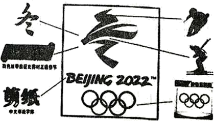
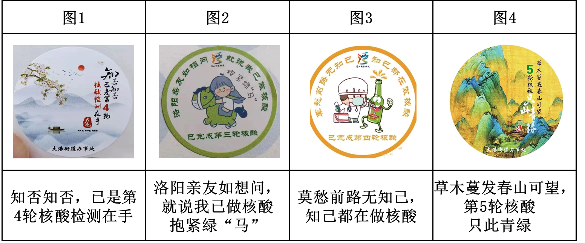
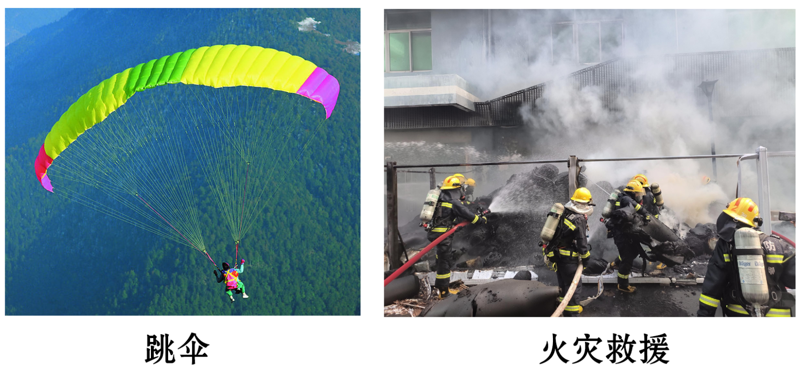
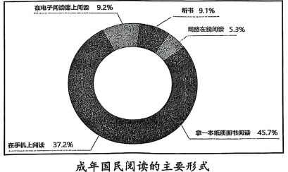

# 🌊 青岛中考语文分项专项练习 —— 04_文言文阅读(模拟)

> 📌 **收录说明**：本练习全量收录自青岛市模拟试卷中该考点的所有试题、背景材料与详细解析（共收录 28 套试卷切片）。

---

### 📌 试题来源与标定卡片：山东省青岛市 • 2019年中考模拟

> - **来源试卷**：2019山东青岛语文试卷+答案+解析(word整理版)
> - **考试年份**：2019年
> - **所属模块**：04_文言文阅读

(三)文言文阅读(12分)

魏征,字玄成,魏州曲城人,有大志,通贯书术。

十年,为侍中。尚书省滞狱不决者,诏征平治。征处事以情,人人悦服。多病,辞职,帝曰:“公不见金①在矿何贵之有?<u>冶锻而为器</u><u>,</u><u>人乃宝之。</u>朕自比于金,以卿为良匠而加砺②焉。卿虽疾,未及衰,岂得便③尔?”

时上封事④者众,或不切事,帝厌之。征曰:“古者立谤木,欲闻己过。封事,谤木之遗也。陛下当任其所言,以彰得失。言而是,则为朝廷之益;非,亦无损于政。”帝悦,皆慰之。

帝宴群臣,曰:“贞观以前,从我定天下,玄龄功也;贞观之后,纳忠谏,正朕违⑤,征而已。”亲解佩刀,以赐二人。<u>帝尝问群臣</u><u>:</u><u>“</u><u>征与诸葛亮孰贤</u><u>?</u><u>”</u>岑文本曰:“亮才兼将相,非征可比。”帝曰:“征蹈履仁义,以弼朕躬,欲致之尧、舜,虽亮无以抗。”

(选自《新唐书》,有删改)

[注]　①金:金属。②砺(lì):磨砺。③便:安适。④封事:密封的奏章。⑤违:过失、错误。

11.下列句中加点词的解释,不正确的一项是(2分)(　　)

A.尚书省滞狱不决者,诏征平治　　狱:案件

B.古者立谤木,欲闻己过	谤:诽谤

C.陛下当任其所言,以彰得失	彰:揭示

D.征蹈履仁义,以弼朕躬	弼:辅佐

12.下列句中“以”的意义与例句相同的一项是(2分)(　　)

例句:征处事以情,人人悦服

A.策之不以其道(《马说》)

B.不以物喜,不以己悲(《岳阳楼记》)

C.寡人欲以五百里之地易安陵(《唐雎不辱使命》)

D.近岸,卷石底以出(《小石潭记》)

13.下列句子与文中“封事,谤木之遗也”句式相同的一项是(2分)(　　)

A.何陋之有(《陋室铭》)

B.望之蔚然而深秀者,琅琊也(《醉翁亭记》)

C.蒙辞以军中多务(《孙权劝学》)

D.此人一一为具言所闻,皆叹惋(《桃花源记》)

14.下列对选文相关内容的理解,不正确的一项是(2分)(　　)

A.魏征因多病辞职,皇帝以金属自比,要求魏征做“良匠”对他加以磨砺。

B.魏征劝谏皇帝,想要知道自己的得失,就要广泛听取意见,让臣子们畅所欲言。

C.皇帝认为房玄龄助他平定天下,魏征纠正他的过失,他们都是国家功臣,于是解下佩刀赐给二人。

D.上至皇帝,下至群臣,都认为魏征践行仁义,尽心辅佐,才干超过诸葛亮。

15.将文中画线句子翻译成现代汉语。(4分)

(1)冶锻而为器,人乃宝之。(2分)

译文:<u> </u>

(2)帝尝问群臣:“征与诸葛亮孰贤?”(2分)

译文:<u> </u>

(四)现代文阅读(9分)

“黑金”石墨烯

①北京时间2018年12月19日零时,顶尖学术期刊英国《自然》杂志发布了2018年度影响世界的十大科学人物排行榜,中国22岁的青年学者曹原名列榜首。曹原发现:当两层平行石墨烯旋转成约1.1°的微妙角度时,就会产生神奇的超导效应。把平行的两层石墨烯旋转成约1.1°的“魔角”并不容易,需要很多次试错,但曹原总是很快就能操作成功。因此,《自然》杂志称曹原为“石墨烯驾驭者”。

②石墨烯是什么呢?它是一种二维晶体,是目前已知的最薄、强度最高、导电导热性能最强的新型纳米材料,被称为“黑金”,是一种有“新材料之王”之称的奇迹材料。它看似神秘,实际上,<u>石墨烯一层层叠起来就是石墨</u><u>,1</u><u>毫米厚的石墨大约包含</u><u>300</u><u>万层石墨烯。铅笔在纸上轻轻划过</u><u>,</u><u>留下的痕迹就可能是几层石墨烯。</u>它本来就存在于自然界,只是难以剥离出单层结构。

③石墨烯优异的物理性质使它在很多领域展现出巨大的应用潜力。尽管石墨烯还没有实现大规模的产业化,但是人们对石墨烯的应用前景十分看好。目前的研发成果显示,石墨烯已广泛应用于多个领域。(如右图)

④由于应用广泛,业内预计未来5至10年全球石墨烯产业规模会超过1000亿美元,更有乐观者认为,石墨烯的市场潜在规模在万亿美元以上。就目前情况来讲,石墨烯市场化的最大阻碍是需求和价格。石墨烯的未来产业化之路还很长,需要资金的支持和研发人员的开拓创新。

⑤近年来,我国各级政府对石墨烯的重视程度都在日益提高。随着国家利好政策的不断出台,市场需求的不断增加,石墨烯的应用领域会越来越广阔。与西方发达国家相比,中国对石墨烯的研究起步较晚,但通过科研人员孜孜不倦的努力,相信在不久的将来,石墨烯材料将以其优异的性能及超高的性价比在各个领域大放光彩。

(摘编自《22岁在读博士生荣登&lt;自然&gt;杂志全球十大

科学人物榜首》《石墨烯应用领域及前景浅析》

《石墨烯在涂料领域中的应用研究概况》)

16.根据原文内容,下列理解不正确的一项是(3分)(　　)

A.曹原发现了石墨烯“魔角”,《自然》杂志把他评为2018年度影响世界十大科学人物之首。

B.石墨烯被称为“新材料之王”,是目前已知的最薄、强度最高、导电导热性能最强的新型纳米材料。

C.文中图表显示,石墨烯可以应用在诸多领域,其中在电子和储能领域应用最为广泛。

D.由于拥有广泛的应用领域,近年来,石墨烯在全球的产业规模已经超过1000亿美元。

17.下列对文章写作特点的分析,不正确的一项是(3分)(　　)

A.第①段介绍曹原的研究成就巨大,令人振奋,引发了读者的阅读兴趣。

B.文章采用了画图表的方式介绍石墨烯广泛的应用领域,直观清晰。

C.第②③④段按照逻辑顺序介绍了石墨烯的特性、应用领域和应用前景。

D.本文把石墨烯比作“黑金”,语言形象,说明它与黄金具有相同的物理性质。

18.请仔细阅读第②段中画线句子,回答下面问题。(3分)

石墨烯一层层叠起来就是石墨,1毫米厚的石墨大约包含300万层石墨烯。铅笔在纸上轻轻划过,留下的痕迹就可能是几层石墨烯。

以“1毫米”和“300万层”的巨大反差,凸显了石墨烯怎样的特点?为什么又要以“铅笔在纸上轻轻划过”为例来说明?

答:<u> </u>

<u> </u>

<u> </u>

(五)现代文阅读(18分)

一针一线皆关情

蔡勋建

①父亲常说“做出衣裳的是针线”,按说这没有什么创意,但从一名乡间职业裁缝口中说出,却有权威性和说服力。父亲一生以裁缝为业,受乡亲敬重,行走乡间方圆二三十里,甚至跨出湘鄂边界为人缝制衣裳。

②他十二三岁拜师学裁缝,头年多半时间给师父家挑水打柴干家务活,渐渐地开始学缝扣眼、绞襻①子、钉扣子。翌年学习缝制衣服,第三年开始学绗②棉做棉衣,最后学剪裁。师父手艺高超,很严厉,连立身坐姿、穿针引线也有规矩,弄不好便举起尺子打过来。父亲说,他没少挨师父训罚,怎样打罚都必须忍着,熬过了三年,便有出头之日了。三年后他便提着裁剪刀行走乡里,独当一面,还真是多亏了师父的言传身教。

③在我的记忆深处,父亲有些绝活儿。

④父亲没学过美术绘图,可他裁布料用画粉时,总是从容果断,绝不拖泥带水。画线时用的是画粉袋,一条纱线从装有画粉的小布袋里左贯右出,其原理与木匠的墨斗无异。比如绗棉衣棉裤,父亲在铺好絮棉的布面上,<u>左手捏着画粉袋口</u><u>,</u><u>将线头置于棉裤一端</u><u>,</u><u>右手拉粉线</u><u>,</u><u>再用右肘根压住粉线另一端</u><u>,</u><u>右手拇指食指拈起粉线</u><u>,</u><u>轻轻一弹</u><u>,</u><u>不偏不倚完成一条白线。</u>如此反复,他的徒弟再照线举针绗棉。

⑤父亲擅长做开襟衣衫,他最得意的是做得一手漂亮盘扣。男服多用蜻蜓扣、春蚕扣(也叫一字扣),女服多用蝴蝶扣、菊花扣,还有男女通用的琵琶扣、树枝扣。一个个蜻蜓头,一对对蝴蝶结,公扣母扣,结对成双。这种衣服全用布扣,杜绝塑料扣子或有机玻璃扣子,着实漂亮。

⑥父亲喜欢在左胸前袋口插上一支钢笔,不过这笔大抵在算账立据时才派上用场。父亲有“两不记”:一是收人布料不记,客户来料,只要说明你要做什么衣服什么样式,他随手往那衣料堆里一放,绝不会张冠李戴;二是量体裁衣,他拿皮尺在来人身上左一拉右一扯,嘴里念叨着,只量体并不当面记录,也不开制衣单,顾客按期取衣,从不出错。

⑦他的裁缝工具很简单,裁剪刀、竹尺、皮尺、画粉、手针、顶箍,再就是熨斗。父亲剪裁时轻松自如,用剪吃布很干脆——咔哧,咔哧,咔哧,<u>这像极了农夫耕田犁地</u><u>,</u><u>当犁尖插入土地</u><u>,</u><u>只听得一声吆喝</u><u>,</u><u>那黑色土壤便顺着犁头往右翻去。</u>咔!最后一声特别干脆,听起来很果断,那肯定是剪刀将出,剪断布头了。

⑧剪裁用的案板是杉木的,那案面上有许多凹坑,密密麻麻。有次我看到父亲握着剪刀,在画有纵横交错线条的布面上,让剪刀随意地疾走,剪刀在案面上发出“咚咚咚”的声响,顿一下,布面一个窝,案板上一个坑。我揣测这种“停顿”绝不是率性而为,一定是有讲究的,应该是父亲为后来的缝纫制作留下的暗记,比如打褶、留岔什么的。案板上留下的“记号”,让我长久思索……

⑨除了在家等客上门做衣,很多时候是做“乡工”,也称“上门工”。这种方法是按天计收工钱,东家只管三顿饭,不需一件件算钱。但父亲并没有因此懈怠,只管埋头干活。平常东家客气,也有上烟上酒的,可父亲从来不沾,只吃些茶饭。

⑩早年,父亲行走乡里一直是手工制作,后来母亲加盟。不久有了缝纫机,一台“蝴蝶”牌缝纫机与他们“白头偕老”。父亲担纲剪裁,母亲负责缝制,从此父母同出同归。小时候我还没念书,就经常随父母去做“上门工”。一大早,东家挑一副挑子走在前头,一头是缝纫机头,一头是机脚,我紧跟父母在后,父亲说我从小就随他吃“百家饭”。

在乡间,这个行业有个笑话段子:“裁缝不落布,穿个冒裆裤。”少时我不解,便问父亲何意,父亲笑了,告诉我意思是说,如果哪个裁缝不留下布头,那他肯定穿着个没有裤裆的裤子。父亲从来不做那种“贪墨”糗事,每上门做完一家的衣服,他就将剩下的布头交给东家;若是在家,每做好一件衣服,他也将剩下的边角布料扎成一绺,塞进衣主的新衣荷包里。衣主自然高兴,因为这些边角布料又可去做千层布鞋底。

父亲从事职业裁缝五十年,他从手工到机制,见证了民间服装的演变发展,亲自经历了这些服装的全部制作过程。父亲就像一枚绗针,行走乡间,缝紧了乡情,缝暖了家庭,缝美了生活。

(选自《人民日报》2019年5月1日第8版,有删改)

[注]　①襻(pàn)子:用布做的扣住纽扣的套。②绗(hánɡ):缝纫方法,用针线固定面儿和里子以及所絮的棉花等。

19.作者说“在我的记忆深处,父亲有些绝活儿”,父亲有哪些绝活?请结合文章内容分条概括。(4分)

答:<u> </u>

<u> </u>

<u> </u>

20.结合文章内容,简要分析第②自然段在文中的作用。(4分)

答:<u> </u>

<u> </u>

<u> </u>

21.赏析文中画线句子。(6分)

(1)左手捏着画粉袋口,将线头置于棉裤一端,右手拉粉线,再用右肘根压住粉线另一端,右手拇指食指拈起粉线,轻轻一弹,不偏不倚完成一条白线。(3分)

答:<u> </u>

<u> </u>

<u> </u>

(2)这像极了农夫耕田犁地,当犁尖插入土地,只听得一声吆喝,那黑色土壤便顺着犁头往右翻去。(3分)

答:<u> </u>

<u> </u>

<u> </u>

22.文章的标题“一针一线皆关情”,如果换为“一位行走乡间的裁缝”是否可以?请结合全文说说你的理由。(4分)

答:<u> </u>

<u> </u>

<u> </u>

<u> </u>

============================================================

### 📌 试题来源与标定卡片：山东省青岛市 • 2020年中考模拟

> - **来源试卷**：2020山东青岛语文试卷+答案+解析(word整理版)
> - **考试年份**：2020年
> - **所属模块**：04_文言文阅读

(三)文言文阅读(12分)

张友正自少学书,常居一小阁上,杜门不治他事,积三十年不辍。有别馆,直三百万,尽鬻①以买纸。其书笔迹高简,有晋宋人风味。故庐在甜水巷,一日忽弃去,赁小屋于水柜街,与染工为邻。众人异之,或问其故。友正答曰:“吾欲假其素绢学书耳。”与染工约:凡有欲染皂者,先假之,一端②酬二百金。如是日书数端,笔未尝停。<u style="text-decoration: wavy;">有以纸馈之者不问多寡入手即书</u>,至尽乃已。

素与苏子瞻相善。元祐末,子瞻自扬州召还,友正乃具饭邀之。既至,则对设长案,各以精笔、佳墨、纸三百列其上,而置肴其旁。子赡见之,大笑。就坐,二人每酒一巡,即展纸挥毫。一二小僮磨墨,几不能供。饮酒终,纸亦尽,俱自以为平日书莫及也。

友正未尝仕。<u>其性直</u><u>,</u><u>恐为名声所累</u><u>,</u><u>少与人交</u><u>,</u><u>故知其书者少。</u>

(选自宋代叶梦得《避暑录话》,有删改)

[注]　①鬻(yù),卖。②端,长度单位。布帛二丈(或六丈)为一端。

11.对下列句中加点词的解释,不正确的一项是(2分)	(　　)

A.积三十年不辍　　　　　　辍:收拾

B.众人异之	异:认为……奇怪

C.吾欲假其素绢学书耳	假:借

D.凡有欲染皂者	皂:黑色

12.下列句中,加点“于”的含义与例句相同的一项是(2分)	(　　)

例句:赁小屋于水柜街

A.不义而富且贵,于我如浮云	(《论语·述而》)

B.所欲有甚于生者,故不为苟得也	(《鱼我所欲也》)

C.客之美我者,欲有求于我也	(《邹忌讽齐王纳谏》)

D.苟全性命于乱世,不求闻达于诸侯	(《出师表》)

13.下列对文中画波浪线部分的断句,正确的一项是(2分)	(　　)

A.有以纸馈之者/不问多寡/入手即书

B.有以纸馈之者不问/多寡入手/即书

C.有以纸/馈之者不问/多寡入手即书

D.有以纸/馈之者不问多寡/入手即书

14.下列对选文相关内容的理解,不正确的一项是(2分)	(　　)

A.张友正从小学习书法,并专心练习。为了购买纸张,他卖掉了价值三百万钱的别馆。

B.张友正搬离旧居,与染工为邻,是因为染坊里有染过的绢,可以用来练习书法。

C.子瞻应邀到友正家吃饭,看到长案上放置着笔墨纸等,而饭菜放在旁边,大笑起来。

D.友正、子瞻二人每饮一巡酒,就展开纸张,进行书法创作,酒喝完了,纸也用完了。

15.把文中画横线的句子翻译成现代汉语。(4分)

其性直,恐为名声所累,少与人交,故知其书者少。

译文:<u> </u>

<u> </u>

(四)现代文阅读(9分)

材料一　非物质文化遗产,是指各族人民世代相传并视为其文化遗产组成部分的各种传统文化表现形式,以及与传统文化表现形式相关的实物和场所:可以是传统口头文学、美术书法等艺术形式,也可以是礼仪节庆等民间风俗。保护和传承非物质文化遗产,关系到每一位中华儿女的身份标识和价值追求,有助于维系文化认同,增强社会凝聚力。

(摘编自中国日报网《非物质文化遗产》)

材料二　在当下的“非遗”传承中,出现了一批“95后”“非遗”传承人,他们捕捉潮流元素,让中国“非遗”更有活力,也让中国“非遗”更加自信地走向国际。

郎佳子彧是国家级非物质文化遗产郎派面塑艺术的第三代传承人。他创作了“烟熏妆”哪吒、“熊猫瘫”、动漫灌篮高手等一些造型可爱的面人,将流行元素巧妙融入其中,这些作品赢得了很多人的喜爱。以往的面塑大都注重写实,郎佳子彧却更偏爱表达内心感受。他高中时的面人作品《花季》,生动地表现了高三学子面对高考压力时的心理、学习状态。由于现代人更在意作品传达的意义,于是他不仅创作反思当代人社交生活的作品,也用面塑作品回应社会热点事件,这些作品让人感到,“非遗”离我们的生活并不遥远。

郎佳子彧以影像的方式传播面塑作品,抖音、快手、微信公众号上的粉丝都等着他更新。像他这样的年轻人,将“非遗”引入潮流,让“非遗”走进大众有了可能。

(摘编自《北京日报》《“95后”传承人捏面人20年:把“面人郎”变网红》)

材料三　创新是传统手工艺类“非遗”自力保护的内在要求,但在创新发展中,又不能为了创新而忘记传承。以文人艺术中国水墨画为例,由于诸多新水墨画不加审辨地抛弃了传统,事实上,传统水墨画的内在精神在这些新水墨画中已经荡然无存。

在传承中创新,是传统手工艺类“非遗”在历史发展过程中一直践行着的基本原则。手工艺与纯艺术不同,它的本源是日常生活需要,因而,无论如何创新,都不应丢弃其生活器物的本性。例如在当代,由于远离了日常生活需要,苏绣传承一度出现了危机。手工艺类“非遗”还应在技艺上不断革新,不断超越。此外,不能因为创新就远离本民族固有的审美心理。秦淮灯彩传承人说:“做灯是讲究寓意的,要讨喜,我创作过飞机灯,但不制作枪炮子弹灯,因为它们的寓意不吉祥。”

(摘编自季中扬　陈宇《论传统手工艺类非物质文化遗产的创新性保护》)

16.下列对材料内容的理解,不正确的一项是(3分)	(　　)

A.非物质文化遗产,可以是传统口头文学、美术书法等艺术形式,也可以是礼仪节庆等民间风俗。

B.“95后”“非遗”传承人捕捉潮流元素,让中国“非遗”更有活力,更加自信地走向国际。

C.由于文人艺术中国水墨画不加审辨地抛弃了传统,事实上,传统水墨画的内在精神已经荡然无存。

D.秦淮灯彩传承人不制作枪炮子弹灯。做灯讲究吉祥的寓意,这符合中华民族固有的审美心理。

17.材料二中关于郎佳子彧面塑作品的说法,不正确的一项是(3分)	(　　)

A.“烟熏妆”哪吒、“熊猫瘫”、动漫灌篮高手等面塑作品,包含了流行元素,赢得了很多人的喜爱。

B.郎佳子彧的面塑作品更偏爱表达内心感受,他高中时创作的《花季》就体现了这一特点。

C.郎佳子彧的面塑作品反思当代人社交生活,回应社会热点事件,让人感到“非遗”离我们的生活并不遥远。

D.郎佳子彧的面塑作品以影像的方式进行传播,将“非遗”引入潮流,让“非遗”走进了大众。

18.胶州大秧歌是国家级非物质文化遗产。上述三则材料,能为促进胶州大秧歌的传承与创新提供哪些启示?请简要概括。(3分)

答:<u> </u>

<u> </u>

(五)现代文阅读(18分)

大城小树

连 亭

①树本来长在乡野,由于人的关系,进了大城。虽然有些树由于水土不服而总有些营养不良,但毕竟大城算是有了树。

②霓虹闪耀、车水马龙的繁华热闹,若是没有树作为衬托,也只是没有生气的热闹而已。堆满楼、车的大城是死的,而树的加入,激活了城市。<u>树静止时</u><u>,</u><u>如大城恪尽职守的卫兵</u><u>;</u><u>树摇动时</u><u>,</u><u>荡漾出轻微的波浪般的乐声。</u>在树的一静一动中,大城获得了庄重和灵动。而这庄重与灵动的布景里,常常少不了鸟的身影。在大自然中,鸟是跟随树生活的,人们把树搬到大城,就把鸟引到了大城。唧唧啾啾的鸟声,给大城增添一抹轻灵的亮色。

③与大城相比,树很单薄,没有楼高,树间的鸟鸣也容易被汽车的噪声淹没。在大城,似乎人与树各有各的存在,各有各的活法,互不相干。但不管是否在意,大城越来越离不开树了。

④或许只是一些微不足道的瞬间,比如树变换了风的走向,比如树接住了窗前的一缕目光,比如树读懂了匆匆行人的疲累,一切就有了不同。树不经意间的每一次摇动,每一次呼吸,对大城来说都是恩惠:休息时,人们用树的那抹绿色放松疲劳的眼睛;在车站候车时,人们需要行道树遮阳挡雨;大城有了树,仿佛装了无数净化器,人们在一呼一吸中感受光合作用的律动……

⑤走在人头攒动的繁华大街上,人有时会与一棵棵树对望。人们看着树,树也同样注视人,它们温和、宽容的目光,消融了人的紧张疲惫。有时经过一棵树,听到鸟鸣周匝,耳朵会突然醒来,头会不自觉地抬起来,对鸟投以欣喜的目光,对树发出由衷的赞叹,混沌的兴致一下子活过来,突然哼出一些遥远的曲调,仿佛自己又变回那个新鲜的血肉丰满的人。

⑥前阵子我的一个朋友在大城添新居,费尽心力地将老家的一棵月桂搬进新家的花圃。我去看了这棵月桂,它已经有胳膊那么粗了。朋友说,这棵树是断不能割舍的,倘若不能将它带来,宁可回老家也不进城。我想起作家苏童也曾为没有属于自己的树而耿耿于怀。有一天他突然在城里拥有了两棵树。他在文章里写到,这两棵树弥合了他与整个世界的裂痕,这是父母和朋友都不曾做到的。我的朋友,并不像苏童那样是个名作家,但他与树的感情,和苏童是一样的。

⑦我曾在医院听了将近一个月的树声。我生的不是什么大病,却得住院,得手术,手术后又得住在白惨惨的病房里,怎么受得了呢!况且,又不能看书,不能见很多的人,一天到晚或躺着,或靠着,无聊得很。我多么希望能跟外界多一些交流啊,只要能够冲破这狭小的病房,什么都是好的!

⑧有一天,我仿佛听到了一棵树的声音,沙沙沙,沙沙沙……我还听到了鸟儿的声音,唧唧啾啾,唧唧啾啾……我睁开眼睛向窗子看去,见不到树,偶尔能看到鸟儿掠过窗玻璃的身影。我想,那窗子底下必定是站着一棵树的,不然哪来的沙沙声与鸟儿的歌声呢?我问从外面回来的母亲,母亲说:“是呢,是一棵碗口粗的杉树。”等我能从病床上起来走动,我就时常趴在窗口看院子里的那棵杉树。它挺拔、秀丽,枝叶间竟还隐藏着一个鸟窝,我猜想那鸟窝里一定有正在孵化的鸟蛋。呵,医院里的一棵树上,生命正在悄悄地孕育萌发!一个清晨,我在病房里醒来,听到沙沙沙的声音中夹杂着雏鸟的欢叫声,急忙奔到窗口,只见鸟妈妈正给小东西喂食呢!

⑨医生说,我心态好,手术后恢复得特别快,可以提前出院了。我竟很舍不得那棵树,我的康复是它赐予的。出院前,我专门去看望它,我忍不住对树投以惊叹的目光:它脚下的泥土那么少,但枝叶依然繁茂,始终朝着天空和阳光的方向用力延伸。<u>从此这棵树便在我心里扎下了根</u><u>,</u><u>潜滋暗长</u><u>,</u><u>成为我生命中的参天大树。</u>

⑩从医院出来,我终于又能走在大街上,走在一棵棵树之间。大城依然繁闹着,那一棵棵挺立在大城的树依然生长着。我想,我们身边一些或远或近的人,像极了这些离我们或远或近的树,他们在我们的生活中已是不可或缺。

(节选自连亭《以一棵树为起点》,有删改)

19.文中的“树”有哪些作用?请简要概括。(4分)

答:<u> </u>

<u> </u>

20.“然而在大城,树是很容易被忽略的”这句话是从文章中提取的,应放在文中第几段开头最合适?请结合上下文分析。(4分)

答:<u> </u>

<u> </u>

21.请任选一个角度赏析第②段中画线句子。(3分)

树静止时,如大城恪尽职守的卫兵;树摇动时,荡漾出轻微的波浪般的乐声。

答:<u> </u>

<u> </u>

22.如何理解第⑨段中画线句子的含意?(3分)

从此这棵树便在我心里扎下了根,潜滋暗长,成为我生命中的参天大树。

答:<u> </u>

<u> </u>

23.文末说,“我们身边一些或远或近的人,像极了这些离我们或远或近的树,他们在我们的生活中已是不可或缺”。文中的“树”让你联想到了谁?请结合文章内容阐述理由。(4分)

答:<u> </u>

<u> </u>

<u> </u>

============================================================

### 📌 试题来源与标定卡片：山东省青岛市市南区 • 2021年中考二模

> - **来源试卷**：2021年山东省青岛市市南区中考二模语文试题（解析版）
> - **考试年份**：2021年
> - **所属模块**：04_文言文阅读

<b>（三）文言文阅读（12分）</b>

屈原既绌。其后秦欲伐齐，齐与楚从亲①，惠王患之。乃令张仪佯去秦，厚币委质事楚，曰：“秦甚憎齐，齐与楚从亲，楚诚能绝齐，秦愿献商、於之地六百里。”楚怀王贪而信张仪，遂绝齐，使使如秦受地。张仪②诈之曰：“仪与王约六里，不闻六百里。” 楚使怒去，归告怀王。怀王怒，大兴师伐秦。秦发兵击之，大破楚师于丹、淅，斩首八万，虏楚将屈匄③，遂取楚之汉中地。怀王乃悉发国中兵，以深入击秦，战于蓝田。魏闻之，袭楚至邓④。楚兵惧，自秦归。而齐竟怒，不救楚，楚大困。明年，秦割汉中地与楚以和。楚王曰：“不愿得地，愿得张仪而甘心焉。”张仪闻，乃曰：“以一仪而当汉中地，臣请往如楚。”如楚，又因厚币用事者臣靳尚，而设诡辩于怀王之宠姬郑袖。怀王竟听郑袖，复释去张仪。是时屈原既疏，不复在位，使于齐，顾反，谏怀王曰：“何不杀张仪？”怀王悔，追张仪，不及。

<u>其后诸侯共击楚大破之杀其将唐眜。</u>时秦昭王与楚婚，欲与怀王会。怀王欲行，屈平曰：“秦，虎狼之国，不可信，不如毋行。”怀王稚子子兰劝王行：“奈何绝秦欢！”怀王卒行。入武关，秦伏兵绝其后，因留怀王，以求割地。怀王怒，不听。亡走赵，赵不内。复之秦，竟死于秦而归葬。

节选自司马迁《史记（屈原列传）》

【注】①从亲：合纵结亲。从同“纵”。②张仪：魏人。战国时纵横家。当时为秦相。③屈匄：楚大将军。④邓：古国名。其时属楚，在今河南邓县。

11. 下列句中加点词的解释不正确的一项是（   ）

A. 屈原既绌  绌：同“黜”，贬退。

B. 张仪诈之曰  诈：欺诈。

C. 怀王卒行  卒：士兵。

D. 奈何绝秦欢  奈何：为什么。

12. 下列句中，加点字的意义相同的一顼是（   ）

A. 乃令张仪佯去秦        当立者乃公子扶苏（《陈涉世家》）

B

 秦割汉中地与楚以和    不以物喜，不以己悲（《岳阳楼记》）

C. 使于齐                  箕畚运于渤海之尾（《愚公移山》）

D. 魏闻之                  马之千里者（《马说》）

13. 下列对文中画线部分断句正确的一项是（   ）

A. 其后诸侯/共击楚/大破之/杀其将唐眛。

B. 其后/诸侯共击楚/大破之/杀其将唐眛。

C. 其后诸侯/共击楚/大破之杀/其将唐眛。

D. 其后/诸侯共击楚/大破之杀/其将唐眛。

14. 下列对选文相关内容的理解，不正确的一项是（   ）

A. 选文中，楚怀王听信谗言，分辨不出是非，让楚国陷入困境。

B. 张仪呈献给楚王厚礼和信物，并许诺如果楚国和齐国绝交，秦国愿意献上六百里的土地，以此骗取了楚王的信任。

C. 楚怀王放走了张仪，子兰劝谏怀王杀掉张仪。怀王派人追张仪已经来不及了。

D. 屈原虽然被罢免，但仍然力谏楚怀王，体现了他的爱国之情。

15. 将下列句子翻译成现代汉语。

（1）乃令张仪佯去秦，厚币委质事楚。

（2）不愿得地，愿得张仪而甘心焉。

【答案】11. C    12. C    13. B    14. C

15. （1）秦王就派张仪假装离开秦国，用厚礼和信物呈献给楚王。（2）我不愿得到土地，只希望得到张仪就甘心了。

【解析】

【11题详解】

此题考查文言词语的解释。解释词语要注意词语在具体语境中的用法，如通假字、词类活用、古今异义等现象。

C.有误，“怀王卒行”意思是：怀王终于前往。卒：终于。此项解释为“士兵”有误。

故选C。

【12题详解】

本题考查一词多义。解答此类题目时，应先知道这些词语有几个解释，然后根据句子的翻译推断词语在不同句子中的意思。

A.于是，就/是

B.和，跟/因为

C.到/到

D.代指这一情况/定语后置的标志

故选C。

【13题详解】

此题考查文言文断句。文言文断句首先要明确句意，同时运用以下方法：明词性（根据词性找句子结构），找句式（注意判断句、被动句、省略句、对称句、倒装句等一些固定句式），看对话（标志词如曰、云、言），据修辞（排比、对偶、反复、顶针）等。

“其后诸侯共击楚大破之杀其将唐眜”意思是：后来，各国诸侯联合攻打楚国，大败楚军，杀了楚国将领唐昧。按语法分析：“其后”是状语，“诸侯”是主语，“共击”“大破”“杀”是谓语，“楚”“之”“其将唐眜”是宾语。故断句为：其后/诸侯共击楚/大破之/杀其将唐眛。

故选B

【14题详解】

此题考查内容理解。

C.有误，由“是时屈原既疏，不复在位，使于齐，顾反，谏怀王曰：‘何不杀张仪？’”可知，是屈原劝谏怀王杀掉张仪。此项“子兰劝谏怀王杀掉张仪”有误。

故选C。

【15题详解】

本题考查文言语句翻译。答题时先要理解重点词语的意思，然后初步翻译，再根据现代汉语的习惯进行调整，做到文从字顺。直译为主，意译为辅。重点词语有：

（1）乃：于是，就；令：派；佯：假装；厚币：丰厚的礼物；质：信物；事：献给。

（2）地：土地；愿：希望；甘心：心满意足。

【点睛】参考译文：

屈原已被罢免。后来秦国准备攻打齐国，齐国和楚国结成合纵联盟互相亲善。秦惠王对此担忧。就派张仪假装脱离秦国，用厚礼和信物呈献给楚王，对怀王说：“秦国非常憎恨齐国，齐国与楚国却合纵相亲，如果楚国确实能和齐国绝交，秦国愿意献上商、於之间的六百里土地。”楚怀王起了贪心，信任了张仪，就和齐国绝交，然后派使者到秦国接受土地。张仪抵赖说：“我和楚王约定的只是六里，没有听说过六百里。”楚国使者愤怒地离开秦国，回去报告怀王。怀王发怒，大规模出动军队去讨伐秦国。秦国发兵反击，在丹水和淅水一带大破楚军，杀了八万人，俘虏了楚国的大将屈匄，于是夺取了楚国的汉中一带。怀王又发动全国的兵力，深入秦地攻打秦国，交战于蓝田。魏国听到这一情况，袭击楚国一直打到邓地。楚军恐惧，从秦国撤退。齐国终于因为怀恨楚国，不来援救，楚国处境极当困窘。第二年，秦国割汉中之地与楚国讲和。楚王说：“我不愿得到土地，只希望得到张仪就心满意足了。”张仪听说后，就说：“用一个张仪来抵当汉中地方，我请求到楚国去。”到了楚国，又用丰厚的礼品贿赂掌权的大臣新尚，通过他在怀王宠姬郑袖面前编造了一套谎话。怀王竟然听信郑袖，又放走了张仪。这时屈原已被疏远，不在朝中任职，出使到齐国，回来后，劝谏怀王说：“为什么不杀张仪？”怀王很后悔，派人追张仪，已经来不及了。

后来，各国诸侯联合攻打楚国，大败楚军，杀了楚国将领唐眜。这时秦昭王与楚国通婚，要求和怀王会面。怀王想去，屈原说：“秦国是虎狼一样的国家，不可信任，不如不去。”怀王的小儿子子兰劝怀王去，说：“怎么可以断绝和秦国的友好关系！”怀王终于前往。一进入武关，秦国的伏兵就截断了他的后路，于是扣留怀王，强求割让土地。怀王很愤怒，不听秦国的要挟。他逃往赵国，赵国不肯接纳。只好又到秦国，最后死在秦国，尸体运回楚国安葬。

<b>（四）现代文阅读（9分）</b>

[材料一]

①三星堆被称为20世纪人类最伟大的考古发现之一，自1986年三星堆遗址1.2号“祭祀坑”相继被发现，人们对它的讨论便从未停止。近期，伴随着三星堆考古新发现的揭晓，一大批罕见珍贵文物从沉睡中醒来，再次惊艳了世界。

②三星堆“上断”，再次掀起了大众对文物的关注热潮。一时间，全国各地的文博机构纷纷技痒难耐，在网上发起了全国文物的展示大赛，四川晒出了黄金面具、方尊、陶三足炊器、陶猪，河南接着秀出了仰韶村遗址发掘出土的奥似水泥混凝土房屋建筑材料，。然后是浙江的青軸揭彩牛形灯、陕西的秦始皇兵马俑，可谓上演了一场镜彩的中华文化秀，让人大饱眼福、大呼过瘾。

③三星堆引发文物热也提醒我们，不但要关注文物、欣赏文物，也要更好地珍惜文物、保护文物。文物是不可再生资源，。一旦破坏难以修复，造成的损失无法挽回。文物不只是历史的沉淀、岁月的陈酸，更铭刻着文化的脉络、记录着文明的传承，是鲜活的、生动的。保护文物要注重保护与利用相结合，既要妥善保护、防止损毁，也要科学利用。活化传承，尤其是要把文物所蕴藏的记忆挖掘出来，用文物讲好中国故事、呈现中国文化，为文物注入时代要义赋予新的内涵，使更多文物能够“活”起来。

④三星堆系列文物的出土，更加佐证了“中华文明是唯一不曾断绝的文明”这一论断，使中华文化自信、民族自信更加深厚。我们要更好地保护和利用文物，充分发挥文物的资源价值作用，让这些珍贵的历史和文化财富进一步凝聚我们民族的精气神，为推动民族复兴注入更强动的文化之力。

（节速自《中国旅游报》）

[材料二]

①以“馆园一体”为特色的三星堆博物馆馆区，既是国家一级博物馆，也是首批国家4A级旅游景区、首批国家考古遗址公园。在这片富集古蜀灿烂、神秘文化的土地上，以三星堆文化为核心，一站式大型文化旅游综合示范区正在打造。

②“游客太多了，最近感受到了大家对‘三星堆’满满的热情。”三星堆博物馆公众。服务部宣教主管邹鹏说。提不完全统计，今年清明节小长假期间。<u>入园总人次超过4.5万人次。第一季度全国热搜博物馆百强榜单中，三星堆博物馆以4.92的热搜综合指数超过故宫博物院首登榜首</u>。游客纷至沓来，人们都想一睹那些奇异的青铜器所蕴含的魅力。三星堆博物馆发布公告，为满足广大游客的参观需求，博物馆原定于3月29日起实施的青铜馆基本陈列提升工程延期至国庆节假期以后。三星堆开放式文物修复馆即将在5月对公众开放。据三星堆景区管委会产业发展部部长任韧介绍，这里将展示文物修复过程，游客还可看到祭祀坑出土未修复文物、修复文物半成品，祭祀坑出土修复后的文物精品。展馆将以图文、声彩的形式呈现修复知识，游客可亲身体验文物的修复过程、了解文物修复的技术方法。

③"青铜神树”的雄奇瑰丽、“青铜大力人”的诡谲神奇、青铜面具那凝重表情里突出的眼睛和薄薄的嘴唇，引发人们无数的猜想。在这次考古新发现之前，三星堆博物馆早已聚拢了大量人气，并深受年轻游客喜爱。“三星堆博物馆对外宣传时都是自称‘我堆’，这也成为考古文物爱好者对它的称谓，很亲切，新媒体上互动性也很强。"博物馆爱好者余林说。

④三星堆文化的神秘色彩，是进行文化创意的灵感源泉。让传统文化真正走进生活，被年轻人喜爱，一直是三星堆博物馆思考的问题。最近，三星堆祈福神官主题盲盒系列在各大平台上卖断货，三星堆博物馆市场营销部部长林维介绍，盲盒选取了三星堆5个极其代表性的文物形象，分别配以人设，打造出一个青铜时代的“偶像天团"。盲盒的方寸之间，复刻众神魅力，“把玩”古蜀王国。

（节选自《中国旅游报》）

16. 下列对两则材料内容的理解不正确的一项是（   ）

A. 三星堆考古新发现的揭晓，再次惊艳了世界，又一次掀起了大众对文物的关注热潮。

B. 三星堆开放式文物修复馆对公众开放，公众可以学习修复知识，动手参与修复出土的未修复文物。

C. 材料一中，精美绝伦的文物和文化遗产让普通大众感受到了文化的新魅力和新追求，折射出的是深厚的文化自信。

D. 材料二中， “馆园一体”的创新之路，打造了文化与旅游融合的经典案例，在突出博物馆专业职能的同时，又发挥了博物馆的旅游休闲功能。

17. 下列对两则材料内容的理解不正确的一项是（   ）

A. 材料一中，全国各地的文博机构开展文物展示大赛，观众热情高涨，纷纷技痒难耐，接踵而至，上演了一场精彩的中华文化秀。

B. 材料一中，加点字“之一”起到了限制作用，体现了说明文语言准确、严密的特点。

C. 材料二画线句子采用了列数字的说明方法，准确地说明了参观三星堆博物馆的人数众 多，游客们满满的热情体现了“三星堆”文物以及中华文明的魅力。

D. 材料二中引用了博物馆爱好者余林说的话，说明了三星堆博物馆的人气旺，深受年轻 游客的喜爱。

18. 三星堆博物馆思考的问题是让传统文化走进生活，被广大青年人所接受，请你根据 材料的提示写三条具体建议。

【答案】16. B    17. A

18. （1）与各大平台联合开展类似“神官主题盲盒”之类的活动，让文物走进年轻人生活。

（2）开设博物馆的网上展厅，用三维立体形式多角度展示文物，便于青年人及时参观学习。

（3）了解青年人的需要，将博物馆建设与旅游融合发展，精心打造出体现文化内涵、人文精神的特色旅游精品。（言之有理即可。）

【解析】

【16题详解】

本题考查信息提取和筛选。

B.结合材料二第②段“三星堆开放式文物修复馆即将在5月对公众开放。据三星堆景区管委会产业发展部部长任韧介绍，这里将展示文物修复过程，游客还可看到祭祀坑出土未修复文物、修复文物半成品，祭祀坑出土修复后的文物精品。展馆将以图文、声彩的形式呈现修复知识，游客可亲身体验文物的修复过程、了解文物修复的技术方法”可知，三星堆开放式文物修复馆即将在5月对公众开放，现在还没有开放；“游客可亲身体验文物的修复过程”而不是“动手参与修复出土的未修复文物”；

故选B。

【17题详解】

本题考查信息筛选和辨析。

A.“观众热情高涨，纷纷技痒难耐，接踵而至，上演了一场精彩的中华文化秀”错误，结合材料一第②段“一时间，全国各地的文博机构纷纷技痒难耐，在网上发起了全国文物的展示大赛”可知，技痒难耐的是全国各地的文博机构，而不是观众；

故选A。

【18题详解】

本题考查信息提炼和拓展延伸。

（1）结合材料二第④段“最近，三星堆祈福神官主题盲盒系列在各大平台上卖断货，三星堆博物馆市场营销部部长林维介绍，盲盒选取了三星堆5个极其代表性的文物形象，分别配以人设，打造出一个青铜时代的‘偶像天团’。盲盒的方寸之间，复刻众神魅力，‘把玩’古蜀王国”可知，可以提出建议：与各大平台联合开展类似“神官主题盲盒”之类的活动，让文物走进年轻人生活。

（2）结合材料二第②段“展馆将以图文、声彩的形式呈现修复知识，游客可亲身体验文物的修复过程、了解文物修复的技术方法”可知，可以从技术方面入手，让年轻人能够更深入地了解文物，触摸文物。例如开设博物馆的网上展厅，用三维立体形式多角度展示文物，便于青年人及时参观学习。

（3）结合材料二第①段“以‘馆园一体’为特色的三星堆博物馆馆区，既是国家一级博物馆，也是首批国家4A级旅游景区、首批国家考古遗址公园。在这片富集古蜀灿烂、神秘文化的土地上，以三星堆文化为核心，一站式大型文化旅游综合示范区正在打造”可知，文物要考虑到保护与利用两个方面，要了解青年人的需要，将博物馆建设与旅游融合发展，精心打造出体现文化内涵、人文精神的特色旅游精品。

<b>（五）现代文阅读（18分）</b>

木耳

李娟

①阿勒泰①连绵起伏的群山背阴面有成片浩荡的森林，那里安静、绝美、携着秘密。木耳一排排半透明地立在伏倒的树木上，它们是森林里最神秘最敏感的耳朵，总是会比你先听到什么，更多地知道些什么，却不为你所了解。

②那时候，知道这山里有木耳的，还只是很少的几个人，采回家也只是自己尝尝鲜而已。而我妈却想靠它发财。

③我妈一心想找到那野生的木耳。她爬山峰，下深谷，出去得一天比一天早，回来得一天比一天晚。每天回来，头发乱糟糟的，疲惫与失望折磨着她。终于，有一天，她从森林里回来，拿着一根小树枝。树枝的梢头结着指头大的一小团褐色的，嫩嫩软软的小东西。像一个混混沌沌、灵智未开的小精灵。那就是木耳。

④从我妈找回第一朵木耳开始，<u>生活中开始有了飞翔与畅游的内容，也有了无数次的坠落和窒息</u>。

⑤当晾干的木耳攒够了六公斤时（平均九公斤湿的才能出一公斤干货），我们把它们仔细地包装好。我妈提着装着木耳的箱子，搭上一辆运木头的卡车去了山下。那天半夜时分，我妈才回来，她兴奋地告诉我们，在山下小镇，一个干部模样的人，想买木耳作为礼品，他把六公斤木耳全买了，八十块钱一公斤！这远远比我们靠小店做生意赚得多，我妈高兴得直想飞回来。那个夏天真是漫长，我不知道究竟弄了多少木耳。每次我妈下山，想要的人便闻讯而至，简直跟抢一样。我们就顺势把木耳涨到了一百块钱一公斤。

⑥渐渐地，有一些人也开始采木耳卖木耳了。采木耳的队伍悄然扩大。采过木耳的痕迹，满山遍野都是。木耳生长的速度极快，尤其在下过雨后。但采木耳的人一多，它就赶不上采摘的速度了。木耳明显地少了，于是除了采木耳以外，人们又挖党参，挖虫草。只要是能卖到钱的都挖，山脚下，森林边狼藉一片。秋天下山时，木耳已卖到一百八十块钱。刚入冬，又涨到两百块钱整。

⑦这时，木耳的用处已不是用来吃了，而是作为礼品和一种时髦的，用来消遣的东西，被用来进行着秘密地交流，最终流传到一个本来与木耳没有任何关系的地方。

⑧又一年春天来临，木耳的世界疯狂到了极限。远在宁夏甘肃的人也涌来了，山下的人爆满，像蝗虫一样，到处都是，他们靠着破旧的行李露宿在河边那片废墟里；还来了铁匠，专门给大家打制挖野货时要用的工具，炉火熊熊，贪婪地吞噬着早春的空气。进山的那两天，所有人背着铺盖行李，提着面粉粮油，扛着铁锹木铲，成群结队，浩浩荡荡向北走，进山，进山，对木耳狂热的渴望照亮了他们暗黑疲惫的脸……而来订购木耳的人把价出到了五百块钱。

⑨我们真有点怕了，我对我妈说：“今年我们还去弄吗？”

⑩她也怕了，但她想了又想，说：“不弄的话怎么办呢，你看我一天天老了，我们怎么生活……”那么我们过去又是怎么生活的呢？那些没有木耳的日子，没有希望又胜似有无穷希望的日子，那些简单的、平和喜悦的日子，不是生活吗？我们几乎都要忘了，忘了森林里除木耳之外的那些更多更广阔更令人惊喜的一切……就在那一年，像是几年前突然出现一样，木耳突然消失了，像是从来就没有过一样地没有了……森林里曾有过木耳的地方都梦一样空着？真的什么也找不到了……大风吹过山谷，森林发出巨大的轰鸣。天空的蓝是空空的蓝，大地的绿是空空的绿。木耳没有了，森林里的每一棵伏倒的树木再也不必承受什么了，它们倒在森林里，又像是漂浮在森林里。我觉得那一年的每一个人都在哭。木耳再也没有了……其实，我们对木耳的了解是多么不够啊！那一天我一个人进山，走了很远，看到前面有人，那是我妈，她还在找。远远地就看到她的附近有一朵木耳，整个世界最后的一朵，静静地生长着，但是她没有发现。我站在那里，看着她很久很久，直到看着她失望地离去。

【注】①[阿勒泰]位于新疆阿尔泰山南麓，森林、矿产资源十分丰富，素有“金山”之称。

（选自《意林作文素材》，有改动）

19. 通读全文，用简洁语言概括小说情节及人物情感。

| 主要情节 | 情感 |
| --- | --- |
| 我妈想靠木耳发财，终于千辛万苦从森林中找回了一朵野生木耳。 | ① |
| ② | 兴奋 |
| 狂热的人们从四面八方来到森林采木耳，木耳价格涨到五百块。 | ③ |
| ④ | 失望 |

20. 阅读全文，说说文章第①段有什么作用。

21. 根据提示，赏析下列句子。

（1）树枝的梢头结着指头大的一小团褐色的，嫩嫩软软的小东西。像一个混混沌沌、灵智未开的小精灵。（修辞角度）

（2）天空的蓝是空空的蓝，大地的绿是空空的绿。（加点词含义）

22. 如何理解第④段划线句子“生活中开始有了飞翔与畅游的内容，也有了无数次的坠落和窒息”？

【答案】19. ①高兴（惊喜） 
②木耳很快被买走，每次都有顾客抢购我妈采的木耳。
③害怕 
④木耳突然消失了，母亲再也没找到木耳。

20. 描写了木耳生长的阿勒泰山区森林安静、神秘的环境，交代了故事发生的背景，与下文人们疯狂采集木耳使得森林变得喧嚣形成鲜明对比。设置悬念，激发读者阅读兴趣。

21. （1）运用比喻的修辞手法，把木耳比作灵智未开的小精灵，生动形象地写出了木耳的娇嫩可爱，表达了我对木耳的喜爱之情及见到野生木耳的欣喜之情。

（2）反复。“空空”一方面指颜色的澄澈、纯净，突出环境的安静、优美。另一方面指人们的疯狂攫取，令森林里的物产荡然无存。批判了人们为一己私利，贪婪破坏自然的行为。

22. 木耳销路好、引来人们抢购，我们售卖木耳，家庭的收入比原先多了好多，生活条件有了改善，获得了经济效益，因此说生活有了飞翔与畅游的内容。但是木耳的热销也引来了四面八方的人，疯狂攫取森林中的资源，使森林失去了往日的宁静，直至森林中的木耳被采光完全消失，令生活在森林边的我们害怕和窒息。表达出人与自然应和谐共生的深刻思考。引出下文/表现了我内心的矛盾与挣扎/大自然的馈赠给予人们生活的希望，而人的贪婪破坏了自然环境，也最终受到了自然的警告与惩罚。（此三点写出两点即可）

【解析】

【19题详解】

考查筛选信息。

①根据第③段中的“终于，有一天，她从森林里回来，拿着一根小树枝。树枝的梢头结着指头大的一小团褐色的，嫩嫩软软的小东西。像一个混混沌沌、灵智未开的小精灵”可得：高兴惊喜。

②根据第⑤段中

“她兴奋地告诉我们，在山下小镇，一个干部模样的人，想买木耳作为礼品，他把六公斤木耳全买了，八十块钱一公斤！……每次我妈下山，想要的人便闻讯而至，简直跟抢一样”可得：木耳很快被买走，每次都有顾客抢购我妈采的木耳。

③根据第⑨段中的“我们真得有点怕了”可得：害怕。

④根据第⑩段中的“木耳突然消失了，像是从来就没有过一样地没有了”“整个世界最后的一朵，静静地生长着，但是她没有发现。我站在那里，看着她很久很久，直到看着她失望地离去”可得：木耳突然消失了，母亲再也没找到木耳。

【20题详解】

考查分析语段作用。

根据首段中的“阿勒泰连绵起伏的群山背阴面有成片浩荡的森林，那里安静、绝美、携着秘密”可得：描写了木耳生长的阿勒泰山区森林安静、神秘的环境，交代了故事发生的背景。

联系第⑧段中的“远在宁夏甘肃的人也涌来了，山下的人爆满，像蝗虫一样，到处都是，他们靠着破旧的行李露宿在河边那片废墟里……成群结队，浩浩荡荡向北走，进山，进山，对木耳狂热的渴望照亮了他们暗黑疲惫的脸”可知，当初阿勒泰山区森林安静、神秘的环境与后文人们疯狂采集木耳使得森林变得喧嚣形成鲜明对比。

首段多次强调阿勒泰的神秘，设置了悬念，激发了读者的阅读兴趣。

【21题详解】

考查语句赏析。

（1）“像一个混混沌沌、灵智未开的小精灵”运用比喻的修辞，把木耳比作小精灵，联系句中的“嫩嫩软软的小东西”可知，生动形象地表现了木耳的娇嫩可爱。联系作者感情可知，表现了我对木耳的喜爱及见到野生木耳时的欣喜之情。

（2）“空空”两次出现，这是反复的修辞手法。“空空的蓝”表现了天空的澄澈。“空空的绿”表现了森林的静谧。联系末段中的“就在那一年，像是几年前突然出现一样，木耳突然消失了，像是从来就没有过一样地没有了……森林里曾有过木耳的地方都梦一样空着？真的什么也找不到了”可知，“空空”也指人们的疯狂攫取，令森林里的物产荡然无存。联系作者感情可知，表现了作者对人们疯狂追求经济利益，向自然索取无度，导致自然被破坏行为的批判之意。

【22题详解】

考查语句理解。

联系第⑤段中的“在山下小镇，一个干部模样的人，想买木耳作为礼品，他把六公斤木耳全买了，八十块钱一公斤！这远远比我们靠小店做生意赚得多，我妈高兴得直想飞回来。那个夏天真是漫长，我不知道究竟弄了多少木耳。每次我妈下山，想要的人便闻讯而至，简直跟抢一样。我们就顺势把木耳涨到了一百块钱一公斤”可知，妈妈从山里采来的木耳销路很好，不仅价格高，而且不愁销售。这增加了家庭收入，生活条件有了改善，所以说“生活中开始有了飞翔与畅游的内容”。

联系末段中的“就在那一年，像是几年前突然出现一样，木耳突然消失了，像是从来就没有过一样地没有了……森林里曾有过木耳的地方都梦一样空着？真的什么也找不到了”可知，人们为了追求更高的经济利益，不仅把森林里的木耳采摘一空，而且把其他的一些资源与采空了。联系第⑨段中的“我们真有点怕了”可知，人们疯狂让我们感到害怕。曾经资源丰富的山林，现在变得空空如也，这让我们这些生活在山林里的人觉得恐惧与窒息。

这句话含蓄地点明了文章主旨：自然为人类提供了各种资源，但由于人们过度开发与利用，导致大自然的资源枯竭。木耳的消失其实就是大自然给人类的一个警告。如果人类还不知收敛，那一个消失的，就可能是人类自身了。从而表现了作者的思考。

============================================================

### 📌 试题来源与标定卡片：山东省青岛市崂山区 • 2022年中考一模

> - **来源试卷**：2022年山东省青岛市崂山区中考一模语文试题（解析版）
> - **考试年份**：2022年
> - **所属模块**：04_文言文阅读

<b>（三）文言文阅读（12分）</b>

赤壁洞穴

黄州守居之数百步为赤壁，或言即周瑜破曹公处，不知果是否？断崖壁立， 江水深碧，二鹘巢其上，有二蛇，或见之。遇风浪静，辄乘小舟至其下。舍舟登岸，入徐公洞。非有洞穴也，但山崦深邃耳。《图经》云：“是徐邈不知何时人，非魏之徐邈也。”<u style="text-decoration: wavy;">岸多细石有温莹如玉者深浅红黄之色或细纹如人手指螺纹也。</u>既数游，得二百七十枚，大者如枣栗，小者如芡实，又得一古铜盆盛之，注水粲然。有一枚如虎豹者，有口鼻眼处，以为群石之长。

（选自《东坡志林》）

汴河斗门

<u>数年前朝廷作汴河斗门以淤田，识者皆以为不可，竟为之，然卒亦无功</u>。方樊山水盛时放斗门，则河田坟墓庐舍皆被害，及秋深水退而放，则淤不能厚，谓之“蒸饼淤”。朝廷亦厌之而罢。偶读白居易《甲乙判》，乃知唐时汴河两岸皆有营田斗门，若运水不乏，即可沃灌。古有之而今不能，何也？当更问知者。

（选自《东坡志林》）

注：淤田，就是在汴河上做一个堤坝，堤坝放开，用水一冲，可以冲出好多田。

11. 下列各句中，加点词语解释不正确

一项是（   ）

A. 二鹘巢其上            巢：筑巢

B. 是徐邈不知何时人      是：这个

C. 但山崦深邃耳          但：但是

D. 方樊山水盛时放斗门     方：正当

12. 下列各句中，加点词语意义相同的一项是（   ）

A. 谓之“蒸饼淤”                 公将鼓之

B. 古有之而今不能学               而不思则罔

C. 乃知唐时汴河两岸皆有营田斗门   当立者乃公子扶苏

D. 数年前朝廷作汴河斗门以淤田      策之不以其道

13. 下列各项对文章画波浪线部分的断句，正确的一项是（   ）

A. 岸多细石有温莹/如玉者深浅红黄之/色或细纹/如人手指螺纹也。

B. 岸多细石/有温莹如玉者深浅红黄/之色或细纹/如人手指螺纹也。

C. 岸多细石有温莹如玉者深浅红黄之/色或细纹/如人手指螺纹也。

D. 岸多细石/有温莹如玉者/深浅红黄之色/或细纹如人手指螺纹也。

14. 下列对选文相关内容的理解，正确的一项是（   ）

A. 《赤壁洞穴》中“注水粲然”，说的是古铜盆盛水之后闪闪发光的样子。

B. 《赤壁洞穴》中关于“徐公洞”的徐公，作者认为不是魏时候的徐邈。

C. 《赤壁洞穴》中有一枚外形像虎豹一样的石头，作者认为是其中最好的。

D. 《汴河斗门》中作者通过白居易的记载，认为当时人不如古人有智慧。

15. 把文中画线的句子翻译成现代汉语。

数年前朝廷作汴河斗门以淤田，识者皆以为不可，竟为之，然卒亦无功。

【答案】11. C    12. B    13. D    14. C

15. 几年前朝廷制作汴河斗门来放水冲田，有见识的人都认为不能做，最终做了，然而最后也没有什么成效。

【解析】

【11题详解】

本题考查理解文言字词。可结合句意推断词义。

C.“但：但是”解释不正确。但山崦深邃耳：只是山路崎岖深邃罢了。但：只是；

故选C。

【12题详解】

本题考查理解文言虚词。

A.代词，指代“等到深秋水退的时候才开放堤堰”的情形/无实际意义，起调整音节的作用；

B.都是表转折关系的连词，译作“却，但，但是”；

C.才/是；

D.来/按照；

故选B。

【13题详解】

本题考查文言断句。根据文言文断句的方法，先梳理句子大意，分清层次，然后断句，反复诵读加以验证。主语和谓语之间，谓语和宾语、补语之间一般要作停顿。

岸多细石有温莹如玉者深浅红黄之色或细纹如人手指螺纹也：岸上有很多细石，往往有温莹如玉的，深浅红黄的颜色，有的细纹像人手指上的螺纹。

“岸多细石”中“岸”是主语，省略了谓语“有”，“细石”是宾语，故在“石”后断句，故可排除AD；“有温莹如玉者”中有标志性词语“者”，故在“者”后断句，故可排除B；“深浅红黄之色”中“之”是标志性词语，译作“的”，前后不能中断，故在“色”后断句；“或细纹如人手指螺纹也”中“或细纹”是主语，“如”是谓语，“人手指螺纹”是宾语，“也”句末语气词，表示判断语气，故不能中断。可断句为：岸多细石/有温莹如玉者/深浅红黄之色/或细纹如人手指螺纹也。

故选D。

【14题详解】

本题考查理解文章内容。

A. “说的是古铜盆盛水之后闪闪发光的样子”理解不正确。《赤壁洞穴》中“注水粲然”，是指古铜盆注入水之后，水里的石头闪闪发光的样子；

B. “作者认为不是魏时候的徐邈”理解不正确。结合《赤壁洞穴》中“《图经》云：‘是徐邈不知何时人，非魏之徐邈也’”可知，是《图经》里认为不是魏时候的徐邈，并不是作者是认为；

D. “认为当时人不如古人有智慧”理解不正确。结合《汴河斗门》中“偶读白居易《甲乙判》，乃知唐时汴河两岸皆有营田斗门，若运水不乏，即可沃灌。古有之而今不能，何也？”可知，作者认为古时的人都能做到，为什么当时的人却做不到呢，作者对此提出了疑问，并不没有发表“认为当时人不如古人有智慧”的看法；

故选C。

【15题详解】

本题考查翻译文言语句。翻译时应当注意做到字字落实，尤其是重点实词的翻译；其次要注意句子中缺失的成分，如主语、宾语需要补全；最后要注意语句的通顺。直译为主，意译为辅。

本题中注意重点字词“作（制作）、以（来）、淤田（放水冲田）、识者（有见识的人）、皆（全，都）、以为（认为）、竟（最终）、卒（最后）、功（成效）”要理解正确。

【点睛】参考译文：

赤壁洞穴

黄州守居的地方几百步就是赤壁，有人说这就是周瑜破曹公的地方，不知道是不是?断崖像墙壁一样地竖立，江水深透碧绿，有两个鹘巢在上面，传说中有两个蛟龙，有人见到过。遇到风浪平静的时候，就乘着小舟到它的下面，离开舟登岸，进入徐公洞。不是有洞穴，只是山崦深邃而已。《图经》说是徐邈，不知什么时候的人，不是魏时的徐邈。岸上有很多细石，往往有温莹如玉的，深浅红黄的颜色，有的细纹像人手指上的螺纹。几次游览以后，得到了二百七十枚，大的像枣、栗，小的如芡实，还得到一个古铜盆盛着，注上水以后很粲烂。有一枚像虎豹的头，有口、鼻、眼处，我认为是所有石头中最好的。

汴河斗门

几年前朝廷制作汴河斗门来放水冲田，有见识的人都认为不能做，最终做了，然而最后也没有什么成效。当樊山河水暴涨的时候开放堤堰，附近的田地、坟墓、田野间的屋舍都会被冲毁，如果等到深秋水退的时候才开放堤堰，那么淤泥不多，称之为“蒸饼淤”（不能用于耕田），朝廷亦感到厌恶而不实施。偶然翻阅白居易《甲乙判》一书，才知道唐时汴水两岸都有军田堤坝，若航运的水不缺乏的时候，还可以灌溉农田。古代可以这样做而今天不能，这是什么原因？这应当问知情的人士。

<b>（四）现代文阅读（9分）</b>

阅读下面的材料，按要求回答问题。

材料一

冬奥会会徽美好的形象背后隐藏着文化属性。小小的冬奥会会徽体现了各民族、各国家的文化内涵，促进了不同民族文化的交流，增进了大众对不同民族文化的吸收与融合，推动了会徽的国际化发展。北京冬奥会会徽图形在设计格局上分为上中下三部分的方式，主体形如一个不同渐变色相间的汉字“冬”的写意草书，将抽象的滑道、冰雪运动形态与书法结合。冬奥会会徽不仅要体现出“相互理解、友谊、团结和公平竞争”的奥林匹克精神，而且还要加入冰雪文化，在文化层面上区别于夏季奥运会会徽。冰雪文化不是一个雪花图形所能代表的，它是层次性和功能性的意识形态统一体，是知冰识雪的各族人民在特定的时空里形成的一种文化形态。2022年北京冬奥会会徽“冬梦”就完美地体现了这些共有的文化属性，即包容性、国际性、奥运精神和冰雪文化。

材料二

冬奥会开赛以来，科技元素已成为一大亮点，引起社会的广泛关注。据悉，北京冬奥会共有212项技术在北京冬奥会上落地应用，为实现北京冬奥会的“简约、安全、精彩”提供有力支撑。

云计算、人工智能、虚拟现实、5G等技术的迅速发展，更是为本届“最科技”的冬奥会奠定了基础。奥运史上，冬奥核心业务系统首次在阿里云上实现“100% 上云”运行。在“Cloud ME”阿里云聚全息舱里，身处北京的国际奥委会主席托马斯•巴赫跨越了1300公里的距离，通过全息影像技术，和阿里巴巴集团董事会主席兼首席执行官张勇在云端“相见”。几十部高清摄像头拍摄、传输上云、云端人工智能+3D合成的技术，只需几十秒钟的时间，观众可以对速滑、冰壶等众多高速瞬间动作进行360度自由观看，可以享受到“子弹时间”、AR/VR、高清视频、短视频等多种观看体验，真正“身临其境”。直播间内，“冬冬”这位由人工智能实时驱动的拟真人级别超写实数字人，能用生动自然的语言与观众交流，且带不同情感的人声回答问题，介绍“冰墩墩”等爆款冬奥特许商品。

材料三

“什么时候才能实现‘冰墩墩’自由啊？ ”“能不能落实‘一户一墩’？ ”北京冬奥会“顶流”吉祥物“冰墩墩”迅速“圈粉”。

冰墩墩最初的创意为“冰糖葫芦”，出自广州美院视觉艺术设计学院副教授刘平云之手。修改专家组建议这个设计方案应融入互联网、新技术、时尚文化等元素，并明确了卡通动物、拟人化、科技化和立体化的修改方向。之后设计团队对吉祥物进行了反复探索，又确定了“被冰壳包裹的熊猫”这一新创意。后产生了融进与冬奥会联系紧密的元素“冰丝带”的创意。当象征着冰雪运动赛道的彩色光环出现在熊猫脸庞时，这个身穿冰壳的吉祥物看上去酷似航天员，瞬间变成了“宇航熊猫”，有了未来感、科技感。紧接着，设计团队把代表互联网时代的 5G概念加入其中，把熊猫头部装饰的彩色光环打造成可以赋能的能量环。团队又朝着更精确的方向进行细节修改，在熊猫的掌心画了一个心形图案，表达爱心、和平的理念；在熊猫的背后，连接两个胳膊的黑色图案，形成了一个雪板的图形。

吉祥物的名字也经过了反复斟酌。曾用名“冰墩儿”，来自最初的创意“糖墩儿”（冰糖葫芦），但后来又发现，南方人和外国人很难读出“墩儿”，最后就改成了“冰墩墩”。

16. 下列对材料内容理解不正确

一项是（   ）

A. 北京冬奥会会徽将抽象的滑道、冰雪运动形态与书法相结合，完美地体现了冬奥会包容性、国际性、奥运精神和冰雪文化的文化属性。

B. 冬奥会会徽美好的形象背后隐藏着文化属性，不仅要体现出“相互理解、友谊、团结和公平竞争”的奥林匹克精神，在文化层面上还要加入冰雪文化。

C. “冬冬”这位由人工智能实时驱动的拟真人级别超写实数字人，能用生动的语言与观众交流，带有不同情感回答问题，已经完全可以替代人的工作。

D. 2022年北京冬奥会吉祥物“冰墩墩”的设计融入了互联网、新技术、时尚文化等元素，体现了追求卓越、引领时代，以及面向未来的无限可能。

17. 下列对三则材料分析理解正确的一项是（   ）

A. 2022年北京冬奥会会徽当中的“冬”字、剪纸元素、春节这些元素，体现了各民族、各国家的文化内涵。

B. 材料二运用举例子和列数字的说明方法，具体准确地说明了科技为北京冬奥会的“简约、安全、精彩”提供有力支撑。

C. 材料三由北京冬奥会吉祥物“冰墩墩”“圈粉”现象，主要为了引出对“冰墩墩”名字由来的介绍，吸引读者的阅读兴趣。

D. 从三则材料可以看出，在冬奥会的设计中，无论是会徽、吉祥物，还是火炬，中国元素随处可见，既有文化传承又有科技创新。

18. 根据材料三，分析2022年北京冬奥会吉祥物“冰墩墩”火遍全球的原因？

【答案】16. C    17. B

18. 创意新颖，体现中国传统文化又和冬奥会元素、奥运会理念紧密结合，卡通形象，酷似航天员，有未来感、科技感。

【解析】

【16题详解】

考查辨析信息。

C．根据材料二末段中的“直播间内，‘冬冬’这位由人工智能实时驱动的拟真人级别超写实数字人，能用生动自然的语言与观众交流，且带不同情感的人声回答问题，介绍‘冰墩墩’等爆款冬奥特许商品”可知，本项“已经完全可以替代人的工作”于文无据，且语意表述过于绝对。

故选C。

【17题详解】

考查材料探究。

B．根据材料二首段中的“据悉，北京冬奥会共有212项技术在北京冬奥会上落地应用，为实现北京冬奥会的‘简约、安全、精彩’提供有力支撑”可知，并未用到举例子的说明方法。

故选B。

【18题详解】

考查筛选信息。

根据材料三第二段中的“冰墩墩最初的创意为‘冰糖葫芦’，出自广州美院视觉艺术设计学院副教授刘平云之手。修改专家组建议这个设计方案应融入互联网、新技术、时尚文化等元素，并明确了卡通动物、拟人化、科技化和立体化的修改方向。之后设计团队对吉祥物进行了反复探索，又确定了‘被冰壳包裹的熊猫’这一新创意。后产生了融进与冬奥会联系紧密的元素‘冰丝带’的创意”可得：创意新颖，体现中国传统文化又和冬奥会元素、奥运会理念紧密结合。

根据“这个身穿冰壳的吉祥物看上去酷似航天员，瞬间变成了‘宇航熊猫’，有了未来感、科技感”可得：卡通形象，酷似航天员，有未来感、科技感。

<b>（五）现代文阅读（17分）</b>

秋荷

①秋荷挖着藕，不时抬起头掠掠额前的头发，朝村口打量。男人有好些日子没回家了，说忙。前天秋荷借口给战士们送莲藕，去了一趟驻扎在村外五里亭关帝庙里男人的连队，却没见着男人。那一脸稚气、才十四五岁的通信员小叮当告诉秋荷说连长上营部开会去了，不知啥时候回来。

②没见着男人，秋荷心里就空落落的。可秋荷又想，男人是连长了，管着百十号人，忙是应该的呢。

③可不是，秋荷发现这一段天边整日都传来隆隆的枪炮声，还有画着青天白日旗的飞机时不时贴着后龙山飞来，低得好像用竹竿都捅得到。每天都有红军源源不断地从四面八方开过来，先来的住在百姓家里，后面来的就住在祠堂里、寺庙内、屋檐下。再后来，山上的竹林里、村路边，连收割完的稻田里都住满了，数都数不过来。家家户户的门板都被借去当床板了，但哪里够呢？红军就打稻草铺，被子铺在稻草上睡觉。秋荷听男人说，这些都是从江西方向撤过来的部队，那边的仗打得很辛苦。男人原来是乡苏维埃的赤卫队长，响应“猛烈扩大红军”的号召，带领全体赤卫队员参加了红军。秋荷和男人刚成亲不久，男人不在的夜晚，辗转反侧的秋荷总能听到有“嘚嘚”的马蹄声飞快地从后龙山的山岭上疾驰而过。好些夜晚秋荷都拥被而起，竖着耳朵倾听外面的动静，双眼溜溜到天明。看来又要打仗了，秋荷心里突然就有了不祥的感觉。

④秋荷，秋荷。熟悉的脚步声在荷塘边停了下来，秋荷听到男人急急的叫声。

⑤秋荷低着头，将两手伸进泥里，捞着藕，装作没听到，心里却兀自笑开了花。

⑥男人摘了军帽，脱去上衣和鞋，解了绑腿，“扑哧”就跳进荷塘，哗啦哗啦朝秋荷这边走过来。黑油油的塘泥在男人的脚下向两边湮开去，男人的脚板像犁又像船。男人走近秋荷，无话，从秋荷手中接下荷锄，一下一下挖起藕来。

⑦秋荷。男人停下锄，唤了句。

⑧秋荷回过神，见男人怔怔地看她，欲言又止。秋荷看着男人，一脸娇羞地等着男人再说出什么。

⑨男人似乎下了很大决心，说，秋荷，明天我要走了。

⑩<u>秋荷手上的那根藕“啵”的一声就断了，那两节断了的藕在手上，连着许多细细亮亮的丝儿。</u>

⑪秋荷低了眼，问，去哪？

⑫男人的眼光越过高高低低的荷塘，望向村后起伏的山脊，后龙山顶一轮夕阳正缓缓而落，溅起漫天红霞。男人说，听说是往北走。说完，男人笑了笑，不说了。和秋荷一道用筐装了藕，“嘿”的一声，藕担就上了肩。男人迈开大步在前里走着，藕担在宽阔的肩上“吱吱呀呀”地叫着。

⑬回到家，夜幕就合起来了。村庄黛青色的屋顶上到处都升起袅袅的炊烟，飘飘拂拂的，像女人长长的头发。

⑭秋荷升起火，和了面，有些手忙脚乱地给男人贴藕饼。村里的旧俗，有男人出远门，家里人都要给他贴藕饼，据说荷花仙子能保佑他们平安归来。

⑮秋荷有了预感，男人这回一走，真说不定什么时候才能回了。秋荷这么想着，眼睛就红了。

⑯男人见了，安慰说，秋荷，我很快就会回来的。

⑰秋荷一听，眼泪就像断线的珍珠掉在了烙饼的锅里，冒起一股股细小的烟雾来。

⑱在浸淫着浓浓藕香的夜晚，秋荷美美地做了个梦，她梦见男人全身浸染在混沌的夕阳余晖里，划着小船在离自己不远的荷塘中愈行愈远，总让秋荷追不上。秋荷急了，在高过头顶的田田荷叶中，蹚着齐腰深的水，大声喊着男人的名字拼命追，终于追上了，只见男人笑哈哈地抱出一个面若荷花的粉嘟嘟的小胖娃儿来。

⑲秋荷的美梦是被嘹亮的军号声唤醒的，醒来时发现身边空落落的，男人早已没了踪影。秋荷慌了，起身追出屋去，跑了几步，复又回身用手帕包了藕饼，匆匆出了门。

⑳秋荷追出了村口，只见当头一杆红旗被山风扯得呼啦啦地响，山路上的红军密密麻麻的，蚂蚁搬家一般正朝北开去。秋荷在迷蒙细雨中手搭凉棚在队伍中寻找那个熟悉的身影，她发现那些头戴八角帽身穿灰布军装的红军战士个个都像自己的男人，可又个个都不是自己的男人。村口站满了泪流满面的乡亲。

㉑男人没吃到秋荷的藕饼，男人自那天清晨离开家就再也没有回来。

㉒好多年以后，两鬓秋霜的秋荷听儿子说，那个秋雨绵绵、落叶纷纷的清晨从自己眼前走过的队伍踏上的漫漫征途叫长征，她还听说在一场惨烈的战斗中有三千客家子弟血染湘江。

19. 结合文中具体描写简要概括分析“男人”的形象特点。

20. 通过细节刻画人物是小说的一个特点。结合上下文，体会下面加点字词的丰富意蕴。

（1）男人似乎下了很大决心，说，秋荷，明天我要走了。

（2）秋荷升起火，和了面，有些手忙脚乱地给男人贴藕饼。

21. 赏析文中画线的句子。

秋荷手上的那根藕“啵”的一声就断了，那两节断了的藕在手上，连着许多细细亮亮的丝儿。

22. 有的读者认为小说最后一段删去会更好，你是否同意这样的看法，请结合具体内容说说你的看法。

23. 这篇战争题材的小说却很少对战争的直接描写，小说基本上是以秋荷的视角来写的，请结合小说主旨分析这样写的好处。

【答案】19. 积极参加革命，不怕牺牲，甘于奉献；乐观，对革命充满信心；秉性淳朴，诚实可靠。

20. （1）似乎：表现出了男人此时的犹豫矛盾心理，已经确定要跟随革命队伍参加长征，又不舍得离开妻子，不知道如何向妻子说起。

（2）手忙脚乱：既写出了因为时间紧张给男人贴藕饼的紧张忙碌的情形，又写出了自己听到男人要离开自己后的慌乱不安的心情。

21. 秋荷手中的藕断了，是因为听到男人明天要走了后的震惊和担心，通过细节描写巧妙地刻画出了她的心理活动；断了的藕连着许多细细亮亮的丝，藕断丝连，一个精巧的细节描写，含蓄地表达出了秋荷对男人的恋恋不舍之情，这样的描写真实自然。

22. 删去更好：男人没有吃到藕饼，以后也再没有回来，小说的结尾戛然而止，给读者留下了丰富的想象空间，让人不由得担忧两位主人公以后的命运，这样悲剧式的结局更有震撼力。

保留更好：整篇小说的叙事更加完整，人物形象的命运有了最后的交代；最后点出“长征”和“血染湘江”，对小说前面的叙事做了补充交代，让读者更加清晰小说写作的背景，加深了对作品主题的理解。

23. （1）以秋荷这样一个普通的农村劳动妇女的视角来写，更加客观真实，让读者有身临其境之感，能够更加深切地感受到革命斗争的残酷以及以“男人”为代表的革命先辈们为之做出的巨大牺牲，歌颂了他们不怕牺牲的勇敢斗争精神；
（2）以秋荷的视角来写，写她对革命的朴素理解，以及她对男人参加革命的无声支持和默默奉献，刻画出了一个通情达理、顾全大局的淳朴农村女性形象，丰富了小说的主题。

【解析】

【19题详解】

本题考查人物形象理解。

根据③段“秋荷听男人说，这些都是从江西方向撤过来的部队，那边的仗打得很辛苦。男人原来是乡苏维埃的赤卫队长，响应‘猛烈扩大红军’的号召，带领全体赤卫队员参加了红军”可知，男人积极参加革命，不怕牺牲，甘于奉献；

根据⑯段“男人见了，安慰说，秋荷，我很快就会回来的”可知，男人乐观，对革命充满信心；

根据⑥段“男人摘了军帽，脱去上衣和鞋，解了绑腿，“扑哧”就跳进荷塘，哗啦哗啦朝秋荷这边走过来”“男人走近秋荷，无话，从秋荷手中接下荷锄，一下一下挖起藕来”和⑫段“男人笑了笑，不说了。和秋荷一道用筐装了藕，‘嘿’的一声，藕担就上了肩。男人迈开大步在前里走着，藕担在宽阔的肩上‘吱吱呀呀’地叫着”可知，男人秉性淳朴，诚实可靠。

【20题详解】

本题考查词语赏析。

（1）⑨段“男人似乎下了很大决心，说，秋荷，明天我要走了”句中加点词的“似乎”意思是仿佛，结合⑧段“男人怔怔地看她，欲言又止”可知，此处表现出了男人此时的犹豫矛盾心理——因为已经决定要跟随革命队伍参加长征，又不舍得离开妻子，因此不知道如何向妻子说起。

（2）⑭段“秋荷升起火，和了面，有些手忙脚乱地给男人贴藕饼”中的加点词“手忙脚乱”意思是形容做事慌张而没有条理，结合下文“。村里的旧俗，有男人出远门，家里人都要给他贴藕饼，据说荷花仙子能保佑他们平安归来”和⑮段“秋荷有了预感，男人这回一走，真说不定什么时候才能回了”可知，这里生动地刻画了秋荷因为时间紧张给男人贴藕饼的紧张忙碌的情形，隐含着听到男人要离开自己后的慌乱不安的心情。

【21题详解】

本题考查语句赏析。

⑩段画线句“秋荷手上的那根藕“啵”的一声就断了，那两节断了的藕在手上，连着许多细细亮亮的丝儿”藕断发出的“啵”的声音和用藕断丝连的样子等细节描写，巧妙地刻画出了她的心理活动——听到男人明天要走了后的震惊和担心，含蓄地表达出了秋荷对男人的恋恋不舍之情，令人读来感到真实自然。

【22题详解】

本题考查选材理解（结局构思）。可从保留和删去两种看法中任选一种，结合具体内容说处自己的看法即可。

如果答删去，可联系㉑“男人没吃到秋荷的藕饼，男人自那天清晨离开家就再也没有回来”，从留有想象空间，让读者担忧两位主人公的命运角度，谈悲剧式的结局更有震撼力，并且戛然而止，显得干脆有力。

如果答保留，可联系⑱段“秋荷美美地做了个梦……只见男人笑哈哈地抱出一个面若荷花的粉嘟嘟的小胖娃儿来”和㉑“男人没吃到秋荷的藕饼，男人自那天清晨离开家就再也没有回来”，从两个人物形象的命运最后都有交代的角度，谈叙事更加完整；结合“那个秋雨绵绵、落叶纷纷的清晨从自己眼前走过的队伍踏上的漫漫征途叫长征，她还听说在一场惨烈的战斗中有三千客家子弟血染湘江”谈，点出“长征”和“血染湘江”，对小说前面的叙事做了必要的补充交代，能加深读者对作品主题的理解，激发人们对人物的同情和赞美。

【23题详解】

本题考查描写角度的理解。结合小说主旨分析这样写的好处即可。

本文通过一个结婚不久的农村妇女秋荷送“男人”参军长征的故事，刻画了一个通情达理、顾全大局的淳朴农村女性形象，表现了以“男人”为代表的革命先辈们为之做出的巨大牺牲，歌颂了他们不怕牺牲的勇敢斗争精神和普通民众对革命的无声支持和默默奉献的精神。

从人物身份看，用一个普通妇女的身份来展开叙述，能使人更加深切地感受到革命斗争的残酷，让读者有身临其境之感，更加客观真实，更能突出革命先辈们不怕牺牲的勇敢斗争精神。

从人物性格看，秋荷是一个通情达理、顾全大局的淳朴农村女性形象，她根据自己革命的朴素理解，无声支持男人参加革命，默默奉献，丰富了小说的主题。

============================================================

### 📌 试题来源与标定卡片：山东省青岛市市北区 • 2022年中考一模

> - **来源试卷**：2022年山东省青岛市市北区中考一模语文试题（解析版）
> - **考试年份**：2022年
> - **所属模块**：04_文言文阅读

<b>（三）课外文言文阅读（12分：</b>

甲：

①当今天下之病，臣请譬诸病者：其安时调养适宜，固不病矣；病在皮肤，医者能早去之，病且安矣。此二者皆已不及，而病在支体，若得良医，可速愈也。天下之病，势已如是，于可医之时，陛下又选任良医，倘信任不疑，听其施设，非徒愈病，又致民于寿。

②若于此时，使良医不得尽其术，则天下之病愈深。<u style="text-decoration: wavy;">愿陛下拔贤材，收众策，不惮改作，</u>以成大功，天下幸。

（选自蔡襄奏折《乞用韩琦、范仲淹》，有别改）

乙：

①商於子①家贫，无犊以耕，乃牵一大豕②驾之而东。大豕不肯就轭③，既就复解；终日不能破一畦。宁毋先生过而尤之曰：“子过矣！耕当以牛，以其力之巨能起块也，蹄之坚能陷淖也。豕纵大，安能耕耶？”商於子怒而弗应。

②宁毋先生曰：“今子以之代耕，不几颠之倒之乎？<u>吾悯而诏子子乃反怒而弗答何也？</u>”商於子曰：“子以予颠之倒之，予亦以子倒之颠之。<u style="text-decoration: wavy;">吾岂不知服田必以牛，亦犹牧吾民者必以贤。</u>不以牛，虽不得田，其害小；不以贤，则天下受祸，其害大。子何不以尤我者尤牧民者耶？”宁毋先生顾谓弟子曰：“是盖有激者④也。”

（选自明•宋濂《宋学士文集》）

注；①商於子：作者虚构的人物。②豕：猪。③轭：牛拉东西时驾在颈上的曲木。④有激者：（心中）有不平之气的人。

10. 下列各句中，词语解释不正确的一项是（   ）

A. 使良医不得尽其术         尽：竭尽

B. 既就复解                   复：再，又

C. 宁毋先生顾谓弟子曰         顾：因此，所以

D

 豕纵大                     纵：即使

11. 下列各项中，加点词语的意思不同的一项是（   ）

A. 于可医之时                战于长勺（《曹刿论战》）

B. 非徒愈病                  徒以有先生也（《唐雎不辱使命》）

C. 乃牵一大豕驾之而东        乃以宗正刘礼为将军（《周亚夫军细柳》）

D. 子以予颠之倒之           固国不以山溪之险（《得道多助，失道寡助》）

12. 下列各项，文中画横线部分的断句，正确的一项是（   ）

A. 吾悯而诏子/子乃反怒/而弗答何也

B. 吾悯而诏子/子乃反怒而弗答/何也

C. 吾悯而诏子子/乃反怒/而弗答何也

D. 吾悯而语子子/乃反怒而弗答/何也

13. 下列对选文相关内容的理解，不正确的一项是（   ）

A. 两篇文章都认为，人才对国家至关重要，提出国君应重视人才这一观点。

B. 乙文里商於子故意用猪耕田，表达因没有受到重用而内心产生的不平之气。

C. 甲文从医治身体疾病谈起，推论到整个国家的治理上，对国君进行了对答。

D. 乙文中南於子对国家现状不满，所以面对宁毋先生的劝告才会怒气冲冲。

14. 把文中画波浪线的句子翻译成现代汉语。

①愿陛下拔贤材，收众策，不惮改作。

②吾岂不知服田必以牛，亦犹牧吾民者必以贤。

【答案】10. C    11. D    12. B    13. B

14. ①希望陛下选拔贤才，接纳众人的建议，不害怕改革变动。②我难道不知道耕田必须用牛，也就如同治理百姓必须任用贤人一样。

【解析】

【10题详解】

本题考查重点文言词语在文中的含义。解释词语要注意理解文言词语在具体语言环境中的用法，如通假字、词性活用、古今异义等现象。

C.有误，“宁毋先生顾谓弟子曰”的意思是“宁毋先生回头对弟子说”，“顾”的意思是“回头”；

故选C。

【11题详解】

此题考查一词多义。

A.在/在；

B.只，仅仅/只，仅仅；

C.于是，就/于是，就；

D.认为/靠；

故选D。

【12题详解】

本题考查文言文断句。根据文言文断句的方法，先梳理句子大意，分清层次，然后断句，反复诵读加以验证。

这句话的意思是：我同情你才告诉您，您却发怒还不搭理我，是为什么呢？“吾悯而诏子”的主语是“吾”，“悯而诏子”写的是宁毋先生的做法，“子乃反怒而弗答”的主语是“子”，“乃反怒而弗答”写的是商於子的反应，二者之间应该停顿；“何也”是宁毋先生在询问原因，前面应该停顿；所以，正确的停顿应为：吾悯而诏子/子乃反怒而弗答/何也；

故选B。

13题详解】

本题考查的是学生对文本内容的理解与分析能力。解答此题的关键是在理解文章内容的基础上，根据题目的要求和提示的信息梳理内容，找出相关的语句，得出答案。

B.有误，乙文里商於子故意用猪耕田，生动形象地抨击了统治者不用贤人这一社会问题，并非“表达因没有受到重用而内心产生的不平之气”；

故选B。

【14题详解】

文言文的翻译一般有直译和意译两种方法，无论是哪种方法，都应做到：忠实原文、语句通顺、表意明确、语气不变、符合现代汉语语法规范。

（1）“愿（希望）”“拔（选拔）”“收（接纳）”“惮（害怕）”是此句中的关键词语，一定要解释准确；

（2）“岂（难道）”“服田（耕田）”“犹（如同）”“牧（治理）”是此句中的关键词语，一定要解释准确。

【点睛】参考译文：

甲：

现在天下存在

问题，我请求把它比作疾病：定时调养身体使之舒适，本不会得病了；疾病在皮肤时，医生能把它治好，病去并且身体安康。以上两种情况都达不到了，疾病已在身体内，如果得到良医的医治，可以快速痊愈。天下存在的弊端，形势已经像这样了，在可以医治的时候，皇上有选拔任用了良医，倘若对他们深信不疑，听从他们的安排，不仅仅治愈了疾病，还会让百姓延年益寿。

如果这个时候，假使良医不能用尽他高明的医术，那么天下的弊端会越积越深。希望陛下选拔贤才，接纳众人的建议，不害怕改革变动，来成就治国的丰功伟业，那就是全天下最大的幸运了。

乙：

商於子家很贫穷，又没有牛耕田，他就牵一头大猪自西向东耕田。大猪不肯被套上轭，一套上就挣脱；一天也不能耕一小块田。宁毋先生经过时责备他说：“你错啦！耕地应当用牛，凭借牛巨大的力气能够使土块耕起，凭借牛坚硬有力的蹄子可以站立于泥淖之中。猪再大，怎么能耕地呢？”商於子怒目而视但没搭理他。

宁毋子先生说：“如今您用猪来代牛耕地，不是差不多弄颠倒了吗？我同情你才告诉您，您却发怒还不搭理我，是为什么呢？”商於子说：“您认为我颠倒是非，我还认为您颠倒是非呢。我难道不知道耕田必须用牛，也就如同治理百姓必须任用贤人一样。不用牛，虽然侍弄不好田地，它的害处小；不用贤人，那么天下遭受祸害，它的害处大。您怎么不用责备我的话去责备治理百姓的人啊？”宁毋先生回头对弟子说：“这大概是对现实有不平之气的人。”

<b>（四）现代文阅读（10分）</b>

材料一

3月，青岛各区市有序展开多轮核酸检测工作。每次检测后小伙伴都能收到一张颇具仪式感的“核酸检测”贴纸，让核酸检测充满了温度。大港街道第四轮核酸检测粘贴“知否知否，已是第4轮核酸检测在手”[图1]刷爆了朋友圈，被誉为最美核酸贴纸。很快，浮山新区的贴纸上出现抱紧绿“马”的谐音梗，还把古诗也改成了核酸检测的顺口溜——“洛阳亲友如相问，就说我已做核酸”[图2]，“莫愁前路无知己，知己都在做核酸”[图3]。4月1日，大港街道的“草木蔓发春山可望，第5轮核酸，只此青绿”[图4]又一次刷爆朋友圈，得到了网友的追捧。

材料二

“知否，知否，应是绿肥红瘦”出自李清照的词《如梦令·昨夜雨疏风骤》，字面意思是“知道吗？知道吗？这个时节应该是绿叶繁茂，红花凋零了”。2018年以此句诗命名的小说和电视剧在国内大热。2022年河南卫视的《清明奇妙游》中，剧中人李清照吟诵这一句的片段又登上了热搜。“洛阳亲友如相问”出自唐代诗人王昌龄的《芙蓉楼送辛渐》，“莫愁前路无知己”出自唐代高适的《别董大》。这两首诗都被编入了小学语文课本中，因此同学们非常熟悉。“草木蔓发，春山可望”出自唐代王维的《山中与裴秀才迪书》一文，字面意思是“从草木的向阳生长，我们可以预见春天满山的苍翠”。习近平总书记在二O一七年春节团拜会。上的讲话中曾引用这句话做开场白，带给人希望和力量。

材料三

诗歌的美是独一无二的，好的诗词宛如画境又胜似画境。在言谈中恰当地引用诗歌，往往可以起到事半功倍的效果，增加演说的魅力。中国是诗的国度。诗词，是贯穿中华文化的核心文化元素。对诗词的热爱，侧证了中国人尤其知识分子群体对诗意生存的向往。而中国文最独特的成就也正是深蕴中国人审美意趣、价值观和独到语言魅力的古典诗词。随着时代的变迁和现代语言的变革，古典诗词创作者渐少，但它在中华文化中的重要地位从未有人怀疑过。

（摘编自吴宝军《诗歌是人生最好的伴侣》）

材料四

在诗歌艺术的发展中，除了诗歌本身的精神内核外，传播所具备的地位是举足轻重的。自西周初期，中华先民口口相传，借由诗歌抒情表意；在此后长达数千年的历史长河中，出现过歌唱、吟诵、抄录、印刷等多种传播方式。及至当下，随着现代科学技术的发展，诗歌的传播方式越来越立体多样。互联网和移动信息技术的迅猛发展，使人们的阅读习惯发生了重大变化，传统诗歌报刊已被新型媒体所分化，逐步淡出大众视野，取而代之的是微博、微信和公众号的传播时代。在新的形势下，诗歌迫切需要突围，由小众向大众拓宽，由缓慢向快捷转变，由传统向现代迈进，这既是时代发展的必然要求，也是满足读者需求的重要渠道。与新型传媒的同频共振，是诗歌扩大传播的必由之路，是培育诗歌读者的有效途径。

（摘编自《光明日报》）

15. 下列对四则材料内容的理解，正确的一项是（   ）

A. 诗歌的美是独一无二的，在演讲中任意引用几句古诗词，可以带来事半功倍的效果。

B. 古典诗词体现了中国人的审美意趣、价值观，它的语言也独具魅力，得到了人们的喜爱。

C. 各区市的“核酸检测”贴纸设计精心，让核酸检测有了温度，如浮山新区巧用谐音梗，从中可以看出中国人对诗意生存的向往。

D. 随着互联网和移动信息技术的迅猛发展，传统歌唱、吟诵等方式成为历史，古典诗词在中华文化中的重要地位也渐渐失去。

16. 下列对材料四内容的理解，不正确的一项是（   ）

A. 自西周到现在，诗歌经历数千年发展，其“传播方式”发生了很多变化。

B. 当前诗歌报刊正逐步淡出大众视野，这与科学技术的发展有很大关系。

C. 与新型传媒的同频共振，是当前诗歌发展由传统向现代迈进的必然要求。

D. 必须将“传播方式”放在最重要的地位，才能推动诗歌艺术的发展。

17. “材料一”中出现的四张核酸检测贴纸中，都引用了古诗文。选出你认为最有创意的一张贴纸， 结合四则材料的内容，从不同角度分析它设计的巧妙之处。

【答案】15. B    16. D

17. 示例：我选择图2。

内容上：借用王昌龄的诗句生动地表现出当下展开的多轮核酸检测，也传达出做核酸检测的必要性和重要性，倡导大家要积极做核酸检测。

表达上：抱紧绿“马”运用谐音修辞手法，生动地表达出对大家积极进行核酸检测，守护健康的倡导。

传播上：将大家所熟知的诗句与当下事件结合与通俗谐音的结合，增加了趣味性，更有助于大家的口耳相传与互联网、媒体传播。

【解析】

【15题详解】

本题考查内容理解。

A.理解不正确。根据材料三“诗歌的美是独一无二的，好的诗词宛如画境又胜似画境。在言谈中恰当地引用诗歌，往往可以起到事半功倍的效果，增加演说的魅力”可知，诗歌的美是独一无二的，在演讲中“恰当”引用几句古诗词，可以带来事半功倍的效果，而非“任意”引用；

C.理解不正确。根据材料一“每次检测后小伙伴都能收到一张颇具仪式感的‘核酸检测’贴纸，让核酸检测充满了温度。……浮山新区的贴纸上出现抱紧绿‘马’的谐音梗，还把古诗也改成了核酸检测的顺口溜——‘洛阳亲友如相问，就说我已做核酸’”可知，各区市的“核酸检测”贴纸设计精心，让核酸检测有了温度，如浮山新区巧用谐音梗，文中没有“从中可以看出中国人对诗意生存的向往”的意思；

D.理解不正确。根据材料四“互联网和移动信息技术的迅猛发展，使人们的阅读习惯发生了重大变化，传统诗歌报刊已被新型媒体所分化，逐步淡出大众视野，取而代之的是微博、微信和公众号的传播时代。在新的形势下，诗歌迫切需要突围，由小众向大众拓宽，由缓慢向快捷转变，由传统向现代迈进，这既是时代发展的必然要求，也是满足读者需求的重要渠道。与新型传媒的同频共振，是诗歌扩大传播的必由之路，是培育诗歌读者的有效途径”可知，随着互联网和移动信息技术的迅猛发展，传统诗歌报刊已被新型媒体所分化，诗歌迫切需要突围，与新型传媒的同频共振；而非“传统歌唱、吟诵等方式成为历史，古典诗词在中华文化中的重要地位也渐渐失去”；

故选B。

【16题详解】

本题考查内容理解。

D.理解不正确。根据材料四“在新的形势下，诗歌迫切需要突围，由小众向大众拓宽，由缓慢向快捷转变，由传统向现代迈进，这既是时代发展的必然要求，也是满足读者需求的重要渠道”可知，诗歌需要由小众向大众拓宽，由缓慢向快捷转变，由传统向现代迈进，文中没有“必须将‘传播方式’放在最重要的地位，才能推动诗歌艺术的发展”的表述。

故选D。

【17题详解】

本题考查内容理解。从材料一图中出现的四张核酸检测贴纸中，任选一幅，结合四则材料的内容，从不同角度分析它设计的巧妙之处即可。

示例：我选择图1。

内容上：借用李清照的词《如梦令·昨夜雨疏风骤》生动地标记了第四轮核酸检测已做的内涵，让核酸检测充满了温度，倡导大家要积极做核酸检测。

表达上：化用了李清照的诗句，生动地表达出对核酸检测的认可，能引导人们及时做核酸，守护健康。

传播上：将大家所熟知的诗句与当下事件结合，增加了趣味性和文化内涵，更有助于大家的口耳相传与互联网、媒体传播。

<b>（五）现代文阅读（16分）</b>

冬夜说书人

徐鲁

①一进腊月门，所有的农活儿都忙活完了，村里的大人和小孩就开始盼望着，那些走街串巷的说书人快点来到。

②“说书人来了！说书人来了！”孩子们飞奔着把这个好消息传遍全村。不一会儿，就看见从村外的小石桥那边，缓缓走来了一队奇怪的人儿：走在最前面的那个人，一只手用一根竹竿探着路面，另一只手里的竹竿，牵引着后面那个人，后面的人牵引着更后面的人，他们一个跟着一个，排成了一个小队……没错，一看他们背着的三弦琴、牛皮鼓，还有鼓板、鼓架和铺盖，就知道，他们正是我们盼望了很久的说书人。

③排在队伍最后面的那个少年，是一个年龄最小的说书人，乡亲们叫他“瞎子小光”，他是我童年时代的好朋友。这些说书人全都是盲人。没有谁知道，他们什么时候学会说书，又是怎样互相认识然后组合在一起，走村串巷给大家说书的。一到冬天，人闲地歇，大雪封山的时候，说书人就会准时来到我们村里。说书人是最受乡亲们欢迎的人。

④说书人一来，就在村头的孤身老人满大爷家住下了。满大爷的小屋是那么温暖，因为炕洞里整个冬天都生着牛粪火。漫长的冬夜里，热热的土炕上，大人和小孩都喜欢挤在一起，听这些盲人说书。鼓板一响，说书开始了。我最喜欢小光和他的师父说“大刀史更新”那一段。说这段时，小光给他的师父拉胡琴、打鼓板。他的鼓板打得又急又狠，再怎么想打瞌睡的小孩，也提起了精神。

⑤鼓板声和笑声不断飞出满大爷的小屋，整个小村都沉浸在快乐的气氛里。孩子们都咧着缺了门牙的嘴巴，开心大笑着。乡亲们一张张写满艰辛和沧桑的脸上，也露出了难得的陶醉的笑容，有时候听到后半夜了还不愿意离开。

⑥小光和我一样大，当时也就十来岁。每次到来，他都穿得干干净净，崭新的夹袄里露出雪白的衣领，头发梳得整整齐齐。“小光，你也看不见，为啥要把自己打扮得这么干净整齐呢？”我问小光。他一边整理衣领，一边回答说：“我看不见，可乡亲们都看得见呀！”他整理衣领时，好像对着一面明亮的镜子。我慢慢观察到，每位说书人，都穿戴得那么干净整洁，每一颗扣子都扣得整整齐齐，每个人的衣领都洗得干干净净。

⑦父亲告诉我说，他们虽然看不见任何东西，但他们是一些有尊严的人。

⑧说书人在我们村住了半个多月后，又开始收拾铺盖，要离开这里去邻村了。

⑨“小光，你们什么时候再来呢？”

⑩“明年冬天！只有冬天才是农闲的时候嘛！”

⑪“那春天和秋天，你们在哪里呢？”

⑫“春天和秋天，我和师父们也要各自回家干农活儿呢！”

⑬说书人靠着小小的竹竿牵引着，一个跟着一个，排成一个小队，背着他们的三弦琴、牛皮鼓和简单的铺盖，缓缓地走远了。

⑭老一辈的说书人，都已渐渐老去了。<u>现在，说书这门手艺，在大部分乡村里都已经失传了吧？</u>

⑮<u>小光，你现在在哪里呢？你们还在冬夜的山村里给乡亲们说书吗？</u>

（选自《人民日报》）

18. 作者曾用“盲人小光”做文章题目，后又改成“冬夜说书人”。请结合文章内容分析以“冬夜说书人”为题的好处。

19. 有同学认为第⑤段内容与说书人无关，删掉后文章更简洁，谈谈你的看法。

20. 朗读是理解文本的重要方式。说说第⑪段与⑫段文字应该用怎样的语气来读？请结合人物的心理说明理由。

| 资料卡 “朗读的语气”是指朗读时用不同的声音和气息表达不同的语意和感情的技巧。常见的朗读语气有喜悦、悲伤、赞美、焦急、愤恨、激动、陶醉、担忧……不同的语气可以表达出不同的情感。 |
| --- |

（1）第⑪段“那春天和秋天，你们在哪里呢？”

（2）第⑫段“春天和秋天，我和师父们也要各自回家干农活儿呢！”

21. 本文最后两段（⑭⑮段）连用三个问句，请结合文章内容谈谈这样结尾的好处。

【答案】18. （1）“盲人小光”关注的是小光个体，而“冬夜说书人”则是把目光投向说书人这一群体形象，“冬夜说书人”更能体现作者对这一群体命运的关注与思考。（2）“冬夜”创设了故事背景，渲染环境氛围。冬夜，给人黑暗、寒冷之感。但在农忙之后的闲暇，在说书人到来的冬夜，充满了期待和欢乐。（3）“冬夜说书人”还突出人物性格。他们不畏冬日寒冷，夜晚还在努力谋生。他们不放弃，不屈服，表现出积极向上、自强不息的品格。

19. 第⑤段描写冬夜村民听书时的沉浸、陶醉与惬意，侧面烘托出说书人技艺精湛，也表现他们给无聊单调的乡村生活带来欢乐与温暖，带给小山村祥和温馨的气氛。此时的欢乐，为后文的惜别不舍做铺垫，推动了情节发展。

20. 第11段。示例：应该用不舍与期待的语气读。说书人为我们带来了欢乐，当说书人要离开的时候，我的内心充满了留恋，并期待着他们的再次到来。

第12段：示例：用轻松、喜悦的语气读。标点“！”（语气词“呢”）写出小光认为春秋两季回家劳作的理所应当，表现小光的勤劳朴实、对家庭责任的承担，也表现了小光积极乐观的生活态度。

21. 对昔日好友的深情呼唤，表达“我”对朋友小光的牵挂与思念；对说书手艺的思考，表现作者对说书手艺渐趋没落的惋惜（或说书手艺前景的忧虑、对手艺传承的期盼）；对说书人这一群体命运的担忧与思考；表达作者对底层人物生活状态的思考。（答案示例：三个问句表达了作者对说书这门手艺可能失传的担忧，对童年好友的思念，对曾经带给我们欢乐的说书人命运的关心与思念，对冬夜听书的时光的怀念。三个问句作为结尾，进一步表达了作者的情感，引起读者思考，令人回味无穷。）

【解析】

【18题详解】

本题考查标题作用。

根据①段“一进腊月门，所有的农活儿都忙活完了，村里的大人和小孩就开始盼望着，那些走街串巷的说书人快点来到”和④段“漫长的冬夜里，热热的土炕上，大人和小孩都喜欢挤在一起，听这些盲人说书”可知，题目中的“冬夜”往往给人黑暗、寒冷之感，但在农忙之后的闲暇，在说书人到来的冬夜，充满了期待和欢乐，交代了故事背景，渲染环境氛围；

根据②段“不一会儿，就看见从村外的小石桥那边，缓缓走来了一队奇怪的人儿……他们正是我们盼望了很久的说书人”可知，“冬夜说书人”不是一个人而是一个群体，“盲人小光”只是其中的一个，“冬夜说书人”更能体现作者对这一群体命运的关注与思考；

根据⑥段“每位说书人，都穿戴得那么干净整洁，每一颗扣子都扣得整整齐齐，每个人的衣领都洗得干干净净”、⑦段“他们虽然看不见任何东西，但他们是一些有尊严的人”和⑫段“春天和秋天，我和师父们也要各自回家干农活儿呢”等可知，人物有尊严，积极向上、自强不息，用“冬夜说书人”作题目，突出了人物性格特征。

【19题详解】

本题考查句段作用。

内容上，第⑤段“鼓板声和笑声不断飞出满大爷的小屋，整个小村都沉浸在快乐的气氛里。孩子们都咧着缺了门牙的嘴巴，开心大笑着。乡亲们一张张写满艰辛和沧桑的脸上，也露出了难得的陶醉的笑容，有时候听到后半夜了还不愿意离开”描写了冬夜村民听书时的沉浸、陶醉与惬意的样子，表现了说书人给无聊单调的乡村生活带来欢乐与温暖，带给小山村祥和温馨的气氛，侧面烘托出说书人技艺精湛；

结构上，结合⑨段“小光，你们什么时候再来呢？”和⑮段“小光，你现在在哪里呢？你们还在冬夜的山村里给乡亲们说书吗”可知，为后文的惜别不舍和思念做铺垫，推动了情节发展。

【20题详解】

本题考查朗读设计。根据资料卡““朗读的语气”是指朗读时用不同的声音和气息表达不同的语意和感情的技巧。常见的朗读语气有喜悦、悲伤、赞美、焦急、愤恨、激动、陶醉、担忧……不同的语气可以表达出不同的情感”的提示，结合对语句的理解，说出应该用怎样的语气来读即可。

（1）示例：第⑪段“那春天和秋天，你们在哪里呢？”应该用好奇的语气读。“我”对于小光的离开恋恋不舍，听说他明年冬天才能到来，好奇他春秋两季的去处，表现“我”对他的留恋及对他生活的关心。

（2）示例：第⑫段“春天和秋天，我和师父们也要各自回家干农活儿呢！”应该用坚定的语气读。小光和所有说书人自尊自强，他们除了说书外，还承担了家庭责任。小光认为春秋两季回家劳作的理所应当，表现他的勤劳朴实。

【21题详解】

本题考查内容理解。

⑭段问句“现在，说书这门手艺，在大部分乡村里都已经失传了吧？”表达了作者对说书这门手艺可能失传的担忧，

⑮段问句“小光，你现在在哪里呢？你们还在冬夜的山村里给乡亲们说书吗？”表达了对童年好友的思念，对曾经带给我们欢乐的说书人命运的关心与思念；

因此，三个问句作为结尾，进一步表达了作者的情感——对昔日好友的深情呼唤，表达“我”对朋友小光的牵挂与思念；对说书手艺的思考，表现作者对说书手艺渐趋没落的惋惜，能引起读者思考，令人回味无穷。

============================================================

### 📌 试题来源与标定卡片：山东省青岛市市北区 • 2022年中考二模

> - **来源试卷**：2022年山东省青岛市市北区中考二模语文试题（解析版）
> - **考试年份**：2022年
> - **所属模块**：04_文言文阅读

<b>（三）课外文言文阅读（12分）</b>

【甲】

孙叔敖为楚令尹①，一国吏民皆来贺。有一老父衣粗衣，冠白冠，后来吊。孙叔敖正衣冠而见之，谓老人曰：“楚王不知臣之不肖，使臣受吏民之垢②，人尽来贺，子独后吊，岂有说乎？”父曰：“有说：身已贵而骄人者民去之，位已高而擅权者君恶之，禄已厚而不知足者患处之。”孙叔敖再拜曰：“敬受命，愿闻余教。”父曰：“<u style="text-decoration: wavy;">位益高而意益下，官益大而心益小，禄益厚而慎不敢取。</u>君谨守此三者，足以治楚矣！”

【乙】

师经③鼓琴，魏文侯起舞，赋曰：“使我言而无见违④。”师经援琴而撞文侯，不中；中旒⑤，溃之⑥。<u>文侯怒而谓左右曰为人臣而撞其君其罪如何</u>

左右曰：“罪当烹。”师经曰：“<u style="text-decoration: wavy;">臣可一言而死乎？</u>”文侯曰：“可。”师经曰：“昔尧舜之为君也，唯恐言而人不违；桀纣之为君也，唯恐言而人违之。臣撞桀、纣，非撞吾君也。”文侯曰：“释之，是寡人之过也。悬琴于城门，以为寡人符⑦；不补旒，以为寡人戒。”

（以上两则段文均选自《说苑》，有删改）

【注释】①令尹：楚国官名，相当于宰相。②受吏民之垢：意即担任宰相一事，这是一种谦虚的说法。③师经，战国时期魏文侯的乐师。④无见违：没有人违抗我。⑤中旒（liú）：击中了冠冕上的玉串。⑥溃之：把玉串撞散了。⑦符：凭证。

11. 下列各句中，加点词语解释不正确的一项是（   ）

A. 孙叔敖为楚令尹  为：担任

B. 禄已厚而不知足者患处之  患：担心

C. 师经鼓琴  鼓：弹奏

D. 是寡人之过也   是：这

12. 下列各项中，加点词语的意思相同的一项是（   ）

A. 正衣冠而见之  大兄何见事之晚乎（《孙权劝学》）

B. 疾数月而卒  中峨冠而多髯者为东坡（《核舟记》）

C. 悬琴于城门  战于长勺（《曹刿论战》）

D. 以为寡人戒  计日以还（《送东阳马生序》）

13. 下列各项对文中画横线部分的断句，正确的一项是（   ）

A. 文侯怒而谓/左右曰为人臣而撞其君/其罪如何

B. 文侯怒而谓/左右曰为人臣而撞/其君其罪如何

C. 文侯怒而谓左右曰/为人臣而撞/其君其罪如何

D. 文侯怒而谓左右曰/为人臣而撞其君/其罪如何

14. 下列对选文相关内容的理解，不正确的一项是（   ）

A. 甲文中众人向孙叔敖祝贺，一位老人对此极为不满，穿粗布衣服来吊唁斥责。

B. 从甲文中孙叔敖的表现，可以看出他是一位虚怀若谷、为民着想的官员。

C. 乙文中师经用琴撞了魏文侯后，努力劝谏魏文侯要做尧舜那样

明君。

D. 乙文中魏文侯勇于改过，可以看出他包容的胸怀和从谏如流的品质。

15. 把文中画波浪线的句子翻译成现代汉语。

①位益高而意益下，官益大而心益小，禄益厚而慎不敢取。

②臣可一言而死乎？

【答案】11. B    12. C    13. D    14. A

15. ①地位越高，态度越要谦虚；官职越大，处事越要小心谨慎；俸禄已很丰厚，就不应索取分外财物。

②我可以说一句话再死吗？

【解析】

【11题详解】

考文言查词语解释。根据句意，推知词义。

B.句意：俸禄优厚，却不满足，祸患就会降临到他那里。患：祸患。

故选B。

【12题详解】

考查一词多义。

A.代词，老人/助词，用在主谓之间取消句子的独立性，无实义。

B连词，表承接/连词，表并列。

C.介词，在/介词，在。

D.介词，把/连词，来、

故选C。

【13题详解】

考查断句。根据句子结构、虚词及句意断开停顿。

第一处断开在“曰”字后面，表明文侯说话；说的话又有两个意思，一个是“撞其君” 的行为，一个是“罪如何”，故应该在“其罪如何”前断开停顿。再根据这几句话意思：文王生气地对左右的人说：“作为臣子而撞他的国王，他的罪是什么？”故正确断句为：文侯怒而谓左右曰/为人臣而撞其君/其罪如何。

故选D。

【14题详解】

考查分析理解文章内容。

本题考查对文章内容的理解。

A.有误，根据老人说的话“身已贵而骄人者民去之，位已高而擅权者君恶之，禄已厚而不知足者患处之（当了大官，对人骄傲，百姓就要离开他；职位高而大权独揽的人，国君就会厌恶他，俸禄优厚，却不满足，祸患就会降临到他那里）”可知老者是来告诫孙叔敖的，不是对其他人不满；

故选A。

【15题详解】

考查翻译文言句子。注意重点词语的解释及句式的理解。

①重点词语：益，越。而，表转折。下，谦下。禄，俸禄。 小，小心谨慎，慎，慎重，谨慎。

②重要词语：可，可以。一言：说一句话。而：无实义。

【点睛】参考译文：

【甲】

孙叔敖担任楚国的宰相，全国的官吏和百姓都来祝贺。有一个老人，穿着麻布制的丧衣，戴着白色的帽子，最后来慰问。孙叔敖整理好衣帽出来接见了他，对老人说：“楚王不了解我没有才能，让我担任令尹这样的高官，人们都来祝贺，只有您来吊丧，莫非是有什么要指教的？”老人说：“是有话说。当了大官，对人骄傲，百姓就要离开他；职位高而大权独揽的人，国君就会厌恶他，俸禄优厚，却不满足，祸患就会降临到他那里。”孙叔敖向老人拜了两拜，说：“我诚恳地接受您的指教，还想听听您其余的意见。”老人说：“地位越高，要越为人谦恭；官职越大，思想越要小心谨慎；俸禄已很丰厚，就不应索取分外财物。您严格地遵守这三条，就能够把楚国治理好。”

【乙】

乐师经演奏（古）琴，魏国的文王随音乐而舞蹈，（并依旋律）唱道：“让我的话不被违抗。”乐师经拿琴撞文王，没撞到；击中了冠冕上的玉串，把玉串撞散了。文王生气地对左右的人说：“作为臣子而撞他的国王，他的罪是什么？”

左右说：“罪该受烹煮（刑法）。”抓乐师经到堂下第一级台阶。乐师经说：“我可以说一句话再死吗？”文王说：“可以。”乐师经说：“过去尧舜当国王的时候，唯恐自己的话别人不反对；桀纣当国王的时候，唯恐自己的话别人违抗。我撞的是桀纣，不是撞我的国王。”文王说：“放了他，是我的过错。将琴悬挂在城门上，用以作为我错误的凭证；（破的）帽子不要补，用来做我的警示。”

<b>（四）现代文阅读（9分）</b>

【材料一】

①海洋药物指以海洋生物和海洋微生物为药源，运用现代科学方法和技术研制而成的药物。现有的海洋药物大多属于天然药物范畴，即直接从海洋生物中提取的有效成分，也有一些是海洋生物活性成分经过人工合成或生物技术转化而获得。

②我国是世界上最早应用海洋药物的国家。写于公元1世纪的《神农本草经》中收载海洋药物约为10种，到1596年李时珍所写的《本草纲目》中海洋药物90余种。至1765年，《本草纲目拾遗》中海洋药物总数发展到100余种。从最早的文献《神农本草经》到目前，可作药用的海洋生物达1000余种。

③我国在1978年全国科学大会上首次提出了“向海洋要药”“开发海洋湖沼资源，创建中国蓝色药业”的战略设想。随着生物工程技术和分子生物学的飞速发展，我国海洋药物同世界先进水平的差距正逐步缩短。

（《海洋药物研究与开发》）

【材料二】

①山东中医药大学、青岛中医药科学院副院长、海洋中药研究中心主任付先军针对青岛痛风、高尿酸血症高发的现状，他想利用海洋中药开发一款健康产品。而这个研发灵感的触发来自他青岛丈母娘的一顿饺子。“有次晚饭，岳母把饺子端上餐桌后，又特意给我盛了一碗饺子汤，让我‘原汤化原食’。”这句不经意的话让他眼前一亮：吃海鲜吃出来的痛风能不能用海洋药物来治呢？付先军团队对上万种含海洋中药的古方进行筛选，提取多种结构特异复杂海洋植物中药与陆地中药进行组方，将研发的产品在小范围患者中试用。患者连续服用后，有的尿酸指标从400多降到200左右，也有的从600多降到400多，疼痛症状明显改善。但付医生也表示，推广使用还需更长的时间。据统计，上市的海洋药物的研发周期普遍在20年以上。

②前不久，由青岛明月海藻集团研发生产的超纯海藻酸钠在国家食品药品监督管理总局药品审评中心完成登记备案。这标志着体内植入级海藻酸钠打破国外垄断，开启国产化之路。目前，超纯海藻酸钠在青岛实现产业化，生产线年产200公斤，可满足100万人份肿瘤栓塞制剂等产品的应用需求，直接经济效益可达2亿元，带动下游藻酸盐植介入制品百亿市场。

③2018年正大制药（青岛）有限公司投资5亿元，与管华诗院士带领的青岛海洋生物医药研究院签订了海洋新药开发协议。目前，抗结肠癌的BG136已经进入申报临床阶段。据了解，上市后它将成为世界第16个、中国第6个海洋药物，该药物能够攻克传统肿瘤治疗不彻底并发率高等难题，为肿瘤免疫疗法提供一种新的选择和思路。

（《半岛都市报》）

【材料三】

①在推进国家海洋科学城建设过程中，青岛市作为“蓝色药库”的发起者，已经形成了基础研究单位+新型研发机构+海洋药物企业集群的完整的链条，加大科研投入、构筑创新平台、促进成果转化“三位一体”，拟建立一个由全球规模最大、功能最全的海洋药物资源实体库和数据库构成的资源信息系统，打造我国海洋药物开发公共资源平台，提高我国新药的研发速度。

②21世纪是海洋的世纪。关心海洋、认识海洋、经略海洋，加快从海洋中发现新的药物，青岛正探寻新世纪解决人类健康问题的新希望。

（《科技日报》）

16. 下列对材料内容的理解，不正确的一项是（   ）

A. 海洋药物指以海洋生物和海洋微生物为药源，运用现代科学方法和技术直接从海洋生物中提取的药物。

B. 我国应用海洋药物的历史悠久，有文献记载的记录可追溯到公元1世纪。

C. 超纯海藻酸钠已经在青岛实现产业化，预计将创造巨大的经济价值。

D. 管华诗院士带领的青岛海洋生物医药研究院研发的抗结肠癌BG136药物未来将在肿瘤免疫疗法领域发挥作用。

17. 下列对材料内容的分析，正确的一项是（   ）

A. 海洋中药研究中心主任付先军研发的抗痛风药物疗效显著，已通过临床实验并投放市场。

B. 1978年全国科学大会提出发展海洋医药的战略设想后，我国的海洋药物进入了高速发展的阶段，已经与世界先进水平持平。

C. 青岛市已经建成全球规模最大、功能最全的海洋药物资源实体库和数据库构成的资源信息系统。

D. 青岛市发起建立“蓝色药库”，推进国家海洋科学城建设，对推动海洋医药科研创新起到了积极作用。

18. 海洋药物因大多属于天然药物范畴，很多人期待它尽快研发成功，早日造福百姓。请结合材料二、三的内容，总结发展海洋药物面临的诸多困难，来回应他们。

【答案】16. A    17. D

18. ①海洋生物种类繁多，结构特异复杂，筛选提取困难。②药物研发周期长、速度慢。③产业化困难。④研发成本较高。（三点即可）

【解析】

【16题详解】

本题考查信息筛选和辨析。

A.结合材料一第①段“现有的海洋药物大多属于天然药物范畴，即直接从海洋生物中提取的有效成分，也有一些是海洋生物活性成分经过人工合成或生物技术转化而获得”可知，“运用现代科学方法和技术直接从海洋生物中提取的药物”表述错误；

故选A。

【17题详解】

本题考查信息筛选和辨析。

A.“已通过临床实验并投放市场”表述错误，结合材料二第①段“将研发的产品在小范围患者中试用。患者连续服用后，有的尿酸指标从400多降到200左右，也有的从600多降到400多，疼痛症状明显改善。但付医生也表示，推广使用还需更长的时间。据统计，上市的海洋药物的研发周期普遍在20年以上”可知，并没有通过临床试验并投放市场；

B.“我国的海洋药物进入了高速发展的阶段，已经与世界先进水平持平”表述错误，结合材料一第③段“我国在1978年全国科学大会上首次提出了‘向海洋要药’‘开发海洋湖沼资源，创建中国蓝色药业’的战略设想。随着生物工程技术和分子生物学的飞速发展，我国海洋药物同世界先进水平的差距正逐步缩短”可知，并没有持平；

C.“青岛市已经建成全球规模最大、功能最全的海洋药物资源实体库和数据库构成的资源信息系统”表述错误，结合材料三第①段“拟建立一个由全球规模最大、功能最全的海洋药物资源实体库和数据库构成的资源信息系统”可知，“拟建”是打算建，还没有建成呢；

故选D。

【18题详解】

本题考查信息提炼和概括。

（1）结合材料一第①段“现有的海洋药物大多属于天然药物范畴，即直接从海洋生物中提取的有效成分，也有一些是海洋生物活性成分经过人工合成或生物技术转化而获得”可知，从技术角度看，有一部能直接提取，但是还有一部分需要经过人工合成、生物技术转化，故困难有：海洋生物种类繁多，结构特异复杂，筛选提取困难。

（2）结合材料二第①段“但付医生也表示，推广使用还需更长的时间。据统计，上市的海洋药物的研发周期普遍在20年以上”可知，困难有：药物研发周期长、速度慢。

（3）结合材料二第②段“前不久，由青岛明月海藻集团研发生产的超纯海藻酸钠在国家食品药品监督管理总局药品审评中心完成登记备案。这标志着体内植入级海藻酸钠打破国外垄断，开启国产化之路。目前，超纯海藻酸钠在青岛实现产业化”可知，形成产业化的地方不多，重点提到的只有青岛，故困难有：产业化困难。

（4）结合材料二第③段“018年正大制药（青岛）有限公司投资5亿元，与管华诗院士带领的青岛海洋生物医药研究院签订了海洋新药开发协议”可知，困难有：研发成本较高。

<b>（五）现代文阅读（16分）</b>

归航

陆颖墨

①巨浪猛扑过来，掠过右甲板，迎头浇盖了整个舰桥。舰长肖海波心头一凛，死死盯着右边的海面，一个巨浪更加猛烈地狂扑过来。海情这么糟，一切都在预料之外。从日本海过来的“丽莎”台风，原来预测是九级，没想到，风力骤升到十一级。

②肖海波任舰长已有三年，他在下达出航命令时，立即感到了异常：西昌舰无法解开缆绳离开防风水鼓。肖海波马上反应：军舰被狡猾的土台风咬住了。

③有些官兵开始慌神。一个老水兵在腰上系上保险带，要冲出舰桥，试图在巨浪间隙中解缆，他半个身子刚出舱门，肖海波一把把他拽回，吼道：“想喂鱼呀？！”

④怎么办？！肖海波看着缆绳那侧的甲板随波浪上下摇摆，那几千吨的水鼓上拽住军舰的缆绳异常结实，随着风浪和军舰的摇晃，缆绳一下子沉入水中，一下子又划破海面从水里跳出，这一沉一拉时刻扯动着肖海波的心肺。肖海波一咬牙，一把斧子从他手中飞了过去，斧刃准确地砍中了绳子的中间，但力度不足，滑过了。

⑤“手里只剩一把斧头了！”肖海波握住斧把的手有些颤抖，这次不能再失败了。他努力对自己说：“你能行，能行！让自己静下神来！”缆绳刚弹出水面，斧子就飞了过去，斩断了！

⑥西昌舰像脱缰的野马，飞速驶离锚地。

⑦【甲】<u>茫茫的大海一望无垠，波涛翻滚，几千吨的西昌舰越发像一叶小舟，前挑后撅，左晃右摆，又像一个弱小无力的婴儿，孤立无援，但它还是倔强地回过身来，昂起舰首。</u>

⑧不行，一定要救出这条舰！他不知怎么办，开始慌神，但很快镇静下来。也当过舰长的父亲曾对他说过，海情简单时，不能大意；海情复杂时，千万不能害怕！

⑨突然，他腾出左手，揉了一下眼睛，心里一动。他连忙问操舵兵：“看见左边那个大漩涡了吗？就朝那儿开！”操舵兵回头诧异地看着他：“朝那漩涡开？”“是的，执行命令！”没有犹豫，舰艇马上左拐加速，一下子冲进了那片有漩涡的海面。

⑩舰身变得平稳起来。肖海波长吁了一口气：又一次判断正确了。

⑪现在西昌舰到了土台风的中央，在台风中心，风力是最小的。那海面上的漩涡果然是风在水面吹出来的。看来，平时的功课真没有白做！

⑫什么时候风能小下去呢？他心中一阵发空，几乎同时，他听到报告：“舰长，我舰已进入公海！”

⑬每次离开祖国的领海，肖海波都会感觉心里空空，但现在立刻变沉重了——由于高度紧张，不觉在台风中心已航行八个小时了。再这样被台风胁持着漂下去，不知会漂到哪个国家？会不会引起一系列不必要的麻烦？还有，航道上会不会遇到暗礁？肖海波的心揪了起来！

⑭新舰服役时，首长对他和舰政委说过：记住，军舰只要一离码头，不管遇到什么难处，不能指望别人，要靠自己过硬的本领！是的，靠自己，要冲出去！

⑮肖海波脑中飞速盘算。台风旋转无规律，要突围，军舰的速度和航向只能靠他舰长即时判断，稍有差错，军舰就可能被掀翻。副舰长早就坚守在轮机房，那里非常重要，舰桥是军舰的脑子，轮机是军舰的心脏。他深情地看了看身边几个稳站岗位操作兵，在这生死关头，他们对我这个舰长有没有信心？！

⑯他下达了突围命令。几个兵没有吱声，都回首看了他一眼，他用眼神给予了回答。水兵们的眼神告诉肖海波，他们有信心，也赞同舰长的决定：突围！

⑰很快，军舰调过身来，冲进了狂风巨浪。庞大的舰身，在肖海波和水兵们的操纵下，竟然变得如此灵活！不管风向怎么变，巨浪怎么打，舰首总是紧紧咬住台风的风头。【乙】<u>狡黠的台风好几次绕到了舰身的左侧，想咬住它，把舰掀翻，就是没有成功。舰首和左甲板都像钢勺一样伸进巨浪，但是每一次都狠狠地把巨浪的牙齿击的粉碎。</u>巨浪大口的后面，就是平静的海面。肖海波下定决心指挥操纵军舰冲进了那看似凶猛的大口……

⑱突然间，舰身一震，恢复了期待已久的平静。他回过头来，看到身后的海面上，一条“巨龙”翻滚着远去。再回过头来，霞光万道，风平浪静，一条金色的航道在前方展开。

⑲肖海波眼睛一闭，凉凉的东西从他的面颊流下。“向着祖国，归航。”肖海波呢喃了一声，他忽然意识到，这是他在下达命令，也是他当兵以来，声音最轻的命令。

⑳<u style="text-decoration: wavy;">但水兵们都听到了，响亮地回答：“归航，向着祖国！”</u>

（选自《百花园》，有删改）

19. 你认为舰长肖海波是一个怎样的人？请结合文章内容阐述。

20. 在文中画线的【甲】【乙】两个句子中任选一句作简要赏析。

21. 在西昌舰摆脱险情后，肖海波为什么会流泪？为什么发出的命令“是他当兵以来，声音最轻的命令”？请谈谈你的理解。

22. 标点符号具有提示语气、表达情感等作用。叹号在这篇小说中反复出现，对于小说中画波浪线

句子，你认为该怎样理解其中叹号的作用。

但水兵们都听到了，响亮地回答：“归航，向着祖国！”

23. 每个人在生活中都可能会遇到像台风一样意外的困难或危险，这篇文章给了你怎样的启示？请结合文章内容及个人经历谈谈看法。

【答案】19. 示例：①肖海波是一个忠诚爱国、恪尽职守的军人。担心西昌舰被台风劫持漂到别国带来麻烦，他几经艰难带领舰艇官兵胜利归航。②肖海波是一个冷静沉着、行为果敢的舰长。面对凶险的海情，他冷静判断，敢作敢为，砍断缆绳，开进漩涡，冲出台风圈。③肖海波是一个关爱士兵的指挥员。在官兵慌神之时，他拽回了试图冒险解缆的老水兵。

20. 示例：【甲】写出了当时海情的凶险与西昌舰深陷危险的状况，渲染出紧张的氛围，也为下文西昌舰突围之艰难、肖建波与船员们的紧张与揪心作铺垫。写西昌舰的倔强与昂首，其实也是在写舰长肖海波的英勇，更有助于下文表现肖建波在处理险情时的勇敢与果断。

【乙】运用拟人修辞，将台风人格化，生动形象地写出了台风的变化莫测与威力十足，展现了海情的凶险与突围的困难。将西昌舰的舰首和左甲板比作钢勺，写出了西昌舰以及舰长肖海波面对台风时的勇往直前、义无反顾。同时，对台风凶险的描写也更加突出了西昌舰与肖海波的英勇果敢。

21. 肖海波凭借着自己的经验、智慧与勇气，指挥着西昌舰闯过重重危险，终得平安突围。化险为夷后的肖海波紧绷的神经与紧张的内心如释重负，他为西昌舰与全体士兵们感到自豪与骄傲，也为他们能够靠自己的力量冲出险情而激动，此时，肖海波内心种种复杂情绪通过流泪体现了出来。

面对前所未有的挑战，长时间与台风的搏斗让肖海波耗费了大量的精力与体力，突围后的肖海波声音的轻也是其精疲力竭的表现。

22. 西昌舰被台风裹挟至公海，陷入险境，肖海波和全体船员突破重重围困，脱离险境，可以向着祖国海域安全归航。叹号表现出船员们内心的激动、欣喜与骄傲，也为前文紧张激烈的海上搏斗情节做了内容与情感上的有力收束。

23. 面对险情要镇定，调动相关的生活经验想办法，要敢于靠自己的力量克服困难，善于团结群体的力量共同克服困难，平日也要练就过硬的本领，善于观察生活且随机应变。（要结合文章内容及自身经历，答出两点即可）

【解析】

【19题详解】

考查分析人物形象。

根据第⑬段中的“再这样被台风胁持着漂下去，不知会漂到哪个国家？会不会引起一系列不必要的麻烦”和末段中的“归航，向着祖国”可知，他是一个忠诚爱国，恪尽职守的军人。

根据第④段中的“肖海波一咬牙，一把斧子从他手中飞了过去，斧刃准确地砍中了绳子的中间”，第⑨段中的“没有犹豫，舰艇马上左拐加速，一下子冲进了那片有漩涡的海面”可知，他是一个冷静沉着，行为果断的舰长。

根据第③段中的“一个老水兵在腰上系上保险带，要冲出舰桥，试图在巨浪间隙中解缆，他半个身子刚出舱门，肖海波一把把他拽回”可知，他是一个关爱士兵的指挥员。

【20题详解】

考查语句赏析。

甲句：“茫茫的大海一望无垠，波涛翻滚”表现了当时海情的复杂与凶险。“又像一个弱小无力的婴儿，孤立无援”运用了比喻的修辞，表现了当时西昌舰深陷危险的状况。对于大海与西昌舰的描写，渲染了当时紧张的气氛。联系后文写到的西昌舰艰难突围，肖建波与船员们的紧张与揪心可知，此处对于大海和西昌舰的描写，为后文西昌舰突围和肖建波与船员们的紧张与揪心作铺垫。“但它还是倔强地回过身来，昂起舰首”运用了拟人的修辞手法，西昌舰此时在肖建波正在指挥，此处描写西昌舰的倔强与昂首，其实是在写舰长肖海波的英勇。如此紧张的气氛，这么危急的时刻，有助于下文表现肖建波在处理险情时的勇敢与果断，表现了作者对他的肯定与赞美之情。

乙句：“狡黠的台风好几次绕到了舰身的左侧，想咬住它，把舰掀翻，就是没有成功”运用拟人的修辞，把台风人格化，生动形象地表现了台风的变化莫测与威力十足。“想咬住它，把舰掀翻”表现了海情的凶险与突围的艰难。“舰首和左甲板都像钢勺一样伸进巨浪，但是每一次都狠狠地把巨浪的牙齿击的粉碎”运用了比喻的修辞，把舰首和左甲板比作钢勺，“每一次都狠狠地把巨浪的牙齿击的粉碎”表现了西昌舰以及舰长肖海波面对台风时的勇往直前、义无反顾。此处描写台风的凶险也从侧面烘托了西昌舰与肖海波的英勇果敢，表达了作者对肖海波以及全体官兵的赞美之情。

【21题详解】

本题考查内容理解分析。

第一问：联系第④段中的“斧刃准确地砍中了绳子的中间，但力度不足，滑过了”，第⑤段中的“缆绳刚弹出水面，斧子就飞了过去，斩断了”，第⑨段中的“没有犹豫，舰艇马上左拐加速，一下子冲进了那片有漩涡的海面”，第⑱段中的“再回过头来，霞光万道，风平浪静，一条金色的航道在前方展开”可知，肖海波凭借着自己的经验、智慧与勇气，指挥着西昌舰闯过重重危险，终得平安突围。此时，他紧张的心情终于放松，有成功把舰艇带离危险海域的自豪与激动，也有靠自己的力量走出险情的自豪与骄傲，这些复杂的情绪，让他流下泪来。

第二问：“声音最轻”是他筋疲力竭的表现。联系文本内容可知，为了冲出险情，他先是用斧头砍断了缆绳，然后指挥着舰艇冲向台风中心，又带领着全体官兵从台风中心冲出，驶向安全水域，成功回到祖国，在这个过程中，他耗费了大量的精力与体力，所以才会“声音最轻”。

【22题详解】

考查赏析标点符号的表达效果。

叹号常有表达某种强烈的感情的作用。

联系文本内容可知，第④段中的“斧刃准确地砍中了绳子的中间，但力度不足，滑过了”，第⑤段中的“缆绳刚弹出水面，斧子就飞了过去，斩断了”，第⑨段中的“没有犹豫，舰艇马上左拐加速，一下子冲进了那片有漩涡的海面”，第⑱段中的“再回过头来，霞光万道，风平浪静，一条金色的航道在前方展开”可知，肖海波凭借着自己的经验、智慧与勇气，指挥着西昌舰闯过重重危险，终得平安突围，向着祖国的海域归航。叹号表现了此时船员们内心的激动与欣喜之情。“归航，向着祖国”既是文中故事的结局，也是船员们最终的情感表达。运用叹号，表达了船员们此时强烈的自豪与骄傲之意。

【23题详解】

考查阅读启示，开放类试题，言之成理即可。

联系第⑧段中的“他不知怎么办，开始慌神，但很快镇静下来。也当过舰长的父亲曾对他说过，海情简单时，不能大意；海情复杂时，千万不能害怕”可得启示：遇到困难时，不要慌乱，要调动自己的平常所学，靠自己的力量克服困难。

联系第⑭段中的“首长对他和舰政委说过：记住，军舰只要一离码头，不管遇到什么难处，不能指望别人，要靠自己过硬的本领！是的，靠自己，要冲出去”可得启示：遇到困难时，要敢于靠自己的力量克服困难。

联系第⑮段中的“副舰长早就坚守在轮机房，那里非常重要，舰桥是军舰的脑子，轮机是军舰的心脏。他深情地看了看身边几个稳站岗位操作兵，在这生死关头，他们对我这个舰长有没有信心”可得启示：善于团结群体的力量共同克服困难。

============================================================

### 📌 试题来源与标定卡片：山东省青岛市市南区 • 2022年中考一模

> - **来源试卷**：2022年山东省青岛市市南区中考一模语文试题（解析版）
> - **考试年份**：2022年
> - **所属模块**：04_文言文阅读

<b>（三）课外文言文阅读（12分）</b>

崂山道士

邑有王生，少慕道，闻劳山多仙人，负笈往游。登一顶，有观宇①，甚幽。一道士坐蒲团上，叩而与语，理甚玄妙。请师之。道士曰：“恐娇惰不能作苦。”答言：“能之。”遂留观中。

居数月，苦不可忍，而道士并不传教一术。心不能待，辞曰：“弟子数百里受业仙师，纵不能得长生术，或小有传习，亦可慰求教之心；今阅两三月，不过早樵而暮归。弟子在家，未谙此苦。”道士笑曰：“我固谓不能作苦， 今果然。明早当遣汝行。”王曰：“弟子操作多日，师略授小技，此来为不负也。”道士问：“何术之求？ ”王曰：“每见师行处， 墙壁所不能隔，但得此法足矣。”道士笑而允之。乃传以诀，令自咒毕，呼曰：“入之！”王面墙不敢入。又曰：“试入之。”王果从容入，及墙而阻。道士曰：“俯首骤入，勿逸巡！”<u style="text-decoration: wavy;">王果去墙数步奔而入及墙虚若无物回视果在墙外矣</u>。大喜，入谢。道士曰：“归宜洁持，否则不验。”遂助资斧遣之归。

抵家，王效其作为，去墙数尺，奔而入，头触硬壁，蓦然而踣。妻扶视之，额上坟起，如巨卵焉。王惭忿，骂老道士之无良而已。

【注释】①观宇：宫殿楼阁，亦指道观佛寺。

12. 对下列加点词语解释不正确的一项是（   ）

A. 负笈往游       负笈：背着书箱

B. 未谙此苦       谙：经历；明白

C. 大喜，入谢     谢：道歉

D. 王惭忿         惭忿：羞愧恼恨

13. 下列句子中加点词的用法相同的一项是（   ）

A. 而道士并不传教一术      中峨冠而多髯者为东坡    《核舟记》

B. 亦可慰求教之心          此则岳阳楼之大观也      《岳阳楼记》

C. 我固谓不能作苦          汝心之固，固不可彻      《愚公移山》

D. 乃传以诀                乃石性坚重，沙性松浮    《河中石兽》

14. 下列对文中划波浪线句子断句正确的一项是（   ）

A. 王果去墙数步/奔/而入及墙/虚若无物/回视/果在墙外矣。

B. 王果去墙/数步奔而入/及墙虚若/无物/回视果在/墙外矣。

C. 王果去墙/数步奔/而入及墙/虚若/无物回视/果在墙外矣。

D. 王果去墙数步/奔而入/及墙/虚若无物/回视/果在墙外矣。

15. 对选文相关内容的理解和分析，下列表述不正确的-项是（   ）

A. 文中的王生是一个想学法又怕吃苦，有了一点本事便忍不住要炫耀的人。

B. 这个故事讽刺了那些志虑不纯、只想施展小伎俩的人，他们最终还是要碰壁的。

C. 王生上山后吃苦耐劳，态度诚恳，潜心学法，道士便教了他穿墙之术。

D. 回家后，王生向妻子炫耀穿墙术。他奔跑着冲向墙，结果一头撞到坚硬的墙上，无法穿越。

16. 翻译下列句子。

①今阅两三月，不过早樵而暮归。

②道士曰：“归宜洁持，否则不验。”

【答案】12. C    13. B    14. D    15. C

16. ①现在过了两三个月，每天不过是早晨上山砍柴，傍晚回来而已。

②道士说：回去之后应当不做非邪之事（保持洁净），否则（法术）就不灵验了。

【解析】

【12题详解】

本题考查文言词语辨析。

C.句意为：他心中大喜，进去谢过师父。谢：感谢。

故选C

【13题详解】

本题考查一词多义。

A.连词，表转折，却/连词，表并列；

B.结构助词，的/结构助词，的；

C.本来/顽固、固执；

D.连词，于是、就/动词，是；

故选B。

【14题详解】

本题考查文言断句。根据文言文断句的方法，先梳理句子大意，分清层次，然后断句，反复诵读加以验证。本句句意为：王生果然在离墙几步时，猛地向墙壁冲去。到了墙边，就像什么东西也没有似的。待他回头一看，自己已站在墙外了。“去墙数步”“奔而入”“及墙”是王生的几个连续性动作，“虚若无物”是“及墙”的结果，“果在墙外矣”是“回视”的结果。故断句为：王果去墙数步/奔而入/及墙/虚若无物/回视/果在墙外矣。

故选D。

【15题详解】

本题考查对文章内容的理解与分析。

C.由第二段“居数月，苦不可忍”“心不能待，辞曰”可知，王生并不能吃苦，且没有耐心，故选项“吃苦耐劳，态度诚恳，潜心学法”错误。

故选C。

【16题详解】

本题考查文言句子翻译。翻译时要做到“信、达、雅”，注意重点字词。重点字词有：

①阅，过了；早，早晨；樵，砍柴；暮，傍晚。

②宜，应该；洁持，保持清洁；验，灵验。

【点睛】参考译文：

县城有个姓王的读书人，从小就喜爱学习道术，听人说崂山有许多仙人，他就背着书箱前往游历。（有一天）他登上一座山顶，看见一座道观非常幽静。有一个道士坐在蒲团上，王生立即上前行礼并与这位道士攀谈起来，道士谈道术谈得极为精深玄妙。姓王的读书人便请求拜道士为师。道士说：“你娇生惯养的，恐怕吃不了苦。”王生回答说：“我能。”便留在观中学道。

就这样又过了几个月，王生实在吃不了这个苦，而道士却不传授给他一点点法术。他再也不愿等待了，便向师父辞别，他说：“弟子走了好几百里路，来找仙师求教，纵然不能求得长生不老之术，就是传给我一点小小的法术，也可安慰我这颗求教的心；现在已过去两三个月，但每天却不过是上山砍柴，早出晚归。弟子在家时，还真的没有吃过这种苦。”道士笑着说：“我早就说你吃不得这个苦，现在果然证明了。明天早上就打发你动身回家吧。”王生说：“弟子在这里也劳动很久了，请师父传授点小技给我，也不负此行了。”道士问：“你想学点什么法术？”王生说：“我常见师父行走时，坚硬的墙壁也不能阻隔你，只要学到这一法术我就满足了。”道士笑着答应了他的要求。就把穿墙的口诀传授给他，叫他自己念咒语，念完，喊了声“过去！”王生面对墙壁不敢进去。道士又说：“你试着往里去。”王生便不慌不忙地往墙里走去，等他走到墙根边却止步不进。道士说：“你要低着头猛然朝里进，不要犹豫！”王生按照师父的话做，果然在离墙几步时，猛地向墙壁冲去。到了墙边，就像什么东西也没有似的。待他回头一看，自己已站在墙外了。他心中大喜，进去谢过师父。道士说：“回去以后，应去掉私心杂念，否则不灵验。”于是送给他路费让他回去了。

王生回到家中，便模仿在劳山的作法，在离墙几尺远处，猛地一下往里冲，结果一头撞到墙壁上，一下子跌倒在地。妻子把他扶起一看，额头上鼓起一个大包，像个大鸡蛋似的。王生十分愤恨，便一个劲地骂老道士没安好心。

============================================================

### 📌 试题来源与标定卡片：山东省青岛市市南区 • 2022年中考二模

> - **来源试卷**：2022年山东省青岛市市南区中考二模语文试题（解析版）
> - **考试年份**：2022年
> - **所属模块**：04_文言文阅读

课外文言文阅读

仁宗在东宫，鲁肃简公①为谕德②。其居在宋门外，俗谓之浴堂巷，有酒肆在其侧，号仁和，酒有名于京师。公往往易服微行，饮于其中。一日，真宗急召公，将有所问。使者及门而公不在，移时乃自仁和肆中饮归。中使③遽先入白，乃与公约曰：“<u>上若怪公来迟，当托何事以对</u>？”公曰：“但以实告。”中使曰：“然则当得罪。”公曰：“饮酒，人之常情；欺君，臣子之罪大也。”中使嗟叹而去。真宗果问，使者具如公对。真宗问曰：“何故私入酒肆？”公谢曰：“<u style="text-decoration: wavy;">臣家贫无器皿酒肆百物具备宾至如归</u>。适有乡里亲客自远来，遂与之饮。然臣既易服，市人亦无识臣者。”真宗笑曰：“卿为宫臣，恐为御史所弹。”然自此奇公，以为忠实可大用。

鲁肃简公贬濮州团练副使，汀州安置。在汀二年，杜门不与人接，日阅书数卷而已。室仅容一榻，坐卧其中，欲将终身焉。人不堪其忧，而公处之裕如也。

【注释】①鲁肃简公：即鲁宗道，肃简是死后的谥号。②谕德：官名，相当于太子太傅。③中使：宫廷使者，指宦官。即前面的“使者”。

12. 对下列加点词语解释不正确的一项是（   ）

A. 使者及门而公不在    及：到了

B. 适有乡里亲客自远来    适：恰逢，恰巧遇到

C. 然臣既易服    既：已经

D. 俗谓之浴堂巷    谓：说

13. 下列句子中加点词的意思相同的一项是（   ）

A. 中使嗟叹而去    人不知而不愠    《论语十二章》

B. 移时乃自仁和肆中饮归    去后乃至    《陈太丘与友期》

C. 但以实告    无从致书以观    《送东阳马生序》

D. 鲁肃简公为谕德    不足为外人道也    《桃花源记》

14. 下列各句的句式与例句相同的一项是（   ）

例句：恐为御史所弹

A. 中峨冠而多髯者为东坡    《核舟记》	B. 但少闲人如吾两人者耳    《记承天寺夜游》

C. 岂能为暴涨携之去    《河中石兽》	D. 客从外来，与坐谈    《邹忌讽齐王纳谏》

15. 下列对文中划波浪线句子断句正确的一项是（   ）

A. 臣家贫/无器皿酒肆百物具备/宾至如归。

B. 臣家贫/无器皿酒肆//百物具备宾至如归。

C. 臣家贫无器皿//酒肆百物/具备宾至如归。

D. 臣家贫无器皿//酒肆百物具备/宾至如归。

16. 对选文相关内容的理解和分析，下列表述不正确的一项是（   ）

A. 鲁肃简公认为喝酒是人之常情，但是欺君罪过就非常大。

B. “中使嗟叹而去”，他嗟叹的是鲁肃简公宁受责罚也要坚持说实话。

C. 鲁肃简公要中使如实禀告皇上，是怕被御使弹劾，犯了欺君之罪。

D. 这篇短文主要表现了鲁肃简公实话实说，诚实正直的特点。

17. 翻译下列句子。

上若怪公来迟，当托何事以对？

【答案】12. D    13. B    14. C    15. D    16. C

17. 皇上如果责怪您来的晚了，应当假托什么事情来回答？

【解析】

【12题详解】

本题考查文言词语含义。

D．句意：俗称为浴堂巷。谓：称为，叫做；

故选D。

【13题详解】

本题考查文言词语含义。

A．表承接，就/表转折，却；

B．都是“才”的意思；

C．按照/来；

D．担任/对，向；

故选B。

【14题详解】

本题考查文言句式。例句“恐为御史所弹”意为：恐怕要被御史弹劾了。由此可知，例句为被动句。

A．句意：中间戴着高高的帽子，胡须浓密的人是苏东坡。该句为判断句；

B．句意：只是缺少像我们两个这样清闲的人罢了。该句为定语后置；

C．句意：怎么会被暴涨的流水带走呢？该句为被动句；

D．句意：有客人从外面来拜访，邹忌和他坐着谈话。该句为省略句；

故选C。

【15题详解】

本题考查文言断句。文言文断句的前提是对文意的领会。首先通读全文，了解文意，依据语境断句。可借助标志性词语断开比较明显的地方，分清谓语动词的界限，也可借助文段的一些特征巧妙断句。

该句意为：我家里贫穷，没有酒具，酒馆里的东西齐全，我去了就像在自家一样自在。应断句为：臣家贫无器皿//酒肆百物具备/宾至如归；

故选D。

【16题详解】

本题考查文章内容的理解分析。

C．结合原文“饮酒，人之常情；欺君，臣子之罪大也”可知，鲁肃简公要中使如实禀告皇上的原因是他认为喝酒，是人之常情；欺瞒圣上，就是臣子的大罪。选项中“是怕被御使弹劾”表述有误；

故选C。

【17题详解】

本题考查文言句子翻译。翻译时，要做到字字有着落，直译、意译相结合，以直译为主，注意重点字词的翻译。本句重点词：

若：如果；托：假托；对：回答。

【点睛】参考译文：

仁宗在东宫在位的时候，鲁宗道是谕德(相当于太子太傅)。他住在宋门外面，俗称为浴堂巷，他家边上有一家酒馆，店号叫仁和，在京师很出名。鲁肃简公常常乔装在那里饮酒。有一天，皇上急召宗道，有事情想要问他。使者到他家里找，但是他不在，过了段时间宗道喝完酒回家来了。宫廷使者急忙进去说了这件事，使者和宗道商量说：“皇上如果责怪您来的晚了，应当假托什么事情来回答？”宗道说：“就按照实情相告。”使者说：“但是那样会得罪圣上的。”宗道说：“喝酒，是人之常情；欺瞒圣上，就是臣子的大罪了。”使者为之感叹，就离开了。后来真宗果然问起这个事情，使者就按宗道说的回答了。于是真宗问：“为什么私自去酒馆喝酒？”宗道道歉说：“我家里贫穷，没有酒具，酒馆里的东西齐全，我去了就像在自家一样自在。正好当时有家乡的亲戚朋友从远方过来，所以去酒馆和他喝酒。但是我换了衣服，所以百姓们没有认识我的。”真宗笑着说：“你当了宫中的大臣，恐怕要被御史弹劾了。”然后从此认为他是奇人，忠诚实在可以重用。

后来他被贬为濮州团练副使，安家在汀州。他在汀州两年时间，关门闭户不见人客，每天就是在家里看几卷书。房子里只能容得下一张床，他坐和睡都在里面，准备就这样终老。其他人都为他感到担忧，但是他却从容自如。

<b>（四）（9分）</b>

============================================================

### 📌 试题来源与标定卡片：山东省青岛市平度市 • 2022年中考二模

> - **来源试卷**：2022年山东省青岛市平度市中考二模语文试题（解析版）
> - **考试年份**：2022年
> - **所属模块**：04_文言文阅读

<b>（三）文言文阅读（9分）</b>

阮封翁

［清］宣鼎

翁，江南仪征人，性恻隐好义，壮为鹾①伙，岁入百余金，往往赒恤亲友，一挥数十金，贫不能赡妻子，泊如也。

一日，至广陵，转运鹾务，市不戒于火，被焚千余家，赤贫者无力赁屋，男妇老幼皆露处。忽澍雨②滂沱，立泥淖中，相向而哭。翁触目伤心，计极穷人不过百十，费无多，思有以援之；亟趋至商家，谋所以安置之法。<u style="text-decoration: wavy;">商人以翁人微言轻志大妄举相与讪笑之无肯为筹画者。</u>翁忿且愧曰：“诸君既不顾乡谊，我虽非郡人，亦当独任。”咸笑曰：“汝大才有力，愿好自为之，弗累我等！此功德无量也！”翁去，向居停③作秦庭之哭④，求预假薪俸数十金，呼匠为席棚古十阔。俾贫民进风雨，欢呼感激，祈天为善士降祥。

<u>是年，翁应得劳金，俱预支费讫，徒手归，几不能卒岁。</u>幸其子为诸生，肄业书院，聪明才知，为当道所穷金，均有赠遗，借以苦度。未九，乡会俱捷，入词林，大试皆前列，简在帝心，典试学差，旅畀⑤“以封疆重任，巡抚浙江，翁受二品封而殁。

（选自《夜雨秋灯录》，有删改）

【注释】①鹾（cuó）：盐的别名。②澍（shù）雨：大雨；暴雨。③居停：寄居之处的主人。④秦庭之哭：这里指哀求别人救助。⑤畀（bì）：给予。

12. 下列句中加点字词意思相同的一项是（   ）

A. 往往赒恤亲友   卒中往往语            （《陈涉世家》）

B. 翁忿且愧曰   年且九十         （《愚公移山》）

C. 诸君既不顾乡谊  既出，得其船           （《桃花源记》）

D. 愿好自为之   愿陛下托臣讨贼兴复之效 （《出师表》）

13. 用“/”给文中划线句子断句。（限断三处）

商人以翁人微言轻志大妄举相与讪笑之无肯为筹画者

14. 参照示例，揣摩下面句子中加点词语，写一则批注评价阮封翁。

是年，翁应得劳金，俱预支费讫，徒手归，几不能卒岁。

【答案】12. D    13. 商人以翁人微言轻/志大妄举/相与讪笑之/无肯为筹画者。

14. “俱”是都，“几”是几乎的意思，阮封翁因为帮助他人，几乎难以维持自己一年的生活，写出了他生活的窘迫。由此侧面突出阮封翁乐善好施、淡泊钱财的形象。

【解析】

【12题详解】

考查一词多义。

A.往往：常常，经常/到处，处处；

B.且：并且/将近；

C.既：既然/已经；

D.愿：均为“希望”；

故选D。

【13题详解】

考查划分文言句子朗读节奏的能力。解答时，应了解文言的句读知识，学会有感情的朗读文言文，培养语感并能根据句子中词语的意思含义来划分句子节奏。一般来说，主谓之间应该有停顿，领起全句的语气词后应该有停顿，几个连动的成分之间也应该有停顿。

这个句子的意思是：商人认为阮封翁地位低，说话不受人重视，志向远大但轻率行动，相处的人都讥笑他，没有人肯为他想办法筹集救灾款项。

此句

主语是“商人”，“以翁人微言轻”与“志大妄举”、“讪笑之”与“无肯为筹划者”为并列短语，应断开；故断句为：商人以翁人微言轻/志大妄举/相与讪笑之/无肯为筹画者。

【14题详解】

考查赏析词语的表达效果。

“俱”是全、都。“几”是几乎。这一年，阮封翁应得的劳动报酬，都预先支付了救济贫民的费用，两手空空回了家，几乎难以维持自己一年的生活。“俱”表现了阮封翁的倾其所有，“几”表现了他自己生活的困窘，两个词表现了他因为帮助他人而造成的自己生活的窘迫。他这种贫困的生活从侧面表现了他乐善好施、淡泊钱财的性格特点。

点睛】参考译文：

阮封翁是江南仪征人，性格善良富有同情心，为人仗义，青壮年时给买卖盐的做货基，每年有百金的收入，常常用来周济救助亲朋好友，一次就是好几十金，以至自己穷的都不能养活老婆孩子，就是这样得恬淡无欲。

有一天，来到广陵，转运盐务，街市上不小心失火，被烧掉的房子有一千多家，一贫如洗的人没有能力来租赁房屋，男女老幼都露宿街头。忽然大雨滂沱，站立在烂泥中，相对着哭泣！阮封翁看到这些很是伤心！全部算了一下穷人不过一百来人，花费不是很多，想来帮助他们，急忙赶到商家，商量用来安置他们的办法。商人认为阮封翁地位低，说话不受人重视，志向远大但轻率行动，相处的人都讥笑他，没有人肯为他想办法筹集救灾款项。阮封翁生气并且惭愧地说：“各位既然不顾乡亲间的情谊，我虽然不是本地的人，也应当独自担起这份责任。”都嘲笑说：“你有大才能有能力，希望好自为之，不要连累了我们！这是功德无量的事情！”阮封翁离开，向寄居之家的主人哀求，预支了几十金薪俸，招呼匠人建了一百多间席棚。让贫民来遮避风雨，（人们）欢呼着，很是感激，祈祷上天给富有善心的阮封翁降临下吉祥。

这一年，阮封翁应得的劳动报酬，都预先支付了救济贫民的费用，两手空空回了家，几乎难以维持自己一年的生活。幸亏他的儿子是生员，正在书院学习，聪明有才智，被掌权者很器重，平时赠送一些财物，凭借着这些来苦苦地过日子。不久，在乡试与会试都取得了好成绩，进入了翰林院，大试时都名列前茅，为皇帝所知晓、赏识，学政主持考试，马上给予封疆重任，任浙江巡抚，阮封翁去世时封为官二品。

<b>（四）现代文阅读（10分）</b>

5月15日，我国“天问一号”探测器成功着陆火星。学校启动了“航天科技近生活”主题宣传活动，你作为该项目的参与者，请完成小题中的三个任务。

【材料一】

①中国天问一号火星探测器于2020年7月23日发射升空，2021年2月10日到达火星轨道，之后天问一号的着陆巡视器将于2021年5月～6月在火星表面进行软着陆，候选着陆点为乌托邦平原。

②中国首次火星探测计划通过一次发射实现火星环绕、着陆和巡视三项任务，这在人类火星探测史上是前所未有的，这个方式虽然效益高，但是起点高、挑战大。若成功将推动中国深空探测能力和水平实现跨越式发展，成为世界第3个在火星着陆、第2个在火星巡视的国家。

③天问一号火星探测器由环绕器、着陆巡视器（进入舱和火星车）组成，总质量约5吨（含燃料）。

（节选自《知识就是力量》）

【材料二】

①面临如此艰巨的挑战，天问一号又是如何漂亮利索地完成整个过程的？

②5月15日凌晨1时许，天问一号探测器在火星停泊轨道实施降轨，机动至火星进入轨道。随后，环绕器与着陆巡视器开始器器分离，继而环绕器升轨返回停泊轨道，着陆巡视器运行到距离火星表面125千米高度的进入点，开始进入火星大气。

③天问一号的降落过程历时约9分钟，大致分为气动减速段、降落伞减速段和动力减速段。9分钟内，着陆巡视器要完成10多个动作，每个动作都要一气呵成，而且只有一次机会，可以说是环环相扣、步步惊心。

④王闯（中国火星探测器总体设计主任）告诉记者，天问一号在进入火星大气层以后首先借助火星大气，进行气动减速。“这个过程中克服了高温和姿态偏差，气动减速完成后天问一号的下降速度也减掉了90%左右。”

⑤紧接着天问一号打开降落伞，进行伞系减速，主要有降落伞展开、拋大底、拋伞拋背平几个步骤。“超音速降落伞是减速技术中难度最大的一个环节，天问一号在使用降落伞时要保证在超音速、低密度、低动压下打开，这个过程存在开伞困难、开伞不稳定等问题。”王闯介绍，“火星大气非常稀薄，要求探测器的气动外形具备高效的减速性能，同时需要更轻量化的防热材料。”

⑥当速度降至100米/秒时，天问一号通过反推发动机进行减速，由大气减速阶段进入动力减速阶段。在距离火星地表100米时天问一号进入悬停阶段，完成精避障和缓速下降后，着陆巡视器在缓冲机构的保护下，抵达火星表面。

⑦孙泽洲（天问一号探测器总设计师）表示，火星探测器继承了嫦娥三号、四号、五号成熟的悬停、避障技术，以确保安全着陆。科研人员还在国际上首次采用了基于配平翼的弹道——升力式进入方案，以降低火星大气参数不确定性带来的风险，提高适应能力。

（节选自《人民日报》）

【材料三】

①此次火星探测器上采用的是经配方优化设计的新型超轻质蜂窝增强烧蚀防热材料。

②与“前辈”相比，此材料密度更低、防热效率更高，并且可以根据承受的气动载荷分布进行变厚度优化设计，在保证探测器拐角部位能够耐受更严苛的气动载荷的情况下，让整个结构的材料更加轻质化。同时，探测器大底结构具有非常好的整体性，确保在奔向火星过程中，即使承受高低温交变，也能保证结构的可靠性。

（节选自《科技日报》）

15. 为了让同学们及时了解“天问一号”的相关资讯，项目组准备将上面三则材料整合成一篇推文在学校微信公众号上发布，总标题已拟定为“火星你好，天问来访”。请你再给这三则材料各拟一个小标题。（4分。要求：每个标题不超过10个字，字数相同。）

火星你好，天问来访：

小标题：天问一号，一举三得

小标题①_________________________________________

小标题②_________________________________________

16. 为了正确宣传科技知识，请从下列句子中选出与上述材料信息最符合的一项是（   ）

A. 天问一号火星探测器由环绕器、着陆巡视器（进入舱和火星车）组成，总质量5吨（含燃料）。

B. 环绕器与着陆巡视器同时运行到距离火星表面125千米高度的进入点，开始进入火星大气。

C. 因为存在开伞困难、开伞不稳定等问题，所以超音速降落伞是降落技术中难度最大的一个环节。

D. 探测器大底结构具有非常好的整体性，即使承受高低温交变，也能确保在奔向火星过程中结构的可靠性。

17. 科技改变生活，你推测下面图片中的场景可能会利用这次火星探测的相关技术，为了向同学们说明推测的合理性，请结合上述材料阐明理由。

【答案】15.     ①. 着陆火星，步步惊心；    ②. 新型材料，保驾护航    16. D

17. 由于跳伞时下降速度快降落点具有不确定性，对跳伞者而言比较危险，可利用天问一号减速，悬停和精避障技术降低风险。

【解析】

【15题详解】

考查拟写标题。

根据材料二③段中的“每个动作都要一气呵成，而且只有一次机会，可以说是环环相扣、步步惊心”，依照“天问一号，一举三得”的格式可拟题为：着陆火星，步步惊心。

根据材料三首段中的“经配方优化设计的新型超轻质蜂窝增强烧蚀防热材料”和末段中的“确保在奔向火星过程中，即使承受高低温交变，也能保证结构的可靠性”，依照“天问一号，一举三得”的格式可拟题为：新型材料，保驾护航。

【16题详解】

考查辨析信息。

A.根据材料一末段中的“总质量约5吨（含燃料）”可知，本项“总质量5吨（含燃料）”有误；

B.根据材料二第②段中的“继而环绕器升轨返回停泊轨道，着陆巡视器运行到距离火星表面125千米高度的进入点，开始进入火星大气”可知，环绕器不会进入火星大气；

C.根据材料二第⑤段中的“超音速降落伞是减速技术中难度最大的一个环节，天问一号在使用降落伞时要保证在超音速、低密度、低动压下打开，这个过程存在开伞困难、开伞不稳定等问题”可知，超音速降落伞是降落技术中难度最大的一个环节的原因是天问一号在使用降落伞时要保证在超音速、低密度、低动压下打开；

故选D。

【17题详解】

考查拓展应用能力。

跳伞的时候，人从高空跳下，着地时需要提前减速，如果地面有障碍物，还需要跳伞人操控降落伞避开。联系材料二第⑤段中的“紧接着天问一号打开降落伞，进行伞系减速”和第⑥段中的“在距离火星地表100米时天问一号进入悬停阶段，完成精避障和缓速下降后，着陆巡视器在缓冲机构的保护下，抵达火星表面”可知，跳伞者可以利用天问一号减速，悬停和精避障技术降低风险。

<b>（五）文学作品阅读（18分）</b>

铁针绿茶

徐凤清

①我喜欢喝茶，每到一地，都要去茶店看看。

②今年春天，我随旅游团来到浙江，那里有个叫赵庄的村子，家家种茶做茶。村子只卖一种茶——铁针绿茶。

③铁针绿茶我第一回听说，引起了兴趣。可跑了多家茶店，发现这茶不过是叶片炒得一点，像一根根针，味道很普通。我不甘心，与同车的几位游客又来到一家叫“诚茗茶庄”的小茶叶店，门口有四五只装茶叶的铁皮桶，茶桶后面站着个戴红领巾的男孩，豁了一颗门牙。见来了顾客，男孩一脸笑容地迎出来：“叔叔伯伯，欢迎你们来诚茗茶庄，品尝我们‘正经’的铁针绿茶。”

④我听得笑了，问：“小朋友，你们的茶，正经在哪里呀？”

⑤豁牙男孩给我们倒了几杯铁针绿茶，说：“喝一口，就知道了。”

⑥我不信，可端起杯子举到嘴边，一股幽香直扑鼻子。杯子里茶叶铁青、细如铁针，根根在杯底挺立。我喝下一口，暗喊：“好茶！”我顿时动了买茶的念头。为了杀价，我故意说：“小朋友，这茶同别家的差不多啊，都是哄外地游客的！”

⑦豁牙男孩笑笑，说：“叔叔，去后院看看我爷爷怎么做茶的！”

⑧这又引起了我的好奇，于是，我们跟着豁牙男孩去了后院，看到一个身子佝偻、满头白发的老人，正徒手在铁锅里炒茶。我们被老人一双棱骨分明的手吸引住了，这双手一直放在铁锅的左下方，不停地、有节奏地朝着顺时针方向搓绳似的搓动，铁锅里的茶叶也随之顺时针转动，翠绿的颜色慢慢变深，成了铁青色。张开的叶片被老人越搓越卷，越卷越紧，最后卷成铁针形状，铁锅里竟响起了“锵锵锵”的金属声，就像千百根铁针在铁锅里跳动。

⑨我从来没有看到过这样炒茶的，真是绝了。

⑩老人炒罢一锅茶，累得直不起腰，豁牙男孩赶紧用拳头替他捶背。

⑪我忍不住问炒茶老人：“绿色的茶叶，怎么会炒出铁青色呢？”

⑫老人说，这是他家祖上传下来的独特茶树，采叶也有讲究：雨天不采，露水未干不采，细瘦芽不采，风伤芽不采，虫伤芽不采……做茶时，要严格掌握火候，过高炒成黑色，过低褪不掉绿色。这保留下来的铁青色，茶泡到底，也不会褪。

⑬我拿起一小撮留着余温的铁针绿茶，闻不到一点香味，不禁疑惑起来：“刚才泡的茶香味扑鼻，炒出来的怎么一点也没有？”

⑭老人捋捋下巴笑了：“这也是我家茶的特色，不遇水不出香。”

⑮我再提疑惑：“既然你有炒茶绝技，为什么不在店堂炒，让游客看到，生意不是更好？”

⑯老人又笑了，说：“要炒出好茶，眼不能斜，手不能停，心不能分。店堂人多嘈杂，分神分心的哪里炒得出好茶？”

⑰原来如此，我不再疑虑，便到店堂买茶叶。豁牙男孩背书似的报价：“特级480，一级380，二级250……清明前第一次采摘，每过半月就降一个等级。春天一过，不再采茶，让茶树休养，来年再长。”

⑱我心里暗暗盘算，特级太贵，喝一级吧！想着，便开口杀价。豁牙男孩听完，脑袋一扭，斩钉截铁地回答：“我家茶叶不砍价。”

⑲我们喊：“叫你爷爷来， 我们同他讲！”

⑳做茶老人听到了我们在店堂杀价的声音，从后院过来了，说：“各位客人，我们做铁针绿茶五六代了，从不开虚价。你们不买请到别家。”

㉑我们听了面面相觑，哪有这样做生意的？做茶老人接着解释：他的子女都去城里打工了，家里的茶园只有他同孙子守着，老人珍惜茶园，用心做好他的铁针绿茶。这茶耐泡好喝，一年也做不了多少，一斤抵得上别家两斤上好的茶叶，价钱自然高了。说完，老人又到后院做茶去了。

㉒没有了杀价的空间，这种好茶叶又难得遇上，我咬咬牙，要了两斤一级的。豁牙男孩从架上取下两只圆形铁皮茶罐，双手从一级的茶桶里轻轻抄起茶叶，一面小心地装着茶叶，一面转着茶罐轻轻地又拍又抖，说：“一罐一斤，不用称。”

㉓豁牙男孩装完一罐，我发现茶罐还留着小半寸空间，便提醒道：“还没有装满呢。”

㉔“不能装满。你放心，分量足够。”豁牙男孩朝一旁的台秤努努嘴，转身忙别的去了。

㉕我眼珠一转，对豁牙男孩说：“好，不称了，你忙！”等豁牙男孩忙完别的转回来，我付了钱，拎起茶罐，和同车的几个游客离开了诚茗茶庄。

<u>㉖旅游车在山路上轻快地行驶，我闭上眼睛，心满意足地进入梦乡。</u>

㉗“吱”的一声，我突然被旅游车的急刹车声震醒，只见窄窄的山路中间，诚茗茶庄的豁牙男孩扶著佝偻着身子的爷爷，从天而降似的，挥手逼停了旅游车。

㉘我心想：不好。原来，刚才趁豁牙男孩转身忙碌时，我迅速从茶桶里抓起一把铁针绿茶，用劲把茶罐留出的空间塞满，另一罐也是如此。难道我刚才的小动作被豁牙男孩发现了，为了我多抓的两把茶叶，翻山抄路赶来了？

㉙车门打开，豁牙男孩扶着爷爷上了车。男孩眼尖，一下子就认出了我，用手指着喊：“爷爷，就是那位坐后排的叔叔！”

㉚做茶老人气喘吁吁地跑到我跟前，说：“请你把茶叶罐打开，让我看看。”我故作镇定，理直气壮地对做茶老人说：“有什么好看的？我承认，因为茶叶罐没有装满，我多抓了两把茶叶。你们翻山赶过来值吗？不如多做几笔生意！”

㉛做茶老人笑了，说：“老哥呀，我不是计较你多抓了两把茶叶，我是来同你换茶叶的。”

㉜“喔！”一定是豁牙男孩把特级茶当一级的给我装罐了，一个级别差100元，两罐200元啊！我捂住茶罐说：“不换，出门不认货是做生意的规矩。”

㉝做茶老人脸色一变，说：“老哥，你不打开茶罐，我是不下车的。”

㉞这时，一车游客的眼光聚焦过来。做茶老人的态度坚决，这么僵下去，车子是开不了的。我很不情愿地打开茶罐，眼光落下，不禁大吃一惊，只见罐里的铁针茶叶根根折断，乱七八糟地躺着。我一下子蒙了，喊：“这……这怎么会这样？”

㉟做茶老人接过茶罐，捋掉上面一层，下层的也是如此，再捋掉一层，还是这样，每层都被压坏了。做茶老人叹口气说：“这还叫铁针绿茶吗？都伤胳膊断腿了！”说罢，他打开车窗，把两罐折断了的铁针绿茶倒到窗外。

㊱我的脸“腾”地红起来，一车的游客也发出惋惜的叫声。

㊲做茶老人从豁牙男孩背的包里掏出两只茶叶罐，打开盖子，递到我面前说：“你看，我们装的铁针绿茶，一罐分12层，根根立直，因为这批茶罐稍高了些，所以留出了点空间。你抓了一把茶叶硬塞进去，反而把一罐茶针都压断了。断了的铁钟茶叶不出店堂，这也是诚茗茶庄的规矩。

㊳有其他客人看到你匆忙抓了两把茶叶，告诉了我们，所以我们才追来了。

㊴我面前的茶罐里，铁针绿茶密密地挺立，齐刷刷地平整。这怎么办？在众目睽睽之下，我只好掏出760元，有气无力地说：“好吧，损失由我承担。”

㊵做茶老人把钞票推回来，把两罐铁针绿茶塞到我手里，脸色变得温和了，说：“我怎么能再收你的钱呢？你买了我的茶，就是买了诚茗茶庄的信誉，我们就得让客人把根根挺立的茶叶带回家！

㊶看来，我真的看轻了这爷孙俩的品格与胸怀。这时，车里弄明白换茶缘由的游客，也由衷地鼓起掌来……

18. 根据全文，按要求填写下表

| 场景 | “我”的心理 |
| --- | --- |
| 尝了几家茶 | 失望，不甘心 |
| 喝了“诚茗茶庄”的茶 | 赞赏，想买 |
| 看老人炒茶，闻不到茶香 |  |
| 杀价被拒 |  |
| 偷偷多塞茶叶进茶罐 |  |
| 车子被拦 |  |
| 发现茶叶折断 | 羞愧 |
| 老人无偿换茶 | 赞赏 |

19. 选文运用对比的写法，请找出并简析其作用。

20. 体会下面语句加点词语的表达效果。

做茶老人气喘吁吁地跑到我跟前，说：“请你把茶叶罐打开，让我看看。

21. 学校戏剧社想将此文改编成剧本，部分同学提出文中画线句子可以删去。你是否同意这种观点？结合原文说明理由。

22. “铁针绿茶”有什么含义？作品以它为标题有什么好处？请结合原文内容作简要分析。

【答案】18. ①疑惑②无奈③欢喜/心满意足④慌张

19. “我”偷偷多拿茶叶与做茶老人给我无偿换茶叶对比，暴露了“我”怕吃亏（想占便宜）的心理，突出了老人质朴、诚实和坚守原侧的品质，表现了作者对诚实的呼唤。

20. “气喘吁吁”形容呼吸急促，大声喘气。形象写出老人急于追赶汽车的样子，也突出了老人诚实有原则的特点。

21. 不同意。划线部分写了我买完茶叶后，偷装了两把之后坐在车上，内心非常愉悦地进入梦乡，我因为买到茶叶而高兴，也因为占了便宜而高兴，反衬了祖孙二人质朴有原则的形象。（承上启下，为下文祖孙二人拦车等行为做铺垫。）

22. ①“铁针绿茶”在文中既指我从未听说过的特殊茶叶，也代表着老人祖孙质朴，专注，诚信的性格。②故事围绕“铁针绿茶”展开，它是文章的线索，贯穿全文。③以它为题，设置悬念，吸引兴趣，暗示了文章中心。

【解析】

【18题详解】

考查对文章内容的理解概括。

第一空，根据⑬段中“我拿起一小撮留着余温的铁针绿茶，闻不到一点香味，不禁疑惑起来”可知概括为：疑惑；

第二空，根据第㉒段“没有了杀价的空间，这种好茶叶又难得遇上，我咬咬牙，要了两斤一级的”可概括为：无奈；

第三空，根据㉖段中“旅游车在山路上轻快地行驶，我闭上眼睛，心满意足地进入梦乡”可概括为：心满意足；

第四空，根据㉘段中“我心想：不好。原来，刚才趁豁牙男孩转身忙碌时，我迅速从茶桶里抓起一把铁针绿茶，用劲把茶罐留出的空间塞满，另一罐也是如此。难道我刚才的小动作被豁牙男孩发现了，为了我多抓的两把茶叶，翻山抄路赶来了”可概括为：慌张。

【19题详解】

考查对写作手法的掌握。

选文运用了对比的写法，把“我”与做茶老人进行了对比。第㉘段中“刚才趁豁牙男孩转身忙碌时，我迅速从茶桶里抓起一把铁针绿茶，用劲把茶罐留出的空间塞满，另一罐也是如此”，写“我”偷偷多拿茶叶，怕吃亏，想赚便宜的心理的做法。第㉛段中做茶老人说“老哥呀，我不是计较你多抓了两把茶叶，我是来同你换茶叶的”，以及下文中老人对于换茶叶原因的叙述，表现了老人质朴、诚实、坚守的高贵品质。“我”和做茶老人的行为，形成强烈的对比，表达了“我”对老人家高尚品格和胸怀的赞美。

【20题详解】

考查词语的赏析。

“气喘吁吁”形容呼吸急促，大声喘气。老人之所以“气喘吁吁”，是因为急于追赶上“我”，为“我”换荷叶。“气喘吁吁”形象地写出老人写出了老人急于追赶汽车为“我”换回好的茶叶的样子，突出了老人诚实守信、买卖坚持原则的特点。

【21题详解】

考查句段内容的理解和作用分析。

联系第㉖段中“旅游车在山路上轻快地行驶，我闭上眼睛，心满意足地进入梦乡”，第㉘段中“我心想：不好。原来，刚才趁豁牙男孩转身忙碌时，我迅速从茶桶里抓起一把铁针绿茶，用劲把茶罐留出的空间塞满，另一罐也是如此。难道我刚才的小动作被豁牙男孩发现了，为了我多抓的两把茶叶，翻山抄路赶来了”的内容可知，划线部分写了我买完茶叶后，偷装了两把之后坐在车上，内心非常愉悦地进入梦乡，我因为买到茶叶而高兴，也因为占了便宜而高兴，反衬了祖孙二人质朴有原则的形象；

结合第㉗段中“‘吱’的一声，我突然被旅游车的急刹车声震醒，只见窄窄的山路中间，诚茗茶庄的豁牙男孩扶著佝偻着身子的爷爷，从天而降似的，挥手逼停了旅游车”的内容可知，结构上画线句子起到了承上启下的过渡作用，为下文祖孙二人拦车、换茶叶等行为做铺垫。

【22题详解】

考查标题的含义和作用。

“铁针绿茶”因其炒茶时茶叶卷成铁针形状而得名，这是题目

表层含义。

文章是围绕“铁针茶叶”展开故事叙述的，“铁针茶叶”贯穿全文，是文章的线索和中心。

从文章主题来看，老人炒制的这种特殊茶叶的茶香和为顾客着想的品质，体现了祖孙俩质朴、专注、诚信、有原则的高尚品德。

“铁针茶叶”又是比较少见的名词，读者大多对此没的耳闻，以此作题目，还能吸引读者的兴趣，起到设置悬念的作用。

============================================================

### 📌 试题来源与标定卡片：山东省青岛市李沧区 • 2022年中考二模

> - **来源试卷**：2022年山东省青岛市李沧区中考二模语文试题（解析版）
> - **考试年份**：2022年
> - **所属模块**：04_文言文阅读

<b>（三）文言文阅读（</b><b>12</b><b>分）</b>

琅邪王，齐武成帝之三子，太子母弟也，生而聪慧，帝及后并笃爱之，衣服饮食，与太子相准。<u>帝每面称之曰：</u><u>“</u><u>此慧儿也，当有所成</u>。”

及太子即位，琅邪王居北宫，礼数优僭①，不与诸王等；太后犹谓不足，常以之为言。年十许岁，骄恣无节，器服玩好，必拟乘舆②；<u style="text-decoration: wavy;">朝南殿见吏进新冰献早李还索不得</u>，遂大怒，诟曰：“至尊已有，我何意无？”不知分齐，率皆如此。

后嫌宰相和士开，遂矫诏斩之，又惧有救，乃勒麾下军士，防守殿门；既无反心，受劳而罢，后竟坐此幽薨。

注：①优僭（jiàn），超越本分。②乘舆，指皇帝用的器物。

（选编自《颜氏家训》）

10. 下列句子加点词语解释不正确的一项是（   ）

A. 帝及后并笃爱之            笃：甚，非常

B. 及太子即位                及：到，等到

C. 不与诸王等                等：等候

D. 后竟坐此幽薨。            坐：因为

11. 下列各项中加点的词语意思相同的一项是（   ）

A. 齐武成帝之三子        益慕圣贤之道

B. 常以之为言            何以战

C. 年十许岁            遂许先帝以驱驰

D. 受劳而罢            而山不加增

12. 下列各项对文中画波浪线部分的断句，正确的一项是（   ）

A. 朝南殿/见吏进/新冰献早李/还索不得

B. 朝南殿/见吏进新冰/献早李/还索不得

C. 朝南殿/见吏进/新冰献早/李还索不得

D. 朝南殿见/吏进/新冰献早李/还索不得

13. 下列对选文相关内容的理解，不正确的一项是（   ）

A. 琅邪王是太子同母所生的亲弟弟，从小就特别聪明，受到武成帝的宠爱。

B. 太子即位之后，琅邪王所受的待遇超越了本分，是其他兄弟所没有的。

C. 琅邪王最终被处死，是因为他吃穿用度一定要和太子攀比，直至造反。

D. 琅邪王的悲剧既有自身的原因，也有父母溺爱的因素，后人应引以为鉴。

14. 将文中画横线的句子翻译成现代汉语。

帝每面称之曰：“此慧儿也，当有所成。”

【答案】10. C    11. A    12. B    13. C

14. 武成帝常常当面称赞他说：“这是个聪明的孩子啊，（将来）应当能做出大的成就。”

【解析】

【10题详解】

本题考查重点文言词语在文中的含义。

C.句意：与他的兄弟们都不一样。等：相同、一样；

故选C。

【11题详解】

本题考查虚词。

A．结构助词，的/结构助词，的；

B．介词，把/介词，凭借；

C．表示大约的数量/答应；

D．表顺承，就/表转折，但是；

故选A。

【12题详解】

本题考查文言文断句。根据文言文断句的方法，先梳理句子大意，结合语法，然后断句。

句意：到南殿觐见皇帝，正好碰到典御官和钩盾令把刚刚从地窖里取出的冰块以及早熟的李子进献给皇帝，就派人去要，没有得到。

“朝南殿”是句首状语要停顿；“见吏进新冰”与“献早李”是两个动作，要停顿；“还索不得”又是一个动作。

故断为：朝南殿/见吏进新冰/献早李/还索不得。故选B。

【13题详解】

本题考查对文言文内容的理解。

C.根据结尾段“既无反心，受劳而罢”这句可以知道琅邪王没有造反之心，得到安抚之后就撤兵了，但皇帝还是因为这件事情将他抓了起来，后来也因此获罪而被处死。本项“琅邪王最终被处死，是因为他吃穿用度一定要和太子攀比，直至造反”表述有误；

故选C。

【14题详解】

本题考查学生对句子的翻译能力。我们在翻译句子时要注意通假字、词类活用、一词多义、特殊句式等情况，如遇倒装句就要按现代语序疏通，如遇省略句翻译时要把省略的成分补充完整。重点词有：面，当面；称，称赞；慧，聪明；成，成就。

【点睛】参考译文：

齐武成帝的三儿子琅邪王高俨，是太子高纬同母所生的亲弟弟，他天性聪慧，武成帝和明皇后都非常喜欢他，吃穿用度和太子一模一样。武成帝常常当面称赞他说：“这是个聪明的孩子啊，（将来）应当能做出大的成就。”

等到太子即位以后，琅邪王迁到北宫去住，他所受的待遇太过优厚，甚至越过礼数，与他的兄弟们都不一样；即使这样，太后仍是觉得优待不够，常常把这句话挂在嘴边。琅邪王十几岁的时候，骄横放肆没有节制，吃穿用度，一定要和皇帝哥哥一样。有一次他到南殿觐见皇帝，正好碰到典御官和钩盾令把刚刚从地窖里取出的冰块以及早熟的李子进献给皇帝，就派人去要，没有得到就大发脾气，骂道：“皇帝有的，我凭什么没有？”一点不懂君臣有别，他的其他行为大抵都是这样放肆。

后来，琅邪王厌恶宰相和士开，假传圣旨将其杀害，又怕有人来救，竟然下令手下的军士严守皇帝殿门。其实他并没有造反之心，得到安抚之后就撤了兵，但皇帝还是因为这件事情将他抓了起来，后来也因此获罪而被处死。

============================================================

### 📌 试题来源与标定卡片：山东省青岛市即墨市 • 2023年中考一模

> - **来源试卷**：2023年山东省青岛市即墨市中考一模语文试题（解析版）
> - **考试年份**：2023年
> - **所属模块**：04_文言文阅读

<b>（三）文言文阅读（12分）</b>

司马穰苴者，田完之苗裔①也。齐景公时，晋伐阿、甄②，而燕侵河③上，齐师败绩。景公患之。晏婴乃荐田穰苴。景公召穰苴，与语兵事，在说之，以为将军，将兵扞④燕晋之师。

穰苴曰：“臣素卑贱，人微权轻，愿得君之宠臣，以监军，乃可。”景公许之，使庄贾往。穰苴与庄贾约曰：“旦日日中会于军门。”贾素骄贵，不甚急；亲戚左右送之，留饮。日中而贾不至，穰苴入；行军勒兵，中明约来。夕时，庄贾乃至。召军正问曰：“军法期而后至者云何？”对曰：“当斩。”<u style="text-decoration: wavy;">庄贾惧使人驰报景公请救</u>，既往，未及反，斩庄贾以徇⑤三军。三军之士皆振栗。

悉取将军之资粮享士卒，身与士卒平分粮食，三日而后勒兵，病者皆求行，争奋出为之赴战。<u>晋师闻之，为罢去，燕师闻之，渡河而去。</u>于是追击之，遂取所亡封内故境而引兵归。

【注释】①苗裔：后代。②阿、甄齐国的东阿、甄城。③河：这里指黄河。④扦：抵御。⑤徇：巡行示众。

11. 对下列句子中加点词的解释，不正确的一项是（   ）

A. 景公召稂苴，与语兵事    谈论	B. 景公许之          答应

C. 行军勒兵          整顿	D. 军法期而后至者云何      日期

12. 下列句子中加点词语的意思相同的一项是（   ）

A. 晏婴乃荐穰苴    当立者乃公子扶苏（《陈涉世家》）

B. 愿得君之宠臣，以监军  以刀劈狼首（《狼》）

C. 旦日日中会于军门  战于长勺（《曹刿论战》）

D. 悉取将军之资粮  吾妻之美我者（《邹忌讽齐王纳谏》）

13. 下刺对文中画波浪线部分

断句，正确的一项是（   ）

A. 庄贾惧使/人驰报景公/请救

B. 庄贾惧/使人驰报景公/请救

C. 庄贾惧/使人驰报/景公请救

D. 庄贾惧使/人驰报/景公请救

14. 把文中画横线的句子翻译成现代汉语。

晋师闻之，

罢去；燕师闻之，渡河而去。

15. 司马穰苴治军有什么特点？请简要概括。

【答案】11. D    12. C    13. B

14. 晋军听说这种情况，就撤军退去；燕军听说后，渡过黄河撤退而去。

15. 军纪严明，体恤士兵。

【解析】

【11题详解】

考查重点文言词语在文中的含义。解释词语要注意理解文言词语在具体语境中的用法，如通假字、词类活用、古今异义等现象。

D.句意为：军法上，对约定时刻迟到的人是怎么说的。期：约定；

故选D。

【12题详解】

考查一词多义的理解。

A.乃：于是/表判断，是；

B.以：担任/用；

C.于：均为介词，“在”；

D.之：助词，的/位于主谓之间，取消句子独立性；

故选C。

【13题详解】

考查划分文言句子朗读节奏的能力。解答时，应了解文言的句读知识，学会有感情的朗读文言文，培养语感并能根据句子中词语的意思含义来划分句子节奏。一般来说，主谓之间应该有停顿，领起全句的语气词后应该有停顿，几个连动的成分之间也应该有停顿。

本句句意为：庄贾很害怕，派人飞马报告齐景公，请他搭救。“庄贾惧”是描述其心理活动，应断开；“使人驰报景公”“请救”分别是行为和目的，应断开；正确划分为：庄贾惧/使人驰报景公/请救；

故选B。

【14题详解】

考查文言文翻译的能力。解答时，注意重点词语的含义及句式理解，并按现代汉语的规范，将翻译过来的内容进行适当的调整，达到词达意顺即可。

本句重点词语：师，军队；闻，听说；罢，指撤军；去，离开。

【15题详解】

考查对文章内容的理解概括。

结合“庄贾惧使人驰报景公请救，既往，未及反，斩庄贾以徇三军”可知，司马穰苴为整饬军纪，斩杀了皇帝宠信之人，可见他军纪严明；

结合“悉取将军之资粮享士卒，身与士卒平分粮食”可知，穰苴还把作为将军专用的物资粮食全都拿出来款待士兵，自己和士兵平分粮食，可见他爱护、体恤士兵。

【点睛】参考译文：

司马穰苴，是田完的后代子孙。齐景公时，晋国出兵攻打齐国的东阿和甄城，燕国进犯齐国黄河南岸的领土。齐国的军队都被打得大败。齐景公为此非常忧虑。于是晏婴就向齐景公推荐田穰。于是齐景公召见了穰苴，跟他共同议论军国大事，齐景公非常高兴，立即任命他做了将军，率兵去抵抗燕、晋两国的军队。

穰苴说：“我的地位一向是卑微的，人的资望轻微，权威就树立不起来，希望能派一位君王宠信、国家尊重的大臣，来做监军，才行。” 于是齐景公就答应了他的要求，派庄贾去做监军。穰苴与庄贾约定说：“明天中午在营门会齐。”庄贾一向骄盈显贵，就不特别着急；亲戚朋友为他饯行，挽留他喝酒。已经等到了正午，庄贾还没到来。穰苴就进入军营，巡视营地，整饬军队，宣布了各种规章号令。日暮时分，庄贾这才到来。穰苴把军法官叫来，问道：“军法上，对约定时刻迟到的人是怎么说的？”回答说：“应当斩首。”庄贾很害怕，派人飞马报告齐景公，请他搭救。报信的人去后不久，还没来得及返回，就把庄贾斩首，向三军巡行示众。全军将士都震惊害怕。

穰苴还把作为将军专用的物资粮食全都拿出来款待士兵，自己和士兵平分粮食。三天后重新整训军队，准备出战，病弱的士兵都要求一同奔赴战场，争先奋勇地为他战斗。晋国军队知道了这种情况，就把军队撤回去了。燕国军队知道了这种情况，因渡黄河向北撤退。于是齐国的军队趁势追击他们，收复了所有沦陷的领土，然后率兵凯旋。

<b>（四）现代文阅读（10分）</b>

材料一：

①科幻小说确实预见了很多科学发明，比如机器人。最早有关机器人的科幻是卡尔·恰佩克创作的剧本《罗素姆万能机器人》、还有手机的发明也与科幻有关，手机的发明者马丁·库珀曾说过，《星际迷航》中舰长柯克的黄金翻转通讯机是其发明首款手机的灵感源泉。当然《星际迷航》也启迪了很多发明，如自动门、平板电脑等等。

============================================================

### 📌 试题来源与标定卡片：山东省青岛市市北区 • 2023年中考一模

> - **来源试卷**：2023年山东省青岛市市北区中考一模语文试题（解析版）
> - **考试年份**：2023年
> - **所属模块**：04_文言文阅读

<b>（三）文言文阅读（本题满分12分）</b>

【甲】

富弼，字彦国，河南人。富弼知青州，河朔大水，民流就食①。弼劝所部民出粟，益以官廪②，得公私庐舍十余万区，散处其人，以便薪水③。官吏自前资④、待缺、寄居者皆赋以禄，使即民所聚，选老弱病瘠者廪之，仍书其劳，约他日为奏请受赏。<u style="text-decoration: wavy;">率五日辄遣人持酒肉饭糗慰藉出于至诚人人为尽力</u>。山林陂泽之利可资以生者，听流民擅取；死者为大冢葬之，曰“丛冢”。明年，麦大熟，民各以远近受粮归，<u>凡活五十余万人，募为兵者万计</u>。帝闻之，遗使褒劳，拜礼部侍郎。弼曰：“此守臣职也。”辞不受。

——《宋史·富弼传》节选

注：①就食：要饭、讨饭。②官廪：官家仓库，③薪水：柴和水，借指生活必需品。④前资：已去职的官吏。

【乙】

先帝深虑汉、贼不两立，王业不偏安，故托臣以讨贼也。以先帝之明，量臣之才，固知臣伐贼，才弱敌强也。然不伐贼，王业亦亡，<u>惟</u>①<u>坐而待亡，孰与伐之？</u>是故托臣而弗疑也。臣受命之日，寝不安席，食不甘味。思惟北征，宜先入南。故五月渡泸，深入不毛，并日②而食；臣非不自措也，顾王业不可得偏安于蜀都，故冒危难，以奉先帝之遗意也，而议者谓为非计，今贼适疲于西，又务于东，兵法乘劳，此进趋③之时也。

——《后出师表》节选

【注】①惟：助词。②并日：两天合作一天。③进趋：快速前进。

12. 下面加点词语解释有误的一项是（   ）

A. 弼劝所部民出粟    粟：粮食	B. 益以官廪    益：益处

C. 明年，麦大熟    明年：第二年	D. 今贼适疲于西    适：正好

13. 选出下面加点词的意义和用法不相同的一项（   ）（

A. 山林陂泽之利可资以生者    朝廷之臣莫不畏王

B. 顾王业不可得偏安于蜀都    元方入门不顾

C. 以奉先帝之遗意也    以光先帝遗德

D. 而汉者谓为非计        而计其长曾不盈寸

14. 下列对文中划波浪线的句子，断句正确的一项是（   ）

A. 率五日辄遣人／持酒肉饭糗慰藉／出于至诚／人人为尽力

B. 率五日／辄遣人持酒肉饭糗慰藉／出于至诚／人人为尽力

C. 率五日／辄遣人持酒肉饭糗／慰籍出于至／诚人人为尽力

D. 率五日辄遣人／持酒肉饭糗／慰籍出于至／诚人人为尽力

15. 下面对选文相关内容的理解，不正确的一项是（   ）

A. 两篇选文中富弼和诸葛亮都是敢于担当的人。富弼在河朔大水时，合理安置灾民，解民危困。诸葛亮对蜀汉竭尽忠诚，提出了北伐中原的积极主张，效忠蜀汉。

B. 【甲】文中官吏们亲自前往资助缺农少食，寄居在此

流民的，富弼都给他们发薪俸。

C. 【乙】文中诸葛亮虽说不是为了奉行先主的遗志，但为了维护蜀国的安全，诸葛亮仍主张出师北伐。

D. 【乙】文从节选部分看，当时蜀汉朝廷内部存在着偏安蜀都、反对北伐的势力。

16. 请把文中画横线的句子翻译成现代汉语。

①凡活五十余万人，募为兵者万计。

②惟坐而待亡，孰与伐之？

【答案】12. B    13. B    14. B    15. C

16. ①共救治五十余万人，这些人中被募去当兵的以万计。

②坐着等待灭亡，和主动攻打相比哪一个更好？

【解析】

【12题详解】

本题考查重点词语在文中的含义。

B.“益以官廪”意思是：增加官仓的粮食。益：增加。

故选B。

【13题详解】

本题考查一词多义。

A.都是结构助词，的；

B.动词，想到/动词，回头看；

C.都是连词，表目的，译为“来，用来”；

D.都是连词，表转折；

故选B。

【14题详解】

本题考查断句。先梳理句子的大意，结合语法，分清层次，然后断句，反复诵读加以验证。常见的断句方法有：语法分析、对话标志、常见虚词、结构对称、固定句式等。

句意为：他还每五天，就派人拿酒肉饭食去慰问办理流民事务的官员，完全以至诚之心相待，所以官吏们人人为这件事尽力。根据句意可知，本句包括四个分句：“率五日”“辄遣人持酒肉饭糗慰藉”“出于至诚”“人人为尽力”，因此可断句为：率五日/辄遣人持酒肉饭糗慰藉/出于至诚/人人为尽力；

故选B。

【15题详解】

本题考查对文章内容的理解分析。

C.从【乙】文的“先帝深虑汉、贼不两立，王业不偏安，故托臣以讨贼也”和“然不伐贼，王业亦亡，惟坐而待亡，孰与伐之？是故托臣而弗疑也”可知诸葛亮请求出征是因为先帝托付他的，所以是先帝的遗志，并非“不是为了奉行先主的遗志”；所以选项错误；

故选C。

【16题详解】

本题考查文言句子的翻译。翻译文言语句要抓住句子中的关键词汇，做到译句文从字顺，符合现代汉语语法规范。注意重点词的解释：

①凡，共；活，救活；募，招募。

②惟，只是；待，等待；亡，灭亡；孰与，与……相比，谁更；孰，哪个；伐，讨伐。

【点睛】参考译文：

【甲】富弼字彦国，河南人。富弼在青州当知府时，河朔发生大水，老百姓到处流浪讨饭。富弼规劝治区内的老百姓拿出粮食，增加官仓的粮食，获得公私庐舍十余万处，分散让人居住，以便于供给柴薪火和饮水。官吏中前资、待缺、寄居的都给予俸禄，让他们到老百聚集的地方，挑选老病衰弱者给予粮食，并记下这些官吏的功劳，约定到时候替他们上奏请求赏赐。一般每隔五天，就派人拿着酒肉饭菜进行慰问，出于最大的诚心，人人都愿为之尽力。山泽森林池塘之出产有利于老百姓生活的，都听任流民自行获取。死去的人用大坑合葬，将它叫作“丛冢”。第二年，麦子成熟，老百姓依路的远近领取粮食回家，共救治五十余万人，招募为兵的流民达万人。皇帝听说后，派遣使者嘉奖慰问，授任礼部侍郎。富弱说：“这是我作为守臣的职责。”辞谢不予接受。

【乙】先帝考虑到蜀汉和曹贼是不能同时存在的，复兴王业不能偏安一方，所以他才把征讨曹贼的大事托付给我。凭着先帝的英明来衡量我的才干，固然他知道我去征讨曹贼，才能差，而敌人强。但是不征伐曹贼，他所创建的王业也会丢掉，只是坐着等待灭亡，哪里比得上去讨伐敌人呢？因此先帝毫不迟疑地把讨伐曹贼的事业托付给我。我接受遗命以后，每天睡不安稳，吃饭不香。想到为了征伐北方的敌人，应该先去南方平定各郡，所以我五月领兵渡过泸水，深入到云南及四川南部地区作战，两天才吃一顿饭。不是我自己不爱惜自己，只不过是想到蜀汉的王业绝不能够偏安在蜀都，所以我冒着艰难危险来奉行先帝的遗意。可是有些发议论的人却说这样做不是上策。如今曹贼刚刚在西方显得疲困，又竭力在东方和孙吴作战，兵法上说要趁敌军疲劳的时候向他进攻，而现在正是进兵的时候。

<b>（四）非连文本阅读（本题满分9分）</b>

材料一

①1992年，中国载人航天“三步走”发展战略确定。

②第一步，发射载人飞船，建成初步配套的试验性载人飞船工程，开展空间应用实验。可以概括为“上得去，回得来”。1999年到2002年，深舟一号到神舟四号无人飞行任务陆续发射成功。2005年，神舟六号完成了多人多天在轨停留任务。期间突破了载人天地往返技术，使我国成为世界上第三个能够独立开展载人航天的国家。

③第二步，突破航天员出舱活动技术、空间飞行器交会对接技术，发射空间实验室，解决有一定规模的、短期有人照料的空间应用问题。可以概括为“A__________，__________”，2008年，神舟七号航天员翟志刚完成中国人的首次太空行走，从2011年到2017年，天宫一号目标飞行器先后与神舟八号，神舟九号，神舟十号成功对接，天宫二号空间实验室与神舟十一号载人飞船、天舟一号货运飞船相继对接成功。

④第三步，<u>   B   </u>，解决有较大规模的、长期有人照料的空间应用问题。可以概括为“造船为建站，建站为应用”。2021年，“天和”核心舱成功发射，这标志着中国空间站在轨组装全面展开。在接下来的时间里，核心舱先后迎来3艘“天舟”货运飞船和3艘“神舟”载人飞船的访问，并与“问天”实验舱成功交会对接。

⑤三十载筚路蓝缕，一代代接力奋斗，航天工作者不断刷新着中国人的“太空高度”，铸就了国人的航天梦。

材料二

①伟大的事业孕育伟大的精神，伟大的精神推进伟大的事业。探索浩瀚宇宙，发展航天事业，建设航天强国，是我国不懈追求的航天梦，在逐梦星辰的漫长旅途中，我国航天工作者也学育出了伟大的精神。

②参与“两弹一星”研制的科技工作者，创造了“两弹一星”的奇迹，孕有形成了“两弹一星”精神，成为全党全国各族人民在社会主义现代化建设道路上奋勇开拓的强大精神力量。实施载人航天工程以来，广大航天人牢记使命，不负重托，培育了载人航天精神。从2004年1月我国探月工程立项开始，参与研制建设的全体人员不畏艰难、勇于创新，创造了月球探测的中国奇迹，孕有形成了探月精神。自1994年启动北斗系统工程以来，北斗人奏响了一曲大联合、大团结，大协作的交响曲，孕育了新时代北斗精神。

③“两弹一星”精神、载人航天精神、探月精神、新时代北斗精神，成为第一批纳入中国共产党人精神谱系的伟大精神，激励着科技工作者不断攀登断的高峰。

材料三

①电影《流浪地球》改编自刘慈欣的著名小说《流浪地球》，该小说想象丰富，构思巧妙，设定宏大，带给青少年未知的神秘感和探索未知的兴趣，电影《流浪地球》和《流浪地球2》的上映，也引发了一股科普热潮。

②《流浪地球》的故事始于地球的黄金时代末期，为了筹建空间站和地球发动机，世界各国倾尽资源。作为人类主要的空间运载工具，运载火箭自然也少不了露脸。《流浪地球》中运载大火箭只出现了一个镜头，从角度上很难判断其具体型号，但该火箭四台十分高大的捆绑式助推火箭发动机很类似“长征”5号。在片中出现种目前中国推力最大的运载火箭，很显然是剧组对于中国航天人的一种致敬。

2022年，中国载人航天工程迎来立项实施30周年。学校举办了主题为“逐梦，向着星辰大海”的专题活动，致敬中国载人航天工程。有以下几个活动，请你参与。

活动一：回顾·中国载人航天三步走

17. 为了更好地给同学介绍中国载人航天“三步走”战略，请你根据上下文信息提示，在材料一中A、B两处填补相应的内容。

活动二：弘扬·课本中的航天精神

18. 活动小组准备宣传“两弹一星”精神、载人航天精神，从课本里的《邓稼先》《太空一日》两篇文章获得了灵感，设计了以下宣传海报。

|  | “两弹一星”精神： 热爱祖国、无私奉献，自力更生、艰苦奋斗，大力协同、勇于登攀。 |  |  | 载人航天精神： 特别能吃苦、特别能战斗、特别能攻关、特别能奉献。 |
| --- | --- | --- | --- | --- |
|  |  |  |  |  |
| “两弹一星”勋章获得者邓稼先 ①_________。 | “两弹一星”勋章获得者邓稼先 ①_________。 |  | 神州五号航天员②__________太空一日里经历突发情况，却沉着冷静，体现了航天员不畏惧牺牲、勇于克服困难精神。 | 神州五号航天员②__________太空一日里经历突发情况，却沉着冷静，体现了航天员不畏惧牺牲、勇于克服困难精神。 |

请你参考第二张海报的文字格式，为第一张海报设计宣传文字，并在第二张海报横线处填写合适的人名。

活动三：观影·致敬航天精神

19. 你所在的小组为大家推荐播放由刘慈欣小说改编的电影《流浪地球》，请你结合材料三说说推荐理由。

20. 小文同学参加了整个活动，并在活动之后提出了以下看法，你认为理解错误的一项是（   ）

A. 中国载人航天战略第一步完成，使我国成为世界上第三个能够独立开展载人航天的国家。

B. 天宫一号目标飞行器先后与神舟八号，神舟九号，神舟十一号成功对接，并与“问天”实验舱成功交会对接。

C. 电影《流浪地球》中提到的关于筹建空间站等内容，也是我国载人航天三步走战略的重要一环，说明科幻作品中的部分内容与现实紧密相连。

D. 材料三中，加点词“主要”表明空间运载工具不仅有运载火箭这一种，体现了文段语言表述的准确性特点。

【答案】17. A对得上，能应用（或出得去，对得上；出得去，接得上）  B建造空间站

18.     ①. 在艰苦的环境中研发原子弹、氢弹，隐姓埋名，不慕名利，体现了艰苦奋斗、无私奉献的精神。    ②. 杨利伟

19. ①小说想象丰富，构思巧妙，设定宏大，带给我们未知的神秘感，激发我们探索未知的兴趣。②电影中出现很类似“长征”5号的助推火箭发动机，很显然是剧组对于中国航天人的一种致敬，也启发我们弘扬航天精神，致敬航天英雄。    20. B

【解析】

【17题详解】

本题考查文章内容的理解与补充。

A处，根据材料一第②段“可以概括为‘上得去，回得来’”可知，此空应组织成两组三字短语的形式，再联系第③段“第二步，突破航天员出舱活动技术、空间飞行器交会对接技术”“神舟七号航天员翟志刚完成中国人的首次太空行走”“天宫一号目标飞行器先后与神舟八号，神舟九号，神舟十号成功对接，天宫二号空间实验室与神舟十一号载人飞船、天舟一号货运飞船相继对接成功”可知，此空能概括为：出得去，对得上（或对得上，能应用；出得去，接得上）；

B处，根据第②段“第一步，发射载人飞船”及第③段“第二步，突破航天员出舱活动技术、空间飞行器交会对接技术”可知，此空应组织答案为动宾短语的形式，联系第④段“2021年，‘天和’核心舱成功发射，这标志着中国空间站在轨组装全面展开”可概括为：建造空间站。

【18题详解】

本题考查语言表达应用。

①空，联系题干“太空一日里经历突发情况，却沉着冷静，体现了航天员不畏惧牺牲、勇于克服困难的精神”可知，此空应补写邓稼先的杰出成就，及其身上所体现出的精神品质。根据生活积累可知，邓稼先在戈壁滩隐姓埋名二十八年，致力于研发原子弹、氢弹，为新中国站稳脚跟贡献了自己的一生，最终也受到核辐射而患癌去世。从他身上我们能够感受到艰苦奋斗、为国奉献、鞠躬尽瘁、不慕名利的精神品质。

示例：在戈壁滩上隐姓埋名，成功研发原子弹与氢弹，默默无闻地让祖国站起来，将自己的一生与国家联系起来，体现了奉献祖国、不言回报、不慕名利的精神。

②空，根据生活常识积累可知，神舟五号飞船是我国第一艘载人飞船，其上载有一名航天员：杨利伟，在轨道运行了一天。故答案为：杨利伟。

【19题详解】

本题考查材料信息的筛选与提炼。解答此题，从材料中提炼小说与电影对我们了解航天的益处即可。

联系材料三第一段“该小说想象丰富，构思巧妙，设定宏大，带给青少年未知的神秘感和探索未知的兴趣”可知，理由一：小说想象丰富，构思巧妙，设定宏大，带给我们未知的神秘感，激发我们探索未知的兴趣；联系材料三第二段“在片中出现种目前中国推力最大的运载火箭，很显然是剧组对于中国航天人的一种致敬”可知，理由二：电影中出现很类似“长征”5号的助推火箭发动机，很显然是剧组对于中国航天人的一种致敬，也启发我们弘扬航天精神，致敬航天英雄。

【20题详解】

本题考查材料内容的理解。

B．联系材料一第③段“天宫一号目标飞行器先后与神舟八号，神舟九号，神舟十号成功对接”可知，选项中认为天宫一号目标飞行器与“神舟十一号成功对接”有误；

故选B。

<b>（五）现代文阅读（本题满分17分）</b>

有声音的字

胥得意

①新兵入伍离开家之前，母亲把一支钢笔送给了他。新兵拿着钢笔端详了一会儿，琢磨了一阵儿，问，拿这个做啥？

②母亲给新兵整理了一下衣领，抻了抻衣襟，温和地告诉他，没事时练练字，字如其人，字是人的脸面。

③新兵突然想起来，在他读小学的时候母亲就说过这句话，而且不知道说过多少遍了。只不过，这些年不怎么写字，听不到母亲重复这句话了。

④新兵把钢笔收起来，小心翼翼地放到了背包夹层里面，一边放一边想，这一走之后，两年才能回家，一定要在部队变个样子回来给母亲看看；噢，对了，还要写一笔漂亮的字给母亲瞧瞧。

⑤在火车站，新兵一加入那个迷彩的队伍，就只留下一片绿色的背影。母亲和父亲便一下子找不到他了，他们觉得哪个都像是自己的儿子。新兵也是同样的感觉，加入队伍后，一回头，他也找不到自己的父母了，他觉得送行的那些人都像是自己的父母。但是他敢肯定，父母就在人群中张望着他。

⑥新兵去的地方离家很遥远，在一片雪域高原之上。

⑦新兵到了部队之后就知道了，他下连后即将去的是边防连队，主要任务是守护国境线。指导员一边放着宣传片，一边和新兵们动情地讲，你们站立的地方就是祖国！是啊，我们站立的地方就是祖国！

⑧这话让新兵听得热血沸腾，从来没有想过祖国和他竟然这样亲近。一瞬间，他觉得自己的任务神圣起来，腰杆也直了起来。

⑨接下来的日子就是在紧张忙碌中度过了，学习、训练，训练、学习。当然，还要时时刻刻和高原缺氧做斗争。

⑩<u>缺氧实在是一件难受的事，只要一迈步，胸口里就像是塞满了棉花，每一次吸的气好像刚到嗓子眼就又呼出去了</u>。头疼得像要炸裂一样，手机也没有信号，休息时，觉得时光过得太慢了。

⑪有一天，新兵想起了母亲送给自己的那支钢笔。他把钢笔找了出来，开始在本子上练字。没想到，一笔一画写字，时间竟然好过多了。

⑫又是一天，指导员对新兵们说，下连后，连队的荣誉墙上要贴上每个人的照片，每个人在旁边都要写上一句话。就写自己最喜欢的，或者最真实的内心。

⑬新兵听到指导员这样讲，一下子想起了母亲曾说过的话：字如其人。新兵练字练得更认真了，他怕自己的字贴到墙上后对不起自己帅气的脸。可是，照片下面要写什么呢？这着实让新兵有些费心思。

⑭新兵下连之后，开始和老兵们一起巡逻了。那条巡逻路实在艰难，与其说是路，倒不如说没有路。因为到国境线上，有一段路就是要经过山崖才可到达。<u>听说，曾经就有马掉下了山崖。山崖下面就是深不见底的深渊，偶尔可以看见雄鹰从缭绕着雾气的深渊下面飞上来</u>。

⑮新兵曾不解地问过指导员，这里没有任何人烟，也不会有人越境，我们为什么总要到这里巡逻呀。新兵问这话时，指导员目光深沉地望向远方，他没有回答新兵，却突然唱起了《边关军魂》。“人海茫茫，你不会认识我，我在遥远的路上风雨兼程，霓红闪闪，你不会发现我，我在高高的山上戴月披星……情牵梦绕是那军人魂。”唱着唱着，他停了下来，然后回头望着战友们。新兵从指导员的眼神中，似乎一下子全懂了——我们站立的地方就是祖国！

⑯新兵成长得很快，好多老兵都说，照这个样子发展下去，你第二年就够资格入党了。新兵听后心中暗自高兴，他练宇练得更认真更用心了，有时候小心翼翼地抄写入党誓词。他还想，到某一天，他就用母亲送给他的那只钢笔写入党申请书。

⑰后来的事真是没有料到……

⑱新兵在国境线上巡逻时，突遇险情，为保护战友英勇牺牲。

⑲战友们为新兵整理遗物时，在他的抽屉里发现了一支钢笔，和许多练过字的纸，那厚厚的一沓练字纸上，写的几乎都是“妈妈我想你”“我爱你”“我好帅气”。看着这些字，战友们在悲痛中又想起了新兵的笑脸，觉得他真像是一个还没长大的孩子。

⑳可是，当战友们经过荣誉墙，停下脚步去看新兵的照片时，发现照片旁边有着一行道劲有力的钢笔字，写的是：我们站立的地方就是祖国，妈妈我爱你！

㉑战友们忽然觉得这些字动了起来，而且，还有声音……

（选自2021年4月26日《解放军报》）

21. 【字中有因】通读全文，完成表格

| 段落 | 事件 | 练字原因 |
| --- | --- | --- |
| ①—⑤ | 入伍离家，母亲赠笔 | （1） |
| ⑥—⑪ | 初入连队，高原反应 | （2） |
| ⑫—⑮ | （3） | 怕对不起自己帅气的脸 |
| ⑯ | 迅速成长，渴望入党 | （4） |

22. 【字中有情】新兵练字纸上写的多是“妈妈我想你”“我爱你”“我好帅气”，可后来照片旁的留言却是“我们站立的地方就是祖国，妈妈我爱你！”你从中读出了什么？

23. 【字中有味】文章有情，文字有味，请任选角度，品味下面两句话的表达效果。

①听说，曾经就有马掉下了山崖。山崖下面就是深不见底的深渊，偶尔可以看见雄鹰从缭绕着雾气的深渊下面飞上来。

②缺氧实在是一件难受的事，只要一迈步，胸口里就像是塞满了棉花，每一次吸的气好像刚到嗓子眼就又呼出去了。

24. 【字中有音】小说结尾处写到“战友们忽然觉得这些字动了起来，而且，还有声音……”，你认为战友们此刻听到了哪些声音？

【答案】21. （1）母亲要求练字（字是人的脸面）   （2）练字帮助适应（时间好过多了）

（3）接到照片留言任务   （4）抄写入党誓词

22. 练字的内容：体现他活泼可爱（或乐观自信）、勤奋刻苦、思念亲人；

留言：表现了守边战士们责任的重大与使命的崇高，对祖国的热爱和守卫边防的决心；

把对家庭和妈妈的爱升华为对祖国母亲的大爱，体现了他精神上的成长和成熟，由小我走向大我。

23. ①环境描写，写深渊之深与深渊之险，表现了战士们巡逻之路的艰难与危险。赞扬了守边战士不畏艰难、无私奉献的精神，对祖国的热爱和守卫边防的决心。为下文新兵询问指导员到这里巡逻的原因和指导员唱《边关军魂》做铺垫。

②比喻，生动形象写出高原缺氧给战士们带来的憋闷之感，表现出身体上的痛苦感受，从而突出了高原生存环境的恶劣，表现出战士的艰辛。

24. 听到“声音”指感受到了这位新兵的心声：他对祖国的热爱和守卫边防的决心，责任感使命感；对母亲的爱与思念。战友们受到他的感染，爱国热情受到强烈的激发，心中对他充满敬佩之情。（答对三点即可满分，写听到《边关军魂》的歌声、听到他在喊“我们站立的地方就是祖国，妈妈我爱你！”等可酌情给分）

【解析】

【21题详解】

本题考查对故事情节的梳理和概括。

根据第②段“母亲给新兵整理了一下衣领，抻了抻衣襟，温和地告诉他，没事时练练字，字如其人，字是人的脸面”可知，练字原因是母亲让儿子练字，告诉他字如其人，字是人的脸面；

根据第⑪段“他把钢笔找了出来，开始在本子上练字。没想到，一笔一画写字，时间竟然好过多了”可知，练字的原因是让时间过的快些；

根据第⑬段“新兵听到指导员这样讲，一下子想起了母亲曾说过的话：字如其人”；

根据第⑫段“又是一天，指导员对新兵们说，下连后，连队的荣誉墙上要贴上每个人的照片，每个人在旁边都要写上一句话。就写自己最喜欢的，或者最真实的内心”可知，主要事件为辅导员下达任务要在照片上写上字；

根据第⑯段“新兵成长得很快，好多老兵都说，照这个样子发展下去，你第二年就够资格入党了。新兵听后心中暗自高兴，他练宇练得更认真更用心了，有时候小心翼翼地抄写入党誓词”可知，练字的原因是抄写入党誓词。

【22题详解】

本题考查对句子的理解。

根据第⑲段“看着这些字，战友们在悲痛中又想起了新兵的笑脸，觉得他真像是一个还没长大的孩子”说明，在刚练字的时候，新兵就像一个没有长大的孩子，还会想念妈妈，很青涩、稚嫩。而后面“当战友们经过荣誉墙，停下脚步去看新兵的照片时，发现照片旁边有着一行道劲有力的钢笔字，写的是：我们站的地方就是祖国，妈妈去我爱你！”新宾不仅练字有了结果，他的字也变得道劲有力，而且他也从那个稚嫩青涩的少年成长为了有家国大义、担当责任的英雄。在这一转变中，可以看到新兵从入伍的不适应到后面逐渐适应、渴望入党甚至光荣牺牲的成长过程，变成了一个有爱国情怀、责任担当的共产党员。

【23题详解】

本题考查句子的表达效果。解答此类题目时，要结合语境，进行分析。

①“山崖下面就是深不见底的深渊，偶尔可以看见雄鹰从缭绕着雾气的深渊下面飞上来”可知运用的是环境描写。“深不见底的深渊”写出了深渊的深和深渊的险，战士在如此艰险的地方巡逻，正面体现了出了工作环境的艰辛和危险，侧面写出了战士们不畏艰辛、英勇无畏的崇高品质。同时，也赞美了他们身上无私奉献和对祖国的热爱之情。结构上，又为下文⑮段新兵不解地问指导员原因以及指导员唱《边关军魂》做铺垫。

②“缺氧实在是一件难受的事，只要一迈步，胸口里就像是塞满了棉花，每一次吸的气好像刚到嗓子眼就又呼出去了”这句话运用了比喻的修辞手法，“像是塞满了棉花”“像要炸裂一样”生动形象地写出了高原缺氧的难受，为下文新兵认真练字、巡逻边境作出铺垫，表现出新兵吃苦耐劳、不怕牺牲的高尚品格。

【24题详解】

本题考查对重点句子

理解。

“听到了什么声音”，其实是感受到了这位新兵的什么心声。根据第⑳段“我们站立的地方就是祖国，妈妈我爱你！”可知，“我们站立的地方就是祖国”表现他对祖国的热爱和守卫边防的决心，可以看出守边战士们责任的重大与使命的崇高；从“妈妈我爱你”可以看出他对母亲的爱与思念。所以他的战友们可以从这些文字当中感受到这位新兵崇高的爱国热情，进而感受到自己职责的神圣，爱国热情受到强烈的激发。还可以从这些文字中感受到新兵对母亲的爱与思念之情，心中对他充满敬佩之情。

============================================================

### 📌 试题来源与标定卡片：山东省青岛市平度市 • 2023年中考一模

> - **来源试卷**：2023年山东省青岛市平度市中考一模语文试题（解析版）
> - **考试年份**：2023年
> - **所属模块**：04_文言文阅读

<b>（三）文言文阅读（12分）</b>

【甲】

<u>自三峡七百里中，两岸连山，略无阙处。</u>重岩叠嶂，隐夭蔽日，自非亭午夜分，不见曦月。至于夏水襄陵，沿溯阻绝。或王命急宣，有时朝发白帝，暮到江陵，其间千二百里，虽乘奔御风，不以疾也。

（节选自《三峡》）

【乙】

郦道元，初袭爵永宁候，例降为伯。御史中尉李彪以其执法清刻，自太傅掾①引为书侍御史。彪为仆射李冲所奏，道元以属官坐免。景明中，为冀州镇东府长史。刺史于劲，西讨关中，亦不至州，道元行事三年。<u style="text-decoration: wavy;">为政严酷吏人畏之奸盗逃于他境。</u>后试守②鲁阳郡，道元表立簧序③，崇劝学教。诏曰：“鲁阳本以蛮人，不立大学。今可听之，以成良守文翁之化。”<u>道元在郡，山蛮伏其威名，不敢为寇。</u>

孝昌初，梁遣将攻扬州，刺史元法僧又于彭城反叛。诏道元持节，兼侍中，摄行台尚书，节度诸军，依仆射李平故事。梁军至涡阳，败退。道元追讨，斩获良多。

道元好学，历览奇书，撰注《水经》四十卷，《本志》十三篇。又为《七聘》及诸文皆行于世。

（节选自《北史·郦道元列传第十五》有删改）

注：①太傅掾：太傅手下的直属官吏。②试守：正式任命前试用或代理。③簧序：古代的乡学。

11. 对下列句中加点词的解释，不正确的一项是（   ）

A. 至于夏水襄陵      襄：冲上、漫上

B. 沿溯阻绝         溯：顺流而下

C. 初袭爵永宁侯      初：起初

D. 斩获良多          良：甚，很

12. 下列各项中，加点词的意思相同的一项是（   ）

A. 其问千二百里                其真不知马也

B. 道元以属官坐免            以中有足乐者

C. 吏人畏之                    欲界之仙都

D. 元法僧又于彭城反叛        万钟于我何加焉

13. 下列对文中画波浪线部分的断句，正确的一项是（   ）

A. 为政严/酷吏人畏之奸盗/逃于他境

B. 为政严酷/吏人畏之奸盗/逃于他境

C. 为政严酷吏/人畏之奸/盗逃于他境

D. 

政严酷吏人畏之/奸盗逃于他境

14. 下列对选文相关内容的理解，不正确的一项是（   ）

A. 三峡夏天

水势极大，水流猛且急。作者以乘奔马、御风飞行作比，更表现出江水一泻千里的气势。

B. 御史中尉李彪发现郦道元执法清正严苛，就推荐郦道元由太傅掾升任为书侍御史，后来郦道元又受李彪的牵连被免职。

C. 郦道元曾在鲁阳郡代理太守，他向皇帝上奏，请求在鲁阳建立学校，崇尚并鼓励学校教化，皇帝没有批准他的奏请。

D. 孝昌初年，梁朝派兵攻打扬州，郦道元受命调度兵马，在涡阳击退梁军，又指挥兵马进行追杀。

15. 把文中画横线的句子翻译成现代汉语。

（1）自三峡七百里中，两岸连山，略无阙处。

（2）道元在郡，山蛮伏其威名，不敢为寇。

【答案】11. B    12. B    13. D    14. C

15. （1）在七百里三峡当中，两岸都是连绵的高山，一点也没有中断的地方。

（2）郦道元在鲁阳郡，老百姓佩服他的威名，不敢违法。

【解析】

【11题详解】

本题考查理解文言词语的意思。答题时，要先弄清楚句子的意思，再根据句意来分析推断词义。

B.有误。本句的意思是：下行和上行的船只的航路都被阻断。溯：逆流而上。

故选B。

【12题详解】

本题考查一词多义。

A.代词/加强反问语气；

B.因为/因为；

C.代词/助词“的”；

D.在/对。

故选B。

【13题详解】

本题考查文言文的断句。根据文言文断句的方法，先梳理句子的大意，结合语法，然后断句。

句意：道元为政严酷，官吏们都怕他，作奸犯科的人都吓得逃到别的地方去。“为政严酷”是原因，断第一处；“酷吏畏之”是造成的后果，在虚词“之”后面断开第二处；“奸盗逃于他境”也是所造成的后果。

故断句：为政严酷吏人畏之/奸盗逃于他境。

故选D。

【14题详解】

本题考查和理解文章的内容。

C.有误。结合“今可听之，以成良守文翁之化”可知，皇帝听从了郦道元的请求，并且还下了诏书。因此“皇帝没有批准他的奏请”错误。

故选C。

【15题详解】

本题考查对重点句子的翻译。翻译句子时要注意句子中的关键词语翻译要准确，直译为主，意译为辅。特殊句式在翻译时要注意调整为现代汉语的句意表达顺序，省略句要补充省略的成分。重点词：

（1）自：在；略无：一点儿没有；阙：通“缺”，缺口；

（2）山蛮：老百姓；伏，慑服；为，做。

【点睛】参考译文

【甲】在三峡七百里之间，两岸都是连绵的高山，完全没有中断的地方；重重叠叠的悬崖 峭壁，遮挡了天空和太阳。若不是在正午半夜的时候，连太阳和月亮都看不见。等到夏天水涨，江水漫上小山丘的时候，下行或上行的船只都被阻挡了，有时候皇帝的命令要紧急传达，这时只要早晨从白帝城出发，傍晚就到了江陵，这中间有一千二百里，即使骑上飞奔的马，驾着疾风，也不如它快。

【乙】郦道元，字善长，刚进入仕途时，继承他父亲永宁侯

爵位，按照惯例由侯降为伯。御史中尉李彪因为道元执法严肃苛刻，从太傅掾推荐做书侍御史。李彪被仆射李冲弹劾，道元因为属官的关系被免职。北魏宣武帝景明年间，做冀州镇东府长史。州刺史于劲，是顺皇后的父亲，带兵向西讨伐关中，也不到刺史任上来，道元执行刺史的职权有三年。道元为政严酷，官吏们都怕他，作奸犯科的人都吓得逃到别的地方去。后来代理鲁阳郡守，道元上奏要建立各类学校，推崇鼓励学校教化。皇帝下诏说：“鲁阳本来是蛮人世界，不设立贵族读书的大学，现在可以听从郡守所请，以便实现像优秀的郡长官文翁那样的教化。”道元在担任郡守期间，老百姓都畏服他的威名，不敢做坏事。

孝明帝孝昌(525—527)初，梁朝派兵攻扬州，刺史元法僧又在彭城反叛。皇帝下诏，让郦道元握有节符，兼侍中，代理行台尚书，部署调度各路人马，照仆射李平的先例。梁军到涡阳，开始败退。道元追赶征讨，杀死和俘获梁军不少。

郦道元爱好学问，经常翻看少见的书籍，撰注《水经》四十卷，《本志》十三篇。还写过《七聘》等文章流传在世上。但是兄弟之间不能友好和睦相处，还多嫌忌，被当时的议论所轻视。

<b>（四）应用性文本阅读（10分）</b>

【甲】

本报东京8月8日电  第三十二届夏季奥林匹克运动会于当地时间8月8日晚闭幕。中国体育代表团获得38金32银18铜共88枚奖牌，位列金牌榜和奖牌榜第二位。

本届奥运会中，中国体育代表团在举重、射击、游泳、自行车等项目中发挥出色，打破4项世界纪录，创造21项奥运会纪录。跳水、乒乓球等项目依然是争金夺奖的主力军，羽毛球、体操等项目实力明显回升，田径等基础大项进步明显，赛艇、皮划艇、帆船等水上项目表现突出。中国体育代表团克服新冠肺炎疫情对备战参赛带来的严峻挑战，不畏艰难，科学训练，敢于争先，敢于争第一，圆满完成参赛任务。

本届奥运会共有206个代表团齐聚于五环旗下，共有65个代表团获得金牌、93个代表团获得奖牌。

（选自《人民日报》2021年8月8日）

【乙】

新华社东京7月24日电   杨倩打出了最后一发子弹，决赛场大屏幕显示出了名次——冠军！

枪中红心！热泪挥洒！这块奥运金牌，拿下了！

时隔9年，中国女枪手再度为代表团实现“开门红”！

这是一场来之不易的胜利。从资格赛到决赛，险象环生，尤其是资格赛，状态并不在最佳的杨倩几度处于被淘汰的边缘，直到最后才拼出了一个决赛席位。

王炼说：“今天资格赛打得非常艰苦，名次也不高，环值也不高，最终还是真实体现了杨倩在精神上的这种力量。太棒了，一发一发咬得太棒了！”

7月24日，杨倩在资格赛比赛后，最终晋级决赛。

进入决赛，成绩清零，8名选手从头开始。杨倩找回了巅峰状态。决赛前10枪，她打出了两个正中靶心的10.9环，排名第一。胜利的希望出现了。

然而，对手同样强大。俄罗斯运动员加拉希娜连续打出高环数，杨倩退居第二。第16枪过后，从第一名到第四名只有0.6环的差距。

咬住，再次成为这场决战的关键词。

第17枪，杨倩打出10.0环，与加拉希娜并列第一。

第18枪，杨倩打出10.6环，与加拉希娜相差0.2环。

第19枪，杨倩打出10.6环，与加拉希娜相差0.3环。

……

最后一枪，最终决战。加拉希娜率先击发，打出了一个离谱的8.9环，观众的喧哗对杨倩造成了一定的影响，她打出一发9.8环，但这已经足够锁定金牌。

夺冠之后，杨倩的表情仍然没有太大的变化，反而是拿到季军的瑞士选手克里斯滕在恣意庆祝。颁奖仪式上，中国姑娘在口罩后面露出笑意，还面对镜头比了一个大大的“心”。

<u>“我其实也并没有大家看到的这么冷静，在资格赛、包括决赛当中也在不断调整自己的心情、心态，通过一些心理暗示，告诉自己，慢慢去调整，平复自己紧张的心情。”</u>杨倩说。

在上届里约奥运会之后，中国射击队就针对决赛冲金成功率不高的问题强化训练。在每次队内赛和选拔赛中，观众席都尽可能制造各种噪音，让选手们适应混乱的局面。在东京奥运会选拔赛上，观众席甚至敲起了鼓。

杨倩的教练王炼说：“平时的决赛模拟做得非常多，奥运会更多地还是要靠决赛拿成绩，都要奔着金牌来，所以针对上一届的情况，这届做了很多方面的提高，今天把决赛训练的成果体现出来了。”

首金属于射击，首金属于中国！

（选自《新华网》2021年8月8日，有删改）

16. 下列各项，属于【乙】文所用新闻体裁的一项是（   ）

A. 新闻特写	B. 新闻评论	C. 消息

17. 【乙】文中，记者采访了杨倩和她的教练王炼。假如你是记者，根据文中的回答，联系上下文，写出当时采访提出的问题。

记者：“（1）________________”

杨倩：“我其实也并没有大家看到的这么冷静，在资格赛、包括决赛当中也在不断调整自己的心情、心态，通过一些心理暗示，告诉自己，慢慢去调整，平复自己紧张的心情。”

记者：“（2）_________________”

王炼：“平时的决赛模拟做得非常多，奥运会更多地还是要靠决赛拿成绩，都要奔着金牌来，所以针对上一届的情况，这届做了很多方面的提高，今天把决赛训练的成果体现出来了。”

18. 学校公众号计划推出一期以“中国力量”为主题的专刊，小编们想转载【甲】【乙】两文中的一篇。你主张转载哪篇？请结合两文的体裁、内容，简要阐述你的理由。

【答案】16. A    17.     ①. 示例一：杨倩: 你这次夺冠，跟你的沉着冷静分不开吧？

示例二:紧张的比赛你为何能那么冷静？你是怎么做到的？    ②. 示例一：你们针对这次奥运会，事先做了哪些模拟与准备？

18. 示例：我赞成转载甲篇，甲篇是消息，篇幅短，时效性强，简洁概要地报道了冬奥会闭幕，中国队位列金牌榜和奖牌榜第二的事件。阅读本消息可振奋人心，激发民族自豪感，更贴近中国力量的主题，让读者有中国自信。

【解析】

【16题详解】

本题考查新闻体裁判断。

消息和新闻特写、新闻评论都是广义上的新闻。都具有客观性、准确性、时效性的特点。

新闻特写是截取新闻事实

横断面，即抓住富有典型意义的某个空间和时间，通过一个片段、一个场面、一个镜头、对事件或人物、景物做出形象化的报道的一种有现场感的生动活泼的新闻体裁；

新闻评论就是有价值的新闻事实和社会现象发表意见以指导实践的一种文体；

消息是迅速、简要地报道新近发生的事件的一种新闻体裁，最大的特点是时效性强和真实客观。

结合乙篇的“杨倩打出了最后一发子弹，决赛场大屏幕显示出了名次——冠军！”“第17枪……”“第18枪……”“第19枪……”和“最后一枪，最终决战”等可以看出，它再现了射击运动员杨倩为我国夺得首金的精彩画面，使人产生身临其境之感，随着比赛描写而紧张、而激动，属新闻特写；

故选A。

【17题详解】

本题考查采访设计，上下文衔接。

（1）：结合下文中的“我其实也并没有大家看到的这么冷静”“通过一些心理暗示，告诉自己，慢慢去调整，平复自己紧张的心情”等杨倩的回答可以推测记者提问的问题与“紧张或冷静”有关系，因此可提问：你比赛过程中很冷静，是怎么做到的？

（2）：结合下文的“平时的决赛模拟做得非常多”“所以针对上一届的情况，这届做了很多方面的提高”等王炼的回答可推测记者提问的问题与比赛前的准备有关系，可问：针对这一届的奥运会，你们做了什么准备？

【18题详解】

本题考查新闻内容分析。见仁见智，只要能结合“两文的体裁、内容，简要阐述理由”即可。

示例：我赞成转载乙篇，乙篇是新闻特写，注重报道某事件的精彩片段，再现了射击运动员杨倩为我国夺得首金的精彩画面，语言更生动形象，阅读时可让读者产生身临其境之感，从运动员风采传递了中国力量。

<b>（五）文学作品阅读</b>

听沙丘生长的声音

刘妍

①哨所编号是个数字、是个标识，就如人的名字一样，但这个位于边境线上被沙丘全包围的哨所，却永远刻在我的心里。这个被大大小小的沙丘包围着的哨所，出门是沙、开窗是沙、睁眼是沙、张嘴是沙，目之所及、脚之所触，全是沙。不远处的萨吾尔山连绵不断，向无尽的远方延伸。

②沙丘的沙子非常细腻，细到可以忽略。即便穿了防沙鞋套，也不知道善于“钻营”的沙子是如何实现“见缝插针”的。不一会儿，鞋里的沙粒隔着袜子也能感觉到。在所内，扫沙子比扫雪频繁、密集、时间长。扫雪只是扫一个冬天而已，扫沙子则是扫四季，春夏秋冬不停歇！院子里的沙子不断地被扫、被人移位至院外。而风，却极有恒心，它有不同的面具。时而温柔、时而凶猛、时而沉默。时而发怒，情绪状态稳定或不稳定，始终不忘夹杂着沙子攻进院子里。

③沙子多了，多到有资本大大小小、高高低低、起起伏伏。沙子更知晓“团结力量大”的简单道理，它们喜欢聚拢抱团，塑造成沙丘的模样。沙丘随风移动，形态随风而变。风之精灵，随意地调侃着沙丘。

④新兵马兰在工作之余，除了爱敷个面膜，就是爱对着远处的沙丘发呆，静静地听沙丘“滋滋滋”生长的声音。马兰觉得沙丘在生长，自己也在成长。她在伊犁师范大学毕业后，去年11月始，经过相关系列培训，正式成为一名光荣的护边员。第一次巡边时，她偷偷地盯着防护网看，“这世界这么多人，全国各族同胞，只有我，此时此刻能近乎零距离地接近此地。”独一无二的身份和位置，让小姑娘脸上和眼里写满了傲娇。

⑤内心的傲娇很快被一次小小的事情击碎——去年12月的极寒天气，巡逻时刚好遇上生理期，她真正感受到了平常事的不同寻常。面对人生的第一次，如此这番遭遇，哭笑不得，无法分辨眼里涌出的是哭泪，还是笑泪？也是从那一刻起，她仿佛明白了作为一个女兵所需要走的路。一个月后回家，妈妈发现宝贝女儿瘦了9公斤。可怜天下父母心，妈妈和爸爸的眼里全是怜爱！可马兰却偷着乐，暗自庆幸，终于找到一条行之有效的减肥之道。

⑥听沙丘生长的声音，有乐趣、有想象的空间，可双脚踏在沙丘上前行，就比水泥路上费劲多了——马兰日常巡逻，需要来来回回地走，她恨不得将全身的力气使在沙丘上……如此这般，才能提高前进的速度。沙丘上除了有人的两排脚印，还有独狼和野猪的脚印。

⑦常言道：怕什么，来什么！有一次晚上执行巡逻任务，突然，听到后方有“沙沙沙”的声音，回头看，没有发现异常﹔再次回头，两米外的黑暗处，竟然有双寒中带冷的眼睛━—毫无悬念，独狼的眼睛！马兰下意识地举起手电筒直射过去，幸运的是，独狼只是狠狠地盯了马兰5秒钟便转身离去。我问马兰：“怕狼扑吗？”她的回答是肯定的，但也会用教练培训课上教的方法应急。“狼的弱点在腰部，头部超硬。”马兰说，“用护具勒紧狼的腰部。”我听了，不以为然！很显然，马兰还没有实战过，狼的獠牙凶狠极了，可不是一般人能应付的。突然间，我内心开始有点为马兰担心……没想到，马兰却觉得这是小题大做，对我的过度反应发出了“哈哈哈”的爽朗笑声。

⑧马兰读的本科专业是汉语言文学，语言表达能力较强，性格很爽朗。她笑起来声音如铃铛般，常常回响在我的耳边。<u>她说，每次执行任务只留两只眼睛，全身裹得严严实实，面膜一年四季省不得。她说完，</u>又<u>是一阵</u>爽朗<u>的笑声。</u>“能坚持干下去吗？”我问。“这里的冬季感觉很不一般，但更加期待春、夏、秋季。”马兰回答道，“我会一直把护边员这份光荣而神圣的职责坚守下去。”上个月还在为生活琐事掉眼泪的马兰，这个月已找到了解决问题的常道，已有了巾帼不让须眉的那份豪迈和勇气！

⑨沙丘随风而移动，无须愚公再世，沙山也会变沙丘，时刻被乾坤大挪移。沙丘是人的镜像，听沙丘生长的声音，仿佛听到了马兰成长的声音。

（有删改）

19. 文中写了与马兰巡逻相关的哪些事？请简要概括。

20. 文章①至③段写了沙子的哪些特点？作者写这些内容的用意是什么？联系全文简要分析。

21. 请从修辞的角度，说说第②段画波浪线句子的表达效果。

而风，却极有恒心，它有不同的面具，时而温柔、时而凶猛、时而沉默、时而发怒，情绪状态稳定或不稳定，始终不忘夹杂着沙子攻进院子里。

22. 第⑧段画横线句中加点的“又”“爽朗”，表现了人物的什么特点？结合文章内容简要分析。

23. “镜像”在现代汉语词典中有以下两个义项，你认为第⑨段中加点的“镜像”应选择哪个？结合文章内容简要分析你的依据。

①物体在镜子中的图像。

②一种计算机备份，硬盘、网站等都可以做镜像，因像照镜子一样而得名。

【答案】19. 第一次巡边，为自己独一无二的身份和位置感到骄傲；极寒天气巡逻，遇上生理期非常尴尬，眼里涌出泪花；日常巡逻，在沙丘上行走艰难；有一次晚上巡逻，遇到独狼，毫不在意；沙丘上干燥需要包严实、经常敷面膜，不以为意。（含任四件即可）

20. 无处不在，无时不有，非常之多（至少答出两个不同的特点）；写出了马兰护边环境的恶劣，突出了马兰的乐观、无畏的特点。

21. 用了拟人、排比的修辞，生动形象，语势强烈，写出了风变化多端，一年四季将沙吹进哨所院子的特点。

22. 表现了马兰乐观、开朗、直爽的性格特点，虽然巡边环境恶劣，她却坦然面对，对自己爱美之心也毫不掩饰

23. 我选义项①。沙丘随风移动，会生长；从沙丘身上看到了马兰的影子，马兰新入伍，且是女兵，在自然条件恶劣的边疆，会遇到许多新问题，她先是掉眼泪，慢慢找到了解决问题的方法，并有了不服输的勇气与豪迈，慢慢成长起来（写出变化）。

【解析】

【19题详解】

本题考查内容理解和概括。

结合第④段“她在伊犁师范大学毕业后，去年11月始，经过相关系列培训，正式成为一名光荣的护边员。第一次巡边时，她偷偷地盯着防护网看，‘这世界这么多人，全国各族同胞，只有我，此时此刻能近乎零距离地接近此地。’独一无二的身份和位置，让小姑娘脸上和眼里写满了傲娇”可概括为：第一次巡边，为自己独一无二的身份和位置感到骄傲。

结合第⑤段“内心的傲娇很快被一次小小的事情击碎——去年12月的极寒天气，巡逻时刚好遇上生理期，她真正感受到了平常事的不同寻常。面对人生的第一次，如此这番遭遇，哭笑不得，无法分辨眼里涌出的是哭泪，还是笑泪”可概括为：极寒天气巡逻，遇上生理期非常尴尬，眼里涌出泪花。

结合第⑥段“听沙丘生长的声音，有乐趣、有想象的空间，可双脚踏在沙丘上前行，就比水泥路上费劲多了——马兰日常巡逻，需要来来回回地走，她恨不得将全身的力气使在沙丘上”可概括为：日常巡逻，在沙丘上行走艰难。

结合第⑧段“她说，每次执行任务只留两只眼睛，全身裹得严严实实，面膜一年四季省不得。她说完，又是一阵爽朗的笑声”可概括为：沙丘上干燥需要包严实、经常敷面膜，不以为意。

【20题详解】

本题考查内容的提炼概括。

结合第①段“这个被大大小小的沙丘包围着的哨所，出门是沙、开窗是沙、睁眼是沙、张嘴是沙，目之所及、脚之所触，全是沙”，第②段“沙丘的沙子非常细腻，细到可以忽略。即便穿了防沙鞋套，也不知道善于‘钻营’的沙子是如何实现‘见缝插针’的。不一会儿，鞋里的沙粒隔着袜子也能感觉到。在所内，扫沙子比扫雪频繁、密集、时间长”，第③段“沙子多了，多到有资本大大小小、高高低低、起起伏伏”可知，沙子无处不在，无处不有，非常之多，以此写出了环境非常恶劣，但是马兰却不以为意，积极应对，体现了她的积极乐观和勇敢无畏。

【21题详解】

本题考查句子赏析。

本句用了拟人和比喻的修辞手法，写风“极有恒心”“时而温柔、时而凶猛、时而沉默、时而发怒，情绪状态稳定或不稳定”“始终不忘夹杂着沙子攻进院子里”是用了拟人的手法，赋予了沙子以人的情感和动作，同时把沙子的不同变化比作“不同的面具”，是用了比喻的修辞手法，淋漓尽致地问写出 了风的变化多端，一年四季都会进入哨所院子的特点，非常生动形象，幽默风趣。

【22题详解】

本题考查语句分析。

“又”体现了这不是马兰第一次发出爽朗的笑声，结合第⑦段“突然间，我内心开始有点为马兰担心……没想到，马兰却觉得这是小题大做，对我的过度反应发出了‘哈哈哈’的爽朗笑声”可知，面对恶劣的环境，面对旁人的担心，马兰并没有退缩抱怨，而是十分积极乐观，坦然面对。“爽朗”也体现了她性格十分开朗、直爽，毫不扭捏。

【23题详解】

本题考查内容分析。

结合第⑨段“沙丘随风而移动，无须愚公再世，沙山也会变沙丘，时刻被乾坤大挪移。沙丘是人的镜像，听沙丘生长的声音，仿佛听到了马兰成长的声音”可知，沙丘随风移动，会生长，而从沙丘的身上也看到了马兰的影子。结合第⑤段“内心的傲娇很快被一次小小的事情击碎——去年12月的极寒天气，巡逻时刚好遇上生理期，她真正感受到了平常事的不同寻常。面对人生的第一次，如此这番遭遇，哭笑不得，无法分辨眼里涌出的是哭泪，还是笑泪”“可怜天下父母心，妈妈和爸爸的眼里全是怜爱！可马兰却偷着乐，暗自庆幸，终于找到一条行之有效的减肥之道”，第⑧段“上个月还在为生活琐事掉眼泪的马兰，这个月已找到了解决问题的常道，已有了巾帼不让须眉的那份豪迈和勇气”可知，马兰在自然条件恶劣的边疆，一开始也遇到了很多问题，也哭过，但是慢慢找到了解决方法，并且有了巾帼不让须眉的那份豪迈和勇气，慢慢成长了。据此分析选①。

============================================================

### 📌 试题来源与标定卡片：山东省青岛市李沧区 • 2023年中考二模

> - **来源试卷**：2023年山东省青岛市李沧区中考二模语文试题（解析版）
> - **考试年份**：2023年
> - **所属模块**：04_文言文阅读

<b>（三）文言文阅读（12分）</b>

【甲】宫中府中，俱为一体；陟罚臧否，不宜异同。若有作奸犯科及为忠善者，宜付有司论其刑赏，以昭陛下平明之理；不宜偏私，使内外异法也。

（选自《出师表》）

【乙】蜀有言诸葛丞相惜赦①者。亮答曰：“治世以大德，不以小惠。故汉匡衡不愿为赦。先帝亦言：‘吾周旋②陈元方、郑康成间，每见启告，治乱之道悉矣，曾不及赦也。’刘表父子岁岁赦宥，何益于治乎？”<u style="text-decoration: wavy;">及费祎为政始事姑息蜀遂以削。</u>

（评）③仲尼曰：“政宽则民慢，慢则纠之以猛；猛则民残，残则施之以宽。宽以济猛，猛以济宽，政是以和。”<u>商鞅刑及弃灰</u><u>④</u><u>，过于猛者也；梁武帝见死刑辄涕零而纵之，过于宽者也。</u>《论语》赦小过，《春秋》讥纵大过。合之，得政之和矣。

（选编自《智囊·上智部》）

【注】①赦，免除或减轻刑罚的命令。②周旋，交往。③评，编者的评论。《智囊》为明朝冯梦龙编辑。④弃灰，把灰烬丢弃在路上。

11. 下列各句中，加点词语解释不正确的一项是（   ）

A. 陟罚臧否        臧否，赞扬和批评

B. 蜀有言诸葛丞相惜赦者    惜，爱惜

C. 刘表父子岁岁赦宥        赦宥，宽恕，赦免

D. 政宽则民慢        慢，轻慢无礼

12. 下列对【乙】文中画波浪线部分的断句，正确的一项是（   ）

A. 及费祎／为政始事姑息／蜀遂以削

B. 及费祎／为政始事姑息蜀／遂以削

C. 及费祎为政／始事姑息／蜀遂以削

D. 及费祎为政／始事姑息蜀／遂以削

13. 下列各项中，加点词语的意思相同的一项是（   ）

A. 俱为一体        中峨冠而多髯者为东坡

B. 治乱之道悉矣        予独爱莲之出淤泥而不染

C. 何益于治乎        所欲有甚于生者

D. 慢则纠之以猛        固以怪之矣

14. 将【乙】文中画横线的句子，翻译成现代汉语。

商鞅刑及弃灰，过于猛者也；梁武帝见死刑辄涕零而纵之，过于宽者也。

15. 从【甲】【乙】两文中，你读到了诸葛亮关于治世的哪些观点？

【答案】11. B    12. C    13. A

14. 商鞅对把灰烬丢弃在路上的人也要加以刑罚，太过严厉了；梁武帝看见执行死刑就流泪把罪犯给释放掉，这样又太过宽容了。

15. 赏罚要严明，不能有亲疏远近之别；治世以大德，不以小惠。

【解析】

【11题详解】

本题考查文言实词。

B.蜀有言诸葛丞相惜赦者：(蜀国)有人议论诸葛亮不轻易发布赦免令。惜，吝惜；

故选B。

【12题详解】

本题考查文言断句。根据文言文断句的方法，先梳理句子大意，分清层次，然后断句，反复诵读加以验证。主语和谓语之间，谓语和宾语、补语之间一般要作停顿。

及费祎为政始事姑息蜀遂以削：等到后来费神主政时，开始采用姑息宽赦的策略，蜀汉(的国势)就逐渐削弱了。

“及”“始”“遂”都是连词，一般分别断开；“及费祎为政”是事情的起因，“始事姑息”是具体发展，“蜀遂以削”是结果，故分别断开。

故断句：及费祎为政／始事姑息／蜀遂以削。

故选C。

【13题详解】

本题考查一词多义。

A.是/是；

B.结构助词，的/主谓之间，取独；

C.对于/比；

D.用/认为；

故选A。

【14题详解】

本题考查文言翻译。完整翻译句子的基础上，把重点字词的意义和用法展现出来，注意省略句要补全，倒装句要调整语序。

刑：处罚。及：涉及到。猛：严厉。辄：就。涕零：流泪。纵：释放。

【15题详解】

本题考查内容分析。

（1）结合甲文“陟罚臧否，不宜异同”“不宜偏私，使内外异法也”可知，诸葛亮建议治理国家要赏罚要严明，同时不能有亲疏远近之别；

（2）结合乙文第一段“治世以大德，不以小惠”可知，面对一些人议论自己不轻易发布赦免令，诸葛亮回答道“治世以大德，不以小惠”，即治理国家要靠大的德行，不能靠小恩小惠。这是其治理国家的观点。

【点睛】参考译文：

【甲】宫禁中的侍卫、各府署的臣僚都是一个整体，赏罚褒贬，不应有所不同。如有作恶违法的人，或行为忠善的人，都应该交给主管官吏评定对他们的惩奖，以显示陛下处理国事的公正严明。不应该有所偏爱，使宫内宫外执法不同。

【乙】(蜀国)有人议论诸葛亮不轻易发布赦免令。诸葛亮(对此)回应说：“治理天下应依靠大的德行，而不该依靠施舍小的恩惠。所以(汉朝的)匡衡、吴汉(治国理政)不情愿(无故)开赦罪犯。先帝也曾说道：“我曾与陈元方、郑康成交往，每次见面(会谈)深受启发，(使我)明了天下兴衰治乱的道理，(但他们)从没有说过大赦罪犯(是治国之道)。又如刘表父子年年都有大赦之令，(这)对治理国家有什么好处呢？”等到后来费神主政时，开始采用姑息宽赦的策略，蜀汉(的国势)就逐渐削弱了。

孔子说：“政策宽厚民众就怠慢，（民众）怠慢就用刚猛（的政策）来纠正。（政策）刚猛民众就受伤害，（民众受）伤害了就施与他们宽厚（的政策）。用宽大来调和严厉；用严厉来补充宽大，政治因此而调和。” 战国时，商鞅对弃灰于道的人也要加以刑罚，这样就未免太过严苛了；梁武帝看见执行死刑就会心有不忍，往往流着泪把罪犯给释放掉，这样又太过宽容甚至显得有些懦弱了。《论语》有“对小的过错予以宽容”的说法，而《春秋》曾讥斥“那些放纵有大过错的人”。二者只有调和得当，才能实现政事的和谐。

<b>（四）实用性文本阅读（9分）</b>

【材料一】

在天文望远镜的设计领域，始终存在着一个“鱼和熊掌无法兼得”的问题，这就是大口径与大视场的矛盾，简单地说，就是“看得远”和“看得广”无法兼得。中国的大天区面积多目标光纤光谱天文望远镜（LAMOST），又被称为郭守敬望远镜，正是基于解决这一矛盾而研制的。

LAMOST的整体结构是一台施密特反射式望远镜，来自宇宙的光线首先被一块名为MA的平面主镜反射到一块叫MB的球面主镜上，光线被汇聚到MB的焦面，在焦面上迎接这些光线的是4000根光纤，这些光纤会把来自不同方向的光线精准地导入到光谱仪中。正因为有了这4000根光纤，理论上LAMOST可以同时最多观测4000颗不同的恒星。这样就相当于获得了超级大的一个视场。

此外，主动光学技术是LAMOST最核心的关键技术。所谓主动光学，就是主动改变镜片形状，克服由于重力、温度和风力造成的镜面本身形变对成像带来的影响，使成像更加清晰。LAMOST的MA和MB主镜分别是由24块和37块六边形的小镜子拼接而成的。每一块镜片的后面安装了促动器。这些促动器的作用除了承载镜面的重量外，更重要的是调整镜面的形状。主动光学技术可以通过计算机的算法对小镜片实现千分之一毫米级的实时调整，使小镜子可以根据观测需求变形，并使各个小镜子共焦，让成像更加清晰。

2019年3月，LAMOST七年巡天光谱数据正式发布，里面包含了1125万条光谱，大约是国际上其他巡天项目发布光谱数之和的2倍。至此，LAMOST成为世界上第一个获取光谱数突破千万量级的光谱巡天项目。

【材料二】

HabEx望远镜，即宜居系外行星天文台。它的观测目标是从热木星到超级地球的所有类型行星，但其主要任务是观测类地系外行星。换句话讲，HabEx望远镜将试着探测环绕其它恒星运行的行星上的生命迹象。为了实现这一目标，HabEx望远镜需要阻挡恒星光线，这样才能探测到恒星周围光线昏暗的行星。

HabEx望远镜阻挡恒星光线的第一个方法是安装日冕仪，这是安装在望远镜内部的一个微小结构，它能够阻挡恒星的光线，恒星周围天体的昏暗光线将通过望远镜传感器进行成像。该望远镜拥有一个特殊可变形镜面，可以微调和调谐，直至光线微弱的行星进入观察视野范围。

HabEx望远镜阻挡恒星光线的第二个方法就是使用遮星板，它位于望远镜前方，形似花瓣，有足球场大小，能阻挡恒星发出的光，但允许行星反射的光照射到望远镜的仪器上。

除了观测类地系外行星这一主要任务之外，HabEx望远镜还将用于天体物理学研究，如观测早期宇宙、研究大质量恒星以超新星方式爆炸前后的化学成分等。

【材料三】

2021年12月25日，詹姆斯·韦布太空望远镜发射升空，获得了许多突破性成果。

詹姆斯·韦布太空望远镜由光学和科学仪器、遮阳板以及被称为“航天器总线”的支持系统等部分组成，总重量6.2吨。

詹姆斯·韦布太空望远镜的光学模块采用“三反射镜消像散系统”：被主镜捕捉的红外线要经过次镜和三级镜反射，再由精细转向镜传递至科学仪器模块。直径达6.5米的巨大主镜成为詹姆斯·韦布太空望远镜外形最亮眼之处，它由18块六边形镜片拼接而成，采集光线面积达到其“前任”哈勃太空望远镜的5倍以上。

为使敏感的红外信号免受太空辐射干扰，詹姆斯·韦布太空望远镜需在约零下220摄氏度的低温环境中工作。它的主镜、次镜和三级镜镜片的制造材料均选用金属铍。这种金属密度低，硬度相对较高，低温下不易收缩变形。 镜片表面喷涂了一层厚度仅100纳米的黄金，其目的是优化镜面反射红外线性能。

集成科学仪器模块位于主镜背面，包含近红外相机、近红外光谱仪、近红外成像仪和无缝隙光谱仪、中红外仪等设备，它们将对詹姆斯·韦布太空望远镜收集到的光线进行分析成像。

风筝形状的巨幅遮阳板位于主镜下方，为詹姆斯·韦布太空望远镜抵挡来自太阳、地球和月球的辐射。<u>遮阳板面积接近网球场大小，设计成5层薄膜结构，材质为镀铝聚酰亚胺，距离太阳最近的外层厚度为0.050毫米，其他层厚度0.025毫米。</u>遮阳板将望远镜分隔成分别朝向深空和朝向太阳的冷热两侧，其温差极限超过300摄氏度。

发布首批深空全彩成像、首次直接拍摄到系外行星、探测到迄今最遥远的星系、穿过层层尘埃探测星系内部情况……自发射升空以来，詹姆斯·韦布太空望远镜带给了人们太多惊喜，如今它还继续漂泊在太空中，不断探索宇宙形成之初的奥秘。

随着人类对宇宙探索的进步，相信服务于我们现实生活的科学成果会不断涌现。

16. 下列对材料内容的理解，不正确的一项是（   ）

A. LAMOST可以同时观测4000多颗不同的恒星，能够获得超级大的视场。

B. LAMOST是世界上第一个获取光谱数突破千万量级的光谱巡天项目。

C. HabEx望远镜的主要任务是观测类地系外行星，还将用于天体物理学研究。

D. 詹姆斯·韦布太空望远镜的主镜采集光线面积可达哈勃太空望远镜的5倍以上。

17. 下列对材料内容的分析，不正确的一项是（   ）

A. LAMOST的主动光学技术，可以通过计算机的算法对小镜片实现千分之一毫米级的实时调整，让成像更清晰。

B. HabEx望远镜，需要阻挡恒星光线，才能实现其观测目标，即观测从热木星到超级地球的所有类型行星。

C. 詹姆斯·韦布太空望远镜的主镜、次镜和三级镜镜片的制造材料均选用金属铍，目的是优化镜面反射红外线性能。

D. 材料三画横线的句子，运用了列数字的说明方法，准确而具体地说明了组成遮阳板的薄膜非常之薄的特点。

18. 小文同学对天文学比较感兴趣，但他妈妈极力反对，认为没有什么意义。请你结合上面材料，向小文的妈妈说明天文学研究对于人类的意义，劝其支持小文的兴趣。

【答案】16. A    17. C

18. 示例：阿姨，天文学的研究，可以让人类了解到太阳系之外的星系、恒星、行星的情况，了解宇宙的奥秘，从而，让我们的生活更加美好。您支持小文，将来他就能依靠自己的天文才能做更多对人类有意义的事情。

【解析】

【16题详解】

考查辨析信息。

A．根据材料一第二段中

“理论上LAMOST可以同时最多观测4000颗不同的恒星”可知，本项缺少“理论上”的限定。故选A。

【17题详解】

考查辨析信息。

C．根据材料三第四段中的“镜片表面喷涂了一层厚度仅100纳米的黄金，其目的是优化镜面反射红外线性能”可知，在镜片上涂黄金的目的才是优化镜面反射红外线性能。故选C。

【18题详解】

考查筛选信息和语言表达。

首先是称呼和问候语“阿姨，您好”。

然后从材料中筛选理由。

根据材料三倒数第二段中的“发布首批深空全彩成像、首次直接拍摄到系外行星、探测到迄今最遥远的星系、穿过层层尘埃探测星系内部情况……自发射升空以来，詹姆斯·韦布太空望远镜带给了人们太多惊喜，如今它还继续漂泊在太空中，不断探索宇宙形成之初的奥秘”可知，天文学的研究，可以让人类了解到太阳系之外的星系、恒星、行星的情况，了解宇宙的奥秘。根据末段中的“相信服务于我们现实生活的科学成果会不断涌现”可知，可以让我们的生活更加美好。

最后表达自己

希望，希望她能支持小文，努力学习天文学，将来为人类做出贡献。

<b>（五）文学作品阅读（18分）</b>

为了盛开的等待

刘建东

①初春时节，茫茫苍苍的大山里，寒气袭人，如果没有人提醒，根本意识不到，被冰霜包裹着的任性生长的古树，竟然是杜鹃。放眼望去，漫山遍野，枝枝杈杈，层层叠叠，在悬崖绝壁上，在平缓的漫坡上，在竹林掩映处，它们生长得无拘无束、恣意率性。它们属于高山乔木杜鹃，生长在海拔2000米之上的山林间。

②重庆出发向东南，金佛山被浓浓的雾气笼罩着，<u>这让我不免有些忧心。</u>我们来的目的，并不是专程看杜鹃。很明显，这个季节，并不是杜鹃绽放的时候。每年四月至五月，五颜六色、争奇斗艳的杜鹃花，会把金佛山装点得妖娆多姿。 望着车窗外依旧阴沉的天空，我的心中也是一片乌云不散。起初还能看到山的模样，越往山顶走，雾气越浓重，山的形状也就慢慢地被湮没了。金佛山山体连绵起伏，从远处看，好似一个巨大的睡佛。据说，夕阳残血中，晚霞映照山崖峭壁，金碧辉煌，形成一条长长的金黄色的彩带，金佛山之名由此而来。我们来得不是时候，完美错过山峦披金的奇景已成事实。我只是暗自祈祷，希望雾散云消，金佛山全貌能一览无余。

③终于到达山顶。此时，北方已经加快了春回大地的节奏，而金佛山却仍然不愿脱离冬天的拥抱，在无休止的寒意中沉睡。山间的路被零星的残雪覆盖着，路旁就是当地盛产的方竹。阔大的竹叶被一层厚实的冰覆盖着，晶莹剔透，似透着翡翠的绿光。<u>本来秀丽挺拔的竹子在重重冰层的压迫下，谦逊地低下头，弯曲着身体。</u>

④即使我们不是为杜鹃树而来，但随处可见的它，仍然是一道顽固而无法绕开的风景。它不时出现在视野之中，令人忍不住驻足。据记载，金佛山的杜鹃有50万株之众，品种多达64种，树龄超过50年的就有1.5万株。在高山寒冷空气的包裹中，寒湿的空气凝结成水汽，一旦与赤裸的树干、树枝相遇，便迅速地紧紧相拥在一起，结成冰霜。树枝变粗了，变壮了，外观呈透亮的洁白。相比于花朵满枝的季节，此时，在冰霜的陪伴下，古杜鹃树显得安静，似是陷入沉思，怀念它们经历过的漫长岁月。目光努力地穿透迷雾，看着不远处的一棵棵古杜鹃树，便像是穿行于童话世界之中，仿佛，每一棵树都有过一段不凡的故事。也许，它们更愿意相信一个事实，它们生命所及的并不是童话，而是更严酷的现实。花朵满枝的景象还停留在并不遥远的、不断重复的记忆里，我看到的一棵棵古杜鹃树更有骨感，更能展现出每一棵树的个性和灵魂。它们把自己的身体完全交给了比春夏更加宽广的空间，舒展着扭曲而不羁的身体，更加自由地呼吸和伸展。那棵传说中的杜鹃王子，据说经历过1000多年的雨雪风霜。它树身伟岸，树冠巨大，成一面扇形，体态雍容华贵，含蓄内敛，丝毫不张扬。不敢想象，花期时，能有万朵杜鹃花竞相开放，压弯树枝。

⑤古佛洞口，一棵形状奇特的杜鹃树吸引了大家的目光。它从山石的缝隙之中，顽强地伸展出坚硬却并不高大的身体，枝杈斜着向空中生长。令人稀奇的是，它肥厚的树叶仍然保持着青绿之色，因为外表薄冰的衬托，绿叶更加鲜嫩欲滴。在绿叶的烘托和簇拥中，一枚鹅黄色的花蕾饱满圆润，像是一场梦，正随时等待着花季的召唤。这是金佛山特有的品种。据介绍，阔柄杜鹃是世界上最美的杜鹃，每年的4至5月开花，钟状花朵呈粉红色，随风摇曳时，仿佛有钟声回响。花开后果实不落，称为蒴果，经历8到9个月漫长的蛰伏和等待，经日月光华、雨打风吹，才再次喷薄而出，把最美的笑颜开放在春风里。<u>这是一种自然的力量，更是一种自然的精神。</u>唯有恒久的蕴积与蓄势，唯有不懈的耐心与坚持，才能迎来爆发的瞬间，才能舒展最畅快的身段，才能绽放出最美丽的姿色。

⑥固执于初愿，就会有失之交臂的遗憾与感伤。学会驻足与凝视，就会有意外的收获与惊喜。而有关金佛山，有关冰与雾的留恋与抒怀，在记忆里，会如同阔柄杜鹃般，慢慢地成为一枚花蕾，等待着，一朵鲜艳夺目的杜鹃花的盛开。人生，又何尝不是如此呢！

（有删改）

19. 第⑥段中的“初愿”“驻足与凝视”分别指什么？联系全文，简要概括。

20. 第②段“这让我不免有些忧心”的原因是什么？联系全文分析，作者此处写这种心情的作用。

21. 从修辞的角度，赏析第③段画横线句子的表达效果。

本来秀丽挺拔的竹子在重重冰层的压迫下，谦逊地低下头，弯曲着身体。

22. 第⑤段中写道，“这是一种自然的力量，更是一种自然的精神”，结合文章内容分析，这是一种怎样的精神？

23. 联系全文分析，“为了盛开的等待”包含哪些意思？

【答案】19. “初愿”指登金佛山，观看山峦披金的奇景。“驻足与凝视”指停下来欣赏不时出现在视野中的杜鹃，观看古杜鹃树的神态，欣赏古佛洞口吐出花蕾的阔柄杜鹃。

20. 担心自己登山目的难以实现，错过山峦披金的奇景，不能看到金佛山全貌。为后文写发现杜鹃独特的美，意外的收获与惊喜作铺垫。

21. 用了拟人的修辞，生动形象地写出了竹子在重重冰层压迫下的形象特点，突出了天气的寒冷。

22. 顽强的生命力，从山石的缝隙中生长出来；不畏艰难（坚强挺拔），不惧严寒；有耐心，能坚持，果实经历8到9个月漫长的蛰伏和等待，才再次开放；积极乐观，保持向上的姿态，把最美的花朵绽放在春风里。

23. 杜鹃，需要经历漫长的蛰伏和等待，经日月光华、雨打风吹，才能盛开；作者需要长久的等待，才能看到金佛山的奇景；人生需要恒久的蕴积与蓄势，才能取得成功。

【解析】

19题详解】

考查词句理解。

初愿：最初的愿望。联系第②段中的“据说，夕阳残血中，晚霞映照山崖峭壁，金碧辉煌，形成一条长长的金黄色的彩带，金佛山之名由此而来。我们来得不是时候，完美错过山峦披金的奇景已成事实。我只是暗自祈祷，希望雾散云消，金佛山全貌能一览无余”可知，我们最初的愿望是登金佛山，观看山峦披金的奇景。

驻足与凝视：停下来，仔细观看。联系第④段中的“即使我们不是为杜鹃树而来，但随处可见的它，仍然是一道顽固而无法绕开的风景。它不时出现在视野之中，令人忍不住驻足”“此时，在冰霜的陪伴下，古杜鹃树显得安静，似是陷入沉思，怀念它们经历过的漫长岁月”，第⑤段中的“古佛洞口，一棵形状奇特的杜鹃树吸引了大家的目光”“在绿叶的烘托和簇拥中，一枚鹅黄色的花蕾饱满圆润，像是一场梦，正随时等待着花季的召唤”可知，“驻足与凝视”指停下来欣赏不时出现在视野中的杜鹃，观看古杜鹃树的神态，欣赏古佛洞口吐出花蕾的阔柄杜鹃。

【20题详解】

第一问：考查筛选信息。根据本段中的“我们来得不是时候，完美错过山峦披金的奇景已成事实。我只是暗自祈祷，希望雾散云消，金佛山全貌能一览无余”可得：担心自己登山目的难以实现，错过山峦披金的奇景，不能看到金佛山全貌。

第二问：考查句段作用。联系后一段中的“即使我们不是为杜鹃树而来，但随处可见的它，仍然是一道顽固而无法绕开的风景”“我看到的一棵棵古杜鹃树更有骨感，更能展现出每一棵树的个性和灵魂”，第⑤段中的“这是一种自然的力量，更是一种自然的精神”可知，此处写没有看到山峦披金这一奇景的遗憾为后文无意中发现杜鹃的美好做铺垫。

【21题详解】

考查语句赏析。“谦逊地低下头”把竹子人格化，这是拟人的修辞。联系本句中的“本来秀丽挺拔的竹子在重重冰层的压迫下”可知，本句生动形象地表现了竹子在重重冰层压迫下的情态。“重重冰层”也表现了天气的寒冷。

【22题详解】

考查语句理解。

根据本段中的“它从山石的缝隙之中，顽强地伸展出坚硬却并不高大的身体”可得：顽强的生命力。

根据“它肥厚的树叶仍然保持着青绿之色，因为外表薄冰的衬托，绿叶更加鲜嫩欲滴”可得：不惧严寒。

根据“经历8到9个月漫长的蛰伏和等待，经日月光华、雨打风吹，才再次喷薄而出”可得：有耐心，能坚持。

根据“把最美的笑颜开放在春风里”可得：积极乐观，始终保持着向上的姿态。

【23题详解】

考查内容理解。

根据第⑤段中的“经历8到9个月漫长的蛰伏和等待，经日月光华、雨打风吹，才再次喷薄而出，把最美的笑颜开放在春风里”可得：杜鹃，需要经历漫长的蛰伏和等待，经日月光华、雨打风吹，才能盛开；

根据第②段中的“起初还能看到山的模样，越往山顶走，雾气越浓重，山的形状也就慢慢地被湮没了”“我只是暗自祈祷，希望雾散云消，金佛山全貌能一览无余”可得：作者需要长久的等待，才能看到金佛山的奇景；

根据第⑤段中的“唯有恒久的蕴积与蓄势，唯有不懈的耐心与坚持，才能迎来爆发的瞬间，才能舒展最畅快的身段，才能绽放出最美丽的姿色”可得：人生需要恒久的蕴积与蓄势，才能取得成功。

============================================================

### 📌 试题来源与标定卡片：山东省青岛市西海岸新区 • 2023年中考二模

> - **来源试卷**：2023年山东省青岛市西海岸新区中考二模语文试题（解析版）
> - **考试年份**：2023年
> - **所属模块**：04_文言文阅读

<b>（三）文言文阅读（12分）</b>

【甲】

予尝求古仁人之心，或异二者之为，何哉？不以物喜，不以己悲，居庙堂之高则忧其民，处江湖之远则忧其君。是进亦忧，退亦忧。然则何时而乐耶？其必曰“先天下之忧而忧，后天下之乐而乐”乎！噫！微斯人，吾谁与归？

（节选自《岳阳楼记》）

【乙】

皇祐二年，吴中大饥。时范仲淹领浙西，发粟及募民存饷，为术甚备。吴人喜竞渡，好为佛事。仲淹乃纵民竞渡，太守日出宴于湖上。自春至夏，居民空巷出游。又召诸佛寺主守，谕之曰：“饥岁工价至贱，可以大兴土木。”于是诸寺工作鼎兴。又新仓廒①吏舍，日役千夫。<u style="text-decoration: wavy;">监司劾奏杭州不恤荒政游宴兴作伤财劳民。</u>公乃条奏：“<u>所以如此，正欲发有余之财，以惠贫者，使佣力之人，皆得仰食于公私。</u>不致转徙沟壑耳。”是岁唯杭饥而不害。

《周礼》荒政十二②，或兴工作，以聚失业之人。但他人不能举行，而文正行之耳。凡出游者，必其力足以游者也。游者一人，而赖游以活者不知几十人矣。万历时吾苏大荒，当事者以岁俭禁游船。富家儿率治馔僧舍为乐，而游船数百人皆失业流徙，不通时务者类如此。

（节选自《术智》）

[注释]①仓廒：粮仓。②《周礼》荒政十二：即《周礼》中记载的十二条应对荒年的政策。

11. 下列各句中，加点词语解释不正确的一项是（   ）

A. 或异二者之为  或：或许、也许

B. 微斯人  微：如果没有

C. 为术甚备  备：防备

D. 太守日出宴于湖上  日：每天

12. 下列对文中画波浪线部分的断句，正确的一项是（   ）

A. 监司劾奏杭州不恤/荒政游宴兴作/伤财劳民

B. 监司劾奏杭州不恤荒政/游宴兴作/伤财劳民

C. 监司劾奏杭州不恤/荒政游宴/兴作伤财劳民

D. 监司劾奏杭州不恤荒政/游宴/兴作伤财劳民

13. 下列各项中，加点词语的意思相同的一项是（   ）

A. 不以物喜  以聚失业之人

B. 而文正行之耳  居庙堂之高则忧其民

C. 但他人不能举行  但少闲人如吾两人者耳

D. 仲淹乃纵民竞渡  问今是何世，乃不知有汉

14. 下列对文中相关内容的理解，不正确的一项是（   ）

A. 甲文表明了范仲淹的悲喜观和忧乐观，体现了范仲淹博大磊落的胸襟。

B. 乙文中范仲淹通过刺激消费和增加建设投资来拉动经济，使百姓免于饥饿。

C. 乙文叙述万历年间的饥荒，与范仲淹的赈灾做法形成对比，突出他的智慧。

D. 甲乙两文赞扬了范仲淹胸怀天下、廉洁奉公，也委婉批评了他的奢靡作风。

15. 借助文言知识资料卡，把文中画横线的句子翻译成现代汉语。

所以如此，正欲发有余之财，以惠贫者，使佣力①之人，皆得仰食②于公私③。

| 文言知识资料卡 ①佣力：受雇出卖劳力。②仰食：依赖……吃饭。③公私：官府和民间。 |
| --- |

【答案】11. C    12. B    13. C    14. D

15. 这样做的原因，正是要调发有余的钱财，来惠及贫民，使那些受雇出卖劳力的人，都能够仰仗官府和民间来生活。

【解析】

【11题详解】

考查词语释义。

C.句意：救荒的措施非常完备。备，完备。故选C。

【12题详解】

本题考查学生的断句能力。解答此类问题，首先要明确句意，然后根据句意进行分析。句意为：掌监察的官员，认为范仲淹不体恤荒年财政困难，竟鼓励百姓划船竞赛，寺院大兴土木，既劳民又伤财。故断为：监司劾奏杭州不恤荒政/游宴兴作/伤财劳民。故选B。

【13题详解】

本题考查学生对一词多义现象的辨析能力。解答此类问题，首先要明确句意，然后要注意积累词语的不同用法，最后结合句意理解词语的不同用法。

A.以：因为/来；

B.之：代词/定语后置的标志；

C.但：只是/但：只是；

D.乃：于是/竟然；

故选C。

【14题详解】

考查内容理解。

D.根据乙文中的“富家儿率治馔僧舍为乐，而游船数百人皆失业流徙”可知，作者委婉批评了富家儿的奢靡作风。故选D。

【15题详解】

本题考查文言翻译。要求：完整，流畅，准确。注意：所以：……的原因。如此，像这样。欲，想要。发，调发。之，的。以，来。惠，使……受惠。皆，都。于，表对象。

【点睛】【参考译文】

【甲】我曾经探求古时品德高尚的人的思想感情，或许不同于（以上）两种人的心情，这是为什么呢？（是由于）不因外物好坏和自己得失而或喜或悲，在朝廷上做官时，就为百姓担忧；在江湖上不做官时，就为国君担忧。这样来说在朝廷做官也担忧，在僻远的江湖也担忧。既然这样，那么他们什么时候才会感到快乐呢？他们一定会说：“在天下人忧之前先忧，在天下人乐之后才乐”。唉！没有这种人，我同谁一道呢？

【乙】宋朝皇祐二年，吴州一带闹大饥荒，当时范仲淹（字希文，卒谥文正）治理浙西，下令散发米粮赈灾。并鼓励百姓储备粮食，救荒的措施非常完备。吴州民俗喜好赛舟，并且笃信佛教。范仲淹于是鼓励百姓举行划船比赛，自己也日日在湖上宴饮。从春至夏，当地的百姓几乎天天都扶老携幼在湖边争看赛船。另外，范仲淹又召集各佛寺住持，对他们说：“饥岁荒年工钱最是低廉，正是寺院大兴土木的大好时机。”于是各寺庙住持无不招募工人大肆兴建。范仲淹又招募工人兴建官家谷仓及吏卒官舍，每天募集的工人多达一千人。掌监察的官员，认为范仲淹不体恤荒年财政困难，竟鼓励百姓划船竞赛，寺院大兴土木，既劳民又伤财，所以上奏弹劾范仲淹。范仲淹上奏说：“臣所以鼓励百姓宴游湖上，寺院、官府大兴土木，其用意正是借有余钱可花的百姓，嘉惠贫苦无依的穷民，使得靠出卖劳力生活的百姓，能依赖官府与民间所提供的工作机会生活，不致背井离乡，饿死荒野。”这年全国的大饥荒，只有杭州一带的百姓没有受到严重的灾害。

《周礼》记载，连续十二年的饥荒，主政者应尽量提供百姓工作机会，减少失业人口。可惜一般主政者都做不到，只有范仲淹做到了。凡是可以外出宴游者，一定是具有宴游的财力，一人外出宴游，而靠此人宴游花费的金钱生活的，不知道有几十人。明朝万历年间，苏州一带闹饥荒，主政者下令禁止百姓游船，于是富家子弟日日在僧院宴饮，而靠划船生活的船家，都因失业而背井离乡，主政者的愚昧，不识时务，大都如此。

<b>（四）实用性文本阅读（9分）</b>

【材料一】

在天文望远镜的设计领域，始终存在着一个“鱼和熊掌无法兼得”的问题，这就是大口径与大视场的矛盾，简单地说，就是“看得远”和“看得广”无法兼得。中国的大天区面积多目标光纤光谱天文望远镜（LAMOST），又被称为郭守敬望远镜，正是基于解决这一矛盾而研制的。

LAMOST的整体结构是一台施密特反射式望远镜，来自宇宙的光线首先被一块名为MA的平面主镜反射到一块叫MB的球面主镜上，光线被汇聚到MB的焦面，在焦面上迎接这些光线的是4000根光纤，这些光纤会把来自不同方向的光线精准地导入到光谱仪中。正因为有了这4000根光纤，理论上LAMOST可以同时最多观测4000颗不同的恒星。这样就相当于获得了超级大的一个视场。

此外，主动光学技术是LAMOST最核心的关键技术。所谓主动光学，就是主动改变镜片形状，克服由于重力、温度和风力造成的镜面本身形变对成像带来的影响，使成像更加清晰。LAMOST的MA和MB主镜分别是由24块和37块六边形的小镜子拼接而成的。每一块镜片的后面安装了促动器。这些促动器的作用除了承载镜面的重量外，更重要的是调整镜面的形状。主动光学技术可以通过计算机的算法对小镜片实现千分之一毫米级的实时调整，使小镜子可以根据观测需求变形，并使各个小镜子共焦，让成像更加清晰。

2019年3月，LAMOST七年巡天光谱数据正式发布，里面包含了1125万条光谱，大约是国际上其他巡天项目发布光谱数之和的2倍。至此，LAMOST成为世界上第一个获取光谱数突破千万量级的光谱巡天项目。

【材料二】

HabEx望远镜，即宜居系外行星天文台。它的观测目标是从热木星到超级地球的所有类型行星，但其主要任务是观测类地系外行星。换句话讲，HabEx望远镜将试着探测环绕其它恒星运行的行星上的生命迹象。为了实现这一目标，HabEx望远镜需要阻挡恒星光线，这样才能探测到恒星周围光线昏暗的行星。

HabEx望远镜阻挡恒星光线的第一个方法是安装日冕仪，这是安装在望远镜内部的一个微小结构，它能够阻挡恒星的光线，恒星周围天体的昏暗光线将通过望远镜传感器进行成像。该望远镜拥有一个特殊可变形镜面，可以微调和调谐，直至光线微弱的行星进入观察视野范围。

HabEx望远镜阻挡恒星光线的第二个方法就是使用遮星板，它位于望远镜前方，形似花瓣，有足球场大小，能阻挡恒星发出的光，但允许行星反射的光照射到望远镜的仪器上。

除了观测类地系外行星这一主要任务之外，HabEx望远镜还将用于天体物理学研究，如观测早期宇宙、研究大质量恒星以超新星方式爆炸前后的化学成分等。

【材料三】

2021年12月25日，詹姆斯·韦布太空望远镜发射升空，获得了许多突破性成果。

詹姆斯·韦布太空望远镜由光学和科学仪器、遮阳板以及被称为“航天器总线”的支持系统等部分组成，总重量6.2吨。

詹姆斯·韦布太空望远镜的光学模块采用“三反射镜消像散系统”：被主镜捕捉的红外线要经过次镜和三级镜反射，再由精细转向镜传递至科学仪器模块。直径达6.5米的巨大主镜成为詹姆斯·韦布太空望远镜外形最亮眼之处，它由18块六边形镜片拼接而成，采集光线面积达到其“前任”哈勃太空望远镜的5倍以上。

为使敏感的红外信号免受太空辐射干扰，詹姆斯·韦布太空望远镜需在约零下220摄氏度的低温环境中工作。它的主镜、次镜和三级镜镜片的制造材料均选用金属铍。这种金属密度低，硬度相对较高，低温下不易收缩变形。 镜片表面喷涂了一层厚度仅100纳米的黄金，其目的是优化镜面反射红外线性能。

集成科学仪器模块位于主镜背面，包含近红外相机、近红外光谱仪、近红外成像仪和无缝隙光谱仪、中红外仪等设备，它们将对詹姆斯·韦布太空望远镜收集到的光线进行分析成像。

风筝形状的巨幅遮阳板位于主镜下方，为詹姆斯·韦布太空望远镜抵挡来自太阳、地球和月球的辐射。<u>遮阳板面积接近网球场大小，设计成5层薄膜结构，材质为镀铝聚酰亚胺，距离太阳最近的外层厚度为0.050毫米，其他层厚度0.025毫米。</u>遮阳板将望远镜分隔成分别朝向深空和朝向太阳的冷热两侧，其温差极限超过300摄氏度。

发布首批深空全彩成像、首次直接拍摄到系外行星、探测到迄今最遥远的星系、穿过层层尘埃探测星系内部情况……自发射升空以来，詹姆斯·韦布太空望远镜带给了人们太多惊喜，如今它还继续漂泊在太空中，不断探索宇宙形成之初的奥秘。

随着人类对宇宙探索的进步，相信服务于我们现实生活的科学成果会不断涌现。

16. 下列对材料内容的理解，不正确的一项是（   ）

A. LAMOST可以同时观测4000多颗不同的恒星，能够获得超级大的视场。

B. LAMOST是世界上第一个获取光谱数突破千万量级的光谱巡天项目。

C. HabEx望远镜的主要任务是观测类地系外行星，还将用于天体物理学研究。

D. 詹姆斯·韦布太空望远镜的主镜采集光线面积可达哈勃太空望远镜的5倍以上。

17. 下列对材料内容的分析，不正确的一项是（   ）

A. LAMOST的主动光学技术，可以通过计算机的算法对小镜片实现千分之一毫米级的实时调整，让成像更清晰。

B. HabEx望远镜，需要阻挡恒星光线，才能实现其观测目标，即观测从热木星到超级地球的所有类型行星。

C. 詹姆斯·韦布太空望远镜的主镜、次镜和三级镜镜片的制造材料均选用金属铍，目的是优化镜面反射红外线性能。

D. 材料三画横线的句子，运用了列数字的说明方法，准确而具体地说明了组成遮阳板的薄膜非常之薄的特点。

18. 小文同学对天文学比较感兴趣，但他妈妈极力反对，认为没有什么意义。请你结合上面材料，向小文的妈妈说明天文学研究对于人类的意义，劝其支持小文的兴趣。

【答案】16. A    17. C

18. 示例：阿姨，天文学的研究，可以让人类了解到太阳系之外的星系、恒星、行星的情况，了解宇宙的奥秘，从而，让我们的生活更加美好。您支持小文，将来他就能依靠自己的天文才能做更多对人类有意义的事情。

【解析】

【16题详解】

考查辨析信息。

A．根据材料一第二段中的“理论上LAMOST可以同时最多观测4000颗不同的恒星”可知，本项缺少“理论上”的限定。故选A。

【17题详解】

考查辨析信息。

C．根据材料三第四段中

“镜片表面喷涂了一层厚度仅100纳米的黄金，其目的是优化镜面反射红外线性能”可知，在镜片上涂黄金的目的才是优化镜面反射红外线性能。故选C。

【18题详解】

考查筛选信息和语言表达。

首先是称呼和问候语“阿姨，您好”。

然后从材料中筛选理由。

根据材料三倒数第二段中的“发布首批深空全彩成像、首次直接拍摄到系外行星、探测到迄今最遥远的星系、穿过层层尘埃探测星系内部情况……自发射升空以来，詹姆斯·韦布太空望远镜带给了人们太多惊喜，如今它还继续漂泊在太空中，不断探索宇宙形成之初的奥秘”可知，天文学的研究，可以让人类了解到太阳系之外的星系、恒星、行星的情况，了解宇宙的奥秘。根据末段中的“相信服务于我们现实生活的科学成果会不断涌现”可知，可以让我们的生活更加美好。

最后表达自己的希望，希望她能支持小文，努力学习天文学，将来为人类做出贡献。

<b>（五）文学作品阅读（18分）</b>

为了盛开的等待

刘建东

①初春时节，茫茫苍苍的大山里，寒气袭人，如果没有人提醒，根本意识不到，被冰霜包裹着的任性生长的古树，竟然是杜鹃。放眼望去，漫山遍野，枝枝杈杈，层层叠叠，在悬崖绝壁上，在平缓的漫坡上，在竹林掩映处，它们生长得无拘无束、恣意率性。它们属于高山乔木杜鹃，生长在海拔2000米之上的山林间。

②重庆出发向东南，金佛山被浓浓的雾气笼罩着，<u>这让我不免有些忧心。</u>我们来的目的，并不是专程看杜鹃。很明显，这个季节，并不是杜鹃绽放的时候。每年四月至五月，五颜六色、争奇斗艳的杜鹃花，会把金佛山装点得妖娆多姿。 望着车窗外依旧阴沉的天空，我的心中也是一片乌云不散。起初还能看到山的模样，越往山顶走，雾气越浓重，山的形状也就慢慢地被湮没了。金佛山山体连绵起伏，从远处看，好似一个巨大的睡佛。据说，夕阳残血中，晚霞映照山崖峭壁，金碧辉煌，形成一条长长的金黄色的彩带，金佛山之名由此而来。我们来得不是时候，完美错过山峦披金的奇景已成事实。我只是暗自祈祷，希望雾散云消，金佛山全貌能一览无余。

③终于到达山顶。此时，北方已经加快了春回大地的节奏，而金佛山却仍然不愿脱离冬天的拥抱，在无休止的寒意中沉睡。山间的路被零星的残雪覆盖着，路旁就是当地盛产的方竹。阔大的竹叶被一层厚实的冰覆盖着，晶莹剔透，似透着翡翠的绿光。<u>本来秀丽挺拔的竹子在重重冰层的压迫下，谦逊地低下头，弯曲着身体。</u>

④即使我们不是为杜鹃树而来，但随处可见的它，仍然是一道顽固而无法绕开的风景。它不时出现在视野之中，令人忍不住驻足。据记载，金佛山的杜鹃有50万株之众，品种多达64种，树龄超过50年的就有1.5万株。在高山寒冷空气的包裹中，寒湿的空气凝结成水汽，一旦与赤裸的树干、树枝相遇，便迅速地紧紧相拥在一起，结成冰霜。树枝变粗了，变壮了，外观呈透亮的洁白。相比于花朵满枝的季节，此时，在冰霜的陪伴下，古杜鹃树显得安静，似是陷入沉思，怀念它们经历过的漫长岁月。目光努力地穿透迷雾，看着不远处的一棵棵古杜鹃树，便像是穿行于童话世界之中，仿佛，每一棵树都有过一段不凡的故事。也许，它们更愿意相信一个事实，它们生命所及的并不是童话，而是更严酷的现实。花朵满枝的景象还停留在并不遥远的、不断重复的记忆里，我看到的一棵棵古杜鹃树更有骨感，更能展现出每一棵树的个性和灵魂。它们把自己的身体完全交给了比春夏更加宽广的空间，舒展着扭曲而不羁的身体，更加自由地呼吸和伸展。那棵传说中的杜鹃王子，据说经历过1000多年的雨雪风霜。它树身伟岸，树冠巨大，成一面扇形，体态雍容华贵，含蓄内敛，丝毫不张扬。不敢想象，花期时，能有万朵杜鹃花竞相开放，压弯树枝。

⑤古佛洞口，一棵形状奇特的杜鹃树吸引了大家的目光。它从山石的缝隙之中，顽强地伸展出坚硬却并不高大的身体，枝杈斜着向空中生长。令人稀奇的是，它肥厚的树叶仍然保持着青绿之色，因为外表薄冰的衬托，绿叶更加鲜嫩欲滴。在绿叶的烘托和簇拥中，一枚鹅黄色的花蕾饱满圆润，像是一场梦，正随时等待着花季的召唤。这是金佛山特有的品种。据介绍，阔柄杜鹃是世界上最美的杜鹃，每年的4至5月开花，钟状花朵呈粉红色，随风摇曳时，仿佛有钟声回响。花开后果实不落，称为蒴果，经历8到9个月漫长的蛰伏和等待，经日月光华、雨打风吹，才再次喷薄而出，把最美的笑颜开放在春风里。<u>这是一种自然的力量，更是一种自然的精神。</u>唯有恒久的蕴积与蓄势，唯有不懈的耐心与坚持，才能迎来爆发的瞬间，才能舒展最畅快的身段，才能绽放出最美丽的姿色。

⑥固执于初愿，就会有失之交臂的遗憾与感伤。学会驻足与凝视，就会有意外的收获与惊喜。而有关金佛山，有关冰与雾的留恋与抒怀，在记忆里，会如同阔柄杜鹃般，慢慢地成为一枚花蕾，等待着，一朵鲜艳夺目的杜鹃花的盛开。人生，又何尝不是如此呢！

（有删改）

19. 第⑥段中的“初愿”“驻足与凝视”分别指什么？联系全文，简要概括。

20. 第②段“这让我不免有些忧心”的原因是什么？联系全文分析，作者此处写这种心情的作用。

21. 从修辞的角度，赏析第③段画横线句子的表达效果。

本来秀丽挺拔的竹子在重重冰层的压迫下，谦逊地低下头，弯曲着身体。

22. 第⑤段中写道，“这是一种自然的力量，更是一种自然的精神”，结合文章内容分析，这是一种怎样的精神？

23. 联系全文分析，“为了盛开的等待”包含哪些意思？

【答案】19. “初愿”指登金佛山，观看山峦披金的奇景。“驻足与凝视”指停下来欣赏不时出现在视野中的杜鹃，观看古杜鹃树的神态，欣赏古佛洞口吐出花蕾的阔柄杜鹃。

20. 担心自己登山目的难以实现，错过山峦披金的奇景，不能看到金佛山全貌。为后文写发现杜鹃独特的美，意外的收获与惊喜作铺垫。

21. 用了拟人的修辞，生动形象地写出了竹子在重重冰层压迫下的形象特点，突出了天气的寒冷。

22. 顽强的生命力，从山石的缝隙中生长出来；不畏艰难（坚强挺拔），不惧严寒；有耐心，能坚持，果实经历8到9个月漫长的蛰伏和等待，才再次开放；积极乐观，保持向上的姿态，把最美的花朵绽放在春风里。

23. 杜鹃，需要经历漫长的蛰伏和等待，经日月光华、雨打风吹，才能盛开；作者需要长久的等待，才能看到金佛山的奇景；人生需要恒久的蕴积与蓄势，才能取得成功。

【解析】

【19题详解】

考查词句理解。

初愿：最初

愿望。联系第②段中的“据说，夕阳残血中，晚霞映照山崖峭壁，金碧辉煌，形成一条长长的金黄色的彩带，金佛山之名由此而来。我们来得不是时候，完美错过山峦披金的奇景已成事实。我只是暗自祈祷，希望雾散云消，金佛山全貌能一览无余”可知，我们最初的愿望是登金佛山，观看山峦披金的奇景。

驻足与凝视：停下来，仔细观看。联系第④段中

“即使我们不是为杜鹃树而来，但随处可见的它，仍然是一道顽固而无法绕开的风景。它不时出现在视野之中，令人忍不住驻足”“此时，在冰霜的陪伴下，古杜鹃树显得安静，似是陷入沉思，怀念它们经历过的漫长岁月”，第⑤段中的“古佛洞口，一棵形状奇特的杜鹃树吸引了大家的目光”“在绿叶的烘托和簇拥中，一枚鹅黄色的花蕾饱满圆润，像是一场梦，正随时等待着花季的召唤”可知，“驻足与凝视”指停下来欣赏不时出现在视野中的杜鹃，观看古杜鹃树的神态，欣赏古佛洞口吐出花蕾的阔柄杜鹃。

【20题详解】

第一问：考查筛选信息。根据本段中的“我们来得不是时候，完美错过山峦披金的奇景已成事实。我只是暗自祈祷，希望雾散云消，金佛山全貌能一览无余”可得：担心自己登山目的难以实现，错过山峦披金的奇景，不能看到金佛山全貌。

第二问：考查句段作用。联系后一段中的“即使我们不是为杜鹃树而来，但随处可见的它，仍然是一道顽固而无法绕开的风景”“我看到的一棵棵古杜鹃树更有骨感，更能展现出每一棵树的个性和灵魂”，第⑤段中的“这是一种自然的力量，更是一种自然的精神”可知，此处写没有看到山峦披金这一奇景的遗憾为后文无意中发现杜鹃的美好做铺垫。

【21题详解】

考查语句赏析。“谦逊地低下头”把竹子人格化，这是拟人的修辞。联系本句中的“本来秀丽挺拔的竹子在重重冰层的压迫下”可知，本句生动形象地表现了竹子在重重冰层压迫下的情态。“重重冰层”也表现了天气的寒冷。

【22题详解】

考查语句理解。

根据本段中的“它从山石的缝隙之中，顽强地伸展出坚硬却并不高大的身体”可得：顽强的生命力。

根据“它肥厚的树叶仍然保持着青绿之色，因为外表薄冰的衬托，绿叶更加鲜嫩欲滴”可得：不惧严寒。

根据“经历8到9个月漫长的蛰伏和等待，经日月光华、雨打风吹，才再次喷薄而出”可得：有耐心，能坚持。

根据“把最美的笑颜开放在春风里”可得：积极乐观，始终保持着向上的姿态。

【23题详解】

考查内容理解。

根据第⑤段中的“经历8到9个月漫长的蛰伏和等待，经日月光华、雨打风吹，才再次喷薄而出，把最美的笑颜开放在春风里”可得：杜鹃，需要经历漫长的蛰伏和等待，经日月光华、雨打风吹，才能盛开；

根据第②段中的“起初还能看到山的模样，越往山顶走，雾气越浓重，山的形状也就慢慢地被湮没了”“我只是暗自祈祷，希望雾散云消，金佛山全貌能一览无余”可得：作者需要长久的等待，才能看到金佛山的奇景；

根据第⑤段中的“唯有恒久的蕴积与蓄势，唯有不懈的耐心与坚持，才能迎来爆发的瞬间，才能舒展最畅快的身段，才能绽放出最美丽的姿色”可得：人生需要恒久的蕴积与蓄势，才能取得成功。

============================================================

### 📌 试题来源与标定卡片：山东省青岛市崂山区 • 2024年中考一模

> - **来源试卷**：2024年山东省青岛市崂山区中考一模语文试题（解析版）
> - **考试年份**：2024年
> - **所属模块**：04_文言文阅读

<b>（三）文言文阅读（12分）</b>

黄生允修借书。随园主人①授以书，而告之曰：

书非借不能读也。子不闻藏书者乎?七略、四库，天子之书，然天子读书者有几?汗牛塞屋，富贵家之书，然富贵人读书者有几?其他祖父积，子孙弃者无论焉。非独书为然，天下物皆然。<u>非夫人之物而强假焉，必虑人逼取，而惴惴焉摩玩之不已</u>， 曰： “今日存，明日去，吾不得而见之矣。”若业为吾所有，必高束焉，庋②藏焉， 曰“姑俟异日观”云尔。

余幼好书，家贫难致。有张氏藏书甚富，<u style="text-decoration: wavy;">往借不与归而形诸梦其切如是</u>。故有所览辄省记。通籍③后，俸去书来，落落大满，素蟫灰丝时蒙卷轴。然后叹借者之用心专，而少时之岁月为可惜也！

今黄生贫类予，其借书亦类予；惟予之公书与张氏之吝书若不相类。然则予固不幸而遇张乎，生固幸而遇予乎?知幸与不幸，则其读书也必专，而其归书也必速。

为一说， 使与书俱。

——《黄生借书说》  袁枚（清代）

①随园主人：即袁枚，作者自称。②庋：庋，置放、收藏。③通籍：名字登记在官籍中，指开始做官。

11. 下列各句中，加点词语解释不正确的一项是（    ）

A. 家贫难致                   致：得到

B. 若业为吾所有               业：学业

C. 曰“姑俟异日观”云耳       俟：等待

D. 然则予固不幸而遇张乎       固：本来

12. 下列各项中，加点词语的意思相同的一项是（    ）

A. 非独书为然              不足为外人道也  （《桃花源记》）

B. 为一说，使与书俱        呼尔而与之，行道之人弗受 （《鱼我所欲也》）

C. 吾不得而见之矣          腰白玉之环（《送东阳马生序》）

D. 随园主人授以书          以头抢地耳  （《唐雎不辱使命》）

13. 下列对文中画波浪线部分的断句，正确的一项是 （    ）

A. 往借/不与归/而形诸/梦其切如是

B. 往借/不与/归而形诸梦/其切如是

C. 往借不与/归而形/诸梦其切/如是

D. 往借不与/归而形诸/梦其切/如是

14. 下列对选文相关内容的理解，不正确的一项是（    ）

A. 在作者看来，富贵人家的书很多，可谓是汗牛充栋，但是他们读书的却不多。

B. 作者说自己和张氏不同，张氏吝惜书籍不肯外借，而自己却愿意和别人共享。

C. 本文主要通过详细描写作者自身艰难的求学苦读的经历，以此来劝勉黄允修。

D. 作者希望黄生懂得什么是“幸”和“不幸”，专心读书，读完及时把书归还。

15. 请将文中画横线的句子翻译成现代汉语

非夫人之物而强假焉，必虑人逼取，而惴惴焉摩玩之不已。

【答案】11. B    12. D    13. B    14. C

15. 不是那人自己的东西却勉强借来，一定担心别人催着还，因而就内心担忧，把玩不停。

【解析】

【分析】

【11题详解】

本题考查词语解释。

B.错误。“若业为吾所有”意思是：如果（这东西）已经被我所拥有。业：副词，已经。

故选B。

【12题详解】

考查一词多义。

A.动词，是/介词，对，向；

B.连词，和/动词，给；

C.代词，指代书/结构助词，的；

D.都是介词，用，把。

故选D。

【13题详解】

本题考查文言断句。解答此类试题，要在整体感知文章内容的基础上，先对句子作简单翻译，初步了解大意，然后根据句子的意思和古文句法进行句读；同时利用虚词来辅助句读。句读时要注意古汉语的语法和句式，句读不能出现“破句”的现象。本句句意为：（我）到他家去借，（他）不借给我，回来以后我在梦中还出现向他借书的情形。我那种迫切（求书的心情）就像这样。“往借”省略了主语“我”，“不与”省略了主语“张氏”，“归而形诸梦”省略了主语“我”，因此要划分为三层；“其切如是”是对“我”心情的概括，为单独一层意思。故断为：往借/不与/归而形诸梦/其切如是；

故选B。

【14题详解】

本题考查内容的理解。

C.“通过详细描写作者自身艰难的求学苦读的经历”表述错误。作者拿自己年少时借书之难、读书用心之专和做官后有了大量的书籍却不再读书等切身经历，来劝勉黄允修，这是概述，不是详细描写。

故选C。

【15题详解】

本题考查翻译文言语句的能力。解答时一定要先回到语境中，根据语境读懂句子的整体意思，找出关键实词、虚词，查看有无特殊句式。尤其要注意一词多义、古今异义词、通假字等特殊的文言现象，重点实词必须翻译到位。翻译时要做到“信、达、雅”。重点词语：

夫人：那人；强：勉强；假：借；惴惴焉：忧惧的样子；摩玩：摩挲玩弄，抚弄；已：停止。

【点睛】参考译文：

读书人黄允修来（向我）借书。我把书交授给他并且告诉他说：

书不是借来的就不能（认认真真地）去读。你没听说过那些藏书的人（是怎样读书）吗？《七略》《四库》是天子的藏书，然而天子中读书的人有几个呢？那些搬运起来使牛累得流汗，放在家里塞满了屋子的，是富贵人家的书，然而富贵人中读书的有几个呢？其余那些祖辈和父辈收藏（的书籍），子辈孙辈随便丢弃的就不用说了。不只读书是这样，天下的事物（也）都是这样。不是那人自己的东西却勉强向别人借来，（他）一定担心别人催着要还，因而就显出忧惧的样子，抚摸玩赏那东西久久不能停止，心想：“今天存放（在我这里），明天（就要给人）拿回去，我不能再看到它了。”如果（这东西）已经被我所拥有，（我）一定会（把它）捆扎好放在高处，保存起来，说一声“姑且等到另外的日子再看吧。”

我小时候爱好读书，但是家里贫穷，很难得到书读。有个姓张

人藏书很多。（我）到他家去借，（他）不借给我，回来以后我在梦中还出现向他借书的情形。我那种迫切（求书的心情就）像这样。所以（只要）有看过的书就记在心里。（我）做了官以后，薪俸花出去了，书籍买来了，屋里到处都堆放满了书，蠹虫丝迹时常覆盖书册。这样以后我（才）感慨借书读的人是（那么）用心专一，而自己少年时候的时光是（多么）值得珍惜的啊！

如今姓黄的年轻人像我（从前一样）贫穷，他借书（苦读）也像我（从前一样）；只不过我把书公开，慷慨出借和姓张的吝惜书籍（不肯出借）似乎并不相同。这样看来，那么是我本来不幸遇到了姓张的，而姓黄的年轻人本来幸运遇到我吧？（黄生）懂得了（借到书的）幸运和（借不到书的）不幸运，那么他读书一定会专心，而且他还书也一定会很快。

（我）写下这篇说，让（它）和书一起（交给黄生）。

============================================================

### 📌 试题来源与标定卡片：山东省青岛市市北区 • 2024年中考一模

> - **来源试卷**：2024年山东省青岛市市北区中考一模语文试题（解析版）
> - **考试年份**：2024年
> - **所属模块**：04_文言文阅读

<b>（二）文言文阅读（12分）</b>

先生王斗造门而欲见齐宣王，宣王使谒者延入。王斗曰：“斗趋见王为好势，王趋见斗为好士，于王何如?”使者复还报。王曰：“先生徐之，寡人请从。”<u>宣王因趋而迎</u>之<u>于门，与入</u>。王曰：“寡人奉先君之宗庙，守社稷，闻先生直言正谏不讳。”王斗对曰：“王<u>闻之过斗生于乱世事乱君焉敢直言正</u>谏?”宣王忿然作色，不说。

有间，王斗曰：“昔先君桓公所好者五，九合诸侯，一匡天下，天子受籍，立为大伯。今王有四焉。”宣王说，曰：“寡人愚陋，守齐国，惟恐失之，焉能有四焉? ”王斗曰：“否。先君好马，王亦好马。先君好狗，王亦好狗。先君好酒，王亦好酒。先君好色，王亦好色。先君好士，是王不好士。”宣王曰：“当今之世无士，寡人何好? ”王斗曰：“王亦不好士也，何患无士?”<u>王曰：“寡人忧国爱民，固愿得士以治之。”</u>王斗曰：“王之忧国爱民，不若王爱尺毂①也。”王曰：“何谓也?”王斗曰：“王使人为冠，不使左右便辟②而使工者何也?为能之也。今王治齐，非左右便辟无使也，臣故曰不如爱尺縠也。”宣王谢曰：“寡人有罪于国家。”于是举士五人任官，齐国大治。

（节选自《战国策·齐策》有删改）

【注释】①尺毂（hú）：古代一种做帽子的丝织品。②便（pián）辟：指阿谀逢迎受宠爱的近臣。

10. 下列各项中，加点词语解释不正确的一项是（   ）

A. 宣王使谒者延入             延：邀请

B. 先生徐之                   徐：慢慢地

C. 宣王忿然作色               忿：愤怒

D. 宣王谢曰                   谢：感谢

11. 下列对文中画波浪线部分的断句，正确的一项是（   ）

A. 王闻之/过斗生于乱世/事乱君/焉敢直言正谏

B. 王闻之过/斗生于乱世/事乱君/焉敢直言正谏

C. 王闻之/过斗生于乱世事/乱君焉/敢直言正谏

D. 王闻之过/斗生于乱世事/乱君焉/敢直言正谏

12. 下列各项中，加点词语的意思不相同的一项是（   ）

A. 斗趋见王为好势               天下为公

B. 王之忧国爱民                 吾妻之美我者

C. 不使左右便辟而使工者何也     面山而居

D. 寡人有罪于国家               万钟于我何加焉

13. 下列对选文的相关内容理解，不正确的一项是

A. 王斗登门拜见齐宣王，他希望宣王亲自迎接他，认为这样能显示宜王是礼贤下士的君主，宣王按照王斗的要求做了。

B. 王斗先夸赞了齐桓公的功绩，又指出了齐宣王拥有先君的四种爱好，这是在赞扬齐宣王具备了先君那样的优良品质。

C. 王斗用齐宜王做帽子不用宠爱的近臣而让工匠去做的例子，指出了齐宜王治理国家只信任宠爱的近臣而不重视贤士的问题。

D. 齐宣王任用了五名贤士，齐国因此得到了很好的治理，这既是对齐宣王知错就改的认可，也侧面反映了王斗高超的劝谏技巧。

14. 请将文中画横线的句子翻译成现代汉语

（1） 宣王因趋而迎之于门，与入。

（2） 王曰：“寡人忧国爱民，固愿得士以治之。”

【答案】10. D    11. B    12. C    13. B

14. （1）宣王于是跑到门口去迎接王斗，和他一起儿进来。

（2）我忧国爱民，当然愿意得到有才能的人来治理国家。

【解析】

【分析】

【10题详解】

本题考查理解文言重点词语意思的能力。

D.句意为：宣王道歉说。谢：道歉；

故选D

【11题详解】

本题考查断句的能力。根据文言文断句的方法，可先梳理句子大意，然后依据句子意思进行断句。再结合语法结构辅助断句。本句句意为：大王听错了。我生在乱世，又侍奉乱君，怎么敢直言批评呢？其中“王闻之过”是表明自己的观点；“斗生于乱世事”“乱君焉”是写自己的遭遇，“敢直言正谏”是写自己的心情。所以，断句为：王闻之过/斗生于乱世事/乱君焉/敢直言正谏。

故选D。

【12题详解】

本题考查理解文言重点词语意思的能力。

A.是/是；

B.主谓之间，取消句子的独立性，无意义/主谓之间，取消句子的独立性，无意义；

C.连词，却/连词，修饰性副词，没有实义；

D.对于/对于；

故选C。

【13题详解】

本题考查理解辨析选文内容能力。

B.依据“王斗曰：'否。先君好马，王亦好马。先君好狗，王亦好狗。先君好酒，王亦好酒。先君好色，王亦好色。先君好士，是王不好士'”中的“先君好士，是王不好士”句意可知，王斗批评齐宣王不爱惜人才。所以，选项中的“这是在赞扬齐宣王具备了先君那样的优良品质”表述有误。

故选B。

【14题详解】

本题考查文言语句翻译的能力。可以采取直接翻译和意译相结合的方法。同时注意一些特殊文言现象的准确理解与翻译。句中重点词语有：

（1）因：于是；趋：小跑；于：到；与：和。

（2）寡人：我；忧：为……担忧；固：本来；得：获得；士：有才能的人；以：来；之：国家。

【点睛】参考译文：

先生王斗登门要拜见齐宣王，宣王派传达去领王斗进来。王斗说：“我拜见大王是爱慕权势；大王迎接我是礼贤下士。大王认为怎么样？”传达汇报王斗

话。宣王说：“先生慢着点，我去迎接。”于是，宣王跑到门口去迎接王斗，与他一块儿进来。宣王说：“我继承先王的大业，得以治理国家，听说先生能直言批评，无所忌讳。”王斗回答说：“大王听错了。我生在乱世，又侍奉乱君，怎么敢直言批评呢？宣王听后，宣王生气地变了脸色，很不高兴。

过了一会儿，王斗说：“从前先君齐桓公有五种爱好。他纠合诸侯，匡正天下，天子授位，立为霸主。现在，大王有四种爱好。”宣王说：“我愚蠢寡闻，治理齐国，只担心失国，怎能有四种爱好呢？”王斗说：“不。先君喜好马，大王也喜好马；先君喜好狗，大王也喜好狗；先君喜好酒，大王也喜好酒；先君好色，大王也好色；先君礼贤下士，大王却不礼贤下士”宣王说：“现在世上没有士，我又怎么去礼贤下士呢？王斗说：“世上没有骐騄，騄耳这样的骏马，可是大王已经车马齐备；世上没有赛过狡兔东郭俊的韩卢之狗，可是大王已经有善跑的猎狗；世上没有象毛嫱、西施那样的美女，可是大王的后宫中充满了美女。大王只是不礼贤下士，怎么发愁世上没有士呢？”宣王说：“我忧国爱民，当然愿意得到有才能的人来治理国家。”王斗说：“您忧国爱民，还不如爱一尺绉纱。”宣王说：“这是什么意思？”王斗说：“大王要人做帽子，不要亲近宠爱的人去做，却要工匠去做，为什么？因为他们会做。现在，大王治理国家，却一定要用亲近宠爱的人去治理。所以我说：‘您忧国爱民不如爱一尺绉纱。’”宣王道歉说：“我对国家有罪。”于是。先拔了五名贤士，任命他们的官职，齐国因此治理得很好。

============================================================

### 📌 试题来源与标定卡片：山东省青岛市莱西市 • 2024年中考一模

> - **来源试卷**：2024年山东省青岛市莱西市（五四制）中考一模语文试题（解析版）
> - **考试年份**：2024年
> - **所属模块**：04_文言文阅读

<b>（三）文言文阅读（12分）</b>

【甲】于是入朝见威王，曰：“臣诚知不如徐公美。臣之妻私臣，臣之妾畏臣，臣之客欲有求于臣，皆以美于徐公。今齐地方千里，百二十城，宫妇左右莫不私王，朝廷之臣莫不畏王，四境之内莫不有求于王：由此观之，王之蔽甚矣。”

王曰：“善。”乃下令：“群臣吏民能面刺寡人之过者，受上赏；上书谏寡人者，受中赏；<u style="text-decoration: wavy;">能谤讥于市朝，闻寡人之耳者，受下赏</u>。”令初下，群臣进谏，门庭若市；数月之后，时时而间进；期年之后，虽欲言，无可进者。燕、赵、韩、魏闻之，皆朝于齐。此所谓战胜于朝廷。

（节选自《邹忌讽齐王纳谏》）

【乙】东方朔字曼倩，平原厌次人也。武帝初即位，征天下举方正贤良文学材力之士。朔初来，上书曰：“臣年十三学书，十五学击剑。十六学《诗》、《书》，诵二十二万言。十九学孙、吴兵法……亦诵二十二万言。凡臣朔固已诵四十四万言。又常服子路之言。臣朔年二十二，长九尺三寸，目若悬珠，齿若编贝，勇若孟贲，捷若庆忌，廉若鲍叔，信若尾生。若此，可以为天子大臣矣。臣朔昧死再拜以闻。”

朔文辞不逊，高自称誉，上伟之，令待诏公车①，奉禄薄，未得省见。

久之，朔绐②驺③硃儒，曰：“上以若曹无益于县官，耕田力作固不及人，临众处官不能治民，从军击虏不任兵事，无益于国用，徒索衣食，今欲尽杀若曹。”硃儒大恐，啼泣。朔教曰：“上即过，叩头请罪。”<u>居有顷，闻上过，硃儒皆号泣顿首。</u>上问：“何为？”对曰：“东方朔言上欲尽诛臣等。”上知朔多端，召问朔：“何恐侏儒为？”对曰：“臣朔生亦言，死亦言。侏儒长三尺余，奉一囊粟，钱二百四十。臣朔长九尺余，亦奉一囊粟，钱二百四十。侏儒饱欲死，臣朔饥欲死。<u>臣言可用幸异其礼不可用罢之</u>，无令但索长安米。”上大笑，因使待诏金马门，稍得亲近。

（节选自《汉书》，有删改）

注释：①公车：汉代官署名。②绐（dài）：欺骗。③驺（zōu）：养马的人

11. 下列加点的词解释有误的一项是（   ）

A. 群臣吏民能面刺寡人之过者        刺：批评指责

B. 臣朔昧死再拜以闻                闻：听闻

C. 奉一囊粟                        奉：同“俸”，俸禄

D. 皆朝于齐                        朝：朝拜，朝见

12. 下列各项中加点词的意义和用法相同的一项是（   ）

A. 皆以美于徐公            上以若曹无益于县官

B. 久之，朔绐驺侏儒        王之蔽甚矣

C. 何恐侏儒为                可以为天子大臣矣

D. 臣之客欲有求于臣        无益于国用

13. 用“／”为下面的文字断句。（限断三处）

臣 言 可 用 幸 异 其 礼 不 可 用 罢 之

14. 下列对选文的理解和分析，不正确的一项是（   ）

A. 甲文中，邹忌从自己受蒙骗的经历，推己及人，得出了齐威王受蒙蔽更严重的结论，此举打动了齐王。

B. “门庭若市”“时时而间进”“无可进者”等短语从侧面表现了齐威王虚心纳谏并诚心改正的特点。

C. 东方朔自言诵《诗》《书》以及兵书总共四十四万字，为人高傲自大。这引起了皇帝的不满，给他很微博的俸禄，最终也没有任用他。

D. 邹忌和东方朔在劝诫国君时，都能讲究方法，不同的是邹忌是劝齐王纳谏，而东方朔是想要汉武帝重用自己。

15. 将下面的句子翻译成现代汉语。

（1）能谤讥于市朝，闻寡人之耳者，受下赏。

（2）居有顷，闻上过，侏儒皆号泣顿首。

【答案】11. B    12. A

13. 臣言可用/幸异其礼/不可用/罢之 （限断三处）    14. C

15. （1）能在公共场合批评指责我的过失，使我听到的，受下等奖赏。

（2）过了一段时间，侏儒们听说皇帝从这里经过，他们都号哭着，向皇帝叩头。

【解析】

【11题详解】

本题考查重点文言词语在文中的含义。

B.译为：臣东方朔冒死再拜向皇上禀告。闻，使……知道；

故选B。

【12题详解】

本题考查一词多义。

A.都是动词，“认为”的意思；

B.音节助词，补充音节/用于主谓之间，取消句子独立性；

C.动词，做/动词，成为；

D.介词，向、对/介词，对于；

故选A。

【13题详解】

本题考查文言文断句。

本句译为：我的话如果可以被采用，希望您改变对待我的礼节；如果我的话不能采用，请让我回家。

“幸异其礼”“罢之”分别对应“可用”“不可用”；

故断为：臣言可用/幸异其礼/不可用/罢之。

【14题详解】

本题考查文言文内容的理解。

C.根据“朔文辞不逊，高自称誉，上伟之，令待诏公车，奉禄薄，未得省见”可知，东方朔上书的文辞不谦逊，赞美抬高自己，汉武帝却认为他奇伟，本项“这引起了皇帝的不满”有误；

故选C。

【15题详解】

本题考查学生对句子翻译能力。我们在翻译句子时要注意通假字、词类活用、一词多义、特殊句式等情况，如遇倒装句就要按现代语序疏通，如遇省略句翻译时就要把省略的成分补充完整。重点词有：

①谤讥，批评指责；市朝，公共场合；闻，使……知道。

②居，停留，过了；有顷，一会；闻，听说；顿首，叩头。

【点睛】参考译文：

【甲】于是邹忌上朝拜见齐威王，说：“我知道自己确实比不上徐公美。可是我的妻子偏爱我，我的妾害怕我，我的客人有事想要求助于我，所以他们都认为我比徐公美。如今齐国有方圆千里的疆土，一百二十座城池。宫中的姬妾及身边的近臣，没有一个不偏爱大王的，朝中的大臣没有一个不惧怕大王的，全国的百姓没有不对大王有所求的。由此看来，大王您受到的蒙蔽太严重了！”

齐威王说：“你说的很好！”于是就下了命令：“大小的官吏，大臣和百姓们，能够当面批评我的过错的人，给予上等奖赏；上书直言规劝我的人，给予中等奖赏；能够在众人集聚的公共场所指责议论我的过失，并传到我耳朵里的人，给予下等奖赏。” 命令刚下达，许多大臣都来进献谏言，宫门和庭院像集市一样喧闹；几个月以后，还不时地有人偶尔进谏；满一年以后，即使有人想进谏，也没有什么可说的了。燕、赵、韩、魏等国听说了这件事，都到齐国朝拜齐威王。这就是所说的在朝廷之中不战自胜。

【乙】东方朔，字曼倩，平原郡厌次县人。汉武帝即位不久，征召天下推举方正、贤良、有文学才能的人士。东方朔刚到长安，就上书说：“我十三岁开始学习，十五岁时开始学习剑法。十六岁时开始学习《诗》《书》，熟读了二十二万名句。十九岁时开始学习孙吴兵法，里面的用兵之法……也熟读了二十二万名句。我一共习诵了四十四万字，还经常佩服子路的格言。我今年二十二岁，身高九尺三寸，眼睛像挂起来的珍珠那样明亮，牙齿像编起来的贝壳整齐洁白，勇猛像孟贵，敏捷如庆忌，廉洁似鲍叔，守信如尾生。像这样的人，可以做天子的大臣了。臣东方朔冒死再拜向皇上禀告。”

东方朔上书的文辞不谦逊，赞美抬高自己，汉武帝却认为他奇伟，命令他在公车署待诏，但俸禄微薄，没有被赏识提拔。

过了很久，有一次东方朔哄骗宫中管理马厩的侏儒说：“皇上认为你们这些人对朝廷没有用，耕田力作当然赶不上别人，居于民众之上，做官不能治理民事，从军杀敌不能胜任作战之事，对国家没有益处，仅是耗费衣食，现在皇上想杀光你们。”侏儒们很是害怕，哭哭啼啼。于是东方朔教唆他们说：“皇上就要从这里经过，你们要叩头请罪。”过了一会儿，听说皇帝路过，侏儒们都跪在地上，一边哭一边磕头。皇上问：“你们为什么这样？”侏儒们回答说：“东方朔说皇帝要把我们全杀死。”皇上知道东方朔诡计多端，召见并责问他：“你为什么要恐吓那些侏儒？”东方朔回答说：“我活也要说，死也要说。侏儒身长只有三尺多，俸禄是一袋粟，钱是二百四十。我身高九尺多，却也只拿到一袋米的俸禄，钱二百四十。侏儒饱得要死，我饿得要死。我的话如果可以被采用，希望您改变对待我的礼节；如果我的话不能采用，请让我回家，不要让我只是白吃长安米。”武帝听后大笑，就让他待诏金马门，渐渐得到皇帝的亲近。

============================================================

### 📌 试题来源与标定卡片：山东省青岛市 • 2025年中考二模

> - **来源试卷**：2025年山东省青岛市中考二模语文试题（解析版）
> - **考试年份**：2025年
> - **所属模块**：04_文言文阅读

<b>（三）文言文阅读（13分）</b>

阅读下面的文言文，完成各题。

【甲】

张岱，字宗子，好接纳海内胜流，园林诗酒之社，必颉顽①其间。家累世通显，服食豪侈，畜②梨园数部，<u>日聚诸名士，度曲征歌。</u>

明亡，避乱剡溪山，素不治生产，家益落。故交朋辈多死亡，葛③巾野服，意绪苍凉，语及少壮秾④华，自谓梦境。著十余种，率以“梦”名。而《石匮书》⑤纪明代三百年事，尤多异闻。

（取材于《嘉庆山阴县志》）

【乙】

会稽宝祐桥南，有小小药肆，则吾友鲁云谷悬壶地（   ）。

云谷深于茶理，相知者日集试茶，纷至沓来，应接不暇。人病其烦，而云谷乐此不为疲也。术擅痈疽，更专痘疹。（   ）皆以聪明用事，<u style="text-decoration: wavy;">医不经师方不袭古每以劫剂臆见</u>，起死回生。云谷也诊视灵敏，可救则救，不可救则望之却走，未尝依回盼睐，受人一钱。

性极好洁，负米颠⑥之癖，恨烟，恨酒，恨人撷花；尤恨人唾洟秽地。故非解人韵士，不得与之久交。

张子曰：云谷居心高旷，<u>凡炎凉势利，举不足以入其胸次。</u>至其结交良友，直是性生，非由矫强。

（取材于张岱《鲁云谷传》）

[注]①颉顽（xiéháng）：形容鸟向上向下飞。②畜：同“恼”，喜欢。③葛：此处指葛布，一种布料。④秾：花木繁盛。⑤《石匮书》：张岱撰写的记录明朝的史书。⑥米颠：指宋代书画家米芾。

11. 下列对文中加点词语的理解，不正确的一项是（   ）

| 选项 | 文言语句 | 方法提示 | 字词理解 |
| --- | --- | --- | --- |
| A | 素不治生产 | 查阅词典：①白色②本质③向来 | ②本质 |
| B | 葛巾野服 | 词类活用 | 穿着粗布衣服 |
| C | 未尝依回盼睐 | 课内迁移：未尝稍降辞色（《送东阳马生序》） | 不曾 |
| D | 故非解人韵士 | 联系语境 | 所以 |

A. A	B. B	C. C	D. D

12. 【乙】文括号内依次填入词语，正确的一项是（   ）

A. 耳  然	B. 也  而	C. 也  然	D. 耳  而

13. 请用“/”给【乙】文中画波浪线的部分断句。（限断两处）

医不经师方不袭古每以劫剂臆见

14. 请将文中画横线的句子翻译成现代汉语。

（1）日聚诸名士，度曲征歌。

（2）凡炎凉势利，举不足以入其胸次。

15. 根据你对两则文本的理解，将相应的序号填在横线上。

【甲】文中张岱偏爱用“梦”来给自己的作品命名，是因为<u>A</u>______；【乙】文中鲁云谷结交好友时，<u>B</u>_____；他们成为好友是因为都是<u>C</u>______。

①趣味高尚，情投意合 ②缘自性情，不是由于虚假勉强 ③以“梦”表达对故国和过去生活

怀念 ④借“梦”抒发对现实的不满

【答案】11. A    12. C

13. 医不经师/方不袭古/每以劫剂臆见

14. （1）每天聚集各个名士，谱曲、征集诗歌。

（2）所有人情反复无常、势利的事，全不能进入他的心里。

15.     ①. ③    ②. ②    ③. ①

【解析】

【导语】这篇文言文阅读材料通过两则文本展现了明末清初文人张岱及其友人鲁云谷的形象。【甲】文以张岱生平为主线，突出其由奢入俭的人生转折，以“梦”名书寄寓故国之思；【乙】文则刻画了医者鲁云谷清高自守、医术精湛的形象。两文在艺术手法上都善用细节描写（如“葛巾野服”“恨烟恨酒”）和对比手法（张岱前后生活对比），语言简练而意蕴深厚，共同展现了明末士大夫阶层的精神风貌与价值取向。

【11题详解】

本题考查重点文言词语在文中的含义。解释词语要注意理解文言词语在具体语言环境中的用法，如通假字、词性活用、古今异义等现象。

A.根据查阅词典，“素”应选③“向来”。“素不治生产”意思：向来不经营产业。素：向来。

故选A。

【12题详解】

本题考查词语运用。

“会稽宝祐桥南，有小小药肆，则吾友鲁云谷悬壶地”是个判断句，句末要用表示判断语气的“也”。

“术擅痈疽，更专痘疹”“（ ）皆以聪明用事”

转折关系，用“然”更恰当。

故选C。

【13题详解】

本题考查文言文断句。要根据句意及结构来分析划分停顿。

句意：治疗不一味效法前辈医师，处方不一味沿袭古书，每次都是考虑病情后再配药剂，

“医不经师”“方不袭古”句式相同，是鲁云谷的治疗原则；“每以劫剂臆见”是具体做法。

故断为：医不经师/方不袭古/每以劫剂臆见。

【14题详解】

本题考查学生对文言句子的翻译能力。直译为主，意译为辅。重点词有：

（1）聚，聚集；诸，各位；度曲，谱写歌曲；征歌，征集诗歌。

（2）凡，凡是；举，全；胸次，心中。

【15题详解】

本题考查文章内容理解概括。

A空，结合甲文第二段“	明亡，避乱剡溪山，素不治生产，家益落。故交朋辈多死亡，葛巾野服，意绪苍凉，语及少壮秾华，自谓梦境。著十余种，率以‘梦’名”可知，张岱著作以“梦”为名，是因为明亡后家道衰落，生活困苦，想起明亡前自己前半生的豪华生活如同梦境，作者借“梦”表达对故国和过去生活的怀念，故选③。

B空，结合乙文第四段“至其结交良友，直是性生，非由矫强”可知，他结交好友只是缘自性情，不是由于虚假勉强，故选②。

结合乙文第四段“张子曰：云谷居心高旷，凡炎凉势利，举不足以入其胸次”可知，张岱对鲁云的人品非常赞赏，二人能成为好友，都是因为趣味高尚，情投意合，故选①。

【点睛】参考译文：

【甲】

张岱，字宗子，喜欢游览国内的名胜，遇到园林、饮酒作诗等场所，一定愉快地逗留其间。家里几代显赫，衣服饮食豪华奢侈，家中蓄养了几部戏班，每天聚集各个名士，谱曲、征集诗歌。

明朝灭亡后，在剡溪山躲避战乱，向来不经营产业，家道逐渐衰落。从前的交朋大多死亡，每天穿着粗布衣服，情绪十分低落，谈到年轻时的豪华生活，自己常说是梦境。写了十多种著作，都是用“梦”来命名。以记载明代三百年事的《石匮书》，记载了许多异闻。

【乙】

会稽宝祐桥的南面，有家小小的药铺，是我的朋友鲁云谷行医卖药的地方。

云谷对茶的道理和学问有深刻的领悟，知心的朋友每天聚集在一起品茶，接连不断地前来，以至应付接待不过来。别人对这种烦琐的事会感到疲倦，但云谷却乐此不疲。他的医术擅长治疗痈疽，更专长于治疗痘疹。但都凭聪慧明审行事，治疗不一味效法前辈医师，处方不一味沿袭古书，每次都是考虑病情后再配药剂，有起死回生这功效。云谷看病灵活机敏，可以救治的就救治，不能救治的看一眼就退避离开，不曾犹豫不决，前顾后盼，接受别人一文钱。

他生性极其喜欢洁净，有米蒂一样的癖好，痛恨吸烟喝酒，痛恨别人采摘花朵；特别痛恨别人吐痰拂鼻涕弄脏地面。所以不是趣味高尚的人，都不能和他长久交往。

张岱说：云谷心胸豁达开朗，所有人情反复无常、势利的事，全不能进入他的心里。至于他结交好友，只是缘自性情，不是由于虚假勉强。

<b>（四）现代文阅读I（9分）</b>

阅读下面三则材料，完成各题。

材料一：

①中国科协、教育部印发的《“科学家（精神）进校园行动”实施方案》指出，行动旨在引导广大中小学生走近科学家，了解科学家精神，增强科学探索好奇心，真正崇尚科学、热爱科学，立志为党成才、为国奉献，成为科学家精神的传承者、传播者、践行者。

②记者采访了参与“科学与中国”院士专家巡讲活动的院士，了解到自2002年12月起，活动已在全国开展科普讲座2000余场次。中国工程院院士金涌把科普讲座比作“播种”，他说：“我们是在给孩子们播撒科学种子，激发他们的兴趣，推动他们去探寻。”

（摘编自《光明日报》）

材料二：

《中国古代科学家传记》记录了19世纪以前236位中国籍科学家，其学科分布情况如表。

| 学科 | 地理学 | 工程 | 技术 | 化学 | 农学 | 生物学 | 数学 | 天文学 | 物理学 | 医学 | 合计 |
| --- | --- | --- | --- | --- | --- | --- | --- | --- | --- | --- | --- |
| 一门 | 30 | 21 | 19 | 5 | 18 | 12 | 27 | 41 | 4 | 59 | 236 |
| 多门 | 12 | 7 | 18 | 4 | 2 | 9 | 10 | 13 | 4 | 2 | 81 |

[注]“多门”所在一行的数字是指对两门及以上学科作出贡献的科学家人数，即除了对该门学科有贡献之外还对其他学科有贡献的科学家人数。

数据显示，中国古代科学家中，对两门及以上学科有贡献的科学家人数达到81人。如陶弘景在医药学、化学甚至天文、地理等领域都取得较大成就，张衡的成就涉及天文学、地震学、机械技术、数学乃至文学艺术等许多领域。这说明，我国古代科学家往往学识广博，具有多方面的才能，富有创新精神。

（摘编自《中国古代科学家整体状况统计研究》等）

材料三：

①“邓稼先在‘抢时间’完成人生最后一件大事——他要和于敏联名上书中央，建议加快我国核试验进程。”……许鹿希至今记得，病床上的邓稼先手握密封的信件，对她说：“这份建议书比你我的命都重要！”

②中国工程院院士杜祥琬对与数学家周毓麟院士的书信来往记忆深刻——周毓麟不仅对杜祥琬寄给他的论文内容给予非常具体的指导，还在来信中提出“另起一行的数学公式是否该退两格”的问题。“这位比我大十几岁的老先生对我的影响很深。”杜祥琬说。

③袁隆平在写给母亲的书信《稻子熟了，妈妈，我来看您了》中说：“无法想象，没有您的英语启蒙，在一片闭塞中，我怎么能够阅读世界上最先进的科学文献，用超越那个时代的视野，去寻访遗传学大师孟德尔和摩尔根?无法想象，在那段颠沛流离的岁月中，从北平到汉口，从桃源到重庆，没有您的执着和鼓励，我怎么能获得系统的现代教育，获得在大江大河中自由翱翔的胆识?无法想象，没有您在摇篮前跟我讲尼采，讲这位昂扬着生命力、意志力的伟大哲人，我怎么能够在千百次的失败中坚信，必然有一粒种子可以使万千民众告别饥饿?他们说，我用一粒种子改变了世界。我知道，这粒种子、是妈妈您在我的幼年时种下的！”

④中国传统科学文化的优秀基因——“天人合一”“格物致知”“经世致用”“兼收并蓄”，在历史上和当今时代都发挥了独特作用，是孕育科学家精神的沃土。

⑤新中国成立以来，在党中央的高度重视与统一领导下，广大科技工作者以干事创业的使命感、责任感与紧迫感，破解发展难题、剪攀科技高峰；取得了一大批标志性重大成果，也孕育形成了新时代科学家精神：胸怀祖国、服务人民的爱国精神，勇攀高峰、敢为人先的创新精神，追求真理、严谨治学的求实精神，淡泊名利、潜心研究的奉献精神，集智坟关、团结协作的协同精神，甘为人梯、奖掖后学的育人精神。

（摘编自《党建》《光明日报》《人民日报》等报刊）

16. 下列对三则材料的分析，不正确的一项是（   ）

A. 材料一介绍了科学家（精神）进校园相关消息，反映科学家精神已深入人心。

B. 材料二呈现了中国古代科学家学科分布，让我们了解到古代科学家学识广博。

C. 材料三叙述了几位杰出科学家的故事，其中生动的细节感染和激励着我们。

D. 材料三还阐释了科学家精神的成因和内涵，激发我们传承和践行科学家精神。

17. 下列对三则材料的分析，不正确的一项是（   ）

A. 表格显示，在236位科学家中，医学方面作出贡献的人数最多，天文学次之。

B. 周毓麟非常具体地指导杜祥琬的论文，体现了敢为人先、团结协作的精神。

C. 母亲对袁隆平进行启蒙和鼓励，终使其用一粒种子改变了世界。

D. 党中央高度重视与统一领导是孕育形成新时代科学家精神的重要原因之一。

18. 新时代的科学家精神内涵丰富。结合材料中的科学家事例，谈谈你将如何在学习生活中具体践行科学家精神。

【答案】16. A    17. B

18. 示例一：科学家精神中，我将重点践行爱国精神和创新精神，以邓稼先为榜样，树立为国家作贡献的理想，将个人成长与国家命运紧密相连。

示例二：受周毓麟严谨治学态度的启发，我将勇于探索未知，保持好奇心，不断学习新知识，以实际行动践行爱国精神与求实精神。

【解析】

【导语】这篇阅读材料通过三则文本立体呈现了科学家精神的传承与发展。材料一以政策文件展现当代科学教育导向；材料二用数据图表佐证古代科学家“通才”特质；材料三通过邓稼先、袁隆平等生动案例，将“爱国”“创新”等精神具象化。三则材料形成历史纵深——从古代“格物致知”传统到新时代科学家精神，既体现文化基因的延续，又彰显不同时代的科学品格。表格与叙事相结合，数据与情感相呼应，使“科学家精神”这一抽象概念变得可触可感。

【16题详解】

本题考查辨析信息。

A.联系材料一第①段中的“《‘科学家（精神）进校园行动’实施方案》指出，行动旨在引导广大中小学生走近科学家，了解科学家精神……”以及第②段中的“记者采访了参与‘科学与中国’院士专家巡讲活动的院士，了解到自2002年12月起，活动已在全国开展科普讲座2000余场次”可知，材料一主要介绍了科学家（精神）进校园的相关消息，目的是引导中小学生了解科学家精神，并未提及科学家精神已深入人心；

故选A。

【17题详解】

本题考查辨析信息。

B.联系材料三第②段中的“周毓麟不仅对杜祥琬寄给他的论文内容给予非常具体的指导，还在来信中提出‘另起一行的数学公式是否该退两格’的问题”可知，周毓麟非常具体地指导杜祥琬的论文，体现的是追求真理、严谨治学的求实精神，而非敢为人先、团结协作的精神；

故选B。

【18题详解】

本题考查阅读启示。

联系材料三第①段中的“邓稼先在‘抢时间’完成人生最后一件大事——他要和于敏联名上书中央，建议加快我国核试验进程。‘这份建议书比你我的命都重要！’”可知，邓稼先心怀祖国，将国家利益置于个人生命之上。在学习生活中，我们可以将个人学习与国家发展相联系，努力学习科学文化知识，为将来投身国家建设、实现中华民族伟大复兴的中国梦贡献力量。例如，积极参加学校组织的爱国主义教育活动，了解国家历史和现状，增强民族自豪感和责任感，明确学习目标，为祖国的繁荣富强而努力学习。

联系材料二“数据显示，中国古代科学家中，对两门及以上学科有贡献的科学家人数达到81人。如陶弘景在医药学、化学甚至天文、地理等领域都取得较大成就，张衡的成就涉及天文学、地震学、机械技术、数学乃至文学艺术等许多领域。这说明，我国古代科学家往往学识广博，具有多方面的才能，富有创新精神”可知，古代科学家通过广泛涉猎多学科知识，实现了多领域的创新。我们在学习生活中，应培养广泛的兴趣爱好，拓宽自己的知识面，不局限于课本知识，积极参加各种学科竞赛和科技创新活动，勇于提出新的想法和观点，尝试用不同的方法解决问题。比如，在做数学题时，尝试用多种解法，培养创新思维；参加科技小发明活动，结合不同学科知识，创造出有新意的作品。

联系材料三第②段中的“周毓麟不仅对杜祥琬寄给他的论文内容给予非常具体的指导，还在来信中提出‘另起一行的数学公式是否该退两格’的问题”可知，周毓麟对学术问题严谨认真，不放过任何一个细节。我们在学习中要养成严谨求实的态度，对待知识认真钻研，不马虎、不敷衍。做作业时，认真审题，书写规范，步骤完整；对待实验，严格按照操作步骤进行，如实记录数据，不弄虚作假；遇到问题时，深入思考，通过查阅资料、请教老师等方式，力求找到准确的答案。

联系材料三第①段中邓稼先在病重时仍心系国家核事业，可知他为了国家的利益，无私奉献自己的一切。在学习生活中，我们要学习这种奉献精神，为了集体和他人的利益，不计个人得失。积极参与班级和学校的各项活动，主动承担一些力所能及的任务，如帮助同学解答问题、参与班级卫生打扫等，为营造良好的学习环境和集体氛围贡献力量。

联系材料三第②段中的“周毓麟不仅对杜祥琬寄给他的论文内容给予非常具体的指导”可知，周毓麟积极指导后辈，体现了甘为人梯、奖掖后学的育人精神。在学习生活中，我们如果有一定的知识和技能优势，要乐于帮助同学共同进步。可以主动与同学分享学习方法和经验，帮助学习有困难的同学补习功课，促进班级整体学习水平的提高。

============================================================

### 📌 试题来源与标定卡片：山东省青岛市即墨区 • 2025年中考一模

> - **来源试卷**：2025年山东省青岛市即墨区中考一模语文试题（解析版）
> - **考试年份**：2025年
> - **所属模块**：04_文言文阅读

<b>（三）文言文阅读（</b><b>12</b><b>分）</b>

甲

魏征状貌不逾中人，而有胆略，善回人主意。每犯颜苦谏，或逢上怒甚，征神色不移，上亦为霁威。尝言于上曰：“人言陛下欲幸南山，外皆严装已毕，而竟不行，何也？”上笑曰：“初实有此心，畏卿嗔，故中辍耳。”<u style="text-decoration: wavy;">上尝得佳鹞自臂之望见征来</u>，匿怀中；征奏事固久不已，鹞竟死怀中。

乙

柳公权字诚悬，幼嗜学，十二能为辞赋。元和初，进士擢第。穆宗即位，入奏事，帝召见，谓公权曰：“我于佛寺见卿笔迹，思之久矣。”即日拜右拾遗①。穆宗政僻②，尝问公权笔何尽善，对曰：“用笔在心，心正则笔正。”上改容，知其笔谏也。历穆、敬、文三朝。文宗思之，复召为侍书，后充翰林书诏学士。便殿对六学士，语及汉文恭俭，帝举袂③曰：“此浣濯④者三矣。学士皆赞咏帝之俭德，唯公权无言。帝留而问之，对曰：“<u>人主当进贤良，退不肖，纳谏诤，明赏罚</u>。服浣濯之衣，乃小节耳。”时周墀同对，为之股栗，公权辞气不可夺。

【注释】①右拾遗，官名。下文的“侍书”“翰林书诏学士”也是官名。②僻：不正，偏离正道。③袂：衣袖。④浣濯：洗。

11. 对下列句子中加点词的解释，不正确的一项是（   ）

A. 征神色不移                改变

B. 故中辍耳                停止

C

 幼嗜学                    爱好

D. 服瀚濯之衣                衣服

12. 下列句子中，加点词的意思相同的一项是（   ）

A. 而有胆略                面山而居（《愚公移山》）

B. 知其笔谏也                其一犬坐于前（《狼》）

C. 帝留而问之                予独爱莲之出淤泥而不染（《爱莲说》）

D. 乃小节耳                当立者乃公子扶苏（《陈涉世家》）

13. 下列对文中画波浪线部分的断句，正确的一项是（   ）

A. 上尝得/佳鹞自臂之/望见征来

B. 上尝得佳鹞/自臂之/望见征来

C. 上尝得佳鹞/自臂之望见/征来

D. 上尝得/佳鹞自臂之望见/征来

14. 下面对选文内容的理解，不正确的一项是（   ）

A. 甲文皇上想去南山，已经准备好了，又担心魏征责怪，最终没有去。

B. 乙文唐穆宗欣赏柳公权的书法，柳公权趁机借用笔的方法来规劝他。

C. 乙文学士都称赞唐文宗节俭的品德，柳公权劝他身为国君要注意仪表。

D. 魏征和柳公权都胆识过人，敢于直言进谏，规劝君主，是贤明的大臣。

15. 翻译下列句子

人主当进贤良，退不肖，纳谏诤，明赏罚。

【答案】11. D    12. D    13. B    14. C

15. 君主应该起用贤良的人才，贬退不贤之人，采纳谏言，赏罚严明。

【解析】

【导语】这篇文言文通过对比手法展现了魏征和柳公权两位谏臣的风骨。甲文以“鹞死怀中”的戏剧性场景，生动刻画了魏征犯颜直谏的刚毅形象；乙文则通过“笔谏”“衣谏”两个典型事例，凸显柳公权“心正笔正”的政治智慧。二者劝谏方式各异：魏征如雷霆直击，柳公权似春风化雨，但都体现了儒家“以道事君”的士人精神。文本语言简洁有力，细节描写传神，成功塑造了“文死谏”的忠臣典范。

【11题详解】

本题考查实词。

D.句意：穿洗过的衣服。服：穿；

故选D。

【12题详解】

本题考查一词多义。

A.表转折，却/表修饰，不译；

B.代词，代指柳公权/代词，其中；

C.代词，代指柳公权/用于主谓之间，取消句子独立性，不译；

D.副词，是/副词，是；

故选D。

【13题详解】

本题考查断句。

句意：皇上曾经得到一只好的鹞鹰，亲自把它放在手臂上（玩耍），远远地看见魏征来了。

“上尝得佳鹞”，“上”指皇上，“尝”是曾经的意思，“得佳鹞”表示得到一只好的鹞鹰，这是一个完整的主谓宾结构，表达了皇上得到鹞鹰这一事件，所以在此处断开。“自臂之”，“自”是亲自，“臂之”是把鹞鹰放在手臂上，补充说明了皇上得到鹞鹰后的行为，与前面的“得佳鹞”是不同的动作描述，故单独断开。“望见征来”，“望见”是远远地看见，“征来”指魏征来了，这又是一个新的动作和情境，即皇上看到魏征前来，与前面的内容在语义上有明显的区分，因此再次断开。即断句为：上尝得佳鹞/自臂之/望见征来。

故选B。

【14题详解】

本题考查内容理解。

C.根据乙文中“学士皆赞咏帝之俭德，唯公权无言……对曰：‘人主当进贤良，退不肖，纳谏诤，明赏罚。服浣濯之衣，乃小节耳’”可知，柳公权并非劝唐文宗注意仪表，而是认为君主的重点应在于选拔贤良、斥退小人、接纳谏言、明确赏罚，穿洗过的衣服只是小节；

故选C。

【15题详解】

本题考查学生对句子翻译能力。我们在翻译句子时要注意通假字、词类活用、一词多义、特殊句式等情况，如遇倒装句就要按现代语序疏通，如遇省略句翻译时就要把省略的成分补充完整。重点词有：

进：提拔，起用；贤良：贤能善良的人，这里指贤能的人才；退：使……退去，可译为贬退、斥退；不肖：不贤，指没有才能或品行不好的人；纳：接纳，接受；谏诤：直言规劝，使改正错误；明：使……明确，可意译为“做到……严明”。

【点睛】参考译文：

甲：魏征的容貌、身材并不出众，却很有胆量谋略，善于改变君主的心意。常常冒犯君主的威严极力劝谏，有时遇到皇上特别生气的时候，魏征神色也毫不改变，皇上也因此收敛威严。（魏征）曾经对皇上说：“有人说陛下您想要去南山游玩，外面都已经严整装束完毕，而最终却没有成行，这是为什么呢？”皇上笑着说：“起初确实有这个想法，害怕你嗔怪，所以中途停止了。”皇上曾经得到一只好鹞鹰，自己把它架在手臂上，远远望见魏征来了，把鹞鹰藏在怀里；魏征上奏事情坚持很久不停，鹞鹰最终死在了皇上怀里。

乙：柳公权字诚悬，从小就爱好学习，十二岁就能写辞赋。元和初年，考中进士。穆宗即位后，（柳公权）入宫奏事，皇帝召见他，对柳公权说：“我在佛寺中看到你的笔迹，想你很久了。”当天就授予他右拾遗的官职。穆宗执政不循正道，曾经问柳公权怎样才能把书法写好，（柳公权）回答说：“用笔在于用心，心思端正运笔就端正。”皇上脸色变得严肃，知道他是用书法来劝谏自己。（柳公权）历经穆宗、敬宗、文宗三朝。文宗思念他，又征召他担任侍书，后来充任翰林书诏学士。在便殿对答六学士时，（文宗）谈到汉文帝的谦恭节俭，皇帝举起自己的衣袖说：“这件衣服已经洗过多次了。”学士们都称赞皇帝节俭的品德，只有柳公权没有说话。皇帝留下他询问原因，（柳公权）回答说：“君主应当选拔贤良，斥退品行不好的人，接纳劝谏，明确赏罚。穿洗过的衣服，只是小节罢了。”当时周墀也一同答对，为柳公权的话感到害怕，而柳公权言辞、气势毫不屈服。

<b>（四）现代文阅读（</b><b>9</b><b>分）</b>

材料一

①蛇在中国传统文化中具有复杂而多元的象征意义。一方面，蛇被视为智慧与灵性的化身。在十二生肖中，蛇被称为“小龙”，与龙的形象紧密相连。蛇年文化活动中，人们常通过舞蛇灯、剪纸蛇等艺术形式表达对蛇的敬畏与崇拜。另一方面，蛇也代表神秘与危险。

②蛇在中国神话中占据重要地位。女娲的形象常与蛇相联系，象征着创造与生命力。而在《白蛇传》中，白蛇白素贞被塑造成一个善良深情的形象，展现了蛇“人性化”的一面，打破了人们对蛇的恐惧与偏见。

③在文学作品中，蛇往往代表智慧与谋略。《三国演义》中，诸葛亮被比作“卧龙”，而“蛇”则被视为龙的“低调版”，同样象征深藏不露的智慧。此外，《聊斋志异》中的“青蛇”形象亦展现了蛇的灵性，它既能助人，亦可为祸，折射出人性的复杂。

材料二

①相较于龙、虎等生肖，蛇年文创产品的市场关注度明显偏低。市场调研显示，超过60％的消费者更倾向购买寓意明确的生肖产品，而蛇年文创因文化认知模糊，难以激发购买欲。反观龙、虎等生肖，其威武吉祥的象征更易引发大众的情感共鸣。

②另一方面，蛇年文创产品的设计同质化问题较为突出。多数产品仅采用盘蛇造型或卡通蛇图案这类传统元素，既缺乏符合当代审美的新颖设计，又未能充分考虑产品的实用功能。例如，2025年某电商平台销售的蛇年主题文创中，80％为装饰摆件或红包套装，创新品类占比不足5％。相比之下，龙年的“可变形”金属书签等产品，因兼具趣味性与实用性而广受欢迎。

材料三

①2025年春节前夕，故宫博物院文创团队推出“灵蛇献瑞”生肖限定系列，特别选取了商周时期象征祥瑞的蟠蛇纹样，通过鎏金珐琅工艺赋予传统纹样当代质感，打造了文具、首饰、家居摆件等30余款产品。据故宫官方数据，该系列首日线上线下销量突破1.2万件。

②此次文创的热销反映出公众对生肖文化认知的深化，有助于打破蛇“阴冷神秘”的刻板印象。市场反馈显示，该系列60％的消费者为25—35岁的年轻群体，这一现象表明传统生肖文化正在获得新生代的青睐。

③与故宫文创相呼应的是，一些蛇年主题产品同样凭借古今融合的设计理念赢得消费者认可。设计者们巧妙结合蛇“蜕变更生”的积极寓意，推出了一系列兼具文化内涵与现代审美的创意产品。

16. 下列对材料相关内容的理解和分析，不正确的一项是（ ）

A. 文学作品中的蛇都是正面的形象，人们通过舞蛇灯等艺术形式表达对蛇的敬畏与崇拜。

B. 蛇在十二生肖中被称为“小龙”，相比龙、虎等生肖，蛇年文创产品的市场关注度偏低。

C. 龙、虎等生肖更易引发大众的情感共鸣，而蛇年文创因文化认知模糊，难以激发购买欲。

D. 多数蛇年文创在设计上采用传统元素，存在同质化现象，未充分考虑产品的实用功能。

17. 下列对材料相关内容的理解和分析，不正确的一项是（ ）

A. 《白蛇传》中塑造的白素贞形象，善良深情，打破了人们对蛇的恐惧与偏见。

B. 故宫“灵蛇献瑞”生肖限定系列的热销，有助于打破蛇“阴冷神秘”的刻板印象。

C. 故宫蛇年文创受到年轻人的欢迎，此现象表明传统生肖文化正获得新生代的青睐。

D. 文创设计者们凭借古今融合的设计理念，巧妙结合蛇的象征意义，推出创意产品。

18. 2026年是马年，某团队想做马年主题的文创产品，请根据以上材料给该团队提出三条建议。

【答案】16. A    17. D

18. （1）提炼“马”的吉祥寓意，强化情感共鸣。（2）设计新颖，突破传统造型。（3）形式多样，注重产品的实用功能。

【解析】

【导语】这组文本围绕生肖文化与文创产业展开。材料一阐述蛇在传统文化中的多元象征；材料二剖析蛇年文创市场关注度低、设计同质化的问题；材料三以故宫文创为例，展现成功经验。多维度呈现生肖文创现状与发展方向，既有文化内涵挖掘，又含市场实践探讨，兼具文化性与实用性。

【16题详解】

本题考查内容理解辨析。

A.有误，结合材料一第③段“《聊斋志异》中的‘青蛇’形象亦展现了蛇的灵性，它既能助人，亦可为祸，折射出人性的复杂”可知，文学作品中的蛇并非都是正面形象，该项“都是正面的形象”说法错误。

故选A。

【17题详解】

本题考查内容理解辨析。

D.有误，结合材料三第③段“与故宫文创相呼应的是，一些蛇年主题产品同样凭借古今融合的设计理念赢得消费者认可。设计者们巧妙结合蛇‘蜕变更生’的积极寓意，推出了一系列兼具文化内涵与现代审美的创意产品”可知，文中说的是一些蛇年主题产品的设计者凭借古今融合的设计理念结合蛇的积极寓意推出创意产品，并非所有文创设计者。选项D中“文创设计者们”表述不准确，扩大了范围，该选项不正确。

故选D。

【18题详解】

本题考查意见建议。

结合材料二第①段“超过60％的消费者更倾向购买寓意明确的生肖产品，而蛇年文创因文化认知模糊，难以激发购买欲。反观龙、虎等生肖，其威武吉祥的象征更易引发大众的情感共鸣”可知，消费者更倾向于购买寓意明确、能引发情感共鸣的生肖文创产品。由此可知，马年文创产品应提炼“马”如“马到成功”“一马当先”等吉祥寓意，强化与消费者的情感共鸣，提高产品吸引力。

结合材料二第②段“蛇年文创产品的设计同质化问题较为突出。多数产品仅采用盘蛇造型或卡通蛇图案这类传统元素，既缺乏符合当代审美的新颖设计，又未能充分考虑产品的实用功能”可知，传统生肖文创存在设计同质化、缺乏新颖性的问题。由此可知，马年文创产品在设计上应突破传统马的造型，结合当代审美，融入创新元素，打造独特新颖的产品。

结合材料二第②段“多数产品仅采用盘蛇造型或卡通蛇图案这类传统元素，既缺乏符合当代审美的新颖设计，又未能充分考虑产品的实用功能。例如，2025年某电商平台销售的蛇年主题文创中，80％为装饰摆件或红包套装，创新品类占比不足5％。相比之下，龙年的‘可变形’金属书签等产品，因兼具趣味性与实用性而广受欢迎”可知，蛇年文创品类单一，实用性不足，而兼具趣味性与实用性的文创更受欢迎。由此可知，马年文创产品应丰富形式，除常见品类外，开发更多创新品类，同时注重产品实用功能，提升产品竞争力。

<b>（五）现代文阅读（</b><b>18</b><b>分）</b>

村里的绿帐篷

胡玲

①成片的竹林和古榕树相拥，形成一个巨大的绿帐篷。村子静悄悄地躺在绿帐篷的影子里。

②李老汉坐在绿帐篷中，脆亮的粤曲音符，清泉般从他手机里淌出来，流进他耳朵。他听得心醉神迷，浑然忘我。

③“爹，回家吃晚饭了。”一个声音将李老汉拉回现实，儿子李辉走过来。李辉大学毕业后在外闯荡了几年，去年回村。“爹，这片竹林，这些古榕树，以后估计没了。”

④“没了？什么意思？”李老汉惊得像那片突然从古榕树上坠下的叶子。

⑤“我们下午开了会，村里就要开发了，咱们这儿马上大变样了。”

⑥“怎么个变法？”

⑦“这些树挡道，可能要全部砍掉，把道路拓宽。”

⑧李老汉原本舒展的脸沉下来，像慢慢暗淡的天色。父子俩沿着青石板小路，慢悠悠地往回走。路边，一栋栋空置的黄泥老屋，破旧不堪，如枯树上的黄叶，摇摇欲坠。李辉指指那些老屋说，这些屋子计划拆除，建乡村酒店。

⑨李老汉咂咂嘴，话到嘴边又咽下。

⑩经过长满了野草的农田时，李辉说：“爹，这些荒废的农田计划改建成生态景观田，种植向日葵、格桑花等花卉。”

⑪<u>一路上，李辉活跃得如路边烂漫的野花，李老汉却沉默得像脚下的青石板</u>。

⑫吃晚饭时，李老汉对李辉说：“明天把开发小组的人全部请到家里来，我请他们吃晚饭。”

⑬“为什么？”

⑭“开发建设咱们村，这是天大的好事，作为村民，我请他们吃顿饭，感谢他们，不行吗？”

⑮“行。”李辉知道父亲的倔脾气，除了答应，别无它法。

⑯第二天一大早，李老汉就操持起晚饭了，杀鸡宰鸭，煎炸蒸煮，忙得不亦乐乎。晚上，开发小组成员应约来到家中。李老汉给他们端茶、拿水果，热情得不得了。

⑰晚饭准备妥当，李老汉对大家说，今儿来的全是贵客，这顿饭得讲究些，咱们换个地儿吃。

⑱李老汉领着李辉，抬起大圆桌，搬到了村子的绿帐篷中。父子俩来回跑了好几趟，总算是把所有菜端上了桌。

⑲绿帐篷下，一大桌丰盛的农家菜活色生香，大家围桌而坐。李老汉给大家倒上自酿的药材酒，举起酒杯，说，你们为村子的建设劳心劳力，作为村民，我先敬大家一杯。说着，仰起头，一饮而尽。

⑳月色照进绿帐篷里，亮堂堂的。喜鹊、麻雀等各种鸟儿唱着轻快的歌儿，在枝头飞来飞去。柔和的香气，从树木的枝叶中飘出来，雾气般氤氲四周。

㉑“这个地方好，吃饭都能多吃几大碗。”大家吃菜喝酒，好不畅快。

㉒李老汉抿了口酒，笑眯眯地说：“这片竹林，这些老榕树，打我出生就有了，我光屁股时，常和小伙伴们在这爬树，掏鸟窝，捉迷藏，长大后，我们常常结伴来这聊聊家长里短，后来，我们老了，就在这里喝酒叙旧，再后来，这些老伙计们都走了……”李老汉的眼圈红了，“吃菜吃菜，大家别停筷子啊！这些菜全是我自种的，现在，很多人不种地了，都出去打工去了，我还种。前年，我老表带着孙女从城里来玩，小姑娘跟我去地里摘番茄，她说爷爷，我家的番茄是从超市里长出来的，你家的番茄怎么长在土里？我吓了一跳，地里不种庄稼，以后子孙后代全分不清麦子、韭菜，以为什么都是从商场里长出来的，那样太可怕了。听说那些老屋要拆了，要建高楼和酒店……”

㉓<u>大家沉默不语，静得可以听见树叶落在地上的声音</u>。

㉔吃完晚饭，大家起身离开。“老爷子，这顿饭是鸿门宴啊。”“老爷子今天的话很有意思。”大家笑着调侃。

㉕从那以后，开发小组的成员敲开一家又一家村民的大门，了解他们对村子建设的意见，倾听他们的心声。开发小组办公室的灯亮了一晚又一晚，建设施工现场的机器轰鸣声响了一天又一天。

㉖半年后，初夏。清晨第一缕阳光洒进村子，绿意浸染的村子苏醒了。李老汉喜滋滋走出家门，上班去。

㉗路边的老屋经过修缮和加固，改造而成了民宿，保留原本的风貌，黄泥土墙，黑瓦覆顶，充满乡土气息。民宿门口，已有客人拖着行李箱进出。

㉘走过民宿，李老汉走进一望无际的农田里。没错，这里就是他上班的地方。原本荒废的农田，披上了绿油油的新装，里面点缀着蔬果的姹紫嫣红，成为民宿“农耕文化”的体验场景。

㉙李老汉的工作就是种地，很多村民和他一样，成为农田的工人。在自家门口上了班，还有工资拿，他心里真叫一个美。听着蛙叫蝉鸣，闻着泥土芬芳，他翻地除草，浑身带劲。农田里，番茄羞红了脸，青瓜穿上绿罗裙，他瞧着就欢喜。不时有游客走进来，拍照，采摘，笑声不断。

㉚下班了，李老汉披着夕阳织就的金衣裳往家走。

㉛夕阳穿过青枝绿叶，洒下满地碎金子。晚风从树上滑下，吹在李老汉身上，他恍然觉得自己变成枝头的一片叶子，在闪闪绿光中惬意漫游……

19. 根据原文内容，下列理解不正确的一项是（ ）

A. 李老汉在绿帐篷中宴请开发小组成员，表达他对村子原有自然环境和乡土文化的珍视。

B. 开发小组最终采纳部分开发方案，砍掉竹林和古榕树以拓宽道路，并建造现代化酒店。

C. 村子改造后，荒废的农田变成了生态景观田和农耕文化体验区，村民获得了就业机会。

D. 文章结尾，李老汉在夕阳下漫步，感受到了乡村改造后人与自然和谐共处的美好景象。

20. 任选角度，品析下面句子。

（1）一路上，李辉活跃得如路边烂漫的野花，李老汉却沉默得像脚下的青石板。

（2）大家沉默不语，静得可以听见树叶落在地上的声音。

21. 文章第㉕段有什么作用？

22. 结合文章内容，说说你对文章题目的理解。

【答案】19. B    20. （1）“活跃得如路边烂漫的野花”，表现李辉对村子开发的期待；“沉默得像脚下的青石板”表现李老汉对村子即将改变的忧虑。这种对比鲜明地展现了父子两代人对于村子开发的不同态度和情感反应。

（2）这句话通过夸张的手法，突出了李老汉讲述往事时现场的凝重氛围，反映了开发小组成员被老人的话触动。

21. 第㉕段在文章中起到了承上启下的作用。它承接上文，表现李老汉宴请开发小组成员后所产生的积极影响；同时，这一段也为下文描述村子改造后的新景象做了铺垫。

22. 表面上，“村里的绿帐篷”是村子里成片的竹林和古榕树相拥形成的自然景观。深层上，“村里的绿帐篷”是村民们情感的寄托和记忆的载体，点明主题，在现代化的进程中，要实现乡村发展与保护的和谐统一。

【解析】

【导语】《村里的绿帐篷》以乡村开发为背景，通过李老汉与儿子的观念碰撞，以及李老汉以宴请方式表达诉求的故事，展现乡村发展与文化保护的矛盾与调和。文中“绿帐篷”意象贯穿始终，自然质朴的语言、细腻的情感描写，生动诠释了乡村振兴中守护传统与谋求发展的平衡之道。

19题详解】

本题考查内容理解辨析。

B.有误，结合第㉗段“路边的老屋经过修缮和加固，改造而成了民宿，保留原本的风貌，黄泥土墙，黑瓦覆顶，充满乡土气息”和第㉘段“原本荒废的农田，披上了绿油油的新装，里面点缀着蔬果的姹紫嫣红，成为民宿‘农耕文化’的体验场景”可知，村子改造时并未砍掉竹林和古榕树，也没有建造现代化酒店，而是对老屋进行修缮加固改造成民宿，将荒废农田变为农耕文化体验场景。由此可知，选项中“砍掉竹林和古榕树以拓宽道路，并建造现代化酒店”理解不正确；

故选B。

【20题详解】

本题考查句子理解赏析。

（1）结合第⑪段“一路上，李辉活跃得如路边烂漫的野花，李老汉却沉默得像脚下的青石板”可知，在李辉向父亲李老汉介绍村子开发计划的路上，李辉“活跃”，是因为他大学毕业后在外闯荡，看到了村子发展的机遇，所以对村子开发充满期待，希望通过开发改变村子的面貌；而李老汉“沉默”，是因为他听到开发要砍掉竹林古榕树、拆除老屋等计划，这些承载着他一生回忆和情感的事物即将改变，他内心充满了忧虑，担心失去这些珍贵的东西。由此可知，此句运用对比手法，将李辉和李老汉的不同表现进行对比，鲜明地展现了父子两代人对于村子开发的不同态度和情感反应。

（2）结合第㉒段“李老汉的眼圈红了，‘吃菜吃菜，大家别停筷子啊！这些菜全是我自种的，现在，很多人不种地了，都出去打工去了……听说那些老屋要拆了，要建高楼和酒店……’”和第㉓段“大家沉默不语，静得可以听见树叶落在地上的声音”可知，李老汉向开发小组成员讲述了自己与竹林古榕树的回忆，以及对农田、老屋的珍视，表达了对开发可能破坏原有乡村风貌的担忧。之后现场“静得可以听见树叶落在地上的声音”，现实中不可能如此安静，这是运用了夸张的手法。由此可知，这种夸张突出了李老汉讲述往事时现场凝重、安静的氛围，反映出开发小组成员被老人饱含深情的话语所触动，陷入了对开发计划的思考。

【21题详解】

本题考查句段作用。

结合第㉒段“李老汉的眼圈红了，‘吃菜吃菜，大家别停筷子啊！这些菜全是我自种的……听说那些老屋要拆了，要建高楼和酒店……’”以及第㉔段“吃完晚饭，大家起身离开。‘老爷子，这顿饭是鸿门宴啊。’‘老爷子今天的话很有意思。’大家笑着调侃”可知，李老汉在绿帐篷中向开发小组成员讲述了自己对村子里竹林、古榕树、老屋、农田等的深厚情感，表达了对开发可能破坏这些的担忧。饭后开发小组成员的调侃也显示出他们对李老汉话语的关注。由此可知，第㉕段“从那以后，开发小组的成员敲开一家又一家村民的大门，了解他们对村子建设的意见，倾听他们的心声”承接上文，表明李老汉的宴请和话语产生了积极影响，让开发小组开始重视村民的意见。

结合第㉕段“开发小组办公室的灯亮了一晚又一晚，建设施工现场的机器轰鸣声响了一天又一天”可知，这里描述了开发小组积极投入到村子建设规划和施工的过程。结合第㉖段“半年后，初夏。清晨第一缕阳光洒进村子，绿意浸染的村子苏醒了”以及后续段落对村子改造后老屋变成民宿、农田成为农耕文化体验场景等景象的描写可知，第㉕段为下文村子改造后的新景象做了铺垫，正是因为开发小组前期的工作，才有了村子后续的变化。由此可知，第㉕段在文章中起到了承上启下的作用。

【22题详解】

本题考查标题理解。

结合第①段“成片的竹林和古榕树相拥，形成一个巨大的绿帐篷。村子静悄悄地躺在绿帐篷的影子里”可知，文章开篇直接点明“村里的绿帐篷”是由成片的竹林和古榕树相拥而成的自然景观，它笼罩着村子，是村子中直观可见的独特景色。由此可知，“村里的绿帐篷”从表面上看，就是村子里由竹林和古榕树构成的这一自然景观。

结合第㉒段“这片竹林，这些老榕树，打我出生就有了，我光屁股时，常和小伙伴们在这爬树，掏鸟窝，捉迷藏，长大后，我们常常结伴来这聊聊家长里短，后来，我们老了，就在这里喝酒叙旧，再后来，这些老伙计们都走了……”可知，“村里的绿帐篷”承载着李老汉一生的回忆，是他和伙伴们儿时嬉戏、长大后交流以及年老后叙旧的场所，是村民们情感的寄托和记忆的载体。再结合文章中村子开发过程的变化，从最初计划砍掉竹林古榕树、拆除老屋，到后来开发小组倾听村民心声，保留并修缮老屋、利用农田发展农耕文化体验场景等内容可知，文章通过“村里的绿帐篷”这一意象，点明了在现代化进程中，要实现乡村发展与保护的和谐统一这一主题，既要推动乡村发展，又要保护好乡村的自然景观和文化记忆。由此可知，“村里的绿帐篷”在深层含义上，是村民情感与记忆的寄托，同时点明了文章关于乡村发展与保护的主题。

============================================================

### 📌 试题来源与标定卡片：山东省青岛市即墨区 • 2025年中考二模

> - **来源试卷**：2025年山东省青岛市即墨区中考二模语文试题（解析版）
> - **考试年份**：2025年
> - **所属模块**：04_文言文阅读

<b>（三）文言文阅读（</b><b>12</b><b>分）</b>

阅读下面的文言文，完成各题。

【甲】

庆历四年春，滕子京谪守巴陵郡。越明年，政通人和，百废具兴，乃重修岳阳楼，增其旧制，刻唐贤今人诗赋于其上，属予作文以记之。

……

嗟夫！予尝求古仁人之心，或异二者之为，何哉？不以物喜，不以己悲，居庙堂之高则忧其民，处江湖之远则忧其君。是进亦忧，退亦忧。然则何时而乐耶？其必曰“先天下之忧而忧，后天下之乐而乐”乎！噫！微斯人，吾谁与归？时六年九月十五日。

（节选自《岳阳楼记》）

【乙】

禹锡精于古文，善五言诗，今体文章复多才丽。贞元末，王叔文于东宫用事，后辈务进，多附丽之。禹锡尤为叔文知奖，以宰相器待之。顺宗即位，久疾不任政事，禁中文诰，皆出于叔文。引禹锡及柳宗元入禁中，与之图议，言无不从。

叔文败，坐贬连州刺史。在道，贬朗州司马。<u>地居西南夷士风僻陋举目殊俗无可与言者</u>。禹锡在朗州十年，唯以文章吟咏，陶冶情性。

元和十年，自武陵召还，宰相复欲置之郎署。时禹锡作《游玄都观咏看花君子诗》，语涉讥刺，执政不悦，复出为播州刺史。诏下，御史中丞裴度奏曰：“刘禹锡有母，年八十余。今播州西南极远，猿狱所居，人迹罕至。其老母必去不得，则与此子为死别，臣恐伤陛下孝理之风。伏请屈法，稍移近处。”宪宗曰：“夫为人子，每事尤须谨慎，常恐贻亲之忧。今禹锡所坐，更合重于他人，卿岂可以此论之？”度无以对。良久，帝改容而言曰：“<u style="text-decoration: wavy;">朕所言，是责人子之事，然终不欲伤其所亲之心。</u>”乃改授连州刺史。

（选自《旧唐书》，有删改）

12. 下列对词语和句子的理解，不正确的一项是（   ）

A. “属予作文以记之”的“作”，与“时刘禹锡作《游玄都观咏看花君子诗》”的“作”，意思相同。

B. “沙鸥翔集”的“集”意思是“聚集”，“为人子”的“为”意思是“作为”。

C. “先天下之忧而忧”的“先”，名词用作状语，文中指“在……之前”。

D. “居庙堂之高则忧其民”是定语后置句，是“居高之庙堂则忧其民”的意思。

13. 下列加点词意思用法相同的一项是（   ）

A. 不以物喜              唯以文章吟咏，陶冶情性

B. 先天下之忧而忧          臣恐伤陛下孝理之风

C. 此则岳阳楼之大观也      则与此子为死别

D. 处江湖之远则忧其君           其老母必去不得

14. 请用“/”给【乙】文中画横线句子断句。（限断三处）

地居西南夷士风僻陋举目殊俗无可与言者

15. 把【乙】文中画波浪线句子翻译成现代汉语。

朕所言，是责人子之事，然终不欲伤其所亲之心。

16. 下列对原文有关内容的概况和分析，不正确的一项是（   ）

A. 刘禹锡才华横溢，他和柳宗元提出的建议都得到认可。

B. 刘禹锡被王叔文赏识重用，也因此受牵连获罪。

C. 刘禹锡曾被贬为播州刺史，还未到任改任连州刺史。

D. 刘禹锡在朗州任职期间独善其身，不屑与夷人交往。

【答案】12. B    13. D

14. 地居西南夷/士风僻陋/举目殊俗/无可与言者。

15. 我所说的，是责备人子的话，但终究不想伤害他母亲的心。    16. D

【解析】

【导语】这篇文言文对比阅读展现了两种士人风骨。【甲】文《岳阳楼记》以“先忧后乐”的济世情怀为核心，通过景物描写与议论的完美结合，塑造了范仲淹“不以物喜，不以己悲”的崇高境界；【乙】文则通过刘禹锡的宦海沉浮，展现了唐代文人在政治漩涡中的命运起伏。两文都运用了夹叙夹议的手法，甲文气势恢宏，乙文笔法简练，共同构成中国古代士大夫“达则兼济天下，穷则独善其身”的精神图谱，具有深刻的文化内涵和审美价值。

【12题详解】

本题考查文言词语和一词多义。

A.“属予作文以记之”意为“嘱托我写一篇文章来记述这件事”，其中“作”是“创作、写作”的意思；“时刘禹锡作《游玄都观咏看花君子诗》”意为“当时刘禹锡创作《游玄都观咏看花君子诗》”，“作”同样是“创作、写作”之意。二者意思相同，理解正确；

B.“沙鸥翔集”意为“沙鸥时而飞翔，时而停歇”，“集”的意思是“停息、栖止”（如鸟停在树上），而非“聚集”；

C.“先天下之忧而忧”意为“在天下人忧虑之前先忧虑”，“先”本为名词，此处活用为状语，表示“在……之前”，用法分析正确；

D.“居庙堂之高则忧其民”意为“处在高高的朝廷上（做官）就为百姓忧虑”，是定语后置句，正常语序为“居高之庙堂则忧其民”，“之”为定语后置的标志，“庙堂之高”即“高高的庙堂”，理解正确；

故选B。

【13题详解】

本题考查一词多义。

A.介词，因为 / 介词，用；

B.助词，取消句子独立性，无实义 / 助词，的；

C.副词，就是（表判断） / 连词，就（表顺承）；

D.代词，他的 / 代词，他的；

故选D。

【14题详解】

本题考查文言断句。根据文言文断句的方法，先梳理句子大意，分清层次，然后断句，反复诵读加以验证。主语和谓语之间，谓语和宾语、补语之间一般要作停顿。

句意：朗州地处西南少数民族地区，当地风俗偏僻粗陋，放眼所见都是与中原不同的习俗，没有可以共同交流的人。

“地居西南夷”交代地理位置，“士风僻陋”描述当地风气，“举目殊俗”承接前文，表达所见皆为不同习俗，“无可与言者”总结句，写处境，故分别断开；

故断句：地居西南夷 / 士风僻陋 / 举目殊俗 / 无可与言者

【15题详解】

本题考查文言翻译。完整翻译句子的基础上，把重点字词的意义和用法展现出来，注意省略句要补全，倒装句要调整语序。

朕：皇帝自称；所言：所说的；责：责备；人子：子女；然：但是；终：终究；不欲：不想；伤：伤害；所亲：所亲近的人（这里指刘禹锡的母亲）。

【16题详解】

本题考查内容分析。

D.原文“地居西南夷……无可与言者”意为朗州地处偏远、风俗殊异，刘禹锡“举目无亲、无人可交流”，而非“独善其身，不屑与夷人交往”。此句是客观描述环境闭塞，而非主观态度。表述错误；

故选D。

【点睛】参考译文：

【甲】庆历四年的春天，滕子京被贬官到巴陵郡做太守。到了第二年，政事顺利，百姓和乐，各种荒废的事业都兴办起来了，于是重新修建岳阳楼，扩大它原有的规模，把唐代名家和当代人的诗赋刻在它上面，嘱托我写一篇文章来记述这件事。

……

唉！我曾经探求古代品德高尚的人的思想感情，或许不同于以上两种表现，这是为什么呢？他们不因外物和个人处境的变化而喜悲，在朝廷里做高官就为百姓担忧，被贬到边远地区做地方官就为君主担忧。这样看来，他们进朝为官也担忧，退居江湖也担忧。既然这样，那么他们什么时候才会感到快乐呢？他们一定会说：“在天下人忧之前先忧，在天下人乐之后才乐”吧！唉！如果没有这种人，我同谁一道呢？写于庆历六年九月十五日。

【乙】刘禹锡精通古文，擅长写五言诗，今体文章又多有才华和文采。贞元末年，王叔文在东宫掌权，后辈想要晋升的人，大多依附他。刘禹锡尤其被王叔文赏识提拔，（王叔文）把他当作有做宰相的才能的人来对待。唐顺宗即位后，长期患病不能处理政事，宫廷中的文告诏令，都出自王叔文之手。（王叔文）引荐刘禹锡和柳宗元进入宫中，和他们谋划商议，（对他们的）意见没有不采纳的。

王叔文（的政治集团）失败后，刘禹锡受牵连被贬为连州刺史。在赴任途中，又被贬为朗州司马。朗州地处西南少数民族地区，当地风俗偏僻粗陋，放眼所见都是与中原不同的习俗，没有可以共同交流的人。刘禹锡在朗州十年，只通过写文章和吟咏诗歌来陶冶性情。

元和十年，（刘禹锡）从武陵被召回京城，宰相又想把他安排到郎署（担任官职）。当时刘禹锡写了《游玄都观咏看花君子诗》，诗中语言涉及讥讽指责，执政的官员很不高兴，又把他外放为播州刺史。诏令下达后，御史中丞裴度上奏说：“刘禹锡有母亲，年纪八十多岁了。如今播州在西南极远的地方，是猿猴居住的地方，人迹罕至。他的老母亲必定无法前往，那么就会和儿子成为永别，我担心这会伤害陛下以孝道治理天下的风气。恳请您变通法令，把他稍微移到近处任职。”唐宪宗说：“作为人子，每件事都尤其需要谨慎，常常要担心给父母带来忧虑。如今刘禹锡所犯的过错，更应该比别人重，你怎么能用这样的理由来议论呢？”裴度无法回答。过了很久，皇帝改变了脸色说：“我所说的，是责备人子的话，但终究不想伤害他母亲的心。”于是改授刘禹锡为连州刺史。

<b>（四）现代文阅读（</b><b>9</b><b>分）</b>

阅读下面的材料，完成下面小题。

【材料一】

①近年来，我国人工智能产业在技术创新、产业生态、融合应用等方面取得积极进展，已进入全球第一梯队。据中国信通院测算，2022年我国人工智能核心产业规模达5080亿元。同比增长18%。截至2022年底，全球人工智能代表企业数27255家，其中我国企业数量4227家，约占全球企业总数的16%。目前，我国已有超过400所学校开设人工智能专业，高端人才居全球第二。我国人工智能产业已形成长三角、京津冀、珠三角三大集聚发展区。

②百度、阿里、华为、腾讯、科大讯飞、云从科技、京东等一批AI开放平台初步具备支撑产业快速发展的能力。人工智能技术快速发展，成为推动科技和产业加速发展的重要力量，而中国科技发展自主创新与全球开放协作缺一不可。

（摘编自《人民日报》）

【材料二】

①近期，一家鲜为人知的中国AI研究实验室DeepSeek（简称深度求索）在硅谷掀起了轩然大波。这家公司发布的开源模型DeepSeek—R1在多项数学和推理基准测试中击败了行业领先的模型，包括OpenAI的产品。从能力、成本到开放程度，DeepSeek都在向西方AI巨头发起挑战。

与众不同的企业文化

②DeepSeek在组建研究团队时采取了独特的策略。他们不是寻找有经验的工程师来开发面向消费者的产品，而是重点招募来自北大、清华等顶尖高校的博士生。这些年轻人虽然缺乏行业经验，但都在顶级期刊发表过论文，在国际学术会议上获得过奖项。公司创始人梁文峰在接受采访时表示，公司的核心技术岗位大多由应届毕业生或工作1～2年的年轻人担任。这种招聘策略帮助打造了一个协作性的企业文化，让员工能自由使用充足的计算资源来进行非常规研究项目。

危机中诞生的创新

③2022年10月，美国政府开始实施出口管制，严格限制中国AI公司获取英伟达H100等顶级芯片。这对DeepSeek来说是一个巨大的挑战。面对困境，DeepSeek选择了另辟蹊径。他们通过优化模型架构，创新性地使用混合专家模型等方法，显著提高了资源使用效率。据研究机构EpochAI统计，DeepSeek最新模型的训练仅需要MetacomparableLlama3.1模型十分之一的计算资源。

开源创新的力量

④DeepSeek选择将这些创新与公众分享，在全球AI研究社区赢得了广泛好评。对许多中国AI公司来说，开发开源模型是追赶西方竞争对手的唯一途径，因为这能吸引更多用户和贡献者，从而推动模型的成长。

（摘编自《凤凰网科技》）

【材料三】

①DeepSeek的出现，再次在互联网引发了针对中国科技水平现状的讨论。眼下，针对中国科技水平定位的讨论已经成为互联网舆论场的争论焦点。然而，有些声音，为了流量，经常从一个极端走向另一个极端——一些领域有突破，马上就炒作“一骑绝尘”“遥遥领先”，但当某些领域的突破发生在国外，马上又变成国内落后几十年，满是无法追赶的消极悲观。这种左右摇摆，绝不是客观理性的态度。

②DeepSeek最难能可贵的一点在于向全世界开源，可以为全世界的研究者赋能。英伟达资深科学家吉姆·范称赞这是“非美国公司践行OpenAI初心”的典范。由此可见，对于科技的发展，我们要走出狭隘的胜负观。中国的科技发展完全可以在造福人类等更宏观的领域有更大作为。民族的就是世界的，世界的最终也还是民族的。只要中国科技与人类未来发展实现双向奔赴，不管是多高的墙，多深的院，都无法阻止中国的科技进步。

（摘编自网络）

17. 下列对材料相关内容的理解和分析，不正确的一项是（   ）

A. 我国人工智能产业已进入全球第一梯队，国内人工智能产业发展规模巨大，全球领先。

B. 我国重视人工智能人才的培养，做到了人工智能产业的产学研紧密结合，人才储备雄厚。

C. DeepSeek发布的DeepSeek—R1在所有数学和推理基准测试中都击败了行业领先的模型。

D. DeepSeek通过优化模型架构，创新性地使用混合专家模型等方法来应对美国的出口管制。

18. 根据材料内容，下列说法不正确的一项是（   ）

A. 为打造协作性的企业文化，DeepSeek在组建研究团队时采取了招募有为年轻人的独特策略。

B. 针对中国科技水平定位的讨论已经成为互联网舆论场的争论焦点，很多声音是客观理性的。

C. DeepSeek向全世界开源，为全世界的研究者赋能，体现了中国科技发展应有的胸怀和格局。

D. 中国在人工智能领域形成集聚发展态势，众多开放平台初步具备支撑产业快速发展的能力。

19. 根据三则材料，说说中国科技发展与全球发展之间的相互影响体现在哪些方面。

【答案】17. C    18. B

19. ①中国科技发展自主创新与全球开放协作缺一不可。②DeepSeek选择将这些创新与公众分享，在全球AI研究社区赢得了广泛好评，中国科技贡献世界。③DeepSeek向全世界开源，为全世界的研究者赋能，在全球范围内产生积极影响，促进中国科技的进一步发展。

【解析】

【导语】这篇阅读文章通过三则材料，全面展现了中国人工智能产业的快速发展及其在全球科技竞争中的地位。材料一概述了中国AI产业在技术创新、产业生态和融合应用方面的成就，强调其已进入全球第一梯队。材料二以深度求索（DeepSeek）为例，展示了中国AI企业在面对外部挑战时的创新能力和开源精神。材料三则探讨了中国科技发展与全球视野的辩证关系，呼吁走出狭隘的胜负观，强调科技发展的全球共享与合作。整体上，文章既展现了中国科技的自信心，也体现了开放合作的全球视野。

【17题详解】

本题考查理解与分析

C.材料二第①段说的是“这家公司发布的开源模型 DeepSeek—R1 在多项数学和推理基准测试中击败了行业领先的模型，包括 OpenAI 的产品”，是“多项”数学和推理基准测试，并非“所有”，该选项中“在所有数学和推理基准测试中”说法过于绝对，理解错误。故选C。

【18题详解】

本题考查理解材料。

B.从材料三第①段“眼下，针对中国科技水平定位的讨论已经成为互联网舆论场的争论焦点。然而，有些声音，为了流量，经常从一个极端走向另一个极端 —— 一些领域有突破，马上就炒作‘一骑绝尘’‘遥遥领先’，但当某些领域的突破发生在国外，马上又变成国内落后几十年，满是无法追赶的消极悲观。这种左右摇摆，绝不是客观理性的态度”可知，很多声音不是客观理性的，该选项中“很多声音是客观理性的”说法错误。故选B。

【19题详解】

本题考查概括。

从材料一第②段“人工智能技术快速发展，成为推动科技和产业加速发展的重要力量，而中国科技发展自主创新与全球开放协作缺一不可”可知，中国科技发展自主创新与全球开放协作缺一不可，中国科技发展需要与全球进行开放协作，相互促进，这体现了中国科技发展与全球发展的相互影响。

由材料二第④段“DeepSeek 选择将这些创新与公众分享，在全球 AI 研究社区赢得了广泛好评。对许多中国 AI 公司来说，开发开源模型是追赶西方竞争对手的唯一途径，因为这能吸引更多用户和贡献者，从而推动模型的成长”可知，DeepSeek 将创新与公众分享，为全球 AI 研究做贡献，中国科技发展的成果可以贡献世界，促进全球科技的发展，这是中国科技发展对全球发展的影响。

从材料三第②段“DeepSeek 最难能可贵的一点在于向全世界开源，可以为全世界的研究者赋能。……只要中国科技与人类未来发展实现双向奔赴，不管是多高的墙，多深的院，都无法阻止中国的科技进步”可知，DeepSeek 向全世界开源，为全世界的研究者赋能，在全球范围内产生积极影响，同时这种积极影响又能促进中国科技的进一步发展，体现了全球发展对中国科技发展的反作用。

<b>（五）现代文阅读（</b><b>17</b><b>分）</b>

水之经典

肖复兴

①<u>世上丽水秀水晶莹之水清澈之水恢弘之水浩瀚之水，多得是</u>。但在我看来，极富个性、最值得看的是这两处：都江堰和九寨沟。

②看都江堰的水，看的是强悍奔腾的水如何层层叠叠化为生命的涓涓细流。<u>飞奔如兽、桀骜不驯的岷江水，经过都江堰，立刻将仰天长啸变为喃喃细吟，将浪涛如山变为珍珠四溢，将凶猛如火变为柔情万缕</u><u>……</u>出宝瓶口流入内江，立刻呈现一派水光潋滟的情景，让人叹为观止，看到水的柔劲、可塑和万难不屈、长流不懈的生命活力。那是一种将绚烂归于平淡，将刚劲寓于柔顺，将一时融于永恒的生命。

③都江堰看水，看的是水如何从天上流入人间，如何从神话流入现实，如何将自己化为一种哺育人类、灌溉庄园的生命。都江堰的水，是一种入世的现实的水。

④李冰的都江堰名垂千古，功劳在于他知道水可载舟亦可覆舟这看似浅显的道理。水的两重性，比之人的多重性，他认识得还要透彻深刻。他或许对付不了人的多变纷纭，一辈子只当个蜀中郡守；却能对付水，把疯狂的水引入现实，一直绵绵流淌了二千多年。

⑤曾在成都看国际熊猫节开幕式的演出，演李冰父子治水一幕，满场旌旗飘扬、战鼓如雷，让李冰父子率领众人杀败龙王恶神，我实在不以为然。这种善恶之斗、人鬼之争的简单演绎，把李冰父子变成了神。其实，恰恰是李冰父子将水从不可治理不可理喻的神化为同芸芸众生一样的，在现实中浇灌着农田，在平凡土地上存活的生命。

⑥看九寨沟的水，看的是宁静、恬淡的水如何凝聚成生命的湖泊。镜海、长海、珍珠滩……每一个湖泊都是那样清澄透明、纤尘不染，让人如同看到教堂里洗礼用的圣洁露水，如同听到教堂里管风琴演奏的圣母颂，让人懂得并真真地看到人世间居然有纯洁透澈的净，就在这里远避尘嚣而静静地存在。

⑦那水几乎一动不动，任外面的世界如何纷繁变幻，将污染、噪音连同人心泛起的种种污浊的泡沫一起抛向天空和大地，它独自坚持着自己的贞操，不动丝毫涟漪，不染丝毫尘俗，将水底的虬枝沉木、水藻水锦，将天上的薄云丽日、山岚清风，将身旁的雪峰幽谷、古树老藤……一一映在自己的怀中，映得那么明净、幽深、清冽。因为它的洗涤，所有这一切，都显得比本身还要清纯与洁净，如同脱胎换骨一般，玉洁冰清，重塑了自己一番。尘世沾惹的市侩庸俗，风骚矫情、浪声虚名、欲火利海……起码不敢在这里抖擞，而被这水洗却大半。

⑧九寨沟看水，看的是水如何从人间流向天上，如何从现实流向童话，如何将自己化为一种启迪人类、净化心灵的艺术。九寨沟的水，是一种出世的艺术的水。

⑨看都江堰和九寨沟的水，给人以完全不同的感觉。在现实中找不准自己的位置，便会蹉跎生命；沉靡现实而背弃心灵、抛掷精神、亵渎纯洁，不懂得：一点点现实永远不会给予而只有艺术才能焕发和唤回的浪漫与童话的情怀，便会麻木了生命而只剩下一个蝉蜕一样的空壳。心，因缺少水的滋润，会成为一片荒芜的沙漠。

⑩在现实与艺术之间，在物质与精神之间，人总是矛盾着、跌撞着，顾此失彼而永远找不到连接两者之间的直线或弧线。大概这正是人类永远苦恼困惑的原因。<u>而都江堰和九寨沟的水，分别给予人类一面镜子。</u>

⑪谁也无法离开水，纵使我们可以离开摩天大楼、豪华别墅，可以放弃汽车电话、电视电影，抛下各种欲望，我们无法离开水。只是要看我们需要的究竟是哪一种水。我们选择着水，水也在选择着我们。

⑫九寨沟和都江堰是水之经典。

20. 下列关于文章相关内容的理解，不正确的一项是（ ）

A. 文章第①段划线句不加标点，一气呵成，语势强烈，目的是为了表达作者对水的喜爱之情。

B. 都江堰的水滋养生命，九寨沟的水塑造灵魂，它们都极具个性，堪称“水之经典”。

C. 文章写都江堰的水和九寨沟的水，既有生动形象的描绘，又有独到深刻的思考。

D. 老子所说的“水善利万物而不争”这句话，可以用来说明作者笔下九寨沟之水的特点。

21. 赏析词句的妙处。

（1）文中第②段画线句子用了哪些修辞手法，简要赏析。

（2）赏析第⑦段中“尘世沾惹的市侩庸俗，风骚矫情、浪声虚名、欲火利海……起码不敢在这里抖擞，而被这水洗却大半”一句中“抖擞”一词的妙处。

22. 请结合文章内容，谈谈你对第⑩段划线句“而都江堰和九寨沟的水，分别给予人类一面镜子”的理解。

23. 文章写都江堰和九寨沟的水，但表达方式上不以描写见长。请从表达方式的角度，谈谈④⑤段的作用。

【答案】20. A    21. （1）运用比喻、拟人、排比的修辞手法，描写流过都江堰的水从强悍变为平缓柔顺的特点，表达了作者的赞美（或喜爱）之情。

（2）“抖擞”远指振作、显露，此处运用拟人手法，将“市侩庸俗”等抽象的世俗杂质人格化，生动表现九寨沟的氺的纯净强大，能震慑并洗涤尘世的污浊，强化了氺“净化心灵”的作用，语言活泼且富有感染力。

22. 用比喻说明水照人类的现状，都江堰的水是入世的、现实的水（或强悍奔腾、哺育生命），它启迪人们在现实中找准位置，踏实生活，不蹉跎生命；九寨沟的水是出世的、艺术的水（或宁静、恬淡），它启迪人们不背弃心灵，追求心灵和精神的纯洁。受水的启迪，人们要在现实与艺术之间，物质与精神之间找到平衡点（或表明生命既需要现实的滋养，也离不开精神的润泽，点明主题）。结构上承上启下，点出都江堰和九寨沟的水的意义，引起下文，指出水对于人的生命与灵魂的价值。

23. 运用叙述和议论的表达方式，通过作者对李冰父子治理都江堰以及观看演出的叙述和评价，诠释了都江堰之水是一种入世的现实的水，如何从神话流入现实，如何将自己化为一种哺育人类、灌溉庄园的生命。丰富了文章内容，表达了作者的思考，抒发了作者对都江堰水的赞美。

【解析】

【导语】这篇散文以水为媒，通过对比都江堰的“入世之水”与九寨沟的“出世之水”，构建了现实与艺术的双重镜像。作者运用拟人、排比等修辞，既展现水的形态之美，更挖掘其哲学意蕴——都江堰体现李冰“化狂为柔”的治世智慧，九寨沟则象征超脱尘俗的精神净土。两种水态共同构成生命辩证法的经典隐喻，启示人们在物质与精神间寻求平衡。

【20题详解】

本题考查内容理解辨析。

A.有误，结合第①段“世上丽水秀水晶莹之水清澈之水恢弘之水浩瀚之水，多得是”可知，此句通过不加标点、连续堆砌形容水的词汇，形成强烈的语势，但目的并非表达对普通水的喜爱，而是通过罗列世间常见的水，与后文“极富个性”的都江堰、九寨沟之水形成对比，突出二者的独特性。由此可知，“目的是为了表达作者对水的喜爱之情”分析错误；

故选A。

【21题详解】

本题考查句子赏析。

（1）结合第②段“飞奔如兽、桀骜不驯

岷江水，经过都江堰，立刻将仰天长啸变为喃喃细吟，将浪涛如山变为珍珠四溢，将凶猛如火变为柔情万缕……”可知，运用比喻的修辞，“飞奔如兽”将奔腾的岷江水比作猛兽，“浪涛如山”“凶猛如火”则分别将浪涛比作山峦、将水的气势比作火焰，生动展现水的强悍迅猛；“仰天长啸”“喃喃细吟”运用拟人，赋予江水人的动作与声音，前者凸显水的桀骜不驯，后者表现其经都江堰后变得轻柔温顺；三个“将……变为……”的句式并列，结构整齐，节奏紧凑，运用排比手法，层层递进地突出江水从狂暴到柔和的变化过程。由此可知，这些修辞手法多角度、多层面地描写了流过都江堰的水从强悍变为平缓柔顺的特点，字里行间蕴含着作者对都江堰水利工程的赞叹，以及对水的生命力与可塑性的赞美之情。

（2）结合第⑦段“尘世沾惹的市侩庸俗，风骚矫情、浪声虚名、欲火利海……起码不敢在这里抖擞，而被这水洗却大半”可知，“抖擞”原指“振作、显露”，此处运用拟人手法，将“市侩庸俗”“欲火利海”等抽象的世俗杂质人格化，仿佛它们是有生命的个体，因畏惧九寨沟水的纯净而“不敢抖擞”。由此可知，这一词语生动地表现了九寨沟的水具有强大的震慑力，能让尘世的污浊不敢显露，且能洗涤人心的杂质，强化了水“净化心灵”的作用。同时，“抖擞”一词用词活泼形象，富有感染力，让抽象的“净化”过程变得具体可感，凸显了九寨沟之水的圣洁与纯粹。

【22题详解】

本题考查句子理解。

结合第③段“都江堰的水，是一种入世的现实的水”和第⑧段“九寨沟的水，是一种出世的艺术的水”可知，都江堰的水通过水利工程“哺育人类、灌溉庄园”（第③段），展现“强悍奔腾化为生命细流”的现实力量；九寨沟的水以“宁静恬淡、纤尘不染”（第⑥段）净化心灵，象征超越世俗的艺术境界。由此可知，“镜子”比喻水如对照之物：都江堰之水映照出现实中人们需“找准位置、踏实生活”（第⑨段“在现实中找不准自己的位置，便会蹉跎生命”），九寨沟之水则映照出精神层面需“坚守纯洁、不背弃心灵”（第⑨段“沉靡现实而背弃心灵……会麻木了生命”）。二者共同启示人类：需在现实生存与精神追求间寻找平衡，既不沉溺物质，也不脱离现实空谈理想，从而点明“水之经典”对生命的双重滋养意义。此外，结合第⑩段“在现实与艺术之间……人类永远苦恼困惑”可知，划线句在结构上承接上文对两种水特质的论述，引出下文对水与人关系的深层思考，通过“镜子”的比喻收束前文，为后文“选择何种水”的追问埋下伏笔，起到承上启下的作用。

【23题详解】

本题考查表达方式及作用。

结合第④段“李冰的都江堰名垂千古，功劳在于他知道水可载舟亦可覆舟这看似浅显的道理……把疯狂的水引入现实，一直绵绵流淌了二千多年”可知，此段以叙述李冰治水的史实为基础，穿插“水的两重性，比之人的多重性，他认识得还要透彻深刻”的议论，揭示都江堰之水“入世”“现实”的本质——通过驯服狂暴之水，使其成为滋养生命的源泉。

结合第⑤段“曾在成都看国际熊猫节开幕式的演出……把李冰父子变成了神”可知，作者叙述观看演出的经历，并以“其实，恰恰是李冰父子将水从不可治理不可理喻的神化为……在平凡土地上存活的生命”的议论，反驳对李冰父子的神化演绎，强调都江堰之水的现实意义：它不是神话中的奇迹，而是脚踏实地的民生实践。

由此可知，④⑤段通过叙述与议论结合的表达方式，既补充了都江堰水利工程的人文背景（李冰的治水理念），又通过对“神化”叙事的批判，深化了“都江堰之水是从神话流入现实的生命之水”这一核心观点。这种表达方式跳出单纯的景物描写，引入历史思考与现实评价，既丰富了文章的思想层次，也通过理性思辨强化了都江堰之水“哺育人类、务实入世”的形象，为后文对比九寨沟之水的“出世”特质奠定了逻辑基础，同时抒发了作者对都江堰水利智慧及其现实价值的赞美之情。

============================================================

### 📌 试题来源与标定卡片：山东省青岛市城阳区 • 2025年中考一模

> - **来源试卷**：2025年山东省青岛市城阳区中考一模语文试题（解析版）
> - **考试年份**：2025年
> - **所属模块**：04_文言文阅读

<b>（三）文言文阅读（</b><b>13</b><b>分）</b>

赵闲闲①本好书，以其名重也，<u>人多求之，公甚以为苦。</u>尝于礼部厅壁上榜云：“当职系三品官，为人书扇面失体，请诸人知。”既致仕，于宅门首书曰：“老汉不写字。”然燕居②无客未尝不钞书。相识辈强请亦不能拒。<u>若夫其心所不喜者，虽恳求竟不得也。</u>雷希颜得其书最多，凡有求，未尝拒。盖公颇惮雷，且雷善求其书。时或邀公食后，出古人墨迹使观（   ），又出佳研、精纸、名香在前；<u style="text-decoration: wavy;">或饮以一二杯待公有书兴引纸落笔俄顷数幅。</u>雷旁观，辄称叹，凡一点一画，必曰：“此颜平原③也。”“此米元章④也。”公既喜，遂书不倦。又，雷与屏山皆不工书，越公尝笑之曰：“希颜堂堂如此，（   ）写如此字。”

（取材于刘祁《赵闲闲》）

【注】①赵闲闲：金朝书法家赵秉文。②燕居：退朝而居，闲居。③颜平原：唐代著名书法家颜真卿。④米元章：北宋著名书法家米芾，字元章。

12. 下列对文中加点词语的理解，不正确的一项是（   ）

| 选项 | 文言语句 | 方法提示 | 字词理解 |
| --- | --- | --- | --- |
| A | 凡有求 | 联想成语：不同凡响 | 平常，平庸 |
| B | 盖公频惮雷 | 字形推断：“惮”的形旁是“忄”，可能与心理活动有关 | 畏惧，害怕 |
| C | 辄称叹 | 课内迁移：饮少辄醉（《醉翁亭记》） | 就 |
| D | 雷与屏山皆不工书 | 查阅词典：①精巧  ②擅长  ③通“功”。职事，功效 | ②擅长 |

A. A	B. B	C. C	D. D

13. 选文括号内依次填入词语，最恰当的一项是（   ）

A. 哉  而	B. 哉  固	C. 之  而	D. 之  固

14. 请用“/”给文中画波浪线的部分断句。（限断三处）

或 饮 以 一 二 杯 待 公 有 书 兴 引 纸 落 笔 俄 顷 数 幅

15. 请将文中画横线的句子翻译成现代汉语。

（1）人多求之，公甚以为苦。

（2）若夫其心所不喜者，虽恳求竟不得也。

16. “雷希颜得其书最多”的原因是什么？请简要概括。（不可摘抄原文）

【答案】12. A    13. C

14. 或饮以一二杯/待公有书兴/引纸落笔/俄顷数幅

15. （1）众人纷纷求取他的墨宝，赵闲闲对这件事感到十分苦恼。

（2）赵闲闲心里不喜欢的人，即便他苦苦哀求终究也得不到。

16. ①两人之间有着真正的友谊。②雷希颜求书有道，讲究策略，能够抓住时机。

【解析】

【导语】这篇短文生动刻画了金朝书法家赵秉文（赵闲闲）的矛盾形象：他因书名太盛而苦于应酬，公开声明拒写却私下勤于钞书。文中通过对比手法，展现其性格的复杂性——对不喜者坚决不写，却因雷希颜的巧妙策略（投其所好、营造氛围）屡屡破例。作者以“榜文”“宅门题字”等细节凸显其文人傲骨，又以“宴饮观帖”场景揭示艺术家的真性情。雷希颜的“善求”侧面烘托了赵氏对书法艺术的纯粹热爱，结尾调侃雷氏书艺不佳的对话更添生活情趣，全文在雅趣中透出人情世态。

12题详解】

本题考查文言词语意义。

A.成语“不同凡响”意思是：不同于一般的音乐。形容人或事物很出色，与众不同。凡：平常，平庸。“不同凡响”的“凡”与“凡有求”的“凡”字义不同。“凡有求”意思是“凡是有所求”，凡：凡是；

故选A。

【13题详解】

本题考查文言虚词用法。

“出古人墨迹使观（   ）”意思是：呈古人真迹让他欣赏。括号中应选用代词“之”，指代“古人墨迹”。

“希颜堂堂如此，（	   ）写如此字”意思是：希颜仪表堂堂、气度不凡到这种程度，竟写这般拙字。因此括号内应使用表示转折意思的“而”字。

故选C。

14题详解】

本题考查文言文断句。要根据句意及结构来分析划分停顿。

句意：（雷希颜）有时劝他喝一两杯酒，等到赵公有了写字兴致，便铺纸落笔，片刻间就写好几幅。这句话描述雷希颜如何诱导赵闲闲写字。“或饮以一二杯”是雷希颜先劝酒的做法，表意完整，后断开；“待公有书兴”中“待”引出后面的条件，需断开；“引纸落笔”是连续动作，中间可不断；“俄顷数幅”意即短时间内完成多幅作品，“俄顷”表时间，需与前文断开。

故断为：或饮以一二杯/待公有书兴/引纸落笔/俄顷数幅。

【15题详解】

本题考查学生对文言句子的翻译能力。直译为主，意译为辅。重点词有：

（1）求，求取；甚，非常；以为苦，对此感到苦恼。

（2）若夫，句首发语词，像那些；虽，即便；竟，最终。

【16题详解】

本题考查文章内容概括。

结合“雷希颜得其书最多，凡有求，未尝拒。盖公颇惮雷”“雷与屏山皆不工书，越公尝笑之曰：‘希颜堂堂如此，而写如此字’”可知，赵闲闲对雷希颜比较敬畏，但他们之间还能玩笑，可见两人之间有真正

友谊。

结合“雷善求其书。时或邀公食后，出古人墨迹使观之，又出佳研、精纸、名香在前；或饮以一二杯，待公有书兴，引纸落笔，俄顷数幅。雷旁观，辄称叹，凡一点一画，必曰：‘此颜平原也。’‘此米元章也。’公既喜，遂书不倦”可知，雷希颜设酒邀请赵闲闲，准备好古人墨迹和书写工具，当赵闲闲趁着酒兴书写时，又不时地在旁边夸赞，可见雷希颜求书有道，讲究策略，能够抓住时机。

【点睛】参考译文：

赵闲闲原本喜好书法，但因声名显赫，求字者众多，常为此苦恼。他曾在礼部官署墙壁上张贴告示：“本官位列三品，若为他人题写扇面有失体统，望周知。”辞官归隐后，在宅门上写了：“老汉不写字。”然而闲居没有客人的时候仍常抄书自娱。友朋若强求亦难推却。唯心中不喜之人纵百般恳请终不可得。雷希颜藏其墨宝最多，凡有所求无不应允。大概是因为赵公对其心存忌惮，且雷氏深谙求字之道。有时邀请赵公宴毕，呈古人真迹让他欣赏，又准备了佳砚精纸，佐以名香；有时让赵公饮酒数杯，等到公有书兴时，拿起纸笔，顷刻即写成数幅。雷氏在旁边观看，就连连称赞。无论是一点还是一画，必定说：“这一笔法像是颜真卿。”“这一笔类似米元章。”，赵公听了非常高兴，于是不知疲倦地写下去。然而雷希颜与张屏山都不善于书法，赵公曾经戏言道：“堂堂仪表如希颜辈，竟写这般拙字。”

<b>（四）文学作品阅读一（</b><b>9</b><b>分）</b>

材料一

①甲骨文是隐喻的天机、暗藏的心迹，是一枚大道至简的书签，是一方洪荒凄凉的印记。一个简单的符号或线条，记录着天地间的秘密、自然界的规律、伟大的发现和进化，记录着部族的兴衰或者蓝图，是对天道的虔诚和对地母的尊崇。龟甲兽骨，因为镌刻着有意义的线条而有了灵魂，因为承载着历史而成就了自身不朽的价值。

②“书同文，车同轨”，小篆在秦国大篆籍文的基础上羽化，褪去了繁复的笔画，兼收了时代的和谐与华丽。小篆一直如歌舞女子一般优美，它好像在创制之初就不仅仅要承担记录的使命，还得有舞蹈娱目之美。小篆横平竖直，践行着人立于世间的刚直秉性，却又圆劲均匀。笔画以圆为主，圆起圆收，方中寓圆，圆中有方，表达了人们对天圆地方的崇拜，对方正做人、圆满做事的期盼。

③隶书虽起源于秦一统疆域的雄风，却更多地浸染了大汉朝雍容华贵的气度、庄重宽容之美，所以叫汉隶，并以庄重为修行的目标。它具有母仪天下的气度，书写起来略微宽扁，体现了一种宽厚和包容。隶书蚕头雁尾，起笔凝重，大事可托付；它结笔轻疾，干脆利落，不拖泥带水，凡事求圆满。

④大约从粗粝藤蔓上一个标记事件的结开始，汉字从萌芽到襁褓，历经甲骨文的青涩童年，钟鼎文的执着印记，小篆的开枝散叶，隶书的花团锦簇，草书的狂放不羁，楷书的修行坚守，行书的洒脱通透，文字在流浪中，变形诸多，留下芳香的足迹和动人的故事。那刻于甲骨、铸于青铜、凿于石碑、书于竹简、浸染于棉帛丝绸的文字，是中华文明的烟火传承。

（摘编自张金凤《流浪的字》）

材料二

在四气或者四季中，唯有“夏”“冬”是必须通过观察正午的日影才能精准确定的，这就是《周礼》所说的：“冬夏致日，春秋致月，以辨四时之叙。”而二者之中，又以骄阳当空、日照较长的“夏”，更能引发人们对太阳的遐想。这一点也直接体现在了汉字上。甲骨文中其实已经有了并不用作季节的“夏”字。从文字表面来看，“夏”字分明就是一个人跪坐在烈日之下，突出了被暴晒的头部的样子。在四季之中，只有“夏”字的早期字形中含有“日”形，更可见它与太阳的紧密关系：甲骨文中的“春”，最早写作从“屯”从“生”，表示春天草木生长的样子，到后来才在字形下面添加了“日”；早期的“秋”字，则是一种蝗虫的象形，因为蝗虫多发于秋季，所以用它来表示秋；至于早期的“冬”字，像两端打结的丝线，因冬季为一年的终结而得名。西周时将“夏”字用作至日或者季节的名称，很可能是看中了该字与太阳的明显关联。后来，春秋金文中的“夏”字将跪坐的人形逐渐繁化，还出现了一类省略“日”形的写法，这种字形最后由如今的“夏”字继承了下来。

（摘编自《立夏》，2024年5月3日《光明日报》）

材料三

①“3000年前的煮饭工具长什么样”“哪个字是甲骨文里的最萌表情包”……近期，学习甲骨文的95后女孩李右溪（本名李莹）因一段交流甲骨文的视频出圈，甲骨文研究这一冷门绝学，与短视频一结合，获得了意想不到的大量关注。

②传统文化热持续升温，甲骨文获得更多受众绝非偶然。近年来，与甲骨文等相关的历史、考古类专业时有出圈表现。冷门绝学热起来，进入大众视野，是一件可喜的事，也是一个好的开始。人们看到象形字有趣，却未必了解古文字的源流与发展。事实上，甲骨文研究仍是需要学者专心致志的严肃学问，每一点发现都离不开日复一日的坚持与付出。将公众讨论的热潮转化为学术研究的热情，还有很长的路要走。

③推动中华优秀传统文化传承发展，离不开学者的专业研究，也需要全社会的共同努力。既要从制度上下功夫，在学科建设、规划等方面综合施策，也要在认识上做功课，扭转人们的“偏见”。甲骨文研究被不少人看作“无用之学”，但“无用之用，方为大用”。

④由此，我们更能理解通过短视频进行甲骨文知识普及等的意义所在。让更多人了解学科的意义，就能期待更多有志于此的年轻人得其门径而入，成为“为往圣继绝学”的后备力量，为学科发展、文化传承注入生命力。从这个意义上说，传统文化需要专业的研究者，也需要专业的普及者。利用更丰富的形式、更现代的语言，让中华优秀传统文化活起来，形成传承中华文明的浓厚社会氛围，才能让更多冷门绝学真正热起来。

（摘编自《让更多冷门绝学热起来》，2024年1月17日《人民日报》）

17. 下列对文章内容的理解，不正确的一项是（   ）

A. 甲骨文是刻在龟甲兽骨上的文字，有着不朽的价值。

B. 汉字有着悠久

历史，每一阶段的汉字都呈现出不同的字体风格。

C. 因为蝗虫发于秋季，所以，“秋”字是一种蝗虫的象形。

D. 人们看到象形字有趣，但可能缺乏对古文字的源流与发展的认知。

18. 下面是小阳搜集“夏”字的“甲骨文”“小篆”和“隶书”这三种字体的图片，请根据材料内容，将正确的字体填写在图片下方的横线上。

①________     ②________     ③________

19. 如何让更多冷门绝学热起来？请根据材料三简要分析。

【答案】17. C    18.     ①. 隶书    ②. 甲骨文    ③. 小篆

19. ①学者对冷门学科坚持不懈地专业研究；②全社会的共同努力。（既要从制度上下功夫，在学科建设、规划等方面综合施策，也要在认识上做功课，扭转人们的“偏见”）；③有对冷门学科专业的普及者。（利用更丰富的形式、更现代的语言普及冷门学科）

【解析】

【导语】这篇阅读文章通过三则材料，分别从甲骨文的历史价值、汉字的演变以及冷门绝学的普及三个方面，展现了中华文化的深厚底蕴和传承的重要性。材料一通过描述甲骨文、小篆、隶书等字体的特点，强调了汉字在中华文明中的独特地位；材料二则通过“夏”字的演变，揭示了汉字与自然、文化的紧密联系；材料三则探讨了如何通过现代手段如短视频，将冷门绝学如甲骨文研究带入大众视野，推动传统文化的传承与发展。整体上，文章既展现了中华文化的博大精深，也提出了传承与创新的现实路径。

【17题详解】

本题考查材料内容理解。

C.根据材料二“早期的‘秋’字，则是一种蝗虫的象形，因为蝗虫多发于秋季，所以用它来表示秋”可知，蝗虫并非全部发于秋季，因此本项理解错误；

故选C。

【18题详解】

本题考查阅读运用。

①结合材料一第③段“隶书书写起来略微宽扁，体现了一种宽厚和包容。隶书蚕头雁尾，起笔凝重，大事可托付；它结笔轻疾，干脆利落，不拖泥带水”可知，这是隶书的“夏”字。

②结合材料二“甲骨文中其实已经有了并不用作季节的‘夏’字。从文字表面来看，‘夏’字分明就是一个人跪坐在烈日之下，突出了被暴晒的头部的样子”可知，第二字符合这句描述，像是一个人跪坐在烈日之下，因此为甲骨文。

③结合材料一第②段“小篆横平竖直，践行着人立于世间的刚直秉性，却又圆劲均匀。笔画以圆为主，圆起圆收，方中寓圆，圆中有方”可知，第三字横平竖直，笔画以圆为主，圆起圆收，因此为小篆。

【19题详解】

本题考查材料内容概括。

结合材料三第①段“学习甲骨文的95后女孩李右溪（本名李莹）因一段交流甲骨文的视频出圈，甲骨文研究这一冷门绝学，与短视频一结合，获得了意想不到的大量关注”、第②段“甲骨文研究仍是需要学者专心致志的严肃学问，每一点发现都离不开日复一日的坚持与付出”可知，离不开学者的研究，可概括为：学者对冷门学科坚持不懈地专业研究；

结合材料三第③段“也需要全社会的共同努力。既要从制度上下功夫，在学科建设、规划等方面综合施策，也要在认识上做功课，扭转人们的‘偏见’”可用“全社会的共同努力”或“既要从制度上下功夫，在学科建设、规划等方面综合施策，也要在认识上做功课，扭转人们的‘偏见’”作答；

结合材料三第④段“传统文化需要专业的研究者，也需要专业的普及者。利用更丰富的形式、更现代的语言，让中华优秀传统文化活起来，形成传承中华文明的浓厚社会氛围，才能让更多冷门绝学真正热起来”可概括为“有对冷门学科专业的普及者”或“利用更丰富的形式、更现代的语言普及冷门学科”。

<b>（五）文学作品阅读二（</b><b>15</b><b>分）</b>

草厂三条记忆

肖复兴

①草厂的十条胡同，离我儿时住的粤东会馆最近的是草厂三条，那里住着我的发小儿黄德智。

②我们从小一起长大，有整整七十年的友谊。他家境殷实，住在草厂三条路西一个独门独户的小四合院里。放学之后，老师把就近住的学生分配到一个学习小组，我和黄德智在一个小组，学习的地方就是他家。从小学一年级开始，几乎每天放学之后，我都要上他家写作业，顺便一起疯玩。天棚鱼缸石榴树，他家样样东西都让我感到新奇。

③玩完了，疯够了，天渐黄昏，小鸟归巢，该回家了。我们走了，在胡同里还可以疯跑瞎玩，黄德智则不行，他妈妈不让他出来，把他留在家里临帖写大字。他妈妈走出屋，像送大人一样送我们，一直送到大门口。

④<u>童年就像一只调皮的小鸟飞走了，飞得无影无踪。</u>

⑤高中毕业，我去了北大荒插队，黄德智留在北京肉联厂炸丸子。分别之际，他送我一本《朗诵诗选》。这本书，上高二那年正流行。我曾经向他借过，看了好长时间，一直没舍得还他，心想，如果他忘了跟我要才好呢，我就可以据为己有。可是，他和我一样也喜欢这本书，后来跟我要了回去。然而分别时，他把书送给了我。

⑥从北大荒回北京探亲的时候，我去肉联厂看他。一口足有一间小屋子那么大的大锅，哪吒闹海一般翻滚着沸腾的丸子。他拿着一把大铲子，不停地搅拌着锅里的丸子，再挥舞着一把大笊篱，把锅里的丸子一个个油淋淋地捞上来——这是他每天要对付的活儿。

⑦我指着这一锅丸子说：“你多美呀，天天能吃炸丸子！”

⑧他瞅了我一眼，说：“美？天天闻这味儿，我都想吐。”

⑨六年后，我从北大荒回到北京，他还在那口大锅前炸丸子。

⑩我在一所郊区的中学教书，没多久，查出血压高，医生给我开了张半休病假条。从此，我每天上午上完课，中午赶紧骑车回家，扒拉几口饭，就趴在我家的那张破饭桌上，悄悄地写一部名叫《希望》的长篇小说。每写完一段，晚上就穿过墙缝胡同，到草厂三条黄德智家，兴致勃勃地念给他听。

⑪那时，我们都还没有结婚，有的是时间。我们凑在一起，彼此倾诉和聆听，暂时忘记了周围的喧嚣，忘记了日子的枯燥和贫瘠。用了一年多的时间，我那部写在一千多页稿纸上、长达30万字的长篇小说写完了。

⑫每次听完之后，他都对我说：“不错，你得写下去！”然后，拿出他写的字和字帖，向我讲述他的书法，这是他从小的爱好，天天写，白天炸丸子，晚上写书法。对他的书法，我也只是说“好”。在那段憋屈的日子里，即使我们写得不好，我们也要给对方打气，让已经干瘪的气球别继续瘪下去，即使它不能像鸟一样飞起来，多少也该充盈一些，好歹得像青蛙一样蹦几下。

⑬告别的时候，黄德智会送我走出他的小屋，一直送到草厂三条胡同的北口。夜深时分的街道，寂静得没有一人，只有街灯的光如霜，凄清地洒在我们的肩头。走在那条短短的、黑黑的路上，回头一看，总还有他的影子。即使是没有星星和月亮的寒风呼啸的夜晚，我的心里也格外明亮而温暖。

⑭如今，草厂三条已经扩建成一条宽敞的马路，从前门大街直通两广大街。有时候，我会到那里走走。每一次去都会想起黄德智和他家的小院，还会想起小学四年级的一件往事。

⑮少年宫举办全区中小学生书法展览，我们学校，只有黄德智的一幅书法被选上。展览开始那天，我和他一起去少年宫。可是，我们的老师没有来，我们班上的同学没有来，连平常到他家写作业的学习小组里的人，也一个都没有来。这让我很不高兴，替黄德智愤愤不平。他却说：“你来了，就挺好的！”

⑯看完展览回去的路上，忽然下起雨来。然而我们两人谁也不想找地方躲雨，一直往前跑，觉得反正跑几步就到黄德智家了。跑到他家，我们都淋成了落汤鸡。他妈妈找来黄德智的衣服，非让我换上不可。然后，她又跑到厨房去熬红糖姜汤水，热腾腾地端上来，逼我们一口不剩地喝光。

⑰雨停了，我穿着黄德智的衣服，走出他家的大门，黄德智送我到胡同口。我想起刚才喝的那碗红糖姜汤水，问他：“都说红糖水是给生孩子的妈妈喝的，你妈妈怎么给咱们喝这个呀？”

⑱他笑着说：“谁告诉你红糖水只能是生孩子的妈妈喝？”

⑲我们两人都忍不住咯咯地笑起来。

⑳笑声让我忘了刚才在少年宫的不快。

㉑<u style="text-decoration: wavy;">笑声回荡在如今草厂三条的马路上。</u>

选自《光明日报》有删改）

20. 文章回忆了“我”和黄德智之间发生的哪些事情？请简要概括。

21. 文章第⑥至⑧段可否删去？请说说理由。

22. 请任选一个角度，赏析文章第④段画横线的句子。

童年就像一只调皮的小鸟飞走了，飞得无影无踪。

23. 文章结尾画波浪线的句子含义丰富，请结合文章内容谈谈你的理解。

笑声回荡在如今草厂三条的马路上。

【答案】20. ①从小学一年级开始，我们放学后一起学习，一起疯玩。②黄德智在“我”将去北大荒插队时，将他喜欢的《朗诵诗选》送给了我。③“我”回北京探亲时，去肉联厂看到黄德智炸肉丸。④在憋屈的日子里，我们彼此倾诉和聆听（或者“我”读自己写的书给他听，他给“我”讲述他的书法），互相鼓励、打气。⑤每晚告别的时候，黄德智总会送“我”到草厂三条胡同的北口。⑥黄德智的书法被选到全区中小学书法展览，开幕当天只有“我”和他两个人参加。⑦看展览回去的路上，我们俩被淋成了落汤鸡，一起喝了他妈妈熬的红糖姜汤水。

21. 不能删去。文章第⑥至⑧段主要写了黄德智在肉联厂炸肉丸的情景，突出了黄德智对这种生活的不满和厌恶，为下文“在憋屈的日子里，我们彼此倾诉和聆听（或者‘我’读自己写的书给他听，他给‘我’讲述他的书法），互相鼓励、打气”做铺垫，推动故事情节的发展。

22. 运用比喻的修辞方法，将童年比作调皮的小鸟，生动形象地写出了童年生活的愉快，“飞得无影无踪”则写出了童年生活转瞬即逝，表达了作者对童年生活的留恋和不舍之情。

23. 笑声让我们忘记了生活中的不快和烦恼，让我们感受到了生活的充实和美好。时间虽已流逝，但每当回到草厂三条，美好的回忆至今仍然历历在目，让“我”感到温暖和幸福。表现出“我”和黄德智之间真挚的友谊，表达作者对过去生活的不舍和怀念之情。

【解析】

【导语】《草厂三条记忆》以草厂三条为空间线索，串起“我”与发小的七十年情谊。作者用质朴平实的语言，回忆童年学习玩耍、青年分别重逢、成长中彼此鼓励等点滴，既有生活场景的细腻描绘，又有情感的自然流露，借草厂三条的变迁，传递出对往昔情谊的珍视与怀念。

【20题详解】

本题考查对内容的理解与概括。

根据第②段“从小学一年级开始，几乎每天放学之后，我都要上他家写作业，顺便一起疯玩”可知，从小学一年级起，“我”和黄德智放学后就在他家一起学习，还会一起尽情玩耍。

根据第⑤段“高中毕业，我去了北大荒插队……分别时，他把书送给了我”可知，高中毕业“我”去北大荒插队，分别之际，黄德智把他喜爱的《朗诵诗选》送给了“我”。

根据第⑥段“从北大荒回北京探亲的时候，我去肉联厂看他……不停地搅拌着锅里的丸子”可知，“我”从北大荒回北京探亲时，去肉联厂看到黄德智在大锅前忙碌地炸丸子。

根据第⑩段“每写完一段，晚上就穿过墙缝胡同……兴致勃勃地念给他听”，第⑪段“用了一年多的时间，我那部写在一千多页稿纸上、长达30万字的长篇小说写完了”以及第⑫段“每次听完之后……让已经干瘪的气球别继续瘪下去”可知，在“我”写长篇小说的那段日子，写完后会念给黄德智听，他也会给“我”讲述他的书法，我们彼此倾诉、聆听，互相鼓励打气。

根据第⑬段“告别的时候，黄德智会送我走出他的小屋，一直送到草厂三条胡同的北口”可知，每晚分别时，黄德智都会送“我”到草厂三条胡同的北口。

根据第⑮段“少年宫举办全区中小学生书法展览……也一个都没有来”可知，黄德智的书法入选全区中小学生书法展览，开幕当天只有“我”陪他去，其他人都没到场。

根据第⑯段“看完展览回去的路上……逼我们一口不剩地喝光”可知，看完展览回去途中下雨，“我们”被淋成落汤鸡，到他家后喝了他妈妈熬的红糖姜汤水。

【21题详解】

本题考查段落作用分析。

首先表态，不能删去。根据第⑥段“一口足有一间小屋子那么大的大锅，哪吒闹海一般翻滚着沸腾的丸子。他拿着一把大铲子，不停地搅拌着锅里的丸子，再挥舞着一把大笊篱，把锅里的丸子一个个油淋淋地捞上来——这是他每天要对付的活儿”可知，生动描绘出黄德智在肉联厂炸丸子的工作场景，展现其工作的枯燥与辛苦。再依据第⑦段“你多美呀，天天能吃炸丸子”，第⑧段“美？天天闻这味儿，我都想吐”可知，直接表明黄德智对这种日复一日、充满油烟味工作的厌恶情绪。这种不满和厌恶的情绪，为后文第⑩段“在那段憋屈的日子里，我们凑在一起，彼此倾诉和聆听，暂时忘记了周围的喧嚣，忘记了日子的枯燥和贫瘠”中，两人在生活不如意时彼此倾诉、互相鼓励的情节做了铺垫，推动了故事情节的发展，所以不能删去。

【22题详解】

本题考查赏析重要语句。

根据第④段“童年就像一只调皮的小鸟飞走了，飞得无影无踪”可知，此句运用了比喻的修辞手法。把“童年”比作“一只调皮的小鸟”，“调皮”一词赋予小鸟活泼、灵动的特性，借此生动地体现出童年生活充满趣味、无拘无束的愉快状态。而“飞走了”“飞得无影无踪”，形象地描绘出童年时光一去不复返的特点，表达出作者对已然消逝的童年生活的深深留恋与不舍之情，使情感的抒发更加具体可感。

【23题详解】

本题考查对重要语句的理解。

根据第⑲至⑳段“我们两人都忍不住咯咯地笑起来”“笑声让我忘了刚才在少年宫的不快”可知，这笑声首先是对当下生活不快的忘却，在经历书法展无人捧场等事情后，两人的笑声驱散了阴霾，让彼此感受到生活中的美好与温暖；

根据第㉑段“笑声回荡在如今草厂三条的马路上”以及前文对草厂三条过往生活的描述，如第②段“从小学一年级开始，几乎每天放学之后，我都要上他家写作业，顺便一起疯玩”，可知草厂三条承载着“我”和黄德智从童年到青年时期的诸多回忆。如今草厂三条虽已变成马路，但曾经在此处共同经历的学习、玩耍、相互鼓励等场景，都成为珍贵记忆。这笑声回荡在此，意味着那些美好的回忆历久弥新，每当回想起来，都让“我”感到内心温暖幸福；

全文围绕“我”与黄德智在草厂三条的故事展开，这笑声是两人真挚友谊的见证，从儿时相伴到青年时期彼此支持，体现出两人深厚情谊，同时也表达了作者对过去那段生活的不舍与怀念之情。

============================================================

### 📌 试题来源与标定卡片：山东省青岛市 • 2025年中考二模

> - **来源试卷**：2025年山东省青岛市崂山中考二模语文试题（解析版）
> - **考试年份**：2025年
> - **所属模块**：04_文言文阅读

<b>（三）文言文阅读（12分）</b>

阅读下面文言文，回答问题

（一）

留侯张良者，其先韩人也。良尝从容步游于下邳圯上，有一老父，衣褐，至良所，直堕其履圯下，顾谓良曰：“孺子，下取履！”良愕然，欲殴之，为其老，强忍，下取履。父曰：“履我！”良业为取履，因长跪履之。父以足受，笑而去。良殊大惊，随目之。父去里所，复还，曰：“孺子可教矣。后五日平明，与我会此。”良因怪之，跪曰：“诺。”五日平明，良往。<u>父已先在，怒曰：“与老人期，后，何也</u>？”去，曰：“后五日早会。”五日鸡鸣，良往。父又先在，复怒曰：“后，何也？”去，曰：“后五日复早来。”五日，良夜未半往。有顷，父亦来，喜曰：“当如是。”出一编书，曰：“读此则为王者师矣。”遂去，无他言，不复见。旦日视其书，乃《太公兵法》也。良因异之，常习诵读之。

——（选自《史记·留侯世家》）

（二）

古之所谓豪杰之士者，必有过人之节。人情有所不能忍者，匹夫见辱，拔剑而起，挺身而斗，此不足为勇也。天下有大勇者，卒然临之而不惊，无故加之而不怒，此其所挟持者甚大，而其志甚远也。夫老人者，以为子房才有馀，而忧其度量之不足，故深折其少年刚锐之气，使之忍小忿而就大谋。何则？非有生平之素，卒然相遇于草野之间，而命以仆妾之役，油然而不怪者，此固秦皇之所不能惊，而项籍之所不能怒也。观夫高祖之所以胜，而项籍之所以败者，在能忍与不能忍之间而已矣。

——选自苏轼《留侯论》

注：留侯，即张良，字子房。因佐刘邦建立汉朝有功，封留侯。

11. 下列句中加点的词语解释不正确的一项是（   ）

A. 衣褐，至良所            衣：穿

B. 良因怪之                怪：怪罪

C. 顾谓良曰                顾：回头（看）

D. 卒然相遇于草野之间        卒：通“猝”，突然

12. 下列各句中加点虚词用法相同的一项是（   ）

A. 良愕然，欲殴之        而两狼之并驱如故（《狼》）

B. 观夫高祖之所以胜        此臣所以报先帝而忠陛下之职分也（《出师表》）

C. 读此则为王者师矣        为人谋而不忠乎（《论语》）

D. 乃《太公兵法》也        当立者乃公子扶苏（《陈涉世家》）

13. 根据文意，下列说法有误的一项是（   ）

A. 材料（一）老父让张良下去取鞋，张良虽然一开始很吃惊，但因为他年纪大，还是强忍着给他下去拿鞋并穿在脚上。

B. 材料（一）老父最终给张良一本兵书《太公兵法》，张良感到这本书很不一般，经常诵读。

C. 材料（二）中说豪杰之士有“过人之节”，指的是受到侮辱不能忍受时，敢于拔剑而起、挺身而斗的勇气。

D. 材料（二）中苏轼认为老人担忧张良才气大但是度量不够，所以要磨炼他

“忍”，以使他将来有更大作为。

14. 把文中画线句子翻译成现代汉语

父已先在，怒曰：“与老人期，后，何也？”

15. 在苏轼看来，张良是“大勇者”；也有人说《唐雎不辱使命》中的唐雎才堪称“大勇”。请结合具体内容说说二人的不同之处。

【答案】11. B    12. D    13. C

14. 老人已经先到，生气地说：“跟老年人约定，（你）却后到，为什么？”

15. 他们在不同情境下，分别展现了大勇的特质。张良面对老人的故意刁难，能克制情绪，隐忍待之，这是一种着眼大局、志向深远的大勇；唐雎在强秦面前，毫不畏惧秦王的淫威，敢于以死相拼，捍卫国家尊严，也是大勇的体现。

【解析】

【导语】这篇文言文阅读材料通过《史记》和苏轼《留侯论》的双重视角，展现了张良“圯上受书”的经典故事。选文（一）以生动的叙事刻画了张良从“欲殴之”到“常习诵读”的转变过程，细节描写传神；选文（二）则从议论角度阐发“忍小忿而就大谋”的哲理。两则材料形成叙事与说理的互补，共同诠释了“大勇者”的内涵。苏轼的评论尤为精辟，将历史事件提升到人生智慧的高度。

【11题详解】

本题考查文言解释。

B.句意：张良因此对他感到奇怪。怪：形容词的意动用法，译为“对…… 感到奇怪”。

故选B。

【12题详解】

本题考查虚词的一词多义。

A.代词，指代老父/助词，用于主谓之间，取消句子独立性；

B.原因连词，……的原因/目的连词，用来……的；

C.动词，成为/介词，替；

D.都是判断动词，意为“是”；

故选D。

【13题详解】

本题考查内容理解分析。

C. 结合材料（二）“人情有所不能忍者，匹夫见辱，拔剑而起，挺身而斗，此不足为勇也”可知，作者明确批判 “匹夫见辱，拔剑而起”为“不足为勇”，苏轼认为豪杰之士的“过人之节”是“卒然临之而不惊，无故加之而不怒”，而非“拔剑而起、挺身而斗”。选项理解错误。

故选C。

【14题详解】

本题考查文言翻译，注意句中的关键词。

已：已经；怒：生气；期：约定；何也：为什么呢。

【15题详解】

本题考查人物形象分析。

张良的“大勇”：苏轼认为张良的“大勇”体现为隐忍克制、以退为进。结合材料（一）“良尝从容步游于下邳圯上，有一老父，衣褐，至良所，直堕其履圯下，顾谓良曰：‘孺子，下取履！’良愕然，欲殴之，为其老，强忍，下取履”可知，面对老父的故意刁难（命其取履、穿履），张良虽“愕然，欲殴之”，但因对方年老而“强忍”，最终完成要求。结合材料（一）“父去里所，复还，曰：‘孺子可教矣。后五日平明，与我会此。’良因怪之，跪曰：‘诺。’五日平明，良往。父已先在，怒曰：‘与老人期，后，何也？’去，曰：‘后五日早会。”五日鸡鸣，良往。父又先在，复怒曰：“后，何也？”去，曰：“后五日复早来’”可知，老父多次更改约会时间，张良均提前到达，最终以谦卑态度获得《太公兵法》。本质上看张良的“勇”在于超越个人情绪，以大局为重，通过隐忍磨砺心性，为成就大事蓄势。

唐雎的“大勇”：唐雎的“大勇”体现为刚烈抗争、以刚克刚。结合原文“秦王曰：‘天子之怒，伏尸百万，流血千里。’唐雎曰：‘大王尝闻布衣之怒乎’”可知，秦王以“天子之怒”威胁唐雎，唐雎以“士之怒”回应，列举专诸、聂政、要离等刺客的壮举，表明自己不惧死亡的决心。唐雎直言“若士必怒，伏尸二人，流血五步，天下缟素”，甚至拔剑而起，迫使秦王“色挠，长跪而谢之”。本质上看唐雎的“勇”在于直面强权、毫不退缩，以生命捍卫尊严与使命。

据此言之有理即可。

【点睛】参考译文：

（一）留侯张良，他的祖先是韩国人。张良曾悠闲地在下邳桥上散步，有一位老人，穿着粗布衣裳，走到张良跟前，故意把鞋扔到桥下，回头对张良说：“小子，下去把鞋捡上来！”张良很惊讶，想打他，但因为他年老，勉强忍耐，下去捡了鞋。老人说：“给我穿上鞋！”张良既然已经为他捡了鞋，便直身跪着给他穿上鞋。老人伸出脚接受，笑着离开了。张良非常惊讶，目送他离去。老人走了一里多路，又回来，说：“小子可以教诲了。五天后的早晨，与我在这里相会。”张良因此对他感到奇怪，跪下说：“好。”五天后的早晨，张良去了。老人已经先到了，生气地说：“与老人相约，却比老人来得晚，为什么呢？”老人离去，说：“五天后再早点来相会。”五天后鸡刚叫，张良就去了。老人又先到了，再次生气地说：“又比老人来得晚，为什么呢？”老人离去，说：“五天后，再早点来。”五天后，张良不到半夜就去了。过了一会儿，老人也来了，高兴地说：“应当像这样。”随即拿出一编书，说：“读了这本书就可以做帝王的老师了。”于是离去，没有再说别的话，也不再相见。第二天张良看那本书，原来是《太公兵法》。张良因此觉得这本书不一般，常常诵读它。

（二）古时候所说的豪杰之士，一定有超过常人的节操。在一般人的感情中，有无法忍受的事情，比如普通人被侮辱，就会拔剑而起，挺身而斗，这不足以被称为勇敢。天下有真正勇敢的人，突然遇到意外情况而不惊慌，无缘无故受到侮辱而不愤怒，这是因为他们所怀持的志向非常远大，而他们的抱负也非常高远。那位老人，认为张良的才能有余，但担心他的度量不够，所以故意深深挫败他少年刚锐的气性，使他能够忍受小的愤恨而成就大的谋略。为什么呢？老人与张良素不相识，突然在田野之间相遇，却命令他做仆妾般的差役，而张良却坦然接受而不感到奇怪，这本来就是秦始皇所不能惊动的，也是项籍所不能激怒的。观察汉高祖刘邦之所以胜利，而项籍之所以失败的原因，就在于能忍与不能忍之间的差别罢了。

<b>（四）现代文阅读（一）（9分</b>）

阅读下面两则材料，回答问题。

材料（一）

①一年一度的读书日，关键不在于计较这一天里读了多少书，而在于能否重新认识平日的阅读习惯。

②首先澄清“什么是书”，或许是更好开启阅读的前提。从龟甲木椟，到兽皮贝叶、线装卷轴，再到电子书籍，知识的呈现形式因时而异。进入数字时代，书的形式愈发多样，阅读的方式也不拘于前。从载体看，纸质书与电子书的争论背后，有人喜欢墨香的安然，有人钟情屏上的便捷；从形态看，大部头与碎片化的热议背后，有人坚持花时间埋头于卷帙浩繁，有人则习惯了即时刷取的轻量阅读；从感官看，有人只接受看书、读书，有人则选择听有声书。多样的读书体验，并不存在非此即彼的标准答案。

③阅读方式的变化折射出社会生活的变迁。一方面，科技赋能，为阅读带来了更丰富的形式；另一方面，在忙碌的生活里，人们试图通过轻阅读、全程化阅读等方式为读书留下一席之地。的确，在现代社会，阅读的紧迫性并未减弱，唯有不断阅读才能更新知识，赶上瞬息万变的社会发展。从获取信息、认识世界的角度看，参与在线课程、网络讲座、有声图书馆也是一种读书，知人论世、读无字之书又何尝不是一种阅读。2021年，《论语》在阅文平台上阅读人次达3000万，超8成以上的读者年龄在30岁以下。当“书”的含义不断拓展，我们不妨更加关注知识的获取方式及内容。

④读书即学习。有声书未必没有深奥的知识，碎片化阅读并非一无是处，即便如短视频里也未必没有鲜为人知的世界。学习无处不在，关键在于，不同层次的知识该如何建构我们的精神世界？奇闻异事，忙时可供消闲；新闻资讯，了解时事热点；工作指南，掌握一技之长；历史文化，磨炼思考能力；人生智慧，破解成长难题……身处现代社会的复杂个体，往往拥有多重身份、肩负多重使命，似乎每一类知识都有独特的价值。如何在有效时间里让学习更有意义，是每个人必须回答的考题。

⑤载体在变，方式在变，内容在变，但学习规律不会变化。“不积小流，无以成江海”的积累始终重要，“书山有路勤为径”的刻苦永远关键。无论是书本、杂志，还是音频、影像，抑或是论道、问学，只要深入人心、启迪思考，就不失为好的阅读。在坚持不懈的阅读中拓展思想的深度、挖掘人生的厚度，这应当成为世界读书日给我们的启示。

（《读书不拘形式，学习改变人生》）

材料（二）

①上午10点，走进录音棚，李佳颖第一件事就是戴上耳机，沉浸在海量音频中。几部小说同时更新，一天3集，配音选角、监棚审听，是有声阅读制作人李佳颖的工作节奏。近期海外版电视剧《三体》播出，她担纲制作的《三体》广播剧又一次迎来收听热，她和团队正在开发更有沉浸感的全景声版本。

②李佳颖大学时就爱好配音，工作后制作了《庆余年》《长安十二时辰》等数部播放量破千万、破亿的有声剧作品。在她看来，“10年前，‘听书’只是传统阅读的补充形式。随着移动互联网的发展，听书、听剧、听课、听相声、听播客……‘听’成为年轻人的一种生活方式，用声音拓展阅读的边界。”

③刘慈欣曾这样形容《三体》广播剧，“最好的科幻，是能够用最真实的细节，把人类带到想象力的边界，从这个意义上说，声音可能是科幻最好的载体之一。”

④便捷、沉浸、陪伴，李佳颖用3个词来形容有声阅读。“有声阅读降低了全民阅读门槛，可以伴随运动、家务、通勤等场景，让阅读更容易发生。”更重要的是，“音频不仅能构建一个丰满而富有细节的想象空间，还是提供情绪价值的伙伴。”李佳颖说。

（《“用声音拓展阅读的边界”》）

材料（三）

16. 下列说法与材料内容不符的是（   ）

A. 数字时代书的形式多种多样，人们的阅读体验也丰富多样，在作者看来不同的阅读形式和体验都有存在的理由。

B. 不同的载体和方式，可以让人们学到不同层次的知识，每一类知识都有它的价值，帮助人们构建自己的精神世界。

C. 材料（二）中刘慈欣认为声音阅读能够展示最真实的细节，给人想象力，所以是科幻小说的最好载体。

D. 从材料（三）可以看出成年国民阅读形式趋向多元化，其中超四成读者倾向于阅读纸质图书。

17. 下列分析和材料内容不符的是（   ）

A. 材料（一）中提到《论语》在阅文平台上的阅读情况，主要是为了突出现代社会阅读的紧迫性。

B. 现代社会人们生活忙碌，但是社会发展瞬息万变，阅读紧迫性并未减弱，数字时代丰富的阅读形式给人们阅读提供了便利。

C. 材料（二）中李佳颖认为有声阅读降低了全民阅读门槛，主要是因为有声阅读更加便捷，更容易在不同场景里进行。

D. 从三则材料中可以看出，成年国民阅读载体和方式在改变，但阅读依然需要积累的习惯、刻苦的精神、深入的思考等。

18. 小语的妈妈认为应该采用纸质图书阅读，小语同学选择读电子书、听书等线上阅读形式，妈妈担心这样阅读没效果，提出反对。对此你如何看？请结合三则材料中的内容说说你的看法。

【答案】16

 C    17. A

============================================================

### 📌 试题来源与标定卡片：山东省青岛市市北区 • 2025年中考二模

> - **来源试卷**：2025年山东省青岛市市北区中考二模语文试题 （解析版）
> - **考试年份**：2025年
> - **所属模块**：04_文言文阅读

<b>（三）文言文阅读（</b><b>12</b><b>分）</b>

①太公望吕尚【甲】，东海上人。本姓姜氏，从其封姓，故曰吕尚。吕尚尝穷困，年老矣，以渔钓见周西伯。西伯将出猎，卜之，曰“所获非龙非彨①，非虎非罴②，所获霸王之辅”。于是周西伯猎，果遇太公【乙】渭之阳，与语大说，曰：“自吾先君太公曰‘当有圣人适周，周以兴’。子真是邪？吾太公望子久矣。”故号之曰“太公望”，载与俱归，尊为太师。

②或曰：太公博闻，尝事纣。纣无道，去之。游说诸侯，无所遇，而卒西归周西伯。或曰，吕尚处士，隐海滨。周西伯之臣素知而招吕尚。吕尚亦曰“<u style="text-decoration: wavy;">吾闻西伯贤又善养老何往焉</u>”。所言吕尚事虽异，然则皆称其为文武师。

③吕尚为周西伯谋政事，修德、用兵有奇计。周西伯政平，伐崇、密须、犬夷，大作丰邑。天下三分，其二归周者，太公之谋计居多。后武王平商而王天下，封师尚父于齐地。齐地边莱。莱人，夷也，<u>会纣之乱而周初定，未能抚远方，是以与太公争国</u>。太公至国，修政，因其俗，简其礼，通商工之业，便鱼盐之利，而人民多归齐，齐为大国。

（节选自司马迁《史记·齐太公世家》，有删改）

[注]①彨（chī）：传说中的一种蛟龙，无角。②罴（pí）：熊的一种。

11. 下列各句中，加点词语解释不正确的一项是（   ）

A. 吕尚尝穷困    曾经

B. 与语大说    告诉

C. 而卒西归周西伯    最终

D. 周西伯之臣素知而招吕尚    向来，一向

12. 将下列词语依次填入文中【甲】【乙】两处，正确的一项是（   ）

A. 者    于	B. 焉    于

C. 乎    而	D. 也    而

13. 文中波浪线部分有两处需要断句。

吾闻西伯贤A又善B养老C何D往焉

14. 下列对选文内容的理解，不正确的一项是（   ）

A. 周西伯出猎之前占卜，卦辞说能够得到辅佐霸业的大臣，他果然遇到吕尚。

B. 周西伯知人善任，为吕尚取号“太公望”，并与他一同乘车回来，尊为“太师”。

C. 吕尚向周西伯献计讨伐崇国、密须、犬夷、丰邑等地，使天下三分之二的疆域归附于周。

D. 吕尚到达齐国之后，采取因袭风俗、简化礼仪等举措，百姓大多归附齐国，齐成为大国。

15. 请将文中画横线的句子翻译成现代汉语。

会纣之乱而周初定，未能抚远方，是以与太公争国。

【答案】11. B    12. A

13. AC    14. C

15. 适逢商纣之乱而周朝刚刚安定，不能安抚边远地区，因此和太公争夺国土。

【解析】

【导语】这篇《史记·齐太公世家》节选，围绕吕尚展开。先述其得遇周西伯之机缘，通过不同说法展现其经历。接着讲他为周西伯出谋划策，助周兴盛，后封于齐。在齐地，他施政有方，使齐成大国。文章以简洁叙事，凸显吕尚非凡才能与功绩，展现其波澜一生。

【11题详解】

本题考查文言词语解释。

B.句意：（西伯）和他交谈后非常高兴。语：交谈。

故选B。

【12题详解】

本题考查文言虚词辨析。

甲处：“太公望吕尚【甲】，东海上人”为判断句，“者”用于句末表判断，故填：者。

乙处：“果遇太公【乙】渭之阳”中“渭之阳”为地点，“于”表示“在”，引出地点状语，故填：于。

故选A

【13题详解】

本题考查文言文断句。根据文言文断句的方法，先梳理句子大意，分清层次，然后断句，反复诵读加以验证。

本句句意：我听说西伯贤德，又善于奉养老人，为什么不去呢。“吾闻西伯贤”是一个完整

主谓宾结构，表达“我听说西伯贤德”，与后文断开；“又善养老”进一步说明西伯的特点，与后文断开；“何往焉”表达疑问，意思是为什么不去呢。

据以上分析断句为：吾闻西伯贤/又善养老/何往焉。

故选AC。

【14题详解】

本题考查对内容的理解与分析。

C.原文是“周西伯政平，伐崇、密须、犬夷，大作丰邑。天下三分，其二归周者，太公之谋计居多”，意思是周西伯政治清平，讨伐崇国、密须、犬夷，大规模营建丰邑，天下三分之二归附周，吕尚谋略居多，但并未提及吕尚献计“讨伐丰邑”，该项理解错误。

故选C。

【15题详解】

本题考查文言句子翻译。翻译时要做到“信、达、雅”，注意重点字词。

重点字词有：会，适逢，正赶上；乱，混乱；初，刚刚；抚，安抚、安定；是以，因此；争国，争夺国土。

【点睛】参考译文：

太公望吕尚，是东海边上的人。他本来姓姜，跟随他的封地而得姓，所以叫吕尚。吕尚曾经生活穷困，年纪很大了，通过钓鱼的机会拜见周西伯（周文王）。西伯将要出去打猎，占卜一卦，卦辞说：“这次打猎所获得的不是龙不是彨，不是虎不是罴，所获得的是成就霸王之业的辅佐大臣。”于是周西伯去打猎，果然在渭水北岸遇到了太公，与他交谈后非常高兴，说：“自从我的先君太公说‘将会有圣人来到周国，周国将因此兴盛’。您真的就是那位圣人吧？我的太公盼望您已经很久了。”所以称他为“太公望”，用车载着他一起回到周国，尊他为太师。

另一种说法是：太公博古通今，曾经侍奉过商纣王。纣王暴虐无道，他便离开了。（后来）他四处游说诸侯，却没有遇到赏识他的人，最终向西归附了周西伯。还有一种说法是，吕尚是个隐士，隐居在海滨。周西伯的大臣一向知道他的才能，于是征召他。吕尚也说：“我听说西伯贤德，又善于奉养老人，为什么不去呢？”所说的吕尚归附周国的事迹虽然不同，但都称他为文王、武王的老师。

吕尚为周西伯谋划政事，修明德政，用兵有奇妙的计谋。周西伯执政公平，讨伐崇国、密须、犬夷，大规模营建丰邑。天下三分，其中有两分归附周国，太公的谋略占了大多数。后来武王平定商纣，统治天下，把师尚父封到齐地。齐地靠近莱国。莱国人是夷族，正逢商纣之乱而周朝刚刚安定，还不能安抚远方的部族，因此莱国与太公争夺国土。太公到了封国，修明政治，顺应当地的风俗，简化繁琐的礼仪，发展手工业和商业，利用鱼盐资源的便利，于是百姓大多归附齐国，齐国成为大国。

============================================================

### 📌 试题来源与标定卡片：山东省青岛市市南区 • 2025年中考二模

> - **来源试卷**：2025年山东省青岛市市南区青岛大学附属中学中考二模语文试题（解析版）
> - **考试年份**：2025年
> - **所属模块**：04_文言文阅读

<b>（</b><b>12</b><b>分）文言文阅读。</b>

8. ①冯异者，颍川人也。好读书，通《左氏春秋》《孙子兵法》。

②汉兵起，异与苗萌共据五城，为王莽拒汉。光武①略地颍川，久攻不下。异出行，为汉兵所执。其从兄冯孝，从光武，荐异，得召见。异曰：“异一夫之用，不足为强弱。有老母在城中，愿归据五域，以效功报德。”光武曰：“善。”异归，谓苗萌曰：“今诸将皆壮士崛起，多暴横，独刘将军所到不虏掠。观其言语举止，非庸人也，可以归身。”苗萌曰：“死生同命，敬从子计。”光武及此，异等即开门奉牛酒迎。光武署异为主簿，苗萌为从事。

③李轶守洛阳，光武乃拜异为孟津将军，以拒之。异遗李轶书曰：“愚闻明镜所以照形，往事所以知今。昔徵子去殷而入周，项伯畔楚而归汉，周勃迎代王而黜②少帝。彼皆畏天知命，见废兴之事，故能成功于一时，垂业于万世也。<u style="text-decoration: wavy;">君诚能觉悟成败亟定大计论功古人在此时矣</u>。”轶虽知长安已危，欲降又不自安。乃报异书曰：“轶本与刘将军首谋造汉，结死生之约。惟深达刘将军，愿进愚策，以佐国安人。”轶自通书之后，不复与异争锋，故异因此攻城略地。

④异为人谦退不伐③，行与诸将相逢，辄引车避道。每所止舍，诸将并坐论功，异常独屏④树下，军中号曰“大树将军”。

（节选自《后汉书冯异列传》，有删改）

【注释】①光武：和下文“刘将军”均指汉光武帝刘秀

②黜：废，贬退。③伐：自我夸耀。④屏（bǐng）：退避。

（1）下列对文中加点的词语及相关内容的解说，不正确的一项是（   ）

A. “异一夫之用”与《陈涉世家》中的“又间令吴广之次所旁丛祠中”的“之”意思相同。

B. “项伯畔楚而归汉”与《得道多助，失道寡助》中“攻亲戚之所畔”的“畔”意思相同。

C. “以拒之”与《出师表》中的“先帝不以臣卑鄙”中的“以”意思不同。

D. “辄引车避道”与《三峡》中的“属引凄异”的“引”意思不同。

（2）文中画波浪线的部分有三处需要断句，请用“/”正确断句。

君诚能觉悟成败亟定大计论功古人在此时矣。

（3）将下面的语句翻译成现代汉语。

①异出行，为汉兵所执。

②愚闻明镜所以照形，往事所以知今。

（4）文末冯异军中号曰“大树将军”，请简要说明他的将军风范表现在哪些方面。

【答案】（1）A    （2）君诚能觉悟/成败亟定大计/论功古人/在此时矣。

（3）①冯异外出巡查，被汉兵捉住。

②我听说用明镜可以照见自己的形貌，借鉴往事可以明白当今的事理。

（4）有识人之明、善于谋略、谦逊退让。

【解析】

【导语】本文通过四段文字展现了冯异作为东汉开国名将的立体形象。①段突出其学识修养，精通兵法；②段通过“献城归汉”事件体现其审时度势的政治智慧；③段以劝降李轶展现其“不战而屈人之兵”的军事才能；④段则用“大树将军”的雅号凸显其谦逊退让的人格魅力。全文以典型事例勾画出一位智勇双全、德才兼备的儒将形象，其中“引车避道”“独屏树下”等细节描写尤为传神。

【小问1详解】

本题考查一词多义。

A.“异一夫之用”中的“之”是结构助词，可译为“的”；“又间令吴广之次所旁丛祠中”的“之”是动词，意思是“到”。二者意思不同；

故选A。

【小问2详解】

本题考查文言断句。

这句话句意：您如果确实能够醒悟明白其中的成败道理，就应赶快定下重大计策，与古人论功相比，时机就在此刻。“君诚能觉悟”中，“君”作主语，“诚能觉悟”表达“确实能够醒悟”，语义完整；“成败亟定大计”里，“成败”偏向“成功”，结合语境，在知晓成功关键后“赶快定下重大计策”，语义连贯独立；“论功古人”是“与古人论功相比”，“在此时矣”强调时机，“论功古人”表意完整。因此断句为：君诚能觉悟/成败亟定大计/论功古人/在此时矣。

【小问3详解】

本题考查译句。重点词语：

①异：人名。行：出行。为：被。执：捕捉，捉住。

②愚：谦辞，用于自称。闻：听说。所以：用来……的。照：映照。形：身形，容貌。往事：过去的事情。知：推知，了解。今：现在。

【小问4详解】

本题考查分析人物形象。

联系第②段中“异归，谓苗萌曰：‘今诸将皆壮士崛起，多暴横，独刘将军所到不虏掠。观其言语举止，非庸人也，可以归身。’”可知，冯异能从刘秀军队不掳掠的军纪与言行举止中，判断出其非平庸之辈，果断建议苗萌一同归附，展现出敏锐的识人之明。联系第③段中“异遗李轶书曰……”及“轶自通书之后，不复与异争锋，故异因此攻城略地”可知，冯异以历史典故劝降李轶，不战而屈人之兵，巧妙利用谋略为刘秀攻城略地，体现出卓越的军事智慧与谋略才能。联系第④段中“异为人谦退不伐，行与诸将相逢，辄引车避道。每所止舍，诸将并坐论功，异常独屏树下”可知，冯异为人谦逊退让，遇诸将主动让道，论功时独自退避树下，不与他人争功，其“大树将军”的称号正是这种品格的生动写照，彰显出不矜不伐的将军风范。

【点睛】参考译文：

冯异，是颍川人。喜欢读书，通晓《左氏春秋》《孙子兵法》。

汉兵起事时，冯异与苗萌一起占据五座城邑，为王莽抵御汉军。光武帝刘秀夺取颍川之地，长时间攻打不下来。冯异外出巡查，被汉兵俘虏。他的堂兄冯孝，跟随光武帝，推荐冯异，（冯异）得以被召见。冯异说：“我一个人的作用，不足以影响您的强弱。我有老母在城中，希望回去据守五座城邑，来为您效力报答恩德。”光武帝说：“好。”冯异回去后，对苗萌说：“如今众将领都是由壮士兴起，大多残暴蛮横，只有刘将军所到之处不掠夺。看他的言语举止，不是平庸的人，可以归附他。”苗萌说：“生死与共，恭敬地听从您的计策。”光武帝来到这里，冯异等人就打开城门献上牛和酒迎接。光武帝任命冯异为主簿，苗萌为从事。

李轶驻守洛阳，光武帝于是任命冯异为孟津将军，来抵御李轶。冯异给李轶写信说：“我听说明镜是用来照出原形的，回顾往事是用来了解现在的。从前微子离开殷朝进入周朝，项伯背叛楚国归附汉朝，周勃迎接代王而废黜少帝。他们都是畏惧天命，看到了兴亡的事情，所以能在一时成功，传功业于万世。您如果能认清成败的形势，赶快决定大计，（像古人那样）论功行赏，就在此时了。”李轶虽然知道长安已经危险，想要投降又心里不安。于是回复冯异的信说：“我本来与刘将军首先谋划建立汉朝，结下生死之约。希望您深深传达我的心意给刘将军，我愿意进献我的愚计，来辅佐国家安定百姓。”李轶自从通书信之后，不再与冯异争战，所以冯异因此能够攻城略地。

冯异为人谦逊退让不自我夸耀，出行与各位将领相遇，总是拉车避让道路。每次军队停下来休息，各位将领一起坐着谈论功劳，冯异常常独自退避到树下，军中称他为“大树将军”。

============================================================

### 📌 试题来源与标定卡片：山东省青岛市李沧区 • 2025年中考二模

> - **来源试卷**：2025年山东省青岛市李沧区中考二模语文试题（解析版）
> - **考试年份**：2025年
> - **所属模块**：04_文言文阅读

<b>（二）文言文阅读（</b><b>12</b><b>分）</b>

庄宗勇而好战，尤锐于见敌。德威①老将，常务持重以挫人之锋，故其用兵，常伺敌之隙以取胜。

十五年，德威将燕兵三万人，与镇、定等军从庄宗于河上，自麻家渡进军临濮，以趋汴州。军宿胡柳陂，黎明，候骑报曰：“梁军至矣！”

庄宗问战于德威，德威对曰：“此去汴州，信宿②而近，梁军父母妻子皆在其中，而梁人家国系此一举。<u>吾以深入之兵，当其必死之战，可以计胜，而难与力争也。</u><u style="text-decoration: wavy;">且吾军先至此粮爨</u>③<u style="text-decoration: wavy;">具而营栅究是谓以逸待劳之师也。</u>王宜按军无动，而臣请以骑军扰之，使其营栅不得成，樵<u style="text-decoration: wavy;">爨</u>不暇给，因其劳乏而乘之，可以胜也。”庄宗曰：“吾军河上，终日俟敌。今见敌不击，复何为（   ）？”顾李存审曰：“公以辎重④先，吾为公殿。”遽督军而出。

德威谓其子曰：“吾不知死所矣！”前遇梁军而阵，王居中，镇、定之军居左，德威之军居右，而辎重次右之西。兵已接，庄宗率银枪军驰入梁阵。梁军小败，犯晋辎重，辎重见梁朱旗，皆惊走入德威军，德威军乱。梁军乘之，德威父子皆战死。庄宗与诸将相持（   ）哭曰：“吾不听老将之言，而使其父子至此！”

庄宗即位，赠德威太师。明宗时，加赠太尉，配享庄宗庙。晋高祖追封德威燕王。

（选编自欧阳修的《周德威传》）

【注】①德威：即周德威，唐末五代时期前晋名将。②信宿：指两三日。③爨（cuàn）：灶。④辎重：指军用物资。

11. 下列对文中加点词语的理解，不正确的一项是（   ）

A. 德威将燕兵三万人            率领

B. 候骑报曰                    负责侦察、巡逻的骑兵

C. 顾李存审日                照顾

D. 皆惊走入德威军            跑

12. 选文括号内依次填入词语，最恰当的一项是（   ）

A. 乎  之	B. 乎  而	C. 矣  之	D. 矣  而

13. 文中画波浪线的部分有两处需要断句，请将需断句处相应的字母涂到答题卡上。

且吾军先A至此B粮爨具而C营栅完D是谓以逸待劳E之师也

14. 请将文中画横线的句子翻译成现代汉语。

吾以深入之兵，当其必死之战，可以计胜，而难与力争也。

15. 周德威与《曹刿论战》中的曹刿在作战策略上有何相同之处？请结合相关内容简要分析。

【答案】11. C    12. B

13. BD    14. 我率领深入敌境的军队，面对敌人拼死一战的决心，可以用计谋取胜，而难以与他们硬拼。

15. 两者都主张谨慎作战，善于抓住战机。周德威建议以逸待劳，利用敌军疲惫时出击；曹刿则主张待敌军士气低落时再进攻。两者都强调不应贸然进攻，而应等待有利时机。

【解析】

【导语】这篇选文展现了五代时期将领周德威与庄宗在军事策略上的深刻冲突。文章通过对比手法，凸显了老将持重与君主冒进的矛盾：德威主张“以逸待劳”的消耗战术，体现其“伺敌之隙”的军事智慧；而庄宗“勇而好战”的性格导致贸然出击，最终酿成悲剧。文中人物对话极具张力，德威“吾不知死所矣”的悲叹与庄宗事后的悔恨形成强烈戏剧效果。欧阳修以简练笔法，生动再现了历史场景，暗含对刚愎自用者的批判，具有典型的史传文学特色。

【11题详解】

本题考查文言实词的含义。

C.句意：回头看着李存审说。顾：回头看。

故选C。

【12题详解】

本题考查文言虚词的含义。

第一空：根据“今见敌不击，复何为（  ）”可知，此句是庄宗质问的语气，表达“现在见到敌人却不进攻，还做什么呢”，是反问句。“乎”作为语气助词，常用于反问句末，加强反问语气，可译为“呢”。例如《论语·学而》中“人不知而不愠，不亦君子乎？”。而“矣”一般用于陈述句末，表陈述语气，如“吾计决矣”，表示事情已经确定，不适合此反问语境，所以第一空应填“乎”。

第二空：“庄宗与诸将相持（  ）哭曰”，这里“相持”和“哭曰”是两个动作，“而”作为连词，可表修饰关系，连接两个同时发生的动作，表示庄宗和诸将拉着手，哭着说。“之”在这种语境下一般不用于连接两个动作，例如“吾恂恂而起”，“而”表修饰，描述小心翼翼地起来的状态，所以第二空应填“而”。

故选B。

【13题详解】

本题考查文言文断句。要根据句意和句子结构进行断句。

句意：况且我们的军队先到这里，粮草炊具都准备齐全，营寨栅栏也都完善，这就是所说的以逸待劳的军队啊。

“且吾军先至此”表达军队已经先到达此地，语义完整，其后应断开；“粮爨具而营栅完”中“而”连接“粮爨具”（粮草炊具准备好）和“营栅完”（营寨栅栏完善）两个并列的情况，表达军队目前的状态，这一表述结束后应断开；“是谓以逸待劳之师也”是对前面情况的总结判断，故断句为：且吾军先至此/粮爨具而营栅完/是谓以逸待劳之师也。故在B和D两处断句。

【14题详解】

本题考查文言翻译。我们在翻译句子时要注意通假字、词类活用、一词多义、特殊句式等情况，如遇倒装句就要按现代语序疏通，如遇省略句翻译时就要把省略的成分补充完整。重点词有：

以：率领。深入：深入敌境。当：面对。其：代词，指梁军。必死之战：抱着必死决心的战斗。计：计谋。力：武力。争：争胜。

【15题详解】

本题考查内容概括。

根据文章可知周德威在与梁军作战时，他分析梁军的情况，指出梁军父母妻子都在汴州，梁军定会拼死一战，己方以深入之兵难以与之力争，应按兵不动（“王宜按军无动”），用骑军扰乱他们（“臣请以骑军扰之”），使其疲惫（“使其营栅不得成，樵爨不暇给，因其劳乏”）后再进攻，体现了他不贸然出击，根据敌我态势制定策略，寻找战机的作战思路。根据《曹刿论战》中可知，齐军三鼓后，曹刿才让鲁军击鼓进军，他认为“一鼓作气，再而衰，三而竭”，避开了齐军开始时的锐气，等齐军士气衰竭时出击；在齐军败退后，他又仔细观察齐军车辙、军旗，确认没有埋伏后才让鲁军追击，也是在作战中谨慎分析局势，捕捉到合适战机才行动。故二者在作战策略上有相同之处。

【点睛】参考译文：

唐庄宗勇敢而且喜好作战，面对敌人尤其勇猛。周德威是老将，行事常常稳重，用来挫败敌人的锐气，所以他用兵，常常窥伺敌人的间隙来取胜。

十五年，周德威率领三万燕地的士兵，和镇州、定州等军队在黄河边跟从庄宗，从麻家渡进军到临濮，向汴州进发。军队在胡柳陂宿营，黎明时，侦察骑兵报告说：“梁军来了！”

庄宗向周德威询问作战策略，周德威回答说：“这里距离汴州，只需两三天路程，梁军士兵的父母妻儿都在汴州，而且梁国的命运关系在此一战。我们率领深入敌境的军队，面对他们抱着必死决心的战斗，可以用计谋取胜，却难以用武力与他们硬拼。况且我们的军队先到这里，粮草炊具都准备齐全，营寨栅栏也都完善，这就是所说的以逸待劳的军队啊。大王应该按兵不动，我请求带领骑兵去骚扰他们，让他们的营寨栅栏不能建成，砍柴做饭的时间都没有，趁着他们疲劳困乏去进攻，就可以取胜。”庄宗说：“我们的军队在黄河边，整日等候敌人。如今见到敌人却不进攻，还等什么呢？”回头看着李存审说：“您带着军用物资先出发，我为您断后。”急忙督促军队出击。

周德威对他的儿子说：“我不知道自己会死在哪里了！”向前遭遇梁军摆开阵势，庄宗在中间，镇州、定州的军队在左边，周德威的军队在右边，而军用物资在右边的西边。双方交战后，庄宗率领银枪军冲入梁军阵地。梁军稍稍败退，转而攻击晋军的军用物资，军用物资的守卫看到梁军的红旗，都惊慌地逃进周德威的军队，周德威的军队混乱了。梁军趁机进攻，周德威父子都战死了。庄宗和各位将领相互拉着手哭着说：“我不听从老将的建议，才让他们父子落到这种地步！”

庄宗即位后，追赠周德威为太师。明宗时，加赠为太尉，附祭在庄宗庙中。晋高祖追封周德威为燕王。

<b>（三）实用性文本阅读（</b><b>9</b><b>分）</b>

【材料一】

①作为一个悠久而璀璨的文化体系，中华传统文化凝聚了中国几千年来的智慧和经验，展示了中国人民的创造力和想象力。中华传统文化的综合性体现在儒、释、道等多种思想体系的交融，书法、音乐、绘画等艺术形式的交叉影响，饮食、服饰、建筑等生活方式的交流共享。同时，中华传统文化也因地域和民族的差异而展现出丰富的多样性，形成了以汉族为主体，辅以少数民族特色的多元文化图景。总的来说，中华传统文化综合性与多样性的相互渗透与交流，既凸显了中国文化的独特魅力，也为中华民族的自信和文化认同提供了坚实基础。

②中华传统文化的综合性使得各种文化要素能够互相借鉴、融合，进而带来新的创造和发展。综合性的文化系统为社会提供了丰富的资源与营养，推动了社会的进步与繁荣。同时，中华传统文化的综合性也为人们提供了多种思考和选择的方式，使得个体能够在多元文化之中找到归属感和认同感。

③中华传统文化的多样性其中一个方面体现在地域差异和民族特色上。中国幅员辽阔，拥有众多不同的地域文化，每个地区都孕育着独特而丰富的传统文化。除了地域差异外，中华传统文化的多样性还体现在思想观念和价值观层面。中国有着悠久的哲学传统，形成了多种不同的思想流派，如儒家、道家、墨家等。这些思想流派在历史上相互碰撞、融合，形成了多样的思想观念，这些都给中国传统文化增添了多样性的光彩。

【材料二】

①中华文化自古就有兼收并蓄的开放胸怀。中华文明是世界上唯一绵延不断并以国家形态发展至今的伟大文明。对世界不同文明兼收并蓄，为文明发展不断注入活水，是成就中华文明绵延不断的重要原因之一。中外文化变往、文明交流的故事不胜枚举。2100多年前，汉代使者张骞自长安出发，出使西域，开始打通东方通往西方的道路，此后一条横贯东西、联结欧亚的古丝绸之路逐渐开辟出来。这条路成为经贸往来之路，也成为不同文明交流互鉴之路。

②中华文化具有兼收并蓄的开放胸怀，有着深刻的历史原因。古代中国有超大规模的人口与地域，经济发展水平长期领先，与其他国家和地区经贸往来频繁，最突出的就是形成了陆上丝绸之路与海上丝绸之路。这些经贸往来，不仅促进了经济繁荣，也带来了中国与其他国家科技、文化、艺术的交流交融。同时，中华“和”文化中的一个重要理念就是以和为贵、协和万邦，主张不同国家和平相待、和睦相处。中国人以天下看待世界，认为天下理应一家。古代不少统治者也都看到，国家之间合作交往远比征伐战争更有利于稳定和发展。此外，中国古代经世致用的思想，倡导“知行合一、躬行为务”，反对空谈，主张解决实际问题。因此，对社会发展有利、对民生改善有效的方法和手段都可以学习，可以拿来为我所用。这样就形成一种致用为上、积极进取的心态。当人们接触到国外优秀文化、制度、艺术时，就更加愿意去学习借鉴。

【材料三】

①弘扬中华优秀传统文化，要处理好继承和创造性发展的关系。

②挖掘古诗词魅力，把其中的家国情怀与奋进新征程相结合，成就了《中国诗词大会》的热播。以中国传统节日为切入点，创新表达方式的《唐宫夜宴》等系列节目，实现了口碑和流量的双赢。中华优秀传统文化博大精深，挖掘其中的人文精神，有助于推动文化传承发展不断开创新局面。

③做好创造性转化和创新性发展，需要“学古不泥古”。努力找到传统文化和现代生活的连接点，才能创造传统文化融入百姓生活的当代路径。陕西西安大唐不夜城的古诗灯光秀、互动节目“盛唐密盒”，让游客在沉浸式体验中领略璀璨的盛唐文化；国家博物馆的金步摇玻璃杯、四川三星堆博物馆的青铜面具冰激凌等文创产品热卖，让原本只可远观的文物变得可亲可感。

④近年来，人们充分利用科技手段，为文化遗产的保护利用提供了坚实支撑。甘肃敦煌莫高窟用现代数字科技修复、还原敦煌壁画，用现代艺术形态来演绎石窟中独特的造型元素，使之重获新生；故宫博物院推出“云游故宫”平台，综合运用全景漫游、高精度文物赏析交互等多种形式，方便用户全方位欣赏和领略故宫之美……科技力量不仅为文物“活起来”保驾护航，也为其“火起来”赋能，让文化传承有了新的路径。

⑤把握好继承和创造性发展的关系，让中华优秀传统文化在创新中赓续绵延，就能不断铸就中华文化新辉煌。

16. 下列对材料的理解，不正确的一项是（  ）

A. 综合性的文化系统为社会提供了丰富的物质资源，使个体找到了归属感，推动了社会的进步。

B. 中华传统文化的多样性不仅表现在地域差异和民族特色上，还体现在思想观念和价值观层面。

C. 中华“和”文化中以和为贵的理念，中国古代经世致用的思想，是中华文化兼收并蓄的原因。

D. 找到传统文化和现代生活的连接点，才能创造传统文化融入百姓生活的路径，才能创新性发展。

17. 下列对材料的分析，不正确的一项是（  ）

A. 材料一、二均体现出中华文化的开放性与包容性，材料一聚焦内部融合，材料二侧重对外交流。

B. 材料二列举张骞出使西域、开辟古丝绸之路的事实，是为了论证中外经贸往来历史悠久的观点。

C. 敦煌莫高窟用现代数字科技修复、还原敦煌壁画，是科技力量让文物“活起来”的典型例证。

D. 材料三

重要观点是“弘扬中华优秀传统文化，要处理好继承和创造性发展的关系”。

18. 学校计划举办“传统文化月”活动，请你根据材料三，设计一款文创产品，并说明你是如何体现“继承和创造性发展”的。不得重复材料中的内容。

【答案】16. A    17. B

18. 示例：文创产品：二十四节气香薰礼盒。继承：选取二十四节气传统文化元素，提炼每个节气的代表性植物（如立春——梅花、立夏——荷花），融入香薰精油配方与包装设计。创造性发展：采用现代简约风格礼盒，搭配智能香薰机，通过手机APP设置不同节气对应的香氛模式，结合节气科普音频，让传统时间文化以沉浸式嗅觉、听觉体验融入现代生活。

【解析】

【导语】文章从中华传统文化的综合性与多样性切入，阐述其内部交融与对外兼收并蓄的特质，再论及弘扬传统文化需处理好继承与创新关系。结合实例，层次分明，凸显文化魅力与传承路径，兼具理论深度与现实关怀。

【16题详解】

本题考查内容理解辨析。

A.有误，结合材料一第②段“综合性的文化系统为社会提供了丰富的资源与营养，推动了社会的进步与繁荣……使得个体能够在多元文化之中找到归属感和认同感”可知，“资源”指文化层面的精神资源，而非“物质资源”。选项将“资源”曲解为“物质”，表述错误。

故选A。

【17题详解】

本题考查内容理解辨析。

B.有误，结合材料二第①段“汉代使者张骞……成为不同文明交流互鉴之路”可知，列举张骞出使西域的事实，是为了论证“中华文化自古就有兼收并蓄的开放胸怀”，而非“中外经贸往来历史悠久”；

故选B。

【18题详解】

本题考查主观表达。

作答此题，首先明确材料三核心。需结合“继承传统文化元素”与“创造性转化（如科技融合、现代生活连接）”设计产品。不采用数字修复、灯光秀、文创食品等已有形式。选取具有文化代表性的符号（如传统纹样、神话故事、古典诗词等）。结合现代科技、实用功能或互动体验，让传统元素以新颖方式呈现。

示例：文创产品：《山海经》AR解谜手账本。继承：选取《山海经》中经典神兽（如青龙、朱雀、九尾狐）、奇花异草（如扶桑树、曼陀罗）的原文描述与古版插画，融入手账本内页设计，每页搭配原文注释与文化小知识。创造性发展：手账本配套AR扫描功能，通过手机摄像头扫描插画，触发动态3D神兽动画与语音讲解，结合现代解谜游戏机制（如线索隐藏在古文中，需破解密码解锁下一章节），让用户在记录日常的同时，沉浸式探索传统神话世界，实现古籍文化与现代娱乐、实用记录的融合。

============================================================

### 📌 试题来源与标定卡片：山东省青岛市黄岛区 • 2025年中考一模

> - **来源试卷**：2025年山东省青岛市黄岛区中考一模语文试题（解析版）
> - **考试年份**：2025年
> - **所属模块**：04_文言文阅读

<b>（二）文言文阅读（</b><b>12</b><b>分）</b>

【甲】

余幼时即嗜学。家贫，无从致书以观，每假借于藏书之家，手自笔录，计日以还。天大寒，砚冰坚，手指不可屈伸，弗之怠。录毕，走送之，不敢稍逾约。以是人多以书假余，余因得遍观群书。既加冠，益慕圣贤之道。又患无硕师名人与游，<u>尝趋百里外，从乡之先达执经叩问。</u>先达德隆望尊，门人弟子填其室，未尝稍降辞色。余立侍左右，援疑质理，俯身倾耳以请；或遇其叱咄，色愈恭，礼愈至，不敢出一言以复；俟其欣悦，则又请焉。故余虽愚，卒获有所闻。

（节选自《送东阳马生序》）

【乙】

上①性严重②寡言，独喜观书，虽在军中，手不释卷。闻人间有奇书，不吝千金购之。显德③中从世宗平淮甸，或谮④上于世宗曰：“<u style="text-decoration: wavy;">赵某下寿州私所载凡数车皆重货也。</u>”世宗遣使验之，尽发笼箧，唯书数千卷，无他物。世宗亟召上，谕曰：“<u>卿方为朕作将帅，辟封疆，当务坚甲利兵。</u>何用书为？”上顿首曰：“臣无奇谋，上替圣德，滥膺⑤寄任，常恐不迨，所以聚书，欲广闻见、增智虑也。”世宗曰：“善。”

（节选自《宋史》）

【注】①上：指宋太祖赵匡胤。②严重：谨严，持重。③显德：后周世宗（柴荣）的年号。④谮（zèn）：说坏话诬陷别人。⑤滥膺：肩负。滥：谦辞，表示不称职。

11. 下面对文中加点词语的解释，不正确的一项是（   ）

A. 援疑质理    质：询问

B. 礼愈至    至：到达

C. 尽发笼箧    发：打开

D. 常恐不迨    迨：达到

12. 文中画波浪线的部分有两处需要断句，请将需断句处相应的字母涂到答题卡上。

赵某A下寿州B私所载C凡数车D皆重货也。

13. 下列各项中，加点词的含义和用法相同的一项是（   ）

A. 以是人多以书假余    故临崩寄臣以大事（《出师表》）

B. 俟其欣悦    其真无马邪（《马说》）

C. 不吝千金购之    公将鼓之（《曹刿论战》）

D. 或谮上于世宗曰    所欲有甚于生者（《鱼我所欲也》）

14. 把文中画横线的句子翻译成现代汉语。

（1）尝趋百里外，从乡之先达执经叩问。

（2）卿方为朕作将帅，辟封疆，当务坚甲利兵。

15. 结合甲、乙两个文段，说说宋濂和赵匡胤有什么共同特点？

【答案】11. B    12. BD    13. A

14. （1）我曾经快步走到百里之外，拿着经书向同乡有道德有学问的前辈请教。（2）你如今正给我担任将帅，开拓疆土，应当致力于使铠甲坚固，使兵器锋利。

15. 从宋濂从幼时借书抄录到成年后百里求师来积累知识，赵匡胤在军中坚持读书以增长智慧，可以看出宋濂和赵匡胤都通过读书学习，使自己得到了成长和提升。

【解析】

【导语】这篇文言文对比阅读选材精当，通过宋濂《送东阳马生序》与《宋史》赵匡胤轶事的组合，展现了不同历史人物对知识的共同追求。甲文以细腻笔触刻画寒门学子求学的艰辛，乙文则以典型事例表现帝王将相的读书情怀。两文在“嗜学”主题下形成微妙的互文：宋濂的“手自笔录”与赵匡胤的“手不释卷”相映成趣，共同诠释了“立身以立学为先”的儒家理念。文本在保留文言特色的同时，通过注释降低了阅读难度，适合作为文言文教学的典范材料。

【11题详解】

本题考查文言词语。

B.礼愈至：礼节更加周到。至：周到；

故选B。

【12题详解】

本题考查文言断句。根据文言文断句的方法，先梳理句子大意，分清层次，然后断句，反复诵读加以验证。主语和谓语之间，谓语和宾语、补语之间一般要作停顿。

句意：赵某攻下寿州后，私下里用车装载的东西有好几车，都是贵重财物。

“赵某下寿州”的主语时“赵某”，谓语时“下寿州”，句意完整，断开；“私所载凡数车”中的“私所载”时主语，“凡数车”时谓语，写宋太祖装载东西的数量，句意完整，断开；“皆重货也”时判断句，时对前文所写的几车货物的评价，断开；

故断句：赵某下寿州/私所载凡数车/皆重货也。

故选BD。

【13题详解】

本题考查一词多义。

A.介词，把/介词，把；

B.代词，指老师/副词，表反问语气，意为“难道”；

C.代词，指“奇书”/音节助词，无实际意义；

D.介词，向/介词，表比较；

故选A。

【14题详解】

本题考查文言翻译。完整翻译句子的基础上，把重点字词的意义和用法展现出来，注意省略句要补全，倒装句要调整语序。

（1）尝：曾经；趋：快步走；从：跟随；乡：同乡；先达：有道德有学问的前辈；执：拿；叩问：请教。

（2）卿：你；方：如今；为：作为；作：担任；辟：开拓；封疆：边疆；当：应当；务：致力于；坚甲利兵：坚固的铠甲和锋利的兵器。

【15题详解】

本题考查人物形象。

宋濂幼时“家贫，无从致书以观，每假借于藏书之家，手自笔录，计日以还”，即便“天大寒，砚冰坚，手指不可屈伸”仍“弗之怠”，通过刻苦抄书、按时还书得以“遍观群书”；成年后“患无硕师名人与游，尝趋百里外，从乡之先达执经叩问”，面对先达“叱咄”仍“色愈恭，礼愈至”，最终“卒获有所闻”，以勤奋与虚心从书中积累学识、实现成长。

赵匡胤“虽在军中，手不释卷。闻人间有奇书，不吝千金购之”，即便身处军旅仍坚持读书，甚至因“聚书数千卷”遭人诬陷，面对世宗质疑时直言“所以聚书，欲广闻见、增智虑也”，将读书视为“增智虑”的途径，以主动求知的态度通过书籍提升谋略与见识。

两人虽身份不同（一文士一将领），但文中“手自笔录，弗之怠”与“手不释卷”“聚书”等细节，均印证了他们以读书为成长驱动力的共通之处——宋濂借书籍摆脱贫困、积累学问，赵匡胤以书籍充实智谋、奠定格局，均通过持续学习实现自我提升。

【点睛】参考译文：

【甲】我年幼时就非常喜爱读书。家里贫穷，无法得到书来阅读，常常向藏书的人家借书，亲手用笔抄写，计算着日期按时归还。天气特别寒冷时，砚台里的墨汁都结了坚冰，手指冻得不能弯曲和伸直，也不放松抄书。抄写完后，跑着送还书，不敢稍稍超过约定的期限。因此人们大多愿意把书借给我，我于是能够遍览群书。成年以后，更加仰慕古代圣贤的学说。又忧虑不能与才学渊博的老师和名人交往，曾经快步走到百里以外，拿着经书向同乡有道德有学问的前辈请教。前辈道德声望高，门人学生挤满了他的房间，他的言辞和态度从未稍有委婉。我站在旁边侍候着，提出疑难，询问道理，弯下身子，侧着耳朵来请教；有时遇到他大声斥责，我的表情更加恭顺，礼节更加周到，不敢说一个字反驳；等到他高兴时，就又去请教。所以我虽然愚钝，最终还是有所收获。

【乙】宋太祖性格严肃稳重、沉默寡言，唯独喜欢读书，即使在军中，也手不释卷。听说民间有奇书，不惜花千金购买。显德年间，他跟随周世宗平定淮甸，有人在世宗面前诬陷他说：“赵某攻下寿州后，私下里用车装载的东西有好几车，都是贵重财物。”世宗派使者查验，打开所有箱子，只有几千卷书，没有其他物品。世宗急忙召见宋太祖，告诉他说：“你如今身为朕的将帅，开拓边疆，应当致力于坚固的铠甲和锋利的兵器。要书有什么用？”宋太祖叩头说：“臣没有奇谋，对上有负陛下的圣德，愧受重任，常担心能力不足，所以收集书籍，想要扩大见闻、增长智慧谋略。”世宗说：“好。”

<b>（三）实用性文本阅读（</b><b>9</b><b>分）</b>

【材料一】

①早在20世纪50年代人工智能诞生初期，科学家们就试图使用计算机来解决科学问题，这个时期的研究主要集中在数学和物理学领域，利用计算机进行数值模拟和复杂计算。

②20世纪80年代，专家系统开始兴起，专家系统内含有特定领域的专家知识和经验，人工智能可以使用这些知识和经验通过逻辑学进行推理与判断，模拟人类专家去解决特定领域的问题。

③随着近20年来机器学习技术的成熟，人工智能不再局限于传统的逻辑推断，而是能够从大量的数据之中挖掘出数据的内在联系，在数学、物理、化学、天文、生物等学科中取得了重要成果。

④人类科学历史的发展经历了四个阶段，经验科学、理论科学、计算科学、数据科学。AI for Science（人工智能驱动的科学研究）是一种新兴的科学研究手段，是这四个发展阶段科学研究方法的有机结合。它使用已知的科学规律进行建模，同时又挖掘海量数据的规律，在计算机强大算力的加持下，进行科学问题的研究。

⑤人工智能作为计算机学科的一个新兴分支，它在科研领域发挥的作用与传统的计算机科学不同。计算机最早是为了辅助人类计算而发明的，它计算速度快、准确度高、可以自动化执行，在科研领域产生了重要的影响。

⑥但传统计算机只是代替人类完成复杂繁琐的计算，而人工智能更加追求“智能”，希望计算机能够代替人类的智能，像人类一样学习与推理。

⑦然而，AI for Science仍面临挑战，如：数据不足（科研数据稀缺且质量参差不齐）；算法依赖专家（需结合相应领域知识设计专用算法）；算力需求高；复合型人才短缺。

【材料二】

①随着蛇年春晚上身着花袄、手持花绢扭秧歌的人形机器人“福兮”火出圈，具身智能的概念进入大众视野。

②通俗地说，具身智能是指具有身体的智能，其机器大脑能够帮助决策，从而支配肢体能够快速对外部环境变化做出反应，核心在于实体设备与智能决策的深度融合。

③“我们人类用大脑支配四肢完成跑跳、感知周围事物变化并越过障碍，这些都可看成是具身智能的体现。”中国科学院自动化研究所研究员赵晓光说，区别于仅依赖计算的“离身智能”，具身智能设备既能通过传感器感知物理世界，又能借助大模型理解任务、自主决策并执行。

④近年来，得益于人工智能大模型的出现与不断迭代，具身智能取得了飞速进步，成为新一波人工智能浪潮的重点方向。“大模型让我们模仿人类大脑的一部分功能成为现实，也就意味着有可能让机器人拥有一个聪明的大脑。”赵晓光说，“把大模型和机器人结合在一起，就形成了具身智能。”

⑤具身智能并不限于特定的形态。赵晓光说：“有一个聪明的大脑，能够支配灵巧的肢体去应对外部环境的变化，具备这样条件的智能机器都可称为具身智能。但是在不同的‘身体’里都存在一个决策系统，能够指导‘身体’完成相对应的任务。”

⑥“具身智能可以做很多事情，比如，能在危险的、枯燥的、有毒有害的环境中工作，把人从这些工作环境中解放出来。”赵晓光说。

⑦随着人工智能技术不断创新突破，具身智能正逐步从理论走向实践，从实验室走向现实。投入救援演练、在展厅担任讲解员、在工厂进行产品质检……当下，被视为具身智能的关键载体之一的人形机器人已逐渐在多元场景展开应用。

⑧具身智能有望成为科技竞争的新高地、未来产业的新赛道、经济发展的新引擎。专家表示，具身智能领域蕴含着巨大的市场潜力和发展机遇，未来，相关产品将在智能制造、智能家居、智慧医疗、智能服务等多个领域发挥重要作用。

【材料三】

①AI技术如汹涌浪潮般席卷而来，其强大功能为人类社会带来前所未有的发展机遇。然而，在蓬勃发展背后，一系列伦理治理难题如暗礁横亘。其中，AI真实性和AI价值观是不容忽视的两个方面。

②在AI发展伴随的真实性挑战中，与人们息息相关的是虚假信息问题。譬如，基于生成对抗网络的深度伪造技术，能够生成高度逼真的虚假视频，这轻则令个人利益受损，重则影响社会秩序和公共安全。

③应对这一挑战，一方面，开发者在模型训练和算法部署的每一个环节，都应融入透明性和可验证性机制，从根源上防止虚假信息的产生和传播；另一方面，应加快推出相关法律法规，对利用AI制造并传播虚假信息的行为予以惩治。

④除了真实性难题，AI价值观也是伦理治理的重中之重。我们知道，AI系统的学习基于海量数据集，这些数据往往包含了人类社会的各种偏见。例如，一些西方国家AI面部识别系统对少数族裔群体的误判率高达20%至30%，而识别白人时的错误率则低得多。这种“AI偏见”的形成，在技术层面，是由于研发者采用的数据库原始样本就存在严重的种族不平等。这甚至可能使算法将深肤色特征与“高风险”联系在一起。一旦金融、安检和执法领域运用此类面部识别系统，就可能导致不公正待遇。

⑤技术创新是AI前进的动力，但唯有配以伦理“导航”，才能使其真正造福人类。

16. 下面对材料的理解，正确的一项是（   ）

A. AI for Science是人类科学历史发展的第五个阶段，其主要特点是可以进行海量数据的计算。

B. 传统计算机与人工智能的差异在于：前者代替人类完成复杂计算，后者可模拟人类学习与推理。

C. 所谓具身智能就是指具有人形形态的智能设备，其核心在于实体设备与智能决策的深度融合。

D. 开发者在模型训练和算法部署时融入防护机制，就能够应对AI发展伴随的真实性挑战。

17. 下面对材料的理解与分析，正确的一项是（   ）

A. 材料一主要运用逻辑顺序说明了人工智能自诞生以来的发展历程及其解决问题的方法演变。

B. 材料二从什么是具身智能、具身智能

特点和具身智能的发展前景三个方面介绍了具身智能。

C. 材料三以西方国家面部识别系统对少数族裔的误判为例，说明了AI价值观中往往会包含人类社会的偏见。

D. 材料三采用“总——分”的结构，先总述AI引发的伦理挑战，再分别阐述真实性与价值观问题的具体表现。

18. 有同学认为，AI技术存在制造虚假信息、产生偏见等伦理风险，因此不应继续发展。对此你并不赞同，请结合以上三则材料简要说明理由。

【答案】16. B    17. C

18. ①AI技术是社会进步、科技发展的必然趋势，能够给人类生活带来很多便利，我们应该适应并学会运用新技术。②对于AI技术中存在的风险，我们可以通过算法中嵌入透明性验证机制、加快推出并完善相关法律法规、优化数据库原始样本使其数据尽量涵盖各种可能情况等措施去避免。

【解析】

【导语】这组材料围绕人工智能展开，涵盖AI for Science、具身智能、AI伦理治理等方面。以清晰逻辑顺序，从不同角度介绍人工智能发展历程、新兴概念及面临问题。运用举例、对比等说明方法，语言简洁准确，既展现人工智能的前沿成果，也客观呈现其发展中的挑战，为读者全面了解人工智能提供丰富视角。

【16题详解】

本题考查对内容的理解与分析。

A.根据材料一第④段“AI for Science（人工智能驱动的科学研究）是一种新兴的科学研究手段，是这四个发展阶段科学研究方法的有机结合”可知，AI for Science不是人类科学历史发展的第五个阶段，该项错误；

C.根据材料二第⑤段“具身智能并不限于特定的形态”可知，具身智能并非仅指具有人形形态的智能设备，该项错误；

D.根据材料三第③段“应对这一挑战，一方面，开发者在模型训练和算法部署的每一个环节，都应融入透明性和可验证性机制，从根源上防止虚假信息的产生和传播；另一方面，应加快推出相关法律法规，对利用AI制造并传播虚假信息的行为予以惩治”可知，仅融入防护机制并不够，还需法律法规配合，该项说法过于绝对；

故选B。

【17题详解】

本题考查对内容的理解与分析。

A.材料一主要说明人工智能在科研领域的发展及面临的挑战，不仅是发展历程和解决问题方法演变，该项表述不全面；

B.材料二从具身智能的概念、与“离身智能”区别、取得进步的原因、不限于特定形态、应用场景、发展前景等多方面介绍，并非仅题干所说三个方面；

D.材料三采用“总——分——总”结构，开头指出AI有伦理治理难题，中间分别阐述真实性与价值观问题，结尾强调AI需伦理“导航”，该项说“总——分”结构错误；

故选C。

【18题详解】

本题考查对材料内容的理解与概括。

根据材料三第①段“AI技术如汹涌浪潮般席卷而来，其强大功能为人类社会带来前所未有的发展机遇”可知，AI技术是社会进步、科技发展的必然趋势，能够给人类生活带来很多便利，我们应该适应并学会运用新技术。

根据材料三第③段“应对这一挑战，一方面，开发者在模型训练和算法部署的每一个环节，都应融入透明性和可验证性机制，从根源上防止虚假信息的产生和传播；另一方面，应加快推出相关法律法规，对利用AI制造并传播虚假信息的行为予以惩治”可知，对于AI技术制造虚假信息的风险，我们可以通过算法中嵌入透明性验证机制、加快推出并完善相关法律法规等措施去避免。

根据材料三第④段“这种‘AI偏见’的形成，在技术层面，是由于研发者采用的数据库原始样本就存在严重的种族不平等”可知，我们可以通过优化数据库原始样本使其数据尽量涵盖各种可能情况，避免因数据偏差产生AI偏见。

<b>（四）文学类作品阅读（</b><b>18</b><b>分）</b>

王串场情结

林希

①天津市河北区的王串场，是一处劳动人民居住区，始建于1952年。王串场最先建起的居民区，街名“真理道”，最早迁进来的居民，都是对国家早期建设做出重大贡献的劳动者。市级劳动模范集体起重队，就分到了王串场的第一批新房。

②起重队原名脚行，以人力搬运超重物件的劳动者，都属于脚行。解放后，改名为起重队。新中国成立初期，起重、运输工作最是繁重，那时代没有吊车，没有超重机械，五六十吨的设备，就是靠起重队劳动者用肩膀上的一根绳绊，一步一步搬运移动的。

③“真理道”最早的一家住户，赵爷，老起重队的，特级劳动模范。建设天津钢厂时，20吨天车吊装发生事故。起吊天车到达高度，90度转动，卡在空中，总指挥紧急吹哨，停工，全员撤出。市长亲临现场办公，公安局紧急摸清天津老脚行名家，立即将他们请到现场“会诊”，赵爷名列其中。

④市长陪着赵爷走进空空的大车间，赵爷抬头一看：“哎呀，外行了。”

⑤“怎么办？拆掉刚刚建起来的车间厂房吗？”

⑥“我看，也许能有办法。我试试。”

⑦“不是试试。就是你了。你说，要什么条件吧！”

⑧“18个人，由我挑，别人谁也不许进现场。各位领导，回你们的办公室，有了情况，电话报告。”

⑨“好吧，什么报酬？”

⑩“一个工两块二，中午每人半张大饼半斤酱牛肉，下工一人一盒‘恒大’（香烟）。”

⑪“你个人有什么要求？”

⑫“<u>我个人？没这规矩！</u>多拿一支烟，祖师爷把我踢出家门，断我的本业。”

⑬几位领导回到办公室，万般紧张地守着电话机，水也不喝，饭也不吃。直到下午3点，电话铃响，天车平安落地。钢厂建设的第一场庆功会，就是在20吨天车下边举行的。

⑭赵爷老了，赵爷的大儿子小赵出任领班，起重队业务更是繁忙。

⑮一天，老赵爷听说师兄弟老五伯病了，提着两瓶直沽高粱去看望老搭档。老五伯见到赵爷，感动得不得了，嘴角哆嗦着说不出话。说了许多安慰的话，老赵爷告辞，老五伯的老伴送出来，告诉老赵爷：“老头子心里有点别扭，干活的时候让大侄子着急了。”

⑯老赵爷对儿子的“德性”最是了解，立即去别的老朋友家打听究竟。晚上，在朋友家喝了二两酒的老赵爷大步流星回到家来，一脚把门踢开，冲儿子大喝一声：“跪下！”

⑰按着老规矩，小赵跪在了炕沿儿上，“爹，老五伯……”

⑱老赵爷不听儿子解释，挥手就给儿子一个大脖溜：“老五伯那是我师兄弟，那年法租界电灯房立大烟筒，若不是老五伯，我命没了！”

⑲突然，呼啦啦涌进来十几个起重队伙计，齐刷刷跪在老赵爷面前。“赵爷，那件事，不怪小赵师傅。两手保着大绳，小赵师傅举起的小红旗还没放下，老五伯就松下一只手，伸口袋里摸烟卷。小赵师傅知礼法，他就是冲着老五伯往地上啐了一口唾沫。”

⑳老赵爷气消了。桂顺斋买二斤“小八件”，和儿子一起看望老五伯。老五伯请老赵爷父子落座，老伴送上一壶茶，不等老赵爷说话，老五伯先说了：“大侄子没错，工作上不能讲情面，就算我是上一辈人……”老五伯还要往下说，老赵爷打断老五伯的话，抢着说道：“五伯伯是看着他长起来的，这孩子就是这狗脾气。”说着转身又冲着小赵师傅说：“这是遇见你老五伯了，换个暴脾气，瞧不蹦下来给你来个‘德和勒’。行了，让大侄子给你鞠躬赔个礼……”

㉑“不能不能，咱们都是‘真理道’老住户，对就是对，不对就是不对，我现场走神儿，大侄子批评得对。……别走了，你五婶三鲜卤打好了，面条也下锅了。”

㉒临近春节，王串场家家户户准备家宴，这是各显身手的烹饪大赛。

㉓年夜饭，是一家人围坐一起的团圆饭，到了王串场，成了一次新老住户团拜的社区盛会，仪式隆重，气氛热烈，团结和谐。除夕当天，各家自己团聚。大年初一，任何人不得安排，而是在德高望重的老前辈家聚首拜年。<u>酒敬一巡，听老前辈数说一年来的功过，小辈人之间有什么过节儿，当面说清，</u>握手<u>，</u>行礼<u>，</u>干杯<u>，和好如初，明年共同进步。</u>谁家明年操办什么大事，早早做出安排——王串场传统，任何一户婚丧嫁娶，都是大家的事。

㉔吃过一圈春节家宴，初四上班，回厂聚首，第一主题，评论今年谁家的饭菜成色高。老师傅家的螃蟹面、张家的元宝肉、李家的小酥鱼、王家的海鲜豆腐……各有特色。陈奶奶家的清汤白菜，说是准备了五六天，把每根菜叶的筋抽出来，还不能伤着白菜的外形，出锅盛在大海碗里，原样一棵大白菜，从外及里，没有一丝菜筋。多大的饭店也烧不出这道大菜。

㉕王串场拆迁，起高层，老住户的条件是，将来的高层建成，不能拆散老邻居。

（选自《光明日报》2023年06月26日）

19. 阅读全文，将下面思维导图补充完整。

20. 根据要求，赏析文中画线语句。

（1）第⑫段画线句是对赵爷的语言描写，请分析其表达效果。

我个人？没这规矩！

（2）品味第㉓段画线句中加点词的表达效果。

酒敬一巡，听老前辈数说一年来的功过，小辈人之间有什么过节儿，当面说清，握手，行礼，干杯，和好如初，明年共同进步。

21. 下面这句话，放

文中哪两段中间合适？请说明理由。

“真理道”讲真理。任何事，都得按着真理办，就连年夜饭也按规矩办。

22. 根据文章内容，简要概括“王串场情结”的丰富内涵。

【答案】19. （1）赵爷带领18名工人化解危机，拒绝收取个人的额外报酬；（2）老五伯工和小赵因工作产生矛盾，老赵爷带小赵登门道歉，两代人和解

20. （1）这句话句式短小，简洁有力。写出老赵爷拒收额外好处时的干脆利落、态度坚决，展现以赵爷为代表的劳动者的有原则，不图个人私利的精神。（2）“握手”“行礼”“干杯”这几个连续的动作，写出了王串场初一集体拜年化解矛盾的场景，表现“真理道”的邻里们坦诚相待、重情重义、不拘小节的邻里情。

21. 在㉑和㉒段之间。“‘真理道’讲真理”承接上文讲老五伯和小赵之间的矛盾冲突的方式是“讲道理”，以及邻里坦诚相待、坚守原则与情义平衡的处世真理；“任何事，都得按着真理办任何事，就连年夜饭也按规矩办。”开启下文中写“真理道”的春节安排，表现了互帮互助、团结和谐的社区氛围。

22. 文中通过叙述王串场的人和事，体现了那里人们拼搏、不图私利的精神、重情义讲道理的作风和邻里之间团结和谐互帮互助的情谊，表达了内心的赞美之情，同时也表达了对王串场的生活和情谊的珍视与不舍。

【解析】

【导语】《王串场情结》围绕天津王串场展开，以赵爷等人物故事串联。通过对起重工作、邻里矛盾化解、春节习俗等描写，展现劳动者拼搏无私、邻里重情讲理与团结和谐。语言质朴，生活气息浓厚，以小见大，表达对王串场独特人文风貌的眷恋与赞美，唤起读者对邻里温情的共鸣。

【19题详解】

本题考查对内容的理解与概括。

第一空，已知信息“天津钢厂20吨天车事故时”对应第③段，根据第③段“建设天津钢厂时，20吨天车吊装发生事故。起吊天车到达高度，90度转动，卡在空中”，第⑧段“18个人，由我挑，别人谁也不许进现场。各位领导，回你们的办公室，有了情况，电话报告”，第⑫段“我个人？没这规矩！多拿一支烟，祖师爷把我踢出家门，断我的本业”以及第⑬段“直到下午3点，电话铃响，天车平安落地”可知，赵爷带领18名工人化解危机，拒绝收取个人的额外报酬。

第二空，已知信息“小赵出任领班时”对应第⑭段，根据第⑮段“老五伯见到赵爷，感动得不得了，嘴角哆嗦着说不出话。说了许多安慰的话，老赵爷告辞，老五伯的老伴送出来，告诉老赵爷：‘老头子心里有点别扭，干活的时候让大侄子着急了’”，第⑱段“老赵爷不听儿子解释，挥手就给儿子一个大脖溜：‘老五伯那是我师兄弟，那年法租界电灯房立大烟筒，若不是老五伯，我命没了’”，第⑲段“两手保着大绳，小赵师傅举起的小红旗还没放下，老五伯就松下一只手，伸口袋里摸烟卷。小赵师傅知礼法，他就是冲着老五伯往地上啐了一口唾沫”第⑳段“行了，让大侄子给你鞠躬赔个礼……”，第㉑段“不能不能，咱们都是‘真理道’老住户，对就是对，不对就是不对，我现场走神儿，大侄子批评得对”可知，老五伯和小赵因工作产生矛盾，老赵爷带小赵登门道歉，两代人和解。

【20题详解】

本题考查赏析重要语句。

（1）根据第⑫段“‘我个人？没这规矩！多拿一支烟，祖师爷把我踢出家门，断我的本业’”可知，此句是面对领导询问个人要求时赵爷的回答，句式简短。“没这规矩”直接干脆地表明赵爷不接受个人额外报酬的态度，毫无拖泥带水之感，体现出他坚守行业规矩，不贪图个人私利，有力地展现了以赵爷为代表的劳动者秉持原则、正直无私的精神品质。

（2）根据第㉓段“酒敬一巡，听老前辈数说一年来的功过，小辈人之间有什么过节儿，当面说清，握手，行礼，干杯，和好如初，明年共同进步”可知，“握手”是邻里间友好亲近的表示，“行礼”体现出对彼此的尊重，“干杯”则象征着矛盾的化解与情谊的加深。这几个连续的动作描写，生动形象地描绘出王串场初一集体拜年时，邻里间化解矛盾的具体场景，凸显出这里的邻里之间相处真诚，重视彼此情谊，且豁达、不拘小节的情感特质。

【21题详解】

本题考查内容理解与语句补充。

根据第⑮至㉑段“老五伯见到赵爷，感动得不得了，嘴角哆嗦着说不出话。说了许多安慰的话，老赵爷告辞，老五伯的老伴送出来，告诉老赵爷：‘老头子心里有点别扭，干活的时候让大侄子着急了’”“两手保着大绳，小赵师傅举起的小红旗还没放下，老五伯就松下一只手，伸口袋里摸烟卷。小赵师傅知礼法，他就是冲着老五伯往地上啐了一口唾沫”“行了，让大侄子给你鞠躬赔个礼……”“不能不能，咱们都是‘真理道’老住户，对就是对，不对就是不对，我现场走神儿，大侄子批评得对”可知，上文讲述了老五伯和小赵因工作产生矛盾后，双方秉持原则又重情义，讲道理化解矛盾，体现了“真理道”邻里坦诚相待、坚守原则与情义平衡的处世真理，“‘真理道’讲真理”与之承接。

根据第㉒段“临近春节，王串场家家户户准备家宴，这是各显身手的烹饪大赛”，第㉓段“年夜饭，是一家人围坐一起的团圆饭，到了王串场，成了一次新老住户团拜的社区盛会，仪式隆重，气氛热烈，团结和谐。除夕当天，各家自己团聚。大年初一，任何人不得安排，而是在德高望重的老前辈家聚首拜年”可知，下文开始讲述“真理道”春节期间年夜饭、初一拜年等按规矩进行的活动，表现了团结和谐的社区氛围，“任何事，都得按着真理办，就连年夜饭也按规矩办”能够自然开启下文。所以应放在㉑和㉒段之间。

【22题详解】

本题考查对文章内容的理解与标题内涵概括。

根据第②段“新中国成立初期，起重、运输工作最是繁重，那时代没有吊车，没有超重机械，五六十吨的设备，就是靠起重队劳动者用肩膀上的一根绳绊，一步一步搬运移动的”以及第⑫段“我个人？没这规矩！多拿一支烟，祖师爷把我踢出家门，断我的本业”可知，体现了王串场人拼搏、不图私利的精神。

根据第⑮至㉑段“老五伯见到赵爷，感动得不得了，嘴角哆嗦着说不出话。说了许多安慰的话，老赵爷告辞，老五伯的老伴送出来，告诉老赵爷：‘老头子心里有点别扭，干活的时候让大侄子着急了’”“两手保着大绳，小赵师傅举起的小红旗还没放下，老五伯就松下一只手，伸口袋里摸烟卷。小赵师傅知礼法，他就是冲着老五伯往地上啐了一口唾沫”“行了，让大侄子给你鞠躬赔个礼……”“不能不能，咱们都是‘真理道’老住户，对就是对，不对就是不对，我现场走神儿，大侄子批评得对”可知，展现了王串场人重情义、讲道理的作风。

根据第㉓段“年夜饭，是一家人围坐一起的团圆饭，到了王串场，成了一次新老住户团拜的社区盛会，仪式隆重，气氛热烈，团结和谐。除夕当天，各家自己团聚。大年初一，任何人不得安排，而是在德高望重的老前辈家聚首拜年”可知，表现了王串场邻里之间团结和谐、互帮互助的情谊。

根据第㉕段“王串场拆迁，起高层，老住户的条件是，将来的高层建成，不能拆散老邻居”可知，表达了人们对王串场生活和情谊的珍视与不舍。作者通过叙述王串场的人和事，也传达出内心对这种精神、作风和情谊的赞美之情。

============================================================

### 📌 试题来源与标定卡片：山东省青岛市即墨区 • 2025年中考二模

> - **来源试卷**：山东省青岛市即墨区中考二模语文试题（解析版）
> - **考试年份**：2025年
> - **所属模块**：04_文言文阅读

<b>（三）文言文阅读（12分）</b>

尚文，字周仰，文幼颖悟，负奇志。元贞初，升中台侍御史。时行台御史及浙西宪司，劫江浙行省平章不法者十七事，制遣文往诂之，左验明著，犹力争不服，文以上闻平章乃言御史违制取会①防镇军数。成宗命省台大臣杂议，成曰：“平章勋臣之后，所犯者轻，事宣宥：御史取会军数，法当死。”文抗言：“平章罪状明白，不受薄责，无人臣礼，其罪非轻。御史纠事之官，因兵卒争诉，责其帅如籍均役，情无害法，即有罪亦轻。”廷辩数四，与省台入奏，帝意始悟，平章、御史各杖遣之。

三年，调山东宪使。七年，召拜资善大夫、中书左丞。浙西饥，发康不足，募民入款补官以账之，山东岁凶，盗咸窃发，出钞八百五十余万贯以弭②之，<u style="text-decoration: wavy;">选十道使者泰请巡行天下问民疾苦。</u>

西域贾人有奉珍宝进售者，其价六十万位，省臣平章顾谓文曰：“此所谓押忽大珠也，六十万酬之不为过矣。”一坐传玩。文问何所用之，平章曰：“含之可不渴，熨面可使日有光。”文曰：“一人含之，千万人不渴，则诚宝也。若一宝止济一人，则用已微矣，吾之所谓宝者，米黄是也。一日不食则饥，三日则疾，七日则死，<u>有则百姓安，无则天下乱，以功用较之，岂不愈于彼乎！</u>”

【注释】①取会：核实、动对。②弭：安抚，

11. 对下列句子中加点词的解释，不正确的 一项是（   ）

A

 制遣文往诂之   调查

B. 山东岁凶     凶恶

C. 则诚宝也         确实

D. 若一宝止济一人 帮助

12. 下列句子中，加点词的意思与例句相同的一项是（   ）

例句：其罪非轻

A. 其一犬坐于前（《狼》）

B. 帝感其诚（《愚公移山》）

C. 其真无马邪（《马说》）

D. 其人视端容寂（《核舟记》）

13. 下列对文中画波浪线部分的断句，正确的一项是（   ）

A. 选十道使者/奏请巡行天下/问民疾苦

B. 选十道使者奏/请巡行天下/问民疾苦

C. 选十道使者/奏请巡行/天下问民疾苦

D. 选十道使者奏/请巡行/天下问民疾苦

14. 翻译下面的句子。

有则百妇安，无则天下乱。以功用较之，岂不愈于彼乎！

15. 尚文是个什么样的官员？请简要概括。

【答案】11. B    12. B    13. A

14. 有米粟百姓就安宁，没有就会天下大乱。拿功用来比较，难道米粟的价值不高于珠宝？

15. 刚正不阿，

民着想。

【解析】

【11题详解】

本题考查文言词语。

B.句意：山东欠收。凶：指收成很坏；闹饥荒。故选B。

【12题详解】

本题考查文言词语。例句中的“其”意为代词，他。

A.代词，其中的；

B.代词，他；

C.语气词，表反问；

D.代词，那；

故选B。

【13题详解】

本题考查文言断句的能力。文言文断句的前提是对文意的领会。首先通读全文，了解文意，依据语境断句。可借助标志性词语断开比较明显的地方，分清谓语动词的界限，注意对称句式，常见虚词的位置及词性，也可借助文段的一些特征巧妙断句。本句意思是：尚文奏请朝廷选派十道使者巡视天下，访问民间疾苦。因此断句为：选十道使者/奏请巡行天下/问民疾苦。

【14题详解】

本题考查的是理解并翻译句子的能力。解答时一定要先回到语境中，根据语境读懂句子的整体意思，然后思考命题者可能确定的赋分点。重点的词有“则（就）”“以（拿）”“较（比较）”“愈于（高于）”等。

【15题详解】

本题考查分析人物形象。“平章罪状明白，不受薄责，无人臣礼，其罪非轻。御史纠事之官，因兵卒争诉，责其帅如籍均役，情无害法，即有罪亦轻”“廷辩数四”写他刚正不阿，“出钞八百五十余万贯以弭之，选十道使者泰请巡行天下，问民疾苦”“吾之所谓宝者，米黄是也。一日不食则饥，三日则疾，七日则死，有则百姓安，无则天下乱，以功用较之，岂不愈于彼乎！”写他为民着想。

【点睛】参考译文：

尚文，字周卿，从小就很聪明，有远大的志向。元贞初年，被任命为中台侍御史当时行台御史及浙西宪司，弹劾江浙行省平章不法之事十七件，按照规制皇帝派遣尚文前往审问。证据确凿，平章还极力辩解不认罪，尚文把这件事上报皇上，平章才说御史违反制度核对防镇军数。成宗命令省台大臣讨论，都说：“平章是功臣的后代，所犯的罪轻，事情应宽恕；御史核对防镇军数，按法应判死刑。”尚文大声说：“平章罪状明白，不接受责问，没有臣子的礼节，他的罪不轻。御史是纠察官，因士兵争相前来告状，责令他们的将帅按户籍平摊劳役，实无犯法，即使有罪也轻。”当廷争辩多次。和省台大人进宫报告，皇上才明白，平章、御史各施杖刑谴。

大德三年，尚文调往山东任宪使。七年又召回，拜为资善大夫、中书左丞。浙西闹饥荒，仓库储粮不足，文募民以粮买官，用这些粮食来赈济饥民。山东欠收，盗贼兴起，尚文拿出官钞八百五十余万贯来安抚贫民。尚文奏请朝廷选派十道使者巡视天下，访问民间疾苦。

西域商人奉珍珠售与皇室，其价六十万锭。省臣平章对尚文说：“这就是‘押忽大珠’，值六十万并不算贵。”在座朝臣传观欣赏。尚文问此珠有何用，平章说：“含于口中不觉渴，熨面可使双目有光。”尚文说：“若一人含之得使千万人口不渴，那就是真正宝贝；若该宝只对一人有用，则其作用就微不足道了。我认为真正的宝是米粟，一天不食则饥，三天不吃就会生病，七天不吃就死。有粟米则百姓安，无则天下乱，以功用比较，米粟的价值岂不是高于珠宝？”

<b>（四）现代文阅读（10分）</b>

谁是海洋中最出色的歌手

①人类一直试图解读其他动物的语言，比如鲸类的。地球上的大部分地区都被海洋覆盖着，听懂海洋霸主—— 鲸类的语言是十分重要的，这有利于我们了解巨大的海洋生存环境。

②通常，我们将科学仪器在鲸类交流时所测到的声音称之为“鲸语”。因为一些“鲸语”的长句子是有节奏而且重复性强的，更像人类的歌声，所以“鲸语”又被称为“鲸歌”。可以说，鲸是海洋中游荡的“歌手”。

③美国科学家曾利用先进的听音系统对鲸歌进行了长达9年的跟踪研究，获取了大量的鲸歌资料，涉及鲸的种类甚多，其中包括蓝鲸、长须鲸、驼背鲸以及小须站等，他们发现，这些在海洋里遨游的歌手会使用有层次结构的低频、震耳欲聋的声音与同伴联络，比如蓝鲸会用高达180分贝、比喷气式飞机起飞时发出的声音还要响的低频音来招呼同伴。

④而在所有的鲸类里，须鲸中的庄头鲸或许是最为出色的歌手。它们那轰隆隆的雷鸣般的低音节与呼啸尖锐的高音节乐句相至交替，声域宽广，音调强烈，深沉而舒缓，仿佛天生的美声歌唱家。

⑤研究人员还发现，鲸类可以通过调节气流通过声带的速度来控制歌声的频率，甚至可以做到切换自如。鲸歌的声音频率范围很广，从20赫兹到10000赫兹不等。鲸歌低沉嘹亮, 可以跨越数千米与同伴进行跨海交流，与人类单纯利用唱歌进行娱乐、表达情绪不同，有的鲸歌带有位置信息。科学家们相信，实际上,一些鲸类是先利用声音来进行回声定位，或者说在进行一种听觉场景分析，辨识出海里复杂的地形之后，再把定位得到的信息用歌声的形式传递给同类的。

⑥除了告诉同类周围的地势，研究人员推测，鲸还可能会利用歌声来寻找自己的配偶，提醒同伴哪里有合口的食物。研究人员经过长期的跟踪发现，随着海运交通的发展，工业噪声污染在加重，为了规避工业噪声，避免与人为噪音同频，很多鲸类的发声频率在降低，而响度却有逐渐增大的趋势。如果我们人类不开始重视保护海洋环境，那么，未来可能就听不到海洋霸主的生存之歌了。

16. 下面对文章内容的理解，不正确的一项是（   ）

A. 听懂鲸类的语言，有利于我们了解海洋生存环境。

B. 作为海洋里的歌手，蓝鲸会使用震耳欲聋的低频音来招呼同伴

C. 鲸类可以控制歌声的频率，鲸歌的声音频率范围很广

D. 驼背鲸，声域宽广，音调强烈，深沉而舒缓，歌声美丽动听。

17. 下面对文章内容的分析，不正确的一项是（   ）

A. “鲸语”是鲸类交流时发出的声音，它们都是有节奏的，与人类的歌声相似

B. 人类唱歌是为了娱乐、表达情绪，鲸类却能利用歌声传递信息

C. 本文题目“谁是海洋中最出色的歌手”，设置疑问，引起读者阅读兴趣

D. 工业噪声导致很多鲸类的发声频率降低，而响度却有逐渐增大的趋势

18. 某刊物想选用本文，本文归入刊物的哪个专题合适？请结合文章内容谈谈你的理解。

A.大自然的语言 B.海洋环境保护

【答案】16. D    17. A

18. 示例：归入A专题合适。因为本文主要写了鲸类语言的特点，鲸类语言的作用，鲸类语言对人类的启示等，所以归入“大自然的语言”主题合适。

【解析】

16题详解】

本题考查理解文章内容。

D.结合第④段“而在所有的鲸类里，须鲸中的庄头鲸或许是最为出色的歌手。它们那轰隆隆的雷鸣般的低音节与呼啸尖锐的高音节乐句相至交替，声域宽广，音调强烈，深沉而舒缓，仿佛天生的美声歌唱家”可知，“驼背鲸”错误。

故选D。

【17题详解】

本题考查理解文章内容。

A.结合第②段“一些‘鲸语’的长句子是有节奏而且重复性强的，更像人类的歌声”可知，选项说法过于绝对。

故选A。

【18题详解】

本题考查文章主要内容。

第②段“一些‘鲸语’的长句子是有节奏而且重复性强的，更像人类的歌声”、第④段“须鲸中的庄头鲸或许是最为出色的歌手。它们那轰隆隆的雷鸣般的低音节与呼啸尖锐的高音节乐句相至交替，声域宽广，音调强烈，深沉而舒缓，仿佛天生的美声歌唱家”说明鲸类语言的特点，第③段“这些在海洋里遨游的歌手会使用有层次结构的低频、震耳欲聋的声音与同伴联络”说明鲸类语言的作用，最后一段“如果我们人类不开始重视保护海洋环境，那么，未来可能就听不到海洋霸主的生存之歌了”写鲸类语言对人类的启示等，所以归入“大自然的语言”主题合适。

<b>（五）现代文阅读（17分）</b>

编竹席的人

黄海子

①今年特别热，老邓邀我去消暑。

②住在老邓非常有特色的民宿院子里，老邓忙完手里的活，来院子里陪我说话。月光下，黛黑起伏的山峦上，明月静谧，天空清朗，整个夜就是偌大的一幅水墨。我们闲聊着，夜就深了，老邓没有睡意，还在对我说：“我就想用我这双手，将山里这些水竹，都划成篾片。”

③我知道，老邓是要用这些篾片来编织山里的每一段光阴，每一处景致——它们或许是大雪封山时房屋上升起的炊烟；开春后叮咚的溪流和满山的新芽野花；入夏后被鸟叫得空灵的山；秋天夜里被山风吹净的明月……总之，<u>这山里的一切，他都要把它们编进他的竹席里，让买他竹席的人看一眼就稀奇上这里。</u>

④认识老邓，是因为我到滚子坪工作。那年夏天，我把从家里带来的竹席拿出来铺到床上以备消暑用，却发现竹席已经破旧，需要换新竹席了。山里人告诉我，在山里，编竹席手艺过硬的，唯老邓。老邓身材矮小，黧黑，岁数并不大，只因相貌显得老成，因此山里人叫他老邓。

⑤于是，我便去找老邓买竹席。老邓对我说：“我这里只卖水付席，其他竹席没有。”我有些好奇：“还有别的竹子编的席子？”老邓不搭我的话，自顾自地编织手里的竹席，我有些尴尬，见老邓并没有搭理我的意思，也不知道这怎么继续开口。

⑥回去的路上，碰到叫我去老邓家买竹席的山民，他见我空手而回，忙问道：“怎么没买？是瞧不上他编的席子么？”

⑦我把在老邓那里的遭遇说了。他一听，居然脸上堆起了笑意，仿佛路边怒开的野山茶。他一边笑，一边对我说：“这个老邓，老毛病又犯了。他生性腼腆，生人面前是不多话的。走，我陪你去买。”受不住他的热情，我与他重新踏上了买竹席的路。

⑧路上，他告诉我，这山里的人家都穷，但老邓更穷。他早到结婚的年纪了，因为穷，所以还单身着。老邓在家排行老四，还有两个哥哥一个姐姐。前些年两个哥哥激烈要求分家，就把老邓分出来了。老邓吃身材矮小的亏，对打理庄稼的事，很是吃力。幸亏他以前跟了个师傅，学了编竹席的活，才凭着这点小手艺艰难地养活着自己。

⑨我很好奇：“为什么老邓说只卖水竹席？”他说：“用来编席子的竹子有很多，有慈竹、风竹、斑竹等。但是这些竹子的韧性都差，用它们编的竹席，不吸汗不耐用，没几年就坏了。水竹席就不一样，不但韧性好而且更吸汗，就是用篾刀把篾片划得比纸薄，它也耐用得很。一床好的水竹席，可以传几代人呢。”

⑩我在老邓那里买了一床水竹席，果然睡起凉爽得很。后来，我也经常介绍人去买，和老邓就慢慢熟络了。

⑪再上滚子坪的时候，当年介绍我买老邓竹席的那个人已经是山里脱贫攻坚小组的成员。我在他开的农家乐里小住，问起老邓的时候，他说：“晚上我叫老邓过来陪你喝几杯。”

⑫我还没有回答，他就继续说：“这些年的政策好，老邓已经是这山里的能人了。我们村组织就近会编竹席的、日子过得艰难的山民组成了一个竹器社，由老邓任社长。山民编的竹席由老邓把关质量，镇上负责给他们宣传找销路。他们现在手工编织的竹席，俏得很。”

⑬末了，他还很兴奋地说：“老邓这些年好运也来得快得很，他在网上教了一个女徒弟，教着教着，人家被他的手艺折服了，把自己嫁给了他，现在孩子都两岁了。”

⑭两年前，我得知老邓建起了特色民宿。他推倒了原有的破旧的土房，用山里的竹木修建了别具一格的民宿院落。民宿里的墙面是用各式各色的竹席装饰而成，屋顶则是用编竹席用不上的竹黄吊的顶。民宿里的家具一应皆是竹子制作的，甚至连客人用的餐具，皆是他用竹子编的。最神奇的是他用竹编的汤盆，居然不会渗出一丁点儿汤水。

⑮夜很深了，我躺在老邓铺着竹席的床上，屋外的山风把月光从窗口吹进了我的房间，在微风里散散碎碎的。我枕着竹枕，躺着竹席，津津凉凉的感觉让人心特别的安宁。想着刚才我和老邓在院子里的絮絮叨叨，我明白，这就是我们普通人的日子，也是我们静好的岁月。

19. 文章第④-⑭段围绕老邓写了哪几件事？请简要概括。

20. 文章第⑧段有什么作用？

21. 赏析下面的句子。

（1）老邓不搭我的话，自顾自地编织手里的竹席。（从描写的角度）

（2）屋外的山风把月光从窗口吹进了我的房间，在微风里散散碎碎的。（从修辞的角度）

22. 请谈谈你对文章第③段画线句子的理解。

这山里

一切，他都要把它们编进他的竹席里，让买他竹席的人看一眼就稀奇上这里。

【答案】19. （1）“我”找老邓买竹席（2）老邓成为竹器社的社长（3）老邓和女徒弟结婚（4）老邓建起特色民宿

20. 补充交代了老邓的家庭情况，突出了老邓生活的贫困，为下文老邓生活状况的好转作铺垫。

21. （1）运用动作描写，生动形象地写出了老邓只顾编席的情形，突出了老邓不善言谈的性格特点。（2）运用了拟人的修辞手法，生动形象地写出微风的轻柔和月光的美好，表达了“我”宁静、喜悦的心情。

22. 老邓想把山里美好的景色编进竹席，让买竹席的人感受到山里的美好，愿意到山里来，表现老邓想要改变家乡面貌的愿望。

【解析】

【19题详解】

本题考查梳理和概括文章内容。第⑤段“于是，我便去找老邓买竹席”写“我”找老邓买竹席，第⑫段“我们村组织就近会编竹席的、日子过得艰难的山民组成了一个竹器社，由老邓任社长”写老邓成为竹器社的社长，第⑬段“他在网上教了一个女徒弟，教着教着，人家被他的手艺折服了，把自己嫁给了他，现在孩子都两岁了”写老邓和女徒弟结婚，第⑭段“两年前，我得知老邓建起了特色民宿”写老邓建起特色民宿。

【20题详解】

本题考查段落的作用。“这山里的人家都穷，但老邓更穷。他早到结婚的年纪了，因为穷，所以还单身着。老邓在家排行老四，还有两个哥哥一个姐姐。前些年两个哥哥激烈要求分家，就把老邓分出来了。老邓吃身材矮小的亏，对打理庄稼的事，很是吃力。幸亏他以前跟了个师傅，学了编竹席的活，才凭着这点小手艺艰难地养活着自己”，通过山民的介绍，补充交代了老邓的家庭情况，突出了老邓生活的贫困，结合第⑬段“老邓这些年好运也来得快得很，他在网上教了一个女徒弟，教着教着，人家被他的手艺折服了，把自己嫁给了他，现在孩子都两岁了”可知，为下文老邓生活状况的好转作铺垫。

【21题详解】

本题考查赏析句子。

“编织手里的竹”运用动作描写，生动形象地写出了老邓只顾编席的情形，结合第⑦段“他生性腼腆，生人面前是不多话的”可知，突出了老邓不善言谈的性格特点。

“屋外的山风把月光从窗口吹进了我的房间”运用了拟人的修辞手法，“在微风里散散碎碎的”生动形象地写出微风的轻柔和月光的美好，结合“我枕着竹枕，躺着竹席，津津凉凉的感觉让人心特别的安宁。想着刚才我和老邓在院子里的絮絮叨叨，我明白，这就是我们普通人的日子，也是我们静好的岁月”可知，表达了“我”宁静、喜悦的心情。

【22题详解】

本题考查理解句意。结合第③段“它们或许是大雪封山时房屋上升起的炊烟；开春后叮咚的溪流和满山的新芽野花；入夏后被鸟叫得空灵的山；秋天夜里被山风吹净的明月……”可知，“这山里的一切”是指山里美好的景色，“他都要把它们编进他的竹席里”指老邓想把山里美好的景色编进竹席，“让买他竹席的人看一眼就稀奇上这里”意指让买竹席的人感受到山里的美好，愿意到山里来，表现老邓想要改变家乡面貌的愿望。

============================================================

