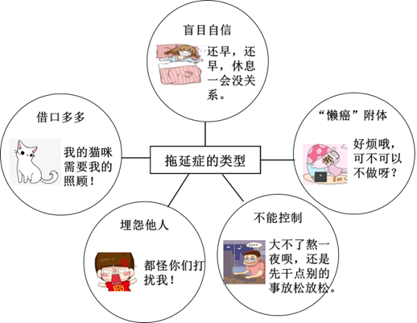

# 🌊 青岛中考语文分项专项练习 —— 05_现代文阅读Ⅰ(模拟)

> 📌 **收录说明**：本练习全量收录自青岛市模拟试卷中该考点的所有试题、背景材料与详细解析（共收录 8 套试卷切片）。

---

### 📌 试题来源与标定卡片：山东省青岛市市南区 • 2022年中考一模

> - **来源试卷**：2022年山东省青岛市市南区中考一模语文试题（解析版）
> - **考试年份**：2022年
> - **所属模块**：05_现代文阅读Ⅰ

<b>（四）非连续性文本阅读（9分）</b>

[材料一]

2022年3月23日15时44分，“天宫课堂”第二课在中国空间站开讲，“太空教师”翟志刚、王亚平、叶光富上了又一堂精彩的太空科普课。

在约45分钟的授课中，翟志刚、王亚平、叶光富相互配合，生动演示了微重力环境下太空“冰雪”实验、液桥演示实验、水油分离实验、太空抛物实验，深入浅出讲解实验现象背后的科学原理，同时展示了部分空间科学设施，介绍了在空间站的工作生活情况。授课期间，航天员通过视频通话形式与地面课堂师生进行了互动交流。

此次太空授课进行了全程现场直播，中国科技馆设地面主课堂，西藏拉萨、新疆乌鲁木齐设两个地面分课堂。空间站建设和运营过程中，“天宫课堂” 将持续开展太空授课活动，进行形式多样、内容丰富的航天科普教育。

（摘自《学习强国》）

[材料二]

“太空教师” 瞿志刚、王亚平、叶光富演示了太空“冰雪”实验。这一幕仿佛发生在“魔法世界”：透明的液球飘在半空中，王亚平用一根小棍点在液球上，球体瞬间开始“结冰”，几秒钟就变成通体雪白的“冰球”。王亚平说，这枚“冰球”摸上去是温热的。太空“冰雪”实验实际上是过饱和乙酸钠溶液结晶的过程，过程当中会释放热量。中国科学院空间应用工程与技术中心研究员张璐介绍，在微重力环境下，过饱和溶液结晶这个实验的“玄机”就在于小棍上沾有晶体粉末，为过饱和乙酸钠溶液提供了凝结核，进而析出三水合乙酸钠晶体。

在地面上进行结晶实验时，晶体的样子可能因容器形状不同有很大差异。而在微重力环境中，晶体并不受容器的限制，可以悬浮在半空“自由生长”，这与中国空间站里的无容器材料实验柜相呼应。无容器材料实验柜目前主要有两个用途：一是实现材料在无容器状态下从熔融到冷却凝固的过程，供科研人员收集物性参数进行研究；二是用于特殊材料在轨生长，缩短新材料从实验室走向生产流水线、走进大众生活的时间。

（摘自《学习强国》）

[材料三]

太空中看到的风景有什么不同吗？在空间站中氧气和水是如何循环的？在太空中睡觉会飘来飘去吗？可以上网玩游戏、看电视吗？冲上太空、返回地球是不是像过山车一样刺激？……来自中国科技馆地面主课堂和地面分课堂的同学们接二连三向航天员老师提问，并一一得到了解答。

北京市朝阳区垂杨柳中心小学馨园分校五年级学生王思烁是一个小小航空迷，身为学校航模社团的一员，她对蓝天充满了向往：“我还有很多想问的问题，这次没能提问，回去之后要请教老师。长大后，我想成为像王亚平老师一样优秀的女航天员，去探索宇宙的奥秘！”这是继2013年神舟十号航天员首次太空授课后，我国航天员再次进行太空授课。从神舟十号到神舟十三号，从天宫一号到中国空间站，都彰显着中国载人航天事业的跨越式发展，也打开了孩子们认识太空的大门。

（选自新华网）

17. 下列说法不符合原文内容的一项是（    ）

A. 2022年的太空授课，航天员生动演示太空实验的同时，也展示了部分空间科学设施，介绍了空间站工作生活情况。

B. “天宫课堂”将在空间站建设和运营过程中，持续开展内容丰富的航天科普教育。

C. 无容器材料实验柜的一个重要用途是可以迅速研发出新材料，并直接投入生产。

D. 翟志刚、王亚平、叶光富三位航天员

太空授课，为孩子们打开了认识太空的大门。

18. 下列对材料的理解和分析不正确的一项是（    ）

A. “2022年3月23日15时44分”，准确具体地说明了“天宫课堂”第二课在中国空间站开讲的时间。

B. 从材料二中加点词“主要”一词可见无容器材料实验柜还有其他的用途，体现了说明文语言的准确、严谨。

C. 材料三中划线句子后的省略号，省略了同学们各种各样关于太空的问题，由此可见他们强烈的求知欲和对太空的无限向往。

D. “天宫课堂”和地面分课堂的良好互动是通过语音通话来实现的，彰显了我国载人航天事业的跨越式发展。

19. 请结合材料二的内容，完成下列太空“冰雪”实验程序图

【答案】17. C    18. D

19. ①在微重力环境下；②小棍上粘有的晶体粉末提供凝结核；③三水合乙酸钠晶体。

【解析】

【17题详解】

本题考查文章内容的理解。

C.材料二第二段原文为“无容器材料实验柜……用于特殊材料在轨生长，缩短新材料从实验室走向生产流水线、走进大众生活的时间”，是“缩短实验时间”，并非直接研发出新材料。因此本项中“可以迅速研发出新材料，并直接投入生产”说法错误；

故选C。

【18题详解】

本题考查材料内容的理解和分析。

D.材料一第二段中原文为“授课期间，航天员通过视频通话形式与地面课堂师生进行了互动交流”，因此本项中“语音通话”说法错误；

故选D。

【19题详解】

本题考查材料信息的提取与概括。

材料二第一段对“太空冰雪”的实验过程进行了说明。

根据“太空‘冰雪’实验实际上是过饱和乙酸钠溶液结晶的过程，过程当中会释放热量。中国科学院空间应用工程与技术中心研究员张璐介绍，在微重力环境下，过饱和溶液结晶这个实验的‘玄机’就在于小棍上沾有晶体粉末，为过饱和乙酸钠溶液提供了凝结核，进而析出三水合乙酸钠晶体”，可知太空“冰雪实验”演示的是过饱和乙酸钠溶液结晶的过程。实验的两个条件是“在微重力环境下”“小棍上沾有晶体粉末，为过饱和乙酸钠溶液提供了凝结核”，结果是“析出三水合乙酸钠晶体”。据此概括填空即可

<b>（五）现代文阅读（17分）</b>

①秋成早年参加革命，随大军南下，在省城担任文化馆长，文采和相貌出众，获得本地当红川剧名旦芳心，二人夫写妇唱，成为本地一道亮丽的人文景观。

②但好景不长，史无前例的动乱来临，曾经的幸运儿与文化楷模秋成先生，理所当然地变成了黑五类。他那美丽的妻子，带着女儿与他划清界限，“弃暗投明”另嫁他人。秋成在一系列的组合打击中，终于倒下了。

③想着一死，所有痛苦与悲伤如生满虱子的老棉袍被扒去的感觉，秋成忍不住对着教堂改造成的土牢房暗黑角落，发出阵阵冷笑。

④那天夜里，秋成将衣裤撕碎，编成一根布绳。绳子像一声叹息，软软地搭上木栅。他用颤抖的手将它挽出一个绳结，正准备用力将身子往下一沉的那一瞬间，脚下有手敲了他一下。

⑤他把头收回来，看到一个比自己大几岁的中年男人。这个人早几天就关进来了，听说是个医生，姓傅，有历史问题。

⑥医生见他回了头，笑笑说：“你还没吃晚饭吧？我看你都两天没吃东西了。”

⑦秋成忍不住有点愤怒。

⑧医生点点头，说：“这可不是小事，六道轮回听说过么？饿着肚子去死，可是要进饿鬼道，永不得超生，变成鬼火四处游荡，想想都觉得可怕！”

⑨秋成吸了一口气，凉凉的。

⑩ “我倒是有个主意，你吃点东西再死，行不？”傅医生用商量的口吻说。

⑪ “这大半夜的，在土班房里，哪去找什么吃的？”

⑫ “这好办，今天下午过堂的时候路过伙食团，我顺手拿了两个土豆，这阵正好派上用场。”傅医生伸手从床上的草席里翻出两个土豆，笑呵呵地说：“我们把它们吃了，你继续去死，我继续睡。”

⑬ “可这是生的，怎么吃啊？”

⑭傅医生听秋成这么说，得意地笑笑，说：“有办法，有办法！”

⑮他伸手从板床下面摸出一个饭盒，饭盒里有一把小铁尺。再从窗台下拿过一个医用玻璃瓶，从里面倒出些水来，用衣襟蘸了，把两个土豆擦得铮亮，然后用铁尺，很笨拙地将土豆切成几块。

⑯接下来，他从窗台上取下煤油灯。把饭盒放到油灯上方，问秋成：“你最想吃啥？”

⑰秋成反问：“就这两颗土豆，你还变得出火锅来不成？”

⑱傅医生道：“火锅？好办！你等等。”他伸手往窗外，努力摸，像抓鱼一般，收手回来时，手里已有了两只青辣椒。他抓起来扯成几段，扔进饭盒。

⑲饭盒里巳开始冒起蟹眼珠一般的水泡。“快开了，让我再加点料！”他从怀里掏出一个纸口袋，捻出一颗，捣碎，扔进饭盒。

⑳ “什么东西？”

㉑ “谷氨酸，就是你们常说的味精，那天我在医务室看病，顺……要了几颗！

㉒傅医生对自己手中那一小饭盒隐隐开始冒出香气的土豆，有些得意。“这难道不是火锅吗？锅下有火，锅里有食物。虽然只有些白水，但白水最养人！还能给人想象，你想它是什么，它就是什么！”

㉓秋成被他莫名的乐观引得忍不住笑了。这是他一个月以来第一次笑。他也久违地有了关注自己以外的事物的愿望，眼前这个乐观得有点像疯子的人，究竟是什么来头？

㉔趁着土豆还没熟的当口，傅医生聊起了自己的身世。他也是当过兵的，早年和村里15个后生一起出来当兵打鬼子，如今就只剩他一个了——他是从尸堆里滚出来的。后来，日本人投降了，他因为在军队里学了几天医，就开起一个小小诊所，还和本地一位女子成了家。内战结束，经历了公私合营和三反五反之类波折，如今以潜伏特务的身份被管制起来。就算被枪毙，也比当年那15个弟兄赚了——多活了这么些年，有了妻子和儿子。虽然离了婚，但主意却是他的，因为只有那样，才可以保全妻儿。而自己么？没关系，这教堂改成的班房，不算自己待过的最恶劣的地方。此时此刻，还有火锅可以吃！

㉕说着，他挑起一片土豆，放进嘴里，顿时泛起一团蒸汽，将微弱的灯光，渲染得一片温暖……

㉖这天晚上，他们俩像古时的诗人，在寒月当空的夜里，坐在小小的乌篷船上，任那白水煮出的土豆片散发出丝丝微弱的香气，点亮他们头脑中那些残存的美好记忆，让它们如渐冷的木炭，死灰复燃，星星点点……

㉗多年后，秋成与傅医生这两位相识于土班房的狱友，偶尔会坐到一起，煮起一小锅白水土豆或青菜。别人都以为他们是在吃养生餐，他们则相视一笑，什么都不说。

20. 以下两个备选题目，你认为哪一个更适合本文？请结合小说内容进行简要分析。

A.白水火锅  B.走出黑夜

21. 请根据要求赏析语言。

①<u>想着一死，所有痛苦与悲伤如生满虱子的老棉袍被扒去的感觉</u>，秋成忍不住对着教堂改造成的土牢房暗黑角落，发出阵阵冷笑。（品味划线比喻句的表达效果。 ）

②“快开了，让我再加点料！”他从怀里掏出一个纸口袋，捻出一颗，捣碎，扔进饭盒。（分析这段语言描写和动作描写的好处）

22. 结合内容说说选文第㉔段在全文中的作用。

23. 文章结尾写道：“别人都以为他们是 在吃养生餐，他们则相视一笑，什么都不说”，你怎样理解他们的“相视一笑”？

【答案】20. A  白水火锅是本文的线索，贯穿全文  文章主要内容是秋成和傅医生在狱中通过吃白水煮火锅互相鼓励，走出困境。  白水火锅意味着：只要坚强乐观，再艰苦的环境也能创造幸福，感受美好。  以白水火锅为题，形象含蓄新颖，吸引读者。

B  文章的主要内容是秋成在傅医生开导下度过绝望到想要自杀的夜晚，在困境中生活下来。  “走出黑夜”一语双关，形象含蓄，吸引读者。

21. ①将死去的感觉比喻成生满虱子的老棉袍被扒去，生动形象的写出了秋成感到死是一件痛快的事情，表现了深重的苦难和悲伤对他的折磨至深。

②“再加点料”表现了傅医生的乐观与幽默，“掏、捻”、捣、扔”等动词体现了他烹制火锅时的有条不紊和认真，表明他虽身处困境，仍热爱生活，积极乐观，想办法战胜困难，好好活下去。

22. 插叙，本段文字交代了傅医生从外出当兵、从医、成家到下狱的经历，体现了他经历的艰难、遭遇的坎坷；表现了他的乐观和坚强。使文势更有起伏，吸引读者。

23. “相视一笑”包含了经历过苦难之后再回首时的淡然、从容、乐观；互相扶持守护生命的深厚友情产生的默契；对他人的误会的幽默回应。

【解析】

【20题详解】

本题考查探究文章标题的含义。作答本题，首先应明确观点，然后结合文章内容说明理由。

如选“白水火锅”，可从其线索作用入手，结合文章内容阐述其特殊意义及效果；结合第⑥段“医生见他回了头，笑笑说：‘你还没吃晚饭吧？我看你都两天没吃东西了’”，第⑩段“‘我倒是有个主意，你吃点东西再死，行不？’傅医生用商量的口吻说”，第⑰段“秋成反问：‘就这两颗土豆，你还变得出火锅来不成’”，第⑱段“傅医生道：‘火锅？好办！你等等’”，第㉕段“说着，他挑起一片土豆，放进嘴里，顿时泛起一团蒸汽，将微弱的灯光，渲染得一片温暖”，第㉗段“多年后，秋成与傅医生这两位相识于土班房的狱友，偶尔会坐到一起，煮起一小锅白水土豆或青菜”可知，文章讲述了秋成和傅医生在狱中通过吃白水煮火锅互相鼓励，走出困境的故事；“白水火锅”贯穿全文，是本文的线索；结合第㉓段“秋成被他莫名的乐观引得忍不住笑了。这是他一个月以来第一次笑”，第㉖段“这天晚上，他们俩像古时的诗人，在寒月当空的夜里，坐在小小的乌篷船上，任那白水煮出的土豆片散发出丝丝微弱的香气，点亮他们头脑中那些残存的美好记忆，让它们如渐冷的木炭，死灰复燃，星星点点”可知，“白水火锅”告诉秋成，告诉我们，只要坚强乐观，再艰苦的环境也能创造幸福，感受美好；同时以“白水火锅”为题，形象含蓄新颖，吸引读者，易激发读者阅读兴趣；

选“走出黑夜”，一方面可以结合文章描写

氛围环境，一方面可以挖掘其深层含义。结合第②段“但好景不长，史无前例的动乱来临，曾经的幸运儿与文化楷模秋成先生，理所当然地变成了黑五类。他那美丽的妻子，带着女儿与他划清界限，‘弃暗投明’另嫁他人。秋成在一系列的组合打击中，终于倒下了”，第③段“秋成忍不住对着教堂改造成的土牢房暗黑角落，发出阵阵冷笑”，第④段“那天夜里，秋成将衣裤撕碎，编成一根布绳。绳子像一声叹息，软软地搭上木栅”可知，“黑夜”不仅是指故事发生的时间，也暗指主人公所处的境遇陷入了人生的困境，如同黑夜般看不见希望与方向；结合第⑩段“‘我倒是有个主意，你吃点东西再死，行不？’傅医生用商量的口吻说”，第⑪段“‘这大半夜的，在土班房里，哪去找什么吃的’”，第⑫段“‘这好办，今天下午过堂的时候路过伙食团，我顺手拿了两个土豆，这阵正好派上用场。’傅医生伸手从床上的草席里翻出两个土豆，笑呵呵地说：‘我们把它们吃了，你继续去死，我继续睡’”，第第㉖段“这天晚上，他们俩像古时的诗人，在寒月当空的夜里，坐在小小的乌篷船上，任那白水煮出的土豆片散发出丝丝微弱的香气，点亮他们头脑中那些残存的美好记忆，让它们如渐冷的木炭，死灰复燃，星星点点”可知，秋成在傅医生开导下度过绝望到想要自杀的夜晚，在困境中生活下来，这就是“走出”的含义；以“走出黑夜”为题，一语双关，形象含蓄，能够激发读者阅读兴趣，吸引读者。

【21题详解】

本题考查赏析语句。

①句要求品味划线比喻句的表达效果，结合“想着一死，所有痛苦与悲伤如生满虱子的老棉袍被扒去的感觉，秋成忍不住对着教堂改造成的土牢房暗黑角落，发出阵阵冷笑”分析，划线句“想着一死，所有痛苦与悲伤如生满虱子的老棉袍被扒去的感觉”，将“死去的感觉”比作“生满虱子的老棉袍被扒去”，生动形象地写出了生活的苦难对秋成的折磨之深，以致他认为死是一件痛快的事；

②句要求分析这段语言描写和动作描写的好处，结合“‘快开了，让我再加点料！’他从怀里掏出一个纸口袋，捻出一颗，捣碎，扔进饭盒”分析，在这段文字中，语言描写“让我再加点料！”表现出了傅医生在牢狱之中还能幽默打趣的乐观；动作描写“掏”“捻”“捣”“扔”一连串动作，体现了傅医生煮“白水火锅”时的一丝不苟和有条不紊；这段语言和动作描写表明了傅医生虽处于困境之中，却依然热爱生活，乐观积极，顽强求生的品质。

【22题详解】

本题考查段落的作用。可以从内容和结构两方面分析。

内容上，结合第㉔段“趁着土豆还没熟的当口，傅医生聊起了自己的身世……没关系，这教堂改成的班房，不算自己待过的最恶劣的地方。此时此刻，还有火锅可以吃”可知，这段文字主要写了傅医生外出当兵、从医、成家到下狱的经历，写出了他生活的艰辛、遭遇的坎坷，从而体现出他乐观坚强的心态；结构上，这段文字是插叙的内容，丰富了文章的内容，可以使文势更有起伏，激发读者阅读兴趣，吸引读者。

【23题详解】

本题考查理解文中重要语句的含意。要结合文章内容揣摩句子的表层意思和深层含意。

结合第㉗段“多年后，秋成与傅医生这两位相识于土班房的狱友，偶尔会坐到一起，煮起一小锅白水土豆或青菜。别人都以为他们是在吃养生餐，他们则相视一笑，什么都不说”可知，“相视一笑”是当他们坐在一起吃白水土豆或青菜时，别人以为他们在吃养生餐，他们对别人的回应；表面上看是对他人的误会的幽默回应，结合前文内容可知，实则指两人经历过苦难之后再回首时的淡然、从容、乐观以及两人因班房结识，互相扶持、守护生命的深厚友谊而产生的默契。

============================================================

### 📌 试题来源与标定卡片：山东省青岛市市南区 • 2022年中考二模

> - **来源试卷**：2022年山东省青岛市市南区中考二模语文试题（解析版）
> - **考试年份**：2022年
> - **所属模块**：05_现代文阅读Ⅰ

非连续性文本阅读

【材料一】

①打开手机，查看新闻资讯、分享心得体会、搜索美食、购买物品……江苏南京某高校教师小宇每天有大量时间花在手机上，手机内置和安装的App达达0150多个。

②她发现，每次注册账号或者安装软件时，屏幕上都会弹出“用户协议和隐私政策”，但她都是直接拖拽到最底部，点击“我已阅读并同意用户协议”。小宇并不是特例，近期的一项调查研究显示，在点击同意之前，真正阅读这些协议的用户不到四成。

③移动互联网时代，App成了人们的必备工具。首次下载使用时，点击“我已阅读并同意用户协议和隐私政策”也成为常规操作。一旦用户点击同意，就意味着将自己的部分权利让渡给App的运营公司，比如调用手机通讯录、读取手机存储、获取定位信息、开启蓝牙或无线网络等。

④然而，用户协议动辄上万乃至数万字，充斥着大量专业、晦涩的内容。据统计，55款下载量过亿次的手机App，平均每款需要用户“阅读并同意”的协议内容约有72.7万字。

⑤从司法角度来看，协议越详尽双方权利责任就越明晰，因为这是充分告知，能够最大程度地避免事后纠纷。但是，从实际使用的角度来说，动辄上万字的协议恰恰会阻碍消费者的知情权。因为大多数用户没有耐心，也没有专业知识看完并读懂协议，在这样的情况下勾选同意，也就让用户弄不清让渡①了哪些权利。

【材料二】

①“您的好友也在使用某App”“TA与你有3位共同好友”“匹配您的通讯录有助于更快找到好友”……这样的提示对于很多手机使用者来说并不陌生。

②移动互联网的兴起，带动了新型社交平台的发展，短视频、购物、健身、新闻资讯等App，过去与社交基本不沾边，但如今都被赋予了社交属性。

③“数学领域有一个‘小世界理论’，即世界上任何两个人只要通过66个中间人就能建立联，系。”南京信息工程大学网络安全专家任勇军教授说，用户点击同意后，App通过调取通讯录，并在后台进行数据匹配，就会把你推荐给素不相识的人，并告诉对方你和TA有共同好友。

④过去，要证明“小世界理论”并不容易，现在却能轻易实现，我们在感叹“世界真小”的同时，是不是也要警惕App的“过度要权”呢？

⑤部分App出于精准用户画像、推广营销等商业目的，想方设法在超出实现功能的必要范围收集更多个人信息。比如，某应用的电话拦截功能索要了短信、存储、通讯录等7项敏感权限；某运动健身类应用在用户使用观看视频等无关功能时，每分钟获取位置信息近百次；某应用除了在共享位置时收集位置信息，还在扫码支付等不相关功能中收集位置信息，以用于用户消费行为画像分析。还有很多App尽管不再强制收集信息，仍在首次启动时就弹窗索要多个无关权限。

⑥App获取这些权限后，看似帮助用户拓展了朋友圈和生活圈，但用户的隐私信息也在无形中被暴露。App索要这些权限的根本原因还是企业想要扩大市场或进行推广，最终是为了获利。

⑦2021年，国家网信办针对“七类”超范围收集行为进行重点整治，包括超范围收集用户通讯录、精确地理位置、短信、通话记录等在内的一大批违法违规问题得到治理。

【材料三】

保护隐私需专人“看门”

①近日，国家计算机病毒应急处理中心通过互联网监测发现，17款移动App存在隐私不合规行为，涉嫌超范围采集个人隐私信息。

②类似这样的通报并不鲜见。仅在12021年，国家网信办就对存在严重违法违规问题的351款App进行了公开通报，责令限期整改。

③但是，App敏感数据收集问题仍旧突出。<u>国家网信办监测发现，60.7%的应用收集了安卓ID，等设备唯一标识信息，55.4%，的应用收集了应用列表信息，13.7%的应用收集了剪切板信息，而这类信息可用于人物画像、个性化推送等业务。</u>

④个人信息是重要的数据资产，一些App尤其是公用事业类的应用，拥有庞大的用户群，不法分子和网络黑客早就盯上了这些敏感信息，并形成黑色产业链。一旦App获取的个人信息被售卖，将在多个层面造成严重的安全问题。比如，用户出行App或外卖App上面存有百万级以上的用户信息，一旦泄露可能不仅影响个人本身，甚至会对国家安全造成危害。

⑤那么，对于监督管理部门来说，究竟该如何约束长篇大论的用户协议，把保护用户隐私落到实处？

⑥当前，相关机构正在起草《信息安全技术互联网平台及产品服务隐私协议要求》，可为平台企业的用户协议及隐私政策合规提供指引。

⑦相较于制定相关行业规范，如何将规范落到实处是更值得关注的问题。

⑧App违规收集用户信息行为无法根治的原因主要在于三点：一是行业主管部门的治理资源有限，仅依靠行业监管较难规范所有App的信息收集行为；二是部分中小企业存在侥幸心理，试图通过违规行为获取更高经济利益；三是《个人信息保护法》等相关法律虽赋予了用户数据权利，但实践中用户权利的实现方式并不明晰，用户在权利受侵害时难以有效维权。

⑩行业主管部门应持续开展违法违规收集使用个人信息专项治理，充分发挥头部平台的‘看门人’作用，由其尽责履行对应用市场内App及平台内小程序的监管义务，规范相关App、小程序的个人信息收集行为。对于个人信息保护投诉举报渠道和透明度报告机制应予以完善，维护用户对行业治理的知情权和监督权。

【让渡】：让出并转移，多用于法律或经济方面。

18. 下列对材料内容理解不正确的一项是（   ）

A. 据调查显示，在首次下载app之前，真正点击同意用户协议的用户不到四成。

B. 移动互联网的兴起，让过去与社交基本不沾边的app，如今都被赋予了社交属性。

C. 大多数用户没有耐心，也没有专业知识看完并读懂协议，弄不清让渡了哪些权利

D. 一旦用户点击同意，就意味着App的运营公司获得了用户的部分权利。

19. “互联网时代，每一个人都是透明的”结合文章内容谈谈对这句话的理解。

20. 开如今，人们的生活已经离不开App，那如何才能规范这个行业呢，请你结合文章三则材料从不同的角度提出你的建议。

【答案】18. A    19. 在信息时代要获取APP的使用权，就需要让渡个人的信息；APP会将用户隐形信息暴露；个人信息一旦被暴露，将会在各个层面带来安全隐患。

20. 强化技术手段，增强行业监管部门的治理能力；加强立法，严厉打击侵犯用户私人信息行为；在用户权利受到侵害时，及时有效地维护其权利。

【解析】

【18题详解】

考查筛选并辨析信息。

A．根据材料一第②段中

“在点击同意之前，真正阅读这些协议的用户不到四成”可知，本项“在首次下载app之前”有误。

故选A。

【19题详解】

考查筛选信息。

根据材料一第③段中的“首次下载使用时，点击‘我已阅读并同意用户协议和隐私政策’也成为常规操作。一旦用户点击同意，就意味着将自己的部分权利让渡给App的运营公司”可得：在信息时代要获取APP的使用权，就需要让渡个人的信息；

根据材料二第⑥段中的“App获取这些权限后，看似帮助用户拓展了朋友圈和生活圈，但用户的隐私信息也在无形中被暴露”可得：APP会将用户隐形信息暴露；

根据材料三第④段中的“一旦App获取的个人信息被售卖，将在多个层面造成严重的安全问题”可得：个人信息一旦被暴露，将会在各个层面带来安全隐患。

【20题详解】

考查筛选信息。

根据材料三第⑧段中

“一是行业主管部门的治理资源有限，仅依靠行业监管较难规范所有App的信息收集行为”可提出建议：强化技术手段，增强行业监管部门的治理能力。

根据材料三第⑧段中的“《个人信息保护法》等相关法律虽赋予了用户数据权利，但实践中用户权利的实现方式并不明晰”可提出建议：加强立法，严厉打击侵犯用户私人信息行为。

根据材料三第⑧段中的“用户在权利受侵害时难以有效维权”可提出建议：在用户权利受到侵害时，及时有效地维护其权利。

<b>（五）（17分）</b>

现代文阅读

较真儿

焦波

①爹脾气倔，加上当了一辈子木匠，干啥都较真儿。

②小时候，常听爹背诵他小时学过的课文。有一篇写长城的，其中有两句：“山海关前多景致，八达岭上好风光。”我问爹“八达岭”是啥，他说是一座山岭，在北京。“离天安门多远？”我问。爹答不上来。过了几天，他告诉我，八达岭在北京西北边，离天安门有140里路。为这事，他专门去问了刚从北京回来的邻居四哥。

③爹常挂在嘴边的口头语是：“丁是丁，卯是卯，木匠手中的尺子是‘规矩’，差一分一厘，就是胡来。”1959年，邻村的李木匠到北京建人民大会堂回来，爹到他家打听人民大会堂的规模，知道了人民大会堂柱子的直径是51.5米。

④他又问：“天安门门洞有多长？”

⑤李木匠说：“30来米吧。”

⑥“到底三十几米？”爹又问。

⑦“你管那么多干吗！难道你还要建一座天安门？”爹的较真儿碰了壁。

⑧1996年深秋，我把爹娘接到北京游览，爹总算有机会对关心的事较真儿了。

⑨爹娘晚9点到北京，第二天就去逛颐和园。

⑩我们从朝阳门出了地铁站。上了车，爹告诉娘，出地铁站的台阶是96级。这是他一步一步数过的。

⑪在颐和园，娘悄悄问我：“毛主席住哪间屋？”

⑫这话被爹听到了，他较真儿起来：“这叫颐和园，是慈禧太后的别墅。毛主席住在中南海。”

⑬爹跟娘较真儿没用，娘只知道毛主席住在北京。

⑭第二天，爹娘在毛主席纪念堂瞻仰过毛主席遗容后，就去了天安门。爹一个一个地数城门上的门钉，又量了量门的宽度和厚度，然后开始用拐杖一下一下量天安门城楼的门洞长度。他一边量，一边报数。游人看见一个老头子在量天安门，觉得好奇，便聚拢过来看，许多人还帮爹报数。

⑮爹：“爹：“1、2、3……”

⑯游人们喊：“游人们喊：“4、5、6……”

⑰量完了，爹满意地说：“43米长，我终于弄明白了！回去谁要再乱说，我就告诉他，我亲自量过！”

⑱在故宫太和殿前，爹娘合抱殿前的大柱子，看究竟有多粗。第三天游览长城时，他又用步量两个烽火台之间的距离，用手量长城砖的长宽厚度。当了一辈子木匠的爹，手指、胳膊、拐杖甚至眼睛都能量出精确的尺度。

⑲爹较真儿的事，在第六天达到高潮。要离京回山东了，在招待所柜台结账时，爹说应该多交5块钱，服务员和值班经理不解。

⑳爹说：“我不小心把一个茶杯碰到地上了，虽说没打破，茶杯却裂了一条纹，说不定哪天就要破。我看过住房须知，杯子标价5元，所以要照价赔偿。”

㉑值班经理听老人这么一说，十分感动：“老人家，就别赔了！有您这句话就行了！”

㉒爹说：“<u>招待所的‘须知’就是‘规矩’，这就像俺当木匠用的尺子一样，无规矩，不成方圆，俺一辈子都认这个死理。</u>”

㉓值班经理竖起大拇指，用地道的北京话说：“老人家，您真较真儿啊！”

㉔出了门，娘用“挖苦”的口气笑着对爹说：“没想到你小气了一辈子，今天倒大方了。”

㉕爹急了，吼起来：“那是在家，这是在哪儿？咱丢人不能丢在北京！”

21. 本文围绕爹的“较真儿”写了哪些事？

22. 阅读文章，找出与划线句子相照应的句子，并说说这样写的好处。

句子：____________________________________________________________

好处：____________________________________________________________

23. 词语用得妙，往往会使文章语言更具有表现力，请赏析下面句子中加点词语的表达效果。

爹一个一个地数城门上的门钉，又量了量门的宽度和厚度，然后开始用拐杖一下一下量天安门城楼的门洞长度。

24. 文章从正面刻画了一个“较真儿”的爹，让人印象深刻，同时，文章㉓㉔又运用了侧面描写，请结合相关内容简要分析这样写的好处。

25. 对于文中爹“较真儿”的做法，你认为值得提倡吗？请联系实际谈谈你的理解。

【答案】21. 去询问从北京回来的邻居以告知我八达岭到天安门的距离；纠正母亲询问毛主席住在颐和园哪个房间的问题；亲自丈量天安门门洞的长度；执意赔偿打裂的招待所茶杯的5元钱。

22.     ①. 句子是：丁是丁，卯是卯，木匠手中的尺子是‘规矩’，差一分一厘，就是胡来。    ②. 这句话是爹常挂在嘴边的口头语。文中划线句子是爹执意赔偿打裂的招待所茶杯的5元钱时说的话。

好处：强调突出了父亲，较真严谨的性格特点，首尾呼应，使文章结构更加完整。

23. 反复的修辞，写爹书天安门城门上门钉、用拐杖仔细丈量天安门门洞的情形。

强调突出了爹的仔细认真，体现父亲是个较真严谨的人。表达了对较真儿的爹的敬佩之情。

24. 这两段分别写了值班经理对爹执意赔偿打裂的招待所茶杯的5元钱这件事的赞赏，娘对爹大方赔钱这种不同于以往节俭省钱做法的调侃。侧面烘托爹为人做事认真严谨的性格特点，表达“我”的敬佩之情。

25. 我认为这种较真儿的做法值得提倡。爹的较真儿是对待事情的严谨认真，不糊弄的态度。学习这种精神，我们在学习中可以更加严谨准确，在生活中也可以养成认真仔细的好品格。

【解析】

【21题详解】

考查概括事件。

根据第②段中的“过了几天，他告诉我，八达岭在北京西北边，离天安门有140里路。为这事，他专门去问了刚从北京回来的邻居四哥”可得：去询问从北京回来的邻居以告知我八达岭到天安门的距离；

根据第⑫段中的“这叫颐和园，是慈禧太后的别墅。毛主席住在中南海”可得：纠正母亲询问毛主席住在颐和园哪个房间的问题；

根据第⑭段中的“爹一个一个地数城门上的门钉，又量了量门的宽度和厚度，然后开始用拐杖一下一下量天安门城楼的门洞长度”可得：亲自丈量天安门门洞的长度；

根据第⑳段中的“我不小心把一个茶杯碰到地上了，虽说没打破，茶杯却裂了一条纹，说不定哪天就要破。我看过住房须知，杯子标价5元，所以要照价赔偿”可得：执意赔偿打裂的招待所茶杯的5元钱。

【22题详解】

考查语句赏析。与画线句照应的句子出现在第③段“丁是丁，卯是卯，木匠手中的尺子是‘规矩’，差一分一厘，就是胡来”。联系前句“爹常挂在嘴边的口头语是”可知，这是父亲常挂在嘴边的口头语。画线句是父亲执意要赔偿执行所五元的茶杯钱时说的话。两句话都表现了父亲爱较真，为人严谨的性格特点。从结构上看，前后呼应，使文章结构严谨完整。

【23题详解】

考查语句赏析。两次出现“一个一个”，这是反复的修辞，前一个“一个一个”表现了父亲数城门上的门钉的情景。后一个“一个一个”表现了父亲量门洞长度的情景。从中可以看出父亲的较真与严谨。联系人物感情可知，表现了作者对父亲这种性格的敬佩之情。

【24题详解】

考查分析侧面描写。第㉓段是招待所值班经理对父亲的评价，也是他对父亲的赞赏。第㉔段是母亲对父亲小气了一辈子，这一次却这么大方的调侃。经理的赞赏，母亲的调侃，从侧面表现了父亲为人做事认真严谨的性格特点。联系人物感情可知，表达了我对父亲的敬佩之情。侧面描写的运用，使父亲的形象更加鲜明生动。

【25题详解】

考查阅读启示，开放类试题，言之成理即可。示例：我认为父亲这种凡事较真儿的做法值得提倡。因为父亲的这种做法表现了他严谨认真，诚信守信的做事态度。提倡并学习这种精神，可以让我们在学习和生活中更加严谨认真，诚实守信，既有助于学习，也有利于成长。

============================================================

### 📌 试题来源与标定卡片：山东省青岛市 • 2024年中考二模

> - **来源试卷**：2024年山东省青岛市中考二模语文试题（解析版）
> - **考试年份**：2024年
> - **所属模块**：05_现代文阅读Ⅰ

阅读下面的实用类文本，完成下面小题。

【材料一】

大部分中学生对“明日复明日，明日何其多。我生待明日，万事成蹉跎”这首诗耳熟能详，但是在中学生的学习和生活中，拖延现象却屡见不鲜。拖延是个人在明知后果有害的情况下，仍然把计划要做的事情往后推迟的一种行为。

人们对拖延行为有不同的看法。有人认为，拖延是“时间杀手”，是一种恶习，是对自己的人生不负责任。在考场上，面对题目繁杂的试卷，如果拖延，考试成绩就会很难看。在战场上，两军对垒，几秒钟的拖延就会让人付出生命的代价。哈佛大学著名学者哈里克说：“世上有93%的人都因拖延的陋习而一事无成，这是因为拖延能杀伤人的积极性。”

也有人认为，拖延一下并不要紧。人们一般只对不喜欢做的和觉得拖一拖也没问题的事拖延。从某种角度上说，拖延其实是一种自我调节的机制。当你面对自己不喜欢做的事情时，拖一拖，能缓解你的不良情绪，让你能平静地面对要做的事情。把很多事情拖到最后一刻再做，往往能激发自身更大的潜能，完成任务的效率会更高。当然，这样的拖延考验着你对自我的清醒认识，对时间节点的准确把握，对做事节奏的控制。

【材料二】

心理学家认为，“拖延”是一种普遍的心理和行为现象。每个人都会有不同程度的拖延行为。当拖延行为成为一种牢固的行为习惯时，那就是患上了拖延症。拖延症是一种心理疾病，会给个人的学习、工作、生活和身心健康带来消极影响。患有拖延症的人往往会产生自责情绪和负罪感，不断地否定自我，严重的还会伴有焦虑症、抑郁症。

调查表明，现实生活中认为自己患拖延症的人不少：50%的中学生认为自己有拖延症，80%的大学生认为自己有拖延症，86%的职场人认为自己有拖延症，其中50%的职场人不拖到最后一刻不开始工作，13%的职场人不拖到领导再次催促，绝不去完成工作。拖延症常见的类型如下图：

造成拖延症的原因很多，其中最重要的是主观因素：有的人因害怕失败，不想承担失败的后果而拖延；有的人因过于追求完美，害怕达不到理想的效果而拖延；有的人本身就懒惰，不愿做事情；还有的人是受负面情绪影响，行动受阻。其次，也有外界因素，如任务过多或者难度过大，超出了个人的能力，会让人拖延或逃避任务；外界的诱惑尤其是娱乐方面的诱惑，也往往会导致拖延行为。

【材料三】

大多数拖延症患者对自己的拖延症焦虑不已，也想改掉，但依然一边焦虑，一边拖延。就连吃晚饭这样的事，有人都能拖到晚上9点，再饿也唤不起习惯性“床上瘫”的自己。中国青年报的社会调查中心曾对2004名拖延症患者进行过一项调查，结果显示，88.7%的受访者只顾着焦虑却迟迟行动不起来。拖延症患者很难直接做困难的、需要意志力维持的事情，因此容易耽误学业和工作。在这种情况下，一项新的职业——自律监督师应运而生。他们每天的工作就是根据患者的症状制定相应的对策，帮助患者打败拖延症。他们帮助患者学会规划时间、制定分步目标，因为小目标能消除拖延症患者的畏难情绪；同时训练患者的自控力，因为自律才是拖延症最有效的克星：还采取多种方法帮助患者学会如何抵制不良欲望，消除外界干扰，排除不良情绪，减少患者完成任务的障碍。另外，他们还会制定相应的奖励机制，促使患者逐渐消除拖延症。

13. 根据材料二和材料三判断，下列说法正确的一项是（    ）

A. 患有拖延症

人会产生自责情绪和负罪感，并会患上严重的焦虑症、抑郁症。

B. 调查发现，中学生、大学生、职场人三类人中，中学生的拖延症最为严重。

C. 造成拖延症的主观因素主要有害怕失败、追求完美，任务过多过难等。

D. 大多数拖延症患者对自己的拖延症感到焦虑，也想改掉，却迟迟不采取行动。

14. 请根据材料二给“拖延症”下定义。

15. 王素和李想对拖延的认识产生了分歧，如果你在场，你的看法是什么？请根据材料一表明你的观点，并阐述理由。

王素：拖延的危害很大，咱们应该远离它！

李想：我觉得拖延也有好处，拖一下也没什么。

你：___________________________________________________________________________________________

16. 下面是一位学生拖延症患者某个周日的观察记录，假如你是一位自律监督师，请据材料二和材料三分析他拖延症的类型并给出对策。

| 观察记录 8点：起床，吃早餐。 9点：家长叫他做作业，他说时间还早，要休息一下。 11点：家长再催，他依然说时间还早，作业肯定能做完。 12点：吃午饭，午休。 15点：开始做作业。 15点20分：跑去吃水果、听音乐。 17点：还在听音乐，家长问他作业是否完成，他说离明天上学还早呢，不着急。 第二天上学，老师给家长发来短信：您的孩子又没交作业！ | 观察记录 8点：起床，吃早餐。 9点：家长叫他做作业，他说时间还早，要休息一下。 11点：家长再催，他依然说时间还早，作业肯定能做完。 12点：吃午饭，午休。 15点：开始做作业。 15点20分：跑去吃水果、听音乐。 17点：还在听音乐，家长问他作业是否完成，他说离明天上学还早呢，不着急。 第二天上学，老师给家长发来短信：您的孩子又没交作业！ |
| --- | --- |
| 自律监督师分析和对策 | 自律监督师分析和对策 |
| 拖延症的类型 | 对策 |
| ①________________ ②________________ | ________________ |

【答案】13. D    14. 拖延症是拖延行为成为牢固的习惯，对个人的学习、工作、生活和身心健康带来消极影响的一种心理疾病。

15. 示例一：我也觉得拖延的危害很大。因为拖延能杀伤人的积极性，是一种恶习，是时间杀手，会让你一事无成。
示例二：我也觉得拖延是有好处的，拖延是一种自我调节的机制，它能激发人的潜能，提高做事效率。
示例三：我们应该全面地看待问题。拖延的确有危害，但有时拖延也有其合理性。一方面，拖延是一种不良行为，是一种恶习，是对人生的不负责任，会给人造成危害。另一方面，如果一个人能清醒得认识自我，准确把握时间节点。能控制做事节奏，合理的拖延就会成为一种自我调节的机制，反而能激发人的潜能，提高完成任务的效率。

16.     ①. 盲目自信    ②. 不能自控    ③. 帮助他规划时间、制定分步目标；制定自控力训练方案；制定奖励机制。

【解析】

【13题详解】

本题考查对文本内容的理解能力。

A.从材料二第一段“患有拖延症的人往往会产生自责情绪和负罪感，不断地否定自我，严重的还会伴有焦虑症、抑郁症”，可知“并会患上严重的焦虑症、抑郁症”说法不当。

B.从材料二第二段“50%的中学生认为自己有拖延症，80%的大学生认为自己有拖延症，86%的职场人认为自己有拖延症”，可知“中学生的拖延症最为严重”说法错误。

C.从材料二第三段“也有外界因素，如任务过多或者难度过大”，可知“任务过多过难”不是主观因素。

故选D。

【14题详解】

本题考查下定义的能力。下定义，首先找到被定义项的属概念，然后找出它的本质特正，最后，用“……是……”的格式来表述。拖延症的属概念是“心理疾病”，主要特征是“拖延行为成为一种牢固的行为习惯”。作答时应按照简明连贯得体的要求，对原文信息进行整合。

【15题详解】

本题考查观点的表述能力。根据语境，王素和李想之所以产生分歧，是因为都片面地看问题，因此“你”看法应全面的看问题，既要看到危害，也要看到好处，同时，要抓住问题的本质，这个“拖延”是偶尔为之，还是已成恶习。应紧扣材料一中二三两段的内容来阐述。

【16题详解】

本题考查理解应用能力。拖延的类型材料二中给出了五种，应从观察记录的表现，对号入座，就能准确作答。记录中9点、11点和17点的借口均是“时间还早”，对应的是“盲目自信”；15点20分到17点，理由是“跑去吃水果、听音乐”，对应的是“不能自控”。对策一栏，材料三“帮助患者学会规划时间、制定分步目标，因为小目标能消除拖延症患者的畏难情绪；同时训练患者的自控力，因为自律才是拖延症最有效的克星；还采取多种方法帮助患者学会如何抵制不良欲望，消除外界干扰，排除不良情绪，减少患者完成任务的障碍。另外，他们还会制定相应的奖励机制，促使患者逐渐消除拖延症”列出来四种，只要抓住“同时”“还”“另外”等词即可找出。这四种方法并用应该效果更佳，但作答时只答方法，不说原因。要学会精炼，切忌照搬原文。

<b>（四）（12分）</b>

阅读下面的作品，完成各题。

推开那扇窗

①小区保安王刚接受一对中年夫妇的请托，每天关注一下他们家的窗户。这个家里住着他们上了岁数的老爷子，夫妇二人怕独居的老人出问题，就请王刚每天留意一下，窗户推开表示平安，反之则马上联系他们。

②王刚觉得每天看看窗户，也不算多费神，就应承下来。后来，他们给他发来2000元的微信红包，作为酬劳，而且说每月都会支付。他虽然极力推辞，但夫妇二人更加坚决，他回绝不了，就先接下了。

③时间一天天过去。这一天，王刚突然发现，那扇定时推开的窗户失约了，他不及细想，马上微信通知中年夫妇，不巧这二人正在外地出差，赶回来是不可能的，他们告诉了王刚智能锁的密码，请他马上进去帮忙查看。

④王刚按照中年夫妇提供的密码打开了门。让人意外的是，老人身体如常，正在阳台上费力地揉一大团泥巴。<u>已是冬天，窗外寒风凛冽</u>，老人双手冻得通红，却很专注地揉着泥巴，甚至对王刚的突然出现也不惊讶。

⑤王刚连忙解释：“老人家，您今天没有开窗，您儿子儿媳很担心，特意让我来看看。”

⑥老人叹口气说：“担心什么呢，我没开窗，怕我出事？他们就是想，让我每天记住开窗，来证明我这老头子还活着。”

⑦王刚说：“儿女们都是好意，老人健康，是儿女之福。不过您这屋子确实冷清了，而且这么冷的天，你还揉泥巴，揉来干什么呢？”

⑧老人说：“人活着，得找活着的事干。我心里总想着从前，想着我们班牺牲的战友，我想做点事纪念他们。我小时候喜欢捏泥人，现在就想把牺牲的战友一一捏成像，让他们重新活在我的面前。”

⑨老人把王刚带到书房，<u>在一个书柜里，摆放着七尊泥巴捏成的军人塑像，有挺立站岗的，有持枪射击的，有往前冲锋的，还有投掷手榴弹的……</u>总之七尊塑像形态各异，都表现出了大无畏的军人风姿。

⑩老人指着“他们”说：“他们都是我在朝鲜战场上牺牲的战友。我们一个班，十个人，一场阻击战下来，牺牲了八个，包括班长。几十年过去了，他们一直活在我心里，我已经塑了七个牺牲战友的泥像，还差一个正在做的，就是我们班长，我还没想好如何去展现他！”

⑪王刚听到这儿，连忙退后两步，对老人行了一个标准的军礼。王刚说：“老人家，我也当过兵，但您是老兵，请允许我在这儿，向您和您的战友，敬礼！另外我还想请您，每天按时开窗，您保持健康，我们才放心！”

⑫从这之后，老人每天定时开窗，王刚每天察看，彼此间成了一种默契。可过了一阵，问题又来了，老人开着的窗户有两天只开不关，这又让王刚作难了：大冬天的，晚上不关窗，也不正常啊。

⑬王刚又来到老人家门前，敲门没人应，就用上次记下的密码打开了门。进门一看，老人躺在床上，因为感冒发烧，已经一天一夜没有吃喝了。王刚急切问道：“您生病了，为什么还一直推开窗户呢？”

⑭老人虚弱地说：“又不是什么大病，推开窗，就是不想让你们担心呢！”

⑮王刚见老人精神不振，立马呼来了“120”，把老人接到医院，一查，已经是肺炎。不过因为送得及时，治疗几天，老人已无大碍。老人的儿子儿媳几天后也赶到医院，精神好转的父亲却告诉他们，此刻他想见一个人，就是保安王刚。

⑯老人说：“其实我要感谢王刚，上次他敬了一个标准的军礼，给了我启发。我刚进部队时，班长第一次带我，也是对我敬了一个标准的军礼，他要我一生都要有军人的骨气，不管战场上还是战场下，都要做一个真正的军人。王刚那次敬礼，让我想到了班长，我要为他塑造一尊军人标准军礼的塑像！”

⑰几天后，老人出院，刚回到家，只觉家里温暖如春，新安装的暖气片让整个屋子像春天一样温暖起来。老人扭头问儿子：“住了两周医院，你们啥时候把暖气片安上了？”

⑱儿子也奇怪：“听工人说，不是您让安装的吗？”

⑲说到这儿，儿子悟出点什么，急忙打开微信询问。果然王刚回道：“你们每个月打给我2000元，退还你们又不行，我就寻思着要用这笔钱为老人做点什么。他和小区的许多老人一样，为社会奉献了一辈子，作为后辈，我们也理应让他们享受越来越美好的晚年生活！”

⑳老人一听，抓过儿子的手机微信说：“好好好，等我把班长的塑像做好，我要把你请来，让我们老少军人一起，为创造今天幸福生活而流血牺牲的军人敬上一个标准的军礼！”

㉑王刚一个劲应承：“也希望您记住推开那扇窗，让我们一起见证美好幸福的每一天！”

17. 文章围绕“那扇窗”写了哪些事？请梳理相关内容，简要概括。

（1）中年夫妇每月付2000元，托保安王刚定时察看窗户，确保家中老人平安

（2）

（3）

（4）

（5）王刚为老人装了暖气，让老人能在“推开那扇窗”时不至于受寒。

18. 文章第④段写到“已是冬天，窗外寒风凛冽”，请从表现人物和情节安排上简要分析在文中的作用。

19. 根据语境从修辞的角度赏析下面的句子。

在一个书柜里，摆放着七尊泥巴捏成的军人塑像，有挺立站岗的，有持枪射击的，有往前冲锋的，还有投掷手榴弹的……

20. 老人为什么最后决定给老班长以“一尊军人标准军礼的塑像”呈现？

21. 小说中的“推开那扇窗”有丰富的涵义，请从小说中不同人物的角度分析所蕴含的美好品质。

【答案】17. ②王刚发现窗户未开，进屋发现老人用泥巴为战友做塑像；③老人定时开窗，王刚定时察看；④王刚发现窗户两天未关，发现老人生病，于是拨打120送老人去医院。

18. （1）天气严寒，老人依旧在用冻得通红的双手捏战友的塑像，表现老人对战友的思念和敬意。（2）为老人的生病，以及保安王刚为老人安装暖气做铺垫（3）表现保安王刚对老人的关心。

19. 运用了排比的修辞方法，句式整齐，写出塑像的形态各一。塑像中蕴含着老人对牺牲战友的深切怀念。

20. （1）保安王刚的军礼启发了老人（2）军礼是军人的标志，表示老班长的军人身份（3）老班长第一次带老人时候用一个标准的军礼告诉老人：要做有骨气的真正的军人，印象深刻（4）军礼代表敬意，表达老人对老班长以及创造今天幸福生活而流血牺牲的军人的深深怀念和敬意。

21. 保安王刚：信守承诺、尽职尽责；夫妇：关爱家人、有孝心；老军人：重情重义、体谅他人。

【解析】

【17题详解】

本题考查概括事件。

（2）根据第③段中的“这一天，王刚突然发现，那扇定时推开的窗户失约了”、“他们告诉了王刚智能锁的密码，请他马上进去帮忙查看”、第⑧段中的“我小时候喜欢捏泥人，现在就想把牺牲的战友一一捏成像，让他们重新活在我的面前”可得：王刚发现窗户未开，从中年夫妇处得到锁的密码，进屋察看，发现老人用泥巴为战友做塑像；

（3）根据第⑪段中的“另外我还想请您，每天按时开窗，您保持健康，我们才放心”和第⑫段中的“从这之后，老人每天定时开窗，王刚每天察看”可得：经提醒后，老人定时开窗，王刚定时察看；

（4）根据第⑫段中的“老人开着的窗户有两天只开不关”和第⑮段中的“刚见老人精神不振，立马呼来了‘120’，把老人接到医院”可得：王刚发现窗户两天未关，进屋察看，发现老人生病，于是拨打120送老人去医院；

【18题详解】

本题考查句子的作用。

从内容和结构上分析。内容上，“寒风凛冽”交代天气寒冷，结合“老人双手冻得通红，却很专注地揉着泥巴，甚至对王刚的突然出现也不惊讶”可知，衬托老人揉泥巴的专注，表现他的战友情；

结构上，结合第㉑段“你们每个月打给我2000元，退还你们又不行，我就寻思着要用这笔钱为老人做点什么。他和小区的许多老人一样，为社会奉献了一辈子，作为后辈，我们也理应让他们享受越来越美好的晚年生活！”可知，为下文王刚给老人安装暖气片做铺垫。安装暖气片这个细节表现了王刚对老人的关心和尊敬。

【19题详解】

本题考查从修辞手法的角度赏析句子。

“有挺立站岗的，有持枪射击的，有往前冲锋的，还有投掷手榴弹的……”运用排比句式，展示七尊塑像形态各一；结合“七尊塑像形态各一，都表现出了大无畏的军人风姿”可知，表现出大无畏的军人风姿；结合第⑫段“他们都是我在朝鲜战场上牺牲的战友。我们一个班，十个人，一场阻击战下来，牺牲了八个，包括班长。几十年过去了，他们一直活在我心里，我已经塑了七个牺牲战友的泥像，还差一个正在做的，就是我们班长，我还没想好如何去展现他！”可知，表达出老人对战友的缅怀和崇敬之情。

【20题详解】

本题考查对文章内容的概括。

根据第⑯段中的“其实我要感谢王刚，上次他敬了一个标准的军礼，给了我启发”可知：保安王刚的军礼启发了老人；

根据第⑯段“我刚进部队时，班长第一次带我，也是对我敬了一个标准的军礼，他要我一生都要有军人的骨气，不管战场上还是战场下，都要做一个真正的军人。王刚那次敬礼，让我想到了班长，我要为他塑造一尊军人标准军礼的塑像”可知，老人因王刚的敬礼而想起班长的军礼，军礼是军人的标志，表示老班长的军人身份；老班长第一次带老人时候用一个标准的军礼告诉老人：要做有骨气的真正的军人，印象深刻；

根据第⑳段中的“为创造今天幸福生活而流血牺牲的军人敬上一个标准的军礼”可知，老人准备和王刚一起向为幸福生活做出贡献的军人们致敬，军礼代表敬意，表达老人对老班长以及创造今天幸福生活而流血牺牲的军人的深深怀念和敬意。

【21题详解】

本题考查概括主旨。

从王刚的角度出发：根据根据第⑪段中的“另外我还想请您，每天按时开窗，您保持健康，我们才放心！”和第⑫段中的“从这之后，老人每天定时开窗，王刚每天察看”可得：经提醒后，老人定时开窗，王刚定时察看；根据第⑮段中的“刚见老人精神不振，立马呼来了‘120’，把老人接到医院”可得：王刚发现窗户两天未关，进屋察看，发现老人生病，于是拨打120送老人去医院；根据第⑰段中的“几天后，老人出院，刚回到家，只觉家里温暖如春，新安装的暖气片让整个屋子，像春天一样温暖起来”和第⑲段中的“你们每个月打给我2000元，退还你们又不行，我就寻思着要用这笔钱为老人做点什么”可得：王刚用中年夫妇给他的钱为老人装了暖气，让老人能在“推开那扇窗”时不至于受寒。由此可知：颂扬信守承诺、助人为乐，不图回报的精神。

从中年夫妇的角度出发：根据首段中的“小区保安王刚接受一对中年夫妇的请托，每天关注一下他们家的窗户……，窗户推开表示平安，反之则马上联系他们”和第②段中的“他们给他发来2000元的微信红包，作为酬劳，而且说每月都会支付”可得：中年夫妇每月付2000元，托保安王刚定时察看窗户，确保家中老人平安；由此可知：颂扬人与人之间的信任。中年夫妇对王刚的信任。

从老人的角度出发：结合第⑩段“他们都是我在朝鲜战场上牺牲的战友。我们一个班，十个人，一场阻击战下来，牺牲了八个，包括班长。几十年过去了，他们一直活在我心里，我已经塑了七个牺牲战友的泥像，还差一个正在做的，就是我们班长，我还没想好如何去展现他！”可知，颂扬志愿军战士大无畏的牺牲精神，以及战友之间的深厚友情，以及后人的铭记和缅怀。结合第⑭段老人虚弱地说：‘又不是什么大病，推开窗，就是不想让你们担心呢！’可以看出，老人体谅他人。

============================================================

### 📌 试题来源与标定卡片：山东省青岛市崂山区 • 2024年中考一模

> - **来源试卷**：2024年山东省青岛市崂山区中考一模语文试题（解析版）
> - **考试年份**：2024年
> - **所属模块**：05_现代文阅读Ⅰ

<b>（四）非连续性文本阅读 （9分）</b>

材料一：

2月7日，我国第五座南极考察站正式开站，这是继长城站、中山站、昆仑站、泰山站之后，我国建设的第五座南极考察站，也是第三座常年考察站。秦岭是我国地理上的南北分界线，被尊为华夏文明的龙脉，新站以此命名，是绵延传承中华历史文化记忆的一个精神象征。秦岭站位于南极罗斯海沿岸区域，这一区域是地球上为数不多、最接近原始状态的极地海域之一，吸引了许多国家在此建设考察站，这里曾是中国南极科考布局的空白。在南极大陆所有的边缘海里，罗斯海是最向南延伸的一片海，其湾顶纬度离南极点很近，有独特的科考价值。“绿色考察”理念贯穿于秦岭站的设计和施工全过程。风能、太阳能等新能源占比超过60%；所有的油漆、建材均采用无甲醛无氟材料。

材料二：

①我国自1984年首次南极科考至今，一代又一代科考队员奔赴地球最南端，这片终年冰雪覆盖的神秘大陆，究竟有何魔力，吸引我们孜孜不倦地探索?

②严酷的自然条件，导致南极大陆生物稀少，但围绕大陆的南大洋，却拥有丰富的生物资源。常年或季节性栖息在南极的鸟类就有41种，仅企鹅数量就多达2亿只；常年生活在南极的海豹总量约3200万头；鱼类约200种，其中四分之三为南极鳕鱼，主要分布在南极陆架区。南大洋磷虾总藏量常年维持在50亿吨之内，每年可渔获5000万吨且不会影响生态平衡，这相当于当今世界总渔获量的一半！

③南极冰层覆盖下的矿产、能源、淡水资源，也是世界各国开展南极考察的动机和目标。南极的石油和天然气主要分布在大陆架区，石油储藏量500亿—1000亿桶，天然气储量30000—50000亿立方米，此外还拥有巨大的风能、潮汐能和地热能等清洁能源。南极洲还是地球最大的淡水资源库，其98%的土地常年被冰雪覆盖，冰盖平均厚度2350米，冰盖储存了全世界80%可用淡水，且没有受到污染，可供人类用7500年。<u>按照上世纪末的开采速度计算，地球上现可开发利用的石油、天然气储量只够维持50年左右，煤炭也将在160多年后消耗殆尽</u>。

④南极冰盖总面积将近1400万平方公里，平均厚度约2100米，被称为地球的“冷源”，如果全部融化，不仅能让全球海平面升高约58米，而且会深刻影响地球的气候环境。因此，南极冰盖的未来变化，是气候变化研究的重中之重。近年来，随着全球变暖，南极冰盖受到大气和海洋变暖的显著影响，正在加速消融。

16. 下列对文章内容的理解分析，不正确的一项是（    ）

A. 秦岭站是我国在南极建成的第三座常年考察站，施工过程做到了绿色环保，填补了我国在南极罗斯海沿岸区域的布局空白。

B. 秦岭站的命名和昆仑站、泰山站一样，都以我们国家重要地理标志、文化符号命名，充分体现了国家的文化自信。

C. 材料（二）第②段运用列数字的方法，详细具体地表现了南极大陆上生物资源之丰富，很有说服力。

D. 从材料（二）第③段可以看出：南极矿产资源丰富，如大陆架区石油、天然气储量丰富，南极洲还是地球上最大

淡水资源库。

17. 阅读材料二中的画线句子，回答问题。

按照上世纪末的开采速度计算，地球上现可开发利用的石油、天然气储量只够维持50年左右，煤炭也将在160多年后消耗殆尽。（句子中的加点部分能否去掉？请结合内容说明理由）

18. 南极科考意义深远，有人说南极科考是“为地球和人类创造更美好的未来”。请运用材料二中的相关内容，分条列出这样说的依据。

【答案】16. C    17. 不能去掉。这句限制语表现出后面“50年”“160年”这两个数字推算的依据，这样表述更加严谨、精准，增强可信度和说服力。

18. （1）南极能够为人类提供鱼类、磷虾等更丰富的海洋资源。（2）南极丰富的矿产资源成为人类能源危机下的新希望。（3）南极冰盖的变化是地球未来气候变化研究的重要风向标。

【解析】

【16题详解】

本题考查内容理解和辨析。

C.有误，根据材料（二）第②段“严酷的自然条件，导致南极大陆生物稀少，但围绕大陆的南大洋，却拥有丰富的生物资源”可知，第②段主要说明的是围绕南极大陆的南大洋拥有丰富的生物资源，而不是南极大陆生物资源丰富；

故选C。

【17题详解】

本题考查说明文语言的特点。

根据材料二第③段“按照上世纪末的开采速度计算，地球上现可开发利用的石油、天然气储量只够维持50年左右，煤炭也将在160多年后消耗殆尽”可知，“50年”和“160年”这两个时间数据是基于“上世纪末的开采速度”这一特定条件推算得出的。这一限制语为数据的来源和推算提供了明确的依据，确保了信息的严谨性和可信度。如果去掉该限制语，数据将失去具体的参照标准，导致信息表达不够准确和严谨。

【18题详解】

本题考查内容理解和概括。

根据材料二第②段“围绕大陆的南大洋，却拥有丰富的生物资源……南大洋磷虾总藏量常年维持在50亿吨之内，每年可渔获5000万吨且不会影响生态平衡”可知，南极科考有助于人类获取更丰富的鱼类、磷虾等海洋资源，为食品供应和经济发展提供支持。

根据材料二第③段“南极冰层覆盖下的矿产、能源、淡水资源，也是世界各国开展南极考察的动机和目标”等可知，南极的石油、天然气以及清洁能源等丰富矿产资源，可以缓解人类面临的能源危机，为地球的可持续发展提供新的能源来源。

根据材料二第④段“而且会深刻影响地球的气候环境”“南极冰盖的未来变化，是气候变化研究的重中之重”等可知，南极冰盖作为地球的“冷源”，其未来变化对全球气候有重大影响。因此，南极科考可以帮助我们更好地了解和预测全球气候变化，为应对气候变化提供科学依据，从而有助于创造更美好的未来。

<b>（五）文学作品阅读 （18分）</b>

昆仑石

冯文超

①走进昆仑山口，就被那巍峨苍莽的山势所震撼，群峰巉立，突兀高峻，上干云霄。四季不化的冰凌雪雾，让昆仑山的磅礴里又多了几分清冽。哦，真不愧是“万山之祖”！让人惊叹不已！

②这山看上去没有一点植被，只有岩石和岩石的组接，如巨人雄壮的骨骼，石沟深壑，绝无柔和线条，山山相依，如削如攒，挺拔峥嵘。

③那么就进山吧！

④顺着109国道，从一个叫南山口的地方走进去，这一路，看吧！群峰相连，峰回路转，相迎相送，虽海拔高度不一，但都是巍峨巨石筑成的山体。<u>山石大多呈青灰、赭黄、赭红色，给人感觉如翻阅时间久远的巨型线装书册，又有朱笔勾画。</u>这样一页一页地读着，眼前仿佛浮现出一个个历史身影，峨冠博带的屈原大夫也飘然而来，曳袖长吟《九歌》：“登昆仑兮四望，心飞扬兮浩荡……”

⑤与我们正在行走的青藏公路平行的，是那条青藏铁路，锃亮的钢轨上跳动着耀眼的光。这两条天路齐头并进，如长梯向昆仑山深处延伸……我注意到，那覆着积雪的铁路路基，是由一块块道砟组成，同行的铁路工务部门的同志说来自昆仑石。

⑥哦，昆仑山是它们的母体。

⑦记得以前我去过山下的一个叫南山口的采石场。那是生产道砟的地方，工人告诉我，昆仑山石大多为青麻岩，坚硬度仅次于花岗岩石，是做铁路道砟的好材料。拿起两块石头相撞，顿有钢铁铿锵之声，由于它坚硬无比，粉碎机的钢板经常被崩坏，而粉碎时，那响声真是惊天动地，震耳欲聋；那石烟滚滚，飞向天空，颇像浓烈呛嗓的硝烟。就是这一块块坚硬的昆仑之石，托起了这长长的钢轨和公路，托起了几代人的梦想。

⑧天气本来晴朗，转而就阴了，飘起洁白的雪花。昆仑群峰顿时被一片烟雪所笼罩，一切都朦胧迷茫起来，气温骤然下降。而平常天晴时，太阳紫外线之强，同样令人咋舌。对于昆仑群山，这气候仿佛就是个淬火炉，铸就了昆仑坚硬的骨骼。

⑨冒着冰霰雪雾，我们在昆仑山的深处歇脚。那里有个铁路工点，走进去，让我们眼前一亮的是那院子里摆着许多昆仑石。这里终年风雪为伴，缺氧寒冷，走路快了都会气喘。维护这条天路，辛苦可想而知。工区的小院收拾得干干净净，这里的气候很难种植物，却摆了不少大大小小、形状各异的昆仑石，乳白色、深青色、褐黄色，摆在那儿，让你驰骋想象。有的石头上边画着牦牛、藏羚羊等动物，它们应该是这些铁路工人的唯一邻居。你别说，画得很像，那牛犄角，那蹄，画得都很可爱，惟妙惟肖，特别是那绒毛，长长的，飘起来，真像活了一样。望着，感叹着，我们忘记了呼啸的风雪和彻骨寒冷，心里热乎乎的，满是敬佩。

⑩我有疑问，这么坚硬、沉重、如钢似铁的昆仑石，是怎么搬到工区院子里的?面容黢黑的工人回答我，是用机械和人力。<u>他们说得很平淡，只微微笑着</u>。

⑪这些昆仑石边还有一条小路，那是无数小小昆仑石砌成的，那些小石头晶莹光滑，十分可人，远望犹如一条漂亮的珍珠项链。工人说这些小石头是从旁边清冽湍急的昆仑河里捞出来的，它们都经过雪水的磨砺洗礼。

⑫搅天雪花继续急匆匆地飘洒着。忍着强烈的高原反应，我们又开车上路了。穿过辽阔的可可西里无人区，来到唐古拉山口，这是天路的最高点。这里的天气，一日三变。雪停了，灿烂阳光倾泻下来，无数白云飞渡、缭绕在湛蓝深邃的天空，如织锦缎，好壮观啊！比起昆仑，唐古拉山似显低矮，但地表是升高了！民谚讲：昆仑险，唐古拉高。到了唐古拉，伸手把天抓。<u>站在这里，觉得脚下虚虚的，心脏有往外扯的感觉，同行者都受不了了，急忙把氧气管插进鼻孔</u>……

⑬忍着头痛欲裂的高原反应，我们艰难地来到最高点的一座石碑前，碑侧红字注明：世界铁路海拔最高点5072米。碑上有密密嵌文，红漆描就，看了结尾，知道是西藏那曲人民立的碑。断断续续读出：

⑭“……建青藏铁路……虽历人世之艰险，然以人之本……他们金戈铁马、铺铁路以攀昆仑……为青藏筑钢铁坦途，功高昆仑。”

⑮无数昆仑石托起的这条铁路，在阳光下发出光彩，犹如璀璨珍宝。<u>仰望，一只雄鹰在雪后湛蓝的高空中翱翔，翱翔</u><u>……</u>

（选自《人民日报》，文章有改动）

19. 文中多处写到昆仑石。请浏览文章⑤-⑪段，分条概括都写了哪些昆仑石，各有什么主要特点。

20. 请选择一个角度，赏析第④、⑩段中的画线句子。

（1）山石大多呈青灰、赭黄、赭红色，给人感觉如翻阅时间久远的巨型线装书册，又有朱笔勾画。

（2）他们说得很平淡，只微微笑着。

21. 分析⑫段中画线部分在文中

作用。

22. 对于⑭段碑文中的这句话，你认为应该用怎样的语气来读？哪些词语应该重读？并请说明理由。

他们金戈铁马、铺铁路以攀昆仑……为青藏筑钢铁坦途，功高昆仑。

23. 文章⑮段画线句子含意丰富，请结合全文内容谈谈你的理解。

【答案】19. （1）做铁路路基道砟的昆仑石，特点：坚硬无比（2）工区院子里的昆仑石，特点：形状各异，逼真可爱（3）砌成小路的昆仑石，特点：晶莹光滑

20. （1）想象奇特，运用比喻的修辞手法，生动形象地写出昆仑石的独特形状和颜色，传神地刻画出它那久经风雨磨炼、饱经沧桑的状态。（2）通过写铁路工人们的神态和动作，表现了他们的乐观向上的精神和淳朴低调的品格。

21. 生动形象地描写出自己登上天路最高点后极度痛苦、难以忍受的状态，侧面衬托铁路工人们面对的险恶自然环境，表现出他们背后付出的艰辛，更加深切地让读者感受到他们的伟大精神。

22. 提示：重音，如“金戈铁马”“攀”“高”等；语气如“崇敬”“赞美”等。结合文意具体说明理由。

23. （1）雄鹰，象征了铁路工人们坚强不屈的精神，象征他们敢于克服困难，在昆仑山修建铁路的巨大勇气和决心。（2）表达了对他们的深深赞美和敬仰之情。

【解析】

【19题详解】

本题考查内容理解和概括。

（1）根据第⑤段“那覆着积雪的铁路路基，是由一块块道砟组成，同行的铁路工务部门的同志说来自昆仑石”和第⑦段“昆仑山石大多为青麻岩，坚硬度仅次于花岗岩石，是做铁路道砟的好材料”可知，做铁路路基道砟的昆仑石，主要特点是坚硬无比。

（2）根据第⑨段“工区的小院收拾得干干净净，这里的气候很难种植物，却摆了不少大大小小、形状各异的昆仑石”和“有的石头上边画着牦牛、藏羚羊等动物，它们应该是这些铁路工人的唯一邻居。你别说，画得很像，那牛犄角，那蹄，画得都很可爱，惟妙惟肖”可知，工区院子里的昆仑石，主要特点是形状各异，逼真可爱。

（3）根据第⑪段“这些昆仑石边还有一条小路，那是无数小小昆仑石砌成的，那些小石头晶莹光滑，十分可人，远望犹如一条漂亮的珍珠项链”可知，砌成小路的昆仑石，主要特点是晶莹光滑。

【20题详解】

本题考查词句的赏析，要在把握文章内容的基础上，结合上下文和具体的语句分析作答。

（1）这句话运用了比喻

修辞手法，将呈青灰、赭黄、赭红色的山石比作时间久远的巨型线装书册，并通过“朱笔勾画”的细节，形象地描绘了昆仑石的颜色和质感。这种比喻既传达出昆仑石的独特外形，又暗示了它经过漫长岁月和自然之力的雕琢，给人一种历史的厚重感和沧桑感。

（2）这句话通过描绘铁路工人们的神态——“平淡”和动作——“微微笑着”，展现了他们面对艰苦工作环境时的平和、乐观态度。这简单的一笑，揭示了他们对工作的敬业精神和对生活积极向上的态度，同时也体现了他们的淳朴和低调，让人感受到他们默默奉献的品质。

【21题详解】

本题考查句段的作用。句段的作用不能脱离全文孤立看待，要看它在全文的位置，做到“段不离篇”。

内容上，根据第⑫段“站在这里，觉得脚下虚虚的，心脏有往外扯的感觉，同行者都受不了了，急忙把氧气管插进鼻孔”可知，画线部分生动描绘了作者和同行者登上唐古拉山口——天路的最高点后，由于高原反应而出现的身体极度不适的状态。这种描述让读者能够真实感受到高原的恶劣环境和人们在这种环境下的生理反应。

结构上，这段描述不仅是为了表现作者自身的体验，更重要的是通过侧面描写，反映出铁路工人们在修建和维护这条天路时所面临的艰苦环境。工人们在如此恶劣的条件下，仍然能够坚持工作，完成铁路的建设，这无疑凸显了他们的坚韧和奉献精神。因此，这段描述在文中起到了衬托和强化的作用，让读者更加深切地感受到铁路工人们背后的艰辛和伟大。

【22题详解】

本题考查文本情感的理解和朗读技巧的运用。解答时，首先，要深入理解这句话所表达的情感和意境。“他们金戈铁马、铺铁路以攀昆仑……为青藏筑钢铁坦途，功高昆仑。”这句话描述了铁路工人们在极端恶劣的条件下，以坚定的决心和巨大的努力铺设铁路，其功绩与昆仑山一样高大。其次，在朗读中，重音是表达句子重点和情感的重要手段。在这句话中，“金戈铁马”“攀”“高”等词语应该被重读，以强调工人们的决心、勇气和伟大成就。接着，语气是传达句子情感的关键。对于这句话，应该选择崇敬和赞美的语气来读，以表达对工人们无私奉献和伟大精神的敬意。最后，需要结合文意具体说明选择上述重音和语气的理由。例如，“金戈铁马”体现了工人们的坚定和勇敢，“攀”字则表现了他们不畏艰难的决心，“高”字则是对他们功绩的赞美。因此，这些词语应该被重读，并使用崇敬和赞美的语气来朗读整句话。根据以上分析作答即可。

【23题详解】

本题考查对文章语句含义的理解。解答此题关键要在理解文章内容的基础上，依据内容和主旨理解语句的表层含义和深层含义。

从表层含义来看，文章⑮段中的画线句子“仰望，一只雄鹰在雪后湛蓝的高空中翱翔，翱翔……”描述了一只雄鹰在雪后湛蓝的高空中自由飞翔的场景。这是对自然景象的生动描绘，给人一种壮阔、自由的感觉。

从浅层含义来看，雄鹰在中国文化中常常被视为勇敢、坚强和自由的象征。在这里，雄鹰不仅代表了自然界的生命力，还象征了铁路工人们坚强不屈的精神。他们在昆仑山这样恶劣的自然环境中，以巨大的勇气和决心修建铁路，这种精神与雄鹰的勇敢和坚韧不拔相得益彰。因此，画线句子通过雄鹰的形象，表达了对铁路工人们敢于克服困难、勇往直前的精神的赞美和敬仰。

============================================================

### 📌 试题来源与标定卡片：山东省青岛市市北区 • 2024年中考一模

> - **来源试卷**：2024年山东省青岛市市北区中考一模语文试题（解析版）
> - **考试年份**：2024年
> - **所属模块**：05_现代文阅读Ⅰ

<b>（四） 非连续性文本阅读（10分）</b>

材料一：

包裹和外卖“从天而降”，搭乘“飞行汽车”欣赏风光，利用无人机巡检电网……硬核“黑科技”在生活中无处不在。自2023年中央经济工作会议提出把低空经济列为战略性新兴产业以来，以各种航空器的低空飞行活动为牵引，辐射带动相关领域融合发展的低空经济，成为当下最热门的话题。

低空经济的产业链条长，涵盖了航空器的研发制造、低空飞行基础设施的建设运营、飞行服务保障等各产业。既包括了传统通用航空业态，又融合了以无人机为支撑的低空生产服务方式，所以在工业、农业、服务业等各领域都有广泛的应用，对构建现代产业体系具有重要作用。低空经济正日益成为各地聚力发展的产业新赛道，据不完全统计，全国已有20多个省将低空经济写入政府工作报告，2024年有望成为低空经济发展的元年。低空经济的发展既取决于经济发展水平和市场需求，又受到航空器技术水平、基础设施状况和政策法律等方面影响，尤其是健全完善相关法律法规、标准规范，并保证其有效落地，低空经济才能“飞”向更广阔的“天空”。

（摘编自《中国信息报》2024年3月10日，陆佳卉报道，有删改）

材料二：

近日，电动垂直起降航空器“盛世龙”从广东深圳蛇口邮轮母港起飞，经过约20分钟的飞行，降落在珠海九洲港码头。这是全球首条跨海跨城电动垂直起降航空器航线的公开首次演示飞行。这一“空中出租车”的成功飞行，意味着深圳至珠海单程2.5至3小时的地面车程大大缩短。

无需传统机场和跑道，电动垂直起降航空器像直升机一样垂直起飞，在空中转换成固定翼飞行模式，使用纯电动力，运行成本比直升机低。当然，这一技术主要服务于城市内和城际间点对点出行，未来还会开发机场接驳、机场到交通枢纽、机场到城市商业枢纽等线路，运行5年——10年后，如果相关体系都成熟了，就会实现打开App点一下，一架电动垂直起降航空器就会从远处飞下来，接你上去，自动带你到目的地，我们的出行将更加便利。

（摘编自《央视网》2024年3月1日, 有删改 ）

材料三：

在青岛，城市治理的“高度”和“广度”正通过无人机等低空飞行设备持续拓展。无人机的应用，让城市治理更加“立体”。无人机航拍具有机动性好、时效性强、巡查范围广、不受空间和地形制约等优点。通过无人机在低空领域高精度、立体化监测，能够实现高效巡查、协同处置、精准治理，让市容脏乱差、违章搭建、垃圾死角、绿化盲点等城市乱象无处遁形。

从应用角度来看，将低空航拍应用于城市治理，并在全市形成低空智联“一张网”的模式，在全国尚属首次。强化科技创新，拓展产业创新之路，青岛正加速布局低空经济新的增长点。

另外，在森林防火工作中，无人机通过航拍在空中巡护； 在海洋领域，无人机通过航拍进行海洋测绘、调查……一个属于无人机的黄金时代已经来临。

（摘编自《青岛日报》2024年3月24日）

17. 根据材料一，下列理解不正确的一项是（   ）

A. 无人机巡检电网、“飞行汽车”助力欣赏风光，这些硬核“黑科技”在生活中无处不在。

B. 低空经济具有“领域宽、链条长”等特征，多个省的政府工作报告中都提到了低空经济。

C. 低空经济正日益成为各地聚力发展的产业新赛道，2024年已经成为低空经济发展的元年。

D. 低空经济的发展受多方面影响，健全完善相关法律法规、标准规范，并保证其有效落地很重要。

18. 根据材料二和材料三，下列理解不正确的一项是（   ）

A. 电动垂直起降航空器“盛世龙”的成功飞行，意味着深圳至珠海的单程行程时间可以缩短到约20分钟。

B. 未来5-10年就会实现打开App点一下，一架电动垂直起降航空器就会从远处飞下来，接我们上去，自动带我们到目的地。

C. 无人机运用在青岛城市治理的许多方面。如在城市卫生治理方面，无人机在低空领域高精度、立体化监测，让市容脏乱差等城市乱象无处遁形。

D. 从应用角度来看，青岛市将低空航拍应用于城市治理，并在全市形成低空智联“一张网”模式，这在全国具有开创性。

19. 青岛准备召开2024年低空科技展览会，假如你是大会的小宣传员，请结合以上三则材料，完成下列任务。

①为本次大会写一条宣传标语（要求：根据三则材料的内容撰写）。

②任选一项与低空经济有关

产品进行简要介绍（要求：从材料二或材料三中提取相关信息，体现产品特点和用途）。

【答案】17. C    18. B

19. ①宣传标语： “飞跃创新边界，探索低空新经济—— 2024青岛低空科技展览会等你来！”

②产品介绍： 我选择介绍的是电动垂直起降航空器“盛世龙”。这款航空器在深圳至珠海的全球首条跨海跨城电动垂直起降航空器航线上进行了公开首次演示飞行。它能够在无需传统机场和跑道的情况下像直升机一样垂直起飞，并在空中转换成固定翼飞行模式，使用纯电动力，运行成本比直升机更低。该技术主要服务于城市内和城际间点对点出行，预计将来还会开发机场接驳、机场到交通枢纽、机场到城市商业枢纽等线路。未来5-10年的发展愿景是实现通过应用程序一键呼叫，一架电动垂直起降航空器就能从远处飞来，自动将乘客带到目的地，极大地便利了个人出行。

【解析】

【17题详解】

本题考查对材料内容的理解与分析。

C.根据材料一第二段“2024年有望成为低空经济发展的元年”可知，选项“已经成为”错误。

故选C。

【18题详解】

本题考查对材料内容的理解与分析。

B.根据材料二第二段“运行5年——10年后，如果相关体系都成熟了，就会实现打开App点一下，一架电动垂直起降航空器就会从远处飞下来，接你上去，自动带你到目的地，我们的出行将更加便利”可知，原文有前提条件，是说如果相关体系都成熟了，选项说法绝对化。

故选B。

【19题详解】

①本题考查拟写宣传标语。拟写时注意根据三则材料的内容撰写，开放性试题，答案不唯一。

示例：“翱翔科技未来，共筑低空经济梦—— 探索·创新，2024青岛国际低空科技展！”

②本题考查内容理解与拓展运用。开放性试题，答案不唯一，注意从材料二或材料三中提取相关信息，体现产品特点和用途。

示例：我选择介绍的是无人机在城市治理中的应用。无人机通过其机动性强、时效性快、巡查范围广泛且不受空间和地形限制的特点，为城市管理带来了革命性的改变。无人机能够在低空领域进行高精度立体化监测，实现高效巡查、协同处置和精准治理，有效解决了市容脏乱差、违章搭建、垃圾死角、绿化盲点等城市乱象，使得城市治理更加立体化和精细化。

<b>（五） 现代文阅读（16分）</b>

信  使

毕淑敏

（1）我十七岁的生日，是在藏北高原过的。那天，正好是军邮车上山的日子，这个生日便像美丽的项圈，久久地悬挂在我胸前。

（2）喜马拉雅山、冈底斯山、喀喇昆仑山，像三柄巨大的棱锥，将我所在的部队，托举到了离海平面五千多米的高度。我的生日在十月，这正是平原上遍地金黄的时节，昆仑山却已万里雪飘。就要封山了，封山是冰雪发出的禁令，我们将与世隔绝到春天。

（3）军邮车大约每月从新疆喀什开上昆仑山一次，日子并不准，仿佛一只来去无踪的青鸟。老医生戍边多年，他的话有时像符咒一样灵验。  “每年封山前上山的最后一辆车，总是军邮车。”他晃着满头的白发，像一丛银针。

（4）那天夜里，军邮车像破冰船一样，跋涉五天，英勇地到了，整个军营为之沸腾。各单位取信的人站在房外，一取到信就像古代的驿马接到加急文书，拔腿就跑，去把信件送给望眼欲穿的人们。

（5）在高原上奔跑，不是一件轻松的事。这活儿一般都分给腰细腿长的年轻人，但白发苍苍的老医生执拗地要做这件事。知情的人私下里说，他家中有很老的双亲、很弱的妻子、很小的孩儿，想信比别人更甚。

（6）老医生抱着一大摞信，我们扑上去抢。霎时老医生手中就空了，接下来是唰唰地撕信，信皮的断屑萧萧而下。

（7）我连夜回信。平常日子，营区是柴油发电机供电，每晚只亮两个小时，然后就像木偶人似的眨几下眼睛，熄灭了。军邮车一来，首长便传令延长发电时间，以利于拣信和回信。首长其实也很盼信到来。

（8）那一次军邮车上山，老医生没有收到一封信。按照他们家的逻辑，没有信来也许就是出事了。他的忧郁持续了整个冬天。

（9）在这海拔五千米的高原营地，每逢有人下山，就会挨门挨户地问：  “我要走了，要不要带信?”哪怕是平日最自私的人，在这件事上也绝对平和而周到，这是高原的风俗。

（10）有时候突然写好一封信，又不知谁能带走，就在吃饭人多时喊：  “谁能下山，告我一声。”

（11）终于，轮到老医生探家了。很早就告诉我们：他下山时专门预备一个提包，为大家装信。我便对着昆仑山皑皑的冰雪，咬着笔杆，从从容容地写了大约三十封信，每一封都竭尽我的才能。我双手捧着这摞信，郑重地交给老医生。他的白发在雪峰的映衬下，晃动得像一盆水中的粉丝：  “你放心好了！ 我到了山下第一件事就是为大家发信。假如回信快的话，下次军邮车上来，你们也许就能收到回信了。”

（12）他走了。军邮车像候鸟，飞来一次又一次，但那三十封信一封也不见回音。原来他下山乘坐的车翻了，这在高原是很平常的事。熊熊烈火吞噬了他银发苍苍的头颅，那个装满信件的旅行包，顷刻间化为青烟。

（13）后来，在老医生的追悼会上，我才知道他的生辰，远没有我想象的那样老。<u>满头灿然的白发，是昆仑山馈赠他的不能拒绝的礼物。</u>

（14）他死了以后，军邮车还带来过他的家信。老医生的家乡，在广西偏远的小城，距离昆仑山约一万五千里。那封迟到的信，边缘已经磨损，好像烙熟又蒸了几遭的馅饼，几处裂口的地方，被薄而坚韧的透明纸粘贴过，上面打着蓝色的印章：  “邮件已破，军邮代封”。

（15）不知这是否是封报平安的家信?

（取材于毕淑敏的同名文章）

20. 书信是藏北高原的戍边战士与亲友联系的重要途径，本文题目为《信使》，在文中“信使”具体指什么?

21. 本文语言内涵丰富，耐人寻味，请结合语境品味下列句子中加点字。

（1） 就要封山了，封山是冰雪发出的禁令，我们将与世隔绝到春天。

（2） 这活儿一般都分给腰细腿长的年轻人，但白发苍苍的老医生执拗地要做这件事。

22. 结合全文内容，谈一谈你对第13段划线句子的理解。

满头灿然的白发，是昆仑山馈赠他的不能拒绝的礼物。

23. 文章结尾14、15两段详细描写了老医生去世后那封迟到的信，请你分析这样结尾的妙处。

【答案】20. ①白发苍苍，敢于在高原奔跑给战友传信的老军医。②不知姓名下山归家义务给战友带信的战士。③常年按时，艰难跋涉，随时可能付出生命的押运戍边信件的军邮战士（或邮车）。

21. （1）突出了高原环境的恶劣，烘托了战士们的奉献精神，为后文战士们盼信做了铺垫。
（2）既表现了老军医的奉献精神，也表现了他对家信的盼望和对家人的牵挂。

22. 运用比喻的修辞手法，生动形象地表现了老军医面相的苍老，展现了他无私奉献的人物形象，表达了作者对他的赞美之情。

23. （1）“边缘磨损”“几处裂口”：写出老军医戍边离家遥远，赞美他常年戍边奉献自己青春的高贵品质，表达人们对他崇敬和思念。（2）那封“迟到的家书”的诸多细节，更写出常年艰难跋涉在新藏线上的信使“军邮战士”不怕牺牲，默默奉献的精神品质，表达作者深深的敬意。

【解析】

【20题详解】

本题考查题目赏析。

根据第（5）段中的“在高原上奔跑，不是一件轻松的事。这活儿一般都分给腰细腿长的年轻人，但白发苍苍的老医生执拗地要做这件事”可得：白发苍苍，敢于在高原奔跑给战友传信的老军医。

根据第（9）段中的“在这海拔五千米的高原营地，每逢有人下山，就会挨门挨户地问：‘我要走了，要不要带信?’”可得：不知姓名下山归家义务给战友带信的战士。

根据第（3）段中的“军邮车大约每月从新疆喀什开上昆仑山一次，日子并不准，仿佛一只来去无踪的青鸟”，第（4）段中的“那天夜里，军邮车像破冰船一样，跋涉五天，英勇地到了”，第（12）段中的“原来他下山乘坐的车翻了，这在高原是很平常的事。熊熊烈火吞噬了他银发苍苍的头颅，那个装满信件的旅行包，顷刻间化为青烟”可得：常年按时，艰难跋涉，随时可能付出生命的押运戍边信件的军邮战士（或邮车）。

【21题详解】

本题考查词句赏析。

（1）禁令：禁止某种行为的法令。在句中表示的是封山之后，战士们不得外出，与世隔绝，一直到第二天春天才可以外出，和外界取得联系。“禁令”表现了高原生活条件的恶劣。战士们在这样恶劣的条件下驻守，表现出他们的无私奉献的精神。正是因为封山了，所以邮车无法到达，所以还有为下文战士们盼望来信的情节做了铺垫。

（2）执拗：固执任性，坚持己见。在句中表示的是老军医坚持要去取信。联系前句“在高原上奔跑，不是一件轻松的事”可知，表现了老军医无私奉献的精神。联系后句“知情的人私下里说，他家中有很老的双亲、很弱的妻子、很小的孩儿，想信比别人更甚”可知，还表现了他对家中来信的期盼和对家人的惦念。

【22题详解】

本题考查语句赏析。

“是昆仑山馈赠他的不能拒绝的礼物”把白发比作礼物，这是比喻的修辞手法。联系“满头灿然的白发”可知，展现了老军医苍老的面相。联系前句“后来，在老医生的追悼会上，我才知道他的生辰，远没有我想象的那样老”可知，是因为老军医长期在高原服役，所以才会变得这么老。故这句话塑造了老军医无私奉献的人物形象，表现了作者对他的赞美之情。

【23题详解】

本题考查语段理解。

本文的信使所指的人物，既指老军医，又指军邮战士，也指不知姓名下山归家义务给战友带信的战士。昆仑山偏僻且山路难行，因此这些细节就是用来表现刻画这些人的形象特征的。从前文第（14）段“老医生的家乡，距离昆仑山大约有一万五千里”，而他依然坚守，以至于满头白发，第（13）段“在老医生的追悼会上，我才知道他的生辰，远没有我想象的那样老”，不仅写出老医生离家的遥远，也表现了他常年戍边奉献自己青春的高贵品质，不能不使人憧憬和思念。“边缘磨损”“几处裂口”，写出老军医戍边离家遥远；几经辗转，迟到破损的信，“被薄而坚韧的透明纸粘贴过”、印着“邮件已破，军邮代封”的蓝色印章等诸多细节描写，也表现了军邮战士不怕牺牲、认真负责、默默奉献的精神品质，表达作者对他们深深的敬意。

============================================================

### 📌 试题来源与标定卡片：山东省青岛市莱西市 • 2024年中考一模

> - **来源试卷**：2024年山东省青岛市莱西市（五四制）中考一模语文试题（解析版）
> - **考试年份**：2024年
> - **所属模块**：05_现代文阅读Ⅰ

<b>（四）非连续性文本阅读（10分）</b>

【材料一】

如今，“玩梗”成为年轻人的流行文化，各种网络流行用语信手拈来。在网络领域，“梗”泛指约定俗成的，代表某种特殊含义并能引起知情网友共鸣的相关概念，往往包含了某个特定语境下的笑点或妙趣。有的梗是对日常生活的总结，比如朋友圈经常刷屏“我的青春结束了”，后来演变成“我青结”；有的是对热点事件的讨论，如“元芳，你怎么看”“一起去爬山吗”；有的是方言梗，比如“蓝瘦”“方了”“老铁”；还有一些谐音梗，比如“我太南了”……

（材料取自人民论坛网）

【材料二】

①根据“中青校媒”日前面向全国近1000名高校大学生展开的调查显示：72.48％的被调查者愿意主动“玩梗”，26.61％表示“顺其自然”，仅有0.91％的被调查者非常抗拒接收最新的网络流行语。由此可见，绝大多数年轻人对“玩梗”并不排斥，甚至热衷如此。

②从问卷调查来看，年轻人热衷“玩梗”的原因，主要在于：方便与朋友交流（47.78％），利于语言表达更有趣（75.71％），有助于语义表达更加准确（20.26％）和为了展示自己的标新立异（9.88％）。可以看到，真正是为了标新立异的年轻人，只占一小部分，多数年轻人“玩梗”还是看重了其中的趣味与社交功能。

③从趣味上看，这些“梗”的普通特征，就是诙谐幽默。面对现实压力时的年轻人，用“玩梗”来调剂生活，让自己和身边人更加快乐，这何尝不是一种积极向上的生活态度？

④除趣味性之外，“玩梗”的另一个非常重要的作用就是身份认同。网络文化产生了无数个小圈子。这些文化小圈子之间往往存在一定的话语壁垒，不同圈子之间虽有对话交流的可能，但未必能真的适应与理解彼此。各自小圈子里产生的“梗”，其实正是圈地自萌的结果。因此，如何判定自己与对方是一个文化圈子的，“梗”就成了鲜明的身份识别标志。

（《“梗”的年轻人不只是为了标新立异》作者：黄帅）

【材料三】

①3月23日，《燕赵晚报》的报道引发社会对于学生玩“梗”的讨论。报道指出，网络文化为青少年带来新的社交模式的同时，也给他们的学习与日常生活带来诸多弊端。

②青少年运用“梗”文化活跃了交友时的气氛，拉近了他们之间的心理距离，其积极意义不容忽视。但“梗”文化已经影响到青少年语言表达的习惯，甚至在学业中亦无法想起书面化的规范文字表达。因此，直接用“梗”文化代替规范文字表达拥有其不可取之处。网络用语虽有趣，但青少年不应完全漠视对于规范文字的学习与运用。

③更应值得我们思考的是，“梗”语言的泛用除了影响规范文字学习以外，是否还对青少年的成长带来了其他消极影响？“梗”文化的特点之一在于其具备高度的时效性，流行用语是在不断变化的，这不仅要求我们保持一定频率的“冲浪”，更要求青少年具备碎片化接受信息的习惯。并且，对于单个“梗”文化的接受并不需要成体系地学习，不用像成语一般溯源、理解、近义辨析与运用，久而久之，它或许会加速这种思维惯性的形成——在网络文化中备受人们担忧的“碎片化”文字接受习惯。

④除此之外，“梗”文化的使用具有较高的自由度。以拼音缩写的“梗”为例，在回复好友信息时发送一个“xswl”的语言条，它可以是表达“笑鼠我了”的喜悦情绪，但在习惯互相分享日常活动的朋友中间，也可能是用来表示“洗漱完了”的生活状态。对具有明辨能力的人而言，这种灵活使用并无大碍，但对于知识体系尚未成熟的小学生而言，这种异化的网络用语是否会在其脑海中形成对某个词汇的先行印象？再经过对网络词汇的反复运用，这种先行印象不断被固化加深，当真正面对这个词汇的时候，学生在意识到谐音梗后乐不可支外，词汇的本义又能够多大程度替代熟用已久的网络含义呢？而当越来越多的词汇被网络含义覆盖，原先能传递自身想法的词汇被掩埋，“文字失语症”的现象便会生成。

（《“梗”文化的流行，“挤”走了什么？》，有删改）

16. 下列对材料的理解和判断，正确的一项是（   ）

A. 所谓“梗”，一定要包含某个特定语境下的笑点或妙趣。

B. 在被调查的近1000名高校大学生中，绝大多数愿意主动玩梗，主要是因为年轻人喜欢标新立异。

C. 网络文化会产生无数个文化小圈子，圈子之间不能适应和理解彼此，因而没有对话交流的可能。

D. 后两则材料，作者都认同“玩梗有着积极作用”这一观点

17. 下列对材料理解分析不正确的一项是（   ）

A. 材料一说明的内容是“梗”的定义及分类，运用了下定义和举例子的说明方法。

B. 材料二中运用了列数字的说明方法，具体准确地说明了年轻人对“玩梗”的热衷和热衷“玩梗”的原因。

C. 材料三中，以拼音梗“xswl”为例，具体说明了“梗具有高度的时效性”的特点。

D. 三则材料分别从定义分类、热衷原因、存在弊端等方面进行了说明。

18. 班级举行“玩梗有度”为内容

主题班会，作为发言人，请结合材料三谈谈你对“玩梗”的弊端的认识。

【答案】16. D    17. C

18. ①过度使用“梗”语言会改变青少年日常语言表达的习惯，进而影响规范文字的学习与运用。

②梗”文化具有高度的时效性，久而久之会养成青少年碎片化接受信息的思维习惯（“碎片化”文字接受习惯）。

③“梗”文化的使用具有较高的自由度，如果过度使用，对于知识体系尚未成熟的小学生而言，过多词汇的本义被网络含义覆盖，会导致“文字失语症”的现象。（答出其中两点即可）

【解析】

【16题详解】

本题考查内容理解和辨析。

A.有误，根据材料一“‘梗’泛指约定俗成的，代表某种特殊含义并能引起知情网友共鸣的相关概念，往往包含了某个特定语境下的笑点或妙趣”可知，是“往往”而非“一定”，表示太绝对了；

B.有误，根据材料二第②段“年轻人热衷‘玩梗’的原因，主要在于：方便与朋友交流（47.78％）……可以看到，真正是为了标新立异的年轻人，只占一小部分”可知，“主要是因为年轻人喜欢标新立异”表述有误；

C.有误，根据材料二第④段“这些文化小圈子之间往往存在一定的话语壁垒，不同圈子之间虽有对话交流的可能，但未必能真的适应与理解彼此”可知，“没有对话交流的可能”表述有误；

故选D。

【17题详解】

本题考查内容理解和辨析。

C.有误，根据材料三第④段“以拼音缩写的‘梗’为例，在回复好友信息时发送一个‘xswl’的语言条，它可以是表达‘笑鼠我了’的喜悦情绪，但在习惯互相分享日常活动的朋友中间，也可能是用来表示‘洗漱完了’的生活状态”可知，这里以“xswl”为例，主要是说明“梗”文化的使用具有较高的自由度，而非高度的时效性；

故选C。

【18题详解】

本题考查内容理解和概括。

根据材料三第②段“‘梗’文化已经影响到青少年语言表达的习惯，甚至在学业中亦无法想起书面化的规范文字表达。因此，直接用‘梗’文化代替规范文字表达拥有其不可取之处”可知，过度使用“梗”语言会改变青少年日常语言表达的习惯，影响规范文字的学习与运用。

根据材料三第③段“‘梗’文化的特点之一在于其具备高度的时效性，流行用语是在不断变化的，这不仅要求我们保持一定频率的‘冲浪’，更要求青少年具备碎片化接受信息的习惯”可知，梗文化的高度时效性可能使得青少年养成碎片化的信息接受习惯。

根据材料三第④段“对于知识体系尚未成熟

小学生而言，这种异化的网络用语是否会在其脑海中形成对某个词汇的先行印象？再经过对网络词汇的反复运用，这种先行印象不断被固化加深，当真正面对这个词汇的时候，学生在意识到谐音梗后乐不可支外，词汇的本义又能够多大程度替代熟用已久的网络含义呢？”可知，梗文化的自由度高，容易导致词汇本义被网络含义覆盖，对知识体系尚未成熟的学生来说，可能引发“文字失语症”的问题。

<b>（五）文学作品阅读（18分）</b>

槐花香

张洪霞

①槐花飘香的五月，山东高密红高粱抗战纪念馆里，参观的人群跟随讲解员，驻足在陈列着一支步枪的展柜前。

②讲解员是个年轻的女孩，她的声音柔美清脆，仿佛有一种穿透力，带着参观者走进了那炮火连天的战争年代。

③1945年7月，在攻打高密县墩上日军据点时，年仅二十岁的神枪手张兵，在近10个小时内，用30发子弹，击毙日军指挥官和机枪手20名……

④人们一边听女孩讲解，一边瞻仰烈士的遗物。这时，一位年逾八旬的白发老人，引起了大家的注意，她紧盯着展柜，不断地用手擦着眼睛。循着她的目光看去：紧挨着步枪的旁边，放着一个小布袋，布袋上有深深的血迹，年深日久，已经变成了黑褐色。布袋口半敞开，里面是一些干槐花。那细碎的花瓣仿佛还散发着幽香……

⑤“小花，你小心点儿。”小花娘在树下手搭凉棚，仰头，看着房顶上的小花，不断地叮嘱。

⑥<u>小花一边答应着，一边用钩子钩住树枝，往下轻轻一拉，一只手拽住树枝，一只手熟练地撸下一串串的槐花儿，放在挎在臂弯的小编筐里。</u>

⑦花儿的香味儿，在小花鼻翼间窜来窜去，她禁不住打了个喷嚏，一紧张，松开树枝，下意识地捂住鼻子。倏地，她又想起来这是在房顶上，这要是在屋里，娘是不让她弄出动静的，娘是怕惊扰正在养伤的小兵哥。

⑧小兵是在一天夜里来到小花家的。那晚，小花和娘还没有睡下，听到院子里有动静。还没等娘出去看，很久没回来的爹背着一名小战士就进了屋，把人放到炕上安顿好，爹跟娘低声交代几句话后，就消失在夜色中。

⑨小战士看上去也就十八九岁的样子，他已经处于半昏迷状态。小花娘轻轻地掀开小战士的衣服，倒吸了一口凉气，他后背简单包扎的伤口上还在流血。

⑩小花娘烧了水，为小战士擦洗伤口，小战士疼得直吸气，他咬着牙不吭声，为了转移他的注意力，娘让小花跟他说话。

⑪她们知道了小战士叫张兵。小花开始叫他小兵哥。

⑫已经两天了，小兵的伤不仅没有见好，反而愈来愈严重了。小花娘急得直流眼泪，这兵荒马乱的，上哪儿去弄药？她站在院子里，头都想大了，也没想出什么好办法。

⑬突然，一股淡淡的槐花香飘了过来，她的眼睛猛地一亮……

⑭_________

⑮半个月后，小兵的伤口结痂了，他能在院子里走动了，还能教小花识字了。小花指树，小兵哥就教她写“树”字，小花指花，小兵哥就教她写“花”字，但小花最先学会的。是小兵哥教她的“中国”两个字。

⑯从房顶下来后，蹲在灶台间，小花一边往灶里添柴，一边仰着头，看娘把择好的槐花，放在用开水烫过的玉米面中，贴在煮米粥的大锅边。粥煮熟了的时候，娘还会随手撒上一把槐花，米粥瞬间就变得又香又甜了。

⑰小兵说，他从来没有吃过这么好吃的槐花饼和这么香的槐花粥。

⑱娘把锅底稠一点儿的粥都盛给小兵，小兵不吃，让小花吃。

⑲小花懂事地给推了回来。看两个人推来让去的，小花娘笑了，说，还是小兵吃吧，你还要去打仗，一定得把身体养好……

⑳女孩的讲解还在继续……在不久后的一次阻击战中，张兵壮烈牺牲。

㉑许久，人群随着女孩慢慢地往前走去，只有白发老人没有动，她依然站在那里，久久地凝视着那袋干槐花。她的嘴唇翕动，耳边似乎响起遥远而又真实的声音……

㉒小花，小兵哥走了，等我们把敌人赶跑了，你一定要好好读书。

㉓小兵哥，我会天天练习你教我的字。这袋子里装的是槐花，送给你。

㉔小花，我会把它放在衣服的最里面……

㉕奶奶。女孩讲解完，送走参观者之后，急忙返了回来。

㉖老人缓缓地把目光从小布袋上移开。

㉗女孩亲昵地拉住老人的手，轻声说，奶奶，我没想到您会来。

㉘今天是你第一次讲解，奶奶是一定要来的。说完，老人盯着女孩，意味深长地说道，一定要实事求是地讲好中国故事，让先烈们永远伫立在每一位参观者的心中，这才是你们工作的意义所在。

㉙女孩郑重地点点头，说，奶奶，我一定会记住您的话，不辜负您的希望。

㉚女孩扶着老人慢慢地往门口走去。她在心里回味着奶奶给她讲过无数遍的故事。

㉛我太姥姥还真是聪明，当初，怎么就能想起来用槐花水洗伤口呢？女孩若有所思地说。槐花确实有止血消炎的作用呢，女孩又补充道。

㉜老人点点头，说，后来，我也问过我娘。我娘说，那也是没有办法的办法。我娘想起她小时候，上山不小心，脚摔伤了，同去的村里人从槐树上撸下一把槐花，嚼碎了，给她敷在伤处，没想到，血居然止住了……

㉝走出纪念馆，站在明亮的阳光下，一阵阵的花香飘来，放眼望去，一树一树的槐花开得正浓。

19. 文章第㉚段写“女孩扶着老人慢慢地往门口走去。她在心里回味着奶奶给她讲过无数遍的故事”，请结合全文，用老人的口吻向文中女孩简述这个故事。

20. 对文章内容理解与分析不正确的一项是（   ）

A. 文章结尾写花香阵阵，花开正浓，不仅照应题目，而且含蓄优美，寄寓了作者对先烈们无比的崇敬与赞美的情感，令人回味无穷。

B. 小说采用了双线索结构，以老人参观纪念馆为主线，以小兵养伤归队直到牺牲为副线，两条线索相互辉映，结构紧凑，情节丰满。

C. 文章的主题是通过记叙小花娘俩对伤员的救助，以小见大，赞美了那些为抗日战争做出巨大贡献的根据地老百姓。

D. “槐花”在文章中起到线索作用，贯穿全文，同时又形成前后照应，使得文章环环相扣，花与人互相辉映，营造出美好的意境。

21. 请从人物描写角度，赏析第⑥段画线句子。

小花一边答应着，一边用钩子钩住树枝，往下轻轻一拉，一只手拽住树枝，一只手熟练地撸下一串串的槐花儿，放在挎在臂弯的小编筐里。

22. 联系全文，补写第⑭段，使文章前后衔接自然。

23. 请你谈谈对题目“槐花香”的理解。

【答案】19. 为抗击日军英勇负伤的小战士张兵在我们家养伤，在我和你太姥姥的精心照料下，张兵伤愈重返前线，最后在一次阻击战中，壮烈牺牲。    20. C

21. 运用人物的动作的细节描写。“钩”“拉”“拽”“撸”“放”等动词形象生动地描写出小花摘槐花时小心翼翼而又熟练的样子，表现出小花的聪明能干和对受伤战士的关心。抒发了对其美好品格的赞美。

22. 从此，小花娘天天煮这样青绿的槐花水，给小兵哥擦洗伤口，一天，两天，三天……小兵的高烧退了，伤口也不那么疼痛了。（语句通顺，意思对即可）

23. 题目一语双关。表面含义：指槐花盛开时发出的幽幽香气。深层含义：指革命先烈为民族解放而英勇战斗的大无畏精神，也指抗日根据地人民为抗战所做出的巨大贡献，题目充满诗意，寄寓了作者对抗日军民的无限赞美之情。

【解析】

【19题详解】

本题考查对文章内容的理解和转述能力。结合全文内容，以文中老人的视角，用简洁明了的语言转述这个故事。在转述时，要注意保持原故事的主要情节和人物关系不变，同时要用自己的话来表达，不能简单地抄袭原文。

示例：孩子，你还记得我给你讲的那个故事吗？那是在抗日战争时期，一个叫张兵的小战士，他在与日军的战斗中英勇负伤，被你太姥姥和我带回家照顾。那时候药品稀缺，你太姥姥就用咱们村里的槐花给小兵清洗伤口，槐花真的帮了大忙，他的伤渐渐好了起来。养伤期间，小兵还和你小时候一样，喜欢问东问西，学汉字。他最常写的字就是“中国”。等他的伤好了，他回到了战场。临走时，你送给他一袋干槐花，他十分珍视。遗憾的是，他在后来的战斗中牺牲了。这个故事，是我们家的荣耀，也是我们对英雄的缅怀。

【20题详解】

本题考查内容理解和辨析。

C.有误。文章的主要线索是通过槐花联想到的抗战时期的故事，而不是小花娘俩对伤员的救助。文章的主题不仅仅是赞美根据地的老百姓，更是对所有为抗日战争做出贡献的英雄们的致敬；

故选C。

【21题详解】

本题考查词句的赏析，要在把握文章内容的基础上，结合上下文和具体的语句分析作答。

根据第⑥段画线句中“一边答应着”“用钩子钩住树枝”“往下轻轻一拉”“一只手拽住树枝”“一只手熟练地撸下一串串的槐花儿”“放在挎在臂弯的小编筐里”可知，这是通过动作描写来刻画小花的形象。这些动词的运用，生动地描绘了小花摘槐花的过程，展现出了她的动作熟练和小心翼翼，反映出她对受伤战士的关心，同时表现出她的聪明能干。这样的描写抒发了作者对小花美好品格的赞美之情，也使读者能够感受到那个特殊时期民间的善良与互助。

【22题详解】

本题考查内容理解和句子补写。（语句通顺，意思对即可）

联系上下文，根据第⑬段“突然，一股淡淡的槐花香飘了过来，她的眼睛猛地一亮……”可知，小花娘想到用槐花来救治小兵。第⑭段需要衔接上文，并引出下文第⑮段槐花对小兵伤势的治疗效果。因此，可以这样补写：从此，小花娘天天煮这样青绿的槐花水，给小兵哥擦洗伤口，一天，两天，三天……小兵的高烧退了，伤口也不那么疼痛了。每天，小花都会爬上房顶，摘下新鲜的槐花，她娘就用这些槐花煮水，为小兵清热解毒。奇迹般地，小兵的伤口逐渐愈合，他们的善良和智慧，给了小兵生存的希望。这样的补写既解释了小花娘的“眼睛猛地一亮”是因为想到了槐花的治疗作用，也自然引出下文小兵伤势好转的内容，使情节连贯且合理。

【23题详解】

本题考查对文章标题含义的理解。解答此题关键要在理解文章内容的基础上，依据内容和主旨理解题目的表层含义和深层含义。

表层含义：文章中多次提到槐花的香味，如第④段中“布袋上有深深的血迹，年深日久，已经变成了黑褐色。布袋口半敞开，里面是一些干槐花。那细碎的花瓣仿佛还散发着幽香……”以及第⑯段中“米粥瞬间就变得又香又甜了”，这里“槐花香”直接指槐花盛开时散发的自然香气，以及用槐花做成的槐花饼和槐花粥的香味，这些都与文本中的温馨场景紧密相连，给人以美好的感受。

深层含义：在战争的背景下，槐花香象征着人性的善良与美好。小花娘和小花用槐花为小兵疗伤，槐花成为她们智慧与关爱的象征。同时，槐花香也象征着革命先烈如张兵一样的英雄所展现出的勇敢与牺牲精神，他们在战火中绽放出的人性光辉。题目“槐花香”因此富含深意，既是对那个特殊时期根据地人民无私奉献的赞美，也是对抗战英雄们无畏精神的歌颂。

因此，“槐花香”这个题目既具有诗意，又饱含深沉的情感，通过槐花这一意象，将抗日战争时期的艰苦岁月与人们在困境中展现出的勇气与关爱紧密联系在一起，表达作者对抗日军民的崇敬和怀念之情。

============================================================

### 📌 试题来源与标定卡片：山东省青岛市市北区 • 2025年中考二模

> - **来源试卷**：2025年山东省青岛市市北区中考二模语文试题 （解析版）
> - **考试年份**：2025年
> - **所属模块**：05_现代文阅读Ⅰ

<b>（四）实用类文本阅读（</b><b>11</b><b>分）</b>

【材料一】

中国瓷器文化是中华文明最璀璨的物质载体之一。早在新石器时代，先民已掌握制陶技术，商周时期原始瓷初现雏形，至东汉浙江上虞窑工烧制出真正意义上的青瓷，标志着瓷器正式诞生。唐代形成“南青北白”格局：南方越窑青瓷“类冰似玉”，北方邢窑白瓷“类银类雪”。宋代则迎来瓷器艺术的巅峰，五大名窑（汝、官、哥、钓、定）将自然美学与工艺技术完美融合，奠定了中国瓷器的审美范式。元明清时期，青花、彩瓷等品类百花齐放，瓷器从实用器升华为民族精神的象征。这一脉络中，宋代承前启后，既是技术集大成者，也是文化哲学的物质投射，堪称中国瓷器文化的“黄金时代”。

【材料二】

“自然本我”是崇尚自然、追求自然、遵循自然的一种哲学认知。宋代十分推崇“自然本我”，厌恶“人为工艺”的繁缛造作。正如有的学者说：“宋人融天入地，纯粹自然的造物观念，则是人向自然的靠近。”对于陶瓷而言，毕竟是人造之物，有造物就有人为痕迹，这与“自然本我”必然会产生矛盾。如何化解？宋人经过哲学思考后，在陶瓷制造过程中提出了“合于天造”的理念，也就是通过“技术之巧”达到“非有安排”之效。如耀州窑瓷器玉质感很强，给这些晶莹剔透的瓷器进行装饰并不是一件容易的事。为了追求“自然本我”的状态，耀州窑工匠们善于发掘各种刻刀技法与釉厚薄不一的呈色效果去塑造浅浮雕效果，再结合造型设计，给人一种“合于天造”的观感。由此可见，体现“天人合一”境界理念的“自然本我”是其造物哲学逻辑的内在主线。

【材料三】

①宋代陶瓷艺术无论是五大名窑，还是耀州窑、景德镇窑，大体以碗、盘、罐、瓶、壶、枕、洗等日常用品为主。碗的造型以大口、斜直腹、小底为主，这样的形状显得简约直率和朴素灵动，这在汝窑、耀州窑等传世的作品中都能找到生动的例子。

②陶瓷艺术的器表装饰是陶瓷审美表现的重要部分，大体可以分为图案装饰和色彩表现两部分。其中一个创新之处是无图案的图案装饰，即瓷器表面不绘或少绘图案，利用釉面开片龟裂产生的自然纹理或其他自然纹理来代替图案起到装饰效果。冰裂纹在哥窑、官窑以及汝窑的器表最为常见，其汝窑的釉面开片比较密集而釉中气泡疏朗，开片冰裂纹以及釉下气泡所产生的或微妙或神奇的视觉效果将人们的视觉审美带到了另一个奇妙的世界。

③色彩是宋代陶瓷艺术审美的另一大亮点，汝窑的天青瓷，钓窑的天青紫红斑瓷，耀州窑的青瓷等。其中，汝窑以天青釉色著称，釉色温润如玉，呈现出“雨过天青云破处”的自然色调。这种天青色介于蓝绿之间仿佛雨后初晴的天空，清新淡雅。

【材料四】

宋代瓷器的国际影响力，映射出当时中国在全球贸易体系中的核心地位。随着市舶司制度完善与航海技术进步，瓷器成为“海上丝绸之路”最大宗外销商品。宋瓷的全球化流通，不仅带来经济繁荣，更塑造了“中国制造”的文化认同。朝鲜高丽青瓷、日本濑户烧均借鉴耀州窑的制瓷技术及其刻花工艺与釉色配方。波斯地区亦出现仿制耀州青瓷的作品，形成跨文化的技术对话。直至今日，大英博物馆藏汝窑天青釉洗、东京国立博物馆的龙泉窑凤耳瓶，仍被视为人类共同的艺术瑰宝。宋瓷由此成为中华文明“和而不同”精神的永恒见证，其技术传承与美学理念，至今仍在当代陶瓷艺术中焕发新生。

16. 下列选项不适合作为论据来支撑材料二观点的一项是（    ）

A. 《考工记》：“天有时，地有气，材有美，工有巧，合此四者，然后可以为良。”

B. 《斋中杂题》：“茶瓯绿润瓷，砚池青映水。天然一段奇，何必雕琢美。”

C. 《咏珐琅彩瓷瓶》：“釉里丹青妙入神，金丝细缕缀龙鳞。巧匠能摹天工手，方知人力胜乾坤。”

D. 《南乡子·双荔枝》：“天与化工知，赐得衣裳总是绯。”

17. 下列对材料相关内容的分析和理解，正确的一项是（    ）

A. 材料一强调宋代瓷器“承前启后”，是技术集大成者与文化哲学的投射。自宋代起，瓷器从实用器升华为中华民族精神的象征。

B. 材料三由宋代各窑口瓷器的具体特点入手，从造型、器表装饰等方面加以分析，归纳出宋代陶瓷色彩具有简约直率和朴素灵动的审美特点。

C. 材料四中介绍了宋朝的市舶司制度，随着该制度的知名度不断提升，我国制瓷技术得到了迅速发展，推动了经济的繁荣。

D. 材料一至材料四从历史脉络、哲学理念、艺术特征和全球影响四个维度，共同阐释宋瓷在技术、文化、精神层面的多维价值，在当下仍有现实意义。

18. 班级开展“国宝品鉴”活动，你所在小组选择了“汝窑天青釉洗”来进行介绍，但介绍卡上的图片打印出来是黑白色的，也不够清晰。请你结合知识卡片及材料写一段推介词，让同学们更好地了解这件文物。（不超过120字）

| 文物推介词 文物推介词是一种用于介绍和宣传文物的文字，通常在博物馆、展览馆或文化遗址等场所使用。它的目的是为了向观众提供关于文物的详细信息，帮助他们更好地了解和欣赏这些文化遗产。一个典型的文物推介词通常包括文物背景介绍、文物描述以及文物意义等方面。 | 图片：汝窑天青釉洗 |
| --- | --- |

【答案】16. C    17. D

18. 答案示例1：同学们，图片上的这件文物是宋朝的瓷器汝窑天青釉洗。宋代是中国瓷器文化的“黄金时代”，五大名窑奠定了中国瓷器的审美范式。图片中这件汝窑瓷器口径13厘米，高度3.3厘米，表面有冰裂纹图案，通体天青釉色，清新淡雅，被视为人类共同的艺术瑰宝。宋代瓷器有着重要的国际影响力，是中华文明“和而不同”精神的永恒见证。

答案示例2：同学们，这件汝窑天青釉洗是宋代五大名窑的典范。其釉色如“雨过天青”，釉面密布冰裂纹与疏朗气泡，以自然天成之姿诠释宋人“合于天造”的哲思。造型简约质朴，摒弃繁复装饰，展现“自然本我”的美学追求。它曾随海上丝绸之路远销海外，大英博物馆珍藏其作，成为中华文明“和而不同”的象征，是中华文化馈赠世界的永恒瑰宝。

【解析】

【导语】这篇阅读材料以宋代瓷器为核心，通过四则材料从历史脉络、哲学理念、艺术特征和全球影响四个维度，立体展现了宋瓷的多维价值。材料一梳理瓷器发展史，突出宋代的“黄金时代”地位；材料二阐释“自然本我”的哲学理念与“合于天造”的工艺追求；材料三分析造型、装饰与色彩的审美特征；材料四则着眼全球影响，体现文化交融。四则材料逻辑清晰，层层递进，既有宏观把握，又有细节分析，共同构建了宋瓷在技术、文化、精神层面的完整图景。

【16题详解】

本题考查论据补充。材料二的观点是宋代推崇“自然本我”，在陶瓷制造中提出“合于天造”理念，通过“技术之巧”达“非有安排”之效。

A.《考工记》中“天有时，地有气，材有美，工有巧，合此四者，然后可以为良”，强调顺应天时地气，材料优良、工艺精巧才能造出精良器物，符合宋代“合于天造”理念，可作论据；

B.《斋中杂题》里“天然一段奇，何必雕琢美”，体现出对天然之美的推崇，厌弃过度雕琢，与宋代“自然本我”“厌恶‘人为工艺’的繁缛造作”观点一致，能支撑材料二；

C.《咏珐琅彩瓷瓶》中“巧匠能摹天工手，方知人力胜乾坤”，突出人力超越自然，强调人为力量，这与宋代追求“自然本我”“合于天造”相悖，不适合作为论据；

D.《南乡子・双荔枝》中“天与化工知”，表达出自然的造化，契合宋代崇尚自然的理念，可作为论据；

故选C。

【17题详解】

本题考查材料内容的理解和辨析。

A.根据材料一“元明清时期，青花、彩瓷等品类百花齐放，瓷器从实用器升华为民族精神的象征”可知，“自宋代起”表述错误，时间混淆；

B.材料三第①段明确“碗的造型以大口、斜直腹、小底为主，这样的形状显得简约直率和朴素灵动”，此为造型特点，而非“色彩”特点。选项将造型特点归为色彩审美，偷换概念；

C.材料四提及“随着市舶司制度完善与航海技术进步，瓷器成为‘海上丝绸之路’最大宗外销商品”，强调市舶司制度对瓷器外销的推动作用，而非“制瓷技术发展”。选项因果关系错误，逻辑偏差；

故选D。

18题详解】

本题考查推荐语。本题要求撰写“汝窑天青釉洗”的文物推介词，需依据材料及知识卡片，涵盖文物背景、描述、意义三方面内容，且字数不超120字。要精准提取关键信息，简洁且有条理地呈现。

文物背景：从材料可知宋代是瓷器艺术巅峰，汝窑为五大名窑之一，这是其时代背景。

文物描述：结合知识卡片，从尺寸看，口径13cm，通高3.5cm；从外观讲，造型为大口、斜直腹、小底，简约朴素；釉色是汝窑著称的天青色，温润如玉，有独特开片纹理。

文物意义：它不仅是宋代瓷器艺术杰出代表，体现当时高超制瓷工艺和独特审美，还承载中国瓷器文化内涵，是珍贵文化遗产。

示例：同学们，这是汝窑天青釉洗。宋代是瓷器巅峰，汝窑为五大名窑之一。此洗口径13cm，高3.5cm，大口斜直腹，天青釉温润如玉，有开片纹理。它是宋代瓷器艺术典范，尽显古人匠心，承载着珍贵文化价值。

============================================================

### 📌 试题来源与标定卡片：山东省青岛市市南区 • 2025年中考二模

> - **来源试卷**：2025年山东省青岛市市南区青岛大学附属中学中考二模语文试题（解析版）
> - **考试年份**：2025年
> - **所属模块**：05_现代文阅读Ⅰ

<b>（</b><b>9</b><b>分）非连续性文本阅读。</b>

9. 材料一

课堂能听懂，考试却不会，出现这种情况，原因可能是这些知识在他头脑中是散乱的、碎片化的（如图1），因此答题时不能准确提取相关知识，或提取出错。如果你头脑中的知识是有规律、成体系的结构化知识（如图2），在运用时就能准确提取了。因为我们的大脑处理不了太多零散复杂的信息，大脑更喜欢结构化的信息。如何让碎片化的信息结构化呢？这就必须对散乱的信息进行梳理、归纳、整合。

（改编自微信公众号“给思考留点时间”）

【材料二】

①“碎片化”思维习惯是指人们在长期接受各类不完整、缺乏逻辑性的信息过程中逐渐形成的一种表面化、简单化、情绪化的思维模式，本质上是思维能力的退化。“碎片化”思维习惯在青年中的表现有：精力集中难度加大，注意力日益减弱；长文阅读能力下降，阅读耐性趋低；深度思考能力弱化，思维惰性增大。

②这与互联网时代的信息特征有关，例如：信息逻辑不严谨，内容有东拼西凑、断章取义的痕迹，信息的推理演绎过程在传播途中被简化甚至省略等。虽然这是碎片化时代的传播需要，但却导致青年持续接收到大量缺乏逻辑支撑和严密推理过程的信息碎片。而且，大脑具有可塑性，当神经细胞随着感官输入做出调整、形成新神经回路的时候，大脑会尽量保持这种新结构，并因持续体验而不断强化。“碎片化”思维习惯就是因为不断阅读、接收碎片化信息导致的。

（整理自滕进芝《青年思维习惯“碎片化”趋势审视》）

【材料三】

①培养结构化思维能抵制碎片化信息时代带来的弊端。结构化思维是以事物的结构为思考对象，来引导思维，从而有效表达和解决问题的一种思维方法，它具有以下作用：

②1、能处理复杂深刻的问题。结构化思维能帮助我们更全面地思考问题，对复杂信息进行梳理归类，并对问题进行剖析，从而揭示问题的本质。它还能把复杂问题拆解成一个个简单的小问题，再逐一解决，最终把问题全部解决。

③2、能理清思路，清晰表达，利于他人理解。在说话时运用“因为……，所以……”“第二……；第三……”等逻辑关系词汇，让表达更加清晰。

④3、帮助构建知识体系。知识体系是一个树状结构，建立了这种结构后，在后续学习时就能将一个个知识点添加到知识树上去，不断地丰富和完善知识体系。

⑤用结构化思维来解决问题，最关键的是寻找结构，有自上而下和自下而上两种方法。

⑥自上而下找结构主要适用于对一个主题或问题进行结构化拆分，如语文老师教写议论文，将中心论点分解为几个分论点。

⑦自下而上找结构主要适用于处理庞杂的信息，根据信息之间的某种关系来建立框架。如，对以下词语进行分类：白菜、香蕉、大象、牛、李子、豆角。

⑧通过分析找到分类维度——水果、蔬菜、动物，再将以上词语进行归类。

⑨自上而下和自下而上这两种方法无优劣之分，在实际运用时，彼此互为补充。而且，要形成结构化的思维能力，就必须经常练习。

（整理自周国元《麦肯锡结构化战略思维》）

（1）临近中考，很多同学觉得老师教的知识都记住了，但考试时却不能正确作答，根据【材料一】和【材料二】推断，以下不是该问题产生原因的一项是（   ）

A. 持续接收到大量缺乏逻辑支撑和严密推理过程的信息碎片。

B. 互联网时代信息在传播途中被简化甚至省略。

C. 缺少有规律、成体系的结构化知识。

D. 长文阅读能力弱，阅读耐性低；深度思考能力弱，思维惰性大。

（2）同学们想要依据【材料一】中的图案绘制宣传海报，向大家宣传结构化思维的好处，请你提炼【材料三】的内容补充文案。

你还在为考试时的答案苦恼吗？你还在畏惧复杂的知识点吗？迷雾中，结构化思维为你亮起坐标系的灯塔。它击破复杂艰深，直达问题本质；它①____________________；它②____________________。少年向上攀登的脚手架，就是用逻辑的经纬线，缝补每个断点的光。

（3）中考复习阶段，同学们想要对初中三年学习的唐诗进行归纳整理，请你结合【材料三】和以下诗作，任选一个角度说说如何运用结构化思维来组织有效的复习。

| 《送杜少府之任蜀州》（唐•王勃） | 《雁门太守行》（唐•李贺） | 《使至塞上》（唐•王维） |
| --- | --- | --- |
| 《春望》（唐•杜甫） | 《渡荆门送别》（唐•李白） | 《泊秦淮》（唐•杜牧） |

【答案】（1）D    （2）    ①. 能理清思路，清晰表达，让沟通更加顺畅    ②. 能帮助构建知识体系，让学习更加高效

（3）示例一：运用自上而下找结构的方法，从诗歌主题角度进行结构化复习。将这些唐诗分为送别诗（《送杜少府之任蜀州》《渡荆门送别》），复习时关注送别诗中常见的意象如柳、酒等，以及表达的情感如不舍、劝勉等；战争诗（《雁门太守行》），复习其描写战争的场景、体现的爱国情怀等；边塞诗（《使至塞上》），把握边塞风光的特点、诗人的情感等；爱国诗（《春望》），体会诗人对国家命运的忧虑；咏史诗（《泊秦淮》），分析诗人借古讽今的手法和情感。

示例二：运用自下而上找结构的方法，先提取每首诗的关键词，如《送杜少府之任蜀州》的“送别”，《雁门太守行》的“战争”，《使至塞上》的“边塞”，《春望》的“爱国”，《渡荆门送别》的“送别”，《泊秦淮》的“咏史”。然后根据这些关键词之间的关系建立框架，将诗歌归类为送别诗、战争诗、边塞诗、爱国诗、咏史诗进行复习。

【解析】

【导语】文本通过三则材料，深入探讨了“碎片化”思维与“结构化”思维的对比及其影响。材料一通过图示直观展示了知识碎片化与结构化的差异，强调结构化知识在考试中的重要性。材料二分析了“碎片化”思维的形成原因及其对青年思维能力的负面影响。材料三则提出了结构化思维的优势及其培养方法，强调其在处理复杂问题、清晰表达和构建知识体系中的作用。

【小问1详解】

本题考查对材料内容的理解与辨析。

A.是，材料二提到“‘碎片化’思维习惯在青年中的表现有……深度思考能力弱化，思维惰性增大”，且“导致青年持续接收到大量缺乏逻辑支撑和严密推理过程的信息碎片”，这会使知识在头脑中碎片化，影响考试作答，是该问题产生的原因；

B.是，材料二指出“这与互联网时代的信息特征有关，例如：信息逻辑不严谨，内容有东拼西凑、断章取义的痕迹，信息的推理演绎过程在传播途中被简化甚至省略等”，这种信息特征导致接收到的知识碎片化，是该问题产生的原因；

C.是，材料一表明“原因可能是这些知识在他头脑中是散乱的、碎片化的”，而结构化知识能让运用时准确提取，缺少结构化知识会导致考试不能正确作答，是该问题产生的原因；

D.不是，“长文阅读能力弱，阅读耐性低；深度思考能力弱，思维惰性大”是“碎片化”思维习惯在青年中的表现，而不是老师教的知识记住了但考试不能正确作答的原因，该选项不符合题意；

故选D。

【小问2详解】

本题考查补写内容。

首先，仔细阅读材料三，理解结构化思维的定义及其三个主要作用：处理复杂问题、理清思路清晰表达、帮助构建知识体系。

然后，从材料三中提炼出结构化思维的核心优势，特别是与海报文案相关的部分。

第一空，根据材料三第③段“能理清思路，清晰表达，利于他人理解。在说话时运用‘因为……，所以……’‘第二……；第三……’等逻辑关系词汇，让表达更加清晰”可知，结构化思维可以帮助整理繁杂无序的信息，使思路清晰，表达有条理。所以①处可填“能理清思路，清晰表达，让沟通更加顺畅”。

第二空，根据材料三第④段“帮助构建知识体系。知识体系是一个树状结构，建立了这种结构后，在后续学习时就能将一个个知识点添加到知识树上去，不断地丰富和完善知识体系”可知，结构化思维能够改变知识碎片化的状态，帮助完善知识体系。所以②处可填“能帮助构建知识体系，让学习更加高效”。

【小问3详解】

本题考查对材料的拓展运用。

根据材料三第⑥段提到“自上而下找结构主要适用于对一个主题或问题进行结构化拆分”可知，对于初中三年学习的唐诗复习，可以将唐诗的专题学习进行结构化拆分，如分解为诗歌的意象、思想情感、艺术手法等方面来整理，这样可以更系统、深入地理解每一首唐诗在这些方面的特点和规律。

根据材料三第⑦段指出“自下而上找结构主要适用于处理庞杂的信息，根据信息之间的某种关系来建立框架”可知，对于这些唐诗，可以通过分析诗作之间的关系找到分类维度进行归类整理。比如按照创作时期分类，《送杜少府之任蜀州》的作者王勃是初唐诗人，《使至塞上》的作者王维、《渡荆门送别》的作者李白、《春望》的作者杜甫是盛唐诗人，《雁门太守行》的作者李贺、《泊秦淮》的作者杜牧是晚唐诗人；也可以按照题材分类，如《春望》《雁门太守行》可归为爱国诗，《使至塞上》可归为边塞诗等。

根据材料三第⑨段还提到“自上而下和自下而上这两种方法无优劣之分，在实际运用时，彼此互为补充”可知，在复习唐诗时，可以将两种方法结合起来，先通过自上而下的方法确定从哪些方面去分析唐诗，再通过自下而上的方法对具体的诗作进行分类整理，从而更全面、有效地组织复习。

<b>（</b><b>18</b><b>分）现代文阅读。</b>

10. 最美的重逢

李竞辉

①泱泱中华，五千年璀璨文明，每一件文物都承载着中华文明的历史。然而令人痛心的是，晚清以来，列强东顾，国力衰微，大量珍贵文物或被掠夺，或被倒卖，成为时代之痛，民族之殇。据不完全统计，目前世界各国公私单位收藏的中国文物总量超过一千万件。散若满天星，谁将是文物的搜寻者？悠悠回归路，谁又是文物回家的铺路人？

永安故里

②一架大型客机上，一位气质高雅的中年女士正在翻阅一张当天的香港报纸，一则报道吸引了她，雍正粉彩蝠桃纹橄榄瓶在一个美国人家里做了近百年的台灯底座，近期将被拍卖。她就是香港著名的女实业家和爱国人士张永珍。她当即决定将国宝买回到中国人手里。粉彩蝠桃纹橄榄瓶最终的成交价加上佣金高达四千一百五十万港元，这样的天价高过以往几乎所有清朝瓷器在全世界的拍卖价格。

③张女士在得到这件珍稀宝物之后特意让人做了一个大保险箱，<u>像爱护自己的孩子一样</u>，将宝瓶好好地保护起来。可是过了不久，张永珍女士总觉得，把这么漂亮的一个瓶子放在保险箱里太可惜了，也不想若干年后它再被别人拿出去拍卖。她生于上海，长于上海，本着为国家和社会多做一些贡献的初心，张永珍女士做出了一个令人钦佩的决定——把宝瓶无偿捐献给上海博物馆永久收藏。张永珍女士在捐赠仪式上致辞：“不想让这独一无二、具有历史传奇的稀有珍品再次流到国外，所以今天我把它捐给国家。它不会再流浪了，因为它回到了自己的祖国。”话音落下，全场沸腾，响起了经久不息的掌声。

赤子情怀

④陈哲敬先生1927年出生于福建莆田，后移居美国，是名噪一时的雕塑家。一次，他在美国的博物馆注视着残缺破损、伤痕累累的唐昭陵六骏浮雕石刻，心中的苦楚难以言明。“那时我的心也要跳出来了，我忽然意识到祖国正把收集流失海外石刻珍品的重任，放在我们游子的肩上。”他当即做出决定——毅然放弃了自己颇为熟悉且收入不菲的雕塑专业，心甘情愿地选择了一条抢救流失海外中国文物的坎坷道路。他竭尽所能、倾其所有，四处找寻流失海外的中国佛造像，并且几十年如一日，千方百计通过各种渠道收购这些国宝，帮助它们回归祖国的怀抱。

⑤陈先生生活简朴，他的钱财几乎全部用在抢救流失海外的文物上。他曾经接受过一年做十几个蜡像的苦差事，得到的报酬全部用于收购流失海外的佛造像；他也曾忍痛割爱卖掉了自己多年珍藏的齐白石、徐悲鸿和傅抱石等名家的三十多幅字画和高档古董；他还曾不惜变卖房产，一再降低自己的居住条件和生活条件。他的家人同样被他的情怀深深触动，一直心甘情愿地支持他的事业，并与他一起为国宝回归四处奔波。几十年岁月，他的足迹几乎遍及世界每个角落，倾囊相助国宝归国。

缘悭一面

⑥2000年5月2日下午，位于香港的拍卖大厅气氛异常紧张，容纳三百人的拍卖大厅人头攒动、座无虚席。下午两时二十分，拍卖师以四百二十万港元起价拍卖乾隆粉彩镂空六方套瓶。时任北京市文物公司总经理秦公先生接到我方工作人员的电话，询问竞拍底数是多少，秦公霸气地回答：“没有底数。”经过数轮叫价，价格抬高至一千八百五十万港元，这已经是同类拍品当时出现过的最高价格。<u>坐镇北京的秦公不断地来回踱步，一言不发</u>。当拍卖师第四十四次叫价时，价格攀升到一千九百万港元，秦公在电话里果断地发出指令：“拿下！”随着拍卖师重锤落下，铭刻着英法联军火烧圆明园国耻的乾隆粉彩镂空六方套瓶终于重回祖国怀抱，连续五六个通宵不眠的秦公安下了心。他感慨地说：“国宝回归，就事情本身而言，无疑是值得庆贺的，但是只有无偿地追索回归，才能真正维护国家的尊严。”

⑦为了促成国宝回归，秦公马不停蹄、日夜操劳，身体超负荷运转。5月10日上午十一时，在竞拍成功后的第八天，还没来得及看一眼自己努力为祖国夺回的国宝，秦公先生不幸因心脏病突发，病逝在工作岗位上，给这件国宝的回归蒙上了一层英雄主义的悲壮色彩。

山海无阻

⑧众多文物流失海外，是中华文明之殇。让流失文物回家，是中华儿女责无旁贷的使命，政府也在不懈地努力。从1949年至今，我国通过执法合作、司法诉讼、协商捐赠、抢救征集等各种方式，坚定追索流失文物，成功促成了300余批次、15万余件流失海外中国文物的回归。但不能否认的是，国宝的回家之路在未来依然荆棘遍布。每一次激动人心的文物回家，亿万网友总是会用暖心的“欢迎回家”刷屏，表达了对最美重逢的欣喜，更折射出文化的认同与自信。

⑨一念在兹，山海无阻；克艰克难，荣归故土！

（节选自2022年10月出版《归来——中国海外文物回归纪实》一书，有改编）

（1）如果你要写一篇以①____________________为论点的议论文，可以选择②_________（小标题），把它概括为③____________________，作为文章的论据。

（2）请结合上下文内容，为第⑥段划线句补充一段人物内心独白。

（3）以下表述不恰当的一项是（   ）

A. 第①段写“目前世界各国公私单位收藏的中国文物总量超过一千万件”，体现出文物回归之路“道阻且长”，与结尾段“国宝的回家之路在未来依然荆棘遍布”形成呼应。

B. 第②段画线的句子“像爱护自己的孩子一样”，运用比喻，写出了张永珍对宝瓶的珍视。

C. 陈哲敬先生放弃收入不菲的专业，倾囊相助国宝归国，体现出他不求名利，一心为国的高尚品质。

D. 第三个小故事的标题《缘悭一面》，意思是没有和对方会面一次的机会，表达了对国宝遗失海外的痛心之情。

（4）本文为何将文物回归称为“最美的重逢”，请结合文章谈谈你的理解。

（5）短剧《逃出大英博物馆》爆火出圈，该片运用拟人手法讲述了来自中国的小玉壶逃出大英博物馆，央求在国外工作的中国记者带其回国的故事。短片的结尾处文物们的来信催人泪下，请你给他们写一封回信，表达内心的情感。

……“小玉壶”回到中国之后，拿着书信给在中国博物馆的文物们念来自异国他乡文物写的家书：

龙耳虎足钢方壶和朝冠耳炉：“大丈夫生于天地之间，应自强不息，夫爱国之士，不惧九重之渊，前辈不必挂怀，我虽身在万里，仍不坠爱国之心。”

明代龙纹琉璃砖：“病骨支离，离家已有百年，哪怕分神魂断，也断不了这魂牵梦绕的乡愁啊。”

明代铜铸真武像：“关内的将士们，替我死守家国！四方鼠辈，凡有犯者，必诛其族，我军，需战无不胜，令无不从，待我归营时，还我一个，太平的万里江山！”

众文物：“愿山河无恙，家国永安！愿山河无恙，家国永安！”“我们是泱泱大国，中国人不做那种偷鸡摸狗的事。总有一天，我们会风风光光，堂堂正正地回家！”

（节选自《逃出大英博物馆》台词）

【答案】（1）    ①. “爱国人士是文物回家的重要铺路人”    ②. 永安故里    ③. 张永珍高价竞拍雍正粉彩蝠桃纹橄榄瓶并捐赠给上海博物馆。

（2）示例：这乾隆粉彩镂空六方套瓶承载着圆明园的国耻，决不能再让它流落在外！就算价格再高，哪怕倾尽所有，也要把它带回家！多希望能亲自迎接它归国，让它不再漂泊……（需体现秦公对国宝的珍视、竞拍的决心及对国家尊严的维护）    （3）D

（4）①“重逢”指流失海外的文物回归祖国，与故土、民族文明重新相聚，是跨越时空的团圆；②“最美”体现在：文物承载着中华文明，回归是文化认同与自信的彰显；张永珍、陈哲敬、秦公等爱国人士以无私情怀助力回归，诠释民族大义；政府与民众共同努力，凝聚文化向心力。这种重逢不仅是器物的回归，更是民族精神的共鸣，故为“最美”。

（5）示例：

亲爱的文物们：

见字如面！你们历经沧桑却始终心怀家国，龙耳虎足钢方壶的自强不息，琉璃砖的百年乡愁，真武像的铁血忠魂，都让我们泪湿衣襟。如今，祖国已非往昔，正以坚定的步伐迎你们回家——张永珍们用血汗守护你们的归途，秦公们用生命铺就回归之路，千万双手正穿越山海，只为接你们“风风光光、堂堂正正”归来。待你们重归故土，定能看见这盛世如你们所愿：山河无恙，家国永安，文明之火，代代相传！我们等你们，一起续写中华文脉的璀璨新章！

牵挂你们的中国人

某年某月某日

【解析】

【导语】这篇《最美的重逢》以文物回归为主线，通过张永珍、陈哲敬、秦公三位爱国人士的感人事迹，展现了中华儿女守护文明根脉的赤子情怀。文章采用“小标题+故事”的叙事结构，将个人抉择与国家命运紧密相连，既有“天价竞拍”的戏剧张力，又有“倾囊相助”的奉献精神。文中比喻（如“像爱护孩子”）和细节描写（如“来回踱步”）生动传神，而文物拟人化的家书更深化了“文化认同”主题。全文以“山海无阻”的豪迈誓言作结，彰显了文物回归背后的民族尊严与文化自信。

【小问1详解】

本题考查论据概括和拓展应用。

如聚焦“爱国精神驱动文物守护”：联系第④⑤段中的“陈哲敬先生……心中的苦楚难以言明。‘那时我的心也要跳出来了，我忽然意识到祖国正把收集流失海外石刻珍品的重任，放在我们游子的肩上。’他当即做出决定——毅然放弃了自己颇为熟悉且收入不菲的雕塑专业……几十年如一日，千方百计通过各种渠道收购这些国宝，帮助它们回归祖国的怀抱”可知，①论点可设为“爱国精神是推动文物回归与守护的强大动力”；②选择小标题“赤子情怀”；③概括论据为“陈哲敬因爱国情怀，放弃优渥雕塑工作，倾其所有收购流失海外佛造像，助力国宝回归，彰显爱国精神对文物守护的驱动”。

如围绕“无私奉献促成文物回家”：联系第②③段中的“她就是香港著名的女实业家和爱国人士张永珍……她当即决定将国宝买回到中国人手里……本着为国家和社会多做一些贡献的初心，张永珍女士做出了一个令人钦佩的决定——把宝瓶无偿捐献给上海博物馆永久收藏”可知，①论点可设为“无私奉献是文物回归、重焕光彩的关键力量”；②选择小标题“永安故里”；③概括论据为“张永珍天价购回雍正粉彩蝠桃纹橄榄瓶后，因不想让文物再外流，无偿捐赠给上海博物馆，以无私奉献让文物永安故里，成为文物回归的范例”。

如突出“使命担当成就文物回归”：联系第⑥⑦段中的“时任北京市文物公司总经理秦公先生……秦公霸气地回答：‘没有底数。’……当拍卖师第四十四次叫价时，价格攀升到一千九百万港元，秦公在电话里果断地发出指令：‘拿下！’……为了促成国宝回归，秦公马不停蹄、日夜操劳……还没来得及看一眼自己努力为祖国夺回的国宝，秦公先生不幸因心脏病突发，病逝在工作岗位上”可知，①论点可设为“使命担当能跨越艰难，促成文物回归”；②选择小标题“缘悭一面”；③概括论据为“秦公为促成乾隆粉彩镂空六方套瓶回归，竞拍时果断决策，后因日夜操劳，未及见国宝便病逝，以使命担当诠释文物回归的决心，成为悲壮注脚”。

【小问2详解】

本题考查语句理解。

联系第⑥段中的“2000年5月2日下午，位于香港的拍卖大厅气氛异常紧张……时任北京市文物公司总经理秦公先生接到我方工作人员的电话，询问竞拍底数是多少，秦公霸气地回答：‘没有底数。’经过数轮叫价，价格抬高至一千八百五十万港元，这已经是同类拍品当时出现过的最高价格”可知，秦公此刻面临着天价竞拍的压力，既盼国宝回归，又担忧价格过高，但民族使命感让他坚定要拿下文物，内心在紧张权衡与家国担当间交织。

示例：这乾隆粉彩镂空六方套瓶，是圆明园的国耻见证啊！竞拍价一路飙升，到一千八百五十万港元了，可这是我们民族的宝贝，怎能让它继续在外漂泊？哪怕代价再大，也得把它带回家！我守护的不是一件器物，是国家的尊严啊……”

【小问3详解】

本题考查辨析信息。

D．联系第⑥⑦段可知，“缘悭一面”指的是秦公成功竞拍回国宝后，没来得及看一眼国宝就病逝，是秦公与国宝没能见面，并非表达对国宝遗失海外的痛心之情，该选项表述不恰当。

故选D。

【小问4详解】

本题考查赏析题目。

联系第①段“泱泱中华，五千年璀璨文明，每一件文物都承载着中华文明的历史”可知，文物本就是中华文明的物质载体，它们流失海外，是“时代之痛，民族之殇”。而当它们回归，如第③段张永珍捐赠宝瓶时说“它不会再流浪了，因为它回到了自己的祖国”，第④段陈哲敬因目睹唐昭陵六骏石刻残缺，意识到“祖国正把收集流失海外石刻珍品的重任，放在我们游子的肩上”，倾其所有助力佛造像回归，第⑥段秦公哪怕付出天价、付出生命代价，也要让乾隆粉彩镂空六方套瓶“重回祖国怀抱”，这些流失文物与祖国、与民族文明重新相聚的过程，是跨越漫长时空的“重逢”。

同时，联系第⑧段“每一次激动人心的文物回家，亿万网友总是会用暖心的‘欢迎回家’刷屏，表达了对最美重逢的欣喜，更折射出文化的认同与自信”，文物回归不只是简单的器物归来，像张永珍、陈哲敬、秦公等爱国人士，以无私奉献、民族大义推动这一进程，政府也“通过执法合作、司法诉讼、协商捐赠、抢救征集等各种方式，坚定追索流失文物”，无数人共同凝聚起让文物回家的力量，这背后是文化认同、民族精神的共鸣。所以，文物回归这场跨越苦难与坚守，连接历史与当下，凝聚个人情怀与民族大义的“重逢”，因承载着文明传承、民族情感，故而“最美”。

【小问5详解】

本题考查拓展应用。

开放性试题，要写这封回信，需紧扣文物归家主题，结合《最美的重逢》中文物回归的故事与精神，以及《逃出大英博物馆》里文物的家国情怀。从《最美的重逢》中，张永珍、陈哲敬、秦公等人“让文物回家”的坚守，能感受到民族对流失文物的牵挂；短剧里文物们“不坠爱国之心”“盼归”的心声，是回信共情的原点。回应来信里的乡愁、期许，关联文中“文物回归是文明重逢”的意义，用张永珍捐赠、陈哲敬奔波、秦公牺牲等事例，体现“守护”的行动，让回信有故事支撑。结合“愿山河无恙，家国永安”，将文物归家与民族复兴、文化传承相连，凸显“堂堂正正回家”的信念，契合两篇文本的家国主旨。

示例：

亲爱的国宝们：

当念起“离家已有百年，断不了魂牵梦绕的乡愁”，我们在故土的泪光，同你们在异乡的月华，终于交汇。

你们可知，这方故土，从未忘记你们——博物馆

灯，夜夜为你们亮着；国人的盼，年年为你们炽着；追索的路，代代为你们拼着。“凡有犯者，必诛其族”的呐喊，我们听见了！如今的中国，已能护文明周全：看执法合作斩断掠夺的黑手，司法诉讼叩响归家的门环，协商捐赠捧回滚烫的乡愁，抢救征集接住漂泊的过往。这盛世，如你们所愿，山河无恙，家国永安；这归途，正大步向前，风风光光、堂堂正正的重逢，已不远！

且待归期至，共看九州同——故土

花，为你们重绽；华夏的魂，因你们更全；民族的根，伴你们永传！

盼归的同胞们

某年某月某日

============================================================

