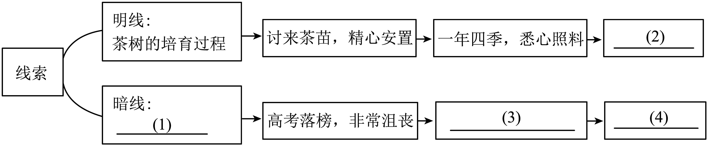

# 🌊 青岛中考语文分项专项练习 —— 06_现代文阅读Ⅱ(模拟)

> 📌 **收录说明**：本练习全量收录自青岛市模拟试卷中该考点的所有试题、背景材料与详细解析（共收录 4 套试卷切片）。

---

### 📌 试题来源与标定卡片：山东省青岛市 • 2025年中考二模

> - **来源试卷**：2025年山东省青岛市中考二模语文试题（解析版）
> - **考试年份**：2025年
> - **所属模块**：06_现代文阅读Ⅱ

<b>（五）现代文阅读Ⅱ（18分）</b>

阅读下面的文字，完成各题。

千叶瓶

刘心武

①那只花瓶是他二十几年前从农贸市场买来的。造型一般，素白。底部连瓷窑标志都没有。花瓶陪伴他度过整个青壮年时期，见证了他娶妻生子，也接受了他“哎，我退休啦!”的招呼。花瓶随他搬了两次家，在家里的位置更多次变易，近些年则一直搁放在书桌一角。花瓶插过鲜花、干花和假花。最后所插的是三根孔雀翎。

②退休以后，他试图圆多年来写回忆录的梦。为此他专门购置了一个精美的十六开簿册，还准备了一盒十二支的绿色签字笔。为什么要选择绿色?完全是下意识驱使。在出售文化用品的货架前、他本是要拿黑色签字笔，忽然眼睛扫到了这种绿色的。好奇地抽出一支，在店里提供的试用纸上画了画、笔尖滑动的感觉和呈现的绿色都让他愉快，于是买了下来。

③但是，翻开簿册，拿起绿笔，郑重地宣布：“别打扰我，我要开笔啦!”<u>却愣在那里，满脑子飞花飘絮，却不知该如何写出第一句来。</u>好不容易写出了几行，却实在是不能满意，狠心用左手撕下那一页，却不料纸张一剐，反弹力使他握笔的右手杵到花瓶，花瓶一斜，忙去扶正，结果笔尖就在瓶体上画出了一个弯线。拿抹布擦，去不掉，又找来去污粉，还是没用，涂上衣领净再擦再用水冲，那道绿痕似乎更加分明。

④传来了妻子的声音：“你把弄脏的一面朝墙，不就结了吗?”又传来正好回娘家的闺女的声音：“爸，又不是什么值钱的宝贝，您干吗着那么大急?还是写您的回忆录吧，写出来，我给您录入电脑……”他望着破了相的花瓶，只是发愣。

⑤第二天他用绿色签字笔把那涂不掉的一个弯道，勾勒成了一小片绿叶，看上去，顺眼点。但瓶体和那么小一片绿叶在比例上实在不相称，于是，他决定从那片绿叶开始，再连续勾勒出更多的，形态并不雷同，而又凹凸锯齿互补的叶片。勾勒第一个叶片时，他当然是一种后悔的心情，责备自己把素白的瓶体不小心给玷污了。后来，不知怎么的，心理态势的惯性作用吧，勾勒别的叶片时，接二连三，全是后悔的思绪。后悔小时候，不该为了贪摘树上的果子，急躁地把整个枝丫扯断。又后悔上小学时，同桌向自己借圆珠笔用，死活就不借给人家。再后悔在乡下的时候，队里培养自己当乡村医生，却没有能把常见的草药形态认全……

⑥听见闺女又回门，小声在问妻子：“爸的回忆录写出多少了?怎么抱着个花瓶在鼓捣?”妻子小声回答：“着了魔似的，每天总得花两三个钟头在瓶子上画树叶……不过他脾气倒好多了，下楼一块遛弯儿，还总跟我回忆以往的事儿，动不动还说，哪件事上对不起我，哪回的吵架请我原谅……咳，其实我早忘啦!不过听他那么说，心里倒是挺舒服的……"

⑦渐渐地，他那只花瓶，半壁外表都画满了绿叶，那些单线勾勒的叶片，大大小小，连续不断，看上去，仿佛当初入窑出窑时，就已经有了，而且，是工艺师事先就构思好，精描出来的，显得非常自然，也非常和谐，堪称雅致秀美。

⑧他继续在花瓶另一面上勾勒绿叶。妻子说：“难道你非得把叶子画满吗?铺满怕得上千片叶子，你累不累啊?”他边慢慢画，边沉吟地说：“我还真怕那画满的一天到来呢!”

⑨有一天，一位现在迷上古玩收藏的“发小”来看望他，忽然眼睛一亮，吼出一声：“老兄，你从哪儿收来这么个千叶瓶?”他不作声。那“发小”走近，小心捧起细看，哑然失笑：“原来根本不是古董，连当代高级工艺品都不是啊!”他让来客小心轻放，说：“对我而言，这是无价之宝!”他只简单解释了几分钟，来客便肃然起敬，并感叹：“如果那些对社会负有更大责任的人士，都能有你画千叶瓶的心思，该多好啊!”

（节选自《小说选刊》,有删减）

19. 下列对选文内容理解有误的一项是（   ）

A. 退休后主人公想圆写回忆录的梦，却没有成功；无心插柳，普通的瓶子竟然成了工艺品。

B. 小说第⑤段看似在写主人公对自己过去生活中种种失误的后悔，实际上以小见大，是对人生的反思。

C. 小说以“千叶瓶”为线索，叙述了主人公与千叶瓶的故事，文章结构严谨，脉络分明。

D. 阅读本文，可以引发我们的思考：即使人生出现失误，只要抱着积极的心态努力弥补，也能实现人生价值。

20. 请结合语境，品味文章的语言。

（1）赏析第②段加点字“扫”“抽”“画”。

（2）从修辞角度赏析第③段画线的句子。

21. 小说在第④段和第⑥段中两次写到妻子、女儿的话，有什么作用?请结合具体内容加以分析。

22. 根本不是古董，连当代高级工艺品都不是的“千叶瓶”,主人公为什么把它当作“无价之宝”?

【答案】19. A    20. （1）加点字运用动作描写的手法，生动形象地写出了他以往对绿色的忽略以及内心对绿色的渴望，同时也为下文他给花瓶画绿叶作铺整。

（2）运用了比喻的修辞手法，将他的思绪比作飞舞的花朵、飘飞的柳，生动形象地表现出他写回忆录时思绪粉飞、无从下手的状态。

21. 第一次，表现了她们于花瓶被毁这件事的毫不在意，与他对于此事的着急形成对比，突出了他对花瓶的珍惜以及对玷污花瓶的后悔之情。

第二次：通过表子和女儿的对话从侧面表现出他对于画花瓶这件事的用心，并且在此过程中不断地反思自己，获得心灵的宁静与满足。

22. ①现如今瓶体被勾勒上独一无二的叶片的千叶瓶，不仅是陪伴了他几十年的伙伴，还是他回顺往事、自我反省的重要媒介；②花瓶上的千叶是他一笔一笔用心勾画出来的，倾注了他的心血；③主人公在花瓶上画绿叶的过程，更是检讨灵魂、滋养心灵的过程。

【解析】

【导语】这篇小说以一只普通花瓶为线索，通过主人公退休后写回忆录受挫、意外在瓶上作画

情节，展现了一个关于人生反思与救赎的深刻主题。作者刘心武巧妙运用“无心插柳”的叙事手法，将主人公在勾勒叶片过程中对过往的悔悟与心理变化细腻呈现。花瓶从素白到“千叶”的转变，象征着人生从空白到丰富的历程，也暗喻着错误可以转化为美的哲理。小说语言朴实却富有深意，结尾处“发小”的感叹更将个人感悟升华为社会思考，体现了“平凡中见深刻”的艺术特色。

【19题详解】

本题考查理解分析能力。

A.“……普通的瓶子竟然成了工艺品”表述有误。原文第⑨段提到，千叶瓶“根本不是古董，连当代高级工艺品都不是”，朋友认为它没有工艺价值，但主人公视其为“无价之宝”是因为瓶身承载了他对人生的反思与弥补。因此，“工艺品”这一表述不符合文意。

故选A。

【20题详解】

本题考查关键词句的赏析。

（1）“忽然眼睛扫到了这种绿色的。好奇地抽出一支，在店里提供的试用纸上画了画”中“扫”是目光快速掠过，体现偶然性；“抽”是随手取出，表现随意；“画”是下意识动作，显示好奇与试探。三个动词连贯自然，联系上一句“为什么要选择绿色?完全是下意识驱使”可知，刻画主人公选择绿色笔时的偶然与随性，生动形象地写出了他以往对绿色的忽视；同时，也表现出他现在对绿色的渴望，暗示其内心对新鲜事物的接纳。这就为他下文给花瓶画绿叶作铺垫。

（2）“满脑子飞花飘絮”运用了比喻的修辞手法，将他的思绪比作飞舞的花朵、飘飞的柳絮；再联系“却不知该如何写出第一句来。好不容易写出了几行，却实在不能满意”可知，生动形象地表现出主人公提笔时思绪的纷乱与空洞，突出他面对回忆录无从下笔的茫然与焦虑。

【21题详解】

本题考查文段的作用。

在答作用时，要考虑到情节的需要与情节造成的对话内容。一定要答出人物的心理因素。

第④段“你把弄脏的一面朝墙，不就结了吗？”“爸，又不是什么值钱的宝贝，您干吗着那么大急？还是写您的回忆录吧，写出来，我给您录入电脑……”妻子和女儿的声音是对他不小心给花瓶划上绿痕行为的劝解，妻子建议“弄脏一面朝墙”，女儿劝他专注写回忆录，表现家人对花瓶的轻视，与“他”对于此事的着急形成对比，突出了他对花瓶的珍惜以及对玷污花瓶的后悔之情。

第⑥段“闺女又小声问妻子：‘爸的回忆录写出多少了？怎么抱着个花瓶在鼓捣？’妻子小声回答：‘着了魔似的，每天总得花两三个钟头在瓶子上画树叶……不过他脾气倒好多了，下楼一块遛弯儿，还总跟我回忆以往的事儿……’”妻子提到他脾气变好、主动反思过去，女儿疑惑他“鼓捣花瓶”，从侧面表现出“他”对于画瓶这件事十分用心，并且在此过程中不断的反思自己。妻子提到他脾气变好、主动反思过去，女儿疑惑他“鼓捣花瓶”，通过对比展现主人公因画叶而心境转变，暗示“千叶瓶”对他精神疗愈的作用，获得心灵的宁静与满足，推动主题深化。

综上分析，概括作答即可。

【22题详解】

本题考查理解分析能力。

“对我而言，这是无价之宝！”中的“无价之宝”的意思是无法估价的宝物，指极珍贵的东西。

从第①段“那只花瓶是他二十几年前从农贸市场买来的。造型一般，素白，底部连瓷窑标志都没有。花瓶陪伴他度过整个青壮年时期。见证了他娶妻生子”可知，现如今瓶体被勾勒上独一无二的叶片的千叶瓶，不仅是陪伴了“他”几十年的伙伴；再联系第⑤段“后来，不知怎么的，心理态势的惯性作用吧，勾勒别的叶片时，接二连三，全是后悔的思绪。后悔小时候，不该为了贪摘树上的果子，急躁地把整个枝丫扯断。又后悔上小学时，同桌向自己借圆珠笔用，死活就不借给人家。再后悔上山下乡的时候。队里培养自……却没有能把常见的草药形态认全……”可知，这个千叶瓶上的千叶是他一笔一笔用心勾画出来的，倾注了他的心血，也还是他回顾往事、自我反省的重要媒介。

从第⑥段“着了魔似的，每天总得花两三个钟头在瓶子上画树叶……不过他脾气倒好多了，下楼一块遛弯儿，还总跟我回忆以往的事儿，动不动还说，哪件事上对不起我，哪回的吵架请我原谅……咳，其实我早忘啦!不过听他那么说，心里倒是挺舒服的……"可知，画叶过程让他学会接纳不完美，以积极心态面对遗憾，最终实现心灵的平和与成长。因此，主人公在花瓶上画绿叶的过程，更是检讨灵魂、滋养心灵的过程。

综上分析，概括作答即可。

============================================================

### 📌 试题来源与标定卡片：山东省青岛市市北区 • 2025年中考一模

> - **来源试卷**：2025年山东省青岛市市北区中考一模语文试题（解析版）
> - **考试年份**：2025年
> - **所属模块**：06_现代文阅读Ⅱ

<b>（二）现代文阅读Ⅱ（</b><b>18</b><b>分）</b>

烟火气里有花香

余同友

①夜读汪曾祺先生的散文，读到他写的一段画马铃薯花的文章，忍俊不禁。汪老当年在张家口沙岭子农业科学研究所时，所里曾给他一个任务，去一个下属的马铃薯研究站画一套马铃薯图谱。他二话没说，买了点纸笔颜料就去了。“这里集中了全国的马铃薯品种，分畦种植。正是开花的季节，真是洋洋大观。”汪老每天一早起来，就到马铃薯地里掐一把花、几枝叶子，回到屋里，插在玻璃杯里，对着它画。平常的马铃薯花，可能还从来没有哪一位画家专门画过，可在汪老眼里，它们色彩丰富，不同种类的花与叶都有细微差别，他画得非常用心，也很享受作画时的状态。为此，他曾写过一首长诗，记述彼时的生活，寄给一个老同学，其中有两句：“坐对一丛花，眸子炯如虎”。那份投入和痴迷，那份淡定和从容，真是可爱得很！

②人们爱花，一般视赏花为雅事，但汪老的这马铃薯花，却因马铃薯的蔬菜身份，多了一种烟火气里的可爱。由此及彼，放下马铃薯花，我的脑海里突然盛开了许许多多关于花的见闻、轶事。猛地发现，<u>国人是太爱花了，而且这份爱已深深融入了柴米油盐的生活百味。</u>

③我早年住在一幢破旧的筒子楼里，简陋的楼道却让邻居章姐硬是养出一道赏心悦目的花的长廊。她每天用沤过的淘米水浇花，有细碎的太阳花、泼辣的月季花、喷香的栀子花。更让人叫绝的，是冬天里，她竟然养了几棵“仿水仙”——将大白萝卜上方挖个孔，把发芽的大蒜塞进孔里，水分充足的萝卜为大蒜提供了足够的养分。<u style="text-decoration: wavy;">待到那大蒜抽条长叶，宛如水仙般亭亭玉立，美极了。</u>我想起《浮生六记》里的芸娘用小纱囊装茶，放入初开的荷花花心熏制，这和章姐萝卜里种“仿水仙”有异曲同工之妙。原来人们与花草在市井生活中的相处之道，早就在岁月里酿成了诗。

④在我们的心目中，花不必求贵，不必求珍稀，它们是我们的亲密邻居。诗人陶渊明曾在长江边的小县彭泽任县令，附近有一个东流镇，那里的地形气候宜于野生黄白菊花的生长。每逢金秋时节，黄白菊应时开放，空气中也氤氲着浓郁的菊香。陶渊明一到东流，见了这野景野花，喜不自胜，在城南选了一处赏菊之地，时常前来把酒赋诗、借菊咏怀。因了陶公，东流小镇被称为“菊乡”。其实，他所爱之菊，也并非什么珍贵稀有的品种，只是农家篱畔最常见的黄白野菊。

⑤如今的菊乡人依然爱着那朴素的菊花，现在镇上的人几乎家家种菊，房前屋后墙头檐下全是菊花。居民们还在每年的重阳节自发地举办菊花文化节，搬出自家的菊花到广场上相互秀一秀、比一比。我家小区附近，有一位老人骑着三轮车收购废品。他的三轮车车沿上，也摆放着一盆菊花。他告诉我说，这是他从垃圾站捡回来的，养得可好呢。他说这话时，完全没有半点嫌弃这花“出身”的意思，反而满面自豪。<u style="text-decoration: wavy;">我猜他是自豪于自己能从垃圾堆里寻得这</u><u style="text-decoration: wavy;">“</u><u style="text-decoration: wavy;">蒙尘明珠</u><u style="text-decoration: wavy;">”</u><u style="text-decoration: wavy;">的美。</u>老人应该不会写诗，但他看待这盆菊花的态度里，有着质朴的诗意。滋养性灵的从来不是名花异草，而是那份永存于心的温柔心意。

⑥“人是解语花，花是解语人”。花开花落，总是牵动着我们的神经。刮风下雨，午夜梦回，“夜来风雨声，花落知多少”“知否知否，应是绿肥红瘦”，我们像关心家人一样关心着花。而我们欣赏花，很多时候是欣赏一种精神。“高名压尽离骚卷，不入离骚更自高。”不用说，这是欣赏像幽谷中的兰花一样高洁的品性；池塘里普通的荷花，被赋予了“出淤泥而不染”的高尚品德；即便是小小的苔花，“苔花如米小，也学牡丹开”，这是多么顽强、执着、自信的一种精神气度啊。国人举凡家中养花者，无论学识高低，都能多多少少讲出这些花各自的文化掌故。花还是那株花，但有了精神和情感的投射，月已非月，花亦非花，这应该是属于中国人独特的审美趣味吧。

⑦那飘荡在烟火气里的花香，连着墨香、连着文脉，连接着日常与诗意。夜渐深，穿行在这些书本上与记忆里的花丛中，心里突然有了冲动，便在微信群里招呼一声：“听说徽州卖花渔村的梅花开得正盛，周末相约去踏春寻梅可好？”不到一分钟，平素较为冷清的群里，竟然霎时热闹起来，一个个竖起大拇指积极响应，有几位还纷纷给我献花，多得我一时都“抱”不过来了。

18. 作者在第②段中提到，“国人是太爱花了，而且这份爱已深深融入了柴米油盐的生活百味。”文中哪些事能体现出国人对花的喜爱？请简要概括。

19. 自选角度，赏析下面两句话的表达效果。

（1）待到那大蒜抽条长叶，宛如水仙般亭亭玉立，美极了。

（2）我猜他是自豪于自己能从垃圾堆里寻得这“蒙尘明珠”的美。

20. 花是古代诗歌中常见的意象，也是文人墨客笔下的移情对象，常引起万千思绪。本文中结尾处作者邀请好友踏春寻梅时寄寓的情感与下面链接材料表达的情感是否相同？请结合文章和链接材料进行分析。

| 链接材料： 冰雪林中著此身，不同桃李混芳尘； 忽然一夜清香发，散作乾坤万里春。 ——王冕《白梅》 |
| --- |

21. 读完文章后，有的同学对本文有了深刻理解，并写下两组关键词，请你任选一组，完成【感悟式批注】。

| 感悟式批注：结合文本内容记录阅读时的理解、感受，帮助自己深入把握文章主旨。 |
| --- |

（1）日常与诗意         （2）生活与自然

我选择_____________。【感悟式批注】：___________________________。

【答案】18. （1）汪曾祺先生为做研究专门画马铃薯花，他画得用心且享受。

（2）邻居章姐在简陋的楼道里养出一道花的长廊

（3）陶渊明担任彭泽县令时，在城南选了一处赏菊之地，时常前来把酒赋诗，借菊咏怀。

（4）菊乡的居民们在每年的重阳节自发地举办菊花文化节。

（5）我家小区附近骑着三轮车收购废品的老人，从垃圾站捡回来一盆菊花，摆放在三轮车车沿上，满面自豪。

19. （1）“亭亭玉立”的本意是外形苗条清秀或者草木挺拔，这里指章姐养的大蒜苗挺拔，长势良好，表现了章姐养花草技艺高超，热爱生活。

（2）比喻，把老人从垃圾站里捡来的菊花比作蒙尘的明珠，写出了菊花之美，表达了老人对菊花的喜爱与自豪之情。（或者表达出作者对老人欣赏菊花的质朴诗意的赞赏）（从用词角度写也可）

20. 不一样。虽然都是春日赏梅，但本文作者踏春寻梅是受到烟火气里。的花香、书本里的墨香的影响，一时兴起，想在大自然中感悟春意，欣赏梅花，表达了作者对诗意生活的热爱（热爱春天，爱花，爱自然）；而诗人王冕则借白梅的冰清玉洁（或是不畏严寒，或者不与其它花朵争春）寄托了自己高洁的情操。

21.     ①. 日常与诗意    ②. 本文写了汪老画马铃薯花写长诗表达心情、章姐创“仿水仙”、陶渊明借菊咏怀、收废品老人珍视垃圾堆里的菊花的等颇具诗意的事件，（结合内容任意概括一件事即可得）表达了日常的、平凡的事物中就有诗意（或是烟火气里有花香）这一主旨（日常与诗意的关系）。注意：只要在日常生活中善于发现美、寻找美、欣赏美，或者能在生活中多一分投入淡定与从容，就能将岁月酿成诗。（2）生活与自然   本文写了自然界的花总会牵动人们的心情。人们爱花，爱养花，爱赏花。对花的热爱已经深深融入到生活中。无论是陶渊明的借菊花咏怀还是章姐养花或是老人珍视垃圾堆里的菊花，把花看作是解语人，看作是亲密邻居。体现出人们的生活与自然景色密不可分。

【解析】

【导语】这篇散文以“烟火气里的花香”为题眼，通过汪曾祺画马铃薯花、邻居章姐的“仿水仙”、陶渊明爱菊等生活片段，展现了中国人将诗意融入日常的独特审美。作者以细腻笔触勾勒出平凡生活中的花事：从蔬菜花到垃圾堆捡回的菊花，都因人的情感投射而焕发光彩。文中“日常与诗意”的辩证关系尤为动人，既写实又超脱，最终在微信邀约赏梅的现代场景中，完成对传统赏花文化的当代诠释。全文流淌着对生活美学的深刻体悟，彰显了中华民族“万物有灵”的诗性智慧。

【18题详解】

本题考查内容理解。

根据第①段中“汪老每天一早起来，就到马铃薯地里掐一把花、几枝叶子，回到屋里，插在玻璃杯里，对着它画……他画得非常用心，也很享受作画时的状态”可知，通过“每天一早”“用心”“享受”等表述，展现出汪曾祺为做研究专注画马铃薯花的过程，体现他对花的喜爱，即便普通的马铃薯花也能投入精力细细描绘，将这份喜爱融入工作与生活。据此可概括为：汪曾祺先生为做研究专门画马铃薯花，他画得用心且享受。

根据第③段中“我早年住在一幢破旧的筒子楼里，简陋的楼道却让邻居章姐硬是养出一道赏心悦目的花的长廊。她每天用沤过的淘米水浇花”可知，“硬是”一词强调在简陋条件下章姐养花的坚持，“每天”表明其持之以恒，在艰苦的生活环境中，章姐用养花装点楼道，足见对花的喜爱已成为生活的一部分。据此可概括为：邻居章姐在简陋的楼道里养出一道花的长廊。

根据第④段中“陶渊明一到东流，见了这野景野花，喜不自胜，在城南选了一处赏菊之地，时常前来把酒赋诗、借菊咏怀”可知，“喜不自胜”直接表现陶渊明见到菊花

欣喜，“时常”说明其频繁前往赏菊赋诗，将对菊花的喜爱化作诗意的生活方式，融入日常雅趣之中。据此可概括为：陶渊明担任彭泽县令时，在城南选了一处赏菊之地，时常前来把酒赋诗，借菊咏怀。

根据第⑤段中“如今

菊乡人依然爱着那朴素的菊花，现在镇上的人几乎家家种菊，房前屋后墙头檐下全是菊花。居民们还在每年的重阳节自发地举办菊花文化节”可知，“家家种菊”体现种植的普遍性，“自发地举办菊花文化节”表明菊乡人对菊花的热爱形成集体活动，将爱花之情融入传统节日与集体生活，成为地域文化特色。据此可概括为：菊乡的居民们在每年的重阳节自发地举办菊花文化节。

根据第⑤段中“我家小区附近，有一位老人骑着三轮车收购废品。他的三轮车车沿上，也摆放着一盆菊花。他告诉我说，这是他从垃圾站捡回来的，养得可好呢。他说这话时，完全没有半点嫌弃这花‘出身’的意思，反而满面自豪”可知，老人从垃圾站捡花并精心养护，还为此感到自豪，即便生活平凡，也不放弃对美的追求，用爱花之举为生活增添诗意与温情。据此可概括为：我家小区附近骑着三轮车收购废品的老人，从垃圾站捡回来一盆菊花，摆放在三轮车车沿上，满面自豪。

【19题详解】

本题考查句子赏析。

根据第③段中“待到那大蒜抽条长叶，宛如水仙般亭亭玉立，美极了”可知，“亭亭玉立”一词本用于形容女子身材修长或花木等形体挺拔，此处用来描绘大蒜苗生长的姿态。“抽条长叶”生动展现出大蒜生长的动态过程，而“亭亭玉立”则赋予大蒜苗一种优雅美好的形象，将普通的大蒜苗与高雅的水仙相类比，不仅写出了大蒜苗挺拔、长势良好的状态，更侧面反映出章姐养花技艺的高超。她能把平凡的材料培育得如此美观，体现出她对生活的热爱，善于在平凡生活中创造美。句子运用了比喻的修辞手法，将抽条长叶的大蒜比作“亭亭玉立”的水仙，形象地描绘出大蒜苗的优美姿态，使读者能更直观感受到这份由普通食材创造出的美感，也凸显出章姐对生活细致入微的观察和巧妙的生活智慧。

根据第⑤段中“我猜他是自豪于自己能从垃圾堆里寻得这‘蒙尘明珠’的美”可知，此句运用了比喻的修辞，把老人从垃圾站捡回的菊花比作“蒙尘明珠”。“蒙尘”写出菊花被丢弃、不被他人重视的境遇，而“明珠”则强调了菊花本身具有的珍贵与美好，生动地展现出菊花的美丽特质。通过这个比喻，既体现出老人能够发现被人忽视的美，也表达出老人对这盆菊花的喜爱与自豪之情，他不以菊花的“出身”而轻视，反而珍视它的美。用“蒙尘明珠”这样富有诗意的表述，暗含着对老人这种质朴审美的赞赏，即便生活平凡，老人依然能以独特的眼光和热爱生活的心，发现并珍惜生活中的美，这种对待生活的态度充满了诗意。

【20题详解】

本题考查内容理解。

根据第⑦段中“那飘荡在烟火气里的花香，连着墨香、连着文脉，连接着日常与诗意”可知，作者是受到了生活中烟火气里的花香以及书本里墨香的感染，一时兴起想要去踏春寻梅。“穿行在这些书本上与记忆里的花丛中，心里突然有了冲动”表明作者是为了在大自然中感受春意，欣赏梅花的美，从而享受诗意的生活，表达了作者对这种诗意生活的热爱之情，以及对春天、对花、对自然的喜爱。

链接材料：“冰雪林中著此身，不同桃李混芳尘；忽然一夜清香发，散作乾坤万里春”，意思是白梅生长在冰天雪地的寒冬，傲然独立于冰雪林中，不与桃李在春天里争艳斗芳，混杂于世俗的尘埃之中。忽然在某个夜里，白梅绽放，清香四溢，弥漫在天地之间，仿佛将春天带到了万里乾坤。

王冕在诗中写道“冰雪林中著此身，不同桃李混芳尘”，通过将白梅与桃李进行对比，突出白梅在冰雪林中独自绽放，不与桃李在世俗的芬芳中混杂，体现了白梅的冰清玉洁、不畏严寒、不与其他花朵争春的品质。“忽然一夜清香发，散作乾坤万里春”，则进一步写出白梅在绽放时，其清香飘散，给天地间带来春天的气息。诗人借白梅的这些品质，寄托了自己高洁的情操，表达了自己不愿与世俗同流合污，追求高尚品格的志向。本文作者踏春寻梅主要是为了追求诗意生活，享受自然之美；而王冕借白梅表达的是自己的高洁情操，两者情感不同。

【21题详解】

本题考查内容理解。

要求完成“感悟式批注”，需围绕关键词阐述对文章的理解与感受，体现个人阅读思考，并非简单概括内容或分析手法。无论是选择“日常与诗意”还是“生活与自然”，批注内容必须紧密围绕所选关键词展开，分析文本中与之相关的具体事例和细节，展现二者的联系。

从文中提取相关语句或事例作为依据，如汪曾祺画马铃薯花、章姐楼道养花、陶渊明赏菊等情节，通过具体分析这些内容来支撑自己的感悟，避免空谈。

（1）日常与诗意 ：根据第①段写汪曾祺“每天一早起来，就到马铃薯地里掐一把花、几枝叶子，回到屋里，对着它画”，还写下“坐对一丛花，眸子炯如虎”的长诗可知，将普通的马铃薯花当作创作对象，在科研工作中融入诗意；根据第③段“我早年住在一幢破旧的筒子楼里，简陋的楼道却让邻居章姐硬是养出一道赏心悦目的花的长廊……原来人们与花草在市井生活中的相处之道，早就在岁月里酿成了诗”可知，邻居章姐“用沤过的淘米水浇花”，甚至用大白萝卜和大蒜创造出“仿水仙”，在破旧筒子楼的楼道里打造花的长廊，把平淡的日常过成了诗。这些都印证了“烟火气里有花香”的主旨。正如作者所言，只要像汪曾祺作画时的“投入和痴迷”、章姐养花时的“巧思”一样，在生活中保持对美的发现与热爱，即便最普通的日常，也能绽放出诗意的光芒。

（2）生活与自然 ：根据第②段作者提出“国人对花的爱已深深融入了柴米油盐的生活百味”可知，随后用多个事例展现生活与自然的交融。第④段中“	诗人陶渊明曾在长江边的小县彭泽任县令，附近有一个东流镇……其实，他所爱之菊，也并非什么珍贵稀有的品种，只是农家篱畔最常见的黄白野菊”可知，陶渊明在彭泽任职时，因东流镇野生黄白菊“喜不自胜”，常“把酒赋诗、借菊咏怀”，将自然之美转化为精神寄托；第⑤段中“如今的菊乡人依然爱着那朴素的菊花，现在镇上的人几乎家家种菊，房前屋后墙头檐下全是菊花……	而是那份永存于心的温柔心意”可知，菊乡居民“家家种菊”，还在重阳节自发举办菊花文化节，让自然的花卉成为生活习俗；垃圾站旁的老人，把从垃圾堆捡回的菊花摆在三轮车车沿，“满面自豪”，赋予自然之花以生活温情。正如第⑥段所说“花开花落，总是牵动着我们的神经”，人们将花视为“解语人”“亲密邻居”，生动体现出生活与自然相互渗透、密不可分，自然之美滋养着生活，而生活又赋予自然以情感与文化内涵。据此回答即可。

============================================================

### 📌 试题来源与标定卡片：山东省青岛市市北区 • 2025年中考二模

> - **来源试卷**：2025年山东省青岛市市北区中考二模语文试题 （解析版）
> - **考试年份**：2025年
> - **所属模块**：06_现代文阅读Ⅱ

<b>（五）文学类文本阅读（</b><b>15</b><b>分）</b>

调理

徐建英

①翠柳巷，江城知名食街，东起翠柳路，西止如意街。街旁垂柳东西延伸，春日暖阳之下，一路绿意盎然，垂柳婀娜，撩得人群熙攘，惹得单行道车流不息，让这条不足三百米长的古巷，尽显妖娆。

②韩家汤店，坐落在这条古街老巷之中。

③韩家汤店的店主韩庚，祖籍安徽，中医世家。祖上民国时期逃来江城，在翠柳巷百年老店谢家面窝、石婆婆热干面、老谦记炒豆丝等夹缝中生存，硬生生把韩家祖传的药膳汤熬出了一席之地。

④韩庚主打的药膳汤，是韩家依据药食同源的理论，因人而异配熬的。在韩家汤店的堂前，有一只半人高的老陶坛，坛身画有两只金丝彩描的朱雀，环着“医者仁心，济世为怀”八个大字。在汤店后堂，六十八只齐膝高的小陶坛分门别类放置在日夜灶火不熄的老煤炉上，不时飘出熬好的膳食散发的阵阵浓香，成为翠柳街上的一道特色风景。

⑤韩家招牌药膳有一道莲藕杏仁汤，莲藕是洪湖产的粉藕，杏仁因功效不同，分设南北二方。

⑥侯七爷是韩家汤店的常客。江城九省通衢，千湖之地，湖风襄挟寒意。侯七爷每逢换季，整夜咳嗽不止，自从喝了韩家的药膳汤后，困扰他几十年的夜咳终于得到了改善。侯七爷见人就夸韩家的药膳汤好。可最近一段时间，侯七爷见人就斥韩庚是憨包。

⑦事情的起因还是汤。

⑧韩家的莲藕杏仁汤，分为南仁汤和北仁汤。南杏仁，又为甜仁，为江城本地所产。北杏仁为苦仁，为去除口感上的苦味以及毒性，经过韩家几代人的调制，才在口感上褪去北杏仁的苦涩，又保留其宣肺的强大药效。

⑨侯七爷有早起遛弯的习惯，他起来的第一件事就是绕着翠柳巷走一圈，冬天披一件大棉袄，夏天摇一把老蒲扇，穿着一双布拖鞋摇摇晃晃地走在翠柳巷。他那天大清早看到韩家汤店大门敞开，就走了进去。侯七爷进来的时候，韩庚正打开老煤炉，把头天配置好的药膳放入陶钵里。韩庚搬了张小扎凳在一旁边守火，边把隔几日要用的杏仁去外皮，掐尖端，灌清水入桶浸泡，又把日前浸泡好的杏仁捞起沥干，放入沸水中蒸熟。看了半天，侯七爷多嘴问了一句：“一道汤还得整出这般多的名堂？”韩庚看着眼前笑眯眯的胖老头，道：“步骤虽烦琐，却能够很有效地去除苦杏仁的酶活性，脱苦脱毒的环节做彻底了，才能增强药效，提升口感嘛。”这么精细的炮制过程，当场就让侯七爷动了口腹之欲，在讲述完自己的症状后，接了韩庚递来的一碗北仁汤。

⑩没想到这么顺嘴一试，藕的稠香，杏仁的香，汤的醇浓，引得侯七爷之后接连进店。喝着喝着，侯七爷夜咳的老毛病日渐好转。

⑪可韩庚此时却不再卖汤给侯七爷了。他不但自己不卖，还交代店里的人都不许卖汤给侯七爷。侯七爷恼了。恼了的侯七爷站在韩家汤店外发牢骚骂街，韩庚听罢嘿嘿一笑：“您老人家不必喝汤了。”

⑫侯七爷余气未消：“我咳嗽还没好全，你家六十八道汤，一口都不卖给我，是想对我坐地起价？”

⑬“不涨价。”

⑭“既不涨价，为何不卖汤？”

⑮“店里的汤都是配了药的膳汤，凡药三分毒。您先居家清淡饮食，过些日子再喝点南仁汤。”

⑯“你早前不是说我不适合南仁汤吗？”

<u>⑰韩庚（甲）说：</u><u>“</u><u>您那时喝，的确不适合。北杏仁有止咳平喘的功效，您的病症是因肺气壅闭不宣引起的喘咳，南杏仁虽说也有类似的功效，但它药力不达。</u><u>”</u>

⑱“是呀，那我继续喝北仁汤就对了嘛，再说，我很是喜欢这口汤的味儿。”

⑲“叔，南杏仁主要用于补肺润燥，北杏仁主要用于宣降肺气。您的情况，若是只宣不补，过犹不及，我不能只为赚取汤钱去投您所好，而不顾您老的身体呀。”

⑳侯七爷终于懂了。

㉑懂了的侯七爷，又穿着一双布拖鞋摇摇晃晃地走在翠柳巷。但凡有网红打卡，游人觅食，侯七爷必介绍：“江城特色小吃千百样，清蒸武昌鱼、黄州烧梅、咸宁鱼糕、江陵八宝饭等等，各有各味，但你不喝一碗韩家药膳汤，就不能算真正来过江城。”来人咋舌：“小小一家汤店，能有这般神？”侯七爷挥手一笑：“神不神且不论，但‘医者仁心，济世为怀’，韩家人真做到了。知道韩家人当年为什么一路乞讨逃来江城吗？”

㉒众人摇头。

㉓侯七爷对着韩家汤店门前的老陶坛竖起了大拇指：“韩家人拒绝为外侵的辱华军官做药膳调理汤，仅带了这口老陶坛逃来翠柳巷。”众人肃然起敬。

（选自《微型小说选刊》，2025年第4期）

19. 结合情节发展，概括侯七爷对韩家汤店态度的三次转变。

20. 文中多次出现“陶坛”这一细节，有何作用。

21. 结合人物形象，选择合适的选项填入文中“甲”处，并说明理由。

韩庚（甲）说道：“您那时喝，的确不适合。北杏仁有止咳平喘的功效，您的病症是因肺气壅闭不宣引起的喘咳，南杏仁虽说也有类似的功效，但它药力不达。”

A.笑眯眯地        B.皱着眉头

22. 结合文章内容，谈谈你对“医者仁心，济世为怀”的理解。

【答案】19. 第一次：侯七爷喝了韩家的药膳汤后，夜咳得到了改善。侯七爷见人就夸韩家的药膳汤好。

（侯七爷初次喝韩家的药膳汤时，感受到汤的美味和药效，态度积极，认为汤对他的咳嗽有明显改善。）

第二次：韩庚不再卖汤给侯七爷，侯七爷站在韩家汤店外发牢骚骂街，见人就斥韩庚是憨包。（当韩庚拒绝再卖汤给他时，侯七爷感到恼怒，认为韩庚是在坐地起价，态度变得不满。）

第三次：侯七爷懂了韩庚是因为他的病况而不卖给他汤，侯七爷逢人推荐韩家药膳汤。（在理解韩庚的良苦用心后，侯七爷的态度再次转变，开始尊重韩家汤店的药膳理念，并积极向他人推荐韩家汤店，体现了对韩家人仁心的认可。）

20. 示例1：（1）有助于塑造人物形象。韩庚将陶坛作为制药容器，体现他对传统工艺的坚持，以及细致负责的态度。祖辈带着陶坛逃难，说明他们宁愿舍弃其他也要保留医德，侧面反映了人物的高尚品质。（2）作为线索贯穿全文，推动情节发展，故事情节围绕着陶坛中的汤展开。（3）深化主题，具有象征意义。陶坛上面的八个字“医者仁心，济世为怀”深化了文章的主题，陶坛的历史传承象征着家族精神和医德的延续。

示例2：（1）老陶坛代表着韩家汤店的历史和传承，承载了家族的药膳文化（代表着韩庚中医世家的底蕴）。（2）陶坛的存在使得汤店的药膳汤显得更加独特和专业，成为翠柳街的特色风景，吸引顾客的关注。（3）陶坛上的字句“医者仁心，济世为怀”反映出韩庚作为医生的责任感和对顾客健康的重视。

21. 示例1：韩庚作为韩家汤店的店主，性情温厚，对待病人有耐心（医者仁心），不卖汤给侯七爷正是因为他知道此时七爷的身体不宜喝汤，所以面对侯七爷的质疑应该是态度平和，耐心解释。

示例2：韩庚和侯七爷所解释的内容很详细，说明韩庚是个很有耐心的人，并没有因为侯七爷的怒气而生气，所以应该选“笑眯眯地”。从韩庚对侯七爷的敬称“您”来看，韩庚很尊敬侯七爷，对侯七爷的态度很和善，所以用“笑眯眯地”更合理。

22. 示例1：①韩庚熬制药膳十分精细，体现了他的耐心细心，对药效的精益求精；②为了侯七爷身体健康，不投其所好，一切以顾客的身体为重；③韩家人拒绝为外侵的辱华军官做药膳调理汤，体现了他们的民族气节、济世情怀。

示例2：①“医者仁心”体现在韩庚对药膳的精益求精态度。他制作北仁汤时，坚持“掐尖端、清水浸泡、沸水蒸熟”的复杂工序。②“济世为怀”展现在韩庚对患者的真切关怀。侯七爷因夜咳求医，韩庚根据他的体质选择北仁汤，说明他真正把患者的健康放在首位。③“济世为怀”还体现在韩家的民族气节。韩家祖辈宁肯逃难也不为侵略者配药膳，“济世为怀”不仅是治病救人，更是一种家国情怀，心怀大义。

【解析】

【导语】这篇小说以翠柳巷韩家汤店为背景，通过侯七爷喝汤、停售汤等情节，塑造了韩庚坚守医德、不为利益所动的形象。文中对药膳汤制作细节的描写，体现传统中医的精细。结尾借侯七爷之口揭示韩家过往，深化“医者仁心”主题，地域风情与人文情怀交融，叙事细腻，人物鲜活。

【19题详解】

本题考查对内容的理解与概括。

第一次态度转变：根据第⑥段“侯七爷是韩家汤店的常客。江城九省通衢，千湖之地，湖风襄挟寒意。侯七爷每逢换季，整夜咳嗽不止，自从喝了韩家的药膳汤后，困扰他几十年的夜咳终于得到了改善。侯七爷见人就夸韩家的药膳汤好”可知，侯七爷亲身体验到药膳汤的疗效，从对汤品功效的未知转为切实认可，逢人便称赞，态度从最初的尝试性接触变为主动肯定，体现出对韩家汤店医术的信服。

第二次态度转变：根据第⑥段“最近一段时间，侯七爷见人就斥韩庚是憨包”和第⑪段“可韩庚此时却不再卖汤给侯七爷了。他不但自己不卖，还交代店里的人都不许卖汤给侯七爷。侯七爷恼了。恼了的侯七爷站在韩家汤店外发牢骚骂街”可知，当韩庚突然停售汤品时，侯七爷因不理解缘由，误以为对方“坐地起价”，情绪从先前的赞许急转直下，公开指责韩庚，态度由信任转为恼怒，甚至用“憨包”这样的贬义词表达不满，展现出对韩庚行为的强烈质疑。

第三次态度转变：根据第⑲段“叔，南杏仁主要用于补肺润燥，北杏仁主要用于宣降肺气。您的情况，若是只宣不补，过犹不及，我不能只为赚取汤钱去投您所好，而不顾您老的身体呀”，第⑳段“侯七爷终于懂了”，第㉑段“懂了的侯七爷……但凡有网红打卡，游人觅食，侯七爷必介绍‘……你不喝一碗韩家药膳汤，就不能算真正来过江城’”，第㉓段“侯七爷对着韩家汤店门前的老陶坛竖起了大拇指”可知，在听韩庚解释停售原因并理解其“医者仁心”的考量后，侯七爷不仅化解了怒气，更主动成为韩家汤店的“宣传员”。他从个人疗效延伸到对韩家医德的认同，甚至讲述韩家拒为辱华军官做汤的过往，态度从单纯的顾客认可升华为对韩家精神的推崇，用实际行动传播其价值理念。

【20题详解】

本题考查句段作用分析。

根据第④段“堂前有一只半人高的老陶坛，坛身画有两只金丝彩描的朱雀”“后堂六十八只齐膝高的小陶坛分门别类放置在日夜灶火不熄的老煤炉上”可知，韩庚使用传统陶坛熬制药膳汤，既体现他对家族工艺的坚守，也通过“分门别类”“灶火不熄”的细节，展现其对待药膳制作的细致与专注。再根据第㉓段“韩家人拒绝为外侵的辱华军官做药膳调理汤，仅带了这口老陶坛逃来翠柳巷”可知，祖辈逃难时舍弃财物却保留陶坛，凸显其将医德看得比生存更重要的品格，侧面烘托韩家世代坚守的仁心。

根据第④段“老陶坛”“小陶坛”的描写及全文围绕药膳汤展开的叙事可知，陶坛是药膳汤的承载容器，从侯七爷因陶坛熬制的汤受益，到韩庚用陶坛炮制药材、把控药效，再到侯七爷向游人介绍陶坛背后的故事，陶坛贯穿“喝汤——停售——理解——传播”的情节链条，成为推动故事发展的隐性线索，使内容前后勾连、结构紧凑。

根据第④段“坛身环着‘医者仁心，济世为怀’八个大字”可知，陶坛上的文字直接点明韩家的行医宗旨，韩庚拒绝向侯七爷出售北仁汤、坚持“凡药三分毒”的审慎态度，正是对这八字的践行，使陶坛成为医德的具象化象征。同时，陶坛历经家族逃难、世代使用的“历史感”，象征着韩家“不为利益折腰”的精神传承，深化了“坚守仁心、济世为怀”的主题，让读者透过器物看到文化与道德的延续。

根据第④段“小陶坛……不时飘出熬好的膳食散发的阵阵浓香，成为翠柳街上的一道特色风景”可知，陶坛的古朴造型与熬汤场景形成视觉与嗅觉的双重冲击，既区别于现代工业化烹饪，又以“传统工艺”的标签赋予韩家汤店独特性，成为吸引侯七爷等顾客的重要元素，从侧面反映其在翠柳巷众多老店中立足的原因——用器物的“老”彰显工艺的“真”。

【21题详解】

本题考查人物形象分析与语句补写

根据第⑨段“韩庚看着眼前笑眯眯的胖老头，道：‘步骤虽烦琐……提升口感嘛’”可知，韩庚在面对侯七爷初次询问时，已展现出温和耐心的态度，用“笑眯眯地”回应顾客的好奇，体现其性格中亲切友善的底色。

根据第⑪段“韩庚听罢嘿嘿一笑：‘您老人家不必喝汤了’”可知，面对侯七爷的恼羞成怒，韩庚并未因对方的指责而愠怒，反而以轻松的“嘿嘿一笑”化解冲突，进一步印证其从容平和的处事风格。

根据第⑰段对话中韩庚称侯七爷为“您”，且第⑲段以“叔”相称可知，他对侯七爷始终保持尊敬，语言措辞礼貌温和。这种态度需搭配符合其性格的神态描写，“笑眯眯地”更能体现他解释时的耐心与诚恳，而非“皱着眉头”的严肃或抵触。

综上，韩庚的性格贯穿全文始终以温厚仁善为核心，“笑眯眯地”既符合其面对顾客时的职业态度，也与前文铺垫的人物形象一致，故选A。

【22题详解】

本题考查重要语句理解。

根据第④段“在汤店后堂，六十八只齐膝高的小陶坛分门别类放置在日夜灶火不熄的老煤炉上”以及第⑨段“韩庚搬了张小扎凳在一旁边守火，边把隔几日要用的杏仁去外皮，掐尖端，灌清水入桶浸泡，又把日前浸泡好的杏仁捞起沥干，放入沸水中蒸熟”可知，韩庚熬制药膳时，陶坛分工细致，杏仁炮制工序繁复，这种对每一个环节的专注与讲究，彰显出他对药膳品质的极致追求，以专业态度践行“医者仁心”，力求让药效发挥到最佳。

根据第⑪段“韩庚此时却不再卖汤给侯七爷了。他不但自己不卖，还交代店里的人都不许卖汤给侯七爷”以及第⑲段“叔，南杏仁主要用于补肺润燥，北杏仁主要用于宣降肺气。您的情况，若是只宣不补，过犹不及，我不能只为赚取汤钱去投您所好，而不顾您老的身体呀”可知，韩庚明知侯七爷喜欢北仁汤的味道且愿意花钱购买，但他从患者健康角度出发，果断拒绝售卖，耐心解释药理，坚持为侯七爷选择更合适的调理方案，将患者的健康需求置于利益之上，这正是“济世为怀”的生动体现。

根据第㉓段“韩家人拒绝为外侵的辱华军官做药膳调理汤，仅带了这口老陶坛逃来翠柳巷”可知，韩家祖辈在民族大义面前，宁可放弃安稳生活，选择颠沛流离的逃难之路，也不愿为侵略者提供药膳服务。这种行为超越了单纯的医者职责，将“济世为怀”的胸怀拓展到家国层面，展现出强烈的民族气节和高尚的道德情操，诠释了“济世为怀”不仅是对个人健康的守护，更是对民族大义的坚守。

============================================================

### 📌 试题来源与标定卡片：山东省青岛市李沧区 • 2025年中考二模

> - **来源试卷**：2025年山东省青岛市李沧区中考二模语文试题（解析版）
> - **考试年份**：2025年
> - **所属模块**：06_现代文阅读Ⅱ

<b>（四）文学类文本阅读（</b><b>18</b><b>分）</b>

题目：______

赵阿芳

①记得很清楚，那是1987年的春天，父亲费尽周折，终于讨来两株抗寒茶树苗。

②荼苗细得像我铅笔盒里的蜡笔。母亲一脸的难以置信：这南方的娇贵东西，在北方能活吗？“她们可是会看人脸色长，有灵气儿的呢。好好对她，她肯定能长好。”父亲很有信心。

③父亲在我家院子东南角砌起挡风石墙，碎蛤蜊壳拌着花生麸，培出个骆驼背似的小土丘，又找来一块油纸，搭了粗糙的暖棚，两株茶苗从此在我家安家落户。

④年底腊月头场雪那夜，父亲把我大叔给他的军大衣裹在茶苗根处保暖。记得那时冰碴子顺着棉絮往他指缝里钻，他却是一脸春色。眼神都是亮晶晶的。现在才知道，那时的父亲，在精心守望着一个希望。

⑤酷热的夏天，我高考落榜了。暑气炎炎的夜晚，我蹲在院角的茶树旁，边流泪边撕课本。哭声惊飞了叶底的七星瓢虫，光晕里茶花却正在夜露中缓缓绽开。

⑥父亲不知站在我身后多久了、他捧着一个搪瓷缸，里面是他最喜欢的酽茶。“芳子，喝杯茶清凉清凉吧。”他吹开浮沫的声响，像极了童年教我吹蒲公英的模样。我乖乖地把茶缸接过来，喝了一口，苦得我直皱眉头。“这浓茶啊，入口像吃药，一会儿就品出蜜味啦，你细品品，这茶可是咱们自己炒的呢。”父亲提示道。确实如父亲所说，茶汤的苦味滑过喉头后，有丝难以明说的甜意在后槽牙打转，混着搪瓷味的回甘一阵阵在口腔里回荡。

⑦“你瞅瞅这花骨朵。”父亲掐下一朵米粒大的茶花搁在我掌心，“开得比牡丹晚，香气却能在舌尖停三春。”蝉鸣声里，父亲拎起浇菜用的铁皮壶，将水徐徐淋在树根：“你听这声儿——”水流渗入泥土的响声中，竟夹杂着气泡破裂的脆响。“根须在喝水呢。”他蘸着茶水在石板上画曲线，“闺女啊，人生的道儿啊，比茶叶脉络还曲绕，可到底都通着主茎，不管走哪条道，只要你用心，都能过好这一生。”

⑧难熬的夏天终于远离，那年深秋，我打起行囊，奔向远方。出发的那天清晨，茶树突然爆出十几枚新芽。父亲采下一朵最肥的芽尖夹进我的笔记本，叶脉在纸页上洇出墨绿的航线：“芳子，你要记着，苦后回甘的劲道都在叶筋里呢。”

⑨惊蛰，清晨的露珠还凝在窗台，父亲已蹲在茶树根旁松土了。他总能在茶枝爆芽时准时察觉：“这是根须在地底打更呢。”他摘下半片越冬老叶对着日头呢喃：“看这老叶上的纹路。”叶脉在光线下变成金色的河网，<u>1998</u><u>年那场胶东大雪冻出来的疤，倒成了春芽的引水渠。</u>

⑩每年的春分，他都会隆重地泡上一壶茶：粗瓷壶里抓把两三年的老陈茶，再加上当年最新的头茬芽茶，茶水注下去，三代茶叶在漩涡里浮沉。他管这个叫三辈子茶。“看，这老叶托着新芽往上顶呢，咱们村啊，现在可以推广种茶增收了！”茶叶在茶杯轻舞飞扬，父亲笑起来时眼角的褶皱，那些被岁月犁出的沟壑里，兜住了满溢的春光。

⑪如今，我已成熟，事业上也算小有成就。清明的第一场细雨里，我带儿子回到故乡。等待拆迁的老屋早已没有了当年的鲜活，耳边是呼呼的春天的海风，眼前是衰草连天的老院，这还是我记忆中长大的家吗？

⑫儿子突然指着树根惊叫：妈，快看，俺姥爷的茶壶！顺着他手指的方向，父亲当年手砌的贝壳墙残基依旧能看出蛤蜊皮的灰珍珠色，两株老茶树依旧在静静守望着小院。扒开茶树底部的碎石块，那个磕破了壶嘴的瓷茶壶倒扣在土里，内壁结着的茶垢已凝成了山水纹。

⑬暮色漫过斜阳时，三十年光阴在茶汤里静静泪开：那年的海风正在叶底回旋；那年的月光给新芽镶银；那年的茶园枝头挂上了红绸。此刻，在茶树皲裂的老皮下，又隐约爆出几星鹅黄——恰是父亲当年教我辨认的，春天最初的模样。

⑭儿子说，胶东绿茶上热搜了。我突然想起父亲当年围在茶树上的军大衣和挂在茶枝上的温度计。

⑮晚风掠过老屋，几十载春天的茶语忽然簌簌作响。儿子将那把旧茶壶仔细装进了铁皮盒，轻哼着父亲教会他的京剧老生唱段，望着正在蓬勃萌发的茶树枝头，他的眼里闪着光，像极了父亲那晚亮晶晶的眼神。

⑯从老家回来的那晚，我做了一个梦：父亲笑吟吟地站在春风浩荡的茶园里，依旧端着他的搪瓷缸，爽朗的笑点亮了四月的茶园，“看，茶树鼓新芽！”

⑰一瞬间，漫山遍野春色涌动，茶香浸透了春天。

（原文有删改）

19. 本文采用双线叙事结构，根据提示，简要概括文章的明线与暗线。

20. 第④段写父亲的眼神“亮晶晶的”，第⑮段又写到儿子的眼里“闪着光”，联系上下文，分析其分别体现了人物怎样的心理？

21. 自选角度，赏析第⑨段中画横线句子的表达效果。

1998年那场胶东大雪冻出来的疤，倒成了春芽的引水渠。

22. 第⑯段写“我”梦见父亲说“看，茶树鼓新芽”，在文中有何作用？联系全文，从内容与结构两个角度进行分析。

23. 关于本文的题目，小夏同学主张用《父亲》，小荷同学却认为用《茶树鼓新芽》更好。联系全文，分析小荷同学的理由。

【答案】19. （1）“我”的成长经历；（2）茶树爆芽，父亲寄语；（3）外出打拼，有所成就；（4）回到故乡，怀念父亲。

20. （1）父亲“亮晶晶的”眼神：表现了他对南方茶苗在北方成活的坚定信心和对未来的殷切希望。

（2）儿子“闪着光”的眼神：体现了他对祖父精神的继承和对茶树生命力的惊喜与憧憬，也流露出对未来的向往与激情。

21. 这句话运用了比喻、象征等手法，将“冻出来的疤”比作“春芽的引水渠”，一方面生动写出茶树历经严寒后反而促成了新芽的汲水生长，表现出顽强的生命力；另一方面也象征人在磨难中得到历练，“苦后回甘”，折射出文章所蕴含的积极的人生态度。

22. （1）内容上：梦中父亲的话点明“茶树鼓新芽”，呼应全文“苦后回甘”的主旨，象征父亲的坚守与希望一直延续，也使“我”再次感受到父亲的精神鼓舞。

（2）结构上：这一情节照应前文父亲与茶树的细节描写，让全文首尾呼应，并在梦境中将情感推向高潮，收束全文、强化主题。

23. 《茶树鼓新芽》更好。理由：茶树贯穿全文，既见证了父亲的付出，也见证了“我”从失意到成长的全过程，具有象征意义。“鼓新芽”点明了文章的精神内核——历经困难后依然蓬勃向上，暗含“苦后回甘”的人生哲理。相比直接用《父亲》，《茶树鼓新芽》含蓄而丰富，更能体现文中父亲精神在后辈心中生生不息的传承与希望。

【解析】

【导语】这篇文章通过细腻的笔触，描绘了父亲与茶树之间的深厚情感，以及茶树在家庭生活中的象征意义。文章以双线叙事结构展开，明线是茶树的生长与变化，暗线则是父亲对女儿的爱与期望。作者通过茶树的成长过程，隐喻了人生的曲折与希望，展现了父亲对生活的坚韧与乐观。文章语言优美，情感真挚，通过茶树的细节描写，传递了父爱的深沉与温暖。全文以茶树为线索，串联起家庭、成长与传承的主题，展现了时间的流逝与生命的延续。

【19题详解】

考查对文章线索结构的梳理与概括能力。双线叙事结构中，明线是贯穿文章的具体事物或事件发展脉络，暗线常是人物情感、心理变化或成长历程等隐性线索。

结合文章内容可知本文的两条线索：

明线为：茶树的培育过程

结合第①段“1987年的春天，父亲费尽周折，终于讨来两株抗寒茶树苗”，联系第③段“父亲在我家院子东南角砌起挡风石墙……两株茶苗从此在我家安家落户”等内容可知，写了父亲讨来茶苗并为其创造生长环境，可概括为“讨来茶苗，精心安置”；

结合第④段“年底腊月头场雪那夜，父亲把我大叔给他的军大衣裹在茶苗根处保暖”；第⑦段“蝉鸣声里，父亲拎起浇菜用的铁皮壶，将水徐徐淋在树根”等，体现父亲四季对茶树的照料，可概括为“一年四季，悉心照料”；

结合第⑧段“出发的那天清晨，茶树突然爆出十几枚新芽”，以及后文儿子对茶树的关注和后文我在梦里见到父亲说“看，茶树鼓新芽”等，茶树发芽象征希望，也在传承中延续。可概括为“茶树爆芽，传承希望”；

暗线为：“我”的成长心路

结合第⑤段“酷热的夏天，我高考落榜了。暑气炎炎的夜晚，我蹲在院角的茶树旁，边流泪边撕课本”，直接表明“我”落榜后的沮丧。可概括为：高考落榜，非常沮丧；

第⑥-⑦段，父亲陪“我”喝茶，让“我”细品苦后甜，还以茶树扎根等道理开导“我 ，“你听这声儿——水流渗入泥土的响声中，竟夹杂着气泡破裂的脆响。‘根须在喝水呢。’他蘸着茶水在石板上画曲线，‘闺女啊，这人生的道儿啊，比茶叶脉络还曲绕，可到底都通着主茎，不管走哪条道，只要你用心，都能过好这一生。’”让“我”重拾信心。再联系第⑧段“那年深秋，我打起行囊，奔向远方”表明“我”外出打拼，结合后文“我已成熟，事业上也算小有成就”，可概括为：外出打拼，有所成就；

结合第⑪段“如今，我已成熟，事业上也算小有成就”，以及后文对父亲和茶树的回忆等，体现“我”事业有成后对父亲及茶树所承载过往的怀念感恩。可概括为：回到故乡，怀念父亲。

据此可填写处（1）“我”的成长经历；（2）茶树爆芽，父亲寄语；（3）外出打拼，有所成就；（4）回到故乡，怀念父亲。

【20题详解】

本题考查分析人物心理。

（1）父亲眼神“亮晶晶的”：结合第④段“年底腊月头场雪那夜，父亲把我大叔给他的军大衣裹在茶苗根处保暖。记得那时冰碴子顺着棉絮往他指缝里钻，他却是一脸春色”可知，当时是年底腊月头场雪夜，环境寒冷，父亲把军大衣裹在茶苗根处保暖，冰碴子往他指缝里钻。但他眼神“亮晶晶的”，再结合“她们可是会看人脸色长，有灵气儿的呢。好好对她，她肯定能长好”可知父亲对茶苗生长充满信心，此时他虽身处寒冷艰苦环境，却因对茶苗存活、茁壮成长满怀希望与期待，以及对自己种茶的信心，内心充满喜悦，所以眼神明亮。

（2）儿子眼里“闪着光”：结合第⑮段“晚风掠过老屋，几十载春天的茶语忽然簌簌作响。儿子将那把旧茶壶仔细装进了铁皮盒，轻哼着父亲教会他的京剧老生唱段，望着正在蓬勃萌发的茶树枝头，他的眼里闪着光，像极了父亲那晚亮晶晶的眼神”可知，儿子是看到蓬勃萌发的茶树枝头时眼里“闪着光”。儿子看到茶树生机勃勃的样子，一方面是对茶树顽强生命力的赞叹；另一方面，儿子受祖父种茶精神的感染，祖父种茶时心怀希望的态度影响着他，他从茶树生长中感受到希望，对未来也充满憧憬，所以眼里闪光。

【21题详解】

本题考查句子的赏析。可从修辞手法、词语运用、表现手法等角度，分析句子在内容、情感、结构等方面来分析句子的表达效果。

示例一：

修辞手法角度：句子“1998年那场胶东大雪冻出来的疤，倒成了春芽的引水渠”运用比喻，把“茶树受冻形成的疤”比作“春芽的引水渠” 。在内容上，生动形象地写出了茶树经历大雪受冻后留下的痕迹，这些痕迹看似是伤害，却意外地为春芽生长提供了条件。从情感和主题上，体现出茶树顽强的生命力，“苦后回甘”暗示着生活中经历苦难挫折后往往会迎来的新生，蕴含着积极向上的哲理。

示例二：

词语运用角度：“冻出来”强调了大雪对茶树造成伤害的过程，突出灾害留下的痕迹；“倒成了”则体现出一种意外转折，原本看似不利的因素，却变成了对春芽生长有利的条件。这些词语简洁而生动地展现了茶树生长过程中的曲折与生机，表现出自然的奇妙和生命的坚韧。

22题详解】

本题考查分析文中重要语句在内容和结构上的作用，涉及对文章主题、情感的理解和对文章结构布局的把握能力。

（1）内容上：结合第⑯段“从老家回来的那晚，我做了一个梦：父亲笑吟吟地站在春风浩荡的茶园里，依旧端着他的搪瓷缸，爽朗的笑点亮了四月的茶园，‘看，茶树鼓新芽！’”可知，我梦见父亲，且记得梦境中父亲说这句话，体现“我”对父亲深深的怀念之情，父亲虽已不在，但他种茶的形象和话语仍深刻留在“我”心中。茶树发芽象征着希望、新生，我想起父亲种茶过程中面对困难不放弃，最终让茶树生长，这种精神如同茶树发芽一样，代表着生活即便充满波折，也总会有新的希望和生机，“茶树鼓新芽”，呼应全文“苦后回甘”的主旨，象征父亲的坚守与希望一直延续。同时，也暗示父亲种茶所蕴含的精神一直影响着“我”。

（2）结构上：这句话出现在文章结尾，总结了全文围绕茶树生长、父亲种茶等内容。与第③段“父亲在我家院子东南角砌起挡风石墙，碎蛤蜊壳拌着花生麸，培出个骆驼背似的小土丘，又找来一块油纸，搭了粗糙的暖棚，两株茶苗从此在我家安家落户”，第④段“年底腊月头场雪那夜，父亲把我大叔给他的军大衣裹在茶苗根处保暖”等写有父亲对茶树的悉心培育的内容相呼应，且照应第⑦段“他蘸着茶水在石板上画曲线，‘闺女啊，人生的道儿啊，比茶叶脉络还曲绕，可到底都通着主茎，不管走哪条道，只要你用心，都能过好这一生。’”对“我”的教导等内容，使文章结构完整。并且升华了主题，将对父亲和茶树的情感进一步深化。

【23题详解】

本题考查对标题的理解。

从内容角度：文章开篇写父亲讨来茶苗，接着叙述父亲培育茶树过程，包括为茶树搭建暖棚、四季照料等，以及茶树不同阶段的生长情况 。“茶树鼓新芽”作为核心事物贯穿全文，文章很多情节围绕茶树生长展开，以此为题准确概括了文章主要内容，而“父亲”作为标题过于宽泛，不能精准体现文章围绕茶树的具体情节。

从主题角度：文章通过写茶树生长，展现生活虽有挫折（如“我”高考落榜、茶树遭遇大雪等困难），但总会迎来新希望。“茶树鼓新芽”象征着希望与新生，也象征父亲种茶事业及精神的延续 ，与文章主题契合度高。“父亲”这个标题难以直接体现这种主题内涵。

从情感角度：“茶树鼓新芽”蕴含着“我”对故乡、对父亲的怀念。看到茶树发芽，“我”会想起父亲种茶的过往，它承载着“我”对过去生活的回忆和情感 。同时，也寄托着“我”对未来的美好期许，情感表达更含蓄深沉。“父亲”标题在情感表达上相对单一，不如“茶树鼓新芽”丰富。

从表达效果角度：“茶树鼓新芽”富有画面感，能让读者脑海中浮现出茶树蓬勃生长的景象，具有诗意，激发读者阅读兴趣。相比之下，“父亲”这个标题比较平实，缺乏这种文学性和感染力。

============================================================

### 📌 试题来源与标定卡片：山东省青岛市李沧区 • 2026年语文试题

> - **来源试卷**：2026年山东省青岛市李沧区中考一模语文试题
> - **考试年份**：2026年
> - **所属模块**：06_现代文阅读Ⅱ

阅读下面的文字，完成下面小题。
<b>我的旧铝盆</b>
①家里有个边缘凹陷、底部磨损的旧铝盆。它在厨房的一隅默默守候了数十年，直到最近，盆底渗出一道细细的裂纹，不断渗出水滴，母亲才恋恋不舍地将它换下。
②记得那是1969年8月奔赴黑龙江生产建设兵团之前，20岁的我购入了这个直径38厘米的加厚铝盆。它看起来朴素笨重，但在那个物质匮乏的年代，它是我行囊里最珍贵的家当。
③在北大荒漫长而严酷的岁月里，这个铝盆成了我最亲密的伙伴。寒冬腊月，宿舍里滴水成冰。清晨，我们用它端水洗脸，刺骨的冰水激得人精神一振；出工归来，它盛满滚烫的热水，温润着冻僵的手脚；到了大雪封山的极寒日子，连铁皮炉子都被烧得通红，铝盆就架在上面化雪烧水。<u>火舌舔舐着它的盆底，留下焦黑的印记，它却始终坚硬地支撑着，默默承受着严寒与烈火的双重考验，为我们送上驱寒的暖流。</u>
④返城后，我结婚成家，生活依然清贫。这个铝盆跟着我走进了简陋的小屋，又承担起了新的使命。那时候没有洗衣机，厚重的棉衣、被褥全靠双手揉搓。母亲总是挽起衣袖，将一件件衣物浸在铝盆里，用力地搓洗。水花溅起，伴着母亲轻柔的哼唱，单调的日子便有了温暖的声响。
⑤后来，我决定报考夜大。白天要上班、做家务，晚上还要照料幼小的女儿，学习时间只能靠挤。母亲体谅我的辛苦，每天早早起床，把铝盆盛满温水端到我床前，轻声唤我洗漱。每当夜深人静，我坐在昏暗的台灯下伏案苦读，铝盆就在门后静静立着，像一位沉默而忠实的导师，见证着我在困境中的坚守与突围。
⑥女儿渐渐长大，生活一天天好转。家里添置了各种现代化的不锈钢厨具、塑料脸盆和全自动洗衣机，但这个旧铝盆始终没有被淘汰。逢年过节，母亲总要用它来和面、拌馅。母亲说，用老铝盆揉出的面团最筋道，包出的饺子也最有年味。
⑦直到今天，它终于完成了它的使命。阳光照在铝盆斑驳的表面，那些坑洼的痕迹和褪色的光泽，分明记录着半个世纪以来的风霜雨雪与人间烟火。它从北大荒的荒原一路走来，走过艰辛，走过贫瘠，也走过了生命的蓬勃与丰盈。
⑧望着母亲凝视旧铝盆那依依不舍的眼神，我忽然懂得：有些物品，早已超越了器具本身的价值，它们融入了生命，承载了岁月，变成了抹不掉的精神印记。

19. 文章围绕“旧铝盆”串联起了作者的人生轨迹。请结合全文，简要梳理旧铝盆在不同生活阶段的具体用途。

【答案】①北大荒知青时期：用于清晨端水洗脸、出工归来盛热水洗脚、大雪封山时架在火炉上化雪烧水；
②返城结婚成家时期：用于母亲浸泡、揉搓手洗厚重棉衣与被褥；
③夜大备考苦读时期：母亲每天清晨用它盛温水端到床前唤“我”洗漱；
④生活改善与晚年时期：逢年过节母亲用它和面、拌馅，包饺子。

【解析】
【答案】①知青下乡时期（第③段）：洗脸、洗脚、化雪烧水；②成家立业清贫时期（第④段）：手洗棉衣被褥；③夜大苦读进修时期（第⑤段）：盛温水洗漱；④生活好转晚年时期（第⑥段）：逢年过节和面、拌馅包饺子。
【详解】按时间脉络梳理各段落中铝盆的用途与细节，语言简练概括。

20. 请结合第④⑤段内容，分析母亲身上具有怎样的优秀品质。

【答案】①吃苦耐劳、勤俭持家：生活清贫没有洗衣机，母亲不辞辛劳，挽起衣袖用双手搓洗衣物，在单调日子里操持家务；
②慈爱温厚、深明大义：体谅女儿备战夜大的辛苦，主动分担家务，每天早起端水唤醒女儿，全力支持女儿求知进取；
③乐观坚韧：在艰辛的岁月中哼着歌洗衣服，把朴素的生活过得充满温情与希望。

【解析】
【答案】勤劳能干、吃苦耐劳、体贴关爱子女、支持子女进步求知、生活乐观豁达。
【详解】结合第④段母亲“挽起衣袖用力搓洗，伴着轻柔哼唱”分析其勤劳坚韧与乐观；结合第⑤段“体谅我的辛苦，早早起床把铝盆盛满温水端到床前”分析其慈母深情与对子女精神追求的默默支撑。

21. 请从修辞手法的角度，赏析第③段中画横线的句子：火舌舔舐着它的盆底，留下焦黑的印记，它却始终坚硬地支撑着，默默承受着严寒与烈火的双重考验，为我们送上驱寒的暖流。

【答案】运用了拟人的修辞手法。将火舌与旧铝盆赋予人的动作与情态（“舔舐”“默默承受”“送上”），生动形象地写出了北大荒极寒环境的残酷以及旧铝盆坚固耐用、任劳任怨的特点，赞美了它默默奉献的品质，同时借物喻人，寄寓了当年知青战胜严寒险阻、坚韧乐观的精神风貌。

【解析】
【答案】修辞手法：拟人。将火苗人格化为“火舌舔舐”，将铝盆赋予“坚硬支撑、默默承受考验、送上暖流”等人的坚毅耐劳品格；生动表现了知青生活的艰辛不易与旧铝盆给人们带来的温暖支撑；借物抒情，烘托出知青一代吃苦耐劳、坚韧顽强的精神力量。
【详解】答题规范：指出拟人修辞 + 结合词语生动分析物之特征 + 提炼情感与人物精神。

22. 文章第①段和第⑦段都写到了旧铝盆的“裂纹与磨损”，请简要分析其在文中的结构作用与表达效果。

【答案】①结构上：前后照应，首尾圆合。第①段写旧铝盆因裂纹渗水而不得不被替换，引出对旧铝盆半世纪经历的回忆；第⑦段写铝盆磨损斑驳完成了历史使命，承上启下，由叙事自然过渡到末段对岁月印记与人生价值的深情抒情与升华；
②内容与情感上：具象化地展现了时光的流逝与岁月的沧桑，铝盆的裂纹见证了家庭生活的风雨历程与温暖陪伴，突出了物品超越实用价值的厚重情感意义。

【解析】
【答案】结构作用：首尾呼应、承前启后、使全篇结构严谨浑然一体；表达效果：以旧铝盆的衰朽与伤痕强化岁月的沧桑感，由实入虚，为下文揭示“融入生命、承载岁月”的主旨作了坚实铺垫。
【详解】抓住第①段的引出回忆与第⑦段的总结收束，从结构布局与主旨情感两个维度完整作答。

23. 有人认为本文题目用“我的旧铝盆”更好，也有人认为用“难忘岁月”更好。请选择你赞同的一种并阐述理由。

【答案】【示例一】赞同“我的旧铝盆”：①作为贯穿全文的行文线索，文章从铝盆的来历写起，串联起知青下乡、返城工作、夜大苦读、晚年包饺子等人生阶段，脉络清晰集中；②以小见大、物象具体亲切，容易唤起读者的阅读兴趣，且比抽象的标题更具真实的生活质感与沧桑温度。
【示例二】赞同“难忘岁月”：①直接点明文章的核心主旨，抒发了作者对知青岁月、奋斗青春以及母亲温情陪伴的深切怀念；②立意更为宏大开阔，旧铝盆只是岁月的载体，难忘的是艰苦奋斗、母女情深与时代变迁的历程，用“难忘岁月”更能引发读者的强烈共鸣。

【解析】
【答案】选任意一种皆可，理由充分即可得分。
选“我的旧铝盆”侧重分析：线索作用、以小见大、具体生动、承载情感物象；
选“难忘岁月”侧重分析：主旨概括、时代情怀、深化记忆、意蕴宏阔深邃。
【详解】开放性探究题，围绕散文构思技巧与情感主旨进行双向论证。

============================================================

### 📌 试题来源与标定卡片：山东省青岛市即墨区 • 2026年语文试题

> - **来源试卷**：2026年山东青岛市即墨区中考一模语文试题
> - **考试年份**：2026年
> - **所属模块**：06_现代文阅读Ⅱ

阅读下面的文字，完成下面小题。
<b>渡口与摇橹老人</b>
①在我的记忆深处，故乡的长江边总有一个安静的渡口。那时候还没有飞跨两岸的长江大桥，江水悠悠，往来两岸全靠一条条质朴的木质渡船。
②摇橹的是一位须发花白的老人。老人常年戴着一顶褪色的竹笠，身着一件洗得发白的蓝布对襟褂子。每当清晨第一缕阳光洒在江面上，老人的渡船就已经静静地等候在码头边。随着一声悠扬的吆喝，木橹在老人的双臂间轻快地摇晃起来，“吱呀、吱呀”的摇橹声，便成了江面上最动人的晨曲。
③老人的橹摇得极稳。无论江面风急浪高，还是水流湍急，只要坐在他的船上，心里便莫名地生出一种踏实与安宁。老人的手臂枯瘦却有力，双脚如生了根般稳稳钉在船尾。木橹在他手中仿佛有了灵性，在清澈的江水中划出一道道优雅平滑的弧线。
④一次，突如其来的大雾锁住了江面。水天一色，白茫茫一片，几米之外便辨不清方向。渡口聚集了许多急于赶路的人，大家焦灼不安，议论纷纷。有人催促老人开船，老人却只是静静地坐在船头，吧嗒吧嗒吸着旱烟，微笑着摇了摇头：“水急雾大，江面上看不清航标，硬闯是要出事的。等一等，莫急，日头一出来，大雾自然就散了。”
⑤人群渐渐安静下来。在老人的淡定与从容面前，人们心中的浮躁与焦虑似乎也慢慢平息了。果然，约摸半个时辰后，晨风吹拂，一轮红日破雾而出，金色的阳光铺满江面，两岸青翠的群山重现眼前。老人这才站起身，解开缆绳，微笑着招呼大家上船。那一天，船行得格外平稳顺畅。
⑥后来，我离开家乡去省城求学，再后来进城工作定居。城市的节奏飞快，车水马龙，霓虹闪烁，每个人都在行色匆匆地奔波追逐。每当在激烈的竞争中感到疲惫不堪，每当被纷繁复杂的琐事扰得心浮气躁时，我的脑海中总会不由自主地浮现出故乡的江面，浮现出那位摇橹老人平静从容的目光。
⑦如今，现代化的跨江大桥早已天堑变通途，木船渡口早已退出了历史舞台，摇橹老人也已离世多年。然而，那一声声穿越岁月的“吱呀”橹声，那一句“等一等，莫急”，却始终回响在我的心头，如同一剂清凉的良药，在人生的迷雾中，提醒我放慢脚步，守住内心的纯粹与宁静。

19. 文章第④段和第⑦段都写到了“大雾”，两处“大雾”的含义有何不同？请结合文章简要分析。

【答案】①第④段中的“大雾”是指自然界真实的浓雾天气，江面水天一色、遮蔽视线，阻断了正常的江面通航；
②第⑦段中的“迷雾”则是指人生成长与现代快节奏生活中的迷茫、浮躁、焦虑与困惑，是象征意义上的精神迷雾。

【解析】
【答案】第一处指自然界真实的大雾天气；第二处指人生奔波与竞争中面对的迷茫、焦虑与精神困惑。
【详解】第④段是实写渡口遭遇的自然浓雾；第⑦段由物及人，转化为现代都市高压下人们心灵面临的困境与虚无，由实入虚，深化主旨。

20. 请结合语境，赏析第③段中加点的词语与描写的动作细节。
细节：“老人的手臂枯瘦却有力，双脚如生了根般稳稳钉在船尾。木橹在他手中仿佛有了灵性，在清澈的江水中划出一道道优雅平滑的弧线。”

【答案】①“钉”字化静为动，极富张力，生动刻画出摇橹老人站在风浪中双脚站立极稳、毫不动摇的沉着姿态，体现了他常年在江上劳作的高超技艺与坚毅品质；
②“生了根”“灵性”“优雅平滑的弧线”运用比喻和拟人手法，将老人摇橹的动作艺术化，表现出老人与船、水、江面融为一体的默契与从容，给人以宁静踏实的美感。

【解析】
【答案】运用生动的动作细节描写与贴切的比喻，表现出老人娴熟高超的摇橹技术与沉着稳健的心理状态；“稳稳钉在船尾”突出力度与定力，赋予平凡劳动以尊严与从容之美。
【详解】抓住动词“钉”以及“优雅平滑的弧线”，分析其刻画人物形象与传达安定心境的艺术效果。

21. 文章第⑥段写作者在都市生活中的奔波与疲惫，这是否偏离了文章写“渡口与摇橹老人”的主题？请简要阐明你的看法。

【答案】没有偏离主题，反而深化了文章主旨。理由如下：
①写法上构成对比：以现代都市快节奏的喧嚣、浮躁、焦虑，与昔日长江渡口慢节奏的平静、踏实、从容形成鲜明对照；
②内容上承上启下：由对往事的回忆自然延伸到现实人生感悟，展现了摇橹老人那句“等一等，莫急”对“我”成年后抗击焦虑的精神滋养；
③主旨上深化升华：使文章跳出单纯的怀旧抒情，赋予老渡口与摇橹老人以抚慰现代人心灵焦虑的现实哲理意义。

【解析】
【答案】没有偏离。①结构上承上启下，由回忆转向现实感悟；②内容上形成古今与城乡对比，以现代都市的喧嚣奔波反衬渡口生活的宁静安详；③主旨上深化主题，使摇橹老人的从容智慧成为现代人对抗浮躁的精神灯塔。
【详解】从散文“形散神聚”的特点切入，论证段落安排在对比烘托、主旨升华方面的积极效用。

22. 摇橹老人常说的“等一等，莫急”，带给你怎样的人生启示？请结合全文与生活实际简要谈谈你的理解。

【答案】①在面对困境和迷茫时，要学会沉着冷静、耐心等待时机，不盲目冒进、不心浮气躁；
②在快节奏的现代生活中，我们要适当放慢脚步，守住内心的平和与纯粹，给心灵留出沉淀与思考的从容空间；
③生活就像渡江，难免遭遇风浪与大雾，坚守定力与信念，相信风雨自会平息，阳光终会穿透迷雾照亮前程。

【解析】
【答案】启示包括：①遇事沉着从容，善于在迷茫中保持定力；②不盲从快节奏，学会在慢生活中涵养心灵；③相信规律，静待花开。
【详解】联系原文老人大雾前吸烟静候与都市人奔波的对照，结合自身学习生活感悟深入阐释。

============================================================

### 📌 试题来源与标定卡片：山东省青岛市市北区 • 2026年语文试题

> - **来源试卷**：2026年山东青岛市市北区中考二模语文试题
> - **考试年份**：2026年
> - **所属模块**：06_现代文阅读Ⅱ

阅读下面的文字，完成下面小题。
<b>故乡</b>
徐则臣
①故乡对我儿子来说就是一个“籍贯”，填在各种表格里的抽象的地名。
②对一个籍贯乡村又生在城里的孩子，老家当然重要。我没有迂腐到要对此上纲上线，但我希望他能及时地体验到生命的纵深。所以，从儿子念初中起，我决定每年春节带他回老家。他也乐意回去。偷得浮生半日闲，可以少做功课，又看了一些新鲜景。最让他神往的，是可以放鞭炮，男孩的天性。
③没点动静男孩是过不了年的。儿时家里没什么余钱，我就自己五分、一毛地攒，再攥紧屈指可数的压岁钱，过年前后去买鞭炮。鞭炮对儿子的诱惑，想必也无二致。果然，还没出北京，他就开始盘算要放哪些烟花爆竹。
④乡村过年没有过去热闹了。我小时候，每逢过年，孩子们都成群结队，大风一样从这条巷子刮到那条巷子，一路鬼喊鬼叫。大人嫌弃，说我们“狼群狗党”，烦都烦死了。<u>现在“狼”和“狗”半天见不着一个，奔跑在巷子里的，只有年关的冷风了。</u>
⑤在家门口下了车，儿子就找爷爷奶奶要鞭炮，堂屋没进就在院门外点起烟花，“刺溜”一声，一道火光直冲云霄。不一会儿，邻居家探出一个小脑袋，是个比儿子略小的男孩，两手插在棉袄兜里，怯生生又满怀渴望地看着。儿子见状，大方地递过去一盒摔炮：“来，一起玩！”两个少年相视一笑，瞬间打破了陌生的坚冰。
⑥接下来的几天，两个孩子形影不离。村头、打谷场、河堤边，到处响着他们清脆的笑声和此起彼伏的炮仗声。儿子带他见识城里带来的新奇电子玩具，男孩则领着儿子在田埂上抓蟋蟀、烤红薯，在老屋后辨认冬青和白菜。原本在儿子嘴里只是抽象名词的“泥土”“庄稼”“老家”，在这短短几天里，变成了脚下温热的触感、嘴里喷香的滋味。
⑦正月初五清晨，天还蒙蒙亮，我们收拾行李准备返京。儿子默默坐在门槛上，低垂着头，手里紧紧攥着男孩送他的几枚野山核桃。车子缓缓启动，后视镜里，那个男孩站在村口的大槐树下，拼命挥动着双臂，身影在晨雾中越来越小。
⑧起得太早，高铁启动不久我们就睡着了。<u>手机铃声突然炸响，把我惊醒，儿子也迷迷糊糊坐直了身子。电话接通，那头传来邻家男孩气喘吁吁却兴奋异常的喊声：“快听！我给你放个最大的！”紧接着，一声清脆而悠长的爆竹声跨越千里空间，在飞驰的高铁车厢里骤然炸响。</u>车窗外，飞驰的列车载着我们驶向繁华现代的都市；电话那头，这一声清脆的炮响，却把故乡的泥土芬芳与纯真深情，永远地烙印在了儿子的心底。抽象的“籍贯”，终于在这一刻，化作了有体温、有深情、有生命纵深的故乡。

19. 文章记叙了城里儿子回乡与乡村男孩结识的过程。请根据第⑤至⑧段内容，梳理儿子在不同阶段的心理变化与主要经历。

【答案】①初到乡村（第⑤段）：儿子主动递摔炮破冰，心情兴奋而大方；
②朝夕相处（第⑥段）：两个男孩形影不离，放鞭炮、抓蟋蟀、烤红薯、认庄稼，儿子沉浸在纯真质朴的乡村生活中，内心快乐满足；
③依依离别（第⑦段）：清晨返程，儿子低头攥着野山核桃沉默不舍，内心充满失落与依恋；
④列车重逢（第⑧段）：在飞驰的高铁上听到电话里男孩为他点燃的巨大炮响，内心震撼感动，真正体会到了故乡的深情厚谊与生命的纵深。

【解析】
【答案】心理变化：大方兴奋 -> 快乐满足 -> 留恋失落 -> 震撼感动。
主要经历：赠送摔炮破冰结缘 -> 结伴玩耍辨认庄稼泥土 -> 紧攥核桃沉默惜别 -> 高铁中聆听千里炮响升华故乡记忆。
【详解】结合第⑤至⑧段情节推进，梳理儿子的动作、神态与心理发展脉络。

20. 请赏析第④段中画横线的句子：现在“狼”和“狗”半天见不着一个，奔跑在巷子里的，只有年关的冷风了。

【答案】运用了对比和拟人的修辞手法。
①“狼”和“狗”承接前文大人打趣孩子成群结队的玩笑话，将儿时成群结队跑过巷子的喧闹繁华，与如今村巷空寂、孩子罕见形成鲜明对比；
②赋予“年关的冷风”以“奔跑”的动态拟人化描写，以冷风的凄清反衬乡村人口外流、年味变淡的落寞空旷，表达了作者对往昔热闹乡村年味的深切怀念与对乡村凋敝的淡淡怅惘。

【解析】
【答案】修辞手法：对比与拟人。将儿时巷子里如大风般奔跑的孩子群与如今巷内空无一人形成古今对比；以冷风的“奔跑”化静为动，营造清冷落寞的氛围，抒发作者对逝去乡愁年味的怅惘。
【详解】联系前文“狼群狗党”的语境，剖析冷风穿巷的意象所承载的岁月变迁感。

21. 文中的“我”（父亲）具有怎样的教育智慧？请结合文章具体内容简要分析。

【答案】①注重精神滋养，拓展生命纵深：不把故乡停留在表格里的抽象“籍贯”，而是坚持每年带儿子回乡，让生在城里的孩子亲近土地、感知真实生活的底色；
②尊重孩子天性，循循善诱：理解男孩爱放鞭炮的天性，不过度说教，而是顺应孩子心理，以放烟花为契机引导儿子与乡村男孩交往；
③润物无声，善于启发：不强行向孩子灌输大道理，让孩子在抓蟋蟀、烤红薯、辨庄稼的真实体验中自然懂得泥土的芬芳与人情的温热。

【解析】
【答案】教育智慧体现在：①尊重儿童天性，顺势利导；②注重生活实践，以真实体验代替空洞说教；③立足精神塑造，致力于让孩子在与大自然和乡村的连接中拓宽生命厚度。
【详解】抓住第②段“希望他能及时体验到生命的纵深”、第③段鼓励买鞭炮、第⑥段放手让两个孩子深入田野等细节进行提炼。

22. 文章结尾写电话里传来“一声清脆而悠长的爆竹声”，具有怎样的象征意义？请结合全文谈谈你的理解。

【答案】①象征着两个乡村与城市少年跨越千里时空的真挚纯洁友谊，见证了童心与友情的纯粹；
②象征着故乡文化与精神根脉的传递，这声炮响打破了现代都市冷硬车厢的隔阂，把乡土的温情与泥土芬芳带进了现代生活；
③象征着抽象“籍贯”向鲜活“故乡”的升华，使儿子真正完成了寻根之旅，在心中牢牢扎下了精神家园的根基，深化了文章主旨。

【解析】
【答案】象征意义：①真挚纯洁的少年深情；②乡土根脉对现代人精神世界的唤醒与滋养；③由抽象地名到具象情感的蜕变，升华了“故乡是心灵港湾”的宏大主题。
【详解】从故事情节结穴、情感寄托载体、象征意义与主旨升华三个维度综合阐释。

============================================================

### 📌 试题来源与标定卡片：山东省青岛市市南区 • 2026年语文试卷

> - **来源试卷**：青岛大学附属中学2026年中考二模语文试卷
> - **考试年份**：2026年
> - **所属模块**：06_现代文阅读Ⅱ

【文学类文本阅读】
母亲和茶染
王富祥
①一条条纯棉小方巾、一件件白色休闲布衣，经茶梗浓汤着色固色后，尽显脱俗淡雅的天然质感。
②布料进入板蓝根茶汤里，随即浸染出景泰蓝的浅印。如果想要染出嫩粉色，则要用红茶慢火温煮熬出的红汤浸润布料。每一件拎出染缸的布料，色彩和暗纹都独一无二——有的像空中吹散的云朵，有的仿佛是流水在流动，有的形如陈年的宣纸，有的如花绽放，深浅有度，凸显出复瓣叠影的层次。
③这是“青城茶染”。
④我有一本相册，里面有一张两寸老照片，照片上的我才8岁，身着染色的纯棉线毛衣。这也是我人生的第一件线毛衣、第一张单人彩照。这件灰褐色的纯棉线毛衣，是母亲用白色线手套的棉线编织并染色而成的。
⑤那时，父亲在公社建筑队做木工活，每个月领两双白色纯棉线劳保手套。久而久之，家里积攒了20多双大半新的手套。一天，母亲决定把这些手套拆了，给我编织一件毛衣。母亲用父亲的皮卷尺，从我的后背量到手臂，又量了腰围尺寸，然后仔细地将一串数字记在一张年历的空白处。
⑥之后，母亲开始了平生第一次织毛衣。
⑦母亲先是将纯棉线手套一双双拆开，每拆三四双就扎成一把线圈，扎了整整七八把。拆完后，把线全部放进浸过皂角的热水中，搓揉洗涤干净。阳光下，洗净的手套线已经拉直，没有了刚拆下来时的卷曲。线上的污渍也彻底消失，还原了棉线的白净。
⑧做木工活的父亲仅花一顿饭的时间，就将一段老慈竹锯成一尺多长，再用木工斧劈成小竹条，然后慢慢削成几根粗细一致的竹签，最后在砂布上慢慢打磨，直到竹签两头都变得圆润光滑。母亲从父亲手中接过这几根自制棒针，用双手反复抚摸检查，满意地点了点头。
⑨看似简单的针法，用三股线合为一股编织，还是需要极大的耐心。编织完了腰脚、身架，织衣领时费了不少周折，反复拆除，母亲重新编织了好几次。
⑩许多个夜晚，我起夜时，看见母亲就着15瓦的白炽灯光埋头编织。棒针上下翻动间，白色的棉线从指尖滑过，灯光融化了夜色，陪伴着母亲。熬过许多个这样的夜晚，一件白色的纯棉线毛衣终于大功告成。
⑪一天早晨，母亲拉着我的手说：“来试一下，看穿得不？”我快速穿上了毛衣。“走几步，我看看——”母亲的脸上泛起满意的微笑，点点头，“染一水就可以穿了。”
⑫我当时并不知道母亲口中“染一水”的含义。放学回家，才发现那件白色纯棉线衣已经变成了灰褐色，比刚织好时的纯白色好看多了。毛衣用衣架挂在院子里的铁丝上，风一吹，吱吱吱地滑来滑去。我欢喜极了，跑到母亲身边，好奇地问：“是用什么染成这个颜色的啊？”母亲侧身丢下一句：“红白茶和黄柏皮熬汤染的。”说完又忙去了。
⑬“原来茶水也可以染衣服啊。”我似懂非懂。
⑭除夕当晚，母亲取出那件染色毛衣，让我穿在身上又试了试。初一早晨，穿着新毛衣的我和父亲母亲到场镇上唯一一家照相馆，拍了一张全家福和那张两寸单人照。
⑮好多年过去了。每每抚摸这张照片，都有一股暖流在胸中回荡。茶染这门非遗技艺，给我的童年记忆增添了一抹淡雅的色彩。

19. 下列对文章理解，有误的一项是（   ）（3分）

A．文章①②细致描绘青城茶染的色彩和纹理，既展现非遗技艺之美，又以茶染自然引出下文母亲为“我”染毛衣的往事，行文自然。
B．第⑩段中“灯光融化了夜色”，写出深夜环境的寂静，突出母亲熬夜织毛衣的辛劳，暗含作者的心疼和感激。
C．第⑪段母亲让“我”试穿毛衣时泛起满意的微笑，细致刻画了母亲欣慰满足的情态，体现了母亲对孩子的疼爱和用心。
D．文章结尾只赞美了茶染非遗技艺的价值，表达对传统手工艺传承的思考，未提及对母亲的怀念之情。

【答案】D

【解析】
【考点】散文主旨与情感把握。
【详解】D项理解错误。文章结尾写道“每每抚摸这张照片，都有一股暖流在胸中回荡。茶染这门非遗技艺，给我的童年记忆增添了一抹淡雅的色彩”，这里的暖流深刻蕴含着对母亲深沉而温暖的母爱的深情怀念与感恩，绝非“未提及对母亲的怀念之情”。其余各项分析均准确。

20. 结合文章内容，完成毛衣制作与茶染过程的梳理。
收集拆洗手套线 ➔ （1）______ ➔ （2）______ ➔ 穿新衣拍照留念（4分）

【答案】（1）自制竹签棒针，熬夜耐心编织毛衣
（2）用红白茶和黄柏皮熬汤浸染毛衣（或：熬煮茶汤进行茶染固色）

【解析】
【考点】文本脉络梳理与情节概括。
【详解】解答此题需依据文章叙述的时间顺序与母亲做毛衣的步骤提炼：
1. ⑤-⑦段写量尺寸、拆手套线、洗涤晾干；
2. ⑧-⑩段写父亲制作竹签棒针，母亲在灯光下熬夜耐心地编织出白色毛衣，故（1）为自制棒针、熬夜编织毛衣；
3. ⑪-⑬段写试穿后母亲用红白茶和黄柏皮熬汤进行茶染，使毛衣变成灰褐色，故（2）为熬煮茶汤进行茶染（染一水）；
4. ⑭-⑮段写除夕穿新衣、大年初一照相馆拍照留念。

21. 根据提示，赏析文中画线句子的表达效果。
有的像空中吹散的云朵，有的仿佛是流水在流动，有的形如陈年的宣纸，有的如花绽放，深浅有度，凸显出复瓣叠影的层次。（修辞角度）（3分）

【答案】运用了排比和比喻的修辞手法。
将拎出染缸的布料上的暗纹和色彩分别比作“空中吹散的云朵”、“流动的流水”、“陈年的宣纸”和“绽放的花朵”，句式整齐匀称，富有音韵美；生动形象地描绘出茶染布料暗纹天然灵动、独一无二、层次丰富的艺术之美，表达了作者对青城茶染这一非遗技艺精湛魅力的由衷赞美与叹服。

【解析】
【考点】修辞手法及其表达效果赏析。
【详解】分析句子特点：
1. 修辞手法：连用四个“有的像/仿佛/形如/如……”，构成排比句式；同时将色彩与暗纹比拟为各种自然意象，是生动贴切的比喻；
2. 表达效果：生动形象地展现茶染工艺独一无二、肌理自然多变、层次丰富的特点，语言具有诗意画面感，抒发了作者对传统手工技艺的赞美之情。

22. 文章第①段和第⑮段都写到“淡雅”，结合文章内容分析“淡雅”的含义。（3分）

【答案】①第①段的“淡雅”指表层含义：指纯棉布料经茶梗浓汤着色固色后所呈现出的清淡、素雅、脱俗的天然质感与温和光泽；
②第⑮段的“淡雅”具有深层象征含义：指母亲那份默默无闻、质朴真挚、不张扬却无比深沉厚重的母爱，也象征着童年清贫岁月里温暖、恬淡而宁静的精神底色，给“我”的人生留下了永久温润美好的精神印记。

【解析】
【考点】重点词语双重语境含义与主旨探究。
【详解】理解散文中的关键词需由表及里、联系全文：
1. 第①段位于开头介绍青城茶染工艺，属于实指物之特性，即茶染出来的布料色调脱俗、天然素雅；
2. 第⑮段位于篇末抒情，“给我的童年记忆增添了一抹淡雅的色彩”，结合母亲拆手套线、熬夜织衣、精心茶染的付出，引申为精神层面的象征：母爱的质朴内敛、不求回报，以及艰苦年代中一家人相互温存、淡泊从容的生活之美。

23. 结合全文内容，分析“母亲和茶染”作为文章标题的作用。（3分）

【答案】①作为贯穿全文的情感与叙事线索：文章围绕“母亲”用手套线为“我”编织毛衣并运用“茶染”工艺给毛衣染色的全过程展开叙述，脉络清晰；
②塑造人物形象：将传统茶染与母亲的日常辛劳结合，巧妙展现出母亲的心灵手巧、勤劳节俭以及对孩子深挚无私的关爱；
③揭示并升华主旨：将非遗“茶染”的传统文化魅力与人间至深的人伦母爱完美融为一体，赋予质朴的母爱以诗意雅致的文化底色，使文章主旨更加丰富厚重；
④题目新颖雅致，富有诗意，激发读者的阅读兴趣。

【解析】
【考点】标题作用综合分析。
【详解】分析标题作用的常规维度：
1. 线索维度：串联母亲与茶染毛衣的往事；
2. 人物维度：凸显母亲巧手、慈爱、勤俭的形象；
3. 主旨维度：将非遗文化之美与传统母爱之美交融升华；
4. 读者效果：新颖别致，引发阅读好奇。

============================================================

### 📌 试题来源与标定卡片：山东省青岛市崂山区 • 2026年语文试卷

> - **来源试卷**：青岛市崂山区实验初级中学2026年中考二模语文试卷
> - **考试年份**：2026年
> - **所属模块**：06_现代文阅读Ⅱ

【文学类文本阅读】
父亲的“笨”办法
①我家住在大山深处，去县城读书，要翻过好几座山。每个周末，父亲都会背着一个沉甸甸的大口袋，来学校看我。口袋里装的，是母亲烙的饼、腌的菜，还有自家地里长的瓜果。
②高中三年，父亲的背篓从不缺席。同学们都好奇，里面装着什么宝贝。我总是笑笑，心里却泛起一阵酸楚。我知道，那沉甸甸的背篓里，装的不仅仅是吃食，更是父母沉甸甸的爱。
③高二那年，我想买一本《现代汉语词典》，要58块钱。58块，对我们家来说，是一笔不小的数目。我犹豫了好久，才在周末父亲来的时候，小心翼翼地跟他提起。父亲听完，沉默了一会儿，说：“好，爹下个星期给你带来。”
④下一个周末，父亲果然来了，依旧背着那个大口袋。他放下口袋，从贴身的衣兜里，掏出一个用塑料袋包了好几层的小包，一层层打开，里面是几张皱巴巴的钞票，有五块的，十块的，甚至还有一毛两毛的。他把钱递给我，说：“娃，钱给你，好好学。”
⑤我接过钱，看着父亲那粗糙、布满老茧的手，眼泪再也忍不住了。父亲是砍了多少山的竹子，背了多少里的木头，才换来这五十八块钱啊！
⑥父亲不善言辞，他的爱，总是用最“笨”的方式来表达。他不会讲大道理，只是用一次次翻山越岭，用一袋袋家乡的土产，用一张张皱巴巴的钞票，默默地支持着我。
⑦高考成绩出来的那天，我颤抖着拨通了家里的电话。父亲接的电话，我告诉他，我考上了。电话那头，是长久的沉默，然后，我听到父亲压抑的哽咽声。那是我第一次听到父亲哭。
⑧后来，我上了大学，去了更远的地方。父亲的“笨”办法，却从未改变。他会学着用智能手机给我发微信，虽然总是错别字连篇；他会打听城里的物价，然后叮嘱母亲多寄点钱；他会关注我所在城市的天气预报，提醒我添衣带伞。
⑨如今，我已参加工作多年。每次回家，看着父亲日渐佝偻的背影，我都会想起那个背着大口袋的、用“笨”办法爱着我的父亲。他的“笨”，是这个世界上最深沉、最智慧的爱。

16. 文章第②段说“我心里却泛起一阵酸楚”，请分析“我”产生这种感受的原因。（3分）

【答案】①心疼父亲的艰辛：家住大山深处，去县城要翻过好几座山，父亲每个周末都背着沉甸甸的大口袋长途跋涉，饱受劳碌之苦；
②体悟父母深沉沉重的爱：“我”深知背篓里装的不只是食物，更是家庭竭尽全力给予的关怀，让“我”感动而愧疚；
③为家境的贫困而感到心酸：同学们以为是“宝贝”，而自家只能提供粗茶淡饭和土产，贫寒的境遇刺痛了少年的自尊心。

【解析】
【考点】人物心理与情感动因分析。
【详解】结合前文①②段语境分析：既有对父亲翻山越岭肉体劳苦的心疼，又有对大爱无以为报的感动酸涩，亦有少年直面家贫的心理波澜。

17. 请从描写的角度，赏析文中的句子。
“他放下口袋，从贴身的衣兜里，掏出一个用塑料袋包了好几层的小包，一层层打开，里面是几张皱巴巴的钞票……”（4分）

【答案】运用了细腻的动作描写（细节描写）。
通过“放下”、“掏出”、“包了好几层”、“一层层打开”等一系列连续的动词，生动细致地刻画出父亲掏钱、展钱时极度小心翼翼的情态；“贴身衣兜”、“包了好几层”、“皱巴巴”等细节，生动展现了这58元钱来之不易，是父亲辛勤劳作积攒的血汗钱，深刻表现了父亲对这笔钱的格外珍视，以及为了支持孩子读书倾尽所有的深沉如山的父爱。

【解析】
【考点】人物描写（动作、细节）及其表达效果赏析。
【详解】抓准描写角度（动作、细节）；圈画关键词动词；结合语境揭示父爱的沉甸甸与不易。

18. 文章为什么以“父亲的‘笨’办法”为题？请结合全文内容简要分析。（4分）

【答案】①作为全文的叙事线索：“笨”办法贯穿全文，从翻山送吃食、凑钱买词典、笨拙学微信到天天看天气预报，将父亲关爱“我”的日常琐事串联起来，脉络井然；
②巧妙运用大智若愚的反衬手法：“笨”是表象，指父亲不善言辞、不懂技巧，只会用最质朴、吃力甚至笨拙的方式付出，更反衬出这种爱的真挚、厚重与纯粹；
③揭示并深化文章主旨：文末点明“他的‘笨’，是这个世界上最深沉、最智慧的爱”，题目寓褒于贬，新颖耐人寻味，深化了父爱无言、真爱无巧的崇高主题。

【解析】
【考点】标题内涵与作用深度探究。
【详解】分析标题角度：线索、手法（大巧若拙/反衬）、主旨、读者效果。

19. 第⑦段中，父亲在电话那头“是长久的沉默，然后，我听到父亲压抑的哽咽声”。请结合语境，以第一人称的口吻，写出父亲此时的心理活动。（50字左右）（4分）

【答案】示例：老天开眼啊！娃终于考上了！三年翻山越岭、砍竹背木头，一切苦都没白受！娃有出息了，再也不用像爹一样在这大山里受苦了！

【解析】
【考点】人物心理描写微写作拓展。
【详解】需以父亲“我”的视角展开，表现听到孩子考上大学时极度欣喜、如释重负、心酸释怀与为孩子骄傲的复杂情感，语言质朴口语化，符合老农身份。

============================================================

### 📌 试题来源与标定卡片：山东省青岛市胶州市 • 2026年语文试卷

> - **来源试卷**：胶州市2026年中考二模语文试卷
> - **考试年份**：2026年
> - **所属模块**：06_现代文阅读Ⅱ

【文学类文本阅读】
回家的姿势
陈仓
①那是好多年前，大姐打电话来说，父亲身体越来越差，你抽空回来看看吧。我赶紧放下手中的活，决定回家好好陪陪父亲。
②见到父亲后我就问他：“你现在最想干的是什么事情？”真有点让他留下临终遗言的意思。父亲的回答出乎意料：“我想看看飞机。”父亲是土生土长的农民，虽然把子女都拉扯成人，翻过大山走进了大都市，但是他一直留在村子里，成了我们这些游子的坐标，成了迷茫人生的灯塔。
③我说：“你一辈子还没有坐过飞机，我带你去坐一次吧。”但是父亲拒绝了，说自己坐拖拉机都头晕。真实的原因是他从大姐那里了解到，坐一次飞机要花上千块钱，这可是他一亩地一年的收成啊！
④没有办法，我就带他去看看飞机。那天，天气不错，我开了两百公里的路，翻过秦岭来到咸阳机场。但是可以看到停机坪的地方不允许停车，我只好开着车绕着机场慢慢地转圈子。父亲实在过意不去，就指着远远的地方说：“我看到了，那个白色的不就是飞机吗？”父亲看到的确实是飞机，但是只能看到半个身子，而且距离太远，飞机像一只抱窝的老母鸡可怜巴巴地卧在地上。老天有眼，正好有一架飞机要降落，从我们的头顶滑过。父亲张着嘴，脸上露出了孩子般的笑容。
⑤回到上海后，大姐再次打电话说，从西安回去父亲一直很开心，见到村里的人便说，飞机好大呀，两个翅膀比两间房子的屋顶还要大，从天上飘下来的时候和老鹰一样威风，我们家喜娃子回塔尔坪或者去上海的时候，都是坐在老鹰的肚子里。
⑥听了大姐的话，我的泪水控制不住地流了下来。父亲要看的哪里是飞机呀，分明是儿子回家和离家的姿势。
⑦有一年清明节前夕，我到西安开会，趁机回了一次塔尔坪。父亲说，你是坐汽车回来的吗？大姐告诉他，我是坐飞机回来的。
⑧父亲自豪地说，难怪了，上午有一架飞机从塔尔坪飞了过去。我说，天上有很多飞机，能坐飞机的人更多，又不止我一个人。父亲说，上海在东边，塔尔坪在西边，从东朝西飞的飞机，我就看到一架，不是你还有谁？
⑨按照父亲的口气，整个世界似乎只有儿子才有资格坐飞机，只有儿子回家是从东朝西飞行。我真想告诉父亲，即使我坐着当天的飞机，也不见得会从塔尔坪的上空经过，何况自己还是几天前回来的。但是为了维护父亲的美好想象，我只是笑了笑，再也没吱声。
⑩父亲又问了一些有关坐飞机的情况，包括坐一次多少钱，要多长时间，飞机上边会不会头晕。我告诉父亲，有机会他一定要坐一次飞机。估计是年事已高，很多事情都想开了，父亲的态度也就变了，说如果能坐一次飞机，那就不白来世上一趟，塔尔坪多少有本事的人，临死也没有坐过一次飞机。
⑪父亲坐过的交通工具，只有摩托车和拖拉机。除此之外，他一生的路都在地上，是靠着双脚行走的，或者说父亲一辈子还没有离开过地面。所以，我下定决心，尽快让父亲离地飞行一次。
⑫对于父亲要乘坐的那趟飞机，我提前做了一些功课：座位必须靠着窗子；飞行时间不能放在晚上，不然只能看到星星，和站在地上也没有什么区别；根据天气预报，必须选择晴天……老天爷很帮忙，那天下午天气十分晴朗，没有一片乌云，也没有一丝白云，天蓝得像一块玻璃。
⑬从咸阳机场起飞后，飞机就冲上了天空。由于天气绝佳，地面上的景物虽然变小了，但是像一张地图一样，田地河流清晰可见。父亲看到地面上的人流，第一句话是“跟蚂蚁一样”。随着飞机向前，窗外清清楚楚地映现出了脚下的群山，群山上覆盖着一层白雪。
⑭父亲问我，这是什么山？我告诉他，这是秦岭，我们家就在秦岭山中。过去的几十年他就在身下的山中，种庄稼，养牲畜，看飞机，想儿子。等一会儿，我们将从自己家的上空飞过。
⑮父亲本已有些头晕，听我这么一说，立马打起了精神，直直地朝窗外看着。他说，他想看看自家的房子和自家的几亩地，说不定还能看见邻居家的那条老黄狗。虽然窗外的江河大树，随着飞机的拉升，慢慢地被距离忽略掉了，除了山头与白雪，什么也看不清了，连蚂蚁也不是了，父亲还一直坚守着，直到结束了整个行程。
⑯下飞机时，我问父亲看到什么没有。父亲说：“没看到，不过，飞机从头顶飞过时，老家的人肯定看到了。”我明白，老家人看到的，只是指头蛋子大小的一个亮点，一个指头蛋子大小的远方。
⑰在这小小的远方之中是我的父老乡亲。

19. 阅读全文，将下面表格补充完整。
段落 | 内容概括
①-② | “我”回乡陪伴父亲，父亲提出想看飞机的心愿
③-⑥ | A ________________________
⑦-⑨ | “我”乘机回乡，父亲固执地认为上午的那架飞机是“我”所乘
⑩-⑪ | 父亲询问“我”有关坐飞机的情况，“我”决心带父亲坐一次飞机
⑫-⑯ | B ________________________（4分）

【答案】A：“我”驱车带父亲远赴机场看飞机，父亲回村后向乡亲兴奋夸赞飞机
B：“我”精心准备并陪伴父亲首次乘机，父亲在空中凝望故土与家园

【解析】
【考点】散文脉络梳理与情节概括。
【详解】根据表格已知段落内容，紧扣对应段落的核心事件进行提炼：
③-⑥段叙述“我”带父亲去咸阳机场看飞机，看到降落飞机后父亲高兴如孩童，回村逢人夸赞；
⑫-⑯段叙述“我”精心挑选航班，带父亲乘机飞过秦岭故乡上空，父亲克服头晕坚持守望窗外的全过程。

20. 任选角度，赏析文中第⑭段画横线的语句。
过去的几十年他就在身下的山中，种庄稼，养牲畜，看飞机，想儿子。（3分）

【答案】【角度一：句式与节奏角度】
连用“种庄稼”、“养牲畜”、“看飞机”、“想儿子”四个短小精悍的三字短语，句式整齐对称，节奏明快，极具概括力。短短十二个字高度凝练地概括了父亲几十年在大山深处辛勤劳作、守望亲情的平凡人生，极具感染力。

【角度二：情感与主旨角度】
前两个短语写出了老农本分劳碌的生存日常，后两个短语笔锋一转，将“看飞机”与“想儿子”紧密相连，直击父亲内心最柔软的情感世界，深情道出了父亲在寂寞大山中日复一日守望游子归来的深沉与执着，父爱如山，令人动容。

【解析】
【考点】重点语句多角度品味与赏析。
【详解】可从句式手法（短语排比/整句）或情感内涵（生存状态到精神守望）任选一个角度作答，言之成理即可。

21. 分析第⑥段“听了大姐的话，我的泪水控制不住地流了下来。父亲要看的哪里是飞机呀，分明是儿子回家和离家的姿势”在全文中的结构与内容方面的作用。（3分）

【答案】①内容上：由物及人，揭示了“看飞机”背后的深层情感动因——父亲执着看飞机并非出于新奇，而是将飞机寄托为儿子往返大都市与故乡的思念纽带；表达了作者体悟到深沉父爱后的震撼、心酸与至深感动；
②结构上：承上启下，承接上文父亲在机场看飞机及回村后的自豪夸耀，引出下文父亲对飞机航向的执念以及“我”决心带父亲亲自坐飞机的叙述；同时点明并呼应了文章标题“回家的姿势”，升华了文章主旨。

【解析】
【考点】关键段落（过渡段/抒情议论段）作用分析。
【详解】答题维度规范：内容情感（揭示心理、点明父爱）+ 结构安排（承上启下、呼应标题、升华主旨）。

22. 结合全文，说说第⑰段“在这小小的远方之中是我的父老乡亲”一句的含义。（3分）

【答案】①表层含义：从万米高空的飞机上俯瞰，苍茫大地上的秦岭村落和乡亲们已渺小如微尘，化作了一个指头蛋大小的远方亮点；
②深层含义：这“小小的远方”寄托着作者对故土与家园的无限依恋。在辽阔无垠的天地之间，故土虽小，但生养自己的父老乡亲和那份深沉厚重的亲情，是游子心中永远无法割舍的精神坐标与灵魂归宿。

【解析】
【考点】篇末画龙点睛句子的深层意蕴探究。
【详解】需由视觉的“小”联系情感的“重”：空间距离的缩小反衬出心理依恋的博大与故土情结的深沉。

23. 文章标题为“回家的姿势”，结合全文内容谈谈父亲心中“回家的姿势”具体指什么，这份认知背后藏着父亲怎样的情感？（3分）

【答案】【具体指什么】
①表层指儿子乘飞机在空中穿梭云霄、掠过秦岭大山飞回故乡的飞行航迹与雄伟身姿；
②深层指走出大山的孩子在大都市拼搏有成、出人头地、光耀门楣的自豪形象。

【背后藏着的情感】
①对儿子深入骨髓的牵挂与思念：抬头看天、固执地认定向西飞的飞机，全是他无时无刻不在期盼儿子归来的写照；
②对儿子走出大山有出息的无比自豪与欣慰：在乡亲面前夸耀儿子坐老鹰肚子飞来飞去，流露出朴实纯粹的骄傲；
③默默奉献、隐忍深沉的崇高父爱：自己守着贫困大山，将最好的爱与自由毫无保留地给予孩子。

【解析】
【考点】标题内涵与人物情感深层把握。
【详解】作答分两问：第一问明确“姿势”的具象与抽象内涵；第二问提炼父亲思念、自豪、无私关爱的多重情感维度。

============================================================

### 📌 试题来源与标定卡片：山东省青岛市黄岛区 • 2026年语文试卷

> - **来源试卷**：青岛市黄岛区2026年中考前调研考试语文试卷
> - **考试年份**：2026年
> - **所属模块**：06_现代文阅读Ⅱ

【现代文阅读】
灵山岛的早晨
①在黄岛的海域中，灵山岛不算最大，却是最有灵气的一座。它像一尊卧佛，静静地躺在海面上，任凭潮起潮落，日升月沉。
②第一次登灵山岛，是在一个初夏的早晨。渔船从积米崖码头出发，突突的马达声中，岸上的喧嚣渐渐远去。约莫四十分钟后，灵山岛便从海雾中露出了真容——墨绿的山体，陡峭的崖壁，还有星星点点的白墙红瓦，像一幅水墨画，在眼前徐徐展开。
③船靠了岸，我沿着石阶往上走。石阶很窄，两边是石头垒成的院墙，墙头上爬满了牵牛花，紫色的、粉色的，一朵朵像小喇叭，吹着无声的晨曲。有老人坐在门口择菜，见了我，笑着点点头。那笑容干干净净的，像岛上的空气。
④岛上的居民不多，大多靠打鱼为生，也有的开了渔家宴，招待登岛的游客。“我们这里啊，从前很穷的，进出都靠船，遇上大风天，半个月出不去。”一位开渔家宴的大姐一边收拾刚捞上来的海鱼，一边跟我聊天，“现在好了，游客多了，日子也红火了。你看，我家这房子刚翻新过。”她指了指身后的二层小楼，脸上满是自豪。
⑤“岛上生活方便吗？”我问。
⑥“方便！现在有水有电，还有网络呢。”大姐笑道，“以前喝水靠天，现在政府帮我们通了淡水。以前孩子上学要去黄岛，现在岛上有了学校。变化大着呢！”
⑦正说着，她的手机响了。“喂，你好……对，今晚有空位，给你们留一个靠窗的……”挂了电话，她笑着说：“青岛来的客人，订了晚上的海鲜宴。”我注意到，她的手机屏幕上，是一家人的合影，每个人都笑得很甜。
⑧下午，我沿着环岛路走了一圈。路是新修的，一边是山，一边是海。山上是茂密的树林，有黑松，有刺槐，有梧桐；海面上波光粼粼，偶尔有海鸥掠过，留下一串清脆的鸣叫。路上很安静，只有风声、涛声和自己的脚步声。
⑨走到岛的北端，有一座灯塔，白色的塔身，红色的塔顶，在蓝天碧海间格外醒目。一位守塔的老人告诉我，这座灯塔已经有一百多年的历史了，“以前没有导航，船就靠它指路。现在船都有GPS了，但它还在亮着，像个老伙计，守着这片海。”
⑩傍晚时分，我坐在灯塔下面的礁石上，看夕阳慢慢沉入海面。天边的云被染成了金红色，海面也铺上了一层金光。渔船陆续归港，马达声由远及近，由近及远，渐渐消失在暮色中。
⑪我突然想起大姐说的话：“我们岛上的人，日子是靠海给的，也是靠自己挣的。”是啊，灵山岛的早晨，是从海雾中醒来的；灵山岛的傍晚，是在夕照中安睡的。而岛上的居民，他们就像这座岛本身一样——在风浪中屹立，在岁月中坚守，用自己的双手，把日子过成了诗。
⑫离开灵山岛时，我回头望了最后一眼。云雾缭绕中，它依然安静地卧在那里，像一个沉默的智者，守望着这片海，也守望着每一个来过这里的人。

14. 下列对文章的理解和分析，不正确的一项是（   ）（3分）

A．文章以“我”的游踪为线索，按照时间顺序记叙了登灵山岛的所见所闻所感。
B．第③段“那笑容干干净净的，像岛上的空气”运用比喻，写出了岛民淳朴的特点。
C．第⑨段写守塔老人对灯塔的叙述，主要是为了说明现代科技已经取代了灯塔的作用。
D．文章结尾将灵山岛比作“沉默的智者”，表达了作者对灵山岛及岛上居民的赞美与敬意。

【答案】C

【解析】
【考点】散文主旨与局部段落内涵理解。
【详解】C项理解不正确。第⑨段守塔老人深情讲述百年灯塔“现在船都有GPS了，但它还在亮着，像个老伙计，守着这片海”，其意图绝非说明“现代科技已经取代了灯塔”，而是赋予灯塔以人性化温情，象征着几代海岛人执着守望家园、不畏风浪、质朴忠诚的精神品格。A、B、D三项均正确。故选C。

15. 从描写角度赏析第④段画横线的句子。
“一位开渔家宴的大姐一边收拾刚捞上来的海鱼，一边跟我聊天，‘现在好了，游客多了，日子也红火了。你看，我家这房子刚翻新过。’”（3分）

【答案】运用了动作描写、语言描写和神态描写。
通过“收拾刚捞上来的海鱼”的动作细节，展现出渔家大姐勤劳能干、质朴热情的劳动妇女形象；通过“日子也红火了”、“房子刚翻新过”等质朴真切的语言和自豪的神态，生动表现出海岛居民在生活改善、乡村振兴大潮中内心的幸福感、自豪感以及对美好未来的满腔憧憬。

【解析】
【考点】人物描写方法（动作、语言、神态）及其表达效果分析。
【详解】指出描写手法；结合句子细节分析人物特征与心理情感。

16. 文章第⑥段写大姐讲述岛上生活的巨大变化，有什么作用？（3分）

【答案】①内容上：通过通淡水、通网络、建学校等具体生活维度的对比，真实展现了在党和政府关怀下灵山岛基础设施与民生福祉翻天覆地的历史性变迁；由表及里地揭示了海岛人民日子红火的时代背景；
②结构上：承上启下，承接上文大姐展示翻新二层小楼的喜悦，引出下文大姐热情接订餐电话及岛上繁荣新貌的叙述；
③情感与主旨上：借普通渔民的由衷赞叹，赞美了党和国家的惠民政策与乡村振兴成效，深化了海岛居民自立自强、勤劳致富的主题。

【解析】
【考点】典型语段在内容、结构与主旨上的综合作用。
【详解】答题维度规范：写实内容（民生改善、基础设施）+ 结构串联（过渡承接）+ 主旨升华（时代变迁与自强致富）。

17. 结合全文，谈谈你对第⑪段“灵山岛的早晨，是从海雾中醒来的；灵山岛的傍晚，是在夕照中安睡的”这句话的理解。（3分）

【答案】①表层含义：运用拟人修辞，生动再现了灵山岛一日之中宁静秀美的自然规律与诗意节奏——清晨海雾缭绕、宛如仙境般苏醒，傍晚金光洒海、伴着落日与归港渔船祥和入眠；
②深层意蕴：借灵山岛的昼夜从容，象征并赞美了岛上居民安宁、笃定、质朴的生活状态与精神气象。生活在这座岛上的人民，与大海共生息，面对风浪波澜不惊，凭着勤劳与坚守，把平凡的生活过出了诗意与尊严。

【解析】
【考点】散文诗意核心句的表层意境与深层精神象征剖析。
【详解】作答分两层：表层景物规律（自然画卷、早晨与傍晚的美景）+ 深层精神寄托（居民与海共生、宠辱不惊的从容与坚守）。

============================================================

### 📌 试题来源与标定卡片：山东省青岛市莱西市 • 2026年语文试卷

> - **来源试卷**：莱西市2026年中考一模语文试卷
> - **考试年份**：2026年
> - **所属模块**：06_现代文阅读Ⅱ

【散文阅读】
一畦韭香
张宏宇
①惊蛰过后的首场细雨，我蹲坐在老宅后院，那片郁郁葱葱的韭菜地旁。新割的韭菜茬口渗出鲜嫩的青绿汁液，像谁打翻了一盏碧玉酒盅。母亲常说，韭菜是穷人家的灵芝，刀下留情三寸，半月之余，新芽又现。
②江南的韭叶细长如柳，北地的韭菜宽厚似剑。老宅墙根的这畦却生得奇特，叶片边缘泛着紫晕，那是爷爷自东北远道带回的种子。春分时掐尖，白露时收籽，奶奶巧手以草木灰拌鸡粪为肥，让这来自异乡的根脉，在我居住的苏北土地上愈发根深蒂固。
③在我的家乡，韭菜是最为接地气的食材。春日里，母亲总会到后院采摘一把鲜嫩的韭菜，那嫩绿的叶尖还挂着泥土的芬芳。她将韭菜细细切碎，和着鸡蛋调成馅，包进擀得薄薄的面皮里，煎至两面金黄。刚出锅的韭菜盒子，外皮酥脆，内里鲜嫩，咬上一口，韭菜的清香瞬间在唇齿间绽放，成为童年记忆中最难忘的味道。
④记得儿时腊月二十九，灶王像前的竹筛上，总是铺满了翠绿的韭菜。母亲将韭菜切得细碎如星辰点点，与土猪肉馅完美融合。面剂子在擀面杖下飞旋成月，沸水锅中浮起一个个白玉般的饺子。氤氲的热气中，父亲往我碗里夹第五个饺子：“多吃些，长得比韭菜还快。”案板上的韭菜根还带着晶莹的晨露，在煤油灯的映照下闪烁着微光。父亲将最后一个韭菜饺子夹给我，胡须上还沾着饺皮：“慢些吃，地窖里还藏着春韭呢。”他说的春韭，被精心腌制在陶瓮里，用粗盐封存着，等来年开坛之时，咸鲜之中仍锁着3月的清新之气。
⑤每逢春天，邻居们都会慷慨地分享自家种的韭菜，你家包饺子，我家烙饼，整个村子都弥漫着韭菜的香气。这种朴实的分享，让清贫的日子充满了温情。
⑥长大后，我离开了家乡，置身于城市的钢筋水泥之中。韭菜，成了我与故乡之间那条割不断的纽带。每当在超市遇见韭菜，总会不由自主地想起母亲在厨房里忙碌的身影。她常说，韭菜要现割现吃，才能锁住那份鲜香。如今想来，这不仅仅是对食材的挑剔，更是对生活的一种态度与追求。
⑦韭菜的滋味，便是乡愁的滋味。它不似辣椒那般热烈奔放，也不似苦瓜那般清苦涩口，却拥有着独特的辛香，让人回味无穷。这种味道，早已深深地烙印在我的记忆之中，成为我生命中不可或缺的一部分。在这个快节奏的时代里，或许我们都需要这样一份朴实无华的慰藉，让我们在繁忙的生活中偶尔停下脚步，细细品味生活的真谛与美好。
⑧那份乡愁，是永远也割不断的。离乡那年，母亲往我的行囊中塞了一个粗布包。当飞机穿越云层之时，我打开它，竟是晒干的韭菜花。那些细碎的白点在他乡的窗棂上渐渐苏醒，遇水便舒展成故园的月光与回忆。
⑨如今，我在后院开辟了一小块地方，学着母亲当年的模样，用竹刀轻轻掠过青翠的韭菜茎，包饺子给女儿品尝，她忽然抬头说道：“爸爸，这个味道我好像在梦里有过。”
⑩今年春天，韭菜又长新绿，在陶盆里又窜出新芽，紫晕愈深，恍若老宅墙头那抹未褪的晚霞。

19. 下列对文章内容的理解和分析，不正确的一项是（   ）（3分）

A．第①段“韭菜是穷人家的灵芝”这句话中，“穷人家”一词说明韭菜的平凡与普通；“灵芝”运用比喻的修辞方法，形象地表现出韭菜收割后又快速长出的神奇和能滋养人的特点。
B．文章谋篇布局很有特点，全文没有按照时间先后来组织材料，而是完全打破了时间和空间的限制，体现出散文“形散神聚”的特点。
C．文章在叙事上注意详略得当，其中“腊月二十九一家人包饺子吃饺子的事件”记叙得最详细，这样安排有助于突出文章的主题。
D．文章第⑦段运用了衬托的写作手法，突出了韭菜不同于辣椒和苦瓜的味道，表现出作者对韭菜的喜爱。

【答案】B

【解析】
【考点】散文脉络结构与写作手法分析。
【详解】B项理解和分析不正确。文章虽然具有散文“形散神聚”的特征，但文章的脉络线索清晰有序：前文按时序从惊蛰春分、春日做韭菜盒子、腊月除夕包水饺，再到长大离开故乡求学工作、母亲行囊装韭菜花，最后写到如今成家立业在自家后院种韭菜包给女儿吃。整体是按照作者个人成长的人生时间轴与四季物候时序层层推进展开叙事的，并非“完全打破了时间和空间的限制”。A、C、D三项均正确。故选B。

20. 文章围绕着“韭菜”记叙了哪四件事，请简要概括。（4分）

【答案】①祖父母在老宅墙根培育播种东北带回的韭菜，邻里之间春天慷慨分享韭菜；
②童年春日母亲摘鲜韭做外酥里嫩的韭菜盒子；
③腊月除夕夜父母包韭菜猪肉饺子，父亲疼爱地为“我”夹饺子；
④离乡时母亲在行囊里塞满干韭菜花，“我”成年后在后院种韭菜包饺子给女儿吃传承家风。

【解析】
【考点】散文叙事线索与事件概括。
【详解】根据文本脉络概括四个核心事件：祖辈引种分享、母亲做韭菜盒子、除夕父母夹饺子、异乡传承韭香。

21. 根据提示，赏析文中画横线的句子。
（1）氤氲的热气中，父亲往我碗里夹第五个饺子：“多吃些，长得比韭菜还快。”（人物描写角度）
（2）今年春天，韭菜又长新绿，在陶盆里又窜出新芽，紫晕愈深，恍若老宅墙头那抹未褪的晚霞。（修辞角度）（4分）

【答案】（1）人物描写角度：运用了动作描写和语言描写。
“夹”字生动传神地写出父亲对儿子的疼爱与呵护，“多吃些，长得比韭菜还快”质朴深情，用韭菜生长的蓬勃期盼儿子快快长大，流露出深沉浓郁的父爱和家庭的温馨。

（2）修辞手法角度：运用了比喻的修辞手法。
将盆中韭菜泛着紫晕的新芽比作“老宅墙头未褪的晚霞”，生动形象地描绘出韭菜生机盎然的色彩美；以景结情，既呼应了开篇爷爷带回的紫晕韭菜种，又寄托了作者对故乡老宅和逝去亲人的深切追忆，余味悠长。

【解析】
【考点】人物描写赏析与修辞比喻品味。
【详解】第(1)小问抓住动作“夹”与语言“多吃些”；第(2)小问指出比喻修辞，结合“晚霞”与故园乡愁展开意境分析。

22. 文中第⑦段画波浪线句“这种味道，早已深深地烙印在我的记忆之中，成为我生命中不可或缺的一部分”应如何理解？（4分）

【答案】①表层含义：指韭菜独特的鲜香与辛香，以及母亲做的韭菜盒子、除夕韭菜饺子在舌尖上留下的深刻味觉记忆；
②深层意蕴：“这种味道”不仅是食材的清香，更是故乡的乡愁、纯朴温润的亲情与邻里温情的象征；它承载着祖辈的坚韧、父母的慈爱与童年的纯真，已化为作者的精神血脉与心灵归宿，成为滋养作者一生前行的温情力量。

【解析】
【考点】散文主旨关键句双层意蕴深度探究。
【详解】由实到虚：实指韭菜美食之味，虚指故园温情、父母慈爱、祖辈耕耘的精神滋养，点明主旨。

============================================================

### 📌 试题来源与标定卡片：山东省青岛市青岛市级 • 2026年题（二）

> - **来源试卷**：青岛市2026年初中学业水平考试语文模拟试题（二）
> - **考试年份**：2026年
> - **所属模块**：06_现代文阅读Ⅱ

【文学类文本阅读】
父亲的夏天
谢志强
①郑疆生的容貌长得像母亲，唯独眼睛跟父亲如出一辙，浓眉大眼。其父弥留之际，录了一盘磁带，都是参军后唱过的歌，以军歌为主。录毕，父亲说：“你用你的眼睛替我去看一看我第一次垦荒的那片地方。”
②其父所说的“第一次垦荒的那片地方”，就是我所在的绿洲——农场。我和郑疆生考入同一所师范学校。毕业后，他从事军垦史研究，我当教师，都离开了童年生活过的农场。现在我们已退休，约定这个夏末，我陪同他前往，了却他父亲的遗愿。起先，我还建议选择秋天，因为秋天是成熟的季节，大地把所有的成果都呈现出来了。但他坚持夏天行。
③我所在的绿洲，因为土壤盐碱重，20世纪五十年代曾被苏联农业专家断言，不适合种庄稼，得放弃，后改为种水稻，挖排碱渠。据说，如今已种棉花，采用滴灌。
④我想象不出，那片绿洲，早先还是一片人迹罕至的戈壁荒漠，连鸟儿也不愿逗留。我喜欢被称为“东方小夜曲”的《草原之夜》，因为那首歌反映了垦荒生活。我发现新疆的歌，尤其是民歌，唱的都是现实中没有的景象。郑疆生告诉我，其父录的歌中，唯有《草原之夜》不是军歌。
⑤当时，郑疆生的父亲是第一支垦荒队队长。整个冬天，垦荒队顶着风寒，两头不见太阳，创造了垦荒的奇迹。他时常想象夏天时的青纱帐，可是没到夏天，师部就调他去另一片荒原垦荒。后来，他成了垦荒先锋，开垦出一片荒原，他就奔赴另一处。开垦出土地就移交给其他连队种，他没重返过第一次垦荒的那片土地。
⑥郑疆生说：“父亲有个心愿，要看一看第一次垦荒的土地。夏天，那也是父亲缺席的夏天。”
⑦我终于明白，他为何坚持选择夏天——他的父亲要看夏天的绿洲，夏天是庄稼生长的季节。郑疆生的儿子驾车。我想听一听歌曲。我盯着郑疆生的挎包，里边装着那盘磁带。他把挎包抱在怀里，说：“到了地方再放。”我问：“你的父亲，嗓子一定好吧？”
⑧郑疆生摇头，说：“你听听我的嗓子，就知道我父亲的嗓子怎么样了——莫合烟嗓子，还跑调，所以，他从来不在公开场合唱歌，至多跟着别人哼一哼。”我没见过他那老八路父亲。郑疆生的儿子倒是说，老爷子常常在没别人在场的时候哼一哼老歌，这标志着他的心情不错，或者有什么心事。那歌，像放飞鸽子，把信捎到远方。
⑨郑疆生的儿子喜欢听打仗的故事。老爷子总是淡淡地说：“就那么回事，没啥好讲的。”可是，说起垦荒，就兴致十足，一副随时准备出征的样子。
⑩我知道，各个团场曾抽调青年骨干，包括上海支边青年去垦荒。——那时，我在上小学。一位老红军点兵点将，率领一批青年要去戈壁沙漠建一个“幸福城”，其中就有郑疆生的父亲。一到地方，青年们失望——那么荒凉。郑疆生的父亲说：“没有，才召唤我们来建，幸福是用汗水浇灌出来的嘛。”
⑪记忆中的机耕路，车一开过，尘土飞扬。而我们现在驶入的是柏油路，像墨色的输送带。打电话给还在农场的中学同学，叫他找一块苞谷地。郑疆生的父亲当年垦荒时，已备好了苞谷种子，可他没亲手播种。他有夏天情结，总是选择夏天去看曾经开垦的“处女地”。
⑫柏油路两旁是林带，林带外是寂静的棉田，棉花已开花。放眼望去，远处也有一片高高的林带，那是绿洲和沙漠的分界。当年，郑疆生的父亲开垦荒地的同时，已联系好了树苗，那批栽种下的树苗是农场的第一条林带。
⑬随着车的行驶，林带仿佛在生长，渐渐高起。同学选的苞谷地就在林带旁边，苞谷秆已高过头，结了嫩嫩的穗。
⑭我们一行四人走进青纱帐，我想起《游击队之歌》。郑疆生的父亲临终前录的歌里，就有这首。郑疆生按了播放键，颤巍巍的歌声飘出来：“我的家在东北松花江上……”接着：“风在吼，马在叫，黄河在咆哮……”随后是：“我们都是神枪手，每一颗子弹消灭一个敌人，在那密密的……”紧接着是屯垦戍边的歌：“劳动的歌声漫山遍野，劳动的热情高又高……”最后一首《草原之夜》，是新疆垦荒故事纪录片《绿色的原野》的插曲。郑疆生父亲垦荒的足迹遍及南疆荒漠。
⑮郑疆生抱着录音机，他父亲粗犷、沙哑的歌声无比清晰地传出来，歌声和着青纱帐和林带的阵阵喧响。周围的苞谷叶子在风中喇喇作响，像是鼓掌。
⑯郑疆生仿佛是带着父亲的眼睛，在描述所见的绿洲夏天的景象。当然，语言已不足以表达夏天田野的丰富、神秘，解说已多余了。
⑰陪同我们的同学说：“每一年，农场都保留着一片青纱帐，纪念第一块开垦出的土地。我有幸听到了第一代垦荒者最后的声音。”
⑱郑疆生说：“这里就是父亲的夏天，是我们父辈的夏天。”

19. 梳理小说中关于“郑疆生的父亲”的故事，将下面表格补充完整。
时期 | 身份 | 相关故事 | 品质
晚年 | 老人 | ① __________________ | 重情重义、坚守初心、眷恋垦荒事业
垦荒时期 | 垦荒先锋 | ② __________________ | 无私奉献、勇于担当、坚守使命
垦荒前 | 青年骨干 | 被老红军选为垦荒队成员，参与建设“幸福城” | ③ __________________（3分）

【答案】①临终前录制军歌与垦荒歌曲磁带，嘱咐儿子用眼睛替他回初次垦荒地看夏天的青纱帐；
②作为垦荒队队长顶风冒寒创造奇迹，开垦出一片土地便移交他人奔赴下一处荒原；
③胸怀大局、吃苦耐劳、乐观豪迈（或：不畏艰险、满怀理想信念）。

【解析】
【考点】小说人物经历梳理与性格品质提炼。
【详解】依据小说情节发展提炼表格空缺：①对应晚年录磁带寄托遗愿；②对应垦荒时期辗转开垦奉献；③对应垦荒前面对荒凉说出“幸福是用汗水浇灌出来的”体现的乐观坚定品质。

20. 本文语言富有表现力，请根据提示赏析文中画横线语句。
（1）老爷子总是淡淡地说：“就那么回事，没啥好讲的。”可是，说起垦荒，就兴致十足，一副随时准备出征的样子。（加点词“淡淡地”角度）
（2）柏油路两旁是林带，林带外是寂静的棉田，棉花已开花。（描写角度）（4分）

【答案】（1）“淡淡地”运用神态描写。
生动表现出老人对待战火纷飞峥嵘岁月的淡泊从容与谦逊内敛，不居功自傲；与下文谈及垦荒时的“兴致十足”形成极其鲜明的对比，强烈反衬出父亲对屯垦戍边事业由衷的热爱、自豪与刻骨铭心的眷恋。

（2）景物描写（环境描写）。
通过“柏油路”、“林带”、“棉田开花”等清新鲜活的自然景物，展现出当年风沙肆虐的戈壁荒原如今已变成平坦通达、生机盎然的锦绣绿洲；为子代父圆梦营造了静谧祥和的氛围，有力见证了父辈垦荒者的历史功绩。

【解析】
【考点】重点词语神态分析与环境景物描写赏析。
【详解】（1）神态词“淡淡地”体现功成不居，与后文兴致十足对比；（2）环境描写写出今日农场繁荣新貌，烘托父辈奉献成果。

21. 文章第⑤段和第⑩段穿插了郑疆生父亲当年带领青年垦荒、建“幸福城”等往事，这种插叙写法有何作用？请结合这两段内容简要分析。（4分）

【答案】①内容上：补充交代了当年农场在严冬风寒中极其艰苦的开荒背景，展现了父亲面对荒芜以“幸福是用汗水浇灌出来”鼓舞大家、功成不居辗转奔赴新荒原的感人事迹；丰富了人物形象，使父亲这名“垦荒先锋”的无私奉献与崇高使命感更加立体饱满；
②结构上：为下文儿子坚持夏天重返绿洲、探寻“父亲缺席的夏天”以及青纱帐中播放老歌等情节作了充分的情感铺垫与事实伏笔；避免了平铺直叙，使行文波澜起伏，时空交错，拓宽了叙事维度；
③主旨上：由现实绿洲的葱郁溯源到第一代军垦人艰苦创业的历史，深化了屯垦戍边、无私奉献的崇高主题。

【解析】
【考点】叙述手法（插叙）及其综合作用分析。
【详解】答题维度规范：情节内容（交代往事背景、丰满形象）+ 结构技巧（铺垫伏笔、丰富层次）+ 主旨深化（揭示军垦创业艰辛）。

22. 文章以“父亲的夏天”为题，既未直接描写父亲亲身经历的夏天，又处处围绕“夏天”展开。请结合文章，谈谈标题的含义。（4分）

【答案】①表层含义：“夏天”是自然季节与庄稼旺盛生长的时期，是父亲当年垦荒时深情憧憬却因奔赴新荒原而遗憾“缺席”的青纱帐季节，也是儿子代父圆梦、替父亲眼睛见证绿洲生机的季节；
②深层意蕴：“夏天”象征着老一辈兵团垦荒人燃烧生命、战天斗地的火热青春与奋斗岁月，象征着父辈播种希望、汗水浇灌出“幸福城”的生命收获；
③精神图腾：“夏天”更是传承在两代人心中的精神丰碑，正如文末所言“这里就是父亲的夏天，是我们父辈的夏天”，标题寄托着对老一辈军垦戍边英雄无私奉献崇高精神的崇高礼赞与永恒铭记。

【解析】
【考点】小说标题多重意蕴与象征主旨探究。
【详解】由表及里：自然之夏（青纱帐与遗憾）-> 青春奋斗之夏（火热岁月）-> 精神永恒之夏（军垦精神丰碑）。

============================================================

### 📌 试题来源与标定卡片：山东省青岛市青岛市级 • 2026年语文卷三

> - **来源试卷**：青岛市2026年初中学业水平考试模拟语文卷三
> - **考试年份**：2026年
> - **所属模块**：06_现代文阅读Ⅱ

【文学类文本阅读】
生命树
刘平
①杏爷杏婆就喜欢小山村平静安逸的日子。儿孙都在城里，老两口一点儿都不喜欢城里的日子，去住过两天就回来了。再以后，牛都拉不去了。山清水秀的小山村，日出而作，日落而息。杏爷每天吃着杏婆做的饭菜，还喜欢呷两口酒。日子沐浴着春风秋雨，没有一丝波澜。
②老两口一起聊天的样子最动人。杏婆爱笑，聊天的内容东拉西扯，总伴着杏婆爽朗的笑声。杏爷说：“你吃笑婆子尿啦？啥都笑。”杏婆说：“你没吃笑婆子尿，所以不爱笑。”
③老两口突然聊到了哪个先走这个话题，确切地说，是杏婆先提起这个话题的。杏婆说：“如果我走在你前头，你咋办？哪个给你煮饭？”杏爷说：“你比我小三岁，身体也比我好，咋会走在我前头呢？肯定我先走。”聊这个话题时杏婆没有笑，她很认真地说：“这哪个说得准，都这么大年纪了，就像一盏灯，一阵风吹来就熄灭了。”杏爷说：“熄灭也是我这盏灯先熄灭。”
④杏婆说：“我是说如果……”
⑤这是一个无解的生命方程，最后，杏婆说：“我尽量不走在你的前头，我先走了，就没有人给你做饭了。”
⑥好像就是从那天起，杏婆忽然想起做一件事情：把日子记录下来。她每天都拿弯刀在屋后青苔树干上刻一条道道，开始杏爷没注意，后来的一天偶然发现了，这时候青苔树干上已密密麻麻刻了很多条，早刻的已经愈合了，留下一道明显的痕迹。杏爷说：“老婆子，你干啥呀？好好的树。”杏婆说：“我在记天数，一条就是一天，看我们在一起还能过多少天。”杏爷说：“你吃饱了撑的？过日子还数天数。”杏婆说：“老了，该数天数过了。”
⑦杏婆每天拿弯刀在青苔树干上刻道道，满一个月，就刻一条粗道道，好计算。青苔树干上刻满了，又在旁边香椿树干上刻，后来，又在屋拐角那棵柿子树干上刻。杏爷一直不明白老婆子为啥突然要数天数过日子，而且很执着。林盘里几棵树，已经被她弄得伤痕累累了。那天，杏婆刚在香椿树干上新刻了一道，杏爷问她：“老婆子，好多啦？”杏婆很兴奋的样子，说：“二十四个月，两年啦！两年啦！”
⑧那一整天，杏爷都感觉杏婆很兴奋。
⑨杏爷说：“老婆子，捡啥宝贝东西啦？”
⑩杏婆说：“我赢啦！”
⑪杏爷觉得有些莫名其妙，问：“你赢啥啦？”
⑫杏婆说：“我把天赢了。”
⑬杏爷不知道，两年前的一次杏婆进医院，医生查出她患了绝症。医生说，杏婆余下的日子不会超过两年。杏婆丢不下杏爷，她想尽量多陪杏爷一些日子。当两年如期而至，杏婆觉得自己胜利了。
⑭这时候已经入冬，树叶几乎掉光了。杏婆又拿着弯刀去了屋后，她新选了一棵香樟树，在树干上认认真真刻了一道。杏婆开心地笑了，那样子真像自己捡了什么宝贝一样……

19. 文章以“生命树”为题，有何含义及作用？（4分）

【答案】【含义】
①表层含义：指屋后被杏婆用弯刀每天刻下一道道痕迹来记录陪伴杏爷天数的青苔树、香椿树、柿子树和香樟树；
②深层象征含义：象征着杏婆在面对绝症宣判时不屈不挠、顽强向上的生命力；象征着老两口相濡以沫、生死相依的深厚夫妻深情；更是普通劳动者面对生死命运时达观坚韧、努力创造生命奇迹的“精神生命之树”。

【作用】
①贯穿全文的叙事线索：以杏婆在树干上刻痕记日推动情节发展，脉络清晰；
②揭示并升华小说主旨：将有形的树木升华为无形的生命力量与真挚爱情，深化主题，富有诗意与哲思。

【解析】
【考点】小说标题含义与作用深度探究。
【详解】由实到虚：树木表层实物 -> 夫妻深情与抗争命运的象征 -> 叙事线索与主旨升华。

20. 本文语言富有表现力，请根据提示赏析文中画横线语句。
（1）杏婆爱笑，聊天的内容东拉西扯，总伴着杏婆爽朗的笑声。（描写角度）
（2）杏婆开心地笑了，那样子真像自己捡了什么宝贝一样……（修辞角度）（4分）

【答案】（1）神态描写与声音描写：
通过“爱笑”、“爽朗的笑声”生动细致地刻画出杏婆乐观开朗、豁达从容的神态性格；展现出老两口在平凡岁月里无拘无束、温馨融洽的恩爱日常，为后文揭晓杏婆身患绝症却依然坚强乐观形成巨大的情感反差与铺垫。

（2）比喻修辞手法：
把杏婆开怀大笑的幸福神情比作“捡了宝贝一样”，生动形象地写出杏婆成功打破绝症两年死亡预言、坚韧赢得命运抗争之后的狂喜、释怀与自豪；表现了她对生命多活一天的极度珍视以及对能够继续陪伴老伴的无限眷恋与深情。

【解析】
【考点】人物描写赏析与比喻修辞表达效果分析。
【详解】第(1)句抓神态“爱笑”与声音“爽朗”；第(2)句抓比喻“捡了宝贝”，揭示战胜绝症、延续陪伴的狂喜与深情。

21. 文中大量使用人物对话，试分析其作用。（3分）

【答案】①塑造鲜活真实的人物形象：对话口语化、生活化，“笑婆子尿”、“吃饱了撑的”等乡土口吻，生动展现出老两口风趣朴实、相濡以沫的真挚感情，使人物跃然纸上；
②推动情节发展并设置悬念：关于“谁先走”、“为什么数天数”的对话自然引出杏婆刻树记日的核心情节，引发读者的阅读好奇与探究欲望；
③深化情感与主题：朴实家常的对话中深藏着杏婆隐忍绝症、唯恐丈夫挨饿的深沉爱意，大巧若拙，极具感染力与震撼力。

【解析】
【考点】小说人物对话艺术手法与表达效果分析。
【详解】小说对话三作用：丰满人物（性格口语化）+ 推动情节（引出悬念与核心事件）+ 表达情感（日常话语见深情）。

22. 如何理解结尾段“杏婆又拿着弯刀去了屋后，她新选了一棵香樟树，在树干上认认真真刻了一道。杏婆开心地笑了……”的含义？（4分）

【答案】①表层含义：满两年后，杏婆没有停下记录，而是选择了一棵崭新的香樟树，郑重开启了新一天、新一轮对生命的坚守记录；
②深层意蕴：这“认认真真的一道”展现出杏婆战胜死亡恐惧、继续向天夺命的坚定毅力与不屈斗志；“开心地笑”流露出她对能够多一天为丈夫做饭陪伴的无比感恩与幸福；
③主旨升华：小说在充满希望与生机的微笑中收笔，意蕴深远，赞美了普通生命在苦难与绝境面前展现出的博大尊严、乐观坚守与生死相许的人间挚爱。

【解析】
【考点】小说结尾句深层意蕴与情感主旨探究。
【详解】由动作（新选香樟树、认真刻）到心理（开心笑、珍惜生命）再到主旨（顽强抗争命运、深情陪伴）。

============================================================

