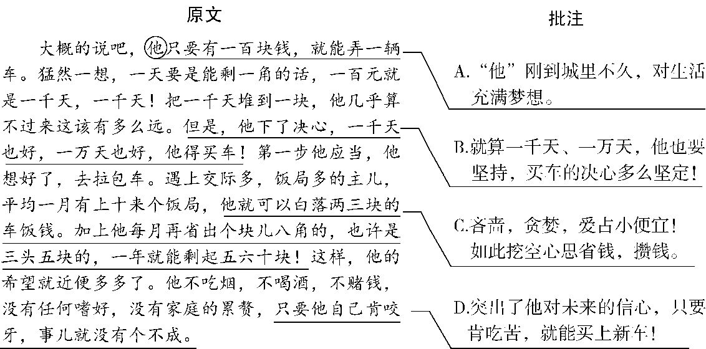
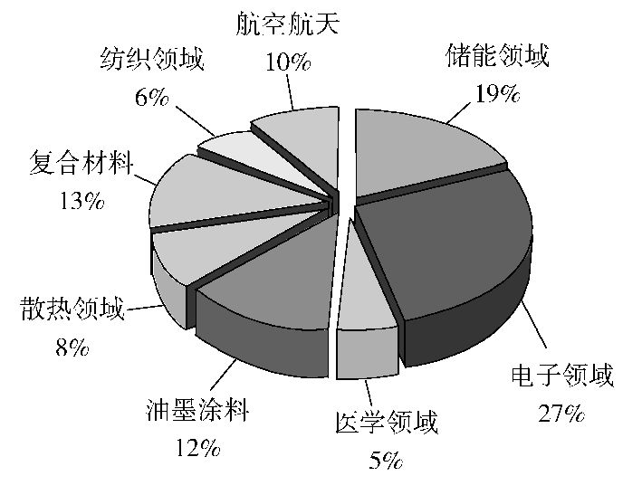

# 2019山东青岛语文试卷+答案+解析(word整理版)

> 📌 **试题标定**：山东省青岛市 | 2019年 | 中考模拟试题

---

| 232019年青岛市初中学业水平考试 (满分:120分　考试时间:120分钟) |
| --- |

## 一、积累及运用(20分)

1.下列各句中,加点字的注音和字形全都正确的一项是(3分)(　　)

A.绿茵茵的草地,踩在上面软软的,空气里弥(ní)漫着青草味儿,置身其中,我们仿佛回到了童年。

B.展览馆里,一只泥塑小猪半蹲在地上,眼珠瞥向一侧,嘴角露出狡黠(jié)的微笑,显得俏皮又灵动。

C.优秀的传统并不是静止不动的历史沉淀物,而是亘(ɡèn)古绵延的长流,这是不言而喻的。

D.北京世园会5G体验馆里,高清投影投射的画面上,老人笑脸上的褶(zhě)皱清晰可见,给人极大的视觉震憾。

2.下列各句中,加点成语使用不恰当的一项是(3分)(　　)

A.儿童剧《芝麻开门》剧情抑扬顿挫,台词诙谐幽默,受到现场观众的热烈称赞。

B.春天的公园,阳光明媚,草长莺飞,我们一家人徜徉其中,尽享美景。

C.在海军建军70周年阅兵式上,人民海军挥戈闯大洋,砺剑海天间,民族自豪感在我们心中油然而生。

D.先进文化理念是科技创新的思想源泉,科技创新推动文化产业转型升级,文化和科技是相辅相成的。

3.下列各句中,没有语病的一项是(3分)(　　)

A.原创节目能否获得市场成功和良好反响,关键是能从观众观看愿望中寻找契合点。

B.前不久,“中国品牌日”活动在上海举行,向全世界展示了中国产品的魅力。

C.面对停车难的问题,多管齐下的治理方式,让青岛的停车现状大为提升。

D.在大数据、人工智能等技术实现后,可以捕捉到用户心情、体温的变化,为用户提供更加个性化的服务。

4.根据提示默写诗文。(6分)

①《论语·学而》中曾子认为每天都要多次自我反省,其中“<u>　　　　　　　　</u>?”一句,是反省和朋友交往是不是能做到诚实守信。

②《次北固山下》中,“<u>　　　　　　</u>”一句,写出了春天潮水涨满后,江水浩渺,江面似乎与岸齐平的开阔景象。

③《左迁至蓝关示侄孙湘》中“<u>　　　　　　　　　</u>,肯将衰朽惜残年”两句,直接表明诗人心志:尽管自己已是衰朽残年,仍要为国家除去弊事。

④《酬乐天扬州初逢席上见赠》中表现出诗人豁达乐观胸怀的两句是“沉舟侧畔千帆过,<u>　　　　　　　　　</u>”。

⑤周敦颐在《爱莲说》中表达了“独爱莲”的情感,原因之一是莲“<u>　　　　　　　　</u>”,即莲虽经清水洗涤但不显得妖艳。

⑥《破阵子·为陈同甫赋壮词以寄之》中“马作的卢飞快,<u>　　　　　　　</u>”两句,描写了激烈的战斗场面,战马飞驰,弓弦雷鸣,万箭齐发。

阅读下面材料,完成5—6题。(5分)

近日,在某地铁站附近十字路口,市民过马路闯红灯,交警按规定处罚,责其现场观看交通安全宣传片。当地交警还对处罚方式进行了创新:违规者如果赶时间,可以选择发微信朋友圈,说明自己因闯红灯受处罚,只要集齐20个“赞”就可被放行。

这种“集‘赞’放行”的做法,引发了网友的激烈讨论。

赞成方:赞成。通过发朋友圈“自曝家丑”,不仅惩戒了本人,而且①<u>　　　　　　　　</u>,让大家以后都不闯红灯,比单纯处罚一个人效果更好。

反对方:反对。②<u> </u>

5.在①处补齐赞成方的理由,使上下文语意连贯。(2分)

答:<u> </u>

<u> </u>

6.在②处从不同角度为反对方补写理由。要求:语言简明,理由充分,言之成理。(3分)

答:<u> </u>

<u> </u>

<u> </u>

## 二、阅读(50分)

(一)诗词理解(6分)

阅读下面两首诗,完成7—8题。

送杜少府之任蜀州

王 勃

城阙辅三秦,风烟望五津。

与君离别意,同是宦游人。

海内存知己,天涯若比邻。

无为在歧路,儿女共沾巾。

峨眉山月歌

李 白

峨眉山月半轮秋,

影入平羌江水流。

夜发清溪向三峡,

思君不见下渝州。

7.下列对诗句的理解,不正确的一项是(3分)(　　)

A.“与君离别意,同是宦游人”意为“今天我与你分别,内心忧伤,无论是在京城的我,还是即将远赴蜀州的你,都是远离故土、在异乡为官的人”。

B.“海内存知己,天涯若比邻”意为“我们是心心相连的朋友,即使远在天涯海角,也如同比邻而居”。

C.“无为在歧路,儿女共沾巾”意为“在分别的路口,我虽想挽留你,却无能为力,只能默默无语,泪下沾巾”。

D.“峨眉山月半轮秋,影入平羌江水流”意为“船行平羌江上,半轮秋月高悬在峨眉山头,明月倒映在江水中,伴诗人远行”。

8.下列对两首诗的内容与情感的理解,不正确的一项是(3分)(　　)

A.《送杜少府之任蜀州》首联描写友人即将离京赴任蜀州,诗人遥望蜀地,视线却为风烟所遮,心头萌生淡淡的伤感。

B.《峨眉山月歌》描写了诗人乘船顺江而下所见之景,“峨眉山月”与诗人千里相随,触发了诗人对友人的思念之情。

C.《峨眉山月歌》后两句叙写诗人江上行船的旅程,表现了诗人离友人越远就越加思念的情感。

D.《送杜少府之任蜀州》和《峨眉山月歌》皆为离别而作,两首诗均充满了离愁别绪和难以释怀的悲戚之情。

(二)名著阅读(5分)

某位同学在阅读《骆驼祥子》的过程中做了文段批注和整本书的读书卡片,请仔细阅读,完成9—10题。

9.下面是这位同学做的文段批注,有误的一项是(2分)(　　)

10.下面是这位同学做的整本书的读书卡片,表述有误的一项是(3分)(　　)

读书卡片

作　品:《骆驼祥子》

作　者:老舍,原名舒庆春,被誉为“人民艺术家”。

主要情节:

A.祥子经过多年积攒,买上了一辆属于自己的新车,可是不久却被匪兵连人带车劫走。

B.祥子从匪兵处逃走,继续攒钱买车,车还没买上,钱又被孙侦探敲诈去了。

C.祥子与虎妞结婚后,用她的私房钱买下一辆车,虎妞因难产死去,祥子又只得卖掉车子料理丧事。

D.命运的三起三落打消了祥子买车的念头,他重新投奔刘四爷,老老实实赁车挣钱。

(三)文言文阅读(12分)

魏征,字玄成,魏州曲城人,有大志,通贯书术。

十年,为侍中。尚书省滞狱不决者,诏征平治。征处事以情,人人悦服。多病,辞职,帝曰:“公不见金①在矿何贵之有?<u>冶锻而为器</u><u>,</u><u>人乃宝之。</u>朕自比于金,以卿为良匠而加砺②焉。卿虽疾,未及衰,岂得便③尔?”

时上封事④者众,或不切事,帝厌之。征曰:“古者立谤木,欲闻己过。封事,谤木之遗也。陛下当任其所言,以彰得失。言而是,则为朝廷之益;非,亦无损于政。”帝悦,皆慰之。

帝宴群臣,曰:“贞观以前,从我定天下,玄龄功也;贞观之后,纳忠谏,正朕违⑤,征而已。”亲解佩刀,以赐二人。<u>帝尝问群臣</u><u>:</u><u>“</u><u>征与诸葛亮孰贤</u><u>?</u><u>”</u>岑文本曰:“亮才兼将相,非征可比。”帝曰:“征蹈履仁义,以弼朕躬,欲致之尧、舜,虽亮无以抗。”

(选自《新唐书》,有删改)

[注]　①金:金属。②砺(lì):磨砺。③便:安适。④封事:密封的奏章。⑤违:过失、错误。

11.下列句中加点词的解释,不正确的一项是(2分)(　　)

A.尚书省滞狱不决者,诏征平治　　狱:案件

B.古者立谤木,欲闻己过	谤:诽谤

C.陛下当任其所言,以彰得失	彰:揭示

D.征蹈履仁义,以弼朕躬	弼:辅佐

12.下列句中“以”的意义与例句相同的一项是(2分)(　　)

例句:征处事以情,人人悦服

A.策之不以其道(《马说》)

B.不以物喜,不以己悲(《岳阳楼记》)

C.寡人欲以五百里之地易安陵(《唐雎不辱使命》)

D.近岸,卷石底以出(《小石潭记》)

13.下列句子与文中“封事,谤木之遗也”句式相同的一项是(2分)(　　)

A.何陋之有(《陋室铭》)

B.望之蔚然而深秀者,琅琊也(《醉翁亭记》)

C.蒙辞以军中多务(《孙权劝学》)

D.此人一一为具言所闻,皆叹惋(《桃花源记》)

14.下列对选文相关内容的理解,不正确的一项是(2分)(　　)

A.魏征因多病辞职,皇帝以金属自比,要求魏征做“良匠”对他加以磨砺。

B.魏征劝谏皇帝,想要知道自己的得失,就要广泛听取意见,让臣子们畅所欲言。

C.皇帝认为房玄龄助他平定天下,魏征纠正他的过失,他们都是国家功臣,于是解下佩刀赐给二人。

D.上至皇帝,下至群臣,都认为魏征践行仁义,尽心辅佐,才干超过诸葛亮。

15.将文中画线句子翻译成现代汉语。(4分)

(1)冶锻而为器,人乃宝之。(2分)

译文:<u> </u>

(2)帝尝问群臣:“征与诸葛亮孰贤?”(2分)

译文:<u> </u>

(四)现代文阅读(9分)

“黑金”石墨烯

①北京时间2018年12月19日零时,顶尖学术期刊英国《自然》杂志发布了2018年度影响世界的十大科学人物排行榜,中国22岁的青年学者曹原名列榜首。曹原发现:当两层平行石墨烯旋转成约1.1°的微妙角度时,就会产生神奇的超导效应。把平行的两层石墨烯旋转成约1.1°的“魔角”并不容易,需要很多次试错,但曹原总是很快就能操作成功。因此,《自然》杂志称曹原为“石墨烯驾驭者”。

②石墨烯是什么呢?它是一种二维晶体,是目前已知的最薄、强度最高、导电导热性能最强的新型纳米材料,被称为“黑金”,是一种有“新材料之王”之称的奇迹材料。它看似神秘,实际上,<u>石墨烯一层层叠起来就是石墨</u><u>,1</u><u>毫米厚的石墨大约包含</u><u>300</u><u>万层石墨烯。铅笔在纸上轻轻划过</u><u>,</u><u>留下的痕迹就可能是几层石墨烯。</u>它本来就存在于自然界,只是难以剥离出单层结构。

③石墨烯优异的物理性质使它在很多领域展现出巨大的应用潜力。尽管石墨烯还没有实现大规模的产业化,但是人们对石墨烯的应用前景十分看好。目前的研发成果显示,石墨烯已广泛应用于多个领域。(如右图)

④由于应用广泛,业内预计未来5至10年全球石墨烯产业规模会超过1000亿美元,更有乐观者认为,石墨烯的市场潜在规模在万亿美元以上。就目前情况来讲,石墨烯市场化的最大阻碍是需求和价格。石墨烯的未来产业化之路还很长,需要资金的支持和研发人员的开拓创新。

⑤近年来,我国各级政府对石墨烯的重视程度都在日益提高。随着国家利好政策的不断出台,市场需求的不断增加,石墨烯的应用领域会越来越广阔。与西方发达国家相比,中国对石墨烯的研究起步较晚,但通过科研人员孜孜不倦的努力,相信在不久的将来,石墨烯材料将以其优异的性能及超高的性价比在各个领域大放光彩。

(摘编自《22岁在读博士生荣登&lt;自然&gt;杂志全球十大

科学人物榜首》《石墨烯应用领域及前景浅析》

《石墨烯在涂料领域中的应用研究概况》)

16.根据原文内容,下列理解不正确的一项是(3分)(　　)

A.曹原发现了石墨烯“魔角”,《自然》杂志把他评为2018年度影响世界十大科学人物之首。

B.石墨烯被称为“新材料之王”,是目前已知的最薄、强度最高、导电导热性能最强的新型纳米材料。

C.文中图表显示,石墨烯可以应用在诸多领域,其中在电子和储能领域应用最为广泛。

D.由于拥有广泛的应用领域,近年来,石墨烯在全球的产业规模已经超过1000亿美元。

17.下列对文章写作特点的分析,不正确的一项是(3分)(　　)

A.第①段介绍曹原的研究成就巨大,令人振奋,引发了读者的阅读兴趣。

B.文章采用了画图表的方式介绍石墨烯广泛的应用领域,直观清晰。

C.第②③④段按照逻辑顺序介绍了石墨烯的特性、应用领域和应用前景。

D.本文把石墨烯比作“黑金”,语言形象,说明它与黄金具有相同的物理性质。

18.请仔细阅读第②段中画线句子,回答下面问题。(3分)

石墨烯一层层叠起来就是石墨,1毫米厚的石墨大约包含300万层石墨烯。铅笔在纸上轻轻划过,留下的痕迹就可能是几层石墨烯。

以“1毫米”和“300万层”的巨大反差,凸显了石墨烯怎样的特点?为什么又要以“铅笔在纸上轻轻划过”为例来说明?

答:<u> </u>

<u> </u>

<u> </u>

(五)现代文阅读(18分)

一针一线皆关情

蔡勋建

①父亲常说“做出衣裳的是针线”,按说这没有什么创意,但从一名乡间职业裁缝口中说出,却有权威性和说服力。父亲一生以裁缝为业,受乡亲敬重,行走乡间方圆二三十里,甚至跨出湘鄂边界为人缝制衣裳。

②他十二三岁拜师学裁缝,头年多半时间给师父家挑水打柴干家务活,渐渐地开始学缝扣眼、绞襻①子、钉扣子。翌年学习缝制衣服,第三年开始学绗②棉做棉衣,最后学剪裁。师父手艺高超,很严厉,连立身坐姿、穿针引线也有规矩,弄不好便举起尺子打过来。父亲说,他没少挨师父训罚,怎样打罚都必须忍着,熬过了三年,便有出头之日了。三年后他便提着裁剪刀行走乡里,独当一面,还真是多亏了师父的言传身教。

③在我的记忆深处,父亲有些绝活儿。

④父亲没学过美术绘图,可他裁布料用画粉时,总是从容果断,绝不拖泥带水。画线时用的是画粉袋,一条纱线从装有画粉的小布袋里左贯右出,其原理与木匠的墨斗无异。比如绗棉衣棉裤,父亲在铺好絮棉的布面上,<u>左手捏着画粉袋口</u><u>,</u><u>将线头置于棉裤一端</u><u>,</u><u>右手拉粉线</u><u>,</u><u>再用右肘根压住粉线另一端</u><u>,</u><u>右手拇指食指拈起粉线</u><u>,</u><u>轻轻一弹</u><u>,</u><u>不偏不倚完成一条白线。</u>如此反复,他的徒弟再照线举针绗棉。

⑤父亲擅长做开襟衣衫,他最得意的是做得一手漂亮盘扣。男服多用蜻蜓扣、春蚕扣(也叫一字扣),女服多用蝴蝶扣、菊花扣,还有男女通用的琵琶扣、树枝扣。一个个蜻蜓头,一对对蝴蝶结,公扣母扣,结对成双。这种衣服全用布扣,杜绝塑料扣子或有机玻璃扣子,着实漂亮。

⑥父亲喜欢在左胸前袋口插上一支钢笔,不过这笔大抵在算账立据时才派上用场。父亲有“两不记”:一是收人布料不记,客户来料,只要说明你要做什么衣服什么样式,他随手往那衣料堆里一放,绝不会张冠李戴;二是量体裁衣,他拿皮尺在来人身上左一拉右一扯,嘴里念叨着,只量体并不当面记录,也不开制衣单,顾客按期取衣,从不出错。

⑦他的裁缝工具很简单,裁剪刀、竹尺、皮尺、画粉、手针、顶箍,再就是熨斗。父亲剪裁时轻松自如,用剪吃布很干脆——咔哧,咔哧,咔哧,<u>这像极了农夫耕田犁地</u><u>,</u><u>当犁尖插入土地</u><u>,</u><u>只听得一声吆喝</u><u>,</u><u>那黑色土壤便顺着犁头往右翻去。</u>咔!最后一声特别干脆,听起来很果断,那肯定是剪刀将出,剪断布头了。

⑧剪裁用的案板是杉木的,那案面上有许多凹坑,密密麻麻。有次我看到父亲握着剪刀,在画有纵横交错线条的布面上,让剪刀随意地疾走,剪刀在案面上发出“咚咚咚”的声响,顿一下,布面一个窝,案板上一个坑。我揣测这种“停顿”绝不是率性而为,一定是有讲究的,应该是父亲为后来的缝纫制作留下的暗记,比如打褶、留岔什么的。案板上留下的“记号”,让我长久思索……

⑨除了在家等客上门做衣,很多时候是做“乡工”,也称“上门工”。这种方法是按天计收工钱,东家只管三顿饭,不需一件件算钱。但父亲并没有因此懈怠,只管埋头干活。平常东家客气,也有上烟上酒的,可父亲从来不沾,只吃些茶饭。

⑩早年,父亲行走乡里一直是手工制作,后来母亲加盟。不久有了缝纫机,一台“蝴蝶”牌缝纫机与他们“白头偕老”。父亲担纲剪裁,母亲负责缝制,从此父母同出同归。小时候我还没念书,就经常随父母去做“上门工”。一大早,东家挑一副挑子走在前头,一头是缝纫机头,一头是机脚,我紧跟父母在后,父亲说我从小就随他吃“百家饭”。

在乡间,这个行业有个笑话段子:“裁缝不落布,穿个冒裆裤。”少时我不解,便问父亲何意,父亲笑了,告诉我意思是说,如果哪个裁缝不留下布头,那他肯定穿着个没有裤裆的裤子。父亲从来不做那种“贪墨”糗事,每上门做完一家的衣服,他就将剩下的布头交给东家;若是在家,每做好一件衣服,他也将剩下的边角布料扎成一绺,塞进衣主的新衣荷包里。衣主自然高兴,因为这些边角布料又可去做千层布鞋底。

父亲从事职业裁缝五十年,他从手工到机制,见证了民间服装的演变发展,亲自经历了这些服装的全部制作过程。父亲就像一枚绗针,行走乡间,缝紧了乡情,缝暖了家庭,缝美了生活。

(选自《人民日报》2019年5月1日第8版,有删改)

[注]　①襻(pàn)子:用布做的扣住纽扣的套。②绗(hánɡ):缝纫方法,用针线固定面儿和里子以及所絮的棉花等。

19.作者说“在我的记忆深处,父亲有些绝活儿”,父亲有哪些绝活?请结合文章内容分条概括。(4分)

答:<u> </u>

<u> </u>

<u> </u>

20.结合文章内容,简要分析第②自然段在文中的作用。(4分)

答:<u> </u>

<u> </u>

<u> </u>

21.赏析文中画线句子。(6分)

(1)左手捏着画粉袋口,将线头置于棉裤一端,右手拉粉线,再用右肘根压住粉线另一端,右手拇指食指拈起粉线,轻轻一弹,不偏不倚完成一条白线。(3分)

答:<u> </u>

<u> </u>

<u> </u>

(2)这像极了农夫耕田犁地,当犁尖插入土地,只听得一声吆喝,那黑色土壤便顺着犁头往右翻去。(3分)

答:<u> </u>

<u> </u>

<u> </u>

22.文章的标题“一针一线皆关情”,如果换为“一位行走乡间的裁缝”是否可以?请结合全文说说你的理由。(4分)

答:<u> </u>

<u> </u>

<u> </u>

<u> </u>

## 三、写作(50分)

23.从以下两题中任选一题,完成作文。

(1)半命题作文

一份约定,或关乎友谊,或关乎亲情,或关乎过往,或关乎未来……你曾经与谁约定?又将这份约定镌刻在何处?

请以“镌刻在<u>　　　　　</u>的约定”为题,写一篇文章。

要求:①先将题目补充完整,然后作文;②写一篇600字左右的记叙文,力求写出真切体验与独特感受;③文中不得出现真实的校名与人名。

(2)自命题作文

阅读下面的文字,按要求作文。

童话大王郑渊洁去参加笔会,有位作家在发言时,大谈自己读了很多书,此人在说完一位外国作家的书后,问郑渊洁:“你知道这本书吗?”郑渊洁摇了摇头说:“不知道。”

世界那么大,知识那么多,谁都不可能全知道。“说‘不知道’”体现了一种态度、一种品质、一种精神、一种胸怀……

请你结合自己的经历或感悟,自拟题目,自选文体(诗歌、戏剧除外),写一篇600字左右的文章,文中不得出现真实的校名与人名。

|  |
| --- |
| 232019年青岛市初中学业水平考试(参考答案) |

1.C　本题考查辨析字音、字形的能力。A.“弥”读mí。B.“黠”读xiá。D.“震憾”应写作“震撼”。

2.A　A.“抑扬顿挫”是指(声音)高低起伏和停顿转折,此处用于形容剧情不合适。可用“跌宕起伏”,“跌宕”指音调抑扬顿挫或文章富于变化,“跌宕起伏”形容事物多变,不稳定,也形容文学作品的故事情节曲折动人。B.草长莺飞:形容春回大地,万物复苏的景象。C.油然而生:不知不觉、自然而然地产生(某种情感)。D.相辅相成:互相补充,互相配合。

3.B　本题考查病句的辨析能力。A项,两面对一面,可将“关键是能”改为“关键是能否”,或者将“能否”改为“要”。C项,搭配不当,“现状”与“提升”不搭配,应将“提升”改为“改善”。D项,主语残缺,应删去“在”和“实现后”。

4.

答案　①与朋友交而不信乎　②潮平两岸阔　③欲为圣明除弊事　④病树前头万木春　⑤濯清涟而不妖　⑥弓如霹雳弦惊

解析　本题考查诗文默写能力。③④⑥可根据给出的上句或下句直接填空,①②⑤根据“反省和朋友交往是不是能做到诚实守信”“江面似乎与岸齐平”“莲虽经清水洗涤但不显得妖艳”等提示语即可得出答案。注意“弊”“濯”“清涟”“霹雳”等字词的写法。

5.

答案　朋友圈的好友都受到了教育和提醒

解析　本题考查语言表达连贯的能力。“集‘赞’放行”的做法是将违规者闯红灯受处罚的事情发送至其微信朋友圈,让其朋友知道闯红灯会受到处罚。“不仅……而且……”是一组表递进关系的关联词,“不仅”连接的是“惩戒了本人”,“而且”连接的内容就应该和朋友有关,可以是“教育”“提醒”“警醒”“警示”等,所写语句要和上文相衔接。

6.

答案　通过发朋友圈“自曝家丑”,让个人的隐私公布于好友之间,会伤害当事人的自尊,会影响当事人的人格品质,给当事人造成不必要的麻烦或伤害。

解析　本题考查语言表达简明、准确的能力。微信是一种社交工具,发微信朋友圈,微信好友就会看到所发内容。闯红灯被处罚毕竟不是光荣的事,而把自己的错误公布于朋友面前,会伤害自尊,影响朋友对自己的看法。另外,闯红灯被处罚是个人隐私,个人有权决定是否要发朋友圈,而不应被交警当成处罚的方式。题干要求为反对方补写理由,围绕这种做法的负面影响,组织语言进行阐述即可。

7.C　本题考查对诗句内容的理解能力。“我虽想挽留你,却无能为力”错误,“无为”的意思是“无须、不必”,这两句诗的意思是“不要在岔路口上分手之时,像恋爱中的青年男女那样悲伤泪啼沾湿衣巾”。

8.D　本题考查对诗歌内容与情感的理解能力。“皆为离别而作”错误,《峨眉山月歌》不是为离别而作,而是李白出蜀游历天下时途中所作;“充满了离愁别绪”“悲戚之情”错误,《送杜少府之任蜀州》一改往昔送别诗中悲苦缠绵之态,体现出诗人高远的志向、豁达的情趣和旷达的胸怀。

9.C　本题考查对名著内容的理解能力。此处是祥子为买车筹划怎样省钱、攒钱,并不是“吝啬,贪婪,爱占小便宜”。

10.D　本题考查对名著情节内容的识记能力。“他重新投奔刘四爷,老老实实赁车挣钱”错误,祥子在接连遭受生活的打击后,并没有重新投奔刘四爷,而是开始丧失对生活的所有希望和信心,不再像从前一样以拉车为骄傲,变得厌恶拉车,厌恶劳作。被生活捉弄的祥子开始游戏生活,吃喝嫖赌。为了喝酒,祥子到处骗钱,堕落为“城市垃圾”。最后,靠给人办红白喜事、做杂工维持生计。

11.B　本题考查对文言实词的理解能力。谤:公开批评、指责别人的过失。

12.A　本题考查对文言虚词的理解辨析。“以”在例句和A项中都是介词,按照。B项,介词,因为。C项,介词,用,拿。D项,连词,表承接关系。

13.B　由“……,……也”的句式可知例句是判断句。A项是宾语前置句,B项是判断句,C项是状语后置句,D项是省略句。故选B项。

14.D　本题考查对文章内容的理解能力。“上至皇帝,下至群臣,都认为魏征……才干超过诸葛亮”错误,由原文“岑文本曰:‘亮才兼将相,非征可比。’帝曰:‘征蹈履仁义……虽亮无以抗。’”等信息可以看出群臣并不都认为魏征才干超过诸葛亮。

15.

答案　(1)(金属)经过冶炼锻造成为武器(器具、工具),人们就把它们当宝贝一样看待。

(2)皇上曾经询问所有大臣:“魏征和诸葛亮比,哪个更贤能?”

解析　本题考查文言语句的翻译能力。翻译文言语句要根据“信”“达”“雅”的原则,逐字逐词进行翻译。(1)句中要注意“宝”的翻译,此词在这里是名词作动词,意思是“以……为宝”;(2)句中要注意“尝”“孰”的翻译。

[参考译文]

魏征,字玄成,是魏州曲城人,有远大的志向,通晓经典书籍和方术。

贞观十年,任侍中。当时尚书省有些久拖不决的案件,(太宗)下诏让魏征审理。魏征凭原则照实处理案件,人人都心悦诚服。因多病提出辞职。太宗(不答应,)说:“你难道没见过金属如果只是在矿中,有什么宝贵的呢?(金属)经过冶炼锻造成为武器(器具、工具),人们就把它们当宝贝一样看待。我把自己比作金属,把爱卿你当作好的工匠来磨砺我。你虽然有病,还没有到衰老(的地步),怎能让你(就这样辞职)过安适的日子呢?”

当时上密封奏章谏言的人很多,有的(谏言内容)与事实不符,唐太宗很厌恶。魏征(对太宗)说:“古代有人立谤木,(让人在上面写谏言,)想要了解自己的过失。密封的奏章,应该是谤木的传承。皇上您应该任由他们畅所欲言,来使自己的得失更加明显。如果对方说的对,那么就对朝廷有益处;如果不对,也对政务没有什么坏处。”太宗(听完)很高兴,就都奖励了上密封奏章谏言的那些人。

太宗设宴招待众位大臣,说:“贞观之前,跟随我平定天下,是房玄龄的功劳;贞观之后,提出忠正的意见,纠正我的过失,那就只有魏征了。”亲自解下佩刀来赐给二人。太宗曾经询问大臣们:“魏征和诸葛亮相比,哪个更贤能?”岑文本说:“诸葛亮兼有将相的才华,不是魏征可以相比的。”太宗说:“魏征履行仁义之道,来辅佐我,想使我成为尧、舜那样的君主,即使是诸葛亮也没有办法(和他)匹敌。”

16.D　本题考查对文章内容的理解能力。“石墨烯在全球的产业规模已经超过1000亿美元”错误,原文是“业内预计未来5至10年……会超过1000亿美元”,并非已经超过,D项把未然说成已然。

17.D　本题考查对文章写作特点的分析能力。由第②段第2句可知,石墨烯之所以被称为“黑金”,是因为它是“目前已知的最薄、强度最高、导电导热性能最强的新型纳米材料”,它并不是一种贵金属,与黄金的物理性质并不相同。

18.

答案　凸显了石墨烯目前已知的最薄的纳米材料特点。用铅笔划过的例子是因为铅笔是我们日常学习中最常用的物品,人们对它非常熟悉,用它的划痕来再次说明石墨烯的薄,更易让人理解,更易让人想象,甚至更会让人惊叹石墨烯的神秘。

解析　第②段介绍了石墨烯是什么,指出了它“最薄、强度最高、导电导热性能最强”的特点。画线语句使用了列数字的说明方法,说明了石墨烯“最薄”的特点。而铅笔是生活中的常见物品,用它来说明石墨烯“最薄”的特点,显得通俗易懂,更便于读者理解。

19.

答案　①用画粉画线的绝活;②做得一手漂亮盘扣的绝活;③“两不记”的绝活;④裁剪与案板结合的绝活。

解析　本题考查对文章内容的梳理概括能力。“在我的记忆深处,父亲有些绝活儿”这句话是文章的第③自然段,这段起领起下文的作用,从第④自然段开始介绍父亲的绝活儿,第⑨自然段则开始写父亲怎样外出给人做衣,所以第④—⑧自然段的内容是写父亲的绝活儿。结合第④自然段“裁布料用画粉”、第⑤自然段“他最得意的是做得一手漂亮盘扣”、第⑥自然段“父亲有‘两不记’”、第⑧自然段“我揣测这种‘停顿’绝不是率性而为,一定是有讲究的,应该是父亲为后来的缝纫制作留下的暗记”等语句,即可得出答案。

20.

答案　第②自然段在结构上有承上启下的过渡作用。在内容上,它是全文作者叙事的线索和总纲,使文章叙事清晰,主旨鲜明突出。

解析　本题考查分析文中段落作用的能力。第①自然段总起全文,介绍了父亲的身份是裁缝,行走乡间为人缝制衣裳。第②自然段写父亲拜师学裁缝的经历,从第③自然段开始写父亲作为裁缝的绝活儿。由此可见,第②自然段起到了承上启下的作用。再从内容方面分析第②自然段在叙事和主旨上的作用。

21.

答案　(1)该句使用动作描写,详尽展示了父亲用画粉画线的完美过程。一举手、一投足中将父亲的高超技艺勾画得栩栩如生,给人如在眼前的立体感;而且言语间也透露出对父亲的敬仰和骄傲。

(2)这句使用比喻修辞,把父亲的裁剪比作农夫的耕地,既贴切生动,又充满乡村的泥土气息。同时也是对两种劳动的赞美和歌颂。

解析　本题考查对文章语言的赏析能力。赏析文章语言,首先要确定赏析的角度。(1)写父亲用画粉画线时的动作,所以应从动作描写的角度入手分析,通过“捏”“拉”“压”“拈”“弹”等动词,表现了父亲用画粉画线的技术之娴熟;(2)从“像”这一关键词可看出使用了比喻的修辞手法,所以应从比喻的修辞手法的角度进行赏析。结合内容进行分析后,再组织语言作答即可。

22.

答案　不可以。

原标题充满诗情画意,又照应和突出了文章主题。作者不光记叙父亲“一针一线”的绝活,更通过父亲的手艺表达了父亲不仅技艺高超,而且人格高尚。他的劳动不仅是劳动,更关乎亲情、乡情、对美好生活的向往之情。

解析　本题考查赏析文章标题作用的能力。文章的原标题既通过“针”“线”暗指了父亲的身份和文章的主要内容,又通过“关情”表达了文章的主旨,而且这种命题形式与古诗句相似,富有文采。而标题“一位行走乡间的裁缝”则仅仅交代了文章的主要人物,无论在内容还是形式上都比原标题逊色不少。

23.(1)[写作指导]　这是一道半命题作文题。提示语中已经给出了选材范围——友谊、亲情、过往、未来……考生可以从生活中选择这几个方面的典型事例,在叙述的过程中要先交代清楚约定对象是谁,再写约定的具体内容以及做出这个约定的原因和结果。最后“以小见大”,将主题升华到友情、亲情等上。在具体写作过程中,首先要把标题补充完整,然后运用合适的叙述手法进行写作,可以采用顺叙、插叙等方式。约定的对象可以是人,也可以是物,但不论是哪一种,都要写出约定对象的价值,因为只有有价值的东西才值得镌刻。

[例文]

镌刻在书架上的约定

搬来梯子,小心翼翼地将他从书架的最高处取下,我用手轻轻拂去他身上的灰尘,发现他已悄然泛黄。但没关系,因为我还记得我们之间的约定。

他还会记得那年他和我的约定吗?

五年前,他悄然来到我的身边。黄棕色的外表,有着一种莫名的吸引力,我抑制不住自己的好奇心,便把他翻开静静阅读。

旅游,是我非常喜欢的,对我来说也是一件快乐的事,可为什么这个作者却要把他写成苦旅呢?没有华丽的辞藻,文章的深度却丝毫不减,我静静地听他娓娓道来,感受到了那深邃苍凉的历史和他对中华大地深深的依恋。

其实,十岁的我已经能够理解字面上的意思,可是总感觉他还表达了什么深刻的意义,而我却未能领悟。

十岁的我便和他有了一个约定,既然十岁的我无法理解,那么五年之后再来看你,五年的阅历应该可以将你完全读懂了吧。

搁置了五年,现在我再次将他拾起。

和五年前一样,最喜欢的还是《道士塔》。不过,五年前的我只是觉得作者写的是一些我看不懂的历史。当我再次读起他,才发现这是作者对民族屈辱历史的感叹,对愚昧的中国道士乃至一切卖国者的批判,对中国古代灿烂文化被毁的悲哀,以及对王圆箓这个“敦煌石窟的罪人”的痛苦反思。现在,我完全融入这不曾了解过的历史之中,不由得与作者一起恨、一起悲叹。

在我看过的书中,很少有作者能把自己的游记和所游地区的历史联系得如此恰到好处。这一文化之旅领着我踏遍祖国的大江南北,让我领略着大自然的美好风光,深思着中国文化的发展历程。

感谢五年前的那个约定,让我再次读他、了解他,倘若当年我没读懂就草草了事,或许就一直不懂作者所要表达的真谛吧!

他,就是《文化苦旅》。

“几位记者在报纸上说我写书写得轻松潇洒,其实完全不是如此。那是一种很给自己过不去的劳累活,一提笔就感觉到年岁徒增。不管是春温秋肃,还是大喜悦大悲愤,最后总得要闭一闭眼睛,平一平心跳,回归于历史的冷漠,理性的严峻。”这是余秋雨教授为《文化苦旅》所写自序中的一段话。

我深知对于一本书的尊敬就是要懂得作者想表达的意思,而不是看完之后什么都不思考就过去了。这难忘的约定,教会我的不仅仅是这一本书的道理,更是怎样领会文学作品的真谛。

[点评]　本文选材贴近生活,构思新颖,结构严谨,语言简洁质朴。作者开篇设置悬念,并不直截了当地交代约定的对象是谁,而是以“他”代指,给人一种“犹抱琵琶半遮面”之感,引人入胜。随着叙述的展开,作者才渐渐地揭开其神秘的面纱——《文化苦旅》,并把他当作自己的挚友甚至人生导师,运用对比的手法将自己对他前后不同的理解表达出来。这种变化不仅是知识的积累,更是对文学作品真谛的领悟,深化了文章主题。

(2)[写作指导]　对于材料作文题,首先要理解材料表达的中心思想,围绕中心思想来立意、构思。本题的材料只简单陈述了童话大王郑渊洁坦诚回答自己“不知道”的经历,并且题目中给出了“世界那么大,知识那么多,谁都不可能全知道”的结论,从而指出“说‘不知道’体现了一种态度、一种品质、一种精神、一种胸怀……”由此可见,文章可围绕“知之为知之,不知为不知”展开,可结合自己的经历和感悟进行选材,体现敢于说不知道、不自欺欺人的做人道理。

文章既可以借助有说服力的论据写成观点明确、论证有力的议论文;也可以借助生活中与“勇于承认自己不知道”或“不懂装懂带来的尴尬”相关的真实经历,写成内容充实、主题突出的记叙文,表达自己从中得到的感悟。当然,写成哲理散文也不失为一种选择,注意需兼顾情、理、文的表达。

[例文]

勇敢地说“不知道”

央视《东方之子》栏目曾对诺贝尔物理学奖获得者丁肇中进行过一次专访。在访谈过程中,丁教授却说了多个“不知道”,当记者问及丁教授的多个“不知道”时,丁教授回答说:“是不知道的,你不能说知道,知道就是知道,不知道就是不知道。”

这不禁让人联想到了孔子曾经说过的一句话:“知之为知之,不知为不知,是知也。”

反之,不懂装懂则是不明智的。

在日本,曾经有一个叫清藏的人。一天,他和朋友们在草丛中发现了一只白兔,一个朋友说:“看,这儿有一只兔子死了。”清藏听朋友这么说,立刻捂住鼻子说:“怪不得我闻到一股臭味。”话音未落,兔子突然跑开了,他的朋友非常吃惊:“原来它是在睡午觉!”清藏立即说:“怪不得我刚才看见它耳朵在动,我心里还正觉得奇怪呢!”

后来,日本人就把那些不懂装懂,随声附和的人称为“清藏的白兔”。

可见,不懂装懂不仅是不明智的行为,有时还会成为别人的笑柄。

在科学上,我们需要有严谨的态度,“差之毫厘,谬以千里”。当你对着别人“猜”出某一个不知对错的言论时,你或许意识不到将来某一天这一“猜”所带来的后果,但如果他人依照你的言论去尝试,有可能与成功擦肩而过。

在学习上,我们更不能这样。记得在小学六年级时,有一次老师讲解完一道题后说:“会了这道题的同学请举手,不会的同学下课后到我的办公室来,我再给你们讲一遍。”我环顾四周,发现周围的人都举起了手,我犹疑着,最终还是将手举了起来,尽管这道题我并不会做。

过了几天,老师发下了单元测试卷,我惊奇地发现那道题竟然出现在测试卷上。我慌忙将其他的题写好,以便节约时间来思考它,但直到考试结束的铃声响起,那道题的答案处仍是空白!

我庆幸,这只是一次小考,但我也知道了我要改正的是什么。

我想,无论在学业上还是生活中,我们都要“知之为知之,不知为不知”。这,或许是我们成功路上的一辆车,助我们走得更远更快……

[点评]　文章从央视《东方之子》对丁肇中的采访写起,联想到孔子的名言“知之为知之,不知为不知”,所选取的素材切合主题。进而又从反面出发,写“清藏的白兔”,点明“不知道”所体现的态度。并且根据作文题目的要求“结合自己的经历”,又举了自己在学习上因没有做到“知之为知之,不知为不知”而后悔的例子。段与段之间衔接紧密,一气呵成,语言平实,且选取的素材多样,足见其知识面之广,最后结尾用富含哲理的语言升华了中心,突出了主题。

|  |
| --- |

