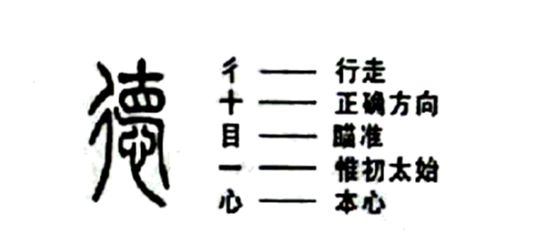
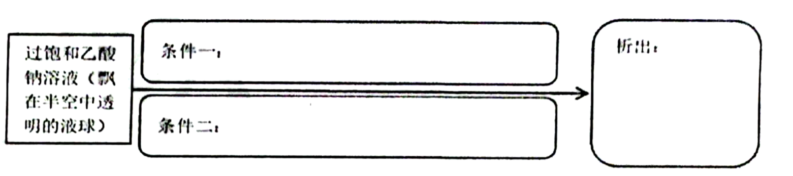

# 2022年山东省青岛市市南区中考一模语文试题（解析版）

> 📌 **试题标定**：山东省青岛市市南区 | 2022年 | 中考一模

---

<b>2021-2022学年度第二学期阶段性学业水平质量检测</b>

<b>九年级语文试题</b>

<b>（考试时间：120分钟；满分：120分）</b>

<b>说明：</b>

<b>1</b><b>.</b><b>本试题共三道大题，含24道小题。1—7小题“积累与运用”，8—23小题 “阅读”， 24小题“写作”。</b>

<b>2</b><b>.</b><b>所有题目均在答题卡上作答，在试题上作答无效。</b>

<b>一、积累与运用【本题满分20分】</b>

1. 下列各句中，加点字的注音完全正确的一项是（   ）

A. 一座草顶、竹篾（niè）泥墙的小屋出现在梨树林边。

B. 《清明上河图》采用兼工带写的手法，线条遒劲（jìn），笔法灵动。

C. 那轻，那娉（pīng）婷，你是，鲜妍，百花的冠冕你戴着。

D. 三妹怂（cǒng）恿着她去舅舅家拿了一只浑身黄色的小猫来。

【答案】C

【解析】

【详解】本题考查字音。

A.竹篾（niè）—— miè；

B.遒劲（jìn）——jìng；

D.怂（cǒng）恿——sǒng；

故选C。

2. 下列各句中，加点字的字形完全正确的一项是（   ）

A. 祖父好，在路上轻易不谈渥旋的事情，倒是一路谈着进京赶考的掌故。

B. 雪花火炬、折柳寄情等精彩环节让北京冬奥会开闭幕式高潮叠起。

C. 让那些看不起民众的人去赞美那直挺秀崎的楠木吧，我要高声赞美白杨树。

D. 融雪处裸露出大山黧黑的骨骼，有如刀削一般，富有雕塑感。

【答案】D

【解析】

【详解】本题考查字形。

A.渥旋——斡旋；

B.叠起——迭起；

C.秀崎——秀颀；

故选D。

3. 下列句子中加点的词语使用不恰当的一项（   ）

A. 

了这一刻，面对技术封锁，多少人殚精竭虑，青丝变白发，却无怨无悔。

B. 人们有的坐火车，有的驾车，参差不齐地赶来等待这位大师的接见。

C. 闻先生的书桌凌乱不堪，他却并不在意，他正向古代典籍钻探，兀兀穷年，沥尽心血。

D. 过去见一位作者外出写生，两个礼拜就画了一百多张，这当然只能浮光掠影。

【答案】B

【解析】

【详解】本题考查词语运用。

A.殚精竭虑：使尽了精力，费尽了心思。本句用来形容人们费尽精力攻克技术难关，使用恰当；

B.参差不齐：形容水平不一或很不整齐。本句用来形容人们用不同的方式赶来，使用不恰当；

C.兀兀穷年：用心劳苦地一年到头这样做。本句用来形容闻先生长年辛苦工作，使用恰当；

D.浮光掠影：意思是像水面的光和掠过的影子一样，一晃就消逝。比喻观察不细致或印象很不深刻。也比喻世事稍纵即逝，不可捉摸。本句用来形容一位作者作画时不细致，使用正确；

故选B。

4. 下面句子没有语病的一项是（   ）

A. 落实粮食安全责任的首要任务是：能否稳定粮食播种面积。

B. 小说中那种激情四射雄辩滔滔的精神让他沉醉，他觉得自己太缺少激情了。

C. 在发明文字以前，保存智慧不但靠记忆；文字发明以后，而且使用了书籍。

D. 丰富多彩的节日习俗，激发了文人们的灵感，他们由此创作了无数名篇佳作。

【答案】D

【解析】

【详解】本题考查病句辨析。

A.一面对两面，应删掉“能否”；

B.搭配不当，“精神”可改为“语言魅力”；

C.关联词语运用不当，可删掉“不但”，把“而且”改为“则”；

故选D。

5. 根据提示默写诗文

①刘禹锡在《酬乐天扬州初逢席上见赠》中“_________________________，__________________________。”一句，表现出诗人面对世事的变迁和仕宦的升沉的豁达襟怀。

②岑参《白雪歌送武判官归京》“_____________________________，_____________________________。”一句中，以春花喻冬雪，给萧条寒冷的边塞平添无限温暖与希望。

③杜甫《春望》一诗中，表达安史之乱时，消息隔绝、久盼家人音讯不至时迫切心情的句子是：“_____________________________，_____________________________。”

④晏殊在《浣溪沙·一曲新词酒一杯》中既感慨繁华易尽，又表达旧识重来的欣喜的诗句是：“_____________________________，_____________________________。”

⑤辛弃疾在《南乡子·登京口北固亭有怀》中赞扬孙权年少有为，不畏强敌，并战而胜之的句子是：“_____________________________，_____________________________。”

⑥《虽有嘉肴》中，说明学习和教学之后能够让人发现自身不足和困惑的句子是：是故_____________________________，_____________________________。

【答案】    ①. 沉舟侧畔千帆过    ②. 病树前头万木春    ③. 忽如一夜春风来    ④. 千树万树梨花开    ⑤. 烽火连三月    ⑥. 家书抵万金    ⑦. 无可奈何花落去    ⑧. 似曾相识燕归来    ⑨. 年少万兜鍪    ⑩. 坐断东南战未休    ⑪. 学然后知不足    ⑫. 教然后知困

【解析】

【详解】本题考查名句名篇默写。注意易错字词：畔、梨、烽、抵、曾、兜、鍪、断。

6. 汉字是一种由图形演变而来的表意文字。下图是对古体“德”字的每一部分的解释。请根据下图，解释“德”的含义。（20字以内）

【答案】向着正确的方向（方向正确的前进 、瞄准正确的方向）行走，按照本心去做事情（不忘初心）。

【解析】

【详解】本题考查汉字分析。

根据图中对古体“德”字的每一部分的解释，把各部分的意义合成一句通顺的话，不要超过规定字数即可。

如：有正确的目标、正确的方向，按照本心做人处世。

7. 阅读下面一段文字，完成文后问题。

①同时也为中国特色社会主义建设提供了不可或缺的文化土壤。②这股热潮的出现反映出我们对中华优秀传统文化的传承与发展，展示了国人的文化自信。③中华优秀传统文化是我们的精神命脉，为民族的发展和壮大提供了丰厚的精神滋养。④2021年《唐宫夜宴》爆火之后，2022年《只此青绿》又惊艳亮相，兴起了一股国风热潮。

由此可见，__________________

（1）上面一段文字中①②③④句的正确语序应该为（   ）

A. ④②③①	B. ④①②③	C. ③④①②	D. ③①②④

（2）请在文段横线处补充一句话，作为这段文字的论点。（20字以内）

【答案】（1）A    （2）我们应该继承和发扬中华优秀传统文化。

【解析】

【小问1详解】

本题考查句子的衔接与排序。

阅读语段内容可知，本段文字先由文艺节目引出议论话题“国风热潮”，然后承接“热潮”写出其作用，即传承发展了“中国优秀传统文化”、展现了“国人的文化自信”，最后诠释“中华优秀传统文化”的内涵，用“是……同时也……”的句式展开叙述。正确的排列顺序应是：④②③①。

故选A。

【小问2详解】

本题考查概括中心论点。

本段文字由社会现象引出论题，然后论证“中国传统文化”的作用，最后可以提出呼吁作为论点，如“我们应该继承和发扬中华优秀传统文化”。注意字数限制。

<b>二、阅读【本题满分50分】</b>

<b>（一）诗文阅读（6分）</b>

8. 下列选项中，对诗词理解有误的一项是（   ）

A. 马致远《天净沙·秋思》中“夕阳西下，断肠人在天涯”，渲染了悲凉的气氛，抒发了一个飘零天涯的游子强烈的思乡之情。

B. 王安石的《登飞来峰》借登峰表现诗人变法革新的政治理想、远大抱负以及大无畏的精神。

C. 李白《行路难》中“长风破浪会有时，直挂云帆济沧海”，表达了诗人准备冲破一切阻力去施展自己抱负的豪迈气概和乐观精神。

D. 杜牧在《赤壁》一诗中，将赤壁之战的胜利归功于周瑜的足智多谋，感慨自身才智不够。

【答案】D

【解析】

【详解】本题考查诗词理解。

D.理解错误。根据“东风不与周郎便，铜雀春深锁二乔”，可知作者把赤壁之战成功的关键归功于“东风”，假使这次东风不给周郎以方便，那么，胜败双方就要易位，历史形势将完全改观。作者借史事以吐其胸中抑郁不平之气；

故选D。

9. 下列选项中，对诗词理解有误的一项是（   ）

A. 《送杜少府之任蜀州》中“城阙辅三秦，风烟望五津”一句，一个“望”字将视线从京城移向巴山蜀水，既充满深情厚意，又意境全开。

B. 苏轼《江城子·密州出猎》中“持节云中，何日遣冯唐”一句，作者以魏尚自喻，表达作者企盼朝廷重用，给他机会去建功立业的愿望。

C. 《诗经·蒹葭》中“蒹葭萋萋，白露未晞”写出了蒹葭凋零，结满露珠的样子，营造出凄清惆怅的氛围。

D. 《钱塘湖春行》“几处早莺争暖树，谁家新燕啄春泥”描绘了生机勃勃的初春，表现了诗人对钱塘湖美景的喜爱之情。

【答案】C

【解析】

【详解】本题考查诗词理解。

C.“蒹葭萋萋，白露未晞”意思是：那茂盛的蒹葭啊，叶子上还结清了晶莹的露珠。萋萋：茂盛的样子。因此本项中“蒹葭凋零”理解错误；

故选C。

<b>（二）名著阅读（6分）</b>

10. 文学作品中，人物的命运往往跌宕起伏，充满转机与变化。请从以下人物中任选一个，结合具体情节，说说其人生中的一个重要转折点，以及这个转折点对人物的影响。

鲁迅（《朝花夕拾》）      孙悟空（《西游记》）      保尔（《钢铁是怎样炼成的》）

【答案】孙悟空大闹天宫之后被如来佛祖压在了五行山下唐僧西天取经按照佛祖旨意，将其四方大石的六字金贴，解救出了孙悟空，从此孙悟空跟随唐僧西天取经，开始了修炼之旅。

【解析】

【详解】本题考查名著阅读与理解。

根据题目要求，选取自己熟悉的文学作品作答。作答时要注意结合名著内容，回忆这些人物一生中重要的事情与转折点，选取一个重要的转折点展开叙述，并结合自己的感受叙述这个转折点对该人物的影响。

示例1：鲁迅在日本留学期间，刻苦攻读，经历了放电影（幻灯片）事件后，认识到学医救不了中国人，要唤醒国人麻木的灵魂，必须改变民众的思想。从此他毅然弃医从文，走上了用笔来唤醒沉睡的人民的革命道路。

示例2：保尔人生中的一个重要转折点是他与朱赫莱的相遇。红军解放了谢别托夫卡镇，但很快就撤走了，只留下老布尔什维克朱赫莱在镇上做地下工作。朱赫莱在保尔家里住了几天，给保尔讲了关于革命、工人阶级和阶级斗争的许多道理。这一转折点对保尔的影响是朱赫莱的启发和教育培养了保尔朴素的革命热情，为他今后走上革命道路埋下了一颗种子。

11. 下列对名著内容的理解不正确的一项是（    ）

A. 美国记者埃德加·斯诺于1936年穿越重重封锁，深入保安，创作了纪实作品《红星照耀中国》，分析和探究了“红色中国”产生、发展的原因。

B. 反对殖民压迫是《海底两万里》这部小说的重要主题，主人公尼摩船长是一位英勇顽强，反对一切压迫和殖民主义的战士。

C. 吴敬梓的《儒林外史》由众多故事连缀而成，作者通过对贯穿全文的中心人物范进的描写，表明了自己否定功名富贵的基本立场。

D. 20世纪30年代，艾青的诗歌创作达到了一个高峰，“土地” 和“太阳”是这一时期诗歌中的主要意象。

【答案】C

【解析】

【详解】本题考查名著文化常识。

C.“作者通过对贯穿全文的中心人物范进的描写”理解不正确。《儒林外史》是一部以知识分子为主要描写对象的长篇小说，由众多故事连缀而成，没有贯穿全文的中心人物。

故选C。

<b>（三）课外文言文阅读（12分）</b>

崂山道士

邑有王生，少慕道，闻劳山多仙人，负笈往游。登一顶，有观宇①，甚幽。一道士坐蒲团上，叩而与语，理甚玄妙。请师之。道士曰：“恐娇惰不能作苦。”答言：“能之。”遂留观中。

居数月，苦不可忍，而道士并不传教一术。心不能待，辞曰：“弟子数百里受业仙师，纵不能得长生术，或小有传习，亦可慰求教之心；今阅两三月，不过早樵而暮归。弟子在家，未谙此苦。”道士笑曰：“我固谓不能作苦， 今果然。明早当遣汝行。”王曰：“弟子操作多日，师略授小技，此来为不负也。”道士问：“何术之求？ ”王曰：“每见师行处， 墙壁所不能隔，但得此法足矣。”道士笑而允之。乃传以诀，令自咒毕，呼曰：“入之！”王面墙不敢入。又曰：“试入之。”王果从容入，及墙而阻。道士曰：“俯首骤入，勿逸巡！”<u style="text-decoration: wavy;">王果去墙数步奔而入及墙虚若无物回视果在墙外矣</u>。大喜，入谢。道士曰：“归宜洁持，否则不验。”遂助资斧遣之归。

抵家，王效其作为，去墙数尺，奔而入，头触硬壁，蓦然而踣。妻扶视之，额上坟起，如巨卵焉。王惭忿，骂老道士之无良而已。

【注释】①观宇：宫殿楼阁，亦指道观佛寺。

12. 对下列加点词语解释不正确的一项是（   ）

A. 负笈往游       负笈：背着书箱

B. 未谙此苦       谙：经历；明白

C. 大喜，入谢     谢：道歉

D. 王惭忿         惭忿：羞愧恼恨

13. 下列句子中加点词的用法相同的一项是（   ）

A. 而道士并不传教一术      中峨冠而多髯者为东坡    《核舟记》

B. 亦可慰求教之心          此则岳阳楼之大观也      《岳阳楼记》

C. 我固谓不能作苦          汝心之固，固不可彻      《愚公移山》

D. 乃传以诀                乃石性坚重，沙性松浮    《河中石兽》

14. 下列对文中划波浪线句子断句正确的一项是（   ）

A. 王果去墙数步/奔/而入及墙/虚若无物/回视/果在墙外矣。

B. 王果去墙/数步奔而入/及墙虚若/无物/回视果在/墙外矣。

C. 王果去墙/数步奔/而入及墙/虚若/无物回视/果在墙外矣。

D. 王果去墙数步/奔而入/及墙/虚若无物/回视/果在墙外矣。

15. 对选文相关内容的理解和分析，下列表述不正确的-项是（   ）

A. 文中的王生是一个想学法又怕吃苦，有了一点本事便忍不住要炫耀的人。

B. 这个故事讽刺了那些志虑不纯、只想施展小伎俩的人，他们最终还是要碰壁的。

C. 王生上山后吃苦耐劳，态度诚恳，潜心学法，道士便教了他穿墙之术。

D. 回家后，王生向妻子炫耀穿墙术。他奔跑着冲向墙，结果一头撞到坚硬的墙上，无法穿越。

16. 翻译下列句子。

①今阅两三月，不过早樵而暮归。

②道士曰：“归宜洁持，否则不验。”

【答案】12. C    13. B    14. D    15. C

16. ①现在过了两三个月，每天不过是早晨上山砍柴，傍晚回来而已。

②道士说：回去之后应当不做非邪之事（保持洁净），否则（法术）就不灵验了。

【解析】

【12题详解】

本题考查文言词语辨析。

C.句意为：他心中大喜，进去谢过师父。谢：感谢。

故选C

【13题详解】

本题考查一词多义。

A.连词，表转折，却/连词，表并列；

B.结构助词，的/结构助词，的；

C.本来/顽固、固执；

D.连词，于是、就/动词，是；

故选B。

【14题详解】

本题考查文言断句。根据文言文断句的方法，先梳理句子大意，分清层次，然后断句，反复诵读加以验证。本句句意为：王生果然在离墙几步时，猛地向墙壁冲去。到了墙边，就像什么东西也没有似的。待他回头一看，自己已站在墙外了。“去墙数步”“奔而入”“及墙”是王生的几个连续性动作，“虚若无物”是“及墙”的结果，“果在墙外矣”是“回视”的结果。故断句为：王果去墙数步/奔而入/及墙/虚若无物/回视/果在墙外矣。

故选D。

【15题详解】

本题考查对文章内容的理解与分析。

C.由第二段“居数月，苦不可忍”“心不能待，辞曰”可知，王生并不能吃苦，且没有耐心，故选项“吃苦耐劳，态度诚恳，潜心学法”错误。

故选C。

【16题详解】

本题考查文言句子翻译。翻译时要做到“信、达、雅”，注意重点字词。重点字词有：

①阅，过了；早，早晨；樵，砍柴；暮，傍晚。

②宜，应该；洁持，保持清洁；验，灵验。

【点睛】参考译文：

县城有个姓王的读书人，从小就喜爱学习道术，听人说崂山有许多仙人，他就背着书箱前往游历。（有一天）他登上一座山顶，看见一座道观非常幽静。有一个道士坐在蒲团上，王生立即上前行礼并与这位道士攀谈起来，道士谈道术谈得极为精深玄妙。姓王的读书人便请求拜道士为师。道士说：“你娇生惯养的，恐怕吃不了苦。”王生回答说：“我能。”便留在观中学道。

就这样又过了几个月，王生实在吃不了这个苦，而道士却不传授给他一点点法术。他再也不愿等待了，便向师父辞别，他说：“弟子走了好几百里路，来找仙师求教，纵然不能求得长生不老之术，就是传给我一点小小的法术，也可安慰我这颗求教的心；现在已过去两三个月，但每天却不过是上山砍柴，早出晚归。弟子在家时，还真的没有吃过这种苦。”道士笑着说：“我早就说你吃不得这个苦，现在果然证明了。明天早上就打发你动身回家吧。”王生说：“弟子在这里也劳动很久了，请师父传授点小技给我，也不负此行了。”道士问：“你想学点什么法术？”王生说：“我常见师父行走时，坚硬的墙壁也不能阻隔你，只要学到这一法术我就满足了。”道士笑着答应了他的要求。就把穿墙的口诀传授给他，叫他自己念咒语，念完，喊了声“过去！”王生面对墙壁不敢进去。道士又说：“你试着往里去。”王生便不慌不忙地往墙里走去，等他走到墙根边却止步不进。道士说：“你要低着头猛然朝里进，不要犹豫！”王生按照师父的话做，果然在离墙几步时，猛地向墙壁冲去。到了墙边，就像什么东西也没有似的。待他回头一看，自己已站在墙外了。他心中大喜，进去谢过师父。道士说：“回去以后，应去掉私心杂念，否则不灵验。”于是送给他路费让他回去了。

王生回到家中，便模仿在劳山的作法，在离墙几尺远处，猛地一下往里冲，结果一头撞到墙壁上，一下子跌倒在地。妻子把他扶起一看，额头上鼓起一个大包，像个大鸡蛋似的。王生十分愤恨，便一个劲地骂老道士没安好心。

<b>（四）非连续性文本阅读（9分）</b>

[材料一]

2022年3月23日15时44分，“天宫课堂”第二课在中国空间站开讲，“太空教师”翟志刚、王亚平、叶光富上了又一堂精彩的太空科普课。

在约45分钟的授课中，翟志刚、王亚平、叶光富相互配合，生动演示了微重力环境下太空“冰雪”实验、液桥演示实验、水油分离实验、太空抛物实验，深入浅出讲解实验现象背后的科学原理，同时展示了部分空间科学设施，介绍了在空间站的工作生活情况。授课期间，航天员通过视频通话形式与地面课堂师生进行了互动交流。

此次太空授课进行了全程现场直播，中国科技馆设地面主课堂，西藏拉萨、新疆乌鲁木齐设两个地面分课堂。空间站建设和运营过程中，“天宫课堂” 将持续开展太空授课活动，进行形式多样、内容丰富的航天科普教育。

（摘自《学习强国》）

[材料二]

“太空教师” 瞿志刚、王亚平、叶光富演示了太空“冰雪”实验。这一幕仿佛发生在“魔法世界”：透明的液球飘在半空中，王亚平用一根小棍点在液球上，球体瞬间开始“结冰”，几秒钟就变成通体雪白的“冰球”。王亚平说，这枚“冰球”摸上去是温热的。太空“冰雪”实验实际上是过饱和乙酸钠溶液结晶的过程，过程当中会释放热量。中国科学院空间应用工程与技术中心研究员张璐介绍，在微重力环境下，过饱和溶液结晶这个实验的“玄机”就在于小棍上沾有晶体粉末，为过饱和乙酸钠溶液提供了凝结核，进而析出三水合乙酸钠晶体。

在地面上进行结晶实验时，晶体的样子可能因容器形状不同有很大差异。而在微重力环境中，晶体并不受容器的限制，可以悬浮在半空“自由生长”，这与中国空间站里的无容器材料实验柜相呼应。无容器材料实验柜目前主要有两个用途：一是实现材料在无容器状态下从熔融到冷却凝固的过程，供科研人员收集物性参数进行研究；二是用于特殊材料在轨生长，缩短新材料从实验室走向生产流水线、走进大众生活的时间。

（摘自《学习强国》）

[材料三]

太空中看到的风景有什么不同吗？在空间站中氧气和水是如何循环的？在太空中睡觉会飘来飘去吗？可以上网玩游戏、看电视吗？冲上太空、返回地球是不是像过山车一样刺激？……来自中国科技馆地面主课堂和地面分课堂的同学们接二连三向航天员老师提问，并一一得到了解答。

北京市朝阳区垂杨柳中心小学馨园分校五年级学生王思烁是一个小小航空迷，身为学校航模社团的一员，她对蓝天充满了向往：“我还有很多想问的问题，这次没能提问，回去之后要请教老师。长大后，我想成为像王亚平老师一样优秀的女航天员，去探索宇宙的奥秘！”这是继2013年神舟十号航天员首次太空授课后，我国航天员再次进行太空授课。从神舟十号到神舟十三号，从天宫一号到中国空间站，都彰显着中国载人航天事业的跨越式发展，也打开了孩子们认识太空的大门。

（选自新华网）

17. 下列说法不符合原文内容的一项是（    ）

A. 2022年的太空授课，航天员生动演示太空实验的同时，也展示了部分空间科学设施，介绍了空间站工作生活情况。

B. “天宫课堂”将在空间站建设和运营过程中，持续开展内容丰富的航天科普教育。

C. 无容器材料实验柜的一个重要用途是可以迅速研发出新材料，并直接投入生产。

D. 翟志刚、王亚平、叶光富三位航天员

太空授课，为孩子们打开了认识太空的大门。

18. 下列对材料的理解和分析不正确的一项是（    ）

A. “2022年3月23日15时44分”，准确具体地说明了“天宫课堂”第二课在中国空间站开讲的时间。

B. 从材料二中加点词“主要”一词可见无容器材料实验柜还有其他的用途，体现了说明文语言的准确、严谨。

C. 材料三中划线句子后的省略号，省略了同学们各种各样关于太空的问题，由此可见他们强烈的求知欲和对太空的无限向往。

D. “天宫课堂”和地面分课堂的良好互动是通过语音通话来实现的，彰显了我国载人航天事业的跨越式发展。

19. 请结合材料二的内容，完成下列太空“冰雪”实验程序图

【答案】17. C    18. D

19. ①在微重力环境下；②小棍上粘有的晶体粉末提供凝结核；③三水合乙酸钠晶体。

【解析】

【17题详解】

本题考查文章内容的理解。

C.材料二第二段原文为“无容器材料实验柜……用于特殊材料在轨生长，缩短新材料从实验室走向生产流水线、走进大众生活的时间”，是“缩短实验时间”，并非直接研发出新材料。因此本项中“可以迅速研发出新材料，并直接投入生产”说法错误；

故选C。

【18题详解】

本题考查材料内容的理解和分析。

D.材料一第二段中原文为“授课期间，航天员通过视频通话形式与地面课堂师生进行了互动交流”，因此本项中“语音通话”说法错误；

故选D。

【19题详解】

本题考查材料信息的提取与概括。

材料二第一段对“太空冰雪”的实验过程进行了说明。

根据“太空‘冰雪’实验实际上是过饱和乙酸钠溶液结晶的过程，过程当中会释放热量。中国科学院空间应用工程与技术中心研究员张璐介绍，在微重力环境下，过饱和溶液结晶这个实验的‘玄机’就在于小棍上沾有晶体粉末，为过饱和乙酸钠溶液提供了凝结核，进而析出三水合乙酸钠晶体”，可知太空“冰雪实验”演示的是过饱和乙酸钠溶液结晶的过程。实验的两个条件是“在微重力环境下”“小棍上沾有晶体粉末，为过饱和乙酸钠溶液提供了凝结核”，结果是“析出三水合乙酸钠晶体”。据此概括填空即可

<b>（五）现代文阅读（17分）</b>

①秋成早年参加革命，随大军南下，在省城担任文化馆长，文采和相貌出众，获得本地当红川剧名旦芳心，二人夫写妇唱，成为本地一道亮丽的人文景观。

②但好景不长，史无前例的动乱来临，曾经的幸运儿与文化楷模秋成先生，理所当然地变成了黑五类。他那美丽的妻子，带着女儿与他划清界限，“弃暗投明”另嫁他人。秋成在一系列的组合打击中，终于倒下了。

③想着一死，所有痛苦与悲伤如生满虱子的老棉袍被扒去的感觉，秋成忍不住对着教堂改造成的土牢房暗黑角落，发出阵阵冷笑。

④那天夜里，秋成将衣裤撕碎，编成一根布绳。绳子像一声叹息，软软地搭上木栅。他用颤抖的手将它挽出一个绳结，正准备用力将身子往下一沉的那一瞬间，脚下有手敲了他一下。

⑤他把头收回来，看到一个比自己大几岁的中年男人。这个人早几天就关进来了，听说是个医生，姓傅，有历史问题。

⑥医生见他回了头，笑笑说：“你还没吃晚饭吧？我看你都两天没吃东西了。”

⑦秋成忍不住有点愤怒。

⑧医生点点头，说：“这可不是小事，六道轮回听说过么？饿着肚子去死，可是要进饿鬼道，永不得超生，变成鬼火四处游荡，想想都觉得可怕！”

⑨秋成吸了一口气，凉凉的。

⑩ “我倒是有个主意，你吃点东西再死，行不？”傅医生用商量的口吻说。

⑪ “这大半夜的，在土班房里，哪去找什么吃的？”

⑫ “这好办，今天下午过堂的时候路过伙食团，我顺手拿了两个土豆，这阵正好派上用场。”傅医生伸手从床上的草席里翻出两个土豆，笑呵呵地说：“我们把它们吃了，你继续去死，我继续睡。”

⑬ “可这是生的，怎么吃啊？”

⑭傅医生听秋成这么说，得意地笑笑，说：“有办法，有办法！”

⑮他伸手从板床下面摸出一个饭盒，饭盒里有一把小铁尺。再从窗台下拿过一个医用玻璃瓶，从里面倒出些水来，用衣襟蘸了，把两个土豆擦得铮亮，然后用铁尺，很笨拙地将土豆切成几块。

⑯接下来，他从窗台上取下煤油灯。把饭盒放到油灯上方，问秋成：“你最想吃啥？”

⑰秋成反问：“就这两颗土豆，你还变得出火锅来不成？”

⑱傅医生道：“火锅？好办！你等等。”他伸手往窗外，努力摸，像抓鱼一般，收手回来时，手里已有了两只青辣椒。他抓起来扯成几段，扔进饭盒。

⑲饭盒里巳开始冒起蟹眼珠一般的水泡。“快开了，让我再加点料！”他从怀里掏出一个纸口袋，捻出一颗，捣碎，扔进饭盒。

⑳ “什么东西？”

㉑ “谷氨酸，就是你们常说的味精，那天我在医务室看病，顺……要了几颗！

㉒傅医生对自己手中那一小饭盒隐隐开始冒出香气的土豆，有些得意。“这难道不是火锅吗？锅下有火，锅里有食物。虽然只有些白水，但白水最养人！还能给人想象，你想它是什么，它就是什么！”

㉓秋成被他莫名的乐观引得忍不住笑了。这是他一个月以来第一次笑。他也久违地有了关注自己以外的事物的愿望，眼前这个乐观得有点像疯子的人，究竟是什么来头？

㉔趁着土豆还没熟的当口，傅医生聊起了自己的身世。他也是当过兵的，早年和村里15个后生一起出来当兵打鬼子，如今就只剩他一个了——他是从尸堆里滚出来的。后来，日本人投降了，他因为在军队里学了几天医，就开起一个小小诊所，还和本地一位女子成了家。内战结束，经历了公私合营和三反五反之类波折，如今以潜伏特务的身份被管制起来。就算被枪毙，也比当年那15个弟兄赚了——多活了这么些年，有了妻子和儿子。虽然离了婚，但主意却是他的，因为只有那样，才可以保全妻儿。而自己么？没关系，这教堂改成的班房，不算自己待过的最恶劣的地方。此时此刻，还有火锅可以吃！

㉕说着，他挑起一片土豆，放进嘴里，顿时泛起一团蒸汽，将微弱的灯光，渲染得一片温暖……

㉖这天晚上，他们俩像古时的诗人，在寒月当空的夜里，坐在小小的乌篷船上，任那白水煮出的土豆片散发出丝丝微弱的香气，点亮他们头脑中那些残存的美好记忆，让它们如渐冷的木炭，死灰复燃，星星点点……

㉗多年后，秋成与傅医生这两位相识于土班房的狱友，偶尔会坐到一起，煮起一小锅白水土豆或青菜。别人都以为他们是在吃养生餐，他们则相视一笑，什么都不说。

20. 以下两个备选题目，你认为哪一个更适合本文？请结合小说内容进行简要分析。

A.白水火锅  B.走出黑夜

21. 请根据要求赏析语言。

①<u>想着一死，所有痛苦与悲伤如生满虱子的老棉袍被扒去的感觉</u>，秋成忍不住对着教堂改造成的土牢房暗黑角落，发出阵阵冷笑。（品味划线比喻句的表达效果。 ）

②“快开了，让我再加点料！”他从怀里掏出一个纸口袋，捻出一颗，捣碎，扔进饭盒。（分析这段语言描写和动作描写的好处）

22. 结合内容说说选文第㉔段在全文中的作用。

23. 文章结尾写道：“别人都以为他们是 在吃养生餐，他们则相视一笑，什么都不说”，你怎样理解他们的“相视一笑”？

【答案】20. A  白水火锅是本文的线索，贯穿全文  文章主要内容是秋成和傅医生在狱中通过吃白水煮火锅互相鼓励，走出困境。  白水火锅意味着：只要坚强乐观，再艰苦的环境也能创造幸福，感受美好。  以白水火锅为题，形象含蓄新颖，吸引读者。

B  文章的主要内容是秋成在傅医生开导下度过绝望到想要自杀的夜晚，在困境中生活下来。  “走出黑夜”一语双关，形象含蓄，吸引读者。

21. ①将死去的感觉比喻成生满虱子的老棉袍被扒去，生动形象的写出了秋成感到死是一件痛快的事情，表现了深重的苦难和悲伤对他的折磨至深。

②“再加点料”表现了傅医生的乐观与幽默，“掏、捻”、捣、扔”等动词体现了他烹制火锅时的有条不紊和认真，表明他虽身处困境，仍热爱生活，积极乐观，想办法战胜困难，好好活下去。

22. 插叙，本段文字交代了傅医生从外出当兵、从医、成家到下狱的经历，体现了他经历的艰难、遭遇的坎坷；表现了他的乐观和坚强。使文势更有起伏，吸引读者。

23. “相视一笑”包含了经历过苦难之后再回首时的淡然、从容、乐观；互相扶持守护生命的深厚友情产生的默契；对他人的误会的幽默回应。

【解析】

【20题详解】

本题考查探究文章标题的含义。作答本题，首先应明确观点，然后结合文章内容说明理由。

如选“白水火锅”，可从其线索作用入手，结合文章内容阐述其特殊意义及效果；结合第⑥段“医生见他回了头，笑笑说：‘你还没吃晚饭吧？我看你都两天没吃东西了’”，第⑩段“‘我倒是有个主意，你吃点东西再死，行不？’傅医生用商量的口吻说”，第⑰段“秋成反问：‘就这两颗土豆，你还变得出火锅来不成’”，第⑱段“傅医生道：‘火锅？好办！你等等’”，第㉕段“说着，他挑起一片土豆，放进嘴里，顿时泛起一团蒸汽，将微弱的灯光，渲染得一片温暖”，第㉗段“多年后，秋成与傅医生这两位相识于土班房的狱友，偶尔会坐到一起，煮起一小锅白水土豆或青菜”可知，文章讲述了秋成和傅医生在狱中通过吃白水煮火锅互相鼓励，走出困境的故事；“白水火锅”贯穿全文，是本文的线索；结合第㉓段“秋成被他莫名的乐观引得忍不住笑了。这是他一个月以来第一次笑”，第㉖段“这天晚上，他们俩像古时的诗人，在寒月当空的夜里，坐在小小的乌篷船上，任那白水煮出的土豆片散发出丝丝微弱的香气，点亮他们头脑中那些残存的美好记忆，让它们如渐冷的木炭，死灰复燃，星星点点”可知，“白水火锅”告诉秋成，告诉我们，只要坚强乐观，再艰苦的环境也能创造幸福，感受美好；同时以“白水火锅”为题，形象含蓄新颖，吸引读者，易激发读者阅读兴趣；

选“走出黑夜”，一方面可以结合文章描写

氛围环境，一方面可以挖掘其深层含义。结合第②段“但好景不长，史无前例的动乱来临，曾经的幸运儿与文化楷模秋成先生，理所当然地变成了黑五类。他那美丽的妻子，带着女儿与他划清界限，‘弃暗投明’另嫁他人。秋成在一系列的组合打击中，终于倒下了”，第③段“秋成忍不住对着教堂改造成的土牢房暗黑角落，发出阵阵冷笑”，第④段“那天夜里，秋成将衣裤撕碎，编成一根布绳。绳子像一声叹息，软软地搭上木栅”可知，“黑夜”不仅是指故事发生的时间，也暗指主人公所处的境遇陷入了人生的困境，如同黑夜般看不见希望与方向；结合第⑩段“‘我倒是有个主意，你吃点东西再死，行不？’傅医生用商量的口吻说”，第⑪段“‘这大半夜的，在土班房里，哪去找什么吃的’”，第⑫段“‘这好办，今天下午过堂的时候路过伙食团，我顺手拿了两个土豆，这阵正好派上用场。’傅医生伸手从床上的草席里翻出两个土豆，笑呵呵地说：‘我们把它们吃了，你继续去死，我继续睡’”，第第㉖段“这天晚上，他们俩像古时的诗人，在寒月当空的夜里，坐在小小的乌篷船上，任那白水煮出的土豆片散发出丝丝微弱的香气，点亮他们头脑中那些残存的美好记忆，让它们如渐冷的木炭，死灰复燃，星星点点”可知，秋成在傅医生开导下度过绝望到想要自杀的夜晚，在困境中生活下来，这就是“走出”的含义；以“走出黑夜”为题，一语双关，形象含蓄，能够激发读者阅读兴趣，吸引读者。

【21题详解】

本题考查赏析语句。

①句要求品味划线比喻句的表达效果，结合“想着一死，所有痛苦与悲伤如生满虱子的老棉袍被扒去的感觉，秋成忍不住对着教堂改造成的土牢房暗黑角落，发出阵阵冷笑”分析，划线句“想着一死，所有痛苦与悲伤如生满虱子的老棉袍被扒去的感觉”，将“死去的感觉”比作“生满虱子的老棉袍被扒去”，生动形象地写出了生活的苦难对秋成的折磨之深，以致他认为死是一件痛快的事；

②句要求分析这段语言描写和动作描写的好处，结合“‘快开了，让我再加点料！’他从怀里掏出一个纸口袋，捻出一颗，捣碎，扔进饭盒”分析，在这段文字中，语言描写“让我再加点料！”表现出了傅医生在牢狱之中还能幽默打趣的乐观；动作描写“掏”“捻”“捣”“扔”一连串动作，体现了傅医生煮“白水火锅”时的一丝不苟和有条不紊；这段语言和动作描写表明了傅医生虽处于困境之中，却依然热爱生活，乐观积极，顽强求生的品质。

【22题详解】

本题考查段落的作用。可以从内容和结构两方面分析。

内容上，结合第㉔段“趁着土豆还没熟的当口，傅医生聊起了自己的身世……没关系，这教堂改成的班房，不算自己待过的最恶劣的地方。此时此刻，还有火锅可以吃”可知，这段文字主要写了傅医生外出当兵、从医、成家到下狱的经历，写出了他生活的艰辛、遭遇的坎坷，从而体现出他乐观坚强的心态；结构上，这段文字是插叙的内容，丰富了文章的内容，可以使文势更有起伏，激发读者阅读兴趣，吸引读者。

【23题详解】

本题考查理解文中重要语句的含意。要结合文章内容揣摩句子的表层意思和深层含意。

结合第㉗段“多年后，秋成与傅医生这两位相识于土班房的狱友，偶尔会坐到一起，煮起一小锅白水土豆或青菜。别人都以为他们是在吃养生餐，他们则相视一笑，什么都不说”可知，“相视一笑”是当他们坐在一起吃白水土豆或青菜时，别人以为他们在吃养生餐，他们对别人的回应；表面上看是对他人的误会的幽默回应，结合前文内容可知，实则指两人经历过苦难之后再回首时的淡然、从容、乐观以及两人因班房结识，互相扶持、守护生命的深厚友谊而产生的默契。

<b>三、写作【本题满分50分】</b>

<b>从以下两题中任选一题，完成作文。</b>

24. 2020年初新冠疫情突发，我们有了一次为期十五周的居家学习经历；2022年三月新冠疫情回扑，我们又居家了！请你以“第二次居家学习”为题，写一篇不少于600字的记叙文。力求写出真切体验与独特感受；文中不得出现真实的校名和人名。

【答案】例文：

第二次居家学习

寒假结束，我满心欢喜地收拾好书包，准备迎接新学期，疫情却给了我当头一击——又要居家学习，又要上网课了。

刚开始，我的内心是抵触的，我认为隔着屏幕听老师讲课，不能保证自己能够好好学习。当真正开始上网课后，我突然领悟，老师们为了能够上好网课，需要精心备课，我可不能浪费老师的劳动成果啊！

另外，我们之所以能在家里安心上网课，的确离不开其他人的默默付出。想想小区门口的保安叔叔，每天严格查询健康码；超市的工作人员每天戴着口罩，忙忙碌碌为我们提供新鲜的食物；志愿者们穿戴密不透风的防护服，兢兢业业地帮我们做核酸……

于是，我摆正好心态，特别珍惜现在的学习环境。渐渐地，我开始喜欢这种居家学习方式，我有了更多时间阅读、预习、复习，发展自己的兴趣爱好，每天都很充实。并且，因为在家学习最需要的就是自律，我在这段时间里最大的变化，就是能自觉按时完成学习任务，这让我的学习效率提高了很多，对于知识的掌握越发得心应手，我喜欢这种进步的感觉。当然，最令我激动的是我有了足够的时间去做自己喜欢的事情。

我学会了许多“新技能”：编织工艺品、用古筝演奏一些较长的曲子、自学了几支舞蹈、学会了做甜品……每天都过得丰富多彩。

虽然第二次居家学习的日子很愉快、很充实，但我经常想念老师和同学们，想念热烈讨论的时光，想念老师批改作业的痕迹，想念沐浴在阳光之下的操场，有时，脑海里会突然冒出某位同学的身影，仿佛听到同学对我的窃窃私语。往四周一看，却发现我还是呆在这间小小的房间里面，不禁黯然神伤。

“来迟不是春无信”，疫情的胜利总会来临，“且待明朝花满枝”，第二次居家学习的日子一定会很快过去，我所期盼的新学期一定会开始，我们共同向往的春天一定会到来！

【解析】

【详解】本题考查全命题作文。

第一，审题。这是一道典型的任务驱动型材料作文题，紧密贴合当下抗疫情境，贴合抗疫情境下的学子生活和学习环境。以“第二次居家学习”的考验为切入点，明确要求我们写出自己的真切体验与独特感受。

第二，立意。我们在表达对这次“第二次居家学习”

体验与思考时，可以自选角度。可围绕抵挡住网络诱惑，要进行自我约束来写；可以写抓住机遇，弯道超车；可以对彻底沦陷的同学进行批评，也可以谈如何实现自我管理、自我约束等。

第三，选材。选取自己第二次居家学习经历的人与事，自己的感想来作为写作的材料。可写自己作为线上教学的主体，对线上教学的自我认识与体会；也可写疫情期间，学校不能如期开学，但“我”利用网络优质资源提升学习能力的经历等；也可写第二次居家学习，自己在学习和生活中的改变等。

25. 子日：“三军可夺帅也，匹夫不可夺志也。”（《论语•子罕》）

夫君子之行，静以修身，俭以养德。（《诫子书》诸葛亮）

故天将降大任于是人也，必先苦其心志，劳其筋骨，饿其体肤，空乏其身，行拂乱其所为，所以动心忍性，曾益其所不能。（《生于忧患，死于安乐》孟子）

根据以上名言，自选角度写一篇不少于600字的文章。自拟题目、自选文体（诗歌、戏剧除外）；力求写出真切体验与独特感受；文中不得出现真实的校名和人名。

【答案】例文：

立志

人生路上有风有雨，到处是荆棘丛生，只有我们立志，去奋斗，去拼搏，就一定会有鲜花和掌声在等待着我们。

志向是一面旗帜，立在心中，使人为之奋进。当保罗说罗尔斯将成为纽约州的州长时，罗尔斯大吃一惊。因为从小，就没有人使他振奋过。只有奶奶说他能成为五吨重的小船的船长。从此，这个信念立在心中，并且罗尔斯坚信自己一定能成功。罗尔斯不再调皮，说话时不再夹杂着污言秽语，走路时挺直腰板，想真正的州长一样，每天以此来激励自己。终于，在他51岁那年成功竞选为纽约州州长。

立下远大志向，可以促进人用尽一生去奋斗拼搏，虽然有时也有遗憾。我国古代著名的政治家、军事家、文学家曹操，一生都在战场厮杀，与他有关的战役不可胜数，而他的志向却是统一天下。曹操他不仅仅是曹魏集团的领导人，也是建安文坛的领袖。他用自己的笔，抒发出渴望建功立业的雄心壮志，且掀起了我国诗歌史上文人创作的第一个高潮……可最终病死洛阳，未能实现自己的雄心壮志……

人之有志，如将之有师，舟之有舵，水之有源，木之有本。立志，可以帮助我们在以后崎岖的人生历程中，在艰难的创业道路上，在漫长的道德修养过程中，都保持着旺盛的进取、拼搏精神。反之，人如果不立下志向，没有志向，不立下远大的志向，只愿意做平庸之辈，则会整天无所事事，行色恹恹，如同行尸走肉一般，活在世上，碌碌无为。

人生苦短，故需惜时如金，及早立志，有道是“有志不在年高”，却也不知少年志，容易实现。人生在世，当有一番作为，方对得起辛苦来世一遭，百学需先立志，立志当存高远。劝君莫惜金缕衣，劝君惜取少年时。花开堪折直须折，莫待无花空折枝。

穷且益坚，不坠青云之志！

【解析】

【详解】本题考查材料作文。

1.审题立意。审题可知，这是一道材料作文题。要求根据以上名言，自选角度写一篇文章。“三军可夺帅也，匹夫不可夺志也”强调志向，是说每个人都应坚持自己的远大志向；“夫君子之行，静以修身，俭以养德”是说心灵的宁静与节俭的品格是我们每个人人生修行的必备，面对社会生活中因物欲横流而躁动不安，因追名逐利而铤而走险的种种乱象，我们必须要保持心灵的宁静崇尚简朴，加强自身的品德修养。“故天将降大任于是人也……曾益其所不能”是说逆境造就人才。写作时选择其中一点，联系自身现实生活，写出自己的真切体验与独特感受。可从“人无志不立”“保持初心、淡泊名利”等角度立意，写出自己的真情实感。

2.构思选材。本题适合写议论文、记叙文和抒情散文。记叙文可围绕“立志”“保持初心”“修身养德”等中心，回顾生活学习中的经历和所见所闻，选择恰当的事例，把它们写下来，借以抒发你胸中的情感。议论文，可选取“中学生要静以修身，俭以养德”“人无志不立”“保持初心、淡泊名利”等中心论点，选取徐悲鸿以学业报国、周恩来“为中华之崛起而读书”、保尔为革命事业奋斗终生等事例，用并列式或层层递进的论述方式，写出你的观点看法，发出呼吁。抒情散文也可结合自身经历，选取古今中外的名人偶像的事例，用优美的笔触写出你对“立志”“养德”“修身”等的理解，抒发心中的情感。无论选取哪种体裁，都要写出真情实感，构思上，可从结构、语言等方面花心思，让语言更优美更富有文采，让文章结构更简明清晰，吸引读者的阅读兴趣。

