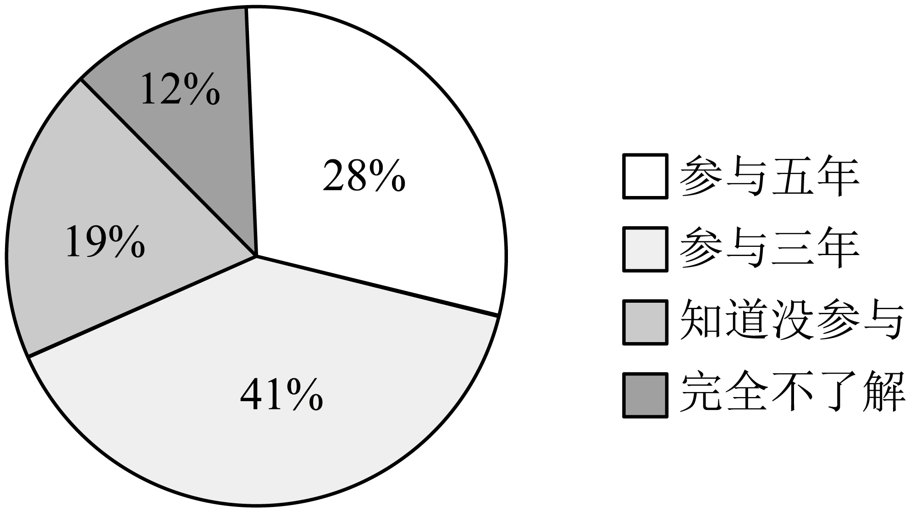

# 2025年山东省青岛市即墨区中考二模语文试题（解析版）

> 📌 **试题标定**：山东省青岛市即墨区 | 2025年 | 中考二模

---

<b>2024—2025</b><b>学年度第二学期九年级第二次诊断性测试语文试题</b>

<b>（考试时间：</b><b>120</b><b>分钟满分：</b><b>120</b><b>分）</b>

<b>1.</b><b>考试为闭卷考试，考生必须独立答卷，不得参阅任何参考资料。</b>

<b>2.</b><b>考生必须将选择题答案涂在答题卡上相应的位置，将笔答题的答案写到答题卡指定的位置内，否则不得分。交卷只交答题卡。</b>

<b>一、基础知识及运用（</b><b>20</b><b>分）</b>

<b>某班开展以“身边的文化遗产</b><b>——</b><b>沱江船工号子”为主题的综合性学习活动，请你积极参与。</b>

以前，内江盛产的甘蔗全靠水路运输，沱江两库许多人以拉纤（qiàn）为生。拉纤地段大多不是<u>坦荡如坻</u>的广袤（mào）原野，而是<u>道阻且跻</u>的急流险滩。江水喧腾，激起一个又一个漩（xuán）涡。一旦配合不好，纤夫们就有被卷入江水丧命的危险。为避免悲剧发生，<u>朔流而上</u>的船工们需要齐心协力，抖擞（shù）精神。他们跟着领唱人的节奏，踩着节拍，吼出“嘿哟、嗨哟”的<u>振耳欲聋</u>的吆喝声。后来，这些吆喝声逐渐发展成调，沱江船工号子就这样产生了。

1. 上述材料中加点字注音有误的一项是（   ）

A

 拉纤（qiàn）	B. 广袤（mào）	C. 漩涡（xuán）	D. 抖擞（shù）

2. 上述材料中画线词语书写正确的一项是（   ）

A. 坦荡如坻	B. 道阻且跻	C. 朔流而上	D. 振耳欲聋

【答案】1. D    2. B

【解析】

【1题详解】

本题考查字音。

D.抖擞（shù）——sǒu；

故选D。

【2题详解】

本题考查字形。

A.坦荡如坻——坦荡如砥；

C.朔流而上——溯流而上；

D.振耳欲聋——震耳欲聋；

故选B。

3. 下列句中加点词语使用有误的一项是（   ）

A. 内江历史悠久、人文荟萃，川流不息的沱江水孕育了丰富的非物质文化遗产，沱江船工号子就是其中之一。

B. 内江市第十一届大千龙舟经贸文化节的开场节目《甜都号子》引爆全场，表演者极富力量的舞姿与节奏鲜明的音乐相得益彰。

C. 已被列为省级非物质文化遗产的沱江船工号子面临着寻找下一代传承人的难题，老艺术家们对此忧心忡忡。

D. 沱江船工号子所彰显的不折不挠的精神，激励着一代又一代的甜城儿女奋楫争先，砥砺前行。

【答案】A

【解析】

【详解】本题考查词语运用。

A.川流不息：形容行人、车马很多，像水流一样连续不断。本句中用来形容沱江水，对象误用，使用错误；

B.相得益彰：意思是两个人或两件事物互相配合，使双方的能力和作用更能显示出来。本句中用来形容表演者的舞姿和音乐配合得当，使用正确；

C.忧心忡忡：形容心事重重，非常忧愁、担心。本句用来形容老艺术家们对艺术面临缺少传承人的担忧，使用正确；

D.不折不挠：在压力和困难面前不屈服，‌表现出顽强的精神。‌本句用来形容沱江船工号子所彰显的顽强精神，使用正确；

故选A。

4. 下列句子有语病的一项是（   ）

①沱江船工号子是船工们在拉纤中即兴创作的号子，一般没有固定的唱词。②他们大多以滩名、地名和眼前的风景为内容，唱出心中的愿望。③旋律来源于民歌、山歌和川剧高腔等音乐元素为融合，具有鲜明的地方特色。④其主要演唱方式是一领众和，行腔自由灵活，不受约束。

A. 第①句	B. 第②句	C. 第③句	D. 第④句

【答案】C

【解析】

【详解】本题考查病句辨析。

C.第③句“旋律来源于民歌、山歌和川剧高腔等音乐元素为融合”句式杂糅，既使用了“来源于”又包含了“为融合”的表述，使得句子结构混乱。应去掉“为融合”，改为“旋律来源于民歌、山歌和川剧高腔等音乐元素”；

故选C。

5. 在下列材料横线处填入句子，最恰当的一项是（   ）

沱江船工号子是船工在船过急流险滩时所唱。冲滩前所唱的前奏歌为打河号子，声音由轻到重，热烈但不激烈，______；冲滩开始所唱的是倒板号子，音调忽然变得紧张激烈，______；船只艰难缓慢行驶时，唱的是数板号子，船工高亢绵长的声音中蕴含着无尽的力量，______；船驶过汹涌的河滩后，唱的是舒缓轻快的号子，______。

①像两军交战前的鼓声    ②像宛转悠扬的笛声

③像军中吹奏的号角声    ④像由远及近的马蹄声

A. ④②①③	B. ②①③④	C. ③①②④	D. ④①③②

【答案】D

【解析】

【详解】本题考查句子衔接。

阅读所给文字，描述了沱江船工号子的不同情境和对应的情感色彩。需要填入的四个句子分别描述了打河号子、倒板号子、数板号子和舒缓轻快号子的特点。接下来，进行解释和推理：

第一个空：打河号子是冲滩前的前奏歌，声音由轻到重，热烈但不激烈。这里需要一个既能体现“热烈”又能表现“不激烈”的比喻。选项④“像由远及近的马蹄声”既有逐渐增强的效果，又不过于激烈，符合这一情境。

第二个空：倒板号子是冲滩开始时所唱，音调紧张激烈。这里需要一个能体现紧张激烈气氛的比喻。选项①“像两军交战前的鼓声”正好能体现这种紧张对峙、一触即发的氛围。

第三个空：数板号子是在船只艰难缓慢行驶时唱的，声音高亢绵长，蕴含力量。这里需要一个能体现力量感和持久性的比喻。选项③“像军中吹奏的号角声”既能表现力量，又能体现持久和坚定的感觉。

第四个空：舒缓轻快的号子是船驶过汹涌河滩后所唱，情感上应该是轻松愉快的。选项②“像宛转悠扬的笛声”正好能体现这种轻松愉悦的氛围。

综合以上分析，句子的正确顺序应该是：④①③②。这个选项准确地捕捉了每个情境下船工号子的特点和情感色彩，使得整个描述连贯且富有感染力。

故选D。

6. 九年级一班开展“低碳生活伴我行”的综合实践活动，请你完成下面的任务。

（1）小美为这次活动设计了海报，请你用简洁的语言为海报加上宣传语。

宣传语：

（2）林业部门倡导广大市民参与“云种树”公益行动，小云在绿色家园小区做了问卷调查，下图是她总结出的数据表，请你分析图表数据并写出结论

| 近年来，“云种树”成为一种新型的低碳公益活动，人们通过步行、骑行、网络购票、线上缴费等网上生活方式在某一网络平台搜集绿色能量，种下虚拟的树，网络平台就以种树人的名义，替你去沙漠种一棵真实的树。 |
| --- |

结论：

【答案】（1）示例：低碳出行，为你点赞。（绿色生活，低碳出行，你真行！倡导绿色环保，坚持低碳出行。骑酷炫单车，提倡低碳生活。低碳生活始于足下，绿色出行靠大家。）

（2）结论：据调查，近五年来，绿色家园小区有半数以上业主参与了“云种树”活动，有少部分业主表示了解而没参与，还有极少数业主表示完全不了解“云种树”。

【解析】

【小问1详解】

本题考查宣传标语的拟写。解答此题，要紧扣活动的目的，并且抓住海报中“绿色生活”“树”“自行车”“大拇指”能关键元素进行拟写。宣传标语要力求简洁有力，通俗易懂，避免晦涩的词汇和语句。

示例：绿色生活伴我行，低碳出行我践行！

【小问2详解】

本题考查图表分析。

结合题干中“林业部门倡导广大市民参与“云种树”公益行动，小云在绿色家园小区做了问卷调查”，根据图标可知，绿色家园小区有28%的业主参加“云种树”活动五年；有41%的业主参加了三年；19%的业主知道“云种树”活动，但没有参与；还有12%的业主对“云种树”活动完全不了解。

故得出结论：据调查，近五年来，绿色家园小区参与“云种树”公益行动的业主比例较高，有半数以上业主参与了活动，有少部分业主表示了解但没参与，还有极少部分业主表示完全不了解“云种树”。

7. 漫步诗文长廊，将诗文积累补充完整。

古诗文具有深刻的文学内涵和独特的审美魅力，如唐诗中岑参描绘的“①_______，千树万树梨花开 ”带给我们（塞外雪后异景）的瑰丽奇景；如王湾的“海日生残夜，②________”让我们领悟到新旧交替的自然理趣；如三国时期诸葛亮对后主“亲小人，远贤臣，③______________”的劝勉，让我们看到诸葛亮这位老臣的耿耿忠心；如苏轼《定风波》“ 竹杖芒鞋轻胜马，谁怕？④_______”以竹杖芒鞋的洒脱，传递出面对风雨泰然处之的豁达；陆游《十一月四日风雨大作（其二）》“⑤ _____ ， 铁马冰河入梦来 ”将梦境与现实交织，展现了诗人虽年老体衰却仍渴望为国戍边的赤诚之心， 杜甫在《望岳》中以“ ⑥_________，一览众山小”展现登临绝顶、俯瞰一切的雄心与气概，激励无数少年勇攀人生高峰。因此，我们要多读古诗文。

【答案】    ①. 忽如一夜春风来    ②. 江春入旧年    ③. 此后汉所以倾颓也    ④. 一蓑烟雨任平生    ⑤. 夜阑卧听风吹雨    ⑥. 会当凌绝顶

【解析】

【详解】本题考查名句默写。

默写题作答时，一是要透彻理解诗文的内容；二是要认真审题，找出符合题意的诗文句子；三是答题内容要准确，做到不添字、不漏字、不写错字。本题中的“入、倾、颓、蓑、阑、凌、绝”等字词容易写错。

<b>二、阅读（</b><b>50</b><b>分）</b>

<b>（一）名著阅读（</b><b>6</b><b>分）</b>

8. 文学作品的名字以及其中的名字往往含有作者的匠心。选出以下解读合理的一项（   ）

A. 《西游记》中“鹰愁涧”“乌鸡国”“盘丝洞”等地名，暗示了这些地方妖怪的原形。

B. 《红星照耀中国》题目象征着中国共产党及其领导的红色革命如闪亮的红星，不仅照耀着中国的西北，而且必将照耀全中国。

C. 《骆驼祥子》中刘四车厂名“人和”，表明刘四本性善良，希望人心归向、上下团结。

D. 《儒林外史》中“周进”“范进”等人名，肯定了读书人努力求取功名的远大理想。

【答案】B

【解析】

【详解】本题考查文学常识。

A.“鹰愁涧”对应白龙马（原为龙），与“鹰”无直接关联；“乌鸡国”的妖怪是青毛狮子，与“乌鸡”不符；“盘丝洞”的蜘蛛精与“盘丝”相符。故选项不完全正确。

C.曲解了“人和”的讽刺含义。刘四自私冷酷，车厂名“人和”是反讽其虚伪，而非体现善良。

D.与《儒林外史》批判科举制的主题矛盾。“周进”“范进”等名字通过谐音（如“进”暗含“钻营功名”）讽刺科举对读书人的扭曲，而非肯定其理想。

故选B。

9. 同音异字，一字立骨。请从“镇”“振”“震”中任选一个字，并联系一位备选人物的经历，谈谈这个人物给你带来的精神力量。

备选人物：简·爱    武松    保尔

【答案】答案不唯一，言之成理即可。联系人物经历，精神力量。

示例1：我选择“振”。简•爱离开桑菲尔德的时候，身无分文，落魄潦倒，但她坚持自食其力，重新振作起来，获得了大家的尊重。简•爱无论遭遇什么样的困境，都能够振作起来重新开始的勇气让我深受感染。

示例2：我选择“震”。保尔在边境小镇担任书记的时候，两村之间发生械斗，保尔打马冲进厮杀的人群，用这种野蛮的方法震撼着村民，才终于驱散斗殴者。保尔遇事不胆怯，不退缩的战斗精神让我深受触动。

示例3：我选择“镇”。当武松的哥哥惨死，官府不予理睬的情况下，他沉着镇定，有条不紊地调查取证，最终为兄长报仇。武松遇事沉着冷静，不屈服于恶势力的精神让人感动。

【解析】

【详解】本题考查名著人物。

可根据对人物的理解和“镇”“振”“震”的含义来评价人物。

简·爱的人物形象是一位性格坚强、朴实，刚柔并济、独立自主、积极进取的女性。简·爱，女主人公。她出身卑微，相貌平凡，但她并不以此自卑。她蔑视权贵的骄横，嘲笑他们的愚笨，显示出自立自强的人格和美好的理想。她有顽强的生命力，从不向命运低头，最后有了自己所向往的美好生活。从简·爱身上，表现出当今新女性的形象：自尊、自重、自立、自强，对于自己的人格、情感、生活、判断、选择的坚定理想和执着追求。简·爱的人生追求有两个基本旋律：富有激情、幻想、反抗和坚持不懈的精神；对人间自由幸福的渴望和对更高精神境界的追求。在困难挫折面前，她从不屈服，能够振作自强，体现一个“振”字；

武松是《水浒传》中的重要人物。因其排行在二，又叫“武二郎”。武松，绰号“行者”，《水浒传》中108将之一。武松家中排行第二，江湖上人称武二郎，清河县 人。景阳冈借着酒劲打死老虎，随后为报兄仇斗杀西门庆、醉打蒋门神、血溅鸳鸯楼、夜走蜈蚣岭，威震天下！血溅鸳鸯楼后，为躲避官府抓捕，改作头陀打扮，江湖人称“行者武松”。曾与鲁智深、杨志等人聚义青州二龙山，三山聚义时归顺梁山，坐第十四把交椅，为十大步军头领之一，后受朝廷招安随宋江征讨辽国，田虎，王庆，方腊，最终在征方腊过程中被飞刀所伤，痛失左臂，被封为清忠祖师，最后在杭州六和寺病逝，寿至八十。在危险面前，武松沉着冷静，十分冷静，信念坚定，不屈服于恶势力，体现一个“镇”字；

保尔是一个诚实、质朴，无所畏惧，渴望反抗，具有非凡

奉献精神和工作毅力，在烈火中成长起来的钢铁战士。为了供应城市木材，要在三个月内修一条铁路。于是保尔和共青团被调去修铁路。在修筑铁路时，保尔所在的潘克拉托夫小队“拼命走在前头”，以“疯狂”的速度进行工作；他全身瘫痪、双目失明后非常苦恼，不能自拔，产生了自杀的念头，但是后来战胜了这种念头，而是以顽强的毅力进行写作，以另一种方式实践着自己的生命誓言。这种百折不挠的战斗精神和积极乐观的人生态度让人震撼。

综上分析，选择一个人物，结合人物经历简要来写即可。

<b>（二）诗词阅读（６分）</b>

10. 下列对古诗的理解与赏析，不正确的一项是（   ）

A. “东风不与周郎便，铜雀春深锁二乔”（《赤壁》）通过假设，以二乔的命运来暗示东吴的命运，以小见大，表达了诗人对历史兴亡的慨叹。

B. “大漠孤烟直，长河落日圆”（《使至塞上》）“直”“圆”二字勾勒出塞外奇特壮丽的风光，画面雄浑壮阔，被王国维赞为“千古壮观”之名句。

C. “山回路转不见君，雪上空留马行处”（《白雪歌送武判官归京》）写诗人与友人依依惜别，看着友人离去，直到看不见友人的身影，只能看见雪地上留下的马蹄印，体现出送别时的缠绵悱恻之情。

D. “持节云中，何日遣冯唐”（《江城子·密州出猎》）词人以魏尚自许，希望朝廷能像派冯唐赦免魏尚那样重用自己，表达了渴望得到朝廷重用、杀敌报国的思想感情。

【答案】C

【解析】

【详解】本题考查诗歌理解与赏析。

C.岑参《白雪歌》末句通过“空留马行处”展现苍茫雪景中的怅惘与不舍，情感含蓄深沉。而“缠绵悱恻”多指婉约细腻的哀伤（如柳永词风），与岑参豪迈中带怅惘的边塞送别基调不符，赏析失当。

故选C。

11. 这首诗抒发了诗人怎样的情感？请结合诗句简要分析。

卢溪别人

（唐）王昌龄

武陵溪口驻扁舟，溪水随君向北流。

行到荆门上三峡，莫将孤月对猿愁。

注解：王昌龄的《卢溪别人》是一首送别诗，创作于诗人被贬龙标（今湖南黔阳）期间。

【答案】“溪水随君向北流”把自己比作“溪水”，像溪水一样陪伴友人，劝慰友人不要悲伤，要积极乐观，表达诗人依依惜别之情。

【解析】

【导语】王昌龄此诗以溪水为媒，将送别之情化入流动的意象中。“随君北流”暗含不舍，“莫将孤月对猿愁”更以三峡猿声为衬，道尽谪宦孤寂。扁舟、流水、孤月等意象群构成空灵而深沉的意境，体现盛唐送别诗“哀而不伤”的特质。

【详解】本题考查对诗歌情感的分析概括。

“武陵溪口驻扁舟，溪水随君向北流”，写这位朋友自卢溪别后，已来到武陵溪口。沅江的水，流到溪口，称为溪水。他乘的船停在溪口，准备穿过洞庭湖，直奔长江。这时沅江的水仿佛跟着他向北流去，作者送别之情也跟着溪水随友人北流，依依惜别之情尽含其中。

“行到荆门上三峡，莫将孤月对猿愁”，这两句是想象友人由荆门入三峡的情景。到了荆门，还要沿江西上进入险岩壁立的三峡。这时候“两岸猿声啼不住”，过往的客人听起来就象诉愁啼怨，心情格外紧张。自古以来就有“巴东三峡巫峡长，猿鸣三声泪沾裳”的民谣。想到这里，作者把惜别的深情寄寓在友人别后的甘苦上，设想这位友人在旅途中的种种遭遇，劝朋友不要对着孤月听到猿声就发愁。由实景的描写转向虚景的描写，从中体现出对友人的殷切期望和怀念，更显别后深情。

<b>（三）文言文阅读（</b><b>12</b><b>分）</b>

阅读下面的文言文，完成各题。

【甲】

庆历四年春，滕子京谪守巴陵郡。越明年，政通人和，百废具兴，乃重修岳阳楼，增其旧制，刻唐贤今人诗赋于其上，属予作文以记之。

……

嗟夫！予尝求古仁人之心，或异二者之为，何哉？不以物喜，不以己悲，居庙堂之高则忧其民，处江湖之远则忧其君。是进亦忧，退亦忧。然则何时而乐耶？其必曰“先天下之忧而忧，后天下之乐而乐”乎！噫！微斯人，吾谁与归？时六年九月十五日。

（节选自《岳阳楼记》）

【乙】

禹锡精于古文，善五言诗，今体文章复多才丽。贞元末，王叔文于东宫用事，后辈务进，多附丽之。禹锡尤为叔文知奖，以宰相器待之。顺宗即位，久疾不任政事，禁中文诰，皆出于叔文。引禹锡及柳宗元入禁中，与之图议，言无不从。

叔文败，坐贬连州刺史。在道，贬朗州司马。<u>地居西南夷士风僻陋举目殊俗无可与言者</u>。禹锡在朗州十年，唯以文章吟咏，陶冶情性。

元和十年，自武陵召还，宰相复欲置之郎署。时禹锡作《游玄都观咏看花君子诗》，语涉讥刺，执政不悦，复出为播州刺史。诏下，御史中丞裴度奏曰：“刘禹锡有母，年八十余。今播州西南极远，猿狱所居，人迹罕至。其老母必去不得，则与此子为死别，臣恐伤陛下孝理之风。伏请屈法，稍移近处。”宪宗曰：“夫为人子，每事尤须谨慎，常恐贻亲之忧。今禹锡所坐，更合重于他人，卿岂可以此论之？”度无以对。良久，帝改容而言曰：“<u style="text-decoration: wavy;">朕所言，是责人子之事，然终不欲伤其所亲之心。</u>”乃改授连州刺史。

（选自《旧唐书》，有删改）

12. 下列对词语和句子的理解，不正确的一项是（   ）

A. “属予作文以记之”的“作”，与“时刘禹锡作《游玄都观咏看花君子诗》”的“作”，意思相同。

B. “沙鸥翔集”的“集”意思是“聚集”，“为人子”的“为”意思是“作为”。

C. “先天下之忧而忧”的“先”，名词用作状语，文中指“在……之前”。

D. “居庙堂之高则忧其民”是定语后置句，是“居高之庙堂则忧其民”的意思。

13. 下列加点词意思用法相同的一项是（   ）

A. 不以物喜              唯以文章吟咏，陶冶情性

B. 先天下之忧而忧          臣恐伤陛下孝理之风

C. 此则岳阳楼之大观也      则与此子为死别

D. 处江湖之远则忧其君           其老母必去不得

14. 请用“/”给【乙】文中画横线句子断句。（限断三处）

地居西南夷士风僻陋举目殊俗无可与言者

15. 把【乙】文中画波浪线句子翻译成现代汉语。

朕所言，是责人子之事，然终不欲伤其所亲之心。

16. 下列对原文有关内容的概况和分析，不正确的一项是（   ）

A. 刘禹锡才华横溢，他和柳宗元提出的建议都得到认可。

B. 刘禹锡被王叔文赏识重用，也因此受牵连获罪。

C. 刘禹锡曾被贬为播州刺史，还未到任改任连州刺史。

D. 刘禹锡在朗州任职期间独善其身，不屑与夷人交往。

【答案】12. B    13. D

14. 地居西南夷/士风僻陋/举目殊俗/无可与言者。

15. 我所说的，是责备人子的话，但终究不想伤害他母亲的心。    16. D

【解析】

【导语】这篇文言文对比阅读展现了两种士人风骨。【甲】文《岳阳楼记》以“先忧后乐”的济世情怀为核心，通过景物描写与议论的完美结合，塑造了范仲淹“不以物喜，不以己悲”的崇高境界；【乙】文则通过刘禹锡的宦海沉浮，展现了唐代文人在政治漩涡中的命运起伏。两文都运用了夹叙夹议的手法，甲文气势恢宏，乙文笔法简练，共同构成中国古代士大夫“达则兼济天下，穷则独善其身”的精神图谱，具有深刻的文化内涵和审美价值。

【12题详解】

本题考查文言词语和一词多义。

A.“属予作文以记之”意为“嘱托我写一篇文章来记述这件事”，其中“作”是“创作、写作”的意思；“时刘禹锡作《游玄都观咏看花君子诗》”意为“当时刘禹锡创作《游玄都观咏看花君子诗》”，“作”同样是“创作、写作”之意。二者意思相同，理解正确；

B.“沙鸥翔集”意为“沙鸥时而飞翔，时而停歇”，“集”的意思是“停息、栖止”（如鸟停在树上），而非“聚集”；

C.“先天下之忧而忧”意为“在天下人忧虑之前先忧虑”，“先”本为名词，此处活用为状语，表示“在……之前”，用法分析正确；

D.“居庙堂之高则忧其民”意为“处在高高的朝廷上（做官）就为百姓忧虑”，是定语后置句，正常语序为“居高之庙堂则忧其民”，“之”为定语后置的标志，“庙堂之高”即“高高的庙堂”，理解正确；

故选B。

【13题详解】

本题考查一词多义。

A.介词，因为 / 介词，用；

B.助词，取消句子独立性，无实义 / 助词，的；

C.副词，就是（表判断） / 连词，就（表顺承）；

D.代词，他的 / 代词，他的；

故选D。

【14题详解】

本题考查文言断句。根据文言文断句的方法，先梳理句子大意，分清层次，然后断句，反复诵读加以验证。主语和谓语之间，谓语和宾语、补语之间一般要作停顿。

句意：朗州地处西南少数民族地区，当地风俗偏僻粗陋，放眼所见都是与中原不同的习俗，没有可以共同交流的人。

“地居西南夷”交代地理位置，“士风僻陋”描述当地风气，“举目殊俗”承接前文，表达所见皆为不同习俗，“无可与言者”总结句，写处境，故分别断开；

故断句：地居西南夷 / 士风僻陋 / 举目殊俗 / 无可与言者

【15题详解】

本题考查文言翻译。完整翻译句子的基础上，把重点字词的意义和用法展现出来，注意省略句要补全，倒装句要调整语序。

朕：皇帝自称；所言：所说的；责：责备；人子：子女；然：但是；终：终究；不欲：不想；伤：伤害；所亲：所亲近的人（这里指刘禹锡的母亲）。

【16题详解】

本题考查内容分析。

D.原文“地居西南夷……无可与言者”意为朗州地处偏远、风俗殊异，刘禹锡“举目无亲、无人可交流”，而非“独善其身，不屑与夷人交往”。此句是客观描述环境闭塞，而非主观态度。表述错误；

故选D。

【点睛】参考译文：

【甲】庆历四年的春天，滕子京被贬官到巴陵郡做太守。到了第二年，政事顺利，百姓和乐，各种荒废的事业都兴办起来了，于是重新修建岳阳楼，扩大它原有的规模，把唐代名家和当代人的诗赋刻在它上面，嘱托我写一篇文章来记述这件事。

……

唉！我曾经探求古代品德高尚的人的思想感情，或许不同于以上两种表现，这是为什么呢？他们不因外物和个人处境的变化而喜悲，在朝廷里做高官就为百姓担忧，被贬到边远地区做地方官就为君主担忧。这样看来，他们进朝为官也担忧，退居江湖也担忧。既然这样，那么他们什么时候才会感到快乐呢？他们一定会说：“在天下人忧之前先忧，在天下人乐之后才乐”吧！唉！如果没有这种人，我同谁一道呢？写于庆历六年九月十五日。

【乙】刘禹锡精通古文，擅长写五言诗，今体文章又多有才华和文采。贞元末年，王叔文在东宫掌权，后辈想要晋升的人，大多依附他。刘禹锡尤其被王叔文赏识提拔，（王叔文）把他当作有做宰相的才能的人来对待。唐顺宗即位后，长期患病不能处理政事，宫廷中的文告诏令，都出自王叔文之手。（王叔文）引荐刘禹锡和柳宗元进入宫中，和他们谋划商议，（对他们的）意见没有不采纳的。

王叔文（的政治集团）失败后，刘禹锡受牵连被贬为连州刺史。在赴任途中，又被贬为朗州司马。朗州地处西南少数民族地区，当地风俗偏僻粗陋，放眼所见都是与中原不同的习俗，没有可以共同交流的人。刘禹锡在朗州十年，只通过写文章和吟咏诗歌来陶冶性情。

元和十年，（刘禹锡）从武陵被召回京城，宰相又想把他安排到郎署（担任官职）。当时刘禹锡写了《游玄都观咏看花君子诗》，诗中语言涉及讥讽指责，执政的官员很不高兴，又把他外放为播州刺史。诏令下达后，御史中丞裴度上奏说：“刘禹锡有母亲，年纪八十多岁了。如今播州在西南极远的地方，是猿猴居住的地方，人迹罕至。他的老母亲必定无法前往，那么就会和儿子成为永别，我担心这会伤害陛下以孝道治理天下的风气。恳请您变通法令，把他稍微移到近处任职。”唐宪宗说：“作为人子，每件事都尤其需要谨慎，常常要担心给父母带来忧虑。如今刘禹锡所犯的过错，更应该比别人重，你怎么能用这样的理由来议论呢？”裴度无法回答。过了很久，皇帝改变了脸色说：“我所说的，是责备人子的话，但终究不想伤害他母亲的心。”于是改授刘禹锡为连州刺史。

<b>（四）现代文阅读（</b><b>9</b><b>分）</b>

阅读下面的材料，完成下面小题。

【材料一】

①近年来，我国人工智能产业在技术创新、产业生态、融合应用等方面取得积极进展，已进入全球第一梯队。据中国信通院测算，2022年我国人工智能核心产业规模达5080亿元。同比增长18%。截至2022年底，全球人工智能代表企业数27255家，其中我国企业数量4227家，约占全球企业总数的16%。目前，我国已有超过400所学校开设人工智能专业，高端人才居全球第二。我国人工智能产业已形成长三角、京津冀、珠三角三大集聚发展区。

②百度、阿里、华为、腾讯、科大讯飞、云从科技、京东等一批AI开放平台初步具备支撑产业快速发展的能力。人工智能技术快速发展，成为推动科技和产业加速发展的重要力量，而中国科技发展自主创新与全球开放协作缺一不可。

（摘编自《人民日报》）

【材料二】

①近期，一家鲜为人知的中国AI研究实验室DeepSeek（简称深度求索）在硅谷掀起了轩然大波。这家公司发布的开源模型DeepSeek—R1在多项数学和推理基准测试中击败了行业领先的模型，包括OpenAI的产品。从能力、成本到开放程度，DeepSeek都在向西方AI巨头发起挑战。

与众不同的企业文化

②DeepSeek在组建研究团队时采取了独特的策略。他们不是寻找有经验的工程师来开发面向消费者的产品，而是重点招募来自北大、清华等顶尖高校的博士生。这些年轻人虽然缺乏行业经验，但都在顶级期刊发表过论文，在国际学术会议上获得过奖项。公司创始人梁文峰在接受采访时表示，公司的核心技术岗位大多由应届毕业生或工作1～2年的年轻人担任。这种招聘策略帮助打造了一个协作性的企业文化，让员工能自由使用充足的计算资源来进行非常规研究项目。

危机中诞生的创新

③2022年10月，美国政府开始实施出口管制，严格限制中国AI公司获取英伟达H100等顶级芯片。这对DeepSeek来说是一个巨大的挑战。面对困境，DeepSeek选择了另辟蹊径。他们通过优化模型架构，创新性地使用混合专家模型等方法，显著提高了资源使用效率。据研究机构EpochAI统计，DeepSeek最新模型的训练仅需要MetacomparableLlama3.1模型十分之一的计算资源。

开源创新的力量

④DeepSeek选择将这些创新与公众分享，在全球AI研究社区赢得了广泛好评。对许多中国AI公司来说，开发开源模型是追赶西方竞争对手的唯一途径，因为这能吸引更多用户和贡献者，从而推动模型的成长。

（摘编自《凤凰网科技》）

【材料三】

①DeepSeek的出现，再次在互联网引发了针对中国科技水平现状的讨论。眼下，针对中国科技水平定位的讨论已经成为互联网舆论场的争论焦点。然而，有些声音，为了流量，经常从一个极端走向另一个极端——一些领域有突破，马上就炒作“一骑绝尘”“遥遥领先”，但当某些领域的突破发生在国外，马上又变成国内落后几十年，满是无法追赶的消极悲观。这种左右摇摆，绝不是客观理性的态度。

②DeepSeek最难能可贵的一点在于向全世界开源，可以为全世界的研究者赋能。英伟达资深科学家吉姆·范称赞这是“非美国公司践行OpenAI初心”的典范。由此可见，对于科技的发展，我们要走出狭隘的胜负观。中国的科技发展完全可以在造福人类等更宏观的领域有更大作为。民族的就是世界的，世界的最终也还是民族的。只要中国科技与人类未来发展实现双向奔赴，不管是多高的墙，多深的院，都无法阻止中国的科技进步。

（摘编自网络）

17. 下列对材料相关内容的理解和分析，不正确的一项是（   ）

A. 我国人工智能产业已进入全球第一梯队，国内人工智能产业发展规模巨大，全球领先。

B. 我国重视人工智能人才的培养，做到了人工智能产业的产学研紧密结合，人才储备雄厚。

C. DeepSeek发布的DeepSeek—R1在所有数学和推理基准测试中都击败了行业领先的模型。

D. DeepSeek通过优化模型架构，创新性地使用混合专家模型等方法来应对美国的出口管制。

18. 根据材料内容，下列说法不正确的一项是（   ）

A. 为打造协作性的企业文化，DeepSeek在组建研究团队时采取了招募有为年轻人的独特策略。

B. 针对中国科技水平定位的讨论已经成为互联网舆论场的争论焦点，很多声音是客观理性的。

C. DeepSeek向全世界开源，为全世界的研究者赋能，体现了中国科技发展应有的胸怀和格局。

D. 中国在人工智能领域形成集聚发展态势，众多开放平台初步具备支撑产业快速发展的能力。

19. 根据三则材料，说说中国科技发展与全球发展之间的相互影响体现在哪些方面。

【答案】17. C    18. B

19. ①中国科技发展自主创新与全球开放协作缺一不可。②DeepSeek选择将这些创新与公众分享，在全球AI研究社区赢得了广泛好评，中国科技贡献世界。③DeepSeek向全世界开源，为全世界的研究者赋能，在全球范围内产生积极影响，促进中国科技的进一步发展。

【解析】

【导语】这篇阅读文章通过三则材料，全面展现了中国人工智能产业的快速发展及其在全球科技竞争中的地位。材料一概述了中国AI产业在技术创新、产业生态和融合应用方面的成就，强调其已进入全球第一梯队。材料二以深度求索（DeepSeek）为例，展示了中国AI企业在面对外部挑战时的创新能力和开源精神。材料三则探讨了中国科技发展与全球视野的辩证关系，呼吁走出狭隘的胜负观，强调科技发展的全球共享与合作。整体上，文章既展现了中国科技的自信心，也体现了开放合作的全球视野。

【17题详解】

本题考查理解与分析

C.材料二第①段说的是“这家公司发布的开源模型 DeepSeek—R1 在多项数学和推理基准测试中击败了行业领先的模型，包括 OpenAI 的产品”，是“多项”数学和推理基准测试，并非“所有”，该选项中“在所有数学和推理基准测试中”说法过于绝对，理解错误。故选C。

【18题详解】

本题考查理解材料。

B.从材料三第①段“眼下，针对中国科技水平定位的讨论已经成为互联网舆论场的争论焦点。然而，有些声音，为了流量，经常从一个极端走向另一个极端 —— 一些领域有突破，马上就炒作‘一骑绝尘’‘遥遥领先’，但当某些领域的突破发生在国外，马上又变成国内落后几十年，满是无法追赶的消极悲观。这种左右摇摆，绝不是客观理性的态度”可知，很多声音不是客观理性的，该选项中“很多声音是客观理性的”说法错误。故选B。

【19题详解】

本题考查概括。

从材料一第②段“人工智能技术快速发展，成为推动科技和产业加速发展的重要力量，而中国科技发展自主创新与全球开放协作缺一不可”可知，中国科技发展自主创新与全球开放协作缺一不可，中国科技发展需要与全球进行开放协作，相互促进，这体现了中国科技发展与全球发展的相互影响。

由材料二第④段“DeepSeek 选择将这些创新与公众分享，在全球 AI 研究社区赢得了广泛好评。对许多中国 AI 公司来说，开发开源模型是追赶西方竞争对手的唯一途径，因为这能吸引更多用户和贡献者，从而推动模型的成长”可知，DeepSeek 将创新与公众分享，为全球 AI 研究做贡献，中国科技发展的成果可以贡献世界，促进全球科技的发展，这是中国科技发展对全球发展的影响。

从材料三第②段“DeepSeek 最难能可贵的一点在于向全世界开源，可以为全世界的研究者赋能。……只要中国科技与人类未来发展实现双向奔赴，不管是多高的墙，多深的院，都无法阻止中国的科技进步”可知，DeepSeek 向全世界开源，为全世界的研究者赋能，在全球范围内产生积极影响，同时这种积极影响又能促进中国科技的进一步发展，体现了全球发展对中国科技发展的反作用。

<b>（五）现代文阅读（</b><b>17</b><b>分）</b>

水之经典

肖复兴

①<u>世上丽水秀水晶莹之水清澈之水恢弘之水浩瀚之水，多得是</u>。但在我看来，极富个性、最值得看的是这两处：都江堰和九寨沟。

②看都江堰的水，看的是强悍奔腾的水如何层层叠叠化为生命的涓涓细流。<u>飞奔如兽、桀骜不驯的岷江水，经过都江堰，立刻将仰天长啸变为喃喃细吟，将浪涛如山变为珍珠四溢，将凶猛如火变为柔情万缕</u><u>……</u>出宝瓶口流入内江，立刻呈现一派水光潋滟的情景，让人叹为观止，看到水的柔劲、可塑和万难不屈、长流不懈的生命活力。那是一种将绚烂归于平淡，将刚劲寓于柔顺，将一时融于永恒的生命。

③都江堰看水，看的是水如何从天上流入人间，如何从神话流入现实，如何将自己化为一种哺育人类、灌溉庄园的生命。都江堰的水，是一种入世的现实的水。

④李冰的都江堰名垂千古，功劳在于他知道水可载舟亦可覆舟这看似浅显的道理。水的两重性，比之人的多重性，他认识得还要透彻深刻。他或许对付不了人的多变纷纭，一辈子只当个蜀中郡守；却能对付水，把疯狂的水引入现实，一直绵绵流淌了二千多年。

⑤曾在成都看国际熊猫节开幕式的演出，演李冰父子治水一幕，满场旌旗飘扬、战鼓如雷，让李冰父子率领众人杀败龙王恶神，我实在不以为然。这种善恶之斗、人鬼之争的简单演绎，把李冰父子变成了神。其实，恰恰是李冰父子将水从不可治理不可理喻的神化为同芸芸众生一样的，在现实中浇灌着农田，在平凡土地上存活的生命。

⑥看九寨沟的水，看的是宁静、恬淡的水如何凝聚成生命的湖泊。镜海、长海、珍珠滩……每一个湖泊都是那样清澄透明、纤尘不染，让人如同看到教堂里洗礼用的圣洁露水，如同听到教堂里管风琴演奏的圣母颂，让人懂得并真真地看到人世间居然有纯洁透澈的净，就在这里远避尘嚣而静静地存在。

⑦那水几乎一动不动，任外面的世界如何纷繁变幻，将污染、噪音连同人心泛起的种种污浊的泡沫一起抛向天空和大地，它独自坚持着自己的贞操，不动丝毫涟漪，不染丝毫尘俗，将水底的虬枝沉木、水藻水锦，将天上的薄云丽日、山岚清风，将身旁的雪峰幽谷、古树老藤……一一映在自己的怀中，映得那么明净、幽深、清冽。因为它的洗涤，所有这一切，都显得比本身还要清纯与洁净，如同脱胎换骨一般，玉洁冰清，重塑了自己一番。尘世沾惹的市侩庸俗，风骚矫情、浪声虚名、欲火利海……起码不敢在这里抖擞，而被这水洗却大半。

⑧九寨沟看水，看的是水如何从人间流向天上，如何从现实流向童话，如何将自己化为一种启迪人类、净化心灵的艺术。九寨沟的水，是一种出世的艺术的水。

⑨看都江堰和九寨沟的水，给人以完全不同的感觉。在现实中找不准自己的位置，便会蹉跎生命；沉靡现实而背弃心灵、抛掷精神、亵渎纯洁，不懂得：一点点现实永远不会给予而只有艺术才能焕发和唤回的浪漫与童话的情怀，便会麻木了生命而只剩下一个蝉蜕一样的空壳。心，因缺少水的滋润，会成为一片荒芜的沙漠。

⑩在现实与艺术之间，在物质与精神之间，人总是矛盾着、跌撞着，顾此失彼而永远找不到连接两者之间的直线或弧线。大概这正是人类永远苦恼困惑的原因。<u>而都江堰和九寨沟的水，分别给予人类一面镜子。</u>

⑪谁也无法离开水，纵使我们可以离开摩天大楼、豪华别墅，可以放弃汽车电话、电视电影，抛下各种欲望，我们无法离开水。只是要看我们需要的究竟是哪一种水。我们选择着水，水也在选择着我们。

⑫九寨沟和都江堰是水之经典。

20. 下列关于文章相关内容的理解，不正确的一项是（ ）

A. 文章第①段划线句不加标点，一气呵成，语势强烈，目的是为了表达作者对水的喜爱之情。

B. 都江堰的水滋养生命，九寨沟的水塑造灵魂，它们都极具个性，堪称“水之经典”。

C. 文章写都江堰的水和九寨沟的水，既有生动形象的描绘，又有独到深刻的思考。

D. 老子所说的“水善利万物而不争”这句话，可以用来说明作者笔下九寨沟之水的特点。

21. 赏析词句的妙处。

（1）文中第②段画线句子用了哪些修辞手法，简要赏析。

（2）赏析第⑦段中“尘世沾惹的市侩庸俗，风骚矫情、浪声虚名、欲火利海……起码不敢在这里抖擞，而被这水洗却大半”一句中“抖擞”一词的妙处。

22. 请结合文章内容，谈谈你对第⑩段划线句“而都江堰和九寨沟的水，分别给予人类一面镜子”的理解。

23. 文章写都江堰和九寨沟的水，但表达方式上不以描写见长。请从表达方式的角度，谈谈④⑤段的作用。

【答案】20. A    21. （1）运用比喻、拟人、排比的修辞手法，描写流过都江堰的水从强悍变为平缓柔顺的特点，表达了作者的赞美（或喜爱）之情。

（2）“抖擞”远指振作、显露，此处运用拟人手法，将“市侩庸俗”等抽象的世俗杂质人格化，生动表现九寨沟的氺的纯净强大，能震慑并洗涤尘世的污浊，强化了氺“净化心灵”的作用，语言活泼且富有感染力。

22. 用比喻说明水照人类的现状，都江堰的水是入世的、现实的水（或强悍奔腾、哺育生命），它启迪人们在现实中找准位置，踏实生活，不蹉跎生命；九寨沟的水是出世的、艺术的水（或宁静、恬淡），它启迪人们不背弃心灵，追求心灵和精神的纯洁。受水的启迪，人们要在现实与艺术之间，物质与精神之间找到平衡点（或表明生命既需要现实的滋养，也离不开精神的润泽，点明主题）。结构上承上启下，点出都江堰和九寨沟的水的意义，引起下文，指出水对于人的生命与灵魂的价值。

23. 运用叙述和议论的表达方式，通过作者对李冰父子治理都江堰以及观看演出的叙述和评价，诠释了都江堰之水是一种入世的现实的水，如何从神话流入现实，如何将自己化为一种哺育人类、灌溉庄园的生命。丰富了文章内容，表达了作者的思考，抒发了作者对都江堰水的赞美。

【解析】

【导语】这篇散文以水为媒，通过对比都江堰的“入世之水”与九寨沟的“出世之水”，构建了现实与艺术的双重镜像。作者运用拟人、排比等修辞，既展现水的形态之美，更挖掘其哲学意蕴——都江堰体现李冰“化狂为柔”的治世智慧，九寨沟则象征超脱尘俗的精神净土。两种水态共同构成生命辩证法的经典隐喻，启示人们在物质与精神间寻求平衡。

【20题详解】

本题考查内容理解辨析。

A.有误，结合第①段“世上丽水秀水晶莹之水清澈之水恢弘之水浩瀚之水，多得是”可知，此句通过不加标点、连续堆砌形容水的词汇，形成强烈的语势，但目的并非表达对普通水的喜爱，而是通过罗列世间常见的水，与后文“极富个性”的都江堰、九寨沟之水形成对比，突出二者的独特性。由此可知，“目的是为了表达作者对水的喜爱之情”分析错误；

故选A。

【21题详解】

本题考查句子赏析。

（1）结合第②段“飞奔如兽、桀骜不驯

岷江水，经过都江堰，立刻将仰天长啸变为喃喃细吟，将浪涛如山变为珍珠四溢，将凶猛如火变为柔情万缕……”可知，运用比喻的修辞，“飞奔如兽”将奔腾的岷江水比作猛兽，“浪涛如山”“凶猛如火”则分别将浪涛比作山峦、将水的气势比作火焰，生动展现水的强悍迅猛；“仰天长啸”“喃喃细吟”运用拟人，赋予江水人的动作与声音，前者凸显水的桀骜不驯，后者表现其经都江堰后变得轻柔温顺；三个“将……变为……”的句式并列，结构整齐，节奏紧凑，运用排比手法，层层递进地突出江水从狂暴到柔和的变化过程。由此可知，这些修辞手法多角度、多层面地描写了流过都江堰的水从强悍变为平缓柔顺的特点，字里行间蕴含着作者对都江堰水利工程的赞叹，以及对水的生命力与可塑性的赞美之情。

（2）结合第⑦段“尘世沾惹的市侩庸俗，风骚矫情、浪声虚名、欲火利海……起码不敢在这里抖擞，而被这水洗却大半”可知，“抖擞”原指“振作、显露”，此处运用拟人手法，将“市侩庸俗”“欲火利海”等抽象的世俗杂质人格化，仿佛它们是有生命的个体，因畏惧九寨沟水的纯净而“不敢抖擞”。由此可知，这一词语生动地表现了九寨沟的水具有强大的震慑力，能让尘世的污浊不敢显露，且能洗涤人心的杂质，强化了水“净化心灵”的作用。同时，“抖擞”一词用词活泼形象，富有感染力，让抽象的“净化”过程变得具体可感，凸显了九寨沟之水的圣洁与纯粹。

【22题详解】

本题考查句子理解。

结合第③段“都江堰的水，是一种入世的现实的水”和第⑧段“九寨沟的水，是一种出世的艺术的水”可知，都江堰的水通过水利工程“哺育人类、灌溉庄园”（第③段），展现“强悍奔腾化为生命细流”的现实力量；九寨沟的水以“宁静恬淡、纤尘不染”（第⑥段）净化心灵，象征超越世俗的艺术境界。由此可知，“镜子”比喻水如对照之物：都江堰之水映照出现实中人们需“找准位置、踏实生活”（第⑨段“在现实中找不准自己的位置，便会蹉跎生命”），九寨沟之水则映照出精神层面需“坚守纯洁、不背弃心灵”（第⑨段“沉靡现实而背弃心灵……会麻木了生命”）。二者共同启示人类：需在现实生存与精神追求间寻找平衡，既不沉溺物质，也不脱离现实空谈理想，从而点明“水之经典”对生命的双重滋养意义。此外，结合第⑩段“在现实与艺术之间……人类永远苦恼困惑”可知，划线句在结构上承接上文对两种水特质的论述，引出下文对水与人关系的深层思考，通过“镜子”的比喻收束前文，为后文“选择何种水”的追问埋下伏笔，起到承上启下的作用。

【23题详解】

本题考查表达方式及作用。

结合第④段“李冰的都江堰名垂千古，功劳在于他知道水可载舟亦可覆舟这看似浅显的道理……把疯狂的水引入现实，一直绵绵流淌了二千多年”可知，此段以叙述李冰治水的史实为基础，穿插“水的两重性，比之人的多重性，他认识得还要透彻深刻”的议论，揭示都江堰之水“入世”“现实”的本质——通过驯服狂暴之水，使其成为滋养生命的源泉。

结合第⑤段“曾在成都看国际熊猫节开幕式的演出……把李冰父子变成了神”可知，作者叙述观看演出的经历，并以“其实，恰恰是李冰父子将水从不可治理不可理喻的神化为……在平凡土地上存活的生命”的议论，反驳对李冰父子的神化演绎，强调都江堰之水的现实意义：它不是神话中的奇迹，而是脚踏实地的民生实践。

由此可知，④⑤段通过叙述与议论结合的表达方式，既补充了都江堰水利工程的人文背景（李冰的治水理念），又通过对“神化”叙事的批判，深化了“都江堰之水是从神话流入现实的生命之水”这一核心观点。这种表达方式跳出单纯的景物描写，引入历史思考与现实评价，既丰富了文章的思想层次，也通过理性思辨强化了都江堰之水“哺育人类、务实入世”的形象，为后文对比九寨沟之水的“出世”特质奠定了逻辑基础，同时抒发了作者对都江堰水利智慧及其现实价值的赞美之情。

<b>三、写作（</b><b>50</b><b>分）</b>

24. 阅读下面材料，按要求写作。

《现代汉语词典》定义“空白”为未填满部分。从前人们喜填充空物，如今愿留其空，因空白蕴含更多可能。书法、国画等艺术重视留白，京剧、围棋、文学等领域乃至人生皆如此。“留白”可以是一种学习状态，可以是一种生活态度，可以是一种交往艺术，可以是一种创作技巧……

请你根据对上述文字的理解和思考，联系自己的体验和认识，写一篇文章。

要求：角度自选，立意自定，题目自拟；除诗歌外，文体不限，不少于600字；不得套作，不得抄袭，不得泄露个人信息（校名、人名、地名等）。

【答案】例文

人生应留白

在艺术的殿堂里，留白是一种独特的美学。国画中，那大片未着墨的宣纸，看似空白，实则充满想象；书法里，字与字、行与行之间的空白，让作品气韵生动。而在人生的长卷上，留白更是一种不可或缺的智慧。

人生需要留白，是给自己的心灵留出栖息之所。现代社会，节奏如鼓点般紧凑，人们像不停旋转的陀螺，被各种事务缠身。从清晨睁眼便被手机信息轰炸，到夜晚拖着疲惫身躯入睡，日程被工作、社交填得满满当当。然而，当我们学会留白，给自己一段独处的时光，关闭电子设备，泡一壶香茗，静坐在窗前，任思绪飘飞，就能在这片刻宁静中，倾听内心的声音，找回真实的自己。这空白之处，是心灵的充电站，让我们能以更好的状态迎接生活的挑战。

人际交往中，留白是尊重与理解的体现。我们与亲人、朋友相处，并非要时刻黏在一起、事无巨细都要知晓。给彼此留些空间，尊重对方的隐私和个人喜好，关系反而能更加融洽。如同寒冬里相互取暖的刺猬，靠得太近会刺伤彼此，保持适当距离，留出空间，才能既感受到温暖，又避免伤害。夫妻之间，给对方保留自己的兴趣爱好和社交圈子；朋友之间，不强行干涉对方的选择和决定。这种留白，是对他人独立人格的认可，让情感在适度的空间中得以滋养。

在追求目标的道路上，留白是积蓄力量的过程。我们都渴望成功，在前行时往往拼尽全力，生怕错过任何机会。但一味地埋头赶路，可能会让自己疲惫不堪甚至迷失方向。适时留白，是在忙碌的征程中稍作停歇，反思过往的经验教训，调整前行的策略。就像运动员在高强度训练中需要休息，才能在赛场上发挥出最佳水平。这留白的间隙，是为了让我们走得更稳、更远。

人生如画，不必填满色彩。留一些空白，方能绘就灵动与精彩；留一些空白，才能容纳清风明月，书写属于自己的诗意篇章。

【解析】

【详解】本题考查材料作文。

## 一、审题立意。根据材料理解关键词，“空白”在词典定义是未填满部分，这是表层含义。在材料语境中，它代表着未被完全占据、保留余地的状态，蕴含着更多可能性。“留白”是一种行为、理念。它不只是艺术领域（书法、国画）中留出空白的技法，更是延伸到京剧、围棋、文学等领域，甚至涵盖人生的一种态度和方式。从学习角度可写在学习中给自己留出思考的空白，避免过度填鸭式学习。比如在知识的海洋里，不把大脑塞得满满当当，而是留有空间去消化、吸收、创新，像在学习数学解题时，不盲目刷题，而是留出时间总结方法、思考不同解法间的联系。从生活角度可写生活中不把日程排得太满，留些空白时间放松身心、沉淀自我。比如每周给自己留出一个下午，什么都不做，只是静静发呆、晒太阳，享受独处的时光，让生活节奏慢下来，发现生活中的小美好。从交往角度可写人际交往中给彼此留空间，不步步紧逼。例如朋友之间不是时刻捆绑在一起，而是尊重彼此的隐私和个人爱好，适度留白能让友谊更长久。从创作角度思考无论是写作、绘画还是其他创作，留白是一种技巧，也是一种智慧。像写小说时不把情节和人物心理写得过于直白、详尽，给读者留出想象空间；画画时留出空白，让画面更有韵味。

## 二、选材构思。选材上可介绍八大山人的画作，他常以寥寥数笔勾勒形象，大片留白却营造出空灵、深远的意境，体现国画留白之妙；可讲述书法家在布局书法作品时，字与字、行与行之间留出空白，让作品气韵生动。可讲述自己或身边人在忙碌生活中学会留白的故事。比如一位职场人原本每天加班到很晚，身体和精神状态都很差，后来他每周安排固定时间去运动、阅读，给自己的生活留白，状态逐渐变好。可写围棋中的“空”是重要概念，棋手不急于填满棋盘，而是通过合理布局留出发展空间，以获取更大的优势，这是围棋中的留白智慧。可引用名言，如“虚而不屈，动而愈出。多言数穷，不如守中。”（《道德经》），来阐述留白所蕴含的道家思想，即不过度追求满盈，保持一种虚静、适度的状态。借鉴美学理论中关于“空白”的论述，如“空白是艺术表现的重要手段，它能引发欣赏者的联想和想象，拓展艺术作品的内涵。”开头用富有诗意或哲理的语言引出“留白”话题，比如“在喧嚣的世界里，留白宛如一阵清风，带来宁静与遐想。它存在于艺术、生活的各个角落，有着独特的魅力。”中间分几个段落分别从不同角度阐述留白。如先写艺术中的留白，接着写生活中的留白，再写人际交往中的留白。每个段落结合具体事例论述，段落之间用过渡句衔接，如“艺术中的留白是视觉的享受，而生活中的留白则是心灵的滋养。”结尾总结全文，升华主题。强调留白在人生中的重要意义，如“留白，是一种智慧，是对生活的尊重与热爱。让我们学会在人生的画布上巧妙留白，绘就属于自己的精彩画卷。”或者以自己对留白的认识和体验为线索，按照时间顺序或事件发展顺序来写。比如从自己小时候不懂留白，到在学习书法时初次接触留白，后来在生活中慢慢领悟留白的意义，最后阐述留白对自己人生观的影响。

