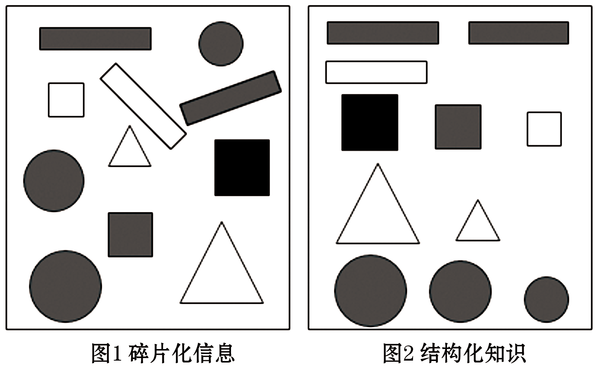

# 2025年山东省青岛市市南区青岛大学附属中学中考二模语文试题（解析版）

> 📌 **试题标定**：山东省青岛市市南区 | 2025年 | 中考二模

---

<b>2025</b><b>年山东省青岛大学附中中考语文二模试卷</b>

<b>一、积累及运用（</b><b>18</b><b>分）</b>

1. 阅读回答问题

青年者，国家之魂。①<u style="text-decoration: wavy;">青年理想远大、信念坚定。是一个国家、一个民族</u>无坚不摧<u style="text-decoration: wavy;">的前进动力。</u>心中有魂，脚下有根。在百余年的栉（zhì）风沐雨中，<u>          </u>出无数如陈延年、陈乔年、邓中夏等胸怀报国理想的青年，他们寻求救国救民之真理，用短暂而又绚丽的生命告诉世界，<u>          </u>是中国青年强烈的爱国担当。

承鸿鹄（hú）之志，踏追梦之路。争做有理想、敢担当的新时代好青年，是国家对青年一代的殷切<u>          </u>，也为青年一代的成长指明了努力方向。②<u style="text-decoration: wavy;">在中国现代化的新征程上，新时代青年是人才强国战略的人力资本支撑，是新发展模式的创新主力军</u>，是推进文化强国建设的<u>          </u>。

③<u style="text-decoration: wavy;">中国现代化是广大青年积极参与，无数青年科技工作者从</u><u style="text-decoration: wavy;">“</u><u style="text-decoration: wavy;">后备军</u><u style="text-decoration: wavy;">”</u>跻<u style="text-decoration: wavy;">（</u><u style="text-decoration: wavy;">qī</u><u style="text-decoration: wavy;">）身</u><u style="text-decoration: wavy;">“</u><u style="text-decoration: wavy;">主力军</u><u style="text-decoration: wavy;">”</u>。比如，④<u style="text-decoration: wavy;">国家重点研发计划参研人员中，</u><u style="text-decoration: wavy;">45</u><u style="text-decoration: wavy;">岁以下占比</u><u style="text-decoration: wavy;">80</u><u style="text-decoration: wavy;">%以上</u>；北斗导航、探月探火等重大战略科技任务的许多项目团队平均年龄都在30多岁……青年科技工作者用拼搏成就梦想，在中国现代化的道路上施展报负，淬（cuì）炼“一代更比一代强”的亮色，为建设科技强国贡献青春力量。

（1）文中加点字注音不正确的一项是（   ）

A. 栉（zhì）	B. 鹄（hú）	C. 跻（qī）	D. 淬（cuì）

（2）文中加点词语有错别字的一项是  （   ）

A. 无坚不摧	B. 绚丽	C. 殷切	D. 施展报负

（3）文中横线上应填入的词语，最恰当的一项是（   ）

A. 呈现    以身殉职    等待    践行者

B. 涌现    以身许国    期待    践行者

C. 呈现    以身许国    期待    协调者

D. 涌现    以身殉职    等待    协调者

（4）上面语段中画波浪线的四个句子，有语病的一项是（   ）

A. ①	B. ②	C. ③	D. ④

【答案】（1）C    （2）D    （3）B    （4）C

【解析】

【小问1详解】

本题考查字音

C.跻身：jī shēn，使自己上升到（某种行列、位置等）。

故选C。

【小问2详解】

本题考查字形。

D.施展报负——施展抱负，发挥、运用自己的远大志向和理想；

故选D。

【小问3详解】

本题考查词语理解与运用。

第一空，“涌现”指大量出现，“呈现”指显出，多用于景象、状态。“涌现”符合语境中出现“无数青年”的表述。

第二空，“以身许国”强调把自身献给国家，符合青年爱国担当的主题；“以身殉职”侧重为职责牺牲，语境更侧重主动奉献而非特定职责。所以用“以身许国”符合青年的爱国担当的语境。

第三空，“期待”指期望、等待。“等待”仅指不行动地等候。本句用“期待”能体现国家对青年的殷切期望。

第四空，“践行者”指实行、实践的人，与“推进文化强国建设”搭配恰当；“协调者”侧重调和关系，与语境不符。

故选B。

【小问4详解】

本题考查病句辨析及修改。

C.③句病因是成分残缺，缺少宾语中心语，应在“积极参与”后加“的事业”，改为“中国现代化是广大青年积极参与的事业”，使句子结构完整；

故选C。

2. 学校组织浮山研学活动，请你参加并完成下面小题。

（1）下图圆形图标中央，需要添加一个主题字。请你从“研”“学”二字中选择其一，并结合下面的字义说明理由。

| 研：字义：谓以石磨物曰研也。《说文解字注》 | 学：字义：学，觉悟也。《说文解字注》 |
| --- | --- |

（2）在这次研学活动中还将举办“感受春天活力，探索浮山之美”的美术实践活动。这一活动为期半天，学校相关组织者提出三点要求：①突出美术学科的特色；②自由活动时间充足；③举止文明，安全第一。下面有的环节设置不太合理，请你根据要求找出一处不合理环节，写出修改建议并简要说明理由。

环节一：

【听春】在大草坪听《从美学角度欣赏春天的浮山》讲座，时长2小时。

环节二：

【绘春】在大草坪举行有关“春天”的绘画比赛，画下美好的春天。

环节三：

【留春】在登浮山途中采下最美的花朵做成书签，留住多彩的春天。

【答案】（1）示例一：选“研”：“研”有研磨、深入探究之意（《说文解字注》：“以石磨物曰研”），契合研学活动对浮山自然、人文等方面细致探究的特点。

示例二：选“学”：“学”意为觉悟、获取知识（《说文解字注》：“学，觉悟也”），强调在浮山实践中学习成长、收获新感悟。

（2）不合理环节：环节三[留春]采摘花朵制作书签。

修改建议：用画笔或相机记录春天景象。

理由：采摘花朵破坏生态，违背“举止文明”要求；改用艺术方式记录，既符合美术学科特色，又能保护自然。

【解析】

【小问1详解】

本题考查字词含义。

如果选择“研”字：从《说文解字注》中“谓以石磨物曰研也”可知，“研”有深入探究、研磨事物的意思。研学活动强调学生通过实践对事物进行深入的研究和探索，就如同用石磨研磨东西一样，对浮山的自然、人文等方面进行细致地探究，所以“研”字能很好地体现研学活动深入探究的特点。

如果选择“学”字：根据《说文解字注》“学，觉悟也”，“学”侧重于通过各种经历获得知识、实现自我觉悟和成长。在浮山研学活动中，学生可以在浮山的自然环境和实践活动中学习到书本以外的知识，获得新的感悟和觉悟，“学”字突出了在活动中学习成长的意义。

【小问2详解】

本题考查活动设计。

不合理环节：环节三【留春】在春浮山途中采下最美的花朵做成书签，留住多彩的春天。

修改建议：改为在浮山途中用画笔或相机记录下最美的春天景象。

理由：采摘花朵既不符合“举止文明，安全第一”的要求，破坏了浮山的自然生态环境，也不符合美术学科特色中对美的尊重和保护。用画笔或相机记录春天，既能突出美术学科特色，又能保证自由活动时间，同时做到举止文明，保护自然环境。

3. 学校举办“完善自我，发展自我”的主题演讲活动。请在横线上填写相应的句子，补全小冀同学的演讲稿。

“完善自我，发展自我”是人生的永恒课题。我们当有“俗子胸襟谁识我？①_________________”的气概，自我砥砺。即使“②_________________，将登太行雪满山”，也要迎难而上。面对人生莫测的变数时，我们应有苏轼所言“人有悲欢离合，③_________________，此事古难全”的豁达与乐观，接纳不完美，笑看风云起；也需有王安石所云“④_________________，自缘身在最高层”的气魄与远见，不被困境所阻。时光流转中，我们不必有“无可奈何花落去，⑤_________________”的惆怅与感慨，要珍惜当下，在完善自我的征程上如鲲鹏一样“水击三千里，⑥_________________”，逐浪勇向前，追梦敢争先。

【答案】    ①. 英雄末路当磨折    ②. 欲渡黄河冰塞川    ③. 月有阴晴圆缺    ④. 不畏浮云遮望眼    ⑤. 似曾相识燕归来    ⑥. 抟扶摇而上者九万里

【解析】

【详解】本题考查名句默写。默写题作答时，一是要透彻理解诗文的内容；二是要认真审题，找出符合题意的诗文句子；三是答题内容要准确，做到不添字、不漏字、不写错字。本题中的“磨折、塞、畏、燕、抟、扶摇”等字词容易写错。

<b>二、阅读（</b><b>52</b><b>分）</b>

4. 学校组织“名著角色扮演与感悟分享”活动，同学们分组准备后要上台分享成果，以下四位同学对所扮演角色及感悟的总结，其中有误的一项是（　　）

A. 我扮演的是《简•爱》中的简•爱，她出身低微却自尊自强，始终坚定地追求平等与自由，她教会我不管面对何种困境，都要坚守内心的原则。

B. 我们小组演绎的是《水浒传》中“智取生辰纲”片段，吴用足智多谋，晁盖豪爽仗义，他们巧用计谋劫取生辰纲，展现了梁山好汉反抗官府压迫的英勇无畏，让我深感热血沸腾。

C. 我诠释的是《昆虫记》里的法布尔，他像一个神奇的昆虫探险家，深入昆虫世界，细致入微地观察并记录昆虫的生活习性，他的专注与执着告诉我们做学问就要有这种一丝不苟的精神。

D. 我饰演的是《骆驼祥子》中的虎妞，她粗俗泼辣、工于心计，是祥子走向堕落的罪魁祸首，她的出现让我看到人性最丑恶的一面，也为祥子的悲惨命运而痛心。

【答案】D

【解析】

【详解】本题考查名著内容理解辨析。

D.有误，结合《骆驼祥子》全书可知，虎妞的粗俗泼辣与工于心计确实对祥子的生活造成重要影响，但祥子走向堕落的根本原因是旧社会的压迫（如兵匪抢车、孙侦探敲诈等）。虎妞并非“罪魁祸首”，她对祥子也有真诚的情感，其悲剧性同样折射了时代无奈。此表述片面夸大了虎妞的作用，忽略了社会环境的决定性因素。

故选D。

5. 为了加深同学们对名著的理解，语文老师特地给三部名著各选了一个主题词。请你根据示例，从以下三部名著中任选一部，根据所给的主题词为同学们讲述你的理解。

A.《艾青诗选》“苦难”

B.《骆驼祥子》“困境”

C.《水浒传》“改变”

示例：选择《昆虫记》“生命”。《昆虫记》中，面对严酷的自然环境和激烈的生存竞争，昆虫们展现出了生命的顽强与强大的适应力。例如蝉在地下忍受四年的黑暗与孤独，只为一夏之鸣；蜘蛛巧妙织网，精准捕猎。这启发我们，外在环境虽然艰苦，但生命更强大。

【答案】示例一：选择A.《艾青诗选》“苦难”。艾青的诗歌常常以深沉的情感和细腻的笔触描绘人生的苦难。在《艾青诗选》中，他通过对自然、社会、人生的描写，表达了对苦难生活的深切感受。他的诗歌中充满了对苦难的控诉和反思，同时也蕴含着对美好未来的向往和追求。艾青的诗歌让我们更加关注社会的底层人群，感受他们的痛苦和挣扎，也让我们更加珍惜来之不易的幸福生活。

示例二：B。选择《骆驼祥子》“困境”。《骆驼祥子》通过讲述祥子这一普通车夫的悲惨遭遇，展现了人在社会困境中的挣扎与无奈。祥子原本是一个勤劳、善良、正直的人，但在旧社会的种种压迫和剥削下，他逐渐失去了生活的希望和信心。他的人生充满了困境和挫折，但他却始终没有放弃对美好生活的追求。祥子的故事让我们深刻感受到社会的黑暗和不公，也让我们更加珍惜今天的幸福生活。

选择C。《水浒传》“改变”。在逆境中，林冲刚开始的选择的是“逆来顺受”，导致自己一再被人冤枉、凌辱；后来经过一系列的事情，林冲终于不再逆来顺受，而是大胆与之抗争，这种抗争的精神正是林冲的改变。对于我们来说，要有与逆境抗争的勇气。

【解析】

【详解】本题考查理解名著的主题。

这是开放性作答的题目，结合示例可知，首先我们要明确名著与主题词的核心关联，然后选取最能体现主题的典型事件，避免笼统概括。接着透过情节分析主题的文学内涵（如生命的意义、苦难的本质等）。最后我们将文学主题转化为对生活、社会的启示，体现阅读价值即可。

《艾青诗选》：艾青的诗歌创作分为两个阶段，第一阶段是三四十年代，其作品从滚滚烽烟中汲取诗情，表现了进取、乐观、昂扬的战斗精神。第二阶段是在1978年以后，其诗风也发生了很大的变化。诗句变得更整齐，诗情变得更深沉，诗意变得更警策。他的诗歌的中心意象是土地和太阳，而主题则是爱国主义。表现诗人对中国乡村和农民命运的深切关注，对光明与温暖以及所有美好事物的不懈追求，而深沉灼热的爱国情绪将二者融为一体。艾青从生活的点滴中汲取力量，传达光明与希望，播撒忠诚和爱，永远忠实地带给我们以慰藉。他饱含深情而又充满哲理的诗句，为我们在黑暗中带来乐观、坚强的指引。在读艾青诗歌的过程中，我们应该学会感受和体验作者深沉的爱国情怀，从而树立正确的人生观、价值观。

《骆驼祥子》：《骆驼祥子》讲述了旧社会中国北平城里的一个年轻好强、充满生命活力的人力车夫祥子为实现能拥有一辆自己的车的梦想，经历了三起三落，最后被黑暗的社会所吞没，失去了生活的信心，自暴自弃，堕落沉沦的故事，老舍在祥子的下层城市贫民身上所发现的劳动人们的困境，他们不敢正视现实，抱有自欺欺人的幻想，以及人与人之间的冷漠、个人奋斗道路破灭以后的苟且忍让，以此揭露了中国半殖民地半封建社会底层人民的悲惨命运。

《水浒传》：《水浒传》生动地描写了梁山好汉们从起义到兴盛再到最终失败的全过程，特别是通过写众多草莽英雄不同的人生经历和反抗道路，鲜明地表现了“官逼民反”的主题。这些农民英雄个个都是勇武智慧、顶天立地的英雄，他们在面对黑暗势力的压迫时，勇于反抗黑暗的封建统治，对抗腐败的官府，改变自己的人生，“替天行道，保境安民”。

示例：

我选择《艾青诗选》。艾青在《雪落在中国的土地上》中，以“风”“雪”“寒冷”等意象描绘民族苦难图景，农民佝偻着背在雪地迁徙，老妇含泪诉说离散之痛。这些诗句让我感受到苦难对个体生命的摧折，更看到诗人对土地的深情与对光明的渴望。苦难虽沉重，却能淬炼出人性光辉，这启示我们直面困境时，需以悲悯之心传递希望的力量，即使身处苦难，也不应放弃希望，要敢于反抗与追求。

阅读下面两首词，完成后面题目。

渔家傲

李清照

天接云涛连晓雾，星河欲转千帆舞。仿佛梦魂归帝所，闻天语，殷勤问我归何处。

我报路长嗟日暮，学诗谩有惊人句。九万里风鹏正举。风休住，蓬舟吹取三山去！

鹧鸪天·桂花

李清照

暗淡轻黄体性柔，情疏迹远只香留。何须浅碧深红色，自是花中第一流。

梅定妒，菊应羞，画阑开处冠中秋①。骚人②可煞③无情思④，何事⑤当年不见收。

【注释】①“画阑”句：化用李贺《金铜仙人辞汉歌》的“画栏桂树悬秋香”之句意，谓桂花为中秋时节首屈一指的花木。②骚人、楚人：均指屈原。③可煞：疑问词，犹可是。④情思：情意。⑤何事：为何。

6. 下列对这两首词的理解和分析不正确的一项是（    ）

A. 《渔家傲》中“归”字饱含作者经历人生道路上的流徙奔波后，希望得到一个理想归宿的热切愿望。

B. “我报路长嗟日暮，学诗谩有惊人句”表达了诗人空有才华，终遭逢不幸的深沉慨叹。

C. “暗淡轻黄体性柔，情疏迹远只香留。”短短十四字却形神兼备，写出了桂花的独特风韵。

D. 李清照是宋词中婉约风格的代表作家，她的词以婉约细腻为主，这两首词就代表了她的这种风格。

7. 有人说《鹧鸪天》中的“桂花”正是词人品格的写照。请结合两首词简要分析李清照具有的品格。

【答案】6. D    7. 《鹧鸪天》夸赞桂花“自是花中第一流”，表现词人志趣高远，品格高洁；《渔家傲》下片有词人对自己才华的自负，又有词人壮志的抒发、理想的追求，体现她豪迈奔放（豪放不羁）、富有浪漫色彩（渴望自由）的品格。

【解析】

【6题详解】

本题考查诗歌内容理解。

D.《渔家傲》中“天接云涛连晓雾，星河欲转千帆舞”意思是说，天空连接着那象波浪一样翻滚的云霞，这些云霞又是和晨雾连在一起，显得曙色胧朦。而透过云雾远远望去，银河中波涛汹涌，象要使整条河翻转过来似的。河中许许多多帆船在滚滚的大浪中颠扑，风帆摆动得象在银河中起舞一样。“九万里风鹏正举。风休住，蓬舟吹取三山去”她要象大鹏那样乘万里风高飞远举，离开那龌龊的社会。叫风不要停止地吹着，把她的轻快小舟吹到仙山去，使她过着那自由自在的生活。这首词，思路开宕，想象丰富，意境辽阔，充满了浪漫主义色彩。它把读者带到仙境中去，饱览丰富多姿的云涛；大鹏展翅万里的浩大境界，以及那轻舟乘风吹向三山的美景，使人为之神往。构成了这首具有浪漫情调而又气魄宏伟的豪放词。与题干中“这两首词就代表了她的这种风格”不符。

故选D。

【7题详解】

本题考查人物形象分析。

《鹧鸪天》“暗淡轻黄体性柔，情疏迹远只香留。何须浅碧深红色，自是花中第一流”意思是淡黄色的桂花，并不鲜艳，但体态轻盈。于幽静之处，不惹人注意，只留给人香味。不需要具有名花的红碧颜色。桂花色淡香浓，应属最好的。写桂花的颜色姿质，赞美它淡雅、高洁、柔和的品性，形神兼备，独有风韵；接着议论抒情，直言桂花不需群花那样的“色”美，亦“自是花中第一流”。“梅定妒，菊应羞，画阑开处冠中秋”意思是梅花肯定妒忌它，而它又足以令迟开的菊花感到害羞。桂花是秋天里百花之首，天经地义。赞美桂花为群芳之冠，先从节令上看，以梅菊衬比，桂花为中秋之冠；“骚人可煞无情思，何事当年不见收”意思是可憾屈原对桂花不太了解，太没有情意了。不然，他在《离骚》中赞美那么多花，为什么没有提到桂花呢？结尾评议屈原多以珍贵花草喻君子美德，唯独未写桂花之美引为憾事，再度突出桂花的高雅。表现了李清照志趣高远，重内在美、素质美，已桂花自比表现诗人品格高洁。

《渔家傲》“我报路长嗟日暮，学诗谩有惊人句。九万里风鹏正举。风休住，蓬舟吹取三山去”意思是我回报天帝说：路途漫长又叹日暮时不早，学作诗，枉有妙句人称道，却是空无用。长空九万里，大鹏冲天飞正高。风啊！请千万别停息，将这一叶轻舟，载着我直送往蓬莱三仙岛！表现了李清照对自己才华的自信，又有词人壮志的抒发，对理想的追求，体现她豪迈奔放、渴望自由的品格。

<b>（</b><b>12</b><b>分）文言文阅读。</b>

8. ①冯异者，颍川人也。好读书，通《左氏春秋》《孙子兵法》。

②汉兵起，异与苗萌共据五城，为王莽拒汉。光武①略地颍川，久攻不下。异出行，为汉兵所执。其从兄冯孝，从光武，荐异，得召见。异曰：“异一夫之用，不足为强弱。有老母在城中，愿归据五域，以效功报德。”光武曰：“善。”异归，谓苗萌曰：“今诸将皆壮士崛起，多暴横，独刘将军所到不虏掠。观其言语举止，非庸人也，可以归身。”苗萌曰：“死生同命，敬从子计。”光武及此，异等即开门奉牛酒迎。光武署异为主簿，苗萌为从事。

③李轶守洛阳，光武乃拜异为孟津将军，以拒之。异遗李轶书曰：“愚闻明镜所以照形，往事所以知今。昔徵子去殷而入周，项伯畔楚而归汉，周勃迎代王而黜②少帝。彼皆畏天知命，见废兴之事，故能成功于一时，垂业于万世也。<u style="text-decoration: wavy;">君诚能觉悟成败亟定大计论功古人在此时矣</u>。”轶虽知长安已危，欲降又不自安。乃报异书曰：“轶本与刘将军首谋造汉，结死生之约。惟深达刘将军，愿进愚策，以佐国安人。”轶自通书之后，不复与异争锋，故异因此攻城略地。

④异为人谦退不伐③，行与诸将相逢，辄引车避道。每所止舍，诸将并坐论功，异常独屏④树下，军中号曰“大树将军”。

（节选自《后汉书冯异列传》，有删改）

【注释】①光武：和下文“刘将军”均指汉光武帝刘秀

②黜：废，贬退。③伐：自我夸耀。④屏（bǐng）：退避。

（1）下列对文中加点的词语及相关内容的解说，不正确的一项是（   ）

A. “异一夫之用”与《陈涉世家》中的“又间令吴广之次所旁丛祠中”的“之”意思相同。

B. “项伯畔楚而归汉”与《得道多助，失道寡助》中“攻亲戚之所畔”的“畔”意思相同。

C. “以拒之”与《出师表》中的“先帝不以臣卑鄙”中的“以”意思不同。

D. “辄引车避道”与《三峡》中的“属引凄异”的“引”意思不同。

（2）文中画波浪线的部分有三处需要断句，请用“/”正确断句。

君诚能觉悟成败亟定大计论功古人在此时矣。

（3）将下面的语句翻译成现代汉语。

①异出行，为汉兵所执。

②愚闻明镜所以照形，往事所以知今。

（4）文末冯异军中号曰“大树将军”，请简要说明他的将军风范表现在哪些方面。

【答案】（1）A    （2）君诚能觉悟/成败亟定大计/论功古人/在此时矣。

（3）①冯异外出巡查，被汉兵捉住。

②我听说用明镜可以照见自己的形貌，借鉴往事可以明白当今的事理。

（4）有识人之明、善于谋略、谦逊退让。

【解析】

【导语】本文通过四段文字展现了冯异作为东汉开国名将的立体形象。①段突出其学识修养，精通兵法；②段通过“献城归汉”事件体现其审时度势的政治智慧；③段以劝降李轶展现其“不战而屈人之兵”的军事才能；④段则用“大树将军”的雅号凸显其谦逊退让的人格魅力。全文以典型事例勾画出一位智勇双全、德才兼备的儒将形象，其中“引车避道”“独屏树下”等细节描写尤为传神。

【小问1详解】

本题考查一词多义。

A.“异一夫之用”中的“之”是结构助词，可译为“的”；“又间令吴广之次所旁丛祠中”的“之”是动词，意思是“到”。二者意思不同；

故选A。

【小问2详解】

本题考查文言断句。

这句话句意：您如果确实能够醒悟明白其中的成败道理，就应赶快定下重大计策，与古人论功相比，时机就在此刻。“君诚能觉悟”中，“君”作主语，“诚能觉悟”表达“确实能够醒悟”，语义完整；“成败亟定大计”里，“成败”偏向“成功”，结合语境，在知晓成功关键后“赶快定下重大计策”，语义连贯独立；“论功古人”是“与古人论功相比”，“在此时矣”强调时机，“论功古人”表意完整。因此断句为：君诚能觉悟/成败亟定大计/论功古人/在此时矣。

【小问3详解】

本题考查译句。重点词语：

①异：人名。行：出行。为：被。执：捕捉，捉住。

②愚：谦辞，用于自称。闻：听说。所以：用来……的。照：映照。形：身形，容貌。往事：过去的事情。知：推知，了解。今：现在。

【小问4详解】

本题考查分析人物形象。

联系第②段中“异归，谓苗萌曰：‘今诸将皆壮士崛起，多暴横，独刘将军所到不虏掠。观其言语举止，非庸人也，可以归身。’”可知，冯异能从刘秀军队不掳掠的军纪与言行举止中，判断出其非平庸之辈，果断建议苗萌一同归附，展现出敏锐的识人之明。联系第③段中“异遗李轶书曰……”及“轶自通书之后，不复与异争锋，故异因此攻城略地”可知，冯异以历史典故劝降李轶，不战而屈人之兵，巧妙利用谋略为刘秀攻城略地，体现出卓越的军事智慧与谋略才能。联系第④段中“异为人谦退不伐，行与诸将相逢，辄引车避道。每所止舍，诸将并坐论功，异常独屏树下”可知，冯异为人谦逊退让，遇诸将主动让道，论功时独自退避树下，不与他人争功，其“大树将军”的称号正是这种品格的生动写照，彰显出不矜不伐的将军风范。

【点睛】参考译文：

冯异，是颍川人。喜欢读书，通晓《左氏春秋》《孙子兵法》。

汉兵起事时，冯异与苗萌一起占据五座城邑，为王莽抵御汉军。光武帝刘秀夺取颍川之地，长时间攻打不下来。冯异外出巡查，被汉兵俘虏。他的堂兄冯孝，跟随光武帝，推荐冯异，（冯异）得以被召见。冯异说：“我一个人的作用，不足以影响您的强弱。我有老母在城中，希望回去据守五座城邑，来为您效力报答恩德。”光武帝说：“好。”冯异回去后，对苗萌说：“如今众将领都是由壮士兴起，大多残暴蛮横，只有刘将军所到之处不掠夺。看他的言语举止，不是平庸的人，可以归附他。”苗萌说：“生死与共，恭敬地听从您的计策。”光武帝来到这里，冯异等人就打开城门献上牛和酒迎接。光武帝任命冯异为主簿，苗萌为从事。

李轶驻守洛阳，光武帝于是任命冯异为孟津将军，来抵御李轶。冯异给李轶写信说：“我听说明镜是用来照出原形的，回顾往事是用来了解现在的。从前微子离开殷朝进入周朝，项伯背叛楚国归附汉朝，周勃迎接代王而废黜少帝。他们都是畏惧天命，看到了兴亡的事情，所以能在一时成功，传功业于万世。您如果能认清成败的形势，赶快决定大计，（像古人那样）论功行赏，就在此时了。”李轶虽然知道长安已经危险，想要投降又心里不安。于是回复冯异的信说：“我本来与刘将军首先谋划建立汉朝，结下生死之约。希望您深深传达我的心意给刘将军，我愿意进献我的愚计，来辅佐国家安定百姓。”李轶自从通书信之后，不再与冯异争战，所以冯异因此能够攻城略地。

冯异为人谦逊退让不自我夸耀，出行与各位将领相遇，总是拉车避让道路。每次军队停下来休息，各位将领一起坐着谈论功劳，冯异常常独自退避到树下，军中称他为“大树将军”。

<b>（</b><b>9</b><b>分）非连续性文本阅读。</b>

9. 材料一

课堂能听懂，考试却不会，出现这种情况，原因可能是这些知识在他头脑中是散乱的、碎片化的（如图1），因此答题时不能准确提取相关知识，或提取出错。如果你头脑中的知识是有规律、成体系的结构化知识（如图2），在运用时就能准确提取了。因为我们的大脑处理不了太多零散复杂的信息，大脑更喜欢结构化的信息。如何让碎片化的信息结构化呢？这就必须对散乱的信息进行梳理、归纳、整合。

（改编自微信公众号“给思考留点时间”）

【材料二】

①“碎片化”思维习惯是指人们在长期接受各类不完整、缺乏逻辑性的信息过程中逐渐形成的一种表面化、简单化、情绪化的思维模式，本质上是思维能力的退化。“碎片化”思维习惯在青年中的表现有：精力集中难度加大，注意力日益减弱；长文阅读能力下降，阅读耐性趋低；深度思考能力弱化，思维惰性增大。

②这与互联网时代的信息特征有关，例如：信息逻辑不严谨，内容有东拼西凑、断章取义的痕迹，信息的推理演绎过程在传播途中被简化甚至省略等。虽然这是碎片化时代的传播需要，但却导致青年持续接收到大量缺乏逻辑支撑和严密推理过程的信息碎片。而且，大脑具有可塑性，当神经细胞随着感官输入做出调整、形成新神经回路的时候，大脑会尽量保持这种新结构，并因持续体验而不断强化。“碎片化”思维习惯就是因为不断阅读、接收碎片化信息导致的。

（整理自滕进芝《青年思维习惯“碎片化”趋势审视》）

【材料三】

①培养结构化思维能抵制碎片化信息时代带来的弊端。结构化思维是以事物的结构为思考对象，来引导思维，从而有效表达和解决问题的一种思维方法，它具有以下作用：

②1、能处理复杂深刻的问题。结构化思维能帮助我们更全面地思考问题，对复杂信息进行梳理归类，并对问题进行剖析，从而揭示问题的本质。它还能把复杂问题拆解成一个个简单的小问题，再逐一解决，最终把问题全部解决。

③2、能理清思路，清晰表达，利于他人理解。在说话时运用“因为……，所以……”“第二……；第三……”等逻辑关系词汇，让表达更加清晰。

④3、帮助构建知识体系。知识体系是一个树状结构，建立了这种结构后，在后续学习时就能将一个个知识点添加到知识树上去，不断地丰富和完善知识体系。

⑤用结构化思维来解决问题，最关键的是寻找结构，有自上而下和自下而上两种方法。

⑥自上而下找结构主要适用于对一个主题或问题进行结构化拆分，如语文老师教写议论文，将中心论点分解为几个分论点。

⑦自下而上找结构主要适用于处理庞杂的信息，根据信息之间的某种关系来建立框架。如，对以下词语进行分类：白菜、香蕉、大象、牛、李子、豆角。

⑧通过分析找到分类维度——水果、蔬菜、动物，再将以上词语进行归类。

⑨自上而下和自下而上这两种方法无优劣之分，在实际运用时，彼此互为补充。而且，要形成结构化的思维能力，就必须经常练习。

（整理自周国元《麦肯锡结构化战略思维》）

（1）临近中考，很多同学觉得老师教的知识都记住了，但考试时却不能正确作答，根据【材料一】和【材料二】推断，以下不是该问题产生原因的一项是（   ）

A. 持续接收到大量缺乏逻辑支撑和严密推理过程的信息碎片。

B. 互联网时代信息在传播途中被简化甚至省略。

C. 缺少有规律、成体系的结构化知识。

D. 长文阅读能力弱，阅读耐性低；深度思考能力弱，思维惰性大。

（2）同学们想要依据【材料一】中的图案绘制宣传海报，向大家宣传结构化思维的好处，请你提炼【材料三】的内容补充文案。

你还在为考试时的答案苦恼吗？你还在畏惧复杂的知识点吗？迷雾中，结构化思维为你亮起坐标系的灯塔。它击破复杂艰深，直达问题本质；它①____________________；它②____________________。少年向上攀登的脚手架，就是用逻辑的经纬线，缝补每个断点的光。

（3）中考复习阶段，同学们想要对初中三年学习的唐诗进行归纳整理，请你结合【材料三】和以下诗作，任选一个角度说说如何运用结构化思维来组织有效的复习。

| 《送杜少府之任蜀州》（唐•王勃） | 《雁门太守行》（唐•李贺） | 《使至塞上》（唐•王维） |
| --- | --- | --- |
| 《春望》（唐•杜甫） | 《渡荆门送别》（唐•李白） | 《泊秦淮》（唐•杜牧） |

【答案】（1）D    （2）    ①. 能理清思路，清晰表达，让沟通更加顺畅    ②. 能帮助构建知识体系，让学习更加高效

（3）示例一：运用自上而下找结构的方法，从诗歌主题角度进行结构化复习。将这些唐诗分为送别诗（《送杜少府之任蜀州》《渡荆门送别》），复习时关注送别诗中常见的意象如柳、酒等，以及表达的情感如不舍、劝勉等；战争诗（《雁门太守行》），复习其描写战争的场景、体现的爱国情怀等；边塞诗（《使至塞上》），把握边塞风光的特点、诗人的情感等；爱国诗（《春望》），体会诗人对国家命运的忧虑；咏史诗（《泊秦淮》），分析诗人借古讽今的手法和情感。

示例二：运用自下而上找结构的方法，先提取每首诗的关键词，如《送杜少府之任蜀州》的“送别”，《雁门太守行》的“战争”，《使至塞上》的“边塞”，《春望》的“爱国”，《渡荆门送别》的“送别”，《泊秦淮》的“咏史”。然后根据这些关键词之间的关系建立框架，将诗歌归类为送别诗、战争诗、边塞诗、爱国诗、咏史诗进行复习。

【解析】

【导语】文本通过三则材料，深入探讨了“碎片化”思维与“结构化”思维的对比及其影响。材料一通过图示直观展示了知识碎片化与结构化的差异，强调结构化知识在考试中的重要性。材料二分析了“碎片化”思维的形成原因及其对青年思维能力的负面影响。材料三则提出了结构化思维的优势及其培养方法，强调其在处理复杂问题、清晰表达和构建知识体系中的作用。

【小问1详解】

本题考查对材料内容的理解与辨析。

A.是，材料二提到“‘碎片化’思维习惯在青年中的表现有……深度思考能力弱化，思维惰性增大”，且“导致青年持续接收到大量缺乏逻辑支撑和严密推理过程的信息碎片”，这会使知识在头脑中碎片化，影响考试作答，是该问题产生的原因；

B.是，材料二指出“这与互联网时代的信息特征有关，例如：信息逻辑不严谨，内容有东拼西凑、断章取义的痕迹，信息的推理演绎过程在传播途中被简化甚至省略等”，这种信息特征导致接收到的知识碎片化，是该问题产生的原因；

C.是，材料一表明“原因可能是这些知识在他头脑中是散乱的、碎片化的”，而结构化知识能让运用时准确提取，缺少结构化知识会导致考试不能正确作答，是该问题产生的原因；

D.不是，“长文阅读能力弱，阅读耐性低；深度思考能力弱，思维惰性大”是“碎片化”思维习惯在青年中的表现，而不是老师教的知识记住了但考试不能正确作答的原因，该选项不符合题意；

故选D。

【小问2详解】

本题考查补写内容。

首先，仔细阅读材料三，理解结构化思维的定义及其三个主要作用：处理复杂问题、理清思路清晰表达、帮助构建知识体系。

然后，从材料三中提炼出结构化思维的核心优势，特别是与海报文案相关的部分。

第一空，根据材料三第③段“能理清思路，清晰表达，利于他人理解。在说话时运用‘因为……，所以……’‘第二……；第三……’等逻辑关系词汇，让表达更加清晰”可知，结构化思维可以帮助整理繁杂无序的信息，使思路清晰，表达有条理。所以①处可填“能理清思路，清晰表达，让沟通更加顺畅”。

第二空，根据材料三第④段“帮助构建知识体系。知识体系是一个树状结构，建立了这种结构后，在后续学习时就能将一个个知识点添加到知识树上去，不断地丰富和完善知识体系”可知，结构化思维能够改变知识碎片化的状态，帮助完善知识体系。所以②处可填“能帮助构建知识体系，让学习更加高效”。

【小问3详解】

本题考查对材料的拓展运用。

根据材料三第⑥段提到“自上而下找结构主要适用于对一个主题或问题进行结构化拆分”可知，对于初中三年学习的唐诗复习，可以将唐诗的专题学习进行结构化拆分，如分解为诗歌的意象、思想情感、艺术手法等方面来整理，这样可以更系统、深入地理解每一首唐诗在这些方面的特点和规律。

根据材料三第⑦段指出“自下而上找结构主要适用于处理庞杂的信息，根据信息之间的某种关系来建立框架”可知，对于这些唐诗，可以通过分析诗作之间的关系找到分类维度进行归类整理。比如按照创作时期分类，《送杜少府之任蜀州》的作者王勃是初唐诗人，《使至塞上》的作者王维、《渡荆门送别》的作者李白、《春望》的作者杜甫是盛唐诗人，《雁门太守行》的作者李贺、《泊秦淮》的作者杜牧是晚唐诗人；也可以按照题材分类，如《春望》《雁门太守行》可归为爱国诗，《使至塞上》可归为边塞诗等。

根据材料三第⑨段还提到“自上而下和自下而上这两种方法无优劣之分，在实际运用时，彼此互为补充”可知，在复习唐诗时，可以将两种方法结合起来，先通过自上而下的方法确定从哪些方面去分析唐诗，再通过自下而上的方法对具体的诗作进行分类整理，从而更全面、有效地组织复习。

<b>（</b><b>18</b><b>分）现代文阅读。</b>

10. 最美的重逢

李竞辉

①泱泱中华，五千年璀璨文明，每一件文物都承载着中华文明的历史。然而令人痛心的是，晚清以来，列强东顾，国力衰微，大量珍贵文物或被掠夺，或被倒卖，成为时代之痛，民族之殇。据不完全统计，目前世界各国公私单位收藏的中国文物总量超过一千万件。散若满天星，谁将是文物的搜寻者？悠悠回归路，谁又是文物回家的铺路人？

永安故里

②一架大型客机上，一位气质高雅的中年女士正在翻阅一张当天的香港报纸，一则报道吸引了她，雍正粉彩蝠桃纹橄榄瓶在一个美国人家里做了近百年的台灯底座，近期将被拍卖。她就是香港著名的女实业家和爱国人士张永珍。她当即决定将国宝买回到中国人手里。粉彩蝠桃纹橄榄瓶最终的成交价加上佣金高达四千一百五十万港元，这样的天价高过以往几乎所有清朝瓷器在全世界的拍卖价格。

③张女士在得到这件珍稀宝物之后特意让人做了一个大保险箱，<u>像爱护自己的孩子一样</u>，将宝瓶好好地保护起来。可是过了不久，张永珍女士总觉得，把这么漂亮的一个瓶子放在保险箱里太可惜了，也不想若干年后它再被别人拿出去拍卖。她生于上海，长于上海，本着为国家和社会多做一些贡献的初心，张永珍女士做出了一个令人钦佩的决定——把宝瓶无偿捐献给上海博物馆永久收藏。张永珍女士在捐赠仪式上致辞：“不想让这独一无二、具有历史传奇的稀有珍品再次流到国外，所以今天我把它捐给国家。它不会再流浪了，因为它回到了自己的祖国。”话音落下，全场沸腾，响起了经久不息的掌声。

赤子情怀

④陈哲敬先生1927年出生于福建莆田，后移居美国，是名噪一时的雕塑家。一次，他在美国的博物馆注视着残缺破损、伤痕累累的唐昭陵六骏浮雕石刻，心中的苦楚难以言明。“那时我的心也要跳出来了，我忽然意识到祖国正把收集流失海外石刻珍品的重任，放在我们游子的肩上。”他当即做出决定——毅然放弃了自己颇为熟悉且收入不菲的雕塑专业，心甘情愿地选择了一条抢救流失海外中国文物的坎坷道路。他竭尽所能、倾其所有，四处找寻流失海外的中国佛造像，并且几十年如一日，千方百计通过各种渠道收购这些国宝，帮助它们回归祖国的怀抱。

⑤陈先生生活简朴，他的钱财几乎全部用在抢救流失海外的文物上。他曾经接受过一年做十几个蜡像的苦差事，得到的报酬全部用于收购流失海外的佛造像；他也曾忍痛割爱卖掉了自己多年珍藏的齐白石、徐悲鸿和傅抱石等名家的三十多幅字画和高档古董；他还曾不惜变卖房产，一再降低自己的居住条件和生活条件。他的家人同样被他的情怀深深触动，一直心甘情愿地支持他的事业，并与他一起为国宝回归四处奔波。几十年岁月，他的足迹几乎遍及世界每个角落，倾囊相助国宝归国。

缘悭一面

⑥2000年5月2日下午，位于香港的拍卖大厅气氛异常紧张，容纳三百人的拍卖大厅人头攒动、座无虚席。下午两时二十分，拍卖师以四百二十万港元起价拍卖乾隆粉彩镂空六方套瓶。时任北京市文物公司总经理秦公先生接到我方工作人员的电话，询问竞拍底数是多少，秦公霸气地回答：“没有底数。”经过数轮叫价，价格抬高至一千八百五十万港元，这已经是同类拍品当时出现过的最高价格。<u>坐镇北京的秦公不断地来回踱步，一言不发</u>。当拍卖师第四十四次叫价时，价格攀升到一千九百万港元，秦公在电话里果断地发出指令：“拿下！”随着拍卖师重锤落下，铭刻着英法联军火烧圆明园国耻的乾隆粉彩镂空六方套瓶终于重回祖国怀抱，连续五六个通宵不眠的秦公安下了心。他感慨地说：“国宝回归，就事情本身而言，无疑是值得庆贺的，但是只有无偿地追索回归，才能真正维护国家的尊严。”

⑦为了促成国宝回归，秦公马不停蹄、日夜操劳，身体超负荷运转。5月10日上午十一时，在竞拍成功后的第八天，还没来得及看一眼自己努力为祖国夺回的国宝，秦公先生不幸因心脏病突发，病逝在工作岗位上，给这件国宝的回归蒙上了一层英雄主义的悲壮色彩。

山海无阻

⑧众多文物流失海外，是中华文明之殇。让流失文物回家，是中华儿女责无旁贷的使命，政府也在不懈地努力。从1949年至今，我国通过执法合作、司法诉讼、协商捐赠、抢救征集等各种方式，坚定追索流失文物，成功促成了300余批次、15万余件流失海外中国文物的回归。但不能否认的是，国宝的回家之路在未来依然荆棘遍布。每一次激动人心的文物回家，亿万网友总是会用暖心的“欢迎回家”刷屏，表达了对最美重逢的欣喜，更折射出文化的认同与自信。

⑨一念在兹，山海无阻；克艰克难，荣归故土！

（节选自2022年10月出版《归来——中国海外文物回归纪实》一书，有改编）

（1）如果你要写一篇以①____________________为论点的议论文，可以选择②_________（小标题），把它概括为③____________________，作为文章的论据。

（2）请结合上下文内容，为第⑥段划线句补充一段人物内心独白。

（3）以下表述不恰当的一项是（   ）

A. 第①段写“目前世界各国公私单位收藏的中国文物总量超过一千万件”，体现出文物回归之路“道阻且长”，与结尾段“国宝的回家之路在未来依然荆棘遍布”形成呼应。

B. 第②段画线的句子“像爱护自己的孩子一样”，运用比喻，写出了张永珍对宝瓶的珍视。

C. 陈哲敬先生放弃收入不菲的专业，倾囊相助国宝归国，体现出他不求名利，一心为国的高尚品质。

D. 第三个小故事的标题《缘悭一面》，意思是没有和对方会面一次的机会，表达了对国宝遗失海外的痛心之情。

（4）本文为何将文物回归称为“最美的重逢”，请结合文章谈谈你的理解。

（5）短剧《逃出大英博物馆》爆火出圈，该片运用拟人手法讲述了来自中国的小玉壶逃出大英博物馆，央求在国外工作的中国记者带其回国的故事。短片的结尾处文物们的来信催人泪下，请你给他们写一封回信，表达内心的情感。

……“小玉壶”回到中国之后，拿着书信给在中国博物馆的文物们念来自异国他乡文物写的家书：

龙耳虎足钢方壶和朝冠耳炉：“大丈夫生于天地之间，应自强不息，夫爱国之士，不惧九重之渊，前辈不必挂怀，我虽身在万里，仍不坠爱国之心。”

明代龙纹琉璃砖：“病骨支离，离家已有百年，哪怕分神魂断，也断不了这魂牵梦绕的乡愁啊。”

明代铜铸真武像：“关内的将士们，替我死守家国！四方鼠辈，凡有犯者，必诛其族，我军，需战无不胜，令无不从，待我归营时，还我一个，太平的万里江山！”

众文物：“愿山河无恙，家国永安！愿山河无恙，家国永安！”“我们是泱泱大国，中国人不做那种偷鸡摸狗的事。总有一天，我们会风风光光，堂堂正正地回家！”

（节选自《逃出大英博物馆》台词）

【答案】（1）    ①. “爱国人士是文物回家的重要铺路人”    ②. 永安故里    ③. 张永珍高价竞拍雍正粉彩蝠桃纹橄榄瓶并捐赠给上海博物馆。

（2）示例：这乾隆粉彩镂空六方套瓶承载着圆明园的国耻，决不能再让它流落在外！就算价格再高，哪怕倾尽所有，也要把它带回家！多希望能亲自迎接它归国，让它不再漂泊……（需体现秦公对国宝的珍视、竞拍的决心及对国家尊严的维护）    （3）D

（4）①“重逢”指流失海外的文物回归祖国，与故土、民族文明重新相聚，是跨越时空的团圆；②“最美”体现在：文物承载着中华文明，回归是文化认同与自信的彰显；张永珍、陈哲敬、秦公等爱国人士以无私情怀助力回归，诠释民族大义；政府与民众共同努力，凝聚文化向心力。这种重逢不仅是器物的回归，更是民族精神的共鸣，故为“最美”。

（5）示例：

亲爱的文物们：

见字如面！你们历经沧桑却始终心怀家国，龙耳虎足钢方壶的自强不息，琉璃砖的百年乡愁，真武像的铁血忠魂，都让我们泪湿衣襟。如今，祖国已非往昔，正以坚定的步伐迎你们回家——张永珍们用血汗守护你们的归途，秦公们用生命铺就回归之路，千万双手正穿越山海，只为接你们“风风光光、堂堂正正”归来。待你们重归故土，定能看见这盛世如你们所愿：山河无恙，家国永安，文明之火，代代相传！我们等你们，一起续写中华文脉的璀璨新章！

牵挂你们的中国人

某年某月某日

【解析】

【导语】这篇《最美的重逢》以文物回归为主线，通过张永珍、陈哲敬、秦公三位爱国人士的感人事迹，展现了中华儿女守护文明根脉的赤子情怀。文章采用“小标题+故事”的叙事结构，将个人抉择与国家命运紧密相连，既有“天价竞拍”的戏剧张力，又有“倾囊相助”的奉献精神。文中比喻（如“像爱护孩子”）和细节描写（如“来回踱步”）生动传神，而文物拟人化的家书更深化了“文化认同”主题。全文以“山海无阻”的豪迈誓言作结，彰显了文物回归背后的民族尊严与文化自信。

【小问1详解】

本题考查论据概括和拓展应用。

如聚焦“爱国精神驱动文物守护”：联系第④⑤段中的“陈哲敬先生……心中的苦楚难以言明。‘那时我的心也要跳出来了，我忽然意识到祖国正把收集流失海外石刻珍品的重任，放在我们游子的肩上。’他当即做出决定——毅然放弃了自己颇为熟悉且收入不菲的雕塑专业……几十年如一日，千方百计通过各种渠道收购这些国宝，帮助它们回归祖国的怀抱”可知，①论点可设为“爱国精神是推动文物回归与守护的强大动力”；②选择小标题“赤子情怀”；③概括论据为“陈哲敬因爱国情怀，放弃优渥雕塑工作，倾其所有收购流失海外佛造像，助力国宝回归，彰显爱国精神对文物守护的驱动”。

如围绕“无私奉献促成文物回家”：联系第②③段中的“她就是香港著名的女实业家和爱国人士张永珍……她当即决定将国宝买回到中国人手里……本着为国家和社会多做一些贡献的初心，张永珍女士做出了一个令人钦佩的决定——把宝瓶无偿捐献给上海博物馆永久收藏”可知，①论点可设为“无私奉献是文物回归、重焕光彩的关键力量”；②选择小标题“永安故里”；③概括论据为“张永珍天价购回雍正粉彩蝠桃纹橄榄瓶后，因不想让文物再外流，无偿捐赠给上海博物馆，以无私奉献让文物永安故里，成为文物回归的范例”。

如突出“使命担当成就文物回归”：联系第⑥⑦段中的“时任北京市文物公司总经理秦公先生……秦公霸气地回答：‘没有底数。’……当拍卖师第四十四次叫价时，价格攀升到一千九百万港元，秦公在电话里果断地发出指令：‘拿下！’……为了促成国宝回归，秦公马不停蹄、日夜操劳……还没来得及看一眼自己努力为祖国夺回的国宝，秦公先生不幸因心脏病突发，病逝在工作岗位上”可知，①论点可设为“使命担当能跨越艰难，促成文物回归”；②选择小标题“缘悭一面”；③概括论据为“秦公为促成乾隆粉彩镂空六方套瓶回归，竞拍时果断决策，后因日夜操劳，未及见国宝便病逝，以使命担当诠释文物回归的决心，成为悲壮注脚”。

【小问2详解】

本题考查语句理解。

联系第⑥段中的“2000年5月2日下午，位于香港的拍卖大厅气氛异常紧张……时任北京市文物公司总经理秦公先生接到我方工作人员的电话，询问竞拍底数是多少，秦公霸气地回答：‘没有底数。’经过数轮叫价，价格抬高至一千八百五十万港元，这已经是同类拍品当时出现过的最高价格”可知，秦公此刻面临着天价竞拍的压力，既盼国宝回归，又担忧价格过高，但民族使命感让他坚定要拿下文物，内心在紧张权衡与家国担当间交织。

示例：这乾隆粉彩镂空六方套瓶，是圆明园的国耻见证啊！竞拍价一路飙升，到一千八百五十万港元了，可这是我们民族的宝贝，怎能让它继续在外漂泊？哪怕代价再大，也得把它带回家！我守护的不是一件器物，是国家的尊严啊……”

【小问3详解】

本题考查辨析信息。

D．联系第⑥⑦段可知，“缘悭一面”指的是秦公成功竞拍回国宝后，没来得及看一眼国宝就病逝，是秦公与国宝没能见面，并非表达对国宝遗失海外的痛心之情，该选项表述不恰当。

故选D。

【小问4详解】

本题考查赏析题目。

联系第①段“泱泱中华，五千年璀璨文明，每一件文物都承载着中华文明的历史”可知，文物本就是中华文明的物质载体，它们流失海外，是“时代之痛，民族之殇”。而当它们回归，如第③段张永珍捐赠宝瓶时说“它不会再流浪了，因为它回到了自己的祖国”，第④段陈哲敬因目睹唐昭陵六骏石刻残缺，意识到“祖国正把收集流失海外石刻珍品的重任，放在我们游子的肩上”，倾其所有助力佛造像回归，第⑥段秦公哪怕付出天价、付出生命代价，也要让乾隆粉彩镂空六方套瓶“重回祖国怀抱”，这些流失文物与祖国、与民族文明重新相聚的过程，是跨越漫长时空的“重逢”。

同时，联系第⑧段“每一次激动人心的文物回家，亿万网友总是会用暖心的‘欢迎回家’刷屏，表达了对最美重逢的欣喜，更折射出文化的认同与自信”，文物回归不只是简单的器物归来，像张永珍、陈哲敬、秦公等爱国人士，以无私奉献、民族大义推动这一进程，政府也“通过执法合作、司法诉讼、协商捐赠、抢救征集等各种方式，坚定追索流失文物”，无数人共同凝聚起让文物回家的力量，这背后是文化认同、民族精神的共鸣。所以，文物回归这场跨越苦难与坚守，连接历史与当下，凝聚个人情怀与民族大义的“重逢”，因承载着文明传承、民族情感，故而“最美”。

【小问5详解】

本题考查拓展应用。

开放性试题，要写这封回信，需紧扣文物归家主题，结合《最美的重逢》中文物回归的故事与精神，以及《逃出大英博物馆》里文物的家国情怀。从《最美的重逢》中，张永珍、陈哲敬、秦公等人“让文物回家”的坚守，能感受到民族对流失文物的牵挂；短剧里文物们“不坠爱国之心”“盼归”的心声，是回信共情的原点。回应来信里的乡愁、期许，关联文中“文物回归是文明重逢”的意义，用张永珍捐赠、陈哲敬奔波、秦公牺牲等事例，体现“守护”的行动，让回信有故事支撑。结合“愿山河无恙，家国永安”，将文物归家与民族复兴、文化传承相连，凸显“堂堂正正回家”的信念，契合两篇文本的家国主旨。

示例：

亲爱的国宝们：

当念起“离家已有百年，断不了魂牵梦绕的乡愁”，我们在故土的泪光，同你们在异乡的月华，终于交汇。

你们可知，这方故土，从未忘记你们——博物馆

灯，夜夜为你们亮着；国人的盼，年年为你们炽着；追索的路，代代为你们拼着。“凡有犯者，必诛其族”的呐喊，我们听见了！如今的中国，已能护文明周全：看执法合作斩断掠夺的黑手，司法诉讼叩响归家的门环，协商捐赠捧回滚烫的乡愁，抢救征集接住漂泊的过往。这盛世，如你们所愿，山河无恙，家国永安；这归途，正大步向前，风风光光、堂堂正正的重逢，已不远！

且待归期至，共看九州同——故土

花，为你们重绽；华夏的魂，因你们更全；民族的根，伴你们永传！

盼归的同胞们

某年某月某日

<b>三、写作（</b><b>50</b><b>分）</b>

11. 阅读下面的材料，根据要求写作。

生活中，我们常常会遇到各种“界限”。有的界限清晰明确，如法律的界限，不可逾越；有的界限模糊不清，如人际交往中的界限，需要我们去把握分寸。有时候，我们需要遵守界限，尊重规则；而有时候，我们又需要突破界限，寻求创新与发展。

请你根据对上述文字的理解和思考，或叙述生活经历，或论述其中道理，写一篇文章。

要求：依据材料的整体语意立意，自拟标题，不少于600字。文中如果出现真实的姓名或校名，请以化名代替。

【答案】例文：

把握界限，成就自我

生活是一片广袤的原野，界限则是其间纵横交错的阡陌，划分出秩序与可能。我们穿梭其中，在遵守界限与突破界限间抉择，每一次的判断，都影响着我们前行的方向。

清晰的界限，是社会正常运转的保障。法律，就是最明确的界限之一，它以条文的形式规范着人们的行为，让整个社会在有序的轨道上运行。古有商鞅变法，“王子犯法，与庶民同罪”，明确了法律面前人人平等的界限，使得秦国的法治得以推行，国力日益强盛；今有网络不是法外之地，那些在网上肆意造谣、诽谤他人的人，最终都受到了法律的制裁。法律界限不可逾越，它像一座灯塔，照亮我们前行的道路，让我们在规则内自由驰骋。

然而，生活中还有许多模糊的界限，比如人际交往。人与人之间的相处，就像两只刺猬，离得太远会寒冷，靠得太近会受伤。把握好交往的界限，是一门艺术。朋友之间，尊重彼此的隐私，不随意评价对方的选择，在对方需要时伸出援手，不过度干涉对方的生活，这样的友情才能长久。在家庭中，父母与孩子也需要界限。父母给予孩子关爱，但不过分溺爱；孩子尊重父母的意见，但也有表达自己想法的权利。只有这样，家庭关系才能和谐融洽。

但这并不意味着我们要被界限禁锢。当时代需要进步，突破界限就成为了必然。哥白尼冲破“地心说”的界限，提出“日心说”，让人类对宇宙的认知向前迈进了一大步；乔布斯突破传统手机的界限，推出iPhone，开启了智能手机的新时代。他们不满足于现状，勇敢地挑战旧有的规则，用创新改变了世界。

我们每个人都在生活的原野上前行，脚下的界限，既是约束，也是指引。我们要在遵守界限中坚守底线，在突破界限中寻求创新。在学业上，遵守学习的基本规范，这是界限；但同时突破思维定式，探索新的学习方法，这是突破。在未来的职业道路上，遵守行业规则是界限，而不断尝试新的业务模式，就是突破。

在人生的旅程中，把握好界限，我们就能在规则与自由之间找到平衡，在稳定与变化中不断成长，成就更好的自己。

【解析】

【详解】本题考查材料作文。

1.审题立意。本题核心词为“界限”，材料从界限的特点（清晰明确如法律界限、模糊不清如人际交往界限）以及对待界限的不同态度（遵守界限、突破界限）两个层面展开阐述，暗示写作需围绕“界限”在不同情境下的意义和应对方式。可从遵守界限角度立意，强调规则和法律界限的重要性，如遵守交通规则保障出行安全、遵循学术规范维护知识传承等，可立意为“严守界限，守护社会秩序与个人品德”。也可从突破界限角度立意，着眼于创新和发展，像科技创新突破传统技术界限、艺术创作打破既有风格界限等，立意为“突破界限，开启进步与发展新征程” 。还可从辩证看待角度来立意，阐述在不同情境下合理遵守或突破界限，例如在企业管理中常规运营遵守制度界限，而开拓新市场时突破传统思维界限，立意为“权衡界限，在规则与创新间寻平衡”。

2.选材构思。选择遵守界限的素材，从正面着手，列举运动员遵守比赛规则公平竞争的事例，如奥运会中选手严格遵守赛事规定，展现体育精神。从反面着手，讲述企业违规排放污水，突破环保法律界限，受到严厉制裁，影响企业声誉和发展。也可选择突破界限的素材，人物类如乔布斯打破传统手机设计和功能界限，推出iPhone，引发全球手机行业变革。科学研究方面，哥白尼突破“地心说”的理论界限，提出“日心说”，推动天文学发展。还可选择辩证素材，如文化传承与创新，传统戏曲在保留经典唱腔、表演程式等界限基础上，融入现代音乐元素和舞台技术，突破表现形式界限，吸引年轻观众。如教育改革，学校在遵循教育基本规律和教学大纲界限内，创新教学方法，开展项目式学习，突破传统课堂教学模式界限 。

可写作记叙文， 以自己参加学校科技创新比赛为经历，开始因受传统思维界限束缚，作品毫无新意。后来在老师启发下突破思维界限，大胆创新，最终取得好成绩，结尾点明突破界限对个人成长的意义。 讲述邻里之间因人际交往界限把握不当产生矛盾，后来双方互相理解，重新把握好界限，关系恢复融洽，体现人际交往中把握界限的重要性。也可写作议论文，采用总分总的结构。开头提出中心论点，如“理性对待界限，促进社会进步”。中间分论点分别论述遵守界限的必要性和突破界限的价值，各举两个以上典型事例论证。结尾总结升华，强调正确对待界限对个人、社会的积极影响。运用层进式结构，先阐述什么是界限，接着分析为什么要遵守或突破界限，最后论述如何在生活中正确处理界限问题，层层深入，逻辑严密。

