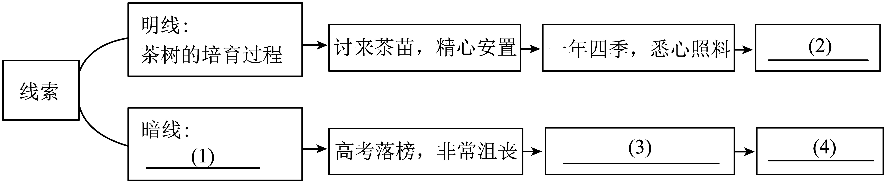

# 2025年山东省青岛市李沧区中考二模语文试题（解析版）

> 📌 **试题标定**：山东省青岛市李沧区 | 2025年 | 中考二模

---

<b>九年级语文试题</b>

<b>（考试时间：</b><b>120</b><b>分钟；满分：</b><b>120</b><b>分）</b>

<b>本试题共三道大题、</b><b>23</b><b>道小题。所有题目均在答题卡上作答，在试题上作答无效。其中，选择题部分必须用</b><b>2B</b><b>铅笔在答题卡相应位置涂写；笔答题部分必须用</b><b>0.5</b><b>毫米黑色签字笔在答题卡相应位置作答。</b>

<b>一、积累与运用（</b><b>24</b><b>分）</b>

<b>班级开展以“走近</b><b>AI</b><b>”为主题的综合性学习活动，请你完成相关任务。</b>

<b>【活动一社会调查】</b>

AI+教育

DeepSeek的“出圈”让“AI+教育”迅速融入青少年的学习生活。许多中小学<u style="text-decoration: wavy;">因地制宜</u>构建多元化“AI+”场景，积极拥抱这一<u>趋势</u>：有的借助AI开展英语对话教学，有的利用AI呈现化学实验过程，有的指导学生进行AI创意绘画……______。有了AI这个学习“好搭子”，学生们的学习取得了<u style="text-decoration: wavy;">事倍功半</u>的效果。

AI+文旅

青岛海上环游浮山湾航线借助AI给游客带来全新体验。游客们登上游船，戴上特制的AI眼镜，刹那间，碧波<u>荡漾</u>的海面与虚拟画面<u>交相晖映</u>。这套系统将<u style="text-decoration: wavy;">美不胜收</u>的海滨风光与<u style="text-decoration: wavy;">栩栩如生</u>的AI场景<u>融为一体</u>，引得游人时而屏息凝视，时而连声赞叹。

1. 文段中加点的字，注音不正确的一项是（   ）

A. 拥（yōng）抱	B. 刹（shà）那间	C. 虚（xū）拟	D. 屏（bǐng）息

2. 文段中画横线的词语，书写不正确的一项是（   ）

A. 趋势	B. 荡漾	C. 交相晖映	D. 融为一体

3. 文段中画波浪线的词语，使用不正确的一项是（   ）

A. 因地制宜	B. 事倍功半	C. 美不胜收	D. 栩栩如生

4. 下面填入文段画横线处的句子，没有语病且语意恰当的一项是（   ）

A. 不仅这些寓教于乐的学习活动激发了学生的求知热情，而且提升了学习效率。

B. 这些寓教于乐的学习活动激发了学生的求知热情，学习效率也得到了完善。

C. 通过这些寓教于乐的学习活动，让学生在提升学习效率的同时，又激发了求知热情。

D. 这些寓教于乐的学习活动在激发学生求知热情的同时，也提升了学习效率。

【答案】1. B    2. C    3. B    4. D

【解析】

【1题详解】

本题考查字音。

B.刹（shà）那间——（chà）；

故选B。

【2题详解】

本题考查字形。

C.交相晖映——交相辉映。

故选C。

【3题详解】

本题考查词语的使用和辨析能力。

A.因地制宜：指根据当地的实际情况，制定适当的措施。根据语境“构建多元化‘AI+’场景，积极拥抱这一趋势”可知，这里指许多中小学根据当地的实际情况，制定有关的措施。符合语境，使用正确；

B.事倍功半：形容做事的方法费力大，收效小。根据语境可知，AI帮助学生学习费力小而收效大，应用“事半功倍”。不符合语境，使用错误；

C.美不胜收：美好的东西很多，一时看不过来。根据语境“海滨风光”可知，此处应描述的是海滨的风光很美，一时间让人看不过来。符合语境，使用正确；

D.栩栩如生：形容非常逼真，就像活的一样。根据语境可知，此处描述的是AI场景很逼真，就像活的一样。符合语境，使用正确。

故选B。

【4题详解】

本题考查病句的修改和辨析能力。

A.关联词语使用不当，应将“而且”改为“还”；

B.搭配不当，应将“完善”改为“提高”；

C.成分残缺，应删去“通过”或者“使”；

故选D

<b>【活动二实践探索】</b>

5. 小组用AI制作具有青岛特色的明信片。请你仿照图一示例，为图二设计一段编写指令。

| 编写指令 | AI生成的明信片 |
| --- | --- |
| 画面采用海中平视陆地视角。主体是青岛代表性雕塑。五月的风，雕塑前面是一艘前进的帆船，背景是高楼大厦。右上角用黑体题写“五月的风”。 |  |
| ______ |  |

【答案】示例：画面采用高空俯视视角。主体是青岛栈桥，栈桥延伸至海中，回澜阁矗立其上，周围是翻飞舞动的海鸥，背景是茫茫大海。右下方用宋体题写“栈桥鸥景”。

【解析】

【详解】本题考查图文转换。

观察画面元素：明确图二主体是青岛栈桥，背景是大海，还有海鸥这一元素，右下方有文字“栈桥鸥景”。

确定指令要点：需仿照示例，从视角、主体、背景、文字等方面编写指令。要清晰描述画面呈现方式，突出青岛特色元素。

示例：画面采用高空俯视栈桥视角。主体

青岛标志性建筑栈桥，栈桥上有行人，海面飞翔着成群海鸥，背景是辽阔大海。右下方用楷体题写“栈桥鸥景”。

6. 各具特色的明信片制成后，同学们建议在背面题上古诗文。请根据提示，将诗文补充完整。

小麦岛公园，初春时节，花草欣欣向荣：“乱花渐欲迷人眼，（1）______”（白居易《钱塘湖春行》）；汇泉湾畔，凭栏远眺，秋风中海面波涛翻涌：“（2）______，洪波涌起”（曹操《观沧海》）；崂山巨峰，眺望云海奇峰，追名逐利之心顿消：“（3）______，望峰息心”（吴均《与朱元思书》）；闻一多故居，虽然简朴却见大师风骨：“斯是陋室，（4）______”（刘禹锡《陋室铭》）；奥帆中心，壮阔海面上，帆船竞发，让人对未来生活充满信心：“（5）______，______”（李白《行路难》）。

【答案】    ①. 浅草才能没马蹄    ②. 秋风萧瑟    ③. 鸢飞戾天者    ④. 惟吾德馨    ⑤. 长风破浪会有时    ⑥. 直挂云帆济沧海

【解析】

【详解】本题考查名句名篇默写。默写题作答时，一是要透彻理解诗文的内容；二是要认真审题，找出符合题意的诗文句子，三是答题内容要准确，做到不添字、不漏字、不写错字。“蹄、萧、鸢、惟、德馨、济”等字容易写错。

<b>【活动三辨别分析】</b>

<b>名著阅读（</b><b>7</b><b>分）</b>

7. 下面是AI根据“不同的选择，就会有不同的结局，名著中的人物亦是如此”这一指令生成的表格。请你将空格处补充完整。

| 名著 | 人物 | 与“选择”相关的情节 | 结局 |
| --- | --- | --- | --- |
| 《儒林外史》 | ①______ | 拒绝知县邀约 | 隐居会稽山，病终。 |
| 《骆驼祥子》 | 祥子 | ②______ | 有了钱，买了第一辆新车。 |
| 《西游记》 | 孙悟空 | 护送唐僧西天取经 | ③______ |

【答案】    ①. 王冕    ②. 苦干三年，省吃俭用    ③. 被封为斗战胜佛

【解析】

【详解】本题考查名著人物。

①《儒林外史》：王冕是书中正面人物形象，他蔑视权贵，知县派人邀请他，他为了不与官府结交而拒绝邀约，后来隐居会稽山，最后病逝，所以①处填王冕。

②《骆驼祥子》：祥子来自农村，他最大的梦想就是拥有一辆属于自己的车。他来到城市后，选择通过苦干三年，省吃俭用攒钱，最终实现了买第一辆车的愿望，所以②处应填“苦干三年，省吃俭用”。

③《西游记》：孙悟空护送唐僧历经九九八十一难后，成功到达西天取得真经，他因一路降妖除魔有功，被如来佛祖封为斗战胜佛，所以③处填“被封为斗战胜佛”。

8. 小语同学用AI为《骆驼祥子》生成了一个新的结局：“失去小福子后，祥子在曹先生的鼓励下，重燃斗志，拼命拉车攒钱，不仅又买了新车，还开起了车厂，过上了体面的生活。”请你结合该书的主题和相关情节辨别AI的改写是否合理，并简述理由。

【答案】AI的改写不合理。首先，主题方面，原作强调社会压迫导致个人奋斗失败，而AI的结局是奋斗成功，这与主题相悖。如果祥子能够成功，那么主题的批判性就被削弱了，不符合老舍的创作意图。其次，情节方面，祥子多次努力都因社会原因失败，比如被士兵抢车、被孙侦探敲诈、虎妞的难产和小福子的死。这些情节显示，无论祥子如何努力，外部环境都在不断打击他。曹先生虽然是个好人，但帮助有限，无法改变整个社会的结构。因此，即使有曹先生的鼓励，祥子也不太可能逆袭成功，因为整个社会的制度性问题没有解决。因此，AI的改写不合理，因为它违背了小说的悲剧主题和社会批判的意图，同时忽略了祥子多次失败的情节铺垫，以及社会环境对个人命运的不可抗力影响。

【解析】

【详解】本题考查对名著内容的理解以及主旨把握。作答此题时，需结合书的主题和相关情节辨别改写是否合理。

首先先明确态度：不合理；其次，结合书的主题和相关情节进行阐述。第一，主题不符。《骆驼祥子》的核心主题是揭露旧社会对底层人民的压迫，批判个人奋斗在黑暗环境中的徒劳。祥子最终堕落为“社会病胎里的产儿”，正是对“努力无法改变命运”的悲剧性诠释。而AI结局让祥子成功逆袭，削弱了原作的批判力度，违背了主题；第二，情节矛盾。祥子三次买车失败（被大兵抢车、被孙侦探勒索、为虎妞丧事卖车）和小福子自杀等情节，均表明社会压迫与命运无常是他无法挣脱的枷锁。曹先生虽曾帮助祥子，但其力量有限，无法改变社会本质。AI结局忽略这些铺垫，强行赋予“成功”，逻辑牵强。第三，人物逻辑崩塌。小福子的死是祥子精神崩溃的关键。原作用“他连哭都哭不出声来”刻画其绝望，暗示他彻底丧失生存信念。若此时祥子重燃斗志，则与人物性格发展及心理轨迹相悖。最后，总结一下：综上所述，AI改写脱离原作主题、情节逻辑和人物塑造，因此不合理。

示例：AI的改写不合理。从主题看，《骆驼祥子》意在揭露旧中国黑暗社会对底层人民的压迫与摧残，祥子的命运是无数底层人民悲惨遭遇的写照，三起三落的买车经历让他最终堕落，批判了社会的不公。而AI结局中祥子能重燃斗志，买车开厂过上体面生活，过于理想化，消解了原著批判黑暗社会的力度。从人物性格而言，祥子历经诸多打击后已变得麻木、堕落，失去小福子更是让他彻底绝望，不可能再重燃斗志。所以AI改写脱离了作品主题与人物性格实际，不合理。

<b>二、阅读（</b><b>46</b><b>分）</b>

<b>（一）诗词阅读（</b><b>7</b><b>分）</b>

9. 下列对诗句的理解，不正确的一项是（   ）

A. “造化钟神秀、阴阳割昏晓”（《望岳》）两句、运用夸张的修辞手法，写出了泰山神奇秀丽和巍峨高大的形象。

B. “征蓬出汉塞，归雁入胡天”（《使至塞上》）诗人以征蓬、归雁自比，暗示自己因被排挤出朝廷而产生的激愤和抑郁之情。

C. “商女不知亡国恨、隔江犹唱后庭花”（《泊秦淮》）表面斥责歌女，实际讽刺了只知寻欢作乐、不顾国家安危的晚唐统治者。

D. “闲来垂钓碧溪上，忽复乘舟梦日边”（《行路难》）运用吕尚、伊尹的典故，表达了诗人得到明君重用之后的喜悦之情。

【答案】D

【解析】

【详解】本题考查诗歌内容的理解和赏析。

D.“闲来垂钓碧溪上，忽复乘舟梦日边”运用吕尚（垂钓遇文王）和伊尹（梦日边被商汤任用）的典故，表达的是诗人在困境中对建功立业的渴望与对未来的期待，而非“得到重用后的喜悦之情”。此时诗人尚未得志，仍处于仕途迷茫阶段，理解有误；

故选D。

10. 阅读下面的诗歌，完成后面的题目。

野菊

丘逢甲

入眼惊看秋气新，孤芳①难掩出丛榛。

英华②岂复关培植③，烂熳依然见本真。

淡极君心宜在野，生成傲骨不依人。

陶潜死后无知己，沦落天涯为怆神。

【注】①孤芳：独秀的香花。②英华：花草的美艳。③培植：栽种并细心管理。

诗歌中的“野菊”具有哪些品格？请结合诗歌内容，谈谈你的理解。

【答案】①自信独立：“孤芳难掩出丛榛”，野菊独自开放，从荆棘丛中脱颖而出，展现其自信与独立。

②坚守本真：“英华岂复关培植，烂熳依然见本真”，野菊的艳丽并非靠人工培植，依然烂漫绽放，坚守自然本真。

③淡泊傲岸：“淡极君心宜在野，生成傲骨不依人”，写出野菊心性淡泊，有傲骨，不依附他人。

【解析】

【导语】这首诗以野菊为意象，通过“孤芳难掩”“烂熳本真”等句，展现了野菊不事雕琢、傲然独立的品格。后联“淡极君心”“生成傲骨”进一步强化其超脱世俗、坚守本真的精神内核。尾句借陶渊明典故，暗喻野菊的高洁与孤独，全诗托物言志，表达了诗人对高洁品格的追求。

【详解】本题考查意象特点。

独立自信：“孤芳难掩出丛榛”，“孤芳”表明野菊独自散发着芬芳，“难掩”“出丛榛”则体现出即便生长在荆棘丛中，它也能冲破阻碍，脱颖而出，展现出一种不被环境束缚、自信独立的品格，彰显出自身的强大生命力与独特魅力。

坚守本真：“英华岂复关培植，烂熳依然见本真”，意思是野菊的艳丽美好并非依赖于人工的栽种与细心管理。它自然生长，依然灿烂开放，保持着最纯粹、真实的状态，不借助外力雕琢，坚守着自身的本真，不随波逐流。

淡泊傲岸：“淡极君心宜在野，生成傲骨不依人”，“淡极”写出野菊心性淡泊，不慕繁华。“宜在野”表明它适宜生长在野外，远离尘世喧嚣。“傲骨不依人”直接点明其具有高傲的品格，不依附于他人，体现出一种遗世独立、超凡脱俗的傲岸气质。

<b>（二）文言文阅读（</b><b>12</b><b>分）</b>

庄宗勇而好战，尤锐于见敌。德威①老将，常务持重以挫人之锋，故其用兵，常伺敌之隙以取胜。

十五年，德威将燕兵三万人，与镇、定等军从庄宗于河上，自麻家渡进军临濮，以趋汴州。军宿胡柳陂，黎明，候骑报曰：“梁军至矣！”

庄宗问战于德威，德威对曰：“此去汴州，信宿②而近，梁军父母妻子皆在其中，而梁人家国系此一举。<u>吾以深入之兵，当其必死之战，可以计胜，而难与力争也。</u><u style="text-decoration: wavy;">且吾军先至此粮爨</u>③<u style="text-decoration: wavy;">具而营栅究是谓以逸待劳之师也。</u>王宜按军无动，而臣请以骑军扰之，使其营栅不得成，樵<u style="text-decoration: wavy;">爨</u>不暇给，因其劳乏而乘之，可以胜也。”庄宗曰：“吾军河上，终日俟敌。今见敌不击，复何为（   ）？”顾李存审曰：“公以辎重④先，吾为公殿。”遽督军而出。

德威谓其子曰：“吾不知死所矣！”前遇梁军而阵，王居中，镇、定之军居左，德威之军居右，而辎重次右之西。兵已接，庄宗率银枪军驰入梁阵。梁军小败，犯晋辎重，辎重见梁朱旗，皆惊走入德威军，德威军乱。梁军乘之，德威父子皆战死。庄宗与诸将相持（   ）哭曰：“吾不听老将之言，而使其父子至此！”

庄宗即位，赠德威太师。明宗时，加赠太尉，配享庄宗庙。晋高祖追封德威燕王。

（选编自欧阳修的《周德威传》）

【注】①德威：即周德威，唐末五代时期前晋名将。②信宿：指两三日。③爨（cuàn）：灶。④辎重：指军用物资。

11. 下列对文中加点词语的理解，不正确的一项是（   ）

A. 德威将燕兵三万人            率领

B. 候骑报曰                    负责侦察、巡逻的骑兵

C. 顾李存审日                照顾

D. 皆惊走入德威军            跑

12. 选文括号内依次填入词语，最恰当的一项是（   ）

A. 乎  之	B. 乎  而	C. 矣  之	D. 矣  而

13. 文中画波浪线的部分有两处需要断句，请将需断句处相应的字母涂到答题卡上。

且吾军先A至此B粮爨具而C营栅完D是谓以逸待劳E之师也

14. 请将文中画横线的句子翻译成现代汉语。

吾以深入之兵，当其必死之战，可以计胜，而难与力争也。

15. 周德威与《曹刿论战》中的曹刿在作战策略上有何相同之处？请结合相关内容简要分析。

【答案】11. C    12. B

13. BD    14. 我率领深入敌境的军队，面对敌人拼死一战的决心，可以用计谋取胜，而难以与他们硬拼。

15. 两者都主张谨慎作战，善于抓住战机。周德威建议以逸待劳，利用敌军疲惫时出击；曹刿则主张待敌军士气低落时再进攻。两者都强调不应贸然进攻，而应等待有利时机。

【解析】

【导语】这篇选文展现了五代时期将领周德威与庄宗在军事策略上的深刻冲突。文章通过对比手法，凸显了老将持重与君主冒进的矛盾：德威主张“以逸待劳”的消耗战术，体现其“伺敌之隙”的军事智慧；而庄宗“勇而好战”的性格导致贸然出击，最终酿成悲剧。文中人物对话极具张力，德威“吾不知死所矣”的悲叹与庄宗事后的悔恨形成强烈戏剧效果。欧阳修以简练笔法，生动再现了历史场景，暗含对刚愎自用者的批判，具有典型的史传文学特色。

【11题详解】

本题考查文言实词的含义。

C.句意：回头看着李存审说。顾：回头看。

故选C。

【12题详解】

本题考查文言虚词的含义。

第一空：根据“今见敌不击，复何为（  ）”可知，此句是庄宗质问的语气，表达“现在见到敌人却不进攻，还做什么呢”，是反问句。“乎”作为语气助词，常用于反问句末，加强反问语气，可译为“呢”。例如《论语·学而》中“人不知而不愠，不亦君子乎？”。而“矣”一般用于陈述句末，表陈述语气，如“吾计决矣”，表示事情已经确定，不适合此反问语境，所以第一空应填“乎”。

第二空：“庄宗与诸将相持（  ）哭曰”，这里“相持”和“哭曰”是两个动作，“而”作为连词，可表修饰关系，连接两个同时发生的动作，表示庄宗和诸将拉着手，哭着说。“之”在这种语境下一般不用于连接两个动作，例如“吾恂恂而起”，“而”表修饰，描述小心翼翼地起来的状态，所以第二空应填“而”。

故选B。

【13题详解】

本题考查文言文断句。要根据句意和句子结构进行断句。

句意：况且我们的军队先到这里，粮草炊具都准备齐全，营寨栅栏也都完善，这就是所说的以逸待劳的军队啊。

“且吾军先至此”表达军队已经先到达此地，语义完整，其后应断开；“粮爨具而营栅完”中“而”连接“粮爨具”（粮草炊具准备好）和“营栅完”（营寨栅栏完善）两个并列的情况，表达军队目前的状态，这一表述结束后应断开；“是谓以逸待劳之师也”是对前面情况的总结判断，故断句为：且吾军先至此/粮爨具而营栅完/是谓以逸待劳之师也。故在B和D两处断句。

【14题详解】

本题考查文言翻译。我们在翻译句子时要注意通假字、词类活用、一词多义、特殊句式等情况，如遇倒装句就要按现代语序疏通，如遇省略句翻译时就要把省略的成分补充完整。重点词有：

以：率领。深入：深入敌境。当：面对。其：代词，指梁军。必死之战：抱着必死决心的战斗。计：计谋。力：武力。争：争胜。

【15题详解】

本题考查内容概括。

根据文章可知周德威在与梁军作战时，他分析梁军的情况，指出梁军父母妻子都在汴州，梁军定会拼死一战，己方以深入之兵难以与之力争，应按兵不动（“王宜按军无动”），用骑军扰乱他们（“臣请以骑军扰之”），使其疲惫（“使其营栅不得成，樵爨不暇给，因其劳乏”）后再进攻，体现了他不贸然出击，根据敌我态势制定策略，寻找战机的作战思路。根据《曹刿论战》中可知，齐军三鼓后，曹刿才让鲁军击鼓进军，他认为“一鼓作气，再而衰，三而竭”，避开了齐军开始时的锐气，等齐军士气衰竭时出击；在齐军败退后，他又仔细观察齐军车辙、军旗，确认没有埋伏后才让鲁军追击，也是在作战中谨慎分析局势，捕捉到合适战机才行动。故二者在作战策略上有相同之处。

【点睛】参考译文：

唐庄宗勇敢而且喜好作战，面对敌人尤其勇猛。周德威是老将，行事常常稳重，用来挫败敌人的锐气，所以他用兵，常常窥伺敌人的间隙来取胜。

十五年，周德威率领三万燕地的士兵，和镇州、定州等军队在黄河边跟从庄宗，从麻家渡进军到临濮，向汴州进发。军队在胡柳陂宿营，黎明时，侦察骑兵报告说：“梁军来了！”

庄宗向周德威询问作战策略，周德威回答说：“这里距离汴州，只需两三天路程，梁军士兵的父母妻儿都在汴州，而且梁国的命运关系在此一战。我们率领深入敌境的军队，面对他们抱着必死决心的战斗，可以用计谋取胜，却难以用武力与他们硬拼。况且我们的军队先到这里，粮草炊具都准备齐全，营寨栅栏也都完善，这就是所说的以逸待劳的军队啊。大王应该按兵不动，我请求带领骑兵去骚扰他们，让他们的营寨栅栏不能建成，砍柴做饭的时间都没有，趁着他们疲劳困乏去进攻，就可以取胜。”庄宗说：“我们的军队在黄河边，整日等候敌人。如今见到敌人却不进攻，还等什么呢？”回头看着李存审说：“您带着军用物资先出发，我为您断后。”急忙督促军队出击。

周德威对他的儿子说：“我不知道自己会死在哪里了！”向前遭遇梁军摆开阵势，庄宗在中间，镇州、定州的军队在左边，周德威的军队在右边，而军用物资在右边的西边。双方交战后，庄宗率领银枪军冲入梁军阵地。梁军稍稍败退，转而攻击晋军的军用物资，军用物资的守卫看到梁军的红旗，都惊慌地逃进周德威的军队，周德威的军队混乱了。梁军趁机进攻，周德威父子都战死了。庄宗和各位将领相互拉着手哭着说：“我不听从老将的建议，才让他们父子落到这种地步！”

庄宗即位后，追赠周德威为太师。明宗时，加赠为太尉，附祭在庄宗庙中。晋高祖追封周德威为燕王。

<b>（三）实用性文本阅读（</b><b>9</b><b>分）</b>

【材料一】

①作为一个悠久而璀璨的文化体系，中华传统文化凝聚了中国几千年来的智慧和经验，展示了中国人民的创造力和想象力。中华传统文化的综合性体现在儒、释、道等多种思想体系的交融，书法、音乐、绘画等艺术形式的交叉影响，饮食、服饰、建筑等生活方式的交流共享。同时，中华传统文化也因地域和民族的差异而展现出丰富的多样性，形成了以汉族为主体，辅以少数民族特色的多元文化图景。总的来说，中华传统文化综合性与多样性的相互渗透与交流，既凸显了中国文化的独特魅力，也为中华民族的自信和文化认同提供了坚实基础。

②中华传统文化的综合性使得各种文化要素能够互相借鉴、融合，进而带来新的创造和发展。综合性的文化系统为社会提供了丰富的资源与营养，推动了社会的进步与繁荣。同时，中华传统文化的综合性也为人们提供了多种思考和选择的方式，使得个体能够在多元文化之中找到归属感和认同感。

③中华传统文化的多样性其中一个方面体现在地域差异和民族特色上。中国幅员辽阔，拥有众多不同的地域文化，每个地区都孕育着独特而丰富的传统文化。除了地域差异外，中华传统文化的多样性还体现在思想观念和价值观层面。中国有着悠久的哲学传统，形成了多种不同的思想流派，如儒家、道家、墨家等。这些思想流派在历史上相互碰撞、融合，形成了多样的思想观念，这些都给中国传统文化增添了多样性的光彩。

【材料二】

①中华文化自古就有兼收并蓄的开放胸怀。中华文明是世界上唯一绵延不断并以国家形态发展至今的伟大文明。对世界不同文明兼收并蓄，为文明发展不断注入活水，是成就中华文明绵延不断的重要原因之一。中外文化变往、文明交流的故事不胜枚举。2100多年前，汉代使者张骞自长安出发，出使西域，开始打通东方通往西方的道路，此后一条横贯东西、联结欧亚的古丝绸之路逐渐开辟出来。这条路成为经贸往来之路，也成为不同文明交流互鉴之路。

②中华文化具有兼收并蓄的开放胸怀，有着深刻的历史原因。古代中国有超大规模的人口与地域，经济发展水平长期领先，与其他国家和地区经贸往来频繁，最突出的就是形成了陆上丝绸之路与海上丝绸之路。这些经贸往来，不仅促进了经济繁荣，也带来了中国与其他国家科技、文化、艺术的交流交融。同时，中华“和”文化中的一个重要理念就是以和为贵、协和万邦，主张不同国家和平相待、和睦相处。中国人以天下看待世界，认为天下理应一家。古代不少统治者也都看到，国家之间合作交往远比征伐战争更有利于稳定和发展。此外，中国古代经世致用的思想，倡导“知行合一、躬行为务”，反对空谈，主张解决实际问题。因此，对社会发展有利、对民生改善有效的方法和手段都可以学习，可以拿来为我所用。这样就形成一种致用为上、积极进取的心态。当人们接触到国外优秀文化、制度、艺术时，就更加愿意去学习借鉴。

【材料三】

①弘扬中华优秀传统文化，要处理好继承和创造性发展的关系。

②挖掘古诗词魅力，把其中的家国情怀与奋进新征程相结合，成就了《中国诗词大会》的热播。以中国传统节日为切入点，创新表达方式的《唐宫夜宴》等系列节目，实现了口碑和流量的双赢。中华优秀传统文化博大精深，挖掘其中的人文精神，有助于推动文化传承发展不断开创新局面。

③做好创造性转化和创新性发展，需要“学古不泥古”。努力找到传统文化和现代生活的连接点，才能创造传统文化融入百姓生活的当代路径。陕西西安大唐不夜城的古诗灯光秀、互动节目“盛唐密盒”，让游客在沉浸式体验中领略璀璨的盛唐文化；国家博物馆的金步摇玻璃杯、四川三星堆博物馆的青铜面具冰激凌等文创产品热卖，让原本只可远观的文物变得可亲可感。

④近年来，人们充分利用科技手段，为文化遗产的保护利用提供了坚实支撑。甘肃敦煌莫高窟用现代数字科技修复、还原敦煌壁画，用现代艺术形态来演绎石窟中独特的造型元素，使之重获新生；故宫博物院推出“云游故宫”平台，综合运用全景漫游、高精度文物赏析交互等多种形式，方便用户全方位欣赏和领略故宫之美……科技力量不仅为文物“活起来”保驾护航，也为其“火起来”赋能，让文化传承有了新的路径。

⑤把握好继承和创造性发展的关系，让中华优秀传统文化在创新中赓续绵延，就能不断铸就中华文化新辉煌。

16. 下列对材料的理解，不正确的一项是（  ）

A. 综合性的文化系统为社会提供了丰富的物质资源，使个体找到了归属感，推动了社会的进步。

B. 中华传统文化的多样性不仅表现在地域差异和民族特色上，还体现在思想观念和价值观层面。

C. 中华“和”文化中以和为贵的理念，中国古代经世致用的思想，是中华文化兼收并蓄的原因。

D. 找到传统文化和现代生活的连接点，才能创造传统文化融入百姓生活的路径，才能创新性发展。

17. 下列对材料的分析，不正确的一项是（  ）

A. 材料一、二均体现出中华文化的开放性与包容性，材料一聚焦内部融合，材料二侧重对外交流。

B. 材料二列举张骞出使西域、开辟古丝绸之路的事实，是为了论证中外经贸往来历史悠久的观点。

C. 敦煌莫高窟用现代数字科技修复、还原敦煌壁画，是科技力量让文物“活起来”的典型例证。

D. 材料三

重要观点是“弘扬中华优秀传统文化，要处理好继承和创造性发展的关系”。

18. 学校计划举办“传统文化月”活动，请你根据材料三，设计一款文创产品，并说明你是如何体现“继承和创造性发展”的。不得重复材料中的内容。

【答案】16. A    17. B

18. 示例：文创产品：二十四节气香薰礼盒。继承：选取二十四节气传统文化元素，提炼每个节气的代表性植物（如立春——梅花、立夏——荷花），融入香薰精油配方与包装设计。创造性发展：采用现代简约风格礼盒，搭配智能香薰机，通过手机APP设置不同节气对应的香氛模式，结合节气科普音频，让传统时间文化以沉浸式嗅觉、听觉体验融入现代生活。

【解析】

【导语】文章从中华传统文化的综合性与多样性切入，阐述其内部交融与对外兼收并蓄的特质，再论及弘扬传统文化需处理好继承与创新关系。结合实例，层次分明，凸显文化魅力与传承路径，兼具理论深度与现实关怀。

【16题详解】

本题考查内容理解辨析。

A.有误，结合材料一第②段“综合性的文化系统为社会提供了丰富的资源与营养，推动了社会的进步与繁荣……使得个体能够在多元文化之中找到归属感和认同感”可知，“资源”指文化层面的精神资源，而非“物质资源”。选项将“资源”曲解为“物质”，表述错误。

故选A。

【17题详解】

本题考查内容理解辨析。

B.有误，结合材料二第①段“汉代使者张骞……成为不同文明交流互鉴之路”可知，列举张骞出使西域的事实，是为了论证“中华文化自古就有兼收并蓄的开放胸怀”，而非“中外经贸往来历史悠久”；

故选B。

【18题详解】

本题考查主观表达。

作答此题，首先明确材料三核心。需结合“继承传统文化元素”与“创造性转化（如科技融合、现代生活连接）”设计产品。不采用数字修复、灯光秀、文创食品等已有形式。选取具有文化代表性的符号（如传统纹样、神话故事、古典诗词等）。结合现代科技、实用功能或互动体验，让传统元素以新颖方式呈现。

示例：文创产品：《山海经》AR解谜手账本。继承：选取《山海经》中经典神兽（如青龙、朱雀、九尾狐）、奇花异草（如扶桑树、曼陀罗）的原文描述与古版插画，融入手账本内页设计，每页搭配原文注释与文化小知识。创造性发展：手账本配套AR扫描功能，通过手机摄像头扫描插画，触发动态3D神兽动画与语音讲解，结合现代解谜游戏机制（如线索隐藏在古文中，需破解密码解锁下一章节），让用户在记录日常的同时，沉浸式探索传统神话世界，实现古籍文化与现代娱乐、实用记录的融合。

<b>（四）文学类文本阅读（</b><b>18</b><b>分）</b>

题目：______

赵阿芳

①记得很清楚，那是1987年的春天，父亲费尽周折，终于讨来两株抗寒茶树苗。

②荼苗细得像我铅笔盒里的蜡笔。母亲一脸的难以置信：这南方的娇贵东西，在北方能活吗？“她们可是会看人脸色长，有灵气儿的呢。好好对她，她肯定能长好。”父亲很有信心。

③父亲在我家院子东南角砌起挡风石墙，碎蛤蜊壳拌着花生麸，培出个骆驼背似的小土丘，又找来一块油纸，搭了粗糙的暖棚，两株茶苗从此在我家安家落户。

④年底腊月头场雪那夜，父亲把我大叔给他的军大衣裹在茶苗根处保暖。记得那时冰碴子顺着棉絮往他指缝里钻，他却是一脸春色。眼神都是亮晶晶的。现在才知道，那时的父亲，在精心守望着一个希望。

⑤酷热的夏天，我高考落榜了。暑气炎炎的夜晚，我蹲在院角的茶树旁，边流泪边撕课本。哭声惊飞了叶底的七星瓢虫，光晕里茶花却正在夜露中缓缓绽开。

⑥父亲不知站在我身后多久了、他捧着一个搪瓷缸，里面是他最喜欢的酽茶。“芳子，喝杯茶清凉清凉吧。”他吹开浮沫的声响，像极了童年教我吹蒲公英的模样。我乖乖地把茶缸接过来，喝了一口，苦得我直皱眉头。“这浓茶啊，入口像吃药，一会儿就品出蜜味啦，你细品品，这茶可是咱们自己炒的呢。”父亲提示道。确实如父亲所说，茶汤的苦味滑过喉头后，有丝难以明说的甜意在后槽牙打转，混着搪瓷味的回甘一阵阵在口腔里回荡。

⑦“你瞅瞅这花骨朵。”父亲掐下一朵米粒大的茶花搁在我掌心，“开得比牡丹晚，香气却能在舌尖停三春。”蝉鸣声里，父亲拎起浇菜用的铁皮壶，将水徐徐淋在树根：“你听这声儿——”水流渗入泥土的响声中，竟夹杂着气泡破裂的脆响。“根须在喝水呢。”他蘸着茶水在石板上画曲线，“闺女啊，人生的道儿啊，比茶叶脉络还曲绕，可到底都通着主茎，不管走哪条道，只要你用心，都能过好这一生。”

⑧难熬的夏天终于远离，那年深秋，我打起行囊，奔向远方。出发的那天清晨，茶树突然爆出十几枚新芽。父亲采下一朵最肥的芽尖夹进我的笔记本，叶脉在纸页上洇出墨绿的航线：“芳子，你要记着，苦后回甘的劲道都在叶筋里呢。”

⑨惊蛰，清晨的露珠还凝在窗台，父亲已蹲在茶树根旁松土了。他总能在茶枝爆芽时准时察觉：“这是根须在地底打更呢。”他摘下半片越冬老叶对着日头呢喃：“看这老叶上的纹路。”叶脉在光线下变成金色的河网，<u>1998</u><u>年那场胶东大雪冻出来的疤，倒成了春芽的引水渠。</u>

⑩每年的春分，他都会隆重地泡上一壶茶：粗瓷壶里抓把两三年的老陈茶，再加上当年最新的头茬芽茶，茶水注下去，三代茶叶在漩涡里浮沉。他管这个叫三辈子茶。“看，这老叶托着新芽往上顶呢，咱们村啊，现在可以推广种茶增收了！”茶叶在茶杯轻舞飞扬，父亲笑起来时眼角的褶皱，那些被岁月犁出的沟壑里，兜住了满溢的春光。

⑪如今，我已成熟，事业上也算小有成就。清明的第一场细雨里，我带儿子回到故乡。等待拆迁的老屋早已没有了当年的鲜活，耳边是呼呼的春天的海风，眼前是衰草连天的老院，这还是我记忆中长大的家吗？

⑫儿子突然指着树根惊叫：妈，快看，俺姥爷的茶壶！顺着他手指的方向，父亲当年手砌的贝壳墙残基依旧能看出蛤蜊皮的灰珍珠色，两株老茶树依旧在静静守望着小院。扒开茶树底部的碎石块，那个磕破了壶嘴的瓷茶壶倒扣在土里，内壁结着的茶垢已凝成了山水纹。

⑬暮色漫过斜阳时，三十年光阴在茶汤里静静泪开：那年的海风正在叶底回旋；那年的月光给新芽镶银；那年的茶园枝头挂上了红绸。此刻，在茶树皲裂的老皮下，又隐约爆出几星鹅黄——恰是父亲当年教我辨认的，春天最初的模样。

⑭儿子说，胶东绿茶上热搜了。我突然想起父亲当年围在茶树上的军大衣和挂在茶枝上的温度计。

⑮晚风掠过老屋，几十载春天的茶语忽然簌簌作响。儿子将那把旧茶壶仔细装进了铁皮盒，轻哼着父亲教会他的京剧老生唱段，望着正在蓬勃萌发的茶树枝头，他的眼里闪着光，像极了父亲那晚亮晶晶的眼神。

⑯从老家回来的那晚，我做了一个梦：父亲笑吟吟地站在春风浩荡的茶园里，依旧端着他的搪瓷缸，爽朗的笑点亮了四月的茶园，“看，茶树鼓新芽！”

⑰一瞬间，漫山遍野春色涌动，茶香浸透了春天。

（原文有删改）

19. 本文采用双线叙事结构，根据提示，简要概括文章的明线与暗线。

20. 第④段写父亲的眼神“亮晶晶的”，第⑮段又写到儿子的眼里“闪着光”，联系上下文，分析其分别体现了人物怎样的心理？

21. 自选角度，赏析第⑨段中画横线句子的表达效果。

1998年那场胶东大雪冻出来的疤，倒成了春芽的引水渠。

22. 第⑯段写“我”梦见父亲说“看，茶树鼓新芽”，在文中有何作用？联系全文，从内容与结构两个角度进行分析。

23. 关于本文的题目，小夏同学主张用《父亲》，小荷同学却认为用《茶树鼓新芽》更好。联系全文，分析小荷同学的理由。

【答案】19. （1）“我”的成长经历；（2）茶树爆芽，父亲寄语；（3）外出打拼，有所成就；（4）回到故乡，怀念父亲。

20. （1）父亲“亮晶晶的”眼神：表现了他对南方茶苗在北方成活的坚定信心和对未来的殷切希望。

（2）儿子“闪着光”的眼神：体现了他对祖父精神的继承和对茶树生命力的惊喜与憧憬，也流露出对未来的向往与激情。

21. 这句话运用了比喻、象征等手法，将“冻出来的疤”比作“春芽的引水渠”，一方面生动写出茶树历经严寒后反而促成了新芽的汲水生长，表现出顽强的生命力；另一方面也象征人在磨难中得到历练，“苦后回甘”，折射出文章所蕴含的积极的人生态度。

22. （1）内容上：梦中父亲的话点明“茶树鼓新芽”，呼应全文“苦后回甘”的主旨，象征父亲的坚守与希望一直延续，也使“我”再次感受到父亲的精神鼓舞。

（2）结构上：这一情节照应前文父亲与茶树的细节描写，让全文首尾呼应，并在梦境中将情感推向高潮，收束全文、强化主题。

23. 《茶树鼓新芽》更好。理由：茶树贯穿全文，既见证了父亲的付出，也见证了“我”从失意到成长的全过程，具有象征意义。“鼓新芽”点明了文章的精神内核——历经困难后依然蓬勃向上，暗含“苦后回甘”的人生哲理。相比直接用《父亲》，《茶树鼓新芽》含蓄而丰富，更能体现文中父亲精神在后辈心中生生不息的传承与希望。

【解析】

【导语】这篇文章通过细腻的笔触，描绘了父亲与茶树之间的深厚情感，以及茶树在家庭生活中的象征意义。文章以双线叙事结构展开，明线是茶树的生长与变化，暗线则是父亲对女儿的爱与期望。作者通过茶树的成长过程，隐喻了人生的曲折与希望，展现了父亲对生活的坚韧与乐观。文章语言优美，情感真挚，通过茶树的细节描写，传递了父爱的深沉与温暖。全文以茶树为线索，串联起家庭、成长与传承的主题，展现了时间的流逝与生命的延续。

【19题详解】

考查对文章线索结构的梳理与概括能力。双线叙事结构中，明线是贯穿文章的具体事物或事件发展脉络，暗线常是人物情感、心理变化或成长历程等隐性线索。

结合文章内容可知本文的两条线索：

明线为：茶树的培育过程

结合第①段“1987年的春天，父亲费尽周折，终于讨来两株抗寒茶树苗”，联系第③段“父亲在我家院子东南角砌起挡风石墙……两株茶苗从此在我家安家落户”等内容可知，写了父亲讨来茶苗并为其创造生长环境，可概括为“讨来茶苗，精心安置”；

结合第④段“年底腊月头场雪那夜，父亲把我大叔给他的军大衣裹在茶苗根处保暖”；第⑦段“蝉鸣声里，父亲拎起浇菜用的铁皮壶，将水徐徐淋在树根”等，体现父亲四季对茶树的照料，可概括为“一年四季，悉心照料”；

结合第⑧段“出发的那天清晨，茶树突然爆出十几枚新芽”，以及后文儿子对茶树的关注和后文我在梦里见到父亲说“看，茶树鼓新芽”等，茶树发芽象征希望，也在传承中延续。可概括为“茶树爆芽，传承希望”；

暗线为：“我”的成长心路

结合第⑤段“酷热的夏天，我高考落榜了。暑气炎炎的夜晚，我蹲在院角的茶树旁，边流泪边撕课本”，直接表明“我”落榜后的沮丧。可概括为：高考落榜，非常沮丧；

第⑥-⑦段，父亲陪“我”喝茶，让“我”细品苦后甜，还以茶树扎根等道理开导“我 ，“你听这声儿——水流渗入泥土的响声中，竟夹杂着气泡破裂的脆响。‘根须在喝水呢。’他蘸着茶水在石板上画曲线，‘闺女啊，这人生的道儿啊，比茶叶脉络还曲绕，可到底都通着主茎，不管走哪条道，只要你用心，都能过好这一生。’”让“我”重拾信心。再联系第⑧段“那年深秋，我打起行囊，奔向远方”表明“我”外出打拼，结合后文“我已成熟，事业上也算小有成就”，可概括为：外出打拼，有所成就；

结合第⑪段“如今，我已成熟，事业上也算小有成就”，以及后文对父亲和茶树的回忆等，体现“我”事业有成后对父亲及茶树所承载过往的怀念感恩。可概括为：回到故乡，怀念父亲。

据此可填写处（1）“我”的成长经历；（2）茶树爆芽，父亲寄语；（3）外出打拼，有所成就；（4）回到故乡，怀念父亲。

【20题详解】

本题考查分析人物心理。

（1）父亲眼神“亮晶晶的”：结合第④段“年底腊月头场雪那夜，父亲把我大叔给他的军大衣裹在茶苗根处保暖。记得那时冰碴子顺着棉絮往他指缝里钻，他却是一脸春色”可知，当时是年底腊月头场雪夜，环境寒冷，父亲把军大衣裹在茶苗根处保暖，冰碴子往他指缝里钻。但他眼神“亮晶晶的”，再结合“她们可是会看人脸色长，有灵气儿的呢。好好对她，她肯定能长好”可知父亲对茶苗生长充满信心，此时他虽身处寒冷艰苦环境，却因对茶苗存活、茁壮成长满怀希望与期待，以及对自己种茶的信心，内心充满喜悦，所以眼神明亮。

（2）儿子眼里“闪着光”：结合第⑮段“晚风掠过老屋，几十载春天的茶语忽然簌簌作响。儿子将那把旧茶壶仔细装进了铁皮盒，轻哼着父亲教会他的京剧老生唱段，望着正在蓬勃萌发的茶树枝头，他的眼里闪着光，像极了父亲那晚亮晶晶的眼神”可知，儿子是看到蓬勃萌发的茶树枝头时眼里“闪着光”。儿子看到茶树生机勃勃的样子，一方面是对茶树顽强生命力的赞叹；另一方面，儿子受祖父种茶精神的感染，祖父种茶时心怀希望的态度影响着他，他从茶树生长中感受到希望，对未来也充满憧憬，所以眼里闪光。

【21题详解】

本题考查句子的赏析。可从修辞手法、词语运用、表现手法等角度，分析句子在内容、情感、结构等方面来分析句子的表达效果。

示例一：

修辞手法角度：句子“1998年那场胶东大雪冻出来的疤，倒成了春芽的引水渠”运用比喻，把“茶树受冻形成的疤”比作“春芽的引水渠” 。在内容上，生动形象地写出了茶树经历大雪受冻后留下的痕迹，这些痕迹看似是伤害，却意外地为春芽生长提供了条件。从情感和主题上，体现出茶树顽强的生命力，“苦后回甘”暗示着生活中经历苦难挫折后往往会迎来的新生，蕴含着积极向上的哲理。

示例二：

词语运用角度：“冻出来”强调了大雪对茶树造成伤害的过程，突出灾害留下的痕迹；“倒成了”则体现出一种意外转折，原本看似不利的因素，却变成了对春芽生长有利的条件。这些词语简洁而生动地展现了茶树生长过程中的曲折与生机，表现出自然的奇妙和生命的坚韧。

22题详解】

本题考查分析文中重要语句在内容和结构上的作用，涉及对文章主题、情感的理解和对文章结构布局的把握能力。

（1）内容上：结合第⑯段“从老家回来的那晚，我做了一个梦：父亲笑吟吟地站在春风浩荡的茶园里，依旧端着他的搪瓷缸，爽朗的笑点亮了四月的茶园，‘看，茶树鼓新芽！’”可知，我梦见父亲，且记得梦境中父亲说这句话，体现“我”对父亲深深的怀念之情，父亲虽已不在，但他种茶的形象和话语仍深刻留在“我”心中。茶树发芽象征着希望、新生，我想起父亲种茶过程中面对困难不放弃，最终让茶树生长，这种精神如同茶树发芽一样，代表着生活即便充满波折，也总会有新的希望和生机，“茶树鼓新芽”，呼应全文“苦后回甘”的主旨，象征父亲的坚守与希望一直延续。同时，也暗示父亲种茶所蕴含的精神一直影响着“我”。

（2）结构上：这句话出现在文章结尾，总结了全文围绕茶树生长、父亲种茶等内容。与第③段“父亲在我家院子东南角砌起挡风石墙，碎蛤蜊壳拌着花生麸，培出个骆驼背似的小土丘，又找来一块油纸，搭了粗糙的暖棚，两株茶苗从此在我家安家落户”，第④段“年底腊月头场雪那夜，父亲把我大叔给他的军大衣裹在茶苗根处保暖”等写有父亲对茶树的悉心培育的内容相呼应，且照应第⑦段“他蘸着茶水在石板上画曲线，‘闺女啊，人生的道儿啊，比茶叶脉络还曲绕，可到底都通着主茎，不管走哪条道，只要你用心，都能过好这一生。’”对“我”的教导等内容，使文章结构完整。并且升华了主题，将对父亲和茶树的情感进一步深化。

【23题详解】

本题考查对标题的理解。

从内容角度：文章开篇写父亲讨来茶苗，接着叙述父亲培育茶树过程，包括为茶树搭建暖棚、四季照料等，以及茶树不同阶段的生长情况 。“茶树鼓新芽”作为核心事物贯穿全文，文章很多情节围绕茶树生长展开，以此为题准确概括了文章主要内容，而“父亲”作为标题过于宽泛，不能精准体现文章围绕茶树的具体情节。

从主题角度：文章通过写茶树生长，展现生活虽有挫折（如“我”高考落榜、茶树遭遇大雪等困难），但总会迎来新希望。“茶树鼓新芽”象征着希望与新生，也象征父亲种茶事业及精神的延续 ，与文章主题契合度高。“父亲”这个标题难以直接体现这种主题内涵。

从情感角度：“茶树鼓新芽”蕴含着“我”对故乡、对父亲的怀念。看到茶树发芽，“我”会想起父亲种茶的过往，它承载着“我”对过去生活的回忆和情感 。同时，也寄托着“我”对未来的美好期许，情感表达更含蓄深沉。“父亲”标题在情感表达上相对单一，不如“茶树鼓新芽”丰富。

从表达效果角度：“茶树鼓新芽”富有画面感，能让读者脑海中浮现出茶树蓬勃生长的景象，具有诗意，激发读者阅读兴趣。相比之下，“父亲”这个标题比较平实，缺乏这种文学性和感染力。

<b>三、写作（</b><b>50</b><b>分）</b>

24. 作文

班级组织素养拓展活动，活动场地设在一座小山脚下，活动任务为小组协作登临山顶寻找红旗。小山树木丛生，没有铺设登山之道，仰望山顶，红旗若隐若现。A组特别担忧途中困难，反复研讨应对方案后才行动；B组希望参照前人经验，请教多人，绘出详细地图后才启程；C组只关注了目标红旗位置，接到任务后立即出发。

结果，C组率先抵达，还有了意外收获：在应对突发状况中获得了宝贵经验，踏出了独有的路径，看到了不一样的风景。

上面的文字引发了你怎样的联想和思考？请根据你对上面文字的理解，写一篇文章，可以叙写自身经历，可以抒发情感，也可以发表议论。

要求：①自拟题目，自定立意，立意须在材料范围内；②要有真情实感，不要套作，不得抄袭；③自选文体，诗歌除外；④不少于600字；⑤不得泄露真实的校名、人名等个人信息。

【答案】例文：

踏出自己的路

站在山脚下仰望，红旗在树影间若隐若现。A组还在讨论方案，B组忙着绘制地图，而C组已经迈出了第一步。这让我想起去年参加的那场数学竞赛，正是那次经历让我明白：有时候，行动比完美的计划更重要。

那是初二下学期，数学老师推荐我参加市里的奥数竞赛。得知消息后，我立刻买来三本竞赛辅导书，制定了详尽的学习计划：每天刷多少题、背多少公式、做几套模拟卷……我甚至画了一张进度表贴在床头。可两周过去了，我的计划本上画满了红叉——我总是纠结于“还没准备好”，迟迟不敢动笔做真题。

直到比赛前一周，我发现连最简单的题型都生疏了。那天放学后，数学老师叫住我：“小语，你需要的不是更完美的计划，而是立即开始的勇气。”她的话像一记警钟，我终于放下那些没读完的参考书，开始真正做题。

起初确实困难重重。没有按部就班的准备，我经常被难题卡住。但奇怪的是，在一次次试错中，我渐渐摸索出了解题的窍门。那些在计划本上永远停留的理论，在实践中变得鲜活起来。有时灵光一现的解题思路，比辅导书上的标准答案更让我惊喜。

比赛当天，我遇到了从未见过的题型。按照以往，我可能会慌张失措。但经过一周的实战训练，我已经学会了在陌生环境中寻找突破口。虽然没有拿到大奖，但这次经历给了我比奖状更珍贵的东西——敢于尝试的勇气和随机应变的能力。

回望那座小山，C组的成功不是偶然。他们或许会遇到荆棘，但每一次披荆斩棘都是成长；他们可能会走弯路，但每一条弯路都藏着独特的风景。生活从不会按照我们预设的剧本上演，与其在原地等待完美的方案，不如迈出脚步，在行动中调整方向。

现在的我依然会做计划，但不再被计划束缚。因为我懂得，人生的山路需要我们用双脚去丈量，而不是用图纸来规划。迈出第一步的勇气，往往比完美的准备更能带我们抵达想去的远方。

【解析】

【详解】本题考查材料作文写作。

## 一、审题立意。这则材料通过三个小组登山的不同表现和结果，引发对“行动力与思考力平衡”的思考。审题需抓住三个关键：一是不同小组的行动方式（A组过度准备、B组依赖经验、C组立即行动），二是C组成功的原因（行动中解决问题、走出新路、收获意外），三是“红旗”的象征意义（目标与过程的关系）。立意可从“行动胜于空想”“在实践中成长”“创新与突破”等角度切入，强调目标导向下的行动力价值，同时思考准备与执行的辩证关系。初中生写作应结合自身学习生活体验，避免空谈大道理。

## 二、思路点拨。若写记叙文，可选取一次亲身经历的“目标达成”事件，如参加运动会、完成手工比赛、解决班级难题等。开篇可设置悬念（如“老师宣布科技节比赛时，我的手心全是汗”），通过对比他人和自己的应对方式（有人查资料、问老师，自己直接动手试验）制造冲突。主体部分详细描写行动中遇到的困难（材料不足、方法出错）和即兴解决方案（用橡皮泥代替模型胶、发现更简便的电路接法），用动作描写（颤抖的手剪断电线）和心理描写（“要不放弃吧”到“再试一次”）增强代入感。高潮处突出意外收获（发现新方法、获得评委特别奖），结尾点明主题（“那些在慌乱中剪错的线头，最终连成了照亮领奖台的星光”），通过环境描写（夕阳照在奖状上）烘托感悟。

若写议论文，可采用“现象—分析—结论”结构。开篇以材料引出论点（“过度准备可能错失良机，适度行动方能创新”），列举学习生活中

现象（反复修改演讲稿却不敢报名、等待“完美复习”反而错过模考）。分析部分用对比论证：一方面论述过度准备的弊端（陷入“准备悖论”、丧失行动勇气），引用名言（“十个空谈家抵不上一个实干家”）；另一方面以科学家爱迪生试错千次、运动员赛场应变为例，论证行动中创新的价值。进而辩证讨论“不是否定准备，而是强调行动优先”，联系中考复习建议（“先做一套真题比规划十份计划更重要”）。结尾升华至人生层面（“生命没有标准地图，每个脚印都是自己的坐标系”），呼吁在行动中校准方向。

