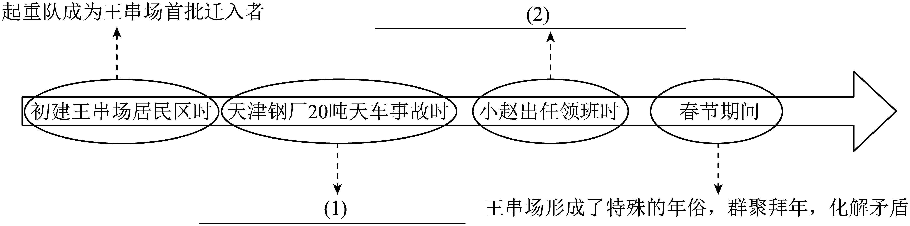

# 2025年山东省青岛市黄岛区中考一模语文试题（解析版）

> 📌 **试题标定**：山东省青岛市黄岛区 | 2025年 | 中考一模

---

<b>2024-2025</b><b>学年度第二学期阶段性学业水平检测九年级语文</b>

<b>（考试时间：</b><b>120</b><b>分钟；满分：</b><b>120</b><b>分）</b>

<b>本试题共三道大题，</b><b>23</b><b>道小题。所有题目均在</b><b>答题卡</b><b>上作答，在试题上作答无效。其中，选择题部分必须用</b><b>2B</b><b>铅笔在答题卡相应位置涂写；笔答题部分必须用</b><b>0.5</b><b>毫米黑色签字笔在答题卡相应位置作答。</b>

<b>一、积累与运用（</b><b>24</b><b>分）</b>

路名，是城市变迁的见证。德国占领青岛时，“威廉街”“柏林街”等满带殖民色彩的路名相继出现；日本取代德国后，又冒出“舞鹤町”之类的路名。而当列强被赶出了中国，（焕）然一新的“太平路”等路名，即出现在街口。

路名，是城市发展的晴雨表。透过路名，可见根深（缔）固的时代烙印。中山路等街巷往往（铭）刻着民国的印记；而香港路等，则如改革开放的春芽，在柏油路面生长出新时代的年轮。

_______________。许多城市的“和平路”“幸福路”，承载着大众对美好生活的憧憬。青岛将“阴岛路”改为“红岛路”，周围居民无不为之欢呼，只因“红”字更契合人们心理预期。

路名，是城市文化的注脚。路名，（折）射出历史人文与地域文化，值得我们细细品味。

1. 文段中加点的字，注音不正确的一项是（   ）

A. 烙（luò）印	B. 承载（zài）	C. 憧（chōng）憬	D. 契（qì）合

2. 文段中括号内的字形，书写不正确的一项是（   ）

A. 焕	B. 缔	C. 铭	D. 折

3. 根据上下文，在横线处补写一句话，使整段文字语意连贯，结构完整。

【答案】1. A    2. B

3. 路名，是城市理想的寄托。

【解析】

【1题详解】

本题考查字音的识记。

A.烙（luò）印——lào；

故选A。

【2题详解】

本题考查字形的识记。

根深（缔）固——根深蒂固；

故选B。

【3题详解】

本题考查补写句子。

文段采用“总—分”结构，首段以“太平路”引出话题，中间三段分别从时代烙印、情感寄托、文化注脚三个维度展开。结合第②段“路名，是城市发展的晴雨表”，第④段“路名，是城市文化的注脚”可知，横线处补充的句子应当与此两句在句子形式上保持一致，即“路名，是……的……”；

观察“和平路”“幸福路”等命名规律，发现其本质是“城市管理者通过路名表达对美好生活的期许” 对比“阴岛路”改“红岛路”案例，印证路名承载着“集体情感认同”。因此可拟写为：路名，是城市情感的寄托。

<b>【活动二</b><b> </b><b>文化传承】</b>

①青岛的非遗文化丰富多彩，令人叹为观止。据统计，青岛现有各级非遗项目926项，其中，国家级16项，省级85项，市级207项。<u style="text-decoration: wavy;">胶州秧歌、茂腔、螳螂拳、胶东剪纸、刘氏泥塑</u>等项目，独具匠心，魅力非凡，如璀璨明珠，镶嵌在城市各处。

②<u>这些非遗项目不仅是历史文脉的传承载体，青岛而且是构筑文化自信的中流砥柱。</u>

③近年来，青岛推陈出新，让非遗迸发活力。柳腔剧团利用互联网平台开展线上展演和互动教学，让这一传统戏曲剧种重获新生。胶东非遗博物馆运用VR技术打造数字展馆，让千年文化遗产突破时空界限，令参观者设身处地。

4. 文段中加点的词语，使用不正确的一项是（   ）

A. 叹为观止	B. 魅力	C. 镶嵌	D. 设身处地

5. 文段中画横线的句子有语病，请写出修改后的句子。

6. 学校举办“非遗文化传承周”活动，需要从第①段画波浪线的非遗项目中选择一个，策划两项创意活动。请参照示例，完成活动策划（不得重复文中和示例中的已有活动）。

| 【示例】项目选择：胶东剪纸 活动策划：①开发剪纸元素表情包②设计可折叠剪纸灯饰 |
| --- |

【答案】4. D    5. 这些非遗项目不仅是历史文脉的传承载体，而且是青岛构筑文化自信的中流砥柱。

6. 项目选择：刘氏泥塑

创意活动：①开展“泥塑盲捏挑战赛”；②组织泥塑创意组装展示。

【解析】

【4题详解】

本题考查词语运用。

A.叹为观止：形容看到的事物好到了极点，尽善尽美，无以复加。句中用来形容对青岛非遗文化的丰富性感到非常赞叹，使用正确；

B.魅力：很能吸引人的力量。句中用来形容胶州秧歌、茂腔、螳螂拳等项目的吸引力，使用正确；

C.镶嵌：把一物体嵌入另一物体内。句中用来比喻这些项目如璀璨明珠般点缀在城市各处，形象生动，使用正确；

D.设身处地：原意是设想自己处在别人

那种境地，指替别人的处境着想。句中用来形容参观者通过VR技术体验非遗文化，使用错误，应该为“身临其境”；

故选D。

【5题详解】

本题考查病句修改。

原句“这些非遗项目不仅是历史文脉的传承载体，青岛而且是构筑文化自信的中流砥柱”存在语序不当的问题，“青岛”不应在“而且”前，应将“青岛”移至“不仅”前，使句子主语和关联词位置正确。

【6题详解】

本题考查活动设计。

首先要从给定的非遗项目中选择一个，然后围绕该项目的特点进行创意活动策划。活动要具有创新性和可行性，能体现对非遗项目的传承与推广。以“胶州秧歌”为例，可以从表演形式创新、文化传播方式创新等角度思考。

示例：项目选择：胶州秧歌

创意活动：①举办胶州秧歌快闪活动，在城市广场等公共场所进行即兴表演，吸引市民关注。②开发胶州秧歌主题的手机游戏，玩家通过模仿秧歌动作过关升级，增加对秧歌的了解和兴趣。

7. 《红星照耀中国》中，我们读到了朱德“平凡”而“伟大”的形象特点，请结合书中内容，简要分析。

【答案】朱德虽然出身平凡，但他的坚韧不拔、英勇善战和关心士兵的品质使他成为伟大的革命领袖。他放弃高官厚禄，选择参加革命，为国家和人民做出了巨大贡献。

【解析】

【详解】本题考查名著人物分析。

需要从《红星照耀中国》中找出相关内容，分别阐述朱德“平凡”和“伟大”的形象特点，并结合具体事例进行分析。回顾书中对朱德的描写，包括他的日常生活、工作习惯、军事才能、领导风范以及与战士和群众的相处等方面的内容。从这些描述中提炼出体现他平凡和伟大的细节。

在《红星照耀中国》中，朱德展现出了平凡而伟大的形象特点。

平凡之处：朱德有着普通人的生活习惯和爱好。他喜欢在军营里闲逛，和战士们一起打乒乓球。这一细节描写，让我们看到他没有高高在上的架子，就像身边普通的长辈或伙伴，融入士兵们的生活，充满生活气息，展现出平凡人的一面。

伟大之处： 军事才能卓越：从纯粹军事战略和战术上处理一支大军撤退来说，中国没有见到过任何可以与朱德统帅长征的杰出领导相比的情况。在长征途中，他带领部下的军队在西藏（康）的冰天雪地之中，经受了整整一个严冬的围困和艰难，除了牦牛肉以外没有别的吃的，而仍能保持万众一心。这体现了他非凡的军事领导能力和在艰难环境下稳定军心的智慧，带领军队克服重重困难，完成了伟大的长征。

人格魅力非凡：朱德具有鼓舞部下为一个事业英勇牺牲的忠贞不贰精神的罕见人品。他的部下对他充满尊敬和信任，愿意跟随他出生入死。这种人格魅力使他能够凝聚人心，让战士们为了共同的革命目标而不懈奋斗，是他成为伟大领导者的重要因素。

革命意志坚定：朱德从一名爱国主义者、民主主义者成长为伟大的共产主义战士，经历了旧民主主义革命、新民主主义革命、社会主义革命和社会主义建设几个历史时期，始终站在时代前列。无论面对什么样的艰难险阻和重大挫折，他都始终没有动摇过自己的信仰，坚持为党和人民的事业奋斗终身。如南昌起义部队南下潮汕失败，朱德所部孤立无援时，他挺身而出，稳住军心，坚信黑暗是暂时的，最后胜利一定是属于他们的。

8. 根据提示，将下面的诗文补充完整。

诵读经典古诗文，我们能感受到炽热的爱国之情。范仲淹《渔家傲·秋思》中的“浊酒一杯家万里，（1）___________________”，写戍边将士既想建功立业又想念家乡的复杂心情；诸葛亮《出师表》中的“（2）___________________，奉命于危难之间”，尽显忠臣临危受命的担当；辛弃疾在《破阵子·为陈同甫赋壮词以寄之》中用“（3）___________________，（4）___________________”，倾吐收复山河、建功立业的豪情；文天祥在《过零丁洋》中以“（5）___________________？（6）___________________”，彰显其舍生取义的民族气节；苏轼在《江城子·密州出猎》中用“持节云中，（7）___________________”，表达其为朝廷效力的渴望；岑参《白雪歌送武判官归京》中“（8）___________________，都护铁衣冷难着”，以边塞苦寒映照将士戍边的艰苦与坚守。

【答案】    ①. 燕然未勒归无计    ②. 受任于败军之际    ③. 了却君王天下事    ④. 赢得生前身后名    ⑤. 人生自古谁无死    ⑥. 留取丹心照汗青    ⑦. 何日遣冯唐    ⑧. 将军角弓不得控

【解析】

【详解】本题考查名句名篇默写。默写题作答时，一是要透彻理解诗文的内容；二是要认真审题，找出符合题意的诗文句子；三是答题内容要准确，做到不添字、不漏字、不写错字。注意本题中的易错字：燕、勒、赢、遣。

<b>二、阅读（</b><b>46</b><b>分）</b>

<b>（一）诗词阅读（</b><b>7</b><b>分）</b>

夜泊水村①

陆游

腰间羽箭久凋零，太息燕然未勒铭。

老子②犹堪绝大漠，诸君何至泣新亭③。

一身报国有万死，双鬓向人无再青。

记取江湖泊船处，卧闻新雁落寒汀。

【注】①淳熙六年（1179），陆游因赈灾被罢职；淳熙九年，奉祠居家，作此诗，时年五十八岁。②老子：陆游自称，犹言老夫。③泣新亭，东晋时中原沦陷，王室南渡，一些士大夫宴饮于新亭，相对涕泣。

9. 下列对这首诗歌的理解和分析，不正确的一项是（   ）

A. 首联“燕然未勒铭”以东汉窦宪破匈奴的典故，暗写南宋朝廷未能收复失地的现实困境。

B. 颔联中的“诸君何至泣新亭”，表达了诗人对达官贵人在山河破碎之际懦弱昏庸的不满。

C. 尾联写眼前闲泊水村的景象，“江湖泊船”“卧闻新雁”，表现了诗人闲适恬淡的隐逸之趣。

D. 全诗以“报国”为核心，通过典故、对比等表现手法，表现诗人深沉的情感，令人慨叹。

10. “一身报国有万死，双鬓向人无再青”两句意蕴丰厚。请结合诗歌内容，简要分析。

【答案】9. C    10. 这两句诗表达了诗人虽然年老但仍愿以身报国的壮志，以及对时光流逝、青春不再的感慨。诗人用“一身报国有万死”表达了自己对国家的忠诚和愿意为国家牺牲的决心，而“双鬓向人无再青”则表达了对青春不再、时光流逝的无奈和感慨。

【解析】

【导语】这首《夜泊水村》是陆游晚年壮志难酬的悲愤之作。全诗以“报国”为诗眼，通过“羽箭凋零”“燕然未勒”等典故，暗讽南宋偏安；“绝大漠”与“泣新亭”的对比，凸显诗人老而弥坚的报国热忱。尾联看似闲适的江湖夜泊，实则以“寒汀新雁”的意象，寄托着烈士暮年的苍凉。诗中交织着“万死报国”的壮怀与“双鬓无青”的悲怆，在沉郁顿挫中展现出陆游特有的爱国激情与生命张力。

【9题详解】

本题考查赏析诗歌

C.尾联“记取江湖泊船处，卧闻新雁落寒汀”，表面上写的是江湖泊船、卧闻新雁的景象，但结合全诗来看，这并非表现诗人闲适恬淡的隐逸之趣，而是以景衬情，通过描绘凄凉的景象，烘托出诗人报国无门的悲愤和无奈，该项错误。故选C。

【10题详解】

本题考查赏析诗句。

“一身报国有万死”诗人直抒胸臆，强调自己愿意为了报效国家，不惜经历万死不辞的艰难险阻，体现出他对国家的忠诚和坚定的报国信念，凸显出其爱国之情的深厚与强烈。

“双鬓向人无再青”则是感慨自己的双鬓已经斑白，再也无法恢复到年轻时的乌黑，意味着时光一去不复返。青春不再，诗人意识到自己可用于报国的时间越来越少，在对比中更显其壮志未酬的无奈与悲哀。

这两句诗将诗人的爱国壮志与岁月无情的现实形成鲜明对比，既展现了他以死报国的高尚情怀，又流露出对时光流逝、理想难以实现的深深遗憾，丰富了诗歌的内涵，使诗人的形象更加立体可感，也让读者更能体会到他内心的悲愤与无奈，增强了诗歌的艺术感染力。

<b>（二）文言文阅读（</b><b>12</b><b>分）</b>

【甲】

余幼时即嗜学。家贫，无从致书以观，每假借于藏书之家，手自笔录，计日以还。天大寒，砚冰坚，手指不可屈伸，弗之怠。录毕，走送之，不敢稍逾约。以是人多以书假余，余因得遍观群书。既加冠，益慕圣贤之道。又患无硕师名人与游，<u>尝趋百里外，从乡之先达执经叩问。</u>先达德隆望尊，门人弟子填其室，未尝稍降辞色。余立侍左右，援疑质理，俯身倾耳以请；或遇其叱咄，色愈恭，礼愈至，不敢出一言以复；俟其欣悦，则又请焉。故余虽愚，卒获有所闻。

（节选自《送东阳马生序》）

【乙】

上①性严重②寡言，独喜观书，虽在军中，手不释卷。闻人间有奇书，不吝千金购之。显德③中从世宗平淮甸，或谮④上于世宗曰：“<u style="text-decoration: wavy;">赵某下寿州私所载凡数车皆重货也。</u>”世宗遣使验之，尽发笼箧，唯书数千卷，无他物。世宗亟召上，谕曰：“<u>卿方为朕作将帅，辟封疆，当务坚甲利兵。</u>何用书为？”上顿首曰：“臣无奇谋，上替圣德，滥膺⑤寄任，常恐不迨，所以聚书，欲广闻见、增智虑也。”世宗曰：“善。”

（节选自《宋史》）

【注】①上：指宋太祖赵匡胤。②严重：谨严，持重。③显德：后周世宗（柴荣）的年号。④谮（zèn）：说坏话诬陷别人。⑤滥膺：肩负。滥：谦辞，表示不称职。

11. 下面对文中加点词语的解释，不正确的一项是（   ）

A. 援疑质理    质：询问

B. 礼愈至    至：到达

C. 尽发笼箧    发：打开

D. 常恐不迨    迨：达到

12. 文中画波浪线的部分有两处需要断句，请将需断句处相应的字母涂到答题卡上。

赵某A下寿州B私所载C凡数车D皆重货也。

13. 下列各项中，加点词的含义和用法相同的一项是（   ）

A. 以是人多以书假余    故临崩寄臣以大事（《出师表》）

B. 俟其欣悦    其真无马邪（《马说》）

C. 不吝千金购之    公将鼓之（《曹刿论战》）

D. 或谮上于世宗曰    所欲有甚于生者（《鱼我所欲也》）

14. 把文中画横线的句子翻译成现代汉语。

（1）尝趋百里外，从乡之先达执经叩问。

（2）卿方为朕作将帅，辟封疆，当务坚甲利兵。

15. 结合甲、乙两个文段，说说宋濂和赵匡胤有什么共同特点？

【答案】11. B    12. BD    13. A

14. （1）我曾经快步走到百里之外，拿着经书向同乡有道德有学问的前辈请教。（2）你如今正给我担任将帅，开拓疆土，应当致力于使铠甲坚固，使兵器锋利。

15. 从宋濂从幼时借书抄录到成年后百里求师来积累知识，赵匡胤在军中坚持读书以增长智慧，可以看出宋濂和赵匡胤都通过读书学习，使自己得到了成长和提升。

【解析】

【导语】这篇文言文对比阅读选材精当，通过宋濂《送东阳马生序》与《宋史》赵匡胤轶事的组合，展现了不同历史人物对知识的共同追求。甲文以细腻笔触刻画寒门学子求学的艰辛，乙文则以典型事例表现帝王将相的读书情怀。两文在“嗜学”主题下形成微妙的互文：宋濂的“手自笔录”与赵匡胤的“手不释卷”相映成趣，共同诠释了“立身以立学为先”的儒家理念。文本在保留文言特色的同时，通过注释降低了阅读难度，适合作为文言文教学的典范材料。

【11题详解】

本题考查文言词语。

B.礼愈至：礼节更加周到。至：周到；

故选B。

【12题详解】

本题考查文言断句。根据文言文断句的方法，先梳理句子大意，分清层次，然后断句，反复诵读加以验证。主语和谓语之间，谓语和宾语、补语之间一般要作停顿。

句意：赵某攻下寿州后，私下里用车装载的东西有好几车，都是贵重财物。

“赵某下寿州”的主语时“赵某”，谓语时“下寿州”，句意完整，断开；“私所载凡数车”中的“私所载”时主语，“凡数车”时谓语，写宋太祖装载东西的数量，句意完整，断开；“皆重货也”时判断句，时对前文所写的几车货物的评价，断开；

故断句：赵某下寿州/私所载凡数车/皆重货也。

故选BD。

【13题详解】

本题考查一词多义。

A.介词，把/介词，把；

B.代词，指老师/副词，表反问语气，意为“难道”；

C.代词，指“奇书”/音节助词，无实际意义；

D.介词，向/介词，表比较；

故选A。

【14题详解】

本题考查文言翻译。完整翻译句子的基础上，把重点字词的意义和用法展现出来，注意省略句要补全，倒装句要调整语序。

（1）尝：曾经；趋：快步走；从：跟随；乡：同乡；先达：有道德有学问的前辈；执：拿；叩问：请教。

（2）卿：你；方：如今；为：作为；作：担任；辟：开拓；封疆：边疆；当：应当；务：致力于；坚甲利兵：坚固的铠甲和锋利的兵器。

【15题详解】

本题考查人物形象。

宋濂幼时“家贫，无从致书以观，每假借于藏书之家，手自笔录，计日以还”，即便“天大寒，砚冰坚，手指不可屈伸”仍“弗之怠”，通过刻苦抄书、按时还书得以“遍观群书”；成年后“患无硕师名人与游，尝趋百里外，从乡之先达执经叩问”，面对先达“叱咄”仍“色愈恭，礼愈至”，最终“卒获有所闻”，以勤奋与虚心从书中积累学识、实现成长。

赵匡胤“虽在军中，手不释卷。闻人间有奇书，不吝千金购之”，即便身处军旅仍坚持读书，甚至因“聚书数千卷”遭人诬陷，面对世宗质疑时直言“所以聚书，欲广闻见、增智虑也”，将读书视为“增智虑”的途径，以主动求知的态度通过书籍提升谋略与见识。

两人虽身份不同（一文士一将领），但文中“手自笔录，弗之怠”与“手不释卷”“聚书”等细节，均印证了他们以读书为成长驱动力的共通之处——宋濂借书籍摆脱贫困、积累学问，赵匡胤以书籍充实智谋、奠定格局，均通过持续学习实现自我提升。

【点睛】参考译文：

【甲】我年幼时就非常喜爱读书。家里贫穷，无法得到书来阅读，常常向藏书的人家借书，亲手用笔抄写，计算着日期按时归还。天气特别寒冷时，砚台里的墨汁都结了坚冰，手指冻得不能弯曲和伸直，也不放松抄书。抄写完后，跑着送还书，不敢稍稍超过约定的期限。因此人们大多愿意把书借给我，我于是能够遍览群书。成年以后，更加仰慕古代圣贤的学说。又忧虑不能与才学渊博的老师和名人交往，曾经快步走到百里以外，拿着经书向同乡有道德有学问的前辈请教。前辈道德声望高，门人学生挤满了他的房间，他的言辞和态度从未稍有委婉。我站在旁边侍候着，提出疑难，询问道理，弯下身子，侧着耳朵来请教；有时遇到他大声斥责，我的表情更加恭顺，礼节更加周到，不敢说一个字反驳；等到他高兴时，就又去请教。所以我虽然愚钝，最终还是有所收获。

【乙】宋太祖性格严肃稳重、沉默寡言，唯独喜欢读书，即使在军中，也手不释卷。听说民间有奇书，不惜花千金购买。显德年间，他跟随周世宗平定淮甸，有人在世宗面前诬陷他说：“赵某攻下寿州后，私下里用车装载的东西有好几车，都是贵重财物。”世宗派使者查验，打开所有箱子，只有几千卷书，没有其他物品。世宗急忙召见宋太祖，告诉他说：“你如今身为朕的将帅，开拓边疆，应当致力于坚固的铠甲和锋利的兵器。要书有什么用？”宋太祖叩头说：“臣没有奇谋，对上有负陛下的圣德，愧受重任，常担心能力不足，所以收集书籍，想要扩大见闻、增长智慧谋略。”世宗说：“好。”

<b>（三）实用性文本阅读（</b><b>9</b><b>分）</b>

【材料一】

①早在20世纪50年代人工智能诞生初期，科学家们就试图使用计算机来解决科学问题，这个时期的研究主要集中在数学和物理学领域，利用计算机进行数值模拟和复杂计算。

②20世纪80年代，专家系统开始兴起，专家系统内含有特定领域的专家知识和经验，人工智能可以使用这些知识和经验通过逻辑学进行推理与判断，模拟人类专家去解决特定领域的问题。

③随着近20年来机器学习技术的成熟，人工智能不再局限于传统的逻辑推断，而是能够从大量的数据之中挖掘出数据的内在联系，在数学、物理、化学、天文、生物等学科中取得了重要成果。

④人类科学历史的发展经历了四个阶段，经验科学、理论科学、计算科学、数据科学。AI for Science（人工智能驱动的科学研究）是一种新兴的科学研究手段，是这四个发展阶段科学研究方法的有机结合。它使用已知的科学规律进行建模，同时又挖掘海量数据的规律，在计算机强大算力的加持下，进行科学问题的研究。

⑤人工智能作为计算机学科的一个新兴分支，它在科研领域发挥的作用与传统的计算机科学不同。计算机最早是为了辅助人类计算而发明的，它计算速度快、准确度高、可以自动化执行，在科研领域产生了重要的影响。

⑥但传统计算机只是代替人类完成复杂繁琐的计算，而人工智能更加追求“智能”，希望计算机能够代替人类的智能，像人类一样学习与推理。

⑦然而，AI for Science仍面临挑战，如：数据不足（科研数据稀缺且质量参差不齐）；算法依赖专家（需结合相应领域知识设计专用算法）；算力需求高；复合型人才短缺。

【材料二】

①随着蛇年春晚上身着花袄、手持花绢扭秧歌的人形机器人“福兮”火出圈，具身智能的概念进入大众视野。

②通俗地说，具身智能是指具有身体的智能，其机器大脑能够帮助决策，从而支配肢体能够快速对外部环境变化做出反应，核心在于实体设备与智能决策的深度融合。

③“我们人类用大脑支配四肢完成跑跳、感知周围事物变化并越过障碍，这些都可看成是具身智能的体现。”中国科学院自动化研究所研究员赵晓光说，区别于仅依赖计算的“离身智能”，具身智能设备既能通过传感器感知物理世界，又能借助大模型理解任务、自主决策并执行。

④近年来，得益于人工智能大模型的出现与不断迭代，具身智能取得了飞速进步，成为新一波人工智能浪潮的重点方向。“大模型让我们模仿人类大脑的一部分功能成为现实，也就意味着有可能让机器人拥有一个聪明的大脑。”赵晓光说，“把大模型和机器人结合在一起，就形成了具身智能。”

⑤具身智能并不限于特定的形态。赵晓光说：“有一个聪明的大脑，能够支配灵巧的肢体去应对外部环境的变化，具备这样条件的智能机器都可称为具身智能。但是在不同的‘身体’里都存在一个决策系统，能够指导‘身体’完成相对应的任务。”

⑥“具身智能可以做很多事情，比如，能在危险的、枯燥的、有毒有害的环境中工作，把人从这些工作环境中解放出来。”赵晓光说。

⑦随着人工智能技术不断创新突破，具身智能正逐步从理论走向实践，从实验室走向现实。投入救援演练、在展厅担任讲解员、在工厂进行产品质检……当下，被视为具身智能的关键载体之一的人形机器人已逐渐在多元场景展开应用。

⑧具身智能有望成为科技竞争的新高地、未来产业的新赛道、经济发展的新引擎。专家表示，具身智能领域蕴含着巨大的市场潜力和发展机遇，未来，相关产品将在智能制造、智能家居、智慧医疗、智能服务等多个领域发挥重要作用。

【材料三】

①AI技术如汹涌浪潮般席卷而来，其强大功能为人类社会带来前所未有的发展机遇。然而，在蓬勃发展背后，一系列伦理治理难题如暗礁横亘。其中，AI真实性和AI价值观是不容忽视的两个方面。

②在AI发展伴随的真实性挑战中，与人们息息相关的是虚假信息问题。譬如，基于生成对抗网络的深度伪造技术，能够生成高度逼真的虚假视频，这轻则令个人利益受损，重则影响社会秩序和公共安全。

③应对这一挑战，一方面，开发者在模型训练和算法部署的每一个环节，都应融入透明性和可验证性机制，从根源上防止虚假信息的产生和传播；另一方面，应加快推出相关法律法规，对利用AI制造并传播虚假信息的行为予以惩治。

④除了真实性难题，AI价值观也是伦理治理的重中之重。我们知道，AI系统的学习基于海量数据集，这些数据往往包含了人类社会的各种偏见。例如，一些西方国家AI面部识别系统对少数族裔群体的误判率高达20%至30%，而识别白人时的错误率则低得多。这种“AI偏见”的形成，在技术层面，是由于研发者采用的数据库原始样本就存在严重的种族不平等。这甚至可能使算法将深肤色特征与“高风险”联系在一起。一旦金融、安检和执法领域运用此类面部识别系统，就可能导致不公正待遇。

⑤技术创新是AI前进的动力，但唯有配以伦理“导航”，才能使其真正造福人类。

16. 下面对材料的理解，正确的一项是（   ）

A. AI for Science是人类科学历史发展的第五个阶段，其主要特点是可以进行海量数据的计算。

B. 传统计算机与人工智能的差异在于：前者代替人类完成复杂计算，后者可模拟人类学习与推理。

C. 所谓具身智能就是指具有人形形态的智能设备，其核心在于实体设备与智能决策的深度融合。

D. 开发者在模型训练和算法部署时融入防护机制，就能够应对AI发展伴随的真实性挑战。

17. 下面对材料的理解与分析，正确的一项是（   ）

A. 材料一主要运用逻辑顺序说明了人工智能自诞生以来的发展历程及其解决问题的方法演变。

B. 材料二从什么是具身智能、具身智能

特点和具身智能的发展前景三个方面介绍了具身智能。

C. 材料三以西方国家面部识别系统对少数族裔的误判为例，说明了AI价值观中往往会包含人类社会的偏见。

D. 材料三采用“总——分”的结构，先总述AI引发的伦理挑战，再分别阐述真实性与价值观问题的具体表现。

18. 有同学认为，AI技术存在制造虚假信息、产生偏见等伦理风险，因此不应继续发展。对此你并不赞同，请结合以上三则材料简要说明理由。

【答案】16. B    17. C

18. ①AI技术是社会进步、科技发展的必然趋势，能够给人类生活带来很多便利，我们应该适应并学会运用新技术。②对于AI技术中存在的风险，我们可以通过算法中嵌入透明性验证机制、加快推出并完善相关法律法规、优化数据库原始样本使其数据尽量涵盖各种可能情况等措施去避免。

【解析】

【导语】这组材料围绕人工智能展开，涵盖AI for Science、具身智能、AI伦理治理等方面。以清晰逻辑顺序，从不同角度介绍人工智能发展历程、新兴概念及面临问题。运用举例、对比等说明方法，语言简洁准确，既展现人工智能的前沿成果，也客观呈现其发展中的挑战，为读者全面了解人工智能提供丰富视角。

【16题详解】

本题考查对内容的理解与分析。

A.根据材料一第④段“AI for Science（人工智能驱动的科学研究）是一种新兴的科学研究手段，是这四个发展阶段科学研究方法的有机结合”可知，AI for Science不是人类科学历史发展的第五个阶段，该项错误；

C.根据材料二第⑤段“具身智能并不限于特定的形态”可知，具身智能并非仅指具有人形形态的智能设备，该项错误；

D.根据材料三第③段“应对这一挑战，一方面，开发者在模型训练和算法部署的每一个环节，都应融入透明性和可验证性机制，从根源上防止虚假信息的产生和传播；另一方面，应加快推出相关法律法规，对利用AI制造并传播虚假信息的行为予以惩治”可知，仅融入防护机制并不够，还需法律法规配合，该项说法过于绝对；

故选B。

【17题详解】

本题考查对内容的理解与分析。

A.材料一主要说明人工智能在科研领域的发展及面临的挑战，不仅是发展历程和解决问题方法演变，该项表述不全面；

B.材料二从具身智能的概念、与“离身智能”区别、取得进步的原因、不限于特定形态、应用场景、发展前景等多方面介绍，并非仅题干所说三个方面；

D.材料三采用“总——分——总”结构，开头指出AI有伦理治理难题，中间分别阐述真实性与价值观问题，结尾强调AI需伦理“导航”，该项说“总——分”结构错误；

故选C。

【18题详解】

本题考查对材料内容的理解与概括。

根据材料三第①段“AI技术如汹涌浪潮般席卷而来，其强大功能为人类社会带来前所未有的发展机遇”可知，AI技术是社会进步、科技发展的必然趋势，能够给人类生活带来很多便利，我们应该适应并学会运用新技术。

根据材料三第③段“应对这一挑战，一方面，开发者在模型训练和算法部署的每一个环节，都应融入透明性和可验证性机制，从根源上防止虚假信息的产生和传播；另一方面，应加快推出相关法律法规，对利用AI制造并传播虚假信息的行为予以惩治”可知，对于AI技术制造虚假信息的风险，我们可以通过算法中嵌入透明性验证机制、加快推出并完善相关法律法规等措施去避免。

根据材料三第④段“这种‘AI偏见’的形成，在技术层面，是由于研发者采用的数据库原始样本就存在严重的种族不平等”可知，我们可以通过优化数据库原始样本使其数据尽量涵盖各种可能情况，避免因数据偏差产生AI偏见。

<b>（四）文学类作品阅读（</b><b>18</b><b>分）</b>

王串场情结

林希

①天津市河北区的王串场，是一处劳动人民居住区，始建于1952年。王串场最先建起的居民区，街名“真理道”，最早迁进来的居民，都是对国家早期建设做出重大贡献的劳动者。市级劳动模范集体起重队，就分到了王串场的第一批新房。

②起重队原名脚行，以人力搬运超重物件的劳动者，都属于脚行。解放后，改名为起重队。新中国成立初期，起重、运输工作最是繁重，那时代没有吊车，没有超重机械，五六十吨的设备，就是靠起重队劳动者用肩膀上的一根绳绊，一步一步搬运移动的。

③“真理道”最早的一家住户，赵爷，老起重队的，特级劳动模范。建设天津钢厂时，20吨天车吊装发生事故。起吊天车到达高度，90度转动，卡在空中，总指挥紧急吹哨，停工，全员撤出。市长亲临现场办公，公安局紧急摸清天津老脚行名家，立即将他们请到现场“会诊”，赵爷名列其中。

④市长陪着赵爷走进空空的大车间，赵爷抬头一看：“哎呀，外行了。”

⑤“怎么办？拆掉刚刚建起来的车间厂房吗？”

⑥“我看，也许能有办法。我试试。”

⑦“不是试试。就是你了。你说，要什么条件吧！”

⑧“18个人，由我挑，别人谁也不许进现场。各位领导，回你们的办公室，有了情况，电话报告。”

⑨“好吧，什么报酬？”

⑩“一个工两块二，中午每人半张大饼半斤酱牛肉，下工一人一盒‘恒大’（香烟）。”

⑪“你个人有什么要求？”

⑫“<u>我个人？没这规矩！</u>多拿一支烟，祖师爷把我踢出家门，断我的本业。”

⑬几位领导回到办公室，万般紧张地守着电话机，水也不喝，饭也不吃。直到下午3点，电话铃响，天车平安落地。钢厂建设的第一场庆功会，就是在20吨天车下边举行的。

⑭赵爷老了，赵爷的大儿子小赵出任领班，起重队业务更是繁忙。

⑮一天，老赵爷听说师兄弟老五伯病了，提着两瓶直沽高粱去看望老搭档。老五伯见到赵爷，感动得不得了，嘴角哆嗦着说不出话。说了许多安慰的话，老赵爷告辞，老五伯的老伴送出来，告诉老赵爷：“老头子心里有点别扭，干活的时候让大侄子着急了。”

⑯老赵爷对儿子的“德性”最是了解，立即去别的老朋友家打听究竟。晚上，在朋友家喝了二两酒的老赵爷大步流星回到家来，一脚把门踢开，冲儿子大喝一声：“跪下！”

⑰按着老规矩，小赵跪在了炕沿儿上，“爹，老五伯……”

⑱老赵爷不听儿子解释，挥手就给儿子一个大脖溜：“老五伯那是我师兄弟，那年法租界电灯房立大烟筒，若不是老五伯，我命没了！”

⑲突然，呼啦啦涌进来十几个起重队伙计，齐刷刷跪在老赵爷面前。“赵爷，那件事，不怪小赵师傅。两手保着大绳，小赵师傅举起的小红旗还没放下，老五伯就松下一只手，伸口袋里摸烟卷。小赵师傅知礼法，他就是冲着老五伯往地上啐了一口唾沫。”

⑳老赵爷气消了。桂顺斋买二斤“小八件”，和儿子一起看望老五伯。老五伯请老赵爷父子落座，老伴送上一壶茶，不等老赵爷说话，老五伯先说了：“大侄子没错，工作上不能讲情面，就算我是上一辈人……”老五伯还要往下说，老赵爷打断老五伯的话，抢着说道：“五伯伯是看着他长起来的，这孩子就是这狗脾气。”说着转身又冲着小赵师傅说：“这是遇见你老五伯了，换个暴脾气，瞧不蹦下来给你来个‘德和勒’。行了，让大侄子给你鞠躬赔个礼……”

㉑“不能不能，咱们都是‘真理道’老住户，对就是对，不对就是不对，我现场走神儿，大侄子批评得对。……别走了，你五婶三鲜卤打好了，面条也下锅了。”

㉒临近春节，王串场家家户户准备家宴，这是各显身手的烹饪大赛。

㉓年夜饭，是一家人围坐一起的团圆饭，到了王串场，成了一次新老住户团拜的社区盛会，仪式隆重，气氛热烈，团结和谐。除夕当天，各家自己团聚。大年初一，任何人不得安排，而是在德高望重的老前辈家聚首拜年。<u>酒敬一巡，听老前辈数说一年来的功过，小辈人之间有什么过节儿，当面说清，</u>握手<u>，</u>行礼<u>，</u>干杯<u>，和好如初，明年共同进步。</u>谁家明年操办什么大事，早早做出安排——王串场传统，任何一户婚丧嫁娶，都是大家的事。

㉔吃过一圈春节家宴，初四上班，回厂聚首，第一主题，评论今年谁家的饭菜成色高。老师傅家的螃蟹面、张家的元宝肉、李家的小酥鱼、王家的海鲜豆腐……各有特色。陈奶奶家的清汤白菜，说是准备了五六天，把每根菜叶的筋抽出来，还不能伤着白菜的外形，出锅盛在大海碗里，原样一棵大白菜，从外及里，没有一丝菜筋。多大的饭店也烧不出这道大菜。

㉕王串场拆迁，起高层，老住户的条件是，将来的高层建成，不能拆散老邻居。

（选自《光明日报》2023年06月26日）

19. 阅读全文，将下面思维导图补充完整。

20. 根据要求，赏析文中画线语句。

（1）第⑫段画线句是对赵爷的语言描写，请分析其表达效果。

我个人？没这规矩！

（2）品味第㉓段画线句中加点词的表达效果。

酒敬一巡，听老前辈数说一年来的功过，小辈人之间有什么过节儿，当面说清，握手，行礼，干杯，和好如初，明年共同进步。

21. 下面这句话，放

文中哪两段中间合适？请说明理由。

“真理道”讲真理。任何事，都得按着真理办，就连年夜饭也按规矩办。

22. 根据文章内容，简要概括“王串场情结”的丰富内涵。

【答案】19. （1）赵爷带领18名工人化解危机，拒绝收取个人的额外报酬；（2）老五伯工和小赵因工作产生矛盾，老赵爷带小赵登门道歉，两代人和解

20. （1）这句话句式短小，简洁有力。写出老赵爷拒收额外好处时的干脆利落、态度坚决，展现以赵爷为代表的劳动者的有原则，不图个人私利的精神。（2）“握手”“行礼”“干杯”这几个连续的动作，写出了王串场初一集体拜年化解矛盾的场景，表现“真理道”的邻里们坦诚相待、重情重义、不拘小节的邻里情。

21. 在㉑和㉒段之间。“‘真理道’讲真理”承接上文讲老五伯和小赵之间的矛盾冲突的方式是“讲道理”，以及邻里坦诚相待、坚守原则与情义平衡的处世真理；“任何事，都得按着真理办任何事，就连年夜饭也按规矩办。”开启下文中写“真理道”的春节安排，表现了互帮互助、团结和谐的社区氛围。

22. 文中通过叙述王串场的人和事，体现了那里人们拼搏、不图私利的精神、重情义讲道理的作风和邻里之间团结和谐互帮互助的情谊，表达了内心的赞美之情，同时也表达了对王串场的生活和情谊的珍视与不舍。

【解析】

【导语】《王串场情结》围绕天津王串场展开，以赵爷等人物故事串联。通过对起重工作、邻里矛盾化解、春节习俗等描写，展现劳动者拼搏无私、邻里重情讲理与团结和谐。语言质朴，生活气息浓厚，以小见大，表达对王串场独特人文风貌的眷恋与赞美，唤起读者对邻里温情的共鸣。

【19题详解】

本题考查对内容的理解与概括。

第一空，已知信息“天津钢厂20吨天车事故时”对应第③段，根据第③段“建设天津钢厂时，20吨天车吊装发生事故。起吊天车到达高度，90度转动，卡在空中”，第⑧段“18个人，由我挑，别人谁也不许进现场。各位领导，回你们的办公室，有了情况，电话报告”，第⑫段“我个人？没这规矩！多拿一支烟，祖师爷把我踢出家门，断我的本业”以及第⑬段“直到下午3点，电话铃响，天车平安落地”可知，赵爷带领18名工人化解危机，拒绝收取个人的额外报酬。

第二空，已知信息“小赵出任领班时”对应第⑭段，根据第⑮段“老五伯见到赵爷，感动得不得了，嘴角哆嗦着说不出话。说了许多安慰的话，老赵爷告辞，老五伯的老伴送出来，告诉老赵爷：‘老头子心里有点别扭，干活的时候让大侄子着急了’”，第⑱段“老赵爷不听儿子解释，挥手就给儿子一个大脖溜：‘老五伯那是我师兄弟，那年法租界电灯房立大烟筒，若不是老五伯，我命没了’”，第⑲段“两手保着大绳，小赵师傅举起的小红旗还没放下，老五伯就松下一只手，伸口袋里摸烟卷。小赵师傅知礼法，他就是冲着老五伯往地上啐了一口唾沫”第⑳段“行了，让大侄子给你鞠躬赔个礼……”，第㉑段“不能不能，咱们都是‘真理道’老住户，对就是对，不对就是不对，我现场走神儿，大侄子批评得对”可知，老五伯和小赵因工作产生矛盾，老赵爷带小赵登门道歉，两代人和解。

【20题详解】

本题考查赏析重要语句。

（1）根据第⑫段“‘我个人？没这规矩！多拿一支烟，祖师爷把我踢出家门，断我的本业’”可知，此句是面对领导询问个人要求时赵爷的回答，句式简短。“没这规矩”直接干脆地表明赵爷不接受个人额外报酬的态度，毫无拖泥带水之感，体现出他坚守行业规矩，不贪图个人私利，有力地展现了以赵爷为代表的劳动者秉持原则、正直无私的精神品质。

（2）根据第㉓段“酒敬一巡，听老前辈数说一年来的功过，小辈人之间有什么过节儿，当面说清，握手，行礼，干杯，和好如初，明年共同进步”可知，“握手”是邻里间友好亲近的表示，“行礼”体现出对彼此的尊重，“干杯”则象征着矛盾的化解与情谊的加深。这几个连续的动作描写，生动形象地描绘出王串场初一集体拜年时，邻里间化解矛盾的具体场景，凸显出这里的邻里之间相处真诚，重视彼此情谊，且豁达、不拘小节的情感特质。

【21题详解】

本题考查内容理解与语句补充。

根据第⑮至㉑段“老五伯见到赵爷，感动得不得了，嘴角哆嗦着说不出话。说了许多安慰的话，老赵爷告辞，老五伯的老伴送出来，告诉老赵爷：‘老头子心里有点别扭，干活的时候让大侄子着急了’”“两手保着大绳，小赵师傅举起的小红旗还没放下，老五伯就松下一只手，伸口袋里摸烟卷。小赵师傅知礼法，他就是冲着老五伯往地上啐了一口唾沫”“行了，让大侄子给你鞠躬赔个礼……”“不能不能，咱们都是‘真理道’老住户，对就是对，不对就是不对，我现场走神儿，大侄子批评得对”可知，上文讲述了老五伯和小赵因工作产生矛盾后，双方秉持原则又重情义，讲道理化解矛盾，体现了“真理道”邻里坦诚相待、坚守原则与情义平衡的处世真理，“‘真理道’讲真理”与之承接。

根据第㉒段“临近春节，王串场家家户户准备家宴，这是各显身手的烹饪大赛”，第㉓段“年夜饭，是一家人围坐一起的团圆饭，到了王串场，成了一次新老住户团拜的社区盛会，仪式隆重，气氛热烈，团结和谐。除夕当天，各家自己团聚。大年初一，任何人不得安排，而是在德高望重的老前辈家聚首拜年”可知，下文开始讲述“真理道”春节期间年夜饭、初一拜年等按规矩进行的活动，表现了团结和谐的社区氛围，“任何事，都得按着真理办，就连年夜饭也按规矩办”能够自然开启下文。所以应放在㉑和㉒段之间。

【22题详解】

本题考查对文章内容的理解与标题内涵概括。

根据第②段“新中国成立初期，起重、运输工作最是繁重，那时代没有吊车，没有超重机械，五六十吨的设备，就是靠起重队劳动者用肩膀上的一根绳绊，一步一步搬运移动的”以及第⑫段“我个人？没这规矩！多拿一支烟，祖师爷把我踢出家门，断我的本业”可知，体现了王串场人拼搏、不图私利的精神。

根据第⑮至㉑段“老五伯见到赵爷，感动得不得了，嘴角哆嗦着说不出话。说了许多安慰的话，老赵爷告辞，老五伯的老伴送出来，告诉老赵爷：‘老头子心里有点别扭，干活的时候让大侄子着急了’”“两手保着大绳，小赵师傅举起的小红旗还没放下，老五伯就松下一只手，伸口袋里摸烟卷。小赵师傅知礼法，他就是冲着老五伯往地上啐了一口唾沫”“行了，让大侄子给你鞠躬赔个礼……”“不能不能，咱们都是‘真理道’老住户，对就是对，不对就是不对，我现场走神儿，大侄子批评得对”可知，展现了王串场人重情义、讲道理的作风。

根据第㉓段“年夜饭，是一家人围坐一起的团圆饭，到了王串场，成了一次新老住户团拜的社区盛会，仪式隆重，气氛热烈，团结和谐。除夕当天，各家自己团聚。大年初一，任何人不得安排，而是在德高望重的老前辈家聚首拜年”可知，表现了王串场邻里之间团结和谐、互帮互助的情谊。

根据第㉕段“王串场拆迁，起高层，老住户的条件是，将来的高层建成，不能拆散老邻居”可知，表达了人们对王串场生活和情谊的珍视与不舍。作者通过叙述王串场的人和事，也传达出内心对这种精神、作风和情谊的赞美之情。

<b>三、作文（</b><b>50</b><b>分）</b>

23. 阅读下面材料，根据要求写作。

翻开语文课本，我们曾在《走一步，再走一步》中的悬崖边，见证少年战胜恐惧的抉择；在《未选择的路》中的岔路口，感受诗人对人生道路的选择；在《简·爱》里的桑菲尔德庄园，触摸简·爱对人生方向的选择……这些穿越时空的选择故事，折射出人性最本真的光芒。

上面文字引发了你怎样的思考？请结合自己的亲身经历，自拟题目，写一篇作文。可以叙写经历，可以抒发情感，也可以发表议论。

要求：①自选角度，自拟题目；②自选文体，诗歌除外；③不少于600字；④文中不得出现真实校名与人名；⑤不得抄袭。

【答案】例文：

抉择之光，照亮成长之路

在人生的漫漫长河中，我们总会面临无数次抉择。每一次抉择，都如同一颗石子投入平静的湖面，激起层层涟漪，塑造着我们独特的生命轨迹。正如语文课本里那些穿越时空的选择故事，它们如同一束束光，照亮了人性的本真，也指引着我在成长路上不断前行。

那是一个阳光炽热的夏日，学校举办了一场盛大的绘画比赛。热爱绘画的我，毫不犹豫地报了名。我怀揣着对绘画的热爱和对胜利的渴望，一头扎进了创作的世界。无数个日夜，我在画纸前挥洒汗水，用画笔勾勒心中的梦想。每一笔、每一划，都倾注了我全部的心血。

然而，就在比赛前夕，一个突如其来的消息如同一记重锤，砸在我的心头。学校组织了一场重要的学科竞赛，而我凭借优异的成绩，成功入选参赛名单。这两个比赛的时间恰好冲突，我必须在绘画比赛和学科竞赛之间做出抉择。

那一刻，我陷入了深深的纠结之中。绘画，是我从小到大的梦想，是我心灵的寄托。每一次创作，都能让我沉浸在色彩与线条的世界里，忘却一切烦恼。而学科竞赛，则是我展现知识储备、提升学习能力的绝佳机会，它关乎着我的学业发展和未来的升学前景。

我独自坐在房间里，望着那幅还未完成的画作，心中五味杂陈。我仿佛看到了自己在绘画比赛中获奖时的喜悦笑容，也仿佛看到了在学科竞赛中取得优异成绩时老师赞许的目光。我不断地在心中权衡利弊，试图找到一个两全其美的办法，但最终发现，这根本就是一个艰难的单选题。

在无数个辗转反侧的夜晚后，我鼓起勇气，做出了自己的抉择——参加学科竞赛。我深知，这个决定意味着我要放弃自己热爱的绘画比赛，意味着我要暂时放下手中的画笔。但我也明白，在人生的这个阶段，学业对于我来说同样重要。我需要通过学科竞赛来提升自己的能力，为未来的发展打下坚实的基础。

当我做出这个决定的那一刻，心中虽然有一丝遗憾，但更多的是坚定和从容。我全身心地投入到学科竞赛的准备中，查阅资料、做练习题、参加模拟考试……每一个环节我都认真对待，不敢有丝毫懈怠。

最终，我在学科竞赛中取得了优异的成绩。当我站在领奖台上，手捧着奖状的那一刻，我心中充满了喜悦和自豪。我知道，这个成绩不仅仅是对我努力的肯定，更是我做出正确抉择的见证。

这次抉择，让我深刻地体会到了成长

艰辛与美好。它让我明白，在人生的道路上，我们不可能拥有一切，必须学会在取舍之间做出选择。每一个抉择都是一次成长的机会，它让我们更加了解自己，更加明确自己的目标和方向。

就像那些语文课本里的故事一样，我们的抉择也折射出了人性最本真的光芒。那是对梦想的执着追求，是对责任的勇敢担当，是在困境中坚守自我的信念。这些抉择之光，将永远照亮我们成长的道路，引领我们走向更加美好的未来。

【解析】

【详解】本题考查材料作文。

第一，审题立意。材料通过语文课本中的经典作品（《走一步，再走一步》《未选择的路》《简·爱》），提炼出“选择”这一主题，强调选择对人生方向、成长蜕变的重要意义。关键词为：选择、抉择、成长、方向、人性光芒。立意方向，个人成长类：结合自身经历，写一次关键选择如何推动自我突破（如坚持兴趣、克服恐惧、接纳失败）。价值观探索类：讨论选择背后的价值判断（如责任与自由、理想与现实、独立与依赖）。人性光辉类：通过选择展现勇气、善良、坚韧等品质（如面对挫折时的坚持、面对诱惑时的坚守）。

第二，构思选材。如写记叙文，开篇引入：可以通过回忆语文课本中的选择故事，引出自己要讲述的选择经历，引起读者的兴趣。中间叙事：详细叙述自己面临选择的情境、内心的矛盾和挣扎，以及最终做出选择的过程。可以运用心理描写、动作描写等手法，使情节更加生动真实。结尾升华：阐述这次选择给自己带来的影响和启示，升华主题，体现“人性最本真的光芒”。选材上，选择兴趣爱好：小时候自己同时喜欢绘画和舞蹈，但时间和精力有限，必须做出选择。经过一番思考，最终选择了绘画，因为绘画能让自己更自由地表达内心的情感。在绘画的过程中，不断克服困难，坚持创作，逐渐在绘画领域取得了一些成绩，也明白了选择要遵循自己内心的热爱。选择帮助他人：在公交车上遇到一位老人摔倒，周围的人有些犹豫不决。自己内心也有些害怕被讹诈，但看到老人痛苦的表情，最终还是选择了上前扶起老人，并送他去医院。通过这次选择，感受到了善良和勇敢的力量，也明白了在面对他人需要帮助时，应该毫不犹豫地伸出援手。

如写议论文，开篇直接点明中心论点，如“选择是人生的必修课，正确的选择能让我们绽放人性的光芒”。论证论点：可以采用举例论证、道理论证、对比论证等方法，从不同角度论证论点。可以列举课本中的选择故事作为论据，也可以结合社会现实中的事例进行分析。总结全文：再次强调论点，呼吁人们在面对选择时要慎重思考，做出正确的选择。

选材及论证方法，举例论证：以鲁迅先生为例，他原本学医，但在日本留学期间，看到国人的麻木不仁，意识到医学只能拯救人的身体，而文学才能拯救人的灵魂。于是他毅然弃医从文，选择了用文字来唤醒民众。鲁迅先生的这一选择，展现了他强烈的爱国情怀和社会责任感，成为后人学习的榜样。对比论证：将正面选择和反面选择进行对比。比如，一些人在面对金钱诱惑时，选择了贪污受贿，最终身败名裂；而另一些人则坚守原则，选择了廉洁奉公，赢得了社会的尊重和赞誉。通过对比，突出正确选择的重要性。

