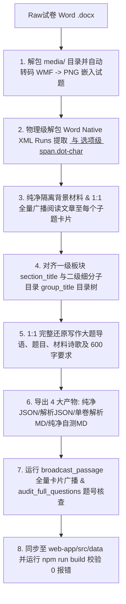

# 🛠️ 语文试卷高保真解析与Web应用沉淀工作流 Skill 规范 (v5.3)

本 Skill 规范总结自 2018–2025 年青岛中考语文真题（特别是 2019/2020/2021 年真题实战审核）的提炼与排错沉淀，指导中考/高考语文试题（包含 `.docx` 原始文档）的 **100% 全真无损复刻、结构化解析、Web 平台部署与分项题库沉淀**。

---

## 核心复刻与解析原则 (Core Standards)

### 1. 🗂️ 阅读大题【一级板块 section_title】与【二级细分子目录 group_title】两级目录双层联动规则 (Dual-Level Catalog System)
* **经验痛点（总结自 2019 年阅读子目录审核）**：
  在渲染阅读大题时，极易因 `section_title` 与 `group_title` 混淆，导致界面只显示顶层的 `🔖 二、阅读` 横幅，而丢失了子目录（如 `📌 （一）诗歌阅读`、`📌 （二）名著阅读`、`📌 （三）文言文阅读`、`📌 （四）现代文阅读Ⅰ`、`📌 （五）现代文阅读Ⅱ`）。
* **两级目录双层联动标准**：
  1. **一级板块 `section_title`**：强制设为顶层大题名称（`一、积累及运用` / `二、阅读` / `三、写作`），前端渲染为深色高亮横幅（如 `🔖 二、阅读`）；
  2. **二级细分子目录 `group_title`**：强制对齐 Word 原稿中的子大题编号与名称（如 `（一）诗歌阅读`、`（二）名著阅读`、`（三）文言文阅读`、`（四）现代文阅读Ⅰ`、`（五）现代文阅读Ⅱ`），前端渲染为蓝色二级导航徽章（如 `📌 （一）诗歌阅读`）；
  3. **双层联动**：确保每个阅读小题卡片既属于 `二、阅读`，又精确归属于对应的二级细分子目录，实现 100% 原卷结构导航还原！

---

### 2. ✒️ XML Native Runs 下划线 <u> 与加点着重号 dot-emphasis 全量物理留存法则 (XML Runs Formatting Retention)
* **阅读原文划线**：凡 Word 原稿中存在下划线 `w:u` 的句子（如文言文翻译画线句、现代文散文/说明文画线句），**必须 100% 用 `<u>句子</u>` 包裹**；
* **题干与选项加点**：凡考查“加点词语/虚词”的试题，目标词语必须 **100% 用 `字...` 包裹**！

---

### 3. ✒️ 加点词语/成语着重号精准归位至选项文字铁律 (Dot Emphasis Placement Rule)
* **题干清扫**：题干中的“加点成语/词语使用不恰当/正确”字眼**严禁包含 `` 着重号**；
* **选项精准包裹**：着重号 `字...` **必须 100% 精准包裹在 A、B、C、D 选项各自的目标成语或词语上**！

---

### 4. 📡 同组阅读大题子题卡片文章 1:1 全量广播绝对强制标准 (Mandatory Subquestion Passage Broadcasting)
* **核心模板法则（对齐 2025 年黄金模板标准）**：
  同属于一个阅读大题分组（如 `（四）现代文阅读（9分）`）的所有子小题，**每一个子题小卡片顶部都必须 100% 广播附有该组的完整阅读原文材料**！

---

### 5. ✍️ 写作大题全要素（导语+题目+材料+要求）1:1 无损还原规范 (Writing Prompt Full Restoration)
* **物理无损还原标准**：
  1. 写作题目的 `stem` 必须包含 Word 原始文档中的**全部引言、题目名称、二选一材料诗歌/文段以及 4 条强制写作要求**；
  2. 若属于“二选一”作文模式，两道作文题目必须全部完整单独留存。

---

### 6. 🛡️ 答案/解析尾端语段泄露与杂质强力阻断门禁 (Passage Leakage & Pollution Gatekeeper)
* **物理阻断与纯净防护**：
  1. **解析尾端阻断**：在 `answer` 与 `analysis` 尾端设置正则阻断门禁，一旦匹配到大题特征标，**强制截断隔离**；
  2. **主观题选项防污染**：严禁在主观简答题的 `options` 中混入误复制的选择题文本或误填选项字母。

---

### 7. 🔒 组合答案与组合解析 1:1 强行强制物理解耦规范 (Mandatory Answer & Analysis Uncoupling)
* **解耦强制标准**：
  1. 针对 `answer` 字段：通过正则 `(\d+)[\.．\s]*([A-D])` 提取每个题号对应的唯一选项字母，**1:1 精准填入各自题目的 `answer` 属性**；
  2. 针对 `analysis` 字段：通过正则 `【(\d+)题详解】` 切割，将 `【X题详解】...` 1:1 绑定给对应题号。

---

### 8. 🖼️ 试题插图/图表物理解包与 1:1 相对路径嵌入规范 (Embedded Image Restoration)
* **物理解包与嵌入流程**：
  1. 解包 `.docx` 底稿 `word/media/` 目录下所有图片；矢量图（.wmf/.emf）自动高保真转码为 PNG；
  2. 采用 `` 语法精准嵌入。

---

## 🛠️ 标准自动化解析与部署流水线 (Standard Deployment Pipeline)

### 单卷 Markdown 文件统一命名规范：
位于 `01_青岛中考/正式真题/单卷解析/`：
`<年份>年山东省青岛市中考语文真题试卷（解析版）.md`

---

*版本：v5.3 (阅读大题【一级板块 section_title】与【二级细分子目录 group_title】两级目录双层联动规则) | 维护人：Antigravity Agentic Chinese Exam Team*
