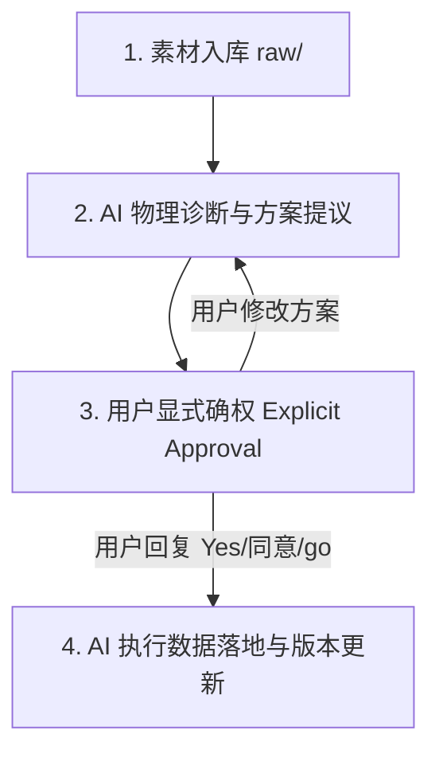

# 个人通用知识库建造 SOP 工程规约与多题联合打点黄金法则 (v3.6)

## 📌 1. 知识库目录规范 (Directory Standard)

```
[Knowledge_Base_Root]/
├── skills/                          # 方法论沉淀层：SOP 规约文档、清洗处理协议、转换/数据处理脚本
├── 01_青岛中考/                      # 核心真题与模拟题知识库
│   └── 区县模拟/
│       ├── 单卷解析/                 # 原始 Markdown 解析文件
│       └── JSON数据库/              # 结构化解构全要素数据库
└── wiki/                            # 提炼知识与考点专题库
```

---

## ⚡ 2. 知识结构化提纯与多题联合打点黄金法则 (v3.6)

### 2.1 零污染与精确解构法则 (法则 2.1)
- 彻底剔除原数据库中由于正则错拼将【答案】与写作【解析】导语/史实错当独立小题干的垃圾碎片，严格还原中考原卷标准的真实题目拆解数量。

### 2.2 试题完整性与 stem 纯净度
- 题干 `stem` 必须保留完整评分分值、小题题号与完整提示。
- 严禁将答案、解析文本混入 `stem` 或 `passage` 中。

### 2.3 多题目考查点联合并集打点法则 (法则 2.29)
- 同一背景材料 `passage`（如文言文、非连续性文本、记叙文）如果对应多道小题，背景材料必须**全量补齐原文**，并且必须**并集植入所有小题的所有富文本考查标记**。
- 严禁只打第 1 题的字音点而遗漏第 2 题的字形词语点，严禁只打实词点而遗漏虚词点。

### 2.4 富文本标记强统一与加点精准区分铁律 (法则 2.28 v3.6)
- **加点字着重点**：背景材料及选项中的考查字一律统一使用 `<span class="dot-char">字</span>` 标记。
- **题干纯净防护**：题干标题文字（`stem`）如包含“语段中加点/画线”描述，**题干本身严禁给“加点”二字误加点**。指示词属于指导考生的说明性文字，加点只应存在于【背景材料 `passage`】或特定考查单字的字音选项中。
- **选项加点精准区分**：
  - **字音题选项（如 Q1 擎/簇/胧/酿）**：目标考查单字必须注入 `<span class="dot-char">` 突出考查字；
  - **词语/成语使用题选项（如 Q3 络绎不绝/奔流不息/人心所向/齐心协力）**：因选项本身即为完整四字成语词汇清单，**选项文字严禁冗余植入每一个字的着重号**（加点仅存在于上方的背景材料 `passage` 原文中），保持原卷选项纯净文本。
- **波浪线句**：断句题一律使用 `<u style="text-decoration: wavy;">句子</u>` 标记。
- **下划线句**：词语成语、句子翻译及赏析重点句一律使用 `<u class="underline">句子</u>` 标记。

### 2.5 真实源码核对与防误拼协议 (法则 2.30)
- 当发现选项文本与背景材料不一致或疑似错漏时，必须强制回溯源 Markdown（`单卷解析/*.md`）校验真题文本，杜绝跨卷混拼数据。
- 识图题图片统一配置 Web 绝对路径 `/images/[试卷名]_解析版_/imageN.png`，彻底过滤 7~13 像素 `.wmf` 格式无用图元。

### 2.6 划线句标点符号精准区分法则 (法则 2.31)
- **断句波浪线句 (`u style="text-decoration: wavy;"`)**：考查断句的波浪线句子，必须剥离内部的所有标点符号（保持原句连贯无标点状态，便于考生手动练习断句）。
- **翻译下划线句及普通划线句 (`u class="underline"`)**：考查翻译或重点赏析的划线句子，**必须 100% 完整保留原文中的所有中文标点符号**（包括双引号 `“”`、逗号 `，`、句号 `。`、问号 `？`、感叹号 `！` 等），严禁因包裹下划线标签而遗漏或剥离标点。

### 2.7 全卷真题 100% 源 MD 文本审计法则 (法则 2.32)
- 在对全卷数据进行 JSON 结构化解构与提取前，必须强制与源 Markdown 单卷解析文件（`单卷解析/*.md`）进行真题篇目及题干 100% 对齐校验。
- 严禁套用通用模板或混入其他试卷题目，确保从 Q1 至写作最后一题全量文本 100% 忠实还原。

---

## 🤖 3. AI 人机协作 SOP 闭环 Protocol

处理新素材入库与知识构建时，AI 与用户的交互必须严格执行 **四步闭环协议**：



1. **诊断与方案阶段 (Proactive Proposal)**：修改代码/数据前，先提供详尽的物理诊断报告解释根源与具体修复方案。
2. **用户确权阶段 (Explicit Approval)**：等待用户明确回复“同意”、“认可”、“go”或“Yes”。
3. **落地构建阶段 (Execution)**：执行数据重构、版本控制与验证测试。
