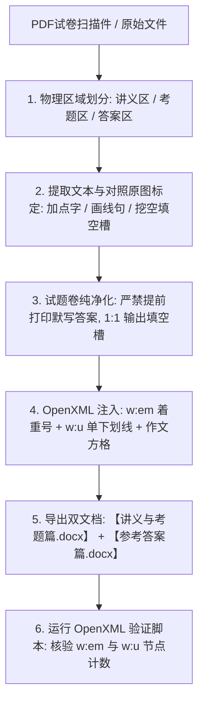

# 🛠️ PDF 试卷与教案高保真解析为 Word (.docx) 工作流规范 (v1.0)

> 本规范提炼自**中考语文**与**高考论语专题**实战，指导如何将 PDF 试题、扫描教案底稿 **100% 物理级高保真复刻**为格式精美、排版严整的 Microsoft Word (`.docx`) 文档，彻底杜绝试题泄题、漏标点、漏着重号、漏下划线等致命缺陷。

---

## 核心复刻四大铁律 (Core Principles)

### 1. 🛡️ 考题与答案物理解耦法则 (Double-Document Decoupling Rule)
- **文档一：【讲义与考题篇】（学生上课/随堂测验版）**
  - **精讲部分**：保留完整原文、译文与内容精要解读；
  - **练习部分**：**纯净无答案**！所有题干、材料画线、挖空填空槽完整保留，**严禁提前打印答案文字**；末尾必须配备符合中高考标准的答题方格（如 200 字微写作方格）。
- **文档二：【参考答案篇】（教师备课/讲评参考版）**
  - 完整收录所有小题的官方标答、得分点拆解、翻译要点、断句标记（斜线 `/`）及教师示范下水文。

---

### 2. 🚫 题卷防泄露与题型属性守护门禁 (Zero-Leakage Test Paper Rule)
- **警惕“背诵默写填空”被错误转变为“字词释义”**：
  - 中小学语文试题中常见题型：*“请在横线上填写原文，在括号内翻译该句或为加点词释义”*。
  - **横线处（默写填空）**：原卷为空白下划线 `__________`，**绝对严禁**从讲义或答案中提前将原文句子打印到考卷上！必须输出纯净的下划线留白槽（如 `{"text": "                    ", "u": True}`）；
  - **括号处（答题留白）**：括号内必须保留足够的手写答题空格，如 `（          ）`；
  - **加点字（字词考查）**：仅在考查字词释义的目标文字下方加点，绝不能在整句填空答案上错误加点。

---

### 3. ✒️ Word Native OpenXML 排版三要素原生注入规范

#### ① 下标点 / 着重号 (`<w:em w:val="dot"/>`)
在中文排版规范中，文字下方的“加点”（如加点字释义、加点成语辨析）为**着重号**。
- **底层 OpenXML 原生注入代码**：
  ```python
  from docx.oxml import parse_xml
  from docx.oxml.ns import nsdecls

  def add_dot_emphasis(run):
      """在文字下方渲染符合国家语言规范的黑色实心圆点着重号"""
      em = parse_xml(f'<w:em {nsdecls("w")} w:val="dot"/>')
      run._r.get_or_add_rPr().append(em)
  ```
- **门禁要求**：严格核对原扫描件，**原书哪几个字下有圆点，生成的 Word 中就只在哪几个字下加点**，绝不能自作主张扩大加点范围。

#### ② 下划线 (`<w:u w:val="single"/>` / `run.underline = True`)
下划线在试题中分为两大场景，必须严格区分：
1. **画线考查句（文字带下划线）**：
   - 如文言文画线句翻译（<u>诸生以时习礼其家</u>）、文言文断句画线段落（<u>上纪唐虞之际下至秦缪...</u>）；
   - 实现：`run.underline = True`，直接包裹目标考查文本。
2. **填空留白槽（空白带下划线）**：
   - 如背诵默写、短语概括、成语填空；
   - 实现：输出带有下划线样式的连续半角空格，例如 `{"text": "                    ", "u": True}`，在 Word 中渲染为一条水平笔直的填空横线。

#### ③ 标点与符号细节对齐
- **方头括号**：原书实心粗方头 `【原文】` 严禁误写为空心 `〖原文〗`；
- **标点全半角**：出处半角小括号 `(5.26)` vs 中文全角 `（5·26）` 必须 1:1 忠实原卷；
- **断句斜线**：题干中明确为“用‘/’断句”时，严禁因 OCR 误识将斜线识别为汉字“尸”。

---

### 4. 🔲 中高考微写作/作文标准答题方格规范
凡包含作文或微写作（100~800字）题目，必须使用 Word 原生表格构建精确的田字格/方格矩阵：
```python
def add_writing_grid(doc, rows=10, cols=20):
    """生成 200 字作文方格网（20字/行 x 10行）"""
    table = doc.add_table(rows=rows, cols=cols)
    table.alignment = WD_TABLE_ALIGNMENT.CENTER
    table.autofit = False
    col_w = Inches(6.8 / cols)
    for col in table.columns:
        col.width = col_w
    for r_idx, row in enumerate(table.rows):
        trPr = row._tr.get_or_add_trPr()
        # 固定行高 320 twips (16 pt)
        trPr.append(parse_xml(f'<w:trHeight {nsdecls("w")} w:val="320" w:hRule="exact"/>'))
        for c_idx, cell in enumerate(row.cells):
            cell.width = col_w
            # 浅灰边框
            cell._tc.get_or_add_tcPr().append(parse_xml(
                f'<w:tcBorders {nsdecls("w")}>'
                f'  <w:top w:val="single" w:sz="4" w:space="0" w:color="CBD5E0"/>'
                f'  <w:left w:val="single" w:sz="4" w:space="0" w:color="CBD5E0"/>'
                f'  <w:bottom w:val="single" w:sz="4" w:space="0" w:color="CBD5E0"/>'
                f'  <w:right w:val="single" w:sz="4" w:space="0" w:color="CBD5E0"/>'
                f'</w:tcBorders>'
            ))
            # 在 50、100、150、200 字行末自动输出灰色微型提示字数
            char_count = (r_idx + 1) * cols
            if c_idx == cols - 1 and char_count in [50, 100, 150, 200]:
                p = cell.paragraphs[0]
                p.alignment = WD_ALIGN_PARAGRAPH.CENTER
                r = p.add_run(str(char_count))
                r.font.name = "Calibri"
                r.font.size = Pt(7.5)
                r.font.color.rgb = RGBColor(113, 128, 150)
```

---

## 避坑指南与健壮性防护 (Gotchas & Robustness)

### 1. 扫描件 OCR 典型误识自查对照表
| OCR 误识特征字 | 原文物理真字 | 场景说明 |
| :--- | :--- | :--- |
| `《艹》` / `《轮》` | `《论语》` | 眉题与标题常见粘连 |
| `乛生` / `乛生一施亻` | `众生` / `对众生施仁爱` | 标题小字体笔画缺失 |
| `步骒` | `步骤` | 译文修饰 |
| `夕卜` | `外` | 汉字左右分家 |
| `讠L容` | `设礼容` | “礼”字断裂 |
| `用“尸断句` | `用“/”断句` | 断句斜线 `/` 误识为“尸” |

### 2. Windows 环境下 Word/WPS 独占写锁防护
- **现象**：当用户在 WPS/Word 中查看生成的 `.docx` 时，Windows 会施加只读/独占句柄，Python 执行 `doc.save()` 会直接抛出 `PermissionError: [Errno 13] Permission denied`。
- **防护策略**：
  ```python
  try:
      doc.save(target_path)
  except PermissionError:
      # 用户正在查阅中，自动降级保存为备用名，保证脚本不崩溃且产物不丢失
      alt_path = target_path.replace(".docx", "_最新修正版.docx")
      doc.save(alt_path)
  ```

---

## 标准执行流水线 (Execution Workflow)



*版本：v1.0 (PDF试卷与教案高保真解析为Word工作流) | 维护人：Antigravity Agentic Chinese Exam Team*
